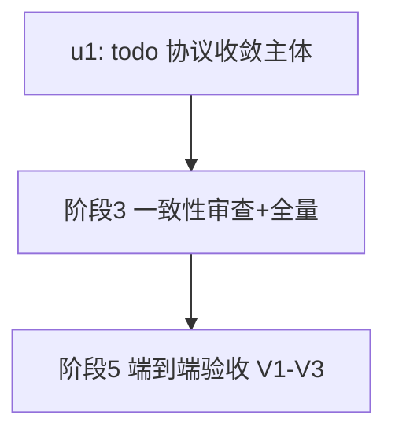

# ext-simplify-07-todo 实施计划

基线: e1a40a3de | 来源设计: docs/design/ext-simplify-07-todo.md (v2.1) | 日期: 2026-09-14

## 0 章节映射

| 内容 | 设计文档实际位置 |
|------|------------------|
| 背景/目标 | §1 背景 + §2 设计目标（4 条） |
| 终态/机制 | §4 终态（4.1 成功路径 / 4.2 错误规格终态表）+ §5 决策 D1-D4 + §6 实现文件改动地图 |
| 验收场景表 | §7（V1/V2/V3） |
| 下一层拆分 | §8（8.1 迁移路径 M1/M2 + 8.2 单元清单 u1/u2 + 8.3 待验证检查点） |
| 待验证检查点 | §8.3（D2 文案对模型重试行为 / L3 颜色 / L5 时序——L3/L5 属 u2 移交面不在本流水线） |

## 1 目标快照（逐字摘录）

> 1. **包内单一错误协议**：updateTodos 校验失败与 addTodos（model.ts:144/:150）、handleSingleUpdate（tool.ts:116-136）、handleDelete（tool.ts:155-170）同走 throw；handleBatchUpdate 不再做 error→throw 翻译。
> 2. **消灭双字段重复**：error / resultText 同一知识两次编码的局面消失；UpdateResult 收敛为成功形状 `{ updatedTodos, resultText }`（两字段必填），`resultText!` 非空断言（tool.ts:112）随之消失。
> 3. **行为零回归**：details 落盘形状、成功路径文案、四条渲染通道、steer / auto-clear / auto-GC 机制全部零变化；唯一有意文案变化 = 4 条批量校验文案去除冗余 "Error: " 前缀（见 D2）。
> 4. **low 群显式移交**：审计 low 项与四问记录遗留 low 点登记移交 code-simplify（D4 清单），不在本设计内实施。

**Out-of-scope**：M5（isGui 四分支，归 13 号设计）；审计判定保留的本质复杂度；D4 移交清单 L1-L6 的实际执行（实现阶段由 code-simplify 批量处理，不在本流水线）。

## 2 单元列表

| Unit | 职责 | 领地（精确文件路径） | 依赖 | 隔离 | 验收条款 |
|------|------|----------------------|------|------|----------|
| u1 = 设计 M1 | D1/D2/D3 主体：updateTodos 4 处 Result-error return（model.ts:208-236）改 throw（文案按 §4.2 终态表：去 "Error: " 前缀，not found 对齐 `Todo #N not found`）；UpdateResult（model.ts:189-193）收敛 `{updatedTodos, resultText}` 两必填 + 去 export；handleBatchUpdate（tool.ts:108-113）三行化删翻译与 `resultText!`；tool.ts:67-70 与 index.ts:19-20 注释改写为单一 throw 协议表述；todo.test.ts 4 个 error 用例（:223-249）改 toThrow + 新文案断言、5 处 toBeUndefined（:201/:214/:315/:322/:335）删除；ARCHITECTURE.md:158-164 错误处理段改写 | extensions/universal/todo/src/model.ts、src/tool.ts、src/index.ts、src/__tests__/todo.test.ts、ARCHITECTURE.md | 无（DAG 根） | plain | ① `pnpm --filter @zhushanwen/pi-todo test` 全绿（改写后断言覆盖 4 条新 throw 文案）；② `pnpm extensions:typecheck` 全仓绿（UpdateResult 去 export 无悬空消费）；③ grep 核验：src 生产代码无 `resultText!`、无 `error:` 字段于 UpdateResult 返回、model.ts updateTodos 区域无 `return {`（除成功尾部）；④ ARCHITECTURE.md:158-164 段含「单一 throw」表述且无「Result 对象（合法）」残留 |

u2（设计 M2 = D4 移交 L1-L6）**不在本流水线**——设计显式移交 code-simplify 批量执行（独立 commit/PR），登记为流水线外单元。

## 3 DAG 图

单节点 DAG；无并行单元。

## 4 测试与验收计划

**增量测试（u1 开发期内）**：`pnpm --filter @zhushanwen/pi-todo test`（vitest，从包目录或 --filter 均可）；`pnpm extensions:typecheck`。
**全量（阶段 3 尾）**：`pnpm extensions:typecheck && pnpm extensions:lint && pnpm extensions:test`（extensions 三连；本设计不触 runtime/renderer，不跑其全量）。
**L0 静态守卫**：pre-commit 全套（taste-lint / vue_rules / doc-symbol-drift 等，随 commit 自动执行）。

### 验收计划表（阶段 5 执行依据）

| # | 验收项（场景表行） | 方式(L0-L4) | 成本(1-10) | 收益(1-10) | 组 | 依赖 | 优化判定 |
|---|--------------------|-------------|------------|------------|----|------|----------|
| A1 | V1 真实 pi CLI：批量更新成功 + #9 not found 错误文案 + 错误后 state 完好 | L4（pi CLI 真机，bash 驱动 stdin JSONL） | 6 | 9 | 核心 | u1 committed | 操作确定可脚本化——用 bash 管道驱动 pi RPC + 日志/JSONL 断言，agent 只做判定 |
| A2 | V2 同 session resume 回放零回归 | L4 | 3 | 7 | 核心 | A1 | 与 A1 同环境同会话链合并跑（A1 收尾即 resume） |
| A3 | V3 渲染链路不变（状态行/widget 与改动前一致） | L4 | 3 | 5 | 非核心 | A1 | 与 A1 合并观察（RPC 模式下以 GUI widget 推送/无异常为准）；设计声明渲染文件零触及，负面观察即可 |

**提速结论**：可合并 2 项（A2/A3 并入 A1 同一会话链一次跑完）；可脚本化 1 项（A1 的驱动与断言用 bash+JSONL 脚本）；L0 守卫清单 = pre-commit 全套 + extensions 三连。预计验收派发 1 轮（单 agent 判定）+ 主 agent 直跑脚本。

## 5 合理偏差登记表

1. tool.ts/index.ts 注释中「见 CLAUDE.md「Tool 设计」」改为「见 docs/extensions/extension-conventions.md「Tool 设计」」——原引用是悬空引用（项目根无 CLAUDE.md），重写必然触及该句，指向真实权威源（reasonable）。
2. updateTodos 补函数头 doc comment（原无）——设计 §6「函数头注释同步」的落地形态（reasonable）。
3. error 用例断言用完整新文案（强于设计的子串匹配口径）——断言强度提升非迁就（reasonable）。

## 6 状态表

| Unit | 状态 | 轮次 | 证据指针 |
|------|------|------|----------|
| u1 | committed | 1 | commit u1-07；137 tests passed（8 files）；extensions:typecheck 绿；grep resultText!/export UpdateResult 双零 |

## 7 残留风险与变更历史

- 版本 bump（patch）不在 u1 领地：按 handoff 总原则「批次版本 bump 由 merge 阶段统一处理」，与已实施 6 份同规；实施完成后 merge 阶段以 changesets 补。
- D4 移交清单（L1-L6）与本流水线解耦，留 code-simplify 批处理；若 L1 与本设计 u1 的 steer.test.ts 触碰面重叠，以 code-simplify 批次时点为准（本设计不改 steer.test.ts）。
- 2026-09-14：计划创建（阶段 0 预检通过：四节齐全；审查证据 = .tmp/tech-design/ext-simplify-07-r2-review.md PASS 0 must-fix + 原始 review.md 1 MF 已修复闭环）。
- 2026-09-14（阶段 3）：一致性审查收敛——reasonable 8（终态表 5 行逐字落地/UpdateResult 去 export 零消费/handleBatchUpdate 三行化/测试 4+5 改写完整等）；unreasonable 1（ARCHITECTURE.md:160 同款悬空 CLAUDE.md 引用未闭环——已打回原 dev 定向修）；doc_errors 1（设计文档 V1 的 `pnpm --filter @zhushanwen/pi-todo build` 命令引用不存在 script——主 agent 已修为源码直载 `--extension extensions/universal/todo`，并记设计变更历史）。Gate A 全绿：extensions:typecheck+lint+test exit 0（26 包 4426 tests / 0 failed；session-reader 2 skipped 为存量条件守卫 describe.skipIf，非本区间引入）；todo 包 137/137。
- 2026-09-14（阶段 5）：验收 A1-A3 全 PASS（真机 pi CLI v0.85.1，源码直载 + PI_CODING_AGENT_DIR 隔离 tmp 环境；模型 mimo-v2.5-pro）。V1 四轮：add→`Added 2 todos`；批量 update→`Updated 1 todo(s)`；#9→isError 文案恰 `Todo #9 not found`（无前缀）；错误后 list 2 条第 1 条 completed（throw 先于突变实证）；JSONL 全程 0 次 error 字段=落盘形状零触及。V2：同 dir resume 后 details 回放逐条一致、N/M 一致。V3：stderr 空、状态行 ☑ 1/2 正常、GUI marker 正常；`📋 N pending` 与 `☑ N/M` 交替为 D4-L5 已登记存量（非回归）。环境适配 2 条（npm 版 todo 冲突→隔离目录；模型自发单条形态→显式 updates 数组重跑并核 JSONL 命中批量路径），零代码改动，临时产物已清理。
- 验收方式备注：V1a-d/V2/V3 由验收 subagent 执行（L4），驱动与断言脚本化；V2 的 resume 语义 = `--session <绝对路径>` 重启（rename e2e README 探针 3 背书）。
- 2026-09-14（阶段 6 终态同步）：审查四条关系全过（终态表 5 行/符号悬空引用零/状态表与现实一致/注释口径无残留），findings 2 条当轮修——MF：todo README.md:40 悬空 CLAUDE.md 引用（阶段 3 领地外残留，终态口径闭环）打回原 dev 定向修；info：本计划头部版本标签 (v2)→(v2.1) 已更正。修复后 07 流水线交付完成。
