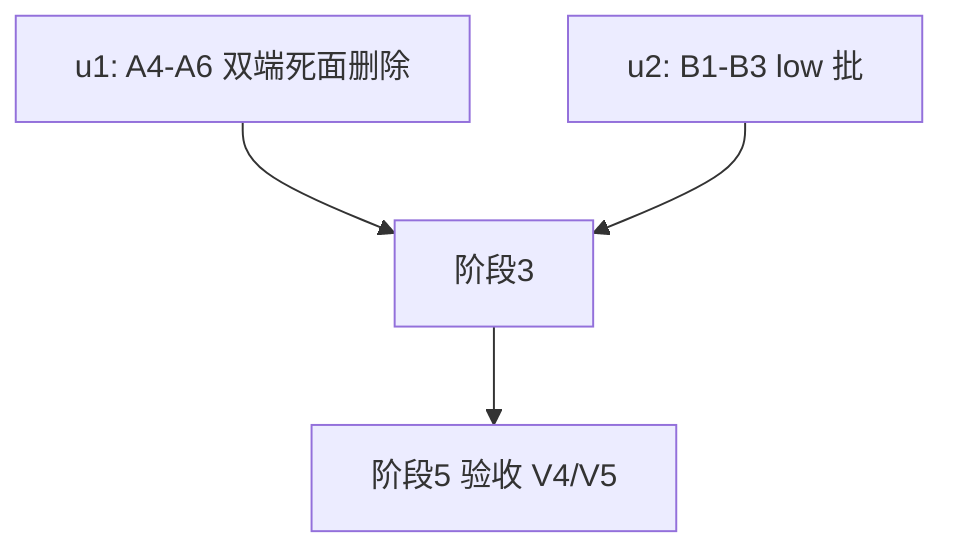

# ext-simplify-15 实施计划

基线: 175897fff | 来源设计: docs/design/ext-simplify-15-rename-session-session-manager.md (v2) | 日期: 2026-09-14

## 0 章节映射

| 内容 | 设计文档实际位置 |
|------|------------------|
| 背景/目标 | §1 背景 + §2 设计目标（v2 收敛后待执行 = 目标 2 协议死面清零 + 目标 5 low 批清零；目标 1/3/4 已由 three-modes 达成不执行） |
| 终态/机制 | §3.2（M25 死契约位置图）+ §4（契约流）+ §5（终态）+ §6.2（D2 决策）+ §6.5 执行项总表（★A4-A6 / ★B1-B3） |
| 验收场景表 | §7（V4/V5；V1-V3 已被 three-modes 取代不执行） |
| 下一层拆分 | §8（8.1 迁移路径 M2/M3 + 8.2 单元清单 u2/u3 + 8.3 待验证检查点） |
| 待验证检查点 | §8.3（V4 dev 数据目录复跑 / B3 token 增量核对） |

## 1 目标快照（逐字摘录）

> 2. **协议死面清零（待执行）**：session-manager 协议中无发送方的 4 个请求字段与无消费方的 `SessionManagerRequest` 类型双端删除；6 工具的 LLM 可见行为与 runtime 编排零变化。
> 5. **low 批清零（待执行）**：session-manager 包内 3 处 low 死面（SessionManagerToolDetails 三态联合、SessionManagerRawError 本地重复声明、description 缺依赖声明）同批清理。

**Out-of-scope**：rename-session 包全部代码与文档（已由 three-modes 吸收实施）；`auto-rename-enabled` flag 契约；`ModelSelector type:"ref"`；universal 分组迁移；`SessionService.create` 的 `modelOverride/thinkingOverride` 参数本体（GUI 侧真实消费，只删协议死字段）。

## 2 单元列表

| Unit | 职责 | 领地（精确文件路径） | 依赖 | 隔离 | 验收条款 |
|------|------|----------------------|------|------|----------|
| u1 = 设计 M2（A4-A6） | D2 双端死面删除（单 commit 闭包）：protocol types.ts 删 create.model（:37）/create.thinkingLevel（:39）/list.spawnSource（:62-63 注释+字段）/list.parentAgentSessionId（:64-65）+ 守卫 isSessionManagerCreateParams :96-97 两行 + isSessionManagerListParams :128-129 两行（连带 :124/:127 注释行更新）+ `SessionManagerRequest` 接口（:13-16）+ list guard 内对应分支；protocol index.ts:57 删 SessionManagerRequest re-export；protocol README.md:33 删该类型引用句；runtime session-manager-handler.ts handleCreate 删解构 model/thinkingLevel（:204）与透传 modelOverride/thinkingOverride（:215-216），handleList 删 spawnSource 读取（:337 wantSpawn 固化 `'agent'`，连带 :346 过滤行；:338 wantParent 恒路由上下文**保留**）；protocol 测试 validation.test.ts 删 SessionManagerRequest 导出断言（:33-36）+ session-manager.test.ts 删该类型标注（:60-70）与 create 用例 `model:'m'`/`thinkingLevel:'high'` 字段（:76-87）；两端注释同步 | packages/extension-protocol/src/extensions/session-manager/types.ts、packages/extension-protocol/src/index.ts、packages/extension-protocol/README.md、packages/extension-protocol/src/__tests__/validation.test.ts（以实际路径为准）、packages/runtime/src/transport/session-manager-handler.ts、协议包 session-manager 契约测试文件 | 无 | plain | ① `pnpm --filter @xyz-agent/extension-protocol test && pnpm --filter @xyz-agent/extension-protocol typecheck` 绿；② runtime 包 session-manager 相关测试（session-manager-e2e-probe / send-queue）绿：`pnpm --filter @xyz-agent/runtime test -- <pattern>`（以包 scripts 为准）；③ grep 零残留：types.ts 无 `SessionManagerRequest`/`model?:`/`thinkingLevel?:`，请求侧无 `spawnSource?`/`parentAgentSessionId?`（**响应侧 SessionManagerSessionSummary :171-172 两字段必须保留**）；handler 无 `modelOverride`/`thinkingOverride`；④ 全仓 `pnpm extensions:typecheck` 绿（session-manager extension 不 import 被删类型，零影响证实） |
| u2 = 设计 M3（B1-B3） | session-manager low 批：B1 删 SessionManagerToolDetails 三态联合（index.ts:60-64）与三处构造（:112/:130/:135）——`details: undefined` 形态（pi AgentToolResult.details 必填，直接删键 TS2739），executeTool 返回类型（:106）同步收窄为不含 details 或 `details: undefined`；tool-error-handling.test.ts details 断言（:66/:79）删。B2 删本地 SessionManagerRawError（:53-58），改 import protocol `SessionManagerErrorResult`（:5 已 import 该包）；:124-125 两处引用同步。B3 六个 description（:182/:191/:200/:209/:218/:227）统一追加「Requires the xyz-agent desktop runtime; standalone pi CLI will time out.」 | extensions/universal/session-manager/src/index.ts、extensions/universal/session-manager/src/__tests__/tool-error-handling.test.ts | 无（与 u1 无文件交集；B2 import 的 SessionManagerErrorResult 不在 u1 删除面） | plain | ① `pnpm --filter @zhushanwen/pi-session-manager test` 绿；② grep 零残留：包内无 `SessionManagerToolDetails`/`SessionManagerRawError`；③ 6 个 description 均含依赖声明句；④ `pnpm extensions:typecheck` 全仓绿 |

## 3 DAG 图

u1/u2 无依赖可并行（领地互斥）；本流水线串行窗口内按 u1→u2 顺序派发（保守，避免 typecheck 中间态互扰）。

## 4 测试与验收计划

**增量**：u1 = protocol 包 test+typecheck、runtime session-manager 测试；u2 = session-manager 包 test。**全量（阶段 3 尾）**：`pnpm extensions:typecheck && pnpm extensions:lint && pnpm extensions:test` + `pnpm --filter @xyz-agent/runtime test`（runtime 全量，死面删除触 runtime）。
**L0**：pre-commit 全套 + `node scripts/check-extension-dependencies.mjs`（dependency 登记校验）。

### 验收计划表

| # | 验收项（场景表行） | 方式(L0-L4) | 成本(1-10) | 收益(1-10) | 组 | 依赖 | 优化判定 |
|---|--------------------|-------------|------------|------------|----|------|----------|
| A1 | V5a runtime 既有 session-manager-e2e-probe / send-queue 测试全绿（协议链回归） | L1/L2（主 agent 直跑） | 2 | 8 | 核心 | u1 committed | 可脚本化——命令直跑，无需 agent |
| A2 | V4 桌面真实调用链：agent 调 create_managed_session（带 label）→ list_my_sessions → abort_session | L4（pnpm dev + browser-automation） | 8 | 9 | 核心 | A1 | 需判断力+真机；browser-automation 驱动降人工 |
| A3 | V5b GUI 负面：get_session_status 指向不归属 session 返回 not_found | L4 | 4 | 6 | 非核心 | A2 | 与 A2 同环境同会话链合并跑 |

**提速结论**：可降级 1 项（A1 从 agent 验收降为主 agent 直跑）；可合并 1 项（A3 并入 A2 同环境）；L0 守卫 = pre-commit 全套 + dependency 登记校验。预计验收派发 1 轮。

## 5 合理偏差登记表

1. session-manager-e2e-probe.test.ts 加入改动面：其 :211-212 断言 modelOverride/thinkingOverride 透传，handler 删除后必红；同批最小修改（删死字段断言），未发现隐性发送方（reasonable）。
2. list 守卫落地为 `type ... = Record<string, never>`（空 interface 触 no-empty-object-type，禁 disable 规则）——比空 interface 更强（结构性拒绝任何请求字段），设计未指定该细节（reasonable）。
3. session-manager.test.ts u9 防漂移形状用例改内联类型标注，不复活被删类型（reasonable）。
4. session-manager-handler.test.ts 防伪造用例保留 spawnSource/parentAgentSessionId 字面量 params（守卫不拒绝未知字段，「服务端固化过滤」语义独立于死字段），测试绿（reasonable）。
5. 领地外残留（审查登记）：extension 包 index.ts:75 注释引用 SessionManagerRequest 字样 → 并入 u2 领地清理；extension README.md:8 同款 → 并入 u2 领地（本次计划扩展，登记）。

## 6 状态表

| Unit | 状态 | 轮次 | 证据指针 |
|------|------|------|----------|
| u1 | committed | 1 | protocol 102/102 + handler 32/32 + send-queue 17/17（transport）+18/18（含 equivalence e2e 合计）+ handler 探针 A1-A6/A9 PASS（cw-acceptance-markers-reporter）+ extensions:typecheck 绿 |
| u2 | committed | 1 | session-manager 38/38 + extensions:typecheck 绿；grep 双零 + 6 description + details:undefined×4 |

## 7 残留风险与变更历史

- rename-session 侧 A1-A3/C1/C2/C3 已由 three-modes 实施/关闭，不在本流水线（设计状态框）。
- V4 的 GUI 实测依赖 `pnpm dev` 桌面端 + agent 真实调用 session-manager 工具；dev 实例按 AGENTS.md 用 `XYZ_DEV_BACKGROUND=1` + dev-instance 装配器端口派生。
- 版本 bump（session-manager patch / extension-protocol patch）归 merge 阶段 changesets，不在单元领地。
- 2026-09-14：计划创建（阶段 0 预检通过：待执行四节齐全；审查证据 = .tmp/tech-design/ext-simplify-15-r2-review.md PASS 0 must-fix + 原始 review.md 2 MF 已修复闭环）。
- 2026-09-14（u2 补充）：B1 形态裁决 = 显式 `details: undefined` 键（省略形态经 pi 实装类型核实必 TS2739——registerTool 泛型自 execute 返回值推断 TDetails，缺键落 unknown 缺属性）；用例标题随断言删除同步去「details kind=ok」悬空描述。
- 2026-09-14（阶段 3）：一致性审查收敛——unreasonable 0；reasonable 10（死面 5 行逐 hunk 核实全删/响应侧字段保留/wantParent+安全注释保留/单 commit 双端闭包等，均与登记偏差一致）；doc_errors 2（证据口径：send-queue 18 为两文件合计单文件实为 17；「A1-A9」实为 handler 探针 A1-A6/A9 共 7 项，A7/A8 从未定义——状态表已按可复现口径修正，6d73d3399 commit message 同款措辞为既成事实不改写，以本表为准）。Gate A 全绿：extensions:typecheck+lint+test（26 组 4028/4028）+ protocol 102 + runtime session-manager 系列 64/64；绕过扫描零命中（无 SKIP/test.skip/eslint-disable）。
- 阶段 5 补强（审查 verifiability 提示）：V4 场景 ②「list 只含本 agent 子 session」需构造非本 agent 的对照 session（GUI 手动创建）方有证伪力——验收程序已含此步。
- 2026-09-14（阶段 5）：V4/V5 桌面真机全 PASS（XYZ_DEV_BACKGROUND=1 pnpm dev，CDP 9473，mimo-v2.5-pro，Playwright 驱动）。V4-① create_managed_session 返回 sessionId + 侧栏子 session 出现；V4-② list_my_sessions 唯一条目为子 session（spawnSource=agent/parent=主会话），主会话与对照普通会话均不出现（对照构造补强，过滤语义有证伪力）；V4-③ abort {success:true} + 补强场景（带 prompt 活跃子 session）session_end sidecar 落盘 outcome:stopped；get_session_status 返回 idle 为运行态投影设计内（session-summary.ts:28 概念域 active/idle，与被删面正交）。V5 负面：不归属 session 返回 not_found（不可见=不存在保持）；V5a 测试 64/64 已由阶段 3 记录。全程无守卫/回写异常；dev 进程树精确终止、临时目录清理、零 git 写操作。
- 2026-09-14（阶段 6 终态同步）：审查四条关系过——代码终态与设计逐点吻合、已删三符号零残留（剩余命中均为历史口径或同名异物 onSessionManagerRequest 回调族）、状态表实跑复核属实。findings 9 must-fix doc_errors（设计文档「待执行→已实施」终态回写，主 agent 已批量修订为 v2.2）+ 2 suggestion（B3 token 核对记录——已补本条：六工具 description 各 +1 句 13 词固定文案，增量确定性极小 <100 token/会话；孤儿 JSDoc index.ts:57——u2 dev 已删，38/38 绿）。修复后 15 流水线交付完成。
