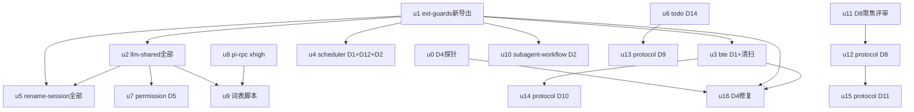

# ext-simplify-17-shared-extraction 实施计划

基线: 74dc89736（本计划 commit hash） | 来源设计: docs/architecture/ext-simplify-17-shared-extraction.md（v6，双审查双 PASS 0 must-fix） | 日期: 2026-09-14

## 0 章节映射

| 内容 | 本文实际位置 |
|------|--------------|
| 背景/目标 | §1 背景与目标（含非目标） |
| 终态/机制 | §3 方案：§3.1 桶1 ext-guards（D1-D4）/ §3.2 桶2 llm-shared（D5-D7）/ §3.3 桶3 extension-protocol（D8-D11）/ §3.4 桶4 包内收敛（D12-D14）；现状证据 §2；负面清单 §4 |
| 验收场景表 | §5 验收：§5.1 V1-V5 确定性检查 / §5.2 V6-V8 真机验收 / §5.3 三视角 |
| 下一层拆分 | §6 实施拆分与分支归属（批次 1-4 表 + 并行约束 + changeset 登记） |
| 待验证检查点 | §3.1 D4 实施前置探针（可证伪）+ §5.2 V6；D8 聚焦评审前置（§6 批次 3） |

**审查证据链**（0.3 门）：`.tmp/tech-design/` 报告本体已清理（gitignore 易失）；双 PASS 0 must-fix 由三处 git 追踪记录互证——设计文档头状态节（v6 终态，主审 R2 PASS + 影响面 v5 PASS，完整 r1/r2/r3 轨迹）、`docs/todo/ext-simplify/ext-simplify-index.md` 流程状态表（17 号行 + 审查行）、commit f978dbe19 message。判定通过。

**合流后基线校准**（主 agent 20260914 逐点 grep 核实，设计写于 A/B 分支分叉期）：

1. **落点漂移**：设计 P1-a「spawn-args.ts:24 六值白名单」实际已随 U1 归并迁至 `packages/pi-rpc/src/types.ts:37`（`THINKING_LEVELS` 六值缺 `xhigh`，漂移实锤仍在，D5 配套落点更新为 pi-rpc；`asThinkingLevel` 自 pi-rpc re-export）。
2. **行号整体漂移约 +7**（plugin-bridge `isRecord` :58→:65、守卫族 :63→:70 区、`callBridge` :106→:118 等）——**实施一律以符号名 grep 定位，设计行号仅作参考**。
3. `extension-dependencies.json` 在仓库根（非 bte 包内）；bte 条目 reason 含 `src/reaper.ts`/`src/kill-tree.ts` 悬空引用（13 号已删该文件），清扫落点 = 根 json。
4. 数量锚点全部吻合：scheduler `instanceof Error ?` 7 处、bte 13 处、llm-shared 6 处；isRecord 副本位与设计一致（bte 侧 `isRecordedPidStillOriginal` 撞名项确认非副本）；`THINKING_LEVELS` 副本 rename-session pure.ts + permission config.ts；protocol `pending-entries.ts` 已在（B 基线合入）。
5. **worktree 决策**：设计 §6 group-b/A 侧分工因两分支合入 dev-0.9.21 失效（index 已记录裁决「可直接在 dev 集成分支实施」）——全部单元在当前 worktree plain 实施，不重建 worktree、不切分支。

## 1 目标快照（逐字摘录设计 §1）

> ext-simplify 16 份设计（01-16）消解的是「包内过度设计」；本设计消解的是另一轴：**跨包重复——多个 extension 各自持有同构逻辑，未收敛进共享层**。两路扫描共产出约 20 个候选，经核实分层后：
> - 4 条有**实测漂移实证**（重复已经产生过真实 bug 或判据失效）；
> - 5 条同构确凿、收益明确；
> - 其余为包内收敛项或不抽取项（负面清单，§3.4/§4）。
>
> 目标：把前两类收敛进共享层三归宿（ext-guards / llm-shared / extension-protocol）+ 各包包内收敛，全程行为等价（显式列出的 3 处行为微变除外，见 §3 各 D 项「行为变化」标注）。

**非目标（Out-of-scope，逐字摘录）**：

> - 全域 `instanceof Error ? err.message : String(err)` 样板的全量采用（实测 106 处/60 文件，含 packages/ 层）——本批只采用 scheduler / bte / llm-shared 自身，其余登记为各包后续改造顺带议题。
> - TUI 新包（`pi-tui-kit`）立项——双列合并内核量级为每包约 10 行，处于可做可不做边际，登记缓行（§4 附表）。
> - scheduler importer.ts 退役——一次性迁移通道（0.1.1 store → append-only）有真实老用户迁移义务，退役条件是产品决策，另行裁决。
> - 消除 ext-guards/extension-logger 等既有共享包的 API 面——本设计只做「新增导出 + 消费方迁移」，不改既有导出签名。

**用户裁决前提**（设计文档头）：bte subagent 进程判据重锚定**预授权**（探针证实即修，证伪只记录）；isRecord 全仓归一**做**，随批次顺带；先统一设计后实施（本计划即实施）。

**3 处行为微变**（各自独立成 commit，便于单独回退）：① session-manager 非 JSON 回包 → isError + 留痕（D8）；② `:xhigh` 后缀接受（D5 配套）；③ bte 判据重锚 XYZ_AGENT_SUBAGENT（D4，预授权范围）。

## 2 单元列表

| Unit | 职责（设计 D 项 / 批次） | 领地（精确文件路径） | 依赖 | 隔离 | 验收条款 |
|------|------------------------|---------------------|------|------|----------|
| u0 | D4 前置探针（批次 4 门）：真机引擎 subagent 任务 dump env，断言 `XYZ_AGENT_SUBAGENT=1` 存在且 `PI_SUBAGENT_ROOT_SESSION_ID`/`PI_SUBAGENT_SELF_RECORD_ID` 不存在；反向断言主进程 background 正常；报告登记 D4 ③④ 两既有失效读者发现 | 无编码领地；报告落 `.tmp/dev-flow/ext-simplify-17-d4-probe.md` | - | plain | 报告含双侧 env 断言结论（证实/证伪明确二值）+ ③ record-access 防线失效 + ④ session-lifecycle identity entry 恒不写 两发现登记；证伪则 u16 取消 |
| u1 | ext-guards 新导出（批次 1 D3 + 批次 2 D2 的共享侧）：`isRecord`（排数组严版）+ `isEnoentError`（scheduler 严版：`instanceof Error` + `'code' in err` + `code === 'ENOENT'`）+ V2 单测 | `extensions/shared/ext-guards/src/index.ts` + `extensions/shared/ext-guards/src/__tests__/` | - | plain | ext-guards vitest 绿；V2 钉值（isRecord 排数组断言 / isEnoentError 三分支）；保持零依赖 |
| u2 | llm-shared 全部（批次 1 D1 自身 6 处 + 批次 2 D5/D6/D7 新导出）：`toErrorMessage` 6 处替换 + package.json/根 json 增 ext-guards 依赖；D5 `THINKING_LEVELS` 七值 + `isThinkingLevel`；D6 `normalizeModelSelector` 落 resolve.ts；D7 `joinTextBlocks` 落 call.ts + `extractText` 委托重构（trim 契约不变）+ V2 单测 | `extensions/shared/llm-shared/src/{index,call,config,resolve}.ts`（或新增 thinking.ts）+ `__tests__/` + `package.json` + `extension-dependencies.json` + `pnpm-lock.yaml` | u1 | plain | `grep "instanceof Error ? " extensions/shared/llm-shared/src/` = 0（排除测试）；V2 七值钉值单测（含 xhigh）+ normalizeModelSelector + joinTextBlocks 单测绿；llm-shared vitest 绿 |
| u3 | bte（批次 1 D1）：13 处 `toErrorMessage` 替换 + package.json 增 ext-guards 依赖 + 根 json bte 条目登记 + 悬空引用清扫（reaper.ts/kill-tree.ts/withFileLock）+ lockfile 随动 | `extensions/universal/base-tool-enhance/src/**` + `package.json` + `extension-dependencies.json` + `pnpm-lock.yaml` | u1 | plain | `grep "instanceof Error ? " .../base-tool-enhance/src/` = 0（排除测试）；`node scripts/check-extension-dependencies.mjs` 过；bte vitest 绿 |
| u4 | scheduler（批次 1 D1 7 处 + D12 B1-B7 + 批次 2 D2 消费侧）：7 处替换（index.ts 两处 `throw new Error(\`Error: ${...}\`)` 等价换 `Error: ${toErrorMessage(err)}`）+ B1 字面量常量 / B2 双转换器 / B3 disableForInvalidCron / B4 history helper / B5 type alias ×2 / B6 悬空注释 / B7 死 TODO + importer.ts isEnoentError 改 import | `extensions/universal/scheduler/src/{runtime,replay,importer,service,index,types,backend,tool}.ts` | u1 | plain | `grep "instanceof Error ? " .../scheduler/src/` = 0（排除测试）；`grep "function isEnoentError" .../scheduler/src/` = 0；scheduler vitest 绿 |
| u5 | rename-session 全部（批次 1 D13 + 批次 2 D5/D6/D7 消费 + D3 延后三消费点）：`truncateCodePoints` 包内合并（纯.ts:285 / llm.ts:123 / llm.ts:202，previewText 300/200/100 数值与 e2e rebuildPreview 双维护契约行为一致）+ THINKING_LEVELS/isThinkingLevel 删改 import + normalizeModelSelector 删本地改 import + llm.ts isRecord+joinTextBlocks 副本删（joinTextBlocks 改 import llm-shared）+ 块外 isRecord 三消费点改 import ext-guards 严版 + 依赖登记 | `extensions/universal/rename-session/src/{pure,llm}.ts` + `package.json` + `extension-dependencies.json` + `pnpm-lock.yaml` | u1, u2 | plain | `grep "function isRecord\|function joinTextBlocks\|THINKING_LEVELS" .../rename-session/src/` = 0；rename-session vitest 绿（含截断行为既有用例）；依赖新增含 ext-guards + llm-shared 声明 |
| u6 | todo（批次 1 D14）：`fixedWidth` + `ELLIPSIS_MIN_WIDTH` 删除，换 pi-tui `truncateToWidth(text, width, "...", true)`（pad 参数形态，ask-user question-view.ts 已有生产先例） | `extensions/universal/todo/src/render.ts` | - | plain | `grep "fixedWidth\|ELLIPSIS_MIN_WIDTH" .../todo/src/` = 0；todo vitest 绿（渲染宽度既有用例不回归） |
| u7 | permission（批次 2 D5 消费）：config.ts `THINKING_LEVELS`+`isThinkingLevel` 删改 import llm-shared | `extensions/universal/permission/src/config.ts` | u2 | plain | `grep "THINKING_LEVELS" .../permission/src/` = 0；permission vitest 绿 |
| u8 | pi-rpc xhigh（批次 2 D5 配套，落点漂移见 §0 校准）：`packages/pi-rpc/src/types.ts` THINKING_LEVELS 六值补 `xhigh` + V5 钉值单测（七值 + `:xhigh` 后缀从降级变接受） | `packages/pi-rpc/src/types.ts` + 对应测试文件 | - | plain | V5 单测绿（六值→七值断言 + asThinkingLevel("xhigh") 非 undefined）；pi-rpc 既有测试不回归 |
| u9 | 词表比对脚本（批次 2）：从 pi-ai dist `types.d.ts` 提取 `ModelThinkingLevel` 联合成员与 llm-shared `THINKING_LEVELS` 比对，不一致非零退出；接入 pre-commit 按路径触发链（参照 check-pi-sync.mjs 接入形态）。若接入成本明显超预期 → 降级为设计文档如实登记（§5 合理偏差表） | `scripts/check-thinking-levels.mjs`（新）+ pre-commit 接入点 | u2, u8 | plain | 脚本自身跑过 exit 0；人为删一词表成员时 exit 非 0（探针自测）；pre-commit 触发路径正确或降级登记完成 |
| u10 | subagent-workflow（批次 2 D2 消费）：`src/jsonl-run-store.ts` 宽版 isEnoentError 删本地改 import ext-guards 严版（收严无真实场景损失，设计已论证） | `extensions/universal/subagent-workflow/src/jsonl-run-store.ts`（+ 依赖文件如缺 ext-guards 依赖则登记） | u1 | plain | `grep "function isEnoentError" .../subagent-workflow/src/` = 0；subagent-workflow vitest 绿 |
| u11 | D8 聚焦评审（批次 3 前置，设计 §6 要求）：对设计 §3.3 D8 节 API 形态（MarkerRpcResult/callMarkerRpc/cancelled-timeout 判别/timeout 字段/错误形状单源化/三消费方迁移/行为微变）做聚焦对抗评审 | 报告落 `.tmp/tech-design/design-review-ext-simplify-17-d8-focus.md` | - | plain | 报告 must-fix==0 才放行 u12；有 must-fix → 主 agent 修设计文档后复审 |
| u12 | protocol D8（批次 3 契约新增）：core 新增 `select-rpc.ts`（MarkerRpcResult + callMarkerRpc，signal.aborted 反推 cancelled）+ `GuiContext.ui.select` 签名补 timeout + 错误回包形状单源化（ChannelErrorResult + isChannelErrorResult + formatChannelErrorText；SessionManagerErrorResult/BridgeErrorResponse 改 type alias，public API 零破坏）+ 迁移 plugin-bridge callBridge / session-manager callSessionManager（行为微变①：非 JSON 回包 → isError + 留痕）/ inflight-reporter 发送半边 + V4 单测 | `packages/extension-protocol/src/core/**` + `packages/extension-protocol/src/extensions/{session-manager,plugin-bridge}/**` + `extensions/universal/session-manager/src/index.ts` + `extensions/taiji/plugin-bridge/src/index.ts` + `extensions/universal/subagent-workflow/src/host/inflight-reporter.ts` | u11 | plain | protocol 单测绿（V4：callMarkerRpc 三态/非 JSON 留痕用例）；session-manager/plugin-bridge/subagent-workflow vitest 绿；runtime re-export 消费方 typecheck 绿（V4）；行为微变①用例单测锚定 |
| u13 | protocol D9（批次 3）：`firstContentText` 新导出（core 或 core/helpers）+ todo render.ts:157 / subagent-workflow format.ts renderTextFallback / plan tool.ts 内联副本 三包迁移删本地 + plan 新增 protocol 依赖（package.json + 根 json + lockfile，守卫规则 3 豁免不拦截） | `packages/extension-protocol/src/core/**` + `extensions/universal/todo/src/render.ts` + `extensions/universal/subagent-workflow/src/interface/format.ts` + `extensions/universal/plan/src/tool.ts` + plan `package.json` + `extension-dependencies.json` + `pnpm-lock.yaml` | u6（todo render.ts 同文件串行） | plain | `grep -r "function firstContentText\|function renderTextFallback" extensions/universal/{todo,subagent-workflow,plan}/src/` = 0；三包 vitest 绿；plan 依赖闭包含 protocol |
| u14 | protocol D10（批次 3）：pending-entries.ts 新增 `mapReasonToStatus` 导出（string 签名，PendingStatus 留 pending-notifications）+ pending-notifications 权威实现改委托导出 + bte pending-reconcile.ts:93 `status: pendingReason` identity 假设改 `mapReasonToStatus(pendingReason)` | `packages/extension-protocol/src/pending-entries.ts` + `extensions/universal/pending-notifications/src/index.ts` + `extensions/universal/base-tool-enhance/src/background/pending-reconcile.ts` | u3（bte 同包串行） | plain | grep identity `status: pendingReason` = 0；单测锚定 bte 写出 entry status 与 pending-notifications 映射一致（消 identity 假设）；两包 vitest 绿 |
| u15 | protocol D11（批次 3）：plugin-bridge 五守卫（isBridgeErrorResponse/isBridgeToolExecuteResponse/isBridgeSyncPayload/isBridgeInterceptResponse/isSyncedTool）零改动搬 `packages/extension-protocol/src/extensions/plugin-bridge/guards.ts` + plugin-bridge index.ts 改 import。范围排除：isInjectedMessage / isToolNotFound 不搬 | `packages/extension-protocol/src/extensions/plugin-bridge/**` + `extensions/taiji/plugin-bridge/src/index.ts` | u12（plugin-bridge index.ts 同文件串行） | plain | 五函数在 protocol 有导出 + plugin-bridge grep `function isBridge` = 0；plugin-bridge vitest 绿；守卫族函数体 diff 零改动（搬移非重写） |
| u16 | D4 修复（批次 4，u0 证实后；证伪则取消）：ext-guards 新增 `isSubagentProcess()` + `SUBAGENT_MARKER` 导出 + bte subagent-guard.ts 判据改锚 `XYZ_AGENT_SUBAGENT === "1"` 改 import + smart-context pure.ts 单键版同谓词收敛 + V6 修后回归（含反向断言） | `extensions/shared/ext-guards/src/index.ts` + `extensions/universal/base-tool-enhance/src/background/subagent-guard.ts` + `extensions/universal/smart-context/src/pure.ts` + 对应测试 | u0（证实）, u1, u3（bte 同包串行） | plain | 判据单测（标记命中/非标记不命中）；V6 回归：subagent 内 background:true 触发 D14 降级 + 主进程 background 正常；SDK env.ts:70 注释清扫（批次 2 已列，若 u16 取消则由 u9 波次顺带完成——见状态表） |

**领地交集声明**（有意为之，串行化解）：todo render.ts（u6→u13）；plugin-bridge index.ts（u12→u15）；bte src（u3→u14→u16）；rename-session src（u5 单元内自洽）。

## 3 DAG 图

独立起点：u0 / u1 / u6 / u8 / u11。**并发上限 3（用户 20260914 指令，覆盖全局 ≤5 默认）**。波次示例：波1 = u0,u1,u11 → 补位（任一完成即发下一个就绪单元）：u6,u8 → u2,u3,u4 → u10,u13,u5 → u7,u9,u12 → u14,u15,u16。调度原则：优先关键路径（u1→u2→u5/u7/u9 链）。

## 4 测试与验收计划

测试命令（AGENTS.md 真实读取）：`pnpm extensions:typecheck && pnpm extensions:lint && pnpm extensions:test`（extensions 三连，增量按包进各包目录跑 vitest）；pi-rpc 单测按包目录；全量 = 阶段 3 尾 26 包套件（Gate A 并入阶段 3）。测试分层遵循 `docs/TEST-STRATEGY.md`；三视角细则见设计 §5.3（构建者白盒单测 / 使用者黑盒真机 / 观察者形态——迁移后包的 index barrel 不再出现已删本地符号）。

### 验收计划表（设计 §5 逐行编译）

| # | 验收项（设计场景行） | 方式 | 成本 | 收益 | 组 | 依赖 | 优化判定 |
|---|--------------------|------|------|------|----|------|----------|
| V1 | 采用批零残留（D1/D3/D9/D13/D14 grep = 0） | L0 | 1 | 8 | 核心 | u3/u4/u5/u6/u13 | 主 agent 直跑 grep，零派发 |
| V2 | 新导出钉值（THINKING_LEVELS 七值含 xhigh / isRecord 排数组 / isEnoentError 三分支） | L1 | 2 | 9 | 核心 | u1/u2 | dev 自跑并入单元验收 |
| V3 | extensions 三连绿 | L0 | 3 | 9 | 核心 | 全部编码单元 | 主 agent 直跑；增量随单元、全量入阶段 3 |
| V4 | protocol 契约（D8/D9/D10/D11 导出单测 + runtime re-export typecheck） | L1 | 3 | 8 | 核心 | u12-u15 | dev 自跑 + 主 agent typecheck 复核 |
| V5 | xhigh 七值钉值 + `:xhigh` 接受用例 | L1 | 2 | 7 | 核心 | u8 | dev 自跑 |
| V6 | D4 探针 + 修后回归（subagent 内 background 降级恢复 + 主进程反向不误命中） | L3 | 7 | 9 | 核心 | u0 → u16 | 真机引擎任务脚本化（env dump 即断言）；探针与回归同剧本复用 |
| V7 | D8 双通道真机（session-manager raw 回包 + plugin-bridge JSON 回包 + 构造非 JSON 断言 isError 留痕） | L3 | 7 | 8 | 核心 | u12 | pi CLI 真机；dev patch runtime 注入畸形串，验收后还原 |
| V8 | rename-session 真机改名（thinking level 传递 + 模型恢复路径） | L3 | 5 | 6 | 非核心 | u5 | pi CLI 真机（AGENTS.md 本地实测规范 `-ne` 必带） |

**提速结论 [MANDATORY]**：可降级 0 项（V6/V7/V8 均需真机判断，不可降级）；可合并 2 项（V6 探针与 u16 修后回归同剧本；V4 typecheck 并入 u12-u15 单元验收）；可脚本化 2 项（V1 纯 grep、V6 env dump 断言）；L0 静态守卫清单——`pnpm extensions:typecheck/lint/test` 三连、`node scripts/check-extension-dependencies.mjs`、`node scripts/check-doc-symbol-drift.mjs`（docs 联动时）、`node scripts/check-pi-sync.mjs`（pi 锚点，u8 触发）、`node scripts/check-thinking-levels.mjs`（u9 新增）。预计派发轮次：编码 14 单元按波次压缩至 4 波 + 评审 1 + 真机 3（V6 探针先行、V6 回归/V7/V8 阶段 5）+ 一致性审查 1 ≈ 全程 8-10 次派发。

### changeset 登记（设计 §6）

批次收尾随批提 changeset：ext-guards / llm-shared / extension-protocol 新增导出 = **minor**（llm-shared 新增 ext-guards runtime 依赖，独立 pi 用户安装闭包扩大，body 须说明）；bte / plan / rename-session 依赖新增随包提（初判 patch，type 最终人工定）。三批 changeset 分别在 u4+u3+u2（批次 1 面）、u9 尾（批次 2 面）、u15 尾（批次 3 面）落 `.changeset/`。

## 5 合理偏差登记表

| 偏差 | 定性 | 处置 |
|------|------|------|
| spawn-args 白名单落点漂移至 packages/pi-rpc/src/types.ts:39（U1 归并所致，设计写于分叉期） | 合理（设计 §0 基线声明预见行号漂移；漂移实锤六值缺 xhigh 在合流基线复核实锤不变） | D5 配套（原 spawn-args 项）落点更新为 pi-rpc（u8）；阶段 6 design-code-sync 回写设计文档（已回写，R1 F3） |
| extension-dependencies.json 位置 = 仓库根（设计语境「bte 的 json」易读作包内文件） | 合理（文件本就统一在根，非漂移） | u3/u5/u13 领地已按根 json 写明 |
| 设计 §6 group-b/A 侧批次分工失效（两分支已合入 dev-0.9.21） | 合理（index 已记录裁决） | 全单元当前 worktree 实施；批次语义仅保留于 changeset 登记节奏 |
| D13 truncateCodePoints 签名 3 参 → 5 参（u5 实施发现） | 合理（previewText 300/200/100 是 15 号 §6.4 D4 裁决的三个独立契约数字，判定阈值 ≠ head 长度，3 参无法零变化覆盖双段形态；head/keepTail 以可选默认参表达，单段调用点形态不变，e2e 双维护契约逐字节一致已验证） | 阶段 6 design-code-sync 回写设计 D13 示意签名 |

## 6 状态表

| Unit | 状态 | 轮次 | 证据指针 |
|------|------|------|----------|
| u0 | committed | 1 | 双断言证实（报告 .tmp/dev-flow/ext-simplify-17-d4-probe.md）；u16 门禁通过 |
| u1 | committed | 1 | 6a00b2f28（32 用例绿 + 全量 typecheck 过） |
| u2 | committed | 1 | 1bc1f6fc4（89 用例绿；llm-shared 成根 json 首个 shared 组主体条目——机器守卫放行，保留；subagent-core 侧 THINKING_ORDER 互指注释已随 057696113 补齐 model-ref.ts:41-48） |
| u3 | committed | 1 | 3dad19674（233 用例绿） |
| u4 | committed | 1 | 8883a1a9a（216 用例绿，B2 补严格键集合测试） |
| u5 | committed | 1 | 298f05901（203 用例绿 + 42 探针逐字节一致；truncateCodePoints 5 参偏差已登记 §5） |
| u6 | committed | 2 | e62a11890（方案 A 保行为 G3 组合，140 用例绿 + 180 E2E 可见一致；设计 D14 勘误同批——等价断言证伪核正，4+6 点形态测试锁定） |
| u7 | committed | 1 | 73918cadc（579 用例绿，纯去重无漂移） |
| u8 | committed | 2 | 385aff694（86 用例绿，全链自动打通论证） |
| u9 | committed | 1 | 2f6e2a33b（守卫脚本 + pre-commit 接入 + 破坏性自测过，未降级；设计 D5 补记同批） |
| u10 | committed | 1 | f79f54343（943 用例绿，单文件） |
| u11 | committed | 1 | NEEDS-FIX 2 MF + 4 S → 设计文档 v7 全修闭合（主 agent 核实事实锚点：callBridge :123 门控 / types.ts sessionId? 活构造均属实）；u12 放行 |
| u12 | committed | 1 | d997a7fa4（202+41+34+943 用例绿；行为微变①有单测锚定；runtime typecheck 绿；门控保留 :127） |
| u13 | committed | 1 | fbe6f9f09（与 u14 合并 commit：barrel 同文件两行分属两单元，文件级颗粒度；209+140+943+82 用例绿；审查核正：renderTextFallback 保留薄委托形态是正确终态——签名真差异 content 可选，内核已单源，原验收条款过度收紧） |
| u14 | committed | 1 | fbe6f9f09（protocol 16 + bte 16 + pending-notifications 34 用例绿；identity 假设消除） |
| u15 | committed | 1 | 69c726400（protocol 214 + plugin-bridge 34 用例绿；审查核正证据行：**四函数**逐 token diff 空 + isBridgeErrorResponse 按 D8 单源化改委托 isChannelErrorResult（语义逐条件等价），原「五函数逐 token diff 空」表述失实） |
| u16 | committed | 1 | 9a6c2c86b（D4 重锚定 + V6 真机回归三项全过，行为微变③独立 commit；ext-guards 38 用例绿） |

## 7 残留风险与变更历史

**阶段 3 审查发现台账**（聚合处理区）：

- 区 1 unreasonable 1 条（低）：D5 互指注释 subagent-core 侧（model-ref.ts THINKING_ORDER）未落地——与 u2 状态行「待收尾补」同一项；设计外语义：词表守卫 THINKING_ORDER 第三副本纳入 → 登记后续议题不扩本批面。
- 区 1 doc_errors 3 条：D11「五函数零改动」→「四函数零改动 + isBridgeErrorResponse 委托 isChannelErrorResult（D8 吸收）」；D5 配套段落点补记（与 §5 偏差表重合，阶段 6 回写项确认）；impl-plan u15 证据行「逐 token diff 空」→ 修正为「四函数逐 token diff 空 + 一函数委托」。
- 区 3 unreasonable 3 条：①（高）changeset 漏 session-manager（行为微变①载体）——补 patch + body；②（低-中）changeset 漏 7 个行为等价收敛包（todo/scheduler/permission/smart-context/pending-notifications/subagent-workflow/plugin-bridge）——按 group-a 先例补列；③（低）台账滞后——已被 c79a53dca 覆盖（reviewer 读的是派发时点态），无需动作。
- 区 3 doc_errors 3 条：设计 §6:193 index 路径 docs/design/ → docs/todo/ext-simplify/（用户原始消息同款路径错）；D4 终名 SUBAGENT_MARKER → SUBAGENT_MARKER_ENV 回填；spawn-args 落点 :38/:89 核正（与区 1 重合）。
- 区 2 unreasonable 2 条（均 P2，计划层遗漏传导）：① D3 plugin-bridge isRecord 迁移未做（批次 1 行明文含 plugin-bridge 消费迁移，单元表漏排）——修复 A 一行迁移；② D6 smart-context 消费侧漏排（P1-d 双写只消 rename-session 半边）——修复 B 一行迁移 + 顺带 subagent-core 互指注释（区 1 项）。区 2 doc_errors 3 条：impl-plan u13 验收条款过度收紧（已核正）；D5/D13 落点与签名回写（阶段 6 清单确认项）。
- 处理状态：修复 A committed（plugin-bridge）/ 修复 B in-flight；changeset 补列 session-manager + 7 包（主 agent 亲改完成）；设计文档 5 处 doc_errors 亲改完成（D11 措辞 / D5 配套落点 / D4 终名 / index 路径 / §6 changeset 补记）。

**残留风险**（阶段 6 终态清账 20260914：0/2/3/4/5 已全部闭合，仅 1 持续有效）：

0. ~~commit 窗口冲突~~ **已闭合**：并行波次全部结束，对策随流水线完成失效（两例实测记录见本条目划线原文——u4/u12/u5 编码单元中间态，属阶段 2）。
1. **行号漂移面（持续有效）**：设计全部 [A/B 基线] 行号在合流基线上仅供方向参考，单元验收一律 grep 符号定位（§0 校准已声明）。
2. ~~D4 探针证伪路径~~ **已闭合**：探针证实（u0），u16 已执行，SDK env.ts 注释清扫随 9a6c2c86b 完成（env.ts:72-73 实读确认），证伪分支未触发。
3. ~~词表脚本降级~~ **已闭合**：未降级——脚本已接入 pre-commit（install-hooks.sh:1317 按路径触发）并登记 C-build-10。
4. ~~V7 dev patch 还原~~ **已闭合**：V7 PASS 且报告记录「patch 还原零残留 + git diff runtime 空」。
5. ~~u5 双维护契约~~ **已闭合**：u5 完成（298f05901，42 探针逐字节一致），V8 PASS。

**变更历史**：

- 2026-09-14 v1：初版计划。基线校准（§0 五项）+ 16 单元 + DAG 四波 + 验收计划表（V1-V8）。
- 2026-09-14 v2：用户指令并发上限 3（覆盖全局 ≤5），调度改滚动补位；u6/u8 停止回 pending。u1 committed 6a00b2f28。
- 2026-09-14 v3：u0 探针双断言证实（D4 重锚定放行，设计文档已回填）；u11 评审 NEEDS-FIX 2 MF + 4 S，设计文档 v7 修订全闭合（MF1 mode 门控留调用方 / MF2 交集 alias + V4 锚点核正 / S1-S4 采纳 / P2-b 措辞核正 / V7 补 inflight 冒烟），u12 放行——闭合判定依据 = 修复按评审自给方向机械落实 + 主 agent 逐条核实事实锚点，未再耗复审轮。
- 2026-09-14 v4：阶段 2 全部 16 单元 committed（u0 探针报告 / u1 6a00b2f28 / u2 1bc1f6fc4 / u3 3dad19674 / u4 8883a1a9a / u5 298f05901 / u6 e62a11890 两轮（停手→方案 A 裁决）/ u7 73918cadc / u8 385aff694 / u9 2f6e2a33b / u10 f79f54343 / u11 评审闭环 d6ac64004 / u12 d997a7fa4 / u13+u14 fbe6f9f09 / u15 69c726400 / u16 9a6c2c86b）。3 处行为微变各自独立 commit。changeset 落 .changeset/ext-simplify-17-shared-exports.md。
- 2026-09-14 v5：阶段 3 全量测试验收（原 Gate A）**全绿**——`pnpm test`（root，全 workspace --no-bail）EXIT=0，**23303 用例通过、零 test.skip**；日志 `.tmp/dev-flow/ext-simplify-17-shared-extraction.gate-a.log`；changeset 初版 7 包落盘 **c79a53dca**（终态 15 包见 057696113 演进）。3 分区 reviewer 审查中。
- 2026-09-14 v6：阶段 3 审查闭环——3 区报告聚合（区 1：1 unreasonable 低 + 3 doc_errors；区 2：2 unreasonable P2 计划层遗漏 + 3 doc_errors；区 3：changeset 漏列 8 包 + 3 doc_errors）→ 修复批 2 组并行（A plugin-bridge isRecord / B smart-context D6 + subagent-core 互指注释）+ changeset 补列 15 包 + 设计文档 5 处勘误主 agent 亲改 → 定向复审 PASS（P3 ×3 顺手清）→ **审查清零 commit 057696113**。阶段 5 入口门四条过（V1-V6 已随单元闭合），V7/V8 真机验收并行派发。
- 2026-09-14 v7：**V8 真机验收 PASS**（报告 .tmp/dev-flow/ext-simplify-17-v8-acceptance.md——thinking 传递 reasoning=65/70 实据 + xhigh 词表不误拒；模型恢复 ref≠主模型区分验证；非阻塞发现：thinking on 时 rename 标题空 = 产品固有 maxTokens 64 预算问题，三段证据归因非迁移回归，登记待产品裁决）。V7 in-flight。
- 2026-09-14 v8：**V7 真机验收四项全 PASS**（报告 .tmp/dev-flow/ext-simplify-17-v7-acceptance.md——session-manager raw 透传 / plugin-bridge JSON 消费 / 非 JSON→isError+留痕三段证据含 patch 还原零残留 / inflight 零告警反证；登记既有发现 3 条：dev 数据目录钉死（C-dev-01 在 Electron 层失效，TROUBLESHOOTING §15）/ 插件冷启动广播丢失 / stale-ctx 重试噪音）。**V1-V8 验收全绿，阶段 5 收尾**：文档资产同步 = constraints.json C-build-10（词表守卫登记，validate 过）+ CONTEXT.md Marker RPC 词条 + TROUBLESHOOTING §15 + index 17 号终态与债务清账；PRODUCT/ARCHITECTURE/DESIGN/STANDARDS/TEST-STRATEGY 零触发（纯内部重构与缺陷恢复，无产品边界/拓扑/视觉/规范/策略变化）；FEATURE-PRIORITIES 零触发（3 处微变均为恢复性修复，挂掉后果分级依据不变）。
- 2026-09-14 v9（阶段 6 design-code-sync 终态同步闭环）：终态全量复跑 EXIT=0（gate-a-final.log）+ R1 审查 9 findings（2 must + 6 sug + 1 info，代码零偏离，全部文档/台账滞后）当轮全修 a5002e582 → R2 聚焦复审 9/9 修复成立 + must-fix=0 **循环终止**，新差 S1/S2/I1 当轮清扫。收敛轨迹 R1=2/6/1/0 → R2=0/2/1/0；direction 分布 8 code-right 改文档/台账 + 1 注释修正。Step 5 退役判定：退役 0 / 保留 1（设计文档 = C-build-10 权威源与 index 引用的现行依据）。**流水线整体交付完成。**
