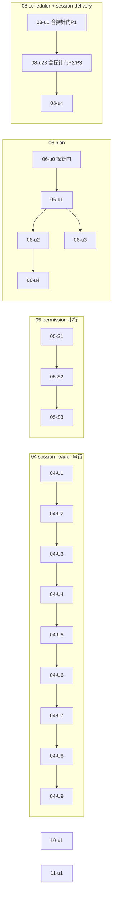

# ext-simplify A 组（04/05/06/08/10/11）实施计划

基线: d15086883 | 来源设计: docs/design/ext-simplify-{04-session-reader,05-permission,06-plan,08-scheduler,10-structured-output,11-ask-user}.md | 日期: 2026-09-14

批次性质：6 份设计两两无文件交集（handoff /tmp/handoff-ext-simplify-execution-order.md A 组表），一份批次计划统一编排，单元编号 = `<设计号>-<设计内单元号>`，内容权威源 = 各设计文档自身（subagent 按编号回设计读细节）。**用户约束：subagent 并发度 ≤2。**

审查证据（阶段 0.3）：`.tmp/tech-design/review-main-r1-batch{1,2}.md` + `review-impact-r1-batch{1,2}.md`（R1 双审查 + R2 聚焦复审追加节，2026-09-14）——6/6 双 PASS 至 0 must-fix，commit cadfaf4b9。审查报告为 gitignored 现场证据，R2 结论节均有「PASS 0 must-fix」记录。

## 0 章节映射

| 内容 | 04 | 05 | 06 | 08 | 10 | 11 |
|------|----|----|----|----|----|----|
| 背景/目标 | 开篇 SCQA + §1 | 开篇 SCQA + §1/§2 | 开篇 SCQA + §1/§2 | 开篇 SCQA + §1/§2 | 开篇 SCQA + §1/§2 | 开篇 SCQA + §1/§2 |
| 终态/机制 | §3 解决方案 | §4 终态 + §6 实现机制 | §4 终态 + §6 机制与文件地图 | §5 终态 + §7 实现机制 | §5 终态 | §5 终态 + §7 实现机制 |
| 验收场景表 | §4（S1-S6） | §8（A1-A7） | §7（V1-V5） | §8（V1-V4） | §8（V1-V3） | §8（V1-V4） |
| 下一层拆分 | §5（U1-U9） | §7 执行项总表 + §9 三阶段 | §8（u0-u5） | §9.2（M0+u1-u4） | §9.1（u1；u2 移交） | §9.2（u1；u2 移交） |
| 待验证检查点 | 附录 A 探针 P1-P4 | §10 T1-T5 | §8.2 | §9.3 | §9.2 | §9.3 |
| 执行项明细 | §3.3/§3.4 执行项表（E1-E11/A1-A5）+ §1.3 目标 5（G5 回写清单①-⑤） | §7 三阶段表（E1-E12） | §8.1 单元表 | §6 D1-D3 + §7 | §7 执行项清单（E1-E3） | §7（E1-E3） |

行号基线声明：各设计引用 file:line 为起草时实读值，**subagent 一律以符号检索定位、不照抄行号**（10 号设计证据基线明示 ±1-2 行偏移）。

## 1 目标快照（逐字摘录各设计 SCQA 的 A（答案）行）

- **04**：「3 个决策（预解析根复用 / 删 enrichRefs + family 富字段展示 / renderOutline 返回渲染行）+ 11 项执行清理 + 5 项附加顺带修复，拆 9 个实施单元逐个可验收。」前提：不改变工具契约（schema、action 语义、错误路径）。
- **05**：「五组删除 + 三组收敛 + 一组导出面清理，分三阶段实施（行为零变删除 → 双写收敛 → 导出面收敛），每阶段独立验证独立回滚。」前提：不碰任何核心语义。
- **06**：「4 个决策（tree 档处置、goal 桥失败显式化、模板单源、phase 删除）+ 2 个执行项（静态 import、peer optional 化），全部行为修复或行为等价；仅模板单源带一项已量化的兼容代价。」
- **08**：「M18——croner 移入 dependencies 并静态 import，删除 probe 降级层，错误通道归一为『表达式无效』单一语义；M19——内核 onSettled 改 per-message 回调（±10 行，单消息批次行为不变），scheduler 防重 Map/TTL 保留为终态回调丢失的回收层有界兜底。」
- **10**：「M24 守卫整体删除 + slot 回退模块级 `let` + redesign 文档同批回写 + low 群移交清单登记。行为零变更。」
- **11**：「checkOptionLabels 增加保留字精确匹配拦截（一行校验 + 2 条测试）+ ARCHITECTURE.md 登记 registry 外沿事实；5 项 low 清理显式移交 code-simplify 批次；发现 5（前端编码漂移）经实读证伪后裁决不实施。」注意 S2：匹配口径用 `opt.label.trim() === OTHER_LABEL`（拦空白变体）。

Out-of-scope（各设计 In-scope 之外一律不动）：10 明示 SW 侧任何文件不动；11 明示不在此路径加第二处拦截（channel-handler 透传路径）；06 不动 goal 包（只消费其接口）；05 runtime 侧纯透传零改动；移交 code-simplify 不在本流水线执行：10-u2（E4-E7）、11-u2（L1-L5）、06 §8.3 三项、04 无移交项、08 low 群 L1-L9 归 08-u4 在本批次执行（L7 随 08-u23）。

## 2 单元列表

| Unit | 职责（设计内编号） | 领地 | 依赖 | 隔离 | 验收条款（机械证据） |
|------|------|------|------|------|------|
| 06-u0 | 06 §5.7 探针门 P1/P2（⛔ 不通过不开工，降级路径见探针表） | extensions/universal/plan/**（临时代码跑完移除，工作区还原） | - | plain | P1 日志 isActive=false 且无 phase="complete" 观测；P2 goal widget 出现 + /goal status 可见；产物留档 .tmp/dev-flow/probe-06.md |
| 06-u1 | 静态 import + index.ts 局部 logger 使用剥离（D5）+ buildExecOptions 同步化 + u5 peer optional 并入 | 同上 | 06-u0 | plain | 包 typecheck+lint+test 绿；编译产物无动态 import chunk；package.json peerDependencies @zhushanwen/pi-goal 含 `"optional": true` |
| 06-u2 | complete 交互矩阵（D1+D2+发现 7/8 顺带） | 同上 | 06-u1 | plain | 包测试绿（tool/compact-handler 改写用例）；V3① tree 传参 schema 拒绝 |
| 06-u3 | 模板单源 + 标题统一（D3+D4）+ CHANGELOG 破坏性条目 | 同上 | 06-u1 | plain | 包测试绿 + 新守卫测试；list-template 恰 5 个 builtin 无 source 后缀 |
| 06-u4 | phase 删除（D6） | 同上 | 06-u2（且 06-u0-P1 结论 = 死状态实证） | plain | 包测试绿；`rg "phase" src/`（非测试）写入点清零 |
| 08-u1 | 探针门 P1 红基线先行（新用例在现状下失败 = 缺陷实证留档）→ 内核 settled per-message（D1/B1）+ types 契约注释 → 用例转绿 + 版本 bump session-delivery 0.3.1→0.4.0 | packages/session-delivery/** | - | plain | P1 红基线留档 .tmp/dev-flow/probe-08.md；用例转绿；既有 delivery-receipt/delivery-inflight 套件零改动全绿 |
| 08-u23 | 探针门 P2 现状红确认先行 → croner 依赖修复 + 兜底语义注释 + runtime 测试核对（u2+u3 同 commit）+ 版本 bump scheduler 0.5.2→0.6.0；P2 复跑转绿 + P3 预演；**含 packages/subagent-core/src/execution/notify-ledger.ts:317-318 注释同步（设计 §7 文件表项，08-u1 blocker 裁决归此）** | extensions/universal/scheduler/** + packages/subagent-core/src/execution/notify-ledger.ts | 08-u1 | plain | P2 干净目录 import('croner') 成功（先红后绿两态留档）；`node scripts/check-extension-dependencies.mjs` 绿；runtime.ts 注释与 §5.2 终态一致 |
| 08-u4 | low 群清扫 L1-L9（L7 已随 08-u23） | extensions/universal/scheduler/** | 08-u23 | plain | 三连绿；§6.3 两处二选一裁决落地 |
| 04-U1 | 测试兼容层退役（E4 + G5③ 清账） | extensions/universal/session-reader/**（含包内 docs/ 两文件——回写目标） | - | plain | 包测试绿；re-export 块删除；G5③ 回写落位 |
| 04-U2 | find 单次根解析（E1/D1 + G5②） | 同上 | 04-U1 | plain | P1 spy 断言 doFind 全路径 resolveSessionRoots 恰 1 次 |
| 04-U3 | doctor 缓存删除 + 文档回写（E3+A2 + G5①） | 同上 | 04-U2 | plain | doctor 输出无「缓存命中」；G5① 五笔回写（含 impl-plan 台账清扫）完成 |
| 04-U4 | family 收敛（E2/D2+A3 + G5⑤） | 同上 | 04-U3 | plain | family 新字段可见；G5⑤ 回写落位 |
| 04-U5 | 行渲染统一（E7/D3） | 同上 | 04-U4 | plain | 旁支行 `[旁支 N entries]` 两 action 一致 |
| 04-U6 | deps 收敛（E5） | 同上 | 04-U5 | plain | 注入面收窄 typecheck 绿 |
| 04-U7 | identity 尾读收敛（E8 + P3） | 同上 | 04-U6 | plain | P-fallback 用例零回归 |
| 04-U8 | 死字段与提取收敛（E6+E9+E11+A4 + G5④） | 同上 | 04-U7 | plain | SessionRoot.id 零残留；G5④ 回写落位 |
| 04-U9 | 杂项与正确性（E10+A1+A4 注释+A5） | 同上 + eslint.config.mjs | 04-U8 | plain | A1 场景秒回空列表（S5 前置） |
| 05-S1 | 注入面删除 E1-E5（行为零变） | extensions/universal/permission/** | - | plain | 包测试绿（含 T2 vi.mock 落地）；A5 grep 四符号零命中 |
| 05-S2 | 双写收敛 E6-E8+E11 | 同上 | 05-S1 | plain | approval.test.ts 既有断言不动全绿（T4）；RPC title 断言补 reasoning 行 |
| 05-S3 | 导出面收敛 E9/E10/E12 | 同上 | 05-S2 | plain | A6 grep 六组符号零命中；rules/classifier barrel 各 2 符号 |
| 10-u1 | E1+E2+E3 单 commit + bump 5.1.5→5.1.6 | extensions/universal/structured-output/** + docs/design/structured-output-redesign.md（仅 :275 一处） | - | plain | 三连绿；loop-gate 既有用例除 :704-709 外零改动；redesign :275 表述已改写；version=5.1.6 |
| 11-u1 | E1+E2+E3 单 commit（探针 P1/P2 先行 = V1/V2 预跑） | extensions/universal/ask-user/**（含 ARCHITECTURE.md） | - | plain | validate.test.ts +2 用例绿（trim 口径）；ARCHITECTURE.md 登记；V1 拦截生效 |

注：04-U1..U9 串行依据 = 设计 §5 顺序（tool-handler.ts 等多文件跨单元复触，串行避免自撞）；04 线内「同上」领地 = extensions/universal/session-reader/**（src/tests/eslint.config.mjs + docs/2026-09-10-session-root-discovery-and-env-transparency{.md,.impl-plan.md}）。

## 3 DAG 图

六线两两无交集，任意并行；调度受全局并发 ≤2 约束。推荐波次（探针门最前置）：波1 = 06-u0 + 08-u1（后者内含 P1 红基线先行）→ 波2 = 10-u1 + 11-u1 → 之后 04 线与 05 线占满双槽滚动推进，06/08 剩余单元插空。

## 4 测试与验收计划

### 4.1 测试命令（真实来源：AGENTS.md + package.json scripts）

- 增量（每单元 dev 自跑）：`cd extensions/universal/<pkg> && pnpm vitest run`；涉及类型/导出面改动后补 `pnpm extensions:typecheck && pnpm extensions:lint`
- 08-u1：`cd packages/session-delivery && pnpm vitest run`
- 08-V4 邻居回归：`cd packages/runtime && pnpm vitest run`（delivery 相关既有套件零改动绿）
- 全量（阶段 3 尾一次）：`pnpm extensions:typecheck && pnpm extensions:lint && pnpm extensions:test` + `node scripts/check-doc-symbol-drift.mjs` + `node scripts/check-extension-dependencies.mjs`
- 版本 bump 口径：**08-u1（session-delivery 0.4.0）/08-u23（scheduler 0.6.0）/10-u1（5.1.6）为设计明文，随单元 commit**；04/05/06/11 的版本与 changeset 批次尾统一处理（对齐 c79cd621c/011cd043f 既有实践，handoff「批次版本 bump 由 merge 阶段统一处理」口径）；06 CHANGELOG 破坏性条目按包内既有惯例落 Unreleased/版本节

### 4.2 验收计划表（阶段 5 执行依据；场景定义在各设计验收节）

| # | 验收项 | 方式 | 成本 | 收益 | 组 | 依赖 | 优化判定 |
|---|--------|------|------|------|----|------|----------|
| 04-S1 | find 扫描次数（spy 恒 1 + 真实 agentDir 耗时） | L3 | 3 | 8 | 核心 | 04-U2 | 可脚本化（vitest spy + 真实目录计时）；与 04-S2/S3/S4 合跑同 agentDir 轮次 |
| 04-S2 | family 输出增强（真实 session） | L3 | 3 | 7 | 核心 | 04-U4 | 可合并（同 agentDir 轮次） |
| 04-S3 | outline 渲染与降级 | L3 | 3 | 6 | 非核心 | 04-U5 | 可合并 |
| 04-S4 | doctor 无缓存化（连续两轮 + grep） | L3 | 2 | 6 | 核心 | 04-U3 | grep 部分 L0 化；可合并 |
| 04-S5 | `#` 补全秒回（空 getCwdSessionDir） | L3 | 3 | 7 | 核心 | 04-U9 | 可脚本化（构造空上下文直调） |
| 04-S6 | 全包三连 | L0 | 1 | 8 | 核心 | 04-U9 | 批次尾统一三连 |
| 05-A1 | /permission model TUI 双环境 | L3 | 4 | 8 | 核心 | 05-S1 | 可脚本化（pi RPC select 中继替代 TUI 人工） |
| 05-A2 | /permission rule RPC 真实 select | L3 | 3 | 7 | 核心 | 05-S1 | 可脚本化（stdin JSONL） |
| 05-A3 | 审批卡双形态（TUI 逐字节 + GUI 同形态） | L3 | 5 | 8 | 核心 | 05-S2 | GUI 侧 browser-automation 截图判定（L4→L3）；TUI 侧输出 diff |
| 05-A4 | 手编规则拦截（绝对路径 pattern） | L3 | 3 | 7 | 核心 | 05-S2 | 可脚本化；与 05-A1/A2 同安装形态合跑 |
| 05-A5 | 死注入面 grep 零命中 | L0 | 1 | 6 | 非核心 | 05-S1 | 静态规则 |
| 05-A6 | 死导出面 grep 零命中 | L0 | 1 | 5 | 非核心 | 05-S3 | 静态规则 |
| 05-A7 | permission 三连 | L0 | 1 | 8 | 核心 | 05-S3 | 批次尾统一三连 |
| 06-V1 | complete→goal 全链路（compact 档） | L3 | 6 | 9 | 核心 | 06-u2 | 可脚本化（RPC select 中继 + JSONL 断言，替代 TUI 人工） |
| 06-V2 | goal 失败降级四子场景 | L3 | 5 | 9 | 核心 | 06-u2 | 可脚本化；四子场景同环境合跑 |
| 06-V3 | tree 档 schema 拒绝 + /tree 手动保留 | L3 | 4 | 7 | 核心 | 06-u2 | ① L1 单测承载；② /tree 跳转留 L4 人工（或 tmux 驱动） |
| 06-V4 | 模板单源链路 | L3 | 3 | 6 | 非核心 | 06-u3 | 可脚本化 |
| 06-V5 | peer optional dry-run + entry 形态 | L1 | 2 | 6 | 非核心 | 06-u1 | npm --dry-run + JSONL 检查 |
| 08-V1 | 独立安装 cron 可用（npm pack + pi 实测） | L3 | 4 | 8 | 核心 | 08-u23 | 可脚本化（探针 P2 扩展） |
| 08-V2 | builtin 形态回归（GUI dev + staging grep） | L3 | 6 | 6 | 非核心 | 08-u23 | browser-automation 降 L3；staging grep L0 |
| 08-V3 | 合批精确记账（双任务 ≥12min 观察） | L3 | 7 | 9 | 核心 | 08-u23 | 可脚本化（stdin 脚本 + list 轮询 + 时间线留档）；最贵项，与探针 P3 共产物 |
| 08-V4 | 单任务/失败路径 + 邻居通路 | L3 | 5 | 7 | 核心 | 08-u23 | runtime vitest 部分 L1；GUI 投递并入 08-V2 轮次 |
| 10-V1 | workflow 模式真实任务（env 直注） | L3 | 3 | 8 | 核心 | 10-u1 | 可脚本化 |
| 10-V2 | 日常模式 `{schema,data}` + swapped 拒绝 | L3 | 3 | 7 | 核心 | 10-u1 | 可脚本化；与 10-V1 同环境正反两跑 |
| 10-V3 | 三连 + doc-drift | L0 | 1 | 8 | 核心 | 10-u1 | 批次尾统一 |
| 11-V1 | Other 拦截生效（真实模型诱导） | L3 | 3 | 8 | 核心 | 11-u1 | 可脚本化（探针 P1 即本场景） |
| 11-V2 | TUI 问卷恒单 Other 行（人工观察 + 自由输入） | L4 | 5 | 7 | 核心 | 11-u1 | 无法降级（交互观察）；tmux 驱动可尝试 |
| 11-V3 | 合法调用双路径 + 既有 e2e | L3 | 4 | 7 | 核心 | 11-u1 | e2e 并入 05-A3 的 GUI dev 轮次 |
| 11-V4 | code-simplify 移交批验收 | — | — | — | — | （u2 移交批） | **本流水线不执行**（随 11-u2 移交批，deferred 登记） |

**提速结论**：可降级 2 项（05-A3/08-V2 经 browser-automation L4→L3）+ 11-V2 留 L4；可合并 ~9 项进 6 个环境轮次（04 真实 agentDir 轮 / 05 pi 安装轮 / 06 RPC 会话轮 / 08 双任务观察轮 / 10 正反两跑轮 / GUI dev 共享轮）；可脚本化 14 项（pi RPC + stdin JSONL + JSONL 断言）；L0 静态守卫 5 项（04-S6 / 05-A5 / 05-A6 / 05-A7 / 10-V3 + 各 grep 断言）批次尾统一跑。预计派发轮次 29 → ~10。

## 5 合理偏差登记表

| Unit | 偏差 | 性质 | 裁决 |
|------|------|------|------|
| 08-u1 | onSendOk/onSendFail/onSendReceipt 移除 composed 死参穿线（设计 §7 字面保留签名） | per-message 化后 composed 在两函数零消费方，保留即新死代码 | 接受，随单元 commit；阶段 3 一致性审查回写设计 §7 措辞 |
| 08-u1 | 未加 changeset 条目 | 版本 bump 口径已定（批次尾统一），单元仅动 version 字段 | 接受，批次尾统一补 |
| 10-u1 | 守卫用例实际 :705-711 + tests:21 import 联动删除 | 设计声明 ±1-2 行容差；符号删除的机械必然 | 接受（非偏差，容差内） |
| 10-u1 | 安全域注释锚定 TEARDOWN_FORCE_EXIT_MS 常量 doc 而非 :484 调用点 | 知识随值锚定，与设计 §5 终态示意图一致 | 接受 |
| 10-u1 | MS_PER_SECOND 保留 | 被 teardown 日志换算消费，不在 E1 删除面 | 接受 |
| 11-u1 | channel-handler.ts:80 注释限定随 E3 执行（设计 §6.5 原归 L5 移交） | 派发指令显式点名（主 agent 裁决：与 E3 登记同一语义变更，同批落）；L5 其余两处仍留移交批 | 接受（派发方指令，非 subagent 越权） |
| 11-u1 | ARCHITECTURE.md 新增 registry 小节而非补既有段 + 「本 slot 单注册方」精确化 | 现状无 registry 专段；登记前 grep 核实 gui_widget 经 engine-sdk re-export 等事实 | 接受（登记措辞更精确） |
| 11-u1 | 测试新增 3 条（含空白变体 " Other "） | 派发指令明示允许顺带补 | 接受 |
| 06-u1 | :326 handlePlanComplete 动态 import 一并静态化（派发词收窄为 :255） | 设计 §8.1 u1 内容列 + F7「u1 删除该动态 import 后才严格无 await」明文指 :326，subagent 按设计权威扩回 | 接受（设计权威优先于派发词） |
| 08-u23 | P2 探针方法两处调整（pnpm pack 重写 workspace 协议 + workspace 依赖本地 staging） | npm pack 不重写 workspace:* 使干净安装必然协议错；staging 后 croner 在盘性完全由声明形态决定，断言效力不变 | 接受（方法学等价，留档 probe-08.md） |
| 08-u23 | service.ts(2)/runtime.ts(3) 生产调用点 vestigial await 去除 | 设计 §6.2 明示「可保留也可顺带去，由实施定」 | 接受 |
| 08-u23 | SKILL.md 两处 croner 依赖形态描述同步 | 随 files 字段发布，不修即发布过时事实 | 接受 |
| 05-S1 | ListAvailableModelsFn 类型顺带删除 | 唯一消费者即被删 setter（全仓 grep 核实），不删即新死导出 | 接受（符号删除机械必然） |
| 05-S1 | A5 rg 剩余命中仅在 docs/ 三文档 | 均为改前现状描述/审查记录（变更历史登记），非代码残留 | 接受（A5 意图 = 代码面零命中） |
| 05-S1 | commands.test.ts vi.mock 用空 factory + beforeEach 设默认值 | vi hoisting 限制不能引用外部变量 | 接受（T2 落地形态） |
| 06-u2 | GoalBridgeOutcome 增可选 detail?: string | 设计明文 internal-error 异常详情进 notify 与日志，类型须携带 | 接受（机械必然） |
| 06-u2 | handlePlanComplete 返回 GoalBridgeOutcome \| undefined + 两处 JSDoc | 设计未明示签名；undefined = 非 goal 档或 compact 档延迟执行 | 接受（通道差异已登记） |
| 06-u2 | compact-criteria-array.test.ts 同批 5 处调用补参 | 经 handlePlanComplete 直接消费新签名，缺参则 goalInit 恒不执行 4 用例红 | 接受（同一触发链机械联动） |
| 06-u2 | switch default 未知 isolation 直投（非静默丢弃）+ 钉死用例 | 设计只写删 case tree，防御形态为新形态且比 C8a 现状严格 | 接受（防复现） |
| 06-u3 | promptSnippet 22→14 行（删 create-template 行 + Common mistakes 精简 + workflow 6 并 5） | 设计 D3 只说「压缩」未给终态文案 | 接受（裁量在授权范围内，教学核心保留） |
| 06-u3 | TC8 用例删除（global 模板扫描隔离测试） | 其测试对象（global 源扫描）属 D3 删除面本身 | 接受（随删除面消亡） |
| 06-u3 | fallback 探针用包内临时 vitest 文件（跑完即删）替代 /tmp node 直调 | tsx 直调被 pi 包 exports 解析挡住；vitest 同解析链效力不变 | 接受（方法学等价） |
| 05-S2 | buildApprovalFieldSet/ApprovalFieldSet 保持模块私有不导出 | 设计 E6 未要求导出；S3 才是导出面收敛阶段；测试走行为级断言 | 接受 |
| 05-S2 | makeUiAdapter 单一 cast 实现一次过三接口（T5 未触发降级） | ExtensionUIContext 参数类型覆盖三目标接口同型 | 接受（优于降级路径） |
| 05-S2 | E11 顺带清扫 matcher/pipeline 过时注释 | 删除守卫/本地三元后的悬空表述，符号删除的注释同步义务 | 接受 |
| 06-u4 | 测试联动 5 文件（设计写 3 个） | tool.test 旧断言必红 + makeActiveState 含 phase 字面量，机械必然 | 接受 |
| 06-u4 | executeComplete 的 persistPlanState 调用一并移除 | 该 persist 唯一目的是落盘死状态，删后写入内容与上一条 entry 逐字段重复（P1 实证无观测窗口） | 接受（死状态删除面顺带清账） |
| 06-u4 | 三处显示面文案最小实现（status 去 phase 行 / 渲染删两态行 / summary 收常量化） | 设计未给字面量，「显示面同步简化」裁量 | 接受（在授权范围内） |
| 04-U1 | re-export 实为 5 条 export 语句（7 符号）而非设计写的 6 条 | 设计计数口径与符号实际数差 1，删除面完全覆盖设计列举 | 接受（无遗漏无扩大） |
| 04-U1 | 「导出面」叙事实际在 tool-handler.ts:57-58 而非设计写的 result-action.ts:8 | 行号漂移；4 处叙事全清，与设计意图等价 | 接受 |
| 04-U2 | P1 落地 4 用例（设计点名三分支） | doFind 有两个互异零匹配入口，两者都须验证 roots 透传 | 接受（全覆盖优于点名） |
| 08-u4 | L4 牵动 14 处测试（设计估 1 处） | 依赖「无 delivery 直投」旧路径锚定的用例全集，按 L4 裁决机械转 force 路径，断言本体零改动 | 接受 |
| 08-u4 | L8 二选一：SchedulerStore 保留 + 形状忠实注释 | 唯一用途是 importer 的 JSON.parse cast，描述旧 store 磁盘真实格式，删除会静默漂移 | 接受（优于删除） |
| 08-u4 | L9 二选一：Mock 迁 __tests__/mock-backend.ts，三个生产符号保留 export（直测消费） | 去 export 迫使测试走间接路径或复制路径推导，代价大于收益 | 接受 |
| 04-U9 | eslint.config.mjs 在仓库根（设计行号指包内，实为根文件专属 override 段） | 设计权威内容 = session-reader tool-handler override；包内无此文件 | 接受（按设计权威落点） |
| 04-U9 | hash-provider applyCompletion 委托分支保留 + 注释纠错（原判死防御） | pi-tui 实装核实为真实可达路径（@文件//命令 经 provider 转发） | 接受（实装证据优于原注释） |
| 04-U9 | eslint 阈值收紧做成 override 移除（989 < 域基线 1000） | 仓内先例「移除而非抬阈值」，移除 = 收紧至域基线 | 接受 |
| 04 区审查（阶段 3） | P3：包内 2026-09-10 文档 §9.1 表行与 §12.2 探针脚本残留已删薄包装的现行时态引用 | C-proc-10 悬空引用清扫边角（G5⑤ 承诺范围外） | 主 agent 修复：:922 行加退役后注 + §12.2 改「历史快照」标题 + 失效标注与等效复现指引 |
| 10/11 区审查（阶段 3） | P3：11-E3 顺带改动未入登记——ARCHITECTURE.md encodeAnswer 段新增语境限定括号（超出 §6.5 E3 字面清单） | 内容与 D3 证伪结论一致、零行为影响 | 补登记本行；11-u2 移交批 L5 验收时并案核对该括号与 L5 其余两处措辞一致 |

## 6 状态表

| Unit | 状态 | 轮次 | 证据指针 |
|------|------|------|----------|
| 06-u0 | committed | 1 | P1 PASS（isActive=false/phase=idle，D6 门开）；P2 steer 时序 PASS + goal 桥断裂新发现（probe-06.md）；plan 包工作区已还原 ；commit ca54f5392 |
| 06-u1 | committed | 1 | 64/64 零测试改动；三处动态 import 清零；peer optional 落位；commit 513deb653 |
| 06-u2 | committed | 1 | 78/78（+14）；tree schema 拒绝 + 五值出口用例齐；typecheck/lint 过 ；commit 627369472 |
| 06-u3 | committed | 1 | 82/82；5 builtin + 未知 action + D4 对齐守卫齐；fallback 探针 4/4 ；commit 2575c9bcf |
| 06-u4 | committed | 1 | 82/82；phase 写入清零 + PlanPhase 全仓零命中 + 旧 entry 兼容用例（06 线完成） ；commit 24cd557ee |
| 08-u1 | committed | 1 | P1 红基线「called 1 times」留档 probe-08.md；73/73 绿 + typecheck 零错误；commit b1496b539 |
| 08-u23 | committed | 1 | P2 红→绿两态 + P3 live 预演（合批注入 + 双任务同毫秒 advance）；239/239 + extensions typecheck/lint/依赖守卫全过 ；commit 1e2e2aad5 |
| 08-u4 | committed | 1 | 240/240 + extensions 三连全绿 + 守卫双过；L1-L9 除 L7 逐项 grep 证据（08 线完成） ；commit 02717c973 |
| 04-U1 | committed | 1 | 398 绿 2 skip；re-export 零命中；G5③ 回写落位；commit 20dcfbe37 |
| 04-U2 | committed | 1 | 402 绿 2 skip（+4 P1 用例）；G5② 清账；tsc/eslint/doc-drift 过 ；commit ab305e9d0 |
| 04-U3 | committed | 1 | 398 绿；「缓存命中」零命中；G5① 两文档五笔回写齐 ；commit 6fd439daa |
| 04-U4 | committed | 1 | 402 绿（+4 富字段用例）；薄包装/enrichRefs 代码面零命中；G5⑤ 回写齐 ；commit 1fd2bce16 |
| 04-U5 | committed | 1 | 406 绿（+4）；两 action 一致性 by construction；formatOutlineText 零命中 ；commit a72c6b15b |
| 04-U6 | committed | 1 | 406 绿（零测试改动）；RESULT_ACTION_DEPS 零命中；ResultActionDeps 3 成员 ；commit d4fbd7113 |
| 04-U7 | committed | 1 | 406 绿；find 专用 readTailIdentityForMatch（56 行）删除复用单实现；畸形行差异注释登记（subagent 中途撞速率限制，主 agent 接替验证收尾） ；commit e9dd3b8fa |
| 04-U8 | committed | 1 | 405 绿；SessionRoot.id/fullEntry 零命中；E11 共享核 3 组合点；G5④ 回写齐 ；commit 053a0f7d4 |
| 04-U9 | committed | 1 | 407 绿（+2 A1 用例）；A1/E10/A4/A5 全落地；阶段 2 全 22 单元完成（08-M0 已并入 u1/u23） ；commit b65749232 |
| 05-S1 | committed | 1 | 578/578（用例数零增减）；四符号代码面零命中；T2 未触发降级 ；commit 550b4e61a |
| 05-S2 | committed | 1 | 580/580；T4 字节级双轨（既有断言零改动 + 36/36 探针）；T3/T5 过无降级 ；commit 53d0ec2ee |
| 05-S3 | committed | 1 | 579/579；六组符号零命中；barrel 2+2；typecheck/lint 过（05 线完成） ；commit 0135a3437 |
| 10-u1 | committed | 1 | 193/193 绿 + typecheck/lint/doc-drift 三过；净 +13/−61 ；commit 64cfd4384 |
| 11-u1 | committed | 1 | 307/307 绿（+3 用例）+ typecheck/lint 双过 ；commit 00559246c |

## 7 残留风险与变更历史

**约定与风险登记**：

1. 版本 bump 双轨口径（表面化）：设计明文的三处（08-u1/08-u23/10-u1）随单元 commit；其余包批次尾统一（既有 c79cd621c 实践）。06 CHANGELOG 破坏性条目随 06-u3 落（版本号按包内惯例，不阻塞）。
2. 探针门降级路径在各自设计探针表内（06 §5.7 / 08 §6.4）；触发降级 = 停线回设计文档重审，主 agent 冻结该线并升级用户。
3. 05-T1（GUI 多行 title 折叠形态）验收基线 = 与改前同形态对比，不按「按行显示」验收（设计 A3 已固化，防存量形态误诊）。
4. 08-V3 长观察（≥12min）与 GUI dev（08-V2）共享本机资源，验收编排串行化，避免端口/焦点竞争。
5. 11-V4 随 11-u2 移交 code-simplify 批次，本流水线 deferred（终态同步阶段登记到 ext-simplify-index）。
6. subagent 领地 = 线级包目录；发现领地外必改（如 runtime 侧意外牵连）停下上报，禁止顺手改。
7. **goal 桥断裂（06-u0 探针新发现，2026-09-14）**：pi 0.84.4 每扩展独立 API 对象，`pi.__goalInit` 跨扩展挂载运行时不可达（双扩展实验确证，probe-06.md）——goal 档在 plan complete 对话框恒缺失、tryGoalInit 恒不执行。处置：06 线照常实施（D2 改造正确性独立）；V1/V2 的 goal 档场景按桥断裂现状形态验收并标注；桥修复（goal 暴露机制 + plan 探测方式）为独立缺陷待用户裁决，不纳入本批。
8. **subagent-core 预存 typecheck 失败（认知外，08-u23 上报并经主 agent 核实）**：`src/execution/__tests__/inflight-production-wiring.test.ts` 三处 TS 错误（:144 TS2339 / :155 TS2554 / :157 TS2339），HEAD 上即红，引入 commit 90cdbefe6（2026-09-12 u7a 管线，本会话之前）。不在本流水线任何门内（全量清单 = extensions 三连 + doc-drift + extension-dependencies；notify-ledger 相关 vitest 36+23 绿）。处置：登记 + 最终汇报，不在本批修（修复须改认知外文件，归责 u7a 对应管线）。
9. **scripts/verify-scheduler-e2e.cjs EXTENSION_PATH 指旧路径（08-u4 上报，领地外）**：无 CI/husky 机器依赖（仅自身 usage 文档引用）；该脚本是 scheduler 端到端实测基础设施，阶段 5 验收 08-V1/V3 时改一行路径复用（主 agent 直改，验证基础设施非 subagent 领地）。→ 已修（2ac4a9b20）。
10. **08 区验收遗留观测（2026-09-14，已归因并关闭）**：idle 长静默期出现约 10min 精确延迟的投递（V3 两次 + V4① 两 run 共 4 次复现）——延迟恰一次、advance 记账正确、无重复注入。**归因（2026-09-14 同日完成，源码 + 探针实验闭环）**：pi extension API `sendMessage` 返回 void（fire-and-forget，0.84.4/0.85.1 实装一致）→ delivery 内核对 void 在 `port.send` 同步调用栈内走完 onSendOk/onSettled 终态链 → scheduler `dispatchViaDelivery` 的防重标记 `set` 在 `delivery.send()` 返回后执行——delete 先于 set（空删）、标记永久残留，TTL 10min 内每 30s tick 全被 gate 拦，过期放行后再反转（下一轮 = 上一轮 + 恰好 10min；实验复现 10min23ms，探针数据 /tmp/sched-idle-probe-data）。引入点 `752ca6433`（2026-08-23 内核迁移），非本批改动。**处置（用户裁决：投递模型过重，简化为 steer 直投）**：全任务 `{deliverAs:'steer', triggerTurn:true}` 直投 + 受理即记账（design = docs/design/scheduler-steer-direct-dispatch.md，08 设计投递面 supersede），delivery 链 / 防重标记 / TTL / force 字段全部删除——缺陷载体消失，风险关闭。三条已接受代价（busy 打断 / abort 丢轮 / 无合批）登记在设计 §5。
11. **验收期方法学修正与澄清（08/05 区）**：①P2 staging 法需先 `pnpm build` session-delivery（tarball 走 publishConfig dist 形态）；②`schedule_control list` 视图不渲染 runCount（format.ts 既有行为）——runCount 记账以 advance entry 持久化投影承载；③05-A3①：strict 模式不跑 AI 分类，RPC title 生产形态为 3 行（reasoning 行仅 preClassification 非空时出现，该参数生产零调用方、仅单测构造——改前同形态，M6 的 6 行形态由单测锚定）。均为既有事实澄清，非回归。
12. **11-V3② e2e spec blocked（存量漂移，非本批回归，2026-09-14 GUI 共享轮）**：`e2e/ask-user-real.spec.ts` 三 case 同因失败于 title 断言 `toHaveTitle(/xyz-agent|xyz/i)`（spec:311）——实际 title「太极」（App.vue i18n，zh 太极 / en TaiJi 均不含 xyz）；叠加 `build:e2e` 引用包内不存在 script + 预设模型 `deepseek-router/ds-pro` 本机不存在。spec 停留 f482e73b0（2026-09-05），产品改名晚于该日期。M23 不改前端/协议代码，该 spec 失败与本批零关联；修复属独立 e2e 资产维护任务（title 断言更新 + script 补齐 + 模型参数化），待用户裁决是否立案。

**变更历史**：

- 2026-09-14：初版（阶段 0 预检 + 阶段 1 计划）。结构四节 6/6 齐备；审查证据 = R2 双 PASS 0 must-fix（cadfaf4b9）。
- 2026-09-14 阶段 3 文档修复（主 agent 亲为 doc_errors + P3 unreasonable）：①04 区映射失效修正（执行项明细实际在 §3.3/§3.4 + §1.3）；②设计 04 E3 验证列补第三类合法语境（变更历史时点条目）；③设计 05 A6 通过标准精确化为 re-export 声明形态检索 + T3 措辞同步落地断言口径；④包内 2026-09-10 文档两处悬空引用清扫（§9.1 表行退役后注 + §12.2 失效标注）。04/05 区审查 unreasonable 计 1 条（即④）已清零。
- 2026-09-14 阶段 3+4 收敛：5 区审查全部收讫——unreasonable 6 条全 P3（04 区 1 文档边角主 agent 修；06 区缩进微修 subagent 修 commit afb75d36c、版本双轨随批次尾；08 区 2 条设计登记回写主 agent 修 commit 85334247a；10/11 区 1 条补登记）+ doc_errors 8 条全修（c4d57fa1a/80b1358cb/318e03ff3）。unreasonable 与 doc_errors 双清零。
- 2026-09-14 **Gate A（全量测试验收）PASS**：`pnpm extensions:typecheck && pnpm extensions:lint && pnpm extensions:test && node scripts/check-doc-symbol-drift.mjs && node scripts/check-extension-dependencies.mjs` 一次串联 exit 0（落盘 .tmp/dev-flow/ext-simplify-group-a.gate-a.log）——26 包 4457 用例全过零失败，doc-drift 14 映射零悬空，extension-dependencies 21 entries 一致。无 SKIP_* 变量、无 test.skip 新增。覆盖矩阵：6 包领地全部有对应包级 vitest 承载（04=407/05=579/06=82/08=240+内核 73/10=193/11=307），无无人认领改动区。
- 2026-09-14 r1：08-M0 撤销独立单元——P1 红基线用例即 08-u1 的 TDD 测试（需保留转绿），独立 committed 单元会强制「红测试入库」或「属地不干净」二选一；并入 08-u1（P1 门）/08-u23（P2 现状红确认）作为前置步骤。门性质不变：探针失败 = 停线回设计重审。
- 2026-09-14 **阶段 5 真机验收收口**：5 区脚本化轮全 PASS——04 S1-S5 / 05 A1+A2+A4+A3① / 06 V1-V5（桥断裂形态标注）/ 08 V1+V3+V4+V2staging（13.1min ≥12min 观察窗无重复注入）/ 10 V1+V2 / 11 V1+V3；GUI 共享轮 6 项 = 5 PASS（08-V2/V4 GUI 半、05-A3② 同形态基线、11-V2 TUI 恰一行 Other、子进程双层链拦截实证）+ 1 blocked（11-V3② e2e spec，存量漂移见风险 12）。证据 .tmp/dev-flow/ext-simplify-group-a.acceptance/。登记观察：scheduler idle ~10min 延迟投递（风险 10，待裁决立案）、S2 manifest 双落点、agentName 长路径展示、S3 export 探针已清理恢复。
- 2026-09-14 阶段 6 终态同步轮 1：双 reviewer（终态对照 + 机械信号扫）——must-fix 0；P2×2（F1 changeset frontmatter 误含 session-delivery 双轨、F3 本台账缺阶段 5 收口条目）+ P3×4（F2 两包 CHANGELOG 节、F4 计数 23→22、F5 状态表补 hash、F6 设计 08 三处移交表述括注）全部当轮修复；机械扫 16 符号/18 测试头/8 生产入口/6 文档零残留零悬空（O-1 时点行号漂移合法不修）。修复全部 doc/changeset 侧、主 agent 机械转录级亲为（零代码零测试面），自验以 reviewer 给出的精确锚点复核。
- 2026-09-14 批次尾 changeset：ec74f5ca5 落 .changeset/ext-simplify-group-a-extensions.md（04 minor / 05 patch / 06 minor / 11 minor 四包；session-delivery 0.4.0、scheduler 0.6.0、structured-output 5.1.6 为设计明文随单元 commit，不入 frontmatter 防二次跳版——F1 修复后口径）。
