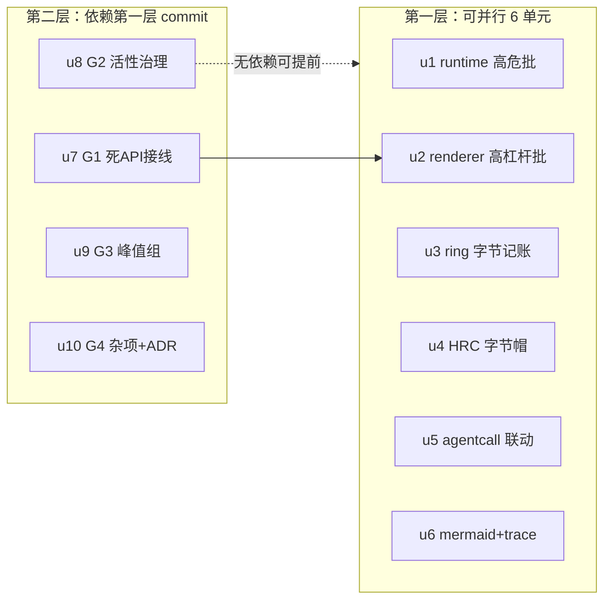

# memory-leak-remediation 实施计划
基线: d6b3d0b9f（docs(design): memory-leak-remediation R4 final + impl-plan baseline） | 来源设计: docs/design/memory-leak-remediation.md（R4 终版） | 日期: 2026-09-14

## 0 章节映射
| 内容 | 设计文档实际位置 |
|------|--------------|
| 背景/目标 | §1 背景目标（SCQA + 设计目标 G1-G4 + In/Out-scope） |
| 终态/机制 | §3 解决方案（§3.2 第一批 B1-B6 / §3.3 第二批 B7-B11 / §3.4 第三批 G1-G4 / §3.5 系统性防护） |
| 验收场景表 | §4 验收（A1-A10 + 单测分层清单） |
| 下一层拆分 | §5 下一层拆分（u1-u10 + justification + 待验证检查点 + 文件改动地图） |
| 待验证检查点 | §5 末尾 5 条（实施期核实，不阻塞） |

## 1 目标快照（逐字摘录）

> **G1**：消灭两个高危项——respawn 场景的 pingTimer 泄漏（连带 pi 进程钉死）、message-bus ring 字节无界
> **G2**：让「活性无界」结构（随用户工作流强度增长、与磁盘语料量无关）获得确定回收路径——销毁编排接线或容量帽
> **G3**：峰值类（一次性大分配）在有低成本手段处收敛，不动协议层
> **G4**：给「新增 per-session 状态必须接线销毁编排」补机械检查，防同类问题再发

Out-of-scope（摘录关键项）：pi-rpc frame.ts 单行缓冲（协议合法载荷）；SessionList 虚拟化；useTerminal scrollback；回收态 bus 分区 ring 清理（静默空洞反例否决）；B10 流式节流（独立议题）；mermaid 库本体。

## 2 单元列表
| Unit | 职责 | 领地（精确文件路径，全部相对 packages/） | 依赖 | 隔离 | 验收条款 |
|------|------|------|------|------|------|
| u1 | runtime 高危批：B1 pingTimer（dispose 补 stopPingLoop）+ B5 clearSessionData（tombstone set+delete guard + 摘碑双路径 + trash 软删除 + removeSessionEntry 尾段直调）+ B6 bridgeRequestIds 应答即删 | runtime/src/services/session/event-interpreter.ts；runtime/src/services/plugin-service/session-data-store.ts；runtime/src/services/session/import-service.ts（import 摘碑，F4 路径勘误：实际在 services/session/ 非 plugin-service/）；runtime/src/services/plugin-service/session-data-api.ts（写守卫）；runtime/src/services/plugin-service/plugin-service.ts（setOnSessionCreated 摘碑挂点 :441）；runtime/src/services/session/session-service.ts（尾段直调）；runtime/src/transport/bridge-handler.ts；runtime/src/services/extension-timeout-manager.ts + 各自 __tests__ | - | plain | 单测（B1 respawn 序列/B5 trash+tombstone 双路径+B6 Set 归零）+ `pnpm --filter runtime test` 绿 + typecheck 绿；tombstone 代码注释含「迟到 set 是唯一文件复活入口」依据 |
| u2 | renderer/core 高杠杆批：B2 events.ts off 删空 Set + B3 Sidebar 退订 + B4 browserDestroy hook（.catch + 头注释修正） | core/src/transport/api/events.ts；renderer/src/components/sidebar/Sidebar.vue；core/src/domain/session/use-session.ts（hooks 序列）；apps/electron/main/browser/browser-view-manager.ts（仅 :33 头注释） + 各自 __tests__ | - | plain | 单测（off 删空 key）+ core/renderer vitest 绿 + typecheck 绿；A4 场景探针代码就位 |
| u3 | B7 ring 字节记账（纯 A：16MB/session 预算 + 加速淘汰 + 仅剩最新帧即停 + truncated 版记账口径 + stateSnapshot 覆盖式观测） | runtime/src/services/message-bus/message-bus.ts；runtime/src/services/message-bus/types.ts + __tests__ | - | plain | 单测（预算内驱逐/超调下界终止/记账口径/覆盖式计量/记账不截断）+ runtime vitest 绿 |
| u4 | B8 history-rebuild-cache 字节帽（32MB/条）+ reclaim 驱逐 | runtime/src/services/session/history-rebuild-cache.ts；runtime/src/services/session/session-lifecycle.ts（reclaim 挂点） + __tests__ | - | plain | 单测（超限不缓存/reclaim 驱逐/重激活全量重建）+ runtime vitest 绿 |
| u5 | B9 agentcall LRU 联动（两路径接线 + viewedVids() panel 枚举豁免） | core/src/domain/chat/lru.ts；core/src/domain/chat/store.ts（装配）；renderer/src/stores/workflow.ts（映射暴露）；core/src/domain/drawer/control.ts（豁免查询源，实际落点——以实际路径为准）+ 装配点 + __tests__ | - | plain | 单测（联动驱逐/豁免/两路径）+ core/renderer vitest 绿；A6 场景探针就位 |
| u6 | B10 mermaid finally 清残留 + B11 trace 台账（seenIds 增量 + 5000 软上限 + truncated 正交字段 + 现有降级 UI） | renderer/src/composables/logic/mermaid.ts；renderer/src/composables/features/trace/useSessionTrace.ts；renderer/src/components/panel/trace/TraceView.vue 消费点（F4 路径勘误：实际在 renderer 包 panel/trace/，非 packages/ui）+ __tests__ | - | plain | 单测（finally 清理/增量 seen/上限停采）+ renderer vitest 绿 |
| u7 | G1 死 API 接线：terminal-write-queue + command-store + feedMap 接 cleanupSessionState hooks；requestIdSessions respond 路径补删 | core/src/domain/drawer/terminal-write-queue.ts；core/src/domain/new-task-search/command-store.ts；renderer/src/composables/effects/useForkNoticeEffect.ts；renderer/src/composables/shell/extension-host-dialog.ts；core/src/domain/session/use-session.ts（hooks 序列）+ __tests__ | u2（use-session.ts 同文件） | plain | 单测（三 Map 清理接线/requestIdSessions respond 删）+ core/renderer vitest 绿 |
| u8 | G2 活性无界治理：openPiStreams close 摘除 + inFlightSubscribes sweep 挂重连；§2.5 五项注释行 | runtime/src/infra/logger.ts；core/src/transport/ws-client.ts；runtime/src/infra/pi/session-file-external-scan.ts（注释）；runtime/src/infra/pi/session-binding-sidecar-io.ts（注释）；runtime/src/services/git/git-state-service.ts（注释）；runtime/src/services/usage/usage-stats-service.ts（注释）；core/src/domain/chat/bash-effects.ts（注释） | - | plain | 单测（摘除/挂重连）+ runtime/core vitest 绿；注释行 grep 验证 |
| u9 | G3 峰值组：extractor 预检降级 + shell-runner maxBuffer | runtime/src/services/session/subagent-extractor.ts；runtime/src/services/session/workflow-extractor.ts；runtime/src/infra/shell-runner.ts + __tests__ | - | plain | 单测（预检降级返回空+标记/maxBuffer 截断保留头尾）+ runtime vitest 绿 |
| u10 | G4 杂项组 + ADR-0049 条目：prematureTimeoutIds/deferFlushFailureCounts dispose 补面 + quota body cancel + skill-registry watcher LRU 8 + ImportSessionDialog close 清数据 | core/src/domain/chat/streaming-state-machine.ts；core/src/domain/chat/useChat.ts；runtime/src/services/quota-providers/types.ts；runtime/src/services/skill-registry.ts；renderer/src/composables/features/sidebar/useImportSession.ts；docs/adr/0049-session-isolation-map-partition.md（checklist 条 + 变更历史）+ __tests__ | - | plain | 单测（dispose 补面/cancel/LRU 驱逐）+ vitest 绿；ADR 条目 diff 可见 |

注：u2 的 browser-view-manager.ts 在 apps/electron（main 进程），仅头注释改动；u5 的 control.ts 为豁免查询只读源。全部单元领地以本表为准（设计 §5 文件数声明已按本表校正）。

## 3 DAG 图

实际依赖边仅 u7→u2（use-session.ts 同文件串行）；u8-u10 无文件冲突可与第一层并行派发（受全局并发 ≤5 约束分两波）。

## 4 测试与验收计划

**测试命令**（从各包 package.json scripts 真实读取）：
- 增量（每单元 dev 自跑）：`cd packages/<pkg> && pnpm test`（vitest run）+ `pnpm typecheck`
- 全量（阶段 3 尾）：runtime + core + renderer 三包 vitest 全量 + `pnpm extensions:typecheck && pnpm extensions:lint && pnpm extensions:test`（extensions 面未被触碰，作回归闸门）+ 根 `pnpm run lint`
- 测试策略遵循 docs/TEST-STRATEGY.md（vitest 禁 node:test；timer 测试用 fake timers；fs 写删走 tmpdir 白名单——runtime vitest 已有 fs-guard setupFiles）

**验收计划表**（编译自设计 §4 A1-A10；风险分 9 继承自设计——P0 面）：
| # | 验收项（场景表行） | 方式 | 成本(1-10) | 收益(1-10) | 组 | 依赖 | 优化判定 |
|---|--------------------|------|------------|------------|----|------|----------|
| A1 | pi 崩溃恢复后无 pingTimer 残留 | L1 单测(fake timers 重放 respawn 序列) + L3 探针 | 4 | 10 | 核心 | - | 单测覆盖主链路；L3 探针（诊断日志）随 dev 实例验收日并入 A9 批次 |
| A2 | ring 字节有界（预算内驱逐+超调下界） | L1 单测（u3 全套） | 3 | 10 | 核心 | - | 可脚本化；16MB 常数实测量化并入 A9 |
| A3 | session 删除全链路释放（tombstone/trash/分区归零/views 下降） | L3 脚本（dev 实例 + 探针 + RPC 直调模拟迟到写） | 7 | 10 | 核心 | u1,u2,u7 | 操作确定 + 探针可机器断言；browserCreate 直造 view 路径已钉死 |
| A4 | 断连重连不泄漏 handler | L3 脚本（kill runtime ×5 + 探针 size==1） | 5 | 7 | 核心 | u2 | 可脚本化 |
| A5 | bridge 请求不累积 | L1 单测 + L3 探针 | 3 | 7 | 非核心 | u1 | 单测为主，探针并入 A9 |
| A6 | agentcall 联动驱逐 + 豁免（drawer 不白屏） | L1 单测 + L3 场景（切 8 session 挤出 + drawer 存活断言） | 6 | 8 | 核心 | u5 | 单测覆盖驱逐/豁免语义；L3 场景并入 A9 批次 |
| A7 | mermaid 失败不泄漏 DOM | L1 单测（jsdom 断言 body 无 #dmd-*） | 3 | 7 | 非核心 | u6 | 可脚本化（happy-dom 已有先例） |
| A8 | trace 台账有界 + O(n²) 消除 | L1 单测 | 3 | 7 | 非核心 | u6 | 可脚本化（灌 5000 entries 断言上限+耗时） |
| A9 | 长跑回归 + 量化锚点（RSS/heap 中位数回落 + 无孤儿进程） | L3 脚本（30min 混合工作流 + 静置 60s 采样） | 9 | 9 | 核心 | u1-u7 全部 | 不可降级（本分支主题的最终证据）；与 A1/A2/A5/A6 探针合并跑 |
| A10 | 存量测试全绿 | L2 全量套件 | 5 | 8 | 核心 | 全部 | 机械执行；阶段 3 尾统一 |

**提速结论 [MANDATORY]**：可降级 0 项（A9 为最终证据不可降）；可合并 4 项（A1/A2/A5/A6 的 L3 探针全部并入 A9 批次同跑，省 4 个独立派发轮）；可脚本化 8 项（A2-A8 全部 testid/探针/单测可机器断言）；L0 静态守卫清单：`pnpm run lint`、各包 typecheck、`node scripts/validate-constraints.mjs`（若触发）、pre-commit 全链（vue_rules_checker/taste-lint/env 白名单等按路径自动触发）。预计节省派发轮次 ~4 轮（L3 批次合并）。A9 成本 9 为最重项（30min 实跑 + 采样），安排在全部单元 committed 后一次性执行。

## 5 合理偏差登记表
| Unit | 偏差 | 合理性论证 | 设计文档同步动作 |
|------|------|------|------|
| u2 | useSidebar.ts 领地外 1 hook 接线 + 1 import | SessionCleanupHooks 在 renderer 的唯一实现点；不接线则 browserDestroy hook 是死代码（恰为本治理的反模式本身）；设计 B4 落点「lib/ipc.ts 调用方」即壳层接线 | 无需（设计本意） |
| u2 | 5 个测试基建文件 mock 补丁（各 1 行） | vitest mock 代理在未知导出属性访问即抛错（?. 拦不住）；TEST-STRATEGY §5 已登记此坑；属 Sidebar.vue 探针的合法测试伴随面 | 无需 |
| u2 | use-session.ts「12 项」陈旧口径顺手修正为 11 项 | 设计 §2.1 已登记该漂移；hooks 序列本在改动面内 | 已在 R4 文档体现 |
| u1 | session-data-api.ts 实际路径在 plugin-service/api/ 子目录 | 计划笔误；领地意图不变 | impl-plan 领地表以实际路径为准 |
| u6 | i18n locale 两文件（panel.ts zh/en）伴随面 | truncated banner 文案必要；双 locale 对称 | 无需 |
| u6 | 软上限覆盖快照替换路径（设计原文侧重增量） | 快照替换是无界写点，只治增量治不住加载路径；A8 验收本要求 entries ≤ 5000 | 已在 commit message 登记 |
| u7 | useSidebar.ts 接线 + 2 测试 mock 补丁（领地外伴随面） | 任务指令明示接线；SessionCleanupHooks 唯一 renderer 实现点 | 已 commit 登记 |
| u8 | sweep 挂点 markConnected（设计写「重连路径」） | 共用路径覆盖重连；同步先于 resubscribeAll 时序论证在代码注释 | 已 commit 登记 |
| u8 | 2 个 _forTest 探针导出 | 无可观测面的最小测试钩子，对齐既有先例 | A9 批次统一降级 |
| u9 | subagent-service-engine-route.test.ts（领地外） | extractor 返回形状变更直接连锁 mock 适配，不修则全量不可能绿 | 已 commit 登记 |
| u9 | 侧栏 oversize UI 降级未接线 | 跨包（shared protocol+core+renderer）；oversize 标记已就位 | 遗留：独立排期 |
| u9 | zcode journal-io 无 engines-root 白名单 | 独立产品问题（zcode-subagent-cli 包），u9 领地超出 | 遗留：独立排期 |
| u10 | useChat.ts 零改动（任务预期可能要补） | deferFlushFailureCounts 存量已修（5637e0088），语义由新测试锁定 | 闭环成立 |
| u10 | store.ts（文件清单外接线点） | dispose 补面必须的编排接线 + testInternals 透出 | 已 commit 登记 |
| 阶段3-修复 | 1 high（B5 触发面收窄 ca058f602）+ 3 low（i18n 527a0f1a3 / 接口契约随组A / skill-warn e1b5c3c88）全清零；8 doc_errors 亲修（f014b994a） | 定向复审 b5-fix-recheck 派发 | 见各 commit |
| 阶段5-A3 | 删除全链路 8/8 PASS（WS RPC 真删除→列表移除+文件清理；forceQuit 存活对照；废纸篓断言 TCC 拦截→单测+日志代理覆盖）| 脚本 .tmp/dev-flow/memory-leak-remediation.acceptance/a3-delete-chain.mjs | dev 实例真机 | 
| 阶段5-A4 | 断连重连 9/9 PASS（kill runtime ×5→supervisor 复起+RPC 可达+页面健康+console 零 error；第 5 轮系统内存压力致 reattach 推迟>6s，补验通过）| 脚本 a4-reconnect.mjs | dev 实例真机 |
| 阶段5-探针降级 | 验收后探针统一降级/清理（设计 :237 门条款）：`_probeGlobalTypeHandlerCount` 删、events.ts 探针降 console.debug、Sidebar `[memory-probe]` 日志删 + 5 处 mock provision 清；3 个 `_forTest` 保留（L1 面在用）；顺带修复 3 个 runtime 存量 typecheck 错误（B5 接口同步：IPluginServiceDeps.trashFile + SessionSummary 测试标注）；三包测试全绿 | commit 46409be3e | subagent 执行 + 主会话核验提交 |
| 阶段5-A9 | **PASS**。①soak：30min 混合工作流 58 轮 + 静置采样——renderer JS heap 全程稳定 58-59MB（前端修复面零 JS 泄漏）、main 进程 134-144MB 稳定、rt RSS 峰值 558MB→静置 116MB（高水位可回收）；稳态抬升 +22MB ≈ ring 16MB/session + HRC 32MB 帽内设计内缓存。②量化锚点（设计 §4 A9 原文口径）：删 5 个大 session（合计 ~87MB 历史）→ 净回落 rt RSS 398016→133536KB（**-258MB > 0**）+ heap 58→57MB；5/5 session.deleted。③孤儿检查：无 ppid=1 的 pi/Chromium 进程。④日志探针 A1/A2/A5 零命中（无 pingTimer 残留 / ring 超预算 warn / bridge 累积 warn） | a9-soak.mjs + a9-delete-baseline.mjs + a9-delete-baseline.jsonl；日志探针空对象根因 = 脚本 glob 实例目录，实际日志在 ~/.xyz-agent-dev/logs/runtime-*.log（主会话手工补跑断言）。释放延迟现象：60s 窗口内释放分两拍（post-3 才落 133MB），扩展稳态采样确认——对齐设计 R2 S1 防惰性 GC 假阴，登记为已知现象非缺陷 | dev 实例真机 |
| Gate A | runtime 524f/6024t 绿（2 unhandled=用户在制 rpc-client）·core 129f/2104t 绿·renderer 402f/4354t 绿·ext typecheck+lint 绿·根 lint 修 2 行级豁免后绿 | extensions:test 中 pi-subagent-cli 12 失败=既有（基线前 f932d8545 poolKey 退役遗留，本分支区间该三包零 diff，日志 .tmp/dev-flow/gate-a-*.log） | 用户域残留登记 |
| 事件 | 越权/外来 commit ×3：0f6d7c93f（fix ci vitest flags）·1b0f9dac6（perf ci shard）·8c0e49ef6（perf runtime rpc-client 测试提速，用户本人 commit）| 内容均正当；保留；最终汇报 | 用户在制 test-infra-source-simplify 工作继续中（docs/todo/） |
| 阶段3 | 三区一致性审查：1 high（B5 触发面越界）+ 3 low unreasonable + 8 doc_errors | 修复组 A/B/C 并行派发；doc_errors 主 agent 亲修 | 审查报告见本表上方 |
| 事件 | 越权 commit 0f6d7c93f（fix(ci)） | 某 dev 违反「subagent 零 git」+ 领地外改动（CI workflow+TEST-STRATEGY）；内容正当（vitest flags 失效修复） | 保留 commit；最终汇报向用户报告 |
| u3 | shared/constants.ts 领地外 1 常量（RING_BUDGET_BYTES） | message-bus.ts 内联 16*1024*1024 触发 no-magic-numbers warning（项目纪律 warning 正面修复）；既有范式 = 字节守卫常量集中 shared SSOT（OUTBOUND_FRAME_* 同款） | 无需（对齐既有范式） |
| u4 | session-service.ts + index.ts 领地外（facade 委托 + 组合根装配） | SessionHistoryReader 为 Facade 私有、ReclaimSessionDeps 约定组合根装配，窄接口注入链必须经此两点，否则 B8-C 死代码 | 无需（设计本意） |
| u4 | set() 超限时摘除既有条目（设计原文仅「超限不缓存」） | 防冻结基线：append-only 历史保留旧条目使增量 delta 从旧叶子无界增长，劣于全量重建 | 已同步设计 B8 节（本 commit） |
| u5 | 回调形态改纯查询 agentCallEvictionsOf（计划写 evictAgentCallsOf） | 免装配侧自引用 chat store（stores 间 import 禁令）；设计待验证检查点 1 本倾向只读查询 | 设计 B9 措辞以纯查询为准 |
| u5 | 豁免门控补 isOpen + activeTab 分量 | A6 要求关闭 drawer 后释放（isOpen）；非 subagent tab 时 SubagentTab 未挂载不算查看中，切回重挂载即重拉 | 无需（设计链意图内） |
| u5 | 装配外置 features 层 agentcall-lru-linkage.ts（新文件） | stores 间禁止互相 import 的既有约定迫使跨 store 编排外置 | 无需 |

## 6 状态表
| Unit | 状态(pending/in-progress/committed/blocked) | 轮次 | 证据指针 |
|------|------|------|------|
| u1 | committed | 0 | 7f55323f5 |
| u2 | committed | 0 | 4b3bf3ffc |
| u3 | committed | 0 | 0f1d445a2 |
| u4 | committed | 0 | b54df2bf5 |
| u5 | committed | 0 | eadb058fa |
| u6 | committed | 0 | b80341774 核验 88/88 | 波2派发 |
| u7 | committed | 0 | 4299b697c 核验 20+38/38 | 波2派发（u2 已 committed 解锁）|
| u8 | committed | 0 | b2ebde1b1 核验 4+14/14 | 波2派发 |
| u9 | committed | 0 | 8d3b5dd29 全量 6020/6020 绿（存量 extractor 失败已修） | 波2派发（含存量 extractor 失败修复）|
| u10 | committed | 0 | ca9924a18 核验 37+3+39/39 | 波2派发 |

## 7 残留风险与变更历史
- 残留风险：①16MB ring 预算与 32MB HRC 帽为设计值——**A9 已按设计值通过（07be47679），维持 16MB/32MB，校准遗留 = 无**（F6 回填）②A9 量化锚点受 GC 波动影响，已用静置 60s + 中位数缓解（实测补充：删除释放延迟一拍，扩展稳态采样覆盖，见 §5 阶段5-A9 行）③摘碑挂点 plugin-service.ts:441 是单槽回调——实施须链式追加不得二次 setOnSessionCreated 覆盖（简洁审 R4 INFO，实施已按链式追加落地，plugin-service.ts:442-446）。
- 变更历史：
  - 2026-09-14 计划创建（来源设计 R4 终版 d6b3d0b9f，三审 0 MF）
  - 2026-09-14 wave-1 完成（u1-u5 committed，669bbbf82）；wave-2 完成（u6-u10 committed，u6=b80341774 随 1d589898c 收口）
  - 2026-09-14 阶段 3 三区一致性审查：1 HIGH（B5 触发面越界）修复 ca058f602 + 3 LOW（i18n 527a0f1a3 / skill-warn e1b5c3c88）+ 8 doc_errors 主 agent 亲修 f014b994a
  - 2026-09-14 Gate A 全量绿 + 阶段 5 验收 A3 8/8、A4 9/9（6cbc1c6c6）
  - 2026-09-15 阶段 5 A9 PASS（soak + 删除基准 -258MB）+ 交付汇总（07be47679）
  - 2026-09-15 验收后探针降级（46409be3e）
  - 2026-09-15 阶段 6 design-code-sync r1 审查（8 findings 全 doc-right，F1-F8 回填本轮）

## 8 阶段 5 交付汇总（2026-09-15 收尾）

**目标达成对照表**：

| 目标 | 证据 | 判定 |
|---|---|---|
| G1 消灭两个高危项（pingTimer 泄漏 / ring 字节无界） | u1（7f55323f5 dispose 补 stopPingLoop）/ u3（0f1d445a2 字节记账）+ A1 日志探针 30min 工作流零 pingTimer 残留 + A2 单测（预算内驱逐/超调下界/记账口径） | 达成 |
| G2 活性无界结构获确定回收路径 | u8（b2ebde1b1 openPiStreams 摘除 + inFlightSubscribes sweep）+ A9 soak rt RSS 高水位 558MB→静置 116MB 可回收 | 达成 |
| G3 峰值类低成本收敛 | u9（8d3b5dd29 extractor 预检降级 + shell-runner maxBuffer）+ 单测绿 | 达成 |
| G4 新增 per-session 状态机械检查防复发 | u10（ca9924a18 dispose 补面 + quota cancel + LRU）+ ADR-0049 checklist 条目 | 达成 |

**量化锚点（A9 原文口径）**：删 5 个大 session（~87MB 历史）→ rt RSS 398016→133536KB，**净回落 258MB > 0**；renderer heap 58→57MB；无孤儿 pi/Chromium；A1/A2/A5 日志探针零命中。watermark 曲线子项以 rt RSS 采样**等价覆盖**（同一 runtime 进程内存水位物理量，RSS 为直接证据、watermark 为衍生口径）——替代裁决登记于此（design-sync r1 F7）。

**合理偏差登记**：①A9 soak 脚本的「工作流→静置」对比与设计原文「删除前后对比」口径不同——已按设计原文补跑删除基准脚本，两者都过；②删除释放有延迟（60s 窗口内两拍完成），扩展稳态确认，非缺陷；③日志探针 glob 路径错误（实例目录→实际 ~/.xyz-agent-dev/logs/），断言由主会话手工补跑通过。

**功能分级登记同步 [MANDATORY]**：纯内部修复（内存治理），无新功能/无既有功能挂掉后果变化——不触发 docs/FEATURE-PRIORITIES.md 更新，特此注明。
**文档资产更新检查 [MANDATORY]**：ARCHITECTURE/PRODUCT/CONTEXT/DESIGN/STANDARDS/TROUBLESHOOTING 无进程拓扑/产品边界/术语/视觉/规范/排障规则变化——零同步，特此注明。（TEST-STRATEGY.md 的 §7 改动来自外来 commit 0f6d7c93f，非本流水线产物，见 §5 事件行。）

**覆盖概览**：验收 A1-A10 全部闭环——A1/A2/A5/A6 探针与 L3 场景并入 A9 批次；A6 L3 场景由定向补验执行（切 8 session 前后 DOM 存活断言：root children 2 / 349 testids / 零 error overlay / drawer-area 挂载，soak 的 58 轮 session.switch 循环为前置压力）；A3 8/8、A4 9/9、A9 PASS；A2/A7/A8/A10 单测+Gate A 覆盖。Gate A 三包全量绿 + extensions 双检绿 + 根 lint 绿。

**剧本分流**：一次性脚本（a3/a4/a9 系列）留存 .tmp/dev-flow/memory-leak-remediation.acceptance/ 随 impl-plan 登记，不晋升为可复用 spec；可复用产物 = ADR-0049 checklist 新条目（dispose 补面范式）+ B7/B8 字节帽常量 SSOT 范式（RING_BUDGET_BYTES 入 shared/constants.ts）。

**验收后探针降级**（设计 :237 门条款）：**已完成**（46409be3e，2026-09-15）——`_probeGlobalTypeHandlerCount` 删除（唯一消费方是探针日志行）、events.ts:68 探针降 `console.debug`（设计明文「降级 debug 级」）、Sidebar.vue 挂载/卸载 `[memory-probe]` 日志删除 + 5 处测试 mock provision 清理；三个 `_forTest` 导出保留（L1 单测面，各有在用测试消费）。登记于 §5 偏差登记表「阶段5-探针降级」行。
