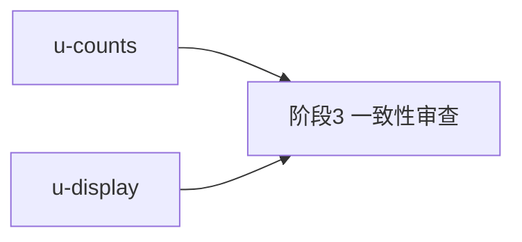

# sidebar-tab-count-restore 实施计划

基线: 935612f8f | 来源设计: docs/design/sidebar-tab-count-restore.md | 日期: 2026-09-12

## 0 章节映射

| 内容 | 设计文档实际位置 |
|------|--------------|
| 背景/目标 | §1 背景目标 |
| 终态/机制 | §2 现状与问题分析（含口径决策表 2.3）+ §3 解决方案（终态 3.1 / 决策 3.3） |
| 验收场景表 | §4 验收（6 场景） |
| 下一层拆分 | §5 下一层拆分（U1-U4 表） |
| 待验证检查点 | §5 末尾「待验证」：useSidebarCounts 引入 useSessionStore 循环依赖（实施时 typecheck 即证） |

## 1 目标快照（逐字摘录设计 §1）

> 四个 tab 恢复计数数字，口径明确且与「点进 tab 看到的列表」一致（不穿帮）；零新增跨进程通信、零轮询、零定时器——纯展示层恢复。

Out-of-scope（逐字）：文件树懒加载改造（递归全量文件数不可得，见 §2）、runtime 数据面、badge 动画、workflow 计数全局化。

**已确认决策**（用户 2026-09-12 拍板）：① badge 蓝点随数字恢复一并删除；② 文件数保持根层口径（目录计入）；③ 0 不渲染数字。

## 2 单元列表

| Unit | 职责 | 领地（精确文件路径） | 依赖 | 隔离 | 验收条款 |
|------|------|------|------|------|------|
| u-counts | 新增 `sessionCount` computed（`session.list` 长度 − `isMarkedDone` 归档数；依赖新增 `useSessionStore` + `useSessionMarkers.isMarkedDone`）+ 补单测（归档扣减 / markers 未 hydrate 首读 / 死会话计入） | `packages/renderer/src/composables/features/sidebar/useSidebarCounts.ts` `packages/renderer/src/__tests__/composables/useSidebarCounts.test.ts` | 无（契约先行：导出名 `sessionCount`） | plain | `cd packages/renderer && npx vitest run src/__tests__/composables/useSidebarCounts.test.ts` 全绿；导出表含 `sessionCount` |
| u-display | SegmentedTab 恢复 4 count props（`sessionCount`/`fileCount`/`subagentRunningCount`/`workflowRunningCount`）+ 数字渲染（`text-[length:var(--text-3xs)] text-neutral-mid`，0 不渲染）+ 删 badge span/字段；Sidebar.vue 解构补 `sessionCount`/`fileCount` 并接线；spec 改写（badge 断言→count 断言） | `packages/renderer/src/components/sidebar/SegmentedTab.vue` `packages/renderer/src/components/sidebar/Sidebar.vue` `packages/renderer/src/__tests__/sidebar/SegmentedTab.spec.ts` `packages/renderer/src/__tests__/sidebar/sidebar-layout.test.ts` | 无（props 契约本计划已固定，可并行） | plain | `cd packages/renderer && npx vitest run src/__tests__/sidebar/SegmentedTab.spec.ts src/__tests__/sidebar/sidebar-layout.test.ts` 全绿；`grep -n badge packages/renderer/src/components/sidebar/SegmentedTab.vue` 零命中 |

## 3 DAG 图

并行组：{u-counts, u-display}（领地零交集，接口契约 `sessionCount` 已固定）。

## 4 测试策略

- **增量**（单元开发期内）：`cd packages/renderer && npx vitest run <各领地测试文件>`（vitest，禁 node:test；命令取自 packages/renderer/package.json `test: vitest run`）
- **全量**（收尾 Gate A）：`cd packages/renderer && npx vitest run` 0 failed + `pnpm run lint`（全仓 lint，pre-commit 已验证 docs-only 变更全绿，本次为源码变更需复跑）
- **真机验收**（收尾 Gate B）：设计 §4 六场景逐行签收（归档扣减 / 增删联动 / 数字与列表不穿帮 / 焦点切换 / subagent 生命周期 / 性能自证）——归属阶段 5，非单测可替代
- 待验证检查点：`useSidebarCounts` 引入 `useSessionStore` 循环依赖——由 u-counts 的 typecheck/vitest 通过即证（session store 为 core 薄壳 createSessionStore，预期无环）

## 5 合理偏差登记表

| Unit | 偏差 | 判定 |
|------|------|------|
| u-counts | useSidebarCounts.ts 文件头注释同步更新（补 session 全局口径 + useSessionMarkers 依赖描述） | 合理：注释级偏离不改口径，新增计数后不同步会误导 |

## 6 状态表

| Unit | 状态 | 轮次 | 证据指针 |
|------|------|------|----------|
| u-counts | committed | 1 | 主 agent 核验：领地 2 文件吻合；vitest 13/13 绿（useSidebarCounts.test.ts）；合理偏差 1 条已登记（§5） |
| u-display | committed | 1 | 主 agent 核验：领地 4 文件吻合；vitest 14/14 绿（SegmentedTab.spec + sidebar-layout.test）；grep badge 零命中；自捕获修复 modelValue 漏声明（自引入，未外溢） |

## 7 残留风险与变更历史

- **对抗式审查跳过记录**：设计文档尾注声明按「按改动大小匹配投入」未启用三 reviewer 审查循环，用户阅后明示「OK，决策确认，继续」（2026-09-12 对话确认）——视为用户明示跳过，登记于此。若阶段 3 一致性审查发现设计层问题，回滚本登记升级处理。
- **认知外改动隔离**：工作区存在本会话外改动（`.tmp/dev-flow/subagent-record-persistence-consolidation.impl-plan.md`、`docs/design/timeout-zcode-turn-and-settled-watchdog.md`），全程不碰、不裹挟提交。
- 2026-09-12 计划创建，双单元并行派发。
- 2026-09-12 一致性审查第 1 轮（单 reviewer）：reasonable 3 条已登记（①sessionCount 用例超设计最低要求——无需回写 ②plugins tab 恒 0 显式处理——设计 §3.1 已补「挂载点占位不计数」 ③注释同步——已在 §5 偏差表）；unreasonable 2 条——[high] remove-persistent-decorations.test.ts TC1 打破全量红灯 → 修复批次派发（改写 TC1 + 复跑全量 0 failed）；[medium] 设计 §4 六场景未纳入验收 Gate → 本计划 §4 已补 Gate B 行，场景归属阶段 5 真机验收；doc_errors 2 条由主 agent 亲改设计文档（§3.1 listLoadError 过强表述改为「跟随 groups 现值」两态；§3.3 决策 1 影响面 + §5 U4 补记 remove-persistent-decorations.test.ts）。
- 2026-09-12 定向复审（修复批次影响面，b29689c85）：unreasonable 未发现（TC1 新断言守卫有效且原守卫未破坏；TC1 字符串断言固有盲区由 SegmentedTab.spec.ts DOM 级守卫补足——复审确认守卫面完整；注释两态与 core 链路一致）；doc_errors 1 条 trivial（设计 §3.1 错误卡行号引用 75-83 → 76-85）已顺手校正。审查清零，转阶段 5。
