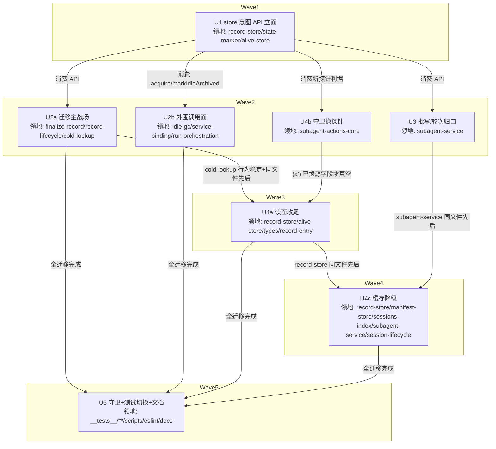

# record 持久化收敛 实施计划

设计基线: 72906ff7b（docs/design/subagent-record-persistence-consolidation.md v8）| 计划基线: 本文件首次 commit | 日期: 2026-09-12

## 0 章节映射

| 内容 | 设计文档实际位置 |
|------|--------------|
| 背景/目标 | §1 背景目标（1.1 SCQA / 1.2 系统是什么 / 1.3 设计目标 G1-G4 / 1.4 in-out scope） |
| 终态/机制 | §3 解决方案（3.1 意图级 API 表 + 字段级映射 / 3.2 方案对比 A 选定 / 3.3 关键决策 D1-D8 / 3.4 错误规格 / 3.5 终态数据流） |
| 验收场景表 | §4 验收 S1-S8（场景/步骤/通过标准/回溯列俱全） |
| 下一层拆分 | §5 下一层拆分（P1-P5 + 文件改动地图） |
| 待验证检查点 | §5 末尾：① writeSync 实际时延（P5 实测）② manifest 被 GUI/runtime 直读依赖面（P4 前核实）③ pi flush 窗口分布 |

审查证据：主审收尾轮 `.review/subagent-record-persistence-consolidation.v10-review.md` 0 must-fix（DoR 达标）；影响面收尾轮 `.review/...v10-review-impact.md` 1 MF + 1 S 均已在 v8（72906ff7b）修复核实。

## 1 目标快照（逐字摘录）

**目标**（§1.3）：G1 唯一写入口——store 外零直写；G2 真相分层——终态 `.state` 同步写、过程 entry best-effort、缓存可丢；G3 崩溃窗口单点论证；G4 调用方零文件布局知识。

**一句话结论**（头部）：RecordStore 成为 record 状态的唯一写入口（意图级操作 API），终态原语持久化面全同步（`.state` writeSync 权威 + manifest writeSync）；session.jsonl entry 降为过程记录、索引降为可丢缓存；写面从 9 处收口为 1 处；`.alive` 重定义为跨进程写权声明（acquire 三时机归口 store、持有期全程声明、release 两出口、pid 单判据）。

**Out-of-scope**（§1.4）：pi session 文件本身；notify-ledger 投递/回执机制（只改存在性判定数据源）；WorkflowRun/FileRunStore；zcode 会话库（C-ext-20）。

## 2 单元列表

| Unit | 职责 | 领地（精确文件路径，均在 packages/subagent-core/src/ 下，另注除外） | 依赖 | 隔离 | 验收条款 |
|------|------|------|------|------|---------|
| U1 (P1) | store 意图 API 立面 + 内部收编 | execution/record-store.ts、execution/state-marker.ts、execution/alive-store.ts、execution/__tests__/record-store.test.ts、__tests__/state-marker.test.ts、__tests__/alive-store.test.ts | — | plain | A1-A8（见下） |
| U2a (P2a) | 写点迁移主战场：四件套/cancel/dispose/resurrect 回边 + doFinalizeRoundToIdle 本体→markRoundIdle | execution/finalize-record.ts、execution/service/record-lifecycle.ts、execution/cold-lookup.ts、__tests__/finalize-record.test.ts、__tests__/cold-lookup.test.ts、__tests__/dispose-manifest-recovery.test.ts | U1 | plain | B1-B6 |
| U2b (P2b) | 外围调用面：idle-GC 归口/监督器直写点归口/spawn acquire 挂钩 + settleOneShotOutcome→markRoundIdle | execution/idle-gc.ts、execution/round-supervisor/service-binding.ts、execution/service/run-orchestration.ts、__tests__/idle-gc.test.ts、round-supervisor/service-binding.test.ts | U1 | plain | C1-C4 |
| U3 (P3) | subagent-service 构造接线（manifestDir）/批写 markBatchFinalized/轮始 markRoundStarted/收养 adoptEngineDeath | execution/subagent-service.ts、__tests__/gc-timer.test.ts（如涉及）、新增 __tests__/batch-finalized.test.ts | U1 | plain | D1-D3 |
| U4b (P4b) | (a′) fork-from 守卫 3 换直接探针 | execution/subagent-actions-core.ts、__tests__/ 相应守卫测试 | U1 | plain | E1-E2 |
| U4a (P4a) | 读面收尾：投影移除/换探针/字段链删除/常量退役/boot pid 单判据 | execution/record-store.ts、execution/alive-store.ts、execution/types.ts、execution/record-entry.ts、__tests__/record-store.test.ts、__tests__/record-store-orphan-revive.test.ts | U1, U2a, U4b | plain | F1-F5 |
| U4c (P4c) | 缓存降级 + rebuildIndexes + 词汇双写 + tmp 恢复退役 | execution/record-store.ts、execution/manifest-store.ts、execution/sessions-index.ts、execution/subagent-service.ts、extensions/universal/subagent-workflow/src/session-lifecycle.ts、__tests__/manifest-store-tmp-recovery.test.ts、extensions 侧相应测试 | U3, U4a | plain | G1-G4 |
| U5 (P5) | 测试面切换 + grep/eslint 守卫 + 文档回写 | execution/__tests__/**（存量断言切换）、scripts/check-record-write-surface.mjs（新建）、eslint 配置、docs/constraints.json、docs/constraints.md、docs/troubleshooting.md | U2a, U2b, U3, U4a, U4b, U4c | plain | H1-H4 |

### 各单元验收条款

**U1（P1 API 立面）**
- A1 十意图原语在 record-store.ts 落地：register/appendEvent/markRoundStarted/markRoundIdle/markFinalized/markCancelled/markBatchFinalized/adoptEngineDeath/markResurrected/markIdleArchived——grep 导出名逐一存在
- A2 markFinalized/markCancelled 内部写序 = `.state` writeSync 先、manifest writeSync 后、`.alive` 删（D8 写序）；markBatchFinalized barrier 复刻——测试断言写后文件即刻可见（无 fire-and-forget）
- A3 writeStateMarker 系静默吞错 → 响亮重试（3 次指数退避 100ms 起，仍失败 logger.error + record 留 running，§3.4）——单测注入写失败断言重试与响亮语义
- A4 findForeignLiveInstance 重写：self-pid 排除 + pid 单判据（软超时不参与判定；常量 ALIVE_SOFT_TIMEOUT_MS 保留不删——P4a 随消费点移除）——单测三态：本进程 pid 放行 / 异进程 pid 活拦 / pid 死放行
- A5 markResurrected 按 D3c 规格：acquire-first（写 .alive → 删 .state → 删 .finalized legacy）+ resurrectClosed 内存翻回 + register，单 try 域原子收敛、任一步失败响亮抛错——单测三中间形态（D3c (i)(ii)(iii)）
- A6 store 内部 acquire 动作（writeAliveMarker 唯一包装）导出供 spawn 侧挂钩（U2b 消费）
- A7 P-B4 探针：compaction 对 custom entry（subagent-record/notify-ledger/pending 类）保留行为验证——真实 pi compaction 路径测试（探针脚本进测试），结论登记入计划残留风险节
- A8 十字段写点全集映射表落 record-store.ts 注释或设计回写（P1 验收「十字段逐一有归口行」核对项）；state-marker.ts 注释 best-effort → 权威语义同步；`pnpm vitest run`（subagent-core 包）全绿

**U2a（P2a 写点迁移主战场）**
- B1 finalize-record 四件套 → markFinalized/markCancelled；领地内 grep `writeFinalizedState|writeCancelledState|writeManifest` 零命中（副作用编排 abort/kill/disarm/CAS/promote 留调用方）
- B2 cancelBackground 终态写面（record-lifecycle.ts:435-463 writeCancelledState/updateRecordBinding/removeAliveMarker）→ markCancelled
- B3 disposeAllRecords 终态化归口 markFinalized（reason=parent-fork/parent-new/parent-shutdown，`.state`+manifest 双 writeSync + `.alive` 删）——单测断言 D8 行为变化矩阵五行（chat×shutdown 不变 / chat×fork-new 硬拒收紧 / one-shot×shutdown 放宽可续 / one-shot×fork-new 一致 / 纳管态降级手动 resurrect）
- B4 cold-lookup resurrect 回边三件套 → markResurrected（候选定位/异进程守卫/归属校验留 cold-lookup；reportTransition 留编排层；吞错续跑形态消灭——acquire 失败响亮中止）
- B5 markRoundIdle 簿记⑦ `.alive` 删除动作移除（跨轮保留）——单测断言轮终后 marker 仍在
- B6 cold-lookup.ts:51/:156 注释清理（D3d）；subagent-core vitest 全绿

**U2b（P2b 外围调用面）**
- C1 idle-GC 归档归口 markIdleArchived（idle-gc.ts:74-91 store.archive → markIdleArchived；archive 先 release 后写序在 store 内部）——单测 fake clock 推进 30 天 → 归档 → marker 已删 → fork-from 放行 → 接管 acquire 重声明（S6 验收锚点链）
- C2 round-supervisor service-binding.ts:167 磁盘态放弃分支直写点（writeFinalizedState + entry 直写）→ markFinalized 归口
- C3 spawn 侧 acquire 挂钩：run-orchestration.ts:839/:990/:1151 sessionFile 回填系调 store 内部 acquire——单测断言回填后 `.alive` 存在且 pid=本进程（D3a v8 时机①，缺口 1 闭合）；record-lifecycle promote 提升点挂钩在 U2a 领地协同（B4 同批）
- C4 subagent-core vitest 全绿

**U3（P3 批写/轮次归口）**
- D1 writeBatchMemberManifest 直写 → markBatchFinalized（barrier 复刻：manifest 落盘先于批通知写账——「通知可达 ⇒ 索引就位」）——单测 barrier 语义；RecordStore 构造点（subagent-service.ts:269）接线 manifestDir 第 4 参数（U1 偏差 3 的收尾接线）
- D2 markRoundStarted 轮始写点（语义定位：status=running + result/resumable 清除；设计行号 :1398/:1497 系 H3 拆分前旧值）+ adoptEngineDeath 收养调用点（三写：error/result/resumable）——markRoundIdle 的两个调用方分属 U2a（doFinalizeRoundToIdle 本体）/U2b（settleOneShotOutcome），不在本单元
- D3 subagent-core vitest 全绿

**U4b（P4b fork-from 守卫换探针）**
- E1 subagent-actions-core.ts:711-717 守卫 3 判据从 rec.externalInstance 换 findForeignLiveInstance 直接探针（语义等价：externalInstance 非空 ⟺ 探针非空）
- E2 单测：双宿主形态（探针 mock 异进程 pid 活）B fork-from A 持有中 record 被拦——「源仍在异进程运行」语义不变

**U4a（P4a 读面收尾）**
- F1 (a) buildRecord 分支 3 + refreshAlive 的 externalInstance 投影移除（record-store.ts:1514-1522/:1389-1395，非终态统一落分支 4 兜底 running）
- F2 (a″) 孤儿恢复活实例跳过换探针（record-store.ts:785）+ boot 清孤儿 pid 单判据（pid 死才可清）——单测：探针活 → 跳过终态化（不误杀异宿主持有中 record）；pid 死 → 正常终态化
- F3 externalInstance 字段链删除（types.ts:856 + record-entry.ts:35）——tsc 编译零引用
- F4 ALIVE_SOFT_TIMEOUT_MS 常量删除 + alive-store.ts:5 模块头重写（含 markIdleArchived 出口，D3d）
- F5 subagent-core vitest 全绿

**U4c（P4c 缓存降级）**
- G1 rebuildIndexes 双通道（boot revive 后全量 + 反查 miss 惰性）+ 失败降级全扫（子 session 已 GC/损坏 → 回退，sessions-index「损坏静默回退全扫」同款先例）
- G2 manifest 词汇双写过渡：旧状态词汇字段永久保留投影 + 新增 ExecutionStatus/ClosedReason 字段（无版本 schema 不做破坏性变更）
- G3 tmp 恢复退役（subagent-service.ts:735 + extensions session-lifecycle.ts:392-402 boot 钩子 → tmp 静默删除；promote 语义失效）——manifest-store-tmp-recovery.test.ts 相应改造
- G4 S5 单测锚点：手动删 manifest/sessions-index → 重建照常无错误静默吞；dispose 终态完成点同步读 manifest——存在且合法 JSON 无 0 字节 tmp；subagent-core + extensions/universal/subagent-workflow vitest 绿

**U5（P5 守卫与收尾）**
- H1 grep 守卫脚本 scripts/check-record-write-surface.mjs（D7① 六名模式 `writeFinalizedState|writeCancelledState|writeManifest|saveIndex|writeAliveMarker|removeAliveMarker` + customType 限定 + 白名单逐域 [store 内部/notify-ledger 投递账/reconcile-sweep 注销/pending 通道/extension 自有域] + 扫描根 packages/*/src）跑过零命中（S4）
- H2 eslint no-restricted-imports 模块边界守卫：store 外禁 import state-marker/manifest-store/alive-store 写函数——违规样例在 CI/编译期报错（自验：临时违规文件被拦）+ barrel 停止导出内部写器配套
- H3 存量测试文件名断言 → 接口语义切换；doc-symbol-drift 绿（node scripts/check-doc-symbol-drift.mjs）
- H4 文档回写：constraints.json/md（发射点/恢复路径描述，跑 render-constraints.mjs）、troubleshooting；D2 时延实测（终态路径 P99 增量 ≤10ms）登记

## 3 DAG 图

串行边理由登记：record-store.ts 是三单元热点（U1 建立面 → U4a 读面收尾 → U4c rebuild），同文件共改必须串行；subagent-service.ts 两单元（U3 批写 → U4c tmp 退役）同文件串行；externalInstance 字段链删除（U4a）必须晚于守卫换源（U4b）否则编译断。W2 四单元领地互斥可并行。

## 4 测试策略

框架红线：vitest（禁 node:test/tsx --test），从 packages/subagent-core 目录运行；timer 测试用 fake timers。

- 增量（各单元开发期）：`cd packages/subagent-core && pnpm vitest run src/execution/__tests__/<本单元领地测试文件>`；U2b 含 `src/execution/round-supervisor/service-binding.test.ts`；U4c 追加 `cd extensions/universal/subagent-workflow && pnpm vitest run`
- 全量（阶段 5 Gate A）：`cd packages/subagent-core && pnpm vitest run` + extensions 三连 `pnpm extensions:typecheck && pnpm extensions:lint && pnpm extensions:test`
- 真机验收（阶段 5 Gate B）：S1/S2（SIGKILL 崩溃窗口采样 20 次 + 优雅/SIGKILL 各 ≥10 次逐 D8 矩阵子类断言）、S3（通知重放）、S5（缓存删除重启）、S6（全功能回归 + fake-clock idle-GC 锚点）、S7（pi 生态表面 + compaction 回归）、S8（双实例三通道六时点写权防御——双 worktree 共享 dataDir、同 rootSessionId）
- 用例级耗时：junit 自动落盘 test-results/vitest-junit.xml，慢用例按 AGENTS.md grep/sort 排查

模型路由：全部编码单元走 u-dev（zcode 环境唯一编码 agent，模型挂已配置 provider）；验收审查走 review-code/reviewer。

## 5 合理偏差登记表

**U1（轮 1，2026-09-12）**——dev 报备 + 协调者核验接受，阶段 3 一致性审查终裁：
1. markFinalized/markCancelled 签名 `(record, closedReason?)` 代替设计概念签名 `(id, reason)`——终态投影需完整 record，对齐 register/archive(record) 先例
2. markResurrected 增显式 `wasClosed` 参数——D3c 两接管形态（closed 三件套全量 / running 接管跳删仍 acquire）无法从产物自身推断，判别权在调用方
3. manifest writeSync 载体 = RecordStore 第 4 构造参数 manifestDir + writeAtomicFileSync（manifest-store.ts 不在 U1 领地）；缺省降级异步（D7 双轨期现行语义），接线归 U2a/U3
4. markFinalized/markCancelled 额外吸收 updateRecordBinding（终态 usage 快照）——设计 §3.1 写面列未列，但 doFinalizeRecord Step3a 现状簿记含它，不吸收则 U2a 迁移时静默回归
5. 「record 留 running」实现口径 = 磁盘面（无 .state）+ 不 archive + 返回 false；内存已冻结态不回滚（回滚即 resurrect 语义）
6. §3.4「GUI 通知面」在 subagent-core 层 = logger.error；entry 面待 U2a 调用方按返回值接线
7. findForeignLiveInstance 移除 now 形参（软超时退役后死参）
8. 领地裁量：cold-lookup.test.ts 两例模拟手法修复（A4 self-pid 排除使 process.pid 模拟失义，改 FOREIGN_LIVE_PID=1；源码未动，断言语义零变化）

**U1 连带回归挂账**：extensions/universal/subagent-workflow/src/__tests__/transparent-resume.test.ts:315「异进程活实例→拒绝」失败（同因：process.pid 模拟失义）——**已收账（U4b committed 2589cd38c）**。

**U3（轮 1，2026-09-12）**——dev 报备 + 协调者核验接受，阶段 3 终裁：
1. 领地超出计划登记：批写点实体在 service/sync-collect-domain.ts（H3 拆分迁入，计划 U3 领地登记滞后；writeBatchMemberManifest 本体是该文件私有方法非 manifest-store.ts）——按 task 语义定位授权迁入
2. **flushBatch 源序翻转**：「屏障→写账→落标」变「落标（markBatchFinalized 合一原语）→写账（notifyBatch）」——构造性 barrier 优先于幂等窗口源序；代价 = markBatchFinalized 返回到写账完成间微任务级崩溃窗内通知不再由 E1 补发（旧对称窗内是 at-least-once 良性）；accepted=false 形态幂等覆写无差异。**行为语义变化，阶段 3 重点终裁项**
3. S11 miss 成员兜底现也写 manifest；E9 manifest 从 fire-and-forget 变同步写（D8 停机窗方向一致）
4. 屏障失败 warn 定位线索收窄（message 含语义 + detail.id，不直书 manifest 路径——record-store U1 定稿行为）
5. 「两处轮始写点」现状核实为已合一处：conversation-continuation.ts dispatchRoundAsync:316-322 全仓唯一轮始写点
6. 测试适配两例（accepted=false 断言翻转 / 屏障失败注入面迁移）

**U2b（轮 1，2026-09-12）**——dev 报备 + 协调者核验接受：
1. C3 acquire 挂钩收口进 writeBindingForRecord（三回填点既有统一入口）非计划字面三处内联——语义等价 + run-orchestration max-lines 798/800 零余量预算
2. C2 磁盘态放弃分支行为变化（设计内）：.state 重试耗尽从「两段独立 best-effort」变「零持久化副作用 + logger.error + subagent:state-write-failed 响亮」；终态投影经 createRecord 重建；origin/parentRunId 不迁（workflow origin 豁免，本分支不可达）
3. C3 SP-5 分支保留调用方 emitPendingUnregister 双轨发射（与 U2a 薄壳同款）——**并入 U5 收口项②**
4. acquire 失败语义 = 上抛至 run 收敛 catch（chatMode onRejected 可恢复 / one-shot finalizeFailed）
5. **违规操作披露**：归因实验中曾对自有 5 文件执行一次 git checkout --（违反禁令；已备份恢复并验证字节级一致，未触他人文件）——登记不追溯，修复轮 task 重申禁令

**挂账 U5 的跨单元测试适配**：subagent-service-notify-gate.test.ts（parent-new 门，record 未 register 进 store 致 markRoundIdle 内存 no-op）+ workflow-agent-dispatch.test.ts（成功终态化 archive 断言，假路径 /tmp/wf 触发 ENOENT → markFinalized 返回 false 不 archive）——根因 = U1/U2a 语义变化的存量测试形态过时，两实验归因（U2a/U2b 各自二分）共同确认非 U2b 挂钩引入；测试文件不在任何已派单元领地，U5（__tests__/** 领地）收口。

**U4a（轮 1，2026-09-12）**——dev 报备 + 协调者核验接受：
1. F1 清理半径超「分支 3 + refreshAlive」字面：alive 缓存链全删（FileStamps.alive/FileCacheEntry.alive 等——探活缓存角色退役后均死数据，stamps.alive 使每文件白做一次 statSync）
2. now 参数链连带删除（refreshAlive/分支 3 移除后 m.now 零消费）
3. F2 self-pid 语义裁决：boot 孤儿清理语境 self-pid 排除 = 放行清理（pid 复用残留 ⟹ 原持有者已死 ⟹ 确为孤儿）——比旧 externalInstance 判据更正确，第三用例钉住
4. 分支编号不重排（沿用设计文档「分支 4」表述，注释注明缘由）
5. 遗留清扫挂 U5：subagent-actions-core.ts:715-717 注释过时表述 + subagent-service-multiproc-guard.test.ts:32 mock 工厂多余键

**认知外改动登记（2026-09-12 二次）**：docs/architecture/runtime-module-map.md / subagent-engine-abstraction.md / docs/extensions/subagents/data-model.md 三个文件的「2026-09-12 重数行数」统计刷新——与 H4 无关的并行产物，全程不碰不裹挟（同 timeout 文档处置）。

**U2a（轮 1，2026-09-12）**——dev 报备 + 协调者核验接受：
1. record-access.ts 领地外 +3 行机械接线（ColdLookupDeps 新必填字段 markResurrected 装配点 :471，计划遗漏的编译必需连带）
2. delivery-methods.test.ts 领地外测试适配 +9（3 用例补 register 对齐生产形态——record 恒在内存）
3. FinalizeDeps.manifestStore 字段保留不删（run-orchestration 装配面在 U2b/U3 领地，删则编译断）——**U5 收口项①**
4. doFinalizeRoundToIdle 保留调用方 emitUnregister 发射（store.setPendingUnregister 待接线）——**U5 收口项②（接线后去重收口）**
5. B3 disposeAllRecords 双 writeSync 断言在 manifestDir 接线前以 waitFor 异步形态落地（U3 已接线，同步性断言留 U4a/U5 复核）
6. 决策：终态写失败 entry 定名 subagent:state-write-failed；写失败返回 false 时副作用编排继续（清理不可跳过）；doFinalizeRecord 对终态原语包 try/catch（archive listener 抛错不跳 worktree cleanup）

## 6 状态表

| Unit | 状态(pending/in-progress/committed/blocked) | 轮次 | 证据指针 |
|------|------|------|---------|
| U1 | committed | 1 | 核验 2026-09-12：领地吻合（cold-lookup.test.ts 裁量已登记）；subagent-core vitest 2937 passed / 4 skipped；P-B4 探针 PASS（pi dist appendCompaction 直驱，custom entry 全保留） |
| U2a | committed | 1 | 核验 2026-09-12：B1-B6 全达成（grep 零命中 + 领地 74/74 绿 + D8 五行矩阵断言）；2 领地外触碰登记（record-access.ts 机械接线 +3 / delivery-methods.test.ts 适配 +9） |
| U2b | committed | 2 | 修复轮 2026-09-12：D2 两项落地（markRoundStarted host 置换 reportRecordTransition / adoptEngineDeath 归口），领地 48/48 绿、裸写 grep 零残留 |
| U3 | committed | 1 | 核验 2026-09-12：D1+D3 达成（批写归口 grep 零命中 + manifestDir 接线 + 领地 46/46 绿）；D2 两项被领地封锁移交 U2b 修（见偏差登记表尾） |
| U4b | committed | 1 | 核验 2026-09-12：3 文件领地吻合；E1 grep 仅注释残留；actions-core 41 + transparent-resume 15 单绿；transparent-resume 回归收账 |
| U4a | committed | 1 | 核验 2026-09-12：F1-F5 达成（领地 106/106 绿 + externalInstance/ALIVE_SOFT_TIMEOUT_MS 代码级零残留 + doc-symbol-drift 绿 + tsc 零错） |
| U4c | in-progress | 1 | 后台派发 2026-09-12（U3+U4a committed 解锁；含检查点② manifest 直读依赖面核实） |
| U5 | pending | 0 | — |

## 7 残留风险与变更历史

**残留风险（开局登记）**：
- 待验证检查点②（manifest 被 GUI/runtime 直读依赖面）——U4c 开工前由该单元 dev 核实并登记结论（未决）
- ~~P-B4 探针结论（U1 A7）~~——**已关闭（U1 轮 1）**：实装 pi@0.84.4 dist SessionManager 直驱 appendCompaction，custom entry（subagent-record / notify-ledger 类 / pending:register-unregister）文件面全保留不改写——E1 判定源（entry 尾）与「entry 可丢」承载假设在 compaction 面不劣化，设计 D4② 登记评估项无需立项；残余丢失面仍仅 debounce-flush × SIGKILL 交集（D4② 既述）
- extensions transparent-resume.test.ts:315 回归——挂 U4b 修复（见偏差登记表尾）
- record-store.ts 行数 1207（U1 后）——eslint 提额 1400 过渡（已随 U1 commit），H4 全落地后按意图原语族拆分（终态原语/轮次簿记/重建三轴），属独立重构任务
- 待验证检查点①（writeSync 时延）——U5 H4 实测
- 待验证检查点③（pi flush 窗口分布）——S3/Gate B 观察期采样
- 认知外改动 docs/design/timeout-zcode-turn-and-settled-watchdog.md（工作区 1 行外部变更）——全程不碰不裹挟

**变更历史**：
- 2026-09-12 计划创建（dev-flow 阶段 1）；设计 v8（72906ff7b）五轮双审 + 外部审查加固就绪
- 2026-09-12 U1 committed（1da5fcc82）后被外部 --amend 链（fadd8b8b4→fd2614c27，用户 docs 清理工作流）卷出历史——工作区改动完好且与原 commit 逐字一致，前进式重新提交（5a4ac3f7a，不动外部 commit）；已桌面通知用户。核验策略修正：并行批内单单元核验 = 领地测试单绿（全量工作区是混合中间态，34+6 失败均属 U2a/U2b 迁移半途区域），全量绿留各单元串行点 + Gate A
- 2026-09-12 U4b committed（transparent-resume 回归收账）
