# 代码架构设计 — 前端 renderer ↔ runtime 集成（W11+）

## 1. 工程目录

### 1.1 前端 renderer（变化轴：UI 区域 + 域适配）

```
src-electron/renderer/src/
├── api/
│   ├── domains/
│   │   ├── chat.ts          # 消息/compact/历史（动作-请求混合）
│   │   ├── config.ts        # provider/skill/agent 的请求+订阅+动作
│   │   ├── extension.ts     # extension 订阅+安装/卸载动作（#5/#11）
│   │   ├── git.ts           # git.status/stage/unstage/commit（#1）
│   │   ├── model.ts         # model 列表订阅+切换
│   │   ├── plugin.ts        # plugin 订阅骨架
│   │   ├── session.ts       # session CRUD
│   │   └── settings.ts      # 转发 config/extension 订阅 + system 偏好
│   ├── mock/
│   │   ├── index.ts         # mock 门面：补完整流式剧本（#4）
│   │   ├── git.ts           # git.status fixture（#4/#1）
│   │   ├── data.ts          # session/message fixture
│   │   ├── settings-data.ts # provider/skill/agent/extension fixture
│   │   └── composer-data.ts # model fixture
│   ├── events.ts            # session/global 双通道分发（#2/#7）
│   ├── pending.ts           # 请求-响应 id → Promise 注册表
│   ├── transport.ts         # ws-client 适配
│   └── index.ts             # mock/real 门面三元切换
├── stores/
│   ├── chat.ts              # 按 sessionId 分区的消息 store
│   ├── chat-chunk-processor.ts  # message.* case 归约（#8）
│   ├── chat-readers.ts      # payload 安全读取 + FileChange 合并
│   ├── chat-store-types.ts  # RetryState / QueueState
│   └── ...                  # session/sidebar/navigation/panel
├── composables/features/
│   ├── useChat.ts           # chat 业务编排（send/abort/steer/followUp/compact）
│   ├── useSidebar.ts        # sidebar 业务编排 + session.list 订阅（#7）
│   ├── useSideDrawer.ts     # SideDrawer 打开/钉住/tab 控制（#9）
│   └── ...
└── components/
    ├── panel/
    │   ├── Panel.vue        # 恢复 zone ⑤ GitZone
    │   ├── GitZone.vue      # git 四态展示+操作（#3）
    │   ├── SideDrawer.vue   # 右抽屉容器（#9）
    │   ├── Composer.vue     # slash command /compact + retry/queue 指示位宿主（#13）
    │   ├── RetryIndicator.vue # auto_retry 指示位（#13）
    │   ├── QueueBubble.vue    # queue_update pending 气泡（#13）
    │   └── ...
    ├── sidebar/
    │   ├── FileView.vue     # 切到 chat store fileChanges 聚合（#10）
    │   └── ...
    └── settings/
        ├── ExtensionPage.vue    # 安装/卸载/候选选择 UI（#5）
        └── SettingsModal.vue    # 订阅 config/extension 域
```

| 目录/文件 | 职责 | 变化轴 | 依赖方向 |
|----------|------|--------|---------|
| `api/domains/*.ts` | 单个域的三类形态入口 | 域协议变化 | 依赖 `events`/`transport`/`pending` |
| `api/events.ts` | ServerMessage 双通道路由 | 通道类型增删 | 被所有 domain + features 依赖 |
| `api/mock/index.ts` | mock/real 同构门面 | mock 剧本变化 | 依赖 `events`（dispatchSession） |
| `stores/chat*.ts` | session 隔离的消息状态 | message.* 类型增删 | 依赖 `shared` 类型；不依赖其它 store |
| `composables/features/*.ts` | 跨 store/api 的编排 | 业务流程变化 | 依赖 stores + api/domains |
| `components/panel/*.vue` | Panel 区域 UI（含 retry/queue 指示位占位 #13） | 设计稿 zone 变化 | 依赖 composables + stores |
| `components/sidebar/FileView.vue` | 文件改动视图 | fileChanges 消费方式 | 依赖 chat store |
| `composables/features/useSideDrawer.ts` | SideDrawer 打开/钉住/tab 控制逻辑 | widget tab 增删 | 依赖 stores + api/domains |

### 1.2 Runtime（变化轴：消息类型 + 外部系统适配）

```
src-electron/runtime/src/
├── transport/
│   ├── server.ts                  # 中央路由 + IMessageBroker
│   ├── session-message-handler.ts # session/message 路由
│   ├── extension-message-handler.ts # extension 安装/卸载/状态路由
│   ├── git-message-handler.ts     # git.* 路由（#1 新建）
│   ├── settings-message-handler.ts
│   ├── plugin-message-handler.ts
│   ├── tree-message-handler.ts
│   └── bridge-handler.ts
├── services/
│   ├── session/
│   │   ├── session-service.ts     # session 生命周期 Facade
│   │   ├── message-dispatcher.ts  # send/abort/steer/followUp/compact
│   │   └── session-lifecycle.ts
│   ├── git-service.ts             # git 状态查询+写操作编排（#1 新建）
│   ├── extension-service.ts       # extension 扫描/安装/卸载
│   ├── config-service.ts
│   ├── model-service.ts
│   └── ports/
│       ├── session.ts
│       ├── config.ts
│       ├── model.ts
│       ├── pi-engine.ts
│       ├── extension-settings.ts  # extension 启用状态持久化 port
│       ├── installer.ts           # git clone / npm install port
│       └── git-executor.ts        # IGitExecutor port（#1 新建）
├── infra/
│   ├── pi/
│   │   ├── event-adapter.ts       # pi event → ServerMessage
│   │   ├── file-change-reconciler.ts # git status 解析
│   │   └── ...
│   ├── git-executor.ts            # execFileSync 实现（#1 新建）
│   └── git-status-parser.ts       # 复用 reconciler 解析 git status（#1 新建）
└── plugins/demo/                  # 内置 demo plugin（widget 来源）
```

| 目录/文件 | 职责 | 变化轴 | 依赖方向 |
|----------|------|--------|---------|
| `transport/*.ts` | ClientMessage 路由 | 消息类型增删 | 依赖 services |
| `services/*-service.ts` | 业务编排 | 业务规则变化 | 依赖 ports；不直接碰 infra |
| `services/ports/*.ts` | 外部系统 seam | 适配器替换 | 被 service 依赖；由 infra 实现 |
| `infra/*.ts` | IO/外部系统实现 | 技术实现变化 | 依赖 ports（实现接口） |
| `infra/pi/event-adapter.ts` | pi 事件翻译 | pi 协议变化 | 生产 ServerMessage |

### 1.3 Shared（变化轴：协议契约）

```
src-electron/shared/src/
├── protocol.ts      # ClientMessageType / ServerMessageType / payload 映射
├── message.ts       # Message / ToolCall / FileChange / ChangeSetStatus
├── extension.ts     # ExtensionInfo / ExtensionUIMethod
├── session.ts       # SessionSummary / SessionGroup
├── settings.ts      # ProviderInfo / SkillInfo / AgentInfo
├── provider.ts      # ModelInfo
├── errors.ts        # 错误类型
└── constants.ts     # ENV 白名单等常量
```

## 2. 包依赖图

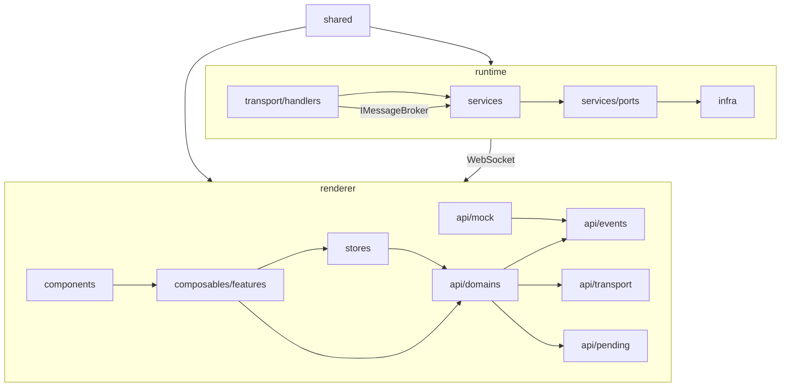
```mermaid
graph TD
    subgraph renderer
        C[components] --> F[composables/features]
        F --> S[stores]
        F --> D[api/domains]
        S --> D
        D --> E[api/events]
        D --> T[api/transport]
        D --> P[api/pending]
        M[api/mock] --> E
    end

    subgraph runtime
        H[transport/handlers] --> Svc[services]
        Svc --> Ports[services/ports]
        Ports --> Infra[infra]
        H -->|IMessageBroker| Svc
    end

    shared --> renderer
    shared --> runtime
    runtime -->|WebSocket| renderer

    classDef new fill:#90EE90
    class git,ge,gh,gs new
```

新增/重点修改节点：
- `git` = `api/domains/git.ts`
- `ge` = `services/ports/git-executor.ts`
- `gh` = `transport/git-message-handler.ts`
- `gs` = `services/git-service.ts`

### Import 规则

| 规则 | 说明 |
|------|------|
| components 不直接 import api/domains | 统一走 composables/features |
| stores 间禁止互相 import | 派生逻辑放在 composables/features |
| api/domains 不互相 import | settings.ts 例外：只转发 config/extension 的订阅/动作入口 |
| runtime services 不直接 import infra | 必须经 ports |
| runtime handlers 不直接 import infra | 只调 services |
| shared 可被任何层 import | 禁止反向依赖 |

### 循环依赖检测点

1. `api/domains/settings.ts` → `config.ts` / `extension.ts`：settings 转发订阅入口，不形成环（config/extension 不回引 settings）。
2. `stores/chat.ts` → `chat-chunk-processor.ts` → `chat-readers.ts`：单向工具链，无环。
3. `runtime` handlers → services → ports → infra：单向分层，无环。
4. `api/mock/index.ts` import `../events`：mock 依赖 events 做 dispatchSession，events 不依赖 mock，无环。

## 3. API 契约

### 3.1 Frontend Domain: git.ts（#1 新建）

| 方法 | 签名 | 返回 | 边界条件 | Spec/Issue 关联 |
|------|------|------|---------|----------------|
| status | `(sessionId: string) => Promise<GitStatusResult>` | GitStatusResult | session 不存在 → error envelope | FR-12 |
| stage | `(sessionId: string, filePaths?: string[]) => Promise<void>` | void | 空 filePaths → git add -A | FR-12 |
| unstage | `(sessionId: string, filePaths?: string[]) => Promise<void>` | void | 空 filePaths → git reset HEAD | FR-12 |
| commit | `(sessionId: string, message?: string) => Promise<void>` | void | 冲突态 commit → error envelope code=git_conflict | FR-12 |

### 3.2 Frontend Domain: extension.ts（#5/#11 扩展）

| 方法 | 签名 | 返回 | 边界条件 | Spec/Issue 关联 |
|------|------|------|---------|----------------|
| onExtensions | `(handler: (exts: ExtensionInfo[]) => void) => () => void` | cancel fn | 无 | FR-5 |
| toggle | `(name: string, enabled: boolean) => Promise<void>` | void | extension 不存在 → error envelope | FR-5 |
| install | `(source: string) => Promise<void>` | void | npm 包不存在 → error envelope | FR-5 |
| uninstall | `(name: string) => Promise<void>` | void | 未安装 → error envelope | FR-5 |
| installDir | `(path: string) => Promise<ExtensionDiscoveredPayload>` | discovered | 路径不合法 → error envelope | FR-5 |
| installGit | `(url: string) => Promise<ExtensionDiscoveredPayload>` | discovered | URL 不合法 → error envelope | FR-5 |
| finishInstall | `(tempDir: string, selected: string[]) => Promise<void>` | void | tempDir 不存在 → error envelope | FR-5 |
| cancelInstall | `(tempDir: string) => Promise<void>` | void | 无 | FR-5 |
| onWidget | `(sessionId: string, handler: OnWidgetHandler) => () => void` | cancel fn | 无 | FR-7 |
| onStatus | `(sessionId: string, handler: OnStatusHandler) => () => void` | cancel fn | 无 | FR-7 |

### 3.3 Frontend Domain: chat.ts（#6 扩展）

| 方法 | 签名 | 返回 | 边界条件 | Spec/Issue 关联 |
|------|------|------|---------|----------------|
| compact | `(sessionId: string) => Promise<void>` | void | session 未激活 → error envelope | FR-6 |
| send / abort / steer / followUp / getHistory / streamSubscribe | 现有 | - | - | - |

### 3.4 Frontend events.ts（#2/#7）

| 方法 | 签名 | 返回 | 边界条件 | Spec/Issue 关联 |
|------|------|------|---------|----------------|
| on | `(sessionId: string, handler: MessageHandler) => () => void` | cancel fn | 无 | D-7 |
| onGlobalType | `<T extends ServerMessageType>(type: T, handler: (msg: ServerMessage<T>) => void) => () => void` | cancel fn | 无 | D-2 |
| dispatchSession | `(sessionId: string, msg: ServerMessage) => void` | void | 无 listener → no-op | D-7 |
| dispatchGlobal | `(msg: ServerMessage) => void` | void | 无 listener → no-op | D-2 |

### 3.5 Frontend Domain: settings.ts & config.ts（#2 规范化）

settings.ts 是 config.ts / extension.ts 订阅与动作的薄转发层；config.ts 是 provider/skill/agent 三类形态的入口。

#### config.ts

| 方法 | 形态 | 签名 | 返回 | 边界条件 | Spec/Issue 关联 |
|------|------|------|------|---------|----------------|
| listProviders | 请求 | `() => Promise<ProviderInfo[]>` | ProviderInfo[] | 无 | #2 |
| scanSkills | 请求 | `(sources: string[]) => Promise<SkillInfo[]>` | SkillInfo[] | 无 | #2 |
| scanAgents | 请求 | `(sources: string[]) => Promise<AgentInfo[]>` | AgentInfo[] | 无 | #2 |
| discoverModels | 请求 | `(req) => Promise<DiscoveredModelsResult>` | DiscoveredModelsResult | 无 | #2 |
| onProviders | 订阅 | `(handler) => () => void` | cancel fn | 无 | #2 |
| onSkills | 订阅 | `(handler) => () => void` | cancel fn | 无 | #2 |
| onAgents | 订阅 | `(handler) => () => void` | cancel fn | 无 | #2 |
| onDefaults | 订阅 | `(handler) => () => void` | cancel fn | 无 | #2 |
| setProvider / deleteProvider | 动作 | `(id, data?) => Promise<void>` | void | 失败 → error envelope | #2 |
| setSkill / deleteSkill | 动作 | `(skill/skillId) => Promise<void>` | void | 失败 → error envelope | #2 |
| setAgent / deleteAgent | 动作 | `(agent/agentId) => Promise<void>` | void | 失败 → error envelope | #2 |

#### settings.ts

| 方法 | 形态 | 签名 | 返回 | 边界条件 | Spec/Issue 关联 |
|------|------|------|------|---------|----------------|
| onProviders / onSkills / onAgents / onExtensions / onDefaults | 订阅 | 转发 config/extension 订阅 | cancel fn | 无 | #2 |
| listProviders | 请求 | 转发 config.listProviders | ProviderInfo[] | 无 | #2 |
| setProvider | 动作 | 转发 config.setProvider | void | 无 | #2 |
| getSystem / updateSystem | 请求/动作 | 读/写 localStorage | SystemSettings | 无 | #2 |

**规范化约束**：settings.ts 不再暴露 `getSkills/getAgents/getExtensions` 等 Promise 形态；SettingsModal.vue 改为 `onMounted` 订阅消费。

### 3.6 Runtime Handler: GitMessageHandler（#1 新建）

| 方法 | 签名 | 返回 | 边界条件 | Spec/Issue 关联 |
|------|------|------|---------|----------------|
| handles | `readonly ClientMessageType[]` | ['git.status','git.stage','git.unstage','git.commit'] | - | FR-12 |
| handleGitMessage | `(msg: ClientMessage, ws: WsType) => Promise<void>` | void | 命令白名单/路径校验 | FR-12 |

### 3.7 Runtime Service: GitService（#1 新建）

| 方法 | 签名 | 返回 | 边界条件 | Spec/Issue 关联 |
|------|------|------|---------|----------------|
| getStatus | `(sessionId: string) => Promise<GitStatusResult>` | GitStatusResult | cwd 无 .git → isRepo=false | FR-12 |
| stage | `(sessionId: string, filePaths?: string[]) => Promise<void>` | void | 路径超出 workspace → throw | FR-12 |
| unstage | `(sessionId: string, filePaths?: string[]) => Promise<void>` | void | 路径超出 workspace → throw | FR-12 |
| commit | `(sessionId: string, message?: string) => Promise<void>` | void | 冲突 → throw GitCommitError | FR-12 |

### 3.8 Runtime Port: IGitExecutor（#1 新建）

| 方法 | 签名 | 返回 | 边界条件 | Spec/Issue 关联 |
|------|------|------|---------|----------------|
| exec | `(cwd: string, command: GitCommand, args?: string[]) => Promise<GitExecutorResult>` | {stdout,stderr,exitCode} | 命令不在白名单 → throw | FR-12 |

```typescript
// services/ports/git-executor.ts
type GitCommand = 'status' | 'stage' | 'unstage' | 'commit'
interface GitExecutorResult { stdout: string; stderr: string; exitCode: number }
interface IGitExecutor {
  exec(cwd: string, command: GitCommand, args?: string[]): Promise<GitExecutorResult>
}
```

### 3.9 Shared Protocol 新增契约（#1/#12）

```typescript
// ClientMessageType 新增
type ClientMessageType = ... | 'git.status' | 'git.stage' | 'git.unstage' | 'git.commit'

// ClientMessageMap 新增
interface ClientMessageMap {
  'git.status': { sessionId: string }
  'git.stage': { sessionId: string; filePaths?: string[] }
  'git.unstage': { sessionId: string; filePaths?: string[] }
  'git.commit': { sessionId: string; message?: string }
}

// ServerMessageType 新增
type ServerMessageType = ... | 'git.status:result'

// ServerMessageMap 新增（git.status:result 为新增类型）
// 注：F2 stage/unstage/commit 的 ack 复用既有 'message.status'（protocol.ts:176 已在联合中，
// payload {sessionId, status}），非新增，此处不重复登记。
interface ServerMessageMap {
  'git.status:result': GitStatusResult
}

// [STALE] message.tool_call_pending：runtime 不生产（tool 审批链路 Out-of-scope，
// confirm/select→tool_call_pending 映射已被有意移除，见 event-adapter-extension.test.ts
// 反向断言）。本轮不定义 payload、不补 consume case、ToolCallStatus 不加 'pending'。
// spec FR-2/G-002 前提失效，待审批链路纳入 scope 时重新引入生产点。

// 共享 DTO
interface GitStatusResult {
  sessionId: string
  isRepo: boolean
  branch?: string
  stagedCount: number
  unstagedCount: number
  stats: { add: number; del: number }
  hasConflict: boolean
  files: GitFileStatus[]
}

interface GitFileStatus {
  path: string
  xyCode: string
  status: 'added' | 'modified' | 'deleted' | 'unmerged' | 'renamed' | 'untracked'
}

// ExtensionInfo 扩展
interface ExtensionInfo {
  // ...existing...
  // tools 可选：runtime 扫描到时填，未扫描/无 tools 的 extension 为 undefined，避免强制 runtime 同步改造
  tools?: string[]
}

// message.ts 枚举扩展
type ToolCallStatus = 'running' | 'completed' | 'error'
// 注：'pending' 不加（见上文 [STALE] 说明，tool_call_pending 无生产者）
type FileChangeStatus = 'added' | 'modified' | 'deleted' | 'unmerged'
```

## 4. 功能代码链路（时序图）

### 4.1 F1: git.status 查询 → GitZone 渲染

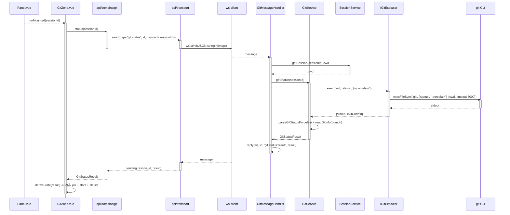
```mermaid
sequenceDiagram
    participant P as Panel.vue
    participant GZ as GitZone.vue
    participant GD as api/domains/git
    participant T as api/transport
    participant WS as ws-client
    participant GH as GitMessageHandler
    participant GS as GitService
    participant SS as SessionService
    participant GE as IGitExecutor
    participant Git as git CLI

    P->>GZ: onMounted(sessionId)
    activate GZ
    GZ->>GD: status(sessionId)
    activate GD
    GD->>T: send({type:'git.status', id, payload:{sessionId}})
    activate T
    T->>WS: ws.send(JSON.stringify(msg))
    deactivate T
    deactivate GD

    WS-->>GH: message
    activate GH
    GH->>SS: getSession(sessionId).cwd
    activate SS
    SS-->>GH: cwd
    deactivate SS
    GH->>GS: getStatus(sessionId)
    activate GS
    GS->>GE: exec(cwd, 'status', ['--porcelain'])
    activate GE
    GE->>Git: execFileSync('git', ['status','--porcelain'], {cwd, timeout:5000})
    activate Git
    Git-->>GE: stdout
    deactivate Git
    GE-->>GS: {stdout, exitCode:0}
    deactivate GE
    GS->>GS: parseGitStatusPorcelain + readGitInfo(branch)
    GS-->>GH: GitStatusResult
    deactivate GS
    GH->>GH: reply(ws, id, 'git.status:result', result)
    deactivate GH

    WS-->>T: message
    activate T
    T-->>GD: pending.resolve(id, result)
    deactivate T
    GD-->>GZ: GitStatusResult
    GZ->>GZ: deriveState(result) -> 四态 pill + stats + file list
    deactivate GZ
```

#### 方法签名表

| 类 | 方法 | 签名 | 返回 | 边界条件 | Spec/Issue |
|----|------|------|------|---------|-----------|
| GitZone.vue | onMounted hook | - | void | 无 sessionId 不渲染 | #3 |
| git domain | status | `(sessionId: string) => Promise<GitStatusResult>` | GitStatusResult | session 不存在 → pending.reject | #1 |
| GitMessageHandler | handleGitMessage | `(msg: ClientMessage, ws: WsType) => Promise<void>` | void | 非法 command → sendError | #1 |
| GitService | getStatus | `(sessionId: string) => Promise<GitStatusResult>` | GitStatusResult | cwd 非 git → isRepo=false | #1 |
| IGitExecutor | exec | `(cwd, 'status', args) => Promise<GitExecutorResult>` | GitExecutorResult | 命令白名单校验 | #1 |
| GitZone.vue | deriveState | `(result: GitStatusResult) => GitZoneState` | {state, stats, files} | isRepo=false 隐藏 zone | #3 |

#### 数据流链

Panel.vue onMounted → GitZone.vue status() → transport.send('git.status') → WebSocket → GitMessageHandler → GitService.getStatus() → IGitExecutor.exec('status') → git CLI → parse → reply 'git.status:result' → pending.resolve → GitZone.vue deriveState → render

#### 关联
- requirements.md 用例: UC-1（开发联调）/ UC-2（git-zone 四态）
- issues.md 方案: #1 方案 A + #3 方案 A + #9 方案 A
- NFR 影响: 安全（execFileSync 数组参数）、性能（大仓库 status timeout）、稳定性（isRepo:false 降级）

### 4.2 F2: git.stage/unstage/commit 操作

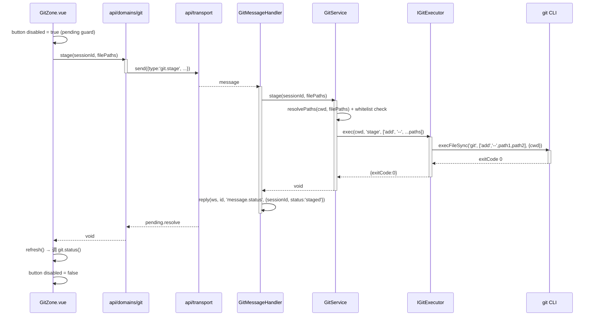
```mermaid
sequenceDiagram
    participant GZ as GitZone.vue
    participant GD as api/domains/git
    participant T as api/transport
    participant GH as GitMessageHandler
    participant GS as GitService
    participant GE as IGitExecutor
    participant Git as git CLI

    GZ->>GZ: button disabled = true (pending guard)
    GZ->>GD: stage(sessionId, filePaths)
    activate GD
    GD->>T: send({type:'git.stage', ...})
    deactivate GD
    T-->>GH: message
    activate GH
    GH->>GS: stage(sessionId, filePaths)
    activate GS
    GS->>GS: resolvePaths(cwd, filePaths) + whitelist check
    GS->>GE: exec(cwd, 'stage', ['add', '--', ...paths])
    activate GE
    GE->>Git: execFileSync('git', ['add','--',path1,path2], {cwd})
    activate Git
    Git-->>GE: exitCode 0
    deactivate Git
    GE-->>GS: {exitCode:0}
    deactivate GE
    GS-->>GH: void
    deactivate GS
    GH->>GH: reply(ws, id, 'message.status', {sessionId, status:'staged'})
    deactivate GH
    T-->>GD: pending.resolve
    GD-->>GZ: void
    GZ->>GZ: refresh() → 调 git.status()
    GZ->>GZ: button disabled = false
```

#### 异常路径

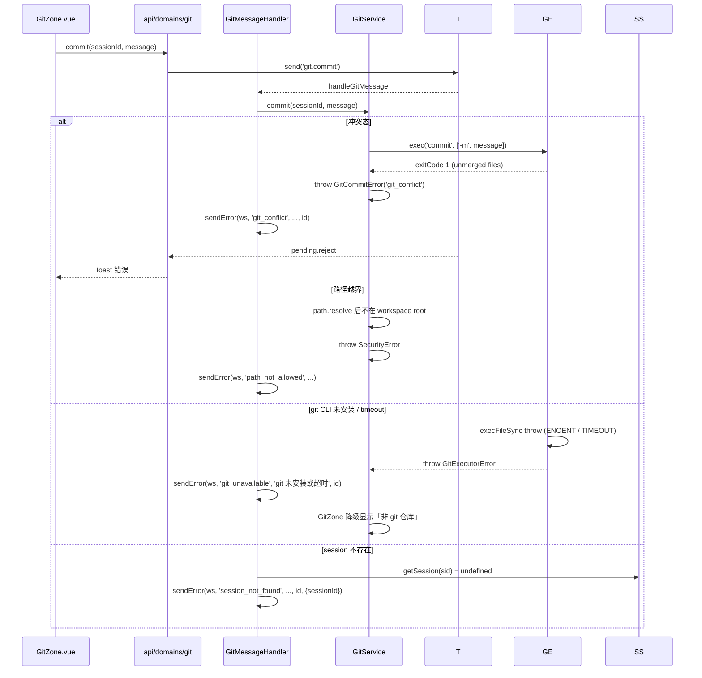
```mermaid
sequenceDiagram
    participant GZ as GitZone.vue
    participant GD as api/domains/git
    participant GH as GitMessageHandler
    participant GS as GitService

    GZ->>GD: commit(sessionId, message)
    GD->>T: send('git.commit')
    T-->>GH: handleGitMessage
    GH->>GS: commit(sessionId, message)
    alt 冲突态
        GS->>GE: exec('commit', ['-m', message])
        GE-->>GS: exitCode 1 (unmerged files)
        GS->>GS: throw GitCommitError('git_conflict')
        GH->>GH: sendError(ws, 'git_conflict', ..., id)
        T-->>GD: pending.reject
        GD-->>GZ: toast 错误
    else 路径越界
        GS->>GS: path.resolve 后不在 workspace root
        GS->>GS: throw SecurityError
        GH->>GH: sendError(ws, 'path_not_allowed', ...)
    else git CLI 未安装 / timeout
        GE->>GE: execFileSync throw (ENOENT / TIMEOUT)
        GE-->>GS: throw GitExecutorError
        GH->>GH: sendError(ws, 'git_unavailable', 'git 未安装或超时', id)
        GS->>GS: GitZone 降级显示「非 git 仓库」
    else session 不存在
        GH->>SS: getSession(sid) = undefined
        GH->>GH: sendError(ws, 'session_not_found', ..., id, {sessionId})
    end
```

#### 方法签名表

| 类 | 方法 | 签名 | 返回 | 边界条件 | Spec/Issue |
|----|------|------|------|---------|-----------|
| GitZone.vue | onStage | `(paths?: string[]) => Promise<void>` | void | pending 中按钮 disabled | #3 |
| git domain | stage/unstage/commit | 见 §3.1 | void | 见 §3.1 | #1 |
| GitService | stage/unstage/commit | `(sessionId, paths?) => Promise<void>` | void | 路径越界 throw | #1 |
| IGitExecutor | exec | 见 §3.8 | GitExecutorResult | 命令白名单 | #1 |

#### 数据流链
GitZone 按钮 → git.domain.stage() → transport → GitMessageHandler → GitService.stage() → IGitExecutor.exec('stage') → git add → ack → GitZone 刷新 status

#### 关联
- issues.md 方案: #1 方案 A
- NFR 影响: 安全（路径白名单）、并发（pending guard）、可观测（审计日志）

### 4.3 F3: Extension 安装多步流

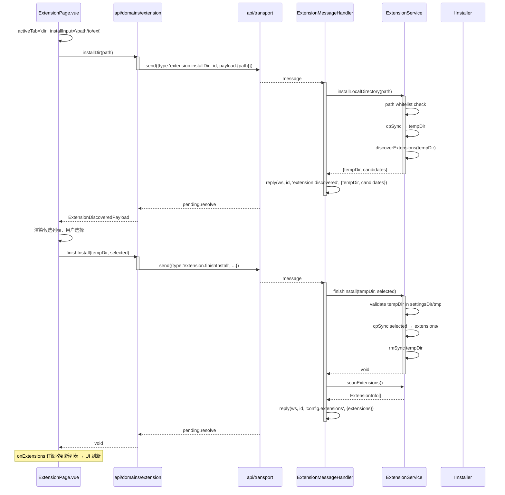
```mermaid
sequenceDiagram
    participant EP as ExtensionPage.vue
    participant ED as api/domains/extension
    participant T as api/transport
    participant EH as ExtensionMessageHandler
    participant ES as ExtensionService
    participant Ins as IInstaller

    EP->>EP: activeTab='dir', installInput='/path/to/ext'
    EP->>ED: installDir(path)
    activate ED
    ED->>T: send({type:'extension.installDir', id, payload:{path}})
    deactivate ED
    T-->>EH: message
    activate EH
    EH->>ES: installLocalDirectory(path)
    activate ES
    ES->>ES: path whitelist check
    ES->>ES: cpSync → tempDir
    ES->>ES: discoverExtensions(tempDir)
    ES-->>EH: {tempDir, candidates}
    deactivate ES
    EH->>EH: reply(ws, id, 'extension.discovered', {tempDir, candidates})
    deactivate EH
    T-->>ED: pending.resolve
    ED-->>EP: ExtensionDiscoveredPayload

    EP->>EP: 渲染候选列表，用户选择
    EP->>ED: finishInstall(tempDir, selected)
    activate ED
    ED->>T: send({type:'extension.finishInstall', ...})
    deactivate ED
    T-->>EH: message
    activate EH
    EH->>ES: finishInstall(tempDir, selected)
    activate ES
    ES->>ES: validate tempDir in settingsDir/tmp
    ES->>ES: cpSync selected → extensions/
    ES->>ES: rmSync tempDir
    ES-->>EH: void
    deactivate ES
    EH->>ES: scanExtensions()
    ES-->>EH: ExtensionInfo[]
    EH->>EH: reply(ws, id, 'config.extensions', {extensions})
    deactivate EH
    T-->>ED: pending.resolve
    ED-->>EP: void

    Note over EP: onExtensions 订阅收到新列表 → UI 刷新
```

#### 异常路径

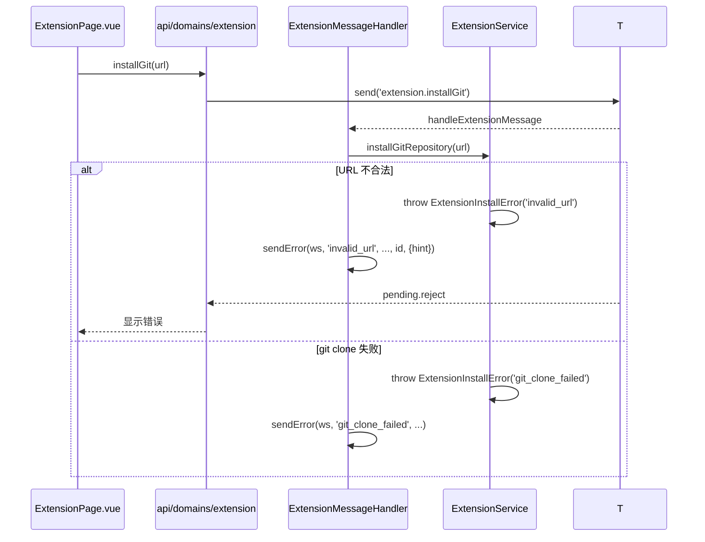
```mermaid
sequenceDiagram
    participant EP as ExtensionPage.vue
    participant ED as api/domains/extension
    participant EH as ExtensionMessageHandler
    participant ES as ExtensionService

    EP->>ED: installGit(url)
    ED->>T: send('extension.installGit')
    T-->>EH: handleExtensionMessage
    EH->>ES: installGitRepository(url)
    alt URL 不合法
        ES->>ES: throw ExtensionInstallError('invalid_url')
        EH->>EH: sendError(ws, 'invalid_url', ..., id, {hint})
        T-->>ED: pending.reject
        ED-->>EP: 显示错误
    else git clone 失败
        ES->>ES: throw ExtensionInstallError('git_clone_failed')
        EH->>EH: sendError(ws, 'git_clone_failed', ...)
    end
```

#### 方法签名表

| 类 | 方法 | 签名 | 返回 | 边界条件 | Spec/Issue |
|----|------|------|------|---------|-----------|
| ExtensionPage.vue | onInstall | `() => Promise<void>` | void | input 为空按钮 disabled | #5 |
| extension domain | installDir/installGit | 见 §3.2 | ExtensionDiscoveredPayload | 路径/URL 非法 → reject | #5 |
| ExtensionMessageHandler | handleExtensionMessage | 见 §3.2 | void | service 未启用 → sendError | #5 |
| ExtensionService | installLocalDirectory | `(path: string) => Promise<{tempDir, candidates}>` | discovered | 路径越界 throw | #5 |
| ExtensionService | finishInstall | `(tempDir, selected) => Promise<void>` | void | tempDir 不在白名单 throw | #5 |

#### 数据流链
ExtensionPage 输入 → extension.installDir(path) → ExtensionMessageHandler → ExtensionService.installLocalDirectory() → 发现候选 → extension.discovered 回复 → UI 候选选择 → extension.finishInstall(tempDir, selected) → ExtensionService.finishInstall() → 复制到 extensions/ → config.extensions 推送 → onExtensions 订阅刷新列表

#### 关联
- requirements.md 用例: UC-2
- issues.md 方案: #5 方案 A
- NFR 影响: 安全（路径/URL 白名单）、数据一致性（tempDir 清理）、可观测（审计日志）

### 4.4 F4: compact 触发

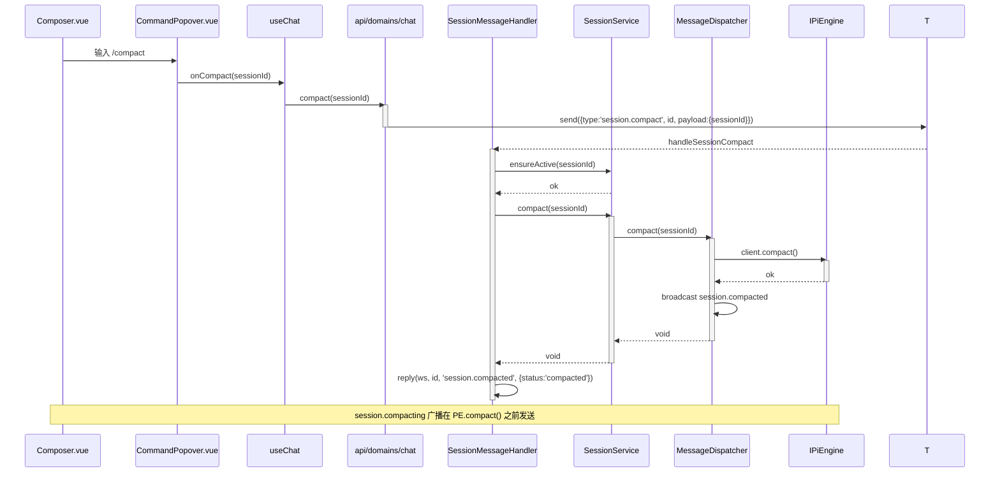
```mermaid
sequenceDiagram
    participant C as Composer.vue
    participant CP as CommandPopover.vue
    participant UChat as useChat
    participant CD as api/domains/chat
    participant SMH as SessionMessageHandler
    participant SS as SessionService
    participant MD as MessageDispatcher
    participant PE as IPiEngine

    C->>CP: 输入 /compact
    CP->>UChat: onCompact(sessionId)
    UChat->>CD: compact(sessionId)
    activate CD
    CD->>T: send({type:'session.compact', id, payload:{sessionId}})
    deactivate CD
    T-->>SMH: handleSessionCompact
    activate SMH
    SMH->>SS: ensureActive(sessionId)
    SS-->>SMH: ok
    SMH->>SS: compact(sessionId)
    activate SS
    SS->>MD: compact(sessionId)
    activate MD
    MD->>PE: client.compact()
    activate PE
    PE-->>MD: ok
    deactivate PE
    MD->>MD: broadcast session.compacted
    MD-->>SS: void
    deactivate MD
    SS-->>SMH: void
    deactivate SS
    SMH->>SMH: reply(ws, id, 'session.compacted', {status:'compacted'})
    deactivate SMH

    Note over C,PE: session.compacting 广播在 PE.compact() 之前发送
```

#### 方法签名表

| 类 | 方法 | 签名 | 返回 | 边界条件 | Spec/Issue |
|----|------|------|------|---------|-----------|
| Composer.vue | onCmdSelect | `(cmd: '/compact') => void` | void | 非 streaming 才允许 | #6 |
| chat domain | compact | `(sessionId: string) => Promise<void>` | void | session 未激活 → reject | #6 |
| SessionMessageHandler | handleSessionCompact | 见 §3.6 | void | ensureActive 失败 → sendError | #6 |
| MessageDispatcher | compact | `(sessionId: string) => Promise<void>` | void | client 不存在 → throw | #6 |

#### 数据流链
/compact slash command → useChat.compact() → chat.domain.compact() → session.compact → SessionMessageHandler.handleSessionCompact → SessionService.compact() → MessageDispatcher.compact() → IPiEngine.compact() → broadcast session.compacting/compacted

#### 异常路径

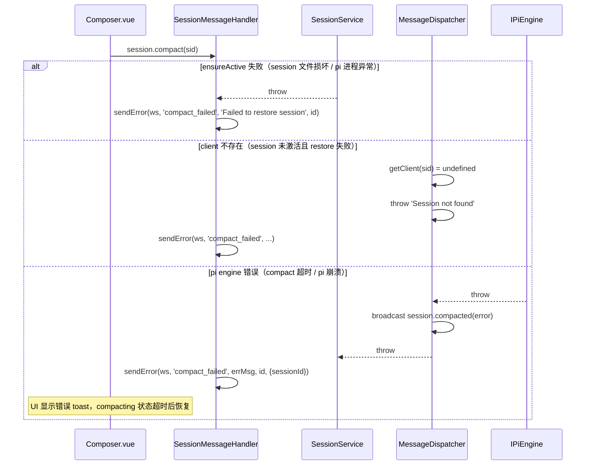
```mermaid
sequenceDiagram
    participant C as Composer.vue
    participant SMH as SessionMessageHandler
    participant SS as SessionService
    participant MD as MessageDispatcher
    participant PE as IPiEngine

    C->>SMH: session.compact(sid)
    alt ensureActive 失败（session 文件损坏 / pi 进程异常）
        SS-->>SMH: throw
        SMH->>SMH: sendError(ws, 'compact_failed', 'Failed to restore session', id)
    else client 不存在（session 未激活且 restore 失败）
        MD->>MD: getClient(sid) = undefined
        MD->>MD: throw 'Session not found'
        SMH->>SMH: sendError(ws, 'compact_failed', ...)
    else pi engine 错误（compact 超时 / pi 崩溃）
        PE-->>MD: throw
        MD->>MD: broadcast session.compacted(error)
        MD-->>SS: throw
        SMH->>SMH: sendError(ws, 'compact_failed', errMsg, id, {sessionId})
        Note over C: UI 显示错误 toast，compacting 状态超时后恢复
    end
```

#### 关联
- requirements.md 用例: UC-3
- issues.md 方案: #6 方案 A
- NFR 影响: 数据一致性（自动备份）、稳定性（compacting guard）

### 4.5 F5: session.list server-push 订阅

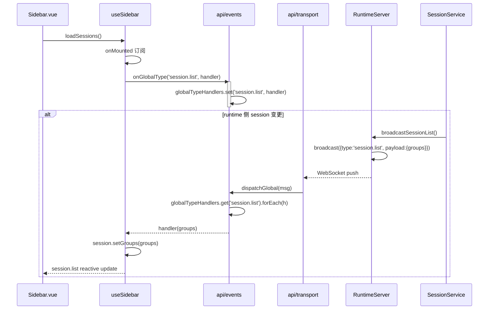
```mermaid
sequenceDiagram
    participant SB as Sidebar.vue
    participant US as useSidebar
    participant E as api/events
    participant T as api/transport
    participant RS as RuntimeServer
    participant SS as SessionService

    SB->>US: loadSessions()
    US->>US: onMounted 订阅
    US->>E: onGlobalType('session.list', handler)
    activate E
    E->>E: globalTypeHandlers.set('session.list', handler)
    deactivate E

    alt runtime 侧 session 变更
        SS->>RS: broadcastSessionList()
        RS->>RS: broadcast({type:'session.list', payload:{groups}})
        RS-->>T: WebSocket push
        T->>E: dispatchGlobal(msg)
        E->>E: globalTypeHandlers.get('session.list').forEach(h)
        E-->>US: handler(groups)
        US->>US: session.setGroups(groups)
        US-->>SB: session.list reactive update
    end
```

#### 方法签名表

| 类 | 方法 | 签名 | 返回 | 边界条件 | Spec/Issue |
|----|------|------|------|---------|-----------|
| useSidebar | loadSessions | `() => Promise<void>` | void | 首次加载拉全量 | #7 |
| events | onGlobalType | 见 §3.4 | cancel fn | 无 | #7 |
| RuntimeServer | broadcastSessionList | `() => void` | void | 无 | #7 |
| SessionStore | setGroups | `(groups: SessionGroup[]) => void` | void | 无 | #7 |

#### 数据流链
Sidebar onMounted → useSidebar loadSessions → events.onGlobalType('session.list') → runtime 侧 session 变更 → RuntimeServer.broadcastSessionList → WebSocket → events.dispatchGlobal → handler → sessionStore.setGroups → Sidebar re-render

#### 关联
- issues.md 方案: #7 方案 A
- NFR 影响: 性能（300ms debounce）、数据一致性

### 4.6 F6: mock 完整流式剧本

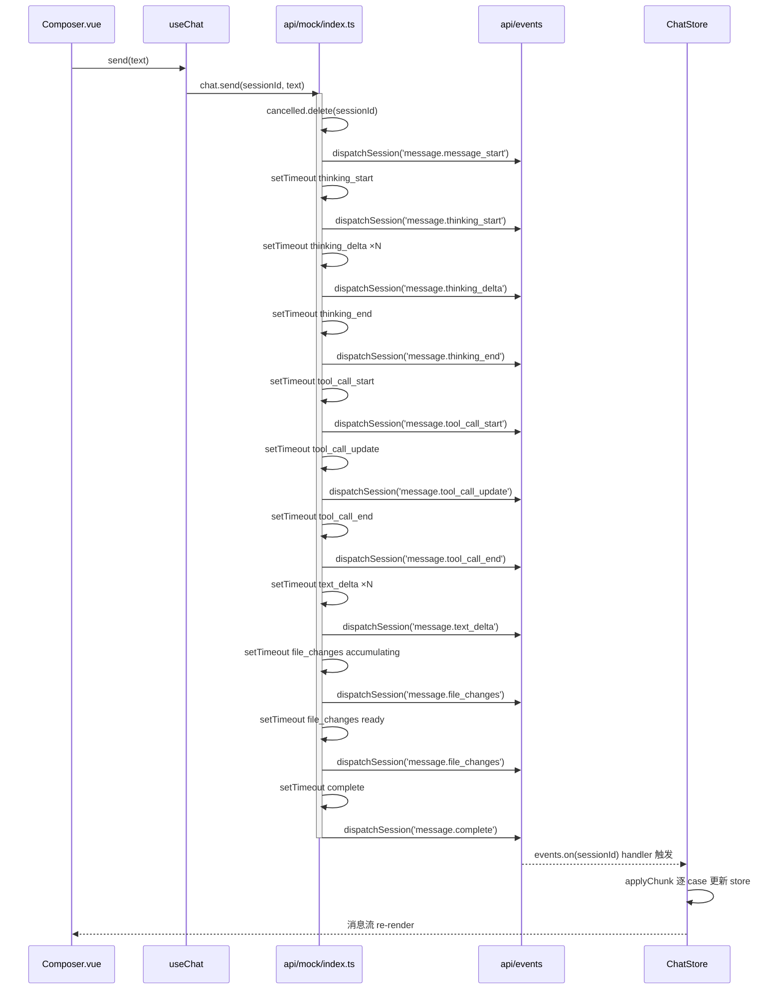
```mermaid
sequenceDiagram
    participant C as Composer.vue
    participant UChat as useChat
    participant M as api/mock/index.ts
    participant E as api/events
    participant CS as ChatStore

    C->>UChat: send(text)
    UChat->>M: chat.send(sessionId, text)
    activate M
    M->>M: cancelled.delete(sessionId)
    M->>E: dispatchSession('message.message_start')
    M->>M: setTimeout thinking_start
    M->>E: dispatchSession('message.thinking_start')
    M->>M: setTimeout thinking_delta ×N
    M->>E: dispatchSession('message.thinking_delta')
    M->>M: setTimeout thinking_end
    M->>E: dispatchSession('message.thinking_end')
    M->>M: setTimeout tool_call_start
    M->>E: dispatchSession('message.tool_call_start')
    M->>M: setTimeout tool_call_update
    M->>E: dispatchSession('message.tool_call_update')
    M->>M: setTimeout tool_call_end
    M->>E: dispatchSession('message.tool_call_end')
    M->>M: setTimeout text_delta ×N
    M->>E: dispatchSession('message.text_delta')
    M->>M: setTimeout file_changes accumulating
    M->>E: dispatchSession('message.file_changes')
    M->>M: setTimeout file_changes ready
    M->>E: dispatchSession('message.file_changes')
    M->>M: setTimeout complete
    M->>E: dispatchSession('message.complete')
    deactivate M

    E-->>CS: events.on(sessionId) handler 触发
    CS->>CS: applyChunk 逐 case 更新 store
    CS-->>C: 消息流 re-render
```

#### 方法签名表

| 类 | 方法 | 签名 | 返回 | 边界条件 | Spec/Issue |
|----|------|------|------|---------|-----------|
| mock.chat | send | `(sessionId, text) => Promise<void>` | void | cancelled 中断 | #4 |
| mock | __clearTimers | `() => void` | void | 测试 teardown | #4 |
| ChatStore | appendAssistantChunk | `(sessionId, msg) => void` | void | 未知 type 走 default | #8 |
| chat-chunk-processor | applyChunk | 见现有 | void | 见 §4.7 | #8 |

#### 数据流链
Composer send → mock.chat.send → setTimeout 链 → events.dispatchSession → ChatStore.appendAssistantChunk → chat-chunk-processor.applyChunk → messages 更新 → MessageStream/Turn 渲染

#### 关联
- requirements.md 用例: UC-1
- issues.md 方案: #4 方案 A + #8 方案 A
- NFR 影响: 性能（setTimeout 链清理）、稳定性（abort 中断）

### 4.7 F7: chat store 消息消费补全（#8）

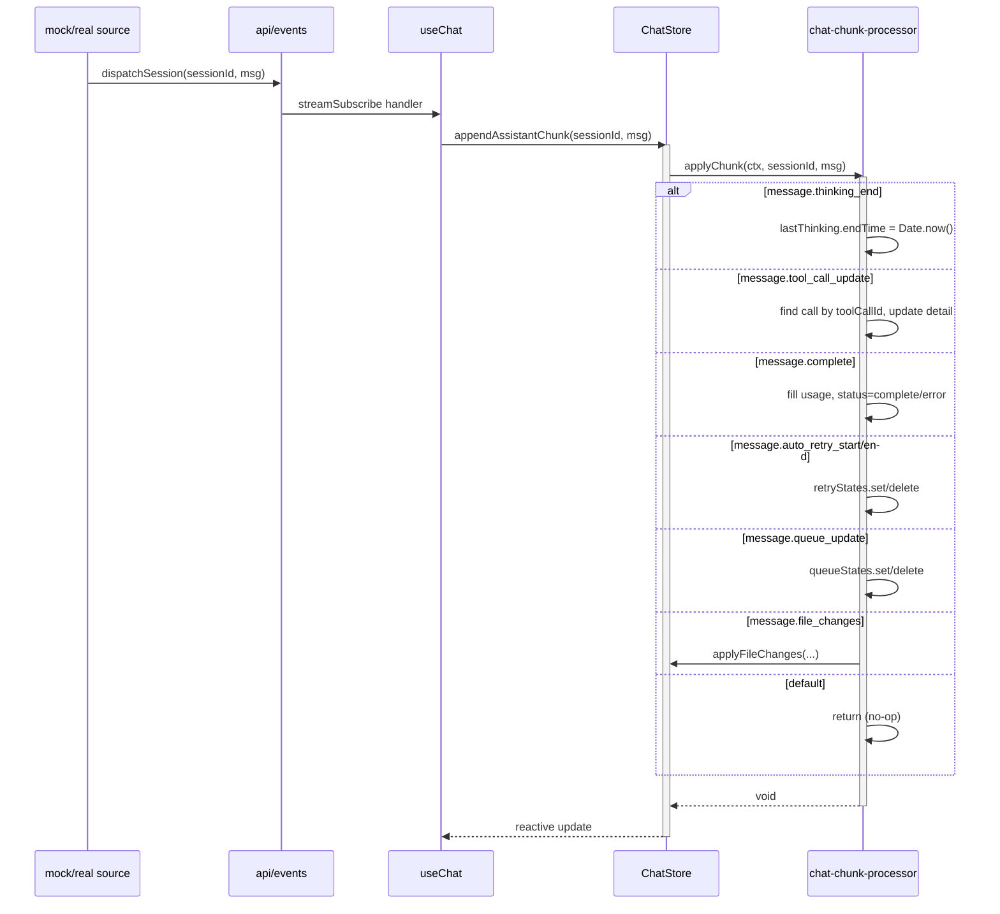
```mermaid
sequenceDiagram
    participant M as mock/real source
    participant E as api/events
    participant UChat as useChat
    participant CS as ChatStore
    participant CCP as chat-chunk-processor

    M->>E: dispatchSession(sessionId, msg)
    E->>UChat: streamSubscribe handler
    UChat->>CS: appendAssistantChunk(sessionId, msg)
    activate CS
    CS->>CCP: applyChunk(ctx, sessionId, msg)
    activate CCP

    alt message.thinking_end
        CCP->>CCP: lastThinking.endTime = Date.now()
    else message.tool_call_update
        CCP->>CCP: find call by toolCallId, update detail
    else message.complete
        CCP->>CCP: fill usage, status=complete/error
    else message.auto_retry_start/end
        CCP->>CCP: retryStates.set/delete
    else message.queue_update
        CCP->>CCP: queueStates.set/delete
    else message.file_changes
        CCP->>CS: applyFileChanges(...)
    else default
        CCP->>CCP: return (no-op)
    end

    CCP-->>CS: void
    deactivate CCP
    CS-->>UChat: reactive update
    deactivate CS
```

#### 方法签名表

| 类 | 方法 | 签名 | 返回 | 边界条件 | Spec/Issue |
|----|------|------|------|---------|-----------|
| chat-chunk-processor | applyChunk | `(ctx, sessionId, msg) => void` | void | 未知 type 走 default | #8 |
| chat-chunk-processor | findLastAssistantIndex | `(list: Message[]) => number` | number | 无 assistant 返回 -1 | #8 |
| ChatStore | applyFileChanges | 见现有 | void | messageId 未命中挂最后 assistant | #8 |

#### 数据流链
ServerMessage → events.on(sessionId) → useChat handler → chatStore.appendAssistantChunk → chat-chunk-processor.applyChunk → 按 type 更新 messages/retryStates/queueStates/changeSetStatuses

#### 关联
- issues.md 方案: #8 方案 A（store 数据层）；#13 P3 迷雾（UI 指示层延后）
- NFR 影响: 数据一致性（messageId 未命中兜底）、可观测性（default 记录未知 type）

> **retry/queue UI 渲染**：`auto_retry_start/end` 与 `queue_update` 的 store 数据层由 #8 覆盖（retryStates/queueStates）；UI 指示位（Composer 上方独立行）按 spec C10/FR-3/FR-4 形态补齐，见 §4.12 F7-UI。
>
> **[SURFACED] spec ↔ issues.md 优先级冲突**：spec-w11.md 将 retry/queue UI 列为 P1 in-scope（C10 已确认形态）；issues.md #13 将其降为 P3 迷雾。本轮按 spec 补时序图（形态已知），同时在 issues.md #13 标注此冲突——issues.md 的「延后」决策被 spec 的 P1 覆盖。

### 4.7b F7-UI: retry/queue 指示位渲染（#13，spec C10/FR-3/FR-4）

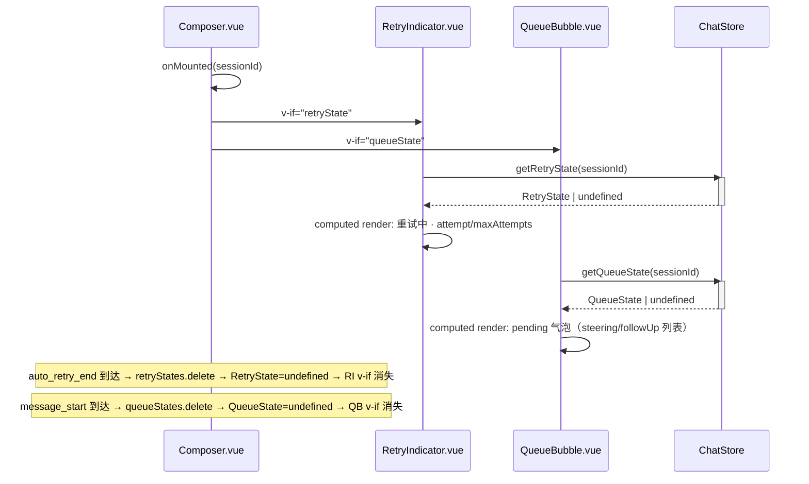
```mermaid
sequenceDiagram
    participant C as Composer.vue
    participant RI as RetryIndicator.vue
    participant QB as QueueBubble.vue
    participant CS as ChatStore

    C->>C: onMounted(sessionId)
    C->>RI: v-if="retryState"
    C->>QB: v-if="queueState"
    RI->>CS: getRetryState(sessionId)
    activate CS
    CS-->>RI: RetryState | undefined
    deactivate CS
    RI->>RI: computed render: 重试中 · attempt/maxAttempts

    QB->>CS: getQueueState(sessionId)
    activate CS
    CS-->>QB: QueueState | undefined
    deactivate CS
    QB->>QB: computed render: pending 气泡（steering/followUp 列表）

    Note over C: auto_retry_end 到达 → retryStates.delete → RetryState=undefined → RI v-if 消失
    Note over C: message_start 到达 → queueStates.delete → QueueState=undefined → QB v-if 消失
```

#### 方法签名表

| 类 | 方法 | 签名 | 返回 | 边界条件 | Spec/Issue |
|----|------|------|------|---------|------------|
| RetryIndicator.vue | props | `{ state: RetryState \| undefined }` | - | undefined 时不渲染 | #13 |
| QueueBubble.vue | props | `{ state: QueueState \| undefined }` | - | undefined 时不渲染 | #13 |
| ChatStore | getRetryState | `(sessionId: string) => RetryState \| undefined` | RetryState | 无 | #8 |
| ChatStore | getQueueState | `(sessionId: string) => QueueState \| undefined` | QueueState | 无 | #8 |

#### 数据流链
runtime auto_retry_start → chatStore.retryStates.set → RetryIndicator computed → 渲染重试中·attempt/maxAttempts；message_start 到达 → queueStates.delete → QueueBubble 消失

#### 关联
- requirements.md / spec-w11.md: FR-3/FR-4/C10/AC（Composer 上方独立行）
- issues.md #13: P3 迷雾 → 本轮按 spec P1 覆盖补齐（[SURFACED] 冲突）
- NFR 影响: 可观测性（retry attempt 可见）、数据一致性（message_start 清 queue）

### 4.8 F8: FileView 数据源切换

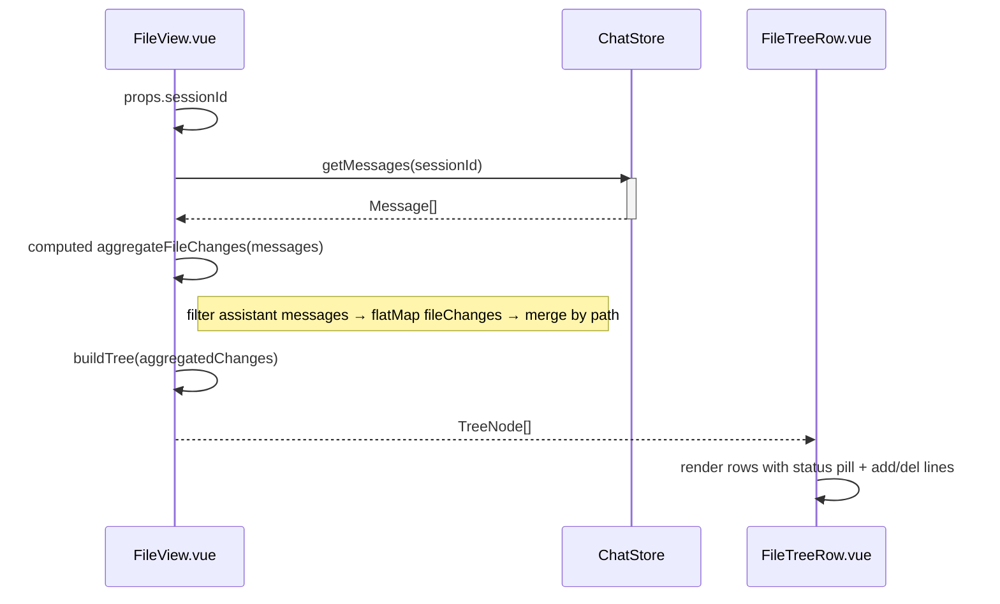
```mermaid
sequenceDiagram
    participant FV as FileView.vue
    participant CS as ChatStore
    participant FT as FileTreeRow.vue

    FV->>FV: props.sessionId
    FV->>CS: getMessages(sessionId)
    activate CS
    CS-->>FV: Message[]
    deactivate CS
    FV->>FV: computed aggregateFileChanges(messages)
    Note right of FV: filter assistant messages → flatMap fileChanges → merge by path
    FV->>FV: buildTree(aggregatedChanges)
    FV-->>FT: TreeNode[]
    FT->>FT: render rows with status pill + add/del lines
```

#### 方法签名表

| 类 | 方法 | 签名 | 返回 | 边界条件 | Spec/Issue |
|----|------|------|------|---------|-----------|
| FileView.vue | aggregateFileChanges | `(messages: Message[]) => FileChange[]` | FileChange[] | 无 fileChanges 返回 [] | #10 |
| FileView.vue | buildTree | `(changes: FileChange[]) => TreeNode[]` | TreeNode[] | - | #10 |
| FileTreeRow.vue | - | props: {node, depth} | - | status='unmerged' 渲染 U 标签 | #10/#12 |

#### 数据流链
FileView props.sessionId → chatStore.getMessages → filter assistant + flatMap fileChanges → mergeFileChanges by path → buildTree → FileTreeRow 渲染

#### 关联
- issues.md 方案: #10 方案 A
- NFR 影响: 性能（O(n*m) 首次构建，Map 增量优化）、兼容性（#12 unmerged 枚举）

### 4.9 F9: widget 订阅（extension:widget/extension:status）

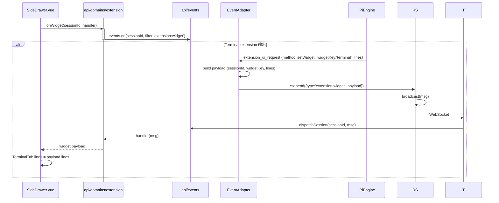
```mermaid
sequenceDiagram
    participant SD as SideDrawer.vue
    participant ED as api/domains/extension
    participant E as api/events
    participant EA as EventAdapter
    participant PE as IPiEngine

    SD->>ED: onWidget(sessionId, handler)
    activate ED
    ED->>E: events.on(sessionId, filter 'extension:widget')
    deactivate ED

    alt Terminal extension 输出
        PE->>EA: extension_ui_request {method:'setWidget', widgetKey:'terminal', lines}
        EA->>EA: build payload {sessionId, widgetKey, lines}
        EA->>RS: ctx.send({type:'extension:widget', payload})
        RS->>RS: broadcast(msg)
        RS-->>T: WebSocket
        T->>E: dispatchSession(sessionId, msg)
        E->>ED: handler(msg)
        ED-->>SD: widget payload
        SD->>SD: TerminalTab lines = payload.lines
    end
```

#### 方法签名表

| 类 | 方法 | 签名 | 返回 | 边界条件 | Spec/Issue |
|----|------|------|------|---------|-----------|
| extension domain | onWidget | `(sessionId, handler) => () => void` | cancel fn | 按 sessionId 过滤 | #11 |
| extension domain | onStatus | `(sessionId, handler) => () => void` | cancel fn | 按 sessionId 过滤 | #11 |
| EventAdapter | handleExtensionUIRequest | 现有 | ServerMessage | widgetKey 未知也推送 | #11 |
| SideDrawer.vue | renderWidget | `(key: 'terminal'|'browser', payload) => VNode` | - | 未知 key 显示 fallback | #11 |

#### 数据流链
pi extension setWidget → EventAdapter → extension:widget server-push → WebSocket → events.dispatchSession(sessionId) → extension.onWidget handler → SideDrawer tab 更新

#### 关联
- issues.md 方案: #11 方案 A + #9 方案 A
- NFR 影响: 性能（1000 行截断；runtime setWidget 全量推送非分片，前端无需分片重组，见 event-adapter.ts:383）、稳定性（断连提示）

### 4.10 F10: SideDrawer 容器打开/切换

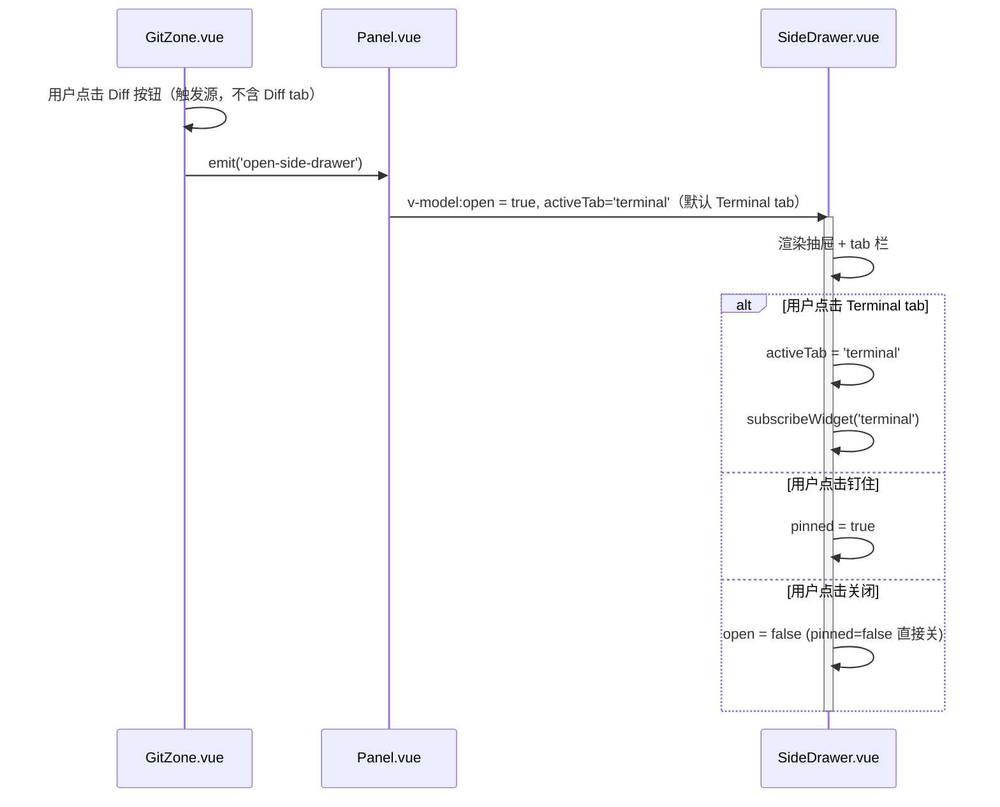
```mermaid
sequenceDiagram
    participant GZ as GitZone.vue
    participant P as Panel.vue
    participant SD as SideDrawer.vue

    GZ->>GZ: 用户点击 Diff 按钮（触发源，不含 Diff tab）
    GZ->>P: emit('open-side-drawer')
    P->>SD: v-model:open = true, activeTab='terminal'（默认 Terminal tab）
    activate SD
    SD->>SD: 渲染抽屉 + tab 栏
    alt 用户点击 Terminal tab
        SD->>SD: activeTab = 'terminal'
        SD->>SD: subscribeWidget('terminal')
    else 用户点击钉住
        SD->>SD: pinned = true
    else 用户点击关闭
        SD->>SD: open = false (pinned=false 直接关)
    end
    deactivate SD
```

#### 方法签名表

| 类 | 方法 | 签名 | 返回 | 边界条件 | Spec/Issue |
|----|------|------|------|---------|-----------|
| GitZone.vue | onDiffClick | `() => void` | void | 触发打开，默认 Terminal tab | #9 |
| Panel.vue | onOpenSideDrawer | `() => void` | void | 默认 Terminal tab | #9 |
| SideDrawer.vue | props | `{open, activeTab: 'terminal'|'browser', pinned}` | - | - | #9 |
| SideDrawer.vue | subscribeWidget | `(tab: 'terminal'|'browser') => () => void` | cancel fn | unmount 取消 | #9/#11 |

#### 数据流链
GitZone Diff 按钮 → Panel.vue → SideDrawer open（默认 Terminal tab） → tab 切换 Terminal/Browser → 订阅对应 widget 通道 → 渲染内容

#### 关联
- issues.md 方案: #9 方案 A
- NFR 影响: 数据一致性（unmount 取消订阅）、性能（virtual scroll）

### 4.11 F11: 契约裂缝修复（#12）

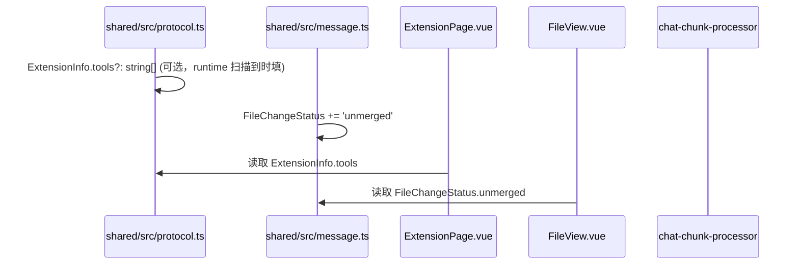
```mermaid
sequenceDiagram
    participant P as shared/src/protocol.ts
    participant M as shared/src/message.ts
    participant EP as ExtensionPage.vue
    participant FV as FileView.vue
    participant CCP as chat-chunk-processor

    P->>P: ExtensionInfo.tools?: string[] (可选，runtime 扫描到时填)
    M->>M: FileChangeStatus += 'unmerged'

    EP->>P: 读取 ExtensionInfo.tools
    FV->>M: 读取 FileChangeStatus.unmerged
```

#### 方法签名表

| 类型/字段 | 位置 | 变更 | 消费者 | Spec/Issue |
|----------|------|------|--------|-----------|
| ExtensionInfo.tools | shared/src/protocol.ts | 新增 `tools?: string[]`（可选） | ExtensionPage.vue | #12 |
| FileChangeStatus.unmerged | shared/src/message.ts | 新增枚举值 | FileView.vue, GitService | #10/#12 |

> **[STALE] ToolCallStatus.pending 已移除**：runtime 不生产 message.tool_call_pending（审批链路 Out-of-scope），故本轮只补 ExtensionInfo.tools 和 FileChangeStatus.unmerged 两项。spec FR-2/G-002 待审批链路纳入 scope 时再处理。

#### 数据流链
shared 类型新增字段 → 前后端同时升级 → runtime 生产带 tools/unmerged/pending → frontend 消费渲染

#### 关联
- issues.md 方案: #12 方案 A
- NFR 影响: 兼容性（旧版本 fallback unknown）

## 5. Deep Module 设计决策

### 5.1 GitService + IGitExecutor

- **Interface**: `GitService.getStatus/stage/unstage/commit(sessionId, ...)` + `IGitExecutor.exec(cwd, command, args)`
- **Depth**: 高。调用方只需知道 sessionId 和操作名；git CLI 调用、路径解析、XY 码解析、分支查询全部隐藏。
- **Seam**: `services/ports/git-executor.ts` 是外部 seam；infra/git-executor.ts 是 production adapter；未来可新增 mock adapter 测试。
- **Port 决策**: True external（git CLI）。必须 port，当前 1 个实现，测试可用 spy/mock。
- **Deletion test**: 删掉 GitService 后，路径校验、XY 码解析、分支查询会在 3 个 handler 里重复出现 → 确认是深模块。
- **GitService → git-status-parser 访问路径（分层豁免说明）**：`infra/git-status-parser.ts` 是纯函数（parseGitStatusPorcelain + xyToStatus 扩展 U/staged 拆分），无 IO。「services 不直接 import infra」规则旨在隔离 IO，纯解析函数作为 domain utility 例外：GitService 调 IGitExecutor.exec('status') 拿 raw stdout，再调纯函数 parseGitStatus 完成解析。git diff --numstat（stats）同样经 IGitExecutor.exec 后纯解析。IO 边界仍在 IGitExecutor port 处闭合，解析逻辑可测性不受影响。

### 5.2 events.ts（双通道分发）

- **Interface**: `on(sessionId, handler)` / `onGlobalType(type, handler)` / `dispatchSession` / `dispatchGlobal`
- **Depth**: 高。调用方只关心订阅/取消；内部 Map 管理、类型擦除、session/global 路由全部隐藏。
- **Seam**: 外部 seam 在 events.ts 文件；无替代 adapter，但模块本身是 renderer 消息路由的核心。
- **Port 决策**: In-process（纯内存 Map）。不要 port，直接测。
- **Deletion test**: 删掉 events 后，所有 domain 需要自己维护 handler Map → 确认是深模块。

### 5.3 chat-chunk-processor

- **Interface**: `applyChunk(ctx, sessionId, msg)`
- **Depth**: 高。调用方只传 ctx + msg；19+ 种 message.* 类型的归约逻辑隐藏。
- **Seam**: 内部 seam 在 applyChunk；外部 seam 是 ChatStore.appendAssistantChunk。
- **Port 决策**: In-process。不要 port。
- **Deletion test**: 删掉 processor 后，所有 message.* case 会散落在 useChat/组件中 → 确认是深模块。
- **可测性**: ctx 接受依赖（messages/retryStates/queueStates refs + applyFileChanges 回调），满足可测性三原则。

### 5.4 ExtensionService

- **Interface**: `installLocalDirectory/installGitRepository/finishInstall/cancelInstall/toggleExtension/scanExtensions`
- **Depth**: 高。调用方只传路径/URL；tempDir 管理、路径白名单、git clone、npm install、候选发现、元数据写入全部隐藏。
- **Seam**: `services/ports/installer.ts` 和 `services/ports/extension-settings.ts` 是真 seam（各 1 实现）。
- **Port 决策**: Local-substitutable（installer）+ True external（文件系统）。保留 port。
- **Deletion test**: 删掉 ExtensionService 后，安装流逻辑在 handler 中重复 → 确认是深模块。

## 6. 下游衔接

### 6.1 时序图 → Wave 映射

| 时序图 | 对应 Wave | 依赖的其它时序图 | 可并行？ |
|--------|----------|-----------------|---------|
| F11 契约裂缝 | W1 | 无 | 是 |
| F7 chat store 补全 | W1 | F11 | 是 |
| F6 mock 完整剧本 | W1 | F7 | 是 |
| F1 git.status + F2 git 操作 | W1/W2 | F11 | W1 建协议+runtime，W2 前端 GitZone |
| F5 session.list 订阅 | W2 | F11 | 是 |
| F3 Extension 安装 | W2 | F11 | 是 |
| F4 compact 触发 | W2 | F11 | 是 |
| F10 SideDrawer 容器 | W2 | F1（Diff 触发源） | 否，依赖 #1/#3 |
| F8 FileView 切换 | W2 | F7 + F11 | 是 |
| F9 widget 订阅 | W3 | F10 + F3（extension 安装后才有 widget） | 否，依赖 #9 |
| F7-UI retry/queue 指示位 | W2 | F7 store 数据层（已确认形态） | 是（spec C10 已定形态） |

### 6.2 关键依赖 DAG

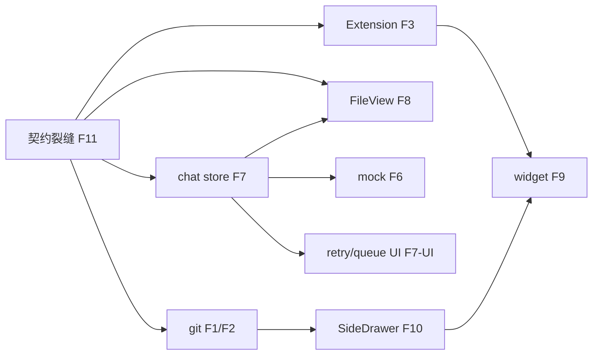
```mermaid
graph LR
    F11[契约裂缝 F11] --> F7[chat store F7]
    F11 --> F1[git F1/F2]
    F11 --> F3[Extension F3]
    F11 --> F8[FileView F8]
    F7 --> F6[mock F6]
    F7 --> F8
    F7 --> F7UI[retry/queue UI F7-UI]
    F1 --> F10[SideDrawer F10]
    F3 --> F9[widget F9]
    F10 --> F9
```

### 6.3 需要编码前确认的点

1. **GitZone commit message 输入框**: 用原生 `<input>` 还是 xyz-ui Input？按项目规范必须用 xyz-ui Input。
2. **SideDrawer tab 初始集合**: Terminal / Browser（**不含 Diff tab**；git-zone Diff 按钮仅作为 SideDrawer 触发源，默认打开 Terminal tab。Diff 审批内容明确排除在 scope 外，见 spec-w11.md FR-8 / Scope boundaries #8）。
3. **ExtensionPage 候选列表内联展开位置**: 安装区下方直接展开，不弹窗。
4. **mock git fixture**: 按 issues.md #4 方案 A，新建独立文件 `mock/git.ts`（~50 LOC），返回固定 GitStatusResult（含四态、stats、files fixture）。与 spec-w11.md G-R2-07「补 mock/index.ts git domain」存在上游表述差异，以 issues.md（更下游的决策层）为准。
5. **Panel.vue 控制逻辑下沉**: Panel.vue 当前 92 行，但 GitZone + SideDrawer 触发逻辑直接堆入会使 Panel 承担 tab/dock 状态管理，退化为上帝对象。建议将 SideDrawer 打开/钉住/tab 控制逻辑提取到 `composables/features/useSideDrawer.ts`，Panel.vue 仅作为 slot 容器（架构解耦，非 LOC 压力）。

### 6.4 验收 grep 清单

| 检查项 | 命令 |
|--------|------|
| git 命令防注入 | `grep -rn "exec\|spawn" src-electron/runtime/src/infra/git-executor.ts \| grep -v "execFileSync"` → 无输出 |
| events 无 as any | `grep -rn "as unknown as\|as any" src-electron/renderer/src/api/events.ts` → 无输出 |
| chat store 无 pending 死代码 | `grep -n "message.tool_call_pending" src-electron/renderer/src/stores/chat-chunk-processor.ts` → **无输出**（[STALE] 移除，见 §3.9） |
| ExtensionInfo 有 tools | `grep -n "tools:" src-electron/shared/src/protocol.ts` → 有输出 |
| FileChangeStatus 有 unmerged | `grep -n "unmerged" src-electron/shared/src/message.ts` → 有输出 |
| GitZone 存在 | `grep -rn "GitZone" src-electron/renderer/src/components/panel/` → 有输出 |
| SideDrawer 存在 | `grep -rn "SideDrawer" src-electron/renderer/src/components/panel/` → 有输出 |
