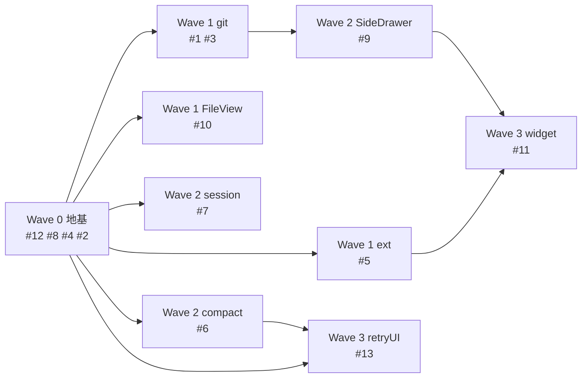

# 执行计划 — 前端 renderer ↔ runtime 集成（W11+）

## Wave 编排总览

### 设计依据

Wave 从 `code-architecture.md` §4 方法级时序图推导，叠加文件冲突约束 + 并行上限（max 3 subagent，见 CLAUDE.md）。

**关键路径**：`W0 地基 → W1 git → W2 SideDrawer → W3 widget`（4 跳）。
**非关键切片**（ext/session/fileview/compact/retryUI 仅依赖 W0）填充并行槽，不延长关键路径。

**文件冲突（强制串行）**：
| 冲突文件 | 触碰的 issue | 串行顺序 |
|---------|------------|---------|
| `components/panel/Panel.vue` | #1 git（加 GitZone）、#9 SideDrawer（加 SideDrawer） | #1 → #9 |
| `components/panel/Composer.vue` | #6 compact（slash 触发）、#13 retry/queue UI（指示位宿主） | #6 → #13 |
| `api/domains/extension.ts` | #5 install 方法、#11 onWidget 订阅 | #5 → #11 |
| `components/panel/SideDrawer.vue` | #9 创建、#11 widget 渲染区 | #9 → #11 |
| `transport/server.ts` | #1 git（新增 git handler 注册） | 仅 #1，无并行冲突 |

**runtime 已就绪确认**（代码扫描结论，多数 issue runtime 已实现，仅前端待接）：
- `#8 chat store 消息补全` **已实现**（chat-chunk-processor.ts thinking_end:107 / tool_call_update:172 / complete.usage:188 / auto_retry_*:262,276 / queue_update:285 / file_changes，带 W05-A/W06-B/W10 注释；store 访问器 getRetryState/getQueueState/applyFileChanges 齐全）→ **#8 回归验证**，无新代码
- `#2 domain 规范化` **已实现**（settings.ts:4 注释明示「返工前 get* 全 Promise」已改订阅形态 onSkills/onAgents/onExtensions）→ **#2 回归验证**，无新代码
- `#5 Extension runtime` **已实现**（extension-service.ts installLocalDirectory:314 / installGitRepository:364 / finishInstall:417 / cancelInstall:476 + handler 路由 + IInstaller port）→ **#5 纯前端**（extension.ts 补 install 方法 + ExtensionPage 接线）
- `#6 compact runtime` 已实现（message-dispatcher.ts:161 广播 compacting/compacted + server.ts:127 路由）→ **#6 纯前端**（Composer slash + chat domain.compact）
- `#7 session.list 广播` 已存在（server.ts:322 broadcastSessionList + SessionMessageHandler create/delete/rename 触发）→ **#7 纯前端**（useSidebar 订阅）
- `#11 widget runtime` 已实现（event-adapter.ts:364/383 setWidget→extension:widget 推送）→ **#11 纯前端**
- 故除 #1 git（runtime+前端全建）外，其余 Wave 均为前端单层切片，#6/#7/#5 不触碰 server.ts，消除与 #1 git 的 server.ts 并行冲突

### 依赖 DAG 图

> 边语义：实线 = blocked_by（依赖或文件冲突串行）。W0→W1e/W1f/W2n/W2c/W3r 是「依赖 W0 契约地基」；W1g→W2s 是「SideDrawer 依赖 git Diff 触发源 + Panel.vue 冲突」；W2c→W3r 是「Composer.vue 冲突串行」；W2s→W3w 是「widget 渲染进 SideDrawer 容器」；**W1e→W3w 是 extension.ts 文件冲突串行**（#5 在 W1b 补 install 方法、#11 在 W3a 补 onWidget，同改 extension.ts；widget 订阅与安装 UI 功能独立，边仅为文件安全保留）。

### 调度表

> P 级列反映 Wave 内 issue 的最高优先级；Wave 排序以 Blocked by 为准，不单看 P 级。W0 标 P2 是因净新代码（#12 契约）为 P2，但含 #4 P1 + #8/#2 回归验证。

| Wave | 切片 | P级 | Blocked by | 并行组 | 说明 |
|------|------|-----|-----------|--------|------|
| 0 | 地基（契约裂缝+mock） | P2 | 无 | — | 新代码仅 #12 契约 + #4 mock；#8/#2 已实现仅回归验证；mock 流式端到端验证 store 消费 |
| 1a | git 全栈（#1+#3） | P1 | W0 | A | 关键路径；唯一真垂直切片（runtime+前端全建）；#3 从 issues/code-arch 的 W2 提前合并，因严格依赖 #1 且合并缩短关键路径 |
| 1b | Extension 安装（#5） | P1 | W0 | A | **前端单层**（runtime 已就绪）；extension.ts + ExtensionPage，不改 server.ts/Panel.vue |
| 1c | FileView 切换（#10） | P1 | W0 | A | **前端单层**；主改 Sidebar.vue（fixtureFileChanges→chat store 派生），FileView.vue 保持 props 接收不变 |
| 2a | SideDrawer 容器 | P1 | W1a | B | 关键路径；依赖 git Diff 触发源；触碰 Panel.vue（git 已释放） |
| 2b | session.list 订阅 | P1 | W0 | B | 纯前端订阅（runtime 广播已存在） |
| 2c | compact 触发 | P1 | W0 | B | 纯前端 slash（runtime compact 已实现）；触碰 Composer.vue |
| 3a | widget 订阅 | P1 | W2a, W1b | C | 依赖 SideDrawer 容器 + Extension；触碰 SideDrawer.vue（已释放） |
| 3b | retry/queue UI | P1 | W0, W2c | C | Composer.vue（#6 已释放）+ 读 store（W0 提供） |

### 并行约束

- 同一并行组（A/B/C）最多 **3 个 subagent** 并行（CLAUDE.md 约束）
- 同一文件不允许多 Wave 并行修改（见上冲突表）
- 前端 Wave 依赖的 runtime 能力须已就绪（除 #1 git 需 runtime+前端全建外，其余 runtime 均已实现，见上确认）
- 每个并行组成员按内部执行流串行派遣（TDD 链），成员间并行

---

## Wave 详情

### Wave 0: 契约地基（prefactor）

**切片类型**: prefactor
**P 级覆盖**: P2（#12）、P1（#4）、P1（#8 #2 回归验证）
**Blocked by**: 无——可立即开始
**并行关系**: 独立（W0 是所有后续 Wave 的依赖根）

> **重要现实**：#8 chat store 补全、#2 domain 规范化 **均已在代码中实现**（带 W05-A/W06-B 注释）。W0 的**唯一新代码**是 #12 契约 + #4 mock；#8/#2 仅作回归验证，避免 subagent 重写已存在逻辑。

#### 包含的功能/issue
- #12 契约裂缝修复（关联 §4.11 F11）— protocol.ts/message.ts 类型补全（**唯一真实新代码之一**）
- #4 mock 完整剧本（关联 §4.6 F6）— mock/git.ts + mock 流式补全（**唯一真实新代码之二**）
- #8 chat store 消息补全（关联 §4.7 F7）— **已实现·回归验证**（chat-chunk-processor 全 case + store 访问器齐全）
- #2 domain 规范化（关联 §3.5）— **已实现·回归验证**（settings.ts/config.ts 已无 get*）

#### 文件影响
- 修改: `shared/src/protocol.ts`（ExtensionInfo.tools、git.status:result type）、`shared/src/message.ts`（FileChangeStatus.unmerged）
- 修改: `api/mock/index.ts`、创建 `api/mock/git.ts`（固定 GitStatusResult fixture）
- 回归验证（不应改）: `stores/chat-chunk-processor.ts`、`stores/chat.ts`、`api/domains/{settings,config}.ts`

#### Subagent 配置

| 配置项 | 值 |
|--------|---|
| Agent | general-purpose |
| 注入上下文 | issues.md #12/#4 方案 + code-architecture.md §3.9/§4.6/§4.11 + **明确告知 #8/#2 已实现勿重写** |
| 读取文件 | shared/protocol.ts, message.ts; stores/chat-chunk-processor.ts; api/mock/index.ts |
| 修改/创建文件 | shared/protocol.ts, message.ts, api/mock/index.ts, api/mock/git.ts |

#### 执行流（Wave 内部，串行）
1. general-purpose → 写失败测试（vue-tsc 报 ExtensionInfo.tools / FileChangeStatus.unmerged / git 类型缺失）
2. general-purpose → 补 protocol/message 类型 + mock/git.ts + mock 流式补全
3. general-purpose → spec 合规检查（§6.4 grep 清单：ExtensionInfo.tools 有输出、FileChangeStatus.unmerged 有输出、chat store 无 pending 死代码）

#### 验收标准
- [ ] `vue-tsc` 0 错误
- [ ] mock 流式 emit 全部 message.* 类型（含 auto_retry/queue_update/file_changes），store 消费链路畅通
- [ ] §6.4 grep 清单 3 项通过

---

### Wave 1（并行组 A，3 成员）

**Blocked by**: Wave 0
**并行关系**: 1a/1b/1c 互不触碰同一文件，可并行

#### Wave 1a: git 全栈（#1 + #3）

**切片类型**: 垂直切片（runtime + 前端端到端）— **唯一真垂直切片**
**P 级**: P1
**关联**: §4.1 F1（status）、§4.2 F2（stage/commit）

> **跨文档偏离声明**：issues.md 依赖表与 code-architecture §6.1 将 #3 GitZone 归入 W2。本计划把 #3 提前合并进 W1a（与 #1 同 Wave），理由：#3 严格依赖 #1（GitZone 需 git domain），合并可省一跳、缩短关键路径，且 Panel.vue 文件冲突要求 #1/#3 串行（合并到同一 subagent 链最安全）。

##### 文件影响
- 创建（runtime）: `services/git-service.ts`、`services/ports/git-executor.ts`、`infra/git-executor.ts`、`infra/git-status-parser.ts`、`transport/git-message-handler.ts`
- 修改（runtime）: `transport/server.ts`（import + gitHandler 字段 + 构造 + dispatch 注册 git.* ）
- 创建（前端）: `api/domains/git.ts`
- 创建（前端）: `components/panel/GitZone.vue`（#3）
- 修改（前端）: `components/panel/Panel.vue`（渲染 GitZone）

##### Subagent 配置

| 配置项 | 值 |
|--------|---|
| Agent | general-purpose |
| 注入上下文 | issues.md #1/#3 方案 A + code-architecture.md §3.1/§3.6/§3.7/§3.8/§4.1/§4.2/§5.1 + §6.3 点1（GitZone 用 xyz-ui Input） |
| 读取文件 | transport/server.ts; services/session/*（取 cwd）; shared/protocol.ts（git 类型）；Panel.vue |
| 修改/创建文件 | 见上 |

##### 验收标准
- [ ] git.status → GitZone 渲染四态 pill + stats + file list
- [ ] stage/commit 成功后 GitZone refresh；冲突态 commit → toast；路径越界 → SecurityError
- [ ] execFileSync 用数组参数（防注入，§6.4 grep 无 `exec\|spawn` 非白名单）
- [ ] §6.4 grep：GitZone 存在、git 防注入通过

#### Wave 1b: Extension 安装（#5）

**切片类型**: 前端切片（runtime 已就绪）
**P 级**: P1
**关联**: §4.3 F3

##### 文件影响
- 修改（前端）: `api/domains/extension.ts`（补 installDir/installGitRepository/finishInstall/cancelInstall）
- 修改（前端）: `components/settings/ExtensionPage.vue`（安装区 + 候选内联展开）
- runtime 零改动（extension-service.ts 全套 install 方法、IInstaller port、handler 路由均已存在）

##### Subagent 配置

| 配置项 | 值 |
|--------|---|
| 注入上下文 | issues.md #5 方案 A + code-architecture.md §3.2/§4.3/§5.4 + §6.3 点3（候选内联展开）+ **明确告知 runtime 已就绪勿改** |
| 读取文件 | api/domains/extension.ts; ExtensionPage.vue; extension-message-handler.ts（查路由名） |

##### 验收标准
- [ ] installDir → discovered 候选 → finishInstall → onExtensions 刷新
- [ ] 路径白名单（home/tmp）、tempDir 清理、URL 非法 → ExtensionInstallError（runtime 已实现，前端仅传错提示）

#### Wave 1c: FileView 切换（#10）

**切片类型**: 前端切片（runtime 已就绪）
**P 级**: P1
**关联**: §4.8 F8

##### 文件影响
- 修改（前端）: `components/sidebar/Sidebar.vue`（fixtureFileChanges:143 → chat store 派生 fileChanges，传入 FileView）
- FileView.vue 保持不变（props.changes 接收，签名稳定）

##### Subagent 配置

| 配置项 | 值 |
|--------|---|
| 注入上下文 | issues.md #10 方案 A + code-architecture.md §4.8 + **明确告知 fixtureFileChanges 在 Sidebar.vue** |
| 读取文件 | Sidebar.vue（fixtureFileChanges import）; FileView.vue; stores/chat.ts（applyFileChanges/getFileInfo） |

##### 验收标准
- [ ] Sidebar.vue 从 chat store 派生 fileChanges 传入 FileView，按 path merge；无 fileChanges → 空列表
- [ ] grep `fixtureFileChanges` → 无输出（fixture 已清除）

---

### Wave 2（并行组 B，3 成员）

**Blocked by**: Wave 1a（仅 2a SideDrawer 依赖 git；2b/2c 仅依赖 W0，因并行上限与 2a 同批）

#### Wave 2a: SideDrawer 容器（#9）

**切片类型**: 前端切片（新建容器组件，runtime 已就绪）
**P 级**: P1
**关联**: §4.10 F10

##### 文件影响
- 创建: `components/panel/SideDrawer.vue`（Terminal/Browser tab，**不含 Diff**，§6.3 点2）、`composables/features/useSideDrawer.ts`
- 修改: `components/panel/Panel.vue`（slot 容器 + open/dock/tab 控制，经 useSideDrawer 架构解耦，避免 Panel 承担 tab/dock 状态）

##### Subagent 配置

| 配置项 | 值 |
|--------|---|
| 注入上下文 | issues.md #9 方案 A + code-architecture.md §4.10 + §6.3 点2/点5（tab 集合不含 Diff、Panel 控制逻辑下沉 useSideDrawer 架构解耦） |
| 读取文件 | Panel.vue; GitZone.vue（Diff 触发 emit 源）；spec-w11.md FR-8 |

##### 验收标准
- [ ] SideDrawer 有 Terminal/Browser tab，无 Diff tab
- [ ] GitZone Diff 按钮 → emit('open-side-drawer') → SideDrawer 打开
- [ ] Panel.vue 控制逻辑下沉 useSideDrawer，Panel 仅作 slot 容器（架构解耦，避免 Panel 随 tab/dock 状态膨胀）
- [ ] §6.4 grep：SideDrawer 存在

#### Wave 2b: session.list 订阅（#7）

**切片类型**: 前端切片（runtime 已就绪）
**P 级**: P1
**关联**: §4.5 F5

##### 文件影响
- 修改（前端）: `composables/features/useSidebar.ts`（onGlobalType('session.list') 订阅替代/补充 pull）

##### Subagent 配置

| 配置项 | 值 |
|--------|---|
| 注入上下文 | issues.md #7 方案 A + code-architecture.md §4.5 + 代码扫描结论（broadcastSessionList 已存在） |
| 读取文件 | useSidebar.ts; api/events.ts（onGlobalType） |

##### 验收标准
- [ ] useSidebar 订阅 session.list，session create/delete 后列表自动更新（不重载历史）

#### Wave 2c: compact 触发（#6）

**切片类型**: 前端切片（runtime 已就绪）
**P 级**: P1
**关联**: §4.4 F4

##### 文件影响
- 修改（前端）: `components/panel/Composer.vue`（/compact slash 触发）、`api/domains/chat.ts`（compact 方法）

##### Subagent 配置

| 配置项 | 值 |
|--------|---|
| 注入上下文 | issues.md #6 方案 A + code-architecture.md §4.4 + 代码扫描结论（message-dispatcher.compact 已广播 compacting/compacted） |
| 读取文件 | Composer.vue（slash chip 机制）; chat.ts; api/transport.ts |

##### 验收标准
- [ ] /compact slash → chat.domain.compact → session.compacting → session.compacted 状态流转
- [ ] 异常（session 不存在/pi 错误）→ sendError → toast，不卡 UI

---

### Wave 3（并行组 C，2 成员）

**Blocked by**: Wave 2a（3a widget 依赖 SideDrawer）、Wave 1b（3a 依赖 Extension）、Wave 2c（3b Composer.vue 冲突释放）

#### Wave 3a: widget 订阅（#11）

**切片类型**: 前端切片（runtime 已就绪）
**P 级**: P1
**关联**: §4.9 F9

##### 文件影响
- 修改（前端）: `api/domains/extension.ts`（onWidget 订阅 + 1000 行截断）、`components/panel/SideDrawer.vue`（widget 渲染区）

##### Subagent 配置

| 配置项 | 值 |
|--------|---|
| 注入上下文 | issues.md #11 方案 A + code-architecture.md §4.9 |
| 读取文件 | extension.ts; SideDrawer.vue（W2a 创建）; api/events.ts（dispatchSession） |

##### 验收标准
- [ ] extension setWidget → extension:widget server-push → SideDrawer tab 更新
- [ ] 1000 行截断（runtime setWidget 全量推送，无需分片重组）；未知 widgetKey fallback

#### Wave 3b: retry/queue UI 指示位（#13）

**切片类型**: 前端切片（runtime + store 均已就绪）
**P 级**: P1（[SURFACED] spec C10 形态已定）
**关联**: §4.7b F7-UI

##### 文件影响
- 创建: `components/panel/RetryIndicator.vue`、`components/panel/QueueBubble.vue`
- 修改: `components/panel/Composer.vue`（指示位宿主，#6 已释放）

##### Subagent 配置

| 配置项 | 值 |
|--------|---|
| 注入上下文 | issues.md #13（P1 修订）+ code-architecture.md §4.7b + spec-w11.md C10/FR-3/FR-4 |
| 读取文件 | Composer.vue; stores/chat.ts（getRetryState/getQueueState，W0 提供） |

##### 验收标准
- [ ] RetryIndicator 消费 getRetryState 显示 attempt/maxAttempts；QueueBubble 消费 getQueueState 显示 steering/followUp
- [ ] auto_retry_end → RetryIndicator 消失；message_start → QueueBubble 消失

---

## 后续迭代（P3 延后项）

- **#14 [P3]**: Plugin 管理页面 — 后端 plugin.* 能力完整（10 接口），前端 0 出口。延后理由：C4 决策维持 deferred（本期只做 Extension 不做 Plugin）
- **#15 [P3]**: session 项目分组 UI — 后端返回 SessionGroup[]，前端扁平化丢失分组。延后理由：非核心，列表可先平铺
- **#16 [P3]**: ContextChipsBar / ProgressZone 真实数据 — 协议级缺口（附件/pi 无 todo）。延后理由：需后端先建通道
- **#17 [P3]**: @/# 搜索通道 — 后端搜索能力从零。延后理由：协议级缺口，需整体设计

---

## 执行交接

本计划完成后，进入编码实现：

- **方式 A（推荐）**: 接入 coding-workflow — 启动 Phase 流程（spec→plan→dev→test→pr），每 Phase 对应一个 Wave
- **方式 B（手动）**: 每个 Wave 派一个 fresh subagent，按 Wave 内执行流走 TDD 链（失败测试→实现→合规检查）

**关键路径**：W0 → W1a git → W2a SideDrawer → W3a widget（4 跳）。
**总 Wave 数**：4（W0 + 3 个并行 Wave 层）。
