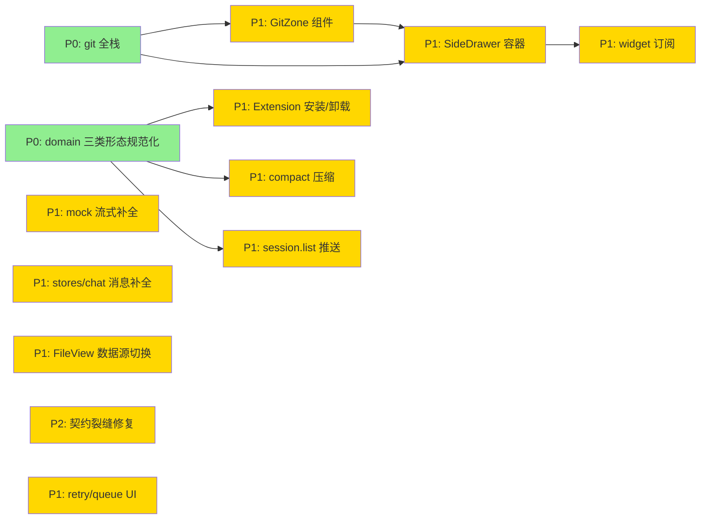

# Issue 决策图 — 前端 renderer ↔ runtime 集成（W11+）

## 地图总览

---

## P0 Issues（阻塞项，必须先做）

### #1: git 全栈 — runtime git 命令 + frontend domain

**P 级**: P0
**类型**: 架构
**Blocked by**: 无
**推荐强度**: Strong

#### 问题描述

git-zone（Panel zone ⑤）需要完整 git 操作能力：status/stage/unstage/commit。

**落地状态（2026-06-25）**：Wave 1（commit `9ff5d8b6`）已落地 git-executor/service/handler/domain 全链路，但 `infra/git-executor.ts` 当前是 `async exec(){ ...execFileSync... }`（async 壳包同步调用，事件循环实阻塞）。本轮（DESIGN-IT-TWICE 2026-06-25 决策 Q1=a）将其拔为真正的 async `execFile`，并顺手迁移 `file-change-reconciler.ts` 的字符串 `execSync`（详见方案 A）。

- **Runtime**: `services/ports/git-executor.ts`（IGitExecutor 接口，已建）+ `infra/git-executor.ts`（**重构 execFileSync → async execFile**）+ `services/git-service.ts`（已建）+ `transport/git-message-handler.ts`（已建）
- **Frontend**: `api/domains/git.ts`（domain 层，已建）+ protocol.ts 补 `git.status/stage/unstage/commit` ClientMessage + `git.status:result` ServerMessage（已建）

关联 system-architecture.md §6.3 Port 清单、§7 模块划分、§9.2 泳道图。

#### 为什么是 P 级

- **P0（阻塞）**: GitZone 组件（#3）依赖 git domain 和 runtime handler；SideDrawer 的 Diff 触发（#9）依赖 git-zone 存在。不做 #1 则 #3/#9 无法推进。

#### 方案对比

##### 方案 A: 完整 IGitExecutor（async execFile）（推荐）

> **[DESIGN-IT-TWICE 决策 2026-06-25，用户确认 Q1/Q2/Q3 = a/a/a]** 三方向并行 subagent 发散后选定：执行模型 = **async `execFile`**（非阻塞，不卡多 session 事件循环）；访问层 = 维持 shell out to git CLI（git 是硬依赖，换库净负债）；API 范式 = 单次 RPC + 手动刷新（维持 C14 镜子语义，补 refocus 触发）。对抗记录见 `changes/design-it-twice-git.md`。

**改动**:
- 架构: 新建 4 个 runtime 模块（port + infra + service + handler）+ 1 个 frontend domain
- 模块: `git-executor.ts`(port) / `git-executor.ts`(infra, **async execFile**) / `git-service.ts` / `git-message-handler.ts` / `git.ts`(domain)
- 模型: GitStatusResult = {isRepo, branch, stagedCount, unstagedCount, stats, hasConflict, files: GitFileStatus[]}；**数据源独立于 message.file_changes（C12/D-1——git-zone 走 git.status 反映工作目录全量真实状态，变更卡片/FileView 走 file_changes 反映 AI per-turn 改动，两条独立数据各管各的）**
- 流程: 前端调 git.status → runtime handler → git-service → git-executor（**async `execFile`**，不阻塞 Node 事件循环）→ 返回结果

**优点**:
- 完整的三层架构，port 边界清晰
- stage/unstage/commit 与 status 共享 IGitExecutor，复用 async execFile 封装
- **async execFile 不阻塞事件循环**——runtime 是多 session 共享进程，sync 会卡住其他 session 的 pi 流式推送（DESIGN-IT-TWICE 执行模型维度核心论点：readGitInfo 的同步靠 5min TTL 缓存兜底，不是 IGitExecutor 无缓存实时执行的先例）
- 安全约束内置：execFile 数组参数防注入，spawn `timeout` 选项 + SIGKILL 兜底防卡死

**缺点**:
- 新建 5 个文件，LOC ~580
- 需要同步修改 protocol.ts（4 个 ClientMessage + 1 个 ServerMessage）
- async 的 error/close 事件分流比 execFileSync 的 throw 一把抓多 ~10 行（需显式检查 close code≠0 转 GitExecutorError）

**适用场景**: 需要完整 git 操作能力的场景（本次需求）

##### 方案 B: 只做 git.status，stage/commit 后续

**改动**:
- 架构: 只建 git.status 查询链路，stage/commit 延后
- 模块: 复用 readGitInfo 扩展为全量 status，不建 IGitExecutor
- 流程: 前端调 git.status → runtime handler → readGitInfo 扩展版

**优点**:
- 最小改动，只建查询链路
- 复用现有 readGitInfo 的 execSync 封装

**缺点**:
- stage/commit 仍需后续单独做，增加 context 切换成本
- readGitInfo 有 5min TTL 缓存，status 需要实时，合并会导致缓存策略冲突
- 违反 D-9 决策（readGitInfo 轻量缓存 vs IGitExecutor 重量操作）

**适用场景**: 只需要查看 git 状态，不需要操作（不符合本次需求）

#### 取舍决策

**选择**: 方案 A（完整 IGitExecutor，**async execFile**）

**理由**: 长期架构优先。D-9 明确 readGitInfo（缓存查询）和 IGitExecutor（实时操作）职责分离。方案 B 会破坏这一边界，后续补 stage/commit 时需要重构。一次性建完整，避免二次返工。执行模型选 async execFile 而非 execFileSync：runtime 是多 session 共享进程，execFileSync 阻塞事件循环会卡住其他 session 的 pi 流式推送；readGitInfo 的同步靠 5min TTL 缓存兜底（D-8），不能当 IGitExecutor（无缓存、每次实时执行）的先例；port 契约本就是 `Promise<>`，async 是正形，切换成本仅 ~15 行（infra 单文件），service/handler/protocol 零改动。

**放弃方案的理由**:
- 方案 B: 破坏 D-9 职责边界，且 stage/commit 是本次需求（UC-6 用户操作 git），不能延后

**访问层不换库（DESIGN-IT-TWICE 方向 B 结论）**: 维持 shell out to git CLI。git CLI 已是硬依赖（pi 本体 + 现存 `file-change-reconciler.ts` / `npm-git-installer.ts` 多处 shell out），nodegit 需 electron-rebuild 违反 CLAUDE.md §12 打包约束且基本停维，isomorphic-git ~1MB 纯 JS 只为「不 shell out」收益为零（CLI 依赖并未消除）。IGitExecutor port 签名 `exec(cwd, command, args)` 本就是 CLI 调用形状。

**附带修复（用户确认 Q2=a）**: 现有 `infra/pi/file-change-reconciler.ts` 用字符串 `execSync('git status --porcelain')`（走 shell，注入面），system-architecture §11 AC-3 的防注入 grep 只扫 `git-executor.ts` 漏了这处。本轮一并迁移为 execFile 数组参数，AC-3 grep 范围扩到整个 `infra/`。

#### 验收标准

- [ ] `git --git-dir=.bare status --porcelain` 命令通过 IGitExecutor 执行
- [ ] `git.stage` / `git.unstage` / `git.commit` ClientMessage 有对应 handler
- [ ] **async execFile（非阻塞）**：`grep -rn "execFile\b" infra/git-executor.ts` 有输出；`infra/git-executor.ts` 无 `execFileSync`/`execSync` 字符串拼接形式
- [ ] timeout 防卡死：spawn `timeout` 选项 + close code≠0 转 GitExecutorError（含 SIGKILL 兜底）
- [ ] **路径白名单**：resolvePaths 后校验在 workspace root 内，越界 throw SecurityError（code=path_not_allowed）
- [ ] **附带迁移 reconciler**：`infra/pi/file-change-reconciler.ts` 常量串 `execSync('git status')` 迁移为 execFile 数组参数（注入风险零，但走 shell 多余，统一范式）；AC-3 grep 覆盖 git 相关 shell out（git-executor + reconciler）无字符串形式。**注**：`infra/system/trash.ts:13` 的 `filePath` 插值 execSync 是真实注入面但非 git 职责，归 #18，不在本 AC 范围
- [ ] GitStatusResult 数据源独立于 message.file_changes（C12/D-1）
- [ ] vue-tsc 0 错

---

### #2: domain 层三类形态规范化

**P 级**: P0
**类型**: 架构
**Blocked by**: 无
**推荐强度**: Strong

#### 问题描述

contract.md 确立了三类形态范式（请求-响应/订阅-推送/动作-ack），但现有 domain 层混用：
- `settings.ts` 把 `getSkills/getAgents/getExtensions` 写成 `Promise<T[]>`（踩坑：real 模式后端不回，Promise.allSettled 吞掉 reject，页面空白）
- config.ts / extension.ts / plugin.ts 已新建但签名需对齐 contract.md

需要重写 `settings.ts`（删 getSkills/Agents/Extensions Promise，改为订阅态）+ 确保 config.ts / extension.ts / plugin.ts 签名正确。

关联 system-architecture.md §2 设计立场、contract.md §2 接口映射表。

#### 为什么是 P 级

- **P0（阻塞）**: Extension 安装/卸载（#5）、compact 压缩（#6）、session.list 推送（#7）都依赖正确的 domain 签名。如果 settings.ts 仍是错误的 Promise 形态，新功能接入会重复踩坑。

#### 方案对比

##### 方案 A: 按 contract.md 全量重写（推荐）

**改动**:
- 架构: settings.ts 重写（删 Promise，改订阅）+ config.ts/extension.ts 签名校验
- 模块: `domains/settings.ts`（重写）、`domains/config.ts`（校验）、`domains/extension.ts`（校验）
- 模型: 无数据结构变更
- 流程: 组件消费方式从 `await getSkills()` 改为 `onSkills(handler)` 订阅

**优点**:
- 一次性对齐 contract.md，后续新 domain 按范式写即可
- 消除 settings.ts 的 Promise.allSettled 吞错误问题
- events.onGlobalType 泛型收窄（搭便车改造目标）自然落地

**缺点**:
- SettingsModal 组件需同步改消费方式（从 await 改为 onMounted 订阅）
- 改动面广（settings.ts + 3 个组件）

**适用场景**: 需要 domain 层契约正确的场景（本次需求）

##### 方案 B: 只修 settings.ts 的 getSkills/Agents/Extensions

**改动**:
- 架构: 只把 getSkills/Agents/Extensions 从 Promise 改为订阅，其他不动
- 模块: `domains/settings.ts`（局部修改）

**优点**:
- 最小改动，只修已知 bug

**缺点**:
- config.ts / extension.ts 的签名未校验，可能有同类问题
- 不做 events.onGlobalType 泛型收窄，后续还要改

**适用场景**: 只修 bug，不追求契约规范化（不符合本次需求）

#### 取舍决策

**选择**: 方案 A（全量重写）

**理由**: 长期架构优先。contract.md 是本轮澄清的核心产出，domain 层是它的实现。只修 settings.ts 不修其他，等于 spec 和实现不一致。一次性对齐，后续新功能按范式写即可。

**放弃方案的理由**:
- 方案 B: 只修症状不修根因，后续新 domain 还会重复踩坑

#### 验收标准

- [ ] `grep -rn "getSkills\|getAgents\|getExtensions" src-electron/renderer/src/api/domains/` 无输出
- [ ] settings.ts 的 onSkills/onAgents/onExtensions 返回取消函数（`() => void`）
- [ ] SettingsModal 组件改为 onMounted 订阅消费
- [ ] `grep -rn "as unknown as\|as any" src-electron/renderer/src/api/events.ts` 无输出
- [ ] vue-tsc 0 错

---

## P1 Issues（核心）

### #3: GitZone 组件 — Panel zone ⑤

**P 级**: P1
**类型**: 模块
**Blocked by**: #1（git 全栈）
**推荐强度**: Strong

#### 问题描述

Panel.vue 重构时错误移除了 git-zone（违反 v3 SSOT panel/spec.md:30）。需要按设计稿加回 zone ⑤，新建 GitZone.vue 组件。

功能：四态展示（clean/staged/dirty/conflict）+ 分支显示 + stats（+N/-N）+ 状态 pill + 暂存/取消暂存/提交按钮 + Diff 按钮触发 SideDrawer。

关联 system-architecture.md §5.4 git-zone 四态、§7.1 前端模块。

#### 为什么是 P 级

- **P1（核心）**: G3 目标「还原 Panel 5 固定 zone」的关键路径。git-zone 是 zone ⑤，缺失则 Panel 不完整。

#### 方案对比

##### 方案 A: 独立 GitZone.vue 组件（推荐）

**改动**:
- 架构: 新建 `components/panel/GitZone.vue`，在 Panel.vue 的 composer 下方渲染
- 模块: GitZone.vue（~150 LOC）
- 模型: 从 git.status:result 推导四态（§5.4 派生逻辑）
- 流程: 刷新时机（C14 修订）= 进入 session（onMounted）+ agent_end（回合结束）+ stage/unstage/commit 操作后 + 窗口 refocus（visibilitychange + window:focus 双触发）；每次触发调 git.status() 重新渲染四态；**非轮询、无 filesystem watch**

**优点**:
- 单一职责，变化轴独立
- 四态推导逻辑内聚在组件内

**缺点**:
- 需要 Panel.vue 添加 GitZone 占位

**适用场景**: git-zone 作为独立 zone 的场景（本次需求）

##### 方案 B: 内嵌到 Composer 组件

**改动**:
- 架构: git-zone 作为 Composer 的子区域
- 模块: Composer.vue 修改

**优点**:
- 不增加组件数量

**缺点**:
- 违反 v3 SSOT（git-zone 是独立 zone ⑤，不是 composer 子区域）
- Composer 已接近 400 行上限，再加 git 逻辑会超限

**适用场景**: 不符合本次需求（违反设计稿）

#### 取舍决策

**选择**: 方案 A（独立组件）

**理由**: v3 SSOT 明确 git-zone 是独立 zone ⑤。方案 B 违反设计稿且会让 Composer 超限。

#### 验收标准

- [ ] `grep -rn "GitZone" src-electron/renderer/src/components/panel/` 有输出
- [ ] Panel.vue 渲染 zone ⑤（composer 下方）
- [ ] 四态 pill 渲染正确（clean 绿/staged 绿/dirty 橙/conflict 红）
- [ ] 暂存/取消暂存/提交按钮调 git.stage/git.unstage/git.commit
- [ ] **提交按钮弹出 message 输入框**（可选 message，C13/FR-12）
- [ ] **空 message 时禁用提交按钮**（防 git 打开编辑器致子进程挂起，FR-12 业务约束）
- [ ] **agent_end（回合结束）后触发 git.status 刷新**（C14）
- [ ] **窗口 refocus 触发刷新**（`visibilitychange` + `window:focus` 双触发，覆盖最小化恢复与外部窗口遮挡恢复场景；C14 修订，DESIGN-IT-TWICE 方向 C 结论）
- [ ] **无轮询、无 filesystem watch**（仅进入 session + agent_end + 操作后 + refocus 手动触发，C14）

---

### #4: mock 流式事件补全

**P 级**: P1
**类型**: 模块
**Blocked by**: 无
**推荐强度**: Strong

#### 问题描述

mock `send` 当前只发 message_start/text_delta/complete 三件套。需要补全套固定剧本：thinking_start→delta→end → text_delta 流式 → tool_call_start→update→end → file_changes（accumulating→ready）→ complete。另补 queue_update/auto_retry 的 mock 推送。

关联 system-architecture.md §10 D-5、spec-w11.md FR-1。

#### 为什么是 P 级

- **P1（核心）**: G1 目标「让已实装渲染在 mock 可验证」的关键路径。没有完整剧本，mock 模式看不到 thinking/tool/file_changes 渲染效果。

#### 方案对比

##### 方案 A: 固定剧本 + 可配置延时（推荐）

**改动**:
- 架构: mock/index.ts 的 send 函数改为 setTimeout 链式推送完整事件序列；补 mock git domain（git.status 返回 fixture 数据）
- 模块: `mock/index.ts` 修改（~100 LOC 新增）+ `mock/git.ts` 新建（~50 LOC）
- 模型: 无数据结构变更
- 流程: send → setTimeout 0ms thinking_start → 50ms thinking_delta → ... → complete；git.status → 直接返回 mock fixture

**优点**:
- 可验证所有已实装渲染（thinking 块、tool 卡、file_changes 卡）
- 延时可配置，方便调试
- 同时验证 GitZone 在 mock 模式的渲染（git.status 返回 fixture）

**缺点**:
- 剧本固定，不能模拟随机行为

**适用场景**: 开发联调验证渲染效果（本次需求）

##### 方案 B: 参数化剧本模板

**改动**:
- 架构: mock 提供参数化模板（tool 数量、thinking 长度、file_changes 数量可调）
- 模块: `mock/index.ts` 抽象生成器函数

**优点**:
- 可配置不同场景（长 thinking / 多 tool / 多文件）
- 可复现（参数固定时输出固定）

**缺点**:
- 需要设计参数 DSL，增加 mock 复杂度
- 当前只需要覆盖所有 message.* 类型，固定剧本已足够

**适用场景**: 压力测试或多场景回归（本次不需要）

#### 取舍决策

**选择**: 方案 A（固定剧本 + mock git fixture）

**理由**: G1 目标是「验证渲染效果」，不是「模拟真实场景」。固定剧本足够覆盖所有 message.* 类型，且可复现。参数化模板是过度设计，当前收益低。

**放弃方案的理由**:
- 方案 B: 需要设计参数 DSL，mock 复杂度增加，但本轮只需要覆盖所有事件类型

#### 验收标准

- [ ] mock 模式发消息可见 thinking 块 + tool_call 卡 + file_changes 卡
- [ ] `setTimeout` 链式推送完整事件序列
- [ ] abort 可中断剧本（清 timer）
- [ ] mock 模式 GitZone 可渲染四态（mock git.status 返回 fixture）

---

### #5: Extension 安装/卸载对接

**P 级**: P1
**类型**: 模块
**Blocked by**: #2（domain 三类形态规范化）
**推荐强度**: Strong

#### 问题描述

后端 `extension-message-handler.ts` 实现完整多步流程（installDir/installGit → discovered → finishInstall/cancelInstall），前端 0 实现。需要：
1. `api/domains/extension.ts` 补 install/uninstall/installDir/installGit/finishInstall/cancelInstall
2. ExtensionPage 接安装按钮 + 候选选择 UI + 卸载确认

关联 spec-w11.md FR-5、gap-analysis.md §2.5 Extension 域。

#### 为什么是 P 级

- **P1（核心）**: G2 目标「后端就绪能力全部接通」的关键路径。Extension 安装是用户管理扩展的核心操作。

#### 方案对比

##### 方案 A: 内联候选选择（推荐）

**改动**:
- 架构: ExtensionPage 内展开候选列表（不弹窗）
- 模块: `domains/extension.ts`（补 6 个动作方法）、`ExtensionPage.vue`（加安装/卸载 handler）
- 模型: discovered 候选 = {tempDir, candidates: ExtensionInfo[]}
- 流程: install(source) → discovered → 用户选候选 → finishInstall(selected) → onExtensions 推送刷新

**优点**:
- 保持页面上下文，用户可对比候选和已安装列表
- 符合 D-4 决策

**缺点**:
- ExtensionPage 组件复杂度增加

**适用场景**: Extension 安装多步流（本次需求）

##### 方案 B: 弹窗候选选择

**改动**:
- 架构: 候选选择用 Dialog 弹窗

**优点**:
- 隔离候选选择逻辑

**缺点**:
- 弹窗遮挡已安装列表，用户无法对比
- 违反 D-4 决策

**适用场景**: 不符合本次需求

#### 取舍决策

**选择**: 方案 A（内联候选选择）

**理由**: D-4 决策。内联保持上下文，用户可对比候选和已安装列表。

#### 验收标准

- [ ] ExtensionPage 三 tab 安装（npm/dir/git）可用
- [ ] 候选选择 UI 存在（内联展开）
- [ ] 卸载确认对话框
- [ ] mock 模式可验证完整链路

---

### #6: compact 压缩对接

**P 级**: P1
**类型**: 模块
**Blocked by**: #2（domain 三类形态规范化）
**推荐强度**: Strong

#### 问题描述

后端 compact 命令+dispatcher+协议全齐（message-dispatcher.ts:compact），前端无触发入口。需要：
1. `api/domains/chat.ts` 的 `compact(sessionId)` 方法（已有，确认签名）
2. Composer 工具条或 Header 加「压缩」按钮
3. 订阅 session.compacting/compacted 显示状态

关联 spec-w11.md FR-6。

#### 为什么是 P 级

- **P1（核心）**: G2 目标「后端就绪能力全部接通」的关键路径。compact 是长会话的必要操作。

#### 方案对比

##### 方案 A: slash command 触发（推荐）

**改动**:
- 架构: 通过 slash command 触发 compact（用户输入 /compact）
- 模块: `Composer.vue` 的 CommandPopover 补 /compact 命令
- 流程: /compact → chat.compact(sessionId) → session.compacting 推送 → 显示「压缩中」→ session.compacted 推送 → 状态消失 + 摘要行

**优点**:
- 符合 C8 决策（经 slash command，用户确认）
- 不增加 UI 按钮

**缺点**:
- 用户需要知道 /compact 命令

**适用场景**: 长会话压缩（本次需求）

##### 方案 B: Composer 工具条按钮

**改动**:
- 架构: Composer 工具条加压缩图标按钮

**优点**:
- 可发现性高

**缺点**:
- 增加 Composer 复杂度
- 可能误触

**适用场景**: 不符合 C8 决策

#### 取舍决策

**选择**: 方案 A（slash command 触发）

**理由**: C8 决策。slash command 有用户确认，避免误触。

#### 验收标准

- [ ] /compact 命令触发 compact
- [ ] session.compacting 推送显示「压缩中」状态
- [ ] session.compacted 推送后状态消失 + 摘要行出现

---

### #7: session.list server-push 订阅

**P 级**: P1
**类型**: 模块
**Blocked by**: #2（domain 三类形态规范化）
**推荐强度**: Strong

#### 问题描述

runtime broadcastSessionList 时前端无订阅，多窗口/runtime 侧增删会话不实时刷新。需要：
1. events 层加 session.list 的全局订阅（或 useSidebar 订阅 dispatch）
2. Sidebar 列表实时刷新（不重载全量历史）

关联 spec-w11.md FR-9、gap-analysis.md §2.2 Sidebar。

#### 为什么是 P 级

- **P1（核心）**: G3 目标「还原 Panel 5 固定 zone」的支撑。session.list 刷新是 Sidebar 的基础功能。

#### 方案对比

##### 方案 A: onGlobalType 订阅（推荐）

**改动**:
- 架构: useSidebar 加 `events.onGlobalType('session.list', handler)` 订阅
- 模块: `composables/features/useSidebar.ts` 修改
- 流程: runtime broadcastSessionList → events.dispatchGlobal → useSidebar handler → 更新 sessionList ref

**优点**:
- 符合 contract.md 订阅范式
- 不重载全量历史，只更新列表

**缺点**:
- 无

**适用场景**: session.list 实时刷新（本次需求）

##### 方案 B: SettingsModal 内嵌 Sidebar 订阅

**改动**:
- 架构: 在 SettingsModal 内部也订阅 session.list，用于刷新扩展/会话设置页
- 模块: `components/settings/SettingsModal.vue` 修改

**优点**:
- 设置页也能实时看到会话列表变化

**缺点**:
- SettingsModal 不应依赖 Sidebar 的数据流
- 两个 UI 区域的刷新机制应独立
- session.list 是全局事件，多处订阅会重复处理

**适用场景**: 设置页需要独立会话列表时（当前不需要）

#### 取舍决策

**选择**: 方案 A

**理由**: session.list 是全局列表事件，走 global 通道符合 contract.md 订阅范式。SettingsModal 内嵌 Sidebar 无直接订阅需求，不污染 sidebar 的边界。

**放弃方案的理由**:
- 方案 B: SettingsModal 不应依赖 Sidebar 的数据流；两个 UI 区域的刷新机制应独立

#### 验收标准

- [ ] 多窗口增删会话时 Sidebar 实时刷新
- [ ] 不重载全量历史
- [ ] `events.onGlobalType('session.list', handler)` 在 useSidebar 中注册

---

### #8: stores/chat.ts 消息消费补全

**P 级**: P1
**类型**: 模块
**Blocked by**: 无
**推荐强度**: Strong

#### 问题描述

chat-chunk-processor.ts 的 switch 有 19 个 message.* case，但以下未消费：
- thinking_end（ThinkingBlock.endTime 永不回填）
- tool_call_update（长时工具无进度）
- complete 的 usage/responseModel/diagnostics（丢弃）
- auto_retry_start/end（无指示器）
- queue_update（无 pending 气泡）

关联 gap-analysis.md §2.3 消息消费矩阵。

**依赖 #12**: #8 消费 `FileChangeStatus.unmerged`，需要 #12 先在 protocol.ts 中补该枚举。如 #12 未先完成，#8 可临时用字符串字面量占位，最终需回扫替换。（注：原提及的 `ToolCallStatus.pending` 已移除，见 [STALE]）

#### 为什么是 P 级

- **P1（核心）**: G1 目标「让已实装渲染在 mock 可验证」的支撑。补全 case 才能让 mock 剧本的事件被正确消费。

#### 方案对比

##### 方案 A: 逐个补 case（推荐）

**改动**:
- 架构: chat-chunk-processor.ts switch 补 case
- 模块: `stores/chat.ts` / `stores/chat-chunk-processor.ts` 修改
- 模型: FileChangeStatus 补 'unmerged'（注：ToolCallStatus 不补 'pending'，见 [STALE]）
- 流程: 每个 case 按 contract.md 写入对应 store 字段

**优点**:
- 逐个击破，每个 case 独立可测
- 不改架构，只补逻辑

**缺点**:
- case 数量多（~6 个新 case）

**适用场景**: 消息消费补全（本次需求）

##### 方案 B: 在 chat-chunk-processor 外独立一个 message 状态归约器

**改动**:
- 架构: 新建 `stores/message-reducer.ts`，把所有 message.* 事件作为 action 归约到 session state
- 模块: 新建 reducer + stores/chat.ts 调用

**优点**:
- case 逻辑从 switch 中移出，便于测试
- 每个 message.* 事件是纯函数转换

**缺点**:
- 需要拆分现有 stores/chat.ts 的 ~300 行 switch，改动面大
- 当前 switch 结构仍可维护，过早抽象收益低

**适用场景**: message.* 事件数量继续增长到 30+ 时（当前 19 个）

#### 取舍决策

**选择**: 方案 A

**理由**: ponytail: 当前 switch 有 19 个 case，还在可维护范围。引入 reducer 会增加模块数量，但本轮 issue 只是补 6 个缺失 case。保持现状，等 case 数量超过 30 再考虑拆分。

**放弃方案的理由**:
- 方案 B: 为 6 个新 case 引入抽象，改动面大，收益低

#### 验收标准

- [ ] `case 'message.thinking_end'` 有输出
- [ ] `case 'message.tool_call_update'` 有输出
- [ ] FileChangeStatus 含 'unmerged'（依赖 #12）
- [ ] auto_retry_start/end 和 queue_update 的 store 字段存在

> **[STALE] ToolCallStatus 'pending' 已移除**：code-architecture §3.9 追踪发现 runtime 不生产 `message.tool_call_pending`（tool 审批链路 Out-of-scope，confirm/select→pending 映射被有意移除，见 event-adapter-extension.test.ts 反向断言）。故 #8 不补 pending case、#12 不加 'pending' 枚举。原 spec FR-2/G-002 前提失效。详见 code-architecture §3.9 [STALE] 说明。

---

### #9: SideDrawer 容器

**P 级**: P1
**类型**: 模块
**Blocked by**: #1（git 全栈）、#3（GitZone 组件）
**推荐强度**: Strong

#### 问题描述

右抽屉 SideDrawer 零实现。需要新建容器组件，作为 Terminal/Browser/git Diff 的呈现位。由 git-zone Diff 按钮触发打开（D-3/C9 决策）。

关联 system-architecture.md §10 D-3、spec-w11.md FR-8。

#### 为什么是 P 级

- **P1（核心）**: G2.1 目标「右抽屉 Side Drawer 作为承载 widget 的架构容器落地」的关键路径。SideDrawer 是 Terminal/Browser widget 和 git Diff 的呈现位，缺失则 #11 widget 订阅无法推进。

#### 方案对比

##### 方案 A: 独立 SideDrawer.vue（推荐）

**改动**:
- 架构: 新建 `components/panel/SideDrawer.vue`（侧拉抽屉，开/关/钉住态）
- 模块: SideDrawer.vue（~120 LOC）
- 模型: 无领域状态，只有 UI 开/关/钉住 local ref
- 流程: git-zone Diff 按钮 → SideDrawer 打开 → tab 切换（Terminal/Browser/Diff）

**优点**:
- 单一职责，容器组件
- 为后续 widget 铺位
- 符合 v3 SSOT（右抽屉设计）

**缺点**:
- 需要 Panel 布局调整

**适用场景**: widget 呈现（本次需求）

##### 方案 B: 直接在 Panel 内嵌 widget 区域

**改动**:
- 架构: Panel 右侧固定区域渲染 widget，不抽屉
- 模块: Panel.vue 修改

**优点**:
- 不增加组件数量

**缺点**:
- 占用 Panel 消息流空间
- 不符合 v3 SSOT（抽屉设计）
- 无法钉住/关闭

**适用场景**: widget 内容极少且固定的场景（不符合本次需求）

#### 取舍决策

**选择**: 方案 A（独立 SideDrawer）

**理由**: v3 SSOT 要求右抽屉设计。方案 B 占用消息流空间且无法钉住/关闭，不符合设计稿。独立容器组件是长期架构选择。

**放弃方案的理由**:
- 方案 B: 违反 v3 SSOT，且 Panel 已接近 400 行上限

#### 验收标准

- [ ] SideDrawer 可打开/关闭/钉住
- [ ] git-zone Diff 按钮触发打开
- [ ] 多 tab 切换（Terminal/Browser）

---

### #10: FileView 数据源切换

**P 级**: P1
**类型**: 模块
**Blocked by**: 无
**推荐强度**: Strong

#### 问题描述

FileView 当前直读 `import { fixtureFileChanges }` 硬编码 mock fixture。需要切到 `chat store` 里 active session 末条 assistant 的 fileChanges 聚合（跨回合合并）。**FileView 数据源为 message.file_changes（独立于 git.status，见 C12/D-1——git-zone 显示工作目录全量真实状态含用户手改，FileView 显示 AI per-turn 改动，两条独立数据各管各的，并行显示不互吞）。**

关联 spec-w11.md FR-10、gap-analysis.md §2.2 FileView。

#### 为什么是 P 级

- **P1（核心）**: G3 目标「侧边看到真实文件改动」的关键路径。

#### 方案对比

##### 方案 A: 聚合 chat store 的 fileChanges（推荐）

**改动**:
- 架构: FileView 从 fixtureFileChanges 改为聚合 chat store 所有 assistant 的 fileChanges
- 模块: `components/sidebar/FileView.vue` 修改
- 模型: 跨回合并集（Set<path>），补 U 标注 + 行数 +N/-N + 过滤框
- 流程: chat store messages → filter assistant → flatMap fileChanges → 去重 → 渲染树

**优点**:
- 真实数据，非 mock fixture
- 跨回合合并反映完整改动

**缺点**:
- 需要 chat store 提供 fileChanges 聚合方法

**适用场景**: FileView 真实数据（本次需求）

##### 方案 B: FileView 独立维护 fileChanges 数据源

**改动**:
- 架构: FileView 不读 chat store，而是订阅 `file_changes` 事件自己累积
- 模块: `components/sidebar/FileView.vue` 加 subscription

**优点**:
- 不依赖 chat store 结构

**缺点**:
- 与 chat store 重复维护同一份数据，违背 DRY
- 跨回合合并逻辑分散

**适用场景**: chat store 无法提供 fileChanges 时（当前可以）

#### 取舍决策

**选择**: 方案 A

**理由**: chat store 已经是 file_changes 事件的消费中心，再维护一份独立数据会重复。跨回合合并逻辑应内聚在 chat store。

**放弃方案的理由**:
- 方案 B: 重复维护 fileChanges，数据一致性风险

#### 验收标准

- [ ] `grep -rn "fixtureFileChanges" src-electron/renderer/src/` 无输出
- [ ] FileView 显示真实 file_changes（跨回合合并）
- [ ] U 标注 + 行数 +N/-N + 过滤框

---

### #11: Terminal/Browser widget 订阅

**P 级**: P1
**类型**: 模块
**Blocked by**: #9（SideDrawer 容器）
**推荐强度**: Strong

#### 问题描述

runtime 推送 extension:widget/extension:status 就绪，前端 0 订阅。需要：
1. extension domain 加 onWidget/onStatus 订阅（走 session 通道）
2. SideDrawer 的 Terminal/Browser tab 渲染 widget 内容

关联 spec-w11.md FR-7、gap-analysis.md §2.1 Shell。

#### 为什么是 P 级

- **P1（核心）**: G2 目标「后端就绪能力全部接通」的关键路径。widget 订阅是 Terminal/Browser 功能的落点。

#### 方案对比

##### 方案 A: session 通道订阅（推荐）

**改动**:
- 架构: extension domain 加 `events.on(sessionId, handler)` 订阅 extension:widget/extension:status
- 模块: `domains/extension.ts` 补 onWidget/onStatus、SideDrawer 的 tab 渲染
- 流程: runtime 推送 → events.dispatchSession → handler → SideDrawer tab 更新

**优点**:
- 符合 D-7 决策（session 通道）
- session 隔离

**缺点**:
- 需要确认 widgetKey/statusKey 枚举（执行时读 event-adapter）

**适用场景**: widget 呈现（本次需求）

##### 方案 B: global 通道订阅

**改动**:
- 架构: 用 `events.onGlobalType` 订阅 extension:widget/status
- 模块: `domains/extension.ts` 改全局订阅

**优点**:
- 无需 sessionId 路由

**缺点**:
- 违反 D-7 决策
- 一个 widget 推送给所有 session，不符合 session 隔离

**适用场景**: 全局状态栏（不符合本次需求）

#### 取舍决策

**选择**: 方案 A

**理由**: D-7 决策。含 sessionId 走 session 通道。方案 B 违反 session 隔离。

**放弃方案的理由**:
- 方案 B: 违反 D-7，多 session 会串扰

#### 验收标准

- [ ] extension:widget/extension:status 前端有订阅
- [ ] SideDrawer Terminal/Browser tab 渲染 widget 内容

---

### #12: 契约裂缝修复

**P 级**: P2
**类型**: 模型
**Blocked by**: 无
**推荐强度**: Strong

#### 问题描述

shared/src/protocol.ts 需要补：
1. ExtensionInfo 补 tools 字段（dirName 已在）
2. FileChangeStatus 补 'unmerged' 枚举

> **[STALE] ToolCallStatus 'pending' 不补**：code-architecture §3.9 追踪发现 runtime 不生产 `message.tool_call_pending`（tool 审批链路 Out-of-scope），补枚举值会消费一条永不到达的消息（死代码）。原第 3 项已移除，待审批链路纳入 scope 时重新评估。

**unmerged 由 runtime 双路径推送（C15/D-6）**：FileChangeStatus='unmerged' 的填充方是 runtime，前端只消费枚举、不自行标注。双路径：① git.status 的 `hasConflict + files[].status=unmerged`（git-zone 用，#1）；② message.file_changes 的 `FileChangeStatus=unmerged`（变更卡片/FileView 用，#8/#10）。前端不在消费侧自行推断冲突标注（修正旧 FR-11「前端标注」错误前提）。

关联 spec-w11.md FR-11、gap-analysis.md §4 协议层缺口。

**支撑下游**: 本项为 #8（stores/chat 消息消费补全）和 #10（FileView 数据源切换）提供类型基础。字段类型需与 #8 验收标准中「FileChangeStatus 含 unmerged」对齐。（注：原提及的 ToolCallStatus.pending 已移除，见 [STALE]）

#### 为什么是 P 级

- **P2（重要）**: 类型契约是 vue-tsc 0 错 的基础，但不阻塞核心功能（可先用 as 断言绕过）。

#### 方案对比

##### 方案 A: 直接补字段（推荐）

**改动**:
- 架构: protocol.ts 补字段
- 模块: `shared/src/protocol.ts` 修改
- 模型: ExtensionInfo.tools / FileChangeStatus.unmerged（注：ToolCallStatus.pending 已移除，见 [STALE]）
- 流程: 无流程变更

**优点**:
- 一次性补齐，vue-tsc 0 错

**缺点**:
- 需要确认 tools 字段类型（执行时读 runtime handler）

**适用场景**: 类型契约补全（本次需求）

##### 方案 B: 用 TypeScript 模块扩展（declaration merging）延后补字段

**改动**:
- 架构: 不直接改 shared/src/protocol.ts，而是在消费端用 interface 扩展
- 模块: 各消费端文件加 `declare module`

**优点**:
- 不碰 shared 包，减少影响面

**缺点**:
- 类型分散，难以维护
- 运行时不保证字段存在，容易 as 断言
- 违反「单一类型源」原则

**适用场景**: 第三方类型不可改时（不符合本次需求）

#### 取舍决策

**选择**: 方案 A

**理由**: shared/src/protocol.ts 是前后端共享的单一类型源。字段缺失就应补在源头。declaration merging 会把类型切碎，增加维护成本。

**放弃方案的理由**:
- 方案 B: 类型分散，违反单一类型源原则

#### 验收标准

- [ ] ExtensionInfo 含 tools 字段
- [ ] FileChangeStatus 含 'unmerged'
- [ ] vue-tsc 0 错

---

## P1 Issues（续 · 冲突裁决）

### #13: auto_retry / queue_update UI 指示位

**P 级**: P1（[SURFACED] 冲突修订，见下）
**类型**: 模块
**Blocked by**: #8（stores/chat 消息补全）
**推荐强度**: Strong（修订后）

#### 问题描述

store 有 auto_retry/queue_update 数据，但无 UI 消费。需要在 Composer 上方独立行加 retry 指示位和 pending 气泡。

关联 spec-w11.md FR-3/FR-4、gap-analysis.md §2.3。

#### [SURFACED] spec ↔ issues 优先级冲突（已裁决）

**冲突**：本 issues 初稿将 #13 定为 **P3 迷雾**（「UI 形态需确认」「不排入 Wave」）；但上游 spec-w11.md 将其列为 **P1 in-scope**，且 C10 决策已明确 UI 形态（Composer 上方独立行）、FR-3/FR-4/AC 均要求。

**裁决（用户确认 2026-06-24）**：按 spec 补齐（方案 A）。形态已知（C10），成本极低（store 数据层已由 #8 覆盖，只缺 store→UI 链路）。P 级修订为 **P1**，排入 **W2**。

**原延后理由作废**：「UI 形态需用户确认」—— spec C10 已确认；「不排入 Wave」—— 修订为 W2。

#### 验收标准（修订后）

- [ ] Composer 上方独立行有 RetryIndicator（消费 getRetryState，显示 attempt/maxAttempts）
- [ ] Composer 上方独立行有 QueueBubble（消费 getQueueState，显示 steering/followUp）
- [ ] auto_retry_end 到达 → RetryIndicator 消失；message_start 到达 → QueueBubble 消失
- [ ] code-architecture §4.12 F7-UI 时序图与实现一致

#### 关联

- store 数据层：#8（auto_retry_start/end → retryStates；queue_update → queueStates）
- UI 渲染层：本项，见 code-architecture §4.12 F7-UI

---

## 后续迭代（P3 延后项）

### #14 [P3]: Plugin 管理页面
后端 plugin.* 能力完整（10 接口），前端 0 出口。产品决策：只做 Extension 不做 Plugin？延后理由：C4 决策维持 deferred

### #15 [P3]: session 项目分组 UI
后端 listPersistedSessions 返回 SessionGroup[]，前端扁平化丢失分组。延后理由：非核心功能，列表可先平铺

### #16 [P3]: ContextChipsBar / ProgressZone 真实数据
后端无通道（附件缺口 / pi 无 todo 概念）。延后理由：协议级缺口，需后端先建通道

### #17 [P3]: @/# 搜索通道
后端搜索能力从零。延后理由：协议级缺口，需整体设计

### #18 [P2 安全债]: trash.ts filePath 插值注入面
`infra/system/trash.ts:13` 用 `execSync(\`trash "${filePath}"...\`)`（mac osascript 混合），filePath 经 shell 插值，是真实命令注入面（用户可控路径）。非 git 职责（归 system 模块），#1 不含。方案：迁移为 `spawn`/`execFile` 数组参数（filePath 不经 shell）。建议本轮顺手修（review-issues-v2 红队 R3 发现），不卡核心功能。

**验收标准**:
- [ ] `infra/system/trash.ts` 无 `execSync`/`execFileSync` 字符串拼接形式（filePath 经数组参数传递，不经 shell）

### #19 [P3 架构清理]: git-info.ts 绕过 IGitExecutor 单一 seam
`services/git-info.ts:59` 用 `execSync('git rev-parse --abbrev-ref HEAD')`（**静态字面量命令、无插值、无注入面**，5min 缓存），用于 session 列表的 branch/worktree badge。绕过 IGitExecutor 单一 git seam（§6.3 Port 清单 / issues #1「git CLI 执行的唯一 seam」）。与 #18 性质不同——#18 是真实注入面（P2 安全），本项无安全风险，仅为架构一致性债。

来源：system-architecture §12 BC-14（行为契约审查发现）。

**为何 P3 而非并 P2**：(1) 无命令注入面（字面量命令）；(2) `rev-parse` 已在 GitCommand 白名单（ports/git-executor.ts:22），迁移后复用现有 port；(3) 迁移需改 `readGitInfo` 签名（module 函数 → 注入 executor）+ 2 个同步调用方（`session-scanner.ts:59` / `session-service.ts:211`），非一行改动；(4) §11 AC-3 grep 当前不含 git-info.ts，因无注入面。

**验收标准**:
- [ ] `services/git-info.ts` 的 `readGitInfo` 经 IGitExecutor.exec(cwd, 'rev-parse', ['--abbrev-ref','HEAD']) 执行，无直接 `execSync`
- [ ] `session-scanner.ts` / `session-service.ts` 调用方适配新签名（executor 注入）
- [ ] 缓存语义保持（5min TTL + pruneGitInfoCache 不变）

---

## 依赖关系汇总

| Issue | Blocked by | Wave |
|-------|-----------|------|
| #1 git 全栈 | 无 | W1 |
| #2 domain 规范化 | 无 | W1 |
| #3 GitZone 组件 | #1 | W2 |
| #4 mock 流式补全 | 无 | W1 |
| #5 Extension 安装 | #2 | W2 |
| #6 compact 压缩 | #2 | W2 |
| #7 session.list 推送 | #2 | W2 |
| #8 stores/chat 补全 | 无 | W1 |
| #9 SideDrawer | #1, #3 | W2 |
| #10 FileView 切换 | 无 | W1 |
| #11 widget 订阅 | #9 | W3 |
| #12 契约裂缝 | 无 | W1 |
| #13 retry/queue UI | #8 | W2（[SURFACED] P1 修订，spec C10 形态已定）|
