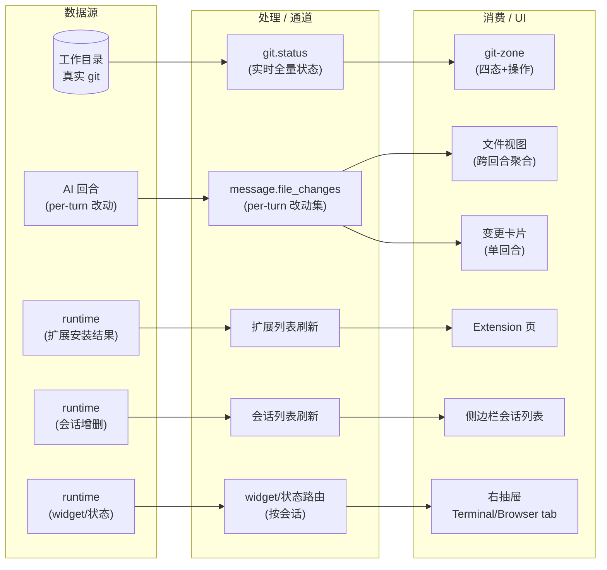
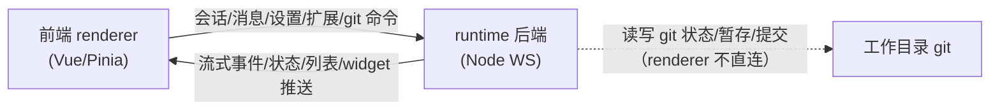

# 前端 renderer ↔ runtime 后端集成 · 需求澄清（W11+ 第二轮）

> **本文件性质：** 业务需求视角（①澄清需求阶段）。按 clarity skill [铁律]，**本阶段不考虑系统实现**——技术栈、协议类型、port 名、文件落点、spawn 安全等均移至下游 ②系统设计 / ⑤代码架构 阶段，见 `spec-w11.md` 与 `plan-w11.md`。本文只回答「业务要达成什么、谁在用、数据怎么流转、功能清单、UI 场景、跨系统关联」。
> **技术实现真相源：** `spec-w11.md`（12 FR + 追踪修正 + 决策 C1-C15）、`plan-w11.md` / `plan-w11-part2.md`（W11-W18 wave 规格）。

---

## TL;DR（核心结论）

- **做了什么：** 把 W01-W10 已铺好「类型地基 + 主路径」之后的**三类残留**一次性收口——已入库但 UI 没消费的数据、后端就绪但前端没接的能力、被重构误删的设计区块。
- **服务对象：** 桌面端 AI 编码助手的日常使用者 + 做联调的开发者。
- **不碰什么：** Session Tree（属 Flow-3）、工具审批链路（含 Diff 代码审查审批）、Plugin 管理、SubAgent 编排、@/# 搜索、附件上传——沿用 waves.md D1-D10 边界。
- **最大风险点：** git-zone 加回涉及「真实 git 状态」的新增能力，需与既有的 per-turn 文件变更（file_changes）明确区分语义，二者并行不互吞。

> **⚠️ [STALE] 声明（2026-06-25 反哺对齐）**：F2「工具调用 pending 状态补全」与 §4 G1 路径中「修复 tool_call_pending 硬漏接」**失效**。runtime 不生产 `message.tool_call_pending`（tool 审批链路 Out-of-scope）。权威源：`spec-w11.md` [STALE] 声明 + `issues.md` #8 [STALE] + `code-architecture.md` §3.9 [STALE]。注意：F4「排队引导 pending 气泡」是 queue pending（steer/followUp 排队），不失效。

---

## 1. 业务目标（Business Goals）

### 目标树

- **G1: 已实装渲染能力在开发联调时可见、可验证** — 成功标准：mock 模式发一条消息，能看到完整的实时流式效果（思考块→工具卡→文本流式→变更清单→系统通知），而非只看静态样例
  - G1.1: steer/followup 排队、自动重试这两类「已入库但没 UI」的运行时状态，在界面上有对应指示位
- **G2: 后端已就绪但前端闲置的能力全部接通** — 成功标准：Extension 安装/卸载、上下文压缩、终端/浏览器 widget 三项后端命令在前端有完整入口与闭环
  - G2.1: 右抽屉 Side Drawer 作为承载 widget 的架构容器落地（为终端/浏览器等内容提供呈现位）
- **G3: 还原 v3 设计稿的完整工作面板** — 成功标准：Panel 恢复设计稿定义的 5 个固定 zone（含被重构误删的 git-zone），会话列表支持多窗口/runtime 侧增删的实时刷新，侧边文件视图显示真实改动而非样例
- **G4: 契约对齐与收尾** — 成功标准：剩余的类型/枚举契约裂缝补齐（工具调用状态、文件变更状态、扩展信息），前端与后端的可辨识联合一致

### 达成路线

| 目标 | 路线 / 策略 | 对应用例 |
|------|------------|---------|
| G1 | 补全 mock 流式剧本（固定剧本）+ 接上 retry/queue 的 UI 指示位（原含「修复 tool_call_pending 硬漏接」，已 [STALE] 作废，见顶部声明） | UC-1, UC-4 |
| G2 | Extension 安装/卸载多步流、用户主动触发压缩、widget 订阅 + Side Drawer 容器 | UC-2, UC-3, UC-5 |
| G3 | git-zone 按设计稿加回 + 会话列表 server-push + 文件视图切真实改动聚合 | UC-6, UC-7, UC-8 |
| G4 | 工具调用/文件变更/扩展信息三类枚举与字段契约对齐（技术契约，归下游） | （支撑性，无独立用例） |

---

## 2. 业务用例（Use Cases）

### 用例图

```mermaid
flowchart LR
  User((日常用户))
  Dev((开发者<br/>联调))

  System ["xyz-agent 工作面板<br/>(Panel + Sidebar)"]

  User --- UC1["查看完整流式回复<br/>(思考/工具/文本/变更)"]
  User --- UC2["管理 Extension<br/>(安装/卸载)"]
  User --- UC3["主动压缩上下文"]
  User --- UC5["使用终端/浏览器 widget"]
  User --- UC6["查看并操作 git 状态<br/>(暂存/提交)"]
  User --- UC7["多窗口实时看到会话增删"]
  User --- UC8["侧边看到真实文件改动"]

  Dev --- UC1
  Dev --- UC4["在 mock 模式验证<br/>流式渲染效果"]
  Dev --- UC6

  UC1 -.include.-> UC6
  UC3 -.extend.-> UC1
  UC5 -.include.-> UC9[/"(架构容器)<br/>Side Drawer"/]
  UC6 -.extend.-> UC9
```

### UC-1: 用户看到完整的 AI 工作回合
- **Actor**: 日常用户（也含开发者）
- **前置条件**: 已打开一个会话，处于 mock 或真实 runtime 模式
- **主流程**: 1. 用户发送消息 → 2. AI 先「思考」（折叠块） → 3. 调用工具（工具卡） → 4. 流式产出文本 → 5. 给出本回合文件变更清单 → 6. 系统通知（如压缩摘要/分支信息） → 完成
- **替代流程**: AI 工作中被用户 steer 排队引导（不打断）；AI 完成后被 followup 开新一轮
- **异常流程**: 流式出错（红框）；触发自动重试（显示重试指示）
- **后置状态**: 回合默认折叠，仅显示总结 + 文件变更
- **关联目标**: G1

### UC-2: 用户管理 Extension（安装/卸载）
- **Actor**: 日常用户
- **前置条件**: 在 Settings → Extension 菜单
- **主流程**: 1. 选择来源（npm 包 / 本地目录 / git 仓库） → 2. 触发安装 → 3.（目录/git 来源）展示发现的候选 → 4. 确认选中候选 → 5. 安装完成，列表刷新
- **替代流程**: 本地目录/git 需多步发现候选；可中途取消
- **异常流程**: 安装失败（回显错误与提示）；非候选目录
- **后置状态**: 新扩展出现在列表，可启用/禁用
- **关联目标**: G2

### UC-3: 用户主动压缩上下文
- **Actor**: 日常用户
- **前置条件**: 长会话，上下文接近上限
- **主流程**: 1. 通过 slash command 触发压缩 → 2. 显示「压缩中」状态 → 3. 完成后状态消失 + 出现压缩摘要系统行
- **替代流程**: 无
- **异常流程**: 压缩失败（错误回显）
- **后置状态**: 上下文窗口释放；摘要行留在消息流
- **关联目标**: G2

### UC-4: 开发者在 mock 模式验证流式渲染
- **Actor**: 开发者
- **前置条件**: VITE_MOCK 模式
- **主流程**: 1. 发送任意消息 → 2. mock 按固定剧本回放完整事件序列（思考/工具/文本/变更/系统通知/排队/重试） → 3. 开发者核对每类渲染是否符合设计
- **替代流程**: 中途 abort，剧本应干净停止不残留
- **异常流程**: 剧本本身有缺陷（开发期发现）
- **后置状态**: 验证通过，可进入真实 runtime 联调
- **关联目标**: G1

### UC-5: 用户使用终端/浏览器 widget
- **Actor**: 日常用户
- **前置条件**: 扩展提供了终端或浏览器能力，已激活会话
- **主流程**: 1. 运行时推送 widget 内容（按会话通道） → 2. 前端订阅并渲染 → 3. 在右抽屉对应 tab 呈现
- **替代流程**: 无
- **异常流程**: widget 无内容（空态）
- **后置状态**: widget 持续在抽屉呈现，直到会话切换或关闭
- **关联目标**: G2（含架构容器 G2.1）

### UC-6: 用户查看并操作 git 状态
- **Actor**: 日常用户（也含开发者）
- **前置条件**: 当前会话的工作目录是一个 git 仓库
- **主流程**: 1. 进入会话时 git-zone 显示当前分支与状态（干净/已暂存/有改动/冲突） → 2. 可暂存/取消暂存 → 3. 提交时弹出可选 message 输入框 → 4. 提交完成，状态刷新
- **替代流程**: AI 一回合结束后自动刷新；手动操作后刷新
- **异常流程**: 非 git 仓库（git-zone 隐藏）；有冲突时提交被拒绝（回显）；git 未安装（降级隐藏）
- **后置状态**: 工作目录的 git 状态如实反映；Diff/解决冲突按钮触发右抽屉 SideDrawer 打开（只读展示冲突文件，不做审批动作，见 §5 / C2-C3）
- **关联目标**: G3

### UC-7: 多窗口/runtime 侧增删会话实时同步
- **Actor**: 日常用户
- **前置条件**: 多窗口或 runtime 后端侧发生会话增删
- **主流程**: 1. runtime 广播会话列表 → 2. 前端订阅 → 3. 侧边栏列表实时刷新（不重载全量历史）
- **替代流程**: 无
- **异常流程**: 订阅中断（下次进入重载）
- **后置状态**: 侧边栏列表与 runtime 真实状态一致
- **关联目标**: G3

### UC-8: 用户在侧边看到真实文件改动
- **Actor**: 日常用户
- **前置条件**: 会话中有 AI 改动过文件
- **主流程**: 1. 侧边文件视图聚合当前会话所有回合的文件改动（跨回合合并） → 2. 显示新增/修改/删除 + 行数 + 冲突标注 + 过滤
- **替代流程**: 无
- **异常流程**: 无改动（空态）
- **后置状态**: 文件树反映真实改动，与消息流里的变更卡片语义对齐
- **关联目标**: G3

---

## 3. 数据流转（Data Flow）

### 数据流图



### 数据清单

| 数据 | 来源 | 处理/通道 | 消费者 | 归档策略 | 敏感级别 |
|------|------|----------|--------|---------|---------|
| 真实 git 状态 | 工作目录 .git | 实时查询（进入会话/回合结束/操作后刷新） | git-zone | 不持久化（实时反映本地） | 本地文件 |
| per-turn 文件改动 | AI 回合 | message 通道（带回合标识） | 变更卡片 + 文件视图（跨回合聚合） | 随会话历史 | 本地文件 |
| 扩展列表 | runtime 安装结果 | 列表刷新通道 | Extension 页 | 配置存储 | 内部 |
| 会话列表 | runtime 会话增删 | 列表广播通道（不重载历史） | 侧边栏 | 会话存储 | 内部 |
| widget 内容 | runtime 扩展 | 按会话路由通道 | 右抽屉对应 tab | 会话生命周期 | 本地 |

> **关键语义区分（C12）：** 「真实 git 状态」（git-zone 用）与「per-turn 改动」（变更卡片/文件视图用）是**两条独立数据**，各管各的。git-zone 反映工作目录全量状态（含用户手改、IDE 外操作）；per-turn 改动只反映单个 AI 回合动了什么。二者并行显示，不互吞。

---

## 4. 功能清单（Features）

| 编号 | 功能 | 对应用例 | 关联目标 | 备注 |
|------|------|---------|---------|------|
| F1 | mock 流式事件补全（固定剧本：思考/工具/文本/变更/系统通知/排队/重试） | UC-1, UC-4 | G1 | 让已实装渲染在 mock 可验证 |
| F2 | ~~工具调用 pending 状态补全（修复硬漏接）~~ **[STALE] 作废**（runtime 不生产 tool_call_pending，见顶部声明） | — | — | 枚举裂缝 |
| F3 | 自动重试 UI 指示位 | UC-1 | G1 | 已入库未消费 |
| F4 | 排队引导 pending 气泡（steer/followup） | UC-1 | G1 | 已入库未消费 |
| F5 | Extension 安装/卸载多步流（npm/目录/git 三来源） | UC-2 | G2 | 后端就绪未接 |
| F6 | 上下文压缩（slash command 触发） | UC-3 | G2 | 后端就绪未接 |
| F7 | 终端/浏览器 widget 订阅与渲染 | UC-5 | G2 | 推送就绪未订阅 |
| F8 | 右抽屉 Side Drawer 架构容器 | UC-5, UC-6 | G2.1 | widget 呈现位 |
| F9 | 会话列表 server-push 订阅（不重载历史） | UC-7 | G3 | 事件未订阅 |
| F10 | 文件视图切真实改动聚合（跨回合合并） | UC-8 | G3 | 当前直读样例 |
| F11 | 契约对齐（扩展信息补字段、文件变更状态补冲突枚举） | （支撑性） | G4 | 类型契约 |
| F12 | git-zone 加回（设计稿 zone ⑤）+ 真实 git 操作（暂存/取消暂存/提交/查看状态） | UC-6 | G3 | 被重构误删 + 新增能力 |

---

## 5. UI/UX 场景（Interface Scenarios）

> 依据 `docs/page-design/v3/panel/spec.md`（5 个固定 zone）与 `draft-companion-zones.html`（git-zone 四态）。

### 页面线框（文字描述）

Panel 自上而下 5 个固定 zone（设计稿 SSOT）：

```
┌─ Panel ─────────────────────────────┐
│ ① panel-header      会话元信息         │
│ ② message-stream    消息流 + 回合折叠     │  ← F1/F2 流式；F3 重试指示；F4 排队气泡
│ ③ progress-zone     单会话进度           │
│ ④ composer          输入区+工具区/steer   │  ← F4 pending 气泡靠右虚线脉冲
│ ⑤ git-zone          暂存/提交/Diff 入口   │  ← F12 四态展示
└─────────────────────────────────────┘
                                    ┌─ 右抽屉 ─┐
                                    │ Terminal │ ← F7 widget
                                    │ Browser  │
                                    └──────────┘  ← F8 容器，F12 Diff 按钮触发
```

- **retry/queue 指示位（F3/F4）：** 放在 **composer 上方独立行**（对齐 panel/spec.md:52），不挤进消息流回合。
- **git-zone 四态（F12）：** 干净（绿 pill）/ 已暂存（绿）/ 有改动（橙）/ 冲突（红 + danger 竖条）—— 分支显示 + stats（+N/-N）+ 状态 pill + soft 渐隐底。
- **Side Drawer（F8）：** 从触发它的 Panel 浮起，固定挂该 Panel，不跨 Panel 覆盖；header 多 tab 容器，tab 构成 = Terminal / Browser（+ 进度聚合），**不含 Diff 审批 tab**（Diff Accept/Reject 整块排除，见 §8 / C2）。
- **git-zone Diff/解决冲突按钮 → SideDrawer：** 按钮是触发源（C9），但打开后 SideDrawer 内为**只读展示**（冲突文件列表可展示），**不做 Accept/Reject 审批动作**——容器保留、审批内容排除（C3）。
- **文件视图（F10）：** 聚合当前会话所有回合改动成树，含行数 +N/-N + 冲突标注 + 过滤框（对齐 draft-file-view.html）。

### 交互流程

- **发消息（UC-1）：** composer 输入 → 发送 → message-stream 出现回合（思考→工具→文本→变更折叠） → 系统通知
- **steer/followup（UC-1 替代）：** AI 工作中/后提交 → composer 上方出 pending 气泡 → 进入 message-stream 后消失
- **Extension 安装（UC-2）：** Settings → Extension → 选来源 → 安装 →（候选）选择 → 完成
- **压缩（UC-3）：** slash command 触发 → 状态「压缩中」 → 完成 + 摘要行
- **git 操作（UC-6）：** 进入会话 git-zone 显示状态 → 暂存/取消暂存/提交（弹可选 message） → 状态刷新；Diff 按钮触发右抽屉

### 状态展示（空/加载/错误）

- 空态：无消息、无改动、无扩展、widget 无内容
- 加载态：流式中、安装中、压缩中、git 查询中
- 错误态：流式出错（红框）、安装失败（回显+提示）、压缩失败、git 冲突提交被拒、git 未安装/非仓库（git-zone 隐藏）

---

## 6. 系统间功能关联（Cross-System）

### 关联图



| 关联系统 | 依赖方向 | 交互方式 | 契约稳定性 |
|---------|---------|---------|-----------|
| runtime 后端 | renderer 双向依赖（命令→ / ←推送） | 消息通道（命令/推送） | 自有可控，契约即 shared 类型联合 |
| 工作目录 git | runtime 代办读写（renderer 不直连） | 实时查询 + 写操作（暂存/提交） | 自有（本地 .git），但 git 行为不可改 |

> renderer 与工作目录 git **不直接交互**——所有 git 读写由 runtime 代办（安全与一致性）。

---

## 7. 约束（Constraints）

- 业务约束：沿用 waves.md §0 的 D1-D10 决策边界（不越界到 tree/工具审批/plugin/附件/搜索）
- 架构不变：renderer/runtime 分层，命令与推送走统一消息通道
- mock 与真实门面同构：两侧能力签名一致（mock 模式必须能验证所有 UI）
- 错误契约统一：请求级失败走统一错误封装
- 技术约束（仅记录不展开）：renderer=Vue3/TS/Pinia/Tailwind；runtime=Node WS；git 读写须防注入（细节见下游）
- 执行计划层约束（→ plan-w11.md）：每 wave 验证基线（类型检查 + 单测全绿 + git 干净后提交）；串行执行（不并行派 implementer，会冲突）

---

## 8. 不做（Out of Scope）

- ❌ Session Tree（tree-data/navigate/fork/clone/capability）—— 属 Flow-3
- ❌ 工具审批链路（tool.approve/deny/always_allow + 确认 UI）
- ❌ **Diff 代码审查审批**（Diff tab + 变更卡片 Accept/Reject）—— 含在审批排除边界内；Side Drawer 保留容器，仅移除 Diff 审批子项
- ❌ Plugin 管理（维持 deferred，spec 标「独立第 6 菜单」）
- ❌ SubAgent 多 agent 编排
- ❌ @-mention/#文件/SearchModal 数据源（无 search/LSP 后端接口，协议级缺口）
- ❌ Overview 统计卡/timeline（无 overview 后端命令）
- ❌ 附件上传（协议缺口）

---

## 决策记录（本轮 5 轮澄清，15 项）

| # | 决策 | 选项 | 理由 |
|---|------|------|------|
| C1 | 范围深度 | 三档全做 | 收尾闭环 + 后端能力对接 + Side Drawer |
| C2 | 审批边界 | 含 Diff 代码审查审批（整块排除） | tool 审批 + Diff Accept/Reject 整块排除 |
| C3 | Side Drawer | 保留容器，仅移除 Diff 审批内容 | 为终端/浏览器/进度聚合铺位 |
| C4 | Plugin | 维持 deferred | 后端命令闲置，但 spec 标独立第 6 菜单 |
| C5 | mock 流式 | 全套固定剧本 | 让所有已实装渲染可验证 |
| C6 | 文件视图 | 切到改动聚合（跨回合合并） | 数据已在 store，盘活通道 |
| C7 | 会话列表 | 加 server-push 订阅（不重载历史） | 多窗口/runtime 侧变更实时同步 |
| C8 | 压缩触发 | 经 slash command | 用户确认 |
| C9 | SideDrawer 触发 | git-zone Diff 按钮触发打开 | git-zone 加回后有触发源 |
| C10 | retry/queue UI | composer 上方独立行 | 对齐 panel/spec.md:52 |
| C11 | **git-zone** | **按设计稿加回（含新增真实 git 操作能力）** | v3 SSOT 明确要求（panel/spec.md:30），前端重构错误移除 |
| C12 | git-zone 数据源 | **独立真实 git 状态**（非 per-turn 改动） | git-zone 显示全量状态（含用户手改），per-turn 改动仅 AI 改动，语义不同 |
| C13 | commit message | 前端弹输入框（可选 message） | 设计稿无 commit UI，但用户要可输入 |
| C14 | git 状态刷新 | 进入会话 + 回合结束 + 操作后（非轮询） | 无文件系统监听，手动+事件触发 |
| C15 | 冲突标注来源 | **runtime 推送**（修正原「前端标注」矛盾） | runtime 输出冲突标志 + 文件冲突状态，前端据此渲染冲突态 |

---

## 待确认

- 无 `[UNRESOLVED]` / `[AMBIGUOUS]`。3 轮独立追踪已收敛（见 `changes/tracing-round-1/2/3.md`，Round 3 = CONVERGED）。

---

## 下游指向（技术实现真相源）

- **技术 spec：** `spec-w11.md`（12 FR 完整技术描述 + 追踪修正 + 决策依据）
- **执行计划：** `plan-w11.md`（W11-W14）+ `plan-w11-part2.md`（W15-W18）
- **追踪记录：** `changes/tracing-round-{1,2,3}.md`
