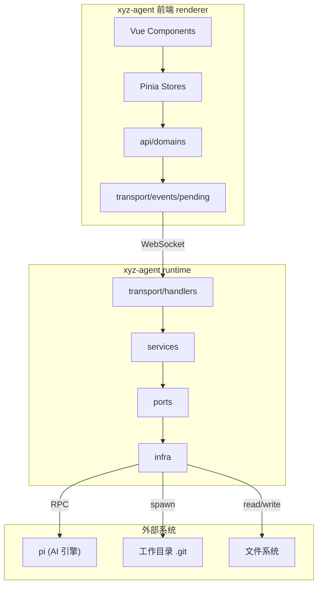
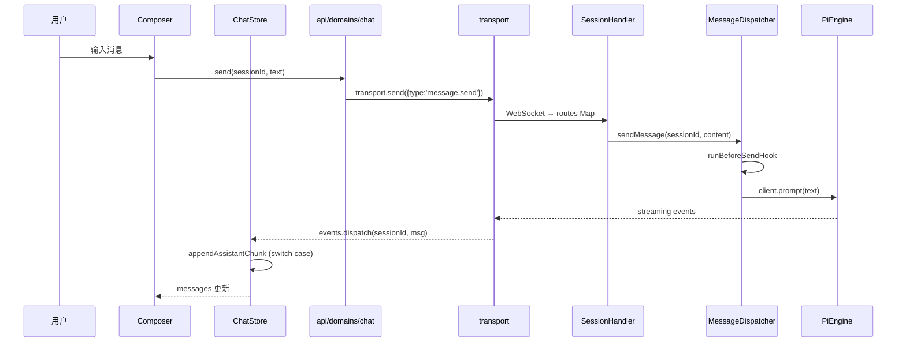
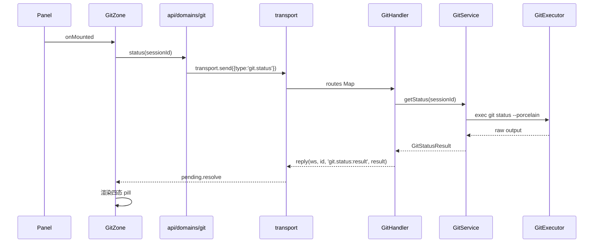

# 前端 renderer ↔ runtime 后端集成（W11+）架构设计

## 1. 目标转换

### 业务目标 → 系统目标

| 业务目标(requirements) | 转换为系统目标 | 衡量标准 |
|----------------------|--------------|---------|
| G1: 已实装渲染能力在 mock 可验证 | mock 门面与 real 门面同构，所有 message.* 类型在 mock 有完整剧本 | mock 模式发消息可见 thinking→tool→text→file_changes 全链路 |
| G2: 后端就绪能力全部接通 | extension/compact/widget 三域的 domain 层完成订阅/动作对齐 | Extension 安装/卸载、compact 触发、widget 订阅在 mock 可验证 |
| G2.1: Side Drawer 架构容器 | 新建 SideDrawer 容器组件，承载 Terminal/Browser/git Diff | 抽屉可打开/关闭/钉住，多 tab 切换 |
| G3: 还原 Panel 5 固定 zone | git-zone 加回 + session.list server-push + FileView 切真实数据 | Panel 恢复 panel-header/message-stream/progress-zone/composer/git-zone |
| G4: 契约对齐 | ToolCallStatus 补 'pending'、FileChangeStatus 补 'unmerged'、ExtensionInfo 补 tools | vue-tsc 0 错 |

### 搭便车改造目标

> **状态列语义**：`候选` → `待⑤确认` → `已纳入`/`已回流`/`打回`（详见 deliverable-template §1）。
> 本表状态为 2026-06-25 事后回填——W01-W18 已全量落地，故两项均按实际结果标 `已纳入`。

| 改造目标 | 动机 | 关联业务目标 | 状态 | 落地证据 |
|---------|------|------------|------|---------|
| events 层加 onGlobalType 泛型收窄 | 现有 onGlobal 无类型收窄，handler 内 msg.payload 需 `as` 断言 | G2（所有订阅域需要类型安全） | 已纳入 | `api/events.ts:64 onGlobalType<T extends ServerMessageType>` 已实现 |
| domain 层三类形态规范化 | contract.md 确立请求/订阅/动作三类范式，现有代码混用 | G1-G4（契约对齐基础） | 已纳入 | `api/domains/` 已拆分 8 个域文件（chat/config/extension/git/model/plugin/session/settings） |

## 2. 设计立场

**核心计算：消息路由与状态同步。**

这不是一个有复杂业务规则的系统，而是一个**消息管道**——前端发命令、runtime 处理、状态变更推回前端。核心复杂度在「三类消息形态的统一处理」和「session 隔离的事件路由」。

**分层决策：三层架构（Interface / Engine / Infrastructure）**

- **Interface 层**：Vue 组件 + composables（消费 stores，不直接碰 transport）
- **Engine 层**：stores + api/domains（状态管理 + 消息编排）
- **Infrastructure 层**：transport + events + pending（WebSocket 通信）

Runtime 侧同构：
- **Interface 层**：transport/handlers（消息路由）
- **Engine 层**：services（业务逻辑）
- **Infrastructure 层**：ports + infra（pi 交互）

**为什么不用 DDD 四层：** 系统没有复杂领域规则（如金融计算、库存扣减），核心是消息转发和状态映射。三层足够，四层会多出一个空壳 domain 层。

## 3. 统一语言（Ubiquitous Language）

| 术语 | 定义 | 上下文 |
|------|------|--------|
| **Domain** | 前端 api/domains/ 下的单个域文件，封装该域的三类接口 | chat.ts, config.ts, extension.ts |
| **Handler** | runtime transport/ 下的消息处理器，路由 ClientMessage 到 service | session-message-handler.ts |
| **Port** | runtime services/ports/ 下的接口定义，service 经此访问 infra | ISessionStore, IConfigStore |
| **三类形态** | 请求-响应（Promise\<T\>）、订阅-推送（onXxx 返回取消函数）、动作-ack（Promise\<void\>） | contract.md 定义 |
| **Session 通道** | events.on(sessionId, handler)，按 sessionId 路由 ServerMessage | events.ts |
| **Global 通道** | events.onGlobal/onGlobalType，无 sessionId 的 server-push | events.ts |
| **Message 帧** | 单个 ServerMessage 携带的 payload，如 text_delta/thinking_delta/tool_call_start | protocol.ts |
| **Round** | 一个完整的 AI 工作回合：message_start → ... → complete | 消息流语义 |

## 4. 核心模型

### 4.1 前端模型

| 模型 | 类型 | 不变式 | 建模理由 |
|------|------|--------|---------|
| **ChatStore** | store（Pinia） | sessionId → ChatSessionState 的 Map，所有操作要求显式 sessionId | session 隔离的消息状态管理 |
| **ChatSessionState** | 值对象 | messages: Message[], isGenerating: boolean, streamingMessage: string | 单个 session 的聊天状态快照 |
| **Domain 函数** | 纯函数 | 无状态，依赖 transport/pending/events | 三类形态的统一入口 |
| **GitStatusResult** | DTO | 从 git.status 推送解析，不可变 | git-zone 的数据源 |
| **GitFileStatus** | 值对象 | path + xyCode + status(added|modified|deleted|unmerged|renamed|untracked) | 单个文件的 git 状态 |
| **ExtensionInfo** | DTO | 含 tools 字段（MCP 工具列表） | 扩展信息展示 |

### 4.2 Runtime 模型

| 模型 | 类型 | 不变式 | 建模理由 |
|------|------|--------|---------|
| **SessionService** | 服务 | sessions: Map<sessionId, SessionState>，每个 session 绑定一个 PiEngine | session 生命周期管理 |
| **MessageDispatcher** | 服务 | 无状态，依赖 svc/pm/broker | send/abort/steer/followUp/compact 的编排 |
| **Handler** | 路由器 | handles(): ClientMessageType[] 返回认领的消息类型集 | 消息路由的开闭原则 |

### 4.3 降级决策（主动不建模）

| 概念 | 为什么不建模 | 应有的处理 |
|------|-------------|-----------|
| **MessageStream** | 消息流是 ChatStore 的派生状态，不是独立 aggregate | ChatStore 内 messages 数组 + 计算属性 |
| **GitZone 四态** | 是**前端派生展示态**（从 GitStatusResult 实时推导），不是独立状态机 | GitZone.vue 内从 hasConflict/stagedCount/unstagedCount 推导 clean/staged/dirty/conflict |
| **SideDrawer** | 容器组件，无领域状态，只有 UI 开/关/钉住 | Vue 组件 + local ref |

## 5. 状态流转

### 5.1 Session 生成状态（isGenerating）

```
┌─────────────────────────────────────────────────────────────┐
│                       idle                                   │
│                         │                                    │
│                    message.send                              │
│                         ▼                                    │
│                   generating ──────── abort ──────► idle     │
│                         │                                    │
│                    complete                                   │
│                         ▼                                    │
│                       idle                                   │
└─────────────────────────────────────────────────────────────┘
```

**Status 枚举：** idle / generating
**终态：** idle（不可逆：一旦 idle，只能通过 message.send 再次进入 generating）
**Reason 字段：** 无（终态 idle 无需原因）

### 5.2 Extension 安装状态（install flow）

```
┌─────────────────────────────────────────────────────────────────┐
│                         idle                                     │
│                           │                                      │
│                   install / installDir / installGit               │
│                           ▼                                      │
│                      installing                                   │
│                           │                                      │
│                    discovered (多步流)                            │
│                           │                                      │
│                   finishInstall / cancelInstall                   │
│                         ▼   ▲                                    │
│                    completed │                                   │
│                         │   │                                    │
│                     error ──┘                                    │
└─────────────────────────────────────────────────────────────────┘
```

**Status 枚举：** idle / installing / discovered / completed / error
**终态集合：** {completed, error}（不可逆）
**Reason 字段：** error 时附带 message
**重试机制：** error 状态下用户可通过重新触发 install（新流程）来重试，而非重置 error 状态。即 error 终态的「不可逆」指「该次安装流程不可重置」，但用户可发起新的安装。

### 5.3 Compact 压缩状态

```
┌─────────────────────────────────────────────────────────────┐
│                         idle                                 │
│                           │                                  │
│                      compact()                               │
│                           ▼                                  │
│                      compacting                              │
│                           │                                  │
│                        compacted                             │
│                           │                                  │
│                         idle                                 │
└─────────────────────────────────────────────────────────────┘
```

**Status 枚举：** compacting / compacted（瞬态，非持久状态机）
**注意：** 这不是真正的状态机，而是事件流。compacting→compacted 是原子转换，失败时 compacted 附带 error 字段。

### 5.4 git-zone 四态（派生展示态，非状态机）

git-zone 的四态（clean/staged/dirty/conflict）是**前端派生展示态**，从 GitStatusResult 实时推导：

- **clean**: stagedCount == 0 && unstagedCount == 0 && !hasConflict
- **staged**: stagedCount > 0 && unstagedCount == 0 && !hasConflict
- **dirty**: unstagedCount > 0 && !hasConflict
- **conflict**: hasConflict == true

每次 git.status 返回后重新计算四态，无显式转换规则。git-zone 是「镜子」（反映真实状态），不是「控制器」（驱动状态转换）。

## 6. 分层架构

### 6.1 前端分层

```
┌─────────────────────────────────────────────────────────────────┐
│  Interface Layer (Vue Components + Composables)                  │
│  ┌─────────┐ ┌─────────┐ ┌──────────┐ ┌──────────┐            │
│  │ Panel   │ │ Sidebar │ │ Settings │ │ Composer │            │
│  └────┬────┘ └────┬────┘ └─────┬────┘ └─────┬────┘            │
│       │           │            │             │                  │
├───────┼───────────┼────────────┼─────────────┼──────────────────┤
│  Engine Layer (Stores + api/domains)                             │
│  ┌────┴───────────┴────────────┴─────────────┴────┐             │
│  │              chat.ts / config.ts / ...          │             │
│  │         (三类形态: 请求/订阅/动作)               │             │
│  └────────────────────────┬────────────────────────┘             │
│                           │                                      │
├───────────────────────────┼──────────────────────────────────────┤
│  Infrastructure Layer (transport + events + pending)             │
│  ┌────────────────────────┴────────────────────────┐             │
│  │   transport.send / events.on / pending.create   │             │
│  └─────────────────────────┬───────────────────────┘             │
│                            │                                     │
└────────────────────────────┼─────────────────────────────────────┘
                             │ WebSocket
                             ▼
```

### 6.2 Runtime 分层

```
┌─────────────────────────────────────────────────────────────────┐
│  Interface Layer (transport/handlers)                            │
│  ┌─────────────────────────────────────────────────────────┐    │
│  │  SessionMessageHandler / SettingsMessageHandler / ...    │    │
│  │  (routes Map → ClientMessageType → handler)              │    │
│  └────────────────────────────┬────────────────────────────┘    │
│                               │                                 │
├───────────────────────────────┼─────────────────────────────────┤
│  Engine Layer (services)                                        │
│  ┌────────────────────────────┴────────────────────────────┐    │
│  │  SessionService / ConfigService / ModelService / ...     │    │
│  │  (业务逻辑编排，不直接碰 pi)                              │    │
│  └────────────────────────────┬────────────────────────────┘    │
│                               │                                 │
├───────────────────────────────┼─────────────────────────────────┤
│  Infrastructure Layer (ports + infra)                           │
│  ┌────────────────────────────┴────────────────────────────┐    │
│  │  ISessionStore / IConfigStore / IPiEngine / ...          │    │
│  │  (infra/pi/ 实现，封装 pi-config-bridge / pi RPC)        │    │
│  └─────────────────────────────────────────────────────────┘    │
│                                                                  │
└──────────────────────────────────────────────────────────────────┘
```

### 6.3 Port 清单

| Port | 价值定位 | 实现数 |
|------|---------|--------|
| ISessionStore | pi session 文件操作隔离，可替换为其他存储后端 | 1（pi-config-store.ts） |
| IConfigStore | pi 配置操作隔离，可替换为其他配置源 | 1（pi-config-store.ts） |
| IPiEngine | pi 进程交互隔离，可替换为其他 AI 引擎 | 1（pi-process.ts） |
| IGitExecutor | git 命令执行隔离（含 status/stage/unstage/commit），**新建**，可替换为其他 git 实现 | 1（待建） |

**特化决策：** ISessionStore 和 IConfigStore 只有一个实现，但保留为 port 的理由是：它们封装的是外部系统（pi 文件系统），边界价值 > 可替换价值。

## 7. 模块划分与变化轴

### 7.1 前端模块

| 模块 | 职责 | 变化轴 | LOC(预估) |
|------|------|--------|----------|
| `api/domains/chat.ts` | send/abort/steer/followUp/compact/streamSubscribe | 消息类型增删 | ~80 |
| `api/domains/config.ts` | providers/skills/agents 的 CRUD + 订阅 | 配置类型增删 | ~120 |
| `api/domains/extension.ts` | onExtensions/toggle/install | 扩展管理功能 | ~60 |
| `api/domains/git.ts` | **新建**，status/stage/unstage/commit | git 操作 | ~80 |
| `api/events.ts` | session 通道 + global 通道 | 通道类型增删 | ~100 |
| `stores/chat.ts` | message.* 事件的 store case | 消息类型增删 | ~300 |
| `components/panel/GitZone.vue` | **新建**，git 四态展示 + 操作 | git 功能 | ~150 |
| `components/panel/SideDrawer.vue` | **新建**，右抽屉容器 | widget 类型增删 | ~120 |

### 7.2 Runtime 模块

| 模块 | 职责 | 变化轴 | LOC(预估) |
|------|------|--------|----------|
| `transport/git-message-handler.ts` | **新建**，git.* 消息路由 | git 命令增删 | ~150 |
| `services/git-service.ts` | **新建**，git 状态查询 + 操作编排 | git 逻辑 | ~200 |
| `services/ports/git-executor.ts` | **新建**，IGitExecutor 接口 | git 命令增删 | ~50 |
| `infra/git-executor.ts` | **重构**（Wave 1 已落地，本轮 execFileSync → async execFile），async execFile 数组参数封装 | git 命令增删 | ~100 |
| `transport/session-message-handler.ts` | session.* 消息路由 | 消息类型增删 | ~200 |
| `services/session/message-dispatcher.ts` | send/abort/steer/followUp/compact | 消息类型增删 | ~200 |

## 8. 系统间上下文边界（Context Map）



### 关联系统关系

| 关联系统 | 关系模式 | 交互方式 | 契约稳定性 |
|---------|---------|---------|-----------|
| pi (AI 引擎) | 客户-供应商 | RPC（JSON-RPC over stdio） | 自有可控（fork 版本） |
| 工作目录 .git | 客户-供应商 | spawn（async execFile） | 自有（本地 git） |
| 文件系统 | 共享内核 | read/write | 自有 |

## 9. 泳道图（Swimlane）

### 9.1 消息发送完整流程



### 9.2 git.status 完整流程（新建）



## 10. 挑战与决策

### D-1: git-zone 数据源独立 vs 复用 file_changes
**张力**: git-zone 要显示工作目录全量状态（含用户手改），file_changes 只反映 AI 单回合改动。复用会混淆语义。
**决策**: 独立数据源。git-zone 走 `git.status` 命令，file_changes 走 `message.file_changes` 推送。
**理由**: C12 决策。二者语义不同，各管各的。git-zone 反映「工作目录现在是什么样」，file_changes 反映「AI 这回合改了什么」。

### D-2: 三类形态的统一入口
**张力**: 请求/订阅/动作三类形态的签名和消费方式不同，是否需要统一抽象？
**决策**: 不统一，保持三类范式各自独立。Domain 层按范式分函数，调用方按范式消费。
**理由**: contract.md 确立的范式。统一抽象会增加心智模型复杂度，而三类形态的差异是语义差异（不是技术差异）。

### D-3: SideDrawer 触发源
**张力**: SideDrawer 由谁触发打开？git-zone Diff 按钮、Terminal widget、还是通用按钮？
**决策**: 由 git-zone Diff 按钮触发打开，Terminal/Browser 作为 tab 内容。
**理由**: C9 决策。git-zone 加回后有明确触发源，避免「先有鸡还是先有蛋」问题。

### D-4: Extension 安装多步流的 UI 形态
**张力**: 候选选择用弹窗还是内联？
**决策**: 内联（在 ExtensionPage 内展开候选列表）。
**理由**: 保持页面上下文，避免弹窗遮挡。用户可以在候选列表和已安装列表间对比。

### D-5: mock 剧本的复杂度边界
**张力**: mock 剧本要多完整？只覆盖 happy path 还是也覆盖 error/abort/steer？
**决策**: 覆盖完整事件序列（thinking→tool→text→file_changes→complete），另补 queue_update/auto_retry 的 mock 推送。error/abort 用独立触发按钮。
**理由**: G1 目标是「让已实装渲染在 mock 可验证」，不是「模拟所有边界情况」。

### D-6: unmerged 状态的双路径推送
**张力**: git.status 和 message.file_changes 两条路径都需要 unmerged 状态，谁推？
**决策**: 两条路径都由 runtime 推送。git.status 通过 hasConflict + files[].status=unmerged；message.file_changes 通过 FileChangeStatus='unmerged'。
**理由**: C15 决策。前端不自己标注 unmerged，统一由 runtime 推送，避免前后端不一致。

### D-7: Widget 订阅走 session 通道
**张力**: extension:widget / extension:status 含 sessionId，走 session 通道还是 global 通道？
**决策**: 走 session 通道。events.ts 的 routeInbound 按 payload.sessionId 有无决定路由。
**理由**: spec-w11.md FR-7 明确走 session 通道 events.on(sessionId)。含 sessionId 的消息应路由到 session 通道，保持 session 隔离。

### D-8: git-info.ts 保留在 services/（准 port）
**张力**: git-info.ts 直接用 execSync 执行 git 命令，违反「Engine 层不碰 IO」分层。
**决策**: 保留在 services/，视为「准 port」（已有 readGitInfo 函数，未来可提升为 IGitInfo port）。
**理由**: ponytail: 当前有 2 个调用方（session-scanner.ts + session-service.ts），过度分层是浪费。readGitInfo 有 5min TTL 缓存，与 IGitExecutor（每次真实执行）职责不同。

### D-9: IGitExecutor 与 readGitInfo 职责分工
**张力**: 两者都访问 git，边界是什么？
**决策**: readGitInfo 负责轻量缓存查询（分支名 + worktree 标记，5min TTL），IGitExecutor 负责重量操作（stage/unstage/commit/status，每次执行真实 git 命令）。
**理由**: 缓存策略不同，合并会导致 status 查询也被缓存，违反实时性要求。

### 特化决策

**违反「Port 必须有 2+ 实现才保留」规则：**
- ISessionStore / IConfigStore / IGitExecutor 都只有 1 个实现
- 为什么合理：它们封装的是**外部系统边界**（pi 文件系统、git 命令），边界价值 > 可替换价值。当前有 2 个调用方（session-scanner.ts + session-service.ts），ponytail 论证对 2 个调用方同样成立。
- 触发变化怎么办：如果要支持其他 AI 引擎或 git 实现，新增实现类即可，不需要改 service 层

**违反「mock 不依赖 events」假设：**
- mock/index.ts 实际 import 了 `../events`，用 `events.dispatchSession` 模拟 session 通道推送
- 为什么合理：mock 需要让组件订阅生效，共享 events 分发机制是最低成本方案
- 触发变化怎么办：如果要完全隔离 mock，需要复制 events 分发逻辑，成本高收益低

## 11. 反模式检查（grep 验收清单）

### AC-1: 三类形态规范性
- 验证：`grep -rn "getSkills\|getAgents\|getExtensions" src-electron/renderer/src/api/domains/` 无输出
- 说明：skills/agents/extensions 无 get 请求态，只有订阅态

### AC-2: session 隔离
- 验证：`grep -rn "payload.sessionId" src-electron/renderer/src/stores/chat.ts` 有输出
- 说明：所有 message.* 事件必须从 payload.sessionId 路由到正确的 store 分区

### AC-3: git 命令防注入
- 验证：`grep -rn "execSync\|execFileSync\|spawnSync" src-electron/runtime/src/infra/git-executor.ts src-electron/runtime/src/infra/pi/file-change-reconciler.ts` 无输出（DESIGN-IT-TWICE 2026-06-25：git 相关 shell out 全用 async execFile 数组参数；不含 trash.ts，见 issues #18）
- 说明：git 命令必须用 async execFile 数组参数（Q1=a 决策），禁止 execFileSync（阻塞事件循环）与字符串 shell 拼接

### AC-4: events 类型安全
- 验证：`grep -rn "as unknown as\|as any" src-electron/renderer/src/api/events.ts` 无输出
- 说明：events 层的类型收窄用泛型，不用 as 断言

### AC-5: 错误路径状态重置
- 验证：`grep -rn "isGenerating = false" src-electron/renderer/src/stores/chat.ts` 有输出
- 说明：任何错误路径都必须重置 isGenerating，否则 UI 卡死

## 12. 行为契约保持清单（refactor 模式）

> 对应追踪视角 6。以下登记的是「代码有但 requirements/spec 未显式约束」的**承重行为**——架构变更若无声改掉它们，系统会静默失效。
> 2026-06-25 事后回填：W11+ 代码已全量落地，本节为「从实现反查隐性契约」的快照，用于后续重构的保护性边界。筛选标准：删/改后会静默失效（非纯 UI 细节、非派生公式）。
> 处理列：本轮（已落地）一律标「保持」；如未来需变更/删除，须开独立 ticket（不得裹进架构 PR）。

### 流式消息处理（stores/chat + chunk-processor + useChat）

| BC | 行为 | 源码位置 | 处理 |
|----|------|---------|------|
| BC-1 | `isStreaming` 全局标志由 **composable**（useChat）在 {complete \| error \| stream_error} 三类终态事件复位，**store processor 只改 message.status 不碰 isStreaming**。终态事件集 `{complete, error, stream_error}` 是硬契约——漏掉 `stream_error` 会让 UI 永久卡「思考中」。 | `composables/features/useChat.ts:46-52` | 保持 |
| BC-2 | 流式订阅是 **per-session 持久订阅**（module-level `streamSubscriptions: Map<sid, unsub>`，`ensureStreamSubscription` 只 set 不 delete），不是 per-send 订阅。历史教训：per-send 在 `send` 的 Promise resolve（pi ack，非完成）时取消，会丢全部 chunk。 | `useChat.ts:21-31,34-66` | 保持 |
| BC-3 | `message_start` **隐式清空该 session 的 queueStates**（排队气泡是「回合有界」的），但**不清 retryStates**（重试是「事件有界」的，只对 `auto_retry_end` 响应）。两 Map 的生命周期不对称是设计契约，非疏漏。 | `stores/chat-chunk-processor.ts:74-89`（queue 删）vs `264-286`（retry 不在此删） | 保持 |
| BC-4 | `thinking_end` 的 payload **不带 id**，匹配纯靠「最后一块 thinking block」位置定位。假设严格顺序投递、每 `thinking_start` 恰好一个 `thinking_end`。若未来允许并行/交错 thinking，会盖错 block 的 endTime。 | `chat-chunk-processor.ts:109-123` | 保持 |
| BC-5 | tool_call 按 `toolCallId` 匹配。`tool_call_update` **缺 id 则整体丢弃**（`if (!callId) return`）；`tool_call_end` 缺 id 映射到 undefined 静默不匹配。两者对缺 id 的处理不对称，是刻意的。 | `chat-chunk-processor.ts:154-189` | 保持 |
| BC-6 | `message.complete` 是幂等守卫：仅当最后一条 assistant status 恰为 `streaming` 时填充 status+usage，否则丢弃。完成是单调的，首终态赢。`stopReason` 被消费后**不持久化**到 message；`usage` 的 `totalTokens` 被**主动丢弃**（只留 input/output），partial usage（缺任一 token 数）整体丢弃。 | `chat-chunk-processor.ts:190-204`; `chat-readers.ts:61-70` | 保持 |
| BC-7 | `file_changes` 的「按 path 合并」是 **last-write-wins**：同 path 取最新 status，仅 `addLines/delLines` 在新帧缺失时回退旧值。新增 FileChange 字段会被合并静默丢弃。「ready」帧（`isFullSet=true`）以 `[]` 为基线 = 真值对账，整体替换累积态。 | `stores/chat-readers.ts:136-149`; `chat.ts:196-200` | 保持 |
| BC-8 | `applyFileChanges` 在 `messageId` 未命中时**回退挂到最后一条 assistant message**（防御 runtime/前端 id 偶发不一致），而非丢弃。删掉此回退 → id 不匹配时文件变更静默消失。 | `stores/chat.ts:191-194` | 保持 |
| BC-9 | `message.status`（runtime 进程态）被**刻意不映射**到 `Message.status`（生命周期 streaming/complete/error）——两者正交。未来 implementer 「接上」会混淆两个正交状态机。 | `chat-chunk-processor.ts:208-215`（no-op 注释） | 保持 |

### git-zone（domains/git + GitZone.vue + git-service + git-executor）

| BC | 行为 | 源码位置 | 处理 |
|----|------|---------|------|
| BC-10 | 四态推导优先级 `conflict > dirty > staged > clean`（严格 if 链）。**staged+unstaged 共存 → 解析为 dirty**（dirty 遮蔽 staged），故 staged pill 仅在 `staged>0 && unstaged==0` 可达。 | `components/panel/GitZone.vue:143-149` | 保持 |
| BC-11 | `git diff --numstat HEAD` 的 stats 基线是 **HEAD（staged+unstaged 合计 vs 最后提交）**，而 counts 来自 `--porcelain`——**untracked 文件计入 unstagedCount 但不计入 stats**。故「仅 untracked」时显 dirty pill + +0/-0。两者度量不同物。 | `services/git-service.ts:104-109`; `git-status-parser.ts:108-129` | 保持 |
| BC-12 | `result===null`（首次拉取前）默认渲染 `clean`（绿 pill），无 loading 态——首帧瞬时显「Clean」再跳真值。 | `GitZone.vue:144` | 保持 |
| BC-13 | **`[CONFLICT]` 自动刷新事件名漂移**：注释 + spec C14/G-R2-04 写「agent_end 后刷新」，代码实际订阅 `msg.type === 'message.complete'`。注释自洽（「agent 回合结束」），但 spec 术语与实现不一致。需用户决策：`message.complete` 与 `agent_end` 是否同一事件？若非同一，回合结束可能不刷新。 | `GitZone.vue:230,236` | `[CONFLICT]` 待决策 |
| BC-14 | **`[CONFLICT]` git-info.ts 走并行 `execSync('git rev-parse ...')` 字符串拼接**，绕过 IGitExecutor 数组参数范式（§11 AC-3 要求的安全契约）。用于 session 列表的 branch/worktree badge（独立数据源，5min 缓存）。与 issues.md #18（trash.ts 同类迁移）同源问题。 | `services/git-info.ts:59` | `[CONFLICT]` → 独立 ticket（与 #18 合并） |
| BC-15 | commit 前服务端**预跑一次 `git status --porcelain` 显式抛 `git_conflict`**（比让 `git commit` 自己拒绝的错误更清晰），引入 TOCTOU 窗口。 | `services/git-service.ts:171-178` | 保持 |
| BC-16 | 非零 exit **不抛**，返回 `{exitCode, stdout, stderr}` 交由 service 语义分类；仅 ENOENT（git 未装）与 SIGTERM（超时）抛错。错误码全集：`session_not_found / path_not_allowed / stage_failed / unstage_failed / commit_message_required / nothing_to_commit / git_conflict / commit_failed / git_unavailable / git_failed / timeout`（requirements 仅命名 `git_conflict`）。 | `infra/git-executor.ts:41-57`; `git-service.ts` 全文 | 保持 |
| BC-17 | `rev-parse` 在 GitCommand 白名单但 **GitService 从不调用**（死能力，ports/git-executor.ts:22）。 | `services/ports/git-executor.ts:22` | 保持（待清理） |

### Extension 安装 / Compact / session.list

| BC | 行为 | 源码位置 | 处理 |
|----|------|---------|------|
| BC-18 | Extension tempDir 孤儿清理：服务构造时 deferred 扫 `settingsDir/tmp/ext-scan-*`，删 **>24h** 的残留（崩溃恢复）。tempDir 落在 `settingsDir/tmp`（非 OS tmpdir）。 | `services/extension-service.ts:42,109-130,343-347` | 保持 |
| BC-19 | Extension 安装四道安全校验（requirements 未提）：(a) 源路径限 `home \| os.tmpdir()`；(b) symlink 先 `realpathSync` 解析再校验；(c) git URL 限 `https:// \| ssh:// \| git@` 前缀；(d) finishInstall 校验 selected 项为纯 basename（禁 `/`、`\`、`..`）。 | `extension-service.ts:321-332,334-340,373-375,417-452` | 保持 |
| BC-20 | Extension 列表刷新走**全局** `onGlobalType('config.extensions')` 订阅（SettingsModal 持有），非 ExtensionPage 自订阅；toggle 失败时靠该订阅重推权威 enabled 态自愈。 | `api/domains/extension.ts:78-82`; `ExtensionPage.vue:206-215` | 保持 |
| BC-21 | **`message.abort` / `session.compact` / blocked `message.send` 必须以 `msg.id` reply 或 sendError**——否则 renderer 的 `pending.register(id)` Promise 永挂、pendingMap 无限泄漏（round7 修的 P0 类）。 | `transport/session-message-handler.ts:85-97,122-128,132-151` | 保持 |
| BC-22 | blocked send：dispatcher **已先广播 `message.error`**（红气泡），handler 必须 sendError（非 reply-success）触发 pending.reject 恢复 composer 草稿——否则「输入框清空+红气泡」自相矛盾。 | `message-dispatcher.ts:62-99`; `session-message-handler.ts:85-97` | 保持 |
| BC-23 | compact 双层 ack：dispatcher 在 streaming 通道广播 `session.compacting`→`session.compacted`（无 id），handler 另在 request 层 reply `session.compacted`（带 id）。**失败也广播 compacted（带 error 字段）** 保证 UI 必清「压缩中」态（broadcast 必达）。 | `message-dispatcher.ts:161-190`; `session-message-handler.ts:132-151` | 保持 |
| BC-24 | compact **成功摘要系统行**来自独立的 pi 推送事件 `message.compactionSummary`，与用户触发的 compact RPC **解耦**；compact **失败**走 useChat 的 toast（非顶部 banner、不入消息流，刻意不违反 rule #3）。 | `event-adapter.ts:462-467`; `useChat.ts:135-146` | 保持 |
| BC-25 | session.list 走**全局** `onGlobalType('session.list')`（无 sessionId 的广播）。`useSidebar` 被 6+ 组件实例化，靠 **module-level refCount** 保证 handler 恰好注册/注销一次（否则每次广播触发 N 次重复 setGroups）。 | `composables/features/useSidebar.ts:68-88,105-106` | 保持 |
| BC-26 | session.list 广播触发源**超出增删**：session 进程退出（崩溃清理，额外广播 `message.error`）、tree fork/clone 也触发广播。 | `services/session-service.ts:68-77`; `transport/tree-message-handler.ts:86,113` | 保持 |
| BC-27 | 「不重载历史」对**广播路径**成立（只 setGroups，不碰 chat store）；但**初始 mount 的 `loadSessions` 会全量预 hydrate 所有 session 历史**（`Promise.allSettled`，源码注释标注为已知技术债）。 | `useSidebar.ts:99-105`（广播）vs `252-263`（初始全量） | 保持（已知技术债） |

> **`[CONFLICT]` 项处置说明**：BC-13（事件名漂移）、BC-14（git-info.ts execSync）需用户决策后才能从「保持」转「变更」。BC-14 与 issues.md #18 同源，建议合并为一张迁移 ticket。

## 下游衔接

### 喂给 Step 3（Issue 拆分）的部分

| 本文档章节 | issue 拆分用途 |
|-----------|---------------|
| §1 目标转换 | 按系统目标拆 issue（每个目标对应 1-2 个 issue） |
| §7 模块划分 | 按模块拆 issue（每个新建模块一个 issue） |
| §6.3 Port 清单 | IGitExecutor 新建 issue |
| §10 决策 | 每个决策点可选拆为独立 issue（如果涉及跨模块改动） |

### 建议 issue 分组

1. **git-zone 全栈**（D-1 + 新建模块）：git-message-handler + git-service + git-executor + GitZone.vue
2. **mock 流式补全**（D-5）：mock/index.ts 补全套剧本
3. **三类形态规范化**（D-2）：domain 层重写 settings.ts + 新建 config.ts/extension.ts
4. **SideDrawer 容器**（D-3）：新建 SideDrawer.vue + tab 切换
5. **消息消费补全**：stores/chat.ts 补 thinking_end/tool_call_update 等 case
