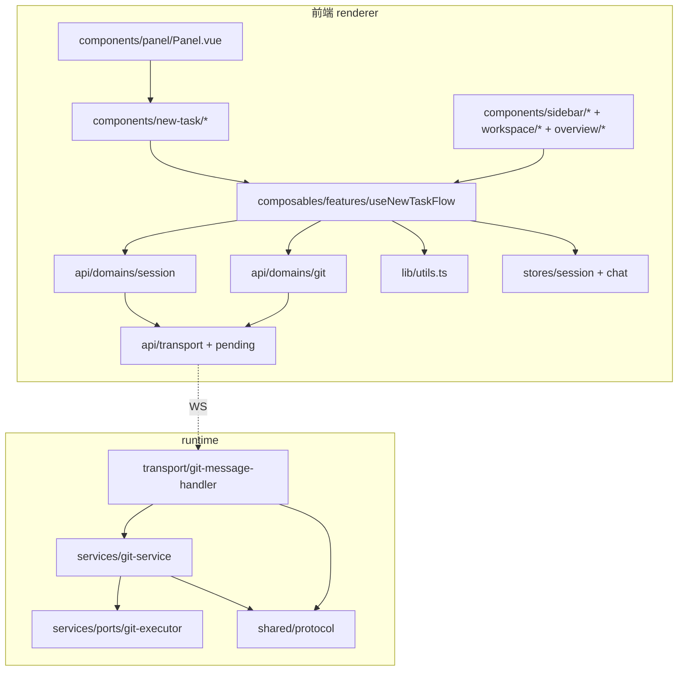
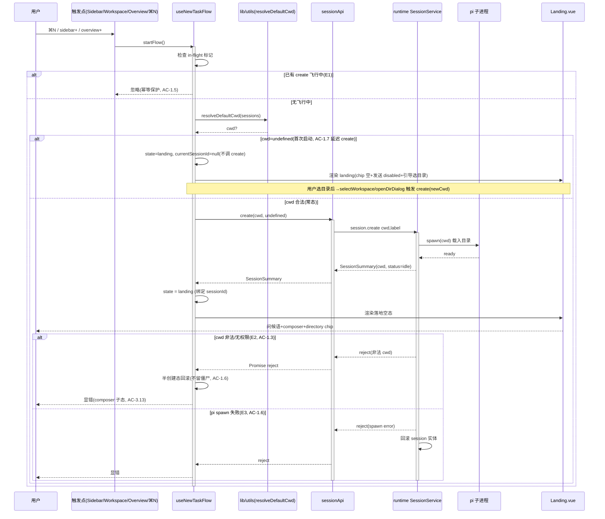
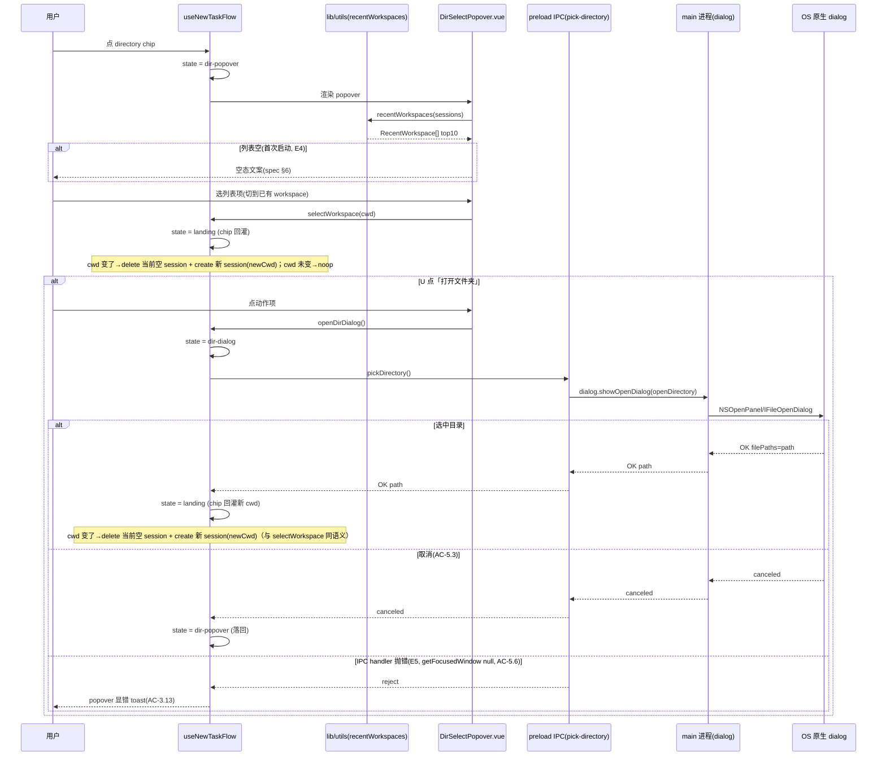
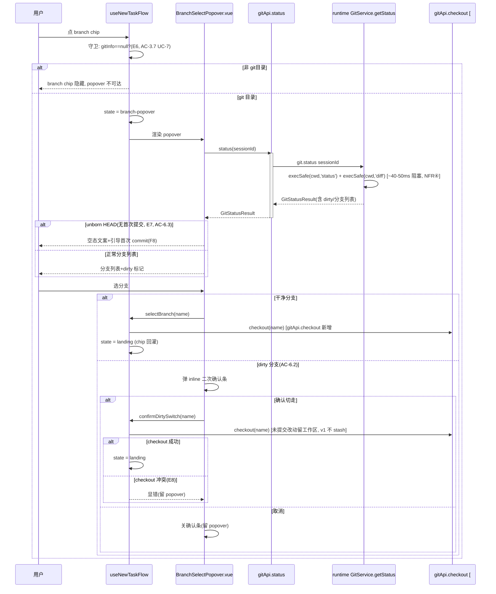
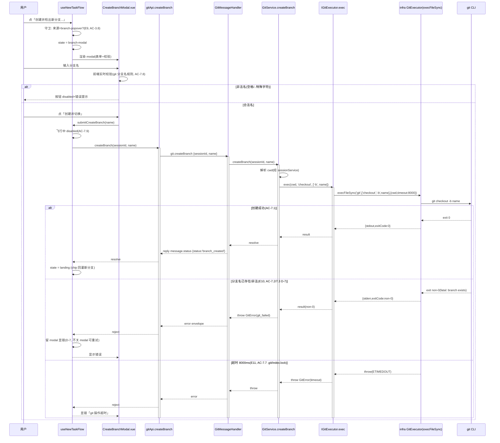
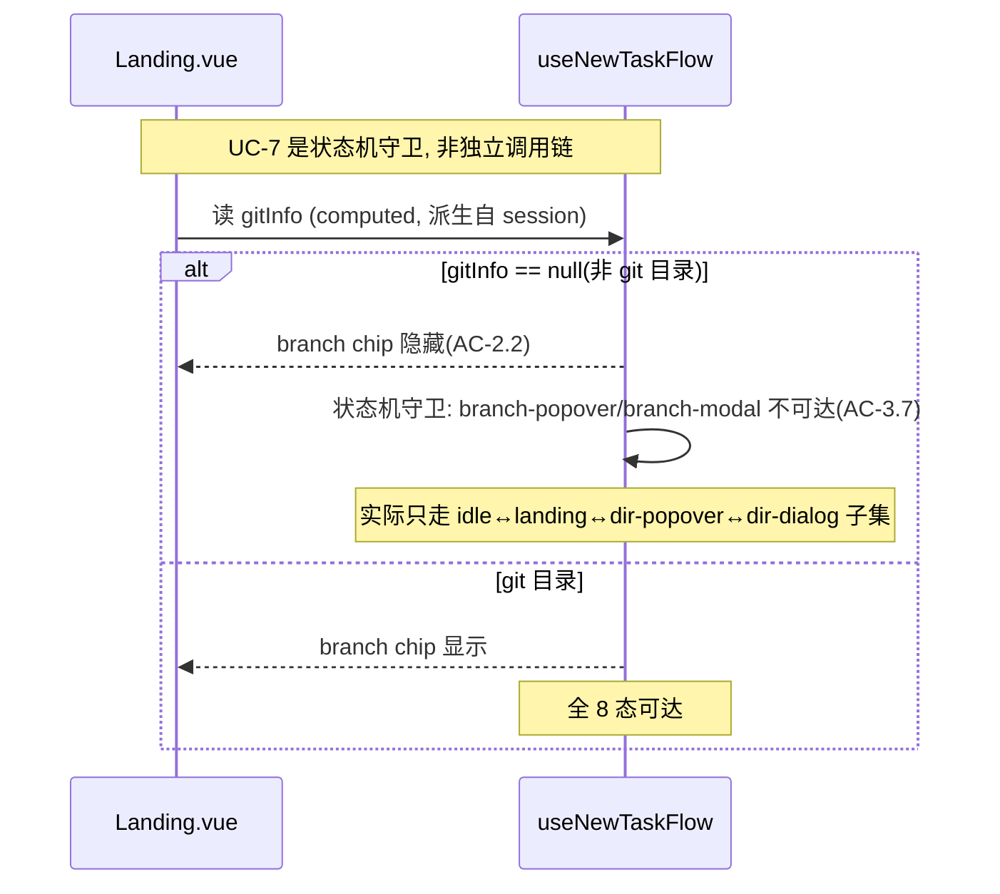
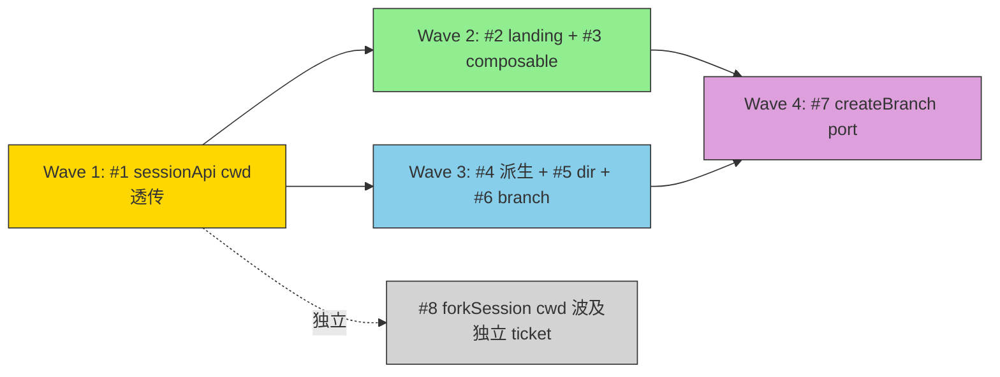

# 代码架构设计 — 新建任务

> 将 [system-architecture.md](./system-architecture.md)（②）+ [issues.md](./issues.md)（③）+ [non-functional-design.md](./non-functional-design.md)（④）的结论落到**具体代码架构**：工程目录、API 契约（签名表）、类方法时序图、test-matrix。并通过 Step 7 骨架物理验证签名/调用链/依赖方向可编译。
> UI 交互细节真相源 [`docs/page-design/v3/new-task/spec.md`](../../docs/page-design/v3/new-task/spec.md)；本文只设计代码层契约与调用链，不重复 UI 细节。

## Step 1 决策记录（必问+自决）

| 决策 | 类型 | 取舍 | 理由 |
|------|------|------|------|
| Q1 工程目录落位 | D-不可逆（用户） | A：`components/new-task/` 聚合 + `composables/features/` + `lib/utils.ts` | 新建任务是独立视觉/交互单元，聚合目录归位；composable 遵循现有 features/ 约定；纯函数复用 lib/utils.ts |
| Q2 NewTaskFlow 实例模型 | D-不可逆（用户，②Obs-B 移交） | A：全局单实例 | 状态机单值约束天然适配单实例；多实例需同步跨实例 overlay 互斥，复杂度上溅。③AC-3.12 已假设 |
| Q3 包依赖严格度 | D（自决） | 严格边界，遵循②已定（modules 不互相 import；renderer 分层稳定） | ②§2 已定三层不套四层，renderer 分层无新张力 |
| Q4 异常路径深度 | D（自决） | 每时序图 alt/else 全覆盖 + NFR 来源 B 全覆盖 | ③④已硬性要求，无新张力 |
| git-info 分层债补 port | D（自决，②移交⑤评估） | **本期不补** | git-info 与新建任务正交（#6 走 GitService.getStatus 经 IGitExecutor port，不碰 git-info）；补 port 是独立重构扩大爆炸半径；Ponytail。标注为「分层债保留」，可逆（未来独立 ticket） |
| sessionApi.create 签名形式 | D（自决，遵循③#1） | 位置参数 `create(cwd?, label?)` | ③#1 方案 A 用户已批准；新建任务 label 几乎总 undefined，实为 `create(cwd?)` 单参主导；不推翻上游 |

## 1. 工程目录

> 决策 Q1=A。新建任务流程组件聚合到 `components/new-task/`；编排 composable 归 `composables/features/`；纯函数归 `lib/utils.ts`（现有纯函数归属，项目无 `utils/` 目录）。

### 1.1 前端（renderer）新增/扩展

```
src-electron/renderer/src/
├── components/
│   └── new-task/                       # 【新增】新建任务流程组件（变化轴：新建任务视觉/交互）
│       ├── Landing.vue                 # 步骤1 落地空态（watermark+问候语+composer元信息行）#2
│       ├── DirSelectPopover.vue        # 步骤2 选目录 popover（最近workspace列表+动作项）#5
│       ├── BranchSelectPopover.vue     # 步骤3 选分支 popover（分支列表+dirty+二次确认条）#6
│       └── CreateBranchModal.vue       # 步骤4b 创建分支 modal（表单+校验+提交）#7
├── composables/
│   └── features/
│       └── useNewTaskFlow.ts           # 【新增】NewTaskFlow 编排（状态机+overlay+Esc+cwd调度）单实例 #3
├── lib/
│   └── utils.ts                        # 【扩展】新增 recentWorkspaces() + resolveDefaultCwd() 纯函数 #4
├── api/domains/
│   ├── session.ts                      # 【扩展】create(cwd?, label?) 补 cwd 透传 #1
│   └── git.ts                          # 【扩展】createBranch(sessionId, name) 新增 #7
└── components/panel/
    └── Panel.vue                       # 【扩展】加 v-if landing 分支（BC-10）
```

| 目录 | 职责 | 变化轴 | 依赖方向（依赖谁） |
|------|------|--------|------------------|
| `components/new-task/` | 新建任务 5 步流程的 4 个 UI 组件 | 视觉/交互（流程形态变化） | composables/features（useNewTaskFlow）、api/domains、ui/*（基础组件） |
| `composables/features/useNewTaskFlow.ts` | NewTaskFlowState 状态机 + overlay 嵌套 + Esc 优先级 + cwd 调度 | UI 交互流程（编排中心） | api/domains（session/git）、lib/utils（派生函数）、stores（chat/session） |
| `lib/utils.ts`（新增 2 函数） | recentWorkspaces / resolveDefaultCwd 纯派生 | 派生逻辑（随 session schema） | @xyz-agent/shared（SessionSummary 类型） |
| `api/domains/session.ts`（扩展） | session 域 WS 请求 | 协议字段 | transport、pending、@xyz-agent/shared |
| `api/domains/git.ts`（扩展） | git 域 WS 请求 | 协议字段 | transport、pending、@xyz-agent/shared |

### 1.2 runtime（后端）扩展（#6 checkout + #7 createBranch port 扩展）<!-- [BACKFED from ⑥execution on 2026-06-26] 原标题「仅 #7 port 扩展」与下表内容矛盾（表格明标 #6 的 GitService.checkout/GitCommand 'checkout'/handler git.checkout/protocol git.checkout 为 #6+#7 共用），修正为反映实际 -->

```
src-electron/runtime/src/
├── services/
│   ├── git-service.ts                  # 【扩展】新增 createBranch(sessionId, name) 方法 #7
│   └── ports/git-executor.ts           # 【扩展】GitCommand 白名单加 'checkout' #7（AC-7.4）
├── transport/
│   └── git-message-handler.ts          # 【扩展】handles 加 'git.createBranch' + case #7（AC-7.5）
└── (shared) src-electron/shared/src/
    └── protocol.ts                     # 【扩展】git.createBranch + git.checkout 消息 type/payload #6+#7（ack 走既有 message.status）
```

| 文件 | 变更 | 说明 |
|------|------|------|
| `services/ports/git-executor.ts:22` | `GitCommand` 联合类型加 `'checkout'` | 白名单扩展（编译期收窄，非白名单不可达）。**#6+#7 共用**：#6 切换分支 `checkout <name>`、#7 创建分支 `checkout -b <name>` |
| `services/git-service.ts` | 新增 `createBranch(sessionId, name)` + `checkout(sessionId, name)` 方法 | 遵循现有 getStatus/stage/commit 模式（sessionId 入参→解析 cwd→execSafe）。createBranch 用 `checkout -b`；checkout 用 `checkout <name>`，dirty 冲突转 GitError |
| `transport/git-message-handler.ts` | `handles` 数组 + switch case 加 `'git.createBranch'` + `'git.checkout'` | 路由 → gitService → reply 既有 `message.status`（createBranch status='branch_created'，checkout status='switched'） |
| `shared/src/protocol.ts` | type union(L31)/ClientMessageMap(L103-106)/client message union(L164-167) 加 `git.createBranch` + `git.checkout` | 协议消息定义。**ack 走既有 message.status（payload {sessionId, status:string}），无需新增 result type** |

> **git-info.ts 不改（分层债保留）**：②D-5 已打回合并；分层债补 port 本期不做（与新建任务正交，Ponytail）。

## 2. 包依赖图



**import 规则（严格边界，Q3 自决）**：
- `components/*` 只依赖 `composables/features/*` + `api/domains/*` + `components/ui/*`，**不直接 import transport/pending**（transport 是 api/domains 的实现细节）
- `composables/features/*` 依赖 `api/domains/*` + `lib/*` + `stores/*`，**不直接 import transport**（经 api/domains）
- `api/domains/*` 依赖 `transport` + `pending`（请求-响应配对在此层）
- `lib/utils.ts` 只依赖 `@xyz-agent/shared` 类型（纯函数零内部依赖）
- runtime `services/*` 经 `services/ports/*` interface 访问外部，**不裸 import infra**（git-info.ts 是现存分层债，本期不改）
- **无循环依赖**：所有箭头单向，components→composables→api→transport（前端），handler→service→port（runtime）

**循环依赖检测点**：无。components/new-task/ 是叶子（不被其他组件 import，只被 Panel.vue 引用）。

## 3. API 契约（签名表）

> Deep Module 词汇统一使用：Module / Interface / Seam / Adapter / Port。签名标注接线层级供 Step 7 分层接线。
> 接线层级：**[内]**=模块内真接线 `this.x()` / **[port]**=跨模块经 port interface / **[adapter]**=adapter 真引 SDK / **[leaf]**=叶子逻辑 throw NotImplementedError。

### 3.1 模块：api/domains/session.ts（扩展 #1）

| 方法 | 签名 | 返回 | 边界条件 | 接线层级 | Issue 关联 |
|------|------|------|---------|---------|-----------|
| `create` | `(cwd?: string, label?: string) => Promise<SessionSummary>` | SessionSummary（含 cwd, status=idle） | cwd=undefined→payload 不含 cwd（runtime 回退 process.cwd()）；非法 cwd→runtime reject→Promise reject | [内] transport.send + pending.register | #1 AC-1.1/1.2/1.3 |

### 3.2 模块：api/domains/git.ts（扩展 #6+#7）

| 方法 | 签名 | 返回 | 边界条件 | 接线层级 | Issue 关联 |
|------|------|------|---------|---------|-----------|
| `checkout` | `(sessionId: string, name: string) => Promise<void>` | void | 非 git→GitError；分支不存在/dirty 冲突→GitError→Promise reject；超时(8000ms port)→reject | [内] transport.send + pending.register | #6 AC-6.1/6.2/6.4 |
| `createBranch` | `(sessionId: string, name: string) => Promise<void>` | void | 分支名非法/已存在→runtime GitError→Promise reject（code=git_failed）；超时(8000ms port)→reject | [内] transport.send + pending.register | #7 AC-7.1/7.3/7.7 |

### 3.3 模块：composables/features/useNewTaskFlow.ts（新建 #3，单实例）

**NewTaskFlowState 枚举**（②§5）：
```typescript
type NewTaskFlowState =
  | 'idle' | 'landing' | 'dir-popover' | 'branch-popover'
  | 'dir-dialog' | 'branch-modal' | 'completed' | 'cancelled'
```

| 方法/属性 | 签名 | 返回 | 边界条件/守卫 | 接线层级 | Issue 关联 |
|----------|------|------|-------------|---------|-----------|
| `state` | `Readonly<Ref<NewTaskFlowState>>` | 当前状态（只读） | — | [内] ref | #3 AC-3.2 |
| `currentSessionId` | `Readonly<Ref<string \| null>>` | flow 绑定的 session | — | [内] ref | — |
| `gitInfo` | `ComputedRef<GitInfo \| null>` | 当前 session 的 git 派生（UC-7 chip 可见性） | null→非 git 目录，branch 相关不可达 | [内] computed(store) | #2 AC-2.2 |
| `startFlow` | `(cwd?: string) => Promise<void>` | 创建空 session 进 landing（常态）/ 仅进 landing 待选目录态（首次启动） | 首次启动 cwd=undefined→不调 create，currentSessionId=null，chip 空态+发送 disabled（AC-1.7 延迟 create，BF1 裁决）；常态→create(cwd) 进 landing；in-flight 标记防重复（AC-1.5） | [内] sessionApi.create（常态）+ state | #1+#3 AC-1.5/1.7 |
| `openDirPopover` | `() => void` | landing→dir-popover | 非 landing 态→非法转换抛错回 idle（AC-3.1/3.11） | [内] state 转换 | #3 AC-3.1 |
| `openBranchPopover` | `() => void` | landing→branch-popover | gitInfo==null→守卫抛错不可达（AC-3.7，UC-7） | [内] state 转换+守卫 | #3 AC-3.7 |
| `selectWorkspace` | `(cwd: string) => Promise<void>` | dir-popover→landing（chip 回灌） | cwd !== 当前 session.cwd → delete 空旧 session + create 新 session(newCwd)；cwd 未变→noop（仅关 popover）。保持②Session.cwd 不变式 | [内] sessionApi.delete+create + state | #5 |
| `openDirDialog` | `() => Promise<void>` | dir-popover→dir-dialog→landing/dir-popover | 选中新 cwd→delete 空旧 session + create 新 session(newCwd)（与 selectWorkspace 同语义，保持②Session.cwd 不变式）；取消→落回 dir-popover（AC-5.3） | [内] ipc.pickDirectory + sessionApi.delete+create + state | #5 AC-5.2/5.3 |
| `selectBranch` | `(name: string) => Promise<void>` | branch-popover→landing | 干净分支直切（调 gitApi.checkout）；dirty→先弹二次确认条 | [内] gitApi.checkout + state | #6 AC-6.1 |
| `confirmDirtySwitch` | `(name: string) => Promise<void>` | branch-popover→landing（git checkout） | 切走保留工作区（AC-6.2）；失败留 popover 显错 | [内] gitApi.checkout + state | #6 AC-6.2 |
| `openBranchModal` | `() => void` | branch-popover→branch-modal | 非 branch-popover 来源→非法转换抛错（AC-3.8） | [内] state 转换+守卫 | #3 AC-3.8 |
| `submitCreateBranch` | `(name: string) => Promise<void>` | branch-modal→landing（成功）/ 留 modal（失败） | 飞行中 disabled 防重复（AC-7.9）；失败留 modal 显错（D-7/AC-7.3） | [内] gitApi.createBranch + state | #7 AC-7.1/7.3/7.9 |
| `closeOverlay` | `() => void` | 任意 overlay→landing（Esc/点外） | 同一时刻只一层（AC-3.9） | [内] state 转换 | #3 AC-3.9 |
| `cancelFlow` | `() => void` | landing/overlay→cancelled | overlay 打开时切 session→cancelled（AC-3.10） | [内] state 转换 | #3 AC-3.10 |
| `reenterFlow` | `() => void` | cancelled→landing（重选空 session 复活） | 单实例：currentSessionId 更新为新选中空 session | [内] state 转换 | #3 AC-3.3 |
| `completeFlow` | `() => void` | landing→completed（首条消息成功，终态） | completed 后实例销毁，⌘N 再触发重建（AC-3.12） | [内] state 转换 | #3 AC-3.6/3.12 |

**转换表守卫**（D-4 落地，非法转换抛错回 idle）：见 §4.3 时序图状态机。

### 3.4 模块：lib/utils.ts（扩展 #4 纯函数）

| 方法 | 签名 | 返回 | 边界条件 | 接线层级 | Issue 关联 |
|------|------|------|---------|---------|-----------|
| `resolveDefaultCwd` | `(sessions: SessionSummary[]) => string \| undefined` | 最近活跃 session 的 cwd（单值） | 空列表→undefined；cwd=null/undefined 脏数据→跳过（AC-4.5） | [leaf] 纯计算 | #4 AC-4.2/4.5 |
| `recentWorkspaces` | `(sessions: SessionSummary[]) => RecentWorkspace[]` | distinct cwd top10 按 lastActiveAt 倒序 | 空列表→[]；多 session 同 cwd→去重保留最新（AC-4.6） | [leaf] 纯计算 | #4 AC-4.1/4.6 |

**RecentWorkspace 类型**（shared 或 lib 定义）：
```typescript
interface RecentWorkspace { cwd: string; lastActiveAt: number; label: string }
```

### 3.5 模块：services/git-service.ts（runtime 扩展 #7）

| 方法 | 签名 | 返回 | 边界条件 | 接线层级 | Issue 关联 |
|------|------|------|---------|---------|-----------|
| `createBranch` | `(sessionId: string, name: string) => Promise<void>` | void | session 不存在→GitError(session_not_found)；非 git→GitError；分支名非法/已存在→execSafe 非 0→GitError；超时 8000ms（port 继承） | [内] execSafe(cwd,'checkout',['-b',name]) | #7 AC-7.4/7.7 |
| `checkout`（#6 新增） | `(sessionId: string, name: string) => Promise<void>` | void | session 不存在→GitError；非 git→GitError；分支不存在/dirty 冲突→execSafe 非 0→GitError；超时 8000ms（port 继承） | [内] execSafe(cwd,'checkout',[name]) | #6 AC-6.1/6.2/6.4 |
| `getStatus`（已有，#6 接入） | `(sessionId: string) => Promise<GitStatusResult>` | GitStatusResult（含 dirty） | session 不存在→GitError；非 git→isRepo=false 降级 | [内] execSafe(cwd,'status')+execSafe(cwd,'diff') | #6 AC-6.1/6.4 |

### 3.6 模块：services/ports/git-executor.ts（runtime port 扩展 #7）

| 类型/方法 | 签名 | 变更 | Issue 关联 |
|----------|------|------|-----------|
| `GitCommand` | 联合类型 | 加 `'checkout'`（原 6 项：status/add/reset/commit/diff/rev-parse）。**#6+#7 共用**：#6 `checkout <name>` 切换、#7 `checkout -b <name>` 创建 | #6 AC-6.1 + #7 AC-7.4 |
| `IGitExecutor.exec` | `(cwd, command: GitCommand, args?) => Promise<GitExecutorResult>` | 接口不变（白名单扩展自动生效） | — |

### 3.7 模块：transport/git-message-handler.ts（runtime 扩展 #7）

| 成员 | 变更 | 说明 | Issue 关联 |
|------|------|------|-----------|
| `handles` | 数组加 `'git.createBranch'` + `'git.checkout'` | 编译期类型收窄清单 | #6 AC-6.1 + #7 AC-7.5 |
| `handleGitMessage` switch | 加 `case 'git.createBranch'` + `case 'git.checkout'` | → gitService.createBranch/checkout → reply 'message.status'（status='branch_created'/'switched'） | #6+#7 |

### 3.8 骨架约束清单（NFR④ 回灌，供 Step 7 骨架接线）

> NFR④「缓解项回灌登记表」中 `验收方式=骨架约束` 的项（非代码测试，由 Step 7 骨架类型检查/编译 gate + 骨架注释兼底）。逐条列出落点，避免 Step 7 无据接线。

| ④骨架约束项 | 来源# | 落点方法/文件 | 约束内容（骨架注释暴露） | Step 7 验证 |
|-----------|------|-------------|----------------------|-----------|
| session.create 失败回滚 | #1 | runtime session-lifecycle（session.create handler） | 骨架标 rollback 分支（E3），不留僵尸 session | §4.1 时序图 E3 分支已标 |
| session.create 结构化日志（含 cwd） | #1 | runtime session-lifecycle.ts logger | 骨架注释：create 调用 log 含 cwd 字段（排查「spawn 错目录」） | 骨架 logger 接线 |
| landing 渲染条件（hydrate 前不渲染完整 landing） | #2 | components/new-task/Landing.vue | 骨架注释：未 hydrate 乐观空判据仅适用于「加载中」，加 loading 占位防闪烁（AC-2.3） | 骨架渲染条件 grep |
| 状态转换 debug 日志 + 非法转换计数 | #3 | useNewTaskFlow.ts | 骨架注释：每次 state 转换 log debug 级 + 非法转换计数器（反推状态机 bug） | 骨架 logger 接线 |
| getStatus P99 耗时埋点 | #6 | runtime GitService.getStatus | 骨架注释：getStatus 加耗时日志（验证 ~40-50ms 阻塞假设） | 骨架耗时埋点 |
| createBranch 经 port 继承 8000ms 超时 | #7 | runtime GitService.createBranch → IGitExecutor | 骨架接线经 port（infra/git-executor.ts execFileSync timeout=8000），无需另加包装（AC-7.7） | §3.5 已标 + 骨架 port 接线 |
| GitCommand 白名单显式枚举 | #7 | runtime services/ports/git-executor.ts | 骨架 GitCommand 联合类型含 'checkout'（编译期收窄） | §3.6 已标 + grep 验证 |
| createBranch 结构化日志 | #7 | runtime GitService.createBranch logger | 骨架注释：createBranch log 含 分支名+cwd+耗时+结果 | 骨架 logger 接线 |

> 注：`验收方式=运维项`（getStatus P99>200ms 告警）不进代码层，部署期配置。

## 4. 功能代码链路（时序图）

> 每张图入口到底层，含异常路径（alt/else）。异常分支 ID（如 E1）映射到 §6 test-matrix 来源 A。

### 4.1 UC-1+UC-2: 触发新建 → 落地空态（主流程，#1+#2+#3）



#### 数据流链
触发点 → useNewTaskFlow.startFlow → resolveDefaultCwd(sessions) → sessionApi.create(cwd) → runtime session.create → pi spawn(cwd) → SessionSummary → state=landing → Landing.vue

#### 关联
- requirements: UC-1(触发新建), UC-2(沿用上次上下文)
- issues: #1(sessionApi cwd), #2(landing), #3(composable)
- NFR④: #1 安全(cwd 校验待落⑤契约), #1 并发(in-flight 幂等→test-matrix), #1 稳定性(回滚→test-matrix)

### 4.2 UC-3+UC-5: 选目录 popover + 打开文件夹 OS dialog（#5）



#### 数据流链
directory chip → state=dir-popover → recentWorkspaces(sessions) → 列表 / 点「打开文件夹」→ pickDirectory IPC → OS dialog → canceled|path → state=landing(chip 回灌)

#### 关联
- requirements: UC-3(从列表选目录), UC-5(打开文件夹)
- issues: #5
- NFR④: #5 稳定性(IPC 抛错→test-matrix), #5 安全(路径校验复用 #1)

### 4.3 UC-4: 选分支 popover + dirty 二次确认（#6）



#### 数据流链
branch chip → 守卫(gitInfo) → state=branch-popover → gitApi.status → runtime getStatus(status+diff) → 分支列表+dirty → 选干净/dirty确认 → gitApi.checkout → state=landing

#### 关联
- requirements: UC-4(选分支)
- issues: #6
- NFR④: #6 性能(~40-50ms 阻塞→契约埋点), #6 并发(Esc 排队→test-matrix), #6 数据(dirty 确认→test-matrix)

### 4.4 UC-6: 创建分支 modal + runtime port 扩展（#7，跨前后端最复杂）



#### 数据流链
点创建 → 守卫(来源) → state=branch-modal → 前端校验 → submitCreateBranch → gitApi.createBranch → WS git.createBranch → GitMessageHandler → GitService.createBranch → IGitExecutor.exec(checkout,-b) → execFileSync(timeout:8000) → git CLI → 成功 state=landing / 失败留 modal

#### 关联
- requirements: UC-6(创建并检出新分支)
- issues: #7
- NFR④: #7 安全(分支名双重校验→test-matrix), #7 并发(飞行中 disabled/孤儿 promise→test-matrix), #7 稳定性(超时/失败留 modal→test-matrix)

### 4.5 UC-7: 非 git 目录降级（#2，状态机守卫）



#### 数据流链
session.gitInfo → computed → Landing chip 可见性派生 + 状态机守卫（非 git 目录：branch 相关转换抛错）

#### 关联
- requirements: UC-7(非 git 目录降级)
- issues: #2(landing 复用 BC-12 既有判空)

### 4.6 NewTaskFlowState 转换守卫表（D-4 落地，非法转换抛错回 idle）

| from → to | 触发方法 | 守卫 | 异常处理 |
|-----------|---------|------|---------|
| idle→landing | startFlow | — | spawn 失败→留 idle 显错 |
| landing→dir-popover | openDirPopover | — | — |
| landing→branch-popover | openBranchPopover | gitInfo!=null（AC-3.7） | null→抛错回 idle |
| landing→completed | completeFlow | 首条消息成功 | 失败→留 landing（AC-3.4） |
| landing→cancelled | cancelFlow | 切 session | — |
| dir-popover→landing | selectWorkspace/closeOverlay | — | — |
| dir-popover→dir-dialog | openDirDialog | — | 取消→落回 dir-popover |
| branch-popover→landing | selectBranch/confirmDirtySwitch | — | checkout 失败→留 popover |
| branch-popover→branch-modal | openBranchModal | 来源=branch-popover（AC-3.8） | 非法来源→抛错回 idle |
| dir-dialog→landing | openDirDialog(选中) | — | — |
| branch-modal→landing | submitCreateBranch(成功) | — | 失败→留 modal（D-7） |
| cancelled→landing | reenterFlow | 重选空 session | — |
| **其他组合** | — | — | **非法转换→抛错回 idle（AC-3.1/3.11）** |

**终态**：仅 `completed`（实例销毁）。`cancelled` 可重入（单实例模型，AC-3.12）。

## 5. Deep Module 设计决策

### 模块：useNewTaskFlow composable（#3）
- **Interface**: 15 个成员（1 state + 2 computed + 12 动作方法），调用方只看 state + 动作，状态机内部守卫封装
- **Depth**: deletion test — 删掉它，状态机逻辑散落到 4 个组件 + 6 个触发点，overlay 互斥/Esc 优先级/守卫在每处重复 → 承担复杂度，深模块成立
- **Seam**: 外部 seam 在 composable 返回值（state 只读 + 动作方法）；内部 seam 状态机是私有实现（不暴露 setState）。1 个 adapter（Vue composable 本身）
- **Port 决策**: api/domains（session/git）是 Local-substitutable（mock 模式可替），走内部 seam（composable 直接 import，非 port 注入）；单实例由 Vue 的 composable 模块单例天然保证

### 模块：lib/utils 派生函数（#4）
- **Interface**: 2 个纯函数（resolveDefaultCwd / recentWorkspaces），入参 SessionSummary[] 出参派生结果
- **Depth**: 深 — 小 interface（2 函数单参），复杂度（distinct+排序+去重）藏在实现
- **Seam**: 函数签名即 seam（无内部 seam），纯函数无 IO
- **Port 决策**: In-process 纯计算，不要 port，直接测

### 模块：GitService.createBranch（runtime #7）
- **Interface**: `createBranch(sessionId, name) → Promise<void>`，复用现有 getStatus/stage/commit 的 sessionId 模式
- **Depth**: 深 — 单方法，内部解析 cwd + execSafe + 错误转 GitError 全藏
- **Seam**: IGitExecutor.exec port（已有，2 adapter：GitExecutor 实现 + 测试 mock），createBranch 复用此 seam
- **Port 决策**: GitCommand 白名单扩展（加 'checkout'），编译期收窄；execFileSync 经 port 隔离 git CLI（True external，要 port）

### 模块：sessionApi.create（#1）
- **Interface**: `create(cwd?, label?)`，位置参数（Q自决，遵循③#1）
- **Depth**: 薄 adapter（transport.send + pending.register 透传）——但这是 api/domains 层职责（协议适配），不强行加深
- **Seam**: transport/pending 是内部 seam，WS 是真 seam（进程边界）

## 6. 测试矩阵（Test Matrix）

### 来源 A：功能用例（按时序图 alt/else 推导）

#### UC-1+UC-2: 触发新建→落地空态（§4.1）

| 用例 ID | 类型 | 场景 | 输入 | 预期 | 关联 AC |
|---------|------|------|------|------|---------|
| T1.1 | 正常 | 主流程 | ⌘N + resolveDefaultCwd 返回 cwd | create(cwd)→SessionSummary→state=landing | AC-1.1 |
| T1.2 | 边界 | 首次启动 | sessions=[]→cwd=undefined | chip 空态+发送 disabled（AC-1.7） | AC-1.7 |
| T1.3 | 异常 | E1 双击并发 | create 飞行中再触发 startFlow | in-flight 标记忽略，只建 1 session | AC-1.5 |
| T1.4 | 异常 | E2 非法 cwd | create('/etc/nonexistent') | runtime reject→显错，不静默回退 | AC-1.3 |
| T1.5 | 异常 | E3 pi spawn 失败 | cwd 无权限/pi 崩溃 | 回滚 session 实体，不留僵尸 | AC-1.6 |
| T1.6 | 状态 | landing 渲染 | messageCount===0 && !isGenerating | 渲染 landing（AC-2.1） | AC-2.1 |
| T1.7 | 状态 | isGenerating 优先 | messages 空但 isGenerating=true | 不渲染 landing（生成态优先，AC-2.8） | AC-2.8 |

#### UC-3+UC-5: 选目录 popover + OS dialog（§4.2）

| 用例 ID | 类型 | 场景 | 输入 | 预期 | 关联 AC |
|---------|------|------|------|------|---------|
| T3.1 | 正常 | 列表选择 | 点 recentWorkspaces 列表项 | selectWorkspace→state=landing，chip 回灌 | AC-5.1 |
| T3.2 | 边界 | E4 空列表 | 首次启动无 workspace | 空态文案（spec §6） | AC-5.4 |
| T3.3 | 正常 | OS dialog 选中 | 点「打开文件夹」→选目录 | canceled=false→chip 回灌新 cwd | AC-5.2 |
| T3.4 | 异常 | OS dialog 取消 | 选到一半取消 | {canceled:true}→落回 popover，chip 不变 | AC-5.3 |
| T3.5 | 异常 | E5 IPC 招错 | getFocusedWindow null | popover 显错 toast 不崩 | AC-5.6 |

#### UC-4: 选分支 popover + dirty（§4.3）

| 用例 ID | 类型 | 场景 | 输入 | 预期 | 关联 AC |
|---------|------|------|------|------|---------|
| T4.1 | 正常 | 选干净分支 | 点干净分支项 | gitApi.checkout(name)→state=landing，chip 回灌 | AC-6.1 |
| T4.2 | 正常 | dirty 确认切走 | 选 dirty 分支→确认 | gitApi.checkout(name)，未提交改动留工作区 | AC-6.2 |
| T4.3 | 边界 | E7 unborn HEAD | git 仓库无首次提交 | 空态文案+引导首次 commit | AC-6.3 |
| T4.4 | 异常 | E6 非 git 目录 | gitInfo==null | branch chip 隐藏，popover 不可达 | AC-3.7 |
| T4.5 | 异常 | E8 checkout 冲突 | 目标分支与改动冲突 | gitApi.checkout reject→留 popover 显错，工作区不变 | AC-6.4 |
| T4.6 | 状态 | getStatus 失败 | execSync 招错 | popover 显错不崩 | AC-6.4 |
| T4.8 | 并发 | Esc 排队 | getStatus 同步阻塞期间按 Esc | execSync 期间 JS 冻结，Esc 排队，阻塞后状态机按队列转移不丢事件 | AC-6.7 |
| T4.9 | 边界 | 分支列表极多 | 分支 100+ 开 popover | 虚拟滚动/限制渲染数 + 搜索过滤，不卡 DOM | AC-6.9 |

#### UC-6: 创建分支 modal（§4.4）

| 用例 ID | 类型 | 场景 | 输入 | 预期 | 关联 AC |
|---------|------|------|------|------|---------|
| T6.1 | 正常 | 创建成功 | 合法名+提交 | checkout -b→state=landing，chip 回灌 | AC-7.1 |
| T6.2 | 边界 | 非法分支名 | 名含空格/..特殊字符 | 按钮 disabled+错误提示 | AC-7.8 |
| T6.3 | 异常 | E10 已存在 | 名=已有分支 | 留 modal 显错「该分支已存在」（D-7） | AC-7.2/7.3 |
| T6.4 | 异常 | E11 超时 | .git/index.lock 持有 | port 超时 8000ms→留 modal 显错「超时」 | AC-7.7 |
| T6.5 | 异常 | E9 非法来源 | 非 branch-popover 进 branch-modal | 抛错回 idle（AC-3.8） | AC-3.8 |
| T6.6 | 并发 | 飞行中重复点击 | createBranch WS 飞行中再点 | 按钮 disabled 防重复（AC-7.9） | AC-7.9 |
| T6.7 | 并发 | 飞行中 Esc 关 modal | createBranch 飞行中 Esc | 孤儿 promise 忽略，不回灌 chip | AC-7.9 |

#### UC-7: 非 git 降级（§4.5）

| 用例 ID | 类型 | 场景 | 输入 | 预期 | 关联 AC |
|---------|------|------|------|------|---------|
| T7.1 | 状态 | 非 git 目录状态机 | gitInfo==null 下触发 openBranchPopover | 守卫抛错回 idle，状态机只走 idle↔landing↔dir-popover↔dir-dialog 子集 | AC-3.7/2.2 |
| T7.2 | 状态/回归 | 非 git 变 git 恢复显示 | 外部 git init 后重开/缓存 TTL 过期 | branch chip 恢复显示（依赖 git-info 既有缓存 BC-6，本期不改 git-info） | AC-7.2 |

#### 跨 UC 状态机（§4.6）

| 用例 ID | 类型 | 场景 | 输入 | 预期 | 关联 AC |
|---------|------|------|------|------|---------|
| T8.1 | 状态 | overlay 互斥 | dir-popover 下点 branch chip | 先关 dir-popover 再开 branch-popover（至多 1 个） | AC-3.2 |
| T8.2 | 状态 | Esc 优先级 | modal 内 Esc | 关当前 modal（不影响 composer/浮层） | AC-3.9 |
| T8.3 | 状态 | overlay 打开切 session | dir-dialog 打开时切 session | overlay 自动关+state=cancelled，不卡死 | AC-3.10 |
| T8.4 | 状态 | cancelled 重入 | 切回空 session | state=cancelled→landing（NewTaskFlow 复活） | AC-3.3 |
| T8.5 | 状态 | completed 终态 | 首条消息成功→⌘N | state=completed→销毁→重建 idle→landing | AC-3.6/3.12 |
| T8.6 | 异常 | 非法转换 | idle 下直接 openBranchModal | 抛错回 idle，Vue 错误边界兼底不崩 | AC-3.1/3.11 |

### 来源 B：NFR 风险→用例映射表（MANDATORY）

> ④NFR「缓解项回灌登记表」中 `验收方式=代码测试` 的每条风险生成 ≥1 用例。编号段区分：NFR 独有用例用 T1.8/T4.7/T6.8/T1.9（功能用例后续编号），其余复用来源 A 已有用例。

| ④缓解项 | 来源# | 维度 | 归属 UC | 验证断言 | test-matrix 用例 ID |
|--------|------|------|--------|---------|-------------------|
| runtime cwd 路径校验（绝对路径+存在+可读） | #1,#5 | 安全 | UC-1 | 非法 cwd 被 runtime 拦截 reject | T1.4（已映射） |
| 新建触发点幂等保护（in-flight 标记） | #1 | 并发 | UC-1 | 双击并发只建 1 session | T1.3（已映射） |
| getHistory 失败 landing 有重试出口 | #2 | 稳定性 | UC-1 | 加载失败有重试按钮，不永久卡住 | T1.8 |
| 状态机非法转换回 idle + Vue 错误边界 | #3 | 稳定性 | 跨UC | 非法转换不崩组件且回 idle | T8.6（已映射） |
| overlay 打开时切 session 的 cancelled 转移 | #3 | 并发 | 跨UC | 4 overlay 态切 session 不卡死 | T8.3（已映射） |
| getStatus 新建 per-cwd 缓存（条件性） | #6 | 性能 | UC-4 | 同 cwd 重复开 popover 命中缓存零 spawn | T4.7 |
| dirty 切走 inline 二次确认条 | #6 | 数据 | UC-4 | dirty 切走有确认+留工作区 | T4.2（已映射） |
| pick-directory IPC 招错 popover 显错 toast | #5 | 稳定性 | UC-3 | IPC 失败不崩 popover | T3.5（已映射） |
| createBranch 分支名双重校验（前端+runtime） | #7 | 安全 | UC-6 | 非法分支名被拦截 | T6.2（已映射）+ T6.8 |
| createBranch 提交按钮 disabled 防重复 | #7 | 并发 | UC-6 | 飞行中 disabled | T6.6（已映射） |
| createBranch 失败留 modal 显错（D-7） | #7 | 稳定性 | UC-6 | 失败不关 modal 可重试 | T6.3（已映射） |
| forkSession 源 cwd 透传 | #8 | 兼容性 | UC-1(fork) | fork 后 cwd=源 cwd | T1.9 |

**新增用例（来源 B 独有，未在来源 A 出现）：**

| 用例 ID | 类型 | 场景 | 输入 | 预期 | 关联 AC |
|---------|------|------|------|------|---------|
| T1.8 | 异常 | getHistory 失败 | 网络/文件损坏 | landing 有重试按钮（AC-2.6） | AC-2.6 |
| T4.7 | 边界（条件性） | getStatus 缓存命中 | 同 cwd 连续开两次 popover | 第二次零 spawn（缓存命中）（条件性：仅加缓存后） | AC-6.8(加缓存后) |
| T6.8 | 异常 | runtime 分支名校验 | 前端绕过+runtime 拦截 | runtime 二次校验拒绝非法名 | AC-7.8 |
| T1.9 | 回归 | forkSession cwd | fork 源 session | 新 session cwd=源 cwd（非最近活跃） | AC-8.1/8.2 |

> `[BACKFED from ⑥execution on 2026-06-26]` T4.7 原用例行（类型=边界）未显式标条件性，关联 AC「AC-6.8(加缓存后)」已暗示但用例行漏标，导致⑥execution 误将其固化为 Wave 2 硬 PASS 门槛（见⑥D-6）。现 T4.7 类型改「边界（条件性）」+ 预期列加「条件性：仅加缓存后」。与④NFR D-NFR1「v1 可先不加缓存（每次 spawn），P99>200ms 才触发」+ ③AC-6.8「v1 可接受每次 spawn」一致。v1 不加缓存时此用例标 `[DEVIATED]④NFR 允许 v1 不加缓存`。

### 覆盖完整性自检
- [x] 每 UC 的正常/边界/异常/状态 4 类齐全（来源 A）
- [x] 时序图每个 alt/else 映射到异常用例（E1-E11→T1.3/T1.4/T1.5/T3.2/T3.5/T4.4/T4.3/T4.5/T6.5/T6.3/T6.4）
- [x] 状态机每条转换有状态用例（T8.1-T8.6 + T7.1）
- [x] NFR④标注并发风险的 UC 有并用例（UC-6 T6.6/T6.7）
- [x] ④每条 `验收方式=代码测试` 的缓解项在本节有 ≥1 对应用例（12/12 映射）
- [x] 来源 B 用例 ID 与来源 A 不重复（新项用 T1.8/T4.7/T6.8/T1.9，其余复用已编号）

## 7. 现有代码映射（refactor 场景）

> ②§12 行为契约 BC-1~BC-12 的处置。`move/delete/merge/split` 对应⑥ Prefactor Wave。

| 新目录模块 | 现有代码文件/函数 | 处置 | 行为等价测试要点 |
|-----------|------------------|------|----------------|
| `api/domains/session.ts` create | `session.ts` create(title?) | **merge**（扩签名为 create(cwd?,label?)） | 既有 create() 无参调用仍工作（cwd=undefined 回退），新调用透传 cwd |
| `composables/features/useNewTaskFlow.ts` | `useSidebar.ts` newSession / newSessionToStandby | **merge+split** | newSession 逻辑拆入 useNewTaskFlow.startFlow；useSidebar 退化为薄封装；6 触发点行为不变（仍创建+选中空 session） |
| `composables/features/useSidebar.ts` forkSession | `useSidebar.ts` forkSession 调 create() | **keep+fix**（#8 独立 ticket） | fork 后 cwd=源 session cwd（非最近活跃），独立 PR |
| `components/new-task/Landing.vue` | `Panel.vue:29,42`（v-if sessionId 无 landing 分支） | **create**（新增组件+Panel 加 v-if） | 既有对话流渲染不变，仅 messageCount===0 时多一个 landing 分支 |
| `components/new-task/DirSelectPopover.vue` | （无） | **create** | 复用既有 pick-directory IPC（BC-7），handler 不变 |
| `components/new-task/BranchSelectPopover.vue` | （无） | **create** | 复用既有 GitService.getStatus（BC-6 同源） |
| `components/new-task/CreateBranchModal.vue` | （无） | **create** | 跨前后端，runtime port 扩展独立可回滚 |
| `lib/utils.ts` 派生函数 | （无，BC-9 grep 零命中） | **create** | 纯函数新增，无现有行为 |
| runtime `services/git-service.ts` createBranch | （无） | **create** | 遵循现有 getStatus/stage/commit 模式，不影响既有 git 命令 |
| runtime `services/ports/git-executor.ts` GitCommand | `git-executor.ts` GitCommand（6 项白名单） | **merge**（加 'checkout'） | 既有 6 项不受影响，仅新增可达性 |
| runtime `transport/git-message-handler.ts` | `git-message-handler.ts` handles + switch | **merge**（加 case） | 既有 git.status/stage/unstage/commit 路由不变 |
| `shared/src/protocol.ts` git 消息 | protocol.ts:31,103-106,164-167 | **merge**（加 git.createBranch） | non-breaking 纯新增 |
| `services/git-info.ts`（分层债） | `git-info.ts`（裸 execSync） | **keep**（本期不改） | 既有 branch 显示行为 BC-6 保持；分层债独立 ticket |

> **无 delete/split 现有代码**：新建任务是增量功能，既有 runtime/session 契约稳定基座不动。

## 8. 下游衔接

### 喂给 Step 6（执行计划）的部分

| 时序图 | 对应 Wave（提示） | 依赖的其他时序图 |
|--------|----------------|----------------|
| §4.1 UC-1+UC-2（主流程） | Wave 1（#1 cwd透传）→ Wave 2（#2 landing + #3 composable 并行） | 无（最前置） |
| §4.2 UC-3+UC-5（选目录） | Wave 3（#4 派生函数）→ Wave 3（#5 popover+dialog） | §4.1（session 含正确 cwd） |
| §4.3 UC-4（选分支） | Wave 3（#6 branch popover，依赖 #4） | §4.1 |
| §4.4 UC-6（创建分支） | Wave 4（#7 modal+port，依赖 #3+#6） | §4.3（branch-popover 触发） |
| §4.5 UC-7（非 git 降级） | Wave 2（#2 landing 守卫，随 #2） | §4.1 |

**Wave DAG**（供⑥，从骨架叶子作用域推导）：


## 9. 骨架覆盖核验（MANDATORY，Step 7 后回填行号）

> §3 签名表每个方法 ↔ 骨架定义双向对应。Step 7 骨架生成前为预登记（接线状态标「待核验」）；
> Step 7 生成骨架后回填 `文件:行` + 终态接线状态，终稿不允许 `❌ 未定义`。

| §3 方法（模块.方法） | 骨架定义位置（文件:行） | 接线状态 | 备注 |
|------------------------|------------------------|---------|------|
| api/domains/session.create | `renderer/src/api/domains/session.ts:38` | ✅ 接线完整 | [内] transport+pending（cwd 透传） |
| api/domains/git.createBranch | `renderer/src/api/domains/git.ts:80` | ✅ 接线完整 | [内] transport+pending |
| api/domains/git.checkout | `renderer/src/api/domains/git.ts:63` | ✅ 接线完整 | [内] transport+pending（#6 新增） |
| useNewTaskFlow.state/currentSessionId/gitInfo | `renderer/src/composables/features/useNewTaskFlow.ts:51,52,70` | ✅ 接线完整 | [内] ref(readonly)+computed(gitInfo) |
| useNewTaskFlow.startFlow | `useNewTaskFlow.ts:99` | ✅ 接线完整 | [内] sessionApi.create+resolveDefaultCwd+state；in-flight 守卫 |
| useNewTaskFlow.openDirPopover/openBranchPopover | `useNewTaskFlow.ts:122,130` | ✅ 接线完整 | [内] state 转换；openBranchPopover gitInfo 守卫 |
| useNewTaskFlow.selectWorkspace/openDirDialog | `useNewTaskFlow.ts:146,167` | ✅ 接线完整 | [内] sessionApi.remove+create+state；openDirDialog 真引 ipc.pickDirectory |
| useNewTaskFlow.selectBranch/confirmDirtySwitch | `useNewTaskFlow.ts:191,201` | ✅ 接线完整 | [内] gitApi.checkout+state |
| useNewTaskFlow.openBranchModal/submitCreateBranch | `useNewTaskFlow.ts:211,228` | ✅ 接线完整 | [内] gitApi.createBranch+state；openBranchModal 来源守卫；submit 飞行中守卫 |
| useNewTaskFlow.closeOverlay/cancelFlow/reenterFlow/completeFlow | `useNewTaskFlow.ts:241,246,251,256` | ✅ 接线完整 | [内] state 转换（经 ALLOWED 转换表守卫） |
| lib/utils.resolveDefaultCwd/recentWorkspaces | `renderer/src/lib/utils.ts:29,48` | ✅ 签名(纯函数已实现) | [leaf] 纯计算，签名即设计，已落地实现 |
| runtime GitService.createBranch | `runtime/src/services/git-service.ts:226` | ✅ 接线完整 | [内] execSafe(cwd,'checkout',['-b',name]) |
| runtime GitService.checkout | `runtime/src/services/git-service.ts:211` | ✅ 接线完整 | [内] execSafe(cwd,'checkout',[name])（#6 新增） |
| runtime GitCommand（加 checkout） | `runtime/src/services/ports/git-executor.ts:22` | ✅ 类型扩展 | port 联合类型 +checkout（编译期收窄，#6+#7 共用） |
| runtime GitMessageHandler case | `runtime/src/transport/git-message-handler.ts:33,76,85` | ✅ 接线完整 | [内] handles+case→gitService.checkout/createBranch→message.status ack |
| runtime protocol git.createBranch/git.checkout | `shared/src/protocol.ts:33,110-111,173-174` | ✅ 类型定义 | ClientMessageType/ClientMessageMap/ClientMessage union 三处 |

**覆盖完整性自检（Step 7 后）：**
- [x] §3 签名表每个公开方法在本表有对应行（无遗漏，16/16）
- [x] 无 `❌ 未定义`（终稿硬阻断通过）
- [x] 接线状态标注准确（叶子标叶子，非叶子标接线完整）
- [x] vue-tsc --noEmit 实证全表签名自洽（EXIT 0，详见 changes/skeleton-verification.md）

