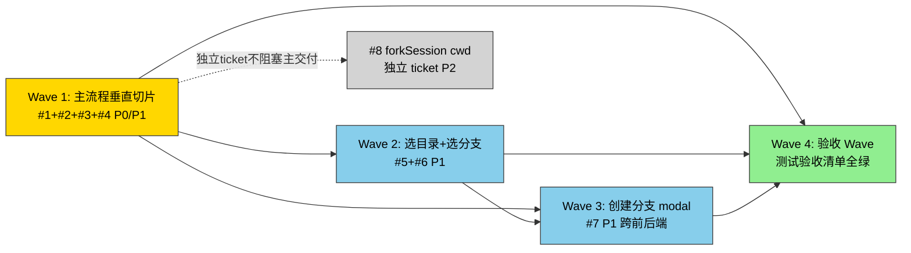

# 执行计划 — 新建任务

> 将⑤[code-architecture.md](code-architecture.md) 的时序图/签名表/骨架拆为可执行的垂直切片（Wave）。
> 编码完成的定义 = 「测试验收清单」全绿（末尾验收 Wave 闭环）。

## 测试计划补充文档

本计划的「测试验收清单」（§测试验收清单）回答**测什么**（39 用例 × AC）。以下三份补充文档回答**怎么测**，编码与测试阶段以此为准：

| 文档 | 回答 | 用途 |
|------|------|------|
| [test-strategy.md](test-strategy.md) | 怎么测（框架/mock/落位/TDD约束） | 三层分层定义（unit/integration/manual）、vitest 三套配置、mock 策略矩阵、每 Wave 每 Task 红绿模板 |
| [test-cases-layered.md](test-cases-layered.md) | 每个用例测成什么 | 39 用例逐条归类（unit 28 / integration 9 / manual 2）+ 13 测试文件落位 + describe/it 命名规范 |
| [e2e-test-plan.md](e2e-test-plan.md) | 端到端怎么验 | E2E-1~7 自动化集成场景 + M-1~7 手工走查清单（v1 不引入 Playwright） |

**关键约束**：v1 测试全 vitest（不引入 Playwright）；OS 原生 dialog / 真实 git 进程交互走 Wave 4 手工清单；DoD = 39 用例全 PASS + 7 手工走查登记。

## Wave 编排总览

### 设计依据

从⑤§4 时序图推导 Wave 依赖（功能 B 调用功能 A → Wave(B) blocked_by Wave(A)），结合⑤§7 现有代码映射（无 delete/split，merge 均为功能内部动作）与 [vertical-slice.md](../../node_modules) 垂直切片原则。

**对⑤§8 Wave 提示的调整**（本阶段决策，理由见「决策记录」D-1）：

| ⑤§8 提示 | 本计划调整 | 理由 |
|---------|-----------|------|
| W1=#1 单独 | 合并入 Wave 1（#1+#2+#3+#4） | #1 是 api 层片段非功能，单独无法端到端验证；#1+#2+#3+#4 才是首条 tracer bullet（⌘N→landing） |
| W3=#4+#5+#6 同 Wave | 拆为 #4 随 Wave 1，#5+#6 成 Wave 2 | §4.1 主流程依赖 resolveDefaultCwd(#4)；#4 必须随主流程 |

### 依赖 DAG 图

### 调度表

| Wave | 切片 | P级 | Blocked by | 并行组 | 说明 |
|------|------|-----|-----------|--------|------|
| 1 | 主流程垂直切片（#1+#2+#3+#4） | P0+P1 | 无 | — | tracer bullet：⌘N→resolveDefaultCwd→create(cwd)→landing 渲染 |
| 2 | 选目录 + 选分支 popover（#5+#6，含 #6 runtime checkout） | P1 | Wave 1 | B（Wave 内组件并行） | #5/#6 组件文件独立可并行；#6 含 runtime checkout port 扩展（前端+runtime 同 Wave 切穿） |
| 3 | 创建分支 modal + runtime port（#7 createBranch 专属） | P1 | Wave 1, Wave 2 | C | 跨前后端最复杂；依赖 Wave 2 的 branch-popover 触发 + checkout port 已就绪 |
| 4 | 验收 Wave | — | Wave 1, 2, 3 | — | **必须最后**：读测试验收清单全量→跑测试→全 PASS 才算实现完成 |
| 独立 | #8 forkSession cwd | P2 | #1（Wave 1） | — | 独立 ticket，不阻塞主交付，T1.9 归属此 |

### 并行约束

- **Wave 间严格串行**（DAG `W1→W2→W3→W4`），无 Wave 间并行。调度表「并行组」列指 **Wave 内部** 组件文件并行（如 Wave 2 的 #5/#6 两组件文件独立），非 Wave 间并行
- 同一并行组内最多 3 个 subagent 并行（Semaphore 限制）
- **同一文件不允许多 Wave 同时修改**（冲突）—— 以下文件被多 Wave 渐进扩展，但都串行依赖（非并行），允许：
  - `useNewTaskFlow.ts`：Wave 1（主干）→ Wave 2（select*/confirm*）→ Wave 3（openBranchModal/submitCreateBranch）
  - `api/domains/git.ts`：Wave 2（checkout）→ Wave 3（createBranch）
  - runtime `git-service.ts`：Wave 2（checkout）→ Wave 3（createBranch）
- 前端 Wave 需对应后端 API 就绪（Wave 3 的 CreateBranchModal 需 runtime GitService.createBranch 同 Wave 内先就绪；Wave 2 的 BranchSelectPopover 需 runtime GitService.checkout 同 Wave 内先就绪）

### Prefactor Wave 裁决

**无 Prefactor Wave。** ⑤§7 现有代码映射明确「无 delete/split 现有代码」（新建任务是增量功能），所有 `merge` 项（session.create 扩签名、GitCommand 加 checkout、protocol 加消息）都是功能 Wave 内部的实现动作，不是可独立提前的重构。refactor 场景的「行为等价测试约束」随各 Wave 的回归用例落地（如 Wave 1 含「既有 create() 无参调用仍工作」回归）。

## Wave 详情

### Wave 1: 主流程垂直切片（#1+#2+#3+#4）

**切片类型**: 垂直切片（tracer bullet）
**P 级覆盖**: P0（#1/#2/#3）+ P1（#4）
**Blocked by**: 无——可立即开始
**并行关系**: 串行（内部 api→composable→组件 顺序）

#### 包含的功能/issue
- #1: sessionApi.create cwd 透传（P0，⑤§4.1 主流程，[issues.md](issues.md) #1）
- #2: Landing.vue 组件 + 落地空态判据（P0，⑤§4.1 + §4.5 UC-7 守卫）
- #3: useNewTaskFlow composable 主干（P0，⑤§4.1 + §4.6 状态机基础）
- #4: lib/utils 派生函数 resolveDefaultCwd + recentWorkspaces（P1，⑤§4.1 数据基座 + §4.2 数据源）

#### 文件影响
- 修改（renderer）: `api/domains/session.ts`（create 扩签名 cwd 透传）、`components/.../Panel.vue`（加 landing v-if 分支）、`composables/features/useSidebar.ts`（newSession 退化为薄封装，逻辑移入 useNewTaskFlow）、6 个触发点（Sidebar/Workspace/Overview/PanelContainer/⌘N）
- 创建（renderer）: `components/new-task/Landing.vue`、`composables/features/useNewTaskFlow.ts`（主干：state/startFlow/landing 转换/resolveDefaultCwd 调用）、`lib/utils.ts`（resolveDefaultCwd + recentWorkspaces 纯函数）
- 测试: sessionApi.create cwd 透传单测、resolveDefaultCwd/recentWorkspaces 纯函数单测、useNewTaskFlow startFlow + 状态机单测、Landing 渲染条件单测、既有 create() 无参调用回归

#### 覆盖的 test-matrix 用例 ID（完成判定）
> 来自⑤§6。下列用例对应测试全 PASS 才算本 Wave 完成。
- T1.1（主流程 create(cwd)→landing）、T1.2（首次启动 cwd=undefined 延迟 create）、T1.3（E1 双击并发 in-flight 守卫）、T1.4（E2 非法 cwd reject 显错）、T1.5（E3 spawn 失败回滚不留僵尸）、T1.6（landing 渲染 messageCount===0）、T1.7（isGenerating 优先不渲染 landing）
- T1.8（NFR：getHistory 失败 landing 有重试出口）
- T7.1（非 git 目录状态机守卫 branch 不可达）、T7.2（非 git 变 git 恢复显示，依赖 git-info 既有缓存）
- T8.1（overlay 互斥）、T8.2（Esc 优先级）、T8.3（overlay 态切 session cancelled）、T8.4（cancelled 重入）、T8.5（completed 终态销毁重建）、T8.6（非法转换抛错回 idle）

#### Subagent 配置

| 配置项 | 值 |
|--------|---|
| Agent | general-purpose |
| 注入上下文 | requirements.md UC-1/UC-2/UC-7、issues.md #1/#2/#3/#4 方案、code-architecture.md §4.1+§4.5+§4.6 时序图 + §3.1/§3.3/§3.4 签名表 + §6 对应用例 + §7 现有代码映射 |
| 读取文件 | `api/domains/session.ts`、`composables/features/useSidebar.ts`、`components/.../Panel.vue`、6 触发点文件、⑤骨架 `useNewTaskFlow.ts`/`Landing.vue`/`utils.ts`/`session.ts` |
| 修改/创建文件 | 见上「文件影响」 |

#### 执行流（Wave 内部，串行）
1. general-purpose（读 TDD + 前端编码规范）→ 写失败测试（resolveDefaultCwd/recentWorkspaces 纯函数 + sessionApi.create 透传契约）
2. general-purpose（读编码规范）→ 实现 #4 纯函数 + #1 api 透传 + runtime session.create 接收 cwd
3. general-purpose → 实现 #3 useNewTaskFlow 主干（startFlow + state 机基础 + landing 转换）+ 接入 6 触发点
4. general-purpose → 实现 #2 Landing.vue + Panel.vue v-if 分支
5. general-purpose（读 reviewer 规范）→ spec 合规检查

#### 验收标准
- [ ] #1/#2/#3/#4 的 issue AC 逐条列全并全过
- [ ] 本 Wave 覆盖的 test-matrix 用例（T1.1-T1.8/T7.1/T7.2/T8.1-T8.6）全 PASS
- [ ] ⑤§4.1+§4.5+§4.6 时序图的所有方法已实现
- [ ] 既有 create() 无参调用回归通过（行为等价）

---

### Wave 2: 选目录 + 选分支 popover（#5+#6）

**切片类型**: 垂直切片（2 条并列窄路径）
**P 级覆盖**: P1（#5/#6）
**Blocked by**: Wave 1（需 session 含正确 cwd + useNewTaskFlow 主干 + resolveDefaultCwd/recentWorkspaces 就绪）
**并行关系**: 组件层并行组 B（#5 DirSelectPopover 与 #6 BranchSelectPopover 改不同组件文件）；useNewTaskFlow 扩展串行

#### 包含的功能/issue
- #5: directory popover + OS dialog 接入（P1，⑤§4.2）
- #6: branch popover + dirty 二次确认 + unborn HEAD（P1，⑤§4.3）

#### 文件影响
- 修改（renderer）: `composables/features/useNewTaskFlow.ts`（扩展 selectWorkspace/openDirDialog/selectBranch/confirmDirtySwitch）、`api/domains/git.ts`（新增 checkout）
- 创建（renderer）: `components/new-task/DirSelectPopover.vue`、`components/new-task/BranchSelectPopover.vue`
- 修改（runtime，#6 checkout 写路径，与 #7 createBranch 同模式）：
  - `services/git-service.ts`（新增 `checkout(sessionId, name)` 方法，用 `checkout <name>`，dirty 冲突转 GitError）
  - `services/ports/git-executor.ts`（GitCommand 白名单加 `'checkout'`，编译期收窄——#6+#7 共用，#6 先用 `checkout <name>`，#7 用 `checkout -b`）
  - `transport/git-message-handler.ts`（handles + switch case 加 `'git.checkout'`，路由→gitService.checkout→reply `message.status {status:'switched'}`）
  - `shared/src/protocol.ts`（type union/ClientMessageMap/client message union 加 `git.checkout` 消息，ack 走既有 message.status）
- 测试: DirSelectPopover 列表/空态/OS dialog 选中/取消/IPC 错误单测、BranchSelectPopover 干净/dirty/unborn/非git/冲突单测、gitApi.checkout 契约单测、runtime GitService.checkout 成功/dirty 冲突单测、handler git.checkout 路由单测、getStatus per-cwd 缓存命中单测（T4.7，**条件性**——仅加缓存时写，见 D-6）

#### 覆盖的 test-matrix 用例 ID（完成判定）
- T3.1（列表选择 selectWorkspace）、T3.2（E4 空列表空态）、T3.3（OS dialog 选中 chip 回灌）、T3.4（OS dialog 取消落回 popover）、T3.5（E5 IPC 抛错 toast 不崩）
- T4.1（选干净分支 checkout）、T4.2（dirty 确认切走留工作区）、T4.3（E7 unborn HEAD 空态引导）、T4.4（E6 非 git 目录 popover 不可达）、T4.5（E8 checkout 冲突留 popover）、T4.6（getStatus 失败显错不崩）、T4.7（NFR **条件性**：getStatus per-cwd 缓存命中零 spawn——仅当实现期 P99>200ms 触发加缓存时才验，v1 不加缓存则标 `[DEVIATED]④NFR 允许`，见决策记录 D-6）、T4.8（Esc 排队不丢事件）、T4.9（分支 100+ 虚拟滚动不卡）

#### Subagent 配置

| 配置项 | 值 |
|--------|---|
| Agent | general-purpose |
| 注入上下文 | requirements.md UC-3/UC-4/UC-5、issues.md #5/#6 方案、code-architecture.md §4.2+§4.3 时序图 + §3.2 签名表 + §6 对应用例 |
| 读取文件 | Wave 1 产出的 useNewTaskFlow.ts/Landing.vue/utils.ts、既有 `lib/ipc.ts`（pick-directory）、⑤骨架 DirSelectPopover/BranchSelectPopover |
| 修改/创建文件 | 见上「文件影响」 |

#### 执行流（Wave 内部）
1. general-purpose → runtime #6 checkout port 扩展（GitCommand 白名单 + GitService.checkout + handler case + protocol git.checkout）
2. general-purpose → 前端 gitApi.checkout + useNewTaskFlow 扩展（selectWorkspace/openDirDialog/selectBranch/confirmDirtySwitch）
3. general-purpose（并行）→ 实现 #5 DirSelectPopover + #6 BranchSelectPopover（两组件文件独立）
4. general-purpose（读 reviewer 规范）→ spec 合规检查

#### 验收标准
- [ ] #5/#6 的 issue AC 逐条列全并全过
- [ ] 本 Wave 覆盖的 test-matrix 用例（T3.1-T3.5/T4.1-T4.9）全 PASS（T4.7 条件性，见 D-6——v1 不加缓存则末尾验收 Wave 标 `[DEVIATED]④NFR 允许`）
- [ ] ⑤§4.2+§4.3 时序图的所有方法已实现

---

### Wave 3: 创建分支 modal + runtime port 扩展（#7）

**切片类型**: 垂直切片（跨前后端，最复杂）
**P 级覆盖**: P1（#7）
**Blocked by**: Wave 1（useNewTaskFlow 主干）, Wave 2（branch-popover 触发入口）
**并行关系**: 串行（runtime port 扩展 → 前端 modal 依赖 runtime 就绪）

#### 包含的功能/issue
- #7: create-branch modal + GitService.createBranch 扩 port（P1，⑤§4.4，跨前后端）

#### 文件影响
- 修改（runtime，#7 createBranch 专属）：`services/git-service.ts`（新增 `createBranch(sessionId, name)`，用 `checkout -b`）、`transport/git-message-handler.ts`（case 加 `'git.createBranch'`→reply `status:'branch_created'`）、`shared/src/protocol.ts`（加 `git.createBranch` 消息）
- 复用（runtime，Wave 2 已就绪）：`services/ports/git-executor.ts` 的 GitCommand `'checkout'` 白名单（Wave 2 已扩展，#7 的 `checkout -b` 复用同白名单，无需再改）
- 修改（renderer）: `composables/features/useNewTaskFlow.ts`（扩展 openBranchModal/submitCreateBranch）、`api/domains/git.ts`（新增 createBranch）
- 创建（renderer）: `components/new-task/CreateBranchModal.vue`
- 测试: GitService.createBranch 成功/已存在/超时单测、port checkout 白名单单测、handler 路由单测、CreateBranchModal 校验/飞行中/失败留 modal 单测、runtime 分支名二次校验单测（T6.8）

#### 覆盖的 test-matrix 用例 ID（完成判定）
- T6.1（创建成功 checkout -b→landing）、T6.2（非法分支名 disabled）、T6.3（E10 已存在留 modal D-7）、T6.4（E11 超时 8000ms 留 modal）、T6.5（E9 非法来源抛错回 idle）、T6.6（飞行中 disabled 防重复）、T6.7（飞行中 Esc 孤儿 promise 忽略）、T6.8（NFR：runtime 分支名二次校验）

#### Subagent 配置

| 配置项 | 值 |
|--------|---|
| Agent | general-purpose |
| 注入上下文 | requirements.md UC-6、issues.md #7 方案（D-7 留 modal）、code-architecture.md §4.4 时序图 + §3.5/§3.6/§3.7/§3.2 签名表 + §6 对应用例、non-functional-design.md #7 缓解项 |
| 读取文件 | Wave 1/2 产出的 useNewTaskFlow.ts、既有 runtime git-service.ts/git-executor.ts/git-message-handler.ts/protocol.ts、⑤骨架对应文件 |
| 修改/创建文件 | 见上「文件影响」 |

#### 执行流（Wave 内部，串行）
1. general-purpose → runtime #7 createBranch 扩展（GitService.createBranch `checkout -b` + handler case git.createBranch + protocol git.createBranch；GitCommand `'checkout'` 白名单复用 Wave 2 已扩）
2. general-purpose → 前端 gitApi.createBranch + useNewTaskFlow(openBranchModal/submitCreateBranch)
3. general-purpose → CreateBranchModal.vue（表单校验 + 飞行中 + D-7 失败留 modal）
4. general-purpose（读 reviewer 规范）→ spec 合规检查

#### 验收标准
- [ ] #7 的 issue AC 逐条列全并全过
- [ ] 本 Wave 覆盖的 test-matrix 用例（T6.1-T6.8）全 PASS
- [ ] ⑤§4.4 时序图的所有方法已实现（含 port 超时 8000ms）

---

### Wave 4: 验收 Wave（Acceptance Gate）

**切片类型**: 验收（非功能切片）
**P 级覆盖**: —
**Blocked by**: Wave 1, Wave 2, Wave 3（所有功能 Wave）
**并行关系**: 必须最后，不与任何 Wave 并行

#### 职责
读「测试验收清单」全量 → 跑测试套件 → 核对每条用例 ID 的 PASS/FAIL/缺失 → 输出覆盖率报告。设计→实现的闭环闸门。

#### Subagent 配置

| 配置项 | 值 |
|--------|---|
| Agent | general-purpose |
| 注入上下文 | execution-plan.md「测试验收清单」全量（39 用例） |
| 读取文件 | 测试套件目录 + 全部实现代码 |
| 修改/创建文件 | 覆盖率报告（写回清单状态列） |

#### 执行流
1. read execution-plan.md「测试验收清单」（全量用例 ID + 断言摘要 + 归属 Wave）
2. 跑测试套件（全量）
3. 把每条 PASS/FAIL/缺失映射回清单用例 ID（按断言摘要核对，非按文件名）
4. 清单状态列填 PASS / FAIL / 未实现 / `[DEVIATED]原因`
5. 输出覆盖率报告：清单用例 PASS 数 / 总数 + 未过用例明细

#### 验收标准
- [ ] **测试验收清单全量用例 PASS**（任一 FAIL / 未实现 = 整个实现未完成，回对应功能 Wave 补）
- [ ] 无 `[DEVIATED]` 未经用户确认（偏离需登记原因 + 用户拍板 + 判断是否回流⑤改设计）
- [ ] 覆盖率报告输出（清单 PASS 数 / 总数）

## 独立 ticket: #8 forkSession cwd 波及（P2）

**Blocked by**: #1（Wave 1 的 sessionApi.create 扩签名）
**不纳入主 Wave 编排**：forkSession 语义与新建任务正交，独立 PR。T1.9 归属此 ticket，在测试验收清单标「独立 ticket」状态，末尾验收 Wave 不 blocked_by 此 ticket。

实现：`useSidebar.ts` forkSession 调用点显式传入源 session 的 cwd（`sessionApi.create(sourceSession.cwd, ...)`）。

## 后续迭代（P3 延后项）

> 均来自 ① spec.md §6 遗留待裁决，③Q4 用户确认全部延后。

- **#9 [P3]: popover 锚定 fallback** — chip 距视口顶部 < 300px 时自动向下展开。v1 统一向上展开。延后理由：composer 在屏幕下半部，向上展开常规布局不出屏；fallback 是极端窗口尺寸边界问题。
- **#10 [P3]: dirty 切走自动 stash 选项（v2）** — v1 选「留在工作区」（不自动 stash）。延后理由：spec §6 明标 v2；自动 stash 是用户没要求的副作用。
- **#11 [P3]: 远程连接（SSH remote picker）** — directory popover「远程连接」动作项 v1 是 stub。延后理由：spec §6 明标 v2；v1 聚焦本地工作流。
- **#12 [P3]: Git 图谱（lazygit/tig 嵌入）** — branch popover「Git 图谱」动作项 v1 是 stub。延后理由：spec §6 明标 v2；需评估嵌入式 view 或独立 modal。

## 测试验收清单（Test Acceptance Manifest）

> **实现阶段的 Definition of Done。** 用例 ID 集合 = ⑤code-architecture.md §6 test-matrix 全量（39 个，来源 A 功能 35 + 来源 B NFR 4）。
> 末尾验收 Wave（Wave 4）的 PASS = 全清单 PASS。

| 用例 ID | 归属 UC | 来源 | 断言摘要 | 归属 Wave | 状态 |
|---------|--------|------|---------|----------|------|
| T1.1 | UC-1+UC-2 | A 功能 | 主流程 ⌘N→create(cwd)→state=landing | Wave 1 | PASS |
| T1.2 | UC-1+UC-2 | A 功能 | 首次启动 cwd=undefined→chip 空态+发送 disabled（延迟 create） | Wave 1 | PASS |
| T1.3 | UC-1+UC-2 | A 功能 | E1 双击并发→in-flight 标记忽略只建 1 session | Wave 1 | PASS |
| T1.4 | UC-1+UC-2 | A 功能 | E2 非法 cwd→runtime reject 显错不静默回退 | Wave 1 | PASS |
| T1.5 | UC-1+UC-2 | A 功能 | E3 pi spawn 失败→回滚 session 实体不留僵尸 | Wave 1 | PASS |
| T1.6 | UC-1+UC-2 | A 功能 | landing 渲染 messageCount===0 && !isGenerating | Wave 1 | PASS |
| T1.7 | UC-1+UC-2 | A 功能 | isGenerating=true 优先不渲染 landing | Wave 1 | PASS |
| T1.8 | UC-1+UC-2 | B NFR | getHistory 失败 landing 有重试按钮不永久卡住 | Wave 1 | PASS |
| T1.9 | UC-1(fork) | B NFR | forkSession 后 cwd=源 cwd（非最近活跃） | 独立 ticket #8 | 待验（独立 ticket #8，fork-session.test.ts 未建，未实现） |
| T3.1 | UC-3+UC-5 | A 功能 | 点 recentWorkspaces 列表项→selectWorkspace→chip 回灌 | Wave 2 | PASS |
| T3.2 | UC-3+UC-5 | A 功能 | E4 空列表首次启动→空态文案 | Wave 2 | PASS |
| T3.3 | UC-3+UC-5 | A 功能 | OS dialog 选中→canceled=false→chip 回灌新 cwd | Wave 2 | PASS（auto mock 分支）；待走查 M-1（真实 OS dialog 选中） |
| T3.4 | UC-3+UC-5 | A 功能 | OS dialog 取消→落回 popover chip 不变 | Wave 2 | PASS（auto mock 分支）；待走查 M-1（真实 OS dialog 取消） |
| T3.5 | UC-3+UC-5 | A 功能 | E5 IPC 抛错 getFocusedWindow null→popover 显错 toast 不崩 | Wave 2 | PASS |
| T4.1 | UC-4 | A 功能 | 选干净分支→gitApi.checkout→chip 回灌 | Wave 2 | PASS |
| T4.2 | UC-4 | A 功能 | dirty 确认切走→checkout 未提交改动留工作区 | Wave 2 | PASS |
| T4.3 | UC-4 | A 功能 | E7 unborn HEAD→空态文案引导首次 commit | Wave 2 | PASS（auto mock 分支）；待走查（真实 unborn 仓库，见 test-cases-layered manual 清单） |
| T4.4 | UC-4 | A 功能 | E6 非 git 目录 gitInfo==null→branch chip 隐藏 popover 不可达 | Wave 2 | PASS |
| T4.5 | UC-4 | A 功能 | E8 checkout 冲突→留 popover 显错工作区不变 | Wave 2 | PASS（auto mock 分支）；待走查 M-3（真实工作区文件不变） |
| T4.6 | UC-4 | A 功能 | getStatus execSync 失败→popover 显错不崩 | Wave 2 | PASS |
| T4.7 | UC-4 | B NFR | getStatus per-cwd 缓存命中→同 cwd 连续开两次零 spawn（**条件性**：④NFR v1 可不加缓存，P99>200ms 才触发；不加则 `[DEVIATED]④允许`） | Wave 2 | [DEVIATED]④NFR 允许 v1 不加缓存 |
| T4.8 | UC-4 | A 功能 | Esc 排队 getStatus 同步阻塞期间按 Esc→阻塞后状态机按队列转移不丢事件 | Wave 2 | ⚠️ auto 单测缺失（设计的 describe('Esc 排队') 未实现，待 Wave 2 补）；待走查（真实 execSync 阻塞） |
| T4.9 | UC-4 | A 功能 | 分支 100+→虚拟滚动/限制渲染+搜索过滤不卡 DOM | Wave 2 | PASS |
| T6.1 | UC-6 | A 功能 | 创建成功 checkout -b→state=landing chip 回灌 | Wave 3 | PASS |
| T6.2 | UC-6 | A 功能 | 非法分支名→按钮 disabled+错误提示 | Wave 3 | PASS |
| T6.3 | UC-6 | A 功能 | E10 已存在→留 modal 显错（D-7 不关 modal 可重试） | Wave 3 | PASS |
| T6.4 | UC-6 | A 功能 | E11 超时 .git/index.lock→port 超时 8000ms 留 modal 显错 | Wave 3 | PASS |
| T6.5 | UC-6 | A 功能 | E9 非法来源→抛错回 idle | Wave 3 | PASS |
| T6.6 | UC-6 | A 功能 | 飞行中重复点击→按钮 disabled 防重复 | Wave 3 | PASS |
| T6.7 | UC-6 | A 功能 | 飞行中 Esc 关 modal→孤儿 promise 忽略不回灌 chip | Wave 3 | PASS |
| T6.8 | UC-6 | B NFR | runtime 分支名二次校验→前端绕过被 runtime 拒绝 | Wave 3 | PASS |
| T7.1 | UC-7 | A 功能 | 非 git 目录 gitInfo==null→守卫抛错回 idle 状态机只走子集 | Wave 1 | PASS |
| T7.2 | UC-7 | A 功能 | 非 git 变 git 恢复→branch chip 恢复显示（依赖 git-info 既有缓存） | Wave 1 | 待走查（pure manual，非 git→git 恢复，见 test-cases-layered manual 清单） |
| T8.1 | 跨UC | A 功能 | overlay 互斥 dir-popover 下点 branch chip→先关再开至多 1 个 | Wave 1 | PASS |
| T8.2 | 跨UC | A 功能 | modal 内 Esc→关当前 modal 不影响 composer/浮层 | Wave 1 | PASS |
| T8.3 | 跨UC | A 功能 | overlay 打开时切 session→overlay 自动关+state=cancelled 不卡死 | Wave 1 | PASS |
| T8.4 | 跨UC | A 功能 | cancelled 重入切回空 session→state=cancelled→landing 复活 | Wave 1 | PASS |
| T8.5 | 跨UC | A 功能 | completed 终态首条消息成功→⌘N→销毁重建 idle→landing | Wave 1 | PASS |
| T8.6 | 跨UC | A 功能 | 非法转换 idle 下直接 openBranchModal→抛错回 idle Vue 错误边界兜底不崩 | Wave 1 | PASS |

**闭环要求：**
- 清单用例 ID 集合 = ⑤test-matrix 全量（39 个），无遗漏无多余
- T1.9 归属独立 ticket #8，不阻塞主交付；末尾验收 Wave 不 blocked_by 独立 ticket
- 末尾验收 Wave（Wave 4）blocked_by Wave 1/2/3（所有功能 Wave），它的 PASS = 主流程 38 用例全 PASS（T1.9 独立）

## 执行交接（硬契约）

本计划完成后进入编码实现。**编码完成的定义 = 测试验收清单全绿。**

- **无论方式 A/B，末尾验收 Wave（Wave 4，blocked_by Wave 1/2/3）未绿 = 实现未完成。**
- **方式 A（推荐）**：接入 coding-workflow，启动 Phase 流程（spec→plan→dev→test→pr）。Phase-test gate 必须以本清单为验收基线（清单用例全 PASS 才过）。
- **方式 B**：手动执行——每个 Wave 派一个 fresh subagent，按 Wave 内执行流走 TDD 链；末尾验收 Wave 同上。
- **偏离通道**：编码中发现用例设计错误/不可行，走 `[DEVIATED]` 登记（附原因 + 用户确认），不可静默跳过。
- **独立 ticket #8**：forkSession cwd 透传，独立 PR，不阻塞主交付。

## 决策记录

> Step 3 解决的 D 类 gap（本阶段 Step 1 自决 + Step 3 追踪 gap 分流）。

- **D-1 Wave 划分偏离⑤§8 提示（自决）**：⑤§8 给的 Wave 提示是 W1(#1)→W2(#2+#3)→W3(#4+#5+#6)→W4(#7)。本计划调整为 Wave 1(#1+#2+#3+#4)/Wave 2(#5+#6)/Wave 3(#7)。理由：①vertical-slice.md「每 Wave 切穿所有层可独立验证」——#1 单独是 api 层片段非功能，#1+#2+#3+#4 才是首条 tracer bullet（⌘N→resolveDefaultCwd→create→landing 端到端可验证）；②§4.1 主流程时序图依赖 resolveDefaultCwd(#4)，T1.2 首次启动边界用例完整链路需 #4，故 #4 随主流程而非延后；③test-matrix 用例归属清晰（Wave 1 覆盖 §4.1+§4.5+§4.6 共 16 用例，每用例能被所在 Wave 完整验证，无跨 Wave 拆分）。**不反哺⑤**：⑤§8 标题是「喂给 Step 6 的部分」属提示非结论，Wave 编排是⑥职责范围，⑥调整不构成「⑤结论被证伪」。
- **D-2 无 Prefactor Wave（自决）**：⑤§7 现有代码映射明确「无 delete/split 现有代码」，所有 merge 项是功能 Wave 内部动作。无独立可提前的重构。refactor 行为等价测试随各 Wave 回归用例落地。
- **D-3 #5/#6 并行度受限（自决）**：Wave 2 的 #5(DirSelectPopover)/#6(BranchSelectPopover) 组件文件独立可并行，但都扩展 useNewTaskFlow.ts（selectWorkspace/openDirDialog vs selectBranch/confirmDirtySwitch）。诚实标注「组件并行 + composable 扩展串行」，不虚假标「全并行」。
- **D-4 T1.9 归属独立 ticket 不纳入主验收（自决）**：#8 forkSession 是 P2 独立 ticket（③已定），不阻塞主交付。T1.9 在测试验收清单标「独立 ticket #8」状态，末尾验收 Wave 不 blocked_by 独立 ticket。清单仍含 T1.9（满足 check_execution 集合相等），但实现验收分主流程(38)+独立(1)。
- **D-5 #6 runtime checkout port 扩展归 Wave 2 非 Wave 3（F 类核对后修（Gap-1）**：初稿误把 #6 的 runtime checkout（GitService.checkout/GitCommand 'checkout'/handler git.checkout/protocol git.checkout）全归 Wave 3，根因是⑤§1.2 标题「仅 #7 port 扩展」误导（标题与⑤自家表格内容矛盾，表格明标 #6+#7 共用 checkout）。核对⑤§9 骨架接线表（git-service.ts:211 checkout 标 #6、git-executor.ts:22 GitCommand 标 #6+#7 共用、protocol git.checkout 属 #6）后确认：#6 选分支的 git checkout 写路径需 runtime port 扩展，随 #6 进 Wave 2 才是垂直切片（T4.1/T4.2/T4.5 端到端闭合）。Wave 3 仅留 #7 createBranch 专属（GitCommand 'checkout' 白名单 Wave 2 已扩，Wave 3 复用）。
- **D-6 T4.7 条件性验收（审查 M1 修正）**：T4.7（getStatus per-cwd 缓存命中）原被列为 Wave 2 硬 PASS 门槛，但与上游矛盾——④NFR L231「v1 可先不加缓存（每次 spawn），性能问题实测后优化」+ L233「若 P99>200ms 则 worker_threads 化」，③AC-6.8「v1 可接受每次 spawn」。⑤T4.7 关联 AC 已标「AC-6.8(加缓存后)」暗示条件性，但 test-matrix 表未显式标。修正：T4.7 改为**条件性验收**——仅当实现期 P99>200ms 触发加缓存时才验（Wave 2 加缓存实现+单测），v1 不加缓存则末尾验收 Wave 标 `[DEVIATED]④NFR 允许 v1 不加缓存`。这保留 T4.7 在清单（满足 check_execution 集合相等），又不固化为不可达门槛。**Step 6b 反哺⑤**：⑤T4.7 应显式标「条件性用例（加缓存后）」。

## 待确认

- **[已闭合] Gap-4**：⑤§1.2 标题矛盾——Step 6b 反哺已落地（⑤§1.2 标题改为「#6 checkout + #7 createBranch port 扩展」+ BACKFED 注释）。
- **[已闭合] D-6/T4.7 条件性**：⑤T4.7 条件性标注——Step 6b 反哺已落地（⑤T4.7 类型改「边界（条件性）」+ 预期列加「条件性：仅加缓存后」+ BACKFED 说明块）。
- **[Step 6c 待核] 全文档一致性**：跨①-⑥全链一致性终检（用例链/AC 覆盖/决策一致/NFR 回灌/骨架漂移），由 Step 6c 独立 subagent 审计。
