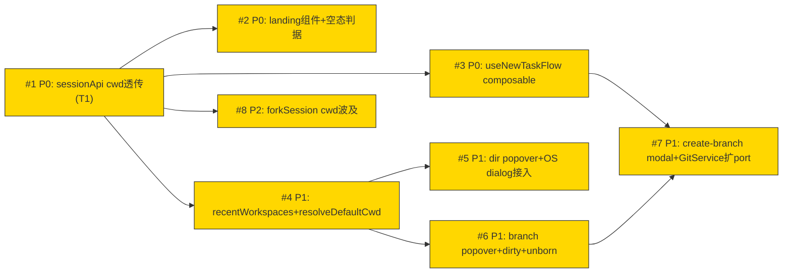

# Issue 决策图 — 新建任务

> 将 [system-architecture.md](./system-architecture.md)（②）的结论拆为带 P 级和方案对比的 issue。
> 取舍原则：**优先长期、合理的架构设计，高可扩展性；较少考虑成本**（本主题无局部例外，Q2 用户确认）。
> ② D-1~D-6 已全决策，无 DESIGN-IT-TWICE 触发；前沿已收敛（Q3 用户确认）。

## 地图总览

**Wave 编排提示**（供 ⑥执行计划）：
- Wave 1（P0 无依赖）：#1
- Wave 2（P0 依赖 #1）：#2、#3（可并行，文件不冲突）
- Wave 3（P1 依赖 #1）：#4；依赖 #4：#5、#6（可并行）
- Wave 4（P1 依赖 #3+#6）：#7；P2 依赖 #1：#8（可与 Wave 2/3 并行）

## 上游覆盖核验（MANDATORY，逐条不漏）

> 按 fog-of-war.md 4 轴（状态§5/模块§7/边界§8/挑战§10）+ 兜底扫描 ②。

| 上游元素 | 轴 | 对应 issue | 状态 | N/A 理由（状态=N/A 时必填）|
|---------|----|-----------|------|---------------------------|
| §5 NewTaskFlowState 显式状态机（D-4） | 状态 | #3 | ✅ | — |
| §5 落地空态判据 messageCount 派生（D-3） | 状态 | #2 | ✅ | — |
| §5 cancelled→landing 重入边（建模G-4） | 状态 | #3 | ✅ | 被状态机实现吞并 |
| §5 非 git 目录约束（UC-7） | 状态 | #2 | ✅ | landing 按 gitInfo 派生 chip 可见性 |
| §5 发送失败/overlay 失败处理（建模G-3） | 状态 | #3 | ✅ | 失败不改 flow 态，composable 内处理 |
| §7 useNewTaskFlow composable | 模块 | #3 | ✅ | — |
| §7 landing 组件 | 模块 | #2 | ✅ | — |
| §7 directory popover | 模块 | #5 | ✅ | — |
| §7 branch popover | 模块 | #6 | ✅ | — |
| §7 create-branch modal | 模块 | #7 | ✅ | — |
| §7 recentWorkspaces 派生函数 | 模块 | #4 | ✅ | — |
| §7 resolveDefaultCwd 纯函数 | 模块 | #4 | ✅ | — |
| §7 sessionApi 扩展（T1） | 模块 | #1 | ✅ | — |
| §7 useSidebar.newSession 扩展（BC-8） | 模块 | #3 | ✅ | composable 接入 6 触发点 |
| §7 SessionService（已有） | 模块 | — | N/A | runtime 契约稳定，cwd 透传已支持，无需改 |
| §7 GitService.createBranch 扩展（UC-6） | 模块 | #7 | ✅ | — |
| §7 GitService getStatus 接入 dirty | 模块 | #6 | ✅ | — |
| §7 git-info（分层债） | 模块 | — | N/A | T2 打回不合并；分层债补 port 移交⑤评估 |
| §8 OS 目录选择器边界 | 边界 | #5 | ✅ | BC-7 pick-directory IPC 接入 |
| §8 pi 引擎边界 | 边界 | — | N/A | 契约稳定，T1 前端补全在 #1，无独立 issue |
| §8 git CLI 边界 | 边界 | #6, #7 | ✅ | dirty 读（#6）+ createBranch 写（#7） |
| §10 D-1 核心计算定位 | 挑战 | — | N/A | 架构决策已落地（三层不套四层），不成 issue |
| §10 D-2 RecentWorkspace DTO | 挑战 | #4 | ✅ | 派生函数实现 |
| §10 D-3 messageCount 派生 | 挑战 | #2 | ✅ | — |
| §10 D-4 显式状态机 | 挑战 | #3 | ✅ | — |
| §10 D-5 git 服务分离 | 挑战 | — | N/A | T2 审查红队终裁打回（职责正交不合并），已决策 |
| §10 D-6 派生函数打回 T3 | 挑战 | #4 | ✅ | 从独立缓存降为派生函数 |
| §12 BC-1~BC-6（runtime 既有行为） | 兜底 | — | N/A | 既有行为保持，runtime 稳定基座 |
| §12 BC-7 pick-directory 接入 | 兜底 | #5 | ✅ | — |
| §12 BC-8 newSession 触发点统一 | 兜底 | #3 | ✅ | — |
| §12 BC-9 recentWorkspaces 新增 | 兜底 | #4 | ✅ | — |
| §12 BC-10 landing 组件新增 | 兜底 | #2 | ✅ | — |
| §12 BC-11 forkSession 波及 | 兜底 | #8 | ✅ | — |
| §12 BC-12 UC-7 非 git 既有行为 | 兜底 | #2 | ✅ | landing 复用既有判空隐藏行为 |
| §9 swimlane 控制流 | 兜底 | #3 | ✅ | 控制流实现归 composable |
| §11 grep AC 验收清单 | 兜底 | — | N/A | AC 分散到各 issue 验收标准，不单独成 issue |
| §6 Port 清单 | 兜底 | #7 | ✅ | git CLI port 能力集扩展在 #7 |
| ②待确认 NewTaskFlow 实例模型 | 兜底 | — | N/A | ②已标移交⑤code-arch（单实例 vs 每 session） |
| ②待确认 git-info 分层债补 port | 兜底 | — | N/A | ②已标移交⑤code-arch（T2 打回，分层债修复价值独立） |

## P0 Issues（阻塞项，必须先做）

### #1: sessionApi.create cwd 透传（T1 搭便车）

**P 级**: P0
**类型**: 模块（前端 transport 层签名扩展）
**Blocked by**: 无（最前置）
**推荐强度**: Strong

#### 问题描述

现状 `sessionApi.create(title?)` 只发 label（`api/domains/session.ts`），runtime 协议 `session.create: { cwd?, label? }`（`shared/src/protocol.ts:50`）已支持 cwd 但前端没透传。结果：新建 session 的 cwd 全回退 runtime 的 `process.cwd()`（`session-lifecycle.ts:42`），G1.1「非首次启动沿用最近活跃 session 的 cwd」业务目标直接破。

关联 ② §1 搭便车表 T1（候选）、§12 BC-2、§12 BC-11（forkSession 波及 → #8）。

#### 为什么是 P0

不做它，#2（landing 默认目录渲染）、#3（composable cwd 调度）、#4（recentWorkspaces 派生依赖 session list 含正确 cwd）全部建立在错误前提上。它是 G1.1 的唯一技术实现路径，改动虽小（~10 LOC）但在关键路径，阻塞语义成立。

#### 方案对比

##### 方案 A: 扩展现有签名 `create(cwd?, label?)`

**改动**:
- 模块: `api/domains/session.ts` 的 `create` 签名补 cwd 参数，payload 补 `cwd` 字段
- 流程: 调用方（useSidebar.newSession / forkSession）传入解析后的 cwd

**优点**: 单一入口，runtime 协议已支持，前端对齐即可；未来所有 create 调用统一走 cwd 透传
**缺点**: 现有调用点（newSession 无参、forkSession 无参）需同步改，否则 cwd=undefined 仍回退
**适用场景**: runtime 协议已就绪，前端补全是自然对齐

##### 方案 B: 新增独立方法 `createWithCwd(cwd, label)`

**改动**:
- 模块: 新增 `createWithCwd`，保留旧 `create(title?)` 不变

**优点**: 现有调用点零改动
**缺点**: 双方法维护负担；旧 create 仍是 cwd 回退 bug 的温床；违反「单一入口」长期架构
**适用场景**: 无（双入口是技术债）

#### 取舍决策

**选择**: 方案 A
**理由**: 长期架构优先——单一入口避免双方法维护；runtime 协议已支持 {cwd,label}，前端对齐是归位非新增复杂度。现有调用点改动是必要的一次性成本（newSession→#3 接入，forkSession→#8 独立 ticket）。
**放弃方案 B 理由**: 双方法制造维护负担，旧 create 仍带 cwd 回退 bug，违反单一入口原则。

#### 验收标准

- [ ] AC-1.1 [正常]（trace: UC-2 AC-2.1）: `sessionApi.create(cwd, label)` 的 WS payload 含 cwd 字段
- [ ] AC-1.2 [边界]: cwd=undefined 时 payload 不含 cwd 字段（runtime 回退 process.cwd()，防御性默认保留）
- [ ] AC-1.3 [异常]: runtime 收到非法 cwd 路径时 session.create 失败，前端显错（不静默回退）
- [ ] AC-1.4 [回归]: forkSession（#8）传入源 session cwd 而非最近活跃 cwd
- [ ] AC-1.5 [并发]（A1 闭合）: 新建触发点幂等保护——双击 sidebar+ 或 ⌘N 与 click 并发时只创建 1 个空 session（debounce 或 in-flight 标记）
- [ ] AC-1.6 [异常]（A2 闭合）: session.create 业务校验通过但 pi spawn 失败（cwd 无权限/pi 崩溃）的半创建态——session 回滚或显错，不留僵尸 session 实体。具体回滚策略属⑤，错误反馈走 #3 统一策略
- [ ] AC-1.7 [边界]（A3 闭合，K 决策）: 首次启动（session list 空）resolveDefaultCwd 返回 undefined 时——directory chip 空态 + 发送按钮 disabled，引导用户先选目录（不回退 process.cwd()）。landing 问候语外加强制选目录提示

### #2: landing 组件 + 落地空态判据（D-3, BC-10, BC-12）

**P 级**: P0
**类型**: 模块（前端组件）+ 模型（派生判据）
**Blocked by**: #1（默认目录渲染依赖 cwd 透传）
**推荐强度**: Strong

#### 问题描述

现状新建 session 直接进空 Panel（`Panel.vue:29` 无 landing 分支），无落地空态引导。需新增 landing 组件（watermark + 问候语 + composer 元信息行），判据为 `当前选中 session && messages.size === 0 && !isGenerating`（D-3 派生，非 session status）。branch chip 按 `gitInfo == null` 派生可见性（UC-7 非 git 目录隐藏，BC-12 既有行为复用）。

关联 ② §5 落地空态判据、§7 landing 组件、§10 D-3、§12 BC-10/BC-12、F1/F6/F8。

#### 为什么是 P0

landing 是新建任务的入口态，没它整个 5 步流程无法启动；messageCount 派生判据是状态机识别「landing vs 对话流」的基座，#3 composable 依赖此判据决定何时切 completed。

#### 方案对比

##### 方案 A: 独立 Landing.vue 组件 + messageCount 派生判据

**改动**:
- 模块: 新增 `Landing*.vue`（watermark + 问候语 + composer 元信息行），Panel.vue 加 `v-if messageCount===0 && !isGenerating` 分支
- 模型: 判据从 chat store `messages: Map` 派生（未 hydrate 乐观视为空，建模G-5）

**优点**: 单一职责，Panel 不膨胀；判据派生符合 D-3（不改 SessionStatus 枚举）；landing 视觉变化轴独立
**缺点**: 新增组件文件；需处理 getHistory 加载窗口（hydrate 前乐观空判据）
**适用场景**: landing 是独立的 UI 形态，值得独立组件

##### 方案 B: 复用 Panel.vue 加 empty 分支，不独立组件

**改动**:
- 模块: Panel.vue 内加 `v-else` landing 分支，内联 watermark/问候语

**优点**: 零新文件
**缺点**: Panel 承载对话流 + landing 双形态，违反单一职责；landing 视觉变化与对话流变化耦合在同一组件
**适用场景**: landing 极简（不适用——landing 有 watermark/问候语/chip 派生等独立逻辑）

#### 取舍决策

**选择**: 方案 A
**理由**: 长期架构优先——landing 是独立 UI 形态（常态步骤），独立组件让「视觉变化轴」与「对话流变化轴」正交归位。判据 messageCount 派生避免污染 SessionStatus 枚举（D-3）。
**放弃方案 B 理由**: Panel 双形态耦合，landing 后续迭代（问候语/chip 派生/UC-7 非 git）会持续膨胀 Panel。

#### 验收标准

- [ ] AC-2.1 [正常]（trace: UC-1 AC-1.1）: 新建空 session 渲染 landing（watermark + 问候语 + composer + directory chip）
- [ ] AC-2.2 [边界]（trace: UC-7 AC-7.1）: 非 git 目录 branch chip 隐藏（gitInfo==null），directory chip 正常显示
- [ ] AC-2.3 [边界]: getHistory 未 hydrate 时乐观视为空（渲染 landing），hydrate 完成后若 messages 非空切对话流
- [ ] AC-2.4 [异常]: isGenerating=true 时不渲染 landing（即使 messages 空，显示生成态）
- [ ] AC-2.5 [回归]: branch chip 可见性复用 BC-12 既有判空逻辑（Sidebar/SessionItem 同源）
- [ ] AC-2.6 [异常]（M3/A4 闭合）: getHistory 加载失败时 landing 有失败出口（超时/重试/显错），不永久卡住——未 hydrate 乐观空判据仅适用于「加载中」，加载失败须有降级 UI
- [ ] AC-2.7 [异常]（M3 闭合）: 发送失败时 landing composer 子态显错（错误提示+允许重试），错误 UI 载体见 #3 统一错误策略（A27）
- [ ] AC-2.8 [边界]（A5 闭合）: isGenerating=true 且 messages 空时不渲染 landing——landing 与生成态互斥渲染（生成态优先），landing 不内含生成子态

### #3: useNewTaskFlow composable（D-4, BC-8）

**P 级**: P0
**类型**: 模块（前端编排层 composable）
**Blocked by**: #1（composable 调度 sessionApi.create 需带 cwd）
**推荐强度**: Strong

#### 问题描述

5 步流程的编排大脑。实现 NewTaskFlowState 显式状态机（8 态 + ~17 转换，非法转换抛错，D-4）+ overlay 嵌套互斥（至多 1 个 active）+ Esc 优先级（spec §4）+ 默认 cwd 解析调度（外置 resolveDefaultCwd 纯函数）。接入 6 个 newSession 触发点（BC-8: Sidebar.vue:200/232、SessionList.vue:44 emit、PanelHeader.vue:71 emit、Workspace.vue:46、Overview.vue:95、PanelContainer.vue:69）。useSidebar.newSession/newSessionToStandby 退化为 composable 的薄封装。

关联 ② §5 状态机、§7 useNewTaskFlow、§10 D-4、§12 BC-8、§11 AC-2/AC-3/AC-4/AC-6。

#### 为什么是 P0

状态机是 5 步流程的核心，#5/#6/#7（dir/branch popover、create-branch modal）都依赖 composable 提供的状态管理与 overlay 嵌套规则。不做它，popover/modal 嵌套易出 Esc 优先级 bug（spec §4 边缘态）。

#### 方案对比

##### 方案 A: 单一 composable 承载状态机+overlay+Esc，cwd 解析外置纯函数

**改动**:
- 模块: `useNewTaskFlow`（状态机 + overlay 嵌套 + Esc 优先级），`resolveDefaultCwd` 外置纯函数（#4）
- 流程: 6 触发点统一经 composable，useSidebar 退化为薄封装

**优点**: 状态机+overlay+Esc 是「UI 交互流程」单一变化轴的不同切面（演进G-1），内聚合理；cwd 解析外置避免 composable 膨胀；~200 LOC 可控
**缺点**: 单 composable 承载多职责，需警惕膨胀；Esc 优先级若复杂可后置拆 useOverlayEsc（非预先拆）
**适用场景**: 5 步流程编排，状态机是核心

##### 方案 B: 预先拆 3 个 composable（useNewTaskFlowState + useOverlayEsc + useCwdResolve）

**改动**:
- 模块: 拆 3 个独立 composable，各自单一职责

**优点**: 每个 composable 极简
**缺点**: 状态机与 overlay 嵌套强耦合（overlay 嵌套规则依赖当前态），拆开后跨 composable 状态同步成本高；useOverlayEsc/useCwdResolve 当前是单一用例，预先拆是空壳层（YAGNI）
**适用场景**: 各子职责有多个复用点（当前无）

#### 取舍决策

**选择**: 方案 A
**理由**: 长期架构优先但反对预先抽象——状态机+overlay+Esc 是单一变化轴「UI 交互流程」的内凝聚合，强行拆 3 个 composable 引入跨 composable 状态同步复杂度（违反复杂度归位）。Esc 优先级视实施复杂度可后置拆 useOverlayEsc（演进G-1 保留逃生口），非预先拆。
**放弃方案 B 理由**: 预先拆分是空壳层（useOverlayEsc/useCwdResolve 当前单一用例），跨 composable 状态同步成本高于内聚收益。

#### 验收标准

- [ ] AC-3.1 [正常]（trace: UC-1 AC-1.2）: NewTaskFlowState 非法转换抛错（D-4 落地，grep 守卫）
- [ ] AC-3.2 [正常]: overlay 互斥——至多 1 个 active（状态机单值 enum，非 4 个 boolean flag）
- [ ] AC-3.3 [边界]: cancelled→landing 重入边（重选空 session 复活 NewTaskFlow）
- [ ] AC-3.4 [异常]: 发送失败不改 flow 态（留 landing，composer 子态显错）
- [ ] AC-3.5 [回归]: 6 触发点均经 useNewTaskFlow（grep 无直接 sessionApi.create in components，§11 AC-3）
- [ ] AC-3.6 [终态]: completed 是唯一终态（cancelled 非终态，§11 AC-6）
- [ ] AC-3.7 [守卫]（M2 闭合）: 非 git 目录（gitInfo==null）下状态机守卫——branch-popover/branch-modal 不可达（非法转换抛错），状态机只走 idle↔landing↔dir-popover↔dir-dialog 子集
- [ ] AC-3.8 [守卫]（M5 闭合）: 深模态来源约束——dir-dialog 只从 dir-popover 进、branch-modal 只从 branch-popover 进，非法来源抛错（与 overlay 互斥 AC-3.2 正交）
- [ ] AC-3.9 [Esc 优先级]（M4 闭合）: 模态内 Esc 关当前模态、composer Esc 清空、浮层 Esc 关浮层，三者不冲突（同一时刻只一层，spec §4）
- [ ] AC-3.10 [死角]（A7 闭合）: overlay 打开时用户切 session——4 overlay 态均有 →cancelled 转移（overlay 自动关闭 + 状态切 cancelled），不卡死
- [ ] AC-3.11 [异常]（A9 闭合）: 非法转换抛错后状态机回安全态（idle），不停在非法态；Vue 错误边界兼底不崩组件
- [ ] AC-3.12 [实例模型]（A10 闭合）: completed 后 ⌘N 再触发——新建 NewTaskFlow 实例（单实例销毁后重建，从 idle→landing）。**v1 假设单实例模型**，⑤code-arch 骨架验证裁决（Obs-B）
- [ ] AC-3.13 [错误策略]（A27 闭合）: 统一错误反馈载体——①不可逆操作错误用 inline 条（dirty/createBranch），②临时错误用 toast（getStatus/IPC），③发送错误用 composer 子态。跨 issue 一致

## P1 Issues（核心）

### #4: recentWorkspaces 派生 + resolveDefaultCwd（D-6, BC-9）

**P 级**: P1
**类型**: 模块（前端纯函数）
**Blocked by**: #1（派生依赖 session list 含正确 cwd，cwd 透传是前提）
**推荐强度**: Strong

#### 问题描述

实现两个纯函数：`recentWorkspaces(sessions): RecentWorkspace[]`（distinct cwd top10，按 lastActiveAt 倒序，directory popover 列表数据源）+ `resolveDefaultCwd(sessions): string | undefined`（最近活跃 session 的 cwd，新建任务默认目录，G1.1）。

D-6 已打回 T3 独立 LRU 缓存——SessionSummary 已含 cwd+lastActiveAt，distinct cwd top10 从 session list 派生即可，独立缓存是伪边界。

关联 ② §4 RecentWorkspace DTO、§7 recentWorkspaces/resolveDefaultCwd、§10 D-2/D-6、§12 BC-9、F2。

#### 为什么是 P1

#5（dir popover）依赖 recentWorkspaces 作数据源，#2（landing 默认目录）依赖 resolveDefaultCwd。是核心路径的数据基座，但本身无 UI 交互，排在 P0 状态机/组件之后。

#### 方案对比

##### 方案 A: 纯函数放 utils 目录

**改动**:
- 模块: `utils/recentWorkspaces.ts` 导出两个纯函数，输入 SessionSummary[]，输出派生结果

**优点**: 纯函数可独立单测、无 store 耦合、符合 D-6 派生定位；输入输出明确
**缺点**: 调用方需手动传 session list（非自动响应式）
**适用场景**: 派生逻辑无副作用，纯函数最自然

##### 方案 B: pinia store getter（computed）

**改动**:
- 模块: session store 加 getter `recentWorkspaces` / `defaultCwd`，自动响应 session list 变化

**优点**: 自动响应式，组件用直接引用
**缺点**: 派生逻辑耦合 store；难以独立单测（需 mock store）；违反「派生函数无状态」的 D-6 定位
**适用场景**: 派生逻辑强依赖 store 响应式（当前不需要——调用点少）

#### 取舍决策

**选择**: 方案 A
**理由**: 长期架构优先——纯函数可测试性最高、无 store 耦合，符合 D-6「派生函数非缓存模块」定位。响应式需求在调用点用 computed 包裹纯函数即可，不必把派生逻辑塞进 store。
**放弃方案 B 理由**: store getter 耦合 store，单测成本高，违反派生函数无状态定位。

#### 验收标准

- [ ] AC-4.1 [正常]（trace: UC-3 AC-3.1）: recentWorkspaces 返回 distinct cwd top10，按 lastActiveAt 倒序
- [ ] AC-4.2 [边界]: session list 为空时返回 []，resolveDefaultCwd 返回 undefined
- [ ] AC-4.3 [边界]: 单 session 时返回单元素列表
- [ ] AC-4.4 [回归]: 无独立缓存模块（grep 无 recentWorkspaceCache/RecentItemsStore，D-6 打回 T3）
- [ ] AC-4.5 [边界]（A11 闭合）: session list 含 cwd=null/undefined 脏数据（老 session）——派生函数过滤跳过，不归入 undefined 组污染列表
- [ ] AC-4.6 [边界]（A12 闭合）: 多 session 同 cwd 时 distinct 去重后保留 lastActiveAt 最新者（单条代表该 cwd 的最近使用）

### #5: directory popover + OS dialog 接入（BC-7）

**P 级**: P1
**类型**: 模块（前端组件 + IPC 接入）
**Blocked by**: #4（popover 列表数据源）
**推荐强度**: Strong

#### 问题描述

步骤 2 选目录 popover（自绘最近 workspace 列表 + 「打开文件夹」「远程连接」动作项）+ 步骤 4a 接入既有 pick-directory IPC（BC-7：handler 已存在 `privileged-handlers.ts:42-58`，renderer 零调用）。popover 锚 chip 上方展开，OS dialog 选中回灌 chip。

关联 ② §3.3 步骤 2、§3.4 步骤 4a 系统原生裁决、§12 BC-7、F2/F4。

#### 为什么是 P1

选目录是 spec 核心步骤（非默认路径但高频）。OS dialog 接入复用既有 IPC（零 runtime 改动），是前端工作。

#### 方案对比

##### 方案 A: 自绘 popover 列表 + 接入 pick-directory IPC

**改动**:
- 模块: `DirSelect.vue`（popover 列表，数据源 #4 recentWorkspaces）+ 接入 pick-directory IPC（「打开文件夹」动作项）
- 流程: 选列表项→回灌 chip；点「打开文件夹」→IPC→OS dialog→选中回灌/取消落回 popover

**优点**: popover 给快速切换最近 workspace（零 OS 交互），OS dialog 仅「打开文件夹」入口；职责分离符合 spec §3.4 裁决；复用既有 IPC 零 runtime 改动
**缺点**: 自绘 popover 列表交互（搜索/键盘/选中态）
**适用场景**: 最近 workspace 高频切换 + 偶尔打开新目录

##### 方案 B: 全用 OS 原生 dialog（放弃 popover 列表）

**改动**:
- 模块: directory chip 点击直接调 pick-directory IPC，无 popover

**优点**: 零自绘 UI
**缺点**: 每次切换目录都走 OS dialog（重交互），最近 workspace 无法快速切换；违反 spec §2.2「popover 锚 chip 上方」设计意图；丢失 recentWorkspaces（#4）的价值
**适用场景**: 无（spec 已裁决 popover + OS dialog 双形态）

#### 取舍决策

**选择**: 方案 A
**理由**: 长期架构优先——spec §3.4 已裁决：popover 列表给「最近 workspace 快速切换」（轻交互），OS dialog 仅「打开文件夹」入口（重交互）。两者职责不同，合并会丢失快速切换能力。复用既有 pick-directory IPC（BC-7）零 runtime 改动。
**放弃方案 B 理由**: 全 OS dialog 丢失 popover 快速切换，违反 spec §2.2 设计意图，recentWorkspaces（#4）失去用例。

#### 验收标准

- [ ] AC-5.1 [正常]（trace: UC-3 AC-3.2）: 点 directory chip 弹 popover，显示 recentWorkspaces 列表
- [ ] AC-5.2 [正常]（trace: UC-5 AC-5.1）: 点「打开文件夹」→OS 原生 dialog，选中回灌 chip
- [ ] AC-5.3 [异常]（trace: UC-5 AC-5.2）: OS dialog 取消（canceled=true）→落回 popover，chip 不变
- [ ] AC-5.4 [边界]: popover 空列表（首次启动无 workspace）显示空态文案（spec §6）
- [ ] AC-5.5 [回归]: 复用既有 pick-directory IPC（grep 调用点新增，handler 不变，BC-7）
- [ ] AC-5.6 [异常]（A13 闭合）: pick-directory IPC handler 招错（getFocusedWindow null）popover 显错 toast，不崩
- [ ] AC-5.7 [异常]（A14 闭合）: 用户选不可读目录（权限拒绝）——OS dialog 允许选但 session.create 失败，错误反馈链路连贯（不割裂到已关的 popover）

### #6: branch popover + dirty 二次确认 + unborn HEAD

**P 级**: P1
**类型**: 模块（前端组件 + runtime 接入）
**Blocked by**: #4（session cwd 上下文）
**推荐强度**: Strong

#### 问题描述

步骤 3 选分支 popover（分支列表 + dirty 标记 + inline 二次确认条）+ GitService.getStatus 同步接入 dirty 标记 + unborn HEAD 空态（git 仓库无首次提交，F8）。dirty 分支切走弹 inline 二次确认条（非 modal，spec §3.3），v1 选「留在工作区」（不自动 stash）。

**约束（Q2 用户决策）**: git 命令全同步——GitService.getStatus 经 execSync 同步执行。同步阻塞 runtime event loop 风险移交④NFR 评估。

关联 ② §3.3 步骤 3、§7 GitService getStatus 接入、§12 BC-6、F3/F7/F8。

#### 为什么是 P1

选分支是 spec 核心步骤，dirty 二次确认是 G2 不可逆操作保护（切走 dirty 分支丢未提交更改）。

#### 方案对比

##### 方案 A: popover 自绘分支列表 + inline 二次确认条 + getStatus 同步接入

**改动**:
- 模块: `BranchSelect.vue`（popover 分支列表 + dirty 标记 + inline 确认条）；GitService.getStatus 同步接入（dirty 数据源）
- **runtime port 扩展 [BACKFED from ⑤code-arch on 2026-06-26]**: 切换分支需 `git checkout <name>`，与 #7 createBranch（`checkout -b`）同为 git 写操作经 port 隔离。⑤骨架揭示 #6 含：前端 `git.ts.checkout` + runtime `GitService.checkout` + protocol `git.checkout` 消息 + GitMessageHandler case + GitCommand 白名单加 `'checkout'`（**#6+#7 共用**）。原初稿「改动」只列前端 popover + getStatus 接入，漏了 checkout 的 runtime port 扩展块（与 #7 同模式），⑥照此估工不会低估 #6
- 流程: 选干净分支→gitApi.checkout→回灌 chip；选 dirty 分支→弹 inline 确认条→确认切走（gitApi.checkout，留在工作区）/取消

**优点**: popover 是元信息调整不升 modal（spec §2.2）；dirty 用 inline 条非 modal（轻量，与 sidebar 删除确认同源）；getStatus 复用既有 GitService（BC-6 同源读取）
**缺点**: 同步 getStatus 阻塞 runtime event loop（git 执行期间其他 WS 请求等待）——NFR 风险移交④
**适用场景**: 分支切换高频，dirty 保护必要

##### 方案 B: modal 形式选分支 + 自动 stash

**改动**:
- 模块: branch chip 点击弹 modal 选分支，dirty 自动 stash

**优点**: modal 强聚焦
**缺点**: 违反 spec §2.2「popover 不升 modal」（分支切换是可逆元信息调整，非不可逆）；自动 stash 是 P3（spec §6 遗留，#10）；modal 交互重
**适用场景**: 无（spec 已裁决 popover + inline 确认）

#### 取舍决策

**选择**: 方案 A
**理由**: 长期架构优先——spec §2.2/§3.3 已裁决：分支切换是可逆元信息调整用 popover（不升 modal），dirty 保护用 inline 确认条（与 sidebar 删除确认同源，轻量）。getStatus 复用既有 GitService（BC-6）。git 同步是 Q2 用户决策约束，阻塞风险移交④。
**放弃方案 B 理由**: modal 违反 spec「popover 不升 modal」，自动 stash 是 P3（#10）不在 v1。

#### 验收标准

- [ ] AC-6.1 [正常]（trace: UC-4 AC-4.1）: 点 branch chip 弹 popover，显示分支列表 + dirty 标记
- [ ] AC-6.2 [正常]（trace: UC-4 AC-4.2）: 选 dirty 分支→弹 inline 二次确认条→确认「切走」= 执行 `git checkout 目标分支`，未提交改动随工作区保留（git 默认行为，不 stash、不丢弃，spec §3.3 v1 裁决）
- [ ] AC-6.3 [边界]（trace: UC-4 AC-4.3）: unborn HEAD（无首次提交）显示空态文案 + 引导首次 commit（F8）
- [ ] AC-6.4 [异常]: getStatus 同步执行失败→popover 显错（不崩）
- [ ] AC-6.5 [NFR 移交]: 同步 getStatus 阻塞 runtime event loop 影响移交④评估
- [ ] AC-6.6 [回归]: dirty 数据复用 GitService.getStatus（BC-6 同源，不另起 git 调用）
- [ ] AC-6.7 [并发]（A18 闭合）: getStatus 同步阻塞 event loop 期间用户 Esc——execSync 期间 JS 冻结，Esc 排队，阻塞结束后处理（状态机按队列 Esc 转移，不丢事件）。具体 NFR 影响移交④
- [ ] AC-6.8 [边界]（A16 闭合）: getStatus 无缓存——每次开 branch popover 都 spawn git status。v1 可接受（分支切换低频），若性能问题④评估加缓存
- [ ] AC-6.9 [边界]（A17 闭合）: 分支列表极多（100+）popover 用虚拟滚动或限制渲染数量 + 搜索过滤

### #7: create-branch modal + GitService.createBranch 扩 port（UC-6）

**P 级**: P1
**类型**: 模块（前端组件 + runtime port 扩展）
**Blocked by**: #3（modal 态管理依赖 composable）, #6（branch popover 触发 modal）
**推荐强度**: Strong

#### 问题描述

步骤 4b 创建并检出新分支 modal（分支名表单 + 校验 + 提交）+ runtime GitService.createBranch 扩展（GitCommand 白名单 +branch/-b + protocol 消息 git.createBranch + GitMessageHandler case，~40 LOC，结构G-2/G-5 闭合）。

**约束（Q2 用户决策）**: git 命令全同步——createBranch 经 execSync 同步执行。同步阻塞 runtime event loop 风险移交④NFR 评估。

关联 ② §3.5 步骤 4b、§7 GitService.createBranch、§6 git CLI port 能力集缺口、F5、UC-6。

#### 为什么是 P1

创建分支是唯一不可逆 git 写操作（spec §2.3），跨前后端（前端 modal + runtime port 扩展）。port 能力集扩展是结构G-2/G-5 闭合项。

#### 方案对比

##### 方案 A: 前端 modal + runtime GitService.createBranch 扩 port

**改动**:
- 模块: `CreateBranchModal.vue`（表单+校验+提交）；runtime GitService.createBranch（扩 GitCommand 白名单 +branch/-b + protocol git.createBranch + handler case）
- 流程: modal 提交→WS git.createBranch→runtime execSync(git checkout -b)→成功更新 chip/失败留 modal 显错

**优点**: git 写操作经 runtime GitService port 隔离（契约稳定性 + 安全，前端不直连 git CLI）；符合 ② §6 Port 清单「git CLI 真 seam」；modal 是不可逆操作正当升级（spec §2.3）
**缺点**: 跨前后端，port 扩展 ~40 LOC（GitCommand 白名单+protocol+handler）；同步 createBranch 阻塞 runtime event loop——NFR 风险移交④
**适用场景**: 不可逆 git 写操作必须经 port 隔离

##### 方案 B: 前端直接 spawn git（不经 runtime）

**改动**:
- 模块: 前端经 IPC 直接 spawn git checkout -b

**优点**: 零 runtime 改动
**缺点**: 前端直连 git CLI 绕过 GitService port（破坏 ② §6 Port 清单「git CLI 真 seam」）；git 写操作无统一隔离（安全 + 契约稳定性丧失）；违反分层——前端不该直接执行外部进程命令
**适用场景**: 无（破坏架构边界）

#### 取舍决策

**选择**: 方案 A
**理由**: 长期架构优先——git 写操作必须经 runtime GitService port 隔离（② §6 git CLI 是真 seam，契约稳定性 + 安全）。前端直连 git CLI 破坏分层边界。port 扩展 ~40 LOC 是必要的一次性成本。git 同步是 Q2 用户决策约束，阻塞风险移交④。
**放弃方案 B 理由**: 前端直连 git CLI 破坏 Port 边界，丧失契约隔离与安全，违反分层架构。

#### 验收标准

- [ ] AC-7.1 [正常]（trace: UC-6 AC-6.1）: 填分支名+提交→创建并切换→更新 branch chip，落回 landing
- [ ] AC-7.2 [边界]（trace: UC-6 AC-6.2）: 空分支名→按钮 disabled；已存在分支名→input 边框 --danger + 「该分支已存在」
- [ ] AC-7.3 [异常]（trace: UC-6 AC-6.4）: createBranch 同步执行失败（命令返回非零/分支名非法/已存在）→**留 modal 显错**（D-7 决策，与②§5 转移表一致——②mermaid L94 已反哺拆分）
- [ ] AC-7.4 [port 扩展]: GitCommand 白名单含 branch/checkout -b（grep 验证，结构G-2 闭合）
- [ ] AC-7.5 [port 扩展]: protocol 含 git.createBranch 消息 + GitMessageHandler case（grep 验证，结构G-5 闭合）
- [ ] AC-7.6 [NFR 移交]: 同步 createBranch 阻塞 runtime event loop 影响移交④评估
- [ ] AC-7.7 [异常]（A19 闭合）: createBranch execSync hang（.git/index.lock 持有/等输入）需超时保护——`[BACKFED from ④nfr on 2026-06-26]` 源码核实：createBranch 经 IGitExecutor port（`infra/git-executor.ts:18` execFileSync timeout=8000ms）已自带超时，无需另加包装；超时后 modal 显错「git 操作超时」
- [ ] AC-7.8 [边界]（A20 闭合）: 分支名校验——前端 input 实时校验 git 分支名规则（禁空格/特殊字符/`..`/`-`开头/`~^:` 等），非法名按钮 disabled + 错误提示；提交前双重校验（前端 + git 返回错误映射）
- [ ] AC-7.9 [并发]（A22/A23 闭合）: createBranch WS 飞行中——提交按钮 disabled 防重复点击；用户 Esc 关 modal 后返回的孤儿 promise 忽略（状态已变，不回灌 chip）

## P2 Issues（重要）

### #8: forkSession cwd 波及（BC-11, T1 波及）

**P 级**: P2
**类型**: 模块（前端调用点修正）
**Blocked by**: #1（T1 改 sessionApi.create 签名后波及）
**推荐强度**: Strong

#### 问题描述

T1（#1）改 sessionApi.create 签名补 cwd 后，`useSidebar.ts:223` 的 forkSession 无参调用会受波及。fork 场景的 cwd 应取**源 session 的 cwd**（非「最近活跃 cwd」），与新建任务语义不同。

关联 ② §12 BC-11。**独立 ticket，不裹进新建任务本体 PR**（Q1 用户决策）。

#### 为什么是 P2

forkSession 是 fork 会话语义（截取历史），cwd 取值与新建任务正交。裹进本体 PR 增加爆炸半径且语义混淆。但 T1 改签名后若不处理，forkSession 会静默坏掉（cwd 取错），所以不能降到 P3。

#### 推荐方案（P2 无需 ≥2 方案对比）

T1 改 sessionApi.create 签名时，forkSession 调用点显式传入源 session 的 cwd（`sessionApi.create(sourceSession.cwd, ...)`）。独立 ticket 标注 blocked_by #1，与本体 PR 分离。

#### 验收标准

- [ ] AC-8.1 [正常]: forkSession 调用 sessionApi.create 传入源 session cwd
- [ ] AC-8.2 [回归]: fork 后的新 session cwd = 源 session cwd（非最近活跃 cwd）
- [ ] AC-8.3 [隔离]: 独立 ticket，不裹进新建任务本体 PR
- [ ] AC-8.4 [异常]（A24 闭合）: 源 session cwd 已不存在时 forkSession——session.create 失败显错，不创建僵尸 session

## 迷雾（未展开）

无。② D-1~D-6 已全决策，无 DESIGN-IT-TWICE 触发；4 轴 + 兜底扫描后前沿已清晰（Q3 用户确认）。② 待确认项（NewTaskFlow 实例模型、git-info 分层债补 port）已显式移交⑤，非③迷雾。

## 后续迭代（P3 延后项）

> 均来自 ① [spec.md](../../docs/page-design/v3/new-task/spec.md) §6 遗留待裁决，Q4 用户确认全部延后。

- **#9 [P3]: popover 锚定 fallback** — chip 距视口顶部 < 300px 时 popover 自动向下展开。v1 统一向上展开（spec §3.2/§3.3），fallback 未做。延后理由：composer 在屏幕下半部，向上展开在常规布局下不会出屏；fallback 是极端窗口尺寸的边界问题，v1 可接受。
- **#10 [P3]: dirty 切走自动 stash 选项（v2）** — v1 选「留在工作区」（不自动 stash，git 自然行为）。用户可能预期「自动 stash」，v2 接 git stash 选项。延后理由：spec §6 明标 v2；自动 stash 是用户没要求的副作用，v1 不主动制造。
- **#11 [P3]: 远程连接（SSH remote picker）** — directory popover 「远程连接」动作项 v1 是 stub（点开 toast「v1 暂未支持」）。延后理由：spec §6 明标 v2；v1 聚焦本地工作流。
- **#12 [P3]: Git 图谱（lazygit/tig 嵌入）** — branch popover「Git 图谱」动作项 v1 是 stub。延后理由：spec §6 明标 v2；需评估 lazygit/tig 嵌入式 view 或独立 modal。

## 决策记录

> Step 3 解决的 D 类 gap（tracing round 1 异常猎手 A系列 + 覆盖重建 M系列）。

- **D-7 (M1/A15) createBranch 失败留 modal 显错**（K 用户裁决）：②§5 L94 转移表原定义 `branch_modal→branch_popover: 取消/失败`，与①UC-6/AC-6.4「modal 不关闭」+②自身散文「overlay内失败停留当前overlay」三方冲突。用户裁决留 modal（用户能修正分支名重试，体验更好）。**Step 6b 反哺已执行**：②§5 mermaid L94 已拆为 `branch_modal→branch_popover:取消` + `branch_modal→branch_modal:创建失败(显错)`，标 `[BACKFED from ③issues on 2026-06-26]`。
- **D-A3 首次启动强制选目录**（K 用户裁决）：resolveDefaultCwd 返回 undefined 时不回退 process.cwd()，directory chip 空态 + 发送 disabled。**Step 6b 反哺检查纠正**：反哺 subagent 发现①requirements AC-1.3/AC-2.2/§7/Q2-b 早已定义首次启动强制选目录，③AC-1.7 与①完全一致；②BC-2 的 process.cwd() 是 runtime 防御层默认，③AC-1.2 已显式保留。**①②无需反哺**——③AC-1.7 是前端 UX 层陈述，与①定义一致、与② runtime 防御层不同层不冲突。原初稿「需回流①②」判断有误，现纠正。
- **D-A25 空 session 堆积移交④**（K 用户裁决）：v1 不做自动清理（用户手动 delete），作为已知问题移交④NFR 评估堆积阈值。**不新增 issue**（清理策略是并发/幂等复杂问题，非③范围，④评估后若需则补 issue）。
- **D-A10 completed 后实例模型**（F 核对后自决）：②已将 NewTaskFlow 实例模型（单实例 vs 每 session）移交⑤。③不新增 issue，在 AC-3.12 显式声明「v1 假设单实例，completed 后重建」作为实施假设，⑤验证。
- **D-A26/A28/A29 WS 断连/git-info 异常/pi 崩溃**：runtime 全局稳定性是 NFR 范畴，不在③拆 issue。移交④NFR 评估（影响所有 WS 调用 + landing 失效感知）。
- **D-A30 newSessionToStandby 语义**：②BC-8 已列 6 触发点统一接入 composable。newSessionToStandby（载入非 active panel）与 newSession 语义差异在 composable 接入时保留——composable 编排 create+cwd，selectSession 落点由调用方决定（standby vs active）。#3 实现时区分。
- **D-P1 P3 延后项根来源**（覆盖重建 P1）：#9/#10/#12 P3 项根在①spec §6 而非②，此处显式声明：#9/#10/#12 根来源 = `docs/page-design/v3/new-task/spec.md §6 遗留待裁决`，非②脱镝。#11 远程连接②§7 DirSelect.vue 有弱根（动作项 stub）。

## 待确认

- **[已闭合] D-7**: createBranch 失败转移目标——Step 6b 已反哺②§5 mermaid L94 拆分。
- **[已闭合] D-A3**: 首次启动边缘态——Step 6b 反哺检查确认①已定义、②不同层不冲突，无需反哺。原初稿判断纠正。
- **[移交④] git 同步阻塞 + WS 断连 + 空 session 堆积 + getStatus 无缓存**: 均为 NFR 范畴，④评估后若需缓解则补 issue。
- **[移交⑤] NewTaskFlow 实例模型 + git-info 分层债补 port**: ②已标，③尊重上游移交。

## 移交下游

- **[移交④NFR] git 同步阻塞 runtime event loop 风险**：Q2 用户决策「git 全同步」，GitService.getStatus（#6）/ createBranch（#7）经 execSync 同步执行，阻塞 runtime Node WS 服务的 event loop，期间其他 WS 请求（如消息流）等待。④需评估阻塞时长（git status/branch 操作耗时）与对消息流实时性的影响，必要时提供缓解（如 worker_threads 或异步化）。
- **[移交⑤code-arch] NewTaskFlow 实例模型**：②已标——`cancelled` 与 `idle` 重选入边语义重叠，区分依赖 NewTaskFlow 是单实例（全局）还是每空 session 一个实例。⑤骨架验证裁决。
- **[移交⑤code-arch] git-info 分层债补 port**：②已标——git-info 在 services 层裸 execSync，是否补 IGitExecutor port 覆盖读路径。T2 已打回不做合并，但分层债修复价值独立。
