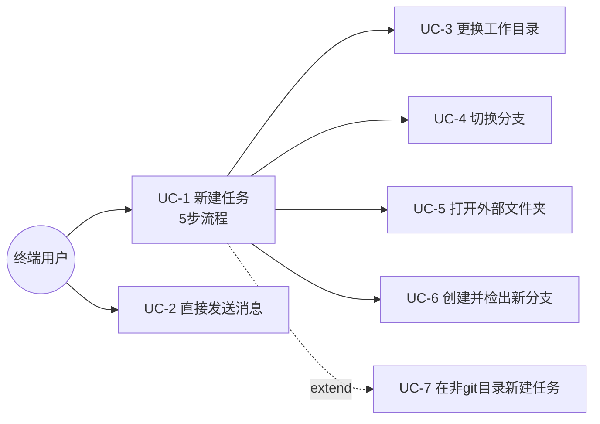
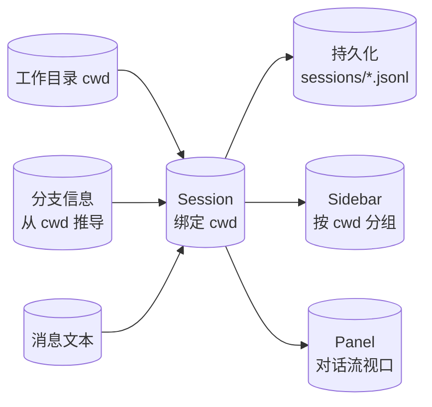
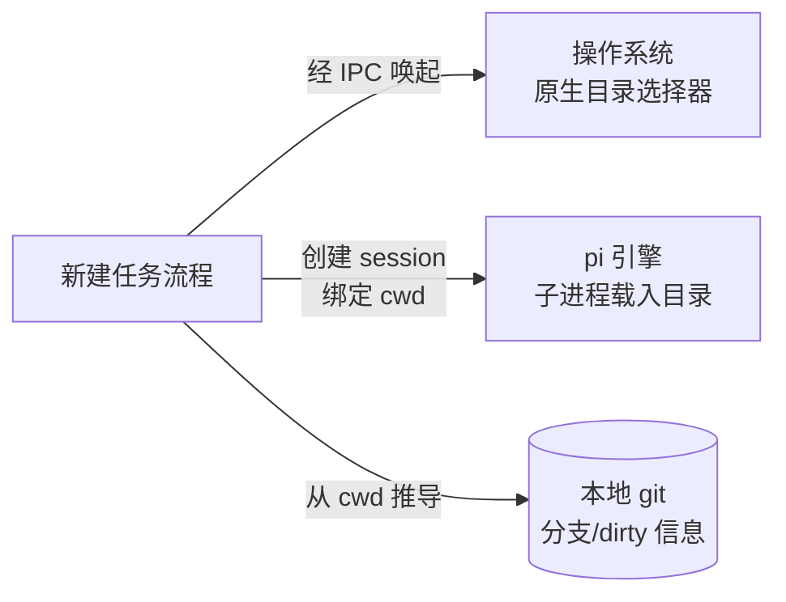

# 新建任务 · 业务需求

> 业务层需求（不碰系统实现）。UI 交互细节的真相源是 [`docs/page-design/v3/new-task/spec.md`](../../docs/page-design/v3/new-task/spec.md)，本文件不重复其 UI 细节，只描述「用户做什么、系统响应什么、成功是什么」。

## 1. 业务目标

### 目标树
- **G1: 用户能从「无活跃会话」低摩擦地进入「准备开聊」状态** — 成功标准：用户从触发新建到发出第一条消息，默认路径（直接打字发送）仅 1 次鼠标点击（即点击发送按钮；键盘 Enter 同效，计 0 次点击）
  - G1.1: 落地页不强制选目录/分支，沿用上次上下文
  - G1.2: 元信息（目录/分支）可随时调整，不阻断主输入流
- **G2: 新建任务的动作边界清晰，不可逆操作有显式确认** — 成功标准：100% 的「创建并检出新分支」「切走带未提交改动的分支」经用户二次确认（注：普通换目录/换分支是 popover 内 chip 状态切换，不创建新东西、可逆，不需二次确认）

### 达成路线
| 目标 | 路线/策略 | 对应用例 |
|------|---------|---------|
| G1 | 5 步线性流程，落地空态为常态，目录/分支为可改的元信息 chip | UC-1, UC-2 |
| G1.1 | 非首次启动沿用最近活跃 session 的目录 | UC-2 |
| G2 | 不可逆动作（创建分支、切走 dirty 分支）升级模态/二次确认 | UC-4, UC-6 |

## 2. 业务用例

### 用例图

### UC-1: 新建任务（主流程）
- **Actor**: 终端用户
- **前置条件**: 当前无活跃会话，或用户主动触发新建（⌘N / sidebar「新建任务」按钮）
- **主流程**: 1. 触发新建 → 2. 进入落地空态（问候语 + composer + directory/branch chip）→ 3.（可选）调整目录/分支 → 4. 输入消息发送 → session 创建并进入对话
- **session 创建时点**: 触发新建即创建一个绑定（所选或沿用）cwd 的空 session，落地空态是该空 session 的初始视口；「发出首条消息」是该 session 从空态进入对话流的业务里程碑，非创建时点
  - **[BACKFED from ⑤code-arch on 2026-06-26] 首次启动例外**: 首次启动（session list 空，resolveDefaultCwd 返回 undefined）时，触发新建**不立即创建 session**——先进 landing 待选目录态（currentSessionId=null，chip 空+发送 disabled，AC-1.7），用户选目录后才 create(newCwd) spawn。此例外由⑤骨架验证裁决（BF1）：①G8「触发即创建」与③AC-1.7「首次不回退 process.cwd()」在首次启动场景冲突（立即 create(undefined) 必触发 runtime BC-2 回退），用户裁决延迟 create 方案 A。常态（非首次启动）仍遵循「触发即创建」
- **替代流程**: 3a. 不调整直接发送（见 UC-2）；3b. 调整目录（UC-3）；3c. 调整分支（UC-4）
- **异常流程**: 系统原生目录选择器取消 → 落回 directory popover，chip 不变；session 创建失败（如无 model 配置、pi 启动失败）→ composer 显示错误提示并引导去 Settings 配置 model，不进入对话流
- **后置状态**: 一个新 session 被创建，绑定所选（或沿用）的工作目录，进入对话流
- **关联目标**: G1
- **验收标准 (AC)**:
  - AC-1.1 [正常]: ⌘N 触发 → 落地空态显示问候语 + composer → 发送消息 → 新 session 出现在 sidebar 并进入对话
  - AC-1.2 [异常]: 系统原生 dialog 取消 → 落回步骤 2 directory popover，directory chip 状态不变
  - AC-1.3 [边界]: 首次启动（无任何历史 session）→ directory chip 显示空态，发送按钮 disabled 直至选目录

### UC-2: 直接发送消息（不调整元信息）
- **Actor**: 终端用户
- **前置条件**: 非首次启动（存在至少一个历史 session）
- **主流程**: 1. 落地空态 → 2. 不点 chip，直接打字 → 3. 发送 → 新 session 沿用最近活跃 session 的工作目录
- **替代流程**: 无
- **异常流程**: 首次启动时本用例不可达（发送按钮 disabled）；发送时网络断/pi 无响应 → composer 显示发送失败提示，允许重试
- **后置状态**: 新 session 创建，cwd = 最近活跃 session 的 cwd
- **关联目标**: G1.1
- **验收标准 (AC)**:
  - AC-2.1 [正常]: 非首次启动，落地页直接打字发送 → 新 session 的 cwd 等于最近活跃 session 的 cwd
  - AC-2.2 [边界]: 首次启动 → 发送按钮 disabled（hover 提示需先选工作目录）

### UC-7: 在非 git 目录新建任务
- **Actor**: 终端用户
- **前置条件**: 用户选的工作目录不是 git 仓库
- **主流程**: 1. 落地空态 → 2. 选择/沿用一个非 git 目录 → 3. 发送 → session 正常创建，无分支信息
- **替代流程**: 无
- **异常流程**: 无（系统天然容忍非 git 目录）
- **后置状态**: 新 session 绑定该非 git 目录；branch chip 不显示；步骤 3「切换分支」与步骤 4b「创建分支」入口隐藏
- **关联目标**: G1（不因非 git 而阻断）
- **验收标准 (AC)**:
  - AC-7.1 [正常]: 工作目录为非 git 仓库 → session 创建成功，branch chip 不显示，无分支相关入口
  - AC-7.2 [边界]: 目录在创建 session 后变为 git 仓库（外部 `git init`）→ 缓存 TTL 过期或重开应用后 branch chip 恢复显示（git 信息从 cwd 经缓存推导，非实时）

### UC-3: 更换工作目录
- **Actor**: 终端用户
- **前置条件**: 处于落地空态（步骤 1）或步骤 2 directory popover
- **主流程**: 1. 点 directory chip → 2. popover 展示最近 workspace 列表 → 3. 选中一个 → chip 更新，工作区载入该目录
- **替代流程**: 3a. 选「打开文件夹」→ 进 UC-5；3b. 选「远程连接」→ v1 stub（toast 提示暂未支持）
- **异常流程**: 载入目标目录失败（无读权限/目录已删除）→ 显示错误提示，chip 保持原值
- **后置状态**: directory chip 显示新选中目录的（截断）路径
- **关联目标**: G1.2
- **验收标准 (AC)**:
  - AC-3.1 [正常]: 点 chip → 选最近 workspace 列表中一项 → chip 更新为该目录
  - AC-3.2 [边界]: 最近 workspace 列表为空（首次）→ popover 显示空态「暂无最近工作区」+ Primary 入口引导打开文件夹

### UC-4: 切换分支
- **Actor**: 终端用户
- **前置条件**: 当前工作目录是 git 仓库；处于步骤 3 branch popover
- **主流程**: 1. 点 branch chip → 2. popover 展示本地分支列表 → 3. 选中一个 → chip 更新
- **替代流程**: 3a. 选 dirty 分支 → 弹 inline 二次确认条（v1「留在工作区」，不自动 stash）；3b. 选「创建并检出新分支」→ 进 UC-6
- **异常流程**: 切到 dirty 分支被用户在二次确认条取消 → popover 关闭，不切换；git 命令读取失败/超时 → branch popover 禁用切换并提示「无法读取分支信息」
- **后置状态**: branch chip 显示新分支名；若切走 dirty 分支则改动留在工作区
- **关联目标**: G2
- **验收标准 (AC)**:
  - AC-4.1 [正常]: 选一个干净分支 → chip 更新，无确认条
  - AC-4.2 [边界]: 选 dirty 分支 → 显示 inline 二次确认条，用户「切走」→ 保留改动在工作区；用户「取消」→ 不切换
  - AC-4.3 [边界]: unborn HEAD（git 仓库未首次提交，分支列表为空）→ branch popover 显示空态文案「当前仓库还没有提交」+ 引导首次 commit；branch chip 显示 unborn 分支名

### UC-5: 打开外部文件夹
- **Actor**: 终端用户
- **前置条件**: 处于步骤 2 directory popover，点「打开文件夹」
- **主流程**: 1. 点「打开文件夹」→ 2. 唤起操作系统原生目录选择器 → 3. 选中目录 → 回灌 directory chip，载入工作区
- **替代流程**: 无
- **异常流程**: 系统原生 dialog 取消 → 落回步骤 2 directory popover，chip 不变（应用零干预）；选中的目录无读权限/不存在 → 显示载入错误提示，chip 不变
- **后置状态**: directory chip 显示所选目录；session 绑定该目录（可为非 git，见 UC-7）
- **关联目标**: G1
- **关联目标**: G1
- **验收标准 (AC)**:
  - AC-5.1 [正常]: 原生 dialog 选中目录 → directory chip 更新，载入工作区
  - AC-5.2 [异常]: 原生 dialog 取消 → 落回 directory popover，状态不变

### UC-6: 创建并检出新分支
- **Actor**: 终端用户
- **前置条件**: 当前工作目录是 git 仓库；处于步骤 3 branch popover，点「创建并检出新分支」
- **主流程**: 1. 唤起居中 modal → 2. 输入新分支名 → 3. 点「创建并切换」→ 4. 基于 HEAD 创建并切换 → modal 关闭，branch chip 更新
- **替代流程**: 无（v1 仅支持基于 HEAD 创建）
- **异常流程**: 分支名已存在 → input 边框转 danger + 「该分支已存在」红字，按钮禁用提交；分支名含非法字符（空格/`~`/`^`/`:`/`..`/`@{` 等，git check-ref-format 规则）→ 显示「分支名不合法」提示，按钮禁用；创建分支 git 写操作运行时失败（.git 锁冲突/磁盘满/权限不足/checkout 失败）→ modal 显示错误提示，不关闭，用户可重试或取消
- **后置状态**: git 仓库新增分支并检出；branch chip 显示新分支名
- **关联目标**: G2（不可逆操作经显式确认）
- **验收标准 (AC)**:
  - AC-6.1 [正常]: 填合法新分支名 → 「创建并切换」→ 分支创建并切换，chip 更新
  - AC-6.2 [异常]: 填已存在分支名 → 显示「该分支已存在」，无法提交
  - AC-6.3 [边界]: input 为空 → 「创建并切换」按钮 disabled
  - AC-6.4 [异常]: 创建分支 git 写操作运行时失败（.git 锁冲突/磁盘满/权限）→ modal 显示错误提示，不关闭，允许重试或取消

## 3. 数据流转

### 数据流图

### 数据清单
| 数据 | 来源 | 处理 | 消费者 | 归档策略 | 敏感级别 |
|------|------|------|--------|---------|---------|
| 工作目录 cwd | 用户选择 / 沿用最近 session | 绑定到新建 session | pi 子进程（载入目录）、Sidebar 分组 | 随 session 生命周期 | 内部（路径可能含用户名） |
| 分支信息 | 从 cwd 经 git 推导（非 git 目录则无），带 TTL 缓存（现实现 5min） | 缓存并显示在 branch chip | branch popover、chip 显示 | 缓存推导，TTL 过期或重开应用后刷新 | 内部 |
| 消息文本 | 用户在 composer 输入 | 作为首条消息进入对话流 | 对话流渲染、pi 引擎 | 随 session 持久化 | 内部·可能含用户输入敏感内容（本地存储，不上云） |
| 最近 workspace 列表 | 从 session list 派生 distinct cwd top10 `[BACKFED from architecture on 2026-06-26: 存储机制从独立 LRU 缓存改为派生，LRU 语义不变]` | 供 directory popover 展示 | 步骤 2 列表 | 本地，无云端，LRU 淘汰最久未用 | 内部 |
| 未提交改动信息（dirty） | GitService.getStatus 按 sessionId 按需读（git status --porcelain） | 推导 staged/unstaged 计数 | branch popover dirty 标记、切走二次确认 | 按需实时读，不缓存 | 内部 |

## 4. 功能清单

| 编号 | 功能 | 对应用例 | 关联目标 |
|------|------|---------|---------|
| F1 | 新建任务主流程（落地空态 → 发送） | UC-1, UC-2 | G1 |
| F2 | directory chip + 最近 workspace 选择 popover | UC-3 | G1.2 |
| F3 | branch chip + 本地分支选择 popover | UC-4 | G1.2 |
| F4 | 系统原生目录选择器（打开文件夹） | UC-5 | G1 |
| F5 | 创建并检出新分支 modal | UC-6 | G2 |
| F6 | 非 git 目录容忍（branch chip 隐藏） | UC-7 | G1 |
| F7 | dirty 分支切走 inline 二次确认 | UC-4 | G2 |
| F8 | unborn HEAD 空态（git 仓库无首次提交） | UC-4 | G1.2 |

## 5. UI/UX 场景

UI 交互细节（布局、popover 方向、chip 视觉态、modal 样式、键盘契约）的真相源是 [`docs/page-design/v3/new-task/spec.md`](../../docs/page-design/v3/new-task/spec.md)。本节只列业务层场景骨架。

### 页面线框（文字）
- **落地空态（步骤 1）**：watermark + 问候语 + composer（顶部 directory/branch chip + 主输入 + 工具条）
- **选目录 popover（步骤 2）**：搜索框 + 最近 workspace 列表 + 「打开文件夹」「远程连接」动作项
- **选分支 popover（步骤 3）**：搜索框 + 分支列表（dirty 标记）+ 「创建分支」「Git 图谱」动作项
- **系统目录选择器（步骤 4a）**：OS 原生，不自绘
- **创建分支 modal（步骤 4b）**：分支名 input + 提示 + 取消/创建按钮

### 交互流程
触发新建（⌘N / sidebar 按钮）→ 落地空态 →（默认直接发送 / 或经步骤 2-4 调整元信息）→ 发出首条消息 → session 进入对话流。

### 三态交互（空/加载/错误）
- **空态**: directory popover 首次无最近 workspace → 空态文案 + Primary「打开文件夹」入口；branch popover 在 unborn HEAD（git 仓库无首次提交）→ 空态文案「当前仓库还没有提交」+ 引导首次 commit
- **加载态**: directory/branch popover 打开时列表读取中 → skeleton/Spinner；session 创建中（发送首条消息到进入对话流之间）→ composer 进入创建中态，发送按钮变 spinner；创建分支提交中 → 按钮变 spinner
- **错误态**: session 创建失败 → composer 错误提示并引导去 Settings 配 model；git 读取超时/失败 → branch popover 禁用切换并提示；载入目录失败 → chip 保持原值 + 错误提示；创建分支 git 写操作失败 → modal 错误提示，不关闭

## 6. 系统间功能关联

### 关联图

| 关联系统 | 依赖方向 | 交互方式 | 契约稳定性 |
|---------|---------|---------|-----------|
| 操作系统目录选择器 | xyz → OS | Electron `dialog.showOpenDialog` IPC | 稳定（OS 标准 API） |
| pi 引擎 | xyz → pi | 创建 session 并传入 cwd，pi 子进程载入该目录 | 稳定（自有 fork） |
| 本地 git | xyz → git | 经 cwd 执行 git 命令读分支/dirty 状态 | 稳定（git CLI） |

## 7. 约束

- **业务约束**:
  - 「任务」=「会话」1:1，不存在跨 session 任务聚合
  - 非首次新建任务时，未选目录则沿用最近活跃 session 的 cwd
  - 首次启动（无历史 session）必须先选工作目录才能发送
  - 非 git 目录允许建任务，但分支相关入口隐藏
  - 切走 dirty 分支 v1 「留在工作区」，不自动 stash
  - 创建分支 v1 仅基于当前 HEAD
  - 最近 workspace 列表 LRU 淘汰，上限 10 条（存储机制经 architecture D-6 细化为从 session list 派生，LRU 语义不变 `[BACKFED from architecture on 2026-06-26]`）
- **技术约束（仅记录不展开）**: 基于 Electron/Vue3/pi；session 按 cwd 分组持久化；git 信息从 cwd 推导（现实现带 5min TTL 缓存，非实时）；分支/dirty 读取为同步 git 命令（有超时阻塞约束）；前端不直接与 pi 通信；非 git 目录落地空态的 chip 隐藏后 composer 元信息行布局（爆缩/留白）属 UI 实现层，见 spec.md

## 8. 不做（Out of Scope）

- 「远程连接」动作项（v1 stub，toast 提示）
- 「Git 图谱」动作项（v1 stub）
- dirty 分支切走的自动 stash 选项（v2）
- 创建分支支持指定 ref/tag/SHA（v2，仅 HEAD）
- 自绘目录选择器（已裁决回归 OS 原生）
- 跨 session 的「任务」聚合实体

## 决策记录

- **[D-不可逆] Q1 范围**: 覆盖整个 5 步流程，重点落步骤 1（用户拍板）— 业务需求无法脱离流程单独成立，落地页成功标准取决于整体完成定义。
- **[D-不可逆] Q2-a 业务语义**: 「任务」=「会话」1:1（用户拍板）— 不引入「任务」聚合实体，与现有「按 cwd 分组 session」设计一致。
- **[D-可逆] Q2-a 未选目录策略**: 非首次沿用最近活跃 session 的 cwd（用户拍板）— 代码现状 `process.cwd()` 默认值对用户无意义，需改为沿用策略。
- **[D-不可逆] Q2-b 首次启动**: chip 空态 + 发送 disabled（用户拍板）— 避免创建「无目录坏 session」。
- **[D-不可逆] Q3 git 约束**: 允许非 git 目录建任务，分支入口隐藏（用户拍板）— 代码天然容忍非 git，不为限制而限制。
- **[D-可逆] Q12 最近 workspace 列表策略**: LRU 淘汰，上限 10 条（用户拍板）— 与 sidebar session 按最近活跃排序一致，贴合「最近」语义。`[BACKFED from architecture on 2026-06-26: 存储机制（独立缓存 vs 派生）属实现层，经 D-6 细化为从 session list 派生 distinct cwd top10，业务行为（top10 最近 distinct cwd）不变]`
- **[D-可逆] Q15 unborn HEAD 空态**: branch popover 空态文案 + 引导首次 commit（用户拍板）— 与 design-system §7 空态三要素一致，对用户透明。
- **[D-可逆] G8 session 创建时点**: 触发即创建空 session，落地空态是该空 session 的初始视口（自决，对齐代码现状 useSidebar.newSession）— 业务里程碑是「发出首条消息」进入对话流，非创建时点。
- **[D-可逆] G2 成功标准措辞修正**: G2 二次确认对象是「创建分支」「切走 dirty 分支」（不可逆），普通换目录/换分支是可逆 chip 切换不需确认（自决修正，与 spec §2.3 对齐）。
- **[F 误报过滤] G11 dirty 数据源**: 追踪标 F，二次确认发现 `GitService.getStatus(sessionId)` 能读 dirty（staged/unstaged 计数），数据源存在，只是未接入 session list/branch popover — 属实现层接入问题，需求保留 dirty 二次确认不变，移交②系统设计处理接入。

## 待确认

- **[移交②] 最近 workspace 列表数据源实现**: spec.md §6 标注「同步/异步/权限待核」+ LRU 上限 10 条的存储格式属实现层。
- **[移交②] dirty 信息接入**: branch popover 打开时按需调 `GitService.getStatus` 读 dirty 的接入方案属实现层。
- **[移交②] 沿用最近活跃 cwd 实现**: 前端 `session.create` 签名需增 cwd 参数 + 后端最近活跃 cwd 解析属实现层。
- **[移交②] popover 锚定 fallback 算法**: spec.md §6 标注「chip 距顶部 < 300px 时向下展开未做」属 UI 实现层。
- **[移交②] 非 git 落地空态 chip 隐藏布局**: branch chip 隐藏后 composer 元信息行的爆缩/留白属 UI 实现层，见 spec.md。
