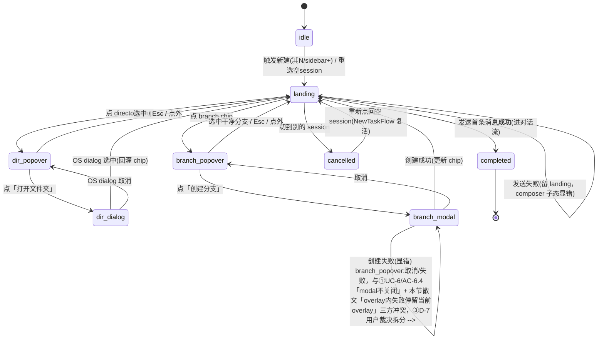
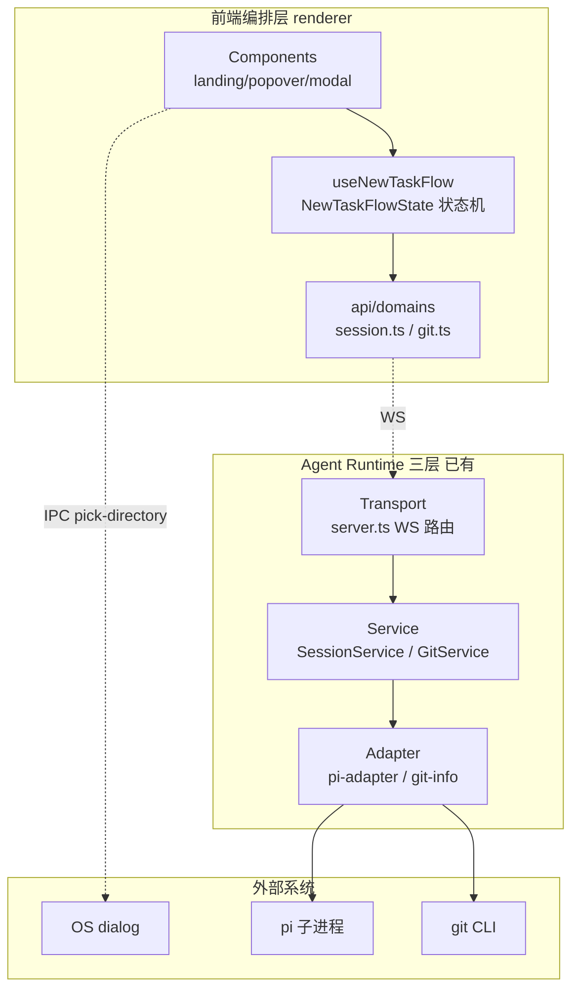
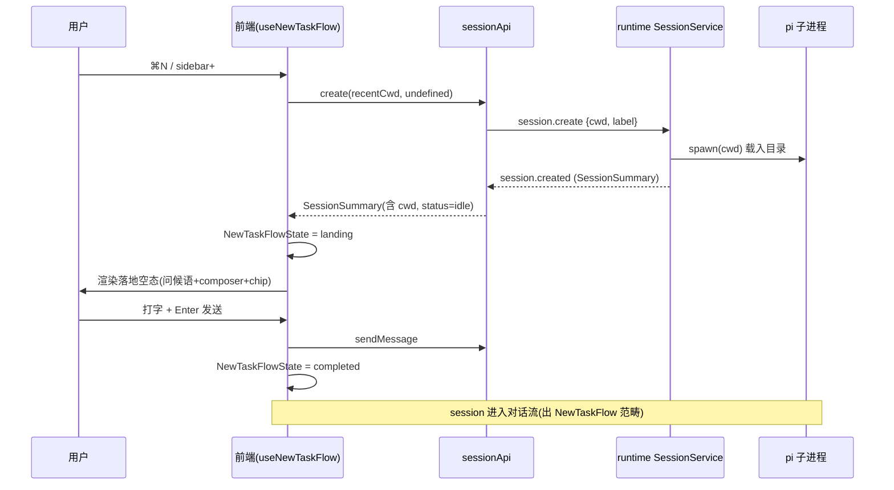
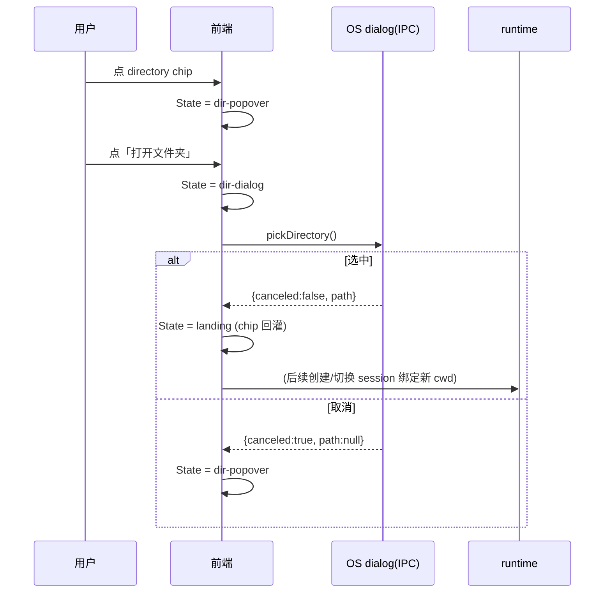

# 新建任务 · 系统架构设计

> 将 [requirements.md](./requirements.md) 的业务目标转换为系统目标，落到分层/模块/状态机/边界。
> 不进入代码级签名（属 ⑤design-code-arch）。UI 交互细节真相源是 [`docs/page-design/v3/new-task/spec.md`](../../docs/page-design/v3/new-task/spec.md)。

## 1. 目标转换

### 业务目标 → 系统目标
| 业务目标 (requirements) | 转换为系统目标 | 衡量标准 |
|------------------------|--------------|---------|
| G1 低摩擦进入「准备开聊」 | 前端 NewTaskFlow 编排层：落地空态为常态，元信息 chip 可随时改，不阻断主输入流 | 默认路径（直接打字发送）触发→发送仅 1 次点击 |
| G1.1 沿用上次上下文 | `recentWorkspaces(sessions)` 派生（distinct cwd top10）+ `resolveDefaultCwd` 纯函数 + sessionApi.create 透传 cwd（runtime 已支持，前端补全） | 非首次启动新建 session 的 cwd = 最近活跃 session 的 cwd |
| G1.2 元信息可随时调整 | NewTaskFlowState 显式状态机管理 popover/modal 嵌套，chip 状态切换不创建新东西 | 换目录/换分支是 popover 内 chip 切换，0 二次确认 |
| G2 不可逆操作显式确认 | 状态机把「创建分支」「切走 dirty 分支」升级为 modal/二次确认条 | 100% 不可逆操作经确认 |

### 搭便车改造目标
| 改造目标 | 动机 | 关联业务目标 | 状态 |
|------|------|-------------|------|
| T1: sessionApi 签名规范化 | 现状 `create(title?)` 只发 label，protocol 已支持 `{cwd,label}`，补全 cwd 透传 | G1.1 | `候选` |
| T2: git 服务职责统一评估 | git-info(读 branch 元信息) 与 GitService(status/stage/commit) 是两套服务，评估是否合并 | G2(dirty 接入) | `打回`（审查红队终裁：证伪三连显示职责正交——轻量高频读 vs 重操作是两个变化轴，合并是制造耦合；证据强度与 T3 交叉验证相当，应同处置。dirty 接入仅复用 GitService.getStatus，不合并。git-info 分层债修复价值独立于合并决策，留 ⑤评估是否补 port） |
| T3: RecentItemsStore 泛型抽象 | 评估「最近 workspace」缓存是否抽象为 `RecentItemsStore<T>` 供未来复用 | G1.1 | `打回`（交叉验证建模G-2/演进G-2：独立缓存是伪边界，降为派生函数 `recentWorkspaces(sessions)`，不抽象泛型。§7 模块表已更新） |

> **状态列语义**：`候选`=②Step1 用户表达意向，范围/风险待 ⑤骨架验证核对真实工作量；`待⑤确认`/`已纳入`/`已回流`/`打回` 见 deliverable-template。T2/T3 用户拍板全做，但证伪三连检验有 YAGNI/耦合风险，留 Step 6 红队终裁。

## 2. 设计立场

**核心计算 = 技术流程编排**（5 步 UI 状态机 + IPC 调度 + git 读取 + session 生命周期编排），**非领域规则编排**。

- 现有 runtime 三层（Transport → Service → Adapter）是稳定基座，**不新增后端分层**。
- 「新建任务」的复杂度集中在前端编排层（状态机 + overlay 嵌套管理），后端是**复用现有 session/git 服务 + 少量扩展**（cwd 透传 runtime 已具备，前端补全；dirty 接入复用 GitService.getStatus）。
- 分层决策：**三层够，不套 DDD 四层**——无复杂领域规则引擎，不需要 Application/Domain/Infrastructure 三层切分。现有 Transport→Service→Adapter 已捕获「协议变化 vs 业务编排 vs 外部适配」的不对称。

## 3. 统一语言（Ubiquitous Language）

引用项目根 [CONTEXT.md](../../CONTEXT.md)。本阶段新增/明确：

| 术语 | 定义 |
|------|------|
| **NewTaskFlow** | 「新建任务」5 步流程的前端编排单元。从触发新建到 session 发出首条消息。附着在已创建的空 session 上。 |
| **NewTaskFlowState** | NewTaskFlow 的前端 UI 状态机（显式转换表）。管理 landing 态与 popover/dialog/modal overlay 的互斥嵌套。 |
| **落地空态 (Landing)** | NewTaskFlow 的常态步骤。判据：当前 session `messageCount === 0`（派生，非 session status）。 |
| **RecentWorkspace (DTO)** | 最近用过的工作目录条目。纯数据（cwd + lastActiveAt）。**从 session list 派生 distinct cwd top10，不独立缓存**（Q1=A + D-6 打回 T3）。 |
| **directory/branch chip** | session 元信息的 composer 顶部触发器+状态显示二合一。可改但不必改。 |

## 4. 核心模型

| 模型 | 类型 | 不变式 | 建模理由 |
|------|------|--------|---------|
| **Session**（代码名 ManagedSession） | **技术实体**（非领域 aggregate，已有复用） | cwd 在 NewTaskFlow 正常路径不变；但 restore 有合法回退（cwd 不存在→homedir，`session-lifecycle.ts:145`）。status 由 isGenerating 派生（active/idle），无领域守卫方法 | 代码现状是技术封装：把 cwd/label 与运行期句柄(adapter/interceptor/unsubUsageListener)打包，字段裸 mutate（renameSession 直接赋 label）。**不强行升格为 aggregate**——新建任务复用其生命周期即可，不虚构不变式。|
| **NewTaskFlowState** | 值对象（前端 UI 状态机） | 同一时刻至多 1 个 overlay；dir-dialog 只从 dir-popover 进；branch-modal 只从 branch-popover 进 | 管理 5 步流程的 overlay 嵌套 + Esc 优先级（spec §4）。显式转换表（Q3=A）。 |
| **RecentWorkspace** | **派生视图（DTO）** | distinct cwd top10，按 lastActiveAt 倒序 | directory popover 列表项。**不独立缓存**——从 session list 派生 distinct cwd（SessionSummary 已含 cwd+lastActiveAt）。Q1=A + 交叉验证（建模G-2/演进G-2）：独立 LRU 缓存是伪边界，删除 T3。 |
| **resolveDefaultCwd** | 纯函数 | 单值：session list 中最近活跃 session 的 cwd | 新建任务默认 cwd 解析（requirements G1.1）。与 RecentWorkspace（列表视图）是两个概念：前者单值派生，后者 top10 列表。 |
| **GitInfo**（代码名 git-info） | **技术读模块（分层债）**（非值对象，已有复用） | 按 cwd 缓存 5min TTL；只读 branch/isWorktree | SessionSummary.gitBranch 数据源，已接入显示。注：git-info 是 services 层裸 execSync 的读服务（带缓存+子进程 spawn），非纯值对象，也非 port。分层债见 §6 Port 清单 + §10 D-5。 |

### 降级决策（主动不建模）
| 概念 | 为什么不建模 | 应有的处理 |
|------|------------|-----------|
| Project/Workspace aggregate | Q1=A：v1 无项目管理意图，task=session 1:1 已定 | RecentWorkspace 作派生视图，未来可增量升级 |
| empty session status | 落地空态判据是 `messageCount===0`（派生），与 session status(active/idle，描述 pi 是否生成) 正交 | 不改 SessionStatus 枚举；前端用消息数派生落地空态 |
| NewTask 领域服务 | 核心计算是编排非规则，无复杂不变式守卫 | 编排逻辑放前端 composable，不入 runtime Service 层 |
| RecentWorkspaceCache（独立 LRU 缓存） | **[交叉验证 打回 T3]** SessionSummary 已含 cwd+lastActiveAt，distinct cwd top10 可从 session list 派生，独立缓存是伪边界（建模G-2/演进G-2 交叉命中）。deletion test：删缓存→改从 session list 派生，复杂度不塌缩→边界多余 | 改为派生函数 `recentWorkspaces(sessions): RecentWorkspace[]`，无持久化模块 |

> **落地空态判据数据源（建模G-5 闭合）**：`SessionSummary`（shared）无 messageCount 字段；派生源是前端 `chat` store 的 `messages: Map<sessionId, Message[]>`（getHistory 按需加载）。判据：`当前 session && messages.size === 0 && !isGenerating`，未加载（messages 未 hydrate）视为空。重选历史空 session 时有 getHistory 加载窗口，判据在 hydrate 完成前乐观视为空。

## 5. 状态流转

### NewTaskFlowState（前端 UI 状态机，显式转换表）



**Status 枚举**（只描述阶段）：`idle | landing | dir-popover | branch-popover | dir-dialog | branch-modal | completed | cancelled`（8 态）

> **cancelled 不再是终态**（建模G-4 闭合）：代码现状空 session 创建后永久保留（无自动清理，除非用户手动 delete）。故空 session 可被重选 → NewTaskFlow 复活（`cancelled → landing`）。真正不可逆终态只有 `completed`（session 进入对话流，NewTaskFlow 销毁）。

**Reason 字段**：本状态机**不引入 Reason**——`completed` 是唯一终态，无多失败原因需正交。失败处理（建模G-3 闭合）：
- **主流程发送失败**：折叠为 `landing` 的 composer 子态（错误提示+允许重试），flow 状态不变，**不产新终态**。
- **overlay 内失败**（创建分支失败/git 读失败）：停留在当前 overlay，不改 flow 状态。
两种失败都不改变 NewTaskFlowState，故无需 Reason 字段。

**终态集合（不可逆）**：仅 `completed`（session 进入对话流，NewTaskFlow 销毁）。

**不变式守卫**：
- overlay 互斥：`dir-popover`/`branch-popover`/`dir-dialog`/`branch-modal` 四者至多 1 个 active（spec §4「同一时刻只有一层」）
- 深模态来源约束：`dir-dialog` 只从 `dir-popover` 进；`branch-modal` 只从 `branch-popover` 进
- `landing` 是唯一「无 overlay」的可交互态
- **非 git 目录约束（UC-7）**：当 `gitInfo == null`（非 git 目录）时，`branch-popover`/`branch-modal` 不可达、branch chip 隐藏。landing 按当前 session cwd 的 gitInfo 派生 chip 可见性，非 git 目录下状态机实际只走 `idle ↔ landing ↔ dir-popover ↔ dir-dialog` 子集。

### Session 生命周期（已有，复用）
Session 状态机**不变**（`active | idle`，由 isGenerating 派生）。新建任务引入的业务里程碑：
- **create**：触发新建即创建空 session（绑定 cwd），status=`idle`（isGenerating=false）
- **首条消息**：empty→chatting 的业务里程碑，session 进入对话流，status 转 `active`（isGenerating=true）

落地空态判据 = `当前选中 session && session.messageCount === 0 && !isGenerating`（前端派生，非 status 字段）。

## 6. 分层架构

### 层级图



**职责**：
- **前端编排层**（新增/扩展）：NewTaskFlowState 状态机 + landing/popover/modal 组件 + RecentWorkspace 缓存。复杂度归位：UI 编排在前端，不污染 runtime。
- **Transport**（已有）：WS 消息路由，无业务逻辑。
- **Service**（已有+少量扩展）：SessionService（cwd 透传已支持）、GitService（getStatus 复用接入 dirty）。
- **Adapter**（已有）：pi-adapter（pi RPC）、git-info（branch 读）。

### Port 清单
| Port | 价值定位 | 实现数 | 备注 |
|------|---------|--------|------|
| OS DirectoryPicker | 真 seam：OS 依赖（权限/原生体验/平台差异） | 1（Electron dialog） | `pick-directory` IPC 已存在，前端接入 |
| pi RpcClient | 真 seam：pi 协议变化隔离 | 1 | 已有，cwd 透传已支持 |
| **git CLI（GitService 经 IGitExecutor）** | 真 seam：外部进程 + 写操作隔离 | 1 | 已有，但**能力集缺口**：GitCommand 白名单(status/add/reset/commit/diff/rev-parse) 无 branch/checkout，UC-6 创建分支需扩 port（见 §7 GitService.createBranch） |
| WS Transport | 真 seam：进程边界 + 序列化 | 1 | 前端↔runtime 唯一通道 |

> **git-info 不是 port（结构G-1 闭合）**：`services/git-info.ts` 在 services 层裸 `execSync('git ...')`（无 interface、直连 child_process），是**裸 IO 便利模块 + 分层债**，非 port。证伪三连全崩（删概念照跑/单向非 port/可随意平移）。文档原 Port 清单把它美化为「真 seam」是错误，现修正。这是现状债（非本文档引入），T2 红队评估是否补 IGitExecutor port 覆盖读路径。

## 7. 模块划分与变化轴

| 模块 | 职责 | 变化轴（会因为什么改） | 层 | LOC(预估) |
|------|------|----------------------|----|----------|
| `useNewTaskFlow` composable | NewTaskFlowState 状态机 + overlay 嵌套管理 + Esc 优先级 + 默认 cwd 解析调度 | UI 交互流程变化（编排中心，承担状态机/overlay/IPC 调度子轴） | 前端 | ~200（演进G-1 重估） |
| landing 组件 (`Landing*.vue`) | 落地空态渲染：watermark + 问候语 + composer 元信息行；**按 gitInfo 派生 branch chip 可见性（非 git 目录隐藏，UC-7）** | 视觉/文案变化 + chip 可见性派生 | 前端 | ~200 |
| directory popover (`DirSelect.vue`) | 步骤2 最近 workspace 列表 + 「打开文件夹」「远程连接」 | 列表交互/动作项 | 前端 | ~150 |
| branch popover (`BranchSelect.vue`) | 步骤3 分支列表 + dirty 标记 + 二次确认条；**unborn HEAD（git 仓库无首次提交）显示空态文案 + 引导首次 commit（F8/AC-4.3）** | 分支交互/dirty 处理 | 前端 | ~180 |
| create-branch modal (`CreateBranchModal.vue`) | 步骤4b 分支名表单 + 校验 + 提交 | 分支创建逻辑 | 前端 | ~130 |
| `recentWorkspaces` 派生函数 | `recentWorkspaces(sessions): RecentWorkspace[]` distinct cwd top10（从 session list 派生，无独立缓存） | 派生逻辑（随 session schema 变） | 前端 | ~20（T3 打回：从独立缓存降为派生函数） |
| `resolveDefaultCwd` 纯函数 | session list 中最近活跃 session 的 cwd（单值） | 默认值解析逻辑 | 前端 | ~10 |
| `sessionApi` 扩展 | `create(cwd?, label?)` 签名补 cwd（T1） | 协议字段扩展 | 前端 transport | ~10 |
| `useSidebar.newSession` 扩展 | 5 触发点接入选目录/沿用 cwd 逻辑 | 触发入口变化 | 前端 composable | ~30 |
| SessionService（已有） | session 生命周期，cwd 透传已支持 | 无需改（runtime 契约稳定） | runtime Service | 0 |
| **GitService.createBranch 扩展（UC-6）** | 新增 createBranch 方法 + 扩 GitCommand 白名单(+branch/-b) + protocol 消息 git.createBranch + GitMessageHandler case | port 能力集扩展（结构G-2/G-5 闭合） | runtime Service | ~40（重估，非原 5） |
| GitService（已有） | getStatus 复用接入 branch popover dirty（接入调用点新增） | 接入调用点新增 | runtime Service | ~5 |
| git-info（已有） | branch/isWorktree 读，5min cache。**分层债**：services 层裸 execSync，非 port | 无需改（与 GitService 职责正交，T2 评估是否补 port） | runtime（裸 IO） | 0 |

> **变化轴单一性**：每个模块只承担一个变化轴。landing 组件只随视觉变，状态机只随交互流程变，缓存只随策略变——UI 视觉、交互流程、数据策略是三个正交变化轴，分别归位。useNewTaskFlow composable 的 4 项职责（状态机/overlay 嵌套/Esc 优先级/cwd 解析调度）是「UI 交互流程」单一变化轴的不同切面；cwd 解析已外置为 `resolveDefaultCwd` 纯函数（§7 单列），Esc 优先级可视复杂度拆为 `useOverlayEsc` 子 composable，非上帝对象。

## 8. 系统间上下文边界（Context Map）

```mermaid
flowchart LR
  XYZ[新建任务流程<br/>(xyz-agent)]
  OS[OS 原生目录选择器]
  PI[pi 引擎<br/>(xyz-pi fork)]
  GIT[(本地 git)]
  XYZ -.客户-供应商.-> OS
  XYZ -.客户-供应商.-> PI
  XYZ -.客户-供应商.-> GIT
```

| 关联系统 | 关系模式 | 交互方式 | 契约稳定性 |
|---------|---------|---------|-----------|
| OS 目录选择器 | 客户-供应商（xyz 是客户，OS 提供原生 picker） | Electron `dialog.showOpenDialog` IPC | 稳定（OS 标准 API） |
| pi 引擎 | 客户-供应商（xyz fork，自有可控） | session.create 传 cwd，pi 子进程载入目录 | 稳定（自有 fork） |
| 本地 git | 客户-供应商（git CLI 是外部标准） | 经 cwd 执行 git 命令读分支/dirty | 稳定（git CLI 协议） |

> 无「遵奉者/防腐层」关系——三个外部系统契约都稳定，xyz 直接消费，不需要 ACL。

## 9. 泳道图（Swimlane）

**主流程：触发新建 → 落地空态 → 直接发送（默认路径）**



**选目录子流程（步骤2→4a）**



## 10. 挑战与决策

### D-1: 核心计算定位为「技术编排」而非「领域规则」
**张力**: 新建任务是否需要 DDD 四层（Application/Domain/Infrastructure）？
**决策**: 三层够，不套四层。
**理由**: 核心是 UI 状态机 + IPC 编排，无复杂领域规则引擎。现有 Transport→Service→Adapter 已捕获协议/业务/适配的不对称。加四层是零价值空壳层（层边界代价与捕获的不称不匹配）。

### D-2: RecentWorkspace 建 DTO 不建 aggregate（Q1=A）
**张力**: 未来是否演化成「项目」概念？
**决策**: 派生视图 DTO（从 session list 派生 distinct cwd top10，不独立缓存）。
**理由**: task=session 1:1 已定，spec.md 无项目管理意图。DTO→aggregate 升级可逆（加字段），aggregate→DTO 降级难。YAGNI。缓存机制见 D-6（打回独立缓存，改派生）。

### D-3: 落地空态判据用 messageCount 派生，不引入 empty status
**张力**: 新建空 session 与历史 idle session 如何区分？
**决策**: `messageCount === 0 && !isGenerating` 派生，不改 SessionStatus 枚举。
**理由**: SessionStatus(active/idle) 描述「pi 是否在生成」，与「有无消息」正交。强行加 empty 会把两个正交维度揉进一个枚举（状态机不纯）。派生判据干净且零后端改动。

### D-4: NewTaskFlowState 显式转换表（Q3=A）
**张力**: 5 步 overlay 嵌套用显式状态机还是松散 ref？
**决策**: 显式转换表，非法转换抛错。
**理由**: spec §4 边缘态「Esc 优先级/overlay 互斥（同一时刻只一层）」需要代码级保证。松散 ref 在 popover+modal 嵌套时易出 bug。显式表成本不高（8 态 + ~17 转换）。

### D-5: git 服务维持分离，不合并（T2 打回）
**张力**: git-info(读元信息) 与 GitService(status/stage/commit) 是否合并？
**决策（审查红队终裁，从候选降为打回）**: 维持分离，v1 不补 port。
**理由**: 证伪三连「删 git-info」→复杂度仍分散（轻量高频读 vs 重操作是两个变化轴）→模块边界真实，合并是制造耦合。证据强度与 T3 交叉验证相当，应同处置（T3 打回则 T2 亦打回）。dirty 接入 popover 仅复用 GitService.getStatus，不动 git-info。
**⚠️ 层边界补充（结构G-3 闭合）**：D-5 的 deletion test 只判定「模块边界」（合并 vs 分离），**不涵盖「层边界」**。git-info 在 services 层裸 execSync（直连 child_process）是独立的分层泄漏问题（§6 Port 清单已修正）。此分层债的修复价值独立于合并决策——是否补 IGitExecutor port 覆盖读路径留 ⑤code-arch 评估，不在本轮搭便车范围。
**特化**: 违反「相似概念应内聚」直觉，但合理——读写频率/失败域/缓存策略不同。

### D-6: RecentWorkspace 从独立缓存降为派生函数（T3 打回）
**张力**: 「最近 workspace」是否独立 LRU 缓存 + 是否抽象 `RecentItemsStore<T>` 泛型？
**决策（追踪后修正）**: **打回 T3 候选，从独立缓存降为派生函数，不抽象泛型。**
**理由**: 交叉验证（建模G-2/演进G-2 两组独立命中）：SessionSummary 已含 cwd+lastActiveAt，distinct cwd top10 可从 session list 派生（`recentWorkspaces(sessions)`），独立缓存是伪边界（deletion test 删缓存→改派生，复杂度不塌缩→边界多余）。泛型抽象同理 YAGNI（单一用例）。
**说明**: Step 1 用户意向=T3 做，但独立追踪的交叉验证证据推翻（这是 loop 机制设计的价值——独立 subagent 发现主 agent+用户的确认偏误）。Step 6 红队复核此降级。

## 11. 反模式检查（grep 验收清单）

机器可检查的 AC：
### AC-1: session.create 前端必须透传 cwd（T1 完成标志）
- 验证：`grep -n "session.create" src-electron/renderer/src/api/domains/session.ts` 的 payload 含 cwd
### AC-2: NewTaskFlowState 非法转换抛错（D-4 落地）
- 验证：`grep -rn "throw\|invalid.*transition\|非法转换" src-electron/renderer/src/composables/ --include="useNewTaskFlow*"` 有守卫
### AC-3: newSession 触发点均经 useNewTaskFlow（不裸调 sessionApi.create）
- 验证：`grep -rn "sessionApi.create\|newSession" src-electron/renderer/src/components/` 无直接 sessionApi.create（经 composable）。实际触发点（演进G-4 修正）：Sidebar.vue:200/232、SessionList.vue:44（emit）、PanelHeader.vue:71（emit）、Workspace.vue:46、Overview.vue:95、PanelContainer.vue:69（newSessionToStandby）。注：SearchModal.vue **不**含 newSession 调用（原初稿误列）
### AC-4: overlay 互斥（同一时刻至多 1 个）
- 验证：NewTaskFlowState 是单值 enum（非 4 个 boolean flag）— `grep -c "ref<" src-electron/renderer/src/composables/**/useNewTaskFlow*` overlay 状态为单 ref
### AC-5: runtime SessionStatus 枚举不变（D-3，不引入 empty）
- 验证：`grep "SessionStatus" src-electron/shared/src/session.ts` 仍为 `'active' | 'idle'`
### AC-6: NewTaskFlowState 终态唯一为 completed（D-4 + G-4 闭合）
- 验证：状态机定义中 `cancelled` 非终态（有 `cancelled --> landing` 重入边），唯一终态 `completed`。落地空态判据 `messageCount===0 && !isGenerating` 派生自 chat store messages Map（非 SessionSummary）

## 12. 行为契约保持清单（refactor 模式）

> 重构要保持现有行为等价。「代码有但 requirements 没写」的行为逐条列出，架构变更与行为变更分离。
> 以下 BC 基于 [scout 代码全景](./changes/) 核实，源码位置见各条。

### BC-1: session.create 协议层支持 cwd（runtime 契约稳定）
| 字段 | 内容 |
|------|------|
| 源码位置 | `src-electron/shared/src/protocol.ts:50`（`'session.create': { cwd?: string; label?: string }`） |
| 处理 | **保持**。runtime cwd 透传契约是稳定基座，T1 仅前端补全，不动 runtime。 |
| 冲突 | 无 |

### BC-2: cwd 缺省回退 process.cwd()（runtime 进程目录）
| 字段 | 内容 |
|------|------|
| 源码位置 | `src-electron/runtime/src/services/session/session-lifecycle.ts:42`（`cwd ?? process.cwd()`） |
| 处理 | **变更(→独立 ticket/搭便车 T1)**。前端补 cwd 透传后，新建任务默认传「最近活跃 cwd」而非依赖 runtime 回退。runtime 回退逻辑保留（防御性默认）。 |
| 冲突 | 无（前端补全后回退逻辑极少触发，但保留合理） |

### BC-3: label 缺省回退 basename(sessionCwd)
| 字段 | 内容 |
|------|------|
| 源码位置 | `src-electron/runtime/src/services/session/session-lifecycle.ts:77` |
| 处理 | **保持**。新建任务不强制 label，沿用目录名默认合理。 |
| 冲突 | 无 |

### BC-4: 新 session 持久化 cwd 到 session 文件 header
| 字段 | 内容 |
|------|------|
| 源码位置 | `src-electron/runtime/src/services/session/session-lifecycle.ts`（`ensureSessionFile`） |
| 处理 | **保持**。重启后 scanPiSessions 可恢复 cwd 分组，是 session 按 cwd 分组的前提。 |
| 冲突 | 无 |

### BC-5: create 成功后 broadcastSessionList 推全量 SessionGroup[]
| 字段 | 内容 |
|------|------|
| 源码位置 | `src-electron/runtime/src/services/session/session-service.ts`（broadcastSessionList） |
| 处理 | **保持**。前端 session store 按 cwd 分组依赖此广播，sidebar/panel/overview 分支显示靠它刷新。 |
| 冲突 | 无 |

### BC-6: git-info(branch/isWorktree) 已接入 SessionSummary 显示
| 字段 | 内容 |
|------|------|
| 源码位置 | `session-service.ts:211` toSummary 调 readGitInfo；渲染于 Sidebar.vue:91 / SessionItem.vue:23 / PanelHeader.vue:38 / SessionCard.vue:27 |
| 处理 | **保持**。branch 显示已工作，T2 评估合并时不得破坏此行为。 |
| 冲突 | 无 |

### BC-7: pick-directory IPC 已完整接线但零调用
| 字段 | 内容 |
|------|------|
| 源码位置 | `src-electron/main/gateway/privileged-handlers.ts:42-58`（handler）；`src-electron/preload/preload.ts:87`（invoke，演进G-6 修正路径）；renderer 下零调用方 |
| 处理 | **变更(→新建任务功能本体)**。落地页「打开文件夹」接入此 IPC。handler 行为保持（openDirectory + 依赖 getFocusedWindow）。 |
| 冲突 | 无 |

### BC-8: newSession 触发点全部无参调 useSidebar.newSession()（演进G-4 修正）
| 字段 | 内容 |
|------|------|
| 源码位置 | `Sidebar.vue:200,232` / `SessionList.vue:44`(emit) / `PanelHeader.vue:71`(emit) / `Workspace.vue:46` / `Overview.vue:95` / `PanelContainer.vue:69`(newSessionToStandby) |
| 处理 | **变更(→新建任务功能本体)**。统一改为经 useNewTaskFlow composable 编排（接入选目录/沿用 cwd）。useSidebar.newSession/newSessionToStandby 退化为 composable 的薄封装。 |
| 冲突 | 无。注：原初稿误列 SearchModal.vue:119（该文件不含 newSession 调用，已核实修正） |

### BC-9: 无「最近 workspace」缓存逻辑（grep 零命中）
| 字段 | 内容 |
|------|------|
| 源码位置 | `src-electron/` 下 grep `recentWorkspace`/`recentCwd`/`lastWorkspace` 零源码命中 |
| 处理 | **新增(→新建任务功能本体)**。新建 `recentWorkspaces(sessions)` 派生函数（D-6 打回后：不建独立缓存模块，从 session list 派生 distinct cwd top10）。无现有行为需保持。 |
| 冲突 | 无 |

### BC-10: 无 landing 空态引导组件（新建即进空 chat）
| 字段 | 内容 |
|------|------|
| 源码位置 | `Panel.vue:29,42`（`v-if="sessionId"` 无 landing 分支）；Composer.vue 无 welcome/emptyState |
| 处理 | **变更(→新建任务功能本体)**。新增 landing 组件，落地空态判据 messageCount===0（D-3）。 |
| 冲突 | 无 |

### BC-11: forkSession 调用 sessionApi.create() 无参（演进G-5 补）
| 字段 | 内容 |
|------|------|
| 源码位置 | `src-electron/renderer/src/composables/features/useSidebar.ts:223`（forkSession 内 `await sessionApi.create()`，函数声明于 212） |
| 处理 | **变更(→独立 ticket，T1 波及)**。forkSession 是 fork 会话（截取历史），T1 改 sessionApi.create 签名后会受影响。fork 场景的 cwd 应取源 session 的 cwd（非最近活跃），需在 T1 扩展签名时一同处理，不裹进新建任务功能本体 PR。 |
| 冲突 | 无 |

### BC-12: git-info 在非 git 目录返回 null → branch chip 隐藏（UC-7 既有行为保持）
| 字段 | 内容 |
|------|------|
| 源码位置 | `session-service.ts:211` toSummary 调 `readGitInfo(s.cwd)`（非 git 目录返回 undefined）；渲染层 Sidebar.vue:91 / SessionItem.vue:23 / PanelHeader.vue:38 / SessionCard.vue:27 判空隐藏 branch |
| 处理 | **保持**。新建任务 landing 组件复用此行为：branch chip 按 `gitInfo == null` 派生可见性，非 git 目录隐藏 chip 且 branch-popover/branch-modal 不可达（§5 不变式）。 |
| 冲突 | 无 |

## 下游衔接

### 喂给 Step 3（Issue 拆分）的部分
| 本文档章节 | issue 拆分用途 |
|-----------|--------------|
| §1 搭便车表 | T1 候选 issue（P2）；**T2/T3 已打回**（T2 职责正交不合并 / T3 交叉验证降为派生函数，均不再成 issue） |
| §7 模块划分 | 每模块一个 issue（前端组件组 + composable + 缓存 + API 扩展） |
| §12 行为契约 BC-7~BC-12 | 「新建任务功能本体」issue 群（变更新增项）+ BC-11 forkSession 独立 ticket + BC-12 UC-7 非 git 既有行为保持 |
| §11 grep AC | 每个 issue 的验收标准来源 |
| §5 NewTaskFlowState | composable issue 的核心实现规格 |

## 待确认 / 移交下游

- **[移交⑤code-arch] Obs-B NewTaskFlow 实例模型**：`cancelled` 与 `idle` 的「重选空 session」入边语义重叠，区分依赖 NewTaskFlow 是单实例（全局）还是每空 session 一个实例。当前建模可辩护（§5 状态机按单实例设计），最终裁决推迟到 ⑤code-arch 骨架验证。
- **[移交⑤code-arch] git-info 分层债处置**：git-info 在 services 层裸 execSync，是否补 IGitExecutor port 覆盖读路径，具体 port 签名设计属 ⑤（T2 已打回不做合并，但分层债修复价值独立）。
- **[T2 已打回] git 服务统一**：审查红队终裁打回——证伪三连显示职责正交，合并是制造耦合。不再成搭便车候选。
- **[待⑤骨架验证] T1 sessionApi 签名规范化真实工作量**：BC-11 forkSession 波及范围（源 session cwd 取值）需 ⑤ 骨架核对。
