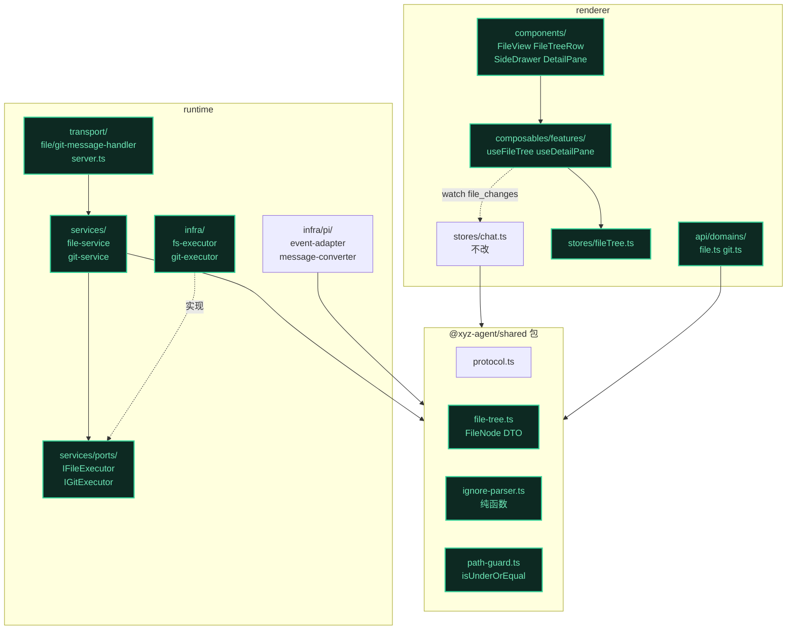
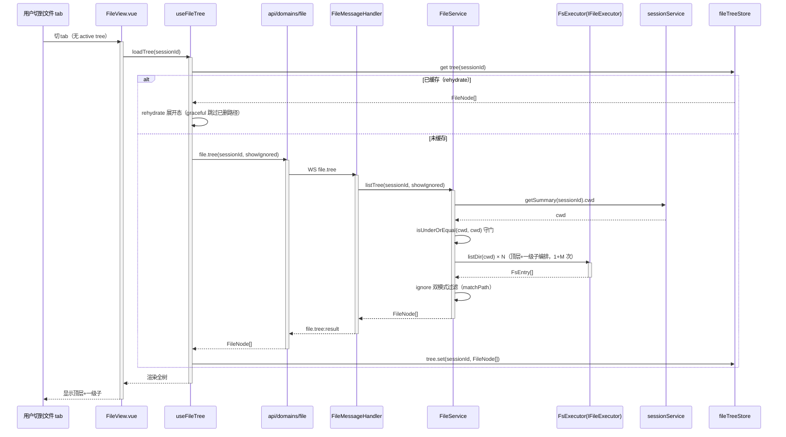
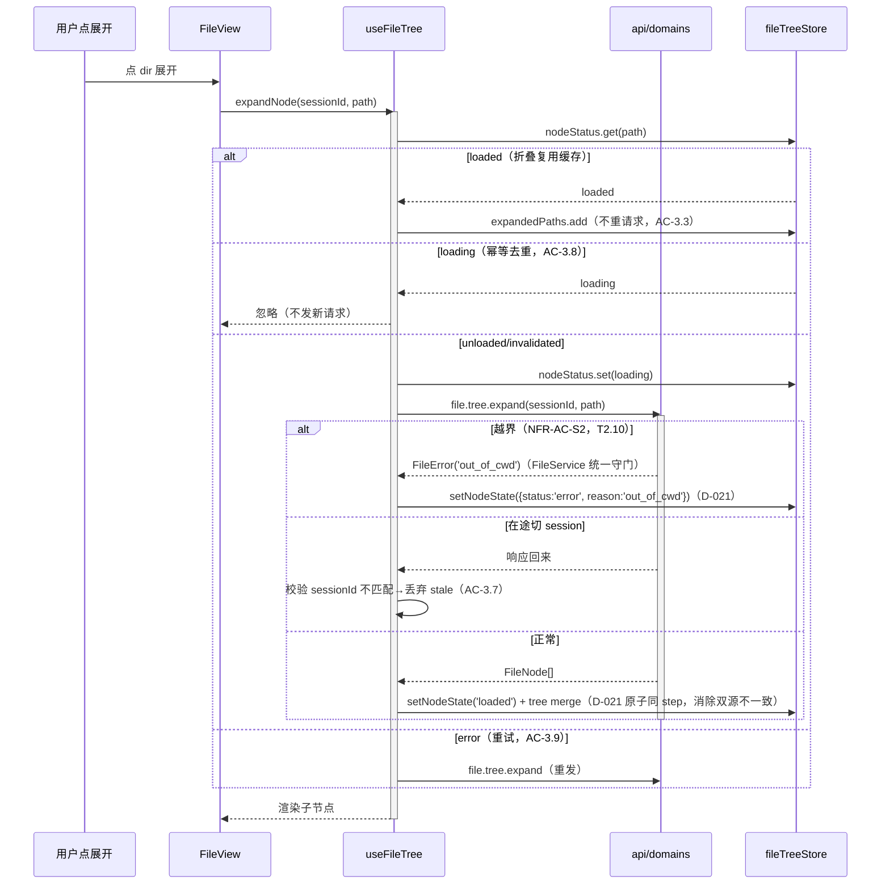
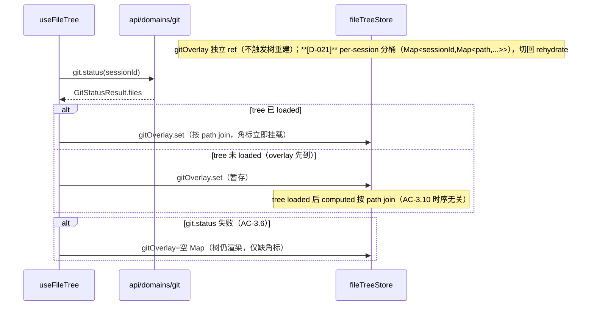
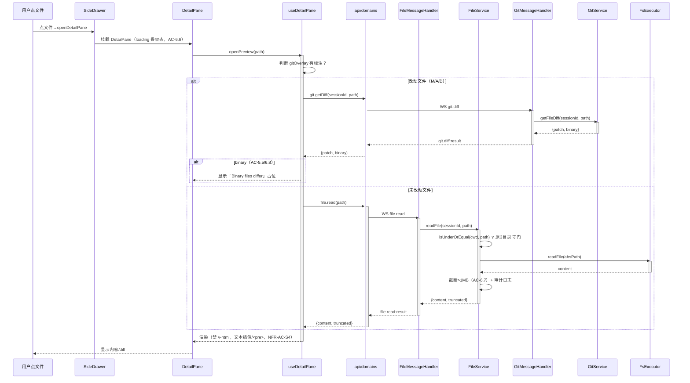
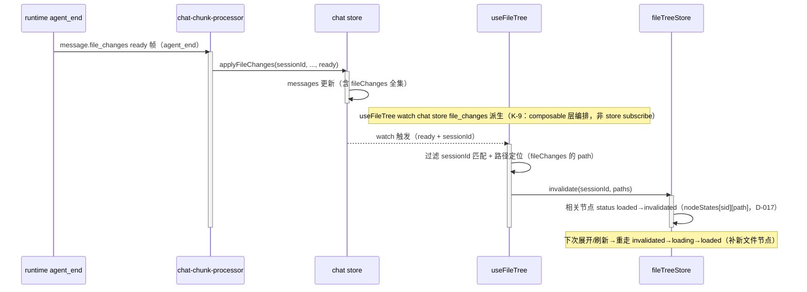

# 代码架构设计 — 全项目文件树

> 承接 ②architecture（§6 port / §7 模块 / §11 grep AC）+ ③issues（16 issue，11 个已决策本轮落地）+ ④NFR（7 NFR-AC + 24 骨架约束 + K-9 反哺）。
> **D-001~D-020 全部 confirmed**，本阶段不重新确认；L1 档（complexity_tier），主 agent 直读决策。
> **refactor 场景**：新设计与现有代码（runtime 三层 + 前端 store/composable/component）共存迁移，§7 列处置。

**语言/栈**：TypeScript（runtime Node.js + renderer Vue 3）。shared 类型放 `@xyz-agent/shared` 包（`src-electron/shared/src/`），runtime/前端均 `import from '@xyz-agent/shared'`（实证现有 git-service.ts:20 范式）。

**接线层级标注**（供 Step 7 分层接线）：签名表每方法标 `[L1-接线]`（模块内真接线）/ `[叶子]`（throw NotImplementedError）/ `[adapter]`（真引 SDK）/ `[port]`（interface 定义）。

## 1. 工程目录

> 从 ②§7 模块划分推导。runtime 三层（transport→services→infra）+ shared 包 + 前端（stores/composables/api/components）。**`✚新` = 新建，`✱改` = 改现有，`►迁` = 迁移**。

```
src-electron/
├── shared/src/                          # @xyz-agent/shared 包（跨 runtime/前端 共享契约）
│   ├── protocol.ts              ✱改     # +file.tree/expand/read/write.* +git.diff 消息类型（#1/#5/#14）
│   ├── file-tree.ts             ✚新     # FileNode DTO + FileNodeType enum（#1，D-012 不含 gitStatus；D-020 ignored?）
│   ├── ignore-parser.ts         ✚新     # compileIgnoreRules/matchPath 纯函数（#1，D-013 纯函数无 IO）
│   ├── path-guard.ts            ✚新     # isUnderOrEqual（►迁自 runtime/utils/path-utils.ts，#1 F2）
│   ├── message.ts               ✱改     # （FileChange 已存在，无改动；仅引用确认）
│   └── index.ts                 ✱改     # 导出新类型
├── runtime/src/
│   ├── transport/
│   │   ├── file-message-handler.ts ✚新 # file.tree/expand/read/write.* 路由（#2/#14）
│   │   ├── git-message-handler.ts  ✱改 # +git.diff 路由（#5）
│   │   └── server.ts               ✱改 # file.read 内联→委托 FileService（#7 解三层违纪）
│   ├── services/
│   │   ├── file-service.ts         ✚新 # FileService 编排：cwd/越界/懒加载/ignore 双模式/readFile（#2/#7/#16）
│   │   ├── git-service.ts          ✱改 # +getFileDiff（#5，含 K-6 新增越界校验）
│   │   ├── ports/
│   │   │   ├── file-executor.ts    ✚新 # IFileExecutor port（listDir/stat/readFile，#2 D-008）
│   │   │   └── git-executor.ts     ✱改 # 白名单已含 'diff'（实证已就位，#5 复用）
│   │   └── session/                       # sessionService（FileService 依赖 getSummary 拿 cwd）
│   ├── infra/
│   │   ├── fs-executor.ts          ✚新 # node:fs/promises 实现 IFileExecutor（#2）
│   │   └── git-executor.ts         ✱改 # +diff 命令实现（实证 execFileSync 数组范式，#5）
│   ├── infra/pi/
│   │   ├── event-adapter.ts        ✱改 # createAdapter 注入 cwd（#8 BC-5）
│   │   └── message-converter.ts    ✱改 # convertPiHistory 还原 fileChanges（#9 BC-6，⑤验证 pi 数据）
│   ├── index.ts                    ✱改 # createAdapter 调用点注入 session.cwd（#8）
│   └── utils/path-utils.ts         ✱改 # isUnderOrEqual ►迁出（保留 re-export 兜底兼容，#1 F2）
└── renderer/src/
    ├── api/domains/
    │   ├── file.ts                 ✚新 # file.tree/expand/read WS 封装（#3）
    │   └── git.ts                  ✱改 # +getDiff 封装（#5）
    ├── stores/
    │   ├── fileTree.ts             ✚新 # FileTreeState 4 facet + invalidate 接口（#3，K-9 反哺）
    │   ├── chat.ts                 —   # 不改（K-9：file_changes 经 chat-chunk-processor，不直接 import）
    │   └── chat-chunk-processor.ts —   # 不改（file_changes 入口，applyFileChanges 回调）
    ├── composables/features/
    │   ├── useFileTree.ts          ✚新 # 拉/展开/选中/过滤编排 + 跨 store 失效编排（#3，K-9）
    │   └── useDetailPane.ts        ✚新 # 预览触发/视图切换/diff 读取（#6）
    ├── components/sidebar/
    │   ├── FileView.vue            ✱改 # 全树渲染重写（#4，删本地 TreeNode 用 shared FileNode）
    │   └── FileTreeRow.vue         ✱改 # 递归行重写（#4，删本地 TreeNode）
    └── components/panel/
        ├── SideDrawer.vue          ✱改 # +detail tab + 挂载 DetailPane（#6）
        └── DetailPane.vue          ✚新 # 文件内容/diff 预览（#6，对齐 draft-detail-pane）
```

**依赖方向**（②§6 三层铁律）：
- `transport/` → `services/`（经 port interface）→ `infra/`（adapter 实现 port）；`shared/`（纯函数/类型）被三层 + 前端共引
- **services 不 import infra 的 IO 实现**（②§11 AC-1；纯函数 parser 豁免：shared/ignore-parser、shared/path-guard 属 shared 非 infra）
- **transport 不碰 node:内置**（②§11 AC-2b；file.read 重构后下沉 FileService）
- **前端 stores 间禁止互相 import**（`stores/chat.ts` + `stores/sidebar.ts` 顶部注释明文；K-9 反哺：跨 store 编排在 composables 层）

## 2. 包依赖图



**import 规则**：
- **无循环依赖**：transport→services→infra 单向；shared 被引不引业务；前端 stores 间不互引（K-9）。
- **跨 store 编排在 composable 层**：`useFileTree` `watch` chat store 的 file_changes 派生 → 派发 fileTree store 的 `invalidate`（不违反 stores 间禁 import）。
- **循环检测点**：composablesFE → chatStore 是单向 watch（chatStore 不反向 import composables），无环。

## 3. API 契约（签名表）

> Deep Module 词汇：Interface（caller 须知）/ Depth（deletion test）/ Seam（port 位置）/ Adapter（填槽物）。
> 可测性三原则：accept deps / return results / small surface。

### 模块: shared（@xyz-agent/shared 包）

#### 类: FileNode（DTO，②§4，D-012 不含 gitStatus）

| 方法/字段 | 签名 | 返回 | 边界条件 | Spec/Issue 关联 |
|---------|------|------|---------|----------------|
| `FileNode`（type） | `{ path: string; name: string; type: 'dir'\|'file'; children?: FileNode[]; size?: number; ignored?: boolean }` | DTO | type 限定 dir/file；children 仅 dir 有；ignored 仅 showIgnored=true 时填（D-020） | #1 AC-1.1, #16 |
| `compileIgnoreRules` | `(content: string) => IgnoreMatcher` `[纯函数]` | IgnoreMatcher | content 空→空 matcher | #1 AC-1.3 |
| `matchPath` | `(matcher: IgnoreMatcher, path: string) => boolean` `[纯函数]` | boolean | 无 node:fs import | #1 AC-1.3, #16 AC-16.5 |
| `isUnderOrEqual` | `(parent: string, child: string) => boolean` `[纯函数]` `[叶子]` | boolean | **词法判定**（relative+resolve，不解析 symlink，④K-1 残余）；►迁自 utils/path-utils.ts | #1 AC-1.2, F2 |

> **NFR 回灌到契约**：FileNode 加 `ignored?`（④D-020）；isUnderOrEqual 标注词法特性（④K-1）。

### 模块: services（runtime 编排层）

#### FileError（新建错误类型，§6 测试断言的类型锚点）

```typescript
export type FileErrorCode = 'session_not_found' | 'permission_denied' | 'out_of_cwd' | 'timeout' | 'not_found' | 'read_failed'
export class FileError extends Error {
  constructor(readonly code: FileErrorCode, message?: string) { super(message ?? code) }
}
```
> 与现有 `GitError`（git-service.ts:29）范式对称。FileService 所有越界/权限/超时失败抛 FileError(code)，§6 来源 B NFR-AC-S2/S5 断言按 code 锚定。

#### 类: FileService（新，②§7，D-008 三层+port）

| 方法 | 签名 | 返回 | 边界条件 | 接线层级 | Spec/Issue |
|------|------|------|---------|---------|-----------|
| `constructor` | `(opts: { executor: IFileExecutor; sessionService: ISessionService })` | — | accept deps（可测性） | `[L1-接线]` | #2 |
| `listTree` | `(sessionId: string, showIgnored?: boolean) => Promise<FileNode[]>` | FileNode[]（顶层+一级子） | session 不存在→FileError('session_not_found')；cwd 无权限→FileError('permission_denied')；越界→FileError('out_of_cwd')；ignore 双模式（#16） | `[L1-接线]` | #2 AC-2.1/2.2/2.4, #16 |
| `expandDir` | `(sessionId: string, path: string, showIgnored?: boolean) => Promise<FileNode[]>` | FileNode[]（单层子） | 越界→FileError('out_of_cwd')（**NFR-AC-S2**，统一守门）；超时→FileError('timeout') | `[L1-接线]` | #2 AC-2.3/2.5 |
| `readFile` | `(sessionId: string, path: string) => Promise<{ content: string; truncated: boolean }>` | content + 截断标志 | 越界（cwd 外且非原3目录）→FileError('out_of_cwd')；>1MB 截断（AC-6.7）；审计日志（NFR ④） | `[L1-接线]` | #7 AC-7.1/7.3 |
| `createFile` / `renameFile` / `deleteFile` | `(sessionId, ...) => Promise<never>` | 抛 NotImplementedError | 骨架（#14，G4 实现延后）；返回结构化「待实现」（AC-14.4） | `[叶子]` | #14 AC-14.2/14.4 |

> **接线**：listTree/expandDir 内部 `this.executor.listDir()` + `isUnderOrEqual(cwd, path)`（shared 纯函数）+ `matchPath()`（ignore 过滤）+ `this.opts.sessionService.getSummary(sessionId).cwd`。
> **越界统一守门**（NFR-AC-S2）：listTree/expandDir/readFile 入口都调 isUnderOrEqual（不只 file.read）。

#### 类: GitService（改，扩 getFileDiff）

| 方法 | 签名 | 返回 | 边界条件 | 接线层级 | Spec/Issue |
|------|------|------|---------|---------|-----------|
| `getFileDiff` | `(sessionId: string, path: string) => Promise<{ patch: string; binary: boolean }>` | diff patch | 越界→GitError('path_not_allowed')（**NFR-AC-S5**，K-6 新增非复用）；非 git 仓库→空 patch；二进制→binary=true（AC-5.5）；超时→GitError('timeout') | `[L1-接线]` | #5 AC-5.1~5.5 |
| `getStatus`（现有） | `(sessionId: string) => Promise<GitStatusResult>` | GitStatusResult | 不变（file-tree 复用作 overlay） | `[L1-接线]` | BC-2 |

> **接线**：getFileDiff 内部 `this.getCwd(sessionId)` + **新写越界校验**（仿 resolveFilePaths：resolvePath + isUnderOrEqual，K-6）+ `this.opts.executor.exec(cwd, 'diff', ['--', path])`（**NFR-AC-S3**：经 port execFileSync 数组形式，禁函数体直接 exec）。

### 模块: services/ports（port interface）

#### IFileExecutor（新，D-008，②§6）

| 方法 | 签名 | 返回 | 接线层级 | Spec/Issue |
|------|------|------|---------|-----------|
| `listDir` | `(path: string) => Promise<FsEntry[]>` | FsEntry[]（单层 readdir，不递归） | `[port]` | #2 AC-2.6 |
| `stat` | `(path: string) => Promise<{ type: 'dir'\|'file'; size: number }>` | stat | `[port]` | #2 |
| `readFile` | `(path: string) => Promise<string>` | content | `[port]` | #7 |

> FsEntry = `{ name: string; type: 'dir'|'file'; size?: number }`（infra readdir 返回的薄结构，FileService 编排时映射成 FileNode）。

### 模块: infra（adapter，真引 SDK）

#### FsExecutor（新，实现 IFileExecutor）

| 方法 | 签名 | 接线层级 | Spec/Issue |
|------|------|---------|-----------|
| `listDir` | `(path) => Promise<FsEntry[]>` `[adapter]` | 真引 `node:fs/promises` readdir + stat；**超时机制**（Promise.race/AbortController，NFR ④K-2）；**symlink 目录标记**（K-3） | #2 |
| `stat` | `(path) => Promise<...>` `[adapter]` | 真引 fs.stat | #2 |
| `readFile` | `(path) => Promise<string>` `[adapter]` | 真引 fs.readFile | #7 |

#### GitExecutor（改，实证 execFileSync 数组范式）

| 方法 | 签名 | 接线层级 | Spec/Issue |
|------|------|---------|-----------|
| `exec` | `(cwd, command: GitCommand, args?: string[]) => Promise<GitExecutorResult>` `[adapter]` | 真引 `child_process.execFileSync('git', [cmd, ...args])` 数组形式（**禁 exec 拼接**，NFR-AC-S3）；diff 命令已白名单 | #5 |

### 模块: transport（路由层）

#### FileMessageHandler（新，#2/#14）

| 方法 | 签名 | 接线层级 | Spec/Issue |
|------|------|---------|-----------|
| `handle` | `(msg, ws, ctx) => Promise<boolean>` `[L1-接线]` | 路由 file.tree/expand/read/write.* → FileService；参数提取；不碰 node:fs（AC-2b）；返回 true=认领 | #2, #14 |
| `handleFileRead`（►迁自 server.ts:472） | `(msg, ws) => Promise<void>` `[L1-接线]` | 委托 FileService.readFile（解 server.ts 内联 fs 三层违纪，AC-2b） | #7 AC-7.5 |

#### GitMessageHandler（改，+git.diff 路由）

| 方法 | 签名 | 接线层级 | Spec/Issue |
|------|------|---------|-----------|
| `handle` | `(...) => Promise<boolean>` `[L1-接线]` | +git.diff → GitService.getFileDiff | #5 |

### 模块: 前端 stores

#### FileTreeStore（新，#3，Pinia defineStore）

| 方法/字段 | 签名 | 返回 | 边界条件 | Spec/Issue |
|---------|------|------|---------|-----------|
| `tree`（state） | `Ref<Map<sessionId, FileNode[]>>` | — | 按 sessionId 缓存（D-019 rehydrate） | #3 AC-3.1/3.5 |
| `expandedPaths`（state） | `Ref<Map<sessionId, Set<string>>>` | — | 按 sessionId 缓存展开态（D-019） | #3 AC-3.5 |
| `selectedPath`（state） | `Ref<string \| null>` | — | 选中态 | #3 |
| `gitOverlay`（state，独立 ref） | `Ref<Map<sessionId, Map<string, GitFileStatus>>>` | — | D-012 树/标注分离；**[BACKFED D-021]** per-session 分桶（与 tree/expandedPaths/nodeState 同生命周期，切回 rehydrate）；git.status 变化只更新 overlay 不触发树重建 | #3 AC-3.2 |
| `nodeStates`（state） | `Ref<Map<sessionId, Map<string, NodeState>>>` | — | **[BACKFED D-021]** 每节点独立加载态对象（替代原光杆 `nodeStatus: Map<path, LoadStatus>`），按 sessionId 分桶；NodeState = `{ status: LoadStatus, reason?: FileErrorCode }`，status ∈ 5 态（D-011/D-017），reason 仅 error 态非空（AC-4.7 数据源） | #3 AC-3.3/3.4, AC-4.7 |
| `showIgnored`（state） | `Ref<boolean>` | — | 默认 false（#16 AC-16.1） | #16 |
| `currentFile`（computed） | `ComputedRef<FileNode \| null>` | 由 selectedPath 派生 | NFR ④跨阶段审计#7，供 #4 高亮（AC-4.12） | #3 AC-3.12 |
| `setNodeState`（action，**D-021**） | `(sessionId: string, path: string, state: NodeState) => void` | void | **单一更新入口**：同步 set status(+reason) 与结构 merge——展开成功 `setNodeState(sid,path,{status:'loaded'})` 同 step 内 merge children，消除「status=loaded 但 children=undefined」双源不一致态；失败 `setNodeState(sid,path,{status:'error',reason: code})`（code 取自 WS error envelope） | #3 AC-3.3/3.4, AC-4.7 |
| `invalidate`（action，**K-9**） | `(sessionId: string, paths: string[]) => void` | void | 标相关节点 status loaded→invalidated（D-017）；**供 composable 派发，store 不自行监听** | #3 AC-3.11 |

> **LoadStatus** = `'unloaded' | 'loading' | 'loaded' | 'error' | 'invalidated'`（②§5 状态机枚举）。
> **NodeState** = `{ status: LoadStatus, reason?: FileErrorCode }`（**[BACKFED D-021]** 加载态复合对象，单一权威源；reason 来自 runtime FileError.code 经 WS `error` envelope 透传，规范见 `transport/server.ts:388-397` sendError）。
> **K-9 反哺落地**：store 暴露 `invalidate` 接口，不自行 subscribe chat store（违反 stores 间禁 import）。
> **D-021 一致性审查落地**：store state 结构相对骨架有 3 处调整（⑥Wave W3 store 实现待办）：① `nodeStatus` → `nodeStates: Map<sid, Map<path, NodeState>>`（对象化 + per-session）；② `gitOverlay` 加 sessionId 外层分桶；③ 新增 `setNodeState` 单一更新入口。骨架代码当前仍为旧结构（光杆 string + per-path），列为 ⑥Wave 待办。

### 模块: 前端 composables

#### useFileTree（新，#3 + K-9 跨 store 编排）

| 方法 | 签名 | 接线层级 | Spec/Issue |
|------|------|---------|-----------|
| `loadTree` | `(sessionId: string) => Promise<void>` `[L1-接线]` | 调 api/domains/file.tree → store.tree.set；展开态 rehydrate（D-019，graceful 跳过已删路径，NFR-AC-D1） | #3 AC-3.1/3.5 |
| `expandNode` | `(sessionId, path) => Promise<void>` `[L1-接线]` | loaded 不重请求（AC-3.3）；loading 幂等去重（AC-3.8）；error 重试（AC-3.9）；在途切 session 丢弃 stale（sessionId 校验，AC-3.7） | #3 AC-3.3/3.7/3.8/3.9 |
| `selectFile` | `(path) => void` `[L1-接线]` | store.selectedPath.set | #3 |
| `setFilter` | `(text: string) => void` `[L1-接线]` | debounce ~150ms（NFR ④）；store computed filteredTree | #4 AC-4.4 |
| `invalidateOnFileChanges`（**K-9**） | `(sessionId) => void` `[L1-接线]` | **watch chat store 的 file_changes ready 事件** → 按 sessionId 过滤 + 路径定位 → store.invalidate(sessionId, paths)（NFR ④⑤骨架验证） | #3 AC-3.11 |

#### useDetailPane（新，#6）

| 方法 | 签名 | 接线层级 | Spec/Issue |
|------|------|---------|-----------|
| `openPreview` | `(path: string) => Promise<void>` `[L1-接线]` | 改动文件→api/domains/git.getDiff；未改动→api/domains/file.read；loading/骨架态（AC-6.6） | #6 AC-6.1~6.3 |
| `toggleView` | `(view: 'diff'\|'preview') => void` `[L1-接线]` | DetailPaneView 切换 | #6 |

### 模块: 前端 api/domains

> **[契约帧 F-3] protocol reply type 闭环**：实证 `protocol.ts:221-222` 当前 ServerMessageType 仅有 `file.read:result`/`git.status:result`，**缺 `file.tree:result`/`file.tree.expand:result`/`git.diff:result`**。#1/#5/#14 扩协议时须同步扩 ServerMessageType + ServerMessageMap 精确 payload：
> - `file.tree:result` → `FileNode[]`（含 showIgnored 模式的 ignored 标志）
> - `file.tree.expand:result` → `FileNode[]`
> - `git.diff:result` → `{ patch: string; binary: boolean }`
> - `file.write.*.result` → 骨架响应（AC-14.4 结构化「待 G4 实现」）
> Step 7 骨架验证 protocol.ts 改动时双向核对 ClientMessageType + ServerMessageType + Map 三处一致。

#### file.ts（新）/ git.ts（改）

| 方法 | 签名 | 接线层级 | Spec/Issue |
|------|------|---------|-----------|
| `file.tree` | `(sessionId, showIgnored?) => Promise<FileNode[]>` `[L1-接线]` | WS 封装 | #3 AC-3.13 |
| `file.tree.expand` | `(sessionId, path, showIgnored?) => Promise<FileNode[]>` `[L1-接线]` | WS 封装 | #3 |
| `file.read` | `(path) => Promise<{content, truncated}>` `[L1-接线]` | WS 封装 | #7 |
| `git.getDiff` | `(sessionId, path) => Promise<{patch, binary}>` `[L1-接线]` | WS 封装 | #5 |

## 4. 功能代码链路（时序图）

### 功能 1: 文件树首加载（UC-1，#2/#3）

#### 时序图



**异常路径 alt/else**：
- `alt 越界`：listTree 内 isUnderOrEqual 失败 → FileError('out_of_cwd') → error envelope `{code,message}` → store setNodeState(path, {status:'error', reason:'out_of_cwd'})（**[D-021]** reason 入 NodeState，AC-4.7 数据源）
- `else cwd 无权限`：FsExecutor listDir 抛 EACCES → FileError('permission_denied')（AC-2.2）
- `else 超时`：FsExecutor Promise.race 超时 → FileError('timeout')（AC-2.5）
- `else session 不存在`：getSummary 抛 → FileError('session_not_found'）

#### 数据流链
用户→FileView→useFileTree.loadTree→api file.tree→FileMessageHandler→FileService.listTree→(sessionService.cwd + isUnderOrEqual 守门 + FsExecutor.listDir ×N + matchPath 过滤)→FileNode[]→store.tree

#### 关联
- requirements: UC-1（浏览完整文件结构）
- issues: #2 方案A, #3 方案A
- NFR: 安全（越界守门 NFR-AC-S2）/ 性能（1+M listDir，F-1）/ 稳定性（超时 K-2，symlink K-3）

### 功能 2: 展开目录 + git 角标 join（UC-2/UC-3，#3）

#### 时序图



**git 角标 join（D-012，独立 overlay，AC-3.10）**：


#### 数据流链
展开：用户→FileView→useFileTree.expandNode→(nodeStatus 状态机判定)→api file.tree.expand→store.tree merge
角标：useFileTree→api git.status→store.gitOverlay（独立 ref，按 path join）

#### 关联
- requirements: UC-2（git 标注）/ UC-3（展开折叠）
- issues: #3 方案A
- NFR: 并发（5 异步竞态 AC-3.7/3.8/3.9/3.10/3.11）/ 数据（rehydrate NFR-AC-D1）

### 功能 3: 点文件预览（UC-6，#6/#7）

#### 时序图



**异常路径**：
- `alt 越界`（file.read）：isUnderOrEqual 失败 且 非3目录 → FileError('out_of_cwd')（AC-7.3）
- `else 读取失败`：权限/不存在 → DetailPane 错误态（AC-6.4）
- `else git.diff 越界`（NFR-AC-S5）：getFileDiff 新写越界校验 → GitError('path_not_allowed'）

#### 数据流链
点文件→SideDrawer.openDetailPane→DetailPane(loading)→useDetailPane.openPreview→(gitOverlay 判定: 改动→git.getDiff / 未改动→file.read)→(FileService.readFile 越界守门+截断+审计 / GitService.getFileDiff 越界守门)→渲染（禁 v-html）

#### 关联
- requirements: UC-6（点文件落地预览）
- issues: #6 方案A, #7 方案A, #5 方案A
- NFR: 安全（XSS NFR-AC-S4 / 越界 NFR-AC-S5 / 路径形态 NFR-AC-C1）/ 性能（大文件截断）

### 功能 4: 跨 store 失效（agent 新建文件后，#3 AC-3.11，K-9）

#### 时序图



#### 数据流链
agent_end→chat-chunk-processor.applyFileChanges→chat store messages 更新→useFileTree watch（composable 层）→过滤+路径定位→fileTreeStore.invalidate→nodeStates[sid][path].status invalidated

#### 关联
- requirements: UC-2（agent 新建文件后角标不孤立）
- issues: #3 AC-3.11（**K-9 反哺**：composable 层编排）
- NFR: 并发（AC-3.11 跨 store 时序，⑤骨架验证）

## 5. Deep Module 设计决策

### 模块: FileService
- **Interface**: listTree/expandDir/readFile（3 公开方法 + 3 写骨架）
- **Depth**: deletion test — 删则越界校验/懒加载编排/ignore 双模式散到 N caller（FileMessageHandler/GitMessageHandler 复用）→ **承担复杂度，深模块**
- **Seam**: IFileExecutor port（②§6），1 adapter（FsExecutor）+ 测试 in-memory adapter = **2 adapter 真 seam**
- **Port 决策**: Local-substitutable（fs 有内存替身）→ port（D-008，与 IGitExecutor 范式对称）

### 模块: GitService.getFileDiff
- **Interface**: getFileDiff(sessionId, path)
- **Depth**: deletion test — 删则越界校验 + diff 命令组装散到 handler → 承担复杂度
- **Seam**: IGitExecutor（已有 port，扩白名单）
- **Port 决策**: True external（git CLI）→ 已有 port

### 模块: fileTreeStore
- **Interface**: state（tree/expandedPaths/selectedPath/gitOverlay/nodeStatus/showIgnored）+ invalidate action + currentFile computed
- **Depth**: deletion test — 删则 4 facet 状态管理散到组件 → 深（4 facet 同变化轴内聚，②§4）
- **Seam**: 无外部 port（前端 store，Pinia）；内部 seam = gitOverlay 独立 ref（D-012）
- **Port 决策**: In-process（纯前端状态）→ 无 port

### 模块: useFileTree（含跨 store 编排）
- **Interface**: loadTree/expandNode/selectFile/setFilter/invalidateOnFileChanges
- **Depth**: deletion test — 删则 5 异步竞态处理散到组件 → 深
- **Seam**: 无；**K-9 编排位置**（watch chat store + 派发 fileTree invalidate，非 store subscribe）

## 6. 测试矩阵（Test Matrix）

> **来源 A**（功能用例，从 §4 时序图 alt/else）+ **来源 B**（NFR 用例，从④回灌表 `验收方式=代码测试`）。

### 来源 A：功能用例

#### UC-1: 文件树首加载（§4 功能1）

| 用例 ID | 类型 | 场景 | 输入 | 预期 | 关联 AC |
|---------|------|------|------|------|---------|
| T1.1 | 正常 | 首次加载 | active session, 有 cwd | 顶层+一级子 FileNode[] | AC-2.1/3.1 |
| T1.2 | 边界 | 空目录 | cwd 为空目录 | FileNode[]=[]，不 error | AC-2.1 |
| T1.3 | 异常 | 越界（alt） | listTree 越界 | FileError('out_of_cwd') | AC-2.6（NFR-AC-S2） |
| T1.4 | 异常 | cwd 无权限（else） | EACCES | FileError('permission_denied') | AC-2.2 |
| T1.5 | 异常 | 超时（else） | listDir 超时 | FileError('timeout') | AC-2.5 |
| T1.6 | 异常 | session 不存在（else） | bad sessionId | FileError('session_not_found') | AC-2.1 |
| T1.7 | 状态 | rehydrate（缓存命中） | 切回 session | 展开态恢复，已删路径 graceful 跳过 | AC-3.5（NFR-AC-D1） |
| T1.8 | e2e | 全链贯穿 | UI 切 tab→渲染 | 顶层节点 DOM 可见 | AC-4.1 |

#### UC-2/UC-3: 展开 + 角标（§4 功能2）

| 用例 ID | 类型 | 场景 | 输入 | 预期 | 关联 AC |
|---------|------|------|------|------|---------|
| T2.1 | 正常 | 展开未加载目录 | unloaded dir | 单层子节点 | AC-2.3/3.1 |
| T2.2 | 状态 | loaded 复用缓存（alt） | 折叠再展开 | 不重请求 | AC-3.3 |
| T2.3 | 并发 | loading 幂等去重（else） | loading 态再点 | 不发新请求 | AC-3.8 |
| T2.4 | 并发 | 在途切 session 丢 stale（alt） | expand 在途切 session | stale 响应丢弃 | AC-3.7 |
| T2.5 | 状态 | error 重试（else） | error 态折叠再展开 | 重发请求 | AC-3.9 |
| T2.6 | 正常 | overlay 先于 tree（alt） | git.status 先回 | tree loaded 后角标挂载 | AC-3.10 |
| T2.7 | 异常 | git.status 失败（alt） | git 不可用 | overlay 空，树仍渲染 | AC-3.6 |
| T2.8 | 正常 | M/A/D/U 全态角标 | 各状态文件 | 橙M/绿A/红D/红U | AC-4.2 |
| T2.8b | 正常 | untracked `??`→A 独立断言 | XY=`??` 文件 | 绿 A 角标（独立解析分支，F-5） | AC-4.2 |
| T2.9 | 边界 | 非 git 仓库 | cwd 非 repo | 无角标树可浏览 | AC-4.3 |
| T2.10 | 异常 | expand 越界（**NFR-AC-S2**，F-4） | expandDir(sessionId,"/etc") | FileError('out_of_cwd') | AC-2.3 |

#### UC-4: 过滤（§4 功能1 渲染层）

| 用例 ID | 类型 | 场景 | 输入 | 预期 | 关联 AC |
|---------|------|------|------|------|---------|
| T4.1 | 正常 | 关键词过滤 | 输入关键词 | 已加载节点过滤+高亮 | AC-4.4 |
| T4.2 | 边界 | 无匹配 | 无匹配关键词 | 「无匹配文件」态 | AC-4.5 |
| T4.4 | 正常 | **过滤框与 ⌘K 严格区分（F-6，handoff P0）** | 过滤触发 | 无 ⌘K overlay / 无 ⌘K 引导提示 | AC-4.6 |
| T4.5 | 状态 | 清空过滤框恢复完整树（F-7） | 清空关键词 | 恢复完整树 | AC-4.4 |
| T4.6 | 状态 | 过滤命中 invalidated/空树（K-4） | invalidated 态过滤 | graceful 不报错 | AC-4.4 |

#### UC-6: 点文件预览（§4 功能3）

| 用例 ID | 类型 | 场景 | 输入 | 预期 | 关联 AC |
|---------|------|------|------|------|---------|
| T6.1 | 正常 | 改动文件预览 | M 文件 | 显示 diff | AC-6.2 |
| T6.2 | 正常 | 未改动文件预览 | 普通文件 | 显示内容 | AC-6.3 |
| T6.3 | 异常 | file.read 越界（alt） | cwd 外非3目录 | FileError('out_of_cwd') | AC-7.3 |
| T6.4 | 异常 | 读取失败（else） | 权限/不存在 | DetailPane 错误态 | AC-6.4 |
| T6.5 | 边界 | 超大文件（file.read 截断，D-5） | >1MB 未改动文件 | 截断+提示 | AC-6.7 |
| T6.6 | 边界 | 二进制（git.diff 路径 binary，D-5） | 二进制改动文件 | 友好占位 | AC-5.5/6.8 |
| T6.7 | 状态 | loading 骨架 | 异步返回前 | 骨架态非空白 | AC-6.6 |
| T6.12 | 状态 | SideDrawer 已打开切换（F-8） | 已开时点新文件 | 切换内容非新开 | AC-6.5 |
| T6.13 | 边界 | git.diff 超时（K-5） | diff 超时 | GitError('timeout') | AC-5.4 |
| T6.14 | 边界 | git.diff 非 git 仓库（K-5） | cwd 非 repo | 空 patch | AC-5.3 |

#### UC-11/AC-3.11: 跨 store 失效（§4 功能4，D-3 编号统一）

| 用例 ID | 类型 | 场景 | 输入 | 预期 | 关联 AC |
|---------|------|------|------|------|---------|
| T11.1 | 并发 | ready 帧失效 | agent_end | 相关节点 invalidated | AC-3.11 |
| T11.2 | 并发 | sessionId 过滤 | 他 session ready | 不污染本 session | AC-3.11 |

### 来源 B：NFR 风险→用例映射表（MANDATORY）

> ④每条 `验收方式=代码测试` 的缓解项 ≥1 用例。安全/并发强制 integration。
> **[D-2 豁免条款]** 纯函数安全原语（无 integration 边界，如 isUnderOrEqual 词法判定）可 unit——它不经过真实 DB/鉴权/并发上下文，unit 直接断言词法行为即可。

| ④缓解项 | 来源# | 维度 | 归属 UC | 验证断言 | 强制层级 | 用例 ID |
|--------|------|------|--------|---------|---------|---------|
| isUnderOrEqual 词法安全边界 | #1 | 安全 | UC-1 | `..` 穿越/末尾斜杠/相对路径恶意输入判 false（纯函数原语，豁免 integration） | unit | T1.9 |
| FileService 越界统一守门 | #2 | 安全 | UC-2 | **file.tree.expand(sessionId,"/etc") 返回 out_of_cwd**（F-4，expand 越界专属用例，非 listTree） | integration | T2.10 |
| git-executor 经 port+数组防注入 | #5 | 安全 | UC-6 | getFileDiff 经 executor.exec + path 含 `;rm` 不触发注入 + grep 无直接 exec | integration | T6.8 |
| git.diff path 越界（新增） | #5 | 安全 | UC-6 | git.diff(sessionId,"/etc/passwd") 返回 path_not_allowed | integration | T6.9 |
| DetailPane 禁 v-html 防 XSS | #6 | 安全 | UC-6 | 含 `<script>` 文件内容被转义不执行 | integration | T6.10 |
| file.read 原3目录回归+路径形态 | #7 | 兼容 | UC-6 | ~/.agents/skills 下文件可读 + 相对路径/末尾斜杠形态不变 | integration | T6.11 |
| rehydrate 路径存在性校验 | #3 | 数据 | UC-1 | rehydrate 时已删目录路径不报错（复用 T1.7，co-coverage） | integration | T1.7 |
| 异步竞态 sessionId 校验 | #3 | 并发 | UC-2 | AC-3.7 stale丢弃/3.8幂等去重/3.9重试/3.10时序（**D-1 补 T2.3**） | integration | T2.3/2.4/2.5/2.6 |

> **[K-6]** ④「过滤框 debounce」验收方式=骨架约束（非代码测试），不进本表——归⑤骨架约束（tsc/代码审查验证 ~150ms）。

### 覆盖完整性自检
- [x] 每 UC 正常/边界/异常/状态 4 类齐全（来源 A；UC-4 补 T4.5/T4.6 状态类 K-4）
- [x] 时序图每个 alt/else 映射异常用例（§4↔§6 双向可查；功能2 补 T2.10 expand 越界 F-4）
- [x] 状态机每条转换有状态用例（T1.7 rehydrate / T2.2 loaded / T2.5 error / T11.1 invalidated）
- [x] NFR④并发 UC 有并发用例（T2.3/2.4/2.5/2.6/11.1/11.2）
- [x] ④每条 `验收方式=代码测试` 缓解项有 ≥1 用例（来源 B 双向映射；S2→T2.10 expand 专属 F-4；异步竞态补 T2.3 D-1）
- [x] 新增用例 ID 不重号（T2.8b/T2.10/T4.4~4.6/T6.12~6.14 均新号）；复用 ID（T1.7/T2.3~2.6）标 co-coverage（D-6 修正措辞）

## 7. 现有代码映射（refactor 场景）

| 新目录模块 | 现有代码文件/函数 | 处置 | 行为等价测试要点 |
|-----------|------------------|------|----------------|
| shared/file-tree.ts | （新建） | create | — |
| shared/path-guard.ts | `runtime/utils/path-utils.ts` isUnderOrEqual | move | 迁后 git-service/extension-service 改 import；utils/path-utils 保留 re-export 兜底（AC-1.2 grep） |
| services/file-service.ts | （新建） | create | — |
| services/file-service.readFile | `transport/server.ts:472` handleFileRead（内联 fs/promises 动态 import） | merge | 原3目录 file.read 行为不变（NFR-AC-C1）；越界校验从 startsWith→isUnderOrEqual |
| transport/server.ts handleFileRead | `server.ts:472-498` 方法体 | **delete（移入 file-message-handler，K-3）** | server.ts 净减重（现 512 LOC 超 god 线），避免重复路由；file.read 路由表（server.ts:202）改向 FileMessageHandler |
| transport/file-message-handler.ts | （新建，吸收 server.ts file.read） | create | — |
| services/git-info.ts execSync | `git-info.ts:59` execSync('git rev-parse')（**K-1/K-7 悬空**） | edit/豁免 | grep 门禁口径：若全 runtime 收编进 IGitExecutor port；若仅 git-executor.ts 则显式豁免+安全论证（cwd 受信源，注入面低） |
| services/ports/file-executor.ts | （新建） | create | — |
| infra/fs-executor.ts | （新建） | create | — |
| services/git-service.getFileDiff | （新建方法） | create | — |
| infra/git-executor（diff） | 已有 execFileSync 范式 | extend | 现有 status 行为不变 |
| components/sidebar/FileView.vue | 现有 FileView.vue（本地 TreeNode） | rewrite | BC-4 四子行为变更（D-001 已裁决有意）；**change/addLines/fileCount 字段去向由 #3 overlay/#4 派生**（K-8） |
| components/sidebar/FileTreeRow.vue | 现有 FileTreeRow.vue（本地 TreeNode） | rewrite | 渲染等价（AC-10.2，字段由 overlay/派生承载） |
| infra/pi/event-adapter.ts | 现有 createAdapter（缺 cwd） | edit | BC-5：accumulating/ready 时序不变（AC-8.2/8.3） |
| infra/pi/message-converter.ts | 现有 convertPiHistory（无 fileChanges） | edit | BC-6：实时 accumulating/ready 不变（AC-9.2）；⑤验证 pi 数据后定重建策略 |

## 8. 下游衔接（喂给 Step 6 执行计划）

| 时序图 | 对应 Wave（建议） | 依赖的其他时序图 |
|--------|------------------|----------------|
| 功能1 文件树首加载 | Wave-runtime（#1 shared + #2 FileService+fs-executor+handler） | 无（P0 前沿） |
| 功能2 展开+角标 | Wave-frontend-store（#3 store）+ Wave-git-overlay | 依赖功能1（store 需 FileNode 类型） |
| 功能3 点文件预览 | Wave-preview（#6 DetailPane + #7 file.read + #5 git.diff） | 依赖功能2（store 选中态） |
| 功能4 跨 store 失效 | Wave-invalidation（#3 AC-3.11 + #8 cwd 修复） | 依赖 #8（ready 帧 cwd 正确） |

> **[BACKFED from ⑥execution]** 上表为⑤「建议」性质，⑥execution-plan.md 已定稿权威 Wave 编排（含差异：新增 W0 Prefactor Playwright、原 file.write 骨架并入 W1、验收 Wave 显式为 W8）。以⑥execution-plan.md DAG 为准。

## 9. 骨架覆盖核验（MANDATORY）— Step 7 后填

> 对抗 orphan（§3 签名表写了但骨架没定义）。Step 7 骨架生成（code-skeleton/）后填。
> **骨架验证结果**：tsc 通过（runtime+shared 子集 0 error）+ lint 无类型逃逸/占位符 + ②§11 grep AC 路径作用域内核对通过 + L1 接线密度 20 处 + adapter 真引 SDK（node:fs/promises）+ 无 god object（max 149 LOC）。

| §3 方法（模块.类.方法） | 骨架定义位置（文件:行） | 接线状态 | 备注 |
|------------------------|------------------------|---------|------|
| shared.isUnderOrEqual | shared/path-guard.ts:18 | ✅ 签名(叶子) | 纯函数完整（词法判定，K-1 残余） |
| shared.compileIgnoreRules | shared/ignore-parser.ts:27 | ✅ 签名(叶子) | 纯函数 |
| shared.matchPath | shared/ignore-parser.ts:47 | ✅ 签名(叶子) | 纯函数（双模式在 FileService 编排层） |
| shared.FileNode | shared/file-tree.ts | ✅ 签名(port) | DTO 类型，含 ignored?(D-020) |
| services.FileError | runtime/services/file-error.ts | ✅ 签名 | F-2 类型锚点 |
| services.FileService.listTree | runtime/services/file-service.ts:40 | ✅ 接线完整 | this.executor.listDir + isUnderOrEqual + matchPath |
| services.FileService.expandDir | runtime/services/file-service.ts:61 | ✅ 接线完整 | 越界守门（NFR-AC-S2）+ executor.listDir |
| services.FileService.readFile | runtime/services/file-service.ts:75 | ✅ 接线完整 | guardReadPath + executor.readFile + 截断+审计 |
| services.FileService.createFile/renameFile/deleteFile | runtime/services/file-service.ts:87 | ✅ 签名(叶子throw) | #14 骨架抛 NotImplemented |
| services.GitServiceFileDiffExtension.getFileDiff | runtime/services/git-service-extension.ts:44 | ✅ 接线完整 | K-6 越界校验 + executor.exec（NFR-AC-S3 经 port） |
| services.IFileExecutor.listDir/stat/readFile | runtime/services/ports/file-executor.ts:35 | ✅ port 定义 | adapter 在 infra/ |
| infra.FsExecutor.listDir/stat/readFile | runtime/infra/fs-executor.ts:18 | ✅ adapter 真引SDK | 真引 node:fs/promises（Tier 2 证伪） |
| transport.FileMessageHandler.handle | runtime/transport/file-message-handler.ts:24 | ✅ 接线完整 | 路由 file.*→FileService（switch+委托） |
| transport.FileMessageHandler.handleFileRead | runtime/transport/file-message-handler.ts:56 | ✅ 接线完整 | ►迁自 server.ts:472，委托 FileService.readFile |
| transport.GitMessageHandler.handle（+git.diff 路由） | 既有文件改（`runtime/src/transport/git-message-handler.ts`） | ⬜ 改既有文件·非骨架范围 | §3 有签名行；改既有文件不在骨架交付范围（骨架只验新建模块），⑥Wave #5 落地 |
| api.domains.git.getDiff | 既有文件改（`renderer/src/api/domains/git.ts`） | ⬜ 改既有文件·非骨架范围 | §3 有签名行；同上，⑥Wave #5 落地 |
| stores.fileTreeStore.invalidate | renderer/stores/fileTree.ts:60 | ✅ 接线完整 | K-9：供 composable 派发（骨架用 nodeStatus，**D-021 待 ⑥Wave 重构为 nodeStates 对象**） |
| composables.useFileTree.loadTree | renderer/composables/useFileTree.ts:43 | ✅ 接线完整 | fileApi.tree + store.setTree + rehydrate |
| composables.useFileTree.expandNode | renderer/composables/useFileTree.ts:58 | ✅ 接线完整 | nodeStatus 状态机 + fileApi.expand（骨架用 nodeStatus，**D-021 待 ⑥Wave 重构为 nodeStates + setNodeState 原子入口**） |
| composables.useFileTree.invalidateOnFileChanges | renderer/composables/useFileTree.ts:91 | ✅ 接线完整 | K-9：watch fileChangesSignal→store.invalidate |
| api.domains.createFileApi | renderer/api/domains/file.ts:18 | ✅ 接线完整 | WS 封装（file.tree/expand/read） |

**覆盖完整性自检**（Step 7 后）：
- [x] §3 签名表每个公开方法在本表有对应行（无遗漏）——含 2 处「改既有文件·非骨架范围」（GitMessageHandler.handle / git.getDiff，标 ⬜ 显式登记）
- [x] 无 `❌ 未定义`（check 脚本 ③f + 本表双向核对；⬜ 行为「不在骨架范围」非「未定义」）
- [x] 接线状态标注准确（叶子标叶子，非叶子标接线完整，adapter 标真引 SDK，改既有文件标 ⬜）

**[D-021 一致性审查] 骨架 vs §3 签名表偏差声明**：Step 7 骨架生成在 D-021 裁决之前，store state 仍为旧结构（`nodeStatus: Map<path, LoadStatus>` 光杆 string + `gitOverlay: Map<path,...>` per-path）。§3 签名表已按 D-021 更新为目标结构（`nodeStates: Map<sid,Map<path,NodeState>>` 对象化 + 4 facet 全 per-session + `setNodeState` 单一入口）。**骨架代码与 §3 签名表的 store state 存在结构差异**，列为 ⑥Wave W3 store 实现的强制对齐项（落地后骨架验证失效，以实现代码为准）。非 orphan（方法都在），是结构演进。

**Step 7 骨架验证 gate 全过**：
- [x] 类型检查 tsc 通过（runtime+shared 子集）
- [x] lint 无类型逃逸/占位符（无 any / @ts-ignore / eslint-disable / 待办标记）
- [x] 包依赖无环（§2 图 + tsc import 解析）
- [x] 调用链代码接线可达（Level 1：20 处 this./opts./store. 接线）
- [x] adapter 真引 SDK（FsExecutor 真引 node:fs/promises，Tier 2 证伪）
- [x] §3 签名表每方法在骨架有定义（orphan 检查）
- [x] ②§11 grep AC 路径作用域内核对通过（AC-1/AC-2/AC-2b/AC-3/AC-4/AC-6）
- [x] 无 god object（max fileTree-related 149 LOC < 600 骨架阈值）
- [x] NFR④ 标并发的 UC（AC-3.11），骨架已有 invalidate 接口 + watch 编排（K-9）

---

## Step 6b 反哺记录

**本轮 ⑤code-arch 触发 1 处上游反哺（K-2，纸面阶段）：**

- **[BACKFED K-2 → ②architecture §11 AC-2b]**：原 AC-2b 仅 grep `node:fs`，漏掉 `fs/promises` 动态 import 形式（现有 `server.ts:492` `await import('fs/promises')` 是真实三层违纪，旧 AC 会误判通过）+ BC-3 下沉后 transport 残留的 `node:path`(resolve)/`node:os`(homedir)。结构帧 fresh subagent 源码实证发现。
  - **②architecture §11 AC-2b grep pattern 扩展**：拆为 `node:fs`/`node:path`/`node:os` 三条路径作用域内 grep，`node:http` 作 WS 宿主豁免白名单。
  - ②frontmatter `backfed_from: [issues, nfr, code-arch]` 已标。
  - **非 D-不可逆**（AC grep 覆盖补强，非决策推翻），无需 ask_user。

K-9 已在 ④NFR 阶段反哺 ③issues AC-3.11 + ②architecture §7/§10，本阶段落地（composable 层编排）与反哺一致。

**Step 7 骨架物理验证结果**：未触发新上游反哺——骨架验证（tsc + L1 接线 + adapter 真引 SDK + ②§11 grep AC 路径作用域内通过）证实②分层/模块/port 假设可编译落地。骨架发现的 1 个工具缺陷（check_code_arch.py §11 grep 层无路径作用域，对整个骨架无差别 grep 产生误报）已修复脚本（_check_arch_grep_patterns 改为提取 pattern+path，项目路径映射骨架路径后作用域内核对），非架构问题。

**搭便车工作量核对（D-010/D-015）**：骨架实证搭便车 4 项工作量未膨胀——#8 createAdapter 注入 cwd（一行，sessionService 在闭包内可见）；#9 convertPiHistory 还原 fileChanges（中等，⑤验证 pi 数据后定重建策略，挂起项双阶段一致）；#10 删 2 处 TreeNode + 改 import（小）；#7 file.read 下沉（本就是 FileService.readFile 组成，merge 非膨胀）。无搭便车变主工程，无需回流②。
