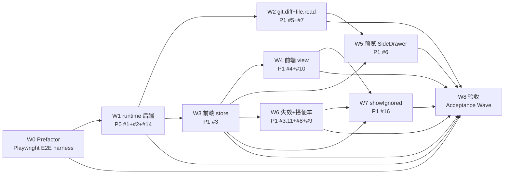

# 执行计划 — 全项目文件树（sidebar-project-file-tree）

> 承接 `code-architecture.md`（⑤）。本阶段把⑤§4 时序图拆为可执行的 Wave，每个 Wave 粒度约为一个 subagent 可高度专注完成的垂直切片。**编码完成的定义 = 测试验收清单全绿（末尾验收 Wave 不绿 = 未完成）。**

## Wave 编排总览

### 设计立场

⑤§2 裁决「核心计算是技术编排，领域贫乏，不引入 domain 层」。Wave 编排遵循垂直切片原则（每 Wave 切穿所有层可独立验证，不水平切片），依赖从⑤§4 时序图直接读出。

**本轮新增约束**：用户要求「新增 Playwright 真 E2E」。项目当前零 E2E 基础设施（无 Playwright/Cypress，Electron 主进程是副作用脚本不可导入，官方 TEST-STRATEGY.md 定 E2E 手工）。故编排 **W0 Prefactor** 建 E2E harness，作为后续 e2e 层测试的前置。

### 依赖 DAG 图

### 调度表

| Wave | 切片 | P级 | Blocked by | 并行组 | 说明 |
|------|------|-----|-----------|--------|------|
| W0 | Prefactor: Playwright E2E harness | — | 无（可立即开始） | — | 主进程入口重构 + _electron 启动 + fixture。e2e 层测试前置 |
| W1 | runtime 后端（shared+FileService+fs-executor+handler+protocol F-3） | P0 | W0 | A | #1+#2。前端无数据可渲染的唯一阻塞项 |
| W2 | git.diff 全链路 + file.read 权限放开 | P1 | W1 | A | #5+#7。改既有 server.ts/git-service.ts |
| W3 | 前端 fileTreeStore + useFileTree + api/file | P1 | W1 | B | #3。按 D-021 目标结构（nodeStates 对象化+per-session+setNodeState） |
| W4 | FileView/FileTreeRow 重写 + TreeNode→FileNode 迁移 | P1 | W3 | B | #4+#10 |
| W5 | DetailPane + useDetailPane + SideDrawer 改造 | P1 | W2, W3 | B | #6。点文件预览全链 |
| W6 | 跨 store 失效 + 修 G1 cwd + 修 G5 history | P1 | W3 | C | #3 AC-3.11 + #8 + #9 搭便车 |
| W7 | showIgnored 开关 + 灰斜体 | P1 | W3, W4 | C | #16（D-020） |
| W8 | 验收 Wave（Acceptance） | — | 全部功能 Wave（W0-W7） | — | 跑测试验收清单全量三层（unit+integration+e2e） |

### 并行约束

- 同组最多 3 个 subagent 并行（AGENTS.md subagent 约束）
- **W1 必须先完成**（P0 阻塞项，W3/W8 依赖其 FileNode 类型与 protocol）
- 并行组 A/B/C 内 Wave 理论可并行，但**有文件冲突的串行**：
  - W1 与 W2 都改 `runtime/src/` + `shared/src/protocol.ts`（W1 一次性写全 file.*/git.diff/file.write.* 类型，W2 仅复核 git.diff result map）→ W1→W2 串行避免 protocol.ts 合并冲突
  - W3 与 W7 都改 `stores/fileTree.ts` → W7 blocked_by W3
  - W6 与 W7 都改 `composables/useFileTree.ts`（W6 加 invalidateOnFileChanges watch、W7 加 toggleShowIgnored）→ 组 C 内 W6→W7 串行
  - W4 与 W5 都改前端组件 → W5 blocked_by W3（store）和 W2（git.diff api）
- 前端 Wave（W3-W7）需对应后端 API 就绪（W1/W2）

---

## Wave 详情

### Wave 0: Prefactor — Playwright E2E harness

**切片类型**: prefactor
**P 级覆盖**: —（基础设施，非业务 issue）
**Blocked by**: 无（可立即开始）
**并行关系**: 串行起始（后续所有 e2e 测试依赖）

#### 包含的功能/issue
- 功能: E2E 测试基础设施搭建（用户硬要求「新增 Playwright 真 E2E」）
- 无对应 issue（基础设施，源自用户指令非⑤设计）

#### 文件影响
- 创建: `e2e/fixtures/launch-app.ts`（_electron.launch 封装）、`e2e/fixtures/mock-runtime.ts`（fixture session/runtime 注入）、`e2e/file-tree.spec.ts`（占位，W8 填实现）、`playwright.config.ts`
- 修改: `src-electron/main/main.ts`（抽 `createMainWindow(app)` 可测函数，保留 whenReady 副作用）、`package.json`（+playwright devDep + e2e script）

#### 覆盖的 test-matrix 用例 ID
- 无（基础设施 Wave，不直接覆盖功能用例；为 T1.8 及 e2e 层用例提供运行环境）

#### Subagent 配置

| 配置项 | 值 |
|--------|---|
| Agent | general-purpose |
| 注入上下文 | 用户指令「新增 Playwright 真 E2E」+ 探查结论（主进程 main.ts:140 whenReady 副作用不可导入）+ TEST-STRATEGY.md 现状（E2E 手工） |
| 读取文件 | `src-electron/main/main.ts`、`src-electron/package.json`、`TEST-STRATEGY.md` |
| 修改/创建文件 | 见「文件影响」 |

#### 风险与缓解
- **风险**：主进程重构可能影响 `npm run dev`。
- **缓解**：重构保持行为等价（抽函数不改变 whenReady 时序）+ preflight-check.sh 验证 + `npm run dev` 手动冒烟。

#### 验收标准
- [ ] `createMainWindow(app)` 抽出，main.ts 行为等价（dev 可正常启动）
- [ ] `_electron.launch()` 能启动应用并拿到 BrowserWindow
- [ ] fixture 能注入测试 session（带 cwd）
- [ ] `e2e/file-tree.spec.ts` 占位可跑（even if empty/skip）
- [ ] `npm run dev` 不受影响（preflight + 手动冒烟）

---

### Wave 1: runtime 后端（P0 #1+#2+#14）

**切片类型**: 垂直切片
**P 级覆盖**: P0（#1+#2）+ P1（#14 骨架并入）
**Blocked by**: W0
**并行关系**: 组 A 起始

#### 包含的功能/issue
- 功能: 文件树首加载后端（⑤§4 功能1 后端部分）+ file.write 协议骨架（D-018，红队审查并入：W8 文件与 W1 完全重叠，独立 Wave 制造 AC-14.4 疑点，并入后 W1 一次性写全 file.* handler 含 write 的 NotImplemented 骨架 + try-catch 转 FileWriteResult，疑点根本不产生）
- Issue: #1（shared 基础+协议）、#2（FileService+fs-executor+handler）、#14（file.write 协议骨架，D-018 实现延后仅骨架）

#### 文件影响
- 创建: `shared/src/file-tree.ts`、`shared/src/path-guard.ts`、`shared/src/ignore-parser.ts`、`runtime/src/services/file-service.ts`（含 createFile/renameFile/deleteFile 抛 NotImplemented 骨架）、`runtime/src/services/file-error.ts`（FileErrorCode 含 not_implemented，演进帧疑点修复）、`runtime/src/services/ports/file-executor.ts`、`runtime/src/infra/fs-executor.ts`、`runtime/src/transport/file-message-handler.ts`（file.* 全路由含 write.*，handleWrite try-catch 转 FileWriteResult AC-14.4 闭环）
- 修改: `shared/src/protocol.ts`（F-3 闭环：+file.tree/expand/git.diff/file.write.* 的 ClientMessageType + ServerMessageType + Map，一次性写全）、`runtime/src/transport/server.ts`（注册 file handler，删 handleFileRead 内联 K-3）、`runtime/src/index.ts`（装配 FileService）
- 测试: `runtime/test/file-service.test.ts`、`runtime/test/file-write-skeleton.test.ts`（AC-14.4 结构化响应）、`shared/__tests__/path-guard.test.ts`、`shared/__tests__/ignore-parser.test.ts`

#### 覆盖的 test-matrix 用例 ID
- T1.1（首加载顶层+一级子）、T1.2（空目录）、T1.3（越界 out_of_cwd）、T1.4（EACCES permission_denied）、T1.5（超时 timeout）、T1.6（session_not_found）、T1.9（isUnderOrEqual 纯函数安全原语，unit）、T2.1（expand 单层子）、T2.10（expand 越界）
- 无 T 编号（AC-14.1~14.4 覆盖 file.write 骨架）

#### Subagent 配置

| 配置项 | 值 |
|--------|---|
| Agent | general-purpose（TDD 链） |
| 注入上下文 | requirements UC-1 + issues #1/#2/#14 方案 + code-architecture §4 功能1 时序图 + §6 对应用例 + 骨架 code-skeleton/shared + code-skeleton/runtime（接线参考，结构以§3 D-021 签名表为准）+ D-013（ignore 纯函数）+ D-016/D-018（file.write 骨架不延后，实现延后）+ BC-3（file.read 原3目录白名单） |
| 读取文件 | 骨架 8 个 runtime/shared 文件、`runtime/src/transport/server.ts:200-209,472-498`、`runtime/src/index.ts:167`、`shared/src/protocol.ts:9-32,191-291`、骨架 protocol-additions.ts:52-72（file.write 类型） |
| 修改/创建文件 | 见「文件影响」 |

#### 验收标准
- [ ] AC-1.1~1.5（shared 类型/grep 守卫）全过
- [ ] AC-2.1~2.8（FileService 行为 + 三层 grep AC）全过
- [ ] AC-14.1~14.4（file.write 骨架：类型 + 签名 + 路由 + 结构化响应闭环 try-catch）全过
- [ ] T1.1~1.6, T1.9, T2.1, T2.10 对应测试全 PASS
- [ ] §11 grep AC（AC-1/2/2b/3/6）路径作用域内通过
- [ ] FileErrorCode 含 not_implemented；handleWrite try-catch 转 FileWriteResult 非 500

---

### Wave 2: git.diff 全链路 + file.read 权限放开（P1 #5+#7）

**切片类型**: 垂直切片
**P 级覆盖**: P1
**Blocked by**: W1
**并行关系**: 组 A（与 W1 串行，protocol.ts 冲突）

#### 包含的功能/issue
- 功能: 点文件预览后端（⑤§4 功能3 后端部分）+ file.read 三层重构
- Issue: #5（git.diff）、#7（file.read 权限 BC-3）

#### 文件影响
- 修改: `runtime/src/services/git-service.ts`（+getFileDiff 合并 git-service-extension.ts:44，K-6 新写越界）、`runtime/src/transport/git-message-handler.ts`（+git.diff 路由，改既有）、`runtime/src/transport/server.ts`（git handler 注册 diff）、`shared/src/protocol.ts`（**git.diff 类型在 W1 已定义**，本 Wave 仅复核 git.diff ServerMessageType/result map 完整，非重复新增）、`renderer/src/api/domains/git.ts`（+getDiff，改既有）
- 测试: `runtime/test/git-service-diff.test.ts`、`runtime/test/file-read-permission.test.ts`

#### 覆盖的 test-matrix 用例 ID
- T6.1（M 文件 diff）、T6.3（file.read 越界）、T6.8（git 防注入经 port）、T6.9（git.diff 越界 path_not_allowed）、T6.11（file.read 原3目录兼容）、T6.13（git.diff 超时）、T6.14（非 repo 空 patch）

#### Subagent 配置

| 配置项 | 值 |
|--------|---|
| Agent | general-purpose（TDD 链） |
| 注入上下文 | requirements UC-6 + issues #5/#7 方案 + code-architecture §4 功能3 时序图 + 骨架 git-service-extension.ts + git-executor.ts:24（白名单已含 diff）+ NFR-AC-S3（数组形式防注入）+ K-6（diff 越界新写非复用）+ BC-3（原3目录） |
| 读取文件 | 骨架 git-service-extension.ts、`runtime/src/services/git-service.ts:63-87,265-274`、`runtime/src/services/ports/git-executor.ts:24`、`runtime/src/transport/git-message-handler.ts`、`renderer/src/api/domains/git.ts:19-24` |
| 修改/创建文件 | 见「文件影响」 |

#### 验收标准
- [ ] AC-5.1~5.6（git.diff 全态）全过
- [ ] AC-7.1~7.5（file.read 权限+三层 grep）全过
- [ ] T6.1, T6.3, T6.8, T6.9, T6.11, T6.13, T6.14 测试全 PASS
- [ ] 交叉命中 gap 修复：git-service-extension 不再重定义 IGitExecutorLike，import 真 IGitExecutor port

---

### Wave 3: 前端 fileTreeStore + useFileTree + api/file（P1 #3）

**切片类型**: 垂直切片
**P 级覆盖**: P1
**Blocked by**: W1
**并行关系**: 组 B 起始

#### 包含的功能/issue
- 功能: 文件树前端 store + 编排（⑤§4 功能1/2 前端部分）
- Issue: #3（store+composable+api）

#### 文件影响
- 创建: `renderer/src/stores/fileTree.ts`、`renderer/src/composables/useFileTree.ts`、`renderer/src/api/domains/file.ts`
- 测试: `renderer/src/__tests__/stores/fileTree.test.ts`、`renderer/src/__tests__/composables/useFileTree.test.ts`

#### ⚠️ D-021 强制对齐项
骨架 store 是旧结构（nodeStatus 光杆 string + per-path）。**必须按 §3 签名表 D-021 目标结构重写**：
- `nodeStates: Map<sid, Map<path, NodeState>>`（对象化，非光杆 string）
- `gitOverlay: Map<sid, Map<path, GitFileStatus>>`（per-session 分桶）
- `setNodeState(sid, path, state)` 单一原子入口（同步 status + merge children）
- NodeState = `{ status: LoadStatus, reason?: FileErrorCode }`，reason 来自 WS error envelope

#### 覆盖的 test-matrix 用例 ID
- T2.2（loaded 复用缓存）、T2.3（loading 幂等去重）、T2.4（在途切 session 丢 stale）、T2.5（error 重试）、T2.6（overlay 先到后挂载）、T2.7（git.status 失败 overlay 空）、T2.8/T2.8b（角标全态）、T2.9（非 git 仓库）、T4.6（invalidated 过滤 graceful）

#### Subagent 配置

| 配置项 | 值 |
|--------|---|
| Agent | general-purpose（TDD 链） |
| 注入上下文 | requirements UC-1/2/3 + issues #3 方案 + code-architecture §4 功能1/2 时序图 + §3 store 签名表（D-021 目标结构，**非骨架旧结构**）+ D-012（树/标注分离）+ D-019（rehydrate）+ D-021（对象化+per-session+setNodeState）+ K-9（跨 store 编排在 composable） |
| 读取文件 | 骨架 renderer/stores/fileTree.ts + composables/useFileTree.ts + api/domains/file.ts（接线参考，结构以§3为准）、`renderer/src/api/domains/git.ts:19-24`（WS 封装范式）、`renderer/src/stores/chat.ts:196-222`（fileChangesSignal 源） |
| 修改/创建文件 | 见「文件影响」 |

#### 验收标准
- [ ] AC-3.1~3.13 全过（含 D-021 结构对齐）
- [ ] T2.2~2.9, T4.6 测试全 PASS
- [ ] store 结构与 §3 签名表 D-021 完全一致（非骨架旧结构）

---

### Wave 4: FileView/FileTreeRow 重写 + TreeNode→FileNode 迁移（P1 #4+#10）

**切片类型**: 垂直切片
**P 级覆盖**: P1
**Blocked by**: W3
**并行关系**: 组 B

#### 包含的功能/issue
- 功能: 文件树渲染（⑤§4 功能1/2 渲染层）
- Issue: #4（FileView/FileTreeRow 重写）、#10（TreeNode→FileNode 迁移，搭便车 D-010③）

#### 文件影响
- 修改: `renderer/src/components/sidebar/FileView.vue`（rewrite，删本地 TreeNode :63-74）、`renderer/src/components/sidebar/FileTreeRow.vue`（rewrite，删本地 TreeNode :58-68）
- 测试: `renderer/src/__tests__/components/FileView.test.ts`、`renderer/src/__tests__/components/FileTreeRow.test.ts`

#### 覆盖的 test-matrix 用例 ID
- T4.1（过滤命中高亮）、T4.2（无匹配态）、T4.4（无 ⌘K）、T4.5（清空恢复）

#### Subagent 配置

| 配置项 | 值 |
|--------|---|
| Agent | general-purpose（TDD 链） |
| 注入上下文 | requirements UC-1/4 + issues #4/#10 方案 + code-architecture §4 功能1 渲染 + GAP-S6（FileNode 统一）+ D-007（文件名亮色/选中蓝粗/忽略灰斜体）+ D-009（懒加载默认顶层）+ 三视角测试规范（含首屏冒烟模板） |
| 读取文件 | `renderer/src/components/sidebar/FileView.vue`（现状 :63-74 TreeNode）、`FileTreeRow.vue`（现状 :58-68）、`shared/src/file-tree.ts`（FileNode）、W3 产出的 fileTreeStore |
| 修改/创建文件 | 见「文件影响」 |

#### 验收标准
- [ ] AC-4.1~4.14 全过（含 AC-4.13 grep 无本地 TreeNode）
- [ ] AC-10.1~10.3（迁移回归）全过
- [ ] T4.1, T4.2, T4.4, T4.5 测试全 PASS
- [ ] 首屏冒烟测试（mount FileView，断 DOM 含树节点）存在

---

### Wave 5: DetailPane + useDetailPane + SideDrawer 改造（P1 #6）

**切片类型**: 垂直切片
**P 级覆盖**: P1
**Blocked by**: W2, W3
**并行关系**: 组 B

#### 包含的功能/issue
- 功能: 点文件预览前端（⑤§4 功能3 前端部分）
- Issue: #6（DetailPane+useDetailPane+SideDrawer）

#### 文件影响
- 创建: `renderer/src/components/panel/DetailPane.vue`、`renderer/src/composables/useDetailPane.ts`
- 修改: `renderer/src/components/panel/SideDrawer.vue`（+detail tab + DetailPane 挂载，现状 :30-36 仅 4 tab）
- 测试: `renderer/src/__tests__/components/DetailPane.test.ts`、`renderer/src/__tests__/composables/useDetailPane.test.ts`

#### 覆盖的 test-matrix 用例 ID
- T6.2（普通文件内容）、T6.4（读取失败错误态）、T6.5（>1MB 截断）、T6.6（二进制占位）、T6.7（骨架态）、T6.10（禁 v-html 防 XSS）、T6.12（已开点新文件切换）

#### Subagent 配置

| 配置项 | 值 |
|--------|---|
| Agent | general-purpose（TDD 链） |
| 注入上下文 | requirements UC-6 + issues #6 方案 + code-architecture §4 功能3 + draft-detail-pane.html（设计稿）+ NFR-AC-S4（禁 v-html）+ D-5（截断/二进制） |
| 读取文件 | `renderer/src/components/panel/SideDrawer.vue:30-36,68-71,126-128`、`docs/page-design/v3/`（draft-detail-pane 参考）、W2 产出的 git.getDiff api、W3 产出的 store |
| 修改/创建文件 | 见「文件影响」 |

#### 验收标准
- [ ] AC-6.1~6.8 全过
- [ ] T6.2, T6.4, T6.5, T6.6, T6.7, T6.10, T6.12 测试全 PASS
- [ ] 禁 v-html（文本插值/<pre>），T6.10 XSS 断言通过

---

### Wave 6: 跨 store 失效 + 修 G1 cwd + 修 G5 history（P1 #3.11+#8+#9）

**切片类型**: 垂直切片（搭便车）
**P 级覆盖**: P1
**Blocked by**: W3（改 useFileTree.ts，W3 产出；#8/#9 修复点与 W2 零重叠，原 W2 依赖误植已修正）
**并行关系**: 组 C（与 W7 串行——同改 useFileTree.ts）

#### 包含的功能/issue
- 功能: 跨 store 失效编排（⑤§4 功能4）+ 搭便车修 G1/G5
- Issue: #3 AC-3.11、#8（G1 cwd）、#9（G5 history）

#### 文件影响
- 修改: `renderer/src/composables/useFileTree.ts`（+invalidateOnFileChanges watch）、`runtime/src/index.ts:111-149`（createAdapter 注入 cwd，#8）、`runtime/src/infra/pi/event-adapter.ts`（cwd 字段使用）、`runtime/src/infra/pi/message-converter.ts:30`（convertPiHistory 还原 fileChanges，#9）
- 测试: `renderer/src/__tests__/composables/useFileTree-invalidation.test.ts`、`runtime/test/event-adapter-cwd.test.ts`、`runtime/test/message-converter-history.test.ts`

#### 覆盖的 test-matrix 用例 ID
- T11.1（ready 帧 invalidated）、T11.2（他 session 不污染）、T1.7（rehydrate 已删路径 graceful）

#### Subagent 配置

| 配置项 | 值 |
|--------|---|
| Agent | general-purpose（TDD 链） |
| 注入上下文 | requirements UC-11 + issues #3 AC-3.11/#8/#9 + code-architecture §4 功能4 + D-017（失效转移）+ K-9（composable 层编排）+ BC-5（G1）/BC-6（G5）+ ⑤搭便车工作量核对（#8 一行/#9 中等） |
| 读取文件 | `renderer/src/composables/useFileTree.ts`（W3 产出）、`runtime/src/index.ts:111-149`、`runtime/src/infra/pi/event-adapter.ts:49,66,238-255`、`runtime/src/infra/pi/message-converter.ts:30`、`renderer/src/stores/chat.ts:196-222`、`renderer/src/stores/chat-chunk-processor.ts:385-392` |
| 修改/创建文件 | 见「文件影响」 |

#### 验收标准
- [ ] AC-3.11（跨 store 失效，composable watch）过
- [ ] AC-8.1~8.3（G1 cwd 修复 + BC-1 回归）全过
- [ ] AC-9.1~9.3（G5 history 还原 + BC-1 回归 + graceful 降级）全过
- [ ] T11.1, T11.2, T1.7 测试全 PASS

---

### Wave 7: showIgnored 开关 + 灰斜体（P1 #16）

**切片类型**: 垂直切片
**P 级覆盖**: P1
**Blocked by**: W3（store）, W4（FileView.vue，W4 重写产出）
**并行关系**: 组 C（与 W6 串行——同改 useFileTree.ts）

#### 包含的功能/issue
- 功能: 显示忽略项开关（D-020）
- Issue: #16（原 #15 提级）

#### 文件影响
- 修改: `renderer/src/stores/fileTree.ts`（+showIgnored state，W3 已建）、`renderer/src/components/sidebar/FileView.vue`（+开关 UI + 灰斜体渲染，W4 已重写）、`renderer/src/composables/useFileTree.ts`（toggleShowIgnored）
- 测试: `renderer/src/__tests__/stores/fileTree-showIgnored.test.ts`

#### 覆盖的 test-matrix 用例 ID
- 无独立 T 编号（AC-16.1~16.5 覆盖）

#### Subagent 配置

| 配置项 | 值 |
|--------|---|
| Agent | general-purpose（TDD 链） |
| 注入上下文 | issues #16 方案 + D-020（FileNode ignored 字段 + 双模式）+ D-004（显示忽略项开关）+ D-007②（灰斜体） |
| 读取文件 | W3 产出 store、W4 产出 FileView、骨架 shared/ignore-parser.ts（matchPath 双模式） |
| 修改/创建文件 | 见「文件影响」 |

#### 验收标准
- [ ] AC-16.1~16.5 全过
- [ ] 灰斜体渲染（muted + italic）DOM 断言通过

---

### Wave 8: 验收 Wave（Acceptance）

> 注：原 W8（file.write 骨架）已并入 W1（红队审查：文件完全重叠 + 消除 AC-14.4 疑点）。Wave 编号顺延——验收 Wave 现为 W8（原 W9）。

**切片类型**: 验收（非功能开发）
**P 级覆盖**: —
**Blocked by**: Wave 0, Wave 1, Wave 2, Wave 3, Wave 4, Wave 5, Wave 6, Wave 7（全部功能 Wave，原 W8 file.write 已并入 W1）
**并行关系**: 必须最后

#### 职责
读测试验收清单全量 → 跑三层测试（unit + integration + e2e）→ 每条 PASS/FAIL/缺失映射回用例 ID → 任一用例无对应测试或 FAIL = 整个实现未完成 → 输出覆盖率报告。

#### 测试执行分层
- **unit 层**：`cd src-electron/runtime && npx vitest run` + `cd src-electron/renderer && npx vitest run`（Wave 内 dev 阶段已写）
- **integration 层**：同上 vitest（含 mount 旅程 + runtime 真起 server）
- **e2e 层**：`npx playwright test`（W0 harness + 各功能 e2e 用例）

#### 验收标准
- [ ] 测试验收清单全量用例状态 = PASS（无 FAIL/未实现/[DEVIATED] 未确认）
- [ ] 三层测试全绿
- [ ] 覆盖率报告：每条用例 → 对应测试文件:行

---

## 后续迭代（P3 延后项）

- Issue #11 [P3]: 文件操作 fs 写实现（create/rename/delete 真实逻辑）— 延后理由：依赖 runtime file-service 写协议 G4 当前缺失，D-016 裁决本轮仅骨架（W8）
- Issue #12 [P3?]: message-stream ChangeSetCard 点击联动 — 迷雾，未展开
- Issue #13 [P3?]: SideDrawer tab registry 抽象 — 迷雾，当前 4+1 tab 无需抽

---

## 测试验收清单（Test Acceptance Manifest）— [MANDATORY]

> **实现阶段的 Definition of Done。** 用例 ID 集合 = ⑤test-matrix 全量（来源 A 功能 + 来源 B NFR）。状态：`待验`（设计期）→ 实现期填 `PASS`/`FAIL`/`未实现`/`[DEVIATED]原因`。

| 用例 ID | 归属 UC | 来源 | 断言摘要 | 功能归属 Wave | 测试执行层 | 状态 |
|---------|--------|------|---------|--------------|----------|------|
| T1.1 | UC-1 | A 功能 | 首加载顶层+一级子 FileNode[] | W1 | integration | 待验 |
| T1.2 | UC-1 | A 功能 | cwd 空目录 → FileNode[]=[] 不 error | W1 | integration | 待验 |
| T1.3 | UC-1 | A 功能 | listTree 越界 → FileError('out_of_cwd') | W1 | integration | 待验 |
| T1.4 | UC-1 | A 功能 | EACCES → FileError('permission_denied') | W1 | integration | 待验 |
| T1.5 | UC-1 | A 功能 | listDir 超时 → FileError('timeout') | W1 | integration | 待验 |
| T1.6 | UC-1 | A 功能 | bad sessionId → FileError('session_not_found') | W1 | integration | 待验 |
| T1.7 | UC-1 | A 功能 | 切回 session 展开态恢复，已删路径 graceful | W6 | integration | 待验 |
| T1.8 | UC-1 | A 功能 | UI 切 tab → 渲染，顶层节点 DOM 可见（全链） | W8 | **e2e** | 待验 |
| T1.9 | UC-1 | B NFR | `..` 穿越/末尾斜杠/相对路径恶意输入判 false（纯函数） | W1 | **unit** | 待验 |
| T2.1 | UC-2 | A 功能 | 展开未加载目录 → 单层子节点 | W1 | integration | 待验 |
| T2.2 | UC-2 | A 功能 | loaded 复用缓存，折叠再展开不重请求 | W3 | integration | 待验 |
| T2.3 | UC-2 | B NFR | loading 态再点 → 不发新请求（幂等去重） | W3 | **integration** | 待验 |
| T2.4 | UC-2 | B NFR | expand 在途切 session → stale 丢弃 | W3 | **integration** | 待验 |
| T2.5 | UC-2 | A 功能 | error 态折叠再展开 → 重发 | W3 | integration | 待验 |
| T2.6 | UC-2 | A 功能 | overlay 先于 tree 到达 → loaded 后挂载 | W3 | integration | 待验 |
| T2.7 | UC-2 | A 功能 | git.status 失败 → overlay 空，树仍渲染 | W3 | integration | 待验 |
| T2.8 | UC-2 | A 功能 | M/A/D/U 全态角标 | W3 | integration | 待验 |
| T2.8b | UC-2 | A 功能 | untracked `??` → 绿 A | W3 | integration | 待验 |
| T2.9 | UC-2 | A 功能 | 非 git 仓库 → 无角标树可浏览 | W3 | integration | 待验 |
| T2.10 | UC-2 | B NFR | expandDir(sessionId,"/etc") → out_of_cwd | W1 | **integration** | 待验 |
| T4.1 | UC-4 | A 功能 | 输入关键词 → 已加载节点过滤+高亮 | W4 | integration | 待验 |
| T4.2 | UC-4 | A 功能 | 无匹配 → 「无匹配文件」态 | W4 | integration | 待验 |
| T4.4 | UC-4 | A 功能 | 过滤框触发 → 无 ⌘K overlay | W4 | integration | 待验 |
| T4.5 | UC-4 | A 功能 | 清空关键词 → 恢复完整树 | W4 | integration | 待验 |
| T4.6 | UC-4 | A 功能 | invalidated 态过滤 → graceful 不报错 | W3 | integration | 待验 |
| T6.1 | UC-6 | A 功能 | M 文件 → 显示 diff | W2 | integration | 待验 |
| T6.2 | UC-6 | A 功能 | 普通文件 → 显示内容 | W5 | integration | 待验 |
| T6.3 | UC-6 | A 功能 | cwd 外非3目录 file.read → out_of_cwd | W2 | integration | 待验 |
| T6.4 | UC-6 | A 功能 | 权限/不存在 → DetailPane 错误态 | W5 | integration | 待验 |
| T6.5 | UC-6 | A 功能 | >1MB 未改动文件 → 截断+提示 | W5 | integration | 待验 |
| T6.6 | UC-6 | A 功能 | 二进制改动文件 → 友好占位 | W5 | integration | 待验 |
| T6.7 | UC-6 | A 功能 | 异步返回前 → 骨架态非空白 | W5 | integration | 待验 |
| T6.8 | UC-6 | B NFR | getFileDiff 经 executor.exec + 防注入 + grep 无直接 exec | W2 | **integration** | 待验 |
| T6.9 | UC-6 | B NFR | git.diff(sessionId,"/etc/passwd") → path_not_allowed | W2 | **integration** | 待验 |
| T6.10 | UC-6 | B NFR | 含 `<script>` 文件内容被转义不执行（禁 v-html） | W5 | **integration** | 待验 |
| T6.11 | UC-6 | A 功能 | ~/.agents/skills 下文件可读 + 路径形态不变 | W2 | integration | 待验 |
| T6.12 | UC-6 | A 功能 | SideDrawer 已开点新文件 → 切换非新开 | W5 | integration | 待验 |
| T6.13 | UC-6 | A 功能 | git.diff 超时 → GitError('timeout') | W2 | integration | 待验 |
| T6.14 | UC-6 | A 功能 | cwd 非 repo → 空 patch | W2 | integration | 待验 |
| T11.1 | UC-11 | B NFR | agent_end ready 帧 → 相关节点 invalidated | W6 | **integration** | 待验 |
| T11.2 | UC-11 | B NFR | 他 session ready → 不污染本 session | W6 | **integration** | 待验 |

**E2E 层补充用例**（W8 跑，基于 W0 harness）：
- E2E-1: 切「文件」tab → 顶层节点 DOM 可见（T1.8 e2e 化）
- E2E-2: 点目录展开 → 子节点 DOM 出现 → 角标渲染（UC-1+UC-2 旅程）
- E2E-3: 点文件 → SideDrawer 打开 → 内容/diff 显示（UC-6 旅程）
- E2E-4: 切 session 再切回 → 展开态恢复（AC-3.5 rehydrate 旅程）

---

## 执行交接（硬契约）

本计划完成后，进入编码实现。**编码完成的定义 = 测试验收清单全绿。**

- **末尾验收 Wave（W8）blocked_by 所有功能 Wave**，未绿 = 实现未完成
- **方式 B（手动执行）**：每个 Wave 派一个 fresh subagent，按 Wave 内 TDD 链；末尾验收 Wave 最后跑
- **偏离通道**：编码中发现用例设计错误/不可行，走 `[DEVIATED]` 登记（附原因 + 用户确认），不可静默跳过
- **三层测试 gate**：unit 在 Wave dev 阶段 / integration 在 Wave 内或 phase-test / e2e 在 W8 独立 gate

---

## 待确认（Step 1 必问决策点，审查前定）

- **W0 Playwright harness 范围**：本轮本地可跑即可，CI 跨平台配置列后续迭代？（默认：本地优先，CI 后续）
- **并行组划分确认**：A/B/C 三组的 Wave 分配是否合理？W1 与 W2 因 protocol.ts 冲突建议串行而非并行，是否接受？（默认：接受串行）
