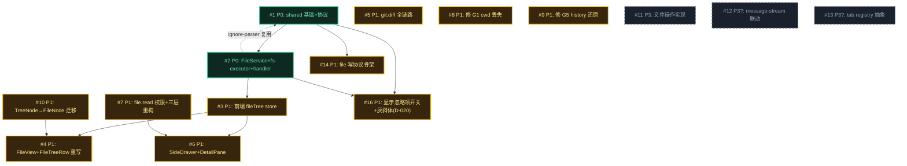

# Issue 决策图 — 全项目文件树

> 承接 `system-architecture.md`（②架构定稿，verdict:pass + review APPROVED）。本阶段把架构的 §6 port / §7 模块 / §8 边界 / §10 挑战 / §12 行为契约拆成带 P 级 + 方案对比的可执行 issue。

**取舍原则**（SKILL 约定）：优先长期、合理的架构设计，提供高可扩展性；较少考虑成本。本阶段 D 类决策（D-014~D-018）已 ask_user 拍板（D-014~D-016 排期划线、D-017 反哺架构、D-018 补骨架）。

**前置说明**：② 已确认 D-008~D-013 全部 `confirmed`——**无未决的根本性架构选择**（无 DESIGN-IT-TWICE 触发）。本阶段 issue 主要是实现层 DAG，方案对比聚焦实现层取舍（非根本性架构 fork）。

## 地图总览

**依赖读图**：#1→#2（协议先于实现）→ #3（store 先于 view）；#3+#7→#6（预览需 store + file.read 放开）；#10→#4（类型统一先于 view 重写）。#5 git.diff 独立链路无前置依赖。

## 上游覆盖核验（MANDATORY，逐条不漏）

> 按 fog-of-war.md 4 轴（状态§5/模块§7/边界§8/挑战§10）+ 兜底（§9 swimlane / §11 AC / §12 BC）扫 system-architecture.md。

| 上游元素 | 轴 | 对应 issue | 状态 | N/A 理由（状态=N/A 时必填）|
|---------|----|-----------|------|---------------------------|
| §1: G1 浏览完整文件结构→系统目标 | 兜底 | #2, #3, #4 | ✅ 已覆盖 | — |
| §1: G2 git 标注→系统目标 | 兜底 | #3, #4, #5 | ✅ 已覆盖 | — |
| §1: G3 快速定位→系统目标 | 兜底 | #4 | ✅ 已覆盖 | — |
| §1: UC-5 文件操作→协议骨架就绪（实现延后）| 兜底 | #14 | ✅ 已覆盖 | — |
| §1: UC-6 点击落地预览→系统目标 | 兜底 | #6, #7 | ✅ 已覆盖 | — |
| §1: 搭便车 4 项→本轮纳入 | 兜底 | #7, #8, #9, #10 | ✅ 已覆盖 | — |
| §4: FileNode ignored? 字段（[BACKFED D-020]）| 模型 | #1, #16 | ✅ 已覆盖 | — |
| §4: FileTreeState 展开态 rehydrate（[BACKFED D-019]）| 模型 | #3 | ✅ 已覆盖 | — |
| §5: unloaded→loading→loaded（正常懒加载）| 状态 | #3 | ✅ 已覆盖 | — |
| §5: loading→error→重试（异常分支）| 状态 | #4 | ✅ 已覆盖 | — |
| §5: 折叠复用缓存（不重新请求）| 状态 | #3 | ✅ 已覆盖 | — |
| §5: error 态 Reason 字段（runtime 返回 + 前端展示）| 状态 | #2, #4 | ✅ 已覆盖 | — |
| §5: loaded→invalidated→loading 失效转移（[BACKFED from ③D-017]）| 状态 | #3 | ✅ 已覆盖 | — |
| §6: IFileExecutor port（listDir/stat/readFile）| 模块 | #2 | ✅ 已覆盖 | — |
| §6: IGitExecutor 扩白名单 +diff | 模块 | #5 | ✅ 已覆盖 | — |
| §6: IIgnoreReader 取消（D-013 纯函数）| 模块 | #1 | ✅ 已覆盖 | — |
| §6: file.read 内容读取下沉 service（重构）| 模块 | #7 | ✅ 已覆盖 | — |
| §7: file-service.ts（新）| 模块 | #2 | ✅ 已覆盖 | — |
| §7: fs-executor.ts（新 infra）| 模块 | #2 | ✅ 已覆盖 | — |
| §7: ignore-parser.ts（新 shared 纯函数）| 模块 | #1 | ✅ 已覆盖 | — |
| §7: path-guard.ts（新 shared）| 模块 | #1 | ✅ 已覆盖 | — |
| §7: file-message-handler.ts（新 transport）| 模块 | #2 | ✅ 已覆盖 | — |
| §7: git-message-handler.ts（扩 transport）| 模块 | #5 | ✅ 已覆盖 | — |
| §7: git-service.ts（扩 getFileDiff）| 模块 | #5 | ✅ 已覆盖 | — |
| §7: protocol.ts（扩类型）| 模块 | #1, #14 | ✅ 已覆盖 | — |
| §7: stores/fileTree.ts（新）| 模块 | #3 | ✅ 已覆盖 | — |
| §7: composables/useFileTree.ts（新）| 模块 | #3 | ✅ 已覆盖 | — |
| §7: composables/useDetailPane.ts（新）| 模块 | #6 | ✅ 已覆盖 | — |
| §7: api/domains/file.ts（新）| 模块 | #3 | ✅ 已覆盖 | — |
| §7: api/domains/git.ts（扩 getDiff）| 模块 | #5 | ✅ 已覆盖 | — |
| §7: FileView.vue（重写）| 模块 | #4 | ✅ 已覆盖 | — |
| §7: FileTreeRow.vue（重写）| 模块 | #4 | ✅ 已覆盖 | — |
| §7: SideDrawer.vue（改造）| 模块 | #6 | ✅ 已覆盖 | — |
| §7: DetailPane.vue（新）| 模块 | #6 | ✅ 已覆盖 | — |
| §8: FE↔FileService（file.tree/expand/read）| 边界 | #2, #3 | ✅ 已覆盖 | — |
| §8: FE↔GitService（git.status/diff）| 边界 | #5 | ✅ 已覆盖 | — |
| §8: message-stream 联动（ChangeSetCard）| 边界 | — | N/A | 架构§8 标「联动可选」；D-005 选 SideDrawer 落地，message-stream 联动降级为 P3（见 #13）|
| §10: D-008 三层+port | 挑战 | #2 | ✅ 已覆盖 | — |
| §10: D-009 懒加载 | 挑战 | #2, #3 | ✅ 已覆盖 | — |
| §10: D-011 宽松状态机 | 挑战 | #3 | ✅ 已覆盖 | — |
| §10: D-012 树/标注分离（FileNode 不含 gitStatus）| 挑战 | #1, #3 | ✅ 已覆盖 | — |
| §10: D-017 [BACKFED] 文件树缓存失效机制 | 挑战 | #3 | ✅ 已覆盖 | — |
| §10: D-019 [BACKFED] 展开态 rehydrate 持久化 | 挑战 | #3 | ✅ 已覆盖 | — |
| §10: D-020 [BACKFED] 显示忽略项开关（FileNode ignored + 双模式）| 挑战 | #16 | ✅ 已覆盖 | — |
| §10: 特化「useFileTree 拆 useDetailPane」| 挑战 | #3, #6 | ✅ 已覆盖 | — |
| §11: AC-1~AC-2b（service 不 import infra/不碰 fs）| 兜底 | #2 | ✅ 已覆盖 | — |
| §11: AC-3（FileService 无 PiXxx）| 兜底 | #2 | ✅ 已覆盖 | — |
| §11: AC-4（FileView 经 api 不直调 ws）| 兜底 | #4 | ✅ 已覆盖 | — |
| §11: AC-5（TreeNode 单一来源）| 兜底 | #10 | ✅ 已覆盖 | — |
| §11: AC-6（file.read 越界校验在 service）| 兜底 | #7 | ✅ 已覆盖 | — |
| §12: BC-1 message.file_changes 保持 | 兜底 | — | N/A | 架构§12 标「保持」（file-tree 不动此通道，仍服务 ChangeSetCard），无改动故无 issue |
| §12: BC-2 git.status 保持 | 兜底 | — | N/A | 架构§12 标「保持」（file-tree 复用不改行为），无改动故无 issue |
| §12: BC-3 file.read 权限+重构 | 兜底 | #7 | ✅ 已覆盖 | — |
| §12: BC-4 FileView 改动清单→全树（主变更）| 兜底 | #4 | ✅ 已覆盖 | — |
| §12: BC-5 修 G1 cwd | 兜底 | #8 | ✅ 已覆盖 | — |
| §12: BC-6 修 G5 history | 兜底 | #9 | ✅ 已覆盖 | — |

---

## P0 Issues（阻塞项，必须先做）

### #1: shared 基础设施 + WS 协议类型定义

**P 级**: P0
**类型**: 模型 / 模块
**Blocked by**: 无
**推荐强度**: Strong

#### 问题描述

为整个文件树功能奠定**共享类型与纯函数基础**——这是 runtime + 前端两端的共同依赖。架构 §7 列出 4 个 shared 层产物：
- `protocol.ts`（扩）：`file.tree` / `file.tree.expand` / `git.diff` 的 WS 消息类型
- `shared/file-tree.ts`（新）：**FileNode DTO 定义**（path/name/type/children?/size?，**不含 gitStatus**，D-012）
- `shared/ignore-parser.ts`（新，纯函数）：`compileIgnoreRules(content)` + `matchPath(matcher, path)`，仿 git-status-parser 范式（D-013）
- `shared/path-guard.ts`（新，纯函数）：`isUnderOrEqual(cwd, path)` —— **[BACKFED from ③deep-review F2 修正]** 源码实证该函数（实际名 `n`）已在 `runtime/src/utils/path-utils.ts:14`，被 git-service + extension-service 共用。本 issue 是**将其从 utils 提升到 shared**（跨 runtime/前端复用），非「从 git-service 抽出」

关联 architecture §6 Port 清单、§7 模块表、§10 D-012/D-013。

#### 为什么是 P0

不做则 #2 FileService 无 port 可实现、无类型可返回；前端 #3 store 无 FileNode 类型可收。这是**唯一无依赖的前沿**（shared 层只依赖 node:path + 标准库），所有下游都 blocked_by 它。

#### 方案对比

##### 方案 A: shared 层独立 issue，类型 + 纯函数一次性就位

**改动**:
- 模块: 新建 `shared/file-tree.ts`（FileNode）、`shared/ignore-parser.ts`、`shared/path-guard.ts`；扩 `shared/protocol.ts`
- 模型: FileNode DTO 落地；`IgnoreMatcher` 类型；`isUnderOrEqual`（现 `n`）从 `utils/path-utils.ts` 提升到 `shared/path-guard.ts`（消费者 git-service + extension-service + 即将的 file-service 全改 import）

**优点**: shared 是两端共同契约，独立交付后下游两端可并行开发（runtime FileService + 前端 store 同步基于 FileNode）。契约稳定后下游不被 shared 迭代打断。
**缺点**: 一次性定义 4 个产物，初稿可能需基于下游反馈微调（但类型契约在架构阶段已固化）。
**适用场景**: 契约明确、两端并行的标准分层项目（本项目正是）。

##### 方案 B: shared 类型与纯函数拆两个 issue，分两次交付

**改动**: 先交付类型（FileNode + protocol），再交付纯函数（ignore-parser + path-guard）。

**优点**: 颗粒更细，类型先于纯函数可用。
**缺点**: 拆分人为制造依赖（ignore-parser 无外部依赖、path-guard 也是），且两个 issue 都属 shared 层同一变化轴，拆开违反「按变化轴内聚」。纯函数逻辑简单（LOC ~70），不值得单独 issue。
**适用场景**: shared 产物体量大、不同成熟度时。

#### 取舍决策

**选择**: 方案 A
**理由**（长期架构优先）: shared 层是契约层，4 个产物同属「跨两端共享基础」一个变化轴，内聚交付让下游两端契约稳定可并行。拆开制造人为依赖且颗粒过细。

**放弃方案 B 的理由**: 纯函数无外部依赖、体量小（ignore-parser ~50 LOC + path-guard ~20 LOC），拆 issue 的编排成本 > 收益，且违反变化轴内聚。

#### 验收标准

- [ ] AC-1.1 [正常]（trace: UC-1）: `shared/file-tree.ts` 导出 FileNode 类型，字段含 path/name/type/children?/size?，**不含 gitStatus**（grep 验证）
- [ ] AC-1.2 [边界]（[BACKFED from ③deep-review F2]）: `isUnderOrEqual`（现 `n`）从 `utils/path-utils.ts` 提升到 `shared/path-guard.ts` 后，**所有消费者**（git-service + extension-service + file-service）改 import shared，行为等价（git.status / extension 校验仍正常）。验证：`grep "from '.*path-utils'" runtime/src/services/` 无输出（全迁 shared）
- [ ] AC-1.3 [正常]: `shared/ignore-parser.ts` 纯函数无 `node:fs` import（grep 验证，纯计算）
- [ ] AC-1.4 [正常]: `shared/protocol.ts` 含 file.tree / file.tree.expand / git.diff 三组消息类型
- [ ] AC-1.5 [trace §11 AC]: shared 层无 `Pi[A-Z]` 类型（pi 适配不渗漏到 shared）

---

### #2: runtime FileService + fs-executor + file-message-handler

**P 级**: P0
**类型**: 模块 / 架构
**Blocked by**: #1
**推荐强度**: Strong

#### 问题描述

实现 runtime 侧文件树后端：**FileService（service 编排）+ fs-executor（infra 实现 IFileExecutor port）+ file-message-handler（transport 路由）**。这是前端渲染的数据源——不做则前端无数据。

按 architecture §6 + §7 + §9.1：
- `file-service.ts`（新）：编排 cwd 解析 / 越界校验（复用 shared/path-guard）/ 懒加载分页（service 编排 depth=1：调一次 listDir(cwd) 拿顶层，对其中 dir 再调 listDir 拿一级子）/ ignore 过滤应用（调 shared/ignore-parser 纯函数）
- `fs-executor.ts`（新 infra）：node:fs/promises 封装，`listDir(path)` **单层 readdir**（不递归）+ `stat` + `readFile`
- `file-message-handler.ts`（新 transport）：file.tree / file.tree.expand / file.read 路由 + 参数提取

#### 为什么是 P0

不做则前端 #3 store 调不到协议、无 FileNode[] 可渲染——这是「不做则核心目标 G1 无法达成」的唯一阻塞项。前端全链路 blocked_by 它。

#### 方案对比

##### 方案 A: 严格三层 + IFileExecutor port（architecture 已定 D-008）

**改动**:
- 架构: transport（handler 路由）→ service（FileService 编排 + 定义 IFileExecutor port）→ infra（fs-executor 实现 port）
- 模块: 新增 3 个模块；file.read 内容读取也下沉 FileService（解 server.ts:472 transport 直接 fs 三层违纪）

**优点**: 与 GitService/IGitExecutor 范式对称（架构判定的核心动机）；fs 访问可 mock（测试不依赖真磁盘）；三层边界清晰（§11 AC-1~AC-2b grep 可验）。
**缺点**: 比「service 内联 fs」多一层 port（但 D-008 deletion test 已证 port 真实）。
**适用场景**: 需要可测性 + 范式一致性的服务编排（本项目正是）。

##### 方案 B: service 内联 fs，不抽 port

**改动**: FileService 直接 `import { readdir } from 'node:fs/promises'`，无 fs-executor。

**优点**: 少一层 port，代码更短。
**缺点**: service 不可 mock fs（测试依赖真磁盘或 mock fs 模块）；与 GitService 范式不对称（GitService 有 IGitExecutor，FileService 没有 → 分层风格分裂）；违反 §11 AC-2（service 不出现 node:fs）。
**适用场景**: 一次性脚本、不考虑测试与范式对称。

#### 取舍决策

**选择**: 方案 A
**理由**（长期架构优先）: D-008 用户已裁决三层 + port。范式对称（GitService/FileService 同构）是长期可维护性的关键——未来加新 fs 操作（写/移动）都走 port，风格统一。可测性（mock fs）避免测试脆弱依赖真磁盘。多一层 port 的成本 < 长期一致性收益。

**放弃方案 B 的理由**: 内联 fs 违反 §11 AC-2（service 不碰 node:fs）、破坏范式对称、测试需 mock fs 模块（比 mock port 接口更脆弱）。D-008 deletion test 已证 port 真实非过度设计。

#### 验收标准

- [ ] AC-2.1 [正常]（trace: UC-1 AC-1.1）: 调 file.tree(sessionId) 返回 FileNode[]（顶层 + 一级子目录），含未改动文件
- [ ] AC-2.2 [边界]（trace: UC-1 AC-1.2）: cwd 无读权限时返回结构化 error（非 crash），reason='permission_denied'
- [ ] AC-2.3 [正常]（trace: UC-3）: file.tree.expand(sessionId, path) 返回该目录单层子节点
- [ ] AC-2.4 [正常]: ignore 过滤生效——node_modules/dist/.git 默认不出现在结果（调 ignore-parser 纯函数）
- [ ] AC-2.5 [异常]（gap 角色B 超时）: file.tree / file.tree.expand 请求超时归入 error 态（reason='timeout'），不永久卡住
- [ ] AC-2.6 [trace §11 AC-1]: `grep "from '.*infra/" services/file-service.ts` 无输出（纯函数 shared 豁免）
- [ ] AC-2.7 [trace §11 AC-2/AC-2b]: `grep "node:fs" services/file-service.ts` 无输出；`grep "node:fs" transport/`（file 相关 handler）无输出
- [ ] AC-2.8 [trace §11 AC-3, [BACKFED from ③跨阶段审计#6]]: `grep "Pi[A-Z]" services/file-service.ts` 无输出（FileService 不渗漏 pi 类型，pi 适配在 infra 层）

---

## P1 Issues（核心）

### #3: 前端 fileTree store + useFileTree + api/domains/file

**P 级**: P1
**类型**: 模块
**Blocked by**: #2
**推荐强度**: Strong

#### 问题描述

前端状态层：**fileTree store（FileTreeState 实体）+ useFileTree composable（拉/展开/选中/过滤编排）+ api/domains/file（WS 封装）**。架构 §4 + §7。

- `stores/fileTree.ts`（新）：FileTreeState 4 facet（树缓存 / 展开态 / 选中态 / GitStatusOverlay 独立 ref），生命周期随 session 切换整体 reset
- `composables/useFileTree.ts`（新）：loadTree / expandNode / selectFile / 过滤的业务编排
- `api/domains/file.ts`（新）：file.tree / file.tree.expand / file.read WS 调用封装

**核心约束**：
- D-012 树/标注分离：FileNode 不含 gitStatus，GitStatusOverlay 是独立 ref（Map<path,GitFileStatus>），渲染时按 path join
- D-009 懒加载：每节点独立加载态（unloaded/loading/loaded/error），展开按需 file.tree.expand
- D-011 宽松状态机：只守 loaded/error 终态 + loaded 后折叠不丢数据 + error 可重试，不设显式转换表
- 折叠复用缓存：loaded 后折叠再展开不重新请求

#### 为什么是 P1

store 是前端渲染的数据中枢——FileView(#4)、DetailPane(#6) 都依赖它。是 P1 关键路径（依赖 P0 #2 协议就位）。

#### 方案对比

##### 方案 A: 4 facet 内聚单 store + GitOverlay 独立 ref（architecture §4 已定）

**改动**:
- 模型: FileTreeState 实体含 4 facet（树缓存 / 展开态 / 选中态 / GitOverlay），同生命周期（随 session reset）
- 模块: 1 个 store + 1 个 composable + 1 个 api domain

**优点**: 4 facet 同属「文件树会话状态」一个变化轴，内聚（架构 §4 判定）。GitOverlay 独立 ref 让 git status 变化只更新 overlay、不触发整树重建（D-012 核心）。
**缺点**: 单 store 含 4 facet，体量较大（~150 LOC）但内聚合理。
**适用场景**: 多 facet 同生命周期的实体状态（本项目正是）。

##### 方案 B: 拆 2 个 store（FileTreeStore + GitOverlayStore）

**改动**: FileNode 树存一个 store，GitOverlay 存另一个 store。

**优点**: 颗粒更细。
**缺点**: 4 facet 生命周期一致（随 session 整体 reset），拆 2 store 后 reset 逻辑要协调 2 个 store；GitOverlay 脱离 FileTreeStore 后「渲染时按 path join」的 join 点变分散。违反「同变化轴内聚」。架构 §4 已判定不拆。
**适用场景**: 两个 facet 生命周期不同步时（本项目不是）。

#### 取舍决策

**选择**: 方案 A
**理由**（长期架构优先）: 架构 §4 已判定 4 facet 同变化轴内聚。GitOverlay 独立 ref（而非独立 store）既满足 D-012「status 变化不触发树重建」，又保持同生命周期 reset 的内聚。拆 2 store 违反内聚且 join 点分散。

**放弃方案 B 的理由**: 4 facet 同生命周期，拆 store 制造协调成本且 join 点分散，违反 §4 内聚判定。

#### 验收标准

- [ ] AC-3.1 [正常]（trace: UC-1 AC-1.1）: loadTree(sessionId) 后 store 含 cwd 顶层 + 一级子节点
- [ ] AC-3.2 [正常]（trace: UC-2）: GitStatusOverlay 是独立 ref，git.status 变化只更新 overlay 不触发树缓存重建
- [ ] AC-3.3 [正常]（trace: UC-3）: expandNode 已 loaded 的目录不重新请求（折叠复用缓存）
- [ ] AC-3.4 [异常]（trace: UC-1 AC-1.2）: 节点 error 态可重试（D-011 宽松状态机）
- [ ] AC-3.5 [边界]（trace: UC-3 AC-3.2, [BACKFED from ③D-019 rehydrate]）: 展开态按 sessionId 缓存——切到别的 session 再切回，该 session 的展开路径集 rehydrate 恢复（非销毁，②§4「整体 reset」已澄清为按 sessionId 缓存+切回 rehydrate）
- [ ] AC-3.6 [异常]（trace: UC-2 AC-2.4，gap X1）: git.status 请求失败时 overlay 为空，树仍正常渲染（仅缺角标，不阻塞浏览）
- [ ] AC-3.7 [时序]（gap 角色B）: file.tree.expand 在途时切 session，丢弃 stale 响应（带 sessionId 校验，不污染新 session 树）
- [ ] AC-3.8 [时序]（gap 角色B）: loading 态再点 expand 同一目录不发新请求（幂等去重）
- [ ] AC-3.9 [异常]（gap 角色B）: error 态节点折叠再展开触发重试（不复用错误缓存）
- [ ] AC-3.10 [时序]（gap 角色B）: overlay 先于 tree 到达时，tree loaded 后角标按 path 正确挂载（到达顺序无关）
- [ ] AC-3.11 [正常]（trace: §5 D-017 失效转移, [BACKFED from ③deep-review]）: 监听 **file_changes ready 帧（agent_end 时触发）** 跨 store（chat→fileTree）→ 相关节点 `loaded→invalidated`，下次展开重拉（agent 新建文件后树能补节点，角标不再孤立）。**机制**：**[BACKFED from ④NFR K-9]** 由 **composable 层（useFileTree）编排跨 store 失效触发**——useFileTree composable 内 `watch` chat store 的 file_changes ready 事件（chat store 的 messages 变化派生），按 sessionId 过滤 + 路径定位失效节点 → 派发 fileTree store 的 invalidate 接口。**不使用「fileTree store 直接 subscribe/import chat store」**（违反 `stores/sidebar.ts:5` + `stores/chat.ts:3` 明文「stores 间禁止互相 import」硬约束；现有跨 store 编排全在 composables 层，见 useSidebar.ts:101-106）。**依赖 #8**：ready 帧的 cwd 须先由 #8 修复（否则失效作用到错误 session）——#8 应先于 AC-3.11 验证
- [ ] AC-3.12 [正常]（trace: ②§4 降级决策「当前编辑文件=store computed」, [BACKFED from ③跨阶段审计#7]）: store 暴露 `currentFile` computed（由 selectedPath 派生当前 FileNode），供 #4 FileView 高亮（AC-4.12）消费——不建独立模型，store computed 即可
- [ ] AC-3.13 [trace §11 AC-4]: FileView 经 api/domains/file 调 WS，不直调 ws-client

---

### #4: FileView.vue + FileTreeRow.vue 重写（全树渲染 + 过滤 + error/空态）

**P 级**: P1
**类型**: 模块 / 流程
**Blocked by**: #3, #10
**推荐强度**: Strong

#### 问题描述

重写前端视图层，实现 BC-4 主变更（改动清单→全树）。架构 §7 + §12 BC-4。

- `FileView.vue`（重写）：全树渲染 + 过滤框（全树节点过滤，非改动文件）+ 空态（无 session / 目录空）+ error 态（重试）
- `FileTreeRow.vue`（重写）：递归行——折叠 chevron / 图标 / git 角标 / 点击 / error 行

**BC-4 四个子行为变更**（§12）：
- BC-4a 数据源：props.changes → file.tree(FileNode[]) + git.status overlay
- BC-4b 过滤语义：FileChange[] 过滤 → 全树 FileNode[] 过滤（UC-4）
- BC-4c 默认展开：全展开 → 仅顶层展开（D-009 懒加载）
- BC-4d 计数：改动文件数 → 项目文件总数·N改（D-007）

**依赖 #10**：TreeNode→FileNode 类型迁移必须先做（FileView 重写基于统一 FileNode 类型）。

#### 为什么是 P1

文件树渲染是 G1/G2/G3 的直接交付——用户看到的全树、角标、过滤都来自这两个组件。关键路径。

#### 方案对比

##### 方案 A: 递归组件（FileTreeRow 自递归）+ 过滤在 store computed

**改动**:
- 模块: FileTreeRow.vue 自递归渲染子节点；过滤逻辑放 useFileTree computed（store 派生 filteredTree）
- 流程: 过滤时 store 派生过滤后树，组件树响应式重渲染

**优点**: 递归组件天然映射树结构；过滤在 store 层（单一数据源），组件只管渲染。符合 Vue 响应式范式。
**缺点**: 深层树递归渲染性能需关注（但懒加载下已展开层数有限，D-009 缓解）。
**适用场景**: 树形数据的标准 Vue 渲染（本项目正是）。

##### 方案 B: 扁平化渲染（树转列表 + 缩进计算）

**改动**: 把 FileNode[] 树拍平成带 depth 的行列表，单层 v-for 渲染。

**优点**: 虚拟滚动友好（扁平列表）。
**缺点**: 拍平逻辑复杂（展开/折叠要维护扁平数组）；与懒加载的节点独立态映射困难；D-009 懒加载下虚拟滚动是过度工程（架构 §10 D-009 已否决全量+虚拟滚动）。
**适用场景**: 全量加载 + 巨量节点的树（本项目懒加载，不适合）。

#### 取舍决策

**选择**: 方案 A
**理由**（长期架构优先）: 递归组件直接映射 FileNode 树结构，代码清晰、与 store 派生一致。架构 D-009 已选懒加载（否决虚拟滚动），扁平化的虚拟滚动优势不适用。过滤在 store 单一数据源，组件纯渲染。

**放弃方案 B 的理由**: 架构 D-009 已否决全量+虚拟滚动（过度工程），扁平化主要为虚拟滚动服务，懒加载下无优势且拍平逻辑徒增复杂度。

#### 验收标准

- [ ] AC-4.1 [正常]（trace: UC-1 AC-1.1）: 文件 tab 打开后 DOM 含顶层所有文件/目录节点（含未改动文件）
- [ ] AC-4.2 [正常]（trace: UC-2 AC-2.1/2.2, G2 全态, gap X2）: modified 显橙 M、untracked 显绿 A、deleted 显红 D、unmerged/冲突 显红 U 角标（M/A/D/U 全态覆盖）
- [ ] AC-4.3 [边界]（trace: UC-2 AC-2.3）: 非 git 仓库无角标但树可浏览
- [ ] AC-4.4 [正常]（trace: UC-4 AC-4.1）: 过滤框输入关键词 → 仅路径含关键词的**已加载节点**可见，关键词高亮（注：懒加载下过滤范围=已加载节点，未展开目录的子树需先展开再过滤——本语义明确为「过滤已加载节点」）
- [ ] AC-4.5 [边界]（trace: UC-4 AC-4.3）: 无匹配显示「无匹配文件」态
- [ ] AC-4.6 [边界]（trace: UC-4 AC-4.2）: 过滤框是文件树内过滤，无 ⌘K 提示、不弹浮层
- [ ] AC-4.7 [异常]（trace: UC-1 AC-1.2, gap X5）: 节点 error 态显示错误行 + 重试按钮，错误文案区分 reason（permission_denied / not_found）
- [ ] AC-4.8 [边界]（trace: UC-1 AC-1.3）: 无 active session 显示空态引导选 session
- [ ] AC-4.9 [边界]（gap 角色B 空目录三态）: 已加载且空的目录（children=[]）渲染为可折叠空行，不显示 loading 或 error
- [ ] AC-4.10 [正常]（trace: BC-4c, gap X3）: 文件 tab 首次打开默认仅顶层目录展开（非全展开，对齐 D-009 懒加载）
- [ ] AC-4.11 [正常]（trace: BC-4d, gap X4）: 文件 tab 计数显示「项目文件总数 ·N改」语义（非「改动文件数」）
- [ ] AC-4.12 [正常]（trace: UC-6 后置状态, gap X6）: 当前选中/编辑文件节点高亮 accent-soft 底 + 文件名 accent 色
- [ ] AC-4.14 [正常]（trace: ①D-007①③, [BACKFED from ③跨阶段审计#1]）: 文件/目录名默认亮色(fg)、选中蓝粗体(accent)、**弃用旧「未改动文件 dim 弱化」**（全亮，仅角标区分改动）——D-007 样式与「显示忽略项」无关的部分本轮落地（灰斜体部分见 #16 D-020）
- [ ] AC-4.13 [trace §11 AC-5]: FileView/FileTreeRow 无本地 TreeNode 定义（统一 import shared FileNode）

---

### #5: git.diff 全链路（runtime + 前端）

**P 级**: P1
**类型**: 模块
**Blocked by**: 无（可与 #2/#3 并行，依赖 #1 的 protocol 类型）
**推荐强度**: Strong

#### 问题描述

实现文件改动 diff 的完整链路，服务 UC-6 点改动文件预览 diff。架构 §7 + §8。

- runtime: `git-service.ts`（扩 getFileDiff，调 IGitExecutor diff）+ `git-message-handler.ts`（扩 +git.diff 路由）+ `git-executor.ts`（扩白名单加 diff 命令）+ protocol 类型（#1 已含）
- 前端: `api/domains/git.ts`（扩 getDiff 封装）

**独立链路**：不依赖 #2 FileService（git 域独立），可与文件树并行开发。仅依赖 #1 的 git.diff protocol 类型。

#### 为什么是 P1

UC-6 预览改动文件需要 diff 数据。是 P1（DetailPane #6 依赖它），但无前置 runtime 依赖可并行。

#### 方案对比

##### 方案 A: 复用 git-executor 现有 port，扩白名单加 diff 命令（architecture §6 已定）

**改动**:
- 架构: IGitExecutor port 扩白名单（加 git diff 命令）；git-executor 实现加 diff；git-service 加 getFileDiff；handler 加路由
- 模块: 扩 4 处（service/executor/handler/protocol），无新增 port

**优点**: 复用现有 IGitExecutor port（范式一致，不新增 port 类型）；git 域内聚改动；与 git.status 同构。
**缺点**: 无（白名单扩一项是标准扩展）。
**适用场景**: 已有 git port 的标准扩展（本项目正是）。

##### 方案 B: 新增 IGitDiffExecutor 独立 port

**改动**: diff 操作单独包一个 port。

**优点**: 颗粒细。
**缺点**: 违反「同变化轴内聚」——git 读操作（status/diff）同属一个变化轴，拆 port 制造人为边界。架构 §6 已判定扩白名单而非新 port。
**适用场景**: diff 实现与 status 实现技术栈不同时（本项目不是，都是 git CLI）。

#### 取舍决策

**选择**: 方案 A
**理由**（长期架构优先）: architecture §6 已判定扩 IGitExecutor 白名单。git 读操作（status/diff）同变化轴内聚一个 port，范式与 git.status 对称。新增 port 违反内聚。

**放弃方案 B 的理由**: git 读操作同变化轴，拆 port 制造人为边界，违反 §6 内聚判定。

#### 验收标准

- [ ] AC-5.1 [正常]（trace: UC-6 AC-6.2）: git.diff(sessionId, path) 返回 unified diff patch（改动文件）
- [ ] AC-5.2 [边界]（trace: UC-6 AC-6.3）: 未改动文件 git.diff 返回空 patch 或明确无改动信号
- [ ] AC-5.3 [异常]: git.diff 失败（非 git 仓库/路径无效）返回结构化 error，不 crash
- [ ] AC-5.4 [异常]（gap 角色B 超时）: git.diff 请求超时归入 error 态（reason='timeout'），前端可重试
- [ ] AC-5.5 [边界]（gap 角色B 二进制）: 二进制文件 git.diff 返回「Binary files differ」友好占位（不产出乱码 diff）
- [ ] AC-5.6 [trace §11]: git-service 无 Pi[A-Z] 类型（AC-3 范式）；越界校验复用 shared/path-guard

---

### #6: SideDrawer 改造 + DetailPane.vue（点击落地预览）

**P 级**: P1
**类型**: 模块 / 流程
**Blocked by**: #3（store 选中态）, #7（file.read 放开）
**推荐强度**: Strong

#### 问题描述

实现 UC-6 点击文件落地：**SideDrawer 加 detail tab + DetailPane.vue 文件预览**。架构 §7 + §9.2 + §12 BC-4。D-005 已裁决选 SideDrawer detail-pane（方案 A）。

- `SideDrawer.vue`（改造）：+detail tab 类型（现 tab 硬编码 terminal/browser/git）+ 挂载 DetailPane
- `DetailPane.vue`（新）：文件内容 / diff 预览（对齐 `docs/page-design/v3/panel/draft-detail-pane.html`：dd-head + dd-tabs[文件名] + view-toggle[Diff/预览] + cs-diff + cs-foot）
- `composables/useDetailPane.ts`（新）：预览触发 / 视图切换(diff/preview) / diff 读取（SideDrawer 内交互，与 useFileTree 解耦）

**依赖 #7**：file.read 工作区权限放开是预览未改动文件的前提（否则只 preview 改动文件）。

#### 为什么是 P1

UC-6 闭环交互——点文件预览是文件树的核心使用闭环。依赖 #3 store（选中态）+ #7 file.read 放开。

#### 方案对比

##### 方案 A: SideDrawer tab 硬编码扩 detail 类型（architecture §10 特化决策已定）

**改动**:
- 模块: SideDrawer tab 类型从 terminal/browser/git 扩为含 detail；DetailPane 挂载
- 流程: 点文件 → store.selectFile → SideDrawer.openDetailPane → DetailPane 挂载 → alt 改动文件 git.diff / else 未改动 file.read

**优点**: 改动最小（tab 数当前 4 个，架构 §10 判定无需 tab registry）；对齐 draft-detail-pane 设计稿。
**缺点**: tab 硬编码，未来 tab 膨胀需重构（但 §10 已判定当前无需）。
**适用场景**: tab 类型有限的抽屉（本项目 4 个）。

##### 方案 B: 抽 tab registry（动态 tab 注册）

**改动**: tab 类型改为 registry，detail 作为注册项。

**优点**: 扩展性强。
**缺点**: 架构 §10 特化决策已判定「当前 4 个 tab 无需 registry，过度工程」。
**适用场景**: tab 类型多/动态变化（本项目不是）。

#### 取舍决策

**选择**: 方案 A
**理由**（长期架构优先）: architecture §10 已判定当前 4 tab 无需 registry。硬编码扩 detail 是最小满足 UC-6 的改动。若未来 tab 膨胀触发变化，再抽 registry（不影响架构，§10 已留扩展路径）。

**放弃方案 B 的理由**: §10 特化决策已判定 tab registry 是过度工程（当前 4 tab）。

#### 验收标准

- [ ] AC-6.1 [正常]（trace: UC-6 AC-6.1）: 点文件 → SideDrawer 打开 detail tab 显示文件内容
- [ ] AC-6.2 [正常]（trace: UC-6 AC-6.2）: 点改动文件 → DetailPane 显示 diff（M/A/D 标注对应增删行）
- [ ] AC-6.3 [边界]（trace: UC-6 AC-6.3）: 未改动文件点开 → 显示文件内容（无 diff 标注）
- [ ] AC-6.4 [异常]: 文件读取失败（权限/不存在）→ DetailPane 显示错误态
- [ ] AC-6.5 [正常]: SideDrawer 已打开时点新文件 → 切换到新文件内容（替代流程）
- [ ] AC-6.6 [异常]（gap 角色B loading 态）: 点文件到内容/diff 异步返回之间 DetailPane 显示 loading/骨架态（非空白）
- [ ] AC-6.7 [边界]（gap 角色B 超大文件）: 超大文件（如 >1MB）file.read 截断 + 显示「文件过大，已截断」提示（不卡死渲染）
- [ ] AC-6.8 [边界]（gap 角色B 二进制）: 二进制文件显示友好占位（不渲染原始乱码字节）

---

### #7: file.read 权限放开 + 三层重构（独立 ticket，BC-3）

**P 级**: P1
**类型**: 架构 / 模块
**Blocked by**: #1（path-guard）, #2（FileService.readFile）
**推荐强度**: Strong

#### 问题描述

搭便车 D-010④：**放开 file.read 工作区权限 + 重构进 FileService**（解 server.ts:472 transport 直接 fs 三层违纪）。架构 §6 + §12 BC-3。

现状：`server.ts:472` handleFileRead 的 `allowedPrefixes` 白名单为 3 目录（①~/.agents/skills ②pi agent skills ③pi agent npm），transport 直接 fs 违反三层纪律（three-layer:149「transport 不碰 node:内置」）。

改造：
- 白名单扩为「原有 3 目录保留 ∪ session.cwd 子树」（向后兼容，不收紧）
- file.read 内容读取下沉 FileService.readFile（做 cwd 越界校验）→ IFileExecutor.readFile（fs）

**独立 ticket 理由**（§12 BC-3）：权限变更 + 三层重构是正交的两件事，独立交付便于回滚 + 权限审计。

#### 为什么是 P1

D-015 用户已裁决全 P1。file.read 放开是 UC-6 预览未改动文件的前置（#6 依赖它）。

#### 方案对比

##### 方案 A: 白名单扩展（3 目录保留 ∪ cwd 子树）+ 下沉 FileService（architecture 已定）

**改动**:
- 架构: file.read handler → FileService.readFile（越界校验 isUnderOrEqual(cwd, path)）→ IFileExecutor.readFile
- 模块: server.ts:472 移除直接 fs；FileService 加 readFile 方法；IFileExecutor port 含 readFile（#2 已含）
- 模型: allowedPrefixes 扩展为 3 目录 + cwd 子树

**优点**: 向后兼容（原 3 目录全保留含 npm 目录）；越界校验统一走 shared/path-guard（与 file.tree 同源）；解除 transport 三层违纪（AC-2b）。
**缺点**: 越界校验从「白名单」改为「cwd 子树」语义，需确认所有现有 caller（skill/npm 目录读取）不受影响（但原 3 目录保留兜底）。
**适用场景**: 需放开工作区读权限同时保留原 skill/npm 读取（本项目正是）。

##### 方案 B: cwd 子树替代白名单（不保留原 3 目录）

**改动**: allowedPrefixes 直接改为仅 cwd 子树。

**优点**: 权限模型更简单（单一 cwd 子树）。
**缺点**: **破坏向后兼容**——现有 skill/npm 目录读取（不在 cwd 子树）会失败。§12 BC-3 标 `[CONFLICT]` 无（扩展不收紧）。
**适用场景**: 确认无现有 caller 依赖原 3 目录时（本项目有，不适合）。

#### 取舍决策

**选择**: 方案 A
**理由**（长期架构优先）: architecture §12 BC-3 已判定扩展不收紧（向后兼容）。原 3 目录读取是现有功能（skill/npm 资源），收紧会破坏。cwd 子树用 isUnderOrEqual 统一越界校验，与 file.tree 同源（一致性）。

**放弃方案 B 的理由**: 破坏向后兼容（现有 skill/npm 读取失败），§12 BC-3 已标扩展不收紧。

#### 验收标准

- [ ] AC-7.1 [正常]（trace: UC-6 AC-6.1）: file.read 可读 session.cwd 子树下任意文件（预览前置）
- [ ] AC-7.2 [边界]（向后兼容）: 原 3 目录（~/.agents/skills / pi skills / pi npm）file.read 仍可读（BC-3 不收紧）
- [ ] AC-7.3 [异常]: file.read 越界（cwd 外且非 3 目录）返回结构化 error（越界拒绝），不 crash
- [ ] AC-7.4 [trace §11 AC-6]: `grep "isUnderOrEqual" services/file-service.ts` 有输出；`grep "isUnderOrEqual" transport/` 无输出（校验在 service）
- [ ] AC-7.5 [trace §11 AC-2b]: `grep "node:fs" transport/`（file handler）无输出

---

### #8: 修 G1 — event-adapter cwd 丢失（独立 ticket，BC-5）

**P 级**: P1
**类型**: 模块 / 流程
**Blocked by**: 无（同区域真 bug，独立修复）
**推荐强度**: Strong

#### 问题描述

搭便车 D-010①：**修复 event-adapter 的 file_changes cwd 丢失 bug**。架构 §12 BC-5。

现状：`runtime/src/index.ts:111` createAdapter 闭包缺 cwd，导致 ready 帧的 `reconcileFileChanges(cwd)` git 对账拿不到正确 cwd → message.file_changes（ChangeSetCard 数据源）的 git 标注不准。file-tree 的 git 标注走 git.status（D-003，独立路径）不受此 bug 影响，但 ChangeSetCard 与 file-tree 同属「文件可视化」域，bug 修复是同区域搭便车。

**独立 ticket 理由**（§12 BC-5）：修复点在 event-adapter（pi 适配层），非文件树主链路，独立交付便于定位 + 回滚。

#### 为什么是 P1

D-015 已裁决全 P1。此 bug 服务 **message-stream ChangeSetCard**（BC-1 通道）的 file_changes 标注准确性——file-tree 走 git.status（D-003）**不受此 bug 影响**。纳入本轮是 D-010① 同区域搭便车（event-adapter / message-converter 同属 pi 适配层，与 file-tree 共属「文件可视化」域）。

> **[BACKFED from ③deep-review/跨阶段审计#5 措辞澄清]**：原措辞把此 bug 与 file-tree GitOverlay 关联是错误归因——file-tree 标注不经 reconcileFileChanges。本 bug 仅影响 ChangeSetCard。

#### 方案对比

##### 方案 A: createAdapter 注入 session.cwd（architecture 已定）

**改动**:
- 流程: createAdapter 调用点注入 session.cwd；event-adapter 闭包捕获 cwd 传给 reconcileFileChanges
- 模块: index.ts:111 + event-adapter.ts 对账调用点

**优点**: 最小修复——补回丢失的闭包变量，行为对齐设计意图（ready 帧本就该带 cwd 对账）。
**缺点**: 无（修 bug）。
**适用场景**: 闭包变量丢失的标准修复（本项目正是）。

##### 方案 B: cwd 改为 ready 帧时从 session 重新查询

**改动**: 不修闭包，ready 帧时调 session store 重新取 cwd。

**优点**: 避免闭包捕获。
**缺点**: 引入额外 session 查询；event-adapter 不应反向依赖 session store（职责倒置）；createAgent 时 cwd 已知，闭包捕获是更自然的传递方式。
**适用场景**: cwd 在 createAgent 后会变化时（本项目不是，session.cwd 创建后稳定）。

#### 取舍决策

**选择**: 方案 A
**理由**（长期架构优先）: createAgent 时 session.cwd 已确定且稳定，闭包捕获是最直接的传递方式。方案 B 反向依赖 session store 违反职责分层。

**放弃方案 B 的理由**: event-adapter 反向依赖 session store 违反职责分层；cwd 创建后稳定，闭包捕获更自然。

#### 验收标准

- [ ] AC-8.1 [正常]（trace: BC-5）: ready 帧 reconcileFileChanges 拿到正确 session.cwd，git 对账生效
- [ ] AC-8.2 [回归]（trace: BC-1）: accumulating 帧行为不变（write/edit end 时推，时序不破坏）
- [ ] AC-8.3 [回归]（trace: BC-1）: agent_end 后 accumulatedChanges 清空逻辑不变

---

### #9: 修 G5 — convertPiHistory 不还原 fileChanges（独立 ticket，BC-6）

**P 级**: P1
**类型**: 模块 / 流程
**Blocked by**: 无（相邻代码，独立修复）
**推荐强度**: Strong

#### 问题描述

搭便车 D-010②：**修复 convertPiHistory 不还原 fileChanges**。架构 §12 BC-6。

现状：`runtime/src/infra/pi/message-converter.ts` convertPiHistory 不还原 fileChanges → 重开 session 后 message-stream ChangeSetCard 的历史改动消失。file-tree 查现在态（git.status），ChangeSetCard 查 agent 本次改动历史态（fileChanges），二者互补；此修复是 D-010② 搭便车（同属文件可视化域的相邻 pi 代码）。

**独立 ticket 理由**（§12 BC-6）：历史路径（message-converter）与现在态（file-tree git.status）是互补关系，修复点在 pi 适配层非文件树主链路，独立交付。

#### 为什么是 P1

D-015 已裁决全 P1。重开 session 历史改动消失是 **ChangeSetCard**（BC-1 通道）体验缺陷——file-tree 走 git.status（D-003）不受影响，二者互补（file-tree 现在态 + ChangeSetCard 历史态）。D-010② 搭便车同区域修复。

> **[BACKFED from ③deep-review/跨阶段审计#5 措辞澄清]**：本 bug 仅影响 ChangeSetCard（file-tree 不经 convertPiHistory）。

#### 方案对比

##### 方案 A: convertPiHistory 还原 fileChanges 字段（architecture 已定）

**改动**:
- 模块: message-converter.ts convertPiHistory 补 fileChanges 还原逻辑
- 模型: 历史消息还原时带 fileChanges（与 accumulating/ready 帧结构对齐）

**优点**: 最小修复——补回 convertPiHistory 遗漏的字段还原，历史消息 fileChanges 与实时一致。
**缺点**: 需确认 pi 历史数据是否含 fileChanges 原始信息（若 pi 不存则需从消息体重建）。
**适用场景**: pi 历史数据可还原 fileChanges（需⑤验证 pi 数据结构）。

##### 方案 B: 历史路径不还原，改由 file-tree 现在态覆盖

**改动**: 不还原 fileChanges，重开 session 时 file-tree 直接显示现在态 git 标注。

**优点**: 实现简单。
**缺点**: 历史改动（agent 之前改的文件）消失，message-stream ChangeSetCard 历史块空——与实时态割裂。§12 BC-6 标「变更」（要修）。
**适用场景**: 不关心历史改动时（本项目关心，ChangeSetCard 需历史）。

#### 取舍决策

**选择**: 方案 A
**理由**（长期架构优先）: §12 BC-6 已判定「变更」（要还原）。历史改动是 ChangeSetCard 的数据源，不还原则重开 session 体验割裂。

**放弃方案 B 的理由**: 历史改动消失导致 ChangeSetCard 历史块空，§12 BC-6 已标要修。

> **待⑤验证标记**：方案 A 依赖 pi 历史数据是否含 fileChanges 原始信息，⑤code-arch 骨架验证时确认。若 pi 不存原始 fileChanges，回填 #9 调整为「从消息体重建」。

#### 验收标准

- [ ] AC-9.1 [正常]（trace: BC-6）: 重开 session 后历史消息含 fileChanges（ChangeSetCard 历史块不空）
- [ ] AC-9.2 [回归]（trace: BC-1）: 实时 accumulating/ready 帧行为不变
- [ ] AC-9.3 [边界]: pi 历史无 fileChanges 数据时，graceful 降级（不 crash，历史块空而非报错）— 待⑤确认 pi 数据结构

---

### #10: TreeNode → FileNode 统一迁移（搭便车 D-010③，FileView 重写前置）

**P 级**: P1
**类型**: 模型 / 模块
**Blocked by**: #1（shared FileNode 定义）
**推荐强度**: Strong

#### 问题描述

搭便车 D-010③：**整合重复 TreeNode 类型，统一为 shared/FileNode**。架构 §3 + §7 + §11 AC-5。

> **[BACKFED from ③deep-review F1 修正]** 原 D-010③ 措辞「FileView/FileTreeRow/ChangeSetCard 3 处重复」实证不准——源码 grep 确认 `interface TreeNode` 仅在 **FileView.vue:63 + FileTreeRow.vue:58** 两处定义（**ChangeSetCard.vue 用 `FileChange` 类型，不用 TreeNode**）。故本 issue 实际整合 **2 处**（FileView/FileTreeRow），ChangeSetCard 不在整合范围。

现状：2 处重复定义 TreeNode（FileView.vue / FileTreeRow.vue），重写 FileView(#4) 时顺带抽到 shared。架构 §3 裁决统一命名 **FileNode**（放 `shared/file-tree.ts`，#1 已定义）。

**FileView 重写前置**：#4 FileView 重写基于统一 FileNode 类型，故 #10 必须先于 #4。

#### 为什么是 P1

D-015 已裁决全 P1。是 #4 FileView 重写的必要前置（类型统一先于视图重写）。

#### 方案对比

##### 方案 A: 统一命名 FileNode 放 shared（architecture §3 已定）

**改动**:
- 模型: 删除 FileView.vue + FileTreeRow.vue 两处本地 TreeNode 定义；统一 import shared/file-tree.ts 的 FileNode
- 模块: FileView/FileTreeRow 改 import 路径

**优点**: 单一类型来源（§11 AC-5 可验）；跨组件类型一致；FileNode 契约（不含 gitStatus，D-012）统一落地。
**缺点**: ChangeSetCard 用 `FileChange`（非 TreeNode）属另一类型，不在本 issue 范围——需确认 ChangeSetCard 不受影响（实证它已独立用 FileChange，无迁移）。
**适用场景**: 多组件共用同构树类型（FileView/FileTreeRow 正是）。

##### 方案 B: 不整合，FileView/FileTreeRow 各保留本地 TreeNode

**改动**: 不抽 shared，重写时各自重定义。

**优点**: 无跨文件依赖。
**缺点**: 2 处重复定义（技术债）；§11 AC-5 无法通过（interface TreeNode 仍多源）；违反 D-010③「整合重复」初衷。

#### 取舍决策

**选择**: 方案 A
**理由**（长期架构优先）: architecture §3 已裁决统一 FileNode，§11 AC-5 要求单一来源。2 处重复是技术债，统一后类型契约（D-012 不含 gitStatus）一致落地。ChangeSetCard 实证用 FileChange 不受影响。

**放弃方案 B 的理由**: 违反 D-010③「整合重复」+ §11 AC-5 无法通过，留技术债。

#### 验收标准

- [ ] AC-10.1 [正常]（trace: §11 AC-5）: `grep "interface TreeNode" src-electron/renderer/src/components/` 仅命中 shared 定义处（实证现状为 FileView.vue + FileTreeRow.vue 两处，整合后归一）
- [ ] AC-10.2 [回归]（trace: BC-4）: FileView/FileTreeRow 迁移后渲染行为等价
- [ ] AC-10.3 [正常]: FileView/FileTreeRow import shared/file-tree.ts 的 FileNode（ChangeSetCard 用 FileChange 不在范围，保持不变）

---

### #14: file 写协议骨架（UC-5 create/rename/delete 类型 + handler/service 骨架）

**P 级**: P1
**类型**: 模型 / 模块
**Blocked by**: #1（protocol 类型）
**推荐强度**: Strong

#### 问题描述

搭便车 D-018（M1 裁决）：**交付 UC-5 文件操作（create/rename/delete）的协议骨架**——类型定义 + handler/service 骨架就位，**实现延后**（依赖 G4 后端 file 写能力）。对齐 architecture §1「UC-5 协议定义 + handler/service 骨架就绪（本轮架构设计，实现延后）」。

- `protocol.ts`（扩，#1 同期）：file.write.create / file.write.rename / file.write.delete 消息类型
- `file-service.ts`（扩，骨架）：createFile / renameFile / deleteFile 方法签名（抛 NotImplemented 或返回「待 G4 实现」），不实现真实 fs 写
- `file-message-handler.ts`（扩，骨架）：file.write.* 路由（返回骨架响应）

**与 D-016 关系**：D-016 推迟的是「实现」（真实 fs 写 + 右键菜单逻辑），本 issue 交付的是「协议契约骨架」（类型 + 签名就位），二者不冲突。

#### 为什么是 P1

D-018 裁决补骨架 issue。协议骨架与 #1 file.tree 协议同期定义，保持 file 域协议一致性；让下游 G4 实现有类型依归，避免 G4 时再补类型。

#### 方案对比

##### 方案 A: 骨架抛 NotImplemented，仅类型 + 签名就位（D-018 推荐）

**改动**:
- 模型: protocol.ts 加 file.write.* 类型；FileService 加方法签名抛 NotImplemented
- 模块: handler 路由返回骨架响应

**优点**: 类型契约就位，下游 G4 实现时只需填实现（不改契约）；与 #1 同期定义协议一致性。
**缺点**: 骨架无运行时价值（调用返回 NotImplemented）。
**适用场景**: 后端能力未就绪但协议需先定的场景（本项目正是，G4 缺失）。

##### 方案 B: 不交付骨架，连同实现一起 P3（违反 D-018）

**改动**: #14 不做，协议骨架随 G4 实现一起 P3。

**优点**: 不产生「无运行价值的骨架」。
**缺点**: 违反 D-018 裁决 + ②§1 承诺；G4 实现时协议与 file.tree 不同期定义，file 域协议碎片化。
**适用场景**: 确认 G4 永不实现时（本项目不是）。

#### 取舍决策

**选择**: 方案 A
**理由**（长期架构优先）: D-018 用户已裁决补骨架。协议契约先行让 file 域（读 #1 + 写 #14）类型一致，下游 G4 实现只填实现不改契约。骨架无运行价值但契约价值真实。

**放弃方案 B 的理由**: 违反 D-018 + ②§1；G4 时协议碎片化。

#### 验收标准

- [ ] AC-14.1 [正常]（trace: ②§1 UC-5）: protocol.ts 含 file.write.create / rename / delete 三组消息类型
- [ ] AC-14.2 [正常]: FileService 含 createFile/renameFile/deleteFile 方法签名（抛 NotImplemented 或返回待实现信号）
- [ ] AC-14.3 [正常]: file-message-handler 路由 file.write.* 到 FileService（返回骨架响应）
- [ ] AC-14.4 [边界]: 骨架调用不 crash（返回结构化「待 G4 实现」响应，非 500）

---

### #16: 显示忽略项开关 + 灰斜体（①D-004/D-007②，D-020 裁决本轮纳入）

**P 级**: P1
**类型**: 模型 / 模块 / 流程
**Blocked by**: #1（FileNode ignored 字段 + ignore-parser）, #2（FileService 双模式）
**推荐强度**: Strong

#### 问题描述

实现 ①D-004「显示忽略项开关」+ D-007②「忽略项灰斜体」（D-020 用户复审裁决本轮纳入，原 P3 #15 提级）。

- `FileNode`（#1 扩，反哺②§4）：加 `ignored?: boolean` 标志
- `shared/ignore-parser.ts`（#1）：matchPath 纯函数不变
- `FileService`（#2 扩）：双模式编排——默认隐藏（matchPath=true 移除）/ 显示模式（matchPath=true 保留 + 标 ignored=true）。模式由 file.tree 请求参数 `showIgnored` 控制
- `protocol.ts`（#1 扩）：file.tree / file.tree.expand 加 `showIgnored?: boolean` 参数
- 前端（#3/#4 扩）：fileTree store 存 showIgnored 开关态；FileView 工具栏开关；FileTreeRow 渲染 ignored=true 节点为灰斜体（D-007②）

#### 为什么是 P1

D-020 用户裁决本轮纳入（原裁决 P3 经复审改 P1）。D-004/D-007② confirmed 决策本轮落地。依赖 #1（FileNode ignored 字段）+ #2（FileService 双模式）。

#### 方案对比

##### 方案 A: FileNode 加 ignored 标志 + FileService 双模式（D-020 已定）

**改动**:
- 模型: FileNode 加 ignored?；protocol 加 showIgnored 参数
- 模块: FileService 双模式编排；前端开关 + 灰斜体渲染

**优点**: D-004/D-007② 本轮完整落地；默认隐藏（可用性前提）+ 开关显示（增强）共存；ignored 标志让前端区分渲染。
**缺点**: FileNode 加字段（但可选字段不破坏 DTO 纯净）；FileService 多一分支（双模式）。
**适用场景**: 需显示 .gitignore 忽略项的文件树（D-004 confirmed）。

##### 方案 B: 不加 ignored 字段，前端用独立 ignoredTree overlay

**改动**: ignore 结果独立存前端 overlay，不进 FileNode。

**优点**: FileNode 保持纯净。
**缺点**: 违反 D-012「标注独立」的初衷反向（ignored 是结构属性非 git 标注，该在 FileNode）；前端需双树 join 复杂；与 D-020 反哺②§4 不一致。
**适用场景**: ignored 视为纯标注层时（D-020 已判其为结构属性，不适合）。

#### 取舍决策

**选择**: 方案 A
**理由**（长期架构优先）: D-020 用户裁决。ignored 是结构属性（是否被 .gitignore 匹配），属 FileNode 非 GitOverlay。双模式在 FileService 编排层（matchPath 纯函数不变），与 §6「IO 走 port，计算走 shared 纯函数」范式一致。可选字段不破坏 DTO 纯净。

**放弃方案 B 的理由**: ignored 是结构属性非标注，独立 overlay 违反 D-020 反哺②§4 + 前端双树 join 复杂。

#### 验收标准

- [ ] AC-16.1 [正常]（trace: ①D-004 默认隐藏）: 默认 showIgnored=false，node_modules/dist/.git 等不出现在 file.tree 结果
- [ ] AC-16.2 [正常]（trace: ①D-004 显示开关）: showIgnored=true 时，被 .gitignore 匹配的节点返回且 `ignored=true`
- [ ] AC-16.3 [正常]（trace: ①D-007② 灰斜体）: ignored=true 节点前端渲染灰斜体（muted 色 + italic）
- [ ] AC-16.4 [正常]: 前端工具栏「显示忽略项」开关切换 showIgnored，树实时重渲染
- [ ] AC-16.5 [trace §11]: matchPath 纯函数无 node:fs import（双模式在 FileService 编排层）

---

## 迷雾（未展开）

### #11: 文件操作实现（新建/重命名/删除 fs 写 + 右键菜单逻辑）— P3 延后 ?

D-006 + D-016 裁决**实现**延后 P3（依赖 runtime file 写能力 G4）。**协议骨架不延后**（#14 交付类型+签名，D-018）。本轮 demo 已画右键菜单 + 工具栏交互稿（requirements UC-5）。待 G4 后端就绪后展开为具体实现 issue（填 #14 骨架的真实实现）。

### #12: message-stream ChangeSetCard 点击联动 ?

架构 §8 标「联动可选」。D-005 选 SideDrawer detail-pane 落地（方案 A），message-stream 联动（点 file-tree 节点定位到 ChangeSetCard）降为可选。待用户确认是否需要此联动后展开。

### #13: SideDrawer tab registry 抽象 ?

架构 §10 特化决策「当前 4 tab 无需 registry」。若未来 tab 类型膨胀触发变化，再抽 registry。当前迷雾，不展开。

---

## 后续迭代（P3 延后项）

- **#11 [P3]**: 文件操作实现（fs 写 + 右键菜单逻辑）— D-006/D-016 裁决实现延后，依赖 G4 file 写能力。协议骨架见 #14（D-018，本轮 P1）
- **#12 [P3?]**: message-stream ChangeSetCard 点击联动 — 架构标可选，D-005 选 SideDrawer 落地后降级。待用户确认
- **#13 [P3?]**: SideDrawer tab registry — 当前 4 tab 无需（§10），未来膨胀触发再抽
- **降级到 ④NFR**（角色B gap）: 深层嵌套目录递归渲染性能/栈深约束（用户可手动展开 20+ 层）— 列为 ④NFR 性能维度，不在本轮 issue
- ~~#15 显示忽略项开关~~ → **已提级为 #16 P1**（D-020 用户复审裁决本轮纳入）

---

## 待确认

- **搭便车 4 项真实工作量**（D-010）：标「待⑤确认」，design-code-arch Step7 强制核对。若任何一项超预期，⑤ 回填打回（D-015 约定⑤只打回不提级）
- **#9 pi 历史数据结构**：convertPiHistory 是否能还原 fileChanges 依赖 pi 历史数据，待⑤骨架验证
- **#10 ChangeSetCard TreeNode 差异**：与 FileNode 字段差异待⑤确认，差异大可能触发方案 B 回退

## Step 6b 反哺记录

- **[BACKFED from ③issues D-017]**: system-architecture.md §5 状态机补 `loaded→invalidated→loading` 失效转移；§10 补 D-017 决策条目；§7 stores/fileTree.ts 补失效触发职责。D-017 在 ③issues 阶段发现（角色B 异常猎手），回填 ②架构。②frontmatter `backfed_from: [issues]` 已标
- **D-018 vs ②§1 UC-5**：②§1「UC-5 协议骨架就绪」原与 D-016 冲突（M1），D-018 裁决补 #14 骨架 issue 对齐 ②§1，无需修订 ②（②§1 表述本就正确，是 D-016 初稿过度延后）
- **[BACKFED from ④NFR K-9]**: AC-3.11「跨 store 失效触发」机制措辞修正。原措辞「fileTree store subscribe chat store」违反现有架构硬约束（`stores/sidebar.ts:5` + `stores/chat.ts:3` 明文「stores 间禁止互相 import」；现有跨 store 编排在 composables 层，见 useSidebar.ts:101-106；file_changes 事件入口在 chat-chunk-processor.ts:347）。④NFR 正向追踪（fresh subagent 源码实证）发现。修正为「composable 层（useFileTree）编排跨 store 失效触发（watch chat store + 派发 fileTree 失效）」。③frontmatter `backfed_from: [nfr]` 已标
