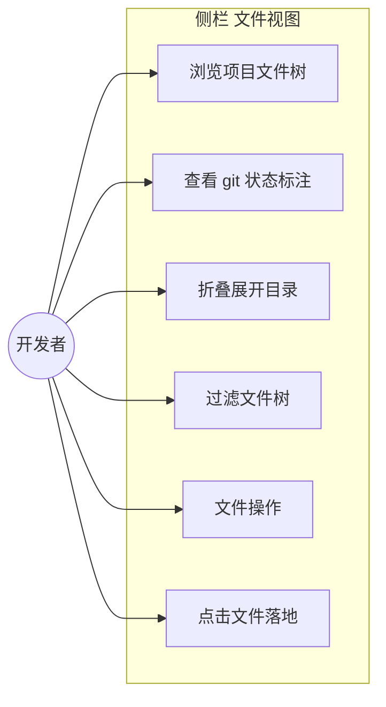
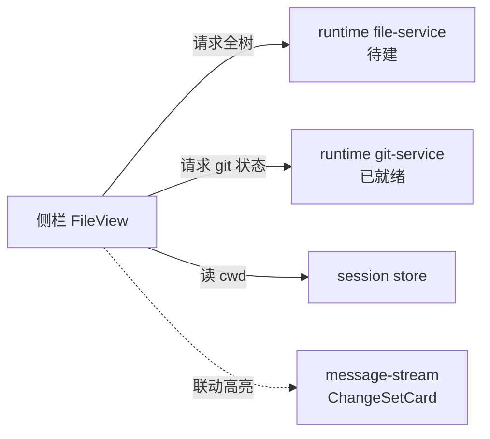

# 侧栏「文件」视图 · 全项目文件树（设计裁决稿）

## 1. 业务目标（Business Goals）

### 背景

Sidebar 的 segmented tab「会话 | 文件」中，「文件」子视图当前实现与设计文档存在根本矛盾：

- **SSOT `docs/page-design/v3/sidebar/spec.md` §视图切换** 定义为「File View 计数 = 当前 active session 的改动文件数，**非全项目**」——即改动文件清单。
- **`handoff-sidebar-file-view.md` §3** 的待办措辞（"文件树：目录折叠 + 文件层级 + 当前编辑文件高亮" + "文件操作：新建/重命名/删除"）暗示全项目文件浏览器。
- **用户预期**：文件视图应是**整个项目的文件树**，git 变更也要展示在其中（标注），而非只列改动文件。

用户裁决：**推翻 spec.md 的「改动清单」定义，重新设计为「全项目文件树 + git 状态标注」**。本稿即此裁决的设计落地。

### 目标树

- **G1: 让用户在侧栏直接浏览项目完整文件结构** — 成功标准：用户切到「文件」tab 后，能看到 session 工作目录下的完整目录树（含未改动文件），而非仅 agent 本次改的文件
  - G1.1: 目录可折叠、多层级缩进
  - G1.2: 未改动文件、改动文件、忽略文件分层可见
- **G2: 在文件树上叠加 git 状态标注** — 成功标准：M/A/D/U 标注覆盖 git status 的全部状态（含 untracked），数据来自真实工作区而非 agent 声明
- **G3: 提供文件树的快速定位能力** — 成功标准：过滤框实时过滤全树（命中高亮、非命中折叠），与全局 ⌘K 严格区分

### 达成路线

| 目标 | 路线/策略 | 对应用例 |
|------|---------|---------|
| G1 | 数据源从 chat store 的 `fileChanges`（改动清单）改为 runtime `file.tree`（全目录树，后端待建）+ session.cwd 作根 | UC-1, UC-3 |
| G2 | git 标注数据源从 `message.file_changes`（单回合增量）改为 `git.status`（全仓库 XY 双列码快照） | UC-2 |
| G3 | 复用现有 FileView 过滤框语义，但过滤范围从「改动文件」扩展到「全树节点」 | UC-4 |

## 2. 业务用例（Use Cases）

### 用例图



### UC-1: 浏览项目完整文件树
- **Actor**: 开发者
- **前置条件**: 已有一个 active session（有 cwd）
- **主流程**: 1. 用户点侧栏「文件」tab 2. 视图加载 session.cwd 下的完整目录树（遵循 .gitignore，默认隐藏 node_modules/dist/.git）3. 顶层目录默认展开，其余折叠 4. 用户看到项目结构
- **替代流程**: 无 active session → 显示空态（引导选择/新建 session）
- **异常流程**: cwd 不存在/无读权限 → 显示错误态 + 重试
- **后置状态**: 文件树已渲染，目录展开态持久化
- **关联目标**: G1
- **验收标准 (AC)**:
  - AC-1.1 [正常]: 文件 tab 打开后，DOM 含 cwd 下顶层所有文件/目录节点（含未改动文件）
  - AC-1.2 [异常]: cwd 无读权限时，显示错误态文案而非空白
  - AC-1.3 [边界]: 无 active session 时显示空态，引导用户选 session

### UC-2: 查看 git 状态标注
- **Actor**: 开发者
- **前置条件**: 文件树已加载；cwd 是 git 仓库
- **主流程**: 1. 视图向 runtime 请求 `git.status` 2. 返回的 `GitFileStatus[]`（XY 双列码）映射到树节点 3. 改动文件显示 M/A/D/U 角标，未改动文件无角标 4. untracked 文件标 A（新增）
- **替代流程**: cwd 非 git 仓库 → 不显示任何 git 角标，文件树正常浏览
- **异常流程**: git.status 请求失败 → 树正常显示，仅缺角标
- **后置状态**: 每个文件节点有正确的 git 标注（或无）
- **关联目标**: G2
- **验收标准 (AC)**:
  - AC-2.1 [正常]: 一个 modified 文件节点显示橙色 M 角标
  - AC-2.2 [正常]: 一个 untracked 文件节点显示绿色 A 角标（来自 git `??`）
  - AC-2.3 [边界]: 非 git 仓库时，无任何角标但文件树可正常浏览
  - AC-2.4 [异常]: git.status 失败时树仍可浏览，角标缺失但不阻塞

### UC-3: 折叠/展开目录
- **Actor**: 开发者
- **前置条件**: 文件树已加载
- **主流程**: 1. 用户点目录行的 chevron/目录名 2. 目录展开（显示子节点）或折叠（隐藏）3. 展开态按 session+路径持久化
- **替代流程**: 无
- **异常流程**: 无
- **后置状态**: 目录展开态持久化，切走再回恢复
- **关联目标**: G1.1
- **验收标准 (AC)**:
  - AC-3.1 [正常]: 点折叠的目录 → 子节点出现在 DOM；再点 → 消失
  - AC-3.2 [边界]: 切到别的 session 再切回，之前的展开态恢复

### UC-4: 过滤文件树
- **Actor**: 开发者
- **前置条件**: 文件树已加载
- **主流程**: 1. 用户在过滤框输入文本 2. 树实时按「路径含关键词」过滤 3. 命中节点高亮关键词，非命中的折叠/隐藏 4. 显示「N 命中 / 总数」
- **替代流程**: 清空过滤框 → 恢复完整树
- **异常流程**: 无匹配 → 显示「无匹配」态
- **后置状态**: 过滤态临时（不持久化）
- **关联目标**: G3
- **验收标准 (AC)**:
  - AC-4.1 [正常]: 输入 "session" → 仅路径含 session 的节点可见，关键词高亮
  - AC-4.2 [边界]: 过滤框是文件树内过滤，与全局 ⌘K 严格区分（无 ⌘K 提示、不弹浮层）
  - AC-4.3 [异常]: 无匹配时显示「无匹配文件」而非空白

### UC-5: 文件操作（新建/重命名/删除）— 后续实现
- **Actor**: 开发者
- **前置条件**: 文件树已加载（注：依赖 runtime file-service，后端当前缺失 G4）
- **主流程**: 右键文件 → 重命名(F2)/删除(⌫)/复制路径(⌥⌘C)；工具栏 → 新建文件/新建文件夹/刷新
- **关联目标**: 无（本轮 demo 设计，实现待后端就绪）
- **验收标准 (AC)**:
  - AC-5.1 [占位]: demo 画出右键菜单 + 工具栏交互（视觉/交互稿），标注「依赖后端 file-service」

### UC-6: 点击文件 → SideDrawer 预览
- **Actor**: 开发者
- **前置条件**: 文件树已加载；有 active Panel
- **主流程**: 1. 用户点文件节点 2. Panel 右侧 SideDrawer 打开 detail-pane tab 3. 预览该文件内容（未改动文件）/ 改动 diff（改动文件）4. 文件树中该节点高亮为「当前编辑文件」（accent-soft）
- **替代流程**: SideDrawer 已打开 → 切换到新点文件的内容
- **异常流程**: 文件读取失败（权限/不存在）→ detail-pane 显示错误态
- **后置状态**: SideDrawer 打开 + 文件节点高亮
- **关联目标**: 无（闭环交互）
- **验收标准 (AC)**:
  - AC-6.1 [正常]: 点文件 → SideDrawer 打开，显示文件内容
  - AC-6.2 [正常]: 点改动文件 → detail-pane 显示 diff（M/A/D 标注对应增删行）
  - AC-6.3 [边界]: 未改动文件点开 → 显示文件内容（无 diff 标注）

## 3. 数据流转（Data Flow）

### 数据流图

```mermaid
flowchart LR
  FS[(文件系统<br/>session.cwd)] -->|fs.readdir<br/>遵循.gitignore| RT[runtime FileTreeService<br/>待建 G2]
  RT -->|file.tree:result<br/>TreeNode[]| FE[前端 fileTree store<br/>待建]
  GIT[(git CLI)] -->|git status --porcelain| GS[runtime git-service<br/>已就绪]
  GS -->|git.status:result<br/>GitFileStatus[] XY码| FE
  SS[session store] -->|active session.cwd| FE
  FE -->|合并 树+标注| FV[FileView.vue<br/>渲染全树+角标]
```

### 数据清单

| 数据 | 来源 | 处理 | 消费者 | 敏感级别 |
|------|------|------|--------|---------|
| 目录树节点 | runtime `file.tree`（待建，fs.readdir + .gitignore 过滤） | 前端 fileTree store 递归渲染 | FileView.vue | 内部 |
| git 状态 | runtime `git.status`（已就绪，XY 双列码） | 按 path 映射到树节点 | FileView.vue 角标 | 内部 |
| cwd 根目录 | session store `active.cwd`（已就绪） | 作文件树根 + git.status 入参 | fileTree store | 内部 |

> **与现有实现的数据源差异**：当前 FileView 数据源是 `message.file_changes`（chat store 聚合 agent 本次改的文件），仅覆盖改动文件。新设计需**双数据源**：file.tree（全树骨架）+ git.status（标注层）。两者都按 session.cwd 索引。

## 4. 功能清单（Features）

| 编号 | 功能 | 对应用例 | 关联目标 | 后端依赖 |
|------|------|---------|---------|---------|
| F1 | 全项目文件树渲染（递归、折叠、.gitignore 过滤） | UC-1, UC-3 | G1 | runtime file-service（**待建 G2**） |
| F2 | git 状态标注（M/A/D/U，全仓库 XY 码） | UC-2 | G2 | runtime git.status（**已就绪**） |
| F3 | 文件树内过滤（实时、命中高亮、非全局 ⌘K） | UC-4 | G3 | 无（前端纯逻辑） |
| F4 | 文件操作（新建/重命名/删除/复制路径） | UC-5 | — | runtime file-service 写操作（**待建 G4**） |
| F5 | 点击文件落地（预览/定位） | UC-6 | — | 待 D-005 裁决 |

## 5. UI/UX 场景（Interface Scenarios）

### 设计原则

复用现有 `draft-file-view.html` 的**视觉骨架**（token / git角标配色 / 过滤框 / 工具栏 / 右键菜单 / 空态 均已对齐 design-tokens），**推翻语义层**：

| 维度 | 现有 draft-file-view.html（改动清单语义） | 新设计（全项目树语义） |
|------|--------------------------------------|----------------------|
| lede | "展示当前 active session 的改动文件树" | "展示 active session 工作目录的完整文件树 + git 标注" |
| tab 计数 | "文件 12 = 改动的 12 个文件" | "文件 N = 项目文件总数"（或去角标，仅标改动数） |
| 数据来源 | message.file_changes（agent 改的） | file.tree（全树）+ git.status（标注） |
| 空态 | "这个会话还没有文件改动" | 两种：① 无 session（引导选 session）② 有 session 但目录空 |
| 树内容 | 仅改动文件 | 全部文件（未改动无角标，改动有角标） |

### 关键交互

1. **切 session 联动**：切 active session → 文件树重新加载为新 session.cwd 的树 + 新 git.status
2. **过滤 vs ⌘K**：过滤框仅过滤当前树（实时、无浮层）；⌘K 是全局 Overlay（命令/文件/符号/会话），两者严格区分（handoff P0）
3. **当前编辑文件高亮**：accent-soft 底 + 文件名 accent（裁决弃左色条，design-system §2 反模式）。高亮来源 = workspace 当前打开的文件（需前端追踪 active file）
4. **点击落地**（D-005 待裁决）：点文件 → [方案待定]

### 落地区候选方案（D-005 决策项）

| 方案 | 落地区 | 优点 | 成本 |
|------|--------|------|------|
| A | Panel 内 SideDrawer 新增 detail-pane tab，预览文件内容/diff | 复用 SideDrawer 抽屉；设计稿 `draft-detail-pane.html` 已有 | SideDrawer 当前锁死 per-Panel + tab 硬编码 terminal/browser/git，需改造；detail-pane 组件未实现 |
| B | message-stream 定位到对应 file-changes 块（高亮滚动） | 最轻量，复用现有 ChangeSetCard | 仅对「改动文件」有效，未改动文件点了无反应 |
| C | 暂不落地，本轮仅做树浏览 + 标注 + 过滤 | 聚焦核心（全项目树），落地后续做 | 点击无响应，体验割裂 |

## 6. 系统间功能关联（Cross-System）

### 关联图



| 关联系统 | 依赖方向 | 交互方式 | 契约稳定性 |
|---------|---------|---------|-----------|
| runtime file-service | FileView → file-service（待建） | WS `file.tree` 请求-响应 | 待定义（新增协议） |
| runtime git-service | FileView → git-service（已就绪） | WS `git.status` 请求-响应 | 已稳定 |
| message-stream | FileView → ChangeSetCard（联动，可选） | 前端事件 | 待 D-005 |

## 7. 约束（Constraints）

- **业务约束**: 文件树浏览范围 = session.cwd 子树，不得越界到 cwd 之外（安全）
- **技术约束（仅记录不展开）**:
  - runtime 当前**无** file-service / `file.tree` 协议（G2 缺失）——本设计的 F1 后端待建
  - runtime `file.read` 限死 skill 目录（G3）——若落地预览需放开工作区权限
  - runtime **无** file 写操作协议（G4）——F4 待建
  - 前端**无** fileTree store / useFileTree composable——需新建

## 8. 不做（Out of Scope）

- **本轮不做**（用户指令「先做这个」聚焦全项目树 demo）：
  - file-service 后端实现（G2）——留 architecture/execution 阶段
  - file 写操作后端（G4）——F4 demo 画交互但标注后续实现
  - 文件内容/diff 预览的完整实现——视 D-005 裁决
  - 嵌套 >3 层的横向省略策略（沿用 spec.md 边缘态「待定」）
- **明确排除**：
  - 不做「跨 session 的全局文件搜索」（那是 ⌘K 的职责）
  - 不做「文件内容编辑器」（那是外部编辑器/未来 workspace 的职责）
  - 不推翻 sidebar 容器四态（A会话/B文件/C收起/D空）——仅重新定义 B 的内容语义

## 决策记录

见 `decisions.md`。核心裁决：
- **D-001** [ask_user/不可逆]: 推翻 spec.md，File View = 全项目文件树 + git 标注
- **D-002** [agent]: 根目录 = session.cwd
- **D-003** [agent]: git 标注数据源 = `git.status`（非 message.file_changes）
- **D-004** [agent]: 遵循 .gitignore + 「显示忽略项」开关
- **D-005** [ask_user/不可逆]: 点文件落地区待裁决（A/B/C 三方案）
- **D-006** [agent]: 文件操作本轮仅 demo 设计，实现待后端

## 待确认

- 无。所有 D 类决策已裁决（D-001~D-006 confirmed）。
