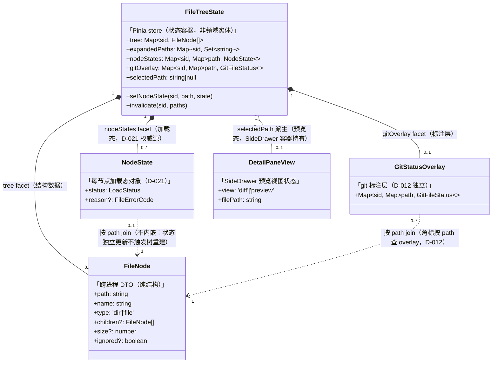
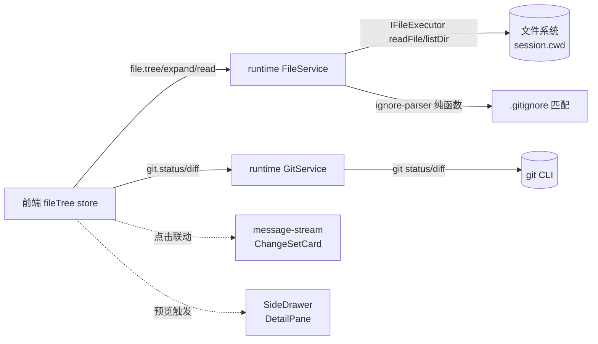
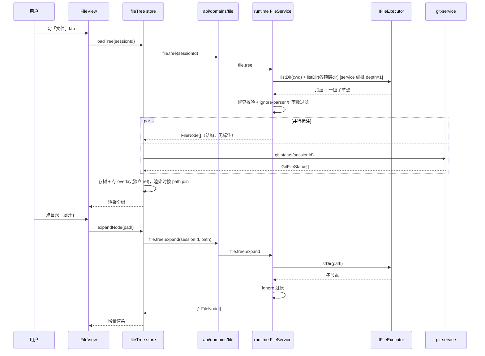
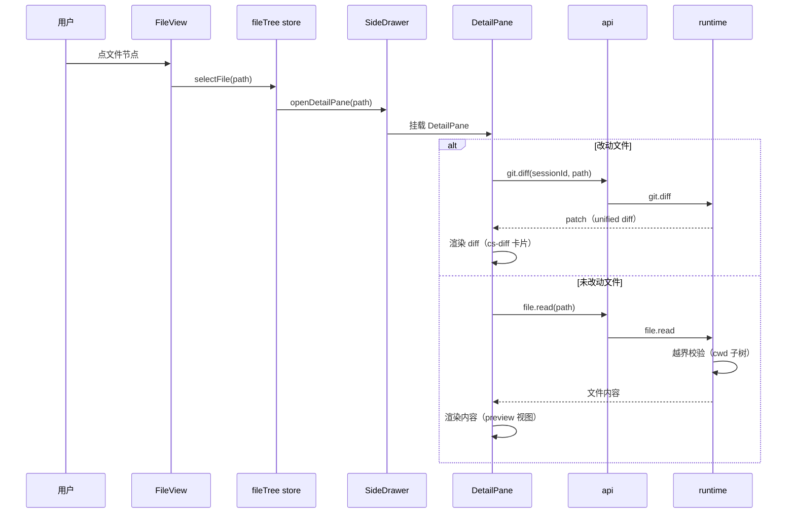

# 全项目文件树 · 系统架构设计

> 承接 `.xyz-harness/2026-06-28-sidebar-project-file-tree/requirements.md`（①clarity 裁决稿）。本阶段把「全项目文件树」设计落地为 runtime + 前端的分层架构。

## 1. 目标转换

### 业务目标 → 系统目标

| 业务目标 (requirements) | 转换为系统目标 | 衡量标准 |
|----------------------|--------------|---------|
| G1 浏览项目完整文件结构 | runtime 提供 `file.tree` / `file.tree.expand` 协议（懒加载目录树）；前端 fileTree store + FileView 渲染 | 切到文件 tab，DOM 含 cwd 下顶层所有文件/目录节点（含未改动文件） |
| G2 文件树叠加 git 标注 | runtime `git.status`（已就绪）作标注层，前端按 path 映射到树节点 | M/A/D/U 角标覆盖 git status 全态（含 untracked） |
| G3 文件树快速定位 | 前端 FileView 过滤框扩为全树节点过滤（复用现有 UI） | 输入关键词实时过滤全树，与 ⌘K 严格区分 |
| UC-5 文件操作 | runtime 新增 file 写协议（create/rename/delete）—— **本轮架构设计，实现延后** | 协议定义 + handler/service 骨架就绪 |
| UC-6 点击落地预览 | runtime 放开 `file.read` 工作区权限 + 新增 `git.diff`；前端 SideDrawer detail-pane | 点文件 → SideDrawer 打开显示文件内容/diff |

### 搭便车改造目标

> 状态流转：`候选` → `待⑤确认` → `已纳入`/`已回流`/`打回`。
> **[回流更新]** D-010 + D-015 已 `confirmed`「全 P1 本轮纳入」，⑤code-arch Step 7 骨架实证工作量未膨胀（见 code-architecture.md「搭便车工作量核对」），4 项状态全部从 `候选` 升 `已纳入`，对应 issue #7/#8/#9/#10。

| 改造目标 | 动机 | 关联业务目标 | 状态 |
|------|------|-------------|------|
| 修 G1：event-adapter cwd 丢失（`index.ts:111` createAdapter 闭包缺 cwd） | 同区域真 bug：file-tree 的 git 标注依赖 cwd，不修则标注不准 | G2 | `已纳入`（#8，D-010①/D-015） |
| 修 G5：convertPiHistory 不还原 fileChanges | 重开 session 历史改动消失；file-tree 查现在态，此查历史态 | G1（互补） | `已纳入`（#9，D-010②/D-015） |
| 整合 FileView/FileTreeRow 重复 TreeNode 类型 → 统一 FileNode | 2 处重复定义（ChangeSetCard 用 FileChange 不在范围，GAP-S6 修正），重写 FileView 时顺带抽到 shared | G1 | `已纳入`（#10，D-010③/D-015） |
| 放开 file.read 工作区权限（从「仅 skill 目录」→「session.cwd 子树」） | UC-6 点击预览必须此项 | UC-6 | `已纳入`（#7，D-010④/D-015） |

## 2. 设计立场

**核心计算 = 文件系统读取 + 路径校验编排（技术编排，非业务规则）。**

runtime 是 pi 引擎的 Node.js 宿主 + 协议适配层（见 `runtime-three-layer-design.md`），领域逻辑薄、适配重。FileService 不引入新的领域规则——它做的是：读目录（fs）+ 过滤（.gitignore）+ 路径越界校验（复用 `shared/path-guard.ts` 的 `isUnderOrEqual`，与 git-service 共用）+ 懒加载编排。

**分层决策**：沿用三层（transport→services→infra）+ ports 依赖倒置。FileService 与 GitService 范式对称（service 编排 + IFileExecutor port + infra fs 实现）。不引入 domain 层（领域贫乏，强行做会空壳）。

## 3. 统一语言（Ubiquitous Language）

> 本节只列本次新增/修改的术语。完整术语表见 `docs/architecture/context.md`。

| 术语 | 定义 |
|------|------|
| **FileNode** | 文件树节点 DTO（目录或文件）。字段：`path` / `name` / `type`（'dir'\|'file'） / `children?`（目录子节点，**[BACKFED D-021]** 仅承载结构数据，不再用三态编码加载态——加载态归 NodeState 权威源）/ `size?`（文件）。**不含 gitStatus**（标注独立存储，见 GitStatusOverlay） |
| **FileTree** | session.cwd 下文件树的**口语称呼**——即 FileNode 的递归结构（根节点 FileNode 经 children 链拿到整棵树）。非独立类型：runtime 协议返回 FileNode[]，前端 store 存 FileNode[]，代码中无 FileTree 类型（骨架实证）。领域上「一个 node 就是 tree 入口」 |
| **懒加载（Lazy Load）** | 首次只拉顶层+一级子目录，展开时按需拉子节点（file.tree.expand） |
| **标注层（Annotation Layer）** | git.status 的 GitFileStatus[] 按 path 映射到独立的 `GitStatusOverlay`（Map<sessionId, Map<path, GitFileStatus>>，**[BACKFED D-021]** per-session 分桶），**不内嵌 FileNode**——前端 join 时按 path 查 overlay |
| **detail-pane** | SideDrawer 内的文件预览 tab（对齐 draft-detail-pane.html），点文件触发 |

> **FileNode 与既有 TreeNode 的关系（GAP-S6 裁决）**：搭便车 D-010③ 整合时，统一命名为 **FileNode**（放 `shared/src/file-tree.ts`）。runtime 协议返回 FileNode\[\]，前端渲染用同一 FileNode 类型——**不再有 TreeNode/FileNode 两套**。**[BACKFED from ③deep-review F1]** 源码实证 `interface TreeNode` 现仅在 **FileView.vue + FileTreeRow.vue 两处**重复定义（ChangeSetCard.vue 用 `FileChange` 非 TreeNode，不在整合范围）——整合范围修正为 2 处。

## 4. 核心模型

> **[D-021 标签修正]** §2 裁决「核心计算是技术编排，领域贫乏，不引入 domain 层（不强上 DDD aggregate）」。故本节类型标签用**前端状态语言**（store 状态容器/状态字段/DTO），非领域语言（实体/值对象/aggregate）——与骨架代码现实一致。FileNode 是唯一跨进程 DTO；FileTreeState 是 Pinia store（状态容器，非领域实体）；NodeState/GitStatusOverlay/DetailPaneView 是 store 内状态字段（前端为 UI 渲染拼装的运行时状态，非领域值对象）。下方「模型关联图」标为**前端状态结构图**，非领域聚合图。

| 模型 | 类型 | 不变式 | 建模理由 |
|------|------|--------|---------|
| **FileNode** | DTO（跨进程数据传输） | path 唯一标识；type ∈ {'dir','file'}；dir 有 children?（**[BACKFED D-021]** 仅承载结构数据，加载态归 NodeState 权威源），file 有 size?；**不含 gitStatus**；**[BACKFED from ③D-020] 加 `ignored?: boolean` 标志**（显示忽略项开关时返回被 .gitignore 匹配的节点带此标志） | 跨进程传输的扁平结构，无行为（贫血 DTO）。runtime↔renderer 经 WS 传 FileNode[]，前端渲染用同类型。标注独立存储（D-012），FileNode 只管结构。ignored 标志支持 D-004「显示忽略项开关」（默认隐藏 ignored=true 节点，开关开时返回并前端灰斜体 D-007②） |
| **FileTreeState**（前端 store） | 状态容器（Pinia store，**非领域实体**） | 一个 sessionId 对应一棵树；root = session.cwd；加载态每节点独立；**[BACKFED from ③D-019] 展开态按 sessionId 缓存，切走保留、切回 rehydrate 恢复** | 前端管理树缓存 + 展开态 + 选中态 + GitOverlay 的状态容器。贫血模型（§2 裁决）：行为拆到 useFileTree composable，store 只持有 state + 薄 action（set/invalidate），无不变式守卫。4 个 facet（树缓存/展开态/加载态/GitOverlay）生命周期一致，是同一变化轴「文件树会话状态」的内聚，不拆文件。**[BACKFED D-019]**：原「整体 reset」澄清为「激活态切换（不再渲染），但展开路径集按 sessionId 缓存待 rehydrate」——满足 ①UC-3 AC-3.2「切回恢复」。**[BACKFED D-021 一致性审查]**：4 facet 全部按 sessionId 分桶（Map<sessionId, Map<path,...>>），切走缓存/切回 rehydrate 覆盖全部 facet，杜绝跨 session 残留脏数据 |
| **NodeState**（每节点状态字段） | 状态字段（store 内 ref，**非领域值对象**） | `{ status: LoadStatus, reason?: FileErrorCode }`；status ∈ 5 态枚举，reason 仅 error 态非空 | **[BACKFED D-021 一致性审查]**：加载态存复合对象而非光杆 string。一个 NodeState 同时承载 Status（状态机）+ Reason（AC-4.7 错误文案区分的数据源），单一更新入口（store.setNodeState 同步 status 与结构），消除「nodeStatus=loaded 但 tree.children=undefined」的双源不一致态。reason 来自 runtime FileError.code（经 WS `error` envelope `{code,message}` 透传） |
| **GitStatusOverlay**（标注层） | 状态字段（store 内独立 ref，**非领域值对象**） | Map<sessionId, Map<path, GitFileStatus>>（**[BACKFED D-021]** per-session 分桶，与 tree/expandedPaths/nodeStatus 同生命周期，切回 rehydrate）；**不内嵌 FileNode**，前端 join 时按 path 查 | git.status 数据与文件树数据生命周期不同（status 变化更频繁），独立存储（store 内独立 ref）避免树重建 |
| **DetailPaneView** | 状态字段（SideDrawer 内 UI 状态，**非领域值对象**） | view ∈ {'diff','preview'}；filePath 非空 | SideDrawer detail-pane 的视图状态，对齐 draft-detail-pane |

### 模型关联图（前端状态结构图）

> **[D-021 一致性审查新增]** 表格表达不了 facet 内聚与按 path join 的关系约束，补 classDiagram。
> **图性质**：这是**前端状态结构图**（store 字段组合 + 渲染时 join），非领域聚合图——§2 裁决领域贫乏不上 DDD，故无领域 aggregate，关系是 store 状态拼装关系。
> 核心结构：FileTreeState 是 Pinia store（状态容器，组合 4 facet 同生命周期），FileNode 是唯一跨进程 DTO（自递归构成树），NodeState/GitStatusOverlay 是 store 内状态字段，**按 path join 关联 FileNode 但不互相内嵌**（D-012 分离 + D-021 对象化）。



> **关系约束（classDiagram 可视化的不变式）**：
> - **4 facet 组合同生命周期**（`FileTreeState *--`）：tree/nodeStates/gitOverlay 随 sessionId 切换同缓存同 rehydrate，这是「文件树会话状态」内聚的体现（D-019/D-021）。此约束是 D-021 #3 的根因——原骨架 gitOverlay/nodeStatus 是 per-path 不分桶，破坏了组合同生灭。
> - **按 path join 不内嵌**（`..>` 虚线）：NodeState/GitStatusOverlay 与 FileNode 编译期无依赖，运行时按 path 查找。这是 D-012「树/标注分离」+ D-021「加载态独立权威源」的体现——status 变化只更新对应 facet，不触发树重建。
> - **单一更新入口**（`setNodeState`）：展开成功时原子「set NodeState.status=loaded + merge tree.children」，消除双源不一致态（D-021 #1 根因）。

### 降级决策（主动不建模）

| 概念 | 为什么不建模 | 应有的处理 |
|------|------------|-----------|
| 「当前编辑文件」 | 不是独立领域概念，是 FileTreeState 的 selectedPath 派生态 | 作为 store 的 computed（get currentFile），不建独立模型 |
| 文件操作（create/rename/delete）的事务 | 无跨步骤事务需求（每步独立），不像 git 操作有 stage→commit 编排 | 每个操作独立 WS 命令，无 aggregate 守卫 |

## 5. 状态流转

### FileNode 加载态（每节点独立，Status 枚举）

> 不设全局整树 loading（懒加载下整树永远在渐进加载）。每节点独立状态机。

| Status | 含义 |
|--------|------|
| `unloaded` | 未加载（children = undefined，仅目录有此态） |
| `loading` | 正在请求 file.tree.expand |
| `loaded` | 已加载（children = FileNode[]，含空目录 []） |
| `error` | 加载失败（可重试） |

### 合法转换

```
unloaded ──(展开)──→ loading ──(成功)──→ loaded
   │                    │
   │                    └──(失败)──→ error ──(重试)──→ loading
   │
   └──(折叠再展开，复用缓存)──→ loaded（不重新请求）

loaded ──(失效触发)──→ invalidated ──(重新展开/刷新)──→ loading ──→ loaded
```

**[BACKFED from ③issues D-017]** 失效转移：`loaded → invalidated`。触发条件 = **agent_end / file_changes ready 帧**（agent 运行中新建/删除/重命名文件后）。失效的节点在下次展开（或显式刷新）时重走 `invalidated → loading → loaded`。
**理由（反哺）**：原 §5 只有 loaded/error 终态，未建模 agent 运行中文件变化。git.status（D-003 实时层）会捕获新文件进 GitOverlay，但 file.tree 快照（session 初加载的 FileNode[]）无对应节点 → overlay 有标注却无树节点 → **G2 对新文件静默失效**。补 `invalidated` 让树结构能随 agent 操作失效重拉，与 overlay 的实时性对齐。

**终态**：`loaded`（成功态，可折叠但数据保留，可被失效触发转 invalidated）；`error`（可重试，非终态）。
**Reason 字段**：error 态附带 reason（如 'permission_denied' / 'not_found'），与 Status 正交。**[BACKFED D-021 一致性审查]** reason 存储在 NodeState 对象的 `reason?` 字段（与 status 同对象，非独立容器），数据源 = runtime `FileError.code`（经 WS `error` envelope `{code,message}` 透传，规范见 `transport/server.ts:388-397` sendError）。前端 composable 捕获 error envelope 后 `setNodeState(path, {status:'error', reason: code})`，AC-4.7「错误文案区分 reason」从 NodeState.reason 读取。

### 转换严格度：宽松（只守 loaded/error 终态）

D-011 决策：不设显式转换表。理由：单用户交互（点展开），无并发竞争（前端是单写者），严格转换表是过度设计。仅守「loaded 后折叠不丢数据」「error 可重试」两个不变式。

### 状态存储模型（D-021 一致性审查）

**双源不一致根因**：原骨架用「光杆原始值」存状态——`nodeStatus: Map<path, LoadStatus>`（光杆 string）与 `tree.children` 三态（undefined/[]/FileNode[]）各编码加载态，更新入口（setNodeStatus/setTree）分离，导致「nodeStatus=loaded 但 tree.children=undefined」不一致态。

**修正**：加载态以 **NodeState 对象**（§4）为单一权威源，`tree.children` 只承载结构数据不再编码加载态。更新走单一入口 `setNodeState(sessionId, path, state)`：展开成功时一次性 `setNodeState('loaded') + merge children`，原子同步避免漏更新。**[BACKFED D-021]**：本节澄清 store 节点状态存储模型，⑥Wave 实现须对齐（骨架代码当前仍为光杆 string，列为 ⑥Wave W3 store 实现待办）。

## 6. 分层架构

### 层级图

```
┌─────────────────────────────────────────────────────────────┐
│                      RUNTIME (Node.js)                        │
└─────────────────────────────────────────────────────────────┘
      ▲ WebSocket
      │
 │  ┌─────────────── ① transport/ ───────────────┐
 │  │  file-message-handler.ts   file.tree/expand/read       │
 │  │  git-message-handler.ts    git.status/diff（扩）        │
 │  └──────────────────────┬────────────────────────────────┘
 │                         │ 调 IFileService / IGitService
 │  ┌──────────────────────┴────────────────────────────────┐
 │  │              ② services/                                │
 │  │  file-service.ts   (新) 编排：cwd解析/越界校验/懒加载    │
 │  │  git-service.ts    (扩) +getFileDiff                    │
 │  │  ── ports（service 定义，infra 实现）──                  │
 │  │  IFileExecutor     fs listDir/stat/readFile（新 port）  │
 │  │  IGitExecutor      (扩白名单加 diff)                    │
 │  └──────────────────────┬────────────────────────────────┘
 │                         │
 │  ┌──────────────────────┴────────────────────────────────┐
 │  │              ③ infra/                                   │
 │  │  fs-executor.ts        (新) node:fs/promises 实现 port  │
 │  │  git-executor.ts       (扩) +diff 命令                  │
 │  │  shared/ignore-parser  (新) .gitignore 纯函数(非 port)  │
 │  │  shared/path-guard     (新) 越界校验纯函数               │
 │  └─────────────────────────────────────────────────────────┘
 │
 │  ┌────────────────── 前端（渲染进程）──────────────────────┐
 │  │  stores/fileTree.ts     (新) FileTreeState + GitOverlay  │
 │  │  composables/useFileTree.ts (新) 拉/展开/选中/预览       │
 │  │  api/domains/file.ts    (新) file.tree/expand/read 封装  │
 │  │  components/sidebar/FileView.vue (重写) 全树渲染         │
 │  │  components/sidebar/FileTreeRow.vue (重写) 递归行        │
 │  │  components/panel/SideDrawer.vue (改造) +detail tab      │
 │  │  components/panel/DetailPane.vue (新) 文件预览           │
 │  └─────────────────────────────────────────────────────────┘
```

### Port 清单

| Port | 价值定位 | 实现数 |
|------|---------|--------|
| **IFileExecutor** | 封装 fs 访问（`listDir(path)` 单层 readdir + `stat(path)` + `readFile(path)`），让 FileService 可 mock 测试（不依赖真磁盘） | 1（fs-executor），可测性价值 |
| **IGitExecutor**（扩） | 已有 port，扩白名单加 `diff` 命令 | 1（git-executor） |

> **[REVISIT of D-008] IIgnoreReader 改纯函数范式**（GAP-S3 裁决）：原 D-008 把 .gitignore 解析包成 IIgnoreReader port，但既有 git-service.ts:26 实证 `parseGitStatus` 等**纯函数直接从 infra import 豁免**（不包 port，注释标 §5.1 豁免）。为与 GitService 范式真对称，.gitignore 解析同样改为**纯函数**：
> - `shared/ignore-parser.ts` 导出纯函数 `compileIgnoreRules(content: string): IgnoreMatcher` + `matchPath(matcher, path): boolean`（无 IO，纯计算）。**放 shared 而非 infra**——纯函数无 IO/无外部依赖，与 `shared/path-guard.ts` 同层（service 从 shared 引纯函数不违反三层纪律，AC-1 专注 service 不 import infra 的 IO 实现）。**[BACKFED from ③D-020]** 为支持「显示忽略项开关」，FileService 调 matchPath 时分双模式：默认隐藏（matchPath=true 的节点移除）；显示模式（matchPath=true 的节点保留并标 `ignored=true`，FileNode 加 ignored? 字段）。matchPath 纯函数不变，模式切换在 FileService 编排层
> - FileService 经 `IFileExecutor.readFile` 读 `.gitignore` 内容（IO 走 port），再调 `shared/ignore-parser` 纯函数匹配（计算走 shared）
> - 这与 `git-status-parser` 对称（GitService 经 IGitExecutor 跑 git status IO，再调 parser 纯函数）。**IIgnoreReader port 取消**。
>
> **IFileExecutor 接口签名**（GAP-S5 裁决）：`listDir(path)` **单层 readdir**（不递归）。depth=1 的「顶层+一级子目录」由 **FileService 编排**（service 调一次 listDir(cwd) 拿顶层，对其中 dir 再调 listDir 拿一级子——2 次 listDir）。executor 只做薄 IO，不承担递归编排（符合 infra「只做薄 IO」）。
>
> **file.read 内容读取路径**（GAP-S4 裁决）：搭便车 D-010④「放开 file.read 工作区权限」**隐含重构进 service**——现有 `server.ts:472` transport 直接 fs 违反三层纪律（three-layer:149「transport 不碰 node:内置」）。改造后：`file.read` handler → FileService.readFile（做 cwd 越界校验）→ IFileExecutor.readFile（fs）。IFileExecutor port 需含 `readFile` 方法。
>
> **Port 真伪自检（删/翻/挪）**：
> - IFileExecutor：删→FileService 内联 fs→测试要真磁盘/mock fs 模块→复杂度塌缩但不集中 → **port 真实**（可测性收益，与 IGitExecutor 对称）
> - 翻方向：service new infra→违反三层铁律 → **不可翻**

## 7. 模块划分与变化轴

### runtime 侧

| 模块 | 职责 | 变化轴 | LOC(预估) |
|------|------|--------|----------|
| `file-service.ts`（新） | 编排：cwd 解析、越界校验（复用 `shared/path-guard.ts`）、懒加载分页、ignore 过滤应用（调 `shared/ignore-parser` 纯函数） | 「文件树编排逻辑」 | ~120 |
| `fs-executor.ts`（新，infra） | node:fs/promises 封装：listDir(单层 readdir) + stat + readFile | 「fs 访问实现」 | ~70 |
| `ignore-parser.ts`（新，shared，纯函数） | .gitignore 规则编译 + 路径匹配（纯函数，无 IO，仿 git-status-parser 范式） | 「ignore 匹配算法」 | ~50 |
| `path-guard.ts`（新，shared） | `isUnderOrEqual(cwd, path)` 越界校验纯函数（**[BACKFED from ③deep-review F2]** 源码实证该函数现 `n` 在 `utils/path-utils.ts`，被 git-service + extension-service 共用——本 issue 从 utils 提升到 shared，file-service + git-service + extension-service 三者共用） | 「路径安全校验」 | ~20 |
| `file-message-handler.ts`（新，transport） | file.tree/expand/read 路由 + 参数提取 | 「WS 协议路由」 | ~80 |
| `git-message-handler.ts`（扩，transport） | +git.diff 路由 | 「WS 协议路由」（已有轴） | +15 |
| `git-service.ts`（扩） | +getFileDiff（调 IGitExecutor diff） | 「git 操作」（已有轴） | +30 |
| `protocol.ts`（扩，shared） | +file.tree/expand 类型；git.diff 类型 | 「WS 协议类型」 | +40 |

### 前端侧

| 模块 | 职责 | 变化轴 | LOC(预估) |
|------|------|--------|----------|
| `stores/fileTree.ts`（新） | FileTreeState：树缓存/展开态/选中态 + GitStatusOverlay（独立 ref）。暴露 `invalidate(sessionId, paths)` 接口供 composable 派发失效（**[BACKFED from ③D-017 + ④NFR K-9]** 跨 store 失效触发不在 store 内监听——违反 `stores/chat.ts` 明文「stores 间禁止互相 import」；由 useFileTree composable 编排，见下） | 「文件树会话状态」（4 facet 内聚，同生命周期）+ 失效接口 | ~150 |
| `composables/useFileTree.ts`（新） | 拉/展开/选中/过滤的业务编排（文件树内交互）。**[BACKFED from ④NFR K-9]** 编排跨 store 失效触发：`watch` chat store 的 file_changes ready 事件（agent_end 时）→ 按 sessionId 过滤 + 路径定位 → 派发 fileTree store 的 `invalidate` 接口（不违反 stores 间禁止 import 约束，编排发生在 composable 层） | 「文件树交互逻辑」+ 跨 store 失效编排 | ~90 |
| `composables/useDetailPane.ts`（新） | 预览触发/视图切换(diff/preview)/diff 读取（SideDrawer 内交互，与 useFileTree 解耦） | 「文件预览交互逻辑」 | ~60 |
| `api/domains/file.ts`（新） | file.tree/expand/read WS 封装 | 「WS 调用」 | ~40 |
| `api/domains/git.ts`（扩） | +getDiff（git.diff 封装） | 「WS 调用」（已有轴） | +15 |
| `FileView.vue`（重写） | 全树渲染 + 过滤 + 空态 | 「文件树视图」 | ~180 |
| `FileTreeRow.vue`（重写） | 递归行：折叠/图标/角标/点击 | 「树行渲染」 | ~130 |
| `SideDrawer.vue`（改造） | +detail tab 类型 + DetailPane 挂载 | 「抽屉容器」（已有轴） | +30 |
| `DetailPane.vue`（新） | 文件内容/diff 预览（对齐 draft-detail-pane） | 「文件预览视图」 | ~200 |

## 8. 系统间上下文边界（Context Map）



| 关联系统 | 关系模式 | 交互方式 | 契约稳定性 |
|---------|---------|---------|-----------|
| runtime FileService | 客户-供应商（前端是客户） | WS file.tree/expand/read | 新建（本轮定义） |
| runtime GitService | 客户-供应商 | WS git.status/diff | git.status 已稳定；git.diff 新增 |
| 文件系统 | 共享内核（session.cwd） | fs（经 IFileExecutor） | 稳定（OS） |
| message-stream | 上游（联动可选） | 前端事件 | 现有 |

## 9. 泳道图（Swimlane）

### 9.1 懒加载文件树（首次 + 展开）



### 9.2 点击文件 → SideDrawer 预览



## 10. 挑战与决策

### D-008: FileService 分层深度（三层 + port）
**张力**: 文件系统是稳定内置依赖（不像 pi/git 有替换需求），抽 port 是否过度设计 vs 可测性/范式对称
**决策**: 三层沿用 + IFileExecutor port。（注：原含 IIgnoreReader port，**已由 D-013 supersede**——ignore 改纯函数范式）
**理由**: 与 GitService/IGitExecutor 范式对称；fs 访问可 mock（测试不依赖真磁盘）。IFileExecutor port 真实（deletion test：删则 service 内联 fs 违反 AC-2 或测试塌缩）。

### D-013: [REVISIT of D-008] IIgnoreReader 改纯函数
**张力**: ignore 包 port vs 仿 git-status-parser 纯函数豁免范式
**决策**: `shared/ignore-parser.ts` 纯函数（compileIgnoreRules/matchPath，无 IO 属 shared 层）；IO 走 IFileExecutor.readFile。IIgnoreReader port **取消**
**理由**: git-service.ts:26 实证 GitService 直接 import git-status-parser 纯函数豁免（不包 port），原 D-008 声称「范式对称」却把 ignore 包 port 实际不对称。纯函数更干净且与 git-status-parser 真对称。放 shared 而非 infra：纯函数无 IO/无外部依赖，service 从 shared 引纯函数不违反三层纪律（AC-1 约束的是 service 不 import infra 的 IO 实现）。

### D-009: 文件树加载策略（懒加载）
**张力**: 全量加载简单但大项目慢 vs 懒加载复杂但性能好
**决策**: 懒加载（file.tree 顶层 + file.tree.expand 按需）
**理由**: 全量加载在 node_modules 同级项多的项目首加载慢/内存大；虚拟滚动引入前端复杂度（过度工程）。懒加载每节点独立态，渐进加载。

### D-011: 状态机严格度（宽松，只守终态）
**张力**: 显式转换表早暴露错误 vs 宽松灵活
**决策**: 宽松（只守 loaded/error 终态 + loaded后折叠不丢数据 + error可重试）。**[BACKFED from ③ D-017]**：补 `loaded→invalidated→loading` 失效转移（agent_end/file_changes ready 触发），但仍是「宽松」范式——只增加一条失效边，不设完整显式转换表
**理由**: 单用户交互、前端单写者、无并发竞争。严格转换表是过度设计。失效转移是回应 D-017 发现的真实场景（agent 运行中文件变化），单条转移边不破坏宽松范式。

### D-017: [REVISIT/BACKFED from ③issues] 文件树缓存失效机制
**张力**: 树快照稳定（session 初加载）vs 文件实际会变（agent 运行中新建/删除）→ 树/标注生命周期不同步
**决策**: 补 `loaded→invalidated→loading` 失效转移（§5）。触发 = agent_end / file_changes ready 帧。失效的节点下次展开/刷新重拉。git.status 实时层捕获新文件进 overlay，树失效重拉补节点后角标正确挂载。**[BACKFED from ④NFR K-9]** 失效触发的**编排位置在 composable 层（useFileTree），非 store 层**——stores 间禁止互相 import（见 `stores/chat.ts`），useFileTree `watch` chat store 的 file_changes 事件 + 派发 fileTree store 的 `invalidate` 接口
**理由**: ③追踪发现 git.status（D-003）捕获新文件进 overlay 但 file.tree 快照无节点 → overlay 有标注无树节点 → G2 对新文件静默失效。补失效转移让树结构与 overlay 实时性对齐。**反哺②**：本决策在 ③issues 阶段发现并回填 ②§5/§10。

### D-019: [REVISIT/BACKFED from ③issues] 展开态持久化（rehydrate）
**张力**: ①UC-3 AC-3.2「切回恢复」+ 后置「持久化」 vs ②§4 原「整体 reset」(销毁语义)
**决策**: ②§4「整体 reset」澄清为「切走按 sessionId 缓存展开路径集，切回 rehydrate 恢复」（非销毁）。store 内按 sessionId 保留展开态
**理由**: ③跨阶段审计发现三角矛盾，②原 reset 语义会丢展开态违反 ①UC-3。用户裁决按 session 缓存+rehydrate。**反哺②**：§4 FileTreeState 不变式已更新。

### D-020: [BACKFED from ③issues] 显示忽略项开关（FileNode ignored 字段 + 双模式）
**张力**: D-004（显示忽略项开关）+ D-007②（灰斜体）需显示被 .gitignore 匹配的节点 vs 原 ignore-parser 只过滤隐藏
**决策**: FileNode 加 `ignored?: boolean` 标志（§4 已更新）；FileService 双模式编排（默认隐藏 / 显示模式标 ignored=true 保留）；前端开关 + 灰斜体（D-007②）。本轮纳入 P1 issue（原裁决 P3 #15 经用户复审改 P1）
**理由**: ③跨阶段审计发现 D-004（agent-opinionated）+ D-007（ask_user）confirmed 但原裁决延后 P3，用户复审改本轮纳入。**反哺②**：§4 FileNode 模型 + §6 ignore 双模式已更新。

### D-012: 文件树与 git 标注数据彻底分离（FileNode 不含 gitStatus）
**张力**: 树节点直接内嵌 gitStatus vs 独立 overlay 映射
**决策**: FileNode **不含 gitStatus**（纯结构 DTO）；前端 store 内 GitStatusOverlay 独立 ref（Map<path, GitFileStatus>），渲染时按 path join。**runtime file.tree 响应不合并 status**（纯两步：file.tree 拿结构 + git.status 拿标注）
**理由**: 树数据（结构）与标注数据（状态）生命周期不同——status 随 agent 操作频繁变，树结构稳定。FileNode 不带 gitStatus 则 status 变化只更新 overlay ref，不触发树重建。runtime 不合并避免「status 变了要重拉整棵树」的耦合。

### 特化决策（违反通用规则的）

| 决策 | 违反什么 | 为什么合理 | 触发变化怎么办 |
|------|---------|-----------|--------------|
| file.read 放开工作区权限 | 现有「仅 skill 目录」白名单（G3） | UC-6 预览需要读项目文件；越界校验用 cwd 子树（复用 isUnderOrEqual）替代 skill 白名单 | 若需更细粒度权限，加 per-path ACL（不影响架构） |
| SideDrawer 加 detail tab | 现有 tab 硬编码 terminal/browser/git | detail-pane 是独立视图类型，对齐 draft-detail-pane 设计 | 若 tab 类型膨胀，抽 tab registry（当前 4 个无需） |
| isUnderOrEqual 抽 shared/path-guard.ts | **[BACKFED from ③deep-review F2]** 源码实证该函数（`n`）现已在 `utils/path-utils.ts`，git-service + extension-service 共用（非 git-service 内联） | file-service + git-service + extension-service 三者共用越界校验，从 utils 提升到 shared 避免跨 service 依赖（service 间不互相 import 工具函数）；纯函数无 IO，shared 层合适 | 若需平台特定路径逻辑，扩 path-guard（不影响 service） |
| useFileTree 拆 useDetailPane | 单一 composable 原则 | 文件树交互（侧栏）与预览交互（SideDrawer）是两个 UI 区，生命周期不同；拆开各管一区 | — |

## 11. 反模式检查（grep 验收清单）

机器可检查的 AC（实现后验证，针对 src-electron/ 实际源码；⑤骨架验证为子集）：

### AC-1: service 不直接 import infra 的 IO 实现
- 验证：`grep -rn "infra/" src-electron/runtime/src/services/file-service.ts` 无输出（注：纯函数 parser 豁免——`shared/ignore-parser`、`shared/path-guard` 属 shared 不属 infra）

### AC-2: service 不出现 node:fs
- 验证：`grep -rn "node:fs" src-electron/runtime/src/services/file-service.ts` 无输出（fs 仅在 infra/fs-executor）

### AC-2b: transport 不碰 node:内置（three-layer:149）
- 验证：`grep -rn "node:fs" src-electron/runtime/src/transport/` 无输出 + `grep -rn "node:path" src-electron/runtime/src/transport/` 无输出 + `grep -rn "node:os" src-electron/runtime/src/transport/` 无输出（file.read 重构后内容读取下沉 FileService，transport 只路由）。**[BACKFED from ⑤code-arch K-2]** 原 AC-2b 仅 grep `node:fs`，漏掉 `fs/promises` 动态 import 形式（现有 server.ts:492 `await import(fs/promises)` 正是此形式——要修的违纪会被旧 AC 误判通过）+ BC-3 下沉后残留的 `node:path`(resolve)/`node:os`(homedir)。`node:http` 作为 WebSocket server 宿主豁免（单独白名单，非 IO 业务）

### AC-3: FileService 不出现 PiXxx 类型
- 验证：`grep -rn "Pi[A-Z]" src-electron/runtime/src/services/file-service.ts` 无输出

### AC-4: 前端 FileView 不直接调 ws-client
- 验证：`grep -rn "ws-client" src-electron/renderer/src/components/sidebar/FileView.vue` 无输出（经 api/domains/file）

### AC-5: FileView/FileTreeRow TreeNode 统一来源
- 验证：`grep -rn "interface TreeNode" src-electron/renderer/src/components/` 仅命中 shared 定义处（**[BACKFED from ③deep-review F1]** 实证现状为 FileView.vue + FileTreeRow.vue 2 处，非 3 处——ChangeSetCard 用 FileChange 不在范围）

### AC-6: file.read 越界校验在 service 层（非 transport）
- 验证（正向）：`grep -rn "isUnderOrEqual" src-electron/runtime/src/services/file-service.ts` 有输出（越界校验在 FileService）；`grep -rn "isUnderOrEqual" src-electron/runtime/src/transport/` 无输出。**注**：正向断言（有输出），非违规检查——⑤骨架 file-service.ts 含 isUnderOrEqual 调用即合规

## 12. 行为契约保持清单（refactor 模式）

> 重构要保持现有行为等价。本节登记「代码有但 requirements 没写」的行为，架构变更与行为变更分离。

### BC-1: message.file_changes 通道保持不变
| 字段 | 内容 |
|------|------|
| 源码位置 | `runtime/src/infra/pi/event-adapter.ts`：`sendAccumulatingFileChanges`（L222-235）+ `sendReadyFileChanges`（L238-254） |
| 处理 | **保持**（file-tree 不动此通道；它仍服务于 ChangeSetCard） |
| 保持的精确契约 | **accumulating 帧**（write/edit 工具 end 时推）：`{type:'message.file_changes', payload:{sessionId, messageId, fileChanges:[单个change], changeSetStatus:'accumulating', isFullSet:false}}`。**ready 帧**（agent_end 时推）：`{...fileChanges:fullSet, changeSetStatus:'ready', isFullSet:true}`，ready 帧经 `reconcileFileChanges(cwd)` git 对账 + `mergeWithIncremental` 合并。**时序**：accumulating 增量先发，agent_end ready 全集收口，之后清空 accumulatedChanges。**依赖**：ready 帧依赖 `options.cwd`（BC-5 修复后注入） |
| 冲突 | 无 |

### BC-2: git.status 协议保持不变
| 字段 | 内容 |
|------|------|
| 源码位置 | `runtime/src/services/git-service.ts`（getStatus）+ `shared/src/protocol.ts`（git.status 类型） |
| 处理 | **保持**（file-tree 复用它作标注层，不改其行为） |
| 冲突 | 无 |

### BC-3: file.read 现有 skill/npm 目录白名单
| 字段 | 内容 |
|------|------|
| 源码位置 | `runtime/src/transport/server.ts`（handleFileRead，`allowedPrefixes`） |
| 现状行为 | 白名单为 **3 个目录**：①`~/.agents/skills`（全局 skill）② pi agent 目录下的 `skills` ③ pi agent 目录下的 `npm`（npm 包目录，非 skill） |
| 处理 | **变更**（→搭便车 D-010④）：白名单扩展为「**原有 3 目录保留** ∪ session.cwd 子树」。同时重构进 FileService（解除 transport 直接 fs 的三层违纪）。**独立 ticket**：file.read 权限 + 三层重构 |
| 冲突 | `[CONFLICT]` 无（扩展不收紧，原有 3 目录全保留含 npm 目录，向后兼容） |

### BC-4: FileView 现有「改动文件清单」行为（主变更，拆子行为）
| 字段 | 内容 |
|------|------|
| 源码位置 | `renderer/src/components/sidebar/FileView.vue` + `Sidebar.vue:177`（聚合 fileChanges） |
| 处理 | **变更**（→本主题核心）。拆 3 个子行为： |
| BC-4a 数据源 | props.changes（FileChange\[\]）→ file.tree（FileNode\[\]）+ git.status overlay。**变更** |
| BC-4b 过滤框语义 | 现有 `filterText` 按 `filePath.includes(q)` 过滤 FileChange\[\]（FileView.vue:86-90）→ 扩展为过滤全树 FileNode\[\]。**变更**（过滤对象扩展，requirements UC-4） |
| BC-4c 默认展开态 | 现有 `buildTree` 默认**全展开**目录（FileView.vue:97，注释「改动文件少全展开」）→ 懒加载默认**仅顶层展开**（D-009）。**变更** |
| BC-4d 计数语义 | 现有「改动文件计数」→ 「项目文件总数 ·N改」（D-007）。**变更** |
| 冲突 | `[CONFLICT]` 无（推翻是有意为之，requirements 已裁决 D-001） |

### BC-5: event-adapter 的 file_changes cwd 丢失（G1 bug）
| 字段 | 内容 |
|------|------|
| 源码位置 | `runtime/src/index.ts:111`（createAdapter 闭包缺 cwd） |
| 处理 | **变更**（→搭便车 D-010①）：createAdapter 注入 session.cwd。**独立 ticket**：修 G1 |
| 冲突 | 无（修 bug） |

### BC-6: convertPiHistory 不还原 fileChanges（G5）
| 字段 | 内容 |
|------|------|
| 源码位置 | `runtime/src/infra/pi/message-converter.ts`（convertPiHistory 无 fileChanges） |
| 处理 | **变更**（→搭便车 D-010②）：历史路径还原 fileChanges。**独立 ticket**：修 G5 |
| 冲突 | 无 |

## 下游衔接

### Step 6b 反哺记录（来自下游阶段）

- **[BACKFED from ③issues D-017]**：§5 状态机补 `loaded→invalidated→loading` 失效转移；§10 补 D-017 决策条目
- **[BACKFED from ④NFR K-9]**：§7 stores/fileTree.ts 改为暴露 invalidate 接口（不自行监听）；composables/useFileTree.ts 增加跨 store 失效编排职责；§10 D-017 补「编排位置在 composable 层」
- **[BACKFED from ⑤code-arch K-2]**：§11 AC-2b grep pattern 扩展——原仅 `node:fs`，补 `fs/promises` 动态 import 形式 + `node:path`/`node:os`（BC-3 下沉后须清零）。`node:http` 作 WS 宿主豁免。理由：⑤结构帧源码实证 server.ts:492 `await import('fs/promises')` 是真实三层违纪，旧 AC grep `node:fs` 漏掉此形式会误判通过

### 喂给 Step 3（Issue 拆分）的部分

| 本文档章节 | issue 拆分用途 |
|-----------|--------------|
| §6 Port 清单 | 每个 port = 一个 runtime infra issue |
| §7 模块划分 | 每个新模块 = 一个 issue（runtime/file 域 + 前端 store/composable/component）|
| §10 D-012 数据分离 | file.tree 响应结构 issue（是否合并 status）|
| §11 grep AC | 每个 AC = 一个验收项，并入相关 issue |
| §12 行为契约 BC-3~BC-6 | 每个变更行为 = 独立 ticket（搭便车 + 主变更分离）|

## 待确认

- 无未决 D 类决策。搭便车 4 项 D-010/D-015 已 `confirmed` 全纳入 P1（§1 状态已回流 `已纳入`），工作量 ⑤code-arch Step 7 骨架已实证未膨胀。
