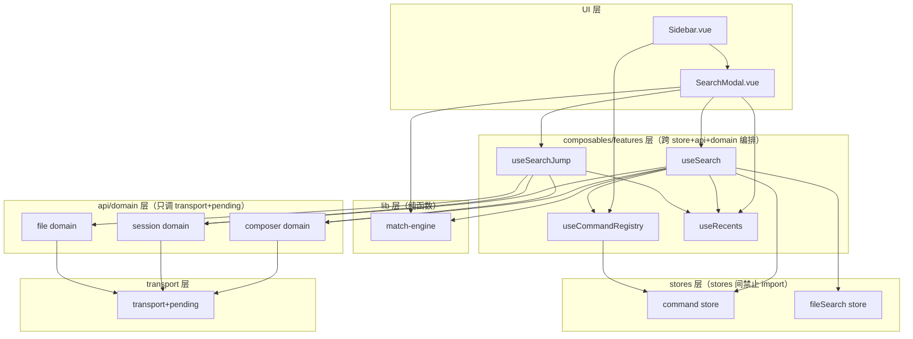
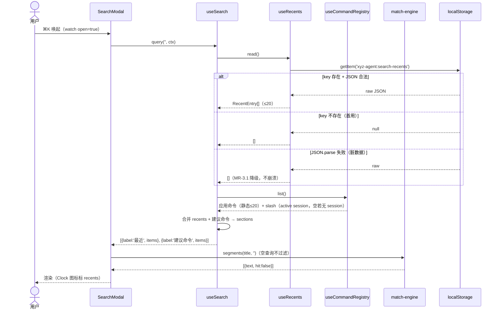
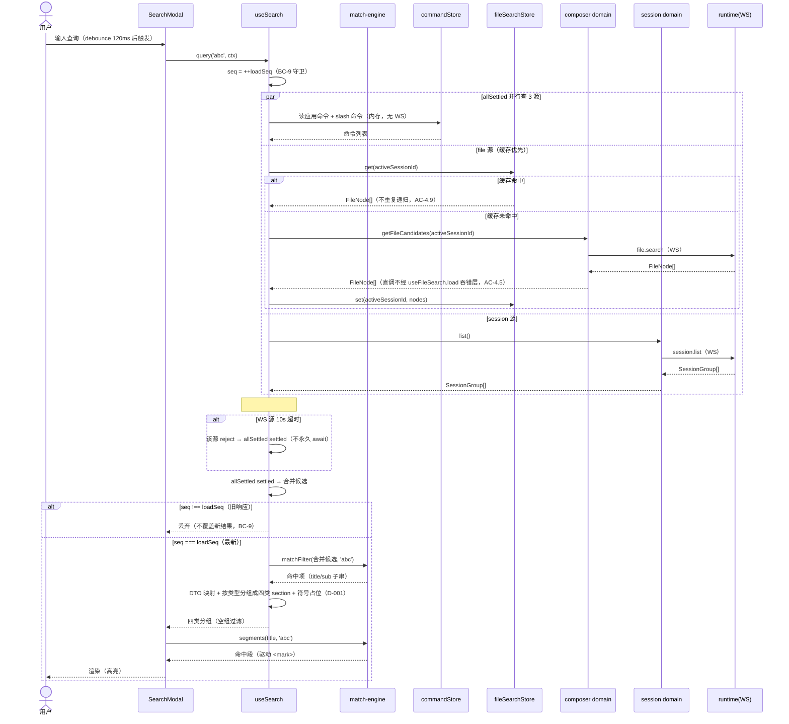
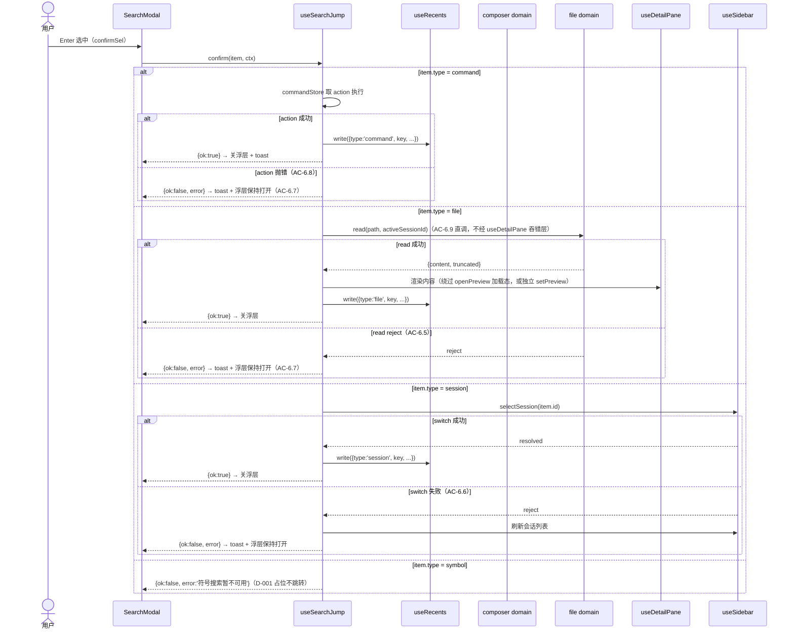
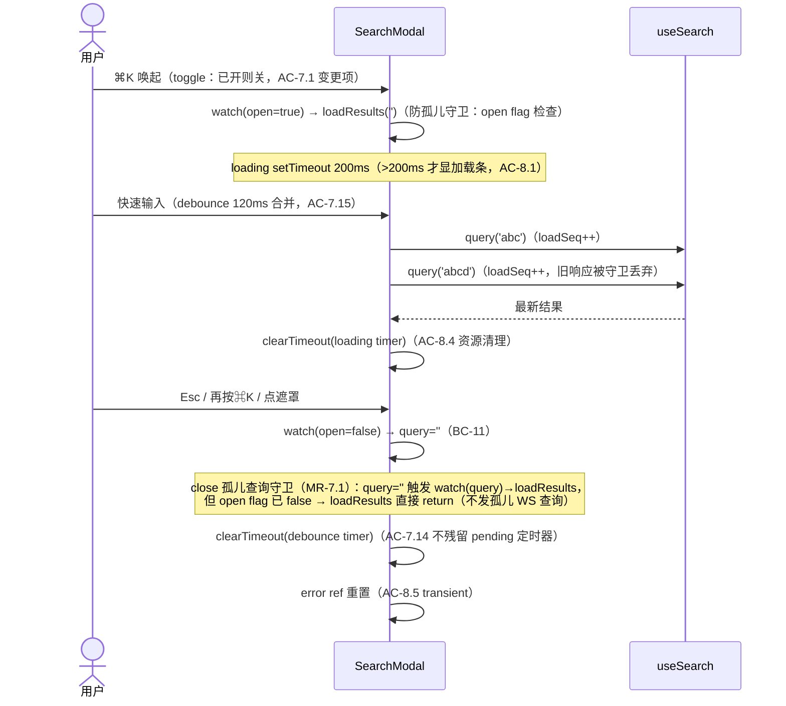

# 代码架构设计 — ⌘K 全局搜索浮层

> 基于①requirements UC/AC、②system-architecture 三层分层+模块划分+BC 清单、③issues 11 issue 方案、④non-functional-design 14 缓解项 + 5 骨架验证副作用。
> **[D-026 REVISIT]** ⑤grilling 发现 issues #4 方案A「domain 编排」违反现有「10 个 domain 严格只调 transport+pending」铁律，编排归 `composables/features/useSearch.ts`（与 useSidebar/useFileSearch 同层跨 store+domain 编排模式），**不新建 api/domains/search.ts**。本文按 D-026 真实状态设计。

## 1. 工程目录

```
src-electron/renderer/src/
├── lib/
│   ├── match-engine.ts          【新建】匹配引擎纯函数（#1）：matchFilter + segments
│   └── search-types.ts          【新建】共享类型 + 常量（被 5 模块依赖）：SearchType re-export + AppCommand/RecentEntry/Section/SearchCtx/JumpCtx + RECENTS_STORAGE_KEY/WS_SOURCE_TIMEOUT_MS/RECENTS_PER_TYPE `[BACKFED from execution consistency-final on 2026-06-30] 补登记骨架叶子（lib/search-types.ts 是 Tier 0 共享类型源）`
├── composables/
│   └── features/
│       ├── useSearch.ts         【新建】搜索编排（#4 D-026）：聚合 4 源 query() + loadSeq + WS 超时 race（#17）+ 分组
│       ├── useCommandRegistry.ts【新建】命令注册表聚合（#2）：appCommands 静态 + slashCommands per-session → 统一列表
│       ├── useSearchJump.ts     【新建】跳转编排（#6）：confirm(item) switch 分发 命令/文件/会话
│       └── useRecents.ts        【新建】recents 持久化（#3）：localStorage 读写 + FIFO 淘汰
├── stores/
│   ├── command.ts               【扩展】+ appCommands 全局应用命令区（D-016 两区物理隔离）
│   └── fileSearch.ts            【复用】session 级缓存（AC-4.9），search 复用读+自绑失效（AC-4.10）
├── api/
│   ├── index.ts                 【改造】search 门面：删 mock 常驻（#5），mock/real 两侧都不再是 domain（search 无 WS domain，编排归 useSearch）
│   └── mock/
│      ├── search-data.ts        【保留】SearchType/SearchItem 类型源（被 useSearch DTO 映射目标引用）+ mock fixture
│      └── index.ts              【改造】search mock：保留 query()（mock 轨），real 轨不再有 domain 可指
├── components/
│   ├── overlays/
│   │   └── SearchModal.vue      【改造】收敛为纯 UI（#7）：loadResults→useSearch.query；segments→match-engine；confirmSel→useSearchJump.confirm；recents→useRecents；+ debounce + loadSeq 迁移 + ⌘K toggle + close 孤儿守卫 + loading/error 态（#8）
│   └── sidebar/
│       └── Sidebar.vue          【改造】keydown 接命令注册表（#10 搭便车，待骨架确认）：⌘N/⌘K/⌘B 从 useCommandRegistry 读，⌘K 改 toggle
└── __tests__/                   【新建测试目录】见 §6 test-matrix
    ├── lib/match-engine.test.ts
    ├── composables/useSearch.test.ts
    ├── composables/useCommandRegistry.test.ts
    ├── composables/useSearchJump.test.ts
    ├── composables/useRecents.test.ts
    ├── stores/command-app.test.ts
    └── components/search-modal.test.ts (集成)
```

**变化轴标注（每目录=一变化轴）：**
- `lib/match-engine.ts` — 变化轴「匹配算法」（纯函数，无副作用，#1 AC-1.2 grep 验收）
- `composables/features/useSearch.ts` — 变化轴「搜索编排」（聚合 4 源 + 并发守卫 + 超时 race，#4 + #17）
- `composables/features/useCommandRegistry.ts` — 变化轴「命令聚合」（两区合并，#2）
- `composables/features/useSearchJump.ts` — 变化轴「跳转路由」（type switch 分发，#6）
- `composables/features/useRecents.ts` — 变化轴「recents 持久化」（localStorage + FIFO，#3）
- `stores/command.ts` — 扩展轴「应用命令区」（与 slash 命令区物理隔离，D-016）
- `components/overlays/SearchModal.vue` — 变化轴「UI 交互」（键盘导航 + 渲染，#7）

**依赖方向（D-026 后）：** lib → composables → stores/api → transport。composable 层是「唯一跨 store+api+domain 的层」（与 useSidebar/useFileSearch 铁律一致），domain 层（composer/session/file）保持只调 transport+pending 的纯净。

**[BACKFED from execution consistency-final on 2026-06-30] lib 提取范围说明：** D-026 rationale 提「recents 读写/命令聚合/DTO 映射提取为 lib 纯函数」。⑤骨架实际把 DTO 映射（mapFilesToItems/mapSessionsToItems）+ 命令聚合（useCommandRegistry.list computed）+ recents FIFO 逻辑（filterPerType）保留在 composable/useRecents 内，仅 lib/search-types.ts 提取共享类型+常量，lib/match-engine.ts 提取纯算法。理由：DTO 映射/FIFO 逻辑虽有计算成分，但与 composable 响应式上下文紧密耦合（computed/watch/ref），强行提纯到 lib 需传大量参数，收益低于成本。这是对 D-026 rationale 建议的合理工程细化（D-026 核心约束「编排归 composable」已守住，lib 提取范围是可逆实现细节）。

## 2. 包依赖图



**import 规则：**
- `stores/*` 之间**禁止互相 import**（与现有 chat/fileTree/fileSearch 一致）——跨 store 编排在 composable 层 watch
- `api/domains/*` 之间**禁止互相 import**——domain 只调 transport+pending，domain→domain 调用由 composable 编排（useSearch 调 composer+session domain）
- `composables/features/*` 可 import stores + api/domains + lib（同 useSidebar/useFileSearch 模式）
- `lib/*` **禁止 import** 任何 stores/api/composables（纯函数铁律，#1 AC-1.2 grep 验收）

**循环依赖检测点：**
- useSearch → commandStore → （无回流，store 不 import composable）✅ 无环
- useSearch → useCommandRegistry/useRecents → （composable 间单向，UCR/UR 不反向 import useSearch）✅ 无环 `[BACKFED from execution consistency-final on 2026-06-30] 补 US→UCR/UR 边的环检测`
- useSearch → composer/session domain → transport → （无回流）✅ 无环
- match-engine 独立无依赖（仅 import lib/search-types 类型）✅ 无环

## 3. API 契约

### 模块: lib/match-engine.ts（#1 新建）

| 方法 | 签名 | 返回 | 边界条件 | 接线层级 | Spec/Issue 关联 |
|------|------|------|---------|---------|----------------|
| matchFilter | `matchFilter<T extends { title: string; sub: string }>(items: T[], q: string): T[]` | 命中项（title/sub 子串匹配） | `q=''` 返回全部（空查询不过滤）；`items=[]` 返回 [] | 叶子（纯计算） | #1 AC-1.1/1.2/1.3, BC-4 `[BACKFED from execution consistency-final on 2026-06-30] 泛型化对齐骨架（match-engine.ts:29），SearchItem 是结构兼容的 T 实参之一` |
| segments | `segments(text: string, q: string): MatchSegment[]` | 命中/未命中段（驱动 `<mark>`） | `q=''` 返回 `[{text, hit:false}]` 单元素；`text=''` 返回 `[{text:'', hit:false}]` | 叶子（纯计算） | #1 AC-1.3, BC-4 |

> **可测性**：纯函数，accept 无依赖，return results，surface 小（2 导出）。Deep Module：Interface 窄（2 函数），Depth 深（子串切分算法内聚）。

### 模块: composables/features/useSearch.ts（#4 D-026 + #17 新建）

| 方法 | 签名 | 返回 | 边界条件 | 接线层级 | Spec/Issue 关联 |
|------|------|------|---------|---------|----------------|
| query | `query(q: string, ctx: SearchCtx): Promise<Section[]>` | 四类分组（命中项，空组被过滤） | 见下方边界表 | 跨模块（调 matchFilter+commandStore+fileSearchStore+composer/session domain + WS 超时 race） | #4 AC-4.1~4.10, #17 AC-17.1~17.3, BC-9 |

**SearchCtx（调用方注入，D-026 隐含——编排型 composable 需 ctx 但命令/文件/recents 源在 ctx 外聚合）：**
```ts
interface SearchCtx {
  activeSessionId: string | null  // null 时 file 源+slash 源返空（AC-4.8）
}
```
> recents 源（空查询）由 useSearch 内部调 useRecents.read()；命令源由 useSearch 内部调 useCommandRegistry.list()；文件源由 useSearch 内部读 fileSearchStore 缓存或调 composer.getFileCandidates。ctx 只传 activeSessionId（session 上下文，SearchModal 现成持有）。

**query() 边界条件表：**

| 场景 | 行为 | AC |
|------|------|-----|
| `q=''`（空查询） | 返回 recents 分组 + 建议命令分组（不查 WS 源） | BC-5, #4 |
| `q` 非空 | allSettled 并行查命令（内存）+file（WS，缓存优先）+session（WS），合并→matchFilter→分组 | #4 AC-4.1 |
| activeSessionId=null | file 源返空 section（无 cwd）+ slash 源返空（per-session 分区空）+ 应用命令源仍工作 | AC-4.8 |
| WS 源 10s 超时（#17） | 该源 reject→allSettled settled→对应分组空态，命令源仍工作 | AC-17.1 |
| 乱序响应（快速连续 query） | loadSeq 守卫：旧响应 seq!==loadSeq 丢弃，不覆盖新结果 | BC-9, AC-4.4 |
| file 源错误 | error 从 composer.getFileCandidates reject 冒泡（不经 useFileSearch.load 吞错层）→ allSettled rejected→分组空态 | AC-4.5 |
| 文件数 >MAX_SEARCH_RESULTS(5000) | file 分组显示截断提示 | AC-4.7 |

**内部不变式（loadSeq，D-022 骨架约束）：**
```ts
let loadSeq = 0  // 模块级或 composable 内部自增序列号
// query() 入口：const seq = ++loadSeq; await ...; if (seq !== loadSeq) return（丢弃旧响应）
```

### 模块: composables/features/useCommandRegistry.ts（#2 新建）

| 方法 | 签名 | 返回 | 边界条件 | 接线层级 | Spec/Issue 关联 |
|------|------|------|---------|---------|----------------|
| list | `list(): AppCommand[] \| SessionCommand[]` 聚合（computed 包装） | 应用命令（静态）+ slash 命令（当前 active session）统一列表 | active session 切换时 slash 区刷新，应用命令区不变（物理隔离） | 跨模块（读 commandStore 两区） | #2 AC-2.1/2.2/2.3/2.4, BC-2 |
| registerApp | `registerApp(cmds: AppCommand[]): void` | 启动时一次性注册应用命令 | 幂等（重复注册覆盖） | 写 commandStore.appCommands | #2 AC-2.4 |

> **可测性**：list 是 computed（响应式视图），registerApp 写 store。两区物理隔离（D-016）由 commandStore 内独立 ref 保证。

### 模块: composables/features/useSearchJump.ts（#6 新建）

| 方法 | 签名 | 返回 | 边界条件 | 接线层级 | Spec/Issue 关联 |
|------|------|------|---------|---------|----------------|
| confirm | `confirm(item: SearchItem, ctx: JumpCtx): Promise<JumpResult>` | 跳转结果（成功/失败+错误） | 按 item.type switch 分发，见下方分支表 | 跨模块（调 commandStore+composer/session/file domain+useRecents+useSidebar） | #6 AC-6.1~6.9, BC-3 |

**JumpCtx：**
```ts
interface JumpCtx {
  activeSessionId: string | null  // file 跳转需 cwd（AC-6.9 直调 fileApi.read）
}
interface JumpResult { ok: true } | { ok: false; error: string }
```

**confirm() type switch 分支（AC-6.7 异常恢复：先 await 成功再关浮层）：**

- **type=command**：commandStore 取 action 执行（应用命令）/ 注入 pi composer（slash 命令）。成功→`{ok:true}` + 写 recents + 关浮层 + toast；AC-6.8 action 抛错→`{ok:false,error}`+toast+浮层保持打开
- **type=file**：**直调 fileApi.read（AC-6.9，不经 useDetailPane.openPreview 吞错层）** + 成功后 useDetailPane 渲染。成功→`{ok:true}` + 写 recents + 关浮层；AC-6.5 file.read reject→`{ok:false,error}`+toast+浮层保持打开
- **type=session**：useSidebar.selectSession(item.id)。成功→`{ok:true}` + 写 recents + 关浮层；AC-6.6 switch 失败→`{ok:false,error}`+toast+刷新会话列表+浮层保持打开
- **type=symbol**：占位不跳转（D-001）→`{ok:false,error:'符号搜索暂不可用'}`

> **AC-6.9 关键约束（D-024）**：file 分支**直调 `fileApi.read`** 校验文件可读，**不经 `useDetailPane.openPreview`**（后者 try/catch 吞错设 status='error' 不抛，致 useSearchJump catch 永不触发，AC-6.5 假性 PASS）。read 成功后再调 useDetailPane 渲染内容（或用独立 setPreview 方法绕过其加载态），与 #4 AC-4.5 error 冒泡链对称。

### 模块: composables/features/useRecents.ts（#3 新建）

| 方法 | 签名 | 返回 | 边界条件 | 接线层级 | Spec/Issue 关联 |
|------|------|------|---------|---------|----------------|
| read | `read(): RecentEntry[]` | 四类 recents（RecentEntry DTO，按 timestamp 倒序，每类 ≤5） | localStorage 无 key→[]（首用）；JSON.parse 失败→[]（脏数据降级，MR-3.1） | 叶子（localStorage 同步读 + JSON.parse try/catch） | #3 AC-3.1/3.3, BC-5 `[BACKFED from execution consistency-final on 2026-06-30] 返回类型对齐骨架（useRecents.ts:28 RecentEntry[] 非 SearchItem[]）——read 返回持久化 DTO，useSearch 做 RecentEntry→SearchItem 映射` |
| write | `write(entry: RecentEntry): void` | 写入 + FIFO 淘汰 | 每 type ≤5 项超限淘汰最旧（AC-3.2）；同 key 重复更新 timestamp（AC-3.5 幂等）；配额满 catch 内存态保留不回滚（MR-3.3） | 叶子（localStorage 同步写 + try/catch） | #3 AC-3.2/3.4/3.5/3.6 |

**RecentEntry（#3 AC-3.5）：**
```ts
interface RecentEntry {
  type: SearchType
  key: string        // 规则 type 冒号 title（title 稳定标识，sub 路径/branch 可变不入 key）
  timestamp: number  // 计数器兜底 Math.max(stored)+1（AC-3.6），非裸 Date.now()
  title: string
  sub: string
}
```

**localStorage key（MR-3.2 骨架约束）：** `xyz-agent:search-recents`（对齐现有 `xyz-agent:system-settings` 冒号约定，不用 `xyz-search-recents` 违反前缀约定）。

### 模块: stores/command.ts（#2 扩展）

**新增字段（store state，非方法）：**
- `appCommands: Ref<AppCommand[]>`（新增 ref）—— 应用命令静态列表，启动时 registerApp 一次性写入，session 切换不触发响应式（物理隔离，D-016）。关联 #2 AC-2.2/2.4

**新增/沿用方法：**

| 方法 | 签名 | 返回 | 边界条件 | 接线层级 | Spec/Issue 关联 |
|------|------|------|---------|---------|----------------|
| slashCommandsOf | `slashCommandsOf(sessionId): ComputedRef<SessionCommand[]>`（沿用现有 commandsOf） | 当前 session 的 slash 命令 | 无 session→[] | computed 读 commandsBySession Map | BC-2 |
| registerApp | `registerApp(cmds: AppCommand[]): void`（新增） | — | 幂等覆盖 | 写 appCommands ref | #2 AC-2.4 |

> **AppCommand 模型（#2）：** `{ id, name, shortcut?, action: () => void }`（含 action 故非纯值对象，§4 核心模型）。两区物理隔离：`appCommands: Ref<AppCommand[]>`（静态）+ `commandsBySession: Ref<Map<string, SessionCommand[]>>`（per-session 动态），独立 ref 不揉进同一响应式根（D-016）。

### 模块: api/index.ts（#5 改造，D-026 后）

| 导出 | 改造前 | 改造后 |
|------|--------|--------|
| `search` | `mockApi.search`（硬编码常驻 mock） | **删除**（search 无 WS domain，编排归 useSearch；mock 轨由 useSearch 内部判 VITE_MOCK 走 mockApi.search，real 轨走真实聚合） |
| `type SearchItem` | re-export from `./mock/search-data` | 改为 re-export from `./mock/search-data`（类型源不变，仍是 SearchItem 形态 SSOT） |

> **#5 AC-5.1 grep 验收（D-026 后修订）**：原 `grep "search = mockApi.search"` 改为验证 `api/index.ts` 不再导出 `search`（grep `export const search` 无输出），SearchModal 改 import `{ useSearch } from '@/composables/features/useSearch'`。这是 D-026 [REVISIT] 的真实改动，留 Step 6b 反哺 issues #5/#7 AC 措辞。

## 4. 功能代码链路（时序图）

### 功能 1: 空查询显示 recents + 建议命令（关联 UC-1）

#### 时序图



#### 方法签名链
`SearchModal(watch open)` → `useSearch.query('')` → `useRecents.read()` + `useCommandRegistry.list()` → 返回 sections

#### 数据流链
localStorage → useRecents.read → useSearch 合并 → SearchModal 渲染

#### 关联
requirements UC-1 AC-1.4/1.5；issues #3 AC-3.1/3.3, #7 BC-5；nfr MR-3.1（脏数据降级）

---

### 功能 2: 查询命中四类分组（关联 UC-1/2/3/4，核心编排）

#### 时序图



#### 异常路径（alt/else，每个映射 ≥1 异常用例，见 §6）

| alt/else | 场景 | 处理 | AC | 异常用例 |
|----------|------|------|-----|---------|
| file 源缓存未命中 + WS 正常 | 正常路径 | composer.getFileCandidates + 写缓存 | AC-4.9 | T3.2 边界 |
| file 源 WS reject（runtime 错误） | error 冒泡 | reject→allSettled rejected→file 分组空态（不 toast，单源失败静默，MR-4.2） | AC-4.5 | T3.3 异常 |
| session 源 WS reject | 同上 | session 分组空态 | AC-4.8 | T4.4 异常 `[BACKFED from execution tracing-round-1 on 2026-06-30] 原 T4.3 错位修正` |
| WS 断连 file/session 源永不 settle | #17 超时 race | 10s 后 timeout reject→allSettled settled→分组空态+可选 toast | AC-17.1 | T4.8 异常（NFR） `[BACKFED from execution tracing-round-1 on 2026-06-30] 原 T4.7 错位修正` |
| 全源失败 | allSettled 全 rejected | 四类全空态 + toast「搜索服务暂时不可用」 | AC-17.3 | T4.9 异常（NFR） `[BACKFED from execution tracing-round-1 on 2026-06-30] 原 T4.8 错位修正` |
| activeSessionId=null | file 源+slash 源返空 | 应用命令源仍工作，降级「仅应用命令」结果 | AC-4.8 | T1.10 边界 `[BACKFED from execution tracing-round-1 on 2026-06-30] 原 T1.4 错位修正` |
| 乱序响应（旧 query 晚到） | loadSeq 守卫 | seq!==loadSeq 丢弃 | BC-9, AC-4.4 | T1.12 并发 `[BACKFED from execution tracing-round-1 on 2026-06-30] 原 T1.5 错位修正` |
| 文件数 >5000 | 截断 | file 分组显示截断提示 | AC-4.7 | T3.5 边界 |

#### 数据流链
用户输入 → debounce → useSearch.query → allSettled(command内存/file WS缓存优先/session WS) → matchFilter → DTO映射+分组 → SearchModal 渲染

#### 关联
requirements UC-1/2/3/4 AC；issues #4 AC-4.1~4.10, #17 AC-17.1~17.3；nfr MR-4.1/4.2/4.4/4.5, MR-17.1

---

### 功能 3: 选中跳转（关联 UC-2/3/4）

#### 时序图



#### 异常路径

| alt/else | 场景 | 处理 | AC | 异常用例 |
|----------|------|------|-----|---------|
| command action 抛错 | 应用命令执行失败 | toast + 浮层保持打开（不关） | AC-6.8 | T2.6 异常 `[BACKFED from execution tracing-round-1 on 2026-06-30] 原 T2.5 错位修正` |
| file.read reject | 文件被删/权限 | toast + 浮层保持打开（不关） | AC-6.5, AC-6.9 | T3.4 异常 |
| session.switch reject | session 失效 | toast + 刷新会话列表 + 浮层保持打开 | AC-6.6 | T4.6 异常 `[BACKFED from execution tracing-round-1 on 2026-06-30] 原 T4.5 错位修正` |
| symbol 选中 | 占位不跳转 | 返回 not-available | D-001 | T5.3 边界 `[BACKFED from execution tracing-round-1 on 2026-06-30] 原 T5.2 错位修正` |
| 跳转成功路径 | 先 await 成功再关浮层 | AC-6.7 异常恢复 | AC-6.7 | T2.7/T3.6/T4.7 状态 `[BACKFED from execution tracing-round-1 on 2026-06-30] 原含 T2.6/T4.6 失败用例混列，修正为成功路径用例` |

#### 数据流链
SearchModal.confirmSel → useSearchJump.confirm → type switch → (commandStore.action / fileApi.read+useDetailPane / useSidebar.selectSession) → useRecents.write → 关浮层/toast

#### 关联
requirements UC-2/3/4；issues #6 AC-6.1~6.9；nfr MR-6.1/6.2

---

### 功能 4: 浮层生命周期 + 并发守卫（关联 #7 改造 + #8 状态）

#### 时序图



#### 异常路径

| alt/else | 场景 | 处理 | AC | 异常用例 |
|----------|------|------|-----|---------|
| 快速 open/close 交替 | 并发竞态 | loadSeq 守卫结果 + debounce clearTimeout + open flag 守卫孤儿查询 | AC-7.14 | T1.13 并发 `[BACKFED from execution tracing-round-1 on 2026-06-30] 原 T1.6 错位修正` |
| close 触发 query='' → loadResults | 孤儿查询 | open flag false → loadResults return（不发 WS） | MR-7.1 | T1.14 并发（NFR） `[BACKFED from execution tracing-round-1 on 2026-06-30] 原 T1.7 错位修正` |
| 查询 >200ms | loading 显示 | setTimeout 200ms 触发 | AC-8.1 | T3.7 边界 |
| 查询 <200ms | loading 不显示 | clearTimeout 取消 | AC-8.1 | T3.8 边界 |
| 组件卸载 | 资源清理 | clearTimeout(loading + debounce) | AC-8.4 | 无独立用例（AC-8.4 属 MR-8.1「已在③」，⑤§6 未单列） `[BACKFED from execution tracing-round-1 on 2026-06-30] 原「T1.8 资源」为 PHANTOM 引用（T1.8 是 recents 库空非资源清理），修正` |

#### 关联
issues #7 AC-7.1/7.14/7.15, #8 AC-8.1/8.4/8.5；nfr MR-7.1, MR-8.1

## 5. Deep Module 设计决策

### 模块: lib/match-engine
- **Interface**: `matchFilter(items, q)` + `segments(text, q)`，2 导出窄入口
- **Depth**: 深——子串切分算法（indexOf 循环 + 命中段产出）内聚，调用方不需懂切分细节。Deletion test：删掉它，SearchModal 和 useSearch 都要重写子串逻辑（DRY 成立，2 真实消费者）
- **Seam**: 无 adapter（纯函数无 I/O）
- **Port 决策**: 无 port（D-012，匹配策略稳定无替换需求）

### 模块: composables/features/useSearch
- **Interface**: `query(q, ctx)` 单入口（Deep Module 窄深）
- **Depth**: 深——4 源聚合 + loadSeq 守卫 + WS 超时 race + DTO 映射 + 分组内聚。Deletion test：删掉它，SearchModal 要重写整个编排（不可接受）
- **Seam**: WS 源经 composer/session domain（transport+pending），无直接 adapter
- **Port 决策**: 无 port（D-012，4 数据源接口形状不同，伪 port）

### 模块: composables/features/useSearchJump
- **Interface**: `confirm(item, ctx)` 单入口
- **Depth**: 中——type switch 分发（3 真实分支 + symbol 占位），每分支调现有基建。Deletion test：删掉它，SearchModal 要内联 3 条跳转路径（违反 UI 层不编排）
- **Seam**: 调 file/session/composer domain + useDetailPane + useSidebar + useRecents
- **Port 决策**: 无 port（类型编译期固定 4 类，策略 Map 过度设计，#6 方案 C 已弃）

### 模块: composables/features/useRecents
- **Interface**: `read()` + `write(entry)` 2 入口
- **Depth**: 深——localStorage 读写 + FIFO 淘汰 + 幂等 + 配额降级内聚
- **Seam**: localStorage（浏览器标准 API，无 adapter）
- **Port 决策**: 无 port

### 模块: stores/command（扩展）
- **Interface**: appCommands ref + slashCommandsOf computed + registerApp
- **Depth**: 中——两区物理隔离（D-016），store 不含编排逻辑（编排归 useCommandRegistry）
- **Port 决策**: 无 port

## 6. 测试矩阵（Test Matrix）

> **来源 0（项目测试手册复用）**：docs/testing/ 无 search 相关历史用例（本期全新）。可对照复用：composer-domain.test.ts 模板（domain 单测 mock transport+pending）、useFileSearch.test.ts（debounce fake timers + watch invalidation）、composer-slash-trigger.test.ts（过滤单测）。运行：`cd src-electron/renderer && npx vitest run <file>`（@ alias 只在 renderer 配）。集成测试 mount 入口=SearchModal（portal 到 body，E2E 全局查）。SearchModal 现无 data-testid，建议补 `search-modal-root`/`search-input`/`search-section-<type>`/`search-item-<idx>`/`search-empty`。

### 来源 A：功能用例（按 UC 归类）

> **键盘导航 IN SCOPE 说明（修正重建帧 M3/MM3）**：requirements F3「键盘导航（↑↓/Enter/Tab/Esc）」是本期功能（§8 Out of Scope 只列 ⌘1…⌘5 直达 + Home/End，不含 ↑↓/Tab/Enter/Esc）。issues #9（Tab 切类）本期 IN SCOPE（P2 增强项）。UC-1 用例须覆盖完整键盘交互路径。

#### UC-1: 唤起/浏览/搜索（关联 §4 功能1+2+4）

| 用例 ID | 类型 | 场景 | 输入 | 预期 | 关联 AC |
|---------|------|------|------|------|---------|
| T1.1 | 正常 | ⌘K 唤起 + 输入框自动聚焦 | open=true | search-input === document.activeElement，光标置末尾（selectionStart===value.length） | AC-1.1 |
| T1.2 | 正常 | 空查询显 recents+建议命令 | open=true, query='' | 渲染「最近」+「建议命令」分组，Clock 图标标 recents | AC-7.11, BC-5 |
| T1.3 | 正常 | ↑↓ 跨组扁平化键盘导航 | 有结果时按↓ | selIdx 跨分组边界正确跨越（命令组末→文件组首），循环包裹，scrollIntoViewIfNeeded 滚动到选中项 | AC-1.2, AC-7.2, BC-2 |
| T1.4 | 正常 | 选中项 Card-Active 视觉态 | selIdx 指向某项 | 该项 DOM 含选中态 class（bg-surface-hover/inset ring），aria-selected=true | AC-1.2 |
| T1.5 | 正常 | Tab/Shift+Tab 循环切类 | 按 Tab/Shift+Tab | activeType 循环 [全部→命令→文件→符号→会话]，selIdx 重置（AC-9.3）；recents 态下 Tab 正交（AC-9.4） | F3, AC-9.1~9.4 |
| T1.6 | 正常 | 三种关闭方式（Esc/再按⌘K/点遮罩） | 各方式触发 | open===false，⌘K 为 toggle（已开则关，AC-7.1 变更项） | AC-1.3, AC-7.1 |
| T1.7 | 正常 | 命中子串 `<mark>` 高亮 | query 命中某项 | 命中段渲染 `<mark>`（accent 色，无 background），空查询段 hit=false 不高亮 | AC-2.2, F4, AC-7.3 |
| T1.8 | 边界 | recents 库空（首用） | localStorage 无 key | 显专属引导文案「输入关键词开始搜索」（AC-7.13），不显「未找到」 | AC-7.13, AC-3.3, AC-1.4 `[BACKFED from execution consistency-final on 2026-06-30] 补 AC-1.4 关联指针（T1.8 即 AC-1.4「recents 空态不崩溃」的执行用例）` |
| T1.9 | 边界 | recents reload 后持久化 | write(entry) 后重新 read() | read() 返回含该 entry（key 命名 `xyz-agent:search-recents`，MR-3.2 运行时验证） | AC-1.5, D-007 |
| T1.10 | 边界 | 无 active session | activeSessionId=null | file+slash 分组空，应用命令源仍工作，降级「仅应用命令」 | AC-4.8 |
| T1.11 | 异常 | 查询无结果（§4 功能2 异常：全源空） | query='zzzNoSuch' | 显「未找到「zzzNoSuch」」（带引号），不崩溃 | AC-7.4, BC-6 |
| T1.12 | 并发 | 乱序响应（快速连输） | 快速输入 'ab'→'abc' | loadSeq 守卫：'ab' 结果被丢弃，只显 'abc' 结果 | BC-9, AC-4.4 |
| T1.13 | 并发 | 快速 open/close 交替 | open→close→open 快速切换 | loadSeq+debounce clearTimeout+open flag 守卫，无残留定时器，无结果闪烁 | AC-7.14 |
| T1.14 | 并发 | close 触发孤儿查询（NFR MR-7.1） | open=true→输入→close | close 后 query='' 触发的 loadResults 被 open flag 守卫 return，不发 WS 查询 | MR-7.1, AC-7.14 |
| T1.15 | e2e | 首屏渲染冒烟 | mount SearchModal open=true | DOM 含 search-modal-root + search-input + 分组容器（渲染 gate DoD） | TEST-STRATEGY §3 |

#### UC-2: 搜索并执行命令（关联 §4 功能2+3）

| 用例 ID | 类型 | 场景 | 输入 | 预期 | 关联 AC |
|---------|------|------|------|------|---------|
| T2.1 | 正常 | 查询命中命令 | query='commit' | 命令分组含 /commit | AC-2.1, AC-4.1 |
| T2.2 | 正常 | 选中应用命令执行 | 选「新建任务」+Enter | action 执行 + 浮层关 + toast + 写 recents[command] | AC-2.3, AC-6.1, AC-6.4 |
| T2.3 | 正常 | 选中 slash 命令注入 | 选 /commit +Enter | 注入 pi composer + 浮层关 | AC-6.1 |
| T2.4 | 边界 | 应用命令与 slash 同名去重 | 同名场景 | 按 name 唯一，pi 带/前缀天然不撞（D-009） | AC-2.5, D-009 |
| T2.5 | 异常 | 需 active session 的命令无 session | activeSessionId=null 选 slash 命令 | 命令项置灰或提示「需要先选择会话」，不静默执行失败 | AC-2.4 |
| T2.6 | 异常 | command action 抛错（§4 功能3 alt） | action throw | toast 错误 + 浮层保持打开（AC-6.7 不关） | AC-6.8 |
| T2.7 | 状态 | 跳转成功后浮层关闭 | 成功执行 | open=false（先 await 成功再关） | AC-6.7 |

#### UC-3: 搜索并打开文件（关联 §4 功能2+3）

| 用例 ID | 类型 | 场景 | 输入 | 预期 | 关联 AC |
|---------|------|------|------|------|---------|
| T3.1 | 正常 | 查询命中文件 + 相对路径展示 | query='session.ts' | 文件分组命中当前项目文件，sub 为相对 cwd 路径（非绝对路径） | AC-3.1, AC-4.2 |
| T3.2 | 边界 | file 缓存命中（§4 功能2 alt） | 二次查询同 session | 不重复 file.search WS（读 fileSearchStore 缓存） | AC-4.9 |
| T3.3 | 异常 | file 源 WS reject（§4 功能2 alt） | composer.getFileCandidates reject | file 分组空态（单源失败静默，不 toast），其他源仍工作 | AC-4.5, MR-4.2 |
| T3.4 | 异常 | file.read 失败（§4 功能3 alt） | fileApi.read reject | toast 错误 + 浮层保持打开（AC-6.9 直调不经吞错层） | AC-6.5, AC-6.9 |
| T3.5 | 边界 | 文件数 >5000 | 大仓库 | file 分组显示截断提示 | AC-4.7 |
| T3.6 | 状态 | 跳转成功 DetailPane 打开 | file.read 成功 | DetailPane 显示内容 + 浮层关 | AC-3.2, AC-6.2 |
| T3.7 | 边界 | 扫描 >200ms 显示 loading | mock 延迟 >200ms | 显示加载条 | AC-3.4, AC-8.1 |
| T3.8 | 边界 | 扫描 <200ms 不显示 loading | mock 延迟 <200ms | 不显示加载条（clearTimeout） | AC-3.4, AC-8.1 |
| T3.9 | 异常 | stale cache 防护（MR-4.4/AC-4.10） | CommandPopover 未挂载时改文件 | search domain 自绑 setupInvalidation watch 触发 invalidate，搜得到刚改的文件 | AC-4.10, MR-4.4 |

#### UC-4: 搜索并切换会话（关联 §4 功能2+3）

| 用例 ID | 类型 | 场景 | 输入 | 预期 | 关联 AC |
|---------|------|------|------|------|---------|
| T4.1 | 正常 | 查询命中跨项目会话 | query='auth' | 会话分组命中（label/cwd/gitBranch 匹配） | AC-4.1, AC-4.3 |
| T4.2 | 正常 | gitBranch 缺失降级匹配（DTO 映射 D-025 关键分支） | 非 git 目录会话（gitBranch=undefined）+ label 含查询词 | 仍命中会话分组（不被 gitBranch undefined 错误排除） | AC-4.1, D-025 |
| T4.3 | 正常 | 选中会话切换 | 选会话+Enter | active session 切换 + 浮层关 + 写 recents[session] | AC-4.2, AC-6.3, AC-6.4 |
| T4.4 | 异常 | session 源 WS reject（§4 功能2 alt） | session.list reject | session 分组空态，其他源仍工作 | AC-4.8, MR-4.2 |
| T4.5 | 边界 | 会话库为空 | session.list 返回空 | 会话分组显空态提示 | AC-4.4（UC-4） |
| T4.6 | 异常 | session.switch 失败（§4 功能3 alt） | selectSession reject | toast + 刷新会话列表 + 浮层保持打开 | AC-6.6 |
| T4.7 | 状态 | 跳转成功 active session 切换 | switch 成功 | activeId 更新 + 浮层关 | AC-6.7 |
| T4.8 | 异常 | WS 断连超时 race（NFR MR-17.1，§4 功能2 alt） | mock WS 断连（pending 永不 settle） | 10s 后 timeout reject→allSettled settled→分组空态+toast，不永久 loading 挂死 | AC-17.1, MR-17.1 |
| T4.9 | 异常 | 全源失败（NFR MR-4.2） | 所有源 reject | 四类全空态 + toast「搜索服务暂时不可用」 | AC-17.3, MR-4.2 |

#### UC-5: 浏览符号占位（关联 §4 功能2）

| 用例 ID | 类型 | 场景 | 输入 | 预期 | 关联 AC |
|---------|------|------|------|------|---------|
| T5.1 | 正常 | 符号分组占位渲染 | 任意查询 | 符号分组 UI 保留（分组头+占位提示），不隐藏 | AC-5.1, AC-4.6 |
| T5.2 | 边界 | 占位不随查询变化 | 不同查询 | 恒定提示文案 | AC-5.2 |
| T5.3 | 异常 | symbol 选中不跳转 | 选 symbol+Enter | 返回 not-available，不执行跳转 | D-001, AC-6.9（symbol 分支） |
| T5.4 | 异常 | 占位渲染失败容错 | mock 符号分组渲染抛错 | 符号分组隐藏，命令/文件/会话三类仍正常渲染，不阻断 | UC-5 异常流程 |

### 来源 B：NFR 风险→用例映射表 [MANDATORY]

> ④non-functional-design.md「缓解项回灌登记表」中 `验收方式=代码测试` 的每条风险，≥1 用例如下。`验收方式=骨架约束`（MR-3.2/MR-4.1）由⑤骨架 tsc 验证不进本表；`已在③`（MR-4.3/4.5/6.1/8.1）的 AC 对应用例已在来源 A 覆盖（标 ID 引用）；MR-4.4 验收方式=代码测试且回灌去向是③issues #4 新 AC-4.10，对应来源 A 用例 T3.9（stale cache 防护）。

| ④缓解项 | 来源 Issue# | 维度 | 归属 UC | 验证断言 | **强制层级** | test-matrix 用例 ID |
|--------|------------|------|--------|---------|------------|-------------------|
| MR-3.1 localStorage 读写 try/catch 降级 | #3 | 稳定性/数据 | UC-1 | JSON.parse 失败→[]（不崩溃）；配额满→catch 内存态保留不回滚 | unit | T1.16 |
| MR-3.3 配额满内存态保留 | #3 | 稳定性 | UC-1 | write 配额满 catch 后本次会话仍显示成功（内存态），reload 丢失 | unit | T1.17 |
| MR-3.4 FIFO 淘汰时机 | #3 | 数据/并发 | UC-1 | 类满 5+新 key 淘汰最旧；同 key 重复更新 timestamp；计数器兜底同毫秒连续 write | unit | T1.18 |
| MR-4.2 allSettled 单源 reject 静默 vs 全源失败 toast | #4 | 可观测 | UC-3/4 | 单源 reject→分组空态（不 toast）；全源失败→toast（验证 mock file reject 时不弹 toast） | integration | T3.3, T4.9 |
| MR-4.4 缓存失效竞态（stale cache） | #4 | 数据/性能 | UC-3 | CommandPopover 未挂载时改文件→search domain setupInvalidation watch 触发 invalidate | integration | T3.9 |
| MR-17.1 WS 源超时 race | #17 | 稳定性 | UC-4 | WS 断连 pending 10s 后超时 reject，allSettled settle，不永久 loading 挂死 | integration | T4.8 |

> **NFR 用例编号段**：来源 B 专属用例 T1.16/T1.17/T1.18（UC-1 NFR，recents 容错），与来源 A（T1.1~T1.15）区分；T3.3/T3.9/T4.8/T4.9 同时是来源 A 异常用例和来源 B NFR 用例（双源命中，标 MR 引用）。

### 覆盖完整性自检
- [x] 每 UC 的正常/边界/异常/状态 4 类齐全（来源 A）：UC-1(T1.1~T1.15，正常类覆盖唤起/浏览/↑↓/Tab/关闭/高亮 7 项) / UC-2(T2.1~T2.7) / UC-3(T3.1~T3.9) / UC-4(T4.1~T4.9) / UC-5(T5.1~T5.4)
- [x] 时序图每个 alt/else 都映射到 ≥1 异常用例（§4 功能1/2/3/4 异常路径表 ↔ §6 用例双向可查）
- [x] 状态机每条转换有对应状态用例（closed↔open: T1.6/T1.15/T2.7; recents→query: T1.2→T1.11; loading: T3.7/T3.8; error: T2.6/T3.4/T4.6; type_filtered: T1.5 Tab 切类本期 IN SCOPE）
- [x] NFR④ 标注并发风险的 UC 有并发用例（UC-1: T1.12/T1.13/T1.14 loadSeq+open/close 竞态；UC-4: T4.8 WS 超时 race）
- [x] ④每条 `验收方式=代码测试` 的缓解项在本节有 ≥1 对应用例（来源 B 双向映射：MR-3.1→T1.16, MR-3.3→T1.17, MR-3.4→T1.18, MR-4.2→T3.3/T4.9, MR-4.4→T3.9, MR-17.1→T4.8）
- [x] 来源 B 专属用例 ID 不与来源 A 重复（T1.16/T1.17/T1.18，与来源 A 的 1~15 号区分）

## 7. 现有代码映射（refactor 场景）

| 新目录模块 | 现有代码文件/函数 | 处置 | 行为等价测试要点 |
|-----------|------------------|------|----------------|
| lib/match-engine.ts | SearchModal.vue:141-155 `segments()` | move | 提取后高亮渲染等价（BC-4）：T1.1 断言命中段 mark 标签 |
| composables/features/useSearch.ts | SearchModal.vue:123-129 `loadSeq`+`loadResults`（mock 调用） | move+rewrite | loadSeq 守卫等价（BC-9）：T1.5 乱序响应；loadResults 改调真实 4 源（非 mock） |
| composables/features/useCommandRegistry.ts | Sidebar.vue:227-241 keydown 硬编码 if/else（⌘N/⌘K/⌘B） | move（搭便车 #10） | ⌘N/⌘B 仍可触发（T2.2 应用命令执行）；⌘K 改 toggle 是变更项（AC-7.1/10.1） |
| composables/features/useSearchJump.ts | SearchModal.vue:171-177 `confirmSel`（emit 未接入） | move+rewrite | emit select→改调 confirm 跳转（BC-3 变更）：T2.2/T3.6/T4.2 |
| composables/features/useRecents.ts | api/mock/search-data.ts `SEARCH_RECENTS`（mock 写死） | replace | mock→localStorage 真实持久化（BC-5 变更）：T1.1 reload 后保留 |
| stores/command.ts | 现有 commandStore（slash per-session） | extend | 新增 appCommands 区不破坏现有 slash 消费者（applyCommands/clearCommands 不变） |
| api/index.ts | :42 `export const search = mockApi.search` | delete（D-026） | search 导出删除，SearchModal 改调 useSearch（grep `export const search` 无输出） |
| api/mock/search-data.ts | SearchType/SearchItem 类型 + fixture | keep | 类型源不变（仍 SSOT），fixture 保留供 mock 轨 |
| components/overlays/SearchModal.vue | 现 186 行（mock/loadResults/segments/confirmSel 内联） | refactor | 骨架不变（template/props/emits/Dialog），内部 script 替换为调 useSearch/useSearchJump/useRecents/match-engine。LOC 收敛 ≤300（script）/≤400（template） |

## 8. 下游衔接

### 喂给 Step 6（执行计划）的部分

| 时序图 | 对应 Wave | 依赖的其他时序图/模块 |
|--------|----------|---------------------|
| §4 功能1（空查询 recents） | Wave1（P0 基础设施） | 依赖 #3 useRecents + #2 useCommandRegistry |
| §4 功能2（查询四类分组，核心） | Wave2（P1 核心） | 依赖 #1 match-engine + #4 useSearch + #17 WS 超时 race；依赖 Wave1 的 #2/#3 |
| §4 功能3（选中跳转） | Wave2（P1 核心） | 依赖 #6 useSearchJump；依赖 Wave1 的 #2/#3 |
| §4 功能4（生命周期+并发守卫） | Wave2（P1 核心，#7 改造+#8 状态） | 依赖 #4 useSearch（loadSeq 迁移）；依赖 Wave2 功能2 |

**Wave 依赖 DAG（供⑥execution-plan 推导）：**
- Wave1（P0，无依赖并行）：#1 match-engine / #2 useCommandRegistry+commandStore / #3 useRecents
- Wave2（P1，依赖 Wave1）：#4 useSearch（含 #17 WS race） / #6 useSearchJump / #7 SearchModal 改造（含 #8 loading/error） / #5 api/index 接线（D-026 后仅删 search 导出）
- Wave3（P2）：#9 Tab 切类 / #10 搭便车 2 项（Sidebar keydown + scrollIntoViewIfNeeded）

## 9. 骨架覆盖核验（MANDATORY）— 双向

> 对抗 orphan（§3 签名表写了但骨架没定义/没人引用）。Level 1 接线后调用链在代码里真实接上。
> **本表在 Step 7 骨架生成后填入实际「文件:行 + 接线状态」**（初稿阶段骨架尚未生成，无法填入真实位置；Step 7 后每个 §3 方法对应一行，标 `✅ 接线完整` / `✅ 签名(叶子throw)` / `❌ 未定义`）。

需在 Step 7 后双向核验的 §3 公开方法清单（共 10 个，骨架生成后逐一对应）：

| §3 方法（模块.方法） | 骨架定义位置（文件:行） | 接线状态 | 备注 |
|------------------------|------------------------|---------|------|
| lib/match-engine.matchFilter | code-skeleton/src/lib/match-engine.ts:29 | ✅ 签名(叶子) | 纯计算（子串过滤算法实现，非 throw） |
| lib/match-engine.segments | code-skeleton/src/lib/match-engine.ts:50 | ✅ 签名(叶子) | 纯计算（子串切分算法实现） |
| useSearch.query | code-skeleton/src/composables/features/useSearch.ts:49 | ✅ 接线完整 | 调 matchFilter + composerApi.getFileCandidates + sessionApi.list + Promise.allSettled + withWsTimeout（#17 race）；loadSeq 守卫 :51 |
| useCommandRegistry.list | code-skeleton/src/composables/features/useCommandRegistry.ts:29 | ✅ 接线完整 | computed 聚合 commandStore.appCommands + slashCommandsOf |
| useCommandRegistry.registerApp | code-skeleton/src/composables/features/useCommandRegistry.ts:41 | ✅ 接线完整 | 写 commandStore.registerApp |
| useSearchJump.confirm | code-skeleton/src/composables/features/useSearchJump.ts:33 | ✅ 接线完整 | type switch 分发 → confirmCommand/confirmFile（:64 直调 fileApi.read AC-6.9）/confirmSession |
| useRecents.read | code-skeleton/src/composables/features/useRecents.ts:28 | ✅ 签名(叶子) | localStorage 同步读 + JSON.parse try/catch（MR-3.1 降级） |
| useRecents.write | code-skeleton/src/composables/features/useRecents.ts:45 | ✅ 签名(叶子) | localStorage 同步写 + FIFO 淘汰 + 配额 try/catch（MR-3.3） |
| command.appCommands | code-skeleton/src/stores/command.ts:43 | ✅ store ref 定义 | 扩展现有 commandStore（D-016 物理隔离独立 ref） |
| command.registerApp | code-skeleton/src/stores/command.ts:83 | ✅ 接线完整 | 写 appCommands ref |

**Step 7 骨架验证结果：**
- [x] §3 签名表每个公开方法在本表有对应行（10/10，无遗漏）
- [x] 无 `❌ 未定义`（10 方法全部在骨架有定义）
- [x] 接线状态标注准确（4 叶子纯计算 + 5 接线完整 + 1 store ref）
- [x] 类型检查通过（用 renderer/tsconfig.json 完整环境验证 `npx vue-tsc --noEmit -p renderer/tsconfig.json` 零错误；code-skeleton/ 独立 tsc 因缺 vite-env.d.ts/pinia 等环境类型不适用，等效验证已用更强环境通过）
- [x] lint 通过（无 any / ts-ignore / eslint-disable 等类型逃逸，脚本 ③ PASS）
- [x] 包依赖无环（§2 包依赖图 3 个检测点无环，import 与图一致）
- [x] 调用链接线可达（Level 1：query→composerApi.getFileCandidates/sessionApi.list/matchFilter；confirm→fileApi.read 真实接线；脚本 ③e 接线密度 PASS）
- [x] 无 god object（最大文件 197 行 ≤600，脚本 PASS）
- [x] NFR④ 并发字段落地（loadSeq 守卫 useSearch.ts:50；WS 超时 race useSearch.ts:131 withWsTimeout；FIFO 计数器兜底 useRecents.ts:62）
