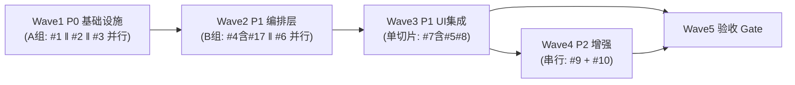

# 执行计划 — ⌘K 全局搜索浮层

> 基于⑤code-architecture.md §4 时序图 + §8 Wave 依赖 DAG + §6 test-matrix（47 用例）+ ③issues.md（11 issue）。
> 编排原则：垂直切片（每 Wave 可独立验证）+ 文件冲突驱动并行/串行 + D-017 P0 基础设施先行。
> **[D-026]** search 编排归 composable（非 domain），不新建 api/domains/search.ts——#5 改为「删 search 导出 + 改调 useSearch」。

## TL;DR

- **5 个 Wave**：Wave1（P0 基础设施，3 并行）→ Wave2（P1 编排层，2 并行）→ Wave3（P1 UI 集成，单切片含#5/#8）→ Wave4（P2 增强，串行）→ Wave5（验收 Gate）。
- **并行组**：A（Wave1: #1‖#2‖#3）/ B（Wave2: #4‖#6）/ Wave3 单切片 / Wave4 串行。
- **关键合并**：#17→#4（同文件 withWsTimeout）；#5→#7（消费链原子性）；#8→#7（loading/error 在 SearchModal）。
- **无 Prefactor Wave**：⑤§7 move/replace 项与功能 Wave 一一对应，独立 prefactor 会重复搬动。
- **无性能混沌 Wave**：④全部缓解项验收方式=代码测试/骨架约束/接受，无性能混沌类（session.list 耗时/大仓库截断是接受的残余风险）。
- **测试验收清单 47 条**：用例 ID 集合 = ⑤test-matrix 全量，末尾验收 Wave（Wave5）blocked_by Wave1-4。

## Wave 编排总览

### 依赖 DAG 图（Wave 级）

> **DAG 为 Wave 级**（与调度表粒度一致）。Wave 内部的 issue 并行关系在节点标签内标注（#1‖#2‖#3 / #4‖#6），不画 Wave 内部边——它们无相互依赖。子节点级真实依赖（如 #4 依赖 #1/#2/#3）见下方调度表注释 + 各 Wave 详情正文。

**issue 级依赖网络（供 subagent 派遣参考，非 DAG 主图）：**
- #4（useSearch）blocked_by #1（matchFilter）+ #2（命令源）+ #3（recents 源）—— ⑤§4 功能2 时序图实证
- #6（useSearchJump）blocked_by #2（命令执行）+ #3（recents 写入）—— ⑤§4 功能3 时序图实证，**不含 #1**（跳转不做子串过滤）也不含 #4（useSearchJump 不调 useSearch，⑤§2 包依赖图无 USJ→US 边）
- #7（SearchModal）blocked_by #1（segments 渲染）+ #4（useSearch.query）+ #5（接线）+ #6（useSearchJump.confirm）+ #3（useRecents，⑤§2 图 SM→UR 直达；⑤§4 时序图 recents 经 useSearch 间接读取，两条路径并存——SearchModal 空查询显 recents 既经 useSearch 也可能直读 useRecents，故 #3 计入 #7 依赖）—— 跨 Wave1/Wave2 直达
- #10.1（Sidebar keydown）blocked_by #2（命令注册表）—— Wave1 直达 Wave4

### 调度表

| Wave | 切片 | P级 | Blocked by | 并行组 | 说明 |
|------|------|-----|-----------|--------|------|
| 1 | P0 基础设施（3 模块）| P0 | 无 | A（3 并行）| #1 match-engine ‖ #2 命令注册表 ‖ #3 recents；叶子模块无依赖，改不同文件 |
| 2 | P1 编排层（2 composable）| P1 | Wave1 | B（2 并行）| #4 useSearch（含#17 WS race）‖ #6 useSearchJump；#6 不依赖 #4，改不同文件 |
| 3 | P1 UI 集成（SearchModal 改造）| P1 | Wave2 | —（单切片）| #7 SearchModal 改造 + #5 删 search 导出（并入，原子性）+ #8 loading/error 态；集成点，依赖 #4/#6 全就绪 |
| 4 | P2 增强 | P2 | Wave3 | —（串行）| #9 Tab 切类 + #10 搭便车（Sidebar keydown + scrollIntoViewIfNeeded）；#9/#10.2 同文件 SearchModal 故串行 |
| 5 | 验收 Gate | — | Wave1,2,3,4 | —（必须最后）| 读测试验收清单全量 → 跑测试 → 覆盖率报告；闭环闸门 |

### 并行约束

- 同一并行组内最多 3 个 subagent 并行（Wave1 组 A 达上限 3）
- **同一文件不允许多 Wave 同时修改**（文件冲突分析见下）
- 前端 Wave 需对应 composable/store 就绪（Wave3 SearchModal 需 Wave2 useSearch/useSearchJump 就绪）

### 文件冲突分析（驱动并行/串行）

| 文件 | 改它的 Wave | 冲突处理 |
|------|-----------|---------|
| `lib/match-engine.ts`（新）| Wave1 #1 | 独占，无冲突 |
| `composables/features/useCommandRegistry.ts`（新）| Wave1 #2 | 独占 |
| `stores/command.ts`（扩展 appCommands）| Wave1 #2 | 独占（仅 #2 改） |
| `composables/features/useRecents.ts`（新）| Wave1 #3 | 独占 |
| `composables/features/useSearch.ts`（新，含 withWsTimeout）| Wave2 #4 | 独占 |
| `composables/features/useSearchJump.ts`（新）| Wave2 #6 | 独占 |
| `api/index.ts`（删 search 导出）| Wave3 #7（#5 并入）| 独占（#5 合并消除冲突） |
| `components/overlays/SearchModal.vue`（改造+扩展）| Wave3 #7 + Wave4 #9/#10.2 | **串行**：#7 先改造，#9/#10.2 后扩展 |
| `components/sidebar/Sidebar.vue`（keydown）| Wave4 #10.1 | 独占 |

> **#5 并入 #7 的原子性理由**：#5「删 search 导出」+ #7「SearchModal 改调 useSearch」操作同一消费链（api.search → useSearch）。拆成两 Wave 会产生中间态「导出删了但 SearchModal 仍调 api.search」致编译断裂。合并入 Wave3 #7 同 subagent 同 PR，AC-5.1/5.2/5.3 不变。

### Prefactor Wave 必要性判定（refactor 场景）

**不设独立 Prefactor Wave。** 理由：⑤§7「现有代码映射」的 move/replace/extend/delete 项与功能 Wave 一一对应，每个模块 Wave 内「move + 实现目标态」一步到位：

| ⑤§7 处置项 | 归属 Wave | 为何不需独立 prefactor |
|-----------|----------|----------------------|
| segments move→match-engine | Wave1 #1 | 提取即目标态（新模块就是终态），非「先搬后改」 |
| loadResults move+rewrite→useSearch | Wave2 #4 | move 与 rewrite 同步（旧 mock 调用→新 4 源聚合） |
| confirmSel move+rewrite→useSearchJump | Wave2 #6 | emit→confirm 跳转是 rewrite 的一部分 |
| SEARCH_RECENTS replace→useRecents | Wave1 #3 | mock 写死→localStorage 是 replace 本身 |
| command store extend | Wave1 #2 | 扩展 appCommands 是 #2 的核心交付 |
| api/index.ts delete search 导出 | Wave3 #7（#5）| 删除即目标态 |

> D-017「P0 基础设施先行」的 Wave1 已起 prefactor 铺路作用（#1/#2/#3 就绪解锁 Wave2 #4/#6）。独立 prefactor 会把 segments/loadResults 搬两次（先搬到新文件再改实现），违反「move 即功能」一步到位。

## Wave 详情

### Wave 1: P0 基础设施（3 并行模块）

**切片类型**: 基础设施（叶子模块，可独立验证）
**P 级覆盖**: P0（D-017 基础设施先行）
**Blocked by**: 无——可立即开始
**并行关系**: 组 A，#1 ‖ #2 ‖ #3 三者并行（不同文件，无调用依赖）

#### 包含的 issue + 关联时序图

| subagent | Issue | 关联时序图（⑤§4）| 关联 AC |
|----------|-------|-----------------|---------|
| #1 | #1 匹配引擎提取（方案 A 双函数）| 功能2（matchFilter 过滤）+ SearchModal 渲染（segments 高亮）| AC-1.1/1.2/1.3/1.4 |
| #2 | #2 命令注册表（方案 A 扩展 store+composable）| 功能1（命令源）+ 功能2（命令内存源）| AC-2.1/2.2/2.3/2.4 |
| #3 | #3 recents composable（方案 A localStorage）| 功能1（recents 读取）+ 功能3（recents 写入）| AC-3.1/3.2/3.3/3.4/3.5/3.6 |

#### 文件影响

| subagent | 创建 | 修改 | 测试 |
|----------|------|------|------|
| #1 | `src/lib/match-engine.ts` + `src/lib/search-types.ts`（Tier 0 共享类型+常量：SearchType re-export + Section/SearchCtx/JumpCtx + RECENTS_STORAGE_KEY/WS_SOURCE_TIMEOUT_MS/RECENTS_PER_TYPE；AppCommand/RecentEntry 由 #2/#3 各自模块定义后此处 re-export 聚合）| — | `__tests__/lib/match-engine.test.ts` |
| #2 | `src/composables/features/useCommandRegistry.ts` | `src/stores/command.ts`（+appCommands ref + registerApp）| `__tests__/stores/command-app.test.ts` + `__tests__/composables/useCommandRegistry.test.ts` |
| #3 | `src/composables/features/useRecents.ts` | — | `__tests__/composables/useRecents.test.ts` |

> **search-types.ts 并行依赖说明** `[BACKFED from execution consistency-final on 2026-06-30]`：search-types.ts 是 Tier 0 共享类型源（被 #1/#2/#3 + Wave2 useSearch/useSearchJump 依赖）。归 Wave1 #1 subagent 创建（含 SearchType re-export + 跨模块常量 + Wave2 用的 Section/SearchCtx/JumpCtx）。#2/#3 的 AppCommand/RecentEntry 各自在模块内定义（#2 在 useCommandRegistry.ts / #3 在 useRecents.ts），search-types.ts 做 re-export 聚合点——这样 #1/#2/#3 仍可并行（各自模块自含类型定义，search-types.ts 聚合是 #1 的附带交付，#2/#3 不阻塞于它）。

> 路径前缀 `src-electron/renderer/src/`（下同）。

#### 覆盖的 test-matrix 用例 ID（完成判定）

> 来自⑤§6。下列用例对应测试全部 PASS 才算本 Wave 完成。
> **Wave1 是叶子基础设施，覆盖的是模块单元/容错用例**（非端到端 UC 用例——后者归消费方 Wave3）。

- **#1 match-engine**：无直接 UC 用例（纯函数由模块单测验，segments/matchFilter 的端到端高亮/过滤断言归 Wave3 #7）。Wave1 完成判定=模块单测覆盖 AC-1.1/1.2/1.3（grep 纯函数 + 空查询边界 + 行为等价 BC-4）。
- **#2 命令注册表**：T2.4（应用命令与 slash 同名去重，D-009）, T2.5（需 active session 的命令无 session 时不静默执行失败，AC-2.4）
- **#3 recents**：T1.8（recents 库空首用返空）, T1.9（reload 后持久化）, T1.16（来源B NFR：localStorage 读写 try/catch 降级，MR-3.1）, T1.17（来源B：配额满内存态保留，MR-3.3）, T1.18（来源B：FIFO 淘汰时机，MR-3.4）

#### Subagent 配置

| 配置项 | #1 match-engine | #2 命令注册表 | #3 recents |
|--------|-----------------|--------------|-----------|
| Agent | general-purpose | general-purpose | general-purpose |
| 注入上下文 | issues.md #1 方案A + code-arch §3 match-engine 契约 + §4 功能2 时序图 | issues.md #2 方案A + D-016 两区物理隔离 + code-arch §3 useCommandRegistry 契约 + 现有 command.ts 结构 | issues.md #3 方案A + D-007 + code-arch §3 useRecents 契约 + MR-3.1/3.3/3.4 容错要求 |
| 读取文件 | `components/overlays/SearchModal.vue:141-155`（现有 segments 搬移源）| `stores/command.ts`（现有结构，extend 不破坏）| `api/mock/search-data.ts`（SEARCH_RECENTS 现状，replace 目标）|
| 修改/创建 | `lib/match-engine.ts` + 测试 | `composables/features/useCommandRegistry.ts` + 扩展 `stores/command.ts` + 测试 | `composables/features/useRecents.ts` + 测试 |

#### 验收标准

- [ ] 各 subagent 覆盖的 issue AC 逐条列全并全过（#1: AC-1.1~1.4 / #2: AC-2.1~2.4 / #3: AC-3.1~3.6）
- [ ] 各 subagent「覆盖的 test-matrix 用例 ID」逐条列全并全 PASS（见上）
- [ ] #1 match-engine 纯函数无副作用（AC-1.2 grep：无 ref/reactive/import api）
- [ ] #2 两区物理隔离（D-016）：appCommands 独立 ref，session 切换不触发其响应式（AC-2.2）
- [ ] #3 localStorage key = `xyz-agent:search-recents`（MR-3.2 前缀约定）
- [ ] 各模块测试通过（`cd src-electron/renderer && npx vitest run <file>`，vitest 禁 node:test）

---

### Wave 2: P1 编排层（2 并行 composable）

**切片类型**: 垂直切片（composable 编排层，切穿 store+api+domain，可独立验证）
**P 级覆盖**: P1（核心编排）
**Blocked by**: Wave1（#4 依赖 #1/#2/#3；#6 依赖 #2/#3）
**并行关系**: 组 B，#4 ‖ #6 二者并行（#6 不调 useSearch，改不同文件）

#### 包含的 issue + 关联时序图

| subagent | Issue | 关联时序图（⑤§4）| 关联 AC |
|----------|-------|-----------------|---------|
| #4 | #4 useSearch composable（D-026 编排归 composable）+ #17 WS 源超时 race（物理合并：withWsTimeout 在 useSearch.ts 内）| 功能2（查询四类分组核心编排）+ 功能4（loadSeq 守卫）| AC-4.1~4.10, AC-17.1~17.3 |

> **#17 issue 独立性 vs Wave 合并澄清** `[BACKFED from execution consistency-final on 2026-06-30]`：D-023 confirmed #17 是独立 issue（跟踪/验收独立，AC-17.1~17.3 独立可验）。Wave2 把 #17 物理合并入 #4 是**代码实现层**合并（withWsTimeout 在 useSearch.ts 同文件，同 subagent 同 PR），**非 issue 删除**——#17 在③issues.md 仍是独立条目，其 AC 在 Wave2 #4 验收标准独立列出。两个维度不冲突：issue 跟踪独立（D-023）+ 代码实现同文件（工程便利）。
| #6 | #6 跳转编排（方案 A switch 分发）| 功能3（选中跳转 type switch）| AC-6.1~6.9 |

#### 文件影响

| subagent | 创建 | 修改 | 测试 |
|----------|------|------|------|
| #4 | `src/composables/features/useSearch.ts`（含 withWsTimeout #17 + loadSeq 守卫 + DTO 映射 + setupInvalidation）| — | `__tests__/composables/useSearch.test.ts` |
| #6 | `src/composables/features/useSearchJump.ts`（confirm type switch，AC-6.9 直调 fileApi.read）| — | `__tests__/composables/useSearchJump.test.ts` |

#### 覆盖的 test-matrix 用例 ID（完成判定）

**#4 useSearch（含#17）— 16 条**：
- T1.10（无 active session 降级，AC-4.8）, T1.12（乱序响应 loadSeq 守卫，BC-9/AC-4.4）
- T2.1（查询命中命令，命令源聚合）
- T3.1（文件相对路径展示，DTO 映射 D-025）, T3.2（file 缓存命中，AC-4.9）, T3.3（file 源 WS reject 静默，AC-4.5/MR-4.2）, T3.5（文件数 >5000 截断，AC-4.7/D-021）, T3.9（来源B：stale cache 防护，AC-4.10/MR-4.4）
- T4.1（命中跨项目会话）, T4.2（gitBranch 缺失降级，DTO 映射关键分支 D-025）, T4.4（session 源 WS reject）, T4.5（会话库空）, T4.8（来源B：WS 断连超时 race，AC-17.1/MR-17.1）, T4.9（来源B：全源失败 toast，AC-17.3/MR-4.2）
- T5.1（符号分组占位渲染，D-001）, T5.2（占位不随查询变）

**#6 useSearchJump — 10 条**：
- T2.2（选中应用命令执行+写 recents）, T2.3（选中 slash 注入）, T2.6（command action 抛错，AC-6.8）, T2.7（跳转成功关闭）
- T3.4（file.read 失败，AC-6.5/6.9 直调不经吞错层）, T3.6（跳转成功 DetailPane 打开）
- T4.3（选中会话切换）, T4.6（session.switch 失败，AC-6.6）, T4.7（跳转成功 active session 切换）
- T5.3（symbol 选中不跳转，D-001）

#### Subagent 配置

| 配置项 | #4 useSearch（含#17）| #6 useSearchJump |
|--------|---------------------|------------------|
| Agent | general-purpose | general-purpose |
| 注入上下文 | issues.md #4 方案A + #17 方案A + D-026（编排归 composable）+ D-021（5000）+ D-025（DTO 映射）+ code-arch §3 useSearch 契约 + §4 功能2 时序图 + BC-9 loadSeq + MR-4.1/4.2/4.4 + MR-17.1 | issues.md #6 方案A + D-006 + D-024（AC-6.9 直调 fileApi.read）+ code-arch §3 useSearchJump 契约 + §4 功能3 时序图 + MR-6.1/6.2 |
| 读取文件 | Wave1 产出的 `useCommandRegistry.ts`/`useRecents.ts`/`match-engine.ts` + 现有 `stores/fileSearch.ts`（缓存 get/set/setupInvalidation）+ `api/domains/composer.ts`（getFileCandidates）+ `api/domains/session.ts`（list）| Wave1 产出的 `useCommandRegistry.ts`/`useRecents.ts` + 现有 `api/domains/file.ts`（read）+ `api/domains/composer.ts` + `api/domains/session.ts` + `composables/features/useDetailPane.ts`（AC-6.9 验证其吞错层）+ `composables/features/useSidebar.ts`（selectSession）|
| 修改/创建 | `composables/features/useSearch.ts` + 测试 | `composables/features/useSearchJump.ts` + 测试 |

#### 关键不变式（#4 实现须保持）

- **BC-9 loadSeq 守卫**：query() 入口 `seq = ++loadSeq`，await 后 `if (seq !== loadSeq) return`（乱序丢弃）
- **AC-4.5 error 冒泡链**：file 源**直调 composer.getFileCandidates**（经 pending reject 透传），**不经 useFileSearch.load 吞错层**（:39-43 静默 catch）
- **AC-4.9 缓存优先**：fileSearchStore.get(sid) 命中→直返；未命中→composer.getFileCandidates + store.set
- **AC-4.10/MR-4.4 stale cache 防护**：自绑 useFileSearch.setupInvalidation watch（不依赖 CommandPopover 挂载）
- **AC-17.1 WS 超时 race**：file/session WS 源包 `Promise.race([wsCall, timeout(10s)])`，超时 reject→allSettled settle（withWsTimeout 内 clearTimeout 防泄漏，AC-17.2）
- **独立数据源用 Promise.allSettled**（AGENTS.md 规则）

#### 关键约束（#6 实现须保持）

- **AC-6.9 直调 fileApi.read**：file 分支**不经 useDetailPane.openPreview 吞错层**（后者 try/catch 设 status='error' 不抛，致 catch 永不触发，AC-6.5 假性 PASS）。read 成功后再调 useDetailPane 渲染
- **AC-6.7 异常恢复**：先 await 跳转成功再关浮层，失败保持打开让用户重选

#### 验收标准

- [ ] #4: AC-4.1~4.10 + AC-17.1~17.3 逐条全过
- [ ] #6: AC-6.1~6.9 逐条全过
- [ ] #4 loadSeq 守卫迁移正确（BC-9 保持，SearchModal 不重复守卫 AH-C1）
- [ ] #4 WS 超时 race 的 setTimeout 在成功时 clearTimeout（AC-17.2 资源清理）
- [ ] **T4.8 测试桩提示（#17 反哺高风险用例）**：T4.8「WS 断连超时 race」需 mock WS pending **永不 settle**（非普通立即 reject mock）——模拟真实 WS 断连场景（runtime 崩溃/重启），验证 withWsTimeout 的 10s timeout 触发 reject。普通 reject mock 无法覆盖此路径（#17 是最晚进 issues 的 P1，易漏）
- [ ] #6 file 分支直调 fileApi.read（AC-6.9 grep：useSearchJump.ts 不调 useDetailPane.openPreview）
- [ ] 覆盖的 test-matrix 用例 ID 全 PASS（#4: 16 条 / #6: 10 条）
- [ ] 测试通过（vitest）

---

### Wave 3: P1 UI 集成（SearchModal 改造 + #5 接线 + #8 状态）

**切片类型**: 垂直切片（UI 集成层，切穿 UI→composable→store→api→transport 全层）
**P 级覆盖**: P1（核心集成点）
**Blocked by**: Wave2（#4 useSearch + #6 useSearchJump 全就绪）
**并行关系**: 单切片（集成点，不与任何 Wave 并行）

#### 包含的 issue + 关联时序图

| Issue | 关联时序图（⑤§4）| 关联 AC |
|-------|-----------------|---------|
| #7 SearchModal 改造（方案 A 渐进改造）| 功能1（空查询渲染）+ 功能2（查询渲染高亮）+ 功能3（confirmSel 改调）+ 功能4（生命周期+并发守卫）| AC-7.1~7.15 |
| #5 api 接线（并入 #7，D-026 后）| —（grep 验收）| AC-5.1/5.2/5.3 |
| #8 loading + error 态（并入 #7）| 功能4（loading setTimeout + error 重置）| AC-8.1~8.6 |

#### 文件影响

| 创建 | 修改 | 测试 |
|------|------|------|
| — | `src/components/overlays/SearchModal.vue`（改造：loadResults→useSearch.query / segments→match-engine / confirmSel→useSearchJump.confirm / recents→useRecents + debounce + ⌘K toggle + close 孤儿守卫 + loading/error 态）+ `src/api/index.ts`（#5 删 search 导出）| `__tests__/components/search-modal.test.ts`（集成，mount SearchModal）|

#### 覆盖的 test-matrix 用例 ID（完成判定）

**13 条**（UI 渲染 + 集成 + 生命周期）：
- T1.1（⌘K 唤起+聚焦，AC-7.1）, T1.2（空查询显 recents+建议命令，AC-7.11/BC-5）, T1.3（↑↓ 跨组导航，AC-7.2/BC-2）, T1.4（选中态视觉，AC-1.2）
- T1.6（三种关闭，AC-7.1）, T1.7（命中子串 `<mark>` 高亮，AC-7.3/BC-4）, T1.11（查询无结果「未找到」态，AC-7.4/BC-6）
- T1.13（快速 open/close 交替，AC-7.14）, T1.14（close 孤儿查询守卫，MR-7.1）, T1.15（首屏渲染冒烟，mount SearchModal）
- T3.7（>200ms 显示 loading，AC-8.1）, T3.8（<200ms 不显示 loading，AC-8.1）
- T5.4（占位渲染失败容错）

> #5 grep 验收（非 UC 用例）：AC-5.1 `grep "export const search" api/index.ts` 无输出 + `grep "useSearch" SearchModal.vue` 有输出。

#### Subagent 配置

| 配置项 | 值 |
|--------|---|
| Agent | general-purpose |
| 注入上下文 | issues.md #7 方案A + #5 方案A（D-026 后）+ #8 方案A + D-020（debounce 提前到 #7）+ D-026（SearchModal 改调 useSearch）+ code-arch §3 SearchModal 改造映射 + §4 功能1/2/3/4 时序图 + §7 现有代码映射 + BC-1~BC-12 全清单 + AH-C5（⌘K toggle 变更项）+ AH-B3（两种空态区分）+ AH-S2（error 态可达性） |
| 读取文件 | 现 `components/overlays/SearchModal.vue`（186 行，改造源）+ `components/sidebar/Sidebar.vue:227-241`（⌘K 现状 =true 非 toggle，AC-7.1 变更项）+ Wave1/2 产出的全部 composable + `api/index.ts:42`（search 导出现状）+ `api/mock/search-data.ts`（SearchItem 类型源）|
| 修改/创建 | `components/overlays/SearchModal.vue`（改造）+ `api/index.ts`（删 search 导出，#5）+ `__tests__/components/search-modal.test.ts` |

#### 关键改造点（#7 实现须保持）

- **骨架不变**：template 结构 / props / emits / Dialog 容器保持；内部 script 替换为调 useSearch/useSearchJump/useRecents/match-engine
- **BC 清单逐条等价**：BC-1（⌘K 唤起）/BC-2（↑↓）/BC-4（高亮）/BC-6（空结果）/BC-8（图标）/BC-9（loadSeq 迁移到 useSearch）/BC-10（鼠标）/BC-11（生命周期）/BC-12（边缘）
- **变更项 AC-7.1**：「再按 ⌘K 关闭」是新增 toggle（现 Sidebar.vue:236 只置 true）——本 Wave 在 SearchModal 层或协同 Wave4 #10.1 落地
- **AC-7.13 两种空态区分**：recents 库空（首用）显「输入关键词开始搜索」不带引号；查询无结果显「未找到「查询词」」带引号
- **AC-7.15 debounce(120ms)**：watch query 改 debounce 后调 loadResults（D-020 从 #10 提前）
- **AC-8.1 loading 防闪烁**：setTimeout 200ms 才显加载条，<200ms clearTimeout
- **AC-8.4/8.5 资源清理**：loading setTimeout + debounce timer 在查询返回/组件卸载/close 时 clearTimeout；error ref close 时重置
- **AH-S2 error 态可达性**：查询路径单源失败=分组空态（非全局 error）；全局 error 仅跳转失败触发（跳转 error 在 useSearchJump，#6 Wave2 已覆盖）
- **#5 接线**：删 `api/index.ts:42` 的 `export const search = mockApi.search`；SearchModal 改 `import { useSearch } from '@/composables/features/useSearch'`
- **LOC 收敛**：改造后 `<script setup>` ≤300 行 / `<template>` ≤400 行（AGENTS.md 上限，AC-7.12）

#### 验收标准

- [ ] #7: AC-7.1~7.15 逐条全过（BC 清单等价 + 变更项 toggle + debounce）
- [ ] #5: AC-5.1（grep 无 search 导出 + 有 useSearch）/ AC-5.2（useSearch 内部判 VITE_MOCK）/ AC-5.3（SearchItem 类型 re-export 保留）
- [ ] #8: AC-8.1（loading 防闪烁）/ AC-8.2（no-silent-catch，lint 通过）/ AC-8.3（单源失败分组空态）/ AC-8.4（clearTimeout）/ AC-8.5（error 重置）/ AC-8.6（error 可达性对齐）
- [ ] 改造后 SearchModal `<script setup>` ≤300 / `<template>` ≤400（AC-7.12）
- [ ] 覆盖的 test-matrix 用例 ID 全 PASS（13 条 + #5 grep）
- [ ] 集成测试通过（mount SearchModal，vitest）

---

### Wave 4: P2 增强（Tab 切类 + 搭便车 2 项）

**切片类型**: 增强（P2 非关键，串行）
**P 级覆盖**: P2（D-018/D-019，⑤骨架确认工作量可控）
**Blocked by**: Wave3（#9/#10.2 扩展 #7 改造后的 SearchModal；#10.1 依赖 Wave1 #2 命令注册表）
**并行关系**: 串行（#9 与 #10.2 同改 SearchModal.vue，冲突；#10.1 改 Sidebar.vue 独立但 P2 不值得并行编排复杂度）

#### 包含的 issue + 关联时序图

| Issue | 关联 AC |
|-------|---------|
| #9 Tab 切类（方案 A activeType ref + 循环切换）| AC-9.1/9.2/9.3/9.4 |
| #10.1 Sidebar keydown 接命令注册表（搭便车，D-004 消除硬编码 + AH-C5 ⌘K toggle）| AC-10.1 |
| #10.2 scrollIntoView→scrollIntoViewIfNeeded（搭便车，BC-7 spec 合规）| AC-10.2 |

#### 文件影响

| 创建 | 修改 | 测试 |
|------|------|------|
| — | `src/components/overlays/SearchModal.vue`（#9 Tab onKeydown + activeType ref + computed 过滤；#10.2 scrollIntoViewIfNeeded）+ `src/components/sidebar/Sidebar.vue`（#10.1 keydown 改读 useCommandRegistry + ⌘K toggle）| 并入 `__tests__/components/search-modal.test.ts`（#9）+ behavior 验证（#10）|

#### 覆盖的 test-matrix 用例 ID（完成判定）

- T1.5（Tab/Shift+Tab 循环切类，F3/AC-9.1~9.4，含 AH-B4 selIdx 重置 + AH-S3 recents 态正交）
- #10.1/#10.2 无直接 UC 用例（grep/行为验收：AC-10.1 Sidebar 不硬编码 + ⌘K toggle；AC-10.2 scrollIntoViewIfNeeded）

#### Subagent 配置

| 配置项 | 值 |
|--------|---|
| Agent | general-purpose |
| 注入上下文 | issues.md #9 方案A + #10 方案A + D-018（Tab 列 P2）+ D-019（搭便车待⑤确认，⑤已确认）+ code-arch §5 状态机 type_filtered + AH-B4/AH-S3 + BC-7 + AH-C5（⌘K toggle 与 #7 AC-7.1 协同）|
| 读取文件 | Wave3 改造后 `SearchModal.vue`（#9/#10.2 扩展基础）+ Wave1 `useCommandRegistry.ts`（#10.1 读取源）+ 现 `Sidebar.vue:227-241`（#10.1 改造源）|
| 修改/创建 | `SearchModal.vue`（#9 + #10.2）+ `Sidebar.vue`（#10.1）+ 测试 |

#### 验收标准

- [ ] #9: AC-9.1（Tab 循环）/ AC-9.2（activeType 过滤）/ AC-9.3（selIdx 重置 AH-B4）/ AC-9.4（recents 态正交 AH-S3）
- [ ] #10.1: AC-10.1（Sidebar keydown 改读 useCommandRegistry，消除硬编码 if/else；⌘K 从 =true 改 toggle，与 AC-7.1 协同）
- [ ] #10.2: AC-10.2（scrollIntoView→scrollIntoViewIfNeeded，BC-7 spec 合规）
- [ ] T1.5 PASS
- [ ] 测试通过（vitest）

---

### Wave 5: 验收 Gate（Acceptance Gate）

**切片类型**: 验收（非功能切片）
**P 级覆盖**: —
**Blocked by**: Wave1, Wave2, Wave3, Wave4（所有功能 Wave）
**并行关系**: 必须最后，不与任何 Wave 并行

#### 职责

读「测试验收清单」全量（47 条）→ 跑测试 → 核对每条用例 ID 的 PASS/FAIL/缺失 → 输出覆盖率报告。**设计→实现的闭环闸门**：本 Wave 绿，才算设计→实现闭环闭合。

#### Subagent 配置

| 配置项 | 值 |
|--------|---|
| Agent | general-purpose |
| 注入上下文 | execution-plan.md「测试验收清单」全量（47 条用例 ID + 断言摘要 + 归属 Wave + 测试执行层）|
| 读取文件 | 全部测试套件目录（`__tests__/lib/` + `__tests__/composables/` + `__tests__/stores/` + `__tests__/components/`）+ 实现代码 |
| 修改/创建文件 | 覆盖率报告（写回清单状态列）|

#### 执行流

1. read execution-plan.md「测试验收清单」（全量 47 条用例 ID + 断言摘要 + 归属 Wave）
2. 跑测试套件全量（`cd src-electron/renderer && npx vitest run`）
3. 把每条 PASS/FAIL/缺失映射回清单用例 ID（按断言摘要核对，非按文件名）
4. 清单状态列填 PASS / FAIL / 未实现 / `[DEVIATED]原因`
5. 输出覆盖率报告：清单用例 PASS 数 / 47 + 未过用例明细 + 按归属 Wave 分组

#### 验收标准

- [ ] **测试验收清单全量 47 条用例 PASS**（任一 FAIL / 未实现 = 整个实现未完成，回对应功能 Wave 补）
- [ ] 无 `[DEVIATED]` 未经用户确认（偏离需登记原因 + 用户拍板 + 判断是否回流⑤改设计）
- [ ] 覆盖率报告输出（清单 PASS 数 / 47 + 按归属 Wave 分组）
- [ ] gate 范围按测试执行层切：unit 层在 Wave 内 dev 阶段核 / integration 层在 phase-test 核 / 验收 Wave 汇总各层

## 后续迭代（P3 延后项）

> 引用 ③issues.md §后续迭代 + requirements §8 Out of Scope，标注延后理由与溯源。不纳入本次 Wave 编排。

| issue | 标题 | 延后理由 | source |
|-------|------|---------|---------|
| #11 [P3] | 符号搜索真实数据 | 需 LSP/tree-sitter，zero base 成本远超其他三类 | requirements §8 + D-001 |
| #12 [P3] | 文件内容全文搜索 | 需 ripgrep 二进制，打包分发成本高 | requirements §8 + D-003 |
| #13 [P3] | 危险命令分级与二次确认 | 本期无真正危险命令，后续有终止/删除命令时再加 | requirements §8 + D-008 |
| #14 [P3] | 会话跳转进概览视图 | 切换 session 是主路径，overview 跳转次要 | requirements §8 + D-010 |
| #15 [P3] | ⌘1…⌘5 直达类型快捷键 | spec 遗留②，待核 OS 冲突 | requirements §8 |
| #16 [P3] | 跨项目检索 scope 过滤条 | 会话搜索已全局，文件搜索已限当前，无需 scope 切换 | requirements §8 |

## 测试验收清单（Test Acceptance Manifest）— [MANDATORY]

> **这是实现阶段的 Definition of Done（完成定义）。** 把⑤test-matrix 全量用例（来源 A 功能 + 来源 B NFR）
> 按归属 Wave 列全，作为实现期的唯一验收真相源。末尾验收 Wave（Wave5）不绿 = 实现未完成。
>
> **来源校正（vs 脚本草稿）**：脚本因「并发」关键词将 T1.12/T1.13/T1.14 误判为来源 B——实际⑤§6 来源 A UC-1 表内（标 MR-7.1 引用但属来源 A 功能用例）。T1.15 脚本标 e2e，实际项目无独立 e2e gate，mount SearchModal 即集成（integration）。已逐条校正。
>
> **ID 真相源声明（[BACKFED from tracing-round-1 GAP-TC-1/2/3] on 2026-06-30）**：⑤code-architecture.md §4 时序图的「异常用例」列 ID 存在系统性错位（session reject 标 T4.3 应 T4.4；WS 断连标 T4.7 应 T4.8；全源失败标 T4.8 应 T4.9；无 session 标 T1.4 应 T1.10；乱序标 T1.5 应 T1.12；command 抛错标 T2.5 应 T2.6 等）。**本清单 ID 为唯一验收真相源**（Wave5 验收以本清单 ID 为准，⑤§4 异常路径表 ID 仅供 alt/else 分支语义溯源，不作断言 ID 核对）。⑤§4 错位 ID 已回流⑤修订（见 backfeed-round-3）。

| 用例 ID | 归属 UC | 来源 | 断言摘要 | 功能归属 Wave | 测试执行层 | 状态 |
|---------|--------|------|---------|--------------|----------|------|
| T1.1 | UC-1 | A 功能 | ⌘K 唤起 + 输入框自动聚焦 + 光标置末尾 | Wave3 | integration | 待验 |
| T1.2 | UC-1 | A 功能 | 空查询显 recents + 建议命令分组，Clock 图标 | Wave3 | integration | 待验 |
| T1.3 | UC-1 | A 功能 | ↑↓ 跨组扁平化导航 + 循环包裹 + scrollIntoViewIfNeeded | Wave3 | integration | 待验 |
| T1.4 | UC-1 | A 功能 | 选中项 Card-Active 视觉态 + aria-selected | Wave3 | integration | 待验 |
| T1.5 | UC-1 | A 功能 | Tab/Shift+Tab 循环切类 + selIdx 重置 + recents 态正交 | Wave4 | integration | 待验 |
| T1.6 | UC-1 | A 功能 | 三种关闭（Esc/再按⌘K/点遮罩）+ ⌘K toggle | Wave3 | integration | 待验 |
| T1.7 | UC-1 | A 功能 | 命中子串 `<mark>` 高亮（segments Wave1 + 渲染 Wave3） | Wave3 | integration | 待验 |
| T1.8 | UC-1 | A 功能 | recents 库空（首用）显专属引导文案 | Wave1 | unit | 待验 |
| T1.9 | UC-1 | A 功能 | recents reload 后持久化（localStorage key 校验） | Wave1 | unit | 待验 |
| T1.10 | UC-1 | A 功能 | 无 active session：file+slash 分组空，应用命令源仍工作 | Wave2 | unit | 待验 |
| T1.11 | UC-1 | A 功能 | 查询无结果显「未找到「查询词」」（带引号） | Wave3 | integration | 待验 |
| T1.12 | UC-1 | A 功能 | 乱序响应 loadSeq 守卫（旧响应丢弃） | Wave2 | unit | 待验 |
| T1.13 | UC-1 | A 功能 | 快速 open/close 交替无残留定时器无闪烁 | Wave3 | integration | 待验 |
| T1.14 | UC-1 | A 功能 | close 触发孤儿查询被 open flag 守卫 return | Wave3 | integration | 待验 |
| T1.15 | UC-1 | A 功能 | 首屏渲染冒烟（mount SearchModal DOM 含关键元素） | Wave3 | integration | 待验 |
| T1.16 | UC-1 | B NFR | localStorage JSON.parse 失败→[] 降级（MR-3.1） | Wave1 | unit | 待验 |
| T1.17 | UC-1 | B NFR | 配额满 catch 内存态保留不回滚（MR-3.3） | Wave1 | unit | 待验 |
| T1.18 | UC-1 | B NFR | FIFO 淘汰时机 + 同 key 更新 timestamp + 计数器兜底（MR-3.4） | Wave1 | unit | 待验 |
| T2.1 | UC-2 | A 功能 | 查询命中命令（命令分组含 /commit） | Wave2 | unit | 待验 |
| T2.2 | UC-2 | A 功能 | 选中应用命令执行 + 浮层关 + toast + 写 recents | Wave2 | integration | 待验 |
| T2.3 | UC-2 | A 功能 | 选中 slash 命令注入 pi composer + 浮层关 | Wave2 | integration | 待验 |
| T2.4 | UC-2 | A 功能 | 应用命令与 slash 同名去重（D-009 按 name 唯一） | Wave1 | unit | 待验 |
| T2.5 | UC-2 | A 功能 | 无 active session 时 slash 命令不进列表（列表层保证选不到，故无「选中静默失败」执行路径），AC-2.4 | Wave1 | unit | 待验 |
| T2.6 | UC-2 | A 功能 | command action 抛错→toast + 浮层保持打开（AC-6.8） | Wave2 | integration | 待验 |
| T2.7 | UC-2 | A 功能 | 跳转成功后浮层关闭（先 await 成功再关） | Wave2 | integration | 待验 |
| T3.1 | UC-3 | A 功能 | 查询命中文件 + sub 为相对 cwd 路径（DTO 映射 D-025） | Wave2 | unit | 待验 |
| T3.2 | UC-3 | A 功能 | file 缓存命中不重复 file.search WS（AC-4.9） | Wave2 | unit | 待验 |
| T3.3 | UC-3 | A 功能 | file 源 WS reject→分组空态（静默不 toast，MR-4.2） | Wave2 | integration | 待验 |
| T3.4 | UC-3 | A 功能 | file.read 失败→toast + 浮层保持打开（AC-6.9 直调） | Wave2 | integration | 待验 |
| T3.5 | UC-3 | A 功能 | 文件数 >5000 显示截断提示（D-021） | Wave2 | unit | 待验 |
| T3.6 | UC-3 | A 功能 | file.read 成功 DetailPane 显示内容 + 浮层关 | Wave2 | integration | 待验 |
| T3.7 | UC-3 | A 功能 | 扫描 >200ms 显示 loading（AC-8.1） | Wave3 | integration | 待验 |
| T3.8 | UC-3 | A 功能 | 扫描 <200ms 不显示 loading（clearTimeout） | Wave3 | integration | 待验 |
| T3.9 | UC-3 | B NFR | stale cache 防护（setupInvalidation watch，MR-4.4/AC-4.10） | Wave2 | integration | 待验 |
| T4.1 | UC-4 | A 功能 | 查询命中跨项目会话（label/cwd/gitBranch 匹配） | Wave2 | unit | 待验 |
| T4.2 | UC-4 | A 功能 | gitBranch 缺失降级匹配（DTO 映射 D-025 关键分支） | Wave2 | unit | 待验 |
| T4.3 | UC-4 | A 功能 | 选中会话切换 active session + 浮层关 + 写 recents | Wave2 | integration | 待验 |
| T4.4 | UC-4 | A 功能 | session 源 WS reject→分组空态，其他源仍工作 | Wave2 | integration | 待验 |
| T4.5 | UC-4 | A 功能 | 会话库空→会话分组显空态提示 | Wave2 | unit | 待验 |
| T4.6 | UC-4 | A 功能 | session.switch 失败→toast + 刷新会话列表 + 浮层保持打开 | Wave2 | integration | 待验 |
| T4.7 | UC-4 | A 功能 | 跳转成功 active session 切换 + 浮层关 | Wave2 | integration | 待验 |
| T4.8 | UC-4 | B NFR | WS 断连超时 race（10s 后 settle，不永久挂死，MR-17.1） | Wave2 | integration | 待验 |
| T4.9 | UC-4 | B NFR | 全源失败→四类全空态 + toast（MR-4.2/AC-17.3） | Wave2 | integration | 待验 |
| T5.1 | UC-5 | A 功能 | 符号分组占位渲染（UI 保留，D-001） | Wave2 | unit | 待验 |
| T5.2 | UC-5 | A 功能 | 占位不随查询变化（恒定提示文案） | Wave2 | unit | 待验 |
| T5.3 | UC-5 | A 功能 | symbol 选中不跳转返回 not-available（D-001） | Wave2 | integration | 待验 |
| T5.4 | UC-5 | A 功能 | 占位渲染失败容错（符号分组隐藏，其他类正常） | Wave3 | integration | 待验 |

**用例归属 Wave 汇总**：
- Wave1: 7 条（T1.8, T1.9, T1.16, T1.17, T1.18, T2.4, T2.5）
- Wave2: 26 条（T1.10, T1.12, T2.1~T2.3, T2.6, T2.7, T3.1~T3.6, T3.9, T4.1~T4.9, T5.1~T5.3）
- Wave3: 13 条（T1.1~T1.4, T1.6, T1.7, T1.11, T1.13~T1.15, T3.7, T3.8, T5.4）
- Wave4: 1 条（T1.5）
- **合计 47 条 = ⑤test-matrix 全量**

**跨 Wave 协同用例（主归属 + 协同方）**：
- T1.3（↑↓导航 + scrollIntoViewIfNeeded）：主 Wave3，scrollIntoViewIfNeeded 算法在 Wave4 #10.2
- T1.6（⌘K toggle）：主 Wave3，⌘K toggle 的 Sidebar 侧在 Wave4 #10.1
- T1.7（高亮）：主 Wave3（DOM 渲染），segments 算法在 Wave1 #1（Wave1 模块单测覆盖纯函数，UC 集成断言归 Wave3）

**状态字段**：`待验`（设计期默认）→ 实现期填 `PASS` / `FAIL` / `未实现` / `[DEVIATED]原因`

## ④性能混沌类缓解项编排（接收 nfr 路由契约）

> [MANDATORY] 从④回灌表筛 `验收方式=性能混沌` 的缓解项。编排为独立 perf/chaos Wave 或 pre-prod gate。

**本 topic 无性能混沌类缓解项。** ④non-functional-design.md「缓解项回灌登记表」全部缓解项验收方式分布：
- `代码测试`：MR-3.1/3.3/3.4（unit）/ MR-4.2/4.4/17.1（integration）→ 已落⑤test-matrix 来源 B，归 Wave1/Wave2
- `骨架约束`：MR-3.2（localStorage key 前缀）/ MR-4.1（loadSeq 字段）→ ⑤骨架 tsc 验证
- `已在③`：MR-4.3/4.5/6.1/8.1 → 对应 AC 在来源 A 覆盖
- `接受的残余风险`：localStorage 配额满（MR-3.3 部分接受）/ 大仓库截断（D-021 5000 上限接受）/ session.list 耗时（接受）/ toast 脱敏（接受）—— 是接受的风险，非需测试的性能混沌项

**结论**：无需独立 perf/chaos Wave 或 pre-prod gate。④标「接受」的残余风险（session.list 耗时/大仓库截断）是 NFR 阶段用户已确认接受的性能边界，不构成需独立测试环境的性能混沌缓解项。

## 执行交接（硬契约）

本计划完成后，进入编码实现。**编码完成的定义 = 测试验收清单全绿（47 条全 PASS）。**

- **无论方式 A/B，末尾验收 Wave（Wave5，blocked_by Wave1-4）未绿 = 实现未完成。**
  Wave5 职责：读测试验收清单全量 → 跑测试 → 每条 PASS/FAIL/缺失映射回用例 ID → 任一无对应测试或 FAIL = 整个实现未完成 → 输出覆盖率报告。
- **方式 A（推荐）**：接入 coding-workflow，启动 Phase 流程（spec→plan→dev→test→pr）。Phase-test gate 必须以本清单为验收基线（47 条全 PASS 才过），而非仅"测试套件通过"。
- **方式 B**：手动执行——每个 Wave 派一个 fresh subagent，按 Wave 内执行流走 TDD 链；末尾验收 Wave 同上。
- **偏离通道**：编码中发现用例设计错误/不可行，走 `[DEVIATED]` 登记（附原因 + 用户确认），不可静默跳过。
