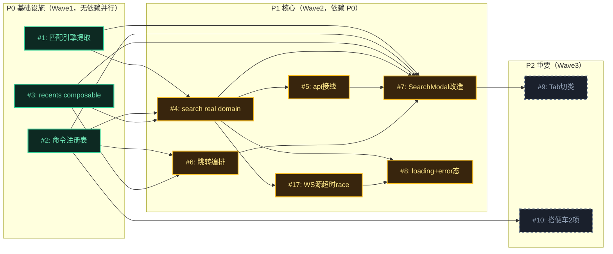

# Issue 决策图 — ⌘K 全局搜索浮层

## 地图总览

> 节点状态色标：resolved(✅已定方案) / investigating(🔍本期拆解) / fog(?迷雾)。P0 三项无前置依赖可 Wave1 并行；P1 全部依赖 P0；P2 依赖 P1 落地。

## 上游覆盖核验（MANDATORY，逐条不漏）

> 按 fog-of-war 4 轴（状态§5/模块§7/边界§8/挑战§10）从 system-architecture.md 逐条扫描。

| 上游元素 | 轴 | 对应 issue | 状态 | N/A 理由（状态=N/A 时必填）|
|---------|----|-----------|------|---------------------------|
| §7: SearchModal.vue（改造） | 模块 | #7 | ✅ 已覆盖 | — |
| §7: search real domain（新建） | 模块 | #4 | ✅ 已覆盖 | — |
| §7: 命令注册表（store 扩 + composable 新） | 模块 | #2 | ✅ 已覆盖 | — |
| §7: 匹配引擎（提取纯函数） | 模块 | #1 | ✅ 已覆盖 | — |
| §7: 跳转编排（新建） | 模块 | #6 | ✅ 已覆盖 | — |
| §7: recents composable（新建） | 模块 | #3 | ✅ 已覆盖 | — |
| §7: api/index.ts（接线改造） | 模块 | #5 | ✅ 已覆盖 | — |
| §5: closed↔open | 状态 | #7 | ✅ 已覆盖 | — |
| §5: recents→query_results（输入查询） | 状态 | #7 | ✅ 已覆盖 | — |
| §5: query_results→recents（清空查询） | 状态 | #7 | ✅ 已覆盖 | D-014 派生态转换，并入 #7 |
| §5: query_results→empty（无命中） | 状态 | #7 | ✅ 已覆盖 | — |
| §5: empty→query_results（修改查询有命中） | 状态 | #7 | ✅ 已覆盖 | D-014 派生态转换，并入 #7 |
| §5: query_results→loading（查询>200ms） | 状态 | #8 | ✅ 已覆盖 | — |
| §5: loading→query_results（查询返回） | 状态 | #8 | ✅ 已覆盖 | D-014 派生态转换，并入 #8 |
| §5: loading→empty（查询返回无命中） | 状态 | #8 | ✅ 已覆盖 | D-014 派生态转换，并入 #8 |
| §5: query_results→type_filtered（Tab 切类） | 状态 | #9 | ✅ 已覆盖 | — |
| §5: type_filtered→query_results（Tab 回全部） | 状态 | #9 | ✅ 已覆盖 | D-014 派生态转换，并入 #9 |
| §5: error 态——查询失败（search domain catch） | 状态 | #8 | ✅ 已覆盖 | AH-S2：查询路径因 allSettled 吞单源错误，error 实际仅跳转可达，见 #8 AC |
| §5: error 态——跳转失败（file.read/session.switch） | 状态 | #6 | ✅ 已覆盖 | error 拆两路：查询失败→#8，跳转失败→#6（AC-6.5/6.6）|
| §8: runtime 边界（file.search/session.list/session.getCommands/file.read） | 边界 | #4 | ✅ 已覆盖 | — |
| §8: pi 边界（经 runtime 透传 getCommands） | 边界 | #2 | ✅ 已覆盖 | — |
| §8: localStorage 边界（recents） | 边界 | #3 | ✅ 已覆盖 | — |
| §10: D-011 三层 vs DDD 四层 | 挑战 | — | N/A | ②已决策（D-011 confirmed），无未决挑战，不需 issue |
| §10: D-012 port 边界 | 挑战 | — | N/A | ②已决策（D-012 confirmed），无未决挑战 |
| §10: D-013 领域模型深度 | 挑战 | — | N/A | ②已决策（D-013 confirmed），无未决挑战 |
| §10: D-016 命令注册表归属 | 挑战 | #2 | ✅ 已覆盖 | — |
| §10: 特化决策「符号占位不建 port」 | 挑战 | #4 | ✅ 已覆盖 | 符号占位逻辑在 search domain 内处理（占位提示，不调 api）|
| §10: 特化决策「recents 用 localStorage 不走 runtime」 | 挑战 | #3 | ✅ 已覆盖 | — |
| §11 AC-1: search 不再常驻 mock | 兜底 | #5 | ✅ 已覆盖 | grep 验收 AC 落在 api/index.ts 接线 |
| §11 AC-2: 应用命令不硬编码 keydown | 兜底 | #10 | ✅ 已覆盖 | 搭便车（待⑤确认）|
| §11 AC-3: 无伪 port | 兜底 | — | N/A | grep 验收（无 SearchSource/MatchStrategy interface），实现期检查即可，不需 issue |
| §11 AC-4: 匹配引擎为纯函数 | 兜底 | #1 | ✅ 已覆盖 | grep 验收 AC 落在 #1 |
| §12 BC-1 ⌘K 唤起+Esc 关闭 | 兜底 | #7 | ✅ 已覆盖 | — |
| §12 BC-2 ↑↓ 键盘导航 | 兜底 | #7 | ✅ 已覆盖 | — |
| §12 BC-3 Enter 确认（变更：→跳转编排） | 兜底 | #6 | ✅ 已覆盖 | 行为变更项，独立 ticket |
| §12 BC-4 segments 高亮 | 兜底 | #1 | ✅ 已覆盖 | 提取为匹配引擎纯函数 |
| §12 BC-5 空查询 recents（变更：mock→localStorage） | 兜底 | #3, #7 | ✅ 已覆盖 | 持久化→#3，显示集成→#7（AC-7.11）|
| §12 BC-6 空结果态（查询无结果） | 兜底 | #7 | ✅ 已覆盖 | — |
| §12 BC-6b recents 库空态（首用，区别于查询无结果） | 兜底 | #7 | ✅ 已覆盖 | AH-B3：两种空态区分，见 #7 AC-7.13 |
| §12 BC-7 scrollIntoView（变更：→IfNeeded，搭便车） | 兜底 | #10 | ✅ 已覆盖 | 行为变更项（待⑤确认）|
| §12 BC-8 四类图标映射 | 兜底 | #7 | ✅ 已覆盖 | — |
| §12 BC-9 乱序响应保护 loadSeq | 兜底 | #4 | ✅ 已覆盖 | search domain 重写须保持不变式 |
| §12 BC-10 鼠标交互路径 | 兜底 | #7 | ✅ 已覆盖 | — |
| §12 BC-11 查询/开关生命周期副作用 | 兜底 | #7 | ✅ 已覆盖 | — |
| §12 BC-12 边缘不变式（空结果禁键/循环包裹/Clock/a11y） | 兜底 | #7 | ✅ 已覆盖 | — |

## P0 Issues（阻塞项，必须先做）

### #1: 匹配引擎提取为纯函数模块

**P 级**: P0
**类型**: 模块
**Blocked by**: 无
**推荐强度**: Strong

#### 问题描述

当前 `SearchModal.vue:141-155` 的 `segments()` 函数（子串切分驱动 `<mark>` 高亮）是组件内私有函数。架构 §7 要求提取为独立纯函数模块 `lib/match-engine.ts`，因为有两个消费者：
1. SearchModal 模板渲染（segments 产生高亮段）
2. search real domain（matchFilter 前端过滤候选）

两消费者共享同一子串核心算法，提取避免逻辑重复。关联 system-architecture.md §7（匹配引擎模块）+ §11 AC-4（grep 验收纯函数）。

#### 为什么是这个 P 级

- **P0（基础设施先行，D-017）**: 无前置依赖，且被 #4（search domain 的 matchFilter）+ #7（SearchModal 渲染）依赖。匹配引擎不稳，上游依赖方返工。

#### 方案对比

##### 方案 A: 双函数分离（matchFilter + segments）

**改动**:
- 架构: 新建 `lib/match-engine.ts`，导出两个纯函数
- 模型: `segments(text, q): MatchSegment[]`（已有逻辑搬移）；`matchFilter(items, q): items`（子串命中过滤）
- 流程: matchFilter 在 search domain 调用（候选过滤）；segments 在 SearchModal 模板调用（高亮渲染）

**优点**: 职责单一——matchFilter=过滤（返回候选），segments=渲染（返回高亮段）。两消费者各取所需，无耦合。符合 §7 边界声明「ME 不含分组、不调 api、无副作用」。
**缺点**: 两个导出函数，调用方需知道用哪个。
**适用场景**: 过滤与渲染是两个独立关注点（本例正是）。

> 红队审查注：提取由**本期两个真实消费者**驱动（SearchModal 渲染 segments + search domain 过滤 matchFilter），DRY 成立。原稿「未来复用（如 composer 候选过滤）」论据夸大——composer 走 file-candidates.ts DTO 映射无 segments 消费，已删去该论据，不依赖假设性复用。

##### 方案 B: 单函数合一（match 返回带高亮段的过滤结果）

**改动**:
- 架构: 新建 `lib/match-engine.ts`，导出单一 `match(items, q)` 返回「过滤后项 + 每项附高亮段」的复合数组
- 模型: 单一返回形态，调用方一次调用拿全
- 流程: search domain 与 SearchModal 都调同一函数

**优点**: 单一入口，调用方简单。
**缺点**: 强耦合过滤与渲染——search domain 只需过滤不需高亮段（matchFilter 场景），却被强制计算高亮段（性能浪费）；且返回形态不符合 SearchItem DTO（多包一层 segments）。
**适用场景**: 过滤与渲染总是同时发生（本例不是）。

##### 方案 C: 内联不提取（保持 SearchModal 私有）

**改动**: 无新模块，segments 留在 SearchModal，search domain 另写过滤逻辑。
**优点**: 零改动成本。
**缺点**: 逻辑重复（子串算法两处实现）；违反 DRY；§7 模块设计落空。
**适用场景**: 只有一个消费者（本例有两个）。

#### 取舍决策

**选择**: 方案 A（双函数分离）
**理由**: 过滤与渲染是两个正交关注点——search domain 只过滤（matchFilter），SearchModal 只渲染（segments）。方案 A 职责单一、无强耦合、符合 §7 边界。本期两消费者驱动 DRY 成立（非依赖假设性未来复用）。

**放弃方案的理由**:
- 方案 B: 强耦合过滤与渲染，search domain 被迫计算不需要的高亮段，违反单一职责
- 方案 C: 逻辑重复，违反 DRY，§7 模块设计落空

#### 验收标准

- [ ] AC-1.1 [正常]（trace: architecture §11 AC-4）: `grep -n "export function matchFilter\|export function segments" src-electron/renderer/src/lib/match-engine.ts` 两个导出均存在
- [ ] AC-1.2 [纯函数]: `grep -n "ref\|reactive\|import.*api\|import.*transport" src-electron/renderer/src/lib/match-engine.ts` 无输出（无副作用、无外部依赖）
- [ ] AC-1.3 [边界]（trace: UC-1 AC-1.2）: 空查询 `segments(text, "")` 返回单元素数组（text 原文 + hit=false）；`matchFilter(items, "")` 返回全部
- [ ] AC-1.4 [等价]: 提取后 SearchModal 高亮渲染与提取前行为等价（BC-4 保持）

> ~~AC-1.5（AH-B5 极大查询串 >200 字符截断）~~ —— **红队审查降级删除**：⌘K 输入是手敲无粘贴路径，200+ 字符近乎不可达；且 segments 是线性 indexOf（非 O(text×q) 嵌套），复杂度被高估。比例失当，降为实现期可选优化不设验收 AC。

---

### #2: 命令注册表（command store 扩展 + useCommandRegistry composable）

**P 级**: P0
**类型**: 模块
**Blocked by**: 无
**推荐强度**: Strong

#### 问题描述

当前 `command store`（`stores/command.ts`）只管 pi slash 命令（按 sessionId 分区）。架构 §7 + D-016 要求扩展为「统一命令注册表」：增加全局应用命令区（⌘N/⌘B/⌘, 等），并新建 `composables/useCommandRegistry.ts` 聚合两区供 search/Sidebar 共享。

现状痛点：
1. 应用命令硬编码在 `Sidebar.vue:227-241` 的 keydown if/else（D-004 要消除）
2. command store 无应用命令区，search 命令分组无单一聚合源
3. D-016 要求两区物理隔离（独立 ref：`appCommands` 静态 + `slashCommands` per-session Map），避免应用命令被 session 切换误触发响应式

关联 system-architecture.md §7（命令注册表模块）+ §10 D-016 + requirements D-004。

#### 为什么是这个 P 级

- **P0（基础设施先行，D-017）**: 无前置依赖，被 #4（search domain 聚合命令源）+ #6（跳转编排执行命令）+ #10（Sidebar keydown 复用）依赖。注册表不建，上层无处取命令。

#### 方案对比

##### 方案 A: 扩展现有 command store（加 appCommands 区）+ useCommandRegistry composable

**改动**:
- 架构: 扩展 `stores/command.ts`——新增 `appCommands: Ref<AppCommand[]>`（静态，启动注册）与现有 `slashCommands` Map 并列；新建 `composables/useCommandRegistry.ts` 聚合两区为统一列表
- 模型: 新增 `AppCommand`（id/name/shortcut/action，§4 已定义）；store 内两独立 ref（D-016 物理隔离）
- 流程: 应用启动→注册 appCommands；session 切换→applyCommands 刷 slash；useCommandRegistry computed 合并两区

**优点**: 复用现有 store 基建（SessionCommand 模型 + sessionId 分区）；两区失效语义隔离（静态 vs 动态）；composable 聚合逻辑可测试。符合 D-016。
**缺点**: store 承载两类命令（轻微违反单一职责，但同属「命令」概念内聚，可接受）。
**适用场景**: 应用命令与 slash 命令同属命令概念，共享聚合消费（本例正是）。

##### 方案 B: 新建独立 appCommand store + 聚合 composable

**改动**:
- 架构: 新建 `stores/app-command.ts`（独立 store 管应用命令），保留 command store 不动；useCommandRegistry 跨 store 聚合
- 模型: AppCommand 独立 store
- 流程: 两 store 独立，composable 跨 store 读

**优点**: store 单一职责更纯（每 store 一类命令）。
**缺点**: 违反 stores 无外部依赖铁律——useCommandRegistry 跨 store 协调需 import 两个 store，而项目约定「跨 store 协调由 composables 做」但聚合两 store 增加协调复杂度；且应用命令数据量小（<20 项静态），独立 store 过重。
**适用场景**: 两类命令数据量都大且失效语义完全无关（本例应用命令是静态小集合）。

##### 方案 C: 不建 store，应用命令硬编码在 composable 内

**改动**: useCommandRegistry 内部维护 appCommands 常量数组（不进 store），slash 从 command store 读
**优点**: 最轻量，应用命令不进响应式系统。
**缺点**: 应用命令非响应式——若未来应用命令需动态注册/卸载（如插件贡献命令），无法响应式更新；且 Sidebar 与 search 各自读 composable 实例独立，状态可能不一致。
**适用场景**: 应用命令永远是静态硬编码（短期成立但长期受限）。

#### 取舍决策

**选择**: 方案 A（扩展 command store + composable）
**理由**: 复用现有 store 基建，两区物理隔离（D-016 已 confirmed），composable 聚合可测试。长期架构优先：应用命令进 store 响应式系统，为未来插件动态贡献命令留扩展点。方案 B 独立 store 对静态小集合过重且违反聚合简洁性；方案 C 非响应式限制未来扩展。

**放弃方案的理由**:
- 方案 B: 独立 store 对 <20 项静态应用命令过重，跨 store 聚合增加协调复杂度
- 方案 C: 非响应式，未来插件动态贡献命令无法响应式更新

#### 验收标准

- [ ] AC-2.1 [正常]（trace: UC-2 AC-2.1）: useCommandRegistry 聚合返回应用命令（⌘N 新建任务等）+ pi slash 命令（/commit 等）统一列表
- [ ] AC-2.2 [隔离]（trace: architecture §10 D-016）: 切换 session 时 appCommands 不被重新计算（两区物理隔离，独立 ref）
- [ ] AC-2.3 [去重]（trace: requirements D-009）: pi 命令带 `/` 前缀与应用命令天然不撞名，按 name 唯一
- [ ] AC-2.4 [边界]: appCommands 启动时一次性注册（静态），无 session 关联；slashCommands 随 session 切换刷新

---

### #3: recents composable（localStorage 持久化）

**P 级**: P0
**类型**: 模块
**Blocked by**: 无
**推荐强度**: Strong

#### 问题描述

当前 SearchModal 空查询显示的 recents 是 mock 写死（`api/mock/search-data.ts`）。架构 §7 + requirements D-007 要求新建 `composables/useRecents.ts`，用 localStorage 持久化真实 recents（用户确认行为产生），每类上限 5 项共 20 项，FIFO 淘汰。

关联 system-architecture.md §7（recents composable 模块）+ requirements D-007 + §12 BC-5（行为变更：mock→localStorage）。

#### 为什么是这个 P 级

- **P0（基础设施先行，D-017）**: 无前置依赖，被 #4（search domain 空查询返 recents）+ #6（跳转后写 recents）依赖。recents 读写机制不建，空查询无数据源、跳转后无持久化。

#### 方案对比

##### 方案 A: 独立 composable + localStorage（D-007）

**改动**:
- 架构: 新建 `composables/useRecents.ts`，封装 localStorage 读写 + FIFO 淘汰
- 模型: `RecentEntry`（type+key+timestamp，§4 已定义）；每类 5 项 FIFO
- 流程: 空查询→useRecents.read() 返回四类 recents；确认跳转→useRecents.write(entry) 淘汰最旧

**优点**: 纯前端偏好持久化（与 settings localStorage 同模式）；FIFO 淘汰逻辑集中可测；跨会话保留。符合 D-007。
**缺点**: localStorage 同步 API（阻塞主线程，但 recents 数据量小 <20 项，可忽略）。
**适用场景**: recents 是纯前端偏好（本例正是，D-007）。

##### 方案 B: 走 runtime 持久化（写文件）

**改动**: recents 经 WS 写 runtime→文件持久化
**优点**: 与 session/config 持久化模式一致（经 runtime）。
**缺点**: 违反架构 §10 特化决策「recents 用 localStorage 不走 runtime」——recents 是纯前端偏好，经 runtime 是过度设计（需新增 runtime handler + 文件 IO）。YAGNI。
**适用场景**: recents 需跨设备同步（当前不需要）。

##### 方案 C: 不持久化（内存 ref，关闭浮层即丢）

**改动**: useRecents 只维护内存 ref，不写 localStorage
**优点**: 最简，无序列化开销。
**缺点**: 违反 D-007（用户期望「最近找过」跨会话保留）；reload 后 recents 清空，UC-1 AC-1.5 失败。
**适用场景**: recents 只需单次会话内有效（不符合用户直觉）。

#### 取舍决策

**选择**: 方案 A（独立 composable + localStorage）
**理由**: recents 是纯前端偏好（D-007 confirmed），localStorage 是与 settings 同模式的恰当归位。FIFO 淘汰逻辑集中可测。长期架构优先：composable 封装使 recents 读写可被未来其他「最近」场景（如最近文件、最近命令分别消费）复用。

**放弃方案的理由**:
- 方案 B: 经 runtime 是过度设计，recents 纯前端偏好不需文件 IO（架构 §10 特化决策已排除）
- 方案 C: 违反 D-007，不符合用户「最近找过」跨会话保留的直觉

#### 验收标准

- [ ] AC-3.1 [正常]（trace: UC-1 AC-1.5）: recents 持久化到 localStorage，reload 后保留
- [ ] AC-3.2 [边界]（trace: UC-1 AC-1.5）: 每类超 5 项时淘汰最旧（FIFO）
- [ ] AC-3.3 [边界]（trace: UC-1 AC-1.4）: recents 为空（首次使用）时返回空数组，不崩溃
- [ ] AC-3.4 [正常]: 确认跳转后写入对应类 recents，timestamp 单调递增
- [ ] AC-3.5 [去重]（AH-B2）: RecentEntry.key 生成规则=`type:title`（title 作稳定标识；文件/会话 sub 是路径/branch 可变，不入 key）。同 key 重复确认时更新 timestamp 而非新增条目，FIFO 淘汰依据 key 相等性
- [ ] AC-3.6 [并发]（AH-C3）: timestamp 用计数器兜底（`Math.max(stored)+1`）而非裸 Date.now()，避免同毫秒连续 write 的 FIFO 排序不确定

---

## P1 Issues（核心）

### #4: search real domain（编排 4 数据源查询）

**P 级**: P1
**类型**: 模块
**Blocked by**: #1, #2, #3
**推荐强度**: Strong

#### 问题描述

当前 `api/index.ts:42` 将 search 硬编码常驻 mock（`export const search = mockApi.search`，不随 VITE_MOCK 切换）。这是 G2「消除 mock 误导」的核心改造点（grep AC-1）。

架构 §7 要求新建 `api/domains/search.ts`（real domain），编排 4 数据源查询：
1. 命令注册表（useCommandRegistry，内存）
2. 项目文件树（runtime file.search，复用 searchFiles 全递归 D-003）
3. 会话库（runtime session.list，全量跨项目 D-005）
4. recents（useRecents，空查询时）

domain 合并全量候选 → 交匹配引擎 matchFilter 前端过滤 → 按类型分组成四类 section（输出整形，GAP-E1 归 domain）。符号类占位（不调 api，D-001）。

**关键不变式（BC-9）**: domain 重写 loadResults 时必须保持 loadSeq 序列号守卫（乱序响应不覆盖新结果），架构 §12 BC-9 明确这是正确性不变式。loadSeq 守卫在 domain query() 内部维护，SearchModal 只 await，不重复守卫（AH-C1）。

**错误冒泡链（AH-E1/E2，关键）**: domain 编排 file 源**必须直接调 `composer.getFileCandidates`**（经 pending reject 透传 error envelope），**不经 `useFileSearch.load`**（其在 :39-43 静默 catch 吞错降级空数组）。若经吞错层，file 源失败永不冒泡到 domain catch，#8 AC-8.2「不静默」假性 PASS。domain 可复用 useFileSearch 的 **session 级缓存**（缓解 AH-C2 性能），但缓存未命中时直调 composer.getFileCandidates 不经吞错层。

关联 system-architecture.md §7（search domain 模块）+ §9 swimlane + requirements G2 + §12 BC-5/BC-9。

#### 为什么是这个 P 级

- **P1（核心关键路径）**: G2「消除 mock 误导」的业务目标关键路径（grep AC-1 硬验收）。依赖 #1（matchFilter）+ #2（命令源）+ #3（recents 源）。被 #5（api 接线）+ #7（SearchModal 消费）+ #8（loading/error 态挂载点）依赖。

#### 方案对比

##### 方案 A: 单 domain 函数 query(q) 内编排 3 源（Promise.allSettled）+ 分组

**改动**:
- 架构: 新建 `api/domains/search.ts`，导出 `query(q): Promise<Section[]>`
- 模型: Section 结构为 label + items:SearchItem[]；内部用 Promise.allSettled 并行查命令/文件/会话 3 源（独立数据源用 allSettled，AGENTS.md 规则）
- 流程: query(q) → allSettled([命令注册表内存, file.search WS, session.list WS]) → 合并全量候选 → matchFilter(q) 过滤 → 按 type 分组成四类 section → 符号类插占位 section

**优点**: 单一入口，调用方简单（SearchModal 只调 query）；allSettled 容错（单源失败不阻塞其他）；分组逻辑内聚（GAP-E1 归 domain）。符合架构 §9 swimlane。
**缺点**: domain 内职责稍多（编排+合并+分组），但同属「查询编排」轴（GAP-E1 已决策归 domain）。
**适用场景**: 4 源查询+分组是紧耦合的编排流水线（本例正是）。

##### 方案 B: domain 只编排查询，分组下沉 SearchModal

**改动**: domain 返回扁平 SearchItem[]（不分 section），SearchModal 内分组
**优点**: domain 职责更纯（只查询）。
**缺点**: 违反架构 §7（search domain 定位含「按类型分组 输出整形」）+ §9 swimlane（SD 做分组）；分组逻辑散落到 UI 层，未来其他 search 消费者需重复分组。
**适用场景**: 分组是 UI 关注点（架构已决策不是）。

##### 方案 C: 每数据源独立 domain 函数（queryCommands/queryFiles/querySessions），SearchModal 聚合

**改动**: domain 导出 3 个独立函数，SearchModal 调 3 次聚合
**优点**: 每函数单一职责。
**缺点**: 违反 api 门面模式（domains/* 对外是聚合接口，调用方不应感知多源）；SearchModal 承担编排逻辑（UI 层不该有数据编排）；3 次调用无法 Promise.allSettled 容错。
**适用场景**: 3 源完全独立无聚合需求（本例需统一分组渲染）。

#### 取舍决策

**选择**: 方案 A（单 domain 函数 + allSettled + 分组）
**理由**: 单一入口符合 api 门面模式（domains/* 聚合接口）；allSettled 容错独立数据源（AGENTS.md 规则）；分组内聚符合架构 §7/§9 决策（GAP-E1 归 domain）。长期架构优先：domain 封装编排，未来其他 search 消费者（如命令面板独立入口）直接复用 query。

**放弃方案的理由**:
- 方案 B: 分组下沉 UI 违反架构决策，逻辑散落
- 方案 C: 违反门面模式，UI 层承担编排，无法 allSettled 容错

#### 验收标准

- [ ] AC-4.1 [正常]（trace: UC-2 AC-2.1）: query('commit') 返回四类 section，命令类含 /commit
- [ ] AC-4.2 [正常]（trace: UC-3 AC-3.1）: query('session.ts') 文件类命中当前项目文件
- [ ] AC-4.3 [正常]（trace: UC-4 AC-4.1）: query 关键词命中跨项目会话（label/cwd/gitBranch 匹配）
- [ ] AC-4.4 [并发]（trace: architecture §12 BC-9 + AH-C1）: 乱序响应保护——快速连续查询，旧响应不覆盖新结果（loadSeq 守卫在 domain query() 内部维护，SearchModal 只 await 不重复守卫）
- [ ] AC-4.5 [异常]（trace: architecture §9 allSettled + AH-E1/E2）: error 冒泡链——file 源错误必须从 runtime reject 一路冒泡到 search domain catch（domain 直调 composer.getFileCandidates，不经 useFileSearch.load 的吞错层），中途不得有 catch 降级空数组的吞错；到 domain catch 后转 toast，不静默
- [ ] AC-4.6 [边界]（trace: UC-5 AC-5.1）: 符号类恒为占位 section（不调 api，不随查询变化）
- [ ] AC-4.7 [边界]（AH-B1）: 文件数超 `MAX_SEARCH_RESULTS=5000`（file-service.ts:59 横向截断，[BACKFED from nfr on 2026-06-30] D-021 校正：旧值 500 会丢失根目录 AGENTS.md 等靠后文件，2026-06 已调至 5000）时，文件分组显示截断提示（如「仅显示前 5000 项，请细化查询」），避免用户误以为深层文件不存在
- [ ] AC-4.8 [边界]（AH-E5）: 无 active session 时 file 源（需 sessionId 取 cwd）+ slash 源（per-session 分区为空）返空 section，应用命令源仍工作，查询不报错降级为「仅应用命令」结果
- [ ] AC-4.9 [性能]（AH-C2）: file 源复用 useFileSearch 的 session 级缓存（缓存命中不重复全量递归），缓存未命中直调 composer.getFileCandidates；与 #7 debounce(120ms) 协同避免每次按键全量拉取
- [ ] AC-4.10 [数据/竞态]（[BACKFED from nfr on 2026-06-30] nfr K-3）: search domain 消费 session 级缓存时须自绑 `useFileSearch.setupInvalidation` watch（不依赖 CommandPopover 挂载），或 query() 前校验缓存新鲜度——防 CommandPopover 未挂载时 agent 改文件不触发 invalidate → stale cache（用户搜不到刚改的文件）

---

### #5: api/index.ts 接线（search mock→real 切换）

**P 级**: P1
**类型**: 模块
**Blocked by**: #4
**推荐强度**: Strong

#### 问题描述

`api/index.ts:42` 当前 `export const search = mockApi.search`（硬编码常驻 mock）。G2 要求 search 同样接 real domain，随 VITE_MOCK 切换。

关联 system-architecture.md §7（api 接线模块）+ §11 AC-1（grep 验收）+ requirements G2。

#### 为什么是这个 P 级

- **P1（核心关键路径）**: G2 grep AC-1 硬验收点。依赖 #4（real domain 存在才能接线）。改造极小（~5 LOC 三元切换）但价值关键（消除 mock 常驻）。

#### 方案对比

##### 方案 A: 三元切换对齐其他 domain

**改动**:
- 架构: `api/index.ts` 第 42 行改为 `export const search = isMock ? mockApi.search : realSearch`，import realSearch from './domains/search'
- 流程: 与 session/chat/config 等其他 9 个 domain 完全一致的切换模式

**优点**: 与现有 9 个 domain 切换模式 100% 一致（一致性 > 品味）；mock 模式仍可用（开发演示）。
**缺点**: 无。
**适用场景**: 所有 domain 统一切换模式（项目既有约定）。

##### 方案 B: 直接删除 mock search（real 唯一）

**改动**: 删 mockApi.search，search 永远走 real
**优点**: 更彻底消除 mock。
**缺点**: 破坏 VITE_MOCK 双轨制——mock 模式是项目既定机制（fixture 演示、离线开发），单独删 search mock 破坏一致性；且 mock 模式下其他 domain 都有 mock，唯独 search 没有，行为不一致。
**适用场景**: 项目决定废弃 VITE_MOCK 机制（当前没有）。

#### 取舍决策

**选择**: 方案 A（三元切换）
**理由**: 一致性 > 品味——与现有 9 个 domain 切换模式一致是项目既定约定。长期架构优先：保持双轨制完整性，未来废弃 VITE_MOCK 时统一删所有 mock。

**放弃方案的理由**:
- 方案 B: 破坏 VITE_MOCK 双轨制一致性，单独删 search mock 制造不一致

#### 验收标准

- [ ] AC-5.1 [正常]（trace: architecture §11 AC-1）: `grep -n "search = mockApi.search" api/index.ts` 输出为三元切换（非硬编码 mock）
- [ ] AC-5.2 [模式]: VITE_MOCK=true 走 mockApi.search；VITE_MOCK 未设/false 走 realSearch
- [ ] AC-5.3 [类型]: `export type { SearchItem }` re-export 路径从 mock/search-data 改为 domains/search 或 shared 类型源（保持类型导出不断）

---

### #6: 跳转编排（选中项分发）

**P 级**: P1
**类型**: 模块
**Blocked by**: #2, #3
**推荐强度**: Strong

#### 问题描述

当前 SearchModal `confirmSel`（:171-177）只 `emit('select', item)`，父组件未接入（BC-3 变更项）。requirements D-006 要求三类命中全接入真实跳转：命令→执行 / 文件→DetailPane 打开 / 会话→切换 active session；跳转后关闭浮层。

架构 §7 要求新建 `composables/useSearchJump.ts`，封装三条分发路径。复用现有基建：useDetailPane（文件打开）、useSidebar.selectSession（会话切换）、useCommandRegistry（命令执行）。

关联 system-architecture.md §7（跳转编排模块）+ §9 swimlane + requirements D-006 + §12 BC-3。

#### 为什么是这个 P 级

- **P1（核心闭环）**: D-006 三类真实跳转是 UC-2/3/4 的闭环（选中→跳转→反馈）。依赖 #2（命令执行从注册表取 action）+ #3（跳转后写 recents）。被 #7（SearchModal 调跳转编排替代 emit）依赖。

#### 方案对比

##### 方案 A: 单 composable 内 alt 分发（按 type 路由）

**改动**:
- 架构: 新建 `composables/useSearchJump.ts`，导出 `confirm(item: SearchItem)`，内部按 item.type switch 分发
- 流程: command→commandStore 取 action 执行（pi 注入 composer 或应用动作）；file→file.read + useDetailPane.open；session→useSidebar.selectSession；分发后调 useRecents.write + emit close

**优点**: 单一入口，SearchModal 只调 confirm(item)；分发逻辑集中可测；复用现有基建（useDetailPane/selectSession）。
**缺点**: switch 分支随类型增长（但类型固定 4 类，不会无限增长）。
**适用场景**: 跳转路由按类型固定分发（本例正是）。

##### 方案 B: 每类型独立 composable（useJumpCommand/useJumpFile/useJumpSession）

**改动**: 3 个独立 composable，SearchModal 按 type 调对应 composable
**优点**: 每 composable 单一职责。
**缺点**: SearchModal 承担 type 路由逻辑（UI 层不该有分发）；3 个 composable 调用点分散；recents 写入 + close 副作用需在 3 处重复。
**适用场景**: 三类跳转复杂度差异极大需独立演化（本例三类都简单）。

##### 方案 C: 策略模式（Map<type, handler>）

**改动**: useSearchJump 内维护 `handlers: Map<SearchType, (item)=>void>`，confirm 查表分发
**优点**: 扩展新类型只需加 handler（开闭原则）。
**缺点**: 对固定 4 类型（且符号类占位不跳转）用 Map 是过度设计——实际只有 3 个 handler（command/file/session），switch 更直白；Map 增加间接层无实际扩展收益（类型不会增长）。
**适用场景**: 类型会动态增长或运行时注册（本例类型编译期固定）。

#### 取舍决策

**选择**: 方案 A（单 composable switch 分发）
**理由**: 类型固定 4 类（符号占位不跳转），switch 直白可读；单一入口符合「UI 层不承担编排」原则；复用现有基建。长期架构优先：若未来类型增长（如符号类接真实数据），switch 加一 case 即可，无需 Map 间接层。方案 C Map 对固定类型是过度设计（反过度设计原则）。

**放弃方案的理由**:
- 方案 B: UI 层承担 type 路由，副作用重复
- 方案 C: 策略 Map 对编译期固定的 4 类型是过度设计

#### 验收标准

- [ ] AC-6.1 [正常]（trace: UC-2 AC-2.3）: 选中命令→执行（pi 注入或应用动作）+ 浮层关闭 + toast
- [ ] AC-6.2 [正常]（trace: UC-3 AC-3.2）: 选中文件→DetailPane 打开预览 + 浮层关闭
- [ ] AC-6.3 [正常]（trace: UC-4 AC-4.2）: 选中会话→active session 切换 + 浮层关闭
- [ ] AC-6.4 [副作用]（trace: architecture §9）: 跳转后写 recents（调 useRecents.write，key 规则见 #3 AC-3.5）
- [ ] AC-6.5 [异常]（trace: UC-3 AC-3.3 异常）: file.read 失败→toast 错误反馈，不静默失败（与 #8 error 态协同）
- [ ] AC-6.6 [异常]（trace: UC-4 异常）: session.switch 失败（session 失效）→toast 错误 + 刷新会话列表
- [ ] AC-6.7 [异常恢复]（AH-E3）: 跳转失败时浮层状态明确——跳转先 await 成功再关浮层，失败保持打开让用户重选（符合「失败可重试」直觉，而非先关后跳致 toast 在关闭后弹出用户无法重选）
- [ ] AC-6.8 [异常]（AH-E4）: 应用命令 action 抛错→toast 反馈（与 file.read/session.switch 异常 AC 对称，命令路径不再只覆盖正常执行）
- [ ] AC-6.9 [异常/不变式]（[BACKFED from nfr on 2026-06-30] nfr GAP-2, D-024）: file 跳转须直调 `fileApi.read` 校验不经 `useDetailPane.openPreview` 吞错层——后者现状 try/catch 吞错（设 status='error' 不抛出），致 useSearchJump catch 永不触发，AC-6.5「file.read 失败→toast」假性 PASS。与 #4 AC-4.5 error 冒泡链同构对称（吞错层阻断失败冒泡）

---

### #7: SearchModal 改造（接入新模块，收敛为纯 UI 交互）

**P 级**: P1
**类型**: 模块
**Blocked by**: #1, #2, #3, #4, #5, #6
**推荐强度**: Strong

#### 问题描述

SearchModal.vue 现 186 行，内置 loadResults（mock 调用）/ segments（高亮）/ confirmSel（emit 未接入）。架构 §7 要求改造后收敛为「UI 交互 + 键盘导航 + 渲染」单轴：
- segments → 提取至 #1 匹配引擎
- 数据加载 → 改调 #4 search domain
- 跳转 → 改调 #6 跳转编排（替代 emit）
- recents → 改用 #3 useRecents

**行为契约保持**（§12 BC-1/2/4/6/8/9/10/11/12 处理=保持）：⌘K 唤起、↑↓ 导航、高亮、空结果态、图标映射、loadSeq 守卫、鼠标交互、生命周期副作用、边缘不变式均须保持等价。

**变更项（非保持，AH-C5）**: 「再按⌘K 关闭」**不是现状行为**——Sidebar.vue:236 现为 `searchOpen.value = true`（无条件置 true，非 toggle）。BC-1 把它当「保持」掩盖了这是新增行为。#7（或搭便车 #10.1 Sidebar keydown 重构时）须新增 toggle 逻辑（已开则关），AC-7.1 已拆为变更项。debounce(120ms) 按 D-020 从 #10 提前到 #7（与 watch query 同 PR），避免 P1 阶段无 debounce 性能炸点（AH-C2）。

关联 system-architecture.md §7（SearchModal 改造）+ §12 行为契约全清单。

#### 为什么是这个 P 级

- **P1（核心集成）**: 改造是所有 P0/P1 模块的集成点——用户可见的浮层 UI。依赖 #1-#6 全部就绪。BC 清单要求行为等价（不能因改造丢不变式）。

#### 方案对比

##### 方案 A: 渐进改造（保留骨架，逐块替换内部实现）

**改动**:
- 架构: SearchModal 骨架不变（template 结构、props/emits、Dialog 容器），内部 script 替换：loadResults 改调 search.query（#4）；segments 改 import match-engine（#1）；confirmSel 改调 useSearchJump.confirm（#6）；recents 改 useRecents（#3）
- 流程: 行为契约逐条对照保持（BC-1~BC-12），loadSeq 守卫迁移到 search domain 内（BC-9）

**优点**: 风险可控——骨架不变降低破坏既有交互的风险；BC 清单逐条验收保证等价；LOC 收敛（segments/跳转/recents 抽走）。
**缺点**: 改造范围大（依赖 6 个模块），需依赖全就绪才能集成测试。
**适用场景**: refactor 模式（行为保持，架构归位），本例正是。

##### 方案 B: 推翻重写（全新 SearchModal）

**改动**: 删旧 SearchModal，从 spec 重新实现
**优点**: 不受旧实现约束，可重新设计交互。
**缺点**: 丢弃 BC 清单积累的行为不变式（loadSeq 守卫、鼠标交互、生命周期副作用等）——这些是正确性/UX 关键，重写极易丢失（②evolution 帧已警示）。违反 refactor 模式「行为等价」原则。
**适用场景**: 旧实现完全不可用需从头设计（当前 SearchModal 交互良好，只是数据源是 mock）。

##### 方案 C: 新旧并存（新建 SearchModalReal，旧的保留 fallback）

**改动**: 新建独立组件，feature flag 切换
**优点**: 可灰度切换，回退安全。
**缺点**: 两套 UI 维护成本高；feature flag 增加复杂度；BC 清单需两处保持；违反「单一权威源」。
**适用场景**: 需灰度上线降低风险（桌面应用本地无灰度需求）。

#### 取舍决策

**选择**: 方案 A（渐进改造）
**理由**: refactor 模式核心是「行为等价，架构归位」——保留骨架降低破坏既有交互风险，BC 清单逐条验收。长期架构优先：渐进改造让 BC 不变式可追溯、可验证。方案 B 推翻重写丢弃积累的不变式（②已警示）；方案 C 双套维护违反单一权威源。

**放弃方案的理由**:
- 方案 B: 丢弃 BC 不变式（loadSeq/鼠标/副作用），重写极易丢失正确性
- 方案 C: 双套 UI 维护成本高，feature flag 无灰度需求

#### 验收标准

- [ ] AC-7.1 [等价/变更]（trace: §12 BC-1 + AH-C5）: ⌘K 唤起保持；Esc/点遮罩关闭保持；**「再按⌘K 关闭」是变更项**（现状 Sidebar.vue:236 只置 true 非 toggle，须新增 toggle 逻辑，在 #7 或搭便车 #10.1 落地）
- [ ] AC-7.2 [等价]（trace: §12 BC-2）: ↑↓ 跨组扁平化导航 + 循环包裹保持
- [ ] AC-7.3 [等价]（trace: §12 BC-4）: segments 高亮（改用 #1 匹配引擎）行为等价
- [ ] AC-7.4 [等价]（trace: §12 BC-6）: 查询无结果「未找到」态保持
- [ ] AC-7.5 [等价]（trace: §12 BC-8）: 四类图标映射保持（symbol 占位仍渲染图标）
- [ ] AC-7.6 [等价]（trace: §12 BC-9 + AH-C1）: loadSeq 乱序响应保护保持（守卫在 #4 search domain 内部，SearchModal 只 await）
- [ ] AC-7.7 [等价]（trace: §12 BC-10）: 鼠标 hover 同步 selIdx + click 确认保持
- [ ] AC-7.8 [等价]（trace: §12 BC-11）: 查询变化重置 selIdx + open 触发 load + close 清空 query 保持
- [ ] AC-7.9 [等价]（trace: §12 BC-12）: 空结果禁键/循环包裹/Clock 图标/a11y 属性保持
- [ ] AC-7.10 [变更]（trace: §12 BC-3）: confirmSel 改调 #6 跳转编排（替代 emit select）
- [ ] AC-7.11 [变更]（trace: §12 BC-5）: 空查询 recents 改用 #3 useRecents（替代 mock）
- [ ] AC-7.12 [行数]: 改造后 `<script setup>` ≤300 行、`<template>` ≤400 行（AGENTS.md 上限）
- [ ] AC-7.13 [边界]（AH-B3）: 区分两种空态——recents 库空（首用，空查询）显示专属引导文案（「输入关键词开始搜索」），复用「未找到」模板但不带 query 引号；查询无结果（非空 query 无命中）显示「未找到「查询词」」带引号。两者不混用
- [ ] AC-7.14 [并发]（AH-C4）: 浮层快速 open/close 交替时，loadResults 与 query 清空不产生竞态（loadSeq 守卫已覆盖结果竞态；open/close 副作用不残留 pending 定时器）
- [ ] AC-7.15 [性能/变更]（D-020 + AH-C2）: watch query 改 debounce(120ms) 后调 loadResults（debounce 从 #10 提前到 #7），避免每次按键触发全量拉取

---

### #8: loading 态 + error 态（核心闭环质量契约）

**P 级**: P1
**类型**: 流程
**Blocked by**: #4
**推荐强度**: Strong

#### 问题描述

现状 SearchModal **无 loading 态**（loadResults 无 >200ms 加载指示）+ **无 error 态**（loadResults 无 catch，违反 no-silent-catch lint 规则，lint 不过无法提交）。requirements UC-3 AC-3.4 要求 >200ms 显示加载态；§5 状态流转含 loading/error 态。

D-018 决策：loading+error 列 P1（核心闭环质量契约），Tab 切类列 P2。

关联 system-architecture.md §5（loading/error 派生态）+ requirements UC-3 AC-3.4 + AGENTS.md no-silent-catch。

#### 为什么是这个 P 级

- **P1（核心闭环质量契约，D-018）**: error 态缺失违反 no-silent-catch lint 强制规则（lint 不过无法提交，硬阻断）；loading 态是 UC-3 AC-3.4 明确要求。依赖 #4（error 挂载点在 search domain 的 catch）。

#### 方案对比

##### 方案 A: loading 用 setTimeout 延迟显示 + error 用 toast + 分组空态

**改动**:
- 流程: loading——query 触发后 setTimeout 200ms 才显示加载条（<200ms 返回则 clearTimeout 不显示，避免闪烁）；error——search domain catch 错误→toast 反馈 + 对应分组显示空态提示
- 模型: loading 是 transient ref（setTimeout 驱动）；error 是 transient ref（catch 驱动），符合 §5「loading/error 是 transient 标志」

**优点**: 符合 spec §实现要点（<200ms 不显示避免闪烁）；toast 反馈符合 AGENTS.md「错误作为 assistant 消息插入」非顶部 banner 模式；分组空态符合 §5 error 派生态。
**缺点**: setTimeout 需 clearTimeout 清理（防泄漏），增加少量状态管理。
**适用场景**: 加载指示需防闪烁 + 错误需用户可见反馈（本例正是）。

##### 方案 B: loading 立即显示（无延迟）+ error 静默吞（console.error）

**改动**: 查询即显示 loading；error 只 console.error 不 toast
**优点**: 实现简单。
**缺点**: loading 立即显示导致快速查询闪烁（违反 spec）；error 静默吞违反 no-silent-catch（lint 失败 + 用户无感知）。
**适用场景**: 无 UX 品质要求（不符合 spec）。

##### 方案 C: loading 用 Suspense 组件 + error 用 ErrorBoundary

**改动**: 用 Vue Suspense 处理异步加载，ErrorBoundary 捕获错误
**优点**: Vue 官方异步模式。
**缺点**: Suspense/ErrorBoundary 适合组件树级异步（如路由级），搜索浮层是单组件内异步查询，用 Suspense 是杀鸡用牛刀；且 Suspense 的 fallback 与「200ms 延迟显示」语义不符（Suspense 立即 fallback）。
**适用场景**: 路由级或组件树级异步（本例是组件内细粒度查询）。

#### 取舍决策

**选择**: 方案 A（setTimeout 延迟 + toast + 分组空态）
**理由**: 符合 spec（200ms 防闪烁）+ AGENTS.md（toast 反馈非 banner）+ no-silent-catch（catch 不静默）。长期架构优先：transient ref 模式与 §5 松散状态机一致（loading/error 是派生态非独立状态变量）。方案 C Suspense 对组件内查询过度设计。

**放弃方案的理由**:
- 方案 B: loading 闪烁违反 spec，error 静默违反 no-silent-catch（lint 硬阻断）
- 方案 C: Suspense 对组件内细粒度查询过度设计，语义与 200ms 延迟不符

#### 验收标准

- [ ] AC-8.1 [边界]（trace: UC-3 AC-3.4）: 扫描耗时 >200ms 显示加载态，<200ms 不显示（避免闪烁）
- [ ] AC-8.2 [异常]（trace: AGENTS.md no-silent-catch + AH-E1/E2）: search domain catch 错误→toast 反馈，不静默失败（lint 通过）。**前置**：file 源须直调 composer.getFileCandidates 不经 useFileSearch.load 吞错层（见 #4 AC-4.5），否则 error 永不到 domain catch 致假性 PASS
- [ ] AC-8.3 [异常]（trace: §5 error 态）: 单源失败对应分组显示空态提示（不崩溃整个浮层）
- [ ] AC-8.4 [资源]: loading 的 setTimeout 在查询返回/组件卸载时 clearTimeout 清理（防泄漏）
- [ ] AC-8.5 [状态机]（AH-S1）: error ref 生命周期明确——新查询成功时清除 error ref / 组件 close 时重置 error ref（error 是 transient 标志，不持久跨查询）
- [ ] AC-8.6 [状态机/机制]（AH-S2）: error 态可达性对齐实现机制——查询路径因 allSettled 吞单源错误**实际不进全局 error 态**（单源失败由对应分组空态表达）；全局 error 态仅由**跳转失败**（file.read/session.switch，非 allSettled）触发。§5「查询/跳转失败」描述据此对齐：查询单源失败=分组空态（非全局 error），跳转失败=全局 error toast

---

## P2 Issues（重要）

### #9: Tab 切类（类型过滤）

**P 级**: P2
**类型**: 流程
**Blocked by**: #7
**推荐强度**: Worth exploring

#### 问题描述

架构 §5 状态流转含 `type_filtered` 态（Tab/Shift+Tab 循环切类，只显所选类其余折叠）。现状 SearchModal onKeydown（:157-162）只处理 ↑↓/Enter，无 Tab 切类。requirements UC-1 替代流程 b 提及 Tab/Shift+Tab。

D-018 决策：Tab 切类列 P2（spec 状态机有但无独立用例，增强项）。

#### 为什么是这个 P 级

- **P2（重要非关键，D-018）**: spec 状态机完整性要求，但无独立用例验证（UC-1 替代流程一笔带过）。不阻塞核心闭环（搜索+跳转）。依赖 #7（SearchModal onKeydown 扩展）。

#### 方案对比

##### 方案 A: activeType ref + Tab 循环切换 + computed 过滤分组

**改动**: activeType ref（null=全部）；Tab/Shift+Tab 循环 [null,command,file,symbol,session]；sections computed 按 activeType 过滤
**优点**: 符合 spec 状态机 type_filtered 态。
**缺点**: 新增 UI 状态变量。
**适用场景**: 用户需聚焦单类结果（大结果集时有用）。

#### 取舍决策

**选择**: 方案 A
**理由**: 符合 spec §5 状态机。P2 优先级，spec 遗留②未列 ⌘1…⌘5 直达（requirements §8 Out of Scope），Tab 循环是替代实现。

#### 验收标准

- [ ] AC-9.1 [正常]: Tab 循环切换类型（全部→命令→文件→符号→会话→全部），Shift+Tab 反向
- [ ] AC-9.2 [边界]: activeType 非空时只显所选类分组，其余折叠；activeType=null 显全部
- [ ] AC-9.3 [边界]（AH-B4）: Tab 切类时 selIdx 重置为 0（或 clamp 到可见范围），避免选中被过滤隐藏的项
- [ ] AC-9.4 [边界]（AH-S3）: 空查询（recents 态）+ Tab 切类时，显示该类型的 recents 子集（type_filtered 与 recents 正交，非互斥）

---

### #10: 搭便车 2 项（待⑤骨架验证确认）

**P 级**: P2
**类型**: 流程
**Blocked by**: #2
**推荐强度**: Worth exploring

#### 问题描述

D-015 列 3 项搭便车候选（待⑤代码架构骨架验证确认真实工作量）。D-020 修订后 debounce(120ms) 提前到 #7（P1），本 issue 剩 2 项：
1. **Sidebar keydown 接入命令注册表**——消除 `Sidebar.vue:227-241` 硬编码 if/else（⌘N/⌘K/⌘B），改从 #2 命令注册表读取（D-004）。含 AH-C5 变更项：⌘K 从 `=true` 改为 toggle（再按关闭）
2. **scrollIntoView→scrollIntoViewIfNeeded**——`SearchModal.vue:167` 违反 spec（避免 OD 预览 iframe 滚动冲突），§12 BC-7 变更项

D-019/D-020 决策：2 项纳入 P2，标注「待⑤骨架验证确认」。若⑤发现工作量超预期可降级。

#### 为什么是这个 P 级

- **P2（重要，D-019）**: 三项是 #2/#7 改造的顺势重构（消除硬编码/spec 违规/无 debounce），但工作量到⑤验证。不阻塞核心闭环。#10.1 依赖 #2（命令注册表）。

#### 方案对比

##### 方案 A: 两项各自小改，纳入 #7/#2 改造 PR

**改动**: #10.1 随 #2 命令注册表落地时接入 Sidebar（含 ⌘K toggle 变更）；#10.2 随 #7 SearchModal 改造时调整
**优点**: 顺势重构，避免重复改同文件。
**缺点**: 改造 PR scope 扩大。
**适用场景**: 工作量小（⑤验证确认）。

#### 取舍决策

**选择**: 方案 A（待⑤确认）
**理由**: D-019/D-020 纳入但标注待⑤验证。若⑤发现某项工作量超预期，该项降级为 P3 后续迭代。debounce 已按 D-020 提前到 #7。

#### 验收标准

- [ ] AC-10.1 [等价/变更]（trace: architecture §11 AC-2 + AH-C5）: Sidebar keydown 改从命令注册表读取，消除硬编码 if/else（⌘N/⌘B 仍可触发）；⌘K 从 `=true` 改为 toggle（再按关闭，与 #7 AC-7.1 变更项协同）
- [ ] AC-10.2 [变更]（trace: §12 BC-7）: scrollIntoView→scrollIntoViewIfNeeded

---

### #17: WS 源超时 race（防 WS 断连浮层挂死）

**P 级**: P1
**类型**: 流程
**Blocked by**: #4
**推荐强度**: Strong

#### 问题描述

**[BACKFED from nfr on 2026-06-30]** ④NFR Step2 追踪（F-1）发现关键稳定性漏洞：runtime WS 断连时，`ws-client.ts` 的 onclose 不 reject in-flight pending（`pending.ts` 无 clear/flush），file 源/session 源的 pending **永远不 settle**。而 `Promise.allSettled` 只在所有输入 settled 后才 resolve → #4 search domain 的 `query()` 永久 await → **浮层永久 loading 挂死，无 toast 无降级**。

#4 的 MR-4.2「单源 reject」测试只 mock 立即 reject 的场景，掩盖了这条「永不 settle」的真实路径——用户实际遇到 WS 断连（runtime 崩溃/重启）时浮层卡死无反馈。

关联 nfr non-functional-design.md #4 稳定性章节（F-1）+ decisions.md D-023。

#### 为什么是这个 P 级

- **P1（UX 阻断级，D-023）**: 浮层永久挂死是 UX 阻断级 bug（用户看到永久 loading 无反馈），与 no-silent-catch lint 精神一致（lint 强制 catch，却在 transport 层漏了超时）。依赖 #4（domain query() 是挂载点）。被 #8（error 态协同）依赖——#8 AC-8.2「不静默」的真正完整需要 #17 闭合（否则 WS 断连路径仍是静默挂死）。

#### 方案对比

##### 方案 A: domain query() 对 WS 源加超时 race（Promise.race + setTimeout）

**改动**:
- 架构: search domain `query()` 内对 file 源/session 源的 WS 调用包一层 `Promise.race([wsCall, timeout(10s)])`，超时→reject
- 流程: 超时 reject 后，allSettled 正常 settle（该源 rejected），对应分组显示空态 + 可选 toast（区分 WS 断连 vs 单源失败）
- 超时阈值: 10s 量级（对齐 runtime 现有超时约定，file.search 全量递归大仓库正常耗时 <5s，10s 兜底）

**优点**: 根因修复——WS 断连的 pending 被 timeout 强制 settle，allSettled 不再永久 await；与 allSettled 容错语义自然衔接（超时=reject=分组空态）；阈值可配置。
**缺点**: 引入超时常量（10s），需与 runtime 现有超时约定对齐避免冲突；setTimeout 须 clearTimeout 清理（成功时取消 timeout，防泄漏）。
**适用场景**: WS 源调用无内置超时，需 domain 层兜底（本例正是）。

##### 方案 B: ws-client.ts 层修复（onclose reject 所有 in-flight pending）

**改动**: 在 ws-client.ts 的 onclose/onerror 回调中，遍历 pending map reject 所有未完成请求（transport 层修复）
**优点**: 根因更彻底——所有 WS 消费者受益（不止 search domain）。
**缺点**: ⚠️ 改动 transport 层影响面广（所有 ws 调用者行为变化），需全量回归；且超出本期 search-modal topic 范围（transport 层是跨 topic 共享基建）。
**适用场景**: 全局修复 WS 断连处理（长期可做，但本期 scope 外）。

##### 方案 C: 不处理，接受浮层挂死为残余风险

**改动**: 无。
**优点**: 零改动。
**缺点**: UX 阻断级 bug 残留（用户看到永久 loading 无反馈），违背 no-silent-catch 精神。
**适用场景**: WS 断连是极端不可达场景（不成立——runtime 崩溃/重启是现实场景）。

#### 取舍决策

**选择**: 方案 A（domain query() 超时 race）
**理由**: 本期 search-modal topic 范围内的根因修复——在 domain 层加超时 race 兜底 WS 断连，不改动跨 topic 共享的 transport 层（方案 B 影响面过大，应另开 topic）。与 allSettled 容错语义自然衔接。长期架构优先：方案 B 是更彻底的全局修复，但应作为独立 transport topic 处理，不混入本期。

**放弃方案的理由**:
- 方案 B: 改动 transport 层影响面广（所有 ws 调用者），超本期 scope，应另开 topic
- 方案 C: UX 阻断级 bug 残留，违背 no-silent-catch 精神

#### 验收标准

- [ ] AC-17.1 [异常/稳定]（trace: nfr F-1 + D-023）: domain query() 对 file/session WS 源加超时 race（10s），WS 断连时 pending 在 10s 后超时 reject，allSettled settle，浮层显示分组空态（不永久 loading 挂死）
- [ ] AC-17.2 [资源]: 超时 race 的 setTimeout 在 WS 调用成功 resolve 时 clearTimeout 清理（防泄漏，与 AC-8.4 同模式）
- [ ] AC-17.3 [异常/可观测]（trace: nfr MR-4.2 协同）: WS 断连超时后，file/session 分组显示空态，命令源（内存）仍工作；可选 toast 提示「搜索服务暂时不可用」（区分 WS 断连 vs 单源失败，对齐 AH-S2）

---

## 迷雾（未展开）

无。本期 P0/P1/P2 已覆盖架构 §7 全部模块 + §5 状态流转 + §11 AC + §12 BC。前沿清晰（fog-of-war 推进原则 4：剩余都是已决策或 Out of Scope）。

## 后续迭代（P3 延后项）

> 引用 requirements §8 Out of Scope + decisions，标注延后理由与溯源。

| issue | 标题 | 延后理由 | source（溯源）|
|-------|------|---------|---------------|
| #11 [P3] | 符号搜索真实数据 | 需 LSP/tree-sitter，zero base 成本远超其他三类 | requirements §8 + D-001 + ②§1 G1.4 |
| #12 [P3] | 文件内容全文搜索 | 需 ripgrep 二进制，打包分发成本高 | requirements §8 + D-003 + ②§1 G1.2 |
| #13 [P3] | 危险命令分级与二次确认 | 本期无真正危险命令，后续有终止/删除命令时再加 | requirements §8 + D-008 |
| #14 [P3] | 会话跳转进概览视图 | 切换 session 是主路径，overview 跳转次要 | requirements §8 + D-010 |
| #15 [P3] | ⌘1…⌘5 直达类型快捷键 | spec 遗留②，待核 OS 冲突 | requirements §8 |
| #16 [P3] | 跨项目检索 scope 过滤条 | 会话搜索已全局，文件搜索已限当前，无需 scope 切换 | requirements §8 |

## 决策记录

> 完整决策账本见 `decisions.md`。本阶段新增决策：

- **D-017 P0/P1 划线**：基础设施先行（命令注册表/匹配引擎/recents 列 P0），核心改造列 P1。理由：P0 三项无前置依赖且被多 P1 依赖，先行解锁后续。
- **D-018 状态完整性优先级**：loading+error 列 P1（no-silent-catch 硬阻断 + AC-3.4），Tab 切类列 P2（无独立用例）。
- **D-019 搭便车归属**：3 项纳入 P2，标注待⑤骨架验证确认。
- **D-020 debounce 提前到 P1**（REVISIT of D-019）：异常猎手 AH-C2 发现 #4(P1) search domain 用 allSettled 每次按键发 3 源全量拉取，debounce 在 #10(P2) 造成 P1 阶段性能炸点。修订——debounce(120ms) 升 P1（#7 SearchModal 改造，与 watch query 同 PR），#10 剩 Sidebar keydown + scrollIntoView 两项搭便车。

> **[BACKFED from nfr on 2026-06-30]** ④NFR 阶段反哺新增以下内容（详见 non-functional-design.md + decisions.md D-021~D-025）：
> - AC-4.7 校正：`MAX_SEARCH_RESULTS` 旧值 500 → 真实值 5000（D-021，事实性错误反哺）
> - #4 新增 AC-4.10：缓存失效竞态防护（K-3，domain 消费须自绑 setupInvalidation watch）
> - #6 新增 AC-6.9：file 跳转吞错层防护（GAP-2，D-024，直调 fileApi.read 不经 useDetailPane 吞错层）
> - 新增 issue #17 [P1]：WS 源超时 race（F-1，D-023，防 WS 断连浮层挂死）
