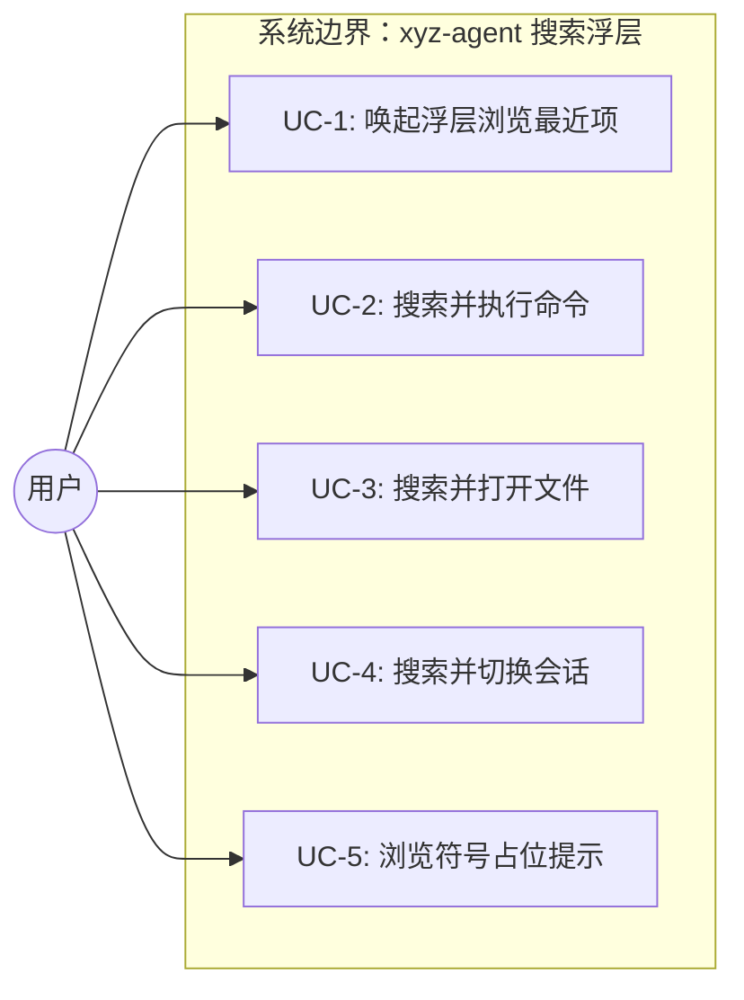
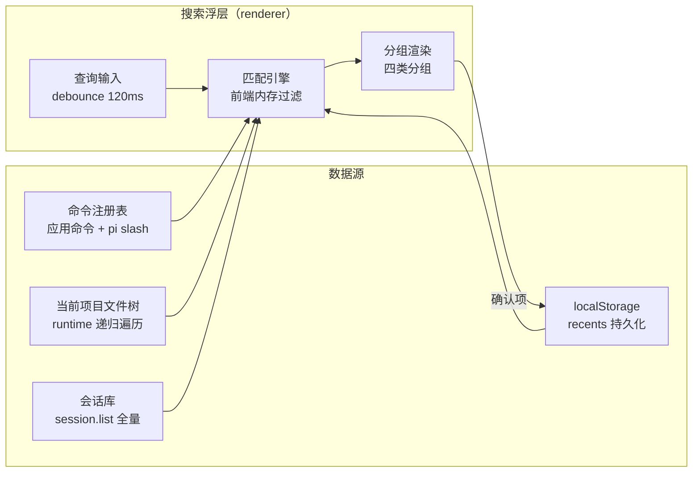

# ⌘K 全局搜索浮层（Search Modal）

> **设计 SSOT**: `docs/page-design/v3/overlays/spec.md`（UI 形态、键盘契约、状态机、归属边界）
> **本需求文档**: 业务目标、用例、数据流转、功能清单——补充 spec 停在 UI 层之上的业务层缺口。

## 1. 业务目标

### 目标树

- **G1: 让用户快速定位并跳转到任意目标（命令/文件/会话）** — 成功标准：从唤起到跳转完成 ≤ 3 次按键（⌘K + 输入 + Enter），无需记忆目标在哪层 UI
  - G1.1: 命令可达——用户不必记忆快捷键或翻菜单即可执行任意命令
  - G1.2: 文件可达——用户在当前项目内按文件名片段定位文件
  - G1.3: 会话可达——用户跨项目找到历史会话
  - G1.4: 符号可达（降级）——符号类占位，不阻断主流程

- **G2: 消除当前 mock 数据造成的误导** — 成功标准：`npm run dev` 默认 real 模式下，搜索浮层展示真实数据（命令注册表/项目文件/会话库），无写死假数据。**含 search 域**——现状 `api/index.ts` 将 search 硬编码常驻 mock（不随 VITE_MOCK 切换），G2 要求 search 同样接 real domain

### 达成路线

| 目标 | 路线/策略 | 对应用例 |
|------|---------|---------|
| G1.1 | 统一命令注册表（应用命令 + pi slash 命令），浮层内查询命中即执行 | UC-1, UC-2 |
| G1.2 | 复用 runtime 现有 `file-service.searchFiles`（全树递归，深度 8/上限 500/内建 ignore，已接 `file.search` handler + real composer domain），按路径**子串匹配** | UC-1, UC-3 |
| G1.3 | 复用 session.list 全量会话库，前端内存过滤，跨项目搜索 | UC-1, UC-4 |
| G1.4 | 符号类 UI 保留分组位，结果区显示降级提示，不接真实数据 | UC-1（边界） |
| G2 | 新建 search real domain，替换 mock；runtime 新增 search.handler | UC-1~UC-4 |

## 2. 业务用例

### 用例图



### UC-1: 唤起浮层并浏览最近项
- **Actor**: 用户（任意时刻，任何视图状态下）
- **前置条件**: 应用已启动，至少有一个 session 或会话库非空
- **主流程**:
  1. 用户按 ⌘K（mac）/ Ctrl+K（win/linux）
  2. 浮层以模糊遮罩 + 居中浮层呈现，输入框自动聚焦、光标置末尾
  3. 查询为空时，展示 recents（按类分组：每类 5 项 / 共 20 项上限）
  4. 用户按 ↑↓ 浏览，Enter 确认选中项 → 执行对应跳转 → 浮层关闭
- **替代流程**:
  - a. 再按 ⌘K / Esc / 点遮罩 → 关闭浮层（直接关闭，非先清空查询）
  - b. Tab / Shift+Tab 循环切类
- **异常流程**:
  - recents 为空（首次使用从未确认过任何项）→ 显示空态提示 + 建议操作（「输入关键词开始搜索」）
- **后置状态**: 浮层关闭，焦点还给触发元素；recents 更新（若确认了新项）
- **关联目标**: G1
- **验收标准 (AC)**:
  - AC-1.1 [正常]: ⌘K 唤起浮层，输入框自动聚焦；空查询时 recents 按类分组展示，每类 ≤5 项
  - AC-1.2 [正常]: ↑↓ 跨组扁平化移动选中项，选中项有 Card-Active inset ring 视觉态
  - AC-1.3 [正常]: Esc / 再按 ⌘K / 点遮罩三种方式均能关闭浮层
  - AC-1.4 [异常]: recents 为空时显示空态提示文案，不崩溃
  - AC-1.5 [边界]: recents 持久化到 localStorage，reload 后保留；每类超 5 项时淘汰最旧

### UC-2: 搜索并执行命令
- **Actor**: 用户
- **前置条件**: 浮层已唤起
- **主流程**:
  1. 用户输入查询（如「commit」「新建」）
  2. debounce(120ms) 后查询命令注册表，命中命令分组展示（子串高亮）
  3. 用户选中某命令项，Enter
  4. 系统执行该命令，浮层关闭，toast 反馈
- **替代流程**:
  - a. 命中 pi slash 命令（如 /commit）→ 在当前 active session 的 composer 注入该命令（若 active session 存在）
  - b. 命中应用命令（如 ⌘N 新建任务）→ 触发对应应用动作
- **异常流程**:
  - 命令需要 active session 但当前无 active session（如 /commit 无 session 上下文）→ 命令项置灰或提示「需要先选择会话」
- **后置状态**: 命令已执行；该命令项加入 recents[command]
- **关联目标**: G1.1
- **验收标准 (AC)**:
  - AC-2.1 [正常]: 输入「commit」命中 pi /commit 命令；输入「新建」命中应用「新建任务」命令
  - AC-2.2 [正常]: 命中项显示子串高亮（`<mark>` 标记，accent 色，不加背景）
  - AC-2.3 [正常]: Enter 执行命令后浮层关闭 + toast 反馈
  - AC-2.4 [异常]: 需 active session 的命令在无 session 时有明确提示，不静默失败
  - AC-2.5 [边界]: 应用命令与 pi 命令同名时（理论上不会，但）应用命令优先 / 分开展示

### UC-3: 搜索并打开文件
- **Actor**: 用户
- **前置条件**: 浮层已唤起；当前有 active session（文件搜索限当前 active session 的 cwd）
- **主流程**:
  1. 用户输入文件名片段（如「session.ts」「auth」）
  2. 查询命中文件（按相对路径子串匹配），文件分组展示
  3. 用户选中某文件，Enter
  4. 系统在 DetailPane 打开该文件预览（复用 file.read + useDetailPane），浮层关闭
- **替代流程**:
  - a. 无 active session → 文件分组显示「需要先选择会话」提示
- **异常流程**:
  - 文件读取失败（权限/文件消失）→ toast 错误反馈
  - 项目文件数巨大（>10000）→ 首次扫描 >200ms 显示加载态（spec 实现要点）
- **后置状态**: DetailPane 显示文件内容；该文件加入 recents[file]
- **关联目标**: G1.2
- **验收标准 (AC)**:
  - AC-3.1 [正常]: 输入文件名片段命中当前项目内文件，按相对路径展示
  - AC-3.2 [正常]: Enter 后 DetailPane 打开文件预览，浮层关闭
  - AC-3.3 [异常]: 无 active session 时文件分组显示明确提示
  - AC-3.4 [边界]: 扫描耗时 >200ms 显示加载态，<200ms 不显示（避免闪烁）

### UC-4: 搜索并切换会话
- **Actor**: 用户
- **前置条件**: 浮层已唤起；会话库非空
- **主流程**:
  1. 用户输入会话关键词（如 label / cwd 项目名 / gitBranch）
  2. 查询命中会话（全局跨项目），会话分组展示
  3. 用户选中某会话，Enter
  4. 系统切换 active session（复用 session.switch），浮层关闭
- **替代流程**:
  - a. 命中会话属于不同 cwd 项目 → 切换后侧栏会话列表定位到该项目分组
- **异常流程**:
  - 会话切换失败（session 已失效）→ toast 错误 + 刷新会话列表
  - 会话库为空 → 会话分组显示空态提示（「还没有会话，新建一个吧」）
- **后置状态**: active session 已切换；该会话加入 recents[session]
- **关联目标**: G1.3
- **验收标准 (AC)**:
  - AC-4.1 [正常]: 输入关键词命中跨项目会话，展示 label + cwd + gitBranch（gitBranch 缺失时不显示该字段，仅匹配 label/cwd）
  - AC-4.2 [正常]: Enter 后 active session 切换，浮层关闭
  - AC-4.3 [边界]: 命中其他项目的会话时切换正常，侧栏定位到对应分组
  - AC-4.4 [异常]: 会话库为空时会话分组显示空态提示，不崩溃

### UC-5: 浏览符号占位提示
- **Actor**: 用户
- **前置条件**: 浮层已唤起，查询命中或浏览 recents
- **主流程**:
  1. 用户在符号分组位看到降级提示
  2. 提示文案说明「符号搜索需要语言服务支持，暂不可用」
- **替代流程**:
  - a. 用户输入查询时，符号分组恒为占位提示（不随查询变化，不参与匹配）
- **异常流程**:
  - 占位提示渲染失败（极端）→ 整个符号分组隐藏，不阻断其他三类
- **后置状态**: 无（占位，无副作用）
- **关联目标**: G1.4
- **验收标准 (AC)**:
  - AC-5.1 [正常]: 符号分组 UI 保留（分组头 + 占位提示），不隐藏整个分组
  - AC-5.2 [边界]: 占位提示不随查询变化（恒定提示文案）

## 3. 数据流转

### 数据流图



### 数据清单

| 数据 | 来源 | 处理 | 消费者 | 归档策略 | 敏感级别 |
|------|------|------|--------|---------|---------|
| 命令注册表 | 应用命令（前端注册）+ pi slash（runtime session.getCommands） | 合并统一列表（pi 命令带 `/` 前缀天然不与应用命令撞名，无需复杂去重，按 name 唯一标识） | 匹配引擎 → 命令分组 | 不持久化（运行时聚合） | 内部 |
| 项目文件树 | runtime 现有 `file-service.searchFiles`（全树递归，深度 8/上限 500/内建 ignore，已接 `file.search` handler） | 按相对路径**子串匹配**（runtime 查询） | 匹配引擎 → 文件分组 | 不持久化（实时扫描） | 内部 |
| 会话库 | runtime session.list（全量跨项目） | 按 label/cwd/gitBranch **子串匹配**（前端内存过滤；**gitBranch 缺失时降级为仅匹配 label/cwd**，非 git 目录 gitBranch 为 undefined） | 匹配引擎 → 会话分组 | 不持久化（session.list 实时） | 内部 |
| recents | 用户确认行为产生 | 每类保留 5 项，FIFO 淘汰 | 匹配引擎 → recents 分组 | localStorage（跨会话持久） | 内部 |

### 匹配机制

- **匹配语义**：子串匹配（非模糊评分）。命中区间由前端 `segments()` 子串切分驱动高亮（命令/会话前端内存过滤，文件经 runtime 查询后返回）。
- **实现契约**：虚拟化（单类 >200 项启用）、分组头 sticky、z-index 分层（浮层/遮罩 1000、toast 1100）、↑↓ 用 `scrollIntoViewIfNeeded`（避免 OD 预览 iframe 滚动冲突）——详见 spec §实现要点。

## 4. 功能清单

| 编号 | 功能 | 对应用例 | 关联目标 |
|------|------|---------|---------|
| F1 | 浮层唤起/关闭（⌘K/Ctrl+K/Esc/遮罩） | UC-1 | G1 |
| F2 | recents 默认展示 + localStorage 持久化 | UC-1 | G1 |
| F3 | 键盘导航（↑↓/Enter/Tab/Esc） | UC-1~UC-4 | G1 |
| F4 | 匹配高亮（子串 `<mark>` accent 色） | UC-2~UC-4 | G1 |
| F5 | 统一命令注册表 + 命令搜索 + 执行 | UC-2 | G1.1 |
| F6 | 复用 file.search（searchFiles 全递归）+ 路径子串搜索 + DetailPane 打开 | UC-3 | G1.2 |
| F7 | 会话库跨项目搜索 + session 切换 | UC-4 | G1.3 |
| F8 | 符号占位降级提示 | UC-5 | G1.4 |
| F9 | search real domain（替换 mock） | UC-1~UC-4 | G2 |
| F10 | 空态/加载态/错误态处理 | UC-1~UC-4 | G1 |
| F11 | 无障碍契约（role=dialog + aria-modal + focus trap + role=listbox/option，见 spec §实现要点·无障碍） | UC-1~UC-4 | G1 |

## 5. UI/UX 场景

> UI 形态规范详见 `docs/page-design/v3/overlays/spec.md`，本节仅记录业务交互场景。

### 交互流程

```
任意视图 → ⌘K → 浮层（recents/query/empty） → 输入/选择 → 跳转 → 浮层关闭
```

### 状态

| 态 | 触发 | 内容 |
|---|---|---|
| 默认（recents） | 唤起且查询为空 | 按类展示最近项（每类 5 / 共 20） |
| 查询分组 | 输入查询、命中 | 三类真实分组（命令/文件/会话）+ 符号占位分组 + 命中计数 + 高亮 |
| 类型过滤 | Tab / Shift+Tab 循环切类 | 只显所选类，其余折叠（⌘1…⌘5 直达类型本期不做，见 §8） |
| 空结果 | 查询无命中 | 空态提示 + 建议操作 |
| 加载 | 索引查询 >200ms | 加载条（<200ms 不显，避免闪烁） |
| 错误 | 文件读取失败 / 会话切换失败 / 会话库空 | toast 反馈 + 分组内空态提示 |

> **四类顺序固定**：命令 → 文件 → 符号 → 会话（spec §四类分组）。符号类恒为占位提示。

## 6. 系统间功能关联

| 关联系统 | 依赖方向 | 交互方式 | 契约稳定性 |
|---------|---------|---------|-----------|
| runtime（Node 子进程） | 依赖 | WS：复用现有 `file.search` handler（全递归 searchFiles 已就绪）/ `session.list` / `session.getCommands` / `file.read`；命令注册表为前端新建 | 自有可控 |
| pi（slash 命令源） | 依赖 | 经 runtime 透传 session.getCommands | 自有可控（fork 版本） |
| localStorage（recents） | 读写 | 浏览器 API | 稳定 |

## 7. 约束

- **业务约束**:
  - 文件搜索限当前 active session 的 cwd（非跨项目，与会话搜索的全局跨项目区分）
  - 命令执行需要 active session 上下文时，必须先有 active session
- **技术约束（仅记录不展开）**:
  - 不引入 ripgrep 二进制（D-003）
  - 不引入 LSP/tree-sitter（符号降级，D-001）
  - runtime 为 Node 子进程，文件遍历在 runtime 层执行（与 file-service 同层）
  - 复用现有三层端口模式（services/ports → infra/executor）

## 8. 不做（Out of Scope）

- **文件内容全文搜索**（需 ripgrep，D-003 排除）
- **符号搜索真实数据**（需 LSP/tree-sitter，单开 topic，D-001 降级）
- **危险命令分级与二次确认**（本期无真正危险命令，D-008）
- **`⌘1…⌘5` 直达类型快捷键**（spec 遗留②，待核 OS 冲突，本期不做）
- **跨项目检索 scope 过滤条**（spec 遗留③，会话搜索已全局，文件搜索已限当前，无需 scope 切换）
- **Workspace 文件编辑器**（文件跳转只到 DetailPane 预览，D-006）
- **会话跳转进概览视图**（spec 提到的 `?focus=overview`，本期只做切换 active session，D-010）
- **Home/End 跳首/跳尾键**（spec 标「可选待定」，低优，本期不做）

## 决策记录

> 完整决策账本见 `decisions.md`。此处记录关键决策的推理上下文。

- **D-001 四类范围**：命令/文件/会话真实，符号占位。符号搜索 zero base（无 LSP），成本远超其他三类，与 agent 工作台定位偏离。
- **D-003 文件搜索方案**：只搜路径不搜内容，不引 ripgrep。复用 runtime 现有 `file-service.searchFiles`（全递归，已接 `file.search` handler）。内容全文搜的 rg 二进制打包分发成本高，收益不匹配。
- **D-004 命令注册表**：应用命令（⌘N/⌘B/⌘,）+ pi slash（/commit /fix）合并统一注册表。新建注册表抽象，Sidebar keydown 复用同一注册表，消除硬编码 if/else。
- **D-005 会话范围**：全局跨项目（session.list 天然全量分组），符合「找上次那个 auth 项目的会话」主用例。
- **D-009 命令去重键**：pi 命令带 `/` 前缀（如 `/commit`），应用命令无前缀（如「新建任务」），天然不撞名。按 name 唯一标识合并，不做复杂去重。
- **D-010 会话跳转不进概览**：本期只切换 active session，spec 的 `?focus=overview` 推迟。
- **D-002 符号占位（审查裁决）**：红队质疑符号死占位行过度设计（零活性/零数据消费），建议 UI 不渲染仅结构层预留。用户裁决保留 UI 渲染占位——结构一致性 + 未来扩展无需改 UI 的价值优先于 YAGNI。

> **⚠️ spec SSOT 漂移（已在 Step 6b 反哺 spec.md）**：`docs/page-design/v3/overlays/spec.md` 以下表述曾是旧设计，已反哺标注决策（见 spec §四类分组 + §边缘状态的 `[BACKFED from clarity]` 注释）：
> - §四类分组「文件数据源：项目索引（LSP / ripgrep 后端）」→ 复用 runtime 现有 searchFiles 全递归（D-003）
> - §四类分组「文件跳转：Workspace 打开并定位」→ 已改为 DetailPane 预览（D-006）
> - §四类分组「符号数据源：项目索引（LSP）」→ 已改为降级占位（D-001）
> - §四类分组 + §边缘状态「危险命令二次确认复用 Flow-3」→ 本期不做（D-008）
> - §四类分组「会话跳转可带 ?focus=overview 进概览」→ 本期不做（D-010）
> Step 6b 反哺检查时需在 spec.md 标注这些决策使其与本需求对齐。

## 待确认

无。所有 grilling 决策点已 ask_user 拍板。
