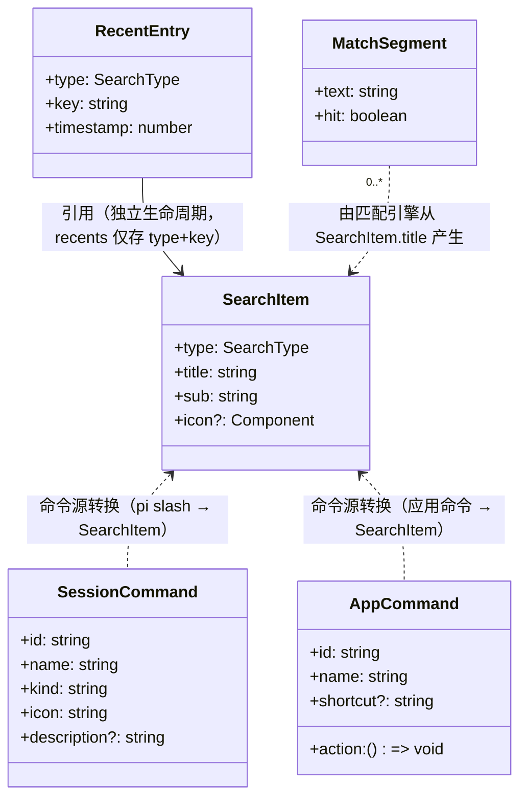
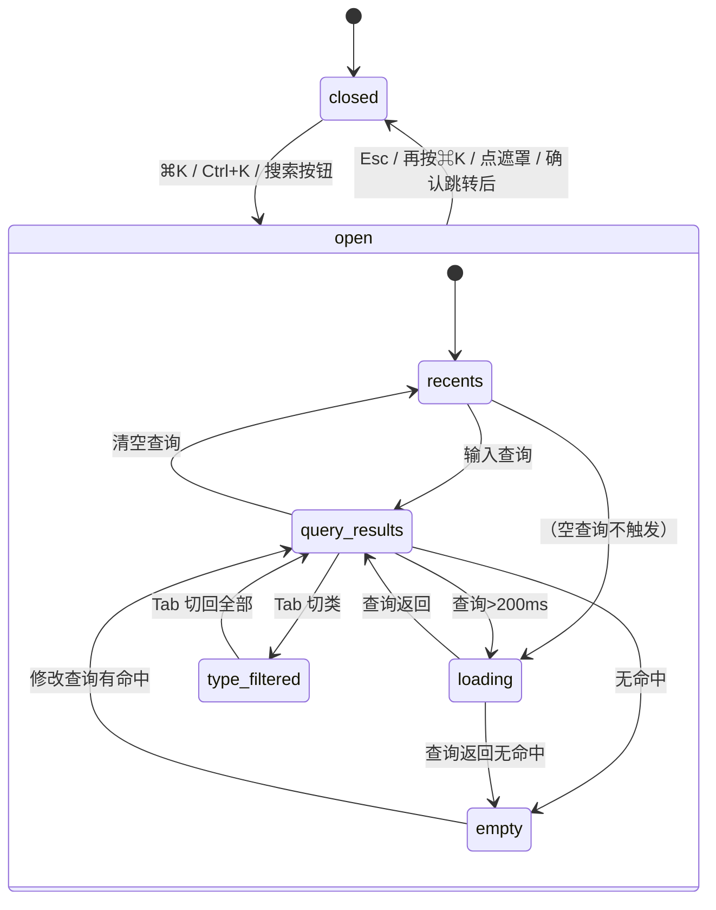
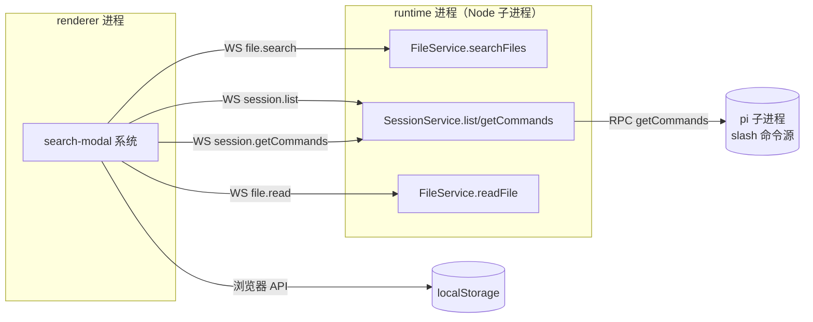
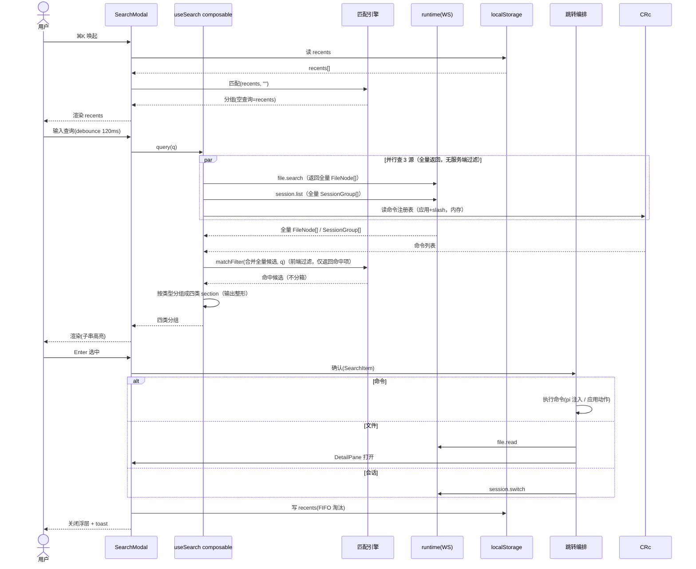

# ⌘K 全局搜索浮层 架构设计

## 1. 目标转换

### 业务目标 → 系统目标

| 业务目标 (requirements) | 转换为系统目标 | 衡量标准 |
|----------------------|--------------|---------|
| G1 快速定位跳转（≤3 次按键） | 多数据源聚合查询 + 统一匹配 + 跳转分发 | 四类分组渲染 ≤200ms；跳转闭环 |
| G1.1 命令可达 | 命令注册表聚合（应用命令 + pi slash），浮层内查询执行 | 命令命中即执行 |
| G1.2 文件可达 | 复用 runtime searchFiles 全递归 + 路径子串匹配 | 深层文件可搜到 |
| G1.3 会话可达 | 复用 session.list 全量 + 前端内存过滤 | 跨项目会话可搜 |
| G1.4 符号可达（降级） | 符号占位（不接真实数据） | 占位提示渲染 |
| G2 消除 mock 误导 | 新建 useSearch composable 替换 mock；search 不再常驻 mock（SearchModal 改调 useSearch.query）`[BACKFED from code-arch on 2026-06-30] D-026` | real 模式无写死假数据 |

### 搭便车改造目标

| 改造目标 | 动机 | 关联业务目标 | 状态 |
|------|------|-------------|------|
| Sidebar keydown 接入命令注册表 | 消除 Sidebar.vue:227 硬编码 if/else（⌘N/⌘K/⌘B），命令注册表为单一权威源 | G1.1（命令注册表复用） | 候选 |
| scrollIntoView → scrollIntoViewIfNeeded | SearchModal.vue:167 违反 spec（避免 OD 预览 iframe 滚动冲突） | G1（浮层体验） | 候选 |
| 查询 debounce(120ms) | SearchModal.vue:124 现无 debounce，spec 要求 120ms | G1（性能） | 候选 |

> 三项状态均为 `候选`，待 ⑤骨架验证确认真实工作量。design-code-arch Step7 强制核对。

## 2. 设计立场

**核心计算是什么？** 技术流程编排——把 4 个异构数据源（命令注册表/项目文件/会话库/recents）的查询结果聚合，经统一子串匹配引擎过滤，按四类分组渲染，选中后分发到对应跳转目标（命令执行/文件打开/会话切换）。

**分层决策**：三层架构（Interface / Service / Infrastructure）。无复杂业务规则/策略引擎，核心是「查询-匹配-渲染-跳转」的编排流水线。DDD 四层的 Domain 层会是空壳（无领域规则可放），违反复杂度归位（D-011）。

## 3. 统一语言（Ubiquitous Language）

> 项目根 CONTEXT.md 为权威源。本节列本次新增/修改术语。

| 术语 | 含义 |
|------|------|
| **命令注册表** (Command Registry) | 应用内置命令 + pi slash 命令的统一聚合源，供 search 命令分组与 Sidebar keydown 共享（D-004） |
| **匹配引擎** (Match Engine) | 纯函数，输入查询 + 候选项，输出带命中区间的结果（子串匹配，驱动 `<mark>` 高亮） |
| **跳转编排** (Jump Orchestrator) | 选中项确认后的分发逻辑：按类型路由到命令执行/DetailPane 打开/session 切换 |
| **useSearch composable** | `composables/features/useSearch.ts`，替代 mock 的真实 search 编排（编排 4 数据源查询）`[BACKFED from code-arch on 2026-06-30] D-026：编排归 composable 非 domain——编排跨 commandStore+fileSearchStore+composer/session 违反「domain 只调 transport+pending」铁律` |

## 4. 核心模型

| 模型 | 类型 | 不变式 | 建模理由 |
|------|------|--------|---------|
| `SearchItem` | DTO（已有） | type ∈ {command,file,symbol,session}；title/sub 非空 | 四类分组的统一渲染项（search-data.ts 已定义，复用） |
| `SessionCommand` | DTO（已有） | id 唯一；name 非空；kind/icon 推导自 source | pi slash 命令的归一化模型（command store 已定义） |
| `AppCommand` | 命令对象（新增，含 action 行为） | id 唯一；name/shortcut/action 非空 | 应用内置命令（⌘N/⌘B/⌘, 等），命令注册表的应用命令部分。带 action 故非纯值对象 |
| `RecentEntry` | 值对象（新增） | type+key 唯一；timestamp 单调 | recents 持久化项（localStorage，FIFO 每类 5 项） |
| `MatchSegment` | 值对象（已有） | hit 标记 + text | 高亮渲染段（SearchModal.segments 已实现） |

### 模型关联图

> 模型 ≥ 2 且存在引用关系，出 classDiagram。



### 降级决策（主动不建模）

| 概念 | 为什么不建模 | 应有的处理 |
|------|------------|-----------|
| SearchSession aggregate | 浮层状态是 Vue computed 派生态（query/结果驱动），无领域不变式可守（D-013） | 用组件内 ref + computed 表达 UI 状态 |
| MatchStrategy port | 子串匹配稳定无替换需求，单实现是伪 port（D-012） | 匹配引擎为纯函数模块 |
| SearchSource port | 4 数据源接口形状不同（前端内存 vs runtime WS），强行抽象塞适配代码（D-012） | useSearch composable 内分别调用各 api/store `[BACKFED from code-arch on 2026-06-30] D-026` |

## 5. 状态流转

### Status 枚举（浮层生命周期，只描述阶段）

`closed` → `open`（open 内含多个派生视图态）

open 内视图态（**派生态，非独立状态变量**，由 query/结果/loading computed 推导）：
- `recents`（query 空）
- `query-results`（query 非空 + 有命中）
- `empty`（query 非空 + 无命中）
- `loading`（查询中 >200ms）
- `error`（查询/跳转失败）
- `type-filtered`（Tab 切类激活时）

### Reason 字段

无独立 Reason——error 态的原因由具体 api 调用的 catch 表达（toast 反馈），不进状态机。

### 合法转换



> **松散状态机（D-014）**：上述视图态是 Vue computed 派生（`currentView = query空 ? recents : hasResults ? query-results : empty`），不建显式转换表。closed↔open 是仅有的独立状态变量（`props.open`）。loading/error 是 transient 标志（ref + setTimeout/catch 驱动）。

## 6. 分层架构

### 层级图

```mermaid
graph TD
    subgraph "Interface 层（renderer/UI）"
        SM[SearchModal.vue<br/>⌘K 浮层 UI + 键盘导航 + 高亮渲染]
        SB[Sidebar.vue<br/>⌘K 触发入口 + keydown 复用注册表]
    end
    subgraph "Service 层（renderer/编排）"
        SD[useSearch composable<br/>composables/features/useSearch.ts<br/>编排 4 数据源查询<br/>[BACKFED from code-arch D-026]]
        CRc[useCommandRegistry composable<br/>应用命令注册 + 聚合<br/>跨 store 协调]
        ME[匹配引擎<br/>纯函数 子串匹配 + segments]
        JO[跳转编排<br/>分发 命令执行/文件打开/会话切换]
        RC[recents composable<br/>localStorage 持久化]
    end
    subgraph "Store 层（renderer/状态，stores 无外部依赖铁律）"
        CS[command store<br/>扩展：全局应用命令区 + sessionId 分区 slash 命令]
    end
    subgraph "Infrastructure 层（runtime + 通道）"
        TR[transport + domains/*<br/>file.search / session.list / session.getCommands / file.read]
        RT[runtime<br/>FileService.searchFiles / SessionService / etc]
        LS[localStorage<br/>recents]
    end
    SM --> SD
    SM --> ME
    SM --> JO
    SM --> RC
    SM --> CRc
    SB --> CRc
    CRc --> CS
    SD --> TR
    JO --> TR
    TR --> RT
    RC --> LS
```

### Port 清单

| Port | 价值定位 | 实现数 |
|------|---------|--------|
| （无） | D-012 不做 port，4 数据源直接调 api，扁平结构 | — |

## 7. 模块划分与变化轴

| 模块 | 职责 | 变化轴 | 位置 | LOC(预估) |
|------|------|--------|------|----------|
| SearchModal.vue（改造） | 浮层 UI + 键盘导航 + 高亮渲染 | UI 交互 | components/overlays/ | ~250（现 186） |
| useSearch composable（新建） | 编排 4 数据源查询 + 合并候选 + 按类型分组（输出整形）+ loadSeq/close 孤儿守卫 | 数据源查询编排 + 分组 | composables/features/useSearch.ts `[BACKFED from code-arch on 2026-06-30] D-026：不新建 api/domains/search.ts——编排跨 store 违反 domain 铁律，归 composable 与 useSidebar/useFileSearch 同层模式一致` | ~120 |
| 命令注册表（扩展 command store + 新 composable） | 应用命令注册 + pi slash 聚合，供 search/Sidebar 共享 | 命令聚合 | stores/command.ts（扩）+ composables/features/useCommandRegistry.ts（新） | ~100 | `[BACKFED from execution consistency-final on 2026-06-30] 路径补 features/ 一级`
| 匹配引擎（提取为纯函数模块） | **仅**子串过滤（matchFilter）+ segments 高亮段产生。不含分组、不调 api、无副作用 | 匹配算法（纯函数） | lib/match-engine.ts（从 SearchModal 提取） | ~40 |
| 跳转编排（新建） | 选中项分发到命令执行/DetailPane/session 切换 | 跳转路由 | composables/features/useSearchJump.ts（新） | ~80 | `[BACKFED from execution consistency-final on 2026-06-30] 路径补 features/ 一级`
| recents composable（新建） | localStorage 读写 + FIFO 淘汰 | recents 持久化 | composables/features/useRecents.ts（新） | ~60 | `[BACKFED from execution consistency-final on 2026-06-30] 路径补 features/ 一级`
| api/index.ts（接线改造） | 删除 search 导出（search 无 real domain，SearchModal 改调 useSearch.query）`[BACKFED from code-arch on 2026-06-30] D-026` | 门面清理 | api/index.ts | ~5 |

> **复用现有基建**：command store（SessionCommand 模型 + sessionId 分区）、fileSearch store + useFileSearch（文件搜索缓存 + debounce + 失效）、transport + pending（WS 通道）、useDetailPane（文件打开）、useSidebar.selectSession（会话切换）。

## 8. 系统间上下文边界（Context Map）



| 关联系统 | 关系模式 | 交互方式 | 契约稳定性 |
|---------|---------|---------|-----------|
| runtime | 客户-供应商（renderer 依赖 runtime 已有 handler） | WS（复用 file.search/session.list/session.getCommands/file.read） | 自有可控 |
| pi | 经 runtime 透传（renderer 不直连 pi） | runtime RPC → pi getCommands | 自有可控（fork 版本） |
| localStorage | 共享内核（浏览器标准） | 同步 API | 稳定 |

## 9. 泳道图（Swimlane）



## 10. 挑战与决策

### D-011: 三层 vs DDD 四层
**张力**: 架构纯粹性（DDD 四层）vs 复杂度归位（核心无领域规则）
**决策**: 三层（D-011）
**理由**: 核心是技术流程编排，Domain 层无规则可放会是空壳

### D-012: port 边界
**张力**: 可扩展性（为数据源/匹配做 port）vs 伪 port 成本
**决策**: 不做 port（D-012）
**理由**: 4 数据源接口形状不同，删/翻/挪证伪为伪 port；匹配策略稳定无替换需求

### D-013: 领域模型深度
**张力**: 建模完整性 vs 过度建模
**决策**: 纯 DTO/值对象，无 aggregate（D-013）
**理由**: 无领域不变式可守，建 SearchSession aggregate 是「装着 UI 逻辑的对象」反模式

### D-016: 命令注册表归属（扩展 vs 新建）
**张力**: command store 已管 pi slash（按 sessionId 分区），应用命令是全局的（无 sessionId）
**决策**: 扩展 command store——增加全局应用命令区（与 sessionId 分区的 slash 命令并列）
**理由**: 复用现有 SessionCommand 模型 + store 基建；应用命令与 slash 命令同属「命令」概念，内聚
**物理隔离**（应对 S5）：两区失效语义不同——应用命令区是静态注册（启动时一次性，无失效）；slash 命令区是 per-session 动态（session 切换/创建时刷新）。store 内用两个独立 ref 表达（`appCommands: Ref<AppCommand[]>` + `slashCommands: Map<sessionId, SessionCommand[]>`），不揉进同一响应式根，避免应用命令被 session 切换误触发响应式更新

### 特化决策

| 决策 | 违反什么 | 为什么合理 | 触发变化怎么办 |
|------|---------|-----------|--------------|
| 符号占位不建 SearchSource port | D-012 不做 port 的通用规则 | 符号是占位（无真实数据源），连查询都不发，无需 port | 补符号数据时在 useSearch composable 内新增一个 api 调用即可，仍不需 port `[BACKFED from code-arch on 2026-06-30] D-026` |
| recents 用 localStorage 不走 runtime | 「数据应经 runtime」惯例 | recents 是纯前端偏好（D-007），与 settings 的 system 偏好同性质（localStorage），不经 runtime | 如需跨设备同步再改，当前 YAGNI |

## 11. 反模式检查（grep 验收清单）

### AC-1: search 不再常驻 mock
- 验证：`grep -n "search = mockApi.search" src-electron/renderer/src/api/index.ts` 应无输出（search 导出删除，SearchModal 改调 useSearch.query）`[BACKFED from code-arch on 2026-06-30] D-026：search 无 real domain，门面不再导出 search`

### AC-2: 应用命令不硬编码在 keydown
- 验证：`grep -n "metaKey.*⌘N\|newSession()" src-electron/renderer/src/components/sidebar/Sidebar.vue` keydown 改为从注册表读取（搭便车 D-015，待⑤确认）

### AC-3: 无伪 port
- 验证：`grep -rn "interface SearchSource\|interface MatchStrategy" src-electron/renderer/src/` 无输出（D-012 不做 port）

### AC-4: 匹配引擎为纯函数
- 验证：`grep -n "export function match\|export function segments" src-electron/renderer/src/lib/match-engine.ts` 存在且无副作用（无 ref/reactive/import api）

## 12. 行为契约保持清单（refactor 模式）

> SearchModal.vue 现有行为，架构改造需保持等价（变更/删除须独立 ticket）。

### BC-1: ⌘K/Ctrl+K 唤起 + Esc 关闭
| 字段 | 内容 |
|------|------|
| 源码位置 | `SearchModal.vue:11`（Dialog open）+ `Sidebar.vue:228-241`（keydown） |
| 处理 | 保持（Esc 行为保持「直接关闭」非先清空，spec 遗留①已决策） |
| 冲突 | 无 |

### BC-2: ↑↓ 跨组扁平化键盘导航
| 字段 | 内容 |
|------|------|
| 源码位置 | `SearchModal.vue:157-162`（onKeydown）|
| 处理 | 保持 |
| 冲突 | 无 |

### BC-3: Enter 确认 + emit('select') + 关闭
| 字段 | 内容 |
|------|------|
| 源码位置 | `SearchModal.vue:171-177`（confirmSel）|
| 处理 | **变更**（→独立 ticket）：现 emit select 父组件未接入；D-006 要求接入真实跳转。从 emit 改为调跳转编排（JO）。**前置依赖**：跳转编排模块（§7）骨架须先建，否则 BC-3 无处可调 |
| 冲突 | 无（requirements D-006 明确要求接入） |

### BC-4: segments 子串高亮（`<mark>` accent 色）
| 字段 | 内容 |
|------|------|
| 源码位置 | `SearchModal.vue:141-155`（segments）+ `:60-69`（模板渲染）|
| 处理 | 保持（提取为匹配引擎纯函数模块，行为等价） |
| 冲突 | 无 |

### BC-5: 空查询显示 recents + 建议命令
| 字段 | 内容 |
|------|------|
| 源码位置 | `SearchModal.vue:124-129`（loadResults 空查询走 useSearch.query("")）`[BACKFED from code-arch on 2026-06-30] D-026`|
| 处理 | **变更**（→独立 ticket）：现 recents 是 mock 写死；D-007 要求 localStorage 持久化真实 recents |
| 冲突 | 无 |

### BC-6: 空结果显示「未找到」态
| 字段 | 内容 |
|------|------|
| 源码位置 | `SearchModal.vue:80-87` |
| 处理 | 保持 |
| 冲突 | 无 |

### BC-7: scrollIntoView 滚动到选中项
| 字段 | 内容 |
|------|------|
| 源码位置 | `SearchModal.vue:164-169`（scrollToSel）|
| 处理 | **变更**（→搭便车 D-015，**以 D-015 ⑤骨架验证确认为前提**）：scrollIntoView → scrollIntoViewIfNeeded（spec 要求，避免 OD iframe 冲突）。若搭便车不纳入则回退为「保持」 |
| 冲突 | 无 |

### BC-8: 四类图标映射（command/file/symbol/session）
| 字段 | 内容 |
|------|------|
| 源码位置 | `SearchModal.vue:115`（ICON map）|
| 处理 | 保持（symbol 图标保留，占位态仍渲染图标） |
| 冲突 | 无 |

### BC-9: 乱序响应保护（loadSeq 序列号守卫）
| 字段 | 内容 |
|------|------|
| 源码位置 | `SearchModal.vue:123`（loadSeq）+ `:126-128`（seq === loadSeq 守卫）|
| 处理 | **保持**（正确性不变式——乱序响应不覆盖新结果，refactor 重写 loadResults 时极易丢失） |
| 冲突 | 无 |

### BC-10: 鼠标交互路径（hover 同步选中 + click 确认）
| 字段 | 内容 |
|------|------|
| 源码位置 | `SearchModal.vue:50`（@mouseenter 同步 selIdx）+ `:51`（@click 触发 confirmSel）|
| 处理 | 保持（鼠标与键盘共享 selIdx + confirmSel，与 BC-2/BC-3 键盘路径等价） |
| 冲突 | 无 |

### BC-11: 查询/开关生命周期副作用
| 字段 | 内容 |
|------|------|
| 源码位置 | `SearchModal.vue:180`（query 变化重置 selIdx=0）+ `:183`（open 触发 loadResults）+ `:184`（close 清空 query）|
| 处理 | 保持 |
| 冲突 | 无 |

### BC-12: 边缘不变式（空结果禁用键盘 / 循环包裹 / Clock 图标 / a11y 属性）
| 字段 | 内容 |
|------|------|
| 源码位置 | `:158`（total===0 onKeydown return）/ `:159-160`（↑↓ modulo 循环）/ `:72-75`（recents 态 Clock 图标）/ `:15-18,44-46`（role/aria/sr-only）|
| 处理 | 保持 |
| 冲突 | 无 |

## 下游衔接

### 喂给 Step 3（Issue 拆分）的部分

| 本文档章节 | issue 拆分用途 |
|-----------|--------------|
| §7 模块划分 | 每个「新建/改造」模块 = 一个 issue 候选 |
| §12 行为契约 BC-3/5/7（变更项） | 独立 ticket（行为变更不裹进架构 PR） |
| §1 搭便车候选（3 项） | 待⑤确认后纳入或回流 |
| §11 grep AC | issue 验收标准来源 |
