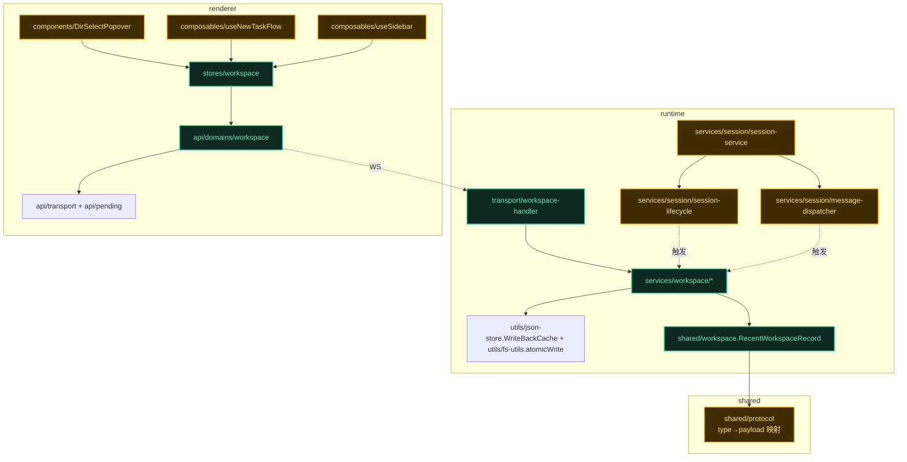
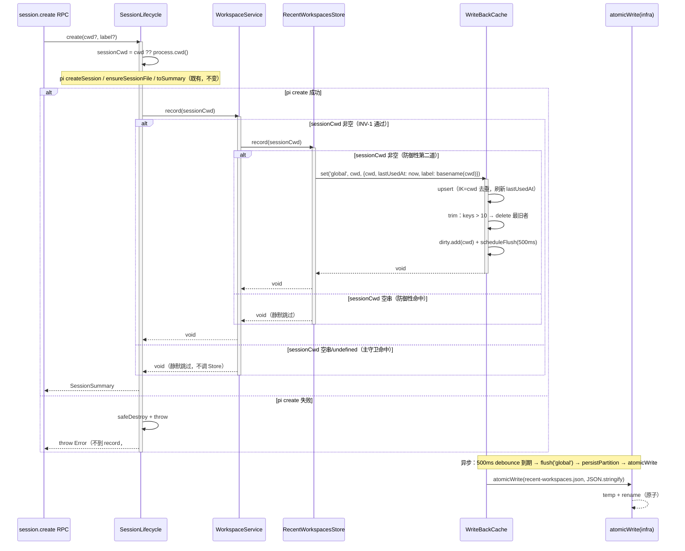
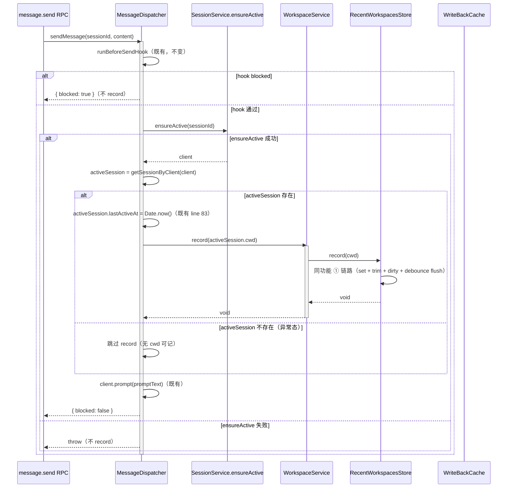
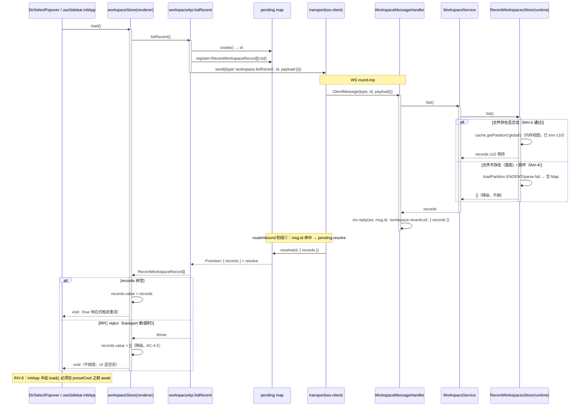
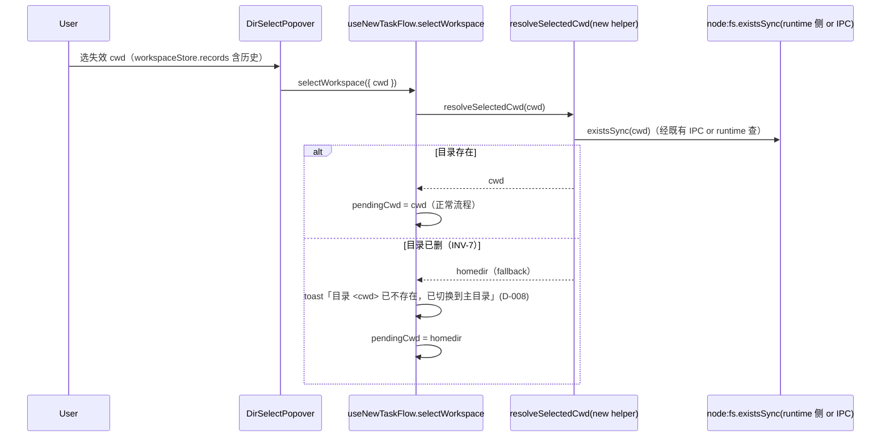

# 代码架构设计 — recent-workspaces（最近工作区独立持久化）

> mid-detail-plan Step 2 Drafter-B（code-arch）产出。沿系统架构 §2 分层图 + issues #1-#6 决策树落到代码契约层。
> 上游决策不可推翻：D-003 三层 / D-004 pull RPC / D-005 复用 write-back 意图 / D-006 number 时间戳。
> 本文件职责：工程目录 + API 契约 + 时序图 + 包依赖图 + test-matrix + 骨架覆盖核验。**不写实现 body**（属 coding-execute Wave）。

## 1. 工程目录

> 推导自 system-architecture §2（分层图）+ §3（4 模块按变化轴）+ code-wiring-cheatsheet §A-H（主 agent 实测接线点）。

```
src-electron/
├── shared/src/
│   ├── workspace.ts                     [新增] RecentWorkspaceRecord DTO（领域就近，E2 架构候选）
│   └── protocol.ts                      [改] ClientMessageType/Map + ServerMessageType/MapBase 各加 2 条（§G）
├── runtime/src/
│   ├── services/workspace/              [新增目录] workspace 域（变化轴：持久化策略 + 写入时机编排）
│   │   ├── recent-workspaces-store.ts   [新增] RecentWorkspacesStore（持久化策略 + LRU，方案 a）
│   │   └── workspace-service.ts         [新增] WorkspaceService（写入时机触发 + trim 编排 + INV-1 守卫）
│   ├── transport/
│   │   └── workspace-message-handler.ts [新增] WorkspaceMessageHandler（纯路由 → ctx.reply，零业务）
│   ├── services/session/
│   │   ├── session-lifecycle.ts         [改] create(cwd) 成功返回前调 workspaceService.record(sessionCwd)
│   │   ├── message-dispatcher.ts        [改] sendPrompt line 83（lastActiveAt 同处）调 workspaceService.record
│   │   └── session-service.ts           [改] 构造加 workspaceService 参数 → 注入 lifecycle + dispatcher
│   └── index.ts                         [改] 组合根：new Store + new Service + SessionService 构造传参 + setServices 加参数（§C）
└── renderer/src/
    ├── api/domains/workspace.ts          [新增] workspaceApi.listRecent()（pending pattern，模板 session.ts:list）
    ├── stores/workspace.ts               [新增] workspaceStore（records + load()，模板 session.ts）
    ├── components/new-task/DirSelectPopover.vue [改] 数据源 session 派生 → workspaceStore.records（§F）
    ├── composables/features/useNewTaskFlow.ts   [改] resolveDefaultCwd → workspaceStore.records[0]?.cwd（§F）
    ├── composables/features/useSidebar.ts       [改] initApp 时序：loadSessions 后、presetCwd 前 await workspaceStore.load()（INV-6，§F）
    └── lib/utils.ts                     [改] 删 recentWorkspaces / resolveDefaultCwd / MAX_RECENT_WORKSPACES / RecentWorkspace（D-002，#5）
```

**目录职责（按变化轴）**：
- `services/workspace/` — workspace 域业务编排。`recent-workspaces-store` 随「持久化策略 / 淘汰算法」变；`workspace-service` 随「写入时机触发点 / trim 逻辑」变。两文件分离 = 两变化轴分离。
- `transport/workspace-message-handler.ts` — RPC 契约入口，随「协议变」独立演化（铁律：零业务）。
- `shared/src/workspace.ts` — DTO SSOT，前端+runtime 共享，随「记录字段定义」变。

**依赖方向**：
- runtime：`transport → services ← infra`（services 定义 ports 概念但本功能无新 port；infra=WriteBackCache/atomicWrite/getConfigDir 复用）。services/workspace 不 import transport，不 import session/ 内部（只被 session 调）。
- shared → 被所有层 import，自身零项目内依赖。
- renderer：`api/domains/workspace → transport + pending`；`stores/workspace → api/domains/workspace`；组件/store 不直接 import transport（domain 门面屏蔽）。

**Seam 纪律**（system-architecture §2 + §7 Seam 检查）：
- session→workspace 单向（SessionLifecycle/MessageDispatcher 调 WorkspaceService.record，workspace 不回调 session）→ **无环**。
- WorkspaceService 与 SessionService **平级非嵌套**（组合根创建后注入 SessionService 构造，再由 SessionService 内部传给 lifecycle/dispatcher）。
- 仅 1 假设 seam（WorkspaceService 被两处触发点调用）→ **不抽象成 interface**，直接 class 注入（deep-module 词汇：1 adapter = 假设 seam，不引 port）。

## 2. 包依赖图



**import 规则**：
- 实线 = import；虚线 = 触发调用 / WS 跨进程。
- 新增节点（绿）：services/workspace/* / transport handler / shared/workspace / renderer api+store。
- 改动节点（黄）：session 三件套 / renderer 三个消费点 / protocol。
- **循环依赖检测点**：session→workspace 单向，workspace 不反向 import session（grep 守护：services/workspace/ 下零 `import.*session-`）。

## 3. API 契约

> 签名表 + 接线层级标注。接线层级：`[模块内直调]` / `[跨模块 port]` / `[adapter 真引 SDK]`。本功能无第三方 SDK adapter（filesystem = in-process infra 复用 atomicWrite，pi 不碰），故无 adapter 层级。

### 模块: shared

#### 类型: RecentWorkspaceRecord（DTO）

| 字段 | 类型 | 边界条件 | Spec/Issue 关联 |
|------|------|---------|----------------|
| cwd (字段) | string 绝对路径 | 非空串（INV-1），绝对路径 | UC-1/2/3/6, #1 |
| lastUsedAt (字段) | number 毫秒时间戳 | Date.now()（D-006，与 session.lastActiveAt 一致） | #1, D-006 |
| label (字段) | string 显示名 | cwd basename（运行时算，零冗余存储——见 §5 label 决策） | UC-1 AC-1.4 |

> DTO 无行为（system-architecture §5 判定：技术流程编排，无 aggregate）。文件格式 = JSON 数组（`RecentWorkspaceRecord[]`），落盘到 `<configDir>/recent-workspaces.json`（configDir = getConfigDir() 动态推导，INV-5）。

### 模块: runtime/services/workspace

#### 类: RecentWorkspacesStore

| 方法 | 签名 | 返回 | 边界条件 | 接线层级 | Issue/AC |
|------|------|------|---------|---------|----------|
| constructor | `(configDir: string)` | — | configDir 非空（INV-5 getConfigDir 注入） | [模块内直调] 构造 WriteBackCache | #1 |
| record | `(cwd: string): void` | void | cwd 空串/undefined 静默跳过（防御性守卫，INV-1 第二道） | [模块内直调] cache.set('global', cwd, record) | #1 AC-1.1/1.3/1.4 |
| list | `(): RecentWorkspaceRecord[]` | ≤10 条按 lastUsedAt 倒序 | 文件损坏/不存在 → []（INV-4） | [模块内直调] 读 cache 内存视图 | #1 AC-1.1, #3 AC-3.4 |
| flushAll | `(): void` | void | shutdown 用 | [模块内直调] cache.flushAll + stopTimer | — |
| startFlushTimer | `(): void` | void | 启动全量周期 flush 兜底（沿用 session-data-store 模式，FLUSH_INTERVAL_MS=5000） | [模块内直调] setInterval | — |

> 内部：`private cache: WriteBackCache<'global', string, RecentWorkspaceRecord>`（方案 a，§4 形态决策）。
> INV-2/3 由 cache.set 后立即 trim（内存）+ Map 去重键（IK=cwd）天然保证。

#### 类: WorkspaceService

| 方法 | 签名 | 返回 | 边界条件 | 接线层级 | Issue/AC |
|------|------|------|---------|---------|----------|
| constructor | `(store: RecentWorkspacesStore)` | — | store 注入（组合根） | [模块内直调] | #2 |
| record | `(cwd: string): void` | void | cwd 空串/undefined → 静默跳过（INV-1 主守卫，grep 验证点） | [模块内直调] this.store.record(cwd) | #2 AC-2.1/2.2/2.3/2.4/2.5 |
| list | `(): RecentWorkspaceRecord[]` | 透传 store.list() | — | [模块内直调] this.store.list() | #3 AC-3.1 |

> AC-2.4 约束（grep 守护）：service 无 setTimeout/setInterval（debounce 归位 WriteBackCache）。
> AC-2.5 约束（grep 守护）：service 不 import SessionService（无环）。

### 模块: runtime/transport

#### 类: WorkspaceMessageHandler

| 方法 | 签名 | 返回 | 边界条件 | 接线层级 | Issue/AC |
|------|------|------|---------|---------|----------|
| constructor | `(ctx: WorkspaceHandlerContext)` | — | ctx 含 workspaceService + send/reply/sendError | [模块内直调] | #3 |
| handles (readonly) | `readonly ClientMessageType[]` | = `['workspace.listRecent']` | — | — | #3 |
| handleWorkspaceMessage | `(msg: ClientMessage, ws: WsType): Promise<void>` | void | 零业务：ctx.reply(ws, msg.id, 'workspace.recentList', { records: service.list() }) | [模块内直调] ctx.reply + service.list | #3 AC-3.1/3.2/3.3/3.4 |

> WorkspaceHandlerContext extends MessageHandlerContext（复用 send/reply/sendError）+ `{ workspaceService: WorkspaceService }`（§B 模板）。

### 模块: runtime/services/session（改接点，§D 写入时机）

#### 类: SessionLifecycle（已存在，[改]）

| 方法 | 签名 | 改动点 | 接线层级 | Issue/AC |
|------|------|--------|---------|----------|
| constructor | 现签名 + `workspaceService: WorkspaceService` | 新增构造参数（注入） | [跨模块 port] SessionService 转注入 | #2 |
| create | `async create(cwd?, label?): Promise<SessionSummary>` | 成功返回前调 `this.workspaceService.record(sessionCwd)`（写入时机 A，D-007 唯一挂点） | [模块内直调] workspaceService.record | #2 AC-2.1 |

#### 类: MessageDispatcher（已存在，[改]）

| 方法 | 签名 | 改动点 | 接线层级 | Issue/AC |
|------|------|--------|---------|----------|
| constructor | 现签名 + `workspaceService: WorkspaceService` | 新增构造参数 | [跨模块 port] SessionService 转注入 | #2 |
| sendPrompt | `private async sendPrompt(...)` | line 83 `activeSession.lastActiveAt = Date.now()` 同处加 `this.workspaceService.record(activeSession.cwd)`（写入时机 B） | [模块内直调] workspaceService.record | #2 AC-2.2 |

#### 类: SessionService（已存在，[改]）

| 方法 | 签名 | 改动点 | 接线层级 | Issue/AC |
|------|------|--------|---------|----------|
| constructor | 现签名 + `workspaceService: WorkspaceService` | 新增末尾参数；转注入 lifecycle + dispatcher 构造 | [跨模块 port] 组合根注入 | #2 |

### 模块: runtime/index.ts（组合根，[改]）

| 改动 | 接线 | Issue/AC |
|------|------|----------|
| new RecentWorkspacesStore(configService.getConfigDir()) | [模块内直调] | #1 AC-1.7 |
| new WorkspaceService(store) | [模块内直调] | #2 |
| new SessionService(..., workspaceService) | [跨模块 port] | #2 |
| server.setServices(..., workspaceService) | [跨模块 port] | #3 |
| shutdown 钩子加 store.flushAll() + store 生命周期 | [模块内直调] | — |

### 模块: shared/protocol.ts（[改]，§G）

| 新增条目（合并目标） | 定义 |
|---------|------|
| ClientMessageType 合并 | `\| 'workspace.listRecent'` |
| ClientMessageMap 合并 | `'workspace.listRecent': Record<string, never>`（请求 payload 空） |
| ServerMessageType 合并 | `\| 'workspace.recentList'` |
| ServerMessageMapBase 合并 | `'workspace.recentList': { records: RecentWorkspaceRecord[] }` |

> reply 经 routeInbound pending map（msg.id 匹配，§6 + D-004 措辞澄清），**不经 events.ts 订阅通道**（session/global 通道是 broadcast 推送专用，本功能两者都不走）。

### 模块: renderer/api/domains

#### 模块函数: workspaceApi.listRecent（[新增]，模板 session.ts:list）

| 方法 | 签名 | 返回 | 边界条件 | 接线层级 | Issue/AC |
|------|------|------|---------|---------|----------|
| listRecent | `(): Promise<RecentWorkspaceRecord[]>` | records 数组（≤10） | RPC reject → Promise reject（调用方降级） | [模块内直调] pending.create + register + transport.send | #3 AC-3.1/3.3, #4 AC-4.5 |

### 模块: renderer/stores

#### 类: workspaceStore（[新增]，模板 stores/session.ts）

| 方法/字段 | 签名 | 边界条件 | 接线层级 | Issue/AC |
|----------|------|---------|---------|----------|
| records (Ref) | `Ref<RecentWorkspaceRecord[]>` 初值 `[]` | — | — | #4 AC-4.1 |
| load | `async (): Promise<void>` | reject → records 置 []（降级，不抛错） | [模块内直调] workspaceApi.listRecent | #4 AC-4.3/4.5 |
| defaultCwd (computed) | `computed<string \| undefined>` = records.value[0]?.cwd | 空数组 → undefined（UC-6 AC-6.2 fallback 不变） | — | #4 AC-4.2/4.4 |

### 模块: renderer（改接点，§F）

| 文件 | 改动 | 接线层级 | Issue/AC |
|------|------|---------|----------|
| DirSelectPopover.vue | `recentWorkspaces(session.list)` → `workspaceStore.records`；删 import recentWorkspaces | [模块内直调] workspaceStore | #4 AC-4.1, #5 |
| useNewTaskFlow.ts | `resolveDefaultCwd(session.list)` → `workspaceStore.defaultCwd`；删 import resolveDefaultCwd | [模块内直调] workspaceStore | #4 AC-4.2, #5 |
| useSidebar.initApp | `loadSessions` 后、`presetCwd` 前 `await workspaceStore.load()`；presetCwd 参数改 `workspaceStore.defaultCwd` | [模块内直调] workspaceStore.load | #4 AC-4.3, INV-6 |
| lib/utils.ts | 删 `recentWorkspaces` / `resolveDefaultCwd` / `MAX_RECENT_WORKSPACES` / `RecentWorkspace` type | — | #5 AC-5.1/5.2 |

## 4. D-005 形态适配最终选定（issues #1 决策点）

> issues #1 取舍决策：归 code-arch 骨架验证最终选定。本节即最终决策。

**选定：方案 a — `WriteBackCache<'global', string, RecentWorkspaceRecord>` 固定 partition key**

**理由（基于系统性质 + 实测样态，code-wiring-cheatsheet §A）**：

| 判据 | 方案 a（WriteBackCache 固定 partition） | 方案 b（JsonStore + 自管 debounce） |
|------|---------------------------------------|------------------------------------|
| D-005 原意匹配度 | ✅ 直接复用 write-back（dirty + 500ms debounce + sizeOf/onSet 现成） | ❌ JsonStore 无 write-back（write 即时落盘），自管 debounce = 手写 mini-WriteBackCache，与「复用」相悖 |
| 写入时机 B 高频写应对 | ✅ set 即时改内存 + 标 dirty + scheduleFlush（debounce 合并），每发消息不触发 IO | ❌ JsonStore.write 每次 atomicWrite（高频 IO），或 store/service 再加 debounce timer（双层 debounce 风险） |
| 形态匹配 | △ per-partition KV 当全局数组用略别扭，但 partitionKeys() 等无用 API 不影响正确性 | ✅ 单文件单值语义匹配 |
| 一致性（>品味） | ✅ 与 session-data-store.ts / PluginStorage 同抽象 | △ 引入新持久化形态（项目里 JsonStore 已用于 models/settings/permissions，但都不需 write-back） |

→ **形态别扭是审美问题，自造 debounce 是 D-005 违规问题**。选 a。

**待 code-arch 验证的 3 个决策点（issues #1 已列，此处定）**：
- ✅ **固定 partition key 用常量** `RECORDS_PARTITION = 'global'`（防魔法串，便于 grep；字面量 'global' 在代码里只出现一次）。
- ✅ **trim 时机：set 后立即 trim（内存）**——cache.set 后立即读 partition keys、若 >10 则 delete 最旧者（lastUsedAt 最小者）。内存视图始终 ≤10，list() 读内存直接返（无需 list 时再 trim）。trim 不增加 flush 次数（dirty 已标，复用同一 scheduleFlush timer）。
- ✅ **label 存储策略：算（cwd basename）**——零冗余，basename 计算极轻（`cwd.split('/').filter(Boolean).pop() ?? cwd`），无需持久化。IV 类型含 label 字段（接口契约一致），record() 内算出后填入 cache.set。

## 5. 功能代码链路（时序图）

> 类方法级，含异常路径（alt/else）。3 条（context-summary 第 2 段 code-arch 入口）。

### 功能 ①：写入时机 A — SessionLifecycle.create（关联 UC-2, #2）

#### 时序图



#### 方法签名表

| 类 | 方法 | 签名 | 边界条件 | 关联 |
|----|------|------|---------|------|
| SessionLifecycle | create | `(cwd?: string, label?: string) → Promise<SessionSummary>` | pi 失败 throw（不 record） | UC-2, #2 |
| WorkspaceService | record | `(cwd: string) → void` | cwd 空静默跳过（INV-1 主守卫） | #2 AC-2.3 |
| RecentWorkspacesStore | record | `(cwd: string) → void` | cwd 空静默跳过（INV-1 防御） | #1 AC-1.4 |
| WriteBackCache | set | `(k, ik, iv) → void` | IK=cwd 去重 + trim + dirty + scheduleFlush | #1 INV-2/3 |
| WriteBackCache | flush | `(k) → void` | persistPartition → atomicWrite | INV-4 |

#### 数据流链
`session.create RPC → SessionLifecycle.create → WorkspaceService.record → RecentWorkspacesStore.record → WriteBackCache.set(内存+dirty) → [500ms debounce] → persistPartition → atomicWrite(recent-workspaces.json)`

#### 异常路径枚举（→ test-matrix §6）
- E1-1: pi create 失败 → 不 record（AC-2.1 反向验证）
- E1-2: sessionCwd 空串/undefined → service 主守卫跳过（AC-2.3）
- E1-3: sessionCwd 空串穿透到 store → store 防御性跳过（AC-1.4）
- E1-4: atomicWrite 失败（盘满/权限）→ flush 抛错（flushAll 由 shutdown 兜底，record 本身不抛）

### 功能 ②：写入时机 B — MessageDispatcher.sendPrompt（关联 UC-3, #2）

#### 时序图



#### 方法签名表

| 类 | 方法 | 签名 | 边界条件 | 关联 |
|----|------|------|---------|------|
| MessageDispatcher | sendPrompt | `private async (sessionId, hookContent, buildPrompt) → Promise< { blocked: boolean } >` | hook blocked/ensureActive 失败不 record | UC-3, #2 |
| WorkspaceService | record | `(cwd: string) → void` | 同功能 ① | #2 AC-2.2 |

#### 数据流链
`message.send RPC → MessageDispatcher.sendPrompt → [hook 过 + ensureActive 成功 + activeSession 存在] → record(activeSession.cwd) → 同功能 ① store 链路`

#### 异常路径枚举
- E2-1: BeforeSend hook blocked → 不 record（避免「拦截的消息也污染历史」）
- E2-2: ensureActive 失败 → throw，不 record
- E2-3: activeSession 不存在（理论异常态）→ 跳过 record，继续 prompt（不阻断主流程）
- E2-4: 高频发消息（写入时机 B 压力）→ WriteBackCache 500ms debounce 合并多次 set 为一次 flush（AC-3.2）

### 功能 ③：读取 — DirSelectPopover / useNewTaskFlow.startFlow（关联 UC-1/UC-6, #3/#4）

#### 时序图



#### 方法签名表

| 类/模块 | 方法 | 签名 | 边界条件 | 关联 |
|--------|------|------|---------|------|
| workspaceStore | load | `() → Promise<void>` | reject → records=[] | #4 AC-4.3/4.5 |
| workspaceApi | listRecent | `() → Promise<RecentWorkspaceRecord[]>` | pending pattern | #3 |
| WorkspaceMessageHandler | handleWorkspaceMessage | `(msg, ws) → Promise<void>` | 零业务 ctx.reply | #3 AC-3.2 |
| WorkspaceService | list | `() → RecentWorkspaceRecord[]` | 透传 store | #3 AC-3.1 |
| RecentWorkspacesStore | list | `() → RecentWorkspaceRecord[]` | 文件损坏/不存在 → [] | #1 AC-1.5/1.6 |

#### 数据流链
`UI(workspaceStore.load) → workspaceApi.listRecent → pending.create + register + transport.send(WS) → WorkspaceMessageHandler → WorkspaceService.list → RecentWorkspacesStore.list(读内存) → ctx.reply(WS) → routeInbound pending.resolve → records 回灌 store → Vue 响应式`

#### 异常路径枚举
- E3-1: 文件不存在（首次启动）→ loadPartition 返空 Map → list 返 []（AC-1.6）
- E3-2: 文件损坏（非法 JSON）→ loadPartition try/catch → 返空 Map → list 返 []（AC-1.5）
- E3-3: RPC reject（WS 断/超时）→ workspaceApi throw → store.load catch → records=[]（AC-4.5）
- E3-4: INV-7 cwd 失效（记录存在但目录已删）→ list 仍返回该记录（不过滤，AC-6.1），选中时 existsSync 检查降级（D-008，见 §5 功能 ④）

### 功能 ④（关联 #6 INV-7 cwd 失效降级，D-008）

> INV-7 降级在选中时（不在 listRecent 时）。复用 `session-lifecycle.restoreSession` 既有 `existsSync(cwd)` + homedir fallback 模式（D-008）。

#### 时序片段（DirSelectPopover 选中失效 cwd → toast + homedir fallback）



> 层级归属：existsSync 检查在 renderer 不可直连 fs（preload 桥或既有 IPC），降级 helper 归 lib/utils 或 composable。具体 helper 名 + IPC 路径属 Wave 实现期细化（骨架不展开，骨架只标改接点）。

#### 异常路径枚举
- E4-1: 选中失效 cwd → toast + homedir fallback（AC-6.2）
- E4-2: 选中有效 cwd → 正常流程（AC-6.1 正向）

## 6. 测试矩阵（Test Matrix）— [MANDATORY]

> **测试框架**：unit/integration 用 vitest（禁 node:test/tsx --test）；E2E 用 **Playwright** `_electron`（mock 轨 `VITE_MOCK=true`，real 轨无 mock）。
> **运行命令**：runtime `cd src-electron/runtime && npx vitest run`；renderer `cd src-electron/renderer && npx vitest run`；E2E `npx playwright test`。
> **WriteBackCache flush 测试**：必用 `vi.useFakeTimers()` + `vi.advanceTimersByTime()`。
> **Mock 策略**（对齐 TEST-STRATEGY §5）：唯一合法入口 `api/mock/` 层。新增 `api/mock/workspace.ts` mock `workspace.listRecent`。单元/integration 测试用 `vi.mock('@/api')`。
> **三视角**（构建者白盒 + 使用者黑盒 + 观察者形态）：每集成/E2E 至少一个 DOM 断言（`wrapper.find(...).exists()` / `wrapper.text()`），mount 顶层容器（`Panel`，禁止悄悄换更小被测对象）。

### 来源 A：功能用例（按 UC 归类）

#### UC-1 / UC-4：查看列表 + LRU 淘汰（关联 §5 ③ 时序图）

| 用例 ID | 类型 | 测试层 | 场景 | 输入 | 预期 | 关联 AC |
|---------|------|--------|------|------|------|---------|
| T1.1 | 正常 | mock | record 后 list 返回 ≤10 倒序 | record 3 个不同 cwd | list 返 3 条按 lastUsedAt 倒序 | AC-1.1 |
| T1.2 | 边界 | mock | 已有 10 条 record 第 11 个 | record 11 个不同 cwd | list 返 10 条，最旧者淘汰（INV-2） | AC-1.2 |
| T1.3 | 正常 | mock | 同 cwd 多次 record | record('A') ×3 | list 返 1 条（INV-3），lastUsedAt 最新 | AC-1.3 |
| T1.4 | 异常 | mock | cwd 空串 record（E1-2/E1-3） | store.record('') + service.record('') | 不写入，list 不含空记录 | AC-1.4 |
| T1.5 | 异常 | mock | 文件不存在首启（E3-1） | 不存在 recent-workspaces.json | list 返 [] 不抛 | AC-1.6 |
| T1.6 | 异常 | mock | 文件损坏非法 JSON（E3-2） | 写入 `'corrupted{'` 后 list | list 返 [] 不抛（INV-4 降级） | AC-1.5 |
| T1.7 | 状态 | mock(real) | debounce + flush 时序 | record 后 advanceTimersByTime(500) | atomicWrite 被调用 1 次；record 3 次 advance 500 仅写 1 次（合并） | AC-3.2 |
| T1.8 | 约束 | mock | INV-5 路径动态 | 构造 store 传 getConfigDir() 派生路径 | 文件路径含 configDir，无硬编码 `~/.xyz-agent`（pre-commit 守护） | AC-1.7 |
| T1.9 | e2e | mock | RPC 贯穿（handler→service→store） | mount handler + 注入 store，发 workspace.listRecent | reply `workspace.recentList` + records 数组 | AC-3.1/3.2/3.4 |

#### UC-2 / UC-3：写入时机 A/B（关联 §5 ①② 时序图）

| 用例 ID | 类型 | 测试层 | 场景 | 输入 | 预期 | 关联 AC |
|---------|------|--------|------|------|------|---------|
| T2.1 | 正常 | mock | SessionLifecycle.create 成功后 record（E1-1 正向） | mock pm.createSession 成功，spy workspaceService.record | record 被调一次，入参 = sessionCwd | AC-2.1 |
| T2.2 | 正常 | mock | MessageDispatcher.sendPrompt record（E2-4 正向） | mock ensureActive + activeSession，spy record | record 被调一次，入参 = activeSession.cwd；line 83 lastActiveAt 同处 | AC-2.2 |
| T2.3 | 异常 | mock | pi create 失败不 record（E1-1 反向） | mock pm.createSession throw | record 未被调 | AC-2.1 反向 |
| T2.4 | 异常 | mock | hook blocked 不 record（E2-1） | mock hook 返 blocked:true | record 未被调 | UC-3 边界 |
| T2.5 | 异常 | mock | ensureActive 失败不 record（E2-2） | mock ensureActive throw | record 未被调 | UC-3 边界 |
| T2.6 | 约束 | mock | AC-2.4 service 无 debounce | grep service 文件 | 零 `setTimeout`/`setInterval`（grep 守护） | AC-2.4 |
| T2.7 | 约束 | mock | AC-2.5 无环 | grep services/workspace/ | 零 `import.*session-` | AC-2.5 |

#### UC-6：默认 cwd 推断 + INV-6 时序（关联 §5 ③ 时序图 + #4）

| 用例 ID | 类型 | 测试层 | 场景 | 输入 | 预期 | 关联 AC |
|---------|------|--------|------|------|------|---------|
| T3.1 | 正常 | mock | defaultCwd = records[0]?.cwd | records=[{cwd:'/a', lastUsedAt:2},{cwd:'/b',lastUsedAt:1}] | defaultCwd = '/a' | AC-4.2 |
| T3.2 | 边界 | mock | records 空 → defaultCwd undefined（AC-6.2） | records=[] | defaultCwd = undefined | AC-4.4 |
| T3.3 | 状态 | mock | INV-6 时序：load 在 presetCwd 前 | mount useSidebar.initApp + spy 顺序 | `await workspaceStore.load()` 早于 `flow.presetCwd()`（grep + 调用序断言） | AC-4.3, INV-6 |
| T3.4 | 异常 | mock | load RPC reject 降级（E3-3） | mock workspaceApi.listRecent reject | records=[] 不抛错；presetCwd 仍执行（用 undefined 兜底） | AC-4.5 |

#### UC-1 渲染（DirSelectPopover）+ 删派生函数（#5）+ cwd 失效（#6）

| 用例 ID | 类型 | 测试层 | 场景 | 输入 | 预期 | 关联 AC |
|---------|------|--------|------|------|------|---------|
| T4.1 | e2e | mock | 首屏渲染：popover 展示 workspaceStore.records | mount DirSelectPopover + stub store records=[...] | DOM 含列表项 + 目录名 + 路径两行（`wrapper.find(...)`） | AC-4.1 |
| T4.2 | e2e | mock | 空态：records=[] | mount + stub store records=[] | DOM 含「暂无最近工作区」文案 | UC-1 替代 |
| T4.3 | e2e | mock | 搜索过滤 | 输入 search='foo' | filtered 只含 cwd 含 'foo' 项 | AC-1.3 |
| T4.4 | 异常 | mock | 选中失效 cwd → toast + homedir fallback（E4-1） | mock existsSync=false | toast「目录 X 已不存在...」+ pendingCwd=homedir | AC-6.2 |
| T4.5 | 约束 | mock | #5 删派生函数后零悬空 | grep renderer | `recentWorkspaces\|resolveDefaultCwd` 零命中（除注释） | AC-5.1 |
| T4.6 | e2e | real | 跨进程持久化：record → 重启 → list 一致（AC-7.1） | runtime 真实 store.record → dispose → new store 同 configDir → list | records 内容一致（持久化落盘 + reload） | AC-7.1 |
| T1.10 | 约束 | integration(real) | 数据目录与 pi 隔离（规则 #11） | 构造 store 传 getConfigDir()，record 后查文件落点 | 文件在 `<configDir>/recent-workspaces.json`（非 ~/.pi/agent/），configDir 含 .xyz-agent | INV-5, #11 |
| T1.11 | 异常 | integration(real) | atomicWrite 原子性（flush 半途崩溃） | record → 触发 flush → 模拟 flush 中途异常 → 重 new store list | 主文件不损坏（temp 残留不污染），list 返落盘的完整态或 []（降级） | INV-4, nfr 数据 |

### 来源 B：NFR 风险→用例映射表 — [MANDATORY]

> nfr.md 并行产出中，本表先列已明确的 NFR 风险（从 context-summary 第 2 段 nfr 7 维度 + 第 3 段硬约束推断，验收方式=代码测试的项）。主 agent Step 3 从 nfr 回灌表补全剩余条目（每条补一条 ≥ T<n>.<m> 用例 ID）。

| ④缓解项 | 来源 Issue# | 维度 | 归属 UC | 验证断言 | 强制层级 | test-matrix 用例 ID |
|--------|------------|------|--------|---------|---------|-------------------|
| 文件损坏降级不崩（INV-4） | #1 | 数据 | UC-1/4 | 非法 JSON → list 返 []，进程不崩 | unit | T1.5, T1.6 |
| 路径动态化不硬编码（INV-5） | #1 | 安全/兼容 | UC-1/4 | 用 getConfigDir() 派生路径，pre-commit check_path_whitelist 守护 | unit | T1.8 |
| 数据目录与 pi 隔离（规则 #11） | #1 | 安全 | UC-1/4 | recent-workspaces.json 写在 getConfigDir() 派生路径（~/.xyz-agent/），非 ~/.pi/agent/ | integration | T1.10 |
| atomicWrite 原子性（temp+rename，flush 期间崩溃不丢全文件） | #1 | 数据 | UC-1/4 | flush 半途崩溃 → 主文件完好（temp 残留不污染） | integration | T1.11 |
| 高频写 debounce 合并（写入时机 B） | #2 | 性能 | UC-3 | record N 次 advance 500ms → atomicWrite 仅 1 次（合并） | unit（fake timers） | T1.7 |
| service 无额外 debounce（AC-2.4，debounce 归 WriteBackCache） | #2 | 性能 | UC-3 | grep workspace-service.ts 零 setTimeout/setInterval | unit（grep 守护） | T2.6 |
| INV-1 双层守卫（service 主守卫 + store 防御） | #2 | 兼容 | UC-2/3 | record('') / record(undefined) 静默跳过不调 store | unit | T1.4 |
| INV-6 时序守护（首屏默认 cwd 不空） | #4 | 兼容/稳定性 | UC-6 | load 早于 presetCwd（grep + 序断言） | integration | T3.3 |
| RPC reject 降级（不走 markSessionError，AC-4.5） | #3 | 稳定性 | UC-1/6 | mock listRecent reject → workspaceStore.load() catch 置空数组不抛 | unit | T3.4 |
| 调用方改接无悬空 import（AC-5.2） | #4 | 兼容 | UC-1/6 | vue-tsc / eslint EXIT 0（改接后编译通过） | unit（构建守护） | T4.5 |
| 派生函数 grep 零残留（D-002，AC-5.1） | #5 | 兼容 | UC-1/6 | rg recentWorkspaces\|resolveDefaultCwd src-electron/renderer 零命中 | unit（grep 守护） | T4.5 |
| cwd 失效 toast + homedir fallback（D-008，AC-6.2） | #6 | 稳定性 | UC-1 | mock existsSync false → toast 文案渲染 + cwd fallback homedir | unit | T4.4 |
| 跨进程持久化一致（S3/AC-7.1） | #1 | 稳定性 | UC-1/4 | runtime 重启后 list 与重启前一致 | integration | T4.6 |

### 覆盖完整性自检
- [x] 每 UC 的正常/边界/异常/状态 4 类齐全（来源 A）
- [x] 来源 A 每条标测试层（mock/real/mock(real)/e2e mock/e2e real）
- [x] 时序图每个 alt/else 都映射到一条异常用例（E1-x / E2-x / E3-x / E4-x 双向可查）
- [x] 无状态机（system-architecture §5 明示），状态类用例不适用
- [x] 本功能无并发（D-004 pull-only 单消费点 + WS 单连接单进程，context-summary 第 2 段），并发类 N/A
- [x] 来源 B 已覆盖 nfr 全部 10 条「验收方式=代码测试」缓解项（Step 3a 回灌对齐后，无待回灌占位）。新增 T1.10（pi 隔离）/ T1.11（atomicWrite 原子性）2 条 integration 用例（见下）

## 7. 现有代码映射（refactor 场景）

| 新目录/文件 | 现有代码文件/函数 | 处置 | 行为等价测试要点 |
|------------|------------------|------|----------------|
| services/workspace/recent-workspaces-store.ts | （新建） | create | — |
| services/workspace/workspace-service.ts | （新建） | create | — |
| transport/workspace-message-handler.ts | （新建） | create | — |
| shared/workspace.ts | （新建 DTO） | create | — |
| shared/protocol.ts | 现有 protocol.ts | keep+extend（加 4 条映射） | 现有 type 不变 |
| services/session/session-lifecycle.ts | 现有 SessionLifecycle | keep+extend（构造加参数 + create 末尾加 record） | create 行为不变（record 是新增副作用，非破坏） |
| services/session/message-dispatcher.ts | 现有 MessageDispatcher | keep+extend（构造加参数 + sendPrompt 加 record） | sendPrompt 行为不变 |
| services/session/session-service.ts | 现有 SessionService | keep+extend（构造加末尾参数） | 既有方法签名不变 |
| renderer/lib/utils.ts | recentWorkspaces/resolveDefaultCwd/MAX_RECENT_WORKSPACES/RecentWorkspace | **delete**（#5，D-002） | 调用方改接 workspaceStore 后行为等价（list 内容形态一致） |
| renderer/DirSelectPopover.vue | workspaces computed | keep+改数据源 | 列表渲染形态/交互不变（D-002 SSOT） |
| renderer/useNewTaskFlow.ts | submitFirstMessage 内 resolveDefaultCwd 调用 | keep+改数据源 | 默认 cwd 推断行为不变 |
| renderer/useSidebar.ts | initApp 时序 | keep+改时序（加 await load） | startFlow→loadSessions→load→presetCwd 顺序确定（INV-6） |

> 行为等价测试约束：#5 删派生函数前，先抓取 DirSelectPopover + useNewTaskFlow 既有行为快照（records 内容 + 默认 cwd 推断结果），改接后比对一致（prefactor Wave）。

## 8. 下游衔接（喂给 execution-plan）

| 时序图 | 对应 Wave（候选） | 依赖的其他时序图 |
|--------|------------------|------------------|
| §5 ①（写入时机 A） | W2（session-lifecycle.create 改接 + service 注入） | 依赖 W1 store+service 骨架 |
| §5 ②（写入时机 B） | W2（message-dispatcher.sendPrompt 改接） | 依赖 W1 |
| §5 ③（读取） | W2/W3（RPC 契约 + handler + workspaceApi + workspaceStore + DirSelectPopover/useNewTaskFlow 改接） | 依赖 W1 store.list |
| §5 ④（INV-7 降级） | W3（选中失效 cwd helper + toast） | 依赖 W2 popover 改接 |

> Wave 编排最终归 execution-plan（主 agent Step 4），本表为候选骨架。

## 9. 骨架覆盖核验（MANDATORY）— 双向

> §3 签名表 ↔ `code-skeleton/` 骨架定义双向对应。Level 1 接线（skeleton-spike.md）：模块内方法体真实接线下游（`this.x.foo()`），叶子逻辑 throw。

| §3 方法（模块.类.方法） | 骨架定义位置 | 接线状态 | 备注 |
|------------------------|-------------|---------|------|
| shared.RecentWorkspaceRecord | shared/workspace.ts | ✅ 类型(叶子) | DTO，无行为 |
| runtime.RecentWorkspacesStore.record | runtime/services/workspace/recent-workspaces-store.ts | ✅ 接线完整 | this.cache.set + trim |
| runtime.RecentWorkspacesStore.list | 同上 | ✅ 接线完整 | this.cache.getPartition 读内存 |
| runtime.RecentWorkspacesStore.flushAll | 同上 | ✅ 接线完整 | this.cache.flushAll + stopTimer |
| runtime.RecentWorkspacesStore.startFlushTimer | 同上 | ✅ 接线完整 | setInterval |
| runtime.WorkspaceService.record | runtime/services/workspace/workspace-service.ts | ✅ 接线完整 | INV-1 守卫 + this.store.record |
| runtime.WorkspaceService.list | 同上 | ✅ 接线完整 | this.store.list |
| runtime.WorkspaceMessageHandler.handleWorkspaceMessage | runtime/transport/workspace-message-handler.ts | ✅ 接线完整 | this.ctx.reply + this.ctx.workspaceService.list |
| runtime.SessionLifecycle.create（改） | runtime/_wiring/session-lifecycle.wiring.ts | ✅ 接线完整 | this.workspaceService.record(sessionCwd) |
| runtime.MessageDispatcher.sendPrompt（改） | runtime/_wiring/message-dispatcher.wiring.ts | ✅ 接线完整 | line 83 同处 this.workspaceService.record |
| runtime.SessionService（改构造） | runtime/_wiring/session-service.wiring.ts | ✅ 接线完整 | 转注入 lifecycle + dispatcher |
| runtime.index.ts（组合根改） | runtime/_wiring/composition-root.wiring.ts | ✅ 接线完整 | new Store + new Service + setServices |
| shared.protocol.ts（改） | shared/protocol-additions.ts | ✅ 类型 | 4 条映射 stub |
| renderer.workspaceApi.listRecent | renderer/api/domains/workspace.ts | ✅ 接线完整 | pending.create + register + transport.send |
| renderer.workspaceStore.load | renderer/stores/workspace.ts | ✅ 接线完整 | try/catch + this.records = await listRecent |
| renderer.workspaceStore.defaultCwd | 同上 | ✅ 签名(computed) | computed records[0]?.cwd |
| renderer.DirSelectPopover（改） | renderer/_integration/popover-integration.ts | ✅ 接线完整 | workspaceStore.records 替换 |
| renderer.useNewTaskFlow（改） | renderer/_integration/newtask-integration.ts | ✅ 接线完整 | workspaceStore.defaultCwd 替换 |
| renderer.useSidebar.initApp（改） | renderer/_integration/sidebar-initapp.ts | ✅ 接线完整 | await workspaceStore.load 时序 |

**覆盖完整性自检**：
- [x] §3 签名表每个公开方法在本表有对应行（无遗漏）
- [x] 无 `❌ 未定义`（check 脚本 ③f 兜底）
- [x] 接线状态标注准确（叶子标类型/签名，非叶子标接线完整）

## 10. 决策记录（本阶段 agent-opinionated）

> mid-plan 已 confirmed 的 D-003~D-008 见 decisions.md，此处不重复。本阶段新增（code-arch 最终选定）：

- **D-005 形态适配最终选定 = 方案 a**（WriteBackCache 固定 partition 'global'）——见 §4 取舍表。理由：D-005 原意是复用 write-back，方案 a 直接复用，方案 b 自造 debounce 违 D-005；写入时机 B 高频写依赖 debounce 合并。
- **固定 partition key 常量 `RECORDS_PARTITION = 'global'`**——防魔法串。
- **trim 时机：set 后立即 trim（内存）**——内存视图始终 ≤10。
- **label 存储策略：算（cwd basename）**——零冗余，IV 含 label 字段保持契约一致。
- **INV-1 双层守卫**：service 层主守卫（grep 验证点）+ store 层防御性守卫（持久化层最后防线）——issues #2 方案 A。
