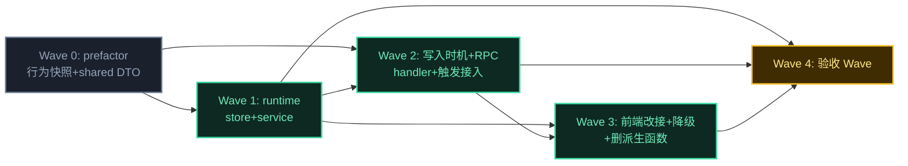

# 执行计划 — recent-workspaces（最近工作区独立持久化）

> mid-detail-plan Step 3 产出。从 `code-architecture.md §5` 时序图推导 Wave 依赖。
> 上游决策不可推翻：D-003 三层 / D-004 pull RPC / D-005 方案 a（WriteBackCache 固定 partition）/ D-006 number / D-007 create-only / D-008 toast+fallback。
> 执行衔接：coding-execute skill（check_execute.py 机器门支持 mid 的 T 前缀用例 ID 格式——T+UC 编号+序号，如 T1.1——加测试执行层标注）。

## Wave 编排总览

### 依赖 DAG 图

### 调度表

| Wave | 切片 | P级 | Blocked by | 并行组 | 说明 |
|------|------|-----|-----------|--------|------|
| 0 | prefactor | — | 无 | — | shared DTO 定义 + 既有行为快照（#5 删除铺垫），铺路 |
| 1 | runtime store + service | P0/P1 | Wave 0 | A | 核心数据基座（#1+#2 主体），可独立单测 |
| 2 | 写入时机 + RPC + handler | P1 | Wave 0, 1 | A | #2 触发点接入 + #3 RPC 契约（依赖 W1 store/service） |
| 3 | 前端改接 + INV-7 + 删派生 | P1/P2 | Wave 1, 2 | B | #4 store/api/改接 + #6 cwd 失效降级 + #5 删函数（依赖 W1/W2） |
| 4 | 验收 Wave | — | 1, 2, 3 | — | **必须最后**：读测试验收清单全量 → 跑测试 → 全 PASS 才算实现完成 |

### 并行约束
- 同文件不允许多 Wave 同时修改（W2 改 session-lifecycle/message-dispatcher/session-service/index.ts；W3 改 renderer 文件；无交集）
- W2 与 W3 理论可并行（不同文件域），但 W3 的前端 RPC 消费依赖 W2 的 RPC 契约就绪 → 串行（W3 blocked_by W2）
- 同并行组内最多 3 个 subagent 并行

### Prefactor Wave 约束
- W0 覆盖 code-arch §7「现有代码映射」的 delete 项（#5 派生函数）的行为等价测试约束——**先抓快照后删**
- W0 建 shared/workspace.ts DTO（W1/W3 共享依赖，前置定义）

---

## Wave 0: prefactor（行为快照 + shared DTO）

**切片类型**: prefactor
**P 级覆盖**: —
**Blocked by**: 无——可立即开始
**并行关系**: 串行起点

### 包含的功能/issue
- shared DTO 定义（code-arch §3 RecentWorkspaceRecord）
- 行为等价快照（code-arch §7，为 #5 删除铺垫）

### 文件影响
- 创建: `src-electron/shared/src/workspace.ts`（RecentWorkspaceRecord DTO）
- 创建: `src-electron/shared/src/protocol.ts` 的新增条目（4 条 type→payload 映射，合并进现有 protocol.ts）
- 测试: 快照测试（DirSelectPopover 现有 records 形态 + useNewTaskFlow 默认 cwd 推断结果，供 W3 改接后比对）

### 覆盖的 test-matrix 用例 ID
> 本 Wave 是 prefactor，不直接覆盖功能 AC，但产出快照供 W3 行为等价验证。
- （快照用例，非 test-matrix 功能用例）

### Subagent 配置

| 配置项 | 值 |
|--------|---|
| Agent | general-purpose |
| 注入上下文 | code-architecture.md §3 RecentWorkspaceRecord + §7 现有代码映射 + shared/protocol.ts 现有结构 |
| 读取文件 | `src-electron/shared/src/protocol.ts` + `src-electron/renderer/src/lib/utils.ts`（现有派生函数）+ `src-electron/renderer/src/components/new-task/DirSelectPopover.vue` |
| 修改/创建文件 | `shared/src/workspace.ts` + protocol.ts 合并 + 快照测试文件 |

### 执行流（Wave 内部，TDD 链）
1. 写 shared/workspace.ts DTO + protocol.ts 4 条映射 → tsc 编译过（验证类型契约）
2. 写快照测试（抓取 DirSelectPopover 当前 records 渲染 + useNewTaskFlow 默认 cwd）→ 测试 PASS（快照固定）

### 验收标准
- [ ] shared/workspace.ts + protocol.ts 新增条目 tsc 编译通过
- [ ] 行为快照测试 PASS（快照固定，供 W3 比对）

---

## Wave 1: runtime store + service（P0 #1 + P1 #2 主体）

**切片类型**: 垂直切片
**P 级覆盖**: P0, P1
**Blocked by**: Wave 0
**并行关系**: 并行组 A

### 包含的功能/issue
- 功能: RecentWorkspacesStore（持久化 + LRU，D-005 方案 a）
- 功能: WorkspaceService（写入时机编排 + INV-1 守卫）
- Issue: #1（P0，方案 a WriteBackCache 固定 partition）/ #2（P1，方案 A service 守卫）
- 关联时序图: code-architecture.md §5 ① 数据流链（store 部分）

### 文件影响
- 创建: `src-electron/runtime/src/services/workspace/recent-workspaces-store.ts`
- 创建: `src-electron/runtime/src/services/workspace/workspace-service.ts`
- 测试: `services/workspace/recent-workspaces-store.test.ts` + `workspace-service.test.ts`

### 覆盖的 test-matrix 用例 ID（完成判定）
> 来自 code-architecture.md §6 来源 A + B。
- T1.1, T1.2, T1.3, T1.4（store LRU + INV-1/2/3）
- T1.5, T1.6（文件不存在/损坏降级，INV-4）
- T1.7（debounce + flush 时序）
- T1.8（INV-5 路径动态化）
- T1.10（数据目录与 pi 隔离）
- T1.11（atomicWrite 原子性）
- T2.6（AC-2.4 service 无 setTimeout/setInterval grep 守护）
- T2.7（AC-2.5 service 不 import session grep 守护）

### Subagent 配置

| 配置项 | 值 |
|--------|---|
| Agent | general-purpose |
| 注入上下文 | code-architecture.md §3 签名表（RecentWorkspacesStore/WorkspaceService）+ §4 D-005 方案 a 决策 + §5 ① 时序图 + §6 对应用例 + code-wiring-cheatsheet §A（WriteBackCache 真实构造签名 + session-data-store 范例）|
| 读取文件 | `runtime/src/utils/json-store.ts`（WriteBackCache）+ `runtime/src/utils/fs-utils.ts`（atomicWrite）+ `services/plugin-service/session-data-store.ts`（范例）+ `runtime/src/services/config-service.ts`（getConfigDir）|
| 修改/创建文件 | recent-workspaces-store.ts + workspace-service.ts + 2 个 .test.ts |

### 执行流（TDD 链，串行）
1. general-purpose（读 TDD + 编码规范 + code-arch §3/§4/§6）→ 写失败测试（T1.1-T1.8, T1.10, T1.11, T2.6, T2.7）
2. general-purpose（读 WriteBackCache 范例 + 编码规范）→ 写实现（store: WriteBackCache<'global'> 固定 partition + trim + flush；service: INV-1 守卫 + 委托 store）
3. general-purpose（读 reviewer 规范）→ spec 合规检查（D-005 方案 a 落地 + INV-1~5 守卫 + grep 无硬编码路径）

### 验收标准
- [ ] 本 Wave 覆盖的 issue AC 逐条列全并全过（trace: #1 AC-1.1~1.7, #2 AC-2.3/2.4/2.5）
- [ ] **本 Wave 的「覆盖的 test-matrix 用例 ID」逐条列全并全 PASS**（T1.1-T1.8, T1.10, T1.11, T2.6, T2.7）
- [ ] 时序图 §5 ① 的 store 链路方法已实现（record/upsert/trim/flush/list）
- [ ] D-005 方案 a 落地（WriteBackCache 固定 partition 'global'，非 JsonStore）
- [ ] 测试通过（npx vitest run）

---

## Wave 2: 写入时机接入 + RPC 契约 + transport handler（P1 #2 触发点 + #3）

**切片类型**: 垂直切片
**P 级覆盖**: P1
**Blocked by**: Wave 0, Wave 1
**并行关系**: 并行组 A（与 W1 串行，W1 是其依赖）

### 包含的功能/issue
- 功能: SessionLifecycle.create 写入时机 A 接入（D-007 create-only）
- 功能: MessageDispatcher.sendPrompt 写入时机 B 接入
- 功能: WorkspaceMessageHandler + workspace.listRecent RPC 契约
- Issue: #2（P1，触发点接入）+ #3（P1，方案 A 独立 handler）
- 关联时序图: code-architecture.md §5 ①②③

### 文件影响
- 创建: `src-electron/runtime/src/transport/workspace-message-handler.ts`
- 修改: `runtime/src/services/session/session-lifecycle.ts`（构造加参数 + create 末尾 record）
- 修改: `runtime/src/services/session/message-dispatcher.ts`（构造加参数 + sendPrompt line 83 同处 record）
- 修改: `runtime/src/services/session/session-service.ts`（构造加末尾参数，转注入）
- 修改: `runtime/src/index.ts`（组合根：new Store + new Service + SessionService 传参 + setServices 加参数 + shutdown flushAll）
- 测试: session-lifecycle.test.ts（补 record 断言）+ message-dispatcher.test.ts（补 record 断言）+ workspace-message-handler.test.ts

### 覆盖的 test-matrix 用例 ID
- T2.1（SessionLifecycle.create 成功后 record）
- T2.2（MessageDispatcher.sendPrompt record）
- T2.3（pi create 失败不 record）
- T2.4（hook blocked 不 record）
- T2.5（ensureActive 失败不 record）
- T1.9（RPC 贯穿：handler→service→store）

### Subagent 配置

| 配置项 | 值 |
|--------|---|
| Agent | general-purpose |
| 注入上下文 | code-architecture.md §3（SessionLifecycle/MessageDispatcher/SessionService/WorkspaceMessageHandler 改接点 + WorkspaceHandlerContext）+ §5 ①②③ 时序图 + §6 对应用例 + code-wiring-cheatsheet §B（handler 模板）§C（注入链路）§D（写入时机精确行号）|
| 读取文件 | session-lifecycle.ts + message-dispatcher.ts + session-service.ts + index.ts + transport/session-message-handler.ts（模板）+ transport/message-context.ts（ctx 接口）+ transport/server.ts（setServices + routes）|
| 修改/创建文件 | workspace-message-handler.ts + 4 个改接文件 + 测试 |

### 执行流（TDD 链）
1. 写失败测试（T2.1-T2.5, T1.9）—— spy workspaceService.record 验证调用时机
2. 写实现（handler: handles + ctx.reply；session 三件套构造加参数 + record 调用；index.ts 组合根注入）
3. spec 合规检查（transport 零业务 AC-3.2 + session→workspace 单向无环 AC-2.5 + D-007 create-only 不扩展 selectDirectory）

### 验收标准
- [ ] issue AC 全过（trace: #2 AC-2.1/2.2, #3 AC-3.1/3.2/3.3/3.4）
- [ ] test-matrix 用例全 PASS（T2.1-T2.5, T1.9）
- [ ] 时序图 §5 ①②③ 的 session/handler 链路方法已实现
- [ ] D-007 落地（record 只在 create，不在 selectDirectory）
- [ ] transport handler 零业务（只 ctx.reply，grep 无 service 逻辑）
- [ ] 测试通过

---

## Wave 3: 前端改接 + INV-7 降级 + 删派生函数（P1 #4 + P2 #5/#6）

**切片类型**: 垂直切片
**P 级覆盖**: P1, P2
**Blocked by**: Wave 1, Wave 2
**并行关系**: 并行组 B（与 W2 串行，依赖 RPC 契约）

### 包含的功能/issue
- 功能: workspaceStore + workspaceApi.listRecent（前端 SSOT）
- 功能: DirSelectPopover + useNewTaskFlow + useSidebar.initApp 改接（INV-6 时序守护）
- 功能: INV-7 cwd 失效降级（D-008 toast + homedir fallback）
- 功能: 删除派生函数（D-002 落地）
- Issue: #4（P1，方案 A workspaceStore + 显式 load）+ #5（P2，删派生函数）+ #6（P2，方案 A 失效降级）
- 关联时序图: code-architecture.md §5 ③④

### 文件影响
- 创建: `src-electron/renderer/src/api/domains/workspace.ts`
- 创建: `src-electron/renderer/src/stores/workspace.ts`
- 修改: `renderer/src/components/new-task/DirSelectPopover.vue`（数据源改 workspaceStore.records + INV-7 选中降级）
- 修改: `renderer/src/composables/features/useNewTaskFlow.ts`（resolveDefaultCwd → workspaceStore.defaultCwd）
- 修改: `renderer/src/composables/features/useSidebar.ts`（initApp 加 await workspaceStore.load，INV-6）
- 修改: `renderer/src/lib/utils.ts`（删 recentWorkspaces/resolveDefaultCwd/MAX_RECENT_WORKSPACES/RecentWorkspace）
- 测试: workspace-store.test.ts + dir-select-popover.test.ts（DOM 断言）+ use-new-task-flow.test.ts（默认 cwd）+ use-sidebar.test.ts（INV-6 时序）

### 覆盖的 test-matrix 用例 ID
- T3.1（defaultCwd = records[0]?.cwd）
- T3.2（records 空 → undefined）
- T3.3（INV-6 load 在 presetCwd 前）
- T3.4（RPC reject 降级）
- T4.1（首屏渲染 popover 展示 records，DOM 断言）
- T4.2（空态 DOM）
- T4.3（搜索过滤）
- T4.4（选中失效 cwd → toast + homedir fallback，D-008）
- T4.5（删派生函数 grep 零残留 + 无悬空 import）
- T4.6（跨进程持久化，real——可与 W1 协同）

### Subagent 配置

| 配置项 | 值 |
|--------|---|
| Agent | general-purpose |
| 注入上下文 | code-architecture.md §3（workspaceApi/workspaceStore/DirSelectPopover/useNewTaskFlow/useSidebar 改接点）+ §5 ③④ 时序图 + §6 对应用例 + code-wiring-cheatsheet §E（pending pattern 模板）§F（改接点精确行号）+ W0 行为快照（等价比对）|
| 读取文件 | api/domains/session.ts（pending 模板）+ api/pending.ts + stores/session.ts（store 模板）+ DirSelectPopover.vue + useNewTaskFlow.ts + useSidebar.ts + lib/utils.ts + session-lifecycle.ts（restoreSession existsSync 模式，INV-7 复用）|
| 修改/创建文件 | workspace.ts(api) + workspace.ts(store) + 4 个改接文件 + 测试 |

### 执行流（TDD 链）
1. 写失败测试（T3.1-T3.4, T4.1-T4.5）—— mount 顶层容器做 DOM 断言（三视角：构建者 + 使用者黑盒 + 观察者形态）
2. 写实现（workspaceApi.listRecent pending pattern；workspaceStore records+load+defaultCwd；DirSelectPopover/useNewTaskFlow/useSidebar 改接；INV-7 选中降级 helper + toast；删 utils 派生函数）
3. spec 合规检查（INV-6 时序 grep + 行为等价快照比对 + D-002 删净 + D-008 toast 文案 + 三视角 DOM 断言齐）

### 验收标准
- [ ] issue AC 全过（trace: #4 AC-4.1~4.5, #5 AC-5.1/5.2, #6 AC-6.1/6.2/6.3）
- [ ] test-matrix 用例全 PASS（T3.1-T3.4, T4.1-T4.6）
- [ ] 时序图 §5 ③④ 前端链路 + INV-7 降级实现
- [ ] INV-6 时序守护落地（grep: load 在 presetCwd 前）
- [ ] D-002 落地（rg recentWorkspaces|resolveDefaultCwd 零命中）
- [ ] D-008 落地（toast 文案 + homedir fallback）
- [ ] 行为等价（W0 快照比对：改接后 records 形态/默认 cwd 推断一致）
- [ ] 三视角 DOM 断言齐（每集成/E2E 至少一个 wrapper.find().exists()）
- [ ] 测试通过 + vue-tsc / eslint EXIT 0

---

## Wave 4: 验收 Wave（Acceptance Gate）

**切片类型**: 验收（非功能切片）
**P 级覆盖**: —
**Blocked by**: Wave 1, Wave 2, Wave 3（所有功能 Wave）
**并行关系**: 必须最后，不与任何 Wave 并行

### 职责
读「测试验收清单」全量 → 跑测试 → 核对每条用例 ID 的 PASS/FAIL/缺失 → 输出覆盖率报告。

### Subagent 配置

| 配置项 | 值 |
|--------|---|
| Agent | general-purpose |
| 注入上下文 | execution-plan.md「测试验收清单」全量 |
| 读取文件 | 测试套件目录 + 实现代码 |
| 修改/创建文件 | 覆盖率报告（写回清单状态列） |

### 执行流
1. read execution-plan.md「测试验收清单」（全量用例 ID + 断言摘要 + 归属 Wave + 测试执行层）
2. 跑测试套件全量（runtime vitest + renderer 组件测试）
3. 把每条 PASS/FAIL/缺失映射回清单用例 ID（按断言摘要核对）
4. 清单状态列填 PASS / FAIL / 未实现 / `[DEVIATED]原因`
5. 输出覆盖率报告：清单用例 PASS 数 / 总数 + 未过用例明细

### 验收标准
- [ ] **测试验收清单全量用例 PASS**（任一 FAIL / 未实现 = 整个实现未完成，回对应功能 Wave 补）
- [ ] 无 `[DEVIATED]` 未经用户确认
- [ ] 覆盖率报告输出（清单 PASS 数 / 总数）

---

## 后续迭代（P3 延后项）

- Issue #7 [P3]: 目录已不存在则清理记录 — 延后理由：当前 INV-7 决策是「保留历史可见」（D-008），不主动清理。未来若记录膨胀或用户反馈历史太多失效目录，可加后台 prune。YAGNI，本轮不做。
- Issue #8 [P3]: 记录数上限可配置 — 延后理由：当前固定 10（MAX_RECENT_WORKSPACES）。未来若用户需更多/更少，可加 settings。YAGNI。

---

## 测试执行规范（对齐 TEST-STRATEGY.md）

### 测试框架

| 层 | 框架 | 运行命令 | 说明 |
|----|------|---------|------|
| unit | vitest | `cd src-electron/runtime && npx vitest run` | runtime 单测 |
| integration | vitest + @vue/test-utils | `cd src-electron/renderer && npx vitest run` | renderer 组件测试 |
| e2e(mock) | **Playwright** `_electron` + `VITE_MOCK=true` | `npx playwright test` | 全链路用户旅程，OS 原生 dialog 标 `[需手工]` |
| e2e(real) | **Playwright** `_electron`（无 VITE_MOCK） | `npx playwright test` | 跨进程持久化验证 |

**禁止**：`node:test`、`tsx --test`。

### Mock 策略（对齐 TEST-STRATEGY §5）

**唯一合法入口**：`renderer/src/api/mock/` 层（镜像 `api/domains/workspace.ts` 接口签名，模拟 runtime WS 返回）。

1. **新增** `api/mock/workspace.ts`：mock `workspace.listRecent` 返回固定 records 数组（3 条，含 cwd/lastUsedAt/label）
2. **E2E mock 轨**：`VITE_MOCK=true` 时 `api/index.ts` 切换到 mock 层，Playwright 启动 Electron 加载 mock 数据
3. **单元/integration 测试**：`vi.mock('@/api')` mock workspaceApi.listRecent，不用 api/mock 层
4. **禁止**：组件内联硬编码 mock（`const MOCK=[...]`）、panel/composables/lib 静态 fixture

### 集成/E2E 测试 mount 入口（对齐 TEST-STRATEGY §3 MANDATORY）

| 用例 | mount 入口 | 说明 |
|------|-----------|------|
| T1.9（RPC 贯穿）| `mount(Panel, { props: { sessionId } })` | 完整组件树，断言 workspaceStore.records 填充 |
| T3.3（INV-6 时序）| `mount(Panel, { props: { sessionId } })` | 断言 load 在 presetCwd 前 |
| T4.1（首屏渲染）| `mount(Panel, { props: { sessionId: null } })` | Landing 态，断言 popover DOM 存在 |
| T4.2（空态）| `mount(Panel, { props: { sessionId: null } })` | records=[]，断言「暂无最近工作区」文案 |
| T4.3（搜索过滤）| `mount(Panel, { props: { sessionId: null } })` | 断言 filtered 结果 |
| T4.4（cwd 失效）| `mount(Panel, { props: { sessionId: null } })` | 选中失效 cwd，断言 toast 文案 |

**禁止**：悄悄用更小被测对象替换（如只 mount DirSelectPopover）。入口无法 mount 时显式说明并降级。

### 三视角断言要求（对齐 TEST-STRATEGY §3）

每条 integration/E2E 用例**至少一个用户可见断言**：
- `wrapper.find('[data-testid="xxx"]').exists()` — DOM 元素存在
- `wrapper.text()` — 文案渲染
- `wrapper.html()` — 渲染内容

纯内部断言（`state.value`、`expect(apiMock).toHaveBeenCalled`）不计入 DoD 覆盖。

---

## 测试验收清单（Test Acceptance Manifest）— [MANDATORY]

> 实现阶段的 Definition of Done。code-architecture.md §6 test-matrix 全量用例（来源 A 功能 + 来源 B NFR）按归属 Wave + 测试执行层列全。
> **gate 范围按测试执行层切**：unit 在 Wave 内 dev 阶段核 / integration 在 phase-test 核 / e2e(real) 在独立 gate 核。末尾验收 Wave 汇总各层结果。

| 用例 ID | 归属 UC | 来源 | 断言摘要 | 功能归属 Wave | 测试执行层 | 状态 |
|---------|--------|------|---------|--------------|-----------|------|
| T1.1 | UC-1/4 | A 功能 | record 3 个 cwd → list 返 3 条倒序 | Wave 1 | unit(mock) | 待验 |
| T1.2 | UC-4 | A 功能 | 11 个 cwd → 淘汰最旧保 10（INV-2） | Wave 1 | unit(mock) | 待验 |
| T1.3 | UC-3 | A 功能 | 同 cwd 多次 → 不重复（INV-3） | Wave 1 | unit(mock) | 待验 |
| T1.4 | UC-2/3 | A+B | cwd 空串静默跳过（INV-1 双层守卫） | Wave 1 | unit(mock) | 待验 |
| T1.5 | UC-1 | A+B | 文件不存在首启 → list 返 [] 不抛 | Wave 1 | unit(mock) | 待验 |
| T1.6 | UC-1 | A+B | 文件损坏非法 JSON → list 返 []（INV-4） | Wave 1 | unit(mock) | 待验 |
| T1.7 | UC-3 | A+B | debounce：record N 次 advance 500ms → atomicWrite 1 次 | Wave 1 | unit(mock, fake timers) | 待验 |
| T1.8 | UC-1 | A+B | INV-5 路径含 getConfigDir()，无硬编码 | Wave 1 | unit(mock) | 待验 |
| T1.9 | UC-1 | A 功能 | RPC 贯穿：handler→service→store reply records | Wave 2 | integration(mock) | 待验 |
| T1.10 | UC-1 | B NFR | 数据目录与 pi 隔离（ getConfigDir 非 ~/.pi/agent） | Wave 1 | integration(real) | 待验 |
| T1.11 | UC-1 | B NFR | atomicWrite 原子性：flush 半途崩溃主文件不损坏 | Wave 1 | integration(real) | 待验 |
| T2.1 | UC-2 | A 功能 | SessionLifecycle.create 成功后 record 被调 | Wave 2 | unit(mock) | 待验 |
| T2.2 | UC-3 | A 功能 | MessageDispatcher.sendPrompt record（line 83 同处） | Wave 2 | unit(mock) | 待验 |
| T2.3 | UC-2 | A 功能 | pi create 失败 → record 未被调 | Wave 2 | unit(mock) | 待验 |
| T2.4 | UC-3 | A 功能 | hook blocked → record 未被调 | Wave 2 | unit(mock) | 待验 |
| T2.5 | UC-3 | A 功能 | ensureActive 失败 → record 未被调 | Wave 2 | unit(mock) | 待验 |
| T2.6 | UC-3 | A+B | AC-2.4 service 零 setTimeout/setInterval（grep） | Wave 1 | unit(grep 守护) | 待验 |
| T2.7 | UC-2 | A 功能 | AC-2.5 service 不 import session（grep，无环） | Wave 1 | unit(grep 守护) | 待验 |
| T3.1 | UC-6 | A 功能 | defaultCwd = records[0]?.cwd | Wave 3 | unit(mock) | 待验 |
| T3.2 | UC-6 | A 功能 | records 空 → defaultCwd undefined | Wave 3 | unit(mock) | 待验 |
| T3.3 | UC-6 | A+B | INV-6：load 早于 presetCwd（grep + 序断言） | Wave 3 | integration(mock) | 待验 |
| T3.4 | UC-1/6 | A+B | RPC reject → records 置 [] 不抛（AC-4.5） | Wave 3 | unit(mock) | 待验 |
| T4.1 | UC-1 | A 功能 | 首屏渲染：popover 展示 records（DOM 断言） | Wave 3 | e2e(mock) | 待验 |
| T4.2 | UC-1 | A 功能 | 空态：records=[] → 「暂无最近工作区」文案 | Wave 3 | e2e(mock) | 待验 |
| T4.3 | UC-1 | A 功能 | 搜索过滤：search='foo' → filtered 含 foo 项 | Wave 3 | e2e(mock) | 待验 |
| T4.4 | UC-1 | A+B | 选中失效 cwd → toast + homedir fallback（D-008） | Wave 3 | unit(mock) | 待验 |
| T4.5 | UC-1/6 | A+B | 删派生函数 grep 零残留 + 无悬空 import（D-002） | Wave 3 | unit(grep 守护) | 待验 |
| T4.6 | UC-1 | A+B | 跨进程持久化：record→重启→list 一致（AC-7.1） | Wave 1/3 | e2e(real) | 待验 |

**用例统计**: 28 条（来源 A 功能 24 条 + 来源 B NFR 独有 2 条 T1.10/T1.11，15 条 A+B 重叠）
**测试执行层分布**: unit(mock) 19 条 / unit(grep 守护) 2 条 / integration(mock) 2 条 / integration(real) 2 条 / e2e(mock) 3 条 / e2e(real) 1 条。无 perf-chaos 项（本功能无 SLA 目标）。

**闭环要求**:
- 清单用例 ID 集合 = code-architecture.md §6 test-matrix 全量（来源 A + B），无遗漏无多余
- 每个功能 Wave 覆盖的用例 ID 都在本清单出现（双向一致）
- 末尾验收 Wave（Wave 4）blocked_by 所有功能 Wave，PASS = 全清单 PASS
- gate 范围：unit 层在 Wave 内 dev 核 / integration 层在 phase-test 核 / e2e 层独立 gate 核

---

## 执行交接（硬契约）

本计划完成后，进入编码实现。**编码完成的定义 = 测试验收清单全绿（28 条全 PASS）。**

- **末尾验收 Wave（Wave 4，blocked_by Wave 1/2/3）未绿 = 实现未完成**
- 验收 Wave 职责：读测试验收清单全量 → 跑测试 → 每条 PASS/FAIL/缺失映射回用例 ID → 任一无对应测试或 FAIL = 实现未完成 → 输出覆盖率报告
- **执行方式**：`/skill:coding-execute`（check_execute.py 机器门自动识别 mid 的 T 前缀用例 ID 格式 + 测试执行层标注，按 Wave 执行 + worktree 隔离 + test-runner 落盘）
- **偏离通道**：编码中发现用例设计错误/不可行，走 `[DEVIATED]` 登记（附原因 + 用户确认 + 判断是否回流⑤改设计），不可静默跳过
