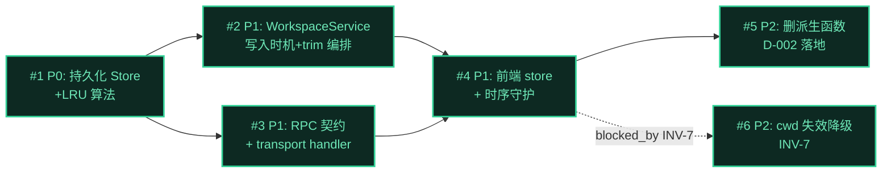

# Issue 决策图 — recent-workspaces（最近工作区独立持久化）

> mid-detail-plan 产出。本功能的架构决策（D-003 三层 / D-004 pull RPC / D-005 write-back 复用 / D-006 number 时间戳）已在 mid-plan 全部 confirmed（见 `decisions.md`）。issue 拆分聚焦**实现路径的可拆分决策点**——主要是 D-005 形态适配的最终选定（归 code-arch，但 issue 层先记录决策框架）+ 模块边界 + 注入/时序守护。无根本性未决架构选择（无 DESIGN-IT-TWICE 触发）。

## 地图总览

> 决策图已收敛——所有 issue 均有明确方案（架构选择在 mid-plan 已拍板，实现选择在 code-arch 最终选定）。无 fog 节点。

## 上游覆盖核验（MANDATORY，逐条不漏）

> 按 `fog-of-war.md` 4 轴（状态/模块/边界/挑战）从 `system-architecture.md` 逐条扫描。

| 上游元素 | 轴 | 对应 issue | 状态 | N/A 理由 |
|---------|----|-----------|------|----------|
| §1 核心计算归位（services LRU + infra 原子写 + renderer pull） | 挑战 | #1, #2, #4 | ✅ 已覆盖 | — |
| §2 分层架构：transport handler 零业务 | 模块 | #3 | ✅ 已覆盖 | — |
| §2 注入链路（index.ts 组合根，与 SessionService 平级） | 边界 | #2 | ✅ 已覆盖 | — |
| §2 seam 纪律（session→workspace 单向，无环） | 边界 | #2 | ✅ 已覆盖 | — |
| §3 模块：RecentWorkspacesStore（持久化策略变） | 模块 | #1 | ✅ 已覆盖 | — |
| §3 模块：WorkspaceService（写入时机+trim 变） | 模块 | #2 | ✅ 已覆盖 | — |
| §3 模块：WorkspaceMessageHandler（RPC 契约变） | 模块 | #3 | ✅ 已覆盖 | — |
| §3 模块：workspaceStore（前端状态变） | 模块 | #4 | ✅ 已覆盖 | — |
| §5 LRU 不变式（≤10 / cwd 唯一 / 倒序淘汰 / cwd 空串拒绝） | 状态 | #1 | ✅ 已覆盖 | — |
| §6 pull RPC reply 经 routeInbound pending map（非 events.ts 订阅通道） | 边界 | #3, #4 | ✅ 已覆盖 | — |
| §6 WriteBackCache 读内存使 pull 总拿最新值 | 挑战 | #1 | ✅ 已覆盖 | — |
| §7 WriteBackCache 形态适配（方案 a 固定 partition vs 方案 b JsonStore） | 挑战 | #1 | ✅ 已覆盖 | 最终选定归 code-arch（见 #1 取舍） |
| §7 debounce 归位 WriteBackCache（service 不额外 debounce） | 挑战 | #2 | ✅ 已覆盖 | — |
| §7 三层代价台阶（4 边界决策均已 mid-plan 确认） | 挑战 | — | N/A | 决策已 confirmed（D-003/D-004/D-005），非 issue 拆分对象 |
| §8 filesystem（in-process infra，复用 atomicWrite） | 边界 | #1 | ✅ 已覆盖 | — |
| §8 pi session 文件扫描（true-external，**本功能解除依赖**） | 边界 | — | N/A | 改造动机本身，非独立实现 issue（解耦是 #4 改数据源的结果） |
| §8 session 服务（in-process，直接方法调用触发） | 边界 | #2 | ✅ 已覆盖 | — |
| §9 INV-1 cwd 空串拒绝 | 状态 | #1 | ✅ 已覆盖 | — |
| §9 INV-2 记录数 ≤10 | 状态 | #1 | ✅ 已覆盖 | — |
| §9 INV-3 cwd 全局唯一 | 状态 | #1 | ✅ 已覆盖 | — |
| §9 INV-4 文件损坏降级空列表 | 状态 | #1 | ✅ 已覆盖 | — |
| §9 INV-5 不硬编码路径（getConfigDir） | 状态 | #1 | ✅ 已覆盖 | — |
| §9 INV-6 workspaceStore 须在默认 cwd 推断前填充 | 状态 | #4 | ✅ 已覆盖 | — |
| §9 INV-7 cwd 失效有降级 | 挑战 | #6 | ✅ 已覆盖 | 具体 UX 归 code-arch + batch-ask |
| §10 K-1 UC-2 selectWorkspace 时机 | 挑战 | — | N/A | K 类知识缺口，归 mid-detail-plan batch-ask（不拆 issue） |
| §10 K-2 INV-7 cwd 失效 UX | 挑战 | #6 | ✅ 已覆盖 | UX 具体形态 batch-ask |

---

## P0 Issues（阻塞项，必须先做）

### #1: 持久化 Store + LRU 淘汰算法

**P 级**: P0
**类型**: 模块 / 模型
**Blocked by**: 无
**推荐强度**: Strong

#### 问题描述

新增 `RecentWorkspacesStore`——独立持久化「最近工作区」记录的存储抽象。这是整个功能的**数据基座**：前端展示、默认 cwd 推断、写入时机触发的落点都依赖它。不做它，后续 #2/#3/#4 全部无落点。

关联 system-architecture.md §3（模块拆分）/ §5（LRU 不变式）/ §7（WriteBackCache 形态适配）。需满足 4 条 LRU 不变式（INV-1~4）+ 路径安全（INV-5）+ 损坏降级（INV-4）。

#### 为什么是 P0

不做它，#2（WorkspaceService 需要一个 store 落 record）、#3（handler 需 service.list 读数据）、#4（前端需 RPC 拉数据）都无法推进。它是依赖图的根节点。

#### 方案对比

> D-005 已确认「复用 write-back 意图 + atomicWrite」，但**具体抽象形态**（方案 a vs b）未定——这正是本 issue 的核心实现决策，最终选定归 code-arch 骨架验证（见下方取舍）。

##### 方案 A: WriteBackCache 固定 partition（K='global', IK=cwd, IV=record）

**改动**:
- 模块: `services/workspace/recent-workspaces-store.ts`，构造 `WriteBackCache<'global', string, RecentWorkspaceRecord>`，固定 partition key `'global'`
- 模型: IV = `{ cwd: string, lastUsedAt: number, label: string }`，IK = cwd（去重键）
- 流程: `record(cwd)` → `cache.set('global', cwd, {cwd, lastUsedAt: Date.now(), label: basename(cwd)})` → upsert（同 cwd 覆盖时间戳）→ trim 到 10（淘汰 lastUsedAt 最小者）→ WriteBackCache scheduleFlush
- 持久化: `loadPartition('global')` 读 `recent-workspaces.json`（JSON 数组 → Map by cwd），`persistPartition('global')` 写 Map values 为 JSON 数组 + atomicWrite

**优点**:
- 与 `session-data-store.ts` / `PluginStorage` 同一抽象（一致性 > 品味），团队已熟悉
- WriteBackCache 自带 dirty + 定时 flush（DEFAULT_FLUSH_MS=500），天然解决写入时机 B 高频写（debounce 归位实现层，#2 的 service 无需额外 debounce）
- sizeOf / 容量检查回调（onSet）现成，未来若加容量上限一行配置

**缺点**:
- WriteBackCache 是 **per-partition KV** 设计（原语义 = 每 partition 一文件，如 session-data 每 session 一 json）。本功能是**全局单数组**（一个文件），固定 partition key 是「把 KV 当数组用」的形态适配，语义略别扭
- `partitionKeys()` / 多 partition 相关 API 对本功能无用（只有一个 partition），但 class 仍带这些方法

**适用场景**: 想最大化与现有 store 抽象一致性，接受固定 partition key 的形态适配

##### 方案 B: JsonStore<RecentWorkspaceRecord[]> + service 层 debounce

**改动**:
- 模块: `services/workspace/recent-workspaces-store.ts`，构造 `JsonStore<RecentWorkspaceRecord[]>`（单文件单值，read-through TTL 缓存）
- 模型: 值 = `RecentWorkspaceRecord[]`（全局数组）
- 流程: `record(cwd)` → 读数组 → upsert（按 cwd 去重，刷新 lastUsedAt）→ sort 倒序 → slice(0,10) → 标记 dirty + scheduleDebounce flush（store 内自管 debounce timer，非 WriteBackCache）
- 持久化: JsonStore.write（内部 atomicWrite + 刷 TTL 缓存），首读走 `deserialize`（JSON.parse + 容错空数组）

**优点**:
- **形态更匹配**：JsonStore 是「单文件单值 read-through」，本功能「一个 json 文件存一个数组」正是单值语义，无形态适配别扭
- 红队 nit-1 倾向此方案（访问模式整体读写非按行查，JsonStore 更匹配）
- 更轻：不引入 partition 概念，代码更直白

**缺点**:
- **debounce 需 store/service 自管**（JsonStore 无内置 write-back），要么 store 内加 debounce timer（与 WriteBackCache 重复造轮子），要么 service 层 debounce（违反 §7「debounce 归位持久化层」决策，引入双层 debounce 风险）
- 若 store 内自管 debounce，等于手写一个 mini-WriteBackCache，与「复用现有抽象」（D-005 原意）相悖

**适用场景**: 想形态最匹配，接受自管 debounce 的额外代码

#### 取舍决策

**选择**: **归 code-arch 骨架验证最终选定**（issue 层记录决策框架，不预判）
**理由**: D-005 确认「复用 write-back 意图」是方向，但 a/b 两方案的取舍依赖**骨架验证**才能定——方案 A 的「固定 partition 形态适配别扭」vs 方案 B 的「自管 debounce 额外代码」是真实的工程权衡，需可编译骨架对照。code-arch（mid-detail-plan Step 2 Drafter-B）按 `skeleton-spike.md` 产骨架验证后定。两方案都满足 D-005（write-back + atomicWrite），不冲突。

**放弃方案的理由**:
- 不预判 A 或 B——本 issue 的产出是「store 模块 + 4 LRU 不变式 + 路径安全 + 损坏降级」，**抽象形态归 code-arch 骨架验证**。预判会让 issue 层侵入 code-arch 职责

**待 code-arch 验证的决策点**（写入骨架 spec）:
- [ ] 固定 partition key 用字面量 `'global'` 还是抽常量
- [ ] trim 时机：set 后立即 trim（内存）还是 flush 前 trim（写盘前）
- [ ] label 存储策略：存（避免每次 basename 计算）vs 算（cwd basename，零冗余）

#### 验收标准

> AC trace 回 requirements UC + 补 issue 特有维度（LRU 不变式）。

- [ ] AC-1.1 [正常]（trace: UC-1 AC-1.1/1.2, UC-4 AC-4.1/4.2）: `record(cwd)` 后 `list()` 返回 ≤10 条，按 lastUsedAt 倒序
- [ ] AC-1.2 [边界]（trace: UC-4）: 已有 10 条时 record 第 11 个新 cwd → 最旧者被淘汰，新 cwd 入列（INV-2）
- [ ] AC-1.3 [正常]（trace: UC-3 AC-3.1）: 同 cwd 多次 record → 时间戳刷新，列表中不重复（INV-3）
- [ ] AC-1.4 [异常]（trace: UC-2 AC-2.2, INV-1）: cwd 为空串/undefined → 拒绝写入（不抛错，静默跳过或 store 内统一守卫）
- [ ] AC-1.5 [异常]（trace: INV-4）: 持久化文件为非法 JSON → loadPartition/deserialize 返回空数组不崩（降级）
- [ ] AC-1.6 [异常]（trace: INV-4）: 持久化文件不存在（首次启动）→ 返回空数组不抛错
- [ ] AC-1.7 [约束]（trace: INV-5）: 文件路径用 `join(getConfigDir(), 'recent-workspaces.json')`，无硬编码 `~/.xyz-agent`（pre-commit check_path_whitelist.py 守护）

---

## P1 Issues（核心）

### #2: WorkspaceService（写入时机编排 + trim）

**P 级**: P1
**类型**: 模块 / 流程
**Blocked by**: #1（依赖 store 的 record/upsert 能力）
**推荐强度**: Strong

#### 问题描述

新增 `WorkspaceService`——业务编排层，暴露 `record(cwd)` 给 session 侧触发，内部调 `RecentWorkspacesStore` 落盘 + trim。它是 session→workspace 的**唯一入口**（system-architecture §2 seam 纪律：session 只调 `workspaceService.record`，不直接持有 store 引用）。

需在 `index.ts` 组合根实例化，经 `SessionService` 构造注入到 `SessionLifecycle`（写入时机 A）和 `MessageDispatcher`（写入时机 B）。与 `SessionService` **平级非嵌套**（§2 注入链路）。

关联 §3（模块拆分）/ §7（debounce 归位 WriteBackCache，service 不额外 debounce）/ §2（注入链路 + seam 单向依赖）。

#### 为什么是 P1

它是核心目标 S4（新建/重活都记录）的实现载体——两个写入时机都经它。依赖 #1（store）存在，但本身是编排逻辑，不阻塞 #3（handler 可独立设计 RPC 契约）。

#### 方案对比

##### 方案 A: WorkspaceService 持有 store，record 内调 store.record + 统一 INV-1 守卫

**改动**:
- 模块: `services/workspace/workspace-service.ts`，构造注入 `RecentWorkspacesStore`
- 流程: `record(cwd)` → INV-1 守卫（cwd 空串/undefined 跳过）→ `store.record(cwd)`（store 内做 upsert+trim+debounce flush）
- 注入: index.ts new WorkspaceService(store) → 经 SessionService 构造注入 lifecycle/dispatcher

**优点**:
- INV-1 守卫在 service 层统一（grep `record(` 调用点只需确认都过 service.record，INV-1 验证简化）
- service 与 store 职责分离：service = 写入时机触发 + 守卫，store = 持久化策略 + trim（§3 模块拆分一致）

**缺点**:
- INV-1 守卫在 service 层，但 store 也可能被其他路径调用（如未来手动管理 UI）——需 store 内也有守卫才彻底（双层守卫冗余）

##### 方案 B: INV-1 守卫下沉到 store，service 仅透传

**改动**: 同 A 但 INV-1 守卫在 store.record 内（store 自管脏数据防御）

**优点**: store 是唯一写入入口，守卫彻底（任何路径调 store.record 都过守卫）

**缺点**: service 与 store 职责边界模糊——守卫算「业务规则」还是「持久化策略」？放 store 让 store 承载业务判断

#### 取舍决策

**选择**: **方案 A（service 层守卫）为主，store 内补防御性守卫**（双层， INV-1 验证在 service 层 grep）
**理由**: INV-1「cwd 空串拒绝」本质是业务规则（什么算合法使用记录），归 service（业务编排层）。store 内的防御性守卫是「持久化层的最后防线」（防止未来其他调用路径绕过 service），不承担 INV-1 的 grep 验证职责。这保持 service/store 职责清晰（§3 模块拆分：service=业务编排，store=持久化策略）。

#### 验收标准

- [ ] AC-2.1 [正常]（trace: UC-2 AC-2.1）: SessionLifecycle.create 成功后调 `workspaceService.record(cwd)` → 记录写入
- [ ] AC-2.2 [正常]（trace: UC-3 AC-3.1）: MessageDispatcher.sendPrompt 时调 `workspaceService.record(cwd)` → 时间戳刷新
- [ ] AC-2.3 [异常]（trace: INV-1）: `record('')` / `record(undefined)` → 静默跳过，不调 store
- [ ] AC-2.4 [约束]（trace: §7 debounce 归位）: service 无额外 debounce timer（debounce 由 store 的 WriteBackCache 承担）——grep 确认 service 无 setTimeout/setInterval
- [ ] AC-2.5 [约束]（trace: §2 seam 单向）: WorkspaceService 不 import SessionService（无回调依赖，无环）

---

### #3: RPC 契约 + transport handler

**P 级**: P1
**类型**: 模块 / 流程
**Blocked by**: #1（handler 调 service.list 读 store 数据）—— 实际可并行设计契约，但运行依赖 store 存在
**推荐强度**: Strong

#### 问题描述

新增前端→runtime 的 RPC 契约 `workspace.listRecent`（pull-only，D-004）+ 对应 transport handler（`WorkspaceMessageHandler`，纯路由 → `ctx.reply`，零业务，§2/§3 铁律）。

需在 `shared/src/protocol.ts` 注册新消息类型（ClientMessageType + ClientMessageMap + ServerMessageMapBase 各加条目），前端 `api/domains/workspace.ts` 用 pending pattern（模板 = `api/domains/session.ts:list()`）。

关联 §4（Port 清单：workspace.listRecent 必需）/ §6（pull RPC reply 经 routeInbound pending map，msg.id 匹配，不经 events.ts 订阅通道）。

#### 为什么是 P1

它是前端获取数据的唯一通道（D-004 pull-only，无 broadcast）。依赖 #1（store）提供数据，但 RPC 契约设计本身可独立。

#### 方案对比

##### 方案 A: 独立 WorkspaceMessageHandler（按域隔离，与现有所有 handler 一致）

**改动**:
- 模块: `transport/workspace-message-handler.ts`，`handles = ['workspace.listRecent']`，handleWorkspaceMessage 内 `ctx.reply(ws, msg.id, 'workspace.recentList', { records })`
- 注册: server.ts routes map 加 `...workspaceHandler.handles.map(...)`，setServices 注入 WorkspaceService
- 协议: protocol.ts 加 `'workspace.listRecent'`（ClientMessageType + ClientMessageMap payload 空）+ `'workspace.recentList'`（ServerMessageType + ServerMessageMapBase payload = `{ records: RecentWorkspaceRecord[] }`）

**优点**:
- 与现有 7 个 handler（session/tree/extension/plugin/git/file/settings）按域隔离一致（一致性 > 品味）
- transport 零业务（只路由 + reply），符合 §2/§3 铁律

**缺点**: +1 handler 文件（轻微，但与现有惯例一致不算技术债）

##### 方案 B: 复用 SessionMessageHandler（workspace.* 路由进 session handler）

**改动**: SessionMessageHandler.handles 加 `'workspace.listRecent'`，switch 加 case 调 workspaceService

**优点**: 不新增 handler 文件

**缺点**:
- 违反按域隔离惯例（workspace 与 session 是不同业务域，混在一起污染 session handler 职责）
- §7 三层代价台阶已确认「新增 WorkspaceMessageHandler 值」（mid-plan D-003 决策的一部分）

#### 取舍决策

**选择**: **方案 A（独立 handler）**
**理由**: workspace 与 session 是不同业务域（workspace = 全局使用记录，session = 会话生命周期），按域隔离与现有 7 handler 一致（§7 已确认「新增 handler 值」）。复用 session handler 违反单一职责 + 按域隔离惯例。

#### 验收标准

- [ ] AC-3.1 [正常]（trace: UC-1）: 前端发 `workspace.listRecent` → handler reply `workspace.recentList` + records 数组（≤10，倒序）
- [ ] AC-3.2 [约束]（trace: §2/§3 transport 零业务）: handler 内无业务逻辑（只 ctx.reply），业务在 service/store
- [ ] AC-3.3 [约束]（trace: §6 pending map）: reply 带 msg.id（correlation id），前端 routeInbound 阶段① pending.resolve 兑现（不经 events.ts 订阅通道）
- [ ] AC-3.4 [异常]（trace: INV-4）: store 返回空数组（无记录/文件损坏）→ handler reply 空数组（不报错）

---

### #4: 前端 workspaceStore + INV-6 时序守护

**P 级**: P1
**类型**: 模块 / 流程
**Blocked by**: #1, #3（需 RPC 通道 + store 数据）
**推荐强度**: Strong

#### 问题描述

新增前端 `stores/workspace.ts`（持有 recent-workspaces 状态，模板 = `stores/session.ts`）+ 改 `DirSelectPopover.vue`（数据源 session 派生 → workspaceStore）+ 改 `useNewTaskFlow.ts`（resolveDefaultCwd 数据源）。

**核心难点是 INV-6 时序守护**（架构审查 MISSING-1）：`useNewTaskFlow.startFlow` 在 `initApp` 中**先于** `loadSessions()` 同步调用进 landing，之后异步 `presetCwd(cwd)` 预填默认 cwd。改接 workspaceStore 后，workspaceStore 必须在 `presetCwd` 调用前已 fill，否则首屏默认 cwd 拿空。

关联 §9 INV-6 / requirements UC-6（默认 cwd）/ §6 pull RPC。

#### 为什么是 P1

前端展示 + 默认 cwd 推断是用户可感知的核心（UC-1/UC-6）。依赖 #3（RPC）+ #1（数据）。

#### 方案对比

##### 方案 A: workspaceStore 暴露 `load()` async，initApp 在 loadSessions 后/presetCwd 前调 workspaceStore.load()

**改动**:
- 模块: `stores/workspace.ts`，state = `records: Ref<RecentWorkspaceRecord[]>`，`load()` 调 workspaceApi.listRecent() fill records
- 流程: initApp 时序改为 `startFlow()` → `await loadSessions()` → `await workspaceStore.load()` → `presetCwd(defaultCwd)`（defaultCwd 从 workspaceStore.records[0]?.cwd 推断）
- DirSelectPopover: `workspaces` computed 从 `recentWorkspaces(session.list)` 改为 `workspaceStore.records`
- useNewTaskFlow: resolveDefaultCwd 从 session 派生改为 `workspaceStore.records[0]?.cwd`

**优点**:
- INV-6 显式守护：workspaceStore.load() 在 presetCwd 前 await，时序确定
- workspaceStore 成为前端唯一数据源（SSOT，呼应 D-002 删派生函数）

**缺点**: initApp 时序增加一个 await（轻微延迟，但 loadRecent 是内存读 + WS round-trip，ms 级）

##### 方案 B: DirSelectPopover/useNewTaskFlow 各自 lazy pull（打开 popover/进 startFlow 时才 load）

**改动**: 不建 workspaceStore，DirSelectPopover onMounted 调 workspaceApi.listRecent，useNewTaskFlow.startFlow 内调 listRecent 推断默认 cwd

**优点**: 无全局 store，按需加载

**缺点**:
- **INV-6 时序竞争**：startFlow 是同步进 landing，若 startFlow 内 async load，presetCwd 时序无法保证（与现有 initApp「先 startFlow 再异步 loadSessions」模式冲突）
- 双消费点各自 pull（DirSelectPopover + useNewTaskFlow），无共享状态，重复请求
- 违反「renderer 主动拉取后应有状态持有」（§6 pull model 的配套）

#### 取舍决策

**选择**: **方案 A（workspaceStore + initApp 显式 load 时序）**
**理由**: INV-6 是架构审查明确指出的二阶风险（首屏默认 cwd 拿空）。方案 A 用 workspaceStore 做 SSOT + initApp 显式 await 时序，是最确定的守护。方案 B 的 lazy pull 与 initApp 现有同步 startFlow 模式冲突，时序不可控。

**待 code-arch 验证的决策点**（写入骨架 spec）:
- [ ] workspaceStore.load() 失败时（RPC reject）的降级（空数组 + 不阻断 presetCwd，用 undefined 兜底，UC-6.2 不变）
- [ ] workspaceStore 是否需 reactivity 触发 DirSelectPopover 重渲染（computed 直接绑 store.records 即可，Vue 响应式天然）

#### 验收标准

- [ ] AC-4.1 [正常]（trace: UC-1）: DirSelectPopover 展示 workspaceStore.records（≤10，倒序，目录名+路径两行）
- [ ] AC-4.2 [正常]（trace: UC-6 AC-6.1）: useNewTaskFlow 默认 cwd = workspaceStore.records[0]?.cwd（时间戳最新者）
- [ ] AC-4.3 [约束]（trace: INV-6）: initApp 中 `await workspaceStore.load()` 在 `presetCwd` 之前（grep 确认时序）
- [ ] AC-4.4 [边界]（trace: UC-6 AC-6.2）: workspaceStore.records 为空 → 默认 cwd = undefined（上层 fallback 不变）
- [ ] AC-4.5 [异常]（trace: §6 pull）: workspaceStore.load() RPC reject → records 置空数组，不抛错（降级，UI 显示空态）

---

## P2 Issues（重要）

### #5: 删除派生函数（D-002 落地）

**P 级**: P2
**类型**: 流程（清理）
**Blocked by**: #4（workspaceStore 接管数据源后才能删）
**推荐强度**: Strong

#### 问题描述

D-002 已确认删除 `renderer/lib/utils.ts` 的 `recentWorkspaces()` 和 `resolveDefaultCwd()`。本 issue 是该决策的**落地执行**——在 #4 把调用方（DirSelectPopover + useNewTaskFlow）改接 workspaceStore 后，删除两函数 + 清理 import。

关联 D-002（SSOT，避免双数据源漂移）/ system-architecture §2.1（搭便车改造）。

#### 为什么是 P2

不阻塞核心功能（#4 改接后两函数已成 dead code，保留只是冗余）。但保留违反 D-002（双数据源漂移风险），应在 #4 后立即清理。放 P2 因它是清理动作，依赖 #4 完成。

#### 方案（单一，P2 不强制多方案）

**改动**:
- 删 `utils.ts` 的 `recentWorkspaces()` + `resolveDefaultCwd()` + `MAX_RECENT_WORKSPACES` 常量 + `RecentWorkspace` type（若仅此处用）
- 清 import: DirSelectPopover.vue + useNewTaskFlow.ts 移除对两函数的 import
- grep 确认无其他引用（`recentWorkspaces` / `resolveDefaultCwd` 全仓零命中）

**理由**: D-002 已拍板，本 issue 是机械执行。

#### 验收标准

- [ ] AC-5.1 [约束]（trace: D-002）: `rg "recentWorkspaces|resolveDefaultCwd|MAX_RECENT_WORKSPACES" src-electron/renderer` 零命中（除可能的注释/历史）
- [ ] AC-5.2 [正常]（trace: 非回归）: 删除后 vue-tsc / eslint 通过（无悬空 import / 类型错误）

---

### #6: cwd 失效降级（INV-7）

**P 级**: P2
**类型**: 流程 / 模型
**Blocked by**: #4（前端展示就绪后才有「选择失效 cwd」场景）
**推荐强度**: Worth exploring

#### 问题描述

INV-7 是改造引入的二阶风险（架构审查 MISSING-2 + 需求审查 should_fix-2）：独立持久化使记录生命周期独立于 session，历史 cwd 可能在两次使用间被外部删除（worktree 清理、目录手动删等）。用户在 DirSelectPopover 选了一个已不存在的 cwd 时，需降级处理。

`session-lifecycle.restoreSession` 已有 `existsSync(target.cwd)` + homedir fallback 的成熟模式（§9 INV-7 引用），可复用。

关联 §9 INV-7 / requirements UC（选择目录后置）。

#### 为什么是 P2

不影响记录持久化核心（S1-S4），是边缘场景（cwd 失效）。但「选了目录却无法用」是用户可感知的体验问题，应处理。依赖 #4（前端展示就绪）。

#### 方案对比

##### 方案 A: listRecent 不过滤失效（保留历史可见），选择时 existsSync 检查 + 复用 restoreSession homedir fallback

**改动**:
- 模块: WorkspaceService.list 或前端选择处理（归 code-arch 定层级）
- 流程: listRecent 返回全部记录（含失效 cwd，INV-7「保留历史可见」）；用户选中某条 → existsSync 检查 → 失效则 fallback homedir（复用 session-lifecycle 模式）或提示
- UX: 失效 cwd 在列表**不置灰**（保持历史可见），选中时才提示/fallback

**优点**: 历史完整可见（符合「最近使用」语义），降级在选中时

**缺点**: 用户可能选中才发现失效（体验略差）

##### 方案 B: listRecent 过滤失效（existsSync 检查），只展示现存目录

**改动**: store/service list 时 filter existsSync

**优点**: 列表干净（只展示可用）

**缺点**:
- **违反 INV-7「listRecent 不过滤失效目录（保留历史可见）」**（§9 明示）
- 每次 listRecent 做 10 次 existsSync（IO，虽轻但非零）
- 失效目录从列表消失，用户不知道历史记录过它

##### 方案 C: 失效 cwd 列表置灰 + tooltip 提示

**改动**: listRecent 不过滤（A），但前端标记失效项置灰 + tooltip「目录已不存在」

**优点**: 历史可见 + 视觉区分

**缺点**: 前端需额外 existsSync 检查（listRecent 返回时或前端自检）——IPC 成本或前端 fs 不可用（renderer 无直接 fs）

#### 取舍决策

**选择**: **方案 A（不过滤 + 选中时 existsSync 检查 + homedir fallback），UX 具体形态归 code-arch + batch-ask**
**理由**: INV-7 §9 明示「listRecent 不过滤失效（保留历史可见）」——排除 B。方案 C 的前端置灰需 renderer 做 existsSync（renderer 无直接 fs，需额外 IPC，过度设计）。方案 A 最简，降级在选中时（复用 restoreSession 成熟模式）。具体 UX（选中失效时：静默 homedir fallback / toast 提示 / 阻止选择）归 code-arch + mid-detail-plan batch-ask（K-2）。

**待 batch-ask 的 K-2**（INV-7 UX 具体形态）: 选中失效 cwd 时，用户该看到什么？
- 选项 i: 静默 fallback homedir（最简，但用户困惑「为什么目录变了」）
- 选项 ii: toast 提示「目录已不存在，已切换到主目录」（平衡）
- 选项 iii: 阻止选择 + 列表项标红（最严格，但打断流程）

#### 验收标准

- [ ] AC-6.1 [约束]（trace: INV-7）: listRecent 不过滤失效 cwd（记录含已删目录时仍返回）
- [ ] AC-6.2 [异常]（trace: INV-7, D-008）: 选中失效 cwd → existsSync 检查为 false → toast 提示「目录 <cwd> 已不存在，已切换到主目录」+ fallback homedir（复用 session-lifecycle.restoreSession 模式）
- [ ] AC-6.3 [约束]（trace: §9 INV-7 复用）: 降级逻辑复用 `session-lifecycle.restoreSession` 的 existsSync + homedir fallback 模式（不另起）

---

## 迷雾（未展开）

无。本功能架构决策已在 mid-plan 全部 confirmed（D-003~D-006），实现决策（D-005 形态、INV-7 UX）在 #1 取舍 + #6 batch-ask 标明，无未决的根本性选择。决策图已收敛。

---

## 后续迭代（P3 延后项）

- **#7 [P3]: 目录已不存在则清理记录** — 延后理由：当前 INV-7 决策是「保留历史可见」（不主动清理）。未来若记录膨胀或用户反馈历史太多失效目录，可加后台清理（listRecent 时标记失效 + 定期 prune）。YAGNI，本轮不做。
- **#8 [P3]: 记录数上限可配置** — 延后理由：当前固定 10（MAX_RECENT_WORKSPACES）。未来若用户需更多/更少，可加 settings。YAGNI。

---

## 决策记录

> 本 issue 阶段的实现层决策（mid-plan 已确认的 D-003~D-006 见 decisions.md，此处不重复）。本阶段新增的 agent-opinionated 实现决策待 batch-ask 后 append decisions.md。

- **#1 D-005 形态适配**：归 code-arch 骨架验证（方案 a 固定 partition vs 方案 b JsonStore+service debounce），issue 层不预判
- **#2 INV-1 守卫归位**：service 层统一守卫 + store 防御性守卫（双层，grep 验证在 service）
- **#3 独立 handler**：按域隔离（与现有 7 handler 一致，§7 已确认）
- **#4 workspaceStore + initApp 显式 load 时序**：INV-6 最确定守护
- **#6 INV-7 方案 A**：不过滤 + 选中时降级，UX 具体形态 batch-ask K-2

**已确认决策**（mid-detail-plan batch-ask，见 decisions.md D-007/D-008）:
- **D-007**（K-1 → #2）：写入时机 A 只挂 SessionLifecycle.create，不扩展到 selectDirectory。「选目录未提交消息」不记录。→ #2 不变（无 selectDirectory 扩展）
- **D-008**（K-2 → #6）：INV-7 cwd 失效 UX = toast 提示 + homedir fallback（选中失效 cwd → toast「目录 X 已不存在，已切换到主目录」+ fallback homedir）。→ #6 AC-6.2 已具体化
