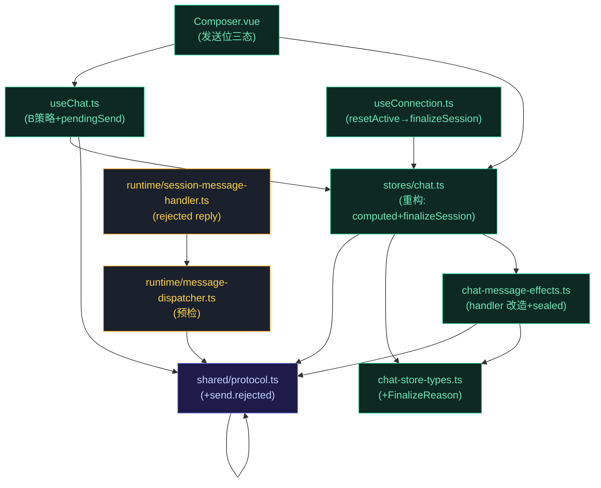
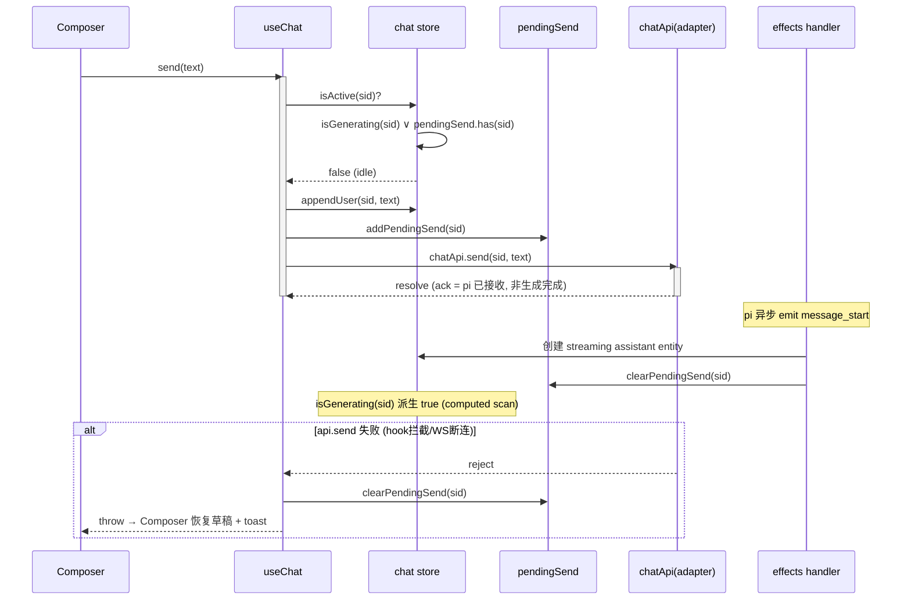
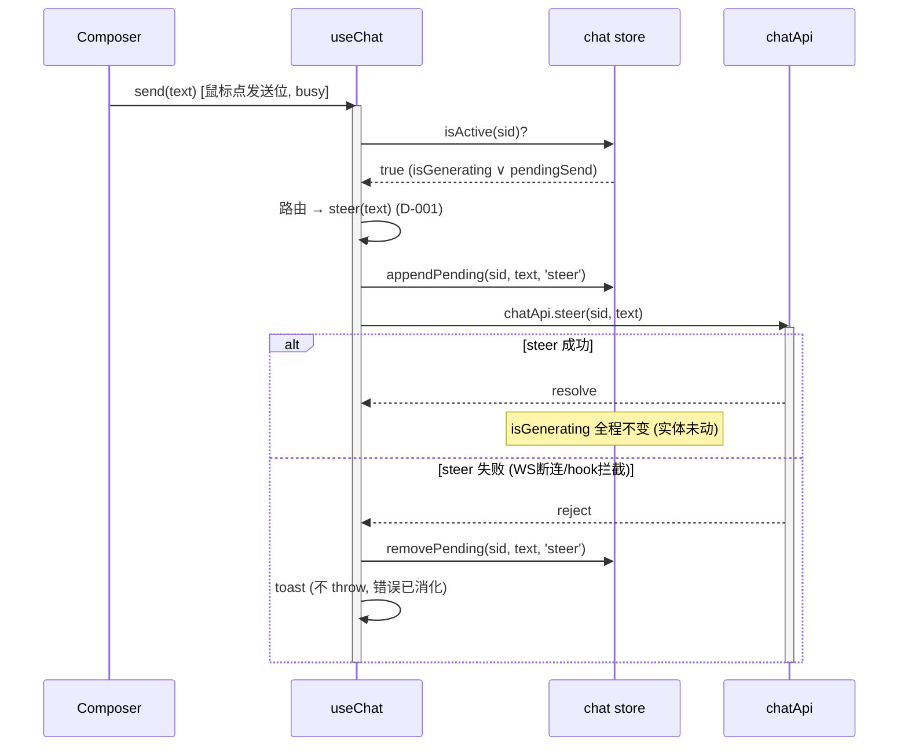
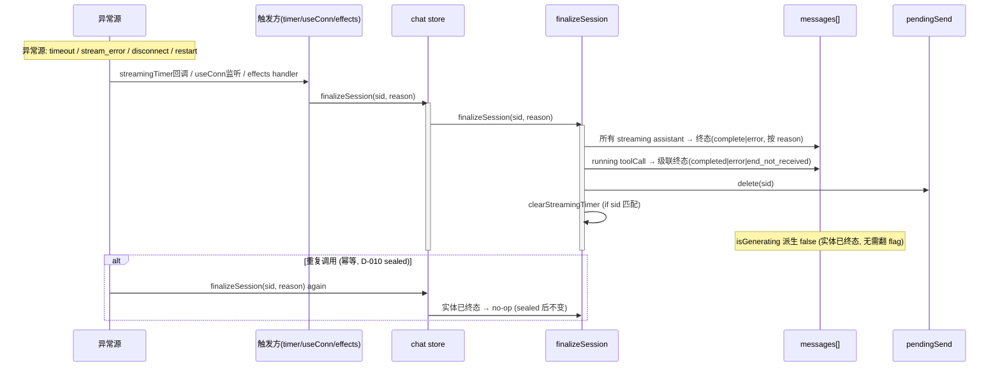
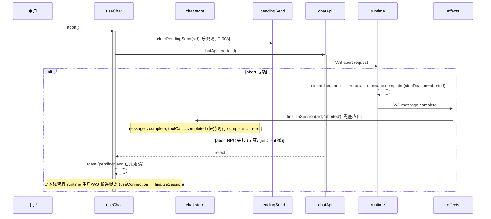

# 代码架构设计 — 对话流状态撕裂修复

> 接 system-architecture.md（模型/状态机/边界）+ issues.md（#1~#8 决策图，D-001~D-010 已定稿）。
> 本文档把模型/决策落成代码契约：工程目录 → 签名表 → 依赖图 → 时序图 → sealed guard → 测试矩阵 → 骨架。
> 设计模式 = refactor（行为等价基线见 system-arch §12 BC-1~BC-5；BC-3 超时行为变更为本 topic 目标）。

## §1 工程目录（改动文件清单）

不新增目录/不新增模块。改动全部落在现有 renderer 三层（store/composable/component）+ runtime 单文件 + shared 协议。

| # | 文件 | 处置 | 变化轴 | 改动摘要 | 关联 issue |
|---|------|------|--------|---------|-----------|
| 1 | `packages/shared/src/protocol.ts` | 修改 | WS 类型契约 | `ServerMessageType` union 追加 `'send.rejected'`；`ServerMessageMapBase` 追加 `SendRejectedPayload` | #1 |
| 2 | `packages/renderer/src/stores/chat-store-types.ts` | 修改 | 共享类型 | 新增 `FinalizeReason` 联合类型（供 chat.ts + effects 共享） | #2 #3 |
| 3 | `packages/renderer/src/stores/chat.ts` | 修改（核心重构） | message 生命周期 | 删 `isStreaming`/`streamingSessionId`/`dispatchingSessionId`/`dispatchingTimer`/`streamingTimer`(旧)/`setStreaming`/`setDispatching`/`resetActive`/`clearDispatchingTimer`/`clearStreamingTimer`；加 `pendingSend` ref + `isGenerating(sid)` 派生 + `addPendingSend`/`clearPendingSend` + `finalizeSession(sid, reason)` 单一收口；`isActive` 重定义为 `isGenerating(sid) ∨ pendingSend.has(sid)`；`STREAMING_TIMEOUT_MS` 改读 env（默认 24h），callback 改调 `finalizeSession('timeout')` | #2 #8 |
| 4 | `packages/renderer/src/stores/chat-message-effects.ts` | 修改 | 事件→实体状态转换 | `MessageEffectContext` 注入项 `setStreaming` → `finalizeSession` + `clearPendingSend`；`message.message_start` 加 `clearPendingSend(sid)`；`message.complete/error/stream_error` handler 改调 `finalizeSession`；delta 类 handler（text/thinking/tool_call）入口加 sealed guard（D-010） | #3 |
| 5 | `packages/renderer/src/composables/features/useChat.ts` | 修改 | 编排（send/steer/abort） | `send` 入口 `isActive(sid)`→自动转 `steer`（D-001 B 策略）；`send`/`editAndResend` 用 `addPendingSend`/`clearPendingSend` 替代 `setDispatching`；`abort` 乐观 `clearPendingSend`（D-008，实体靠 runtime 广播兜底）；`ensureStreamSubscription` 新增 `send.rejected` 监听分支（回滚 pending + toast） | #5 |
| 6 | `packages/renderer/src/composables/useConnection.ts` | 修改 | runtime 崩溃/重启 | `onRuntimeRestarting`/`onRuntimeFailed` 两处 `resetActive()` → `finalizeAllStreaming('restart'/'disconnect')`（遍历所有 streaming session，D-012）；**WS state watch（瞬态断连）仅 rejectAll pending，不调 finalizeSession**（D-017，防瞬态断连误收口） | #6 |
| 7 | `packages/renderer/src/components/panel/Composer.vue` | 修改 | UI（发送位三态） | 停止按钮 `isActive` 时始终可见（保留）；发送位从 `v-else` 提升为与 stop 并列——busy 时点击转 `onSteer`，图标/标题切 steer 语义（D-006/F4）；`canSend` 去掉 `!isActive` 约束（busy 允许发送位可点） | #7 |
| 8 | `packages/runtime/src/services/session/message-dispatcher.ts` | 修改（runtime） | RPC 错误分类 | `sendPrompt` 入口加 `activeSession.isGenerating` 预检（D-009），忙则广播 `send.rejected` + `return (blocked=true, rejected=true)`（不调 `pi.prompt`）；返回类型扩展为 `{ blocked: boolean; rejected?: boolean }` | #4 |
| 9 | `packages/runtime/src/transport/session-message-handler.ts` | 修改（runtime） | reply 路由 | `sendMessage` 返回消费处加 `rejected` 分支：reply `message.status (status=rejected)`（pending 干净 resolve，拒绝经广播传达），区别于 `blocked`→`sendError` | #4 |
| — | （无新增文件 / 无删除文件） | — | — | 所有改动在现有文件内完成 | — |

> **删除项明细**（grep 验收锚点，见 issues AC-1/AC-2/AC-6.2）：`isStreaming` ref / `streamingSessionId` / `dispatchingSessionId` / `setStreaming` / `setDispatching` / `resetActive` / `clearDispatchingTimer` / `clearStreamingTimer` 共 8 个符号从 `chat.ts` 移除；`resetActive` 在 `useConnection.ts` 的 2 处调用迁移。

## §2 API 契约（签名表）

> 接线层级标注（deep-module seam 词汇）：
> - **模块内直调**（in-process，无 seam）— 同模块函数互相调用，caller/test 直接穿透
> - **跨模块 port**（store/composable 边界）— caller 依赖 store 暴露的方法签名（Pinia store interface 即 seam，单 adapter）
> - **adapter 真引 SDK**（WS/RPC 边界）— `chatApi.*` / `client.prompt` 真引用 transport 层，骨架里真接 SDK 验签

### 模块 A: `shared/protocol.ts`（契约层）

| 符号 | 签名 | 接线层级 | 边界条件 | Issue |
|------|------|---------|---------|-------|
| `ServerMessageType`（扩展） | `union 追加 \| 'send.rejected'` | 跨模块 port（全栈消费） | 枚举值唯一，不与现有 `message.*` 重叠 | #1 AC-1.1 |
| `SendRejectedPayload` | `{ sessionId: string; reason: 'busy'; message: string }` | 跨模块 port | `reason` 当前仅 `'busy'`（终态操作反馈，不再扩展）；`sessionId` 必填（路由用） | #1 AC-1.1 |
| `ServerMessageMapBase['send.rejected']` | `= SendRejectedPayload` | 跨模块 port | 收紧为精确类型（非 `Record<string,unknown>` 占位），runtime 构造点得契约校验 | #1 AC-1.2 |

### 模块 B: `stores/chat-store-types.ts`

| 符号 | 签名 | 接线层级 | 边界条件 | Issue |
|------|------|---------|---------|-------|
| `FinalizeReason` | `type = 'normal' \| 'aborted' \| 'stream_error' \| 'error' \| 'timeout' \| 'disconnect' \| 'restart'` | 跨模块 port（chat.ts + effects 共享） | 7 值对应 system-arch §5 reason 字段；与 `Message.status`/`ToolCall.status` 终态映射见下表 | #2 #3 |

**reason → 终态映射（finalizeSession 内部不变式）：**

| FinalizeReason | Message.status | ToolCall.status | 触发源 |
|---|---|---|---|
| `normal` | `complete` | `end_not_received`（诚实态，迟到 tool_call_end 覆盖到 completed） | `message.complete` (agent_end) |
| `aborted` | `complete` | `end_not_received`（同上，迟到 tool_call_end 覆盖） | `message.complete` (stopReason=aborted)（abort 兑底，D-008） |
| `stream_error` | `error` | `error` | `message.stream_error` |
| `error` | `error` | `error` | `message.error` |
| `timeout` | `error` | `end_not_received` | streamingTimer callback（24h 兜底） |
| `disconnect` | `error` | `end_not_received` | useConnection onRuntimeFailed / WS 断连 |
| `restart` | `error` | `end_not_received` | useConnection onRuntimeRestarting |

### 模块 C: `stores/chat.ts`（store，真值源）

| 方法/字段 | 签名 | 接线层级 | 边界条件 / 不变式 | Issue |
|-----------|------|---------|------------------|-------|
| `pendingSend` | `Ref<Set<string>>`（新增） | 跨模块 port（useChat 读写、effects 读） | `add` 在 send 前；`delete` 在 message_start（正常）/ finalizeSession（异常）；与 isGenerating 正交 | #2 AC-2.3 |
| `isGenerating(sessionId)` | `(sid: string) => boolean`（派生函数，无 setter） | 模块内直调（isActive 调）+ 跨模块 port（测试/Panel 可读） | `≡ messages.value.get(sid)?.some(m => m.status === 'streaming')`；scan 限定 per-session（防跨 session 响应式失效扩散）；**零手动维护**（D-005 computed scan） | #2 AC-2.2 |
| `isActive(sessionId)` | `(sid: string) => boolean`（重定义） | 跨模块 port（Composer/useChat 消费） | `≡ isGenerating(sid) ∨ pendingSend.value.has(sid)`；替代旧 `isStreaming && streamingSessionId===sid \|\| dispatchingSessionId===sid` | #2 AC-2.3 |
| `finalizeSession(sessionId, reason, errorText?)` | `(sid: string, reason: FinalizeReason, errorText?: string) => void`（新增，唯一收口） | 跨模块 port（effects/useConnection/timer 调） | (1) 所有 streaming assistant → 终态（按 reason 映射）；(2) running toolCall → 级联终态（一律 end_not_received，error/stream_error→error）；(3) `pendingSend.delete(sid)`；(4) `clearStreamingTimer`（if sid 匹配）；**errorText 可选**：reason ∈ (error, stream_error) 时写入（并入末条 streaming content 或新建 error 消息，保持现行语义，F2 修正）；**幂等**（sealed 后实体不变，D-010）；不处理 usage（message.complete handler 单独回填） | #2 AC-2.4/2.5 |
| `finalizeAllStreaming(reason)` | `(reason: FinalizeReason) => void`（新增，多 session 收口） | 跨模块 port（useConnection 调） | 遍历 `messages.value.keys()`，对每个 `isGenerating(sid)` 的 session 调 `finalizeSession(sid, reason)`。useConnection runtime 重启/失败时调此 helper（非逐个 finalizeSession(activeId)），确保后台 streaming session 也收口（F1 修正） | #6 AC-6.1 |
| `addPendingSend(sessionId)` | `(sid: string) => void`（新增） | 跨模块 port（useChat 调） | 不可变 Set add（保证响应式）；幂等 | #5 |
| `clearPendingSend(sessionId)` | `(sid: string) => void`（新增） | 跨模块 port（useChat/effects 调） | 不可变 Set delete；幂等（非成员 no-op） | #3 #5 |
| `STREAMING_TIMEOUT_MS`（常量重构） | `= readEnv('XYZ_STREAMING_TIMEOUT_MS') ?? 86_400_000` | 模块内 | 默认 24h（D-003）；callback 调 `finalizeSession(sid, 'timeout')`（D-007 真收口，非翻 flag） | #8 AC-8.1/8.2 |
| ~~`isStreaming`~~ | 删除 | — | grep 验收：无 `ref<boolean>` 声明（AC-2.1） | #2 |
| ~~`setStreaming`/`setDispatching`/`resetActive`~~ | 删除 | — | grep 验收：renderer 全树无调用（AC-2.2/AC-6.2） | #2 #6 |

> `markSessionError`（session.exited 入口）内部复用 `finalizeSession(sid, 'error')` 的实体收口逻辑 + 追加 error 文本，签名不变但实现归一。

### 模块 D: `stores/chat-message-effects.ts`（事件→实体转换）

| 符号 | 签名 | 接线层级 | 边界条件 | Issue |
|------|------|---------|---------|-------|
| `MessageEffectContext`（改造） | 见下，注入项 `setStreaming` → `finalizeSession` + `clearPendingSend` | 跨模块 port（chat.ts 构造 ctx 注入） | effects 不 import chat.ts（无循环依赖），经 ctx 接收收口回调 | #3 |
| `message.message_start` handler | 改造：创建 streaming entity + `ctx.clearPendingSend(sid)` | 模块内直调（ctx.clearPendingSend） | 空窗结束；isGenerating 自动派生 true（实体 streaming） | #3 AC-3.3 |
| `message.complete` handler | 改造：`reason` 从 stopReason 推导 → `ctx.finalizeSession(sid, reason)`；usage 单独回填最后一条 assistant | 模块内直调（ctx.finalizeSession） | stopReason: 'aborted'→'aborted' / 'error'→'error' / else→'normal'；usage 回填属 enrichment（非 status 收口） | #3 AC-3.1 |
| `message.error` handler | 改造：`ctx.finalizeSession(sid, 'error')` | 模块内直调 | 保持现行「最后 streaming assistant 并入 errorText，否则新建 error 消息」语义 | #3 AC-3.2 |
| `message.stream_error` handler | 改造：`ctx.finalizeSession(sid, 'stream_error')` | 模块内直调 | 保持现行「无前置流则合成 error 消息」语义 | #3 AC-3.2 |
| delta handler（text_delta/thinking_*/tool_call_*） | 改造：入口加 sealed guard | 模块内直调（isLastAssistantStreaming helper） | `if (!isLastAssistantStreaming(ctx.messages, sid)) return`（D-010，晚到事件幂等丢弃） | #3 AC-3.4 |
| `isLastAssistantStreaming(messages, sid)` | `(messages, sid) => boolean`（新增 helper） | 模块内直调 | scan 最后一条 assistant.status === 'streaming'；sealed guard 共用 | #3 D-010 |

`MessageEffectContext` 改造后签名：
```ts
export interface MessageEffectContext {
  messages: { value: Map<string, Message[]> }
  retryStates: { value: Map<string, RetryState> }
  queueStates: { value: Map<string, QueueState> }
  applyFileChanges: (sessionId, messageId, changes, changeSetStatus, isFullSet) => void
  markChangeSetsSuperseded: (sessionId: string) => void
  /** 唯一收口出口（替代 setStreaming） */
  finalizeSession: (sessionId: string, reason: FinalizeReason) => void
  /** message_start 清空窗（替代 setStreaming 隐式清 dispatching） */
  clearPendingSend: (sessionId: string) => void
  markPendingDelivered: (sessionId: string, text: string, sendMode?: SteerFollowUpMode) => void
}
```

### 模块 E: `composables/features/useChat.ts`（编排层）

| 方法 | 签名 | 接线层级 | 边界条件 | Issue |
|------|------|---------|---------|-------|
| `send(text)` | 改造：B 策略路由 | 跨模块 port（chat store）+ adapter（chatApi.send） | `isActive(sid)`→转 `steer(text)`（D-001）；否则 `appendUser` + `addPendingSend` + `chatApi.send`；catch→`clearPendingSend`+throw | #5 AC-5.1 |
| `steer(text)` | 保持 + pending 气泡 | adapter（chatApi.steer） | `appendPending('steer')`；catch→`removePending`+toast（不 throw） | #5 BC-2 |
| `abort()` | 改造：乐观清 pending | adapter（chatApi.abort） | `clearPendingSend(sid)`（乐观，D-008）+ `chatApi.abort`；catch→toast（pending 已清，实体靠 runtime 广播兜底） | #5 AC-5.4 |
| `editAndResend(sessionId, userMessageId, text)` | 改造：pendingSend 对称 | 跨模块 port + adapter | `isActive` 守卫；`truncateFrom`+`appendUser`+`addPendingSend`+`chatApi.send`；catch→`clearPendingSend`+throw | #5 AC-5.2 BC-5 |
| `ensureStreamSubscription`（内部） | 改造：加 `send.rejected` 分支 | adapter（chatApi.streamSubscribe） | callback 内 `if (msg.type === 'send.rejected') { clearPendingSend(sid) + toast; return }` | #5 AC-5.3 |

### 模块 F: `runtime/services/session/message-dispatcher.ts`（runtime 预检）

| 方法 | 签名 | 接线层级 | 边界条件 | Issue |
|------|------|---------|---------|-------|
| `sendPrompt`（private，改造） | 入口加预检 | adapter（broker.broadcast）+ 模块内（svc.getSessionByClient） | `activeSession.isGenerating === true` → `broker.broadcast(send.rejected ...)` + `return (blocked=true, rejected=true)`（不调 `client.prompt`） | #4 AC-4.1/4.2 |
| `sendPrompt` catch 处理（F6 决断：不分类） | catch 一律 message.error | 模块内 | **catch 不区分 pi 拒绝 vs 其他错误**——D-009 禁字符串匹配 + 无可靠结构化判据。send.rejected 只由预检触发，catch 所有 prompt 失败都走 message.error（安全降级，错误进对话流）。NFR SV-4「所有 prompt 失败走 send.rejected」显式排除 | #4 T9.8（修订） |
| `sendMessage`/`sendSubagentMessage`（返回类型扩展） | `Promise<{ blocked: boolean; rejected?: boolean }>` | 跨模块 port（session-message-handler 消费） | `rejected:true` 表示拒绝已经广播，调用方应 reply success（非 sendError） | #4 |

### 模块 G: `runtime/transport/session-message-handler.ts`（reply 路由）

| 改动点 | 签名 | 接线层级 | 边界条件 | Issue |
|--------|------|---------|---------|-------|
| `sendMessage` 返回消费 | 加 `rejected` 分支 | 模块内直调（ctx.reply/sendError） | `result.rejected` → `reply('message.status', status=rejected)`（pending 干净 resolve）；`result.blocked`→`sendError('message_blocked')`（原逻辑） | #4 |

## §3 包依赖图（Mermaid）



**import 规则 / 循环依赖检测：**
- **renderer 分层纪律**：`component → composable → store`，store 间禁止互相 import。`chat.ts → effects`（import 方向）+ `effects ← chat.ts`（ctx 注入方向，effects 不 import chat.ts）→ **无环**。
- **shared 是叶子**：被 renderer + runtime 共同 import，不反向依赖任何层。
- **runtime 内部**：`session-message-handler → message-dispatcher`（已有依赖），`message-dispatcher → shared`（新增 send.rejected 类型），无环。
- **关键去环点**：effects 经 `MessageEffectContext` 注入收口回调（而非 import chat.ts），是 store↔effects 双向协作的去环 seam——骨架验证此点。

## §4 功能时序图（类方法级，含异常路径）

### 时序图 1: send 正常路径（UC-1 基线，pendingSend 空窗接管）



### 时序图 2: B 策略路由（UC-2，busy 时 send→steer，D-001）



### 时序图 3: finalizeSession 异常收口（UC-4，7 条 reason 统一出口：3 兜底 timeout/disconnect/restart + 4 事件驱动 normal/aborted/stream_error/error）



### 时序图 4: abort 收口（UC-4 AC-4.3，乐观清 + runtime 广播兜底，D-008）



### 时序图 5: send.rejected（UC-2 异常，runtime 预检 D-009）

```mermaid
sequenceDiagram
    participant FE as 前端(异常: 路由bug/旧客户端)
    participant UC as useChat
    participant API as chatApi
    participant SMH as session-message-handler
    participant MD as message-dispatcher
    participant BR as broker.broadcast

    FE->>UC: send(text) [busy, 本不该触发]
    UC->>API: chatApi.send(sid, text)
    activate API
    API->>SMH: WS prompt request
    SMH->>MD: sendMessage(sid, text)
    activate MD
    MD->>MD: 预检 activeSession.isGenerating === true (D-009)
    alt busy (预检命中)
        MD->>BR: broadcast send.rejected{sid, reason:'busy', message}
        MD-->>SMH: return {blocked:true, rejected:true}
        deactivate MD
        SMH-->>API: reply message.status (status=rejected) (pending 干净 resolve)
        API-->>UC: resolve
        deactivate API
        BR->>UC: WS send.rejected (server-push, 经 dispatchSession 路由)
        UC->>UC: clearPendingSend(sid) + toast
        Note over UC: isGenerating 不变 (实体未动, 拒绝不污染对话流)
    else idle (正常路径, 预检放行)
        MD->>MD: client.prompt(text)
        deactivate MD
    end
```

## §5 sealed 不变式实现（D-010）

**不变式**：`finalizeSession(sid, reason)` 执行后，该 session 的实体已全部到终态。此后到达的 **delta 流类**事件（text_delta / thinking_start / thinking_delta / thinking_end / tool_call_start / tool_call_update）必须**幂等丢弃**，不得污染终态实体或重新翻出 streaming 派生态。

**关键边界（M8/SV-2，NFR 回灌）**：`tool_call_end` **不 sealed**——它是终态确认事件，允许覆盖 finalizeSession 产生的诚实态（`end_not_received → completed`）。迟到真实 tool_call_end 携带真实 output，覆盖诚实态是正确语义。若误 sealed，toolCall 永久卡 end_not_received，真实工具结果丢失（NFR 点名的高严重度失败）。

**实现**：delta 流类 handler 入口加 sealed guard；tool_call_end 走覆盖路径（不 guard）。

```ts
// chat-message-effects.ts —— sealed guard helper（骨架见 code-skeleton/effects-skeleton.ts）
function isLastAssistantStreaming(
  messages: { value: Map<string, Message[]> },
  sid: string,
): boolean {
  const list = messages.value.get(sid)
  if (!list || list.length === 0) return false
  // 逆序找最后一条 assistant
  for (let i = list.length - 1; i >= 0; i--) {
    const m = list[i]
    if (m.role === 'assistant') return m.status === 'streaming'
  }
  return false
}

// delta handler 入口统一 guard（text_delta 为例）
'message.text_delta': (ctx, sid, payload) => {
  // D-010 sealed: finalizeSession 后晚到的 delta 幂等丢弃
  if (!isLastAssistantStreaming(ctx.messages, sid)) return
  // ... 正常 append delta 逻辑
}
```

**覆盖的 delta 流类 handler**（sealed guard，全部加 guard）：`message.text_delta` / `message.thinking_start` / `message.thinking_delta` / `message.thinking_end` / `message.tool_call_start` / `message.tool_call_update`。

**不 sealed 的 handler**：`message.tool_call_end`（允许覆盖 end_not_received → completed，携带真实 output）。

**为何 message_start 不加 guard**：message_start 是流开始信号（创建 streaming entity），若 sealed 后到达说明是新回合开始（非晚到事件），应正常处理；sealed 只防「终态后的残留 delta」。

**验收**（issues AC-3.4）：finalizeSession 后注入 text_delta → 实体不变（无新 content、status 保持终态）。

## §6 测试矩阵（Test Matrix）

### 来源 0：已有测试复用（先读后扩）

| 测试文件 | 复用点 | 改造要求 |
|---------|--------|---------|
| `packages/renderer/src/__tests__/chat-streaming-reset.test.ts` | message.error/complete 收口语义（行为等价基线） | 把对 `isStreaming`/`setStreaming` 的断言改为 `isGenerating(sid)` + 实体 status 断言；新增 finalizeSession 路径用例 |
| `packages/renderer/src/__tests__/panel/panel-per-session-generating.test.ts` | per-session isActive 守卫（防跨 session 误伤） | 断言改 `isActive(sid)`（派生态）；验证 A 会话流式时空 session Landing 不误伤 |
| `packages/renderer/src/__tests__/useChat.test.ts` | send/steer/abort 编排 | send 加 B 策略路由断言；abort 加乐观 clearPendingSend 断言；新增 send.rejected 用例 |
| `packages/renderer/src/__tests__/stores/chat-chunk-content-blocks.test.ts` | chunk contentBlocks 构造 | delta handler 加 sealed guard 后，正常路径行为不变（回归） |

### 来源 A：功能用例（按 UC 归类，从 §4 时序图 alt/else 枚举）

#### UC-1: 正常对话流（§4 时序图 1）

| 用例 ID | 类型 | 测试层 | 场景 | 输入 | 预期 | 关联 AC | dependsOn | parallelGroup |
|---------|------|--------|------|------|------|---------|-----------|---------------|
| T1.1 | 正常 | unit | message_start 接管空窗 | pendingSend 含 sid + message_start | isGenerating(sid)=true, pendingSend 无 sid | AC-2.2/3.3 | #2 #3 | chat-store |
| T1.2 | 正常 | unit | message.complete(agent_end) 收口 | streaming entity + complete (end_turn) | finalizeSession('normal'), 实体 complete, isGenerating=false | AC-2.4/3.1 | #2 #3 | chat-store |
| T1.3 | 状态 | unit | idle→streaming→complete 终态不可逆 | 完整一轮 | 终态后再注 complete → no-op | AC-2.5 | #2 #3 | chat-store |
| T1.4 | 正常 | integration | useChat.send 全链 | idle + send(text) | appendUser + addPendingSend + api.send(mock) → message_start → clearPendingSend | AC-5.1 | #2 #5 | usechat |
| T1.5 | 异常 | integration | send api.send 失败回滚（时序图 1 alt） | idle + send + api.send reject | clearPendingSend + throw（Composer 恢复草稿） | AC-5.1 | #2 #5 | usechat |

#### UC-2: B 策略（§4 时序图 2）

| 用例 ID | 类型 | 测试层 | 场景 | 输入 | 预期 | 关联 AC | dependsOn | parallelGroup |
|---------|------|--------|------|------|------|---------|-----------|---------------|
| T2.1 | 正常 | unit | isActive 时 send 转 steer | busy + send(text) | 调 steer, 不调 api.send | AC-5.1 | #5 | usechat |
| T2.2 | 正常 | e2e | busy 键盘⏎ → steer | mount Composer, busy, Enter | 调 steer, api.send 未调 | AC-2.1(UC-2) | #5 #7 | composer |
| T2.3 | 正常 | e2e | busy 鼠标点发送位 → steer(F4) | mount Composer, busy, click 发送位 | 调 steer(非 disabled) | AC-7.1 | #7 | composer |
| T2.4 | 异常 | unit | steer 失败回滚 | busy + steer + api reject | removePending + toast, isGenerating 不变 | AC-2.4(UC-2) | #5 | usechat |
| T2.5 | 正常 | e2e | busy 时停止按钮始终可见 | mount Composer, busy | stop-btn 存在 + 发送位可点 | AC-7.2 | #7 | composer |

#### UC-3: 长任务 + 超时（§4 时序图 3 timeout 分支）

| 用例 ID | 类型 | 测试层 | 场景 | 输入 | 预期 | 关联 AC | dependsOn | parallelGroup |
|---------|------|--------|------|------|------|---------|-----------|---------------|
| T3.1 | 边界 | unit | 长任务期间 isGenerating 持续 true | streaming + 多次 text_delta | isGenerating 全程 true | AC-3.1(UC-3) | #2 | chat-store |
| T3.2 | 边界 | unit | timer 触发真收口 | streaming + timer 到期(fake timer) | finalizeSession('timeout'), 实体 error, toolCall end_not_received | AC-8.1/3.2 | #2 #8 | chat-store |
| T3.3 | 边界 | unit | 超时阈值可配置 | env XYZ_STREAMING_TIMEOUT_MS=60000 | STREAMING_TIMEOUT_MS 读 env, 默认 86_400_000 | AC-8.2 | #8 | chat-store |

#### UC-4: 异常统一收口（§4 时序图 3/4，含 sealed）

| 用例 ID | 类型 | 测试层 | 场景 | 输入 | 预期 | 关联 AC | dependsOn | parallelGroup |
|---------|------|--------|------|------|------|---------|-----------|---------------|
| T4.1 | 异常 | unit | stream_error 收口 | streaming + stream_error 事件 | finalizeSession('stream_error'), 实体 error | AC-3.2/4.4 | #2 #3 | chat-store |
| T4.2 | 异常 | unit | timeout 收口 toolCall 映射 | streaming + running toolCall + timeout | toolCall→end_not_received | AC-3.2 | #2 #8 | chat-store |
| T4.3 | 异常 | unit | useConnection restart 收口 | runtime restarting 事件 | finalizeSession(sid,'restart') | AC-6.1/4.1 | #2 #6 | useconn |
| T4.4 | 异常 | unit | useConnection disconnect 收口 | runtime failed 事件 | finalizeSession(sid,'disconnect') | AC-4.1 | #2 #6 | useconn |
| T4.5 | 并发 | unit | finalizeSession 幂等 | 两次 finalizeSession 同 sid | 第二次 no-op, 实体不变 | AC-2.5 | #2 | chat-store |
| T4.6 | 异常 | unit | abort 乐观清 + 广播兜底 | busy + abort + message.complete (stopReason=aborted) | clearPendingSend + finalizeSession('aborted'), 实体 complete | AC-5.4/4.3 | #5 | usechat |
| T4.8 | 异常 | unit | abort RPC 失败（时序图 4 else，pi死/getClient拋） | busy + abort + api.abort reject | clearPendingSend(乐观已清) + toast，实体靠 runtime 重启/WS断连兜底 | AC-5.4 | #5 | usechat |
| T4.7 | 异常 | unit | sealed guard 丢弃晚到 delta | finalizeSession 后注 text_delta | 实体不变(无新 content) | AC-3.4 | #3 | effects |

#### UC-5: editAndResend（行为等价基线 BC-5）

| 用例 ID | 类型 | 测试层 | 场景 | 输入 | 预期 | 关联 AC | dependsOn | parallelGroup |
|---------|------|--------|------|------|------|---------|-----------|---------------|
| T5.1 | 正常 | integration | editAndResend pendingSend 对称 | idle + editAndResend | truncate+appendUser+addPendingSend+send, catch→clearPendingSend | AC-5.2 | #5 | usechat |

#### UC-6: send.rejected（§4 时序图 5）

| 用例 ID | 类型 | 测试层 | 场景 | 输入 | 预期 | 关联 AC | dependsOn | parallelGroup |
|---------|------|--------|------|------|------|---------|-----------|---------------|
| T6.1 | 异常 | unit | runtime 预检 busy → send.rejected | isGenerating session + sendMessage | broadcast send.rejected, 不调 client.prompt | AC-4.1/4.2 | #1 #4 | dispatcher |
| T6.2 | 异常 | unit | useChat 收 send.rejected → 回滚 | send.rejected WS 帧 | clearPendingSend + toast, isGenerating 不变 | AC-5.3 | #1 #5 | usechat |
| T6.3 | 正常 | unit | B 策略正常 → send.rejected 不触发 | busy + send(走 steer) | sendMessage 未调, 无 send.rejected | AC-4.1 | #1 #4 | dispatcher |
| T6.4 | 异常 | unit | SMH rejected→reply 路由（不 sendError） | sendMessage 返回 (blocked=true, rejected=true) | reply message.status (rejected), 未调 sendError | AC-4.1 | #1 #4 | dispatcher |

#### AC 反模式 grep（验收锚点）

| 用例 ID | 类型 | 测试层 | 场景 | 输入 | 预期 | 关联 AC | dependsOn | parallelGroup |
|---------|------|--------|------|------|------|---------|-----------|---------------|
| T7.1 | 边界 | unit | isStreaming flag 已消除 | grep chat.ts | 无 ref<boolean>/setStreaming | AC-2.1 | #2 | grep |
| T7.2 | 边界 | unit | resetActive 全树消除 | grep renderer | 无 resetActive 调用 | AC-6.2 | #2 #6 | grep |
| T7.3 | 边界 | unit | busy 分支无 message.error | grep dispatcher busy 分支 | 仅 send.rejected | AC-4.2 | #4 | grep |

#### 性能/混沌（perf-chaos）

| 用例 ID | 类型 | 测试层 | 场景 | 输入 | 预期 | 关联 AC | dependsOn | parallelGroup |
|---------|------|--------|------|------|------|---------|-----------|---------------|
| T8.1 | 性能 | perf-chaos | isGenerating scan 性能 | 1000 messages, 高频 text_delta | isGenerating 单次 scan < 1ms | D-005 | #2 | perf |
| T8.2 | 混沌 | perf-chaos | 24h timer 不误触发 | streaming + fake timer < 24h | finalizeSession 未被 timer 触发 | AC-8.2 | #8 | perf |

### 来源 B：NFR 风险→用例映射表

> 从 `non-functional-design.md` 缓解项回灌登记表筛 `验收方式=代码测试` 的缓解项。与来源 A 重合的标 `（=TA.[id]）`（同一断言，不重复用例）；来源 A 未覆盖的新增用例。

| 用例 ID | 缓解来源 | 测试层 | 场景 | 预期 | dependsOn | parallelGroup | 与来源 A 关系 |
|---------|---------|--------|------|------|-----------|---------------|--------------|
| T9.1 | M3 | unit | finalizeSession 收口**所有** streaming assistant（多气泡场景） | 全量收口，非仅末条 | #2 #3 | effects | 新增（来源 A T1.2 单轮覆盖，此例多气泡） |
| T9.2 | M4 | unit | finalizeSession 幂等（重复调用 sealed 后实体不变） | 第二次 no-op | #2 | chat-store | = T4.5（同断言） |
| T9.3 | M5 | perf-chaos | per-session scan 限定 messages.value.get(sid)，n=1000 性能 | 单次 scan < 1ms | #2 | perf | = T8.1（同断言） |
| T9.4 | M7 | unit | STREAMING_TIMEOUT_MS callback 调 finalizeSession（非翻 flag） | callback → finalizeSession('timeout') | #2 #8 | chat-store | = T3.2（同断言） |
| T9.5 | M8 | unit | sealed guard 仅对 delta 流类生效，tool_call_end 允许覆盖 end_not_received→completed | delta sealed，tool_call_end 覆盖 | #3 | effects | 补充 T4.7（sealed 边界细节） |
| T9.6 | M9 | unit | sealed guard 丢弃迟到事件 debug 级日志 | 丢弃时 logger.debug 调用 | #3 | effects | 新增 |
| T9.7 | M11 | unit | runtime isGenerating 在 broadcast 终态前同步置 false | broadcast 前已置 false | #4 | dispatcher | 新增（runtime 侧） |
| T9.8 | M13 | unit | catch 路径一律 message.error（F6 决断：不分类，send.rejected 只走预检） | catch 所有 prompt 失败 → message.error（非 send.rejected） | #1 #4 | dispatcher | 修订（F6 决断） |
| T9.9 | M14 | unit | pendingSend Set delete 幂等 + per-session sid 隔离 | delete 幂等 no-op；跨 sid 不影响 | #5 | chat-store | 新增 |
| T9.10 | M15 | unit | isActive 派生驱动 abort 后路由（pendingSend ∨ isGenerating） | abort 清 pending 后 isActive 派生 false | #5 | usechat | 补充 T4.6（abort 后路由） |
| T9.11 | M16 | unit | editAndResend 保留 isActive guard（BC-5，不转 steer） | idle guard 拦截，不调 steer | #5 | usechat | = T5.1 部分（BC-5 guard 断言） |
| T9.12 | M17 | unit | useConnection restart/disconnect reason 映射 error/end_not_received | 实体 error，toolCall end_not_received | #2 #6 | useconn | = T4.3/T4.4（同断言） |
| T9.13 | M18 | unit | resetActive 全树删除（grep 无输出） | grep renderer 无 resetActive | #2 #6 | grep | = T7.2（同断言） |
| T9.14 | M19 | e2e | Composer 三态渲染回归（idle/sending/busy testid） | 三态 DOM 结构正确 | #7 | composer | 补充 T2.5（三态结构断言） |
| T9.15 | M20 | unit | clearTimeout 防 timer 重复触发 | finalizeSession 后 timer cleared | #8 | chat-store | 新增 |
| T9.16 | M21 | unit | XYZ_STREAMING_TIMEOUT_MS env 向后兼容（未设默认 24h） | env 未设 → 86_400_000 | #8 | chat-store | = T3.3（同断言） |
| T9.17 | M2 | unit | runtime 广播 send.rejected 时 logger.warn 落盘 | 预检/拒绝分支 logger.warn 调用 | #1 #4 | dispatcher | 新增（可观测） |
| T9.18 | M22 | unit | timer callback 触发 finalizeSession('timeout') 时 logger.warn 调用 | callback logger.warn 落盘 | #8 | chat-store | 新增（MF-1 回灌） |

> **回灌对齐结果**：17 条用例回灌（T9.1~T9.17），其中 7 条与来源 A 同断言（标注 = TA.x），10 条是来源 A 未覆盖的补充（sealed 边界细节/幂等多气泡/env 兼容/可观测日志/runtime 侧同步等）。BC-6 abort 复活 steer（#9 P3）属已知风险标注，非代码测试项，不进本表。

### 覆盖完整性自检
- [x] 每 UC 正常/边界/异常/状态 4 类齐全（UC-1~UC-6 + AC grep + perf）
- [x] 来源 A 每条标测试层（unit/integration/e2e/perf-chaos）+ dependsOn + parallelGroup
- [x] §4 时序图每个 alt/else 映射到一条异常用例（时序图 1 alt→T1.5；时序图 2 alt→T2.4；时序图 3 alt→T4.5；时序图 4 alt→T4.6 / else→T4.8；时序图 5 alt→T6.1/T6.3）
- [x] 状态机每条转换有对应状态用例（T1.3 终态不可逆、T4.5 幂等）
- [x] 来源 B 已回灌（T9.1~T9.18，18 条）

## §7 code-skeleton（Step 7 骨架验证）

骨架文件位于 `code-skeleton/`，4 个文件覆盖核心契约改动：

| 骨架文件 | 对应模块 | 验证目标 |
|---------|---------|---------|
| `protocol-skeleton.ts` | shared/protocol.ts | send.rejected 类型契约自洽 |
| `chat-store-skeleton.ts` | stores/chat.ts + chat-store-types.ts | isGenerating/isActive/finalizeSession/pendingSend 签名 + 模块内接线（isActive→isGenerating） |
| `effects-skeleton.ts` | chat-message-effects.ts | MessageEffectContext 改造 + sealed guard + handler 改调 finalizeSession |
| `usechat-skeleton.ts` | useChat.ts | B 策略路由 + pendingSend 生命周期 + send.rejected 监听（adapter 真引 chatApi） |
| `dispatcher-skeleton.ts` | message-dispatcher.ts + session-message-handler.ts | 预检分支 + catch 分类（SF-2 决断）+ 返回类型扩展 + rejected reply 分支 |

**接线层级落地（Level 1）**：
- 模块内直调：`isActive()` 真接线 `isGenerating() ∨ pendingSend`；`send()` busy 分支真接线 `steer()`；effects 终态 handler 真接线 `ctx.finalizeSession()`；delta handler 真接线 `isLastAssistantStreaming()` guard。
- adapter 真引 SDK：`usechat-skeleton.ts` 真引 `chatApi.send/steer/abort/streamSubscribe`（验签 transport 层方法存在）。
- 跨模块 port：`MessageEffectContext` 经 ctx 注入（effects 不 import chat.ts，去环 seam 验证）。

### 骨架覆盖核验（§3 签名 ↔ 骨架双向）

| §3 方法（模块.方法） | 骨架定义位置 | 接线状态 | 备注 |
|--------------------|-------------|---------|------|
| protocol.SendRejectedPayload | protocol-skeleton.ts | ✅ 签名(叶子) | 类型定义，无实现 |
| chat-store-types.FinalizeReason | chat-store-skeleton.ts | ✅ 签名(叶子) | 联合类型 |
| chat.isGenerating | chat-store-skeleton.ts | ✅ 签名(叶子throw) | scan 逻辑属实现 |
| chat.isActive | chat-store-skeleton.ts | ✅ 接线完整 | 真接线 isGenerating + pendingSend |
| chat.finalizeSession | chat-store-skeleton.ts | ✅ 签名(叶子throw) | 实体收口逻辑属实现 |
| chat.addPendingSend/clearPendingSend | chat-store-skeleton.ts | ✅ 签名(叶子throw) | 不可变 Set 操作属实现 |
| effects.MessageEffectContext | effects-skeleton.ts | ✅ port 定义 | ctx 注入 seam |
| effects.message_start handler | effects-skeleton.ts | ✅ 接线(clearPendingSend) | 实体创建叶子throw |
| effects.message.complete handler | effects-skeleton.ts | ✅ 接线(finalizeSession) | reason 推导 + usage 回填 |
| effects.message.error/stream_error | effects-skeleton.ts | ✅ 接线(finalizeSession) | — |
| effects.delta handler(sealed) | effects-skeleton.ts | ✅ 接线(isLastAssistantStreaming) | guard 真接，append 叶子throw |
| useChat.send | usechat-skeleton.ts | ✅ 接线(steer/addPendingSend/chatApi) | B 策略路由真接 |
| useChat.abort | usechat-skeleton.ts | ✅ 接线(clearPendingSend/chatApi) | 乐观清真接 |
| useChat.editAndResend | usechat-skeleton.ts | ✅ 接线(truncate/addPendingSend/chatApi) | — |
| useChat.send.rejected 监听 | usechat-skeleton.ts | ✅ 接线(clearPendingSend/toast) | — |
| dispatcher.sendPrompt 预检 | dispatcher-skeleton.ts | ✅ 接线(预检+catch) | 预检分支（send.rejected）+ catch 一律 message.error（F6 决断）+ 返回类型扩展 + rejected reply 分支 |

**覆盖完整性自检：**
- [x] §3 签名表每个新增/改造公开方法在本表有对应行
- [x] 无 `❌ 未定义`
- [x] 接线状态标注准确（isActive/send/abort/effects handler 标接线完整；isGenerating/finalizeSession 标叶子throw）

## §8 下游衔接（喂给 Step 6 执行计划）

| §4 时序图 | 对应 Wave（建议） | 依赖的其他时序图 | 关联 issue |
|---------------------------|----------------|-----------|
| 时序图 1（send 正常） | W1（chat.ts 重构 + effects 改造） | — | #2 #3 |
| 时序图 2（B 策略） | W2（useChat 编排 + Composer） | 时序图 1 | #5 #7 |
| 时序图 3（finalizeSession 异常） | W1 + W2（timer #8 随 #2；useConnection #6 随 #2） | 时序图 1 | #2 #6 #8 |
| 时序图 4（abort） | W2（useChat abort 改造） | 时序图 1 | #5 |
| 时序图 5（send.rejected） | W1（protocol #1 + dispatcher #4）→ W2（useChat 监听 #5） | 时序图 1 | #1 #4 #5 |

**Wave 依赖 DAG**：W1（#1→#4 protocol+dispatcher 预检；#2→#3 chat.ts+effects）并行 → W2（#5 useChat；#6 useConnection；#7 Composer；#8 timer 随 #2）依赖 W1。

**refactor 迁移项**（§7 现有代码映射，对应 Prefactor Wave + 行为等价测试）：
- `chat.ts` 删 8 符号 + 加 6 符号：行为等价测试 = chat-streaming-reset.test.ts（先抓现行 message.error/complete 收口快照，重构后比对）
- `useConnection.ts` resetActive→finalizeSession：行为等价 = runtime 重启后 isGenerating=false（T4.3/T4.4）
- `Composer.vue` 三态：行为等价 = idle 发送/steer 不变（T2.2），新增 busy 鼠标 steer（T2.3 属新交互 BC）
