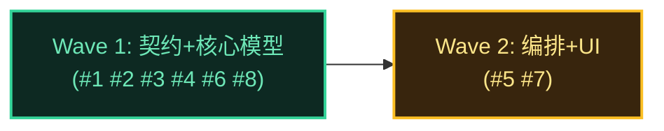

# 执行计划 — 对话流状态撕裂修复

> 从 code-architecture.md §4 时序图推导 Wave 依赖。refactor 模式，无 Prefactor Wave（不挪文件，删符号在同一 Wave 内原子完成）。

## Wave 编排总览

### 依赖 DAG 图

> **2 Wave 结构**：W1 是契约+核心模型层（protocol/chat.ts/effects/dispatcher/useConnection/timer——互不冲突或同文件内顺序改），W2 是编排+UI 层（useChat/Composer，依赖 W1 的 store API 就绪）。无独立 Prefactor Wave——符号删除在同一 Wave 内原子完成（chat.ts 删 8 加 6 一次提交，不存在"删了旧但新没加"的中间态）。

### 调度表

| Wave | 切片 | P级 | Blocked by | 并行组 | 说明 |
|------|------|-----|-----------|--------|------|
| 1 | 契约+核心模型 | P0+P1+P2 | 无 | A | protocol.ts(#1) → chat.ts(#2#8) → effects(#3) → dispatcher(#4) → useConnection(#6)；内部有序，单 subagent 串行 |
| 2 | 编排+UI | P1 | Wave 1 | B | useChat(#5) + Composer(#7)；依赖 W1 store API |

### 并行约束
- W1 内部串行（6 文件改动有数据依赖：protocol 类型→store API→effects handler→dispatcher 预检→useConnection 调用）
- W1 与 W2 严格串行（W2 的 useChat 依赖 W1 的 isGenerating/isActive/finalizeSession/pendingSend 就绪）

### 后续迭代（P3 延后）
- Issue #9 [P3]: abort 后队列复活 steer — 延后理由：BC-6 已知风险，依赖 pi RPC clear_queue 扩展，超出状态撕裂范围

---

## Wave 1: 契约+核心模型

**切片类型**: 垂直切片
**P 级覆盖**: P0(#1#2) + P1(#3#4#6) + P2(#8)
**Blocked by**: 无——可立即开始
**并行关系**: 无（内部串行）

### 包含的功能/issue
- Issue #1（P0）: send.rejected WS 类型契约（关联时序图 5）
- Issue #2（P0）: chat.ts 派生模型重构（关联时序图 1/3）
- Issue #3（P1）: effects handler 迁移 + sealed guard（关联时序图 1/3）
- Issue #4（P1）: message-dispatcher already processing → send.rejected（关联时序图 5）
- Issue #6（P1）: useConnection resetActive → finalizeSession（关联时序图 3）
- Issue #8（P2）: 超时兜底改收口实体 + 可配置阈值（关联时序图 3 timeout 分支）

### 文件影响
- 修改: `packages/shared/src/protocol.ts`（#1 send.rejected 枚举 + payload）
- 修改: `packages/renderer/src/stores/chat-store-types.ts`（#2 FinalizeReason 新增，或内联 chat.ts）
- 修改: `packages/renderer/src/stores/chat.ts`（#2#8 删 8 符号加 6 符号 + timer 改造）
- 修改: `packages/renderer/src/stores/chat-message-effects.ts`（#3 ctx 改造 + handler 迁移 + sealed guard）
- 修改: `packages/runtime/src/services/session/message-dispatcher.ts`（#4 预检 + 返回类型扩展）
- 修改: `packages/runtime/src/transport/session-message-handler.ts`（#4 rejected reply 分支）
- 修改: `packages/renderer/src/composables/useConnection.ts`（#6 两处 resetActive→finalizeSession）
- 测试: `packages/renderer/src/__tests__/chat-streaming-reset.test.ts`（改造基线）
- 测试: 新增 chat-store/effects/dispatcher unit 测试

### 覆盖的 test-matrix 用例 ID（完成判定）
- T1.1, T1.2, T1.3（UC-1 正常流 + 状态终态不可逆）
- T3.1, T3.2, T3.3（UC-3 长任务 + 超时）
- T4.1, T4.2, T4.3, T4.4, T4.5, T4.7, T4.8（UC-4 异常收口 + sealed + abort RPC 失败）
- T6.1, T6.3, T6.4（UC-6 send.rejected runtime 侧 + SMH 路由）
- T7.1, T7.2, T7.3（AC 反模式 grep）
- T8.1, T8.2（perf-chaos）
- T9.1, T9.2, T9.3, T9.4, T9.5, T9.6, T9.7, T9.8, T9.12, T9.13, T9.15, T9.16, T9.17, T9.18（NFR 来源 B）

### 内部执行序（subagent 串行链）
1. protocol.ts（#1）—— 类型先行，无依赖
2. chat.ts + chat-store-types（#2#8）—— 核心模型，删旧加新
3. chat-message-effects.ts（#3）—— 依赖 #2 的 finalizeSession/clearPendingSend 签名
4. message-dispatcher + session-message-handler（#4）—— 依赖 #1 类型（runtime 侧 isGenerating 为现有 sessionService 能力，非 #2 renderer 引入）
5. useConnection.ts（#6）—— 依赖 #2 finalizeSession
6. 测试改造 + 新增

### 验收标准
- [ ] issue #1/#2/#3/#4/#6/#8 的 AC 逐条全过
- [ ] 上述 test-matrix 用例 ID 全 PASS
- [ ] code-architecture.md §4 时序图 1/3/5 的所有方法已实现
- [ ] grep 验收：无 isStreaming ref / 无 setStreaming / 无 resetActive / dispatcher busy 分支无 message.error

---

## Wave 2: 编排+UI

**切片类型**: 垂直切片
**P 级覆盖**: P1(#5#7)
**Blocked by**: Wave 1
**并行关系**: 无（useChat + Composer 有依赖：Composer 调 useChat）

### 包含的功能/issue
- Issue #5（P1）: useChat 编排重构（关联时序图 1/2/4/5）
- Issue #7（P1）: Composer B 策略鼠标发送路由（关联时序图 2）

### 文件影响
- 修改: `packages/renderer/src/composables/features/useChat.ts`（#5 B 策略 + pendingSend + send.rejected 监听 + abort 乐观清）
- 修改: `packages/renderer/src/components/panel/Composer.vue`（#7 发送位三态）
- 测试: 新增 useChat B 策略 / Composer 三态测试

### 覆盖的 test-matrix 用例 ID（完成判定）
- T1.4, T1.5（UC-1 integration send 全链 + send 失败回滚）
- T2.1, T2.2, T2.3, T2.4, T2.5（UC-2 B 策略 + UI）
- T4.6, T4.8（UC-4 abort 乐观清 + 广播兜底 + abort RPC 失败）
- T5.1（UC-5 editAndResend）
- T6.2（UC-6 useChat 收 send.rejected）
- T9.9, T9.10, T9.11, T9.14（NFR 来源 B：pendingSend 幂等/isActive 路由/editAndResend guard/三态回归）

### 内部执行序
1. useChat.ts（#5）—— 依赖 W1 store API
2. Composer.vue（#7）—— 依赖 useChat 的 send/steer/abort
3. 测试新增

### 验收标准
- [ ] issue #5/#7 的 AC 逐条全过
- [ ] 上述 test-matrix 用例 ID 全 PASS
- [ ] code-architecture.md §4 时序图 2/4 的所有方法已实现
- [ ] Composer busy 时发送位可点转 steer（F4），停止按钮始终可见

---

## 测试验收清单（MANDATORY，全量用例按测试层分组）

> 来源：code-architecture.md §6 test-matrix（来源 A + 来源 B）。下游 coding-execute 分层验收。

### unit 层（mock，MID_LAYER_REAL 除外）

| 用例 ID | 断言摘要 | 归属 Wave | dependsOn | parallelGroup |
|---------|---------|----------|-----------|---------------|
| T1.1 | message_start → isGenerating(sid)=true, clearPendingSend | W1 | #2 #3 | chat-store |
| T1.2 | message.complete (agent_end) → finalizeSession('normal') | W1 | #2 #3 | chat-store |
| T1.3 | 终态不可逆，再注 complete → no-op | W1 | #2 #3 | chat-store |
| T2.1 | isActive 时 send 转 steer，不调 api.send | W2 | #5 | usechat |
| T2.4 | steer 失败回滚 pending + toast | W2 | #5 | usechat |
| T3.1 | 长任务 isGenerating 持续 true | W1 | #2 | chat-store |
| T3.2 | timer 触发 finalizeSession('timeout') | W1 | #2 #8 | chat-store |
| T3.3 | env 阈值可配置，默认 24h | W1 | #8 | chat-store |
| T4.1 | stream_error → finalizeSession('stream_error') | W1 | #2 #3 | chat-store |
| T4.2 | timeout → toolCall end_not_received | W1 | #2 #8 | chat-store |
| T4.3 | useConnection restart → finalizeSession('restart') | W1 | #2 #6 | useconn |
| T4.4 | useConnection disconnect → finalizeSession('disconnect') | W1 | #2 #6 | useconn |
| T4.5 | finalizeSession 幂等 | W1 | #2 | chat-store |
| T4.6 | abort 乐观清 + message.complete (stopReason=aborted) 兜底 complete | W2 | #5 | usechat |
| T4.8 | abort RPC 失败（乐观清已清 + toast，实体靠 runtime 兜底） | W2 | #5 | usechat |
| T4.7 | sealed guard 丢弃晚到 delta | W1 | #3 | effects |
| T6.1 | runtime 预检 busy → send.rejected | W1 | #1 #4 | dispatcher |
| T6.2 | useChat 收 send.rejected → 回滚 pending | W2 | #1 #5 | usechat |
| T6.3 | B 策略正常 → send.rejected 不触发 | W1 | #1 #4 | dispatcher |
| T6.4 | SMH rejected→reply 路由（不 sendError） | W1 | #1 #4 | dispatcher |
| T7.1 | grep chat.ts 无 isStreaming ref | W1 | #2 | grep |
| T7.2 | grep renderer 无 resetActive | W1 | #2 #6 | grep |
| T7.3 | grep dispatcher busy 分支无 message.error | W1 | #4 | grep |
| T9.1, T9.2, T9.4, T9.5, T9.6, T9.7, T9.8, T9.12, T9.13, T9.15, T9.16, T9.17, T9.18 | NFR 来源 B unit 用例（见 code-arch §6，T9.3 属 perf 层） | W1 | 各 issue | 各 group |

### integration 层（real）

| 用例 ID | 断言摘要 | 归属 Wave | dependsOn | parallelGroup |
|---------|---------|----------|-----------|---------------|
| T1.4 | useChat.send 全链（appendUser→addPendingSend→api.send→message_start→clearPendingSend） | W2 | #2 #5 | usechat |
| T1.5 | send api.send 失败回滚（clearPendingSend + throw） | W2 | #2 #5 | usechat |
| T5.1 | editAndResend pendingSend 对称 | W2 | #5 | usechat |
| T9.3 | NFR 来源 B perf-chaos（scan 性能，=T8.1） | W1 | #2 | perf |
| T9.9, T9.10, T9.11 | NFR 来源 B unit（pendingSend 幂等/isActive 路由/editAndResend guard） | W2 | #5 | chat-store/usechat |

### e2e 层（real）

| 用例 ID | 断言摘要 | 归属 Wave | dependsOn | parallelGroup |
|---------|---------|----------|-----------|---------------|
| T2.2 | busy 键盘⏎ → steer | W2 | #5 #7 | composer |
| T2.3 | busy 鼠标点发送位 → steer（F4） | W2 | #7 | composer |
| T2.5 | busy 停止按钮始终可见 + 发送位可点 | W2 | #7 | composer |
| T9.14 | Composer 三态渲染回归 | W2 | #7 | composer |

### perf-chaos 层（real）

| 用例 ID | 断言摘要 | 归属 Wave | dependsOn | parallelGroup |
|---------|---------|----------|-----------|---------------|
| T8.1 | isGenerating scan n=1000 << 50ms（非 <1ms，CI 噪声友好）+ scan 限定 get(sid) 结构断言 | W1 | #2 | perf |
| T8.2 | 24h timer 不误触发 | W1 | #8 | perf |
| T9.3 | per-session scan n=1000 性能（=T8.1 同断言） | W1 | #2 | perf |

### 全量用例 ID 清单（闭环校验用）
T1.1-T1.5, T2.1-T2.5, T3.1-T3.3, T4.1-T4.8, T5.1, T6.1-T6.4, T7.1-T7.3, T8.1-T8.2, T9.1-T9.18

---

## 交接（DoD = 测试验收清单全绿）

下游 coding-execute 按 Wave 执行：
- W1（6 文件串行）→ W2（2 文件串行）
- 每 Wave 完成判定 = 该 Wave 覆盖的 test-matrix 用例全 PASS
- 整体 DoD = 测试验收清单全量用例 PASS + grep 反模式 AC 通过

> **验收 Wave 职责由 CW test action 承担**（mid tier 不单独建 Acceptance Gate Wave）：coding-execute 完成 dev 后，CW test action 重算全量 T* 用例（judgeByExpected），覆盖本清单全量。caseId 提交约定见 detail.json testCases。
>
> **Wave 划分说明**（偏离 code-arch §8 建议）：#6 useConnection 与 #8 timer 仅依赖 #2，随 #2 同属 W1 核心模型层，比 §8 建议（#6#8 归 W2）更紧凑。§8 的 DAG 建议与实际编排一致性已验证（依赖不破坏）。
