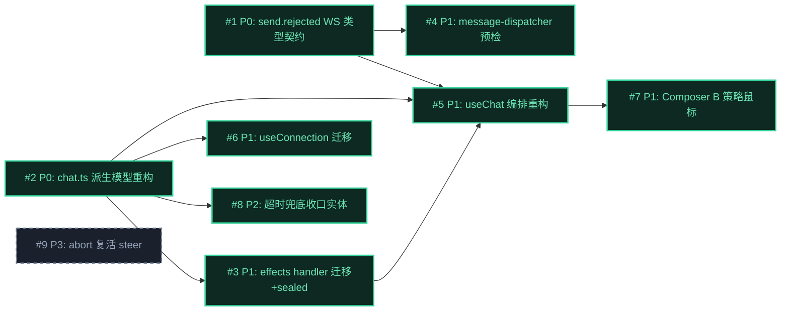

# Issue 决策图 — 对话流状态撕裂修复

## 地图总览

> 所有 P0/P1/P2 issue 的方案已在 mid-plan 经 ask_user / agent-opinionated 预决策（D-001~D-010）。本图无 fog（未决 issue）——所有挑战已在 mid-plan 收敛。P3 #9 是已知风险延后项。

## 上游覆盖核验（MANDATORY，逐条不漏）

| 上游元素 | 轴 | 对应 issue | 状态 | N/A 理由 |
|---------|----|-----------|------|----------|
| §5: streaming→complete（agent_end） | 状态 | #2 #3 | ✅ | — |
| §5: streaming→complete（abort，D-008） | 状态 | #3 #5 | ✅ | — |
| §5: streaming→error（stream_error/timeout/disconnect/restart） | 状态 | #2 #3 #6 #8 | ✅ | — |
| §5: sealed 不变式（D-010，晚到事件幂等丢弃） | 状态 | #3 | ✅ | — |
| §7: chat.ts（删 flag/timer + computed/finalizeSession） | 模块 | #2 | ✅ | — |
| §7: chat-message-effects.ts（handler 迁移） | 模块 | #3 | ✅ | — |
| §7: useChat.ts（编排重构） | 模块 | #5 | ✅ | — |
| §7: useConnection.ts（resetActive 迁移） | 模块 | #6 | ✅ | — |
| §7: message-dispatcher.ts（already processing → send.rejected） | 模块 | #4 | ✅ | — |
| §7: protocol.ts（新增 send.rejected） | 模块 | #1 | ✅ | — |
| §8: send.rejected 触发契约（D-009 runtime 预检） | 边界 | #4 | ✅ | — |
| §8: pi 子进程边界（不改） | 边界 | — | N/A | 约束：不改 pi 协议，无 issue |
| §10: D-1 computed scan（D-005） | 挑战 | #2 | ✅ | — |
| §10: D-2 send.rejected（D-006） | 挑战 | #1 #4 | ✅ | — |
| §10: D-3 超时阈值（D-003） | 挑战 | #8 | ✅ | — |
| §10: D-4 timer 假收口（D-007） | 挑战 | #8 | ✅ | — |
| §10: D-5 QueueBubble 复用（D-004） | 挑战 | — | N/A | 约束：复用现有 UI，无代码改动 issue |
| §10: D-6 鼠标转 steer | 挑战 | #7 | ✅ | — |
| §11: AC-1 消除 isStreaming flag | 兜底 | #2 | ✅ | — |
| §11: AC-2 消除只翻 flag 旁路 | 兜底 | #2 #3 | ✅ | — |
| §11: AC-3 所有异常经 finalizeSession | 兜底 | #2 #3 #6 | ✅ | — |
| §11: AC-4 already processing 不走 message.error | 兜底 | #4 | ✅ | — |
| §12: BC-1 正常对话流等价 | 兜底 | #2 #3 | ✅ | — |
| §12: BC-2 steer/abort 行为保持 | 兜底 | #3 #5 | ✅ | — |
| §12: BC-3 超时行为变更 | 兜底 | #8 | ✅ | — |
| §12: BC-4 dispatching 空窗保持 | 兜底 | #2 #5 | ✅ | — |
| §12: BC-5 editAndResend 保持 | 兜底 | #5 | ✅ | — |
| §12: BC-6 abort 复活 steer（不修） | 兜底 | #9 | ✅ | P3 延后 |

## P0 Issues（阻塞项，必须先做）

### #1: send.rejected WS 类型契约定义

**P 级**: P0
**类型**: 模块（契约）
**Blocked by**: 无
**推荐强度**: Strong
**关联**: §7 protocol.ts / §8 send.rejected 触发契约 / D-006

#### 问题描述

`already processing` 场景需要一个不污染对话流的独立 WS 类型。当前 message.error 被 5 处复用（hook 拦截/hook 异常/prompt 失败/abort 失败/session 退出），操作拒绝语义与流终止语义混杂。需在 shared/protocol.ts 定义 send.rejected 类型，作为 runtime→renderer 的防御性反馈通道。

P0 理由：契约先行——#4（message-dispatcher）和 #5（useChat 监听）都依赖此类型定义。

#### 方案对比

**方案 A: 新增独立 ServerMessageType.sendRejected 枚举值**
- 改动: protocol.ts 新增枚举值 + SendRejectedPayload 类型（sessionId/reason/message）
- 优点: 语义正交，消费方明确（不进对话流，不翻流式态）；CW gate AC-4 可机器检查
- 缺点: 扩展类型表（但 send.rejected 是终态操作反馈，不会再扩展）
- 适用: 操作拒绝与流终止需严格分离的场景（本 topic）

**方案 B: 复用 message.error 加 kind 字段区分**
- 改动: message.error payload 加 `kind: 'rejection' | 'stream_error'`
- 优点: 不扩展类型表
- 缺点: 消费方仍需按 kind 分流，effects handler 逻辑分叉；kind 字段蔓延到所有 message.error 消费方
- 适用: 拒绝与错误语义高度重叠的场景（本 topic 不重叠）

#### 取舍决策

**选择**: 方案 A（D-006 已拍板）
**理由**: 派生模型已消除 message.error 的撕裂副作用，send.rejected 的真正价值是 UX 语义分离 + 阻止 message.error 继续污染（5 处复用）。
**放弃 B**: kind 字段未解决"消费方逻辑分叉"问题，且 message.error 进对话流的副作用需每个消费方各自 guard。

#### 验收标准

- [ ] AC-1.1 [正常]: protocol.ts 含 `ServerMessageType.sendRejected` 枚举值 + `SendRejectedPayload` 类型（sessionId: string, reason: 'busy', message: string）
- [ ] AC-1.2 [正常]: sendRejected 不触发 message.* handler（类型独立，effects 注册表无映射）

---

### #2: chat.ts 派生模型重构（核心根因修复）

**P 级**: P0
**类型**: 模型
**Blocked by**: 无
**推荐强度**: Strong
**关联**: §4 核心模型 / §5 状态流转 / D-005 / D-010 / AC-1 / AC-2

#### 问题描述

当前 isStreaming 是命令式 ref<boolean>，由 N 条事件路径分别翻转。撕裂根因：每条路径只翻 flag 不收口实体。本 issue 把 isStreaming 从"原始状态"降为"派生态"，物理消除不一致。

P0 理由：这是整个 topic 的核心根因修复，#3/#5/#6/#8 全部依赖 chat.ts 的新模型（computed + finalizeSession）。

#### 方案对比

**方案 A: per-session computed scan（D-005 已拍板）**
- 改动: 删 isStreaming/streamingSessionId/dispatchingSessionId/streamingTimer 4 个 ref + setStreaming/setDispatching/resetActive 3 个 mutation；加 isGenerating(sid)/isActive(sid) computed + pendingSend Set + finalizeSession(sid, reason) action
- 模型: `isGenerating(sid) ≡ ∃ m ∈ messages[sid], m.status='streaming'`；scan 范围限定 `messages.value.get(sid)`
- 优点: 零手动维护，物理不可能不一致；sealed 不变式（finalizeSession 后实体终态，晚到事件 handler 检查 status≠streaming 则 return）
- 缺点: O(n) scan（n<1000 微秒级，流式期间 ~20/s × 1000 = 2万次/s 仍微秒级）
- 适用: 消除写路径维护 bug 的场景（本 topic 核心目标）

**方案 B: 增量 Set 维护（isGeneratingSessionIds: Set<string>）**
- 改动: 保留手动维护的 Set，message_start 加 sid、complete/error 删 sid
- 优点: O(1) 查询
- 缺点: 重新引入手动维护一致性——每条新事件路径都要记得"既改实体又改 Set"，原始 bug 类复发；sealed 不变式难以保证（Set 删除依赖每条路径都调）
- 适用: Set 维护可靠性能保证的场景（本 topic 正是要消除这种依赖）

#### 取舍决策

**选择**: 方案 A（D-005 已拍板）
**理由**: 核心收益是消除全部写路径维护 bug。O(n) 读是可接受的代价（n<1000 微秒级）。
**放弃 B**: 增量 Set = 重新引入手动维护 = 原始 bug 复发，复杂度归位失败。

#### 验收标准

- [ ] AC-2.1 [正常]（trace: UC-1 AC-1.1）: `grep -rn "isStreaming" chat.ts` 无 ref<boolean> 声明，无 setStreaming 调用
- [ ] AC-2.2 [正常]（trace: UC-1 AC-1.1）: isGenerating(sid) 为 computed，scan 范围限定 messages.value.get(sid)（per-session，防跨 session 误伤）
- [ ] AC-2.3 [边界]: isActive(sid) = isGenerating(sid) ∨ pendingSend.has(sid)
- [ ] AC-2.4 [异常]（trace: UC-4 AC-4.2）: finalizeSession(sid, reason) 把 streaming message→终态（**aborted→complete**，D-008 非 error；stream_error/timeout/disconnect/restart→error）+ running toolCall→收口（**一律 end_not_received**，除 stream_error/error→error；迟到 tool_call_end 覆盖到 completed，D-011）+ pendingSend.delete
- [ ] AC-2.5 [并发]: finalizeSession 幂等（重复调用不报错，sealed 后实体不变）。实现约束：行为按终态类分 3 支（complete/error/end_not_received），reason 原样透传 logger（不按 7 值写 7 个 switch case）

## P1 Issues（核心）

### #3: chat-message-effects.ts handler 迁移 + sealed guard

**P 级**: P1
**类型**: 模块
**Blocked by**: #2
**推荐强度**: Strong
**关联**: §7 effects / §5 sealed 不变式（D-010）/ AC-3

#### 问题描述

effects 注册表当前有 3 处 setStreaming(false)（message.complete/error/stream_error），迁移为调 finalizeSession。同时 message_start handler 加 pendingSend.delete（接管空窗）。sealed guard：text_delta/thinking_delta/tool_call_* handler 检查 last assistant status≠streaming 则 return（防晚到事件污染终态）。

#### 方案对比

**方案 A: 全部终态 handler 改调 finalizeSession + sealed guard**
- 改动: message.complete→finalizeSession('normal'/'aborted')；message.error→finalizeSession('error')；message.stream_error→finalizeSession('stream_error')；message_start→pendingSend.delete；delta handler 加 status guard
- 优点: 单一收口出口，sealed 不变式统一实现
- 缺点: 无（这是 #2 的必然延伸）

**方案 B: 保留各 handler 独立收口逻辑**
- 缺点: 维持 N 条路径各自的收口代码，遗漏一条即撕裂——正是当前 bug 模式

#### 取舍决策

**选择**: 方案 A
**理由**: finalizeSession 是 #2 建立的唯一收口出口，effects 必须统一调用。sealed guard 是 D-010 的实现。

#### 验收标准

- [ ] AC-3.1 [正常]（trace: UC-1 AC-1.1）: message.complete handler 调 finalizeSession（非 setStreaming）
- [ ] AC-3.2 [异常]（trace: UC-4 AC-4.4/4.5）: message.stream_error / message.error handler 调 finalizeSession('stream_error'/'error')
- [ ] AC-3.3 [正常]: message_start handler 含 pendingSend.delete(sid)
- [ ] AC-3.4 [边界]: finalizeSession 后 text_delta 到达 → handler 检查 status≠streaming → return（幂等丢弃，D-010 sealed）

---

### #4: message-dispatcher.ts already processing → send.rejected（runtime 预检）

**P 级**: P1
**类型**: 模块（runtime）
**Blocked by**: #1
**推荐强度**: Strong
**关联**: §7 message-dispatcher / §8 send.rejected 触发契约（D-009）/ AC-4

#### 问题描述

message-dispatcher sendPrompt 当前不分类 prompt 失败——忙时调 prompt 被 pi 拒绝后广播 message.error。改为 runtime 预检：sendPrompt 入口检查 activeSession.isGenerating，忙则直接广播 send.rejected 不调 pi.prompt。

#### 方案对比

**方案 A: runtime 预检（D-009 已拍板）**
- 改动: sendPrompt 入口加 isGenerating 检查，忙则广播 send.rejected return
- 优点: 不依赖 pi 错误字符串匹配（pi 升级改文案不断）；send.rejected 是纯防御（B 策略下前端 busy 走 steer，本不该触发）
- 缺点: runtime 需维护 activeSession.isGenerating 状态（已有 sessionService 查询能力）

**方案 B: 捕获 pi prompt 错误后字符串匹配路由**
- 缺点: 依赖 pi 错误文案（"already processing"），pi 升级即断；全代码库 grep 无该字符串，属 pi 运行时内部拒绝

#### 取舍决策

**选择**: 方案 A（D-009 已拍板）
**理由**: runtime 预检比字符串匹配可靠，不依赖 pi 协议细节。

#### 验收标准

- [ ] AC-4.1 [正常]（trace: UC-2 AC-2.1）: sendPrompt 入口检查 isGenerating，忙则广播 send.rejected（不调 pi.prompt）
- [ ] AC-4.2 [异常]（trace: AC-4 of arch）: `grep -rn "already processing" message-dispatcher.ts` 无 message.error 广播在 busy 分支

---

### #5: useChat.ts 编排重构（B 策略 + pendingSend 迁移）

**P 级**: P1
**类型**: 模块
**Blocked by**: #2, #3
**推荐强度**: Strong
**关联**: §7 useChat / D-001（B 策略）/ BC-2 / BC-5

#### 问题描述

useChat 的 send/editAndResend/steer/abort 全部需迁移：(1) send/editAndResend 改用 pendingSend.add/delete 替代 setDispatching（**submitFirstMessage 经 send() 复用**——useNewTaskFlow.ts:202 调 chat.send，pendingSend.add 在 send 内部已覆盖，不独立维护）；(2) B 策略路由——isActive(sid) 时 send 自动转 steer（D-001）；(3) send.rejected 监听——收到时回滚 pendingSend + toast；(4) abort 乐观清 pendingSend（实体靠 runtime 广播 message.complete (stopReason=aborted) 兑底，D-008）。

#### 方案对比

**方案 A: useChat 内统一路由（isActive 检查 → send/steer 分流）**
- 改动: send 入口检查 isActive(sid)，true→调 steer，false→pendingSend.add + api.send
- 优点: B 策略单一入口，Composer 无需感知路由逻辑
- 缺点: useChat 承载路由 + 监听 + abort 三职责（偏重但编排层本就聚合）

**方案 B: Composer 层路由（canSend/canSteer computed 驱动模板分流）**
- 缺点: 路由逻辑分散到组件层，与"编排归 useChat"分层矛盾；split panel 多 Composer 实例时路由逻辑重复

#### 取舍决策

**选择**: 方案 A
**理由**: 编排归 composable 层（分层纪律），组件只消费 isActive 派生态。

#### 验收标准

- [ ] AC-5.1 [正常]（trace: UC-2 AC-2.1）: isActive(sid)=true 时 send 自动转 steer
- [ ] AC-5.2 [正常]（trace: UC-5 AC-5.1）: editAndResend 的 pendingSend 生命周期与 send 对称
- [ ] AC-5.3 [异常]（trace: UC-2 AC-2.4）: send.rejected 收到 → pendingSend 回滚 + toast，isGenerating 不变
- [ ] AC-5.4 [正常]（trace: UC-4 AC-4.3）: abort 乐观清 pendingSend，实体收口靠 runtime 广播兜底

---

### #6: useConnection.ts resetActive → finalizeSession 迁移

**P 级**: P1
**类型**: 模块
**Blocked by**: #2
**推荐强度**: Strong
**关联**: §7 useConnection / AC-3

#### 问题描述

useConnection 的 onRuntimeRestarting/onRuntimeFailed 两处调 resetActive()（chat.ts:313-322），迁移为调 finalizeSession('restart'/'disconnect')。resetActive 删除（被 finalizeSession 吞并）。

#### 方案对比

**方案 A: 两处直接改调 finalizeSession**
- 改动: useConnection.ts:135/141 resetActive() → finalizeSession(sid, 'restart'/'disconnect')
- 优点: 最小改动，路径不变只换收口函数

**方案 B: useConnection 层自行收口实体**
- 缺点: 跨层突变 store 实体（违反分层），且每个连接事件 handler 都要重复收口逻辑

#### 取舍决策

**选择**: 方案 A
**理由**: 收口归 store（finalizeSession），useConnection 只触发。

#### 验收标准

- [ ] AC-6.1 [异常]（trace: UC-4 AC-4.1）: runtime 重启 → useConnection 调 finalizeSession('restart')
- [ ] AC-6.2 [正常]: `grep -rn "resetActive" packages/renderer/src/` 无输出

---

### #7: Composer.vue B 策略鼠标发送路由（F4）

**P 级**: P1
**类型**: 模块（UI）
**Blocked by**: #5
**推荐强度**: Strong
**关联**: §10 D-6 / UC-2 AC-2.2

#### 问题描述

当前 Composer busy 时（isActive=true）发送按钮不渲染（v-if isActive 走 stop 分支）。D-6 决策：busy 时发送位可点 → 触发 steer（与键盘 Enter 对齐）。需重构模板三态：stop 按钮（始终可见）+ steer 入口（busy 时发送位）。

#### 方案对比

**方案 A: busy 时发送按钮改 steer 图标（复用停止按钮 + steer 入口布局）**
- 改动: isActive 分支保留 stop 按钮；发送按钮从 v-else 提升为与 stop 并列（busy 时图标变 steer 语义）
- 优点: 键盘/鼠标对齐（B 策略完整）；复用现有布局不加新组件
- 缺点: 模板三态逻辑微调（可接受，D-6 已确认为搭便车新交互）

**方案 B: busy 时发送按钮保持 disabled**
- 缺点: 与 B 策略矛盾（用户以为"发不了"），键盘 Enter 已走 steer 但鼠标不对齐

#### 取舍决策

**选择**: 方案 A（D-6 已拍板）
**理由**: disabled 与 B 策略"可追加上下文"矛盾。键盘已路由 steer，鼠标应对齐。

#### 验收标准

- [ ] AC-7.1 [正常]（trace: UC-2 AC-2.2）: busy 时鼠标点发送位 → 触发 steer（非 disabled）
- [ ] AC-7.2 [正常]（trace: UC-2 AC-2.3）: busy 时停止按钮始终可见

## P2 Issues（重要）

### #8: 超时兜底改为收口实体 + 可配置阈值

**P 级**: P2
**类型**: 流程
**Blocked by**: #2
**推荐强度**: Strong
**关联**: §10 D-3（D-003）/ D-4（D-007）/ BC-3 / UC-3

#### 问题描述

streamingTimer 的 callback 当前调 setStreaming(false)（假收口），#2 删除 setStreaming 后 callback 必须改为调 finalizeSession('timeout')。同时阈值从硬编码 5min 改为可配置（XYZ_STREAMING_TIMEOUT_MS env，默认 24h）。

P2 而非 P0 理由：callback 改 finalizeSession 是 #2 删 timer 时的编译必然（调用已删函数会报错），实际随 #2 同 Wave。独立标 P2 的部分是"阈值可配置"——增强但非核心根因修复。默认 24h 实质不触发（D-003 拍板），卡死检测主要靠 runtime 重启/WS 断连（#6）+ 用户手动停止。

#### 方案对比

**方案 A: timer callback 改 finalizeSession('timeout') + env 可配置阈值**
- 改动: STREAMING_TIMEOUT_MS 读 env（默认 24h）；callback 调 finalizeSession(sid, 'timeout')
- 优点: timer 机制保留（防 pi 静默卡死，D-003 澄清）；24h = 用户接受手动停止的 UX 妥协
- 缺点: 无实质缺点（timer 行为从 bug 变正确）

**方案 B: 完全删除 timer**
- 缺点: pi 静默卡死（进程活/WS 连/不 emit）时无任何兜底，UI 永久卡在思考态直到用户手动停止。D-003 保留 timer 的理由正是防此极端场景

#### 取舍决策

**选择**: 方案 A（D-003 + D-007 已拍板）
**理由**: timer 机制必要（runtime 重启/WS 断连检测不到 pi 静默卡死）。24h 默认 = 放弃主动时间检测，靠用户手动停止 + 事件驱动收口（#6）。

#### 验收标准

- [ ] AC-8.1 [正常]（trace: UC-3 AC-3.2）: timer 触发 → finalizeSession('timeout') → 实体收口（非翻 flag）
- [ ] AC-8.2 [边界]: XYZ_STREAMING_TIMEOUT_MS env 可配置，默认 24h（86_400_000ms）

---

## 迷雾（未展开）

无。所有挑战已在 mid-plan 收敛（D-001~D-010），决策图无未决 issue。

## 后续迭代（P3 延后项）

### #9: abort 后队列复活 steer [P3]

**延后理由**: BC-6 已标已知风险。根因在 pi RPC 缺 clear_queue 命令（pi session.abort() 不清队列，残留 steer 在下次 prompt→runLoop 开头被 drain 注入）。超出"前端状态撕裂"范围，依赖 pi 协议扩展。本 topic 不修，mid-detail-plan NFR 标注为已知风险 + 用户规避路径（abort 后若要重发，等待 clear_queue RPC 或发空 steer 排空队列）。
