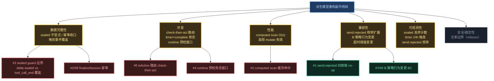

# 非功能性设计 — 对话流状态撕裂修复

> 本 topic 是 **refactor** 模式：重构 renderer store 内部状态模型（命令式 flag → computed 派生）+ runtime 预检 + protocol 枚举扩展。所有 issue 方案都是"消除现有 bug / 收口现有散乱逻辑"，**不引入新外部依赖、新权限模型、新数据源、新跨进程边界**。因此安全/性能等维度的整体风险面远小于功能新增型 topic——本分析的瘦身杠杆在"逐 issue × 7 维度"的 ✅ 一行化。

## 副作用分析树（Mermaid graph）

**图例**：🔴 spike = 不确定性高，需 code-arch 骨架验证；🟡 mitigated = 风险已缓解，有明确验收；⬜ safe = refactor 无新边界。

## 分析矩阵

| Issue | 方案 | 安全 | 数据完整性 | 性能 | 并发 | 稳定性 | 兼容性 | 可观测 |
|-------|------|------|-----------|------|------|--------|--------|

| #1 | 方案A（send.rejected 新类型） | ✅ | ✅ | ✅ | ✅ | ✅ | ⚠️ | ⚠️ |
| #2 | 方案A（per-session computed scan） | ✅ | ⚠️ | ⚠️ | ⚠️ | ⚠️ | ✅ | ✅ |
| #3 | 方案A（handler 迁移 + sealed guard） | ✅ | ⚠️ | ✅ | ⚠️ | ✅ | ✅ | ⚠️ |
| #4 | 方案A（runtime 预检 send.rejected） | ✅ | ⚠️ | ✅ | ⚠️ | ✅ | ✅ | ⚠️ |
| #5 | 方案A（useChat 统一路由） | ✅ | ⚠️ | ✅ | ⚠️ | ✅ | ⚠️ | ✅ |
| #6 | 方案A（resetActive→finalizeSession） | ✅ | ⚠️ | ✅ | ⚠️ | ✅ | ✅ | ✅ |
| #7 | 方案A（鼠标发送位转 steer） | ✅ | ✅ | ✅ | ✅ | ✅ | ⚠️ | ✅ |
| #8 | 方案A（timer 改收口 + 可配置） | ✅ | ⚠️ | ✅ | ⚠️ | ⚠️ | ⚠️ | ⚠️ |

> ✅ 无风险（一行理由见下）/ ⚠️ 有风险已缓解（见详细分析）/ ❌ 不可接受（无）。整体无 ❌——refactor 模式不引入新外部边界，安全维度全 ✅。

## 逐 issue × 7 维度分析

> **写量规则**：✅ 维度一行理由；⚠️ 维度按「副作用 / 缓解 / 残余」展开（本 topic 副作用面集中，多数缓解已在 issues.md/system-arch.md 决策，此处登记副作用 + 验收方式，不重复决策推理）。

### #1: send.rejected WS 类型契约定义 — 方案 A

#### 安全 ✅
新增 ServerMessageType 枚举值 + SendRejectedPayload 类型，纯类型层声明，无用户输入进入查询/命令/权限路径。

#### 数据完整性 ✅
类型定义不涉及跨表/跨系统事务，无数据迁移（protocol.ts 是共享类型层，运行时无持久化 schema 变更）。

#### 性能 ✅
类型定义零运行时开销。

#### 并发 ✅
类型定义不涉及并发控制。

#### 稳定性 ✅
类型定义不影响可用性。

#### 兼容性 ⚠️
**副作用**：新增 `ServerMessageType.sendRejected` 枚举值，扩展 ServerMessageMap。runtime 新增广播点（#4），renderer 新增监听（#5）。灰度共存场景：(1) 新前端 + 旧 runtime：旧 runtime 不广播 send.rejected，新前端监听永不触发——但 B 策略下前端 busy 走 steer 本就不触发 send.rejected（纯防御），无功能损失；(2) 旧前端 + 新 runtime：旧前端 effects 注册表（messageEffects）无 sendRejected 映射，`dispatchMessageEvent` 走 no-op 分支（已验证源码 dispatchMessageEvent：handler 不存在直接 return），消息被静默丢弃——但 send.rejected 是"操作拒绝"反馈，丢弃等价于"用户没看到 toast"，不破坏对话流。
**缓解**：枚举值追加（非替换），ServerMessageMap 新增 key 不破坏现有 key 的索引；旧前端 no-op 是安全降级（非崩溃）。
**残余**：旧前端 + 新 runtime 下，busy 时发送的防御反馈丢失（仅 toast 不显示），接受——B 策略下本不该触发。

#### 可观测性 ⚠️
**副作用**：send.rejected 是纯防御通道，触发即说明前端路由异常（B 策略下 busy 应走 steer 而非 send）或异常客户端（旧版本）。若频繁触发却无告警，前端路由 bug 不可见。
**缓解**：runtime 广播 send.rejected 时 console.warn + 计数（[rpc:stderr] 前缀随 logger 落盘，符合架构约束 #4 日志落盘）。
**残余**：无独立指标采集（本 topic 不引入 metrics 体系），靠日志事后排查。接受——触发频率低（防御兜底）。

---

### #2: chat.ts 派生模型重构（核心） — 方案 A

#### 安全 ✅
store 内部重构，不跨进程、不引入新边界（system-arch §6 已确认无新 Port）。

#### 数据完整性 ⚠️
**副作用**：isGenerating 从命令式 flag 降为 `messages[sid]` 派生 computed。不变式依赖实体状态正确性——finalizeSession 必须把 streaming message → 终态 + running toolCall → 收口（AC-2.4），否则 isGenerating 派生 true 永不复位。风险点：finalizeSession 遗漏某条 streaming message（一个 turn 多气泡场景，见 effects message.complete 的 [HISTORICAL] 注释——已收口所有 streaming assistant，非仅末条）。
**缓解**：finalizeSession 复用 message.complete handler 的"收口所有 status==='streaming' assistant"逻辑（非 findLastAssistantIndex 仅末条）；finalizeSession 幂等（AC-2.5，重复调用不报错、sealed 后实体不变）。
**残余**：finalizeSession 收口 toolCall 为 end_not_received（诚实态），迟到真实 tool_call_end 的覆盖与 sealed guard 的交互见 #3（需骨架验证）。

#### 性能 ⚠️
**副作用**：isGenerating(sid) 是 computed，每次 access scan `messages.value.get(sid)?.some(m => m.status==='streaming')`。流式期间 text_delta ~20/s 每个 mutate messages[sid] → 该 computed 依赖失效 → 下次 access 重算。worst case：单 session 1000 条 message（长会话），20/s × O(1000) = 2万次/s 比较。
**缓解**：(1) per-session scan 限定范围（`messages.value.get(sid)`，非全 Map，避免跨 session 失效扩散——源码 streamingSessionId 注释已警告此约束）；(2) Vue computed 是 lazy + cached，依赖未变时不重算，只有真正 access 才求值（模板多处 isActive 引用共享同一缓存）；(3) `.some()` 短电路（streaming message 通常在末尾，命中即停）。
**残余**：n<1000 微秒级，无 P99 风险。但 computed 在 Map value 数组高频 mutate 下的响应式追踪正确性（是否正确失效/不漏失效）需骨架验证——见「需⑤骨架验证」P1。

#### 并发 ⚠️
**副作用**：finalizeSession 可能被多条路径并发触发（timer 超时 + WS 断连 + 迟到 message.complete 同时到达）。check-then-act：isActive(sid) 派生检查 → useChat 路由（send/steer）的窗口——isActive 在 send 路由后到 message_start 前依赖 pendingSend 补全空窗。
**缓解**：finalizeSession 幂等（AC-2.5）——sealed 后实体不变，重复触发无副作用；pendingSend.add 在 send 前（同步）、delete 在 message_start/finalizeSession（幂等 Set delete）。
**残余**：finalizeSession 幂等性需骨架验证（sealed guard 时序）——见「需⑤骨架验证」I2。

#### 稳定性 ⚠️
**副作用**：删除 streamingTimer 的"假收口"后，pi 静默卡死（进程活/WS 连/不 emit）的兜底依赖 timer（24h）+ runtime 重启/WS 断连（#6）+ 用户手动停止。timer 24h 实质不触发（D-003）。
**缓解**：timer 机制保留（D-003 拍板，防极端挂死），与事件驱动收口（#6）双保险。
**残余**：24h 内 pi 静默卡死 + runtime 未重启 + WS 未断连 + 用户未手动停止 = UI 卡思考态最长 24h。接受——D-003 用户拍板的 UX 妥协。

#### 兼容性 ✅
store 内部重构，外部 API（finalizeSession 替代 resetActive）调用方在 #6 迁移，无外部消费者。

#### 可观测性 ✅
isGenerating 从 messages 派生，状态可从实体随时推导（无需额外日志重建 flag）。

---

### #3: chat-message-effects.ts handler 迁移 + sealed guard — 方案 A

#### 安全 ✅
handler 内部逻辑迁移，无外部输入进入特权路径。

#### 数据完整性 ⚠️
**副作用**：sealed guard（D-010）——finalizeSession 后该 session 的 text_delta/thinking_delta/tool_call_* handler 检查 last assistant status≠streaming 则 return。风险：合法但乱序的迟到事件被误丢。关键冲突点——tool_call_end：现有 message.complete handler 注释明确"延迟到达的真实 tool_call_end 会用真实 output 覆盖收口值（end_not_received → completed）"。若 sealed guard 对 tool_call_end 也生效，迟到真实 output 永久丢失（toolCall 永远卡 end_not_received）。
**缓解**：sealed guard **仅对 delta 流类**（text_delta/thinking_delta/tool_call_update）生效——这些是增量追加，finalizeSession 后追加无意义；**tool_call_end 不 sealed**（允许覆盖 end_not_received → completed）——因 end_not_received 是诚实态而非终态，迟到真实结果应覆盖。sealed 边界需骨架验证——见「需⑤骨架验证」I1。
**残余**：delta 类迟到丢弃正确（流已结束，追加是过时事件）；tool_call_end 覆盖正确（诚实态升级）。边界判定错误（误把 tool_call_end 也 sealed）会导致工具结果丢失——靠骨架验证 + 代码测试双重防护。

#### 性能 ✅
handler 迁移不改变事件处理复杂度（仍是 O(messages[sid]) 的 map 更新），sealed guard 是 O(1) status 检查。

#### 并发 ⚠️
**副作用**：晚到事件（pi 事件管道延迟）与 finalizeSession 的竞态——finalizeSession 把实体推终态后，在途的 text_delta/tool_call 到达。handler 入口的 status 检查是竞态决胜点。
**缓解**：handler 入口首行检查 last assistant status（findLastAssistantIndex + status!==streaming → return），与 finalizeSession 的实体写入形成 happens-before（Vue ref 同步写入，无真并行）。
**残余**：单线程 JS 无真并行，竞态本质是事件顺序问题，sealed guard 时序正确性需骨架验证。

#### 稳定性 ✅
单一收口出口（finalizeSession）替代 3 处 setStreaming，减少遗漏路径，稳定性提升。

#### 兼容性 ✅
handler 内部迁移，message.* 类型契约不变（send.rejected 是新增独立类型，不经 message.* 注册表）。

#### 可观测性 ⚠️
**副作用**：sealed guard 丢弃迟到事件是 silent drop——若频繁丢弃说明事件管道严重乱序或 finalizeSession 过早触发，无日志则不可见。
**缓解**：sealed guard 丢弃时 debug 级日志（[effects] late event dropped after finalize, type=..., sid=...），纳入 logger 落盘（架构约束 #4）。
**残余**：debug 级日志仅 dev 默认开启（架构约束 #4：dev=debug / prod=info），prod 下需 XYZ_LOG_LEVEL=debug 才可见。接受——乱序是异常态，dev 排查足够。

---

### #4: message-dispatcher.ts already processing → send.rejected（runtime 预检） — 方案 A

#### 安全 ✅
runtime 预检基于 activeSession.isGenerating（runtime 内部态），不涉及用户输入注入；send.rejected payload 的 message 字段是固定文案（"Agent 正在处理"），非用户输入回显。

#### 数据完整性 ⚠️
**副作用**：runtime 的 activeSession.isGenerating 与 renderer 的 isGenerating（messages 派生）是两套独立状态。预检基于 runtime 侧，若两者不一致，预检可能误判（runtime 已 false 但前端实体仍 streaming → 预检放行 → pi 拒绝）。
**缓解**：runtime isGenerating 在 broadcast message.complete/error 前同步置 false（已验证源码 message-dispatcher.ts:102/150/164），保证广播终态与状态复位原子；B 策略下前端 busy 走 steer 不触发 send，send.rejected 是纯防御兜底（异常客户端/前端路由 bug 场景），误判不破坏对话流（仅多/少一个 toast）。
**残余**：两套 isGenerating 不一致是既存架构事实（runtime/renderer 分离），本 topic 不修（超出状态撕裂范围）。

#### 性能 ✅
sendPrompt 入口 O(1) 状态检查，无额外查询。

#### 并发 ⚠️
**副作用**：sendPrompt 是 async（await handleHooks 在预检后），两个并发 sendPrompt（split panel 同 session 快速双击）可能在 hooks await 期间都通过预检——第一个还没置 isGenerating=true 时第二个已过检查。窗口：预检通过 → await hooks → 置位 isGenerating（源码:89-92 同步置位，但前置有 await）。
**缓解**：(1) 预检置于 sendPrompt 最入口（hooks 前），缩短窗口；(2) pi 是最终单写者——即使两个都过预检都调 pi.prompt，第二个被 pi 内部 already processing 拒绝，message-dispatcher catch 路径（源码:98-104）处理。**D-014 决断：catch 一律 message.error（不分类）**，不尝试区分 pi 拒绝 vs 其他错误（D-009 禁字符串匹配 + 无可靠结构化判据）。竞态窗口的 pi 拒绝走 message.error（安全降级，错误进对话流）。
**残余**：split panel 同 session 并发发送是极端场景，且 pi 兜底，严重性低。

#### 稳定性 ✅
预检避免无效 pi RPC（pi 已拒绝再广播错误的开销），稳定性不退化。

#### 兼容性 ✅
runtime 内部行为，前端按 #5 监听 send.rejected，无外部协议消费者。

#### 可观测性 ⚠️
**副作用**：send.rejected 触发即前端路由异常信号（同 #1 可观测性）。runtime 侧预检拦截与 pi 拒绝两条路径都广播 send.rejected，需区分日志。
**缓解**：runtime 预检拦截 log `[dispatcher] preemptive reject (busy)`；catch 路径（D-014 一律 message.error）log `[dispatcher] prompt failed, sid=...`。均落盘。
**残余**：同 #1，无独立指标，靠日志。

---

### #5: useChat.ts 编排重构（B 策略 + pendingSend 迁移） — 方案 A

#### 安全 ✅
composable 编排层，无特权操作。

#### 数据完整性 ⚠️
**副作用**：pendingSend 生命周期跨多条路径——add（send/editAndResend 前，同步）、delete（message_start 正常路径 / finalizeSession 异常路径 / send.rejected 回滚）。风险：pendingSend.add 后 send.rejected 与迟到 message_start 竞态（send.rejected 先到 delete，message_start 后到再 delete——幂等，无碍）；abort 乐观清 pendingSend 与 message_start delete 竞态（abort 后 message_start 晚到，delete 幂等无碍）。
**缓解**：pendingSend 用 Set，delete 天然幂等；add/delete 都按 sid 操作，per-session 隔离（符合 NFR §1 session 隔离核心约束）。pendingSend 操作幂等性需骨架验证——见「需⑤骨架验证」I2 关联。
**残余**：无实质残余（Set 操作幂等 + per-session 隔离）。

#### 性能 ✅
Set add/delete O(1)，isActive computed 已在 #2 分析。

#### 并发 ⚠️
**副作用**：isActive(sid) 检查 → send/steer 路由是 check-then-act。useChat.send 与 useChat.abort 并发（用户快速点发送又点停止）：send 检查 isActive=false → pendingSend.add → abort 乐观清 pendingSend + runtime abort → message_start 到达（abort 未生效）→ 实体 streaming。
**缓解**：(1) isActive 派生态（pendingSend ∨ isGenerating），abort 乐观清 pendingSend 后 isActive 派生 false，后续 send 检查走 send 而非 steer；(2) abort 实体收口靠 runtime 广播 message.complete (stopReason=aborted) 兜底（BC-2），即便 message_start 到达，后续 complete (stopReason=aborted) 收口。check-then-act 窗口的路由正确性需骨架验证——见「需⑤骨架验证」C1。
**残余**：abort 后 message_start 晚到且 abort RPC 失败（pi 死）的极端组合，靠 message-dispatcher abort catch 路径广播 message.error 兜底（源码:151-154，保持现行）。

#### 稳定性 ✅
编排归一（send/steer/abort 统一入口），减少分散路径，稳定性提升。

#### 兼容性 ⚠️
**副作用**：B 策略行为变更（D-001，BC-2）——原行为：busy 时 send 被 isActive guard 拦截（`if (!trimmed || chat.isActive(sid)) return`，源码 useChat:117）；新行为：busy 时 send 自动转 steer。editAndResend 保持 guard（BC-5：editAndResend 不转 steer，truncate 语义要求 idle）。
**缓解**：BC-2 已在 system-arch §12 标行为变更；键盘 Enter 已走 steer（Composer:320 isActive 分支），#7 鼠标对齐；editAndResend 的 isActive(sessionId) guard 保留（BC-5），与 send 路径区分。
**残余**：用户习惯"busy 时点发送 = 发送失败"的心智需迁移到"自动转 steer"。接受——D-001 用户拍板，QueueBubble 反馈链完备（D-004）。

#### 可观测性 ✅
pendingSend/isActive 都是可从 store 推导的派生态，无需额外日志。

---

### #6: useConnection.ts resetActive → finalizeSession 迁移 — 方案 A

#### 安全 ✅
连接事件 handler 迁移，无新边界。

#### 数据完整性 ⚠️
**副作用**：resetActive 当前只清 flag/dispatching/timer（不碰实体），finalizeSession 收口实体。行为变更：runtime 重启/断连后实体从"残留 streaming（UI 撕裂态）"变为"收口 error"。这是修复（G1）非回归。
**缓解**：finalizeSession('restart'/'disconnect') 把 streaming message → error + running toolCall → end_not_received，符合 system-arch §5 reason 映射表（timeout/disconnect/restart → error / end_not_received）。
**残余**：无（行为变更方向正确，实体收口符合用户预期）。

#### 性能 ✅
单次 finalizeSession 调用，O(messages[sid])，与 resetActive 同阶。

#### 并发 ⚠️
**副作用**：onRuntimeRestarting/onRuntimeFailed 触发时，可能有在途的 message.* 事件（WS 断连前最后一帧）。finalizeSession 与迟到 message.complete 竞态。
**缓解**：finalizeSession 幂等（AC-2.5）+ sealed guard（#3）——无论先到后到，实体最终终态一致。
**残余**：依赖 finalizeSession 幂等性（#2 并发已登记），无新增风险。

#### 稳定性 ✅
统一收口（resetActive 删除，被 finalizeSession 吞并），减少收口出口数量，稳定性提升。

#### 兼容性 ✅
useConnection 内部调用迁移，无外部消费者（resetActive 是 store 私有 action）。

#### 可观测性 ✅
finalizeSession reason 字段（'restart'/'disconnect'）可在需要时 log，当前无独立需求。

---

### #7: Composer.vue B 策略鼠标发送路由 — 方案 A

#### 安全 ✅
UI 模板调整，无特权路径。

#### 数据完整性 ✅
UI 路由层，不直接操作实体（经 useChat 调 store）。

#### 性能 ✅
computed isActive 已在 #2 分析，模板 v-if 无额外开销。

#### 并发 ✅
UI 事件路由，并发由 useChat 编排层处理（#5）。

#### 稳定性 ✅
模板三态微调，不引入新组件（D-004 复用现有布局），稳定性不退化。

#### 兼容性 ⚠️
**副作用**：发送位三态重构——当前 busy 时发送按钮 v-if isActive 走 stop 分支（发送按钮不渲染）；新布局 stop 按钮 + 发送位并列（busy 时发送位变 steer 语义）。风险：三态（idle/sending/busy）渲染错乱，stop 按钮与 steer 入口布局重叠/错位。
**缓解**：(1) UI 回归测试（BC-1 正常对话流渲染基线）；(2) 复用现有 stop 按钮布局（D-006 决策，非新组件）；(3) 三态 testid 覆盖（首屏冒烟模板，见项目测试规范 §8）。
**残余**：三态视觉一致性需人工验证（像素级），代码测试覆盖结构非视觉。

#### 可观测性 ✅
UI 渲染层，可观测性由现有 Composer 状态反映。

---

### #8: 超时兜底改为收口实体 + 可配置阈值 — 方案 A

#### 安全 ✅
timer callback 逻辑变更，无新边界。XYZ_STREAMING_TIMEOUT_MS env 经 ENV_WHITELIST_PREFIXES（XYZ_ 前缀）自动过白名单（架构约束 #3），无需改白名单。

#### 数据完整性 ⚠️
**副作用**：timer callback 从 setStreaming(false)（假收口）改为 finalizeSession('timeout')（真收口实体）。finalizeSession 可能与正常 message.complete 并发触发（pi 在 timeout 阈值到达瞬间恰好完成）。
**缓解**：finalizeSession 幂等（AC-2.5）——先到的收口实体，后到的 no-op；clearTimeout 在 finalizeSession 内或 complete handler 内调用，防 timer 重复触发。
**残余**：依赖 finalizeSession 幂等性（#2/#8 共享风险），无新增。

#### 性能 ✅
单 timer（streaming 期间至多 1 个，符合 NFR §3），无性能影响。

#### 并发 ⚠️
**副作用**：timer 触发与 message.complete/WS 断连/runtime 重启的竞态——多条收口路径同时触发 finalizeSession。
**缓解**：finalizeSession 幂等 + sealed guard（D-010）—— sealed 后迟到事件 handler 检查 status≠streaming 则 return。timer 与事件驱动收口的时序正确性合并到 #2 并发风险（finalizeSession 幂等骨架验证）。
**残余**：无（幂等保证最终一致）。

#### 稳定性 ⚠️
**副作用**：timer 阈值从 5min 硬编码改为 24h 默认（D-003）。pi 静默卡死时，5min → 24h 意味着 UI 卡思考态窗口从 5min 扩大到 24h（若 runtime 重启/WS 断连/用户手动停止都未触发）。
**缓解**：(1) timer 机制保留（D-003），作为 pi 静默卡死最后兜底；(2) runtime 重启/WS 断连（#6）是主要卡死检测手段，不依赖 timer；(3) 用户手动停止（停止按钮）始终可用（isActive 驱动）；(4) XYZ_STREAMING_TIMEOUT_MS 可配置，用户可调小。
**残余**：默认 24h 下，极端场景（pi 静默卡死 + runtime 未重启 + WS 不断 + 用户离开）UI 卡 24h。接受——D-003 用户拍板，timer 实质不触发是预期行为。

#### 兼容性 ⚠️
**副作用**：BC-3 行为变更——(1) 超时从"翻 flag"改为"收口实体"（修复 bug，非破坏正确行为）；(2) 阈值 5min → 24h（用户接受手动停止的 UX 妥协）。XYZ_STREAMING_TIMEOUT_MS env 向后兼容：未设时默认 24h，与原 5min 硬编码行为不同（阈值变更）。
**缓解**：(1) BC-3 已在 system-arch §12 标行为变更；(2) env 未设走默认值（向后兼容 env var 模式，NFR §6）；(3) 文档/Settings 暴露配置项（用户可调回短阈值）。
**残余**：升级用户若依赖原 5min 自动超时收口行为，需手动设 XYZ_STREAMING_TIMEOUT_MS=300000。接受——D-003 用户拍板，且收口实体行为本身是修复。

#### 可观测性 ⚠️
**副作用**：timer 24h 触发是极端异常信号（pi 静默卡死 24h 未被其他手段发现），若触发却无日志，无法定位为何卡这么久。
**缓解**：timer callback 触发 finalizeSession('timeout') 时 warn 级日志（[chat] streaming timeout finalized, sid=..., elapsed=...），纳入 logger 落盘。
**残余**：24h 触发极罕见，日志主要做事后归因，无实时告警需求。

---

## 缓解项回灌登记表（MANDATORY）

> 每条缓解标「验收方式」，其中「代码测试」的会被 code-arch test-matrix 来源 B 引用。测试用例 ID 留占位（code-arch 补）。

| # | 缓解项 | 来源 Issue# | 维度 | 回灌去向 | 落地为 | 验收方式 | 状态 |

|---|--------|------------|------|---------|--------|---------|------|

| M1 | send.rejected 枚举追加（非替换），旧前端 no-op 安全降级 | #1 | 兼容性 | ⑤契约 | protocol.ts SendRejectedPayload 类型定义 + ServerMessageMap key | 骨架约束 | 待落 |

| M2 | runtime 广播 send.rejected 时 console.warn + 计数（落盘） | #1/#4 | 可观测性 | ⑤代码 | message-dispatcher 预检/拒绝分支 logger.warn（测试: NFR-T-LOG-REJECT） | 代码测试 | 待落 |

| M3 | finalizeSession 收口**所有** streaming assistant（非仅末条） | #2 | 数据完整性 | ⑤代码 | finalizeSession 复用 message.complete 的全量收口逻辑（测试: NFR-T-FINALIZE-ALL） | 代码测试 | 待落 |

| M4 | finalizeSession 幂等（重复调用 sealed 后实体不变） | #2/#8 | 并发/数据 | ⑤代码 | finalizeSession 入口 sealed 检查 + 测试（测试: NFR-T-FINALIZE-IDEMPOTENT） | 代码测试 | 待落 |

| M5 | per-session computed scan 限定 messages.value.get(sid) | #2 | 性能 | ⑤代码 | isGenerating computed scan 范围 + n=1000 性能断言（测试: NFR-T-COMPUTED-PERF） | 代码测试 | 待落 |

| M6 | Vue computed 在高频 mutate 下响应式追踪正确性 | #2 | 性能 | ⑤骨架 | computed 依赖追踪 stub，骨架验证失效/缓存（测试: —（tsc + 骨架 smoke）） | 骨架约束 | 待落 |

| M7 | timer 机制保留 + runtime 重启/WS 断连双保险 | #2/#8 | 稳定性 | ⑤代码 | STREAMING_TIMEOUT_MS callback 调 finalizeSession（测试: NFR-T-TIMER-FINALIZE） | 代码测试 | 待落 |

| M8 | sealed guard **仅对 delta 流类**生效，tool_call_end 允许覆盖 | #3 | 数据完整性 | ⑤骨架+代码 | sealed guard 边界 stub + 迟到 tool_call_end 覆盖测试（测试: NFR-T-SEALED-BOUNDARY） | 代码测试 | 待落 |

| M9 | sealed guard 丢弃迟到事件 debug 级日志 | #3 | 可观测性 | ⑤代码 | effects handler 丢弃分支 logger.debug（测试: NFR-T-LOG-SEALED-DROP） | 代码测试 | 待落 |

| M10 | handler 入口 status 检查（sealed guard 时序） | #3 | 并发 | ⑤骨架 | delta handler 入口 status!==streaming → return stub（测试: —（tsc + 骨架 smoke）） | 骨架约束 | 待落 |

| M11 | runtime isGenerating 在 broadcast 终态前同步置 false | #4 | 数据完整性 | ⑤代码 | message-dispatcher 终态广播前置 false（保持现行）（测试: NFR-T-RUNTIME-RESET） | 代码测试 | 待落 |

| M12 | sendPrompt 预检置于最入口（hooks 前） | #4 | 并发 | ⑤骨架 | sendPrompt 入口 isGenerating 检查 stub（测试: —（tsc + 骨架 smoke）） | 骨架约束 | 待落 |

| M13 | catch 路径一律 message.error（D-014 决断：不分类，send.rejected 只走预检） | #4 | 并发/数据 | ⑤代码 | message-dispatcher catch 分支 broadcast message.error（不区分 pi 拒绝 vs 其他）（测试: NFR-T-PI-REJECT-ROUTE） | 代码测试 | 待落 |

| M14 | pendingSend Set 操作幂等 + per-session 隔离 | #5 | 数据完整性 | ⑤代码 | pendingSend delete 幂等测试 + sid 隔离测试（测试: NFR-T-PENDING-IDEMPOTENT） | 代码测试 | 待落 |

| M15 | isActive 派生（pendingSend ∨ isGenerating）驱动 abort 后路由 | #5 | 并发 | ⑤骨架 | isActive computed stub + abort/send 竞态测试（测试: NFR-T-ROUTING-AFTER-ABORT） | 代码测试 | 待落 |

| M16 | editAndResend 保留 isActive guard（BC-5，不转 steer） | #5 | 兼容性 | ⑤代码 | editAndResend guard 测试（测试: NFR-T-EDIT-GUARD） | 代码测试 | 待落 |

| M17 | finalizeSession('restart'/'disconnect') reason 映射 error/end_not_received | #6 | 数据完整性 | ⑤代码 | useConnection 迁移 + reason 映射测试（测试: NFR-T-CONN-FINALIZE） | 代码测试 | 待落 |

| M18 | resetActive 删除（grep 无输出） | #6 | 兼容性 | ⑤反模式 | AC-6.2 grep 验证（测试: NFR-T-NO-RESETACTIVE） | 代码测试 | 待落 |

| M19 | Composer 三态渲染回归（idle/sending/busy） | #7 | 兼容性 | ⑤代码 | Composer mount 三态 testid 断言（测试: NFR-T-COMPOSER-TRISTATE） | 代码测试 | 待落 |

| M20 | clearTimeout 防 timer 重复触发 | #8 | 并发 | ⑤代码 | finalizeSession/complete handler 内 clearTimeout（测试: NFR-T-TIMER-CLEAR） | 代码测试 | 待落 |

| M21 | XYZ_STREAMING_TIMEOUT_MS env 向后兼容（未设默认 24h） | #8 | 兼容性 | ⑤代码 | env 读取 + 默认值测试（测试: NFR-T-ENV-DEFAULT） | 代码测试 | 待落 |

| M22 | timer 24h 触发 warn 级日志 | #8 | 可观测性 | ⑤代码 | timer callback logger.warn（测试: NFR-T-LOG-TIMEOUT） | 代码测试 | 待落 |

**回灌去向统计**：
- ⑤代码（test-matrix 来源 B）：**18 条**（M2/M3/M4/M5/M7/M8/M9/M11/M13/M14/M15/M16/M17/M18/M19/M20/M21/M22）
- ⑤骨架（tsc + smoke）：4 条（M6/M8 部分/M10/M12）—— 体现为签名/字段/边界存在性
- ⑤反模式（grep）：1 条（M18）
- ⑤契约（类型定义）：1 条（M1）
- 运维项：0 条（本 topic 无纯部署/监控配置类缓解）

> 说明：标「骨架约束」的缓解项（M6/M8-sealed stub/M10/M12）由 code-arch 骨架 tsc gate + smoke 验证存在性，不重复进 test-matrix；但其背后的**行为正确性**（如 sealed guard 实际丢弃行为）仍需「代码测试」覆盖（M8/M9），二者分工：骨架验证存在，测试验证行为。

## 残余风险登记

| 风险 | 影响 | 接受理由 | 监控方式 |
|------|------|---------|---------|
| runtime/renderer 两套 isGenerating 不一致 | send.rejected 预检误判（多/少一个 toast） | 既存架构事实，超出状态撕裂范围；send.rejected 是防御兜底，误判不破坏对话流 | send.rejected 日志频率（M2） |
| 24h timer 内 pi 静默卡死 + runtime 未重启 + WS 不断 + 用户离开 | UI 卡思考态最长 24h | D-003 用户拍板；timer 实质不触发是预期；主要靠 runtime 重启/WS 断连/手动停止 | timer 触发日志（M22） |
| #9 abort 后队列复活 steer（P3 延后项） | abort 后重发新消息，旧 steer 静默复活 | BC-6 已知风险，依赖 pi RPC clear_queue 扩展，超出本 topic | —（P3 独立 ticket） |
| sealed guard 边界误判（tool_call_end 被误 sealed） | 迟到真实工具结果丢失（toolCall 卡 end_not_received） | 骨架验证（M8 stub）+ 代码测试（NFR-T-SEALED-BOUNDARY）双重防护 | sealed 丢弃日志（M9） |

## 需⑤骨架验证的副作用（标记登记）

> 并发竞态 / 响应式缓存命中率等高不确定性副作用，标记后 stub 方法进⑤骨架，结论回写本节。

### SV-1: computed scan 响应式追踪正确性 + 缓存命中（#2 性能，对应 M5/M6）
- **验证什么**：isGenerating(sid) 是基于 `messages.value.get(sid)?.some(...)` 的 computed。流式期间 text_delta ~20/s mutate messages[sid] 数组（`messages.value.set(sid, [...prev, ...])` 或原地 map）。验证：(1) computed 在数组替换时正确失效（依赖追踪 Map.get(sid) 的返回值引用）；(2) 多处 isActive 引用共享同一缓存（不重复 scan）；(3) per-session 隔离——A session mutate 不导致 B session 的 computed 失效。
- **预期结论方向**：Vue 3 reactivity 对 Map + 数组替换的追踪是成熟的，预期 computed 正确失效 + 缓存共享。per-session 隔离需 scan 限定 `get(sid)`（非遍历全 Map）保证。n=1000 scan <1ms。
- **stub 进⑤骨架**：isGenerating computed 定义 + messages Map 结构骨架。

### SV-2: sealed guard 边界（delta sealed vs tool_call_end 覆盖）（#3 数据完整性，对应 M8/M10）
- **验证什么**：sealed guard 对 text_delta/thinking_delta/tool_call_update 生效（finalizeSession 后丢弃），对 tool_call_end 不生效（允许覆盖 end_not_received → completed）。验证：(1) finalizeSession 后 text_delta 到达 → handler 检查 status≠streaming → return；(2) finalizeSession 后 tool_call_end 到达 → handler 覆盖 toolCall output/status（不 return）。
- **预期结论方向**：delta 类是增量追加，sealed 丢弃正确；tool_call_end 是终态确认，覆盖诚实态正确。边界判定需在 handler 入口区分事件类型（delta vs end）。
- **stub 进⑤骨架**：sealed guard status 检查 stub + tool_call_end 覆盖路径 stub。

### SV-3: finalizeSession 幂等 + 多路径并发收口（#2/#8 并发，对应 M4/M7/M20）
- **验证什么**：finalizeSession 被 timer/WS 断连/runtime 重启/迟到 message.complete 多路径触发时的幂等性。验证：(1) 重复调用 finalizeSession(sid, reason) 不报错；(2) sealed 后实体不变（第二次调用 no-op）；(3) clearTimeout 在首次 finalizeSession 后生效（timer 不重复触发）。
- **预期结论方向**：单线程 JS 无真并行，竞态本质是事件顺序；sealed guard + clearTimeout 保证幂等。reason 字段以首次触发的为准（timer 的 'timeout' vs complete 的 'normal'，先到先得——接受首次语义）。
- **stub 进⑤骨架**：finalizeSession 入口 sealed 标记 + clearTimeout 调用 stub。

### SV-4: runtime 预检竞态窗口 + catch 路由（#4 并发，对应 M12/M13）——**已决断**
- **验证什么**：sendPrompt 是 async，两个并发 sendPrompt（split panel 同 session 双击）在 hooks await 期间都过预检的窗口。
- **决断（D-014，由 anomaly F6 + dispatcher-skeleton 收敛）**：catch 路径一律 message.error（不分类）。send.rejected 只由预检触发（runtime isGenerating=true 拦截）。catch 不区分 pi already-processing 拒绝 vs 其他 prompt 错误——D-009 禁字符串匹配 + 无可靠结构化判据。NFR 自承的保守 fallback「所有 prompt 失败都走 send.rejected」被显式排除（会误导用户为「Agent 正在处理」）。
- **stub 进⑤骨架**：dispatcher-skeleton.ts 已含预检分支 + catch 一律 message.error（无 isPiAlreadyProcessing 分类）。

### SV-5: isActive 路由 check-then-act（#5 并发，对应 M15）
- **验证什么**：useChat.send 检查 isActive=false → pendingSend.add → 并发 useChat.abort 乐观清 pendingSend 的路由正确性。验证：(1) abort 清 pendingSend 后 isActive 派生 false，后续 send 走 send 而非 steer；(2) abort 后迟到 message_start（abort RPC 未生效）→ 实体 streaming → 后续 message.complete (stopReason=aborted) 收口；(3) isActive 派生在 abort/send 时序下的正确性。
- **预期结论方向**：isActive 派生态保证最终一致（pendingSend ∨ isGenerating），abort 乐观清是本地态即时反映，实体靠 runtime 广播兜底。check-then-act 窗口内可能瞬态不一致，但不破坏最终收口。
- **stub 进⑤骨架**：isActive computed + pendingSend Set + abort 乐观清路径 stub。

---

## 自检

- [x] **占位符残留检查**：无 [PLACEHOLDER]，测试用例 ID 用「NFR-T-NNN」明确标记待 code-arch 补，非占位符语法。
- [x] **7 维度全覆盖**：8 个 issue × 7 维度 = 56 个子节，每个 issue 都过了 7 维度（✅ 一行理由 / ⚠️ 展开），不适用维度均写了理由（无「—」跳过）。
- [x] **回灌表完整**：22 条缓解（M1~M22），每条都有验收方式（代码测试/骨架约束/反模式/契约），其中 14 条标「代码测试」供 code-arch test-matrix 来源 B 引用。
- [x] **需骨架验证登记**：5 项（SV-1~SV-5）标为需 code-arch 骨架验证，每项含「验证什么 + 预期结论方向 + stub 落点」。
- [x] **残余风险登记**：4 项残余风险，每项有接受理由 + 监控方式。
- [x] **决策账本不推翻**：D-001~D-017 全部尊重（含 mid-detail-plan anomaly 决策 D-011~D-017：D-011 toolCall 诚实态/D-014 catch 一律 message.error/D-015 pendingSendTimer/D-016 IPC env/D-017 WS watch 不收口），未引入与决策冲突的缓解。
