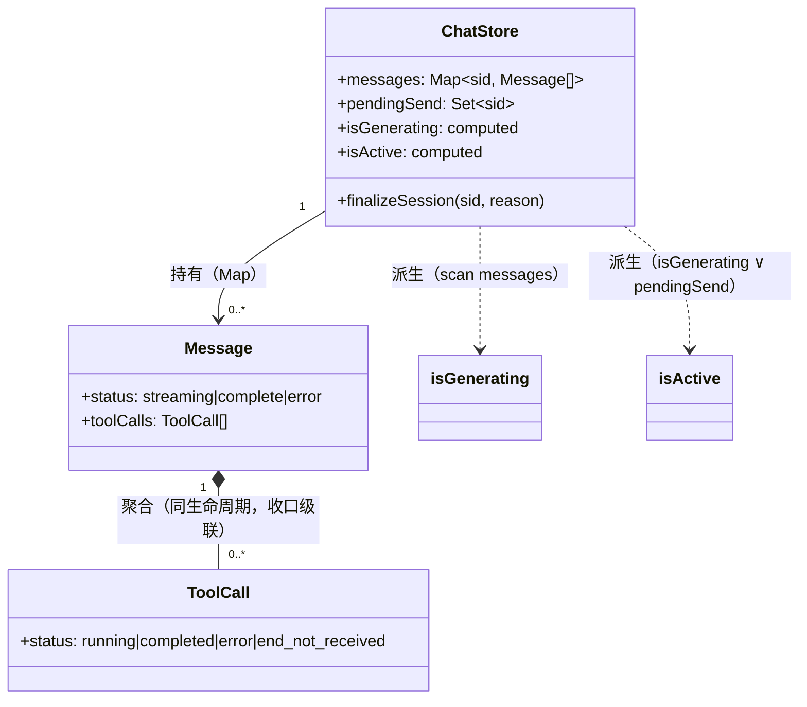
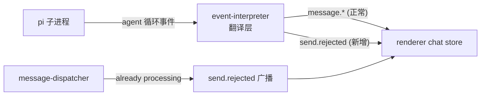
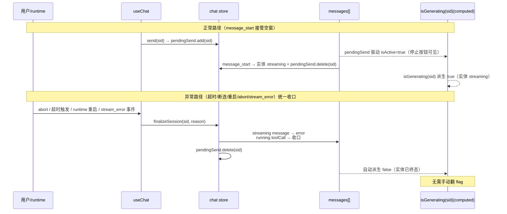

# 对话流状态模型架构设计

## 1. 目标转换

### 业务目标 → 系统目标
| 业务目标(requirements) | 转换为系统目标 | 衡量标准 |
|----------------------|--------------|---------|
| G1 UI 与实体状态一致 | isStreaming 从命令式 flag → computed 派生；单一收口出口 | 不存在 setStreaming() 调用；所有终态路径经 finalizeSession |
| G2 长任务不撕裂 | 超时收口实体而非翻 flag；阈值适配慢模型 | agent 运行 >5min 期间 isGenerating 持续准确 |
| G3 忙时可追加 | send.rejected 独立通道；Composer 按 isActive 路由 | already processing 不再触发 message.error 副作用 |

### 搭便车改造目标
| 改造目标 | 动机 | 关联业务目标 | 状态 |
|------|------|-------------|------|
| 删除 streamingTimer/dispatchingTimer 补丁 | 派生模型下 flag 不一致不可能，timer 补丁失去存在理由（D-007 确认变更） | G1 | 已纳入 |
| pendingSend 取代 dispatchingSessionId | 语义正交（预期态 vs 生成态分离） | G1 | 已纳入 |

## 2. 设计立场

**核心计算是什么？** 前端对话流的状态管理——message/toolCall 实体生命周期 + UI 派生态。这是**技术流程编排**（事件驱动的状态机转换 + 响应式派生），不是业务规则编排。**三层足够**（现有 store/composable/component 层不变，仅重构 store 内状态模型）。

根因诊断：当前 `isStreaming` 是**命令式维护的原始 flag**，由 N 条事件路径分别翻转（message_start/complete/error/timeout/disconnect/abort）。每条路径只翻 flag 不收口实体 → flag 与实体撕裂。**修复 = 把 isStreaming 从"原始状态"降为"派生态"**，物理上消除不一致的可能。

## 3. 统一语言

引用项目根 CONTEXT.md。本 topic 新增/修改术语：

| 术语 | 定义 |
|------|------|
| **实体状态（Entity State）** | message.status / toolCall.status，唯一真值源 |
| **派生态（Derived State）** | isGenerating(sid)，从 messages 派生的 per-session computed，不可手动翻转（防跨 session 误伤） |
| **预期态（Pending State）** | pendingSend，ack→message_start 空窗期的"用户已发起未确认"态，与生成态正交 |
| **收口（Finalize）** | 把 streaming/running 实体推到终态的唯一动作 |
| **活跃态（Active）** | isActive(sid) = isGenerating(sid) ∨ pendingSend.has(sid) |

## 4. 核心模型

| 模型 | 类型 | 不变式 | 建模理由 |
|------|------|--------|---------|
| Message | 实体（状态机） | status ∈ {streaming, complete, error}；到终态时其内所有 toolCall 必到终态；**finalizeSession 后，该 session 后续 streaming 事件（text_delta/thinking_delta/tool_call_*）幂等丢弃**（handler 检查 last assistant status≠streaming 则 return），防晚到事件污染终态 | 对话流原子单元，生命周期由事件驱动 |
| ToolCall | 实体（嵌于 Message） | status ∈ {running, completed, error, end_not_received}；归属唯一 Message | 工具调用块，独立收口 |
| isGenerating | 派生值（computed，per-session） | `isGenerating(sid): boolean ≡ ∃ m ∈ messages[sid], m.status='streaming'`（不含 pendingSend）；scan 范围限定 `messages.value.get(sid)`，避免跨 session 响应式失效扩散（源码 streamingSessionId 注释明确警告此约束） | 取代命令式 flag，物理不可撕裂 |
| isActive | 派生值（computed，per-session） | `isActive(sid): boolean ≡ isGenerating(sid) ∨ pendingSend.has(sid)` | 驱动停止按钮/发送路由 |
| pendingSend | 值对象（Set） | add 在 send 前，delete 在 message_start/收口时 | 填空窗期，与生成态正交 |

### 模型关联图



**关系约束**：Message 到终态时**级联收口**其内所有 ToolCall（不变式：不存在"message.complete 但 toolCall.running"的态）。这是 finalizeSession 的核心不变式。

### 降级决策（主动不建模）
| 概念 | 为什么不建模 | 应有的处理 |
|------|------------|-----------|
| dispatchingSessionId（旧） | 与 pendingSend 语义重叠（都是"空窗预期态"），合并为 pendingSend | 删除，pendingSend 接管 |

## 5. 状态流转

### Message.status 枚举（只描述阶段）
`idle(隐含，无 streaming message) → streaming → complete | error`

### ToolCall.status 枚举
`running → completed | error | end_not_received`

### Reason 字段（与 Status 正交）
- Message 终态原因：`normal`(message.complete agent_end) / `aborted`(message.complete stopReason=aborted) / `stream_error` / `timeout` / `disconnect` / `restart` / `end_not_received`
- ToolCall status 映射（finalizeSession reason → toolCall.status）：

| finalizeSession reason | message.status | toolCall.status |
|---|---|---|
| normal(agent_end) | complete | end_not_received（诚实态，迟到 tool_call_end 覆盖到 completed） |
| aborted(abort 广播) | complete（保持现行 complete，非 error） | end_not_received（同上，迟到 tool_call_end 覆盖） |
| stream_error | error | error |
| timeout / disconnect / restart | error | end_not_received |

> **abort 终态保持 complete**（不映射 error）：现行 message-dispatcher 广播 `message.complete{stopReason:'aborted'}` → effects 产出 `complete`。refactor 保持现行行为，abort→error 的语义改进属独立 ticket（非本 topic scope）。
>
> **toolCall 诚实态不变式**（F3 修正）：running toolCall 收口时一律 → `end_not_received`（无论 reason，除 error/stream_error→error）。迟到 `tool_call_end` 覆盖 `end_not_received → completed`（携带真实 output）。**不直接标 completed**（避免 tool_call_end 丢失时虚假成功），与现行 message.complete handler + NFR M8 一致。

### 合法转换（终态不可逆）
```mermaid
stateDiagram-v2
    [*] --> streaming: message_start
    streaming --> complete: message.complete
    note right of complete: agent_end → complete(normal)
    note right of complete: abort → complete(reason=aborted)
    streaming --> error: message.stream_error / finalizeSession(reason)
    note right of error: reason: stream_error / timeout / disconnect / restart
    complete --> [*]
    error --> [*]
```

**关键约束**：`streaming → {complete|error}` 是唯一离开 streaming 的路径。异常路径映射：
- **abort → complete**（保持现行 message-dispatcher 广播的 `message.complete{stopReason:'aborted'}`，非 error）
- **stream_error / timeout / disconnect / restart → error**（reason 区分）

不存在"streaming 但 flag=false"的中间态（派生模型下物理不可能）。

## 6. 分层架构

不新增层。在现有 renderer 三层内重构：

```
component (Composer/Panel/Block)  ← 消费 isActive/isGenerating（派生态）
    ↓
composable (useChat)              ← 编排：send/steer/abort/finalizeSession 调用
    ↓
store (chat.ts)                   ← 真值源：messages[] + pendingSend + computed
```

### Port 清单
| Port | 价值定位 | 实现数 |
|------|---------|--------|
| （无新增 Port） | 本次是 store 内部重构，不跨进程/不引入新边界 | — |

> 本次不引入 Port——重构范围在单个 store 内，没有可替换性需求（deletion test：删掉边界复杂度塌缩为一块，无不对称可捕获）。event-interpreter 的 pi 事件翻译层是已有 boundary，不动。

## 7. 模块划分与变化轴

| 模块 | 职责 | 变化轴 | 改动 |
|------|------|--------|------|
| chat.ts (store) | 实体状态 + 派生态 + 收口 | message 生命周期 | 删 flag/timer，加 computed isGenerating(sid)/isActive(sid)/finalizeSession |
| chat-message-effects.ts | 事件→实体状态转换 | 事件类型映射 | message_start 加 pendingSend.delete；message.complete/error/stream_error handler 改调 finalizeSession；message.error 语义收窄 |
| useChat.ts | 编排（send/steer/abort） | 用户操作 | send/editAndResend 路由（B 策略 + pendingSend 迁移）+ send.rejected 监听 + abort 乐观清 pendingSend（实体靠 runtime 广播兑底） |
| useConnection.ts | 连接事件 | runtime 崩溃/重启 | resetActive 调用迁移到 finalizeSession('restart'/'disconnect')（两处：onRuntimeRestarting/onRuntimeFailed） |
| message-dispatcher.ts (runtime) | prompt 失败处理 | RPC 错误分类 | already processing → send.rejected |
| protocol.ts (shared) | WS 类型契约 | 消息类型 | 新增 send.rejected |

## 8. 系统间上下文边界



| 关联系统 | 关系模式 | 交互方式 | 契约稳定性 |
|---------|---------|---------|-----------|
| pi 子进程 | 客户-供应商 | RPC（不改） | 稳定 |
| runtime↔renderer | 共享内核（WS 协议） | message.* + send.rejected | 本 topic 扩展 send.rejected |

### send.rejected 触发契约（SF-3 补充）

**问题**：`already processing` 错误来自 pi prompt RPC（全代码库 grep 无该字符串，属 pi 运行时拒绝）。message-dispatcher 当前不分类 prompt 失败。

**触发机制决策**：**runtime 预检**（message-dispatcher sendPrompt 入口检查 `activeSession.isGenerating`，忙则直接广播 send.rejected 不调 pi.prompt）。比靠 pi 错误字符串匹配更可靠，不依赖 pi 协议细节。

```
sendPrompt(sid, text):
  if activeSession.isGenerating:   // runtime 侧预检（pi 会拒绝）
    broadcast send.rejected({ sessionId: sid, reason: 'busy', message: 'Agent 正在处理' })
    return  // 不调 pi.prompt
  await client.prompt(text)        // 正常路径
```

**注意**：B 策略下前端 busy 时走 steer（不发 prompt），already processing 本不该触发——send.rejected 是纯防御兑底（前端路由 bug / 旧版本客户端等异常场景）。

## 9. 泳道图（异常收口）



对比当前：超时只翻 isStreaming flag，不碰 messages[] → IG 仍 true（实体未终态）→ 撕裂。

## 10. 挑战与决策

### D-1: 派生实现——全量 computed scan vs 增量 Set 维护
**张力**: 简单性（computed scan，零手动维护）vs 性能（长会话 messages 多，scan 开销）
**决策**: per-session computed scan（优先简单性）。
**理由**: scan 范围限定 `messages.value.get(sid)?.some(...)`（per-session），`.some()` 短电路，n<1000 微秒级。流式期间 text_delta ~20/s 每个 mutate messages → computed 失效 → 下次 access 重算（频率约 20/s × 1000 = 2万次/s，仍微秒级）。**核心收益是消除全部写路径维护 bug**（无 flag 需手动同步），O(n) 读是可接受的代价。Map 响应式 + computed 缓存，复杂度归位——把"维护 flag 一致性"的复杂度消除。

### D-2: send.rejected 新增类型 vs message.error+reason 复用
**张力**: 契约清晰（新类型，语义正交）vs 契约稳定性（复用现有，少改类型表）
**决策**: 新增 `send.rejected` 类型。
**理由**: 派生模型（D-1）本身已消除 message.error 广播导致的撕裂（isGenerating 从实体派生，不因 flag 翻转而变）。send.rejected 的真正价值是**UX 语义分离 + 阻止 message.error 继续污染**：(1) 操作拒绝（busy 时发送）不该在对话流冒红色错误气泡；(2) message.error 当前已被 5 处复用（hook 拦截/hook 异常/prompt 失败/abort 失败/session 退出），污染已存在，send.rejected 是止损。

### D-3: 超时阈值——可配置，默认 24 小时
**张力**: 误杀（阈值太短）vs 卡死无感知（阈值太长）
**决策**: 可配置（`XYZ_STREAMING_TIMEOUT_MS` env），默认 24 小时（用户拍板 D-003）。
**理由**: 用户决策。关键澄清（消除红队 O-1 的逻辑矛盾）：runtime 重启/WS 断连检测不到 pi 静默卡死（进程活、WS 连、不 emit），此时只有 timer 能触发收口。故 timer 机制**保留**（必要）。24h 默认值 = 用户接受「pi 静默卡死时靠手动点停止」的 UX 妥协——timer 实质不触发，卡死检测主要靠 runtime 重启/WS 断连事件 + 用户手动停止。两者不矛盾：timer 是最后兑底（防极端挂死），24h 是放弃主动时间检测。

### D-4: 行为变更边界——streamingTimer 的"假收口"是否保留
**张力**: refactor 模式要求行为等价，但 streamingTimer 当前行为（只翻 flag 不收口）本身就是 bug
**决策**: 标为行为变更（BC），不保持。超时改为收口实体（finalizeSession('timeout')）。这是 G1 的直接修复，属于"修复 bug"非"改变正确行为"。
**理由**: refactor 保持的是**正确**行为等价，不是保持 bug。streamingTimer 的假收口是撕裂根因，修复它是本 topic 的目标。

### D-5: steer UX 反馈——复用现有 QueueBubble
**张力**: 是否需要额外 toast 告知"自动转 steer"
**决策**: 复用现有 QueueBubble + S6 呼吸 ring + pending 气泡，不加额外 toast（用户拍板 D-004）。
**理由**: QueueBubble 已实现（Composer 上方双队列分栏，只读展示 steering/followUp）；S6 steer 态 composer box 染 accent 蓝 + 呼吸脉冲；pending 气泡 steer/followUp 双色区分。反馈链已完备，加 toast 是噪音。

### D-6: B 策略鼠标发送按钮——busy 时转 steer
**张力**: 当前 busy 时发送按钮 disabled（canSend=false）；键盘已路由 steer（Enter），鼠标未对齐
**决策**: 鼠标发送按钮 busy 时改为可点 → 触发 steer（与键盘 Enter 对齐）。
**理由**: 键盘 Enter busy 时走 steer（Composer.vue:314），鼠标发送按钮应一致。disabled 会让用户以为"发不了"，与 B 策略"可追加上下文"矛盾。发送位在 busy 时显示 steer 图标语义（复用现有停止按钮 + steer 入口布局）。

## 11. 反模式检查（grep 验收清单）

### AC-1: 消除命令式 isStreaming flag
- 验证：`grep -rn "isStreaming" packages/renderer/src/stores/chat.ts` 无 `ref<boolean>` 声明，无 `setStreaming` 调用

### AC-2: 消除"只翻 flag"的旁路
- 验证：`grep -rn "setStreaming\|isStreaming.value =" packages/renderer/src/` 无输出（除 computed 定义处）

### AC-3: 所有异常收口经 finalizeSession
- 验证：`grep -rn "finalizeSession\|resetActive" packages/renderer/src/` —— resetActive 无输出（useConnection.ts 两处调用已迁移），finalizeSession 覆盖 6 条路径：stream_error / timeout / disconnect / restart（异常源）+ message.stream_error / message.error（事件驱动终态）。注：abort 走 message.complete{stopReason:aborted} → effects handler 实体 complete（非 finalizeSession error 路径，保持现行语义）
- **sealed 不变式**：finalizeSession 后该 session 的 text_delta/thinking_delta/tool_call_* handler 检查 last assistant status≠streaming 则 return（幂等丢弃）

### AC-4: already processing 不走 message.error
- 验证：`grep -rn "already processing\|send.rejected" packages/runtime/src/services/session/message-dispatcher.ts` —— 不广播 message.error

## 12. 行为契约保持清单（refactor 模式）

### BC-1: 正常对话流行为等价
| 字段 | 内容 |
|------|------|
| 源码位置 | chat.ts setStreaming / effects message.* handlers |
| 处理 | 保持（message_start→实体 streaming + isGenerating 派生 true；complete→实体 complete + 派生 false） |
| 冲突 | 无 |

### BC-2: steer/followUp/abort 行为保持
| 字段 | 内容 |
|------|------|
| 源码位置 | useChat.ts steer/followUp/abort |
| 处理 | 保持。abort 乐观清 pendingSend（前端本地态），实体收口仍由 runtime 广播 `message.complete` (stopReason=aborted) → effects handler 产出 message.status=complete（保持现行 complete 语义，不映射 error）。isGenerating 派生 false（实体离开 streaming） |
| 冲突 | 无（abort 终态保持 complete，与现行一致） |

### BC-3: 超时兜底行为变更
| 字段 | 内容 |
|------|------|
| 源码位置 | chat.ts STREAMING_TIMEOUT_MS callback |
| 处理 | 变更（→独立 ticket：本 topic）—— 从"翻 flag"改为"收口实体" |
| 冲突 | `[CONFLICT]` 当前行为是 bug，修复属本 topic 目标，非保持项 |

### BC-4: dispatching 空窗行为保持
| 字段 | 内容 |
|------|------|
| 源码位置 | chat.ts dispatchingSessionId / setDispatching |
| 处理 | 保持（pendingSend 接管，isActive 仍含空窗态，停止按钮/steer 仍可即时用） |
| 冲突 | 无 |

### BC-5: editAndResend 行为保持
| 字段 | 内容 |
|------|------|
| 源码位置 | useChat.ts editAndResend（独立 send 路径：truncate→appendUser→setDispatching→api.send） |
| 处理 | 保持（pendingSend 接管空窗，与 send 对称；isActive(sessionId) 守卫保留） |
| 冲突 | 无 |

### BC-6: abort 后队列复活 steer（已知风险，本 topic 不修）
| 字段 | 内容 |
|------|------|
| 源码位置 | pi agent-loop.ts abort 路径（abort 不清队列） |
| 处理 | 保持（不变更）——RPC 无 clear_queue 命令，无法在 abort 时清队列 |
| 冲突 | `[CONFLICT]` B 策略"停止重来"路径隐患：用户 busy 时发了 steer → 点停止(abort) → 重发新消息 → 旧 steer 静默复活。根因在 pi RPC 缺 clear_queue（见 pi-steer-followup-capability.md §六/§九）。本 topic 不修（超出状态撕裂范围，依赖 pi RPC 扩展），但需在 mid-detail-plan NFR 标注为已知风险 |

## 下游衔接

### 喂给 Step 3（Issue 拆分）的部分
| 本文档章节 | issue 拆分用途 |
|------------|--------------|
| §7 模块划分 | Wave 拆分依据（5 个改动模块） |
| §10 D-1~D-4 | issue 的方案对比已预决策 |
| §11 AC-1~4 | issue 的验收标准 |
| §12 BC-1~4 | 行为等价回归测试基线 |
