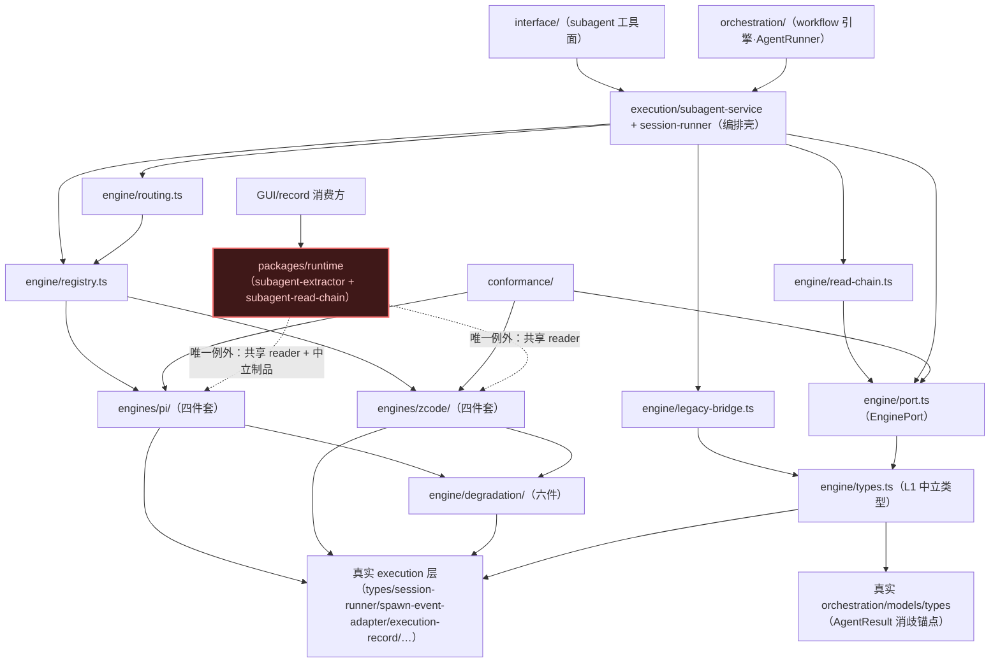
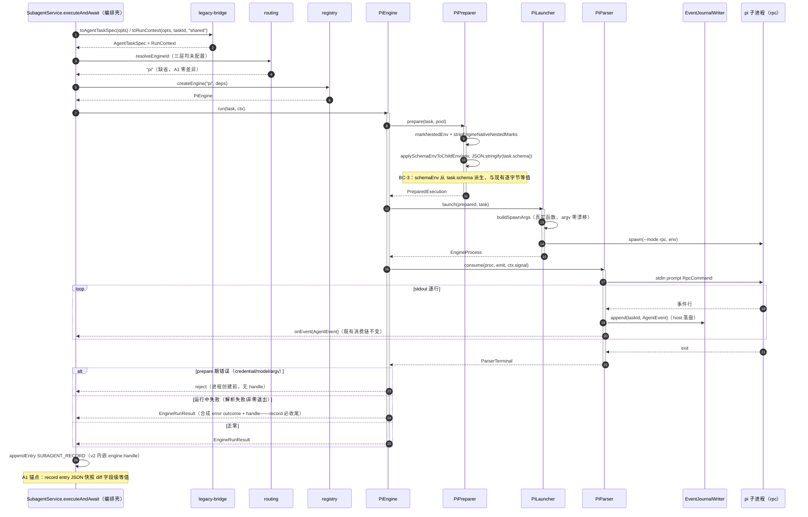
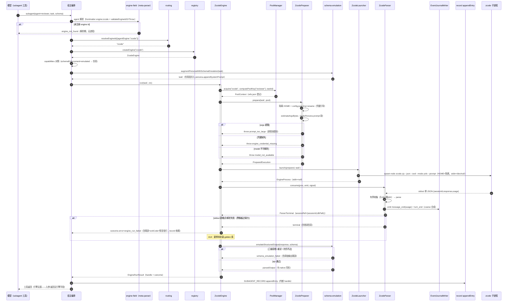
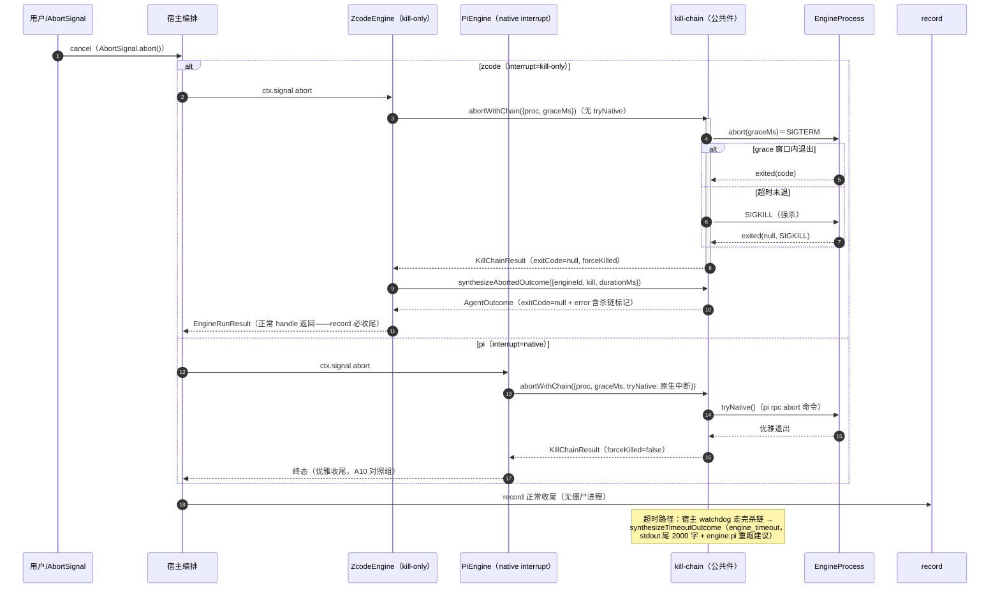
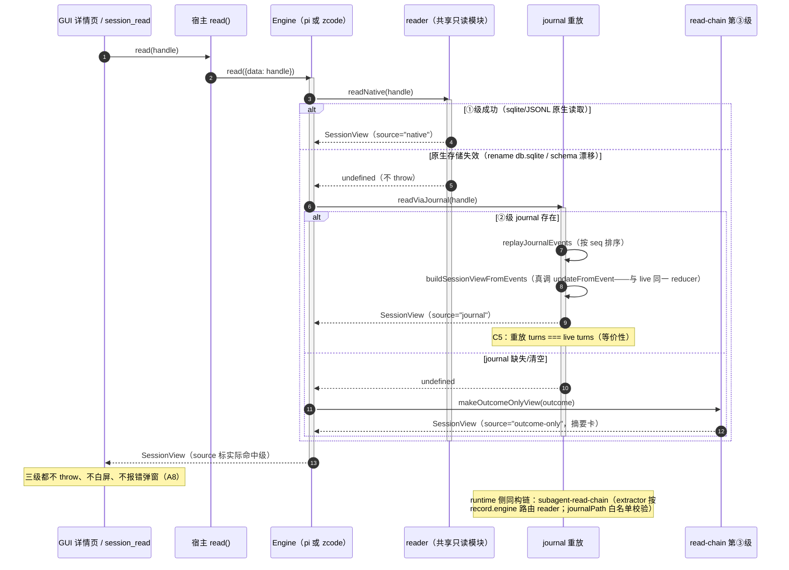
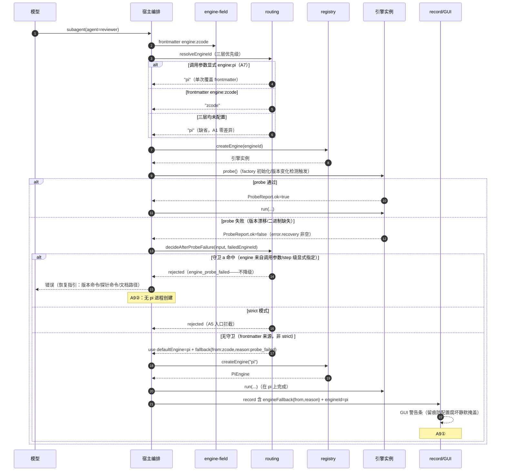

# 代码架构设计 — subagent 执行层引擎中立抽象（pi / zcode）

> 接口契约唯一权威：设计文档 [docs/architecture/subagent-engine-abstraction.md](../../docs/architecture/subagent-engine-abstraction.md) §3.3.5-§3.3.9（EnginePort 完整签名 / 中立类型字段 / handle 与 journal 格式 / adapter 四件套接口 / conformance C1-C8 / 隔离池 poolKey+refs.json）。本文按其落地为可编码的目录树 / 签名表 / 时序图 / 依赖图 / 测试矩阵，**不重新设计**——字段与签名逐条锚定设计文档，泛化/新增标注与设计文档一致。骨架验证见 §10（tsc --noEmit 零错误）。

## 1. 工程目录

### 1.1 新增目录树（骨架已落地，见 code-skeleton/）

```
extensions/universal/subagent-workflow/src/
├── execution/
│   ├── engine/                          # 引擎中立抽象根（L1-L3 + 横切）
│   │   ├── types.ts                     # L1 中立类型层：AgentTaskSpec/PersonaSpec/AgentOutcome/
│   │   │                                #   EngineHandleData/SessionView/EngineCapabilities/
│   │   │                                #   RunContext/EngineRunResult/InteractAction/InteractResult/
│   │   │                                #   ProbeReport/EngineErrorShape(11 码)/PoolContext/
│   │   │                                #   PreparedExecution/ParserTerminal/EngineProcess/
│   │   │                                #   四件套接口/JournalEntry/PoolRefs
│   │   ├── port.ts                      # L2 EnginePort（五面）+ EngineHandle（内存态）+ EngineFactory
│   │   ├── registry.ts                  # L3 注册表（id → factory）+ registerBuiltinEngines
│   │   ├── routing.ts                   # 三层优先级路由 + fallback 三守卫（纯函数）
│   │   ├── legacy-bridge.ts             # ExecuteOptions → AgentTaskSpec 映射层（A1 快照锚点）
│   │   ├── read-chain.ts                # extension 侧 read 三级降级链编排
│   │   ├── degradation/                 # 横切：公共降级层六件（引擎无关，写一次全引擎用）
│   │   │   ├── schema-emulation.ts      # ①schema 仿真（prompt 注入+三级容错+ajv，仅 emulated）
│   │   │   ├── kill-chain.ts            # ②abort 两级中断+超时杀链+终态合成（exitCode=null）
│   │   │   ├── journal.ts               # ③event journal 落盘+重放（共用 live reducer）
│   │   │   ├── persona-router.ts        # ④persona 三策略路由+argv 长度估算
│   │   │   ├── nested-guard.ts          # ⑤嵌套防护（统一 NESTED 标记+原生标记清理）
│   │   │   └── pool-manager.ts          # ⑥隔离目录池（poolKey/refs.json acquire-release）
│   │   ├── engines/
│   │   │   ├── pi/                      # pi 回填（P1，行为零变化）
│   │   │   │   ├── index.ts             #   PiEngine（EnginePort 实现）+ PI_CAPABILITIES
│   │   │   │   ├── launcher.ts          #   argv 组装（复用 buildSpawnArgs）+ spawn + wrapChildProcess
│   │   │   │   ├── parser.ts            #   rpc stdout 逐行翻译（复用 parseSpawnLine）
│   │   │   │   ├── preparer.ts          #   env 组装（schemaEnv 派生 byte 级等值）
│   │   │   │   └── reader.ts            #   JSONL 直读下沉（复用 reconstructFromFile）
│   │   │   └── zcode/                   # zcode 新增（P3，spawn 单轮）
│   │   │       ├── index.ts             #   ZcodeEngine + ZCODE_CAPABILITIES
│   │   │       ├── launcher.ts          #   node zcode.cjs --json --cwd --mode --prompt（stdin=/dev/null）
│   │   │       ├── parser.ts            #   stdout 有界收集（头4K+尾64K）→单 JSON→coarse 事件
│   │   │       ├── preparer.ts          #   隔离 HOME+config.json tmp+rename+argv 估算
│   │   │       └── reader.ts            #   sqlite session/message/part 三级 JOIN（共享只读模块）
│   │   └── conformance/                 # C1-C8 契约套件 + golden 样本库（P4）
│   │       ├── harness.ts               #   用例注册器+断言器（assertEventInvariants 等）
│   │       ├── golden.ts                #   样本/manifest 类型+loader（一处采集两处消费）
│   │       └── golden/<engineId>/<engineVersion>/   # <case>.stdout + expected.json + manifest.json
│   └── (session-runner.ts / subagent-service.ts)    # 改造点（§1.2）
├── shared/
│   └── engine-field.ts                  # agent frontmatter engine 字段解析+解析期校验（#4①）
packages/runtime/src/services/session/
└── subagent-read-chain.ts               # runtime 侧三段读取编排（#6；reader 双端复用另一端）
```

每个目录的变化轴（对齐 system-architecture §7）：

| 目录 | 职责 | 变化轴（会因为什么改） |
|------|------|------|
| engine/types.ts | 中立类型 + handle/journal 格式 | 中立类型字段演进（向下兼容追加） |
| engine/port.ts | EnginePort 签名 | 接口语义变化（目标极少——常驻兼容已预埋） |
| engine/registry.ts | id → factory | 新引擎登记（一行） |
| engine/routing.ts | 三层路由+守卫 | 路由规则 / 守卫 b 独立生效（requires 下钻） |
| engine/legacy-bridge.ts | ExecuteOptions→AgentTaskSpec | ExecuteOptions 字段演进（透传映射同步） |
| engine/degradation/ | 六件公共设施 | 降级策略调整（只改一处全引擎生效） |
| engines/pi/ | pi spawn 链回填 | pi CLI 版本漂移（rpc.md 官方契约，低频） |
| engines/zcode/ | zcode 适配 | stdout schema 漂移（只改 parser + golden 补录） |
| conformance/ | 契约用例+golden 库 | 新引擎样本 / 新不变量 |
| shared/engine-field.ts | frontmatter engine 解析 | 路由规则 |
| runtime subagent-read-chain.ts | 三段读取编排 | 新引擎 reader 登记（+tsup noExternal） |

### 1.2 现有文件改造点清单（refactor，处置明细见 §7）

| 现有文件 | 改造 | Issue |
|---------|------|-------|
| `execution/session-runner.ts` | 收口为编排壳：runSpawn 的 spawn/env/事件翻译细节下沉 engines/pi/；`buildSpawnArgs`/`applySchemaEnvToChildEnv`/`getPiInvocation` 移入 engines/pi/（原位置 re-export 保既有 import 不破）；runSpawn 改经 EnginePort 委托 | #1 |
| `execution/subagent-service.ts` | executeAndAwait/runAndFinalize 编排壳不动，spawn 段委托 EnginePort.run；probe 失败后调 routing.decideAfterProbeFailure；record entry 增补 `engine?: { id; handle }`（v2） | #1/#4 |
| `execution/types.ts` | **零改动**（AgentEvent 8 种唯一权威不动；ExecuteOptions 保留——映射层消费）；SubagentRecordEntryData 由 record-entry.ts 增补 engine 字段 | #1 |
| `shared/meta-parser.ts` + `shared/resource-meta.ts` | AgentMeta 增补 `engine?: string`（kind=agent 专属，workflow 串类 reject——typecheckMeta 纪律） | #4 |
| `packages/runtime/src/services/session/subagent-extractor.ts` | 三段化改造：自描述 entry 投影按 engine 字段路由 subagent-read-chain（①reader→②journal→③outcome）；存量无 engine 字段按 pi 投影（零迁移）。中改动单独 commit | #6 |
| `packages/runtime/` 打包 | reader 经 workspace 依赖引入 → tsup.config.ts `noExternal` 登记 + `validate-runtime-bundle.sh` 验证双 bundle | #7 |
| `packages/shared/src/constants.ts` | **核验结论：无需改动**——`ENV_WHITELIST_PREFIXES` 已含 `'XYZ_'` 前缀，`XYZ_AGENT_SUBAGENT` 自动覆盖（zcode 侧只覆 HOME，HOME 已在白名单） | #7 |

## 2. 包依赖图



**import 规则（禁止方向，AC-1/AC-2 机器检查项）**：

1. **上层不得 import `engines/<id>/` 具体件**：interface/orchestration/execution（engine/ 之外）只经 registry + EnginePort 消费。例外两个：registry.ts（登记）与 conformance/（被测对象直引）。
2. **runtime 只许 import reader + 中立制品**：`packages/runtime` 禁止 import `execution/engine/port`、`EnginePort` 实例、`engines/<id>/{launcher,preparer,parser}`；唯一通道是 `engines/<id>/reader.ts`（无状态纯函数）与 record/journal 类型。
3. **degradation 引擎无关**：六件不得 import `engines/*`（反向才合法：engines → degradation）。
4. **AgentEvent 唯一权威**：engine 层与公共层只 re-export `execution/types.ts` 的 AgentEvent，不复制第二份定义（AC-4）。
5. **engines/\* 不 import orchestration/interface**（引擎是被编排方）。
6. **循环依赖检测点**：engines/pi → @real session-runner（回填期过渡接线）；实现期 buildSpawnArgs 等移入 engines/pi/ 后此边消失——迁移方向单调，无环。

## 3. API 契约（签名表）

> 全部签名从设计文档 §3.3.5-§3.3.7 逐字段落地。**接线层级**标注：〔模块内直调〕= 同模块函数调用；〔跨模块 port〕= 经 EnginePort/微接口；〔adapter 真引 SDK〕= 真引 node:child_process / node:fs / ajv / 真实源码函数。

### 3.1 模块: engine/types.ts（L1 中立类型）

#### 类: AgentTaskSpec（= ExecuteOptions 泛化，15 字段）

| 字段 | 签名 | 来源标注 | 边界条件 | Spec 关联 |
|------|------|---------|---------|----------|
| task | `task: string` | 原样 | — | §3.3.5 |
| slug | `slug: string` | 原样 | ≤35 字符 | §3.3.5 |
| agent | `agent?: string` | 原样 | resolveIdentity 的 agent ref | §3.3.5 |
| model | `model?: string` | 原样 | 引擎 provider 体系内解释（D9②） | §3.3.5 |
| effort | `effort?: string` | **泛化①**（原 thinkingLevel，pi 7 档剥离） | 引擎各自映射或忽略 | §3.3.5 |
| persona | `persona?: PersonaSpec` | **泛化②**（原 skillPath+appendSystemPrompt 收拢） | 三策略路由分流 | §3.3.5 |
| schema | `schema?: Record<string, unknown>` | 原样 | native/emulated 硬分流依据（D4） | §3.3.5 |
| maxTurns / graceTurns | `maxTurns?: number; graceTurns?: number` | 原样 | — | §3.3.5 |
| fork | `fork?: boolean` | 原样 | pi 专属；他引擎 prepare 期按 capabilities 拒绝 | §3.3.5 |
| worktree | `worktree?: boolean \| WorktreeHandle` | 原样 | 公共层职责非引擎职责 | §3.3.5 |
| cwd | `cwd?: string` | 原样 | — | §3.3.5 |
| conversation / idleTimeoutMs | `conversation?: boolean; idleTimeoutMs?: number` | 原样 | interact 控制面的 task 标志（D1） | §3.3.5 |
| denyTools | `denyTools?: string[]` | **新增** | 中立工具 denylist | §3.3.5 |
| permissionMode | `permissionMode?: string` | **新增** | 映射按 capabilities.permissionMode | §3.3.5 |

`PersonaSpec { agentRef?: string; skillPath?: string; appendSystemPrompt?: string[] }`——泛化②的载体。

#### 类: AgentOutcome（锚定 orchestration AgentResult，12 字段）

| 字段 | 签名 | 来源标注 | 边界条件 | Spec 关联 |
|------|------|---------|---------|----------|
| content | `content: string` | 原样 | — | §3.3.5 |
| parsedOutput | `parsedOutput?: unknown` | 原样 | native 直传 / 仿真 ajv 产出（硬分流） | §3.3.5 |
| usage | `usage?: OrchestrationAgentUsage` | 原样 | orchestration 版形状（input/output/cacheRead/cacheWrite/cost/contextTokens/turns） | §3.3.5 |
| durationMs | `durationMs?: number` | 原样 | — | §3.3.5 |
| error | `error?: string` | 原样 | 错误码前缀格式 §3.3.3 | §3.3.5 |
| sessionId / sessionFile / worktreePath | 三字段可选 | 原样 | worktreePath 仅诊断 | §3.3.5 |
| toolCalls | `toolCalls?: ToolCallEntry[]` | 原样 | — | §3.3.5 |
| engineId | `engineId: string` | **新增** | 实际执行引擎（fallback 后可能 ≠ 请求值） | §3.3.5 |
| engineFallback | `engineFallback?: { from: string; reason: string }` | **新增** | 非错误留痕，GUI 警告条数据源 | §3.3.5 |
| exitCode | `exitCode?: number \| null` | **新增** | null = 被信号杀死（杀链判据） | §3.3.5 |

消歧（D2）：orchestration `AgentResult` 与 execution `AgentResult`（record 内部投影）均保持原名不动；引擎层终态命名 `AgentOutcome`。

#### 类: 其余中立类型（逐字段=设计文档，骨架 types.ts 已固化）

| 类型 | 关键签名 | 边界条件 | Spec |
|------|---------|---------|------|
| RunContext | `taskId: string; poolKey: string; signal?: AbortSignal; onEvent?: (ev: AgentEvent) => void; ctxModel?: ModelInfo` | taskId=record.id（journal 名与 refs key）；signal 是 abort 分级入口 | §3.3.5 |
| EngineRunResult | `handle: EngineHandleData; outcome: AgentOutcome` | 失败终态也返回 handle（journal 定位） | §3.3.5 |
| InteractAction | `{kind:"message";payload:string} \| {kind:"close";payload?:{force:boolean}} \| {kind:"cancel"}` | pi chatMode 直通（BC-7） | §3.3.5 |
| InteractResult | `{ok:true;delivered:true} \| {ok:false;code:EngineErrorCode;message:string}` | 死 handle → engine_session_not_resumable | §3.3.5 |
| ProbeReport | `ok: boolean; engineVersion: string; checks: Array<{name;ok;detail?}>; error?: {code;recovery}` | ok=false 时 recovery 必非空 | §3.3.5 |
| EngineCapabilities | 十维：schemaEnforcement/steer/conversation/personaInjection/eventGranularity/sandbox/sessionRead/resume/interrupt/permissionMode | 口径=链路接通能力（D3）；同步无副作用 | §3.3.5-D3 |
| EngineHandleData | `v:1; engineId; sessionRef: Record<string,string>; poolKey; journalPath; engineVersion?; adapterVersion` | 不透明三条（D1）；v1 record 缺省按 pi 投影 | §3.3.6 |
| SessionView | `engineId; sessionId?; turns: ReplayedTurn[]; usage?; source: "native"\|"journal"\|"outcome-only"` | 三级都不 throw；source 标降级级 | §3.3.6 |
| ReplayedTurn | `text; thinking; toolCalls: ToolCall[]; closed: true` | 无内部态（_status/startedTs 剥离） | §3.3.6 |
| JournalEntry | `{v:1; ts; taskId; engineId; seq; event: AgentEvent}` | event 原样无二次变换；seq 单调（重放顺序权威） | §3.3.6 |
| PoolRefs | `{v:1; refs: Record<taskId, {taskId; ts}>}` | refs.json v1 | §3.3.9 |
| EngineErrorShape | `code: EngineErrorCode(11 枚举); message; recovery; stdoutTail?` | 每码配恢复指引（§3.3.3） | §3.3.3 |

### 3.2 模块: engine/port.ts（L2 唯一契约点）

#### 接口: EnginePort（五面）

| 方法 | 签名 | 返回 | 边界条件 | Spec/Issue |
|------|------|------|---------|------------|
| id | `readonly id: string` | — | 注册表 key | §3.3.5 |
| capabilities | `capabilities(): EngineCapabilities` | EngineCapabilities | 同步无副作用（调用前拒绝判据） | D3/#4 |
| probe | `probe(opts?: {force?: boolean}): Promise<ProbeReport>` | ProbeReport | factory 初始化+版本变化检测触发；不调 LLM | D7/#4 |
| run | `run(task: AgentTaskSpec, ctx: RunContext): Promise<EngineRunResult>` | handle+outcome | 错误语义三条（prepare 前置 reject / 运行中不 reject 合成终态 / abort 同②） | D1/#1 |
| interact | `interact(handle: EngineHandle, action: InteractAction): Promise<InteractResult>` | InteractResult | unsupported 同步拒绝；死 handle → not_resumable | D1/#1/#4 |
| read | `read(handle: EngineHandle): Promise<SessionView>` | SessionView | 三级降级链都不 throw | D6/#3/#6 |

配套：`EngineHandle { data: EngineHandleData; engine: EnginePort }`（内存态）；`EngineFactory = (deps: EngineDeps) => EnginePort`；`EngineDeps { poolManager: PoolManager; createJournalWriter }`（宿主注入公共设施）。

### 3.3 模块: engine/registry.ts + routing.ts + legacy-bridge.ts + read-chain.ts

| 函数/类 | 签名 | 返回 | 边界条件 | Issue |
|---------|------|------|---------|-------|
| registerEngine | `(id: string, factory: EngineFactory) => void` | — | 新引擎一行登记 | #1 |
| createEngine | `(id: string, deps: EngineDeps) => EnginePort`〔模块内直调 factory〕 | EnginePort | 未注册 throw engine_not_found | #1 |
| listEngineIds | `() => string[]` | — | 解析期校验数据源 | #4 |
| notFoundError | `(id, knownIds) => EngineErrorShape` | — | 恢复指引指向注册表清单+配置路径 | #4 |
| resolveEngineId | `(input: EngineRoutingInput) => string` | engineId | 三层：explicit ?? agent ?? default(缺省 pi)〔纯函数〕 | #4 |
| decideAfterProbeFailure | `(input, failedEngineId) => EngineRoutingDecision` | use+fallback / rejected | 三守卫（a 显式指定；b 首期合流 a；c 编排层 prepare 期）+ strict 全拒 | #4 |
| toAgentTaskSpec | `(opts: ExecuteOptions) => AgentTaskSpec` | AgentTaskSpec | 泛化 5 处逐字段透传；A1 快照锚点 | #1 |
| toRunContext | `(opts, taskId, poolKey, onEvent?) => RunContext` | RunContext | signal/ctxModel 剥离自任务声明 | #1 |
| readSessionView | `(engine, handleData, outcome) => Promise<SessionView>`〔跨模块 port：真调 engine.read〕 | SessionView | ①②级在 engine.read 内；③级兜底 | #3/#6 |
| makeOutcomeOnlyView | `(source: OutcomeOnlySource) => SessionView` | SessionView | 第③级摘要卡（不白屏） | #3 |

### 3.4 模块: engine/degradation/（公共降级层六件）

| 件 | 关键签名 | 边界条件 | Issue |
|----|---------|---------|-------|
| ① schema-emulation | `buildSchemaEmulationPrompt(schema): string`；`extractJsonLenient(text): {ok:true;json} \| {ok:false;reason}`；`emulateStructuredOutput(rawOutput, schema): Promise<{ok:true;parsedOutput} \| {ok:false;error}>`〔adapter 真引 ajv〕；`augmentPersonaWithSchemaEmulation(task): AgentTaskSpec` | 仅 emulated 引擎；三级容错+重试一次；失败=schema_emulation_failed 含尾部；native 零介入（AC-3） | #2 |
| ② kill-chain | `abortWithChain({proc, graceMs, tryNative?}): Promise<KillChainResult>`〔模块内直调 proc.abort〕；`synthesizeTimeoutOutcome(...): AgentOutcome`；`synthesizeAbortedOutcome(...): AgentOutcome`；`isKilledOutcome(outcome): boolean` | 两级：tryNative 优先 → proc.abort（SIGTERM→grace→SIGKILL）；exitCode=null+杀链标记 | #2 |
| ③ journal | `journalPathFor(enginesRoot, engineId, poolKey, taskId): string`；`EventJournalWriter { append(taskId, event); flush(); close() }`〔adapter 真引 node:fs/promises〕；`replayJournalEvents(path): Promise<AgentEvent[] \| undefined>`；`buildSessionViewFromEvents(engineId, events, createRecord): SessionView`〔模块内直调真实 updateFromEvent reducer〕 | 有界缓冲+批量 flush+终态 fsync；重放与 live 共用同一 reducer（C5 等价性构造） | #2/#6 |
| ④ persona-router | `routePersona(persona, capabilities): PersonaChannel \| undefined`；`estimateArgvBytes(argv): number` | file/flag/prompt 三策略；argv 估算前置拦截 | #2 |
| ⑤ nested-guard | `markNestedEnv(env): void`；`detectNestedSpawn(env): EngineErrorShape \| undefined`；`stripEngineNativeNestedMarks(env): void` | XYZ_AGENT_SUBAGENT 统一标记；PI_SUBAGENT_*/ZSW_NESTED/CLAUDECODE 原生标记清理 | #2 |
| ⑥ pool-manager | `computePoolKey(agent?): string`；`PI_POOL_KEY = "shared"`；`PoolManager { constructor(enginesRoot); acquire(engineId, poolKey, taskId): Promise<PoolContext>; release(engineId, poolKey, taskId); sweepEnginePools(engineId) }`〔adapter 真引 node:fs/promises，refs.json tmp+rename 原子写〕 | 宿主唯一写者（进程内互斥）；计数归零删池（journal 除外）；失败置 .cleanup-failed | #2 |

### 3.5 模块: engines/pi/（四件套，回填）

| 件 | 签名 | 接线层级 | Issue |
|----|------|---------|-------|
| PiEngine | `implements EnginePort`；`PI_CAPABILITIES`（schemaEnforcement native / steer **unsupported**（链路未接通）/ conversation native / personaInjection flag / eventGranularity stream / sandbox emulated / sessionRead full / resume native / interrupt native / permissionMode native）；run 接线链 prepare→launch→consume→makeHandle/makeOutcome | 〔跨模块 port〕四件套真调 | #1 |
| PiLauncher | `launch(prepared, task): Promise<EngineProcess>`〔adapter 真引 node:child_process spawn + 真实 buildSpawnArgs/getPiInvocation〕；`wrapChildProcess(child): EngineProcess`（复用于 zcode） | argv 与现有 spawn 链零漂移（A1） | #1 |
| PiParser | `consume(proc, emit, signal?): Promise<ParserTerminal>`〔adapter 真引真实 parseSpawnLine〕；stdin 协议实现期复用 sendPromptCommand | 事件先发终态后返；reject 仅限自身实现错误 | #1 |
| PiPreparer | `prepare(task, pool): Promise<PreparedExecution>`〔模块内直调 nested-guard + 真实 applySchemaEnvToChildEnv（BC-3 byte 级等值）〕 | poolKey 恒 shared；argv 估算恒 0（stdin 通道） | #1 |
| PiReader | `readNative(handle): Promise<SessionView \| undefined>`〔adapter 真引真实 reconstructFromFile〕 | 失败 undefined 不 throw；行为=现有直读（BC-5） | #1/#6 |

### 3.6 模块: engines/zcode/（四件套，新增）

| 件 | 签名 | 边界条件 | Issue |
|----|------|---------|-------|
| ZcodeEngine | `implements EnginePort`；`ZCODE_CAPABILITIES`（schemaEnforcement **emulated** / steer unsupported / conversation unsupported / personaInjection prompt / eventGranularity **coarse** / sandbox emulated / sessionRead partial / resume cold / interrupt **kill-only** / permissionMode native）；abort 直走 abortWithChain（无 tryNative） | interact 返回 engine_capability_unsupported（同步拒绝不创建进程） | #3 |
| ZcodeLauncher | `launch(prepared, task): Promise<EngineProcess>`〔adapter 真引 spawn；stdio "ignore" → stdin null〕 | argv：--json --cwd --mode --disallowed-tools --prompt | #3 |
| ZcodeParser | `consume(proc, emit, signal?): Promise<ParserTerminal>`；`ZcodeRunOutput { sessionId; response; usage?; dbPath }`（字段名以实录为准） | 有界收集头4K+尾64K；合成 message_end+turn_end（coarse 不变量③） | #3 |
| ZcodePreparer | `prepare(task, pool): Promise<PreparedExecution>`〔模块内直调 routePersona+estimateArgvBytes+markNestedEnv；真引 fs 原子写 config〕 | 三前置错误：credential_missing / model_not_available / prompt_too_large（实现期接线 throw） | #3 |
| ZcodeReader | `readNative(handle): Promise<SessionView \| undefined>` | sqlite 三级 JOIN；失败 undefined→②级（驱动选型=待实证项②，骨架不真引——§10 例外说明） | #3/#6 |

### 3.7 模块: conformance/ + shared/engine-field.ts + runtime subagent-read-chain.ts

| 项 | 签名 | Issue |
|----|------|-------|
| ConformanceCaseId | `"C1"\|…"C8"`（probe 形状/run 简单任务/事件不变量/abort/read 降级链/schema 分流/嵌套防护/prepare 前置错误） | #5 |
| assertEventInvariants | `(events, outcomeContent) => {ok; violated[]}`（五条逐一） | #5 |
| assertParserReplay | `(sample, actual) => {ok; diff?}`（golden 回放断言） | #5 |
| runConformanceSuite | `(engine, cases, goldenRoot, liveGate) => Promise<ConformanceReport>`〔模块内直调 case.run〕；live 用例按 ENGINE_CONFORMANCE_LIVE=1 门 | #5 |
| loadGoldenSamples | `(rootDir, engineId, engineVersion) => Promise<GoldenSample[]>`（stdout+expected.json+manifest） | #5 |
| parseEngineFieldValue | `(v: unknown) => string \| undefined`（frontmatter 值守卫） | #4 |
| validateEngineIdOrThrow | `(id, registeredIds) => void`（解析期 engine_not_found 前置） | #4 |
| resolveSubagentSessionView | `(engineField?, outcome, dataDir) => Promise<SessionView>`〔跨模块：reader 路由表直引〕（runtime 侧三段编排） | #6 |
| isJournalPathAllowed | `(journalPath, dataDir) => boolean`（前缀白名单 + `..` 拒绝；dataDir 动态推导） | #6/#7 |

## 4. 功能代码链路（时序图）

### 功能 1: pi 引擎回填路径（现有行为零变化，UC-2 / A1）

#### 时序图



#### 方法签名表

| 类 | 方法 | 签名 | 返回 | 边界条件 | Spec/Issue 关联 |
|----|------|------|------|---------|----------------|
| SubagentService | executeAndAwait | `(opts, signal?, onEvent?, stream?) → Promise<WorkflowAgentResult>` | 编排壳不动 | spawn 段委托 EnginePort | #1 |
| legacy-bridge | toAgentTaskSpec | `(opts: ExecuteOptions) → AgentTaskSpec` | 泛化 5 处透传 | thinkingLevel→effort；schemaEnv 内化 | #1 |
| PiEngine | run | `(task, ctx) → Promise<EngineRunResult>` | handle+outcome | 错误语义三条 | #1 |
| PiLauncher | launch | `(prepared, task) → Promise<EngineProcess>` | spawn 产物 | argv 复用 buildSpawnArgs | #1 |
| PiParser | consume | `(proc, emit, signal?) → Promise<ParserTerminal>` | 终态 | 事件先发终态后返 | #1 |

#### 数据流链
executeAndAwait → toAgentTaskSpec/toRunContext → resolveEngineId("pi") → createEngine → PiEngine.run → [prepare(env) → launch(spawn rpc) → consume(stdin JSONL→AgentEvent) → journal append] → outcome → appendEntry

#### 关联
- requirements.md: UC-2（AC-2.1/2.3）
- issues.md: #1 方案 A
- BC：BC-1/BC-3/BC-4/BC-8 全部挂本链路

### 功能 2: zcode reviewer@zcode 全链路（UC-1/2/3 / A2/A3，设计文档 §3.3.4）

#### 时序图



#### 方法签名表

| 类 | 方法 | 签名 | 返回 | 边界条件 | Spec/Issue 关联 |
|----|------|------|------|---------|----------------|
| engine-field | validateEngineIdOrThrow | `(id, registeredIds) → void` | — | 解析期前置（AC-1.3） | #4 |
| routing | resolveEngineId | `(input) → string` | engineId | 三层优先级 | #4 |
| ZcodeEngine | run | `(task, ctx) → Promise<EngineRunResult>` | — | abort 直走杀链（kill-only） | #3 |
| ZcodePreparer | prepare | `(task, pool) → Promise<PreparedExecution>` | — | 三前置错误先于进程 | #3 |
| ZcodeParser | consume | `(proc, emit, signal?) → Promise<ParserTerminal>` | — | coarse 事件合成 | #3 |
| schema-emulation | emulateStructuredOutput | `(raw, schema) → {ok…}` | parsedOutput | 失败=schema_emulation_failed | #2/#3 |

#### 数据流链
subagent 工具 → engine-field 解析 → resolveEngineId → createEngine → augmentPersonaWithSchemaEmulation → ZcodeEngine.run → [acquire 池 → prepare（隔离 HOME/config/argv 估算）→ launch（argv spawn）→ consume（单 JSON→coarse 事件→journal）→ emulateStructuredOutput] → appendEntry → 工具返回

#### 关联
- requirements.md: UC-1（AC-1.1/1.3）、UC-2（AC-2.2/2.4）、UC-3（AC-3.1~3.5）
- issues.md: #3 方案 A、#4 方案 A
- 验收：A2/A3/A6/A7

### 功能 3: abort 两级中断（zcode 杀链，UC-5 / A10）

#### 时序图



#### 方法签名表

| 类 | 方法 | 签名 | 返回 | 边界条件 | Spec/Issue 关联 |
|----|------|------|------|---------|----------------|
| kill-chain | abortWithChain | `({proc, graceMs, tryNative?}) → Promise<KillChainResult>` | 杀链结果 | tryNative 成功即返回；否则 proc.abort | #2 |
| EngineProcess | abort | `(graceMs: number) → Promise<void>` | — | 杀链执行体（SIGTERM→grace→SIGKILL） | §3.3.7 |
| kill-chain | synthesizeAbortedOutcome | `({engineId, kill, durationMs}) → AgentOutcome` | 合成终态 | exitCode=null+杀链标记（AC-5.3） | #2 |
| kill-chain | synthesizeTimeoutOutcome | `({engineId, stdoutTail, durationMs}) → AgentOutcome` | engine_timeout | 尾 2000 字+重跑建议（AC-5.4） | #2 |

#### 数据流链
AbortSignal → abortWithChain（tryNative? → proc.abort → SIGKILL 兜底）→ KillChainResult → synthesize 终态 → record 收尾

#### 关联
- requirements.md: UC-5（AC-5.1~5.4）
- issues.md: #2；设计文档 D1 abort 分级

### 功能 4: read 三级降级链（UC-6 / A8）

#### 时序图



#### 方法签名表

| 类 | 方法 | 签名 | 返回 | 边界条件 | Spec/Issue 关联 |
|----|------|------|------|---------|----------------|
| PiReader/ZcodeReader | readNative | `(handle: EngineHandleData) → Promise<SessionView \| undefined>` | ①级 | 失败 undefined 不 throw | #1/#3/#6 |
| journal | readViaJournal | `(handle) → Promise<SessionView \| undefined>` | ②级 | handle.journalPath 自描述 | #2 |
| read-chain | makeOutcomeOnlyView | `(source: OutcomeOnlySource) → SessionView` | ③级 | 摘要卡兜底 | #3 |
| subagent-read-chain | resolveSubagentSessionView | `(engineField?, outcome, dataDir) → Promise<SessionView>` | runtime 三段 | 无 engine 字段按 pi 投影（BC-6） | #6 |
| subagent-read-chain | isJournalPathAllowed | `(journalPath, dataDir) → boolean` | 白名单 | 前缀 + .. 拒绝（AC-5） | #6/#7 |

#### 数据流链
read(handle) → reader.readNative（①）→ readViaJournal（②，replayJournalEvents→buildSessionViewFromEvents→updateFromEvent）→ makeOutcomeOnlyView（③）→ SessionView(source)

#### 关联
- requirements.md: UC-6（AC-6.1~6.5）
- issues.md: #1/#3（reader）、#6（runtime 链）；设计文档 D6/§3.3.6

### 功能 5: fallback 路由（三守卫判定，UC-1/UC-4 / A5/A9）

#### 时序图



#### 方法签名表

| 类 | 方法 | 签名 | 返回 | 边界条件 | Spec/Issue 关联 |
|----|------|------|------|---------|----------------|
| routing | resolveEngineId | `(input: EngineRoutingInput) → string` | engineId | explicit ?? agent ?? default | #4/D9 |
| routing | decideAfterProbeFailure | `(input, failedEngineId) → EngineRoutingDecision` | use+fallback / rejected | 守卫 a/b（首期合流）+ strict；守卫 c 在 prepare 期 | #4 |
| EnginePort | probe | `(opts?) → Promise<ProbeReport>` | 探针报告 | ok=false → recovery 非空（C1） | #4/D7 |

#### 数据流链
frontmatter/参数 → resolveEngineId → createEngine → probe →（失败）decideAfterProbeFailure →（守卫 hit：rejected / 无守卫：default pi + engineFallback 留痕 → GUI 警告条）

#### 关联
- requirements.md: UC-1（AC-1.1~1.4）、UC-4（AC-4.1~4.3）
- issues.md: #4 方案 A；设计文档 D9①/D7

## 5. Deep Module 设计决策

### 模块: EnginePort（execution/engine/port.ts）
- **Interface**: 五方法（run/interact/read/probe/capabilities）+ 中立类型入参出参
- **Depth**: deletion test——删掉后 6 引擎的 spawn 协议/事件格式/隔离手段/能力缺陷全部在 subagent-service 的 N 个调用点重现（复杂度爆炸）；现状这些差异全部藏在 run/interact/read 后面，caller 每学 5 个方法行使全部引擎能力。深模块成立
- **Seam**: execution 层内部 seam；adapter = 2（PiEngine 回填 / ZcodeEngine 新增）+ 预留 4 接入位——两个 adapter 即真 seam
- **Port 决策**: True external（引擎 CLI 不可控）→ 要 port；测试策略 mock adapter（conformance golden 回放层）+ 真实 run 层手动门

### 模块: degradation/（公共降级层六件）
- **Interface**: 每件 2-4 个入口函数
- **Depth**: deletion test——删掉 schema-emulation，4/6 引擎各写一份有差异的仿真（D4 证据：缺失能力清单高度重合）；删掉 kill-chain，6/6 引擎全部无超时兜底。公共层是「写一次全引擎复用」的结构性来源
- **Seam**: 引擎无关横切层（不是 seam——是共享 implementation）；engines → degradation 单向
- **Port 决策**: In-process/Local-substitutable 混合 → 不需要 port（直接函数/类消费；journal/pool 用 node:fs 真实现 + vitest tmpdir 测）

### 模块: journal（degradation/journal.ts）
- **Interface**: `EventJournalWriter.append/flush/close` + `replayJournalEvents` + `buildSessionViewFromEvents`
- **Depth**: 小 interface（4 入口）大 implementation（有界缓冲/seq 单调/fsync 纪律/重放 reducer 复用）；caller 无需知道格式版本与 flush 策略
- **Seam**: 落盘格式 v1 演进只改此模块；重放等价性由「共用 updateFromEvent」构造性保证（C5），不是靠测试维持的巧合

### 模块: registry + routing（浅但有登记价值）
- **Interface**: registerEngine/createEngine/listEngineIds + resolveEngineId/decideAfterProbeFailure
- **Depth**: 浅模块——但这是刻意的：新引擎接入成本 = 一行登记 + 纯函数路由可穷举测试。deletion test：删掉 registry，引擎 id 分支散落各调用点（AC-1 反模式复活）。Locality 是其存在理由
- **Port 决策**: In-process → 不需要 port

### 模块: reader（engines/<id>/reader.ts）
- **Interface**: 单方法 `readNative(handle) → SessionView | undefined`
- **Depth**: 单方法接口 + 各引擎全量解析实现（pi JSONL / zcode sqlite JOIN）；undefined 语义（不 throw）让降级链编排收敛在宿主一处
- **Seam**: 双端复用 seam（extension read() / runtime GUI 历史链路两个消费端）——两个消费者即真 seam；无状态纯函数纪律是双端复用的前提（一旦需要进程依赖必须拆分并重评打包）

## 6. 测试矩阵（Test Matrix）— [MANDATORY]

### 来源 0：既有测试复用（回填期行为零变化的机器守护）

| 既有测试 | 守护对象 | BC/锚点 |
|---------|---------|---------|
| `execution/__tests__/session-runner.test.ts` + `run-spawn-*.test.ts`（8 个） | runSpawn 编排回归（收口改造后不改断言即转绿） | BC-4/A1 |
| `execution/__tests__/session-runner-schema-env.test.ts` | schemaEnv 派生 byte 级等值（launcher 从 task.schema 派生） | BC-3/A1③ |
| `execution/__tests__/spawn-event-adapter*.test.ts`（2 个） | pi 事件翻译回归（parser 下沉零漂移） | BC-8/A1 |
| `execution/__tests__/execute-options-mapper.test.ts` | 映射层既有形态（toAgentTaskSpec 扩展基线） | A1 |
| `execution/__tests__/subagent-service*.test.ts`（4 个） | 编排壳回归（executeAndAwait/runAndFinalize 收口） | BC-1/BC-7 |
| `execution/__tests__/session-reconstructor.test.ts` | pi reader 下沉行为不变 | BC-5 |
| `shared/__tests__/meta-parser.test.ts` | frontmatter 解析基线（engine 字段扩展不破坏既有） | #4 |
| `packages/runtime/src/__tests__/subagent-extractor-*.test.ts`（2 个） | runtime 提取回归（三段化改造后存量行为不变） | BC-5/BC-6 |
| `execution/__tests__/nested-visibility*.test.ts`（3 个） | 嵌套标记既有语义（nested-guard 不破坏） | D8 |

### 来源 A：功能用例（按 UC 归类，从 §4 时序图 alt/else 枚举）

> layer 四选一：unit / integration / e2e / perf-chaos。dependsOn 为用例 ID；parallelGroup 同组内串行、组间并行（按被测模块划分）。`[需 zcode 真实环境]` = real 依赖标注，无环境时不可省略条目、标注待环境执行。

#### UC-1: 引擎路由配置切换（关联 §4.5 时序图）

| 用例 ID | 类型 | layer | 场景 | 输入 | 预期 | dependsOn | parallelGroup | 关联 AC/A |
|---------|------|-------|------|------|------|-----------|---------------|-----------|
| T1.1 | 正常 | unit | 三层优先级 resolveEngineId | explicit=pi / agent=zcode / default=pi 组合 | 依次返回 pi/zcode/pi | — | routing | AC-1.1 |
| T1.2 | 边界 | unit | 三层均未配置缺省 | 全空输入 | "pi"（A1 零差异默认） | — | routing | AC-1.4/A1 |
| T1.3 | 异常 | unit | 未注册 engine id 解析期拒绝 | frontmatter engine:unknown-eng | engine_not_found + 恢复指引（注册表清单+配置路径） | — | routing | AC-1.3 |
| T1.4 | 正常 | integration | 单次调用覆盖 frontmatter（mock spawn） | reviewer(zcode) + 参数 engine:pi | 跑 pi；zcode 隔离目录无新增 session | T1.1 | engine-route | AC-1.1/A7 |
| T1.5 | 正常 | e2e | 混编 workflow 双引擎 `[需 zcode 真实环境]` | 前两步默认 pi + 第三步 engine:zcode | 两引擎 record 结构一致；workflow 汇总正常；GUI 无引擎字段泄漏 | T1.4 | e2e-mixed | AC-1.2/A6 |
| T1.6 | 状态 | unit | record.engineId 一致性（fallback 后） | probe 失败 fallback 场景 outcome | engineId=实际引擎（可能≠请求值）+ engineFallback 投影 | T4.2 | routing | UC-1 后置 |

#### UC-2: 引擎中立派发（关联 §4.1/§4.2 时序图）

| 用例 ID | 类型 | layer | 场景 | 输入 | 预期 | dependsOn | parallelGroup | 关联 AC/A |
|---------|------|-------|------|------|------|-----------|---------------|-----------|
| T2.1 | 正常 | unit | toAgentTaskSpec 映射 5 泛化点 | 全字段 ExecuteOptions | effort/persona/schema/新增通道逐字段断言；signal/ctxModel 剥离到 RunContext | — | bridge | — |
| T2.2 | 状态 | unit | pi 回填 record 快照等值 | mock spawn 同任务跑映射前后链路 | record entry JSON 字段级 diff 一致 | T2.1 | bridge | AC-2.1/A1① |
| T2.3 | 正常 | e2e | pi 缺省引擎 GUI 基线 | engine 缺省 subagent + 多步 workflow | 全量测试绿 + GUI 三视图截图基线一致（对话流/工具面板/record 详情） | T2.2 | e2e-mixed | AC-2.1/A1② |
| T2.4 | 正常 | integration | reviewer@zcode 真实任务 `[需 zcode 真实环境+凭据]` | A2 场景任务+schema | db.sqlite 新 session；parsedOutput ajv 过；GUI 粗粒度正常 | T1.4, T3.2 | engine-zcode | AC-2.2/A2 |
| T2.5 | 异常 | unit | prepare 期三前置错误（进程创建前） | 凭据缺失/未知 model/argv 超限构造 | 分别 reject credential_missing/model_not_available/prompt_too_large；spawn 未被调 | — | engine-zcode | AC-2.3 |
| T2.6 | 正常 | unit | pi 事件不变量（流式） | golden 样本回放 PiParser | text_delta 拼接===content（byte 级）；tool 配对；终态序唯一 | — | conformance | AC-2.1/C3 |

#### UC-3: schema 仿真降级（关联 §4.2 时序图）

| 用例 ID | 类型 | layer | 场景 | 输入 | 预期 | dependsOn | parallelGroup | 关联 AC/A |
|---------|------|-------|------|------|------|-----------|---------------|-----------|
| T3.1 | 正常 | unit | 三级容错各自命中 | 纯 JSON / json 代码块 / 前后噪声文本 | 依次命中①②③级提取 | — | emulation | — |
| T3.2 | 正常 | unit | 仿真产出与 native 同形 | 合法 schema 输出 | emulateStructuredOutput ok + parsedOutput ajv 通过 | T3.1 | emulation | AC-3.1 |
| T3.3 | 异常 | unit | 三级容错+重试一次仍不过 | 非法输出两轮 | schema_emulation_failed + 原始输出尾部 | T3.2 | emulation | AC-3.4/C6 |
| T3.4 | 边界 | unit | native/emulated 硬分流 | pi 路径 schema 任务 | pi env 注入 byte 级等值 + native 路径无 ajv（+ AC-3 grep 机器检查） | — | emulation | AC-3.3/3.5/C6 |
| T3.5 | 状态 | integration | 仿真降级常驻标记 | zcode 引擎配置处 | 「schema 为仿真降级」调用前可见（非运行时报错） | T2.4 | engine-zcode | AC-3.2/A3 |

#### UC-4: 探针拦截、fallback 守卫与运行中兜底（关联 §4.5/§4.2 时序图）

| 用例 ID | 类型 | layer | 场景 | 输入 | 预期 | dependsOn | parallelGroup | 关联 AC/A |
|---------|------|-------|------|------|------|-----------|---------------|-----------|
| T4.1 | 正常 | unit | ProbeReport 形状（C1） | 各引擎 probe 返回 | 字段完整；ok=false 时 error.recovery 非空 | — | conformance | C1 |
| T4.2 | 异常 | unit | 无守卫 fallback | frontmatter 来源 probe 失败（mock） | 路由回 pi + fallback{from:zcode,reason:probe_failed} 留痕 | T1.1 | routing | AC-4.1/A9① |
| T4.3 | 异常 | unit | 守卫 a 命中不降级 | 显式 engine:zcode + probe 失败 | rejected engine_probe_failed；无 pi 进程创建 | T4.2 | routing | AC-4.2/A9② |
| T4.4 | 异常 | unit | strict 模式入口拦截 | strict=true + 版本漂移 mock | 入口即 engine_probe_failed + 恢复指引（版本命令/探针命令/文档路径） | T4.3 | routing | AC-4.3/A5 |
| T4.5 | 异常 | unit | 守卫 c model 不可解析 | 显式 model 默认引擎不可解释 | model_not_available + 可用模型清单；不静默换引擎 | T2.5 | routing | AC-4.5 |
| T4.6 | 异常 | integration | 运行中失败兜底 | 喂 golden 外新格式 stdout（损坏 parser） | engine_run_failed 结构化（尾部+exitCode+恢复指引）；record 收尾；无僵尸；样本补录 golden | T2.4 | engine-zcode | AC-4.4/A14 |
| T4.7 | 状态 | unit | 版本变化检测触发 probe | 引擎版本变更 mock | factory 初始化/版本变化时 probe 被调 | T4.1 | routing | UC-4 前置 |

#### UC-5: abort 两级中断（关联 §4.3 时序图）

| 用例 ID | 类型 | layer | 场景 | 输入 | 预期 | dependsOn | parallelGroup | 关联 AC/A |
|---------|------|-------|------|------|------|-----------|---------------|-----------|
| T5.1 | 正常 | unit | tryNative 成功不走杀链（pi） | mock tryNative=true | forceKilled=false；proc.abort 未被调 | — | killchain | AC-5.2 |
| T5.2 | 正常 | unit | kill-only 直走杀链（zcode） | abort（无 tryNative）+ mock 进程 | proc.abort(graceMs) 被调；SIGTERM→grace→SIGKILL 序列 | — | killchain | AC-5.1 |
| T5.3 | 边界 | unit | 被杀终态判据 | kill 链产物 | outcome.exitCode=null + error 含杀链标记；isKilledOutcome=true | T5.2 | killchain | AC-5.3 |
| T5.4 | 异常 | integration | 超时杀链走完 | watchdog 超时（fake timers + mock proc） | engine_timeout + stdout 尾 2000 字 + engine:pi 重跑建议 | T5.3 | killchain | AC-5.4 |
| T5.5 | 并发 | perf-chaos | 杀链后无僵尸 `[需真实进程]` | 并发 run + cancel 混合负载 | pid 扫描/alive marker 无残留；record 全收尾 | T5.2 | perf-abort | AC-5.1/A10 |

#### UC-6: session 读取降级链（关联 §4.4 时序图）

| 用例 ID | 类型 | layer | 场景 | 输入 | 预期 | dependsOn | parallelGroup | 关联 AC/A |
|---------|------|-------|------|------|------|-----------|---------------|-----------|
| T6.1 | 正常 | integration | zcode ①级 sqlite 读取 `[需 zcode 隔离池产物]` | 真实任务后的 handle | readNative 成功 source=native；池目录与 db.sqlite 保留 | T2.4 | readchain | AC-6.1/A8 前置 |
| T6.2 | 异常 | integration | ②级 journal 重放（rename db.sqlite） | 原生存储失效后 read | source=journal；turns 重建 | T6.1 | readchain | AC-6.2/A8 |
| T6.3 | 边界 | integration | ③级 outcome-only（清空 journal） | ②级也不可得 | source=outcome-only 摘要卡；不白屏不弹错 | T6.2 | readchain | AC-6.3/A8 |
| T6.4 | 正常 | unit | 重放等价性（C5） | journal 事件序列 vs live record | buildSessionViewFromEvents turns === live turns（同一 updateFromEvent） | T6.6 | journal | AC-6.4/C5 |
| T6.5 | 边界 | unit | 存量 record pi 投影（零迁移） | v1 record（无 engine 字段） | runtime resolveSubagentSessionView 按 pi reader 投影 | — | readchain | AC-6.5/BC-6 |
| T6.6 | 边界 | unit | journal 格式 v1 往返 | 写入-重放往返 | seq 单调；event 原样；taskId/engineId 正确 | — | journal | §3.3.6 |
| T6.7 | 异常 | unit | journalPath 白名单 | 路径带 .. / 前缀外 | isJournalPathAllowed=false（拒绝读取） | — | readchain | #6/#7 |
| T6.8 | 并发 | perf-chaos | 同池并发 run refs 一致性 `[需真实池]` | 同 poolKey 并发 acquire/release | refs.json 计数正确；计数归零删池但 journal 保留 | T2.4 | perf-pool | §3.3.9 |

#### UC-7: 嵌套防护（关联 §4.2 prepare 段）

| 用例 ID | 类型 | layer | 场景 | 输入 | 预期 | dependsOn | parallelGroup | 关联 AC/A |
|---------|------|-------|------|------|------|-----------|---------------|-----------|
| T7.1 | 异常 | unit | NESTED 标记检测拒绝 | env 含 XYZ_AGENT_SUBAGENT=1 | detectNestedSpawn 返回 nested_spawn_rejected；无进程 | — | nested | AC-7.2/C7 |
| T7.2 | 正常 | unit | 标记注入+原生标记清理 | markNestedEnv/strip | 注入统一标记；PI_SUBAGENT_*/ZSW_NESTED/CLAUDECODE 清除 | — | nested | AC-7.3 |
| T7.3 | 异常 | integration | zcode 子代理递归派发被拒 `[需 zcode 真实环境]` | zcode 子代理内调 subagent 工具 | 被拒+防护说明；无二级 zcode 进程 | T2.4 | engine-zcode | AC-7.1/A4 |

#### UC-8: 新引擎 conformance 接入（关联 §3.7）

| 用例 ID | 类型 | layer | 场景 | 输入 | 预期 | dependsOn | parallelGroup | 关联 AC/A |
|---------|------|-------|------|------|------|-----------|---------------|-----------|
| T8.1 | 正常 | unit | golden 回放层全绿（CI 默认，免 LLM 免二进制） | pi+zcode golden 样本回放 parser | 双引擎全部用例绿 | T2.6, T3.2 | conformance | AC-8.1/A12 |
| T8.2 | 边界 | unit | 负例元测试（套件有牙） | 故意破坏 zcode parser 一个不变量样本 | C3 转红并指出失败的不变量；未检出则元测试失败 | T8.1 | conformance | AC-8.2/A12 |
| T8.3 | 正常 | integration | run 层手动门（ENGINE_CONFORMANCE_LIVE=1） `[需真实引擎+凭据]` | 真实 spawn 简单任务 | C2/C4/C8 双引擎绿（outcome 无 error/content 非空/engineId 正确；abort 合成终态无僵尸） | T8.1 | conformance-live | AC-8.1/A12 |
| T8.4 | 边界 | unit | C5-C8 用例形状覆盖 | 套件用例注册表 | C1-C8 八用例全部注册且 live 标记正确（live 门按 env 跳过） | T8.1 | conformance | C2/C4/C5/C6/C7/C8 |

#### UC-9: conversation/interact 调用前拒绝（关联 §3.2 interact 面）

| 用例 ID | 类型 | layer | 场景 | 输入 | 预期 | dependsOn | parallelGroup | 关联 AC/A |
|---------|------|-------|------|------|------|-----------|---------------|-----------|
| T9.1 | 异常 | unit | zcode interact/conversation 同步拒绝 | ZcodeEngine.interact（任意 action） | engine_capability_unsupported + 可操作建议（换单次调用/engine:pi）；无进程 | — | engine-zcode | AC-9.1/A11 |
| T9.2 | 异常 | unit | pi 死 handle 续聊拒绝 | 子进程死亡后的 handle 发 message | engine_session_not_resumable + cold resume 指引；无挂死无新进程 | T9.1 | engine-pi | AC-9.2/A13 |
| T9.3 | 边界 | unit | pi steer 首期 unsupported 声明 | PI_CAPABILITIES | steer=unsupported（链路未接通口径；接通后升级） | — | engine-pi | AC-9.3 |
| T9.4 | 状态 | unit | capabilities 同步无副作用 | capabilities() 调用前后 | 无 IO/无状态变更（调用前拒绝判据成立） | — | engine-pi | UC-9 前置 |

### 来源 B：NFR 风险→用例映射表

{PLACEHOLDER_NFR_SOURCE_B}

> 占位说明：non-functional-design.md（Step 4）产出的「缓解项回灌登记表」中 `验收方式=代码测试` 的每条风险，须在此生成 ≥1 条测试用例（编号段 T{UC}.9+ 与来源 A 区分）。本主题可预期的 NFR 维度（供 Step 4 参考）：杀链时序竞态（并发）、refs.json 互斥写（并发）、journal fsync 持久性（可靠性）、路径白名单防注入（安全）、env 白名单登记（合规）。

### A1-A14 验收场景承载映射（全 14 条）

| 验收场景 | 承载用例 |
|---------|---------|
| A1 pi 零回归 | T1.2 / T2.2 / T2.3 / T3.4 / T2.6 |
| A2 zcode 真实任务 | T2.4 / T3.5 / T6.1（GUI 派生列表部分） |
| A3 仿真降级可见 | T3.5 |
| A4 嵌套防护 | T7.3 / T7.1 |
| A5 探针拦截 strict | T4.4 |
| A6 混编 workflow | T1.5 |
| A7 单次调用覆盖 | T1.4 |
| A8 读取降级链 | T6.1 / T6.2 / T6.3 |
| A9 fallback 双臂对照 | T4.2（无守卫臂）/ T4.3（守卫臂） |
| A10 abort 两级 | T5.2 / T5.5（+ T5.1 pi 对照） |
| A11 调用前拒绝 | T9.1 |
| A12 conformance 双引擎+负例 | T8.1 / T8.2 / T8.3 |
| A13 死 handle 续聊 | T9.2 |
| A14 运行中失败兜底 | T4.6 |

### 覆盖完整性自检

- [x] 每 UC 的正常/边界/异常/状态 4 类齐全（来源 A，UC-1~UC-9）
- [x] 时序图每个 alt/else 映射到一条异常/边界用例（§4 ↔ §6 双向：§4.1 alt→T2.5；§4.2 alt×4→T1.3/T2.5/T4.6/T3.3；§4.3 alt×3→T5.1/T5.2/T5.4；§4.4 alt×3→T6.1/T6.2/T6.3；§4.5 alt×4→T1.1/T4.2/T4.3/T4.4）
- [x] 状态机转换有对应状态用例（T1.6 record.engineId / T2.2 快照 / T3.5 常驻标记 / T4.7 probe 触发 / T9.4 无副作用）
- [x] 并发风险 UC 有 perf-chaos 用例并标真实层（T5.5 / T6.8）
- [x] e2e 边界 UC 有 e2e 用例（T1.5 / T2.3）；real 无环境项标 `[需 zcode 真实环境]`
- [x] A1-A14 全部有承载用例（上表 14/14）
- [ ] 来源 B：占位待 Step 4（non-functional-design.md）回灌——不跳过，Step 5b 复查

## 7. 现有代码映射（refactor 场景）

| 新目录模块 | 现有代码文件/函数 | 处置 | 行为等价测试要点 |
|-----------|------------------|------|----------------|
| engines/pi/launcher.ts | `execution/session-runner.ts` 的 `buildSpawnArgs` + `execution/pi-invocation.ts` 的 `getPiInvocation` | move（session-runner 原位 re-export 保既有 import；A1 迁移锚点） | spawn-args.test / run-spawn-*.test 不改断言转绿；argv 序列逐字节一致 |
| engines/pi/preparer.ts | `execution/session-runner.ts` 的 `buildChildEnv` + `applySchemaEnvToChildEnv` | move（schemaEnv 派生从 ExecuteOptions.schemaEnv 内化为 task.schema 派生） | session-runner-schema-env.test 断言 byte 级等值（BC-3） |
| engines/pi/parser.ts | `execution/spawn-event-adapter.ts` 的 `parseSpawnLine`/`deriveSessionFilePath` + `execution/stdin-writer.ts` 的 `sendPromptCommand`（协议驱动） | move/复用（翻译函数迁入 pi parser 或原位 re-export） | spawn-event-adapter*.test 回归；事件序不变量五条 |
| engines/pi/reader.ts | `execution/session-reconstructor.ts` 的 `reconstructFromFile`/`readIdentityHeader` | move（直读 JSONL 下沉为 pi reader——双端复用形态） | session-reconstructor.test 回归（BC-5：读取行为与产出投影不变） |
| engines/pi/index.ts（PiEngine） | `execution/subprocess-agent-runner.ts` + `session-runner.ts` 的 runSpawn 编排段 | merge（spawn 链委托 EnginePort；编排壳保留） | session-runner.test / subagent-service*.test 全绿（BC-4）；record 快照 diff（BC-1） |
| engine/legacy-bridge.ts | `execution/execute-options-mapper.ts` | extend（映射层并入 toAgentTaskSpec；既有函数保留消费方） | execute-options-mapper.test 扩展基线；泛化 5 处逐字段断言（T2.1） |
| engine/routing.ts + registry.ts | （新建——现有无引擎概念） | create | — |
| engine/degradation/ 六件 | （新建——现有逻辑分散内联：EPIPE 兜底在 session-runner；嵌套深度检查在 subagent-service） | create（分散逻辑不动，公共件纯新增——P2 纪律：纯新增无回归面） | 新增测试（T3/T5/T6/T7 组） |
| shared/engine-field.ts | `shared/meta-parser.ts` 的 typecheckMeta（AgentMeta）+ `shared/resource-meta.ts` | extend（AgentMeta 增 engine 字段；解析入口接 validateEngineIdOrThrow） | meta-parser.test 既有断言不破；engine 字段合法/非法两态新增 |
| packages/runtime/.../subagent-read-chain.ts | `packages/runtime/src/services/session/subagent-extractor.ts`（约 660 行） | extend（extractor 三段化：自描述 entry 投影按 engine 路由 read-chain；legacy/notify 路径不动） | subagent-extractor-*.test 存量行为不变（BC-5/BC-6）；P5 单独 commit |
| `packages/shared/src/constants.ts` | ENV_WHITELIST_PREFIXES | keep（核验：'XYZ_' 前缀已覆盖 XYZ_AGENT_SUBAGENT，无需改） | pre-commit 检查通过即证 |
| `execution/types.ts` | AgentEvent/ExecuteOptions/AgentResult 等 | keep（零改动——AgentEvent 唯一权威；映射层消费 ExecuteOptions；record 内部投影 AgentResult 原名不动） | BC-8：消费方零改动 |

## 8. 下游衔接

### 喂给 Step 6（执行计划）的部分

| 时序图/模块 | 对应 Wave（issues P 级） | 依赖的其他时序图 |
|------------|------------------------|-----------------|
| §4.1 pi 回填 + engine/{types,port,registry}+legacy-bridge + engines/pi 四件套 | P1（#1） | 无（先行） |
| degradation 六件（§4.3/§4.4 的公共件部分） | P2（#2） | §4.1（类型层） |
| §4.2 zcode 全链路 + engines/zcode 四件套 | P3（#3） | §4.1、degradation 六件 |
| §4.5 fallback 路由 + capabilities/probe/错误规格 + conformance（T8 组） | P4（#4/#5） | §4.1/§4.2 |
| §4.4 runtime 侧（subagent-read-chain + extractor 三段化） | P5（#6/#7，单独 commit） | §4.1（pi reader）、§4.2（zcode reader）、degradation journal |

Wave 切分基准 = issues.md P0-P2 优先级（#1/#2 → #3/#4/#5 → #6/#7）；每 Wave 验收钩子从 §6 test-matrix 的 parallelGroup 取（如 P1 = bridge+routing+engine-pi+conformance 组 + 来源 0 全绿）。

## 9. 骨架覆盖核验（MANDATORY）— 双向

> 骨架根：`.xyz-harness/subagent-engine-abstraction/code-skeleton/`（下表路径相对骨架根）。§3 签名表每个公开接口/函数 ↔ 骨架定义双向对应。

| §3 签名表项（模块.项） | 骨架定义位置（文件:行） | 接线状态 | 备注 |
|------------------------|------------------------|---------|------|
| types.AgentTaskSpec | extensions/.../engine/types.ts:86 | ✅ 定义完整 | 15 字段逐字段=§3.3.5 |
| types.PersonaSpec | extensions/.../engine/types.ts:117 | ✅ 定义完整 | 泛化②载体 |
| types.AgentOutcome | extensions/.../engine/types.ts:138 | ✅ 定义完整 | 12 字段；3 新增标注 |
| types.RunContext / EngineRunResult | extensions/.../engine/types.ts:165/179 | ✅ 定义完整 | — |
| types.InteractAction / InteractResult | extensions/.../engine/types.ts:185/190 | ✅ 定义完整 | 3 变体/2 变体 |
| types.ProbeReport | extensions/.../engine/types.ts:198 | ✅ 定义完整 | C1 断言对象 |
| types.EngineCapabilities | extensions/.../engine/types.ts:217 | ✅ 定义完整 | 十维逐字=§3.3.5-D3 |
| types.EngineHandleData | extensions/.../engine/types.ts:240 | ✅ 定义完整 | v1 持久化形态 |
| types.SessionView / ReplayedTurn | extensions/.../engine/types.ts:259/271 | ✅ 定义完整 | source 三级标记 |
| types.PoolContext / PreparedExecution | extensions/.../engine/types.ts:283/294 | ✅ 定义完整 | §3.3.9/§3.3.7 |
| types.EngineProcess / ParserTerminal | extensions/.../engine/types.ts:314/349 | ✅ 定义完整 | abort 杀链执行体 |
| types.EngineLauncher/Parser/Preparer/Reader | extensions/.../engine/types.ts:326/336/359/369 | ✅ 定义完整 | 四件套微接口 |
| types.JournalEntry / journalFileName | extensions/.../engine/types.ts:379/391 | ✅ 定义完整 | v1 格式 |
| types.ENGine_ERROR_CODES/EngineErrorShape | extensions/.../engine/types.ts:48/68 | ✅ 定义完整 | 11 码枚举+recovery |
| port.EnginePort（五面） | extensions/.../engine/port.ts:23 | ✅ 接线(签名) | run 错误语义三条注释锚定 |
| port.EngineHandle / EngineFactory / EngineDeps | extensions/.../engine/port.ts:60/80 | ✅ 定义完整 | 内存态+工厂 |
| registry.registerEngine/createEngine/listEngineIds/notFoundError/registerBuiltinEngines | extensions/.../engine/registry.ts:12/34/20/25/53 | ✅ 接线完整 | registerBuiltinEngines 真调 registerEngine（pi+zcode 两行） |
| routing.resolveEngineId/decideAfterProbeFailure | extensions/.../engine/routing.ts:37/49 | ✅ 接线完整 | 三层 if 透传；守卫分支真接线 |
| legacy-bridge.toAgentTaskSpec/toRunContext | extensions/.../engine/legacy-bridge.ts:20/53 | ✅ 接线完整 | 字段级透传（A1 锚点）；真实 import ExecuteOptions |
| read-chain.readSessionView/makeOutcomeOnlyView | extensions/.../engine/read-chain.ts:20/29 | ✅ 接线（真调 engine.read）/签名(叶子) | ③级叶子 throw |
| degradation.schema-emulation（4 函数） | extensions/.../engine/degradation/schema-emulation.ts:16/24/35/52 | ✅ adapter 真引 ajv | compileSchema 真引 new Ajv；三级容错/合成段叶子 throw |
| degradation.kill-chain（4 函数） | extensions/.../engine/degradation/kill-chain.ts:24/46/57/65 | ✅ 接线(proc.abort) | abortWithChain 真调 tryNative/proc.abort；合成终态叶子 throw |
| degradation.journal（journalPathFor/EventJournalWriter/replayJournalEvents/buildSessionViewFromEvents/readViaJournal） | extensions/.../engine/degradation/journal.ts:19/27/70/92/115 | ✅ adapter 真引 fs + 接线 reducer | append→toEntry→pending 真接线；buildSessionViewFromEvents 真调 updateFromEvent（C5 构造） |
| degradation.persona-router（routePersona/estimateArgvBytes） | extensions/.../engine/degradation/persona-router.ts:27/17 | ✅ 接线(switch 分流)/透传 | 三通道分支真接线；段组装叶子 throw |
| degradation.nested-guard（3 函数） | extensions/.../engine/degradation/nested-guard.ts:23/31/43 | ✅ 接线完整 | mark/detect/strip 均完整实现（防护逻辑简单，非叶子 throw） |
| degradation.pool-manager（computePoolKey/PoolManager.acquire/release/sweepEnginePools） | extensions/.../engine/degradation/pool-manager.ts:18/30/37/48 | ✅ adapter 真引 fs + 接线 | acquire→updateRefs 真接线（tmp+rename 原子写）；sweep/removeJournal 叶子 throw |
| engines/pi.PiEngine（五面） | extensions/.../engine/engines/pi/index.ts:43 | ✅ 接线完整 | run 真调 prepare→launcher.launch→parser.consume→makeHandle/outcome；read 真调 reader+readViaJournal；probe/interact/makeOutcome 叶子 throw |
| engines/pi.PI_CAPABILITIES | extensions/.../engine/engines/pi/index.ts:30 | ✅ 定义完整 | 十维（steer unsupported 口径注释） |
| engines/pi.PiLauncher.launch/buildArgv/wrapChildProcess | extensions/.../engine/engines/pi/launcher.ts:27/31/61 | ✅ adapter 真引 SDK | 真引 spawn + 真实 buildSpawnArgs/getPiInvocation |
| engines/pi.PiParser.consume/driveStdin/consumeStdout/translate | extensions/.../engine/engines/pi/parser.ts:22/32/42/60 | ✅ 接线(parseSpawnLine)/签名(叶子) | consumeStdout 真调 parseSpawnLine + emit；翻译表/协议驱动叶子 throw |
| engines/pi.PiPreparer.prepare/buildEnv | extensions/.../engine/engines/pi/preparer.ts:17/31 | ✅ 接线(真调 applySchemaEnvToChildEnv+guards) | BC-3 锚点 |
| engines/pi.PiReader.readNative | extensions/.../engine/engines/pi/reader.ts:13 | ✅ adapter 真引 reconstructFromFile | 投影叶子 throw |
| engines/zcode.ZcodeEngine（五面） | extensions/.../engine/engines/zcode/index.ts:41 | ✅ 接线完整 | run 真调 acquire→prepare→launch→consume/abortWithChain；interact 完整返回 unsupported（非 throw——调用前拒绝语义） |
| engines/zcode.ZCODE_CAPABILITIES | extensions/.../engine/engines/zcode/index.ts:28 | ✅ 定义完整 | emulated/coarse/kill-only 口径 |
| engines/zcode.ZcodeLauncher.launch/buildArgv | extensions/.../engine/engines/zcode/launcher.ts:16/30 | ✅ adapter 真引 spawn | stdio ignore→stdin null；prompt 组装叶子 throw |
| engines/zcode.ZcodeParser.consume/collectBounded/parseSingleJson/emitSyntheticEvents | extensions/.../engine/engines/zcode/parser.ts:20/40/46/52 | ✅ 接线(emit 合成序) | emitSyntheticEvents 完整（message_end→turn_end）；收集/解析叶子 throw |
| engines/zcode.ZcodePreparer.prepare/ensurePoolConfig/readSourceConfig/assertWithinArgvLimit | extensions/.../engine/engines/zcode/preparer.ts:20/43/53/66 | ✅ adapter 真引 fs + 接线(routePersona/estimate) | config tmp+rename 真引 fs；argv 超限 throw 完整 |
| engines/zcode.ZcodeReader.readNative | extensions/.../engine/engines/zcode/reader.ts:17 | ✅ 签名(叶子) + 例外说明 | sqlite 驱动选型=待实证②，不真引（§10 例外） |
| conformance.ConformanceCase/assertEventInvariants/assertParserReplay/runConformanceSuite | extensions/.../engine/conformance/harness.ts:17/43/52/62 | ✅ 接线(遍历真调 case.run) | 断言器叶子 throw；live 门跳过逻辑完整 |
| conformance.GoldenManifest/GoldenSample/goldenDir/loadGoldenSamples | extensions/.../engine/conformance/golden.ts:11/23/32/37 | ✅ 定义完整/loader 叶子 | 布局 §3.3.8 |
| shared.engine-field（ENGINE_FIELD/parseEngineFieldValue/validateEngineIdOrThrow） | extensions/.../src/shared/engine-field.ts:11/17/22 | ✅ 接线(真实 AgentMeta 交叉类型) | 真实 import resource-meta.ts |
| runtime.subagent-read-chain（resolveSubagentSessionView/isJournalPathAllowed/READERS 路由表） | packages/runtime/src/services/session/subagent-read-chain.ts:56/45/23 | ✅ 接线(READERS 真引两 reader) | piProjectedHandle/readJournalOrOutcome 叶子 throw |
| 真实源码锚定 import（Level 1 接线） | tsconfig.json paths `@real/*` → 仓库真实源码 | ✅ 真实可见 | execution/types+model-resolver+session-runner+pi-invocation+spawn-event-adapter+stdin-writer+session-reconstructor+execution-record、orchestration/models/types、shared/resource-meta 均真实 import 且 tsc 通过 |

**覆盖完整性自检：**
- [x] §3 签名表每个公开方法/接口在本表有对应行（无遗漏）
- [x] 无 `❌ 未定义`
- [x] 接线状态标注准确（叶子 throw 与接线完整区分；adapter 真引 SDK 项标注）
- [x] AgentEvent 未复制第二份（types.ts re-export 真实 execution/types.ts——AC-4）

## 10. 骨架验证（MANDATORY）

**验证命令**（cwd = `.xyz-harness/subagent-engine-abstraction/code-skeleton/`）：

```bash
npx tsc --noEmit -p tsconfig.json
# 本仓执行形态（根 node_modules 的 tsc）：
cd /Users/zhushanwen/Code/xyz-agent-workspace/feat-support-zcode/.xyz-harness/subagent-engine-abstraction/code-skeleton && \
  /Users/zhushanwen/Code/xyz-agent-workspace/feat-support-zcode/node_modules/.bin/tsc --noEmit -p tsconfig.json
```

**验证结果**：exit code 0，零错误零输出（2026-08-25 实跑）。

**骨架规模**：26 个 TS 文件（25 骨架源文件 + tsconfig.json），共约 2200 行；最大文件 types.ts 414 行（< 600 骨架阈值）。

**Level 1 接线实证**（签名表声明的 import 在骨架真实可见）：

| 类别 | 骨架内真实 import | 验证点 |
|------|------------------|--------|
| 真实源码类型/函数 | `@real/execution/types.ts`（AgentEvent 唯一权威）、`model-resolver.ts`、`session-runner.ts`（buildSpawnArgs/applySchemaEnvToChildEnv）、`pi-invocation.ts`、`spawn-event-adapter.ts`（parseSpawnLine）、`stdin-writer.ts`（协议锚点注释）、`session-reconstructor.ts`（reconstructFromFile）、`execution-record.ts`（updateFromEvent reducer）、`orchestration/models/types.ts`（AgentResult 消歧锚）、`shared/resource-meta.ts`（AgentMeta） | tsc 对全部真实签名验签通过 |
| Node SDK | `node:child_process`（spawn——pi/zcode launcher 真调用）、`node:fs/promises`（journal/pool/zcode-preparer 真调用）、`node:stream`（EngineProcess 类型） | 依赖存在+签名匹配 |
| 第三方 SDK | `ajv`（schema-emulation 真调用 new Ajv + compile） | 依赖存在（subagent-workflow deps ajv ^8.20.0） |
| 例外（诚实交代） | `engines/zcode/reader.ts` 不真引 sqlite 驱动——选型（node:sqlite vs better-sqlite3）属实施期待实证项②（WAL 并发读）决策产物，真引会伪造选型承诺；类型契约（SessionView 产出 + undefined 降级）已固化 | 实现期 P3 接驱动后补验 |

**反模式自检**：
- [x] 类型检查通过（tsc --noEmit 零错误）
- [x] 无类型逃逸（无 any/@ts-ignore/eslint-disable/TODO；JSON.parse 产物经 isPlainObject/isPoolRefs 守卫，无裸 as 断言——extensions/ taste/no-unsafe-cast 纪律）
- [x] 无 god object（最大 414 行 < 600）
- [x] 依赖方向无环（engines→degradation→真实 execution 层单向；registry→engines 登记；runtime 只引 reader）
- [x] AC-4：AgentEvent 无第二份定义（唯一 re-export）

## 下游衔接补充：测试基建对齐

- 测试框架：vitest（项目红线，禁 node:test）；新测试落 `extensions/universal/subagent-workflow/src/execution/engine/__tests__/`（复用既有 vitest.config.ts 的 mocks alias 体系）
- conformance run 层手动门：`ENGINE_CONFORMANCE_LIVE=1` 环境变量（不进 CI 默认）
- runtime 侧测试：`packages/runtime/src/__tests__/subagent-read-chain.test.ts`（vitest，runtime 独立 config）
