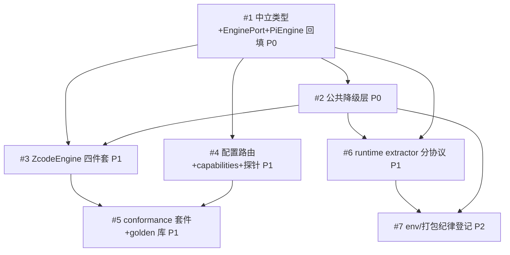

# Issue 决策图 — subagent 执行层引擎中立抽象（pi / zcode）

> 拆分权威源：设计文档 §5 实施路径五阶段（P1-P5，每阶段独立验收，A1-A14 分配到阶段门）+ system-architecture.md §7 模块划分。P0/P1 划线沿用设计文档阶段序（先回填后新增、隔离回归风险），非 agent 重拆。

## 地图总览

## 上游覆盖核验（MANDATORY，逐条不漏）

| 上游元素 | 轴 | 对应 issue | 状态 | N/A 理由（状态=N/A 时必填）|
|---------|----|-----------|------|---------------------------|
| §5: 任务生命周期 preparing/spawning/running→terminal | 状态 | #1, #2 | ✅ 已覆盖 | — |
| §5: record 状态机（running/closed + ClosedReason，保持不动） | 状态 | #1 | ✅ 已覆盖 | BC-6 守护（零迁移按 pi 投影） |
| §5: 11 错误码 + engineFallback 留痕 | 状态 | #2, #3, #4 | ✅ 已覆盖 | 错误规格落地分散到对应 issue |
| §5: 隔离池生命周期（refs.json acquire/release/计数归零） | 状态 | #2 | ✅ 已覆盖 | — |
| §7: engine/{types,port,registry} | 模块 | #1 | ✅ 已覆盖 | — |
| §7: engines/pi 四件套回填 + 映射层 | 模块 | #1 | ✅ 已覆盖 | — |
| §7: 公共降级层（schema 仿真/杀链/journal/persona 路由/嵌套防护/池管理） | 模块 | #2 | ✅ 已覆盖 | — |
| §7: engines/zcode 四件套 + sqlite reader | 模块 | #3 | ✅ 已覆盖 | — |
| §7: 配置路由（三层优先级 + fallback 守卫）| 模块 | #4 | ✅ 已覆盖 | — |
| §7: conformance 套件 + golden 样本库 | 模块 | #5 | ✅ 已覆盖 | — |
| §7: runtime subagent-extractor 三段改造 | 模块 | #6 | ✅ 已覆盖 | — |
| §8: pi 引擎边界（rpc.md 官方契约） | 边界 | #1 | ✅ 已覆盖 | A1 零回归锚点 |
| §8: zcode 引擎边界（逆向无契约 → 探针+golden 防漂移） | 边界 | #3, #4, #5 | ✅ 已覆盖 | — |
| §8: runtime 双端复用 reader（workspace 依赖 + 打包登记） | 边界 | #6, #7 | ✅ 已覆盖 | — |
| §8: zsub 参考仓（driver 移植源） | 边界 | #3 | ✅ 已覆盖 | 移植保真，非运行时依赖 |
| §10: D1-D12 索引 | 挑战 | #1-#6 | ✅ 已覆盖 | 挑战已内化为各 issue 的方案约束 |
| §10: 特化决策（reader 双端复用/journal 定位/poolKey） | 挑战 | #2, #6 | ✅ 已覆盖 | — |
| §11: 反模式 grep AC ×5 | 挑战 | #5 | ✅ 已覆盖 | conformance + CI 元测试承载 |
| §12: BC-1~BC-8 行为契约 | 挑战 | #1 | ✅ 已覆盖 | 回填期快照 diff/测试守护 |
| §9: 泳道图（reviewer@zcode 全链路） | 状态 | #3 | ✅ 已覆盖 | A2 验收场景 |

## P0 Issues（阻塞项，必须先做）

### #1: 中立类型层 + EnginePort + 引擎注册表 + PiEngine 回填（行为零变化）

**P 级**: P0
**类型**: 架构
**Blocked by**: 无
**推荐强度**: Strong

#### 问题描述

现有 execution 层 spawn 链（session-runner/pi-invocation/stdin-writer/spawn-event-adapter/get-state-handshake）内联在 SubprocessAgentRunner 之下，无「引擎」概念。需新建 `execution/engine/` 目录：types.ts（AgentTaskSpec/AgentOutcome/EngineHandleData/SessionView/EngineCapabilities，字段规格=设计文档 §3.3.5-§3.3.6）、port.ts（EnginePort 五面：run/interact/read/probe/capabilities）、registry.ts（id → factory）；现有 runSpawn 链移入 `engines/pi/` 四件套（launcher=pi-invocation+spawn 组装 / parser=spawn-event-adapter 翻译 / preparer=env 组装（PI_CODING_AGENT_DIR+PI_SUBAGENT_*）/ reader=session-reconstructor 直读 JSONL 下沉）；ExecuteOptions→AgentTaskSpec 映射层（schemaEnv 内化为 launcher 从 task.schema 派生 env，byte 级等值）。

关联 system-architecture §6 分层架构、§12 BC-1~BC-8。验收挂钩 A1（全量测试守护 + record 快照 diff + GUI 基线）/ A13（死 handle 续聊拒绝）。

#### 为什么是这个 P 级

P0：#2-#6 全部依赖 types/port/registry 与映射层存在；回填期行为零变化是全项目安全网（A1），必须先立。

#### 方案对比

##### 方案 A: 整体搬迁 + 映射层（推荐）

**改动**:
- 架构: session-runner 保留编排壳，pi 专有细节下沉 engines/pi/；新增 types/port/registry 三文件
- 模块: 新增 engine/ 目录 ~6 文件；session-runner/subagent-service 收口改造点
- 模型: ExecuteOptions → AgentTaskSpec 泛化（thinkingLevel→effort 等 5 处泛化点，§3.3.5）
- 流程: 不变（同一 spawn 协议、同一事件流）

**优点**: 设计文档 D2 定案（现有类型被广泛消费，推倒重来是纯迁移成本）；A1 三锚点可逐项快照验证
**缺点**: 映射层有一次性转换开销（可接受——单任务单次）

##### 方案 B: 双轨并行（新建 engine/ 不动旧链，逐任务切换）

**优点**: 回归风险理论上更低
**缺点**: 双链路并存期行为漂移不可检测；迁移终点仍是方案 A；违背「先回填后新增」阶段纪律

**取舍**: 方案 A（设计文档 §5 P1 明确「先回填后新增，隔离回归风险」——即整体搬迁 + 现有测试守护）。

### #2: 公共降级层六件（引擎无关，写一次全引擎用）

**P 级**: P0
**类型**: 模块
**Blocked by**: #1
**推荐强度**: Strong

#### 问题描述

实现设计文档 D4/D5 落地的六件公共设施：①schema 仿真（prompt 注入 + 三级容错 JSON 提取 + 宿主侧校验，仅服务 emulated 引擎，native 路径零介入）②abort 两级中断与超时杀链（SIGTERM → grace → SIGKILL + 终态合成，exitCode=null）③event journal 落盘（host 消费 onEvent 统一写 `<getDataDir()>/engines/<engineId>/<poolKey>/journal-<taskId>.jsonl`，中立格式 v1，有界缓冲 + flush/fsync 纪律）④persona 路由（file/flag/prompt 三策略按 capabilities 分流 + argv 长度估算前置拦截）⑤嵌套防护（XYZ_AGENT_SUBAGENT 统一标记 + 各引擎原生标记清理）⑥隔离目录池管理（poolKey 计算/refs.json acquire-release/计数归零整池删/journal 不随池删/清理失败标记）。

验收挂钩 A10（abort 两级）。

#### 为什么是这个 P 级

P0：#3 ZcodeEngine 六件全部消费（zcode schema=emulated、无 interrupt 只能杀链、事件粗粒度靠 journal、persona 仅 prompt、嵌套防护必须、HOME 隔离池必须）；#6 runtime 读取链的②级 journal 也依赖。

#### 方案对比

##### 方案 A: 独立公共层模块组（推荐）

**改动**: engine/degradation/ 下六件各自独立模块，EnginePort 实现与宿主编排层消费
**优点**: D4 定案（缺失能力六引擎高度重合，公共层消除重复）；pi 不消费仿真件（native 硬分流，BC-3 守护）
**缺点**: 首次实现成本高于内联 if-else

##### 方案 B: 首件（schema 仿真）内联 zcode adapter，其余公共

**缺点**: 破坏 D4「写一次全引擎用」；第二验证引擎接入时迁移

**取舍**: 方案 A（D4 唯一性已由三轮审查确认）。

## P1 Issues（核心）

### #3: ZcodeEngine adapter 四件套（spawn 单轮模式）

**P 级**: P1
**类型**: 模块
**Blocked by**: #1, #2
**推荐强度**: Strong

#### 问题描述

新增 `engines/zcode/` 四件套，吸收 zsub driver/bootstrapIsolatedHome/model-router 的 TS 重写（zcode-plugin-workspace 仓，非运行时依赖）：launcher（node zcode.cjs --json --cwd --mode --disallowed-tools --prompt 组装，stdin=/dev/null）/ parser（stdout 有界收集头 4K+尾 64K → 单 JSON {sessionId,response,usage} → 合成 coarse AgentEvent：message_end+turn_end → AgentOutcome）/ preparer（隔离 HOME `<dataDir>/engines/zcode/<poolKey>/` + config.json tmp+rename 原子写 + 凭据引导 + argv 估算）/ reader（sqlite session/message/part 三级 JOIN → SessionView，失败返回 undefined 走降级链）。

**实施前置门**（设计文档验收前置门，A2 前）：真实 zcode CLI 手工跑驱动脚本核对 stdout JSON 字段与本机 0.16.3 一致——探针已知样本即来自此实录。

验收挂钩 A2（真实任务）/ A3（仿真降级可见）/ A4（嵌套防护）/ A8（读取降级链①级）/ A14（运行中失败兜底）。

#### 为什么是这个 P 级

P1：业务核心目标（zcode 引擎可用）的关键路径；依赖 #1#2 完成后才能实现。

#### 方案对比

##### 方案 A: zsub driver 代码 TS 移植重写（推荐）

**优点**: zsub 已真机验证（HOME 池化/mtime 比对按需重建/config 原子写都过生产检验）；移植保真风险低于从零逆向
**缺点**: 跨仓代码风格适配成本

##### 方案 B: 调用 zsub CLI 作为执行器（设计文档方案 C，已否）

**缺点**: 跨仓产品级耦合；zsub record 与 SubagentRecord 双模型；zsub 演进节奏不受本仓控制（设计文档 §3.2 明确否决，价值以移植方式吸收）

**取舍**: 方案 A。

### #4: 配置路由三层 + capabilities + 探针体系 + 错误规格落地

**P 级**: P1
**类型**: 模块
**Blocked by**: #1
**推荐强度**: Strong

#### 问题描述

①agent .md frontmatter `engine` 字段解析（meta-parser 扩展；agent 解析期报未注册 id = engine_not_found）②三层优先级路由（调用参数 > frontmatter > 全局默认 pi）③有守卫的 fallback（probe 失败回默认引擎 + engineFallback 留痕 + GUI 警告条；三守卫命中/strict 模式不兜底直接报错）④capabilities 十维声明（pi/zcode 首期各自填表，pi steer 首期 unsupported）⑤探针体系（zcode 弱契约 = --version + 已知样本回归；版本变化检测触发）⑥错误规格 11 码 + 恢复指引文案落地（§3.3.3 表逐条）。

验收挂钩 A5（探针拦截 strict）/ A9（fallback 双臂对照）/ A11（调用前拒绝）/ A6（混编 workflow）/ A7（单次覆盖）。

#### 为什么是这个 P 级

P1：终态二/三/四（配置切换/能力可见/可操作错误）的直接载体；#5 conformance 依赖其 capabilities/probe 存在。

#### 方案对比

##### 方案 A: 静态 capabilities 表 + 分级探针（推荐）

**优点**: D3/D7 定案（运行时探测贵且不可靠；契约稳定性光谱两端分级）；错误前置（agent 解析期/prepare 期）可测
**缺点**: capabilities 需随链路接通手工升级声明（设计文档已明确此纪律）

##### 方案 B: 运行时能力探测

**缺点**: D3 已否（成本高不可靠，有的能力跑到一半才知道）。

**取舍**: 方案 A。

### #5: engine conformance 契约套件 + golden 样本库

**P 级**: P1
**类型**: 模块
**Blocked by**: #3, #4
**推荐强度**: Strong

#### 问题描述

`execution/engine/conformance/` vitest 两层：golden 回放层（parser 对实录样本回归，免 LLM 免二进制，进 CI）+ run 层（真实 spawn 简单任务，`ENGINE_CONFORMANCE_LIVE=1` 手动门）。golden 库 `conformance/golden/<engineId>/<engineVersion>/`（stdout 原始字节 + expected.json + manifest.json，一处采集两处消费——探针复用）。契约用例 C1-C8（probe 形状/run 简单任务/事件不变量五条/abort 行为/read 降级链/schema 分流/嵌套防护/prepare 前置错误）+ 负例元测试（故意破坏 zcode parser 一个不变量样本断言 C3 转红）。

验收挂钩 A12（双引擎全绿 + 负例有牙）。

#### 为什么是这个 P 级

P1：D12 定案「接入成本递减由可验证机制承载」；目标 5 的验收门；#3#4 完成后才有被测对象。

#### 方案对比

##### 方案 A: golden 回放进 CI + run 层手动门（推荐）

**优点**: CI 免凭据免 LLM 快速回归；真实层按需手跑（设计文档 §3.3.8 明确此分层）
**缺点**: golden 样本采集依赖人工实录（前置门产物复用）

##### 方案 B: 全部进 CI

**缺点**: CI 需要真实引擎二进制 + 有效凭据 + LLM 调用，成本与稳定性不可接受。

**取舍**: 方案 A。

### #6: runtime 侧 subagent-extractor 分协议改造

**P 级**: P1
**类型**: 模块
**Blocked by**: #1, #2
**推荐强度**: Strong

#### 问题描述

`packages/runtime/src/services/session/subagent-extractor.ts`（~660 行，锚定 pi subagents 目录扫描）改三段：按 record 内 engine 字段路由到该引擎共享 reader 模块（①级原生读取，extension/runtime 双端复用同一份无状态只读代码）→ journal（②级重放，路径从 handle 自描述绝对路径 + runtime 前缀白名单校验，从 getDataDir() 动态推导不写死）→ record outcome（③级）。pi 既有直读 JSONL 逻辑下沉为 pi reader，行为不变（A1 守护）；存量 record 无 engine 字段一律按 pi 投影（零迁移）。runtime 经 workspace 依赖引入 reader + tsup noExternal 登记 + validate-runtime-bundle.sh 验证双 bundle。单独 commit（中改动）。

验收挂钩 A2 的 GUI 派生列表部分 + A8（降级链在 runtime 侧）。

#### 为什么是这个 P 级

P1：GUI 不感知引擎的目标 1 在 runtime 侧的落点；reader 双端复用是 D6 特化决策的另一半。

#### 方案对比

##### 方案 A: extractor 三段化 + reader 共享模块（推荐）

**优点**: D6 定案（GUI 详情页常态走①级拿全量；pi 下沉 reader 行为不变）；零迁移存量兼容
**缺点**: extractor 改造是中改动（设计文档已标注，单独 commit）

##### 方案 B: runtime 只走 journal 投影（已否）

**缺点**: 设计文档 D6 明确否决——journal 是 AgentEvent 序列（粗粒度引擎仅合成事件）保真度低于原生存储；pi 会成为「纪律约束不了自家引擎」的例外。

**取舍**: 方案 A。

## P2 Issues（重要）

### #7: env 白名单登记 + 打包双 bundle 验证

**P 级**: P2
**类型**: 流程
**Blocked by**: #2, #6
**推荐强度**: Strong

#### 问题描述

新增 `XYZ_AGENT_SUBAGENT` 等 env 须登记 `packages/shared/src/constants.ts` 的 ENV_WHITELIST_PREFIXES SSOT（pre-commit 检查）；runtime 引入 reader 模块后跑 `validate-runtime-bundle.sh` 验证 electron 打包双 bundle 完整性（项目关键规则 12②打包纪律）。

**推荐方案**: 随 #2/#6 实施时同步登记（非独立 wave，验收清单项）；P2 因为是纪律项不是功能项，但缺失会在 pre-commit/打包期爆雷。

## 迷雾（未展开）

- #8: zcode stdout JSON 字段实录核验 ?（#3 前置门，实施期第一个动作，非独立 issue）
- #9: golden 样本采集范围（pi rpc 流事件样本 vs 终态样本比例）?（#5 实施期定，首批最小 = zcode 一个实录 + pi 一个终态）

## 后续迭代（P3 延后项）

- #10 [P3]: conversation 冷仿真（run + resume + 宿主 idle timer）— 延后理由：设计文档 D1 明确「未来低交互引擎可由公共层仿真，pi 不走仿真」，首期 zcode unsupported 即可
- #11 [P3]: 第二验证引擎 claude-code — 延后理由：设计文档 D10 明确「后续 Phase，非首期承诺」
- #12 [P3]: driver host（server-mode 引擎常驻进程管理）— 延后理由：设计文档 §3.3.1「首个 server-mode 引擎接入时落地」，首期两引擎均 spawn 模式
- #13 [P3]: opencode 第三验证引擎 — 延后理由：D12 建议「在 claude-code 之后」，用于压测 server-mode 常驻兼容性

## 决策记录

- P0/P1 划线沿用设计文档 §5 阶段序（三轮对抗式审查确认的权威拆分），agent 未重拆：见 decisions.md D-013
