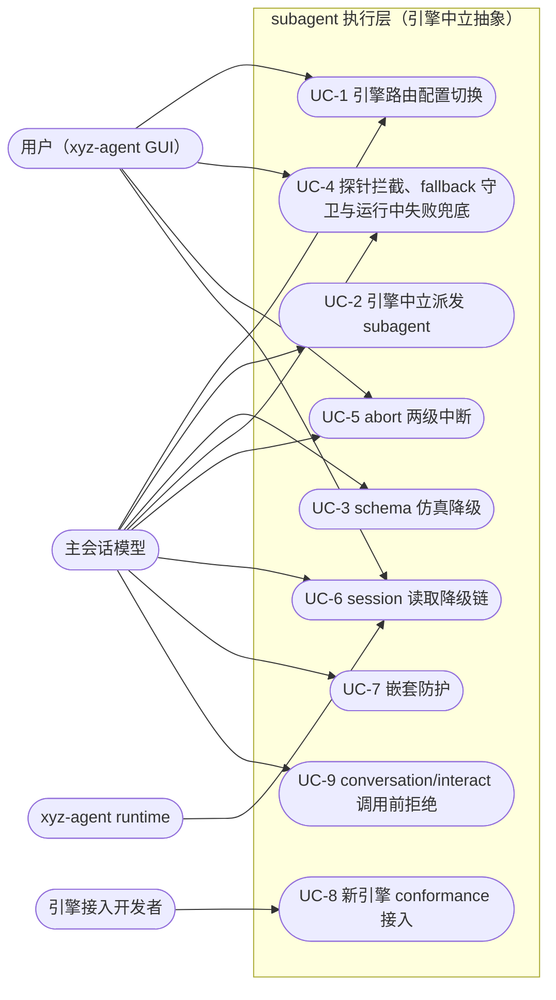
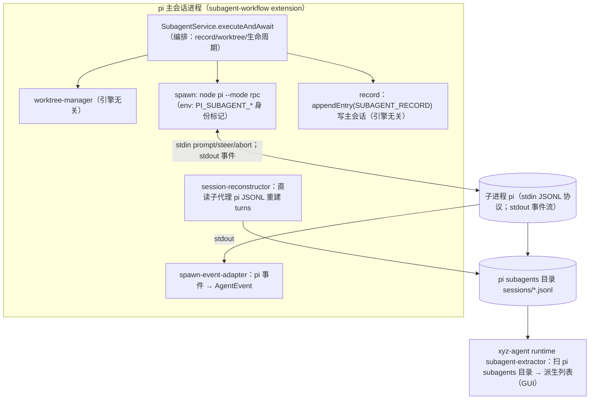
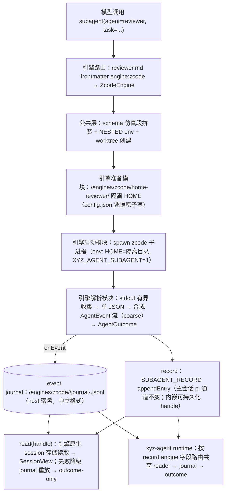
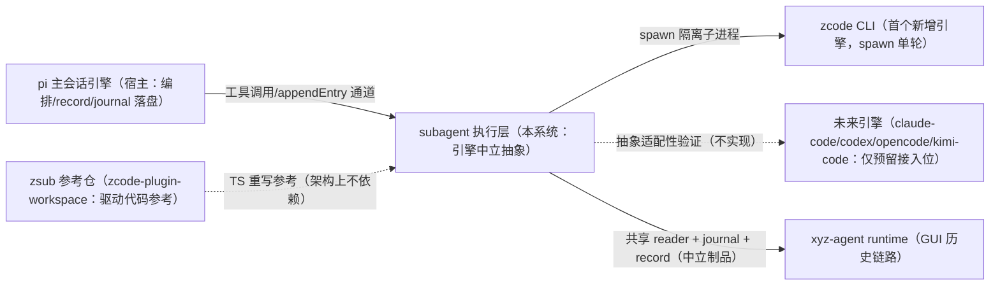

# subagent 执行层引擎中立抽象——业务需求（requirements）

> 来源：本需求从设计文档 `docs/architecture/subagent-engine-abstraction.md`（已过三轮对抗式审查，达到可实施门槛）提炼，不发明设计文档之外的内容。设计文档中的接口签名/数据格式/实施阶段拆分不在本文展开——那是设计与实现层产物。

## 1. 业务目标（Business Goals）

一句话结论：在 pi-subagent-workflow 的执行层之下插入一个「引擎中立抽象」（EnginePort + 中立类型 + 公共降级层），使任意 coding-agent CLI 可作为 subagent 执行引擎插拔；首期落地 pi（回填，行为零变化）+ zcode（新增，spawn 单轮模式），抽象按六引擎能力全集设计，预留 claude-code / codex / opencode / kimi-code 接入位。

### 目标树

- **G1: 模型/用户不感知引擎** — 成功标准：`subagent`/`workflow` 工具的入参、返回、GUI 展示在引擎切换后完全不变（同一份 agent 清单、同一种 record、同一个 schema 校验结果）；pi 回填后全量测试全绿 + record 快照字段级 diff 一致 + GUI 关键视图截图基线一致（A1）；zcode 真实任务 GUI 对话流/工具面板正常显示（A2）；混编 workflow 两引擎 record 结构一致、GUI 无引擎字段泄漏（A6）
  - G1.1: pi 引擎回填行为零变化（先回填后新增，隔离回归风险）
  - G1.2: 引擎差异不污染上层（工具面、workflow 引擎、GUI 零改动消费中立类型）
- **G2: 配置自由切换** — 成功标准：三层优先级（调用参数 engine > agent .md frontmatter engine > 全局 settings 默认，缺省 `pi`）全部生效；单次调用覆盖 frontmatter（A7）与 step 级指定（A6）可验证；未注册 engine id 在 agent 解析期报错（配置错误前置暴露）
- **G3: 能力差异显式化** — 成功标准：某引擎不支持的能力以 capabilities 声明 + 预定降级策略消化，全部发生在 spawn 之前，而不是运行时神秘失败；缺陷按四级处置（自动仿真/显示降级/调用前拒绝/入口拦截）；调用前可见降级提示（A3）、读取三级降级不白屏（A8）、调用前拒绝无进程创建（A11）
- **G4: 抗版本漂移** — 成功标准：引擎 CLI 升级破坏契约时，探针在入口拦截并给出可操作错误（A5），而不是运行中静默挂死；fallback 有守卫且留痕（A9）；运行中失败结构化兜底、record 正常收尾（A14）；abort/杀链无僵尸进程（A10）
- **G5: 新引擎接入成本递减** — 成功标准：接入第 N 个引擎不改上层与既有引擎，只新增一个适配器模块（四件套 + 注册表一行）；「递减」由 engine conformance 契约套件 + golden 样本库验证（A12，含负例转红证明套件有牙），不靠口号

### 达成路线

| 目标 | 路线/策略 | 对应用例 |
|------|---------|---------|
| G1 模型/用户不感知引擎 | 中立类型从现有类型泛化不另起炉灶（D2）；pi 现有 spawn 链回填为引擎之一，行为靠现有测试 + record 快照 diff + GUI 截图基线守护 | UC-1, UC-2, UC-5 |
| G2 配置自由切换 | 三层优先级路由 + agent .md frontmatter `engine` 字段为 per-agent 主通道 + 解析期校验（D9） | UC-1 |
| G3 能力差异显式化 | capabilities 三级声明（D3）+ 缺陷四级处置（D11）+ 公共降级层一次性实现全引擎复用、native/仿真硬分流（D4） | UC-3, UC-6, UC-9 |
| G4 抗版本漂移 | 按契约稳定性分级的探针体系（D7）+ 有三守卫的故障 fallback（D9①）+ 运行中失败兜底 + abort 两级中断与超时杀链（D1）+ 嵌套防护（D8） | UC-4, UC-5, UC-7 |
| G5 新引擎接入成本递减 | adapter 四件套模块化 + conformance 契约套件 C1-C8 + golden 样本库作为接入验收门（D12） | UC-8 |

## 2. 业务用例（Use Cases）

### 用例图

### UC-1: 引擎路由配置切换

- **Actor**: 主会话模型（经 `subagent`/`workflow` 工具）；用户（配置全局默认/agent frontmatter）
- **前置条件**: 引擎注册表内已有 pi/zcode；agent 清单已解析
- **主流程**: 1. 发起 subagent/workflow 调用 2. 引擎路由按三层优先级解析（调用参数 engine > agent .md frontmatter engine > 全局 settings 默认，缺省 `pi`）3. 任务派发到解析出的引擎执行 4. record 记录实际执行引擎（engineId；fallback 后可能 ≠ 请求值）
- **替代流程**: workflow 混编（部分 step 用默认 pi、部分 step 级显式指定 zcode）；单次调用参数覆盖 frontmatter 设置；显式 model 在解析出引擎上解释（model 与 engine 正交，不做按模型名隐式推引擎）
- **异常流程**: 未注册 engine id → agent 解析期报 `engine_not_found`（指向注册表清单 + 配置文件路径），不留到运行时；显式指定的引擎探针失败 → 不 fallback 直接报错（转 UC-4）；workflow step 级 `engine:` 仅限「必须某引擎独有能力」并注释原因（脚本不写死 engine）
- **后置状态**: 任务在解析出的引擎上执行；record.engineId 与实际引擎一致
- **关联目标**: G2（兼 G1）
- **验收标准 (AC)**:
  - AC-1.1 [正常]: 调用参数显式 `engine: pi` 覆盖 reviewer 的 zcode frontmatter 设置后，该次任务跑 pi（隔离目录无新增 zcode session）（A7）
  - AC-1.2 [正常]: 一个 workflow 前两步用默认 pi、第三步 step 级指定 zcode——两引擎 record 结构一致，workflow 汇总正常，GUI 无引擎字段泄漏（A6）
  - AC-1.3 [异常]: agent frontmatter 写了未注册 engine id → agent 解析期报 `engine_not_found`，错误指向注册表清单与配置文件路径（配置错误前置暴露）
  - AC-1.4 [边界]: 三层均未配置时缺省引擎 = `pi`，回填期零风险默认，行为与现状零差异（A1）

### UC-2: 引擎中立派发 subagent

- **Actor**: 主会话模型
- **前置条件**: 引擎探针通过；agent 人设/模型/schema/worktree 参数已就绪
- **主流程**: 1. 模型调用 `subagent` 工具（入参无引擎字段，agent 清单与现在完全一致、清单注入文案不出现引擎字样）2. 公共层拼装（schema 仿真段/persona 路由/嵌套标记/worktree 创建）3. 引擎准备模块处理隔离环境与凭据（per-engine 钩子）4. 引擎启动模块 spawn 引擎子进程 5. 引擎解析模块把引擎输出翻译为统一 AgentEvent 流 + 终态（AgentOutcome）6. record 持久化进主会话（内嵌可持久化 handle）7. GUI 对话流/工具面板正常显示
- **替代流程**: 默认引擎 pi 走原生链路（schema 走 env 注入，不经仿真层）；粗粒度引擎（zcode）事件流合成为 coarse 粒度（GUI 允许粗粒度显示）
- **异常流程**: prepare 期错误（凭据缺失/模型不可解析/argv 超限）在进程创建前同步报错，不产生子进程；运行中失败不静默挂死（转 UC-4）
- **后置状态**: record 落盘（engineId/engineFallback 等字段完整）；journal 落盘；无僵尸进程
- **关联目标**: G1
- **验收标准 (AC)**:
  - AC-2.1 [正常]: pi 引擎（engine 缺省）零回归——subagent-workflow 全量测试全绿；record entry JSON 快照 diff 字段级一致；GUI 关键视图（对话流/工具面板/record 详情）截图基线一致（A1）
  - AC-2.2 [正常]: reviewer@zcode 真实任务——子代理真跑在 zcode（隔离 HOME 的 db.sqlite 出现新 session）；schema 结果 ajv 校验通过；GUI 对话流/工具面板正常显示（允许粗粒度）（A2）
  - AC-2.3 [异常]: prepare 期错误（`engine_credential_missing` / `model_not_available` / `prompt_too_large`）在进程创建前报出，无子进程产生（错误规格表中 prepare 期错误行）
  - AC-2.4 [边界]: 同一 agent 清单跨引擎不变——模型看到的 agent 清单与清单注入文案在引擎切换后完全一致，不出现引擎字样（终态一）

### UC-3: schema 仿真降级

- **Actor**: 主会话模型
- **前置条件**: 任务带 schema 输出约束；引擎 capabilities.schemaEnforcement = `emulated`（zcode/opencode/kimi-code 类）；公共仿真层就位
- **主流程**: 1. 路由解析出 emulated 引擎 2. 公共仿真层拼装 prompt 约定段（并入 persona 注入）3. 子代理输出经三级容错 JSON 提取 4. 宿主侧 schema 校验 5. parsedOutput 与 native 同形交付（执行无打扰）
- **替代流程**: native 引擎（pi 的 env 注入链路、claude-code 的 `--json-schema`、codex 的 `--output-schema`）保持各自原生链路——公共层不做二次校验、不改写其结果（硬分流）；仿真路径自身失败才升级为错误
- **异常流程**: 三级容错 + 重试一次（强化 prompt）仍解析不出 JSON / 宿主侧 schema 校验不通过 → 报 `schema_emulation_failed`，错误含原始输出尾部（与现有 structured-output 重试语义对齐）
- **后置状态**: 产出与 native 同形；引擎配置处常驻「仿真降级」标记（非一次性提示）
- **关联目标**: G3
- **验收标准 (AC)**:
  - AC-3.1 [正常]: reviewer@zcode 按 schema 输出 `{issues[],verdict}`——结果 ajv 校验通过（A2）
  - AC-3.2 [正常]: 调用前 GUI/引擎配置处可见「schema 为仿真降级」提示，不是运行时报错（A3）
  - AC-3.3 [正常]: pi 的 schema 任务走 native env 注入链路不受仿真层影响（D4 硬分流的回归确认）（A1/C6）
  - AC-3.4 [异常]: emulated 引擎输出经三级容错 + 重试一次仍不过 → `schema_emulation_failed`，错误含原始输出尾部（C6）
  - AC-3.5 [边界]: 宿主侧 ajv 只在 emulated 路径出现，对 native 引擎结果无二次校验——native/emulated 是硬边界（防第二校验权威，护 structured-output 方案 A）

### UC-4: 探针拦截、fallback 守卫与运行中失败兜底

- **Actor**: 主会话模型；用户
- **前置条件**: 探针体系按引擎契约稳定性分级就位（二进制存在 + 版本解析 + 干跑校验，不调 LLM）；引擎 factory 初始化与版本变化检测触发探针
- **主流程**（有守卫的 fallback）: 1. 探针失败（版本漂移/二进制缺失）2. 非 strict 模式且无守卫命中 → 任务路由回全局默认引擎（缺省 pi）完成 3. record 记 `engineFallback: {from, reason}` 4. GUI 警告条可见（留痕防配置腐坏被静默掩盖）
- **替代流程**（三守卫命中则不 fallback、按 strict 语义直接报错）: a) engine 来自调用参数/step 级显式指定（显式选择 = 能力依赖，静默换引擎违反意图）；b) task 声明依赖该引擎独有能力（capabilities 对照，如 sandbox: native；首期与守卫 a 合流——声明载体 = step/调用级显式 engine 指定，AgentTaskSpec 下钻 requires 字段后独立生效）；c) 显式 model 在默认引擎上不可解析（不静默换模型，报 `model_not_available`）；`engineRouting.strict` 全开则一切 probe 失败直接报错
- **异常流程**: strict 模式探针失败 → 入口即 `engine_probe_failed`，错误含恢复指引（版本确认命令 + 探针重跑命令 + 调研文档路径），任务不静默挂死；运行中契约漂移越过探针爆发（stdout 解析失败/非零退出）→ 宿主合成错误终态（`engine_run_failed`，含 stdout 尾部 + exit code + 恢复指引），record 正常收尾，新样本补录 golden 库
- **后置状态**: 探针失败永远有可操作错误或可见留痕；record 必收尾、无僵尸进程
- **关联目标**: G4
- **验收标准 (AC)**:
  - AC-4.1 [正常]: 不开 strict、frontmatter 引擎（reviewer@zcode）探针失败 → 路由回默认 pi 完成，record 含 `engineFallback{from:'zcode',reason:'probe_failed'}`，GUI 警告条可见（A9①）
  - AC-4.2 [异常]: 调用参数显式 `engine: zcode` + 同样探针失败（对照组）→ 不降级、报 `engine_probe_failed`、无 pi 进程创建（A9②）
  - AC-4.3 [异常]: strict 模式 + 临时模拟 zcode 版本漂移 → 入口即 `engine_probe_failed`，错误含恢复指引（版本命令/探针命令/文档路径），任务不静默挂死（A5）
  - AC-4.4 [异常]: 注入损坏 parser 或喂 golden 样本外新格式 stdout 模拟运行中失败 → 结构化 `engine_run_failed`（含 stdout 尾部 + exit code + 恢复指引）、record 正常收尾、无僵尸进程、新样本补录 golden 库（A14）
  - AC-4.5 [边界]: 显式 model 在默认引擎不可解析 → 不静默换引擎，报 `model_not_available` 并列该引擎可用模型清单（守卫 c）

### UC-5: abort 两级中断

- **Actor**: 用户；主会话模型（workflow 引擎取消）
- **前置条件**: 任务运行中；取消请求（AbortSignal）已发起
- **主流程**: 1. 取消请求 2. 第一级：引擎原生优雅中断（pi abort / claude-code interrupt / codex turn/interrupt / opencode POST abort / kimi :abort）3. 第二级：CLI-only 引擎（zcode/kimi headless 类）直接走公共进程终止信号链兜底4. 宿主合成终态 5. record 正常收尾
- **替代流程**: 有原生中断的引擎（pi）优雅收尾；超时杀链走完进程未退 → `engine_timeout`（含 stdout 尾部 + 「可用 engine: pi 重跑」建议）
- **异常流程**: 杀死进程后由宿主合成终态，record 不留僵尸
- **后置状态**: 无僵尸进程；被信号杀死的终态 exitCode=null + error 含杀链标记；record 收尾
- **关联目标**: G1, G4
- **验收标准 (AC)**:
  - AC-5.1 [正常]: zcode 任务运行中用户 cancel → 走公共杀链兜底、宿主合成终态、record 正常收尾无僵尸进程（A10）
  - AC-5.2 [正常]: pi 任务 cancel 对比 → 走原生中断优雅收尾（A10）
  - AC-5.3 [边界]: abort/超时被信号杀死的终态 exitCode=null 且 error 含杀链标记——终态判据可区分「自然退出」与「被杀」（D1 abort 分级）
  - AC-5.4 [异常]: 宿主超时杀链走完 → `engine_timeout`，错误含 stdout 尾部 2000 字 + 「可用 engine: pi 重跑」建议（错误规格）

### UC-6: session 读取降级链

- **Actor**: 用户（GUI subagent 详情页）；主会话模型（session_read 类读取）；xyz-agent runtime（GUI 历史链路/派生列表）
- **前置条件**: record 已落盘且内嵌 handle；隔离池目录与引擎原生存储按池化策略保留
- **主流程**: 1. 打开 subagent 详情 / read(handle) 2. 第①级：引擎原生读取（各引擎原生 session 存储；reader 为无状态共享只读模块，extension 与 runtime 双端复用同一份）3. 失败降级第②级：宿主 event journal 重放（中立格式，重放即得事件流；GUI 详情页常态走①级拿引擎原生全量）4. 再失败降级第③级：outcome-only 摘要卡（只有 prompt/result/usage）
- **替代流程**: runtime 的 GUI 派生列表按 record 内 engine 字段路由到对应引擎共享 reader；pi 既有直读 JSONL 现状下沉为 pi reader 模块，行为不变
- **异常流程**: 三级全降级到底也不白屏不报错弹窗（摘要卡兜底）；journal 路径由 handle 自描述携带、runtime 读前校验前缀白名单（路径动态推导不写死）
- **后置状态**: SessionView 带来源标记（native/journal/outcome-only）供 GUI 降级显示；journal 不随池删除，生命周期跟随 record
- **关联目标**: G3
- **验收标准 (AC)**:
  - AC-6.1 [正常]: zcode 任务隔离池目录与 db.sqlite 正常保留，read(handle) 走第①级（sqlite 原生读取）成功（A8 前置确认）
  - AC-6.2 [异常]: rename 掉 db.sqlite 再打开该 subagent 详情 → 降级为宿主 event journal 重放重建（第②级）（A8）
  - AC-6.3 [边界]: 清空 journal 后 → 降级为 outcome-only 摘要卡（第③级），不白屏不报错弹窗（A8）
  - AC-6.4 [正常]: journal 重放重建的 turns 与 live 通路一致（重放等价性——共用同一 reducer，不引入第二套解析器）（C5）
  - AC-6.5 [边界]: 存量 record 无 engine 字段 → 一律按 pi 投影（零迁移，不要求历史数据搬迁）

### UC-7: 嵌套防护

- **Actor**: subagent 子代理（尝试在子代理内再派发 subagent）
- **前置条件**: 任务已在 subagent 环境中执行（宿主 spawn 时已注入统一 NESTED 标记）
- **主流程**: 1. 所有引擎 spawn 都注入统一 NESTED 环境标记（env 层，唯一跨引擎可靠手段）2. 引擎 adapter 检测到标记 3. 拒绝递归派发，返回 `nested_spawn_rejected`（说明防护规则，指向 task 内自行完成）4. 无二级引擎子进程产生
- **替代流程**: 各引擎原生标记（CC 的 `CLAUDECODE`、zsub 的 `ZSW_NESTED`、pi 的 `PI_SUBAGENT_*`）由 adapter 同步清理/利用（双层防护）
- **异常流程**: 无（防护本身即异常路径的拦截）
- **后置状态**: 无嵌套进程；模型收到可操作文案
- **关联目标**: G4
- **验收标准 (AC)**:
  - AC-7.1 [异常]: 让 zcode 子代理尝试调用 subagent 工具 → 被拒并给出防护说明，无二级 zcode 进程产生（A4）
  - AC-7.2 [正常]: 注入 NESTED env 后 spawn 被拒（`nested_spawn_rejected`），无进程创建（C7）
  - AC-7.3 [边界]: 统一标记之外，各引擎原生标记同步清理/利用（不依赖「隔离目录里不装扩展」这类配置洁癖方案——opencode/CC 会吃项目级配置，env 标记才跨引擎可靠）

### UC-8: 新引擎 conformance 接入

- **Actor**: 引擎接入开发者
- **前置条件**: EnginePort 接口与公共降级层就位；conformance 契约套件 + golden 样本库骨架存在
- **主流程**: 1. 新增 `engines/<id>/` 适配器模块（准备/启动/解析/读取四件套，预计 ≤500 行）2. 填写 capabilities 声明（声明的是本仓 subagent 链路实际接通的能力，非引擎理论能力）3. 注册表登记一行 4. 用真实流量采集 golden 样本（stdout 实录 + 期望事件序列 + manifest）5. conformance 契约套件（probe 形状/run 简单任务/事件不变量/abort 行为/read 降级行为等；用例 C1-C8 清单见设计文档 §3.3.8——C5 read 降级链 / C6 schema 分流 / C7 嵌套防护 / C8 prepare 前置错误）转绿 6. 接入完成——不改 workflow 引擎、不改工具面、不改其他引擎
- **替代流程**: 无（契约套件转绿是接入的唯一验收门）
- **异常流程**: 套件不绿 → 接入不算完成；套件自身有负例守护——故意破坏一个不变量样本断言套件转红，未检出则元测试失败（套件有牙）
- **后置状态**: 新引擎可被 frontmatter/全局配置/单次调用引用；golden 样本同时供探针「已知样本回归」复用（一处采集两处消费）
- **关联目标**: G5
- **验收标准 (AC)**:
  - AC-8.1 [正常]: 本机真实环境（已装 pi/zcode + 有效凭据）跑契约套件——golden 回放层（免 LLM、免二进制，进 CI 默认）+ run 层（真实 spawn，作手动门不进 CI 默认）双引擎全绿（A12）
  - AC-8.2 [边界]: 故意破坏 zcode parser 一个不变量断言 → 套件转红并指出失败的不变量（负例守护证明套件有牙）（A12）
  - AC-8.3 [边界]: 接入 claude-code（第二验证引擎建议，标注为后续 Phase 非首期承诺）= 新增一个模块目录 + 注册表一行 + golden 样本 + 契约套件转绿，不改 workflow 引擎/工具面/其他引擎（终态五）

### UC-9: conversation/interact 调用前拒绝

- **Actor**: 主会话模型
- **前置条件**: 引擎 capabilities 已声明 conversation/steer/interact 为 `unsupported`（如 zcode 首期：conversation 不支持、steer 未验证即声明 unsupported）；capabilities 查询同步无副作用（调用前拒绝的判据）
- **主流程**: 1. 模型对 unsupported 引擎的 agent 发起 conversation 模式或 message 续聊 2. 系统据 capabilities 声明同步拒绝（`engine_capability_unsupported`），不创建进程 3. 错误含可操作文案（换单次调用 / `engine: pi`）4. GUI 侧隐藏对应入口使该错误尽量没有机会发生
- **替代流程**: pi 的 conversation 为 native（chatMode 行为直通，同进程 idle 复用不折叠进 run）；未来低交互引擎可由公共层用「run + resume + 宿主 idle timer」仿真（体验降级），但 pi 不走仿真
- **异常流程**: 主会话 reload 后对进程已死的 handle 调 interact → `engine_session_not_resumable`（指向 cold resume 路径，说明 idle 复用不可跨 reload），非笼统失败、无挂死
- **后置状态**: 不产生引擎进程；模型与用户的错误通道分开（模型收到能改变下一次调用的文案；用户侧靠能力标记与入口隐藏预防）
- **关联目标**: G3
- **验收标准 (AC)**:
  - AC-9.1 [异常]: 对 `engine: zcode` 的 agent 发起 conversation 模式与 message 续聊 → 同步返回 `engine_capability_unsupported`（含可操作建议），无 zcode 进程创建；GUI 对应入口隐藏（A11）
  - AC-9.2 [异常]: pi conversation 子代理轮终进 idle 后关闭并重开主会话（子进程死亡），对原 handle 发 message → 同步返回 `engine_session_not_resumable`（含 cold resume 指引），无挂死、无新进程（A13）
  - AC-9.3 [边界]: pi 首期 steer 声明 `unsupported`（RPC 层有能力但 spawn 链路未接通——声明链路接通能力而非理论能力；接通后再升级声明）

## 3. 数据流转（Data Flow）

### 数据流图

**现状（引擎中立化前，spawn 细节内联、单引擎硬编码）**：

**终态（以 reviewer@zcode 为例，spawn/事件翻译/session 落盘三行按引擎分叉，worktree/record 通道不变）**：

不变量：worktree-manager、record 写入通道（主会话仍是 pi，appendEntry 可用）、AgentEvent/AgentResult 消费方在引擎中立化前后均不变；要变的只是 spawn 行、事件翻译行、session 落盘与读取行（三行恰好按引擎分叉）。

### 数据清单

| 数据 | 来源 | 处理 | 消费者 | 归档策略 | 敏感级别 |
|------|------|------|--------|---------|---------|
| AgentTaskSpec（任务声明：task/slug/agent/model/schema/worktree 等） | subagent/workflow 工具调用 | 三层路由解析 + 公共层拼装（仿真段/persona/嵌套标记） | 引擎适配器（准备/启动模块） | 随 record 归档 | 低 |
| AgentEvent 流（执行事件，8 种） | 引擎子进程输出经引擎解析模块翻译 | host 消费 onEvent 统一落盘 journal | GUI 实时展示 / journal 重放 | journal 跟随 record 生命周期 | 低 |
| AgentOutcome（终态：content/parsedOutput/usage/engineId/engineFallback/exitCode 等） | 引擎解析模块终态或宿主合成（abort/超时/失败） | record 内嵌投影 | workflow 引擎 / 工具面 / GUI | 随 record 归档 | 低 |
| EngineHandle（引擎会话句柄：engineId/sessionRef/poolKey/journalPath/engineVersion/adapterVersion） | run 成功即构造（失败终态也返回） | record v2 持久化（对上层不透明，禁止解构） | read 降级链 / interact 控制面 | 随 record 归档；存量 v1 record 按 pi 投影零迁移 | 中（含路径信息） |
| event journal（JSONL 中立格式，seq 单调递增） | host 落盘（onEvent 追加写，终态 flush+fsync） | 重放即得事件流，重放与 live 共用同一 reducer | SessionView 第②级 / 探针已知样本回归 / golden 语料 | 跟随 record（GC 联动删对应文件）；**不随池删** | 低 |
| SessionView（读取视图：turns/usage/source 降级标记） | read(handle) 三级降级链产出 | ①级原生读取 → ②级 journal 重放 → ③级 outcome-only | GUI 详情页 / session_read / runtime 派生列表 | 即时消费不归档 | 低 |
| SubagentRecord（执行记录） | SubagentService appendEntry | 主会话 entry 持久化 | GUI / workflow 引擎 / runtime extractor | 随主会话持久化；GC 时联动池引用计数递减与 journal 删除 | 低 |
| 隔离目录池（`<dataDir>/engines/<engineId>/<poolKey>/`：引擎原生状态 + refs.json） | 引擎准备模块生成（config/凭据/隔离 HOME/引擎原生 session 存储） | 跨任务池化保留复用；refs.json 池引用计数（宿主唯一写者） | 引擎子进程 / reader 原生读取 | record GC 计数归零或引擎配置移除时整池删除（journal 除外）；清理失败置可观测标记 | 高（含凭据 config） |
| golden 样本库（`conformance/golden/<engineId>/<engineVersion>/`：stdout 实录 + 期望事件序列 + manifest） | 真实流量采集（首个样本来自验收前置门 zcode 实录） | 引擎解析模块回归 + 探针运行时校验复用 | conformance 契约套件 / 探针 | 随代码仓归档 | 低 |

## 4. 功能清单（Features）

| 编号 | 功能 | 对应用例 | 关联目标 |
|------|------|---------|---------|
| F1 | 引擎注册表与三层路由（调用参数 > frontmatter > 全局默认缺省 pi；解析期校验未注册 id） | UC-1 | G2 |
| F2 | 引擎中立执行（per-engine 准备/启动模块 + 统一 AgentEvent 流翻译 + 终态合成） | UC-2 | G1 |
| F3 | capabilities 三级声明（native/emulated/unsupported 等 10 维度；声明链路接通能力） | UC-1, UC-3, UC-9 | G3 |
| F4 | schema 仿真降级（公共层：prompt 约定 + 三级容错提取 + 宿主侧 schema 校验；native/emulated 硬分流） | UC-3 | G3 |
| F5 | 分级探针体系（二进制存在 + 版本解析 + 干跑校验；factory 初始化与版本变化检测触发） | UC-4 | G4 |
| F6 | 有守卫的故障 fallback（默认路由回退 + engineFallback 留痕 + GUI 警告条 + 三守卫 + strict 模式） | UC-4 | G4 |
| F7 | 运行中失败兜底（engine_run_failed 结构化错误 + 宿主合成终态 + golden 补录） | UC-4 | G4 |
| F8 | abort 两级中断与超时杀链（引擎原生中断 → 公共进程终止信号链；终态合成无僵尸） | UC-5 | G1, G4 |
| F9 | session 读取三级降级链（共享 reader 原生读取 → 宿主 journal 重放 → outcome-only） | UC-6 | G3 |
| F10 | 嵌套防护（统一 NESTED env 标记 + 各引擎原生标记清理，双层） | UC-7 | G4 |
| F11 | conformance 契约套件 + golden 样本库（新引擎接入验收门 + 负例守护元测试） | UC-8 | G5 |
| F12 | per-engine 引擎准备钩子（环境隔离/凭据生成/argv 长度估算前置拦截/隔离目录池管理） | UC-2, UC-4 | G3, G4 |
| F13 | 宿主 event journal 落盘（host 统一写，全引擎免费获得，格式唯一） | UC-6 | G3 |
| F14 | GUI 能力显式化（引擎配置处能力提示/fallback 警告条/unsupported 入口隐藏/摘要卡降级） | UC-3, UC-4, UC-6, UC-9 | G3 |
| F15 | runtime subagent-extractor 分协议读取（按 record engine 字段路由共享 reader/journal/outcome；pi 现状下沉为 reader 行为不变） | UC-6 | G1 |

## 5. UI/UX 场景（Interface Scenarios）

本需求有 GUI 相关面（GUI 不感知引擎差异，但需显式呈现能力降级与故障留痕）。

### 页面线框（文字描述）

- **引擎配置处能力提示**：用户在 GUI/设置里给某 agent 指定 `engine: zcode` 时，系统提示「zcode 引擎：schema 输出为仿真降级（prompt 约定 + 解析校验）、不支持运行中插话、事件流为粗粒度」——来源该引擎 capabilities 声明，非散落 if；仿真降级为常驻标记（引擎配置处），非一次性提示
- **fallback 警告条**：引擎故障 fallback 发生后（如 zcode 探针失败路由回 pi），GUI 显示警告条（数据源 = record 的 engineFallback 投影）——留痕防配置腐坏被静默掩盖
- **入口隐藏与能力标记**：steer/conversation 声明 unsupported 时 UI 隐藏对应入口并提示（使调用前拒绝错误尽量没有机会触发）；权限模式声明 fixed/ignored 的引擎，GUI 据此隐藏/提示对应设置项
- **降级显示**：粗粒度事件流引擎（zcode/kimi）GUI 显示降级为阶段态卡片；读取降级到 outcome-only 时显示摘要卡；kimi 部分 usage / 五家 cost 缺失字段显示不可用——全部「永不弹错」（显示降级，信息缺席照常执行）

### 交互流程

- 引擎切换路径：设置全局默认 → 或编辑 agent .md frontmatter `engine:` → 或调用参数单次覆盖；模型侧 agent 清单与工具入参完全不变
- 故障感知路径：派发 → 探针失败（有守卫时直接报错可操作文案 / 无守卫时 fallback + 警告条）→ 用户点警告条看到 engineFallback 原因 → 按恢复指引处理
- 历史查看路径：subagent 详情页常态引擎原生全量 → 原生存储失效时 journal 重放（视图降级标记）→ 极端情况摘要卡兜底，不白屏

## 6. 系统间功能关联（Cross-System）

### 关联图

| 关联系统 | 依赖方向 | 交互方式 | 契约稳定性 |
|---------|---------|-----------|-----------|
| pi 主会话引擎（宿主） | 宿主承载本系统（extension 跑在 pi 主会话进程内） | 主会话仍 pi：appendEntry 写 record、journal host 落盘、编排权/并行/worktree 全在宿主 | rpc.md 官方（最稳） |
| pi 执行引擎（被 spawn 的默认执行引擎） | 依赖 | subagent 子进程 spawn（rpc 模式）+ session JSONL 读取（A1 零回归守护对象） | 稳定（rpc.md 官方） |
| zcode CLI | 本系统 spawn/读取 zcode | spawn 单轮模式（argv 传 prompt、stdout 单 JSON、隔离 HOME）；sqlite 原生读取 | 逆向，无契约（help flag 漂移实锤）——探针 + golden 回归承载 |
| claude-code（未来） | 仅预留接入位 | `--json-schema` 原生 schema、stream-json 事件流 | 官方文档 + Zod schema |
| codex（未来） | 仅预留接入位 | `--output-schema`、turn/item 两级事件 | `generate-json-schema` 机器契约（锁版本） |
| opencode（未来） | 仅预留接入位 | server 形态（REST/SSE） | openapi 3.1 入库 |
| kimi-code（未来） | 仅预留接入位 | argv-only、config.toml 凭据（不走 env） | 文档化 |
| xyz-agent runtime | 本系统提供中立制品给 runtime | 按 record engine 字段路由：共享 reader（①级）→ journal（②级）→ outcome（③级）；依赖方向单向——runtime 永不 import adapter 运行时件与 EnginePort 实例，例外仅无状态 reader 模块与中立制品 | 仓内契约（本设计定义，随 record v2） |
| zsub 参考仓 | 参考不依赖 | ZcodeEngine 的 driver/bootstrapIsolatedHome/model-router 直接参考/移植 TS 重写 | 跨仓只读参考（架构上不依赖） |

## 7. 约束（Constraints）

### 业务/架构约束（贯穿纪律，全部决策的前提）

1. **宿主编排**：引擎只当单 agent 执行器；六家原生多 agent 机制（CC Task / codex ThreadSpawn / opencode task / kimi AgentSwarm）一律禁用不依赖；编排权、并行、record、worktree 全在宿主
2. **capabilities 声明「链路接通能力」**而非引擎理论能力（如 pi RPC 有 steer 但 spawn 链路未接通，首期声明 unsupported）
3. **降级写一次、native/仿真硬分流**：公共降级层一次性实现全引擎复用；schema 是样板（宿主侧 schema 校验只在 emulated 路径出现，native 结果不做二次校验不改写——防第二校验权威）
4. **依赖方向单向**：上层 → 中立类型/port；adapter → 公共层；runtime 永不 import adapter 运行时件（launcher/preparer/parser）与 EnginePort 实例，例外仅两个——双端复用的无状态 reader 模块与中立制品（record + journal）
5. **错误尽量先于进程创建**：配置错误前置 agent 解析期、契约漂移前置探针、argv 超限前置 prepare 期；封死边界如实声明——运行中漂移由 engine_run_failed + 宿主终态合成兜底，不静默挂死
6. **模型与用户的错误通道分开**：模型收到能改变下一次调用的文案；用户侧由 GUI 能力标记与入口隐藏让错误尽量没有机会发生

### 技术约束（仅记录不展开）

- 首期 MVP 引擎集 = { pi, zcode }；zcode 首期只做 spawn 单轮；抽象按六引擎全集设计（防返工）
- 主会话引擎不切换（主链路仍 pi）；record 写入走主会话 pi 的 appendEntry 通道
- vitest 测试框架（禁 node:test）；conformance run 层不进 CI 默认（手动门）
- 新增 env（如 XYZ_AGENT_SUBAGENT）须登记 ENV_WHITELIST_PREFIXES SSOT；路径从 getDataDir() 动态推导禁止写死
- reader 双端复用需 runtime 侧同步登记 tsup noExternal 并跑 validate-runtime-bundle.sh 验证双 bundle

## 8. 不做（Out of Scope）

- xyz-agent 主会话引擎切换（主链路仍 pi；见 `feat-support-zcode` 分支早前全量评估，另行决策）
- conversation 模式（chatMode/idle 续聊）在 zcode 引擎下的支持（降级声明不支持；`--resume` 冷路径留作后续演进）
- zcode app-server 常驻模式（引擎内部优化项，不进首期接口实现；driver host 仅命名预留，首个 server-mode 引擎接入时落地）
- 除 pi/zcode 外引擎的实际实现（claude-code/codex/opencode/kimi-code 只做抽象适配性验证）
- 补不了的硬差异不强行补齐：粗粒度引擎的实时事件流、kimi 完整 usage 与五家 cost、kimi headless 权限模式、引擎可用模型范围（受 provider 体系约束）——一律显示降级/如实声明

## 决策记录

以下决策在设计文档中已定（D1-D12，经三轮对抗式审查确认），本阶段不再重开：

| # | 决策 | confirmed_by |
|---|------|--------------|
| D1 | 接口主语义锚定「一次性任务」（run → outcome，fire-to-completion）；interact 交互控制面单列可选方法；handle 契约三条（不透明/可持久化/自描述）；abort 分级（引擎原生中断 → 公共杀链兜底） | design-doc-r3-review |
| D2 | 中立类型从现有类型泛化（ExecuteOptions → AgentTaskSpec、AgentResult → AgentOutcome），不另起炉灶；同名不同义消歧 | design-doc-r3-review |
| D3 | capabilities 三级声明 native/emulated/unsupported（含 personaInjection/eventGranularity/sessionRead/interrupt/permissionMode 等 10 维度）；声明链路接通能力 | design-doc-r3-review |
| D4 | 降级能力归属公共层（schema 仿真/超时杀链/persona 路由/嵌套防护/worktree 隔离五件）；native 路径与仿真路径硬分流 | design-doc-r3-review |
| D5 | 环境隔离与凭据注入走 per-engine preparer 钩子；隔离目录池化保留（poolKey + refs.json 引用计数），随 record 生命周期只做到池粒度回收；journal 不随池删；spawn 前估算 argv 长度 | design-doc-r3-review |
| D6 | session 读取独立 SessionView 接口 + 三级降级链（引擎原生 → 宿主 event journal → outcome-only）；第②级归属宿主统一落盘；reader 为双端复用共享只读模块 | design-doc-r3-review |
| D7 | 探针体系按契约稳定性分级（二进制存在 + 版本解析 + 干跑校验；factory 初始化与版本变化检测触发） | design-doc-r3-review |
| D8 | 嵌套防护双层（统一 NESTED env 标记 + 各引擎原生标记清理/利用） | design-doc-r3-review |
| D9 | 配置路由三层（frontmatter engine 为 per-agent 主通道）；故障 fallback 有三守卫（显式指定/独有能力依赖/model 不可解析时不兜底）；model 与 engine 正交；workflow 脚本不写死 engine | design-doc-r3-review |
| D10 | MVP 引擎集 = { pi, zcode }；zcode 首期只做 spawn 单轮；第二验证引擎建议 claude-code（后续 Phase 非首期承诺） | design-doc-r3-review |
| D11 | 能力缺陷按四级处置（自动仿真/显示降级/调用前拒绝/入口拦截）；处置由能力类别决定不由引擎 id 决定；capabilities 声明是唯一分发依据 | design-doc-r3-review |
| D12 | 新引擎接入以 engine conformance 契约套件（C1-C8）+ golden 样本库为验收门；负例守护元测试保证套件有牙 | design-doc-r3-review |
| — | 方案选型：EnginePort 抽象 + 引擎注册表 + 公共降级层（方案 B），否决 Service 内 if-else 分派（A）与 zsub 外挂引擎（C；zsub 价值以 TS 重写参考方式吸收） | design-doc-r3-review |

## 待确认

以下为设计文档「待验证检查点」——实施期必须实证、不预设结论，标注为实施期待实证项：

- [实施期待实证] ① zcode 0.16.3 spawn 模式 stdout JSON 字段名实录（验收前置门：A2 前先用真实 zcode CLI 手工跑驱动脚本核对 sessionId/response/usage 字段；探针的已知样本即来自这次实录）
- [实施期待实证] ② 隔离 HOME 下 db.sqlite 的并发读行为（WAL）与 message/part schema 细节（同一池并发 run 共享引擎原生状态的前提）
- [实施期待实证] ③ `--disallowed-tools` 对 zcode 内置工具名的实际匹配语义
- [实施期待实证] ④ argv 超长 prompt 的实际限额（zsub 经验约可用但需在目标模型场景复核；`prompt_too_large` 的阈值取自本次实录）
- [实施期待实证] ⑤ zcode 子进程对 SIGTERM 的响应时序（A10 杀链 grace 窗口取值的依据）
