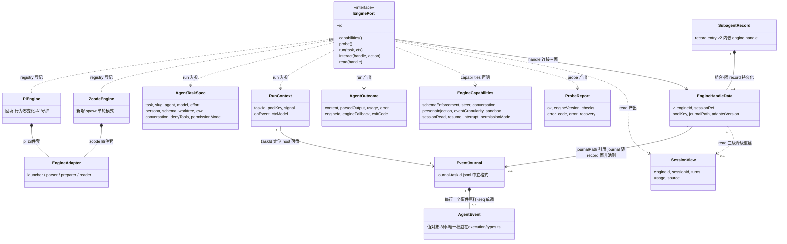
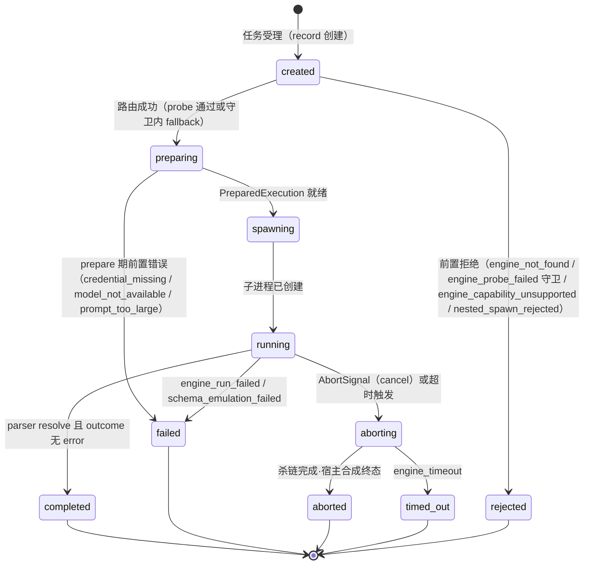
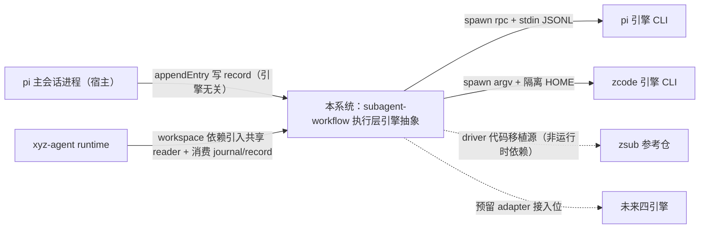
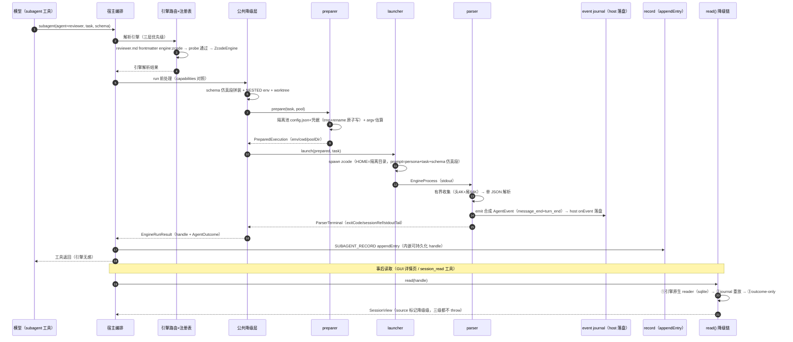

# subagent 执行层引擎中立抽象（pi / zcode / 未来多引擎）架构设计

> **权威源声明**：本文从设计文档 [docs/architecture/subagent-engine-abstraction.md](../../docs/architecture/subagent-engine-abstraction.md)（已过三轮对抗式审查，r3 报告 0 must-fix，达到可实施门槛）提炼，只做架构层提炼，不发明新决策。接口契约层（EnginePort 完整签名 / 中立类型字段 / handle 与 journal 格式 / adapter 四件套接口 / conformance 用例 / 隔离池方案）以设计文档 **§3.3.5-§3.3.9** 为唯一权威，本文引用不复制。决策账本见本目录 `decisions.md`（D-001~D-013）。

## 1. 目标转换

### 业务目标 → 系统目标

| 业务目标（requirements，G1-G5） | 转换为系统目标 | 衡量标准 |
|------|--------------|---------|
| G1 模型/用户不感知引擎：工具入参/返回/GUI 在引擎切换后完全不变 | EnginePort 抽象 + 中立类型层（AgentTaskSpec / AgentEvent / AgentOutcome / SessionView / EngineCapabilities），上层消费方（subagent 工具面 / workflow 引擎 / GUI）零改动 | A1 pi 零回归；A2/A6 引擎切换后 GUI 无引擎字段泄漏；同一 agent 清单、同一种 record、同一个 schema 校验结果 |
| G2 配置自由切换：全局默认 / per-agent / 单次调用三层优先级 | 配置三层路由（调用参数 engine > agent .md frontmatter engine > 全局默认缺省 pi）+ 引擎注册表（id → factory）；未注册 id 在 agent 解析期报错前置暴露 | A7 单次调用覆盖；A6 混编 workflow 双引擎 record 结构一致；A9 fallback 与守卫对照组 |
| G3 能力差异显式化：不支持的能力不运行时神秘失败 | EngineCapabilities 三级声明（native / emulated / unsupported，口径=链路接通能力）+ 公共降级层（schema 仿真 / abort+超时杀链 / event journal / persona 路由 / 嵌套防护 / worktree 隔离）+ 能力缺陷四级处置（D11），全部发生在 spawn 之前 | A3 仿真降级调用前可见；A8 session 读取三级降级链；A11 调用前同步拒绝 |
| G4 抗版本漂移：引擎 CLI 升级破坏契约不静默挂死 | 引擎探针按契约稳定性分级（probe + 已知样本回归）+ 错误码全集每个配恢复指引 + 故障 fallback 三守卫 + `engine_run_failed` 运行中兜底（宿主合成终态） | A5 探针入口拦截；A9 守卫命中不兜底直接报错；A14 运行中失败 record 正常收尾无僵尸进程 |
| G5 新引擎接入成本递减：接入第 N 个引擎不改上层与既有引擎 | adapter 四件套模块边界（launcher / parser / preparer / reader）+ engine conformance 契约套件（C1-C8）+ golden 样本库作为新引擎验收门 | A12 契约套件全绿且负例转红（套件有牙）；终态五：新引擎 = 一个 `engines/<id>/` 模块 + 注册表一行 + golden 样本（预计 ≤500 行） |

### 搭便车改造目标

无（设计文档 scope 收敛，P1-P5 全部单元都服务于引擎抽象主线；执行层既有代码仅做「引擎抽象必需」的回填移动）。若实施中发现候选搭便车项（如 session-runner 内联 spawn 细节的顺手清理），只能登记为 `候选`/`打回` 状态回流确认，不默认纳入。

## 2. 设计立场

**核心计算 = 「把一个 agent 任务可靠地外包给外部 coding-agent CLI，并把其异构事件流/终态归一化为中立类型」。**

这是**技术流程编排**（prepare → spawn → parse → journal → record 的管道 + 契约单点 + 降级策略），不是 DDD 业务规则编排——没有业务聚合与事务边界，全部不变式都是「契约 / 格式 / 时序」性质（事件产出不变量五条、handle 不透明性三条、终态序唯一）。据此的分层决策：

- **三层正交 + 一层横切**：中立类型层（语义）→ EnginePort 接口层（契约）→ 引擎 adapter 层（实现）；公共降级层横切引擎无关能力（写一次全引擎复用）。
- **依赖方向单向**：上层 → 中立类型 / port；adapter → 公共降级层；xyz-agent runtime 永不 import adapter 运行时件（launcher/preparer/parser）与 EnginePort 实例，例外仅两个：双端复用的无状态共享 reader 模块与中立制品（record + journal）。
- **宿主编排**：引擎只当单 agent 执行器，六引擎原生多 agent 机制（CC Task / codex ThreadSpawn / opencode task / kimi AgentSwarm）一律禁用不依赖；编排权、并行、record、worktree 全在宿主。
- **错误先于进程**：配置错误前置 agent 解析期、契约漂移前置探针、argv 超限前置 prepare 期；运行中漏网漂移由 `engine_run_failed` 与宿主终态合成兜底，不静默挂死。

## 3. 统一语言（Ubiquitous Language）

> 沿用项目领域术语表 [docs/architecture/context.md](../../docs/architecture/context.md) 既有术语（Session / Panel / Agent Runtime / subagent / record 等）。本节只列本主题**新增**术语。

| 术语 | 含义 |
|------|------|
| EnginePort | 引擎可插拔的**唯一契约点**接口，五面：`run`（一次性任务主语义）/ `interact`（交互控制面，可选）/ `read`（session 历史读取）/ `probe`（契约漂移探针）/ `capabilities`（能力声明） |
| EngineHandle | run/interact/read 三面的连接件；不透明、可持久化、自描述（持久化形态 EngineHandleData） |
| AgentTaskSpec | 中立任务声明（= 现有 ExecuteOptions 泛化，剥离 pi 专有语义：thinkingLevel→effort、skillPath→persona 收拢） |
| AgentEvent | 中立事件流值对象（8 种：tool_start/tool_end/text_delta/thinking_delta/turn_end/message_end/compaction/error；唯一权威定义在 execution/types.ts，引擎层 re-export 不复制） |
| AgentOutcome | 引擎层终态 DTO（锚定 orchestration 层 AgentResult——workflow 引擎消费的那份；与 execution 层同名类型消歧：execution 层 AgentResult 是 record 内部投影，保持原名不动） |
| SessionView | session 历史读取的统一投影（read 返回；turns 派生数据 + source 降级级标记） |
| EngineCapabilities | 引擎能力声明式描述（十维：schemaEnforcement/steer/conversation/personaInjection/eventGranularity/sandbox/sessionRead/resume/interrupt/permissionMode） |
| capabilities 三级声明 | `native`（引擎原生链路）/ `emulated`（公共层仿真降级）/ `unsupported`（调用前拒绝）；口径是**链路接通能力**而非引擎理论能力（pi RPC 有 steer 但链路未接通，首期声明 unsupported） |
| adapter 四件套 | 每引擎内部四模块：launcher（spawn 命令组装，唯一持 spawn 权）/ parser（stdout→事件流+终态）/ preparer（env/隔离目录/凭据生成，spawn 前唯一副作用模块）/ reader（session 历史读取，共享只读模块） |
| event journal | 宿主落盘的中立事件日志（`<getDataDir()>/engines/<engineId>/<poolKey>/journal-<taskId>.jsonl`，每行 AgentEvent 原样 + ts + host 侧单调 seq；SessionView 降级链第②级数据源，全引擎免费获得） |
| 隔离目录池（poolKey / refs.json） | per-engine 隔离目录（`<dataDir>/engines/<engineId>/<poolKey>/`）跨任务池化复用；poolKey = 净化后 agent 名（pi 无池化恒 `shared`，仅为路径形状统一）；refs.json 登记池引用计数，随 record 生命周期释放 |
| conformance 契约套件 | 任何 adapter 必须全绿的契约测试（C1-C8：probe 形状 / run 简单任务 / 事件不变量 / abort / read 降级链 / schema 分流 / 嵌套防护 / prepare 前置错误）+ 负例元测试保套件有牙 |
| golden 样本库 | 每引擎真实流量录制的 stdout 原始字节 + 期望 AgentEvent 序列（`conformance/golden/<engineId>/<engineVersion>/`；探针已知样本回归复用同一批，一处采集两处消费） |
| 引擎探针（probe） | 引擎 factory 初始化与版本变化检测时触发的干跑校验（不调 LLM）：二进制存在 + 版本解析 + 已知样本/schema 回归，产出 ProbeReport |
| 引擎注册表（registry） | engine id → factory 的登记点（`execution/engine/registry.ts`）；未注册 id 在 agent 解析期报 `engine_not_found` |

## 4. 核心模型

| 模型 | 类型 | 不变式（变更守卫） | 建模理由 |
|------|------|------|------|
| AgentTaskSpec | DTO | 引擎无关性：不得携带任何引擎专有枚举/flag 形态（pi 7 档 thinkingLevel 已剥离为 effort）；`schema` 字段是 native/emulated 硬分流依据（D4）；引擎专属项（fork）由各引擎按 capabilities 在 prepare 期拒绝 | 任务声明与运行期句柄分离（signal/ctxModel/onComplete 归 RunContext，不属于任务声明） |
| AgentEvent | 值对象 | 产出不变量五条（设计文档 §3.3.7，conformance C3 断言清单）：① 终态序唯一——最后一个非 error 事件必是 turn_end，message_end（若出现）必在其前；② message_end.usage 出现时必为完整形状，给不出就显式缺省，不给残缺对象；③ 流式引擎全部 text_delta 拼接 === outcome.content（byte 级），coarse 引擎 turn_end 前至少一个 message_end；④ tool_start/tool_end 按名配对，终态前未配对的必须补齐或后续 error；⑤ 事件 emit 完成先于 run() resolve（journal 完整性依赖）。唯一权威定义在 execution/types.ts，引擎层只 re-export 不复制第二份 | 事件流归一化的中立载体；journal 重放等价性的基础 |
| AgentOutcome | DTO | 终态序唯一（run resolve 即终态）；运行中失败**不 reject**——合成 error outcome + 正常 handle 返回（record 必须收尾）；`engineId` = 实际执行引擎（fallback 后可能 ≠ 请求值）；`exitCode: null` = 被信号杀死（杀链/abort 合成终态判据）；parsedOutput：native 引擎直传 / 仿真层 ajv 产出（硬分流，无第二校验权威） | 引擎终态归一化 + fallback 留痕（engineFallback 投影，GUI 警告条数据源） |
| EngineHandleData | 值对象（可持久化、自描述） | 不透明性三条：① 上层不解构——仅 record 持久化层与 read 降级链可用其字段；② 可持久化——内嵌 record entry（v2 `engine.handle`），主会话 reload 后 read 仍可用；③ 自描述——含 engineId + 引擎 session 定位符（sessionRef）+ poolKey + journalPath + adapterVersion。推论：对进程已死的 handle 调 interact 必返 `engine_session_not_resumable`，不笼统失败 | run/interact/read 三面连接件；spawn 成功即构造（失败终态也返回 handle 供 journal 定位）；存量 v1 record 缺省按 pi 投影零迁移 |
| EngineCapabilities | 值对象（声明式） | 声明的是链路接通能力而非引擎 RPC 理论能力；同步无副作用（调用前拒绝的判据）；schemaEnforcement 的 native/emulated 是硬边界（native 路径禁止二次校验） | 调用前拒绝 / 降级策略的**唯一分发依据**（D11 规则①：处置由能力类别决定，不由引擎 id 决定） |
| SessionView | DTO | `source` 标记降级级（native / journal / outcome-only）且三级都不 throw；重放等价——journal 重放与 live 通路共用同一 reducer（conformance C5 断言）；ReplayedTurn 无内部态（_status/startedTs 剥离，closed 恒 true） | 读取三级降级链的统一投影（GUI 详情页 / session_read 工具） |
| ProbeReport | DTO | ok=false 时 error.recovery 必非空（可操作错误）；engineVersion 为实测值（handle.engineVersion 数据源）；checks 逐项（二进制存在/版本解析/干跑回归） | 探针结果可操作化（终态四错误形态的载体） |

### 模型关联图（条件强制）



> 关系符号说明：`*--` 组合（同生命周期）/ `-->` 引用（独立生命周期）/ `..>` 依赖（产出）。journal 与 handle 引用但**不随隔离池删除**——生命周期跟随 record（D5）；record 对 handle 是组合（record entry 内嵌持久化）。

### 降级决策（主动不建模）

| 概念 | 为什么不建模 | 应有的处理 |
|------|------------|-----------|
| 引擎 CLI 版本/安装状态 | 运行时异质环境事实，类型系统表达不了 | 探针 ProbeReport 承载（factory 初始化 + 版本变化检测触发） |
| 各引擎原生事件格式（pi JSONL / zcode sqlite / CC stream-json…） | 引擎内部实现细节，进中立类型即污染 | parser 边界吸收；golden 样本库回归守护 |
| 六引擎原生多 agent 编排语义 | 与宿主编排冲突（双编排权威） | 宿主编排纪律禁用（§2；D8 推论），不建模不依赖 |
| 常驻 server 会话池（driver host） | 首期无 server-mode 引擎落地，建模即投机 | 接口已常驻友好（onEvent 回调 + AbortSignal），`driver host` 命名预留，首个 server-mode 引擎接入时落地 |

## 5. 状态流转

### Status 枚举（只描述阶段，不含原因）

**引擎任务生命周期（新引入，一次 `run` 调用的内部阶段）**：

| Status | 含义 | 关键动作 |
|--------|------|---------|
| created | 任务受理（record 创建，引擎路由完成前） | 三层优先级解析引擎 |
| preparing | preparer 执行 | env / 隔离目录池 / 凭据生成 / argv 长度估算——错误在此前置 |
| spawning | launcher spawn | 进程创建；spawn 成功即构造 handle |
| running | parser 消费 stdout | emit AgentEvent（host 落 journal） |
| aborting | abort 分级执行 | 原生中断 → 公共杀链（SIGTERM → grace → SIGKILL） |
| terminal（终态集合，不可逆） | completed（outcome 无 error）/ failed（运行中或前置失败）/ aborted（用户 cancel，宿主合成终态）/ timed-out（engine_timeout，杀链走完） | record 正常收尾，不留僵尸进程 |

**record 状态（保持现有 subagent 状态机，不动）**：`ExecutionStatus = running | closed` 两态 + `ClosedReason`（parent-shutdown / parent-fork / parent-new / user-close / cancelled / gc）正交子枚举 + 对外四态投影（active / waiting / ended / error，`mapExternalState`）。引擎任务生命周期是 record 内一次执行的引擎侧阶段，不改变 record 对外状态契约。

### Reason 字段（描述终态原因，与 Status 正交）

错误码全集 = 设计文档 §3.3.3 的 **11 个**，每个配恢复指引（可操作错误闭环）；另有 `engineFallback: {from, reason}` 为**非错误**留痕字段（record + GUI 警告条）：

| Reason（错误码） | 触发时机/面 | 对应终态或拒绝形态 |
|------|------|------|
| engine_not_found | agent 解析期（frontmatter 写了未注册 id） | 前置拒绝（created 前，同步） |
| engine_probe_failed | 引擎 factory 初始化 / 版本变化检测（守卫命中或 strict 模式） | 前置拒绝；无守卫时 fallback 留痕继续（非错误） |
| engine_credential_missing | prepare 期 | failed（不创建进程） |
| model_not_available | prepare 期（model 在引擎 provider 体系不可解释，不做隐式换引擎） | failed（不创建进程） |
| prompt_too_large | prepare 期（argv 估算超限且引擎无 stdin/file 通道） | failed（不创建进程） |
| nested_spawn_rejected | spawn 前防护（NESTED 标记检测） | 前置拒绝（同步，无进程） |
| engine_capability_unsupported | 调用前（对声明 unsupported 的能力发起调用：interact/conversation/steer） | 前置拒绝（同步，无进程） |
| engine_session_not_resumable | interact 面（进程已死的 handle 续聊） | InteractResult 错误（指向 cold resume，不挂死） |
| schema_emulation_failed | 运行中（仿真层三级容错 + 重试一次仍不过） | failed（record 收尾，错误含原始输出尾部） |
| engine_run_failed | 运行中（stdout 解析失败 / 非零退出 / 漂移越过探针爆发） | failed（宿主合成终态，record 收尾） |
| engine_timeout | 宿主超时杀链走完 | timed-out（含 stdout 尾部 2000 字 + 重跑建议） |

### 合法转换（图或表，含终态集合不可逆）



补两条转换语义（图无法表达）：① probe 失败且**无守卫**时 created 不进 rejected，而是路由回全局默认引擎（缺省 pi）继续 preparing，record 记 `engineFallback`；② run 的 prepare 期错误在进程创建前 reject（不产生 handle）；运行中失败与 abort **不 reject**——合成 error outcome + 正常 handle 返回（record 必须收尾）。

## 6. 分层架构

### 层级图

```
[上层消费方：subagent 工具面 / workflow 引擎 / GUI]      ← 不感知引擎（只消费中立类型）
        ↓
L1 中立类型层：AgentTaskSpec / AgentEvent / AgentOutcome / SessionView / EngineCapabilities
        ↓ 唯一契约点
L2 EnginePort 接口层（五面）：run / interact / read / probe / capabilities
        ↓
L3 引擎注册表（id → factory）→ adapter 四件套（launcher / parser / preparer / reader）
   ├─ engines/pi/     （现有 spawn 链回填，行为零变化）
   ├─ engines/zcode/  （新增，spawn 单轮模式）
   └─ （未来：claude-code / codex / opencode / kimi-code 接入位）
        ↑ adapter 依赖（单向）
横切 公共降级层（引擎无关，写一次全引擎复用）：
   schema 仿真（仅 emulated）/ abort 两级中断 + 超时杀链 / event journal 落盘 /
   persona 路由（file/flag/prompt 三策略 + argv 估算）/ 嵌套防护 / worktree 隔离 / 隔离目录池
        ↑ 共享只读模块（双端复用）
xyz-agent runtime（subagent-extractor）：reader（①级）→ journal（②级）→ record outcome（③级）
（未来）driver host：server-mode 引擎常驻进程管理（接口已常驻友好，命名预留，首个 server-mode 引擎接入时落地）
```

其中 **reader 是唯一允许被 runtime import 的引擎模块**（无状态纯函数、无 spawn/进程依赖、不 import 同包 launcher/preparer/parser），extension 的 `read()` 与 runtime 的 GUI 历史链路复用同一份。

### Port 清单

| Port | 价值定位 | 实现数 |
|------|---------|--------|
| EnginePort | 引擎可插拔**唯一契约点**：上层只认五面签名与中立类型，引擎差异（spawn 细节/事件格式/隔离手段/能力缺陷）全部止步于此；interact 为可选面（低交互引擎 unsupported 声明） | 2（PiEngine 回填 / ZcodeEngine 新增）；预留 4 个未来引擎 adapter 位 |
| AgentRunner（既有，不动） | orchestration ↔ execution 既有 port，本次仅 execution 内部委托链改造 | 1（SubprocessAgentRunner → 委托 EnginePort） |

引擎内部微接口（非全局 port）：adapter 四件套接口（launcher/parser/preparer/reader，设计文档 §3.3.7）——每引擎包内模块边界，launcher 唯一持 spawn 权、preparer 是 spawn 前唯一副作用模块、parser 对外统一「事件先发、终态后返」。

## 7. 模块划分与变化轴

| 模块 | 职责 | 变化轴（会因为什么改） |
|------|------|------|
| execution/engine/types.ts | 中立类型 + handle/journal 格式定义（字段规格见设计文档 §3.3.5-§3.3.6） | 中立类型字段演进（向下兼容追加） |
| execution/engine/port.ts | EnginePort 签名 | 接口语义变化（设计目标：极少——常驻兼容已预埋） |
| execution/engine/registry.ts | engine id → factory 注册表 | 新引擎登记（一行） |
| engines/pi/（四件套） | pi 回填：rpc 握手 / stdin JSONL 协议 / 事件适配 / JSONL 直读下沉为 pi reader | pi CLI 版本漂移（rpc.md 官方契约，低频） |
| engines/zcode/（四件套） | zcode 新增：argv 组装 / HOME 隔离池 / stdout 单 JSON parser / sqlite reader（吸收 zsub driver/bootstrap/model-router 的 TS 重写） | zcode CLI stdout schema 漂移（逆向无契约，高频——只改 parser + golden 样本补录） |
| 公共降级层 · schema 仿真 | prompt 注入 + 三级容错提取 + ajv（**仅服务 emulated 引擎**） | 仿真策略调整（只改此一处，全引擎生效） |
| 公共降级层 · 杀链 | abort 两级中断（原生 → 公共杀链）+ 超时杀链 + 宿主终态合成 | 杀链时序 / 信号策略 |
| 公共降级层 · journal | host 消费 onEvent 统一落盘中立 JSONL（格式 §3.3.6） | journal 格式版本升级 |
| 公共降级层 · persona 路由 | file/flag/prompt 三策略 + argv 长度估算前置拦截 | 新注入通道 |
| 公共降级层 · 嵌套防护 + 隔离池 | 统一 NESTED 标记 + 清理各引擎原生标记；poolKey/refs.json 池管理（§3.3.9） | 清理时序策略 |
| conformance/ | C1-C8 契约用例 + golden 样本库 + 负例元测试（golden 回放层进 CI，run 层手动门） | 新引擎样本 / 新不变量 |
| shared meta-parser（engine 字段） | agent .md frontmatter engine 解析 | 路由规则 |
| runtime subagent-extractor（P5） | 按 record engine 字段路由 reader（①级）→ journal（②级）→ record outcome（③级）三段读取 | 新引擎 reader 登记 + tsup noExternal |

**变化轴归纳**（隔离变化的模块边界验证）：新引擎接入 = 只加 `engines/<id>/` 模块 + registry 一行 + golden 样本；引擎 CLI 漂移 = 只改对应引擎 parser + golden 样本补录；降级策略 = 只在公共降级层。三者互不传染——这是 G5 的结构性来源。

## 8. 系统间上下文边界（Context Map）



| 关联系统 | 关系模式 | 交互方式 | 契约稳定性 |
|------|------|------|------|
| pi 引擎（外部 CLI） | 客户-供应商 | spawn `--mode rpc` 子进程 + stdin JSONL + stdout 事件流 | 高：官方 rpc.md 契约 |
| zcode 引擎（外部 CLI） | 客户-供应商（逆向） | spawn + argv 投递 + stdout 单 JSON；HOME 隔离目录 | 低：逆向无契约，help flag 已有漂移实锤（`--max-turns` 列出但拒收）→ 探针 + golden 防护 |
| xyz-agent runtime | 共享内核（共享 reader 模块 + 中立制品） | workspace 依赖引入 reader；消费 record（engine 字段）与 journal（路径白名单校验后读） | 本仓控制；双 bundle 打包纪律（tsup noExternal + validate-runtime-bundle） |
| zsub 参考仓（zcode-plugin-workspace） | 上游参考（**非运行时依赖**） | driver/bootstrapIsolatedHome/model-router 代码移植源（TS 重写吸收） | 不依赖其演进节奏 |
| 未来四引擎（claude-code/codex/opencode/kimi） | 预留接入位 | 各自 adapter 四件套 | 各异：CC 官方文档+Zod / codex 机器 schema / opencode openapi 3.1 / kimi 文档化 |
| pi 主会话（宿主进程） | 宿主 | extension 跑在其进程内；record 经 appendEntry 写主会话 entry | 本仓控制 |

## 9. 泳道图（Swimlane）

设计文档 §3.3.4 物理数据流（以 reviewer@zcode 为例）的 sequenceDiagram 版：



pi 引擎路径与此图同构，差异仅在 Route 选中 PiEngine、Prep 无隔离池（PI_CODING_AGENT_DIR）、Launch 走 rpc stdin 协议、Parse 为流式逐行翻译、schema 走 native env 注入（不过仿真层）。

## 10. 挑战与决策

> 以下 D1-D12 与设计文档 §3.3.2 一一对应（账本映射：decisions.md D-001~D-013，其中 D7/D9 合记于 D-007/D-009）。每条均**已被三轮对抗式审查确认**（r1 修 3 must-fix / r2 修 4 must-fix + 6 suggestion / r3 复审 0 must-fix；D11/D12 为二轮修订新增）。

### D1: 接口主语义锚定「一次性任务」，交互控制面单列可选方法
**张力**: fire-to-completion 的接口简洁性 vs pi conversation 的交互控制面（chatMode 的 message/close/cancel + idle 续聊 + 进程保留）。
**决策**: `run(task) → outcome` 是主语义；EnginePort 补第四面 `interact(handle, action)`——pi 首期原生实现（现有 chatMode 行为直通）、zcode 首期 unsupported（调用前拒绝）、未来低交互引擎可由公共层「run + resume + 宿主 idle timer」冷仿真。配套 handle 契约三条（不透明/可持久化/自描述）与 abort 分级（AbortSignal → 原生优雅中断 → 公共杀链兜底；CLI-only 引擎直接走杀链，宿主合成终态）。
**理由**: 折叠成「run + resume 序列」会改 pi 行为（每轮冷启动 vs 同进程 idle 复用）违反 A1 零回归；「session 型 + run 型」双语义重构让首期复杂度翻倍（subagent 场景一次性任务占绝对多数）；常驻 server 形态留作引擎内部优化（onEvent + AbortSignal 已常驻友好）。**[已被三轮对抗审查确认]**

### D2: 中立类型从现有类型泛化，不另起炉灶
**张力**: 全新设计一套更「完美」的类型 vs 现有类型被广泛消费的迁移成本。
**决策**: AgentTaskSpec = 现有 ExecuteOptions 泛化（thinkingLevel 7 档 → 引擎无关 effort；skillPath 收拢进 persona；conversation/idleTimeoutMs 归 interact 控制面的 task 标志保留透传）；AgentEvent 8 种原样保留（唯一权威 execution/types.ts）；AgentOutcome 锚定 orchestration 层 AgentResult（与 execution 层同名类型消歧）。
**理由**: 现有类型被 workflow 引擎 / GUI / 测试广泛消费，推倒重来是纯迁移成本；四个核心类型事实上已中立（碰巧中立 → 设计中立）。**[已被三轮对抗审查确认]**

### D3: capabilities 三级声明 native / emulated / unsupported
**张力**: 引擎理论能力 vs 本仓链路接通能力；声明式 vs 运行时探测。
**决策**: 十维 EngineCapabilities 三级声明；声明口径是**链路接通能力**（pi RPC 有 steer 但 spawn 链路未接通，首期声明 unsupported，接通后升级声明）；上层据声明选择策略（schema emulated 自动走公共仿真层、unsupported UI 隐藏入口并提示），不 try-catch 运行时试错。
**理由**: 运行时能力探测成本高且不可靠（有的能力要跑到一半才知道）；声明式让「引擎给不了什么」在调用前可见（G3）。**[已被三轮对抗审查确认]**

### D4: 降级能力归属公共层，native 与仿真路径硬分流
**张力**: 降级逻辑分散各 adapter vs 收口公共层；宿主二次校验的安全感 vs 引擎原生校验的唯一权威。
**决策**: schema 仿真、超时杀链、persona 路由、嵌套防护、worktree 隔离五件放公共降级层（写一次全引擎复用）；schema 的 native/emulated 是**硬边界**——emulated 引擎走公共仿真（prompt 注入 + 三级容错 + 宿主 ajv），native 引擎保持各自原生链路，公共层不做二次校验、不改写其结果。
**理由**: 六引擎缺失能力高度重合（schema 4/6 缺、超时 6/6 缺、sandbox 5/6 缺）——公共层是消除重复的正确位置；pi structured-output 方案 A [HISTORICAL]（env 注入的权威 schema 是唯一校验权威）——宿主再叠一层 ajv 会制造第二校验权威，恰是「校验自报 schema 致修复静默丢失」历史事故的形态。**[已被三轮对抗审查确认]**

### D5: 环境隔离与凭据注入走 per-engine preparer；隔离目录池化保留，随 record 生命周期回收
**张力**: 六家六种互不兼容的隔离手段无法参数化；单任务清理 vs 跨任务复用。
**决策**: `prepare(task)` 返回 env/cwd/spawnedFiles + argv 估算（超限前置报 prompt_too_large，禁 spawn 后撞 E2BIG）；隔离目录按引擎+poolKey 池化**跨任务保留**；清理时序挂钩 record 生命周期但只做到**池粒度**（refs.json 引用计数，计数归零或引擎配置移除才整池删）；journal 不随池删（生命周期跟随 record）；spawnedFiles 单次性产物任务结束即清理（resume 保留）；清理失败置 `.cleanup-failed` 可观测标记。
**理由**: 池内 db.sqlite 是读取降级链①级数据源，任务结束即清理该级永不可达；config 引导是确定性成本池化摊薄；对逆向 schema 的 sqlite 做单 session 手术式删行与「原生读取必然周期性失效」同构脆弱。**[已被三轮对抗审查确认]**

### D6: session 读取独立 SessionView 接口 + 三级降级链；第②级归属宿主 event journal
**张力**: 引擎原生读取保真度最高 vs 必然周期性失效；adapter 各自缓存 vs 宿主统一落盘。
**决策**: `read(handle)` 返回 SessionView，降级链 ①引擎原生读取（每引擎 reader）→ ②宿主 event journal（host 消费 onEvent 统一落盘中立格式）→ ③outcome-only 摘要卡；**reader 做成无状态共享只读模块双端复用**（extension 的 read() 与 runtime 的 GUI 历史链路同一份）；pi 的 runtime 直读 JSONL 现状下沉为 pi reader，行为不变（A1 守护）；journal 路径由 handle 自描述 + runtime 前缀白名单校验（getDataDir() 动态推导）。
**理由**: zcode sqlite schema 随版本迁移、kimi wire.jsonl 官方警告勿手改——原生读取必须有一级保底；adapter 各自缓存会演变六种格式；journal 是 AgentEvent 序列（粗粒度引擎仅合成事件）保真度低于原生，故 GUI 常态走①级、pi 不当「纪律约束不了自家引擎」的例外。**[已被三轮对抗审查确认]**

### D7: 探针体系按契约稳定性分级
**张力**: 统一强探针浪费 vs 统一弱探针危险（zcode 无契约与 codex 机器契约是稳定性光谱两端）。
**决策**: 每引擎 `probe()`：二进制存在 + 版本解析 + 一次干跑校验（不调 LLM）——zcode 探 `--version` + 解析器对已知样本回归（golden 复用）；CC/codex 用官方 schema 机器校验（探针最轻）。探针在引擎 factory 初始化与版本变化检测时触发；失败走终态四错误形态（含恢复指引）+ 有守卫的 fallback（D9）。
**理由**: 契约稳定性光谱两端，统一强度要么浪费要么危险；已知样本回归让探针与 golden 库一处采集两处消费。**[已被三轮对抗审查确认]**

### D8: 嵌套防护双层；宿主编排禁用引擎原生多 agent 机制
**张力**: 依赖「隔离目录不装扩展」的配置洁癖 vs 跨引擎可靠手段。
**决策**: 统一 `XYZ_AGENT_SUBAGENT` env 标记（所有引擎 spawn 都注入，adapter 检测到即拒绝递归派发）+ 各引擎清理/利用原生标记（CLAUDECODE / ZSW_NESTED / PI_SUBAGENT_*）；六引擎原生多 agent 机制一律禁用（宿主编排纪律）。
**理由**: opencode/CC 会吃项目级 `.opencode/`/`CLAUDE.md` 配置，隔离目录不装扩展依赖配置洁癖不可靠；env 标记是唯一跨引擎可靠手段。**[已被三轮对抗审查确认]**

### D9: 配置路由三层 + 故障 fallback 三守卫；model 与 engine 正交
**张力**: 可用性（引擎坏了兜底继续跑）vs 显式意图（静默换引擎卸除能力是安全反模式）。
**决策**: 三层优先级（调用参数 engine > agent .md frontmatter engine > 全局默认缺省 pi）；未注册 id 在 agent 解析期报错；probe 失败默认路由回全局默认引擎并留痕（record `engineFallback` + GUI 警告条），但**三守卫任一命中不 fallback、按 strict 语义报错**：a) engine 来自显式指定；b) task 声明依赖该引擎独有能力；c) 显式 model 在默认引擎不可解析（报 model_not_available）；strict 模式一切 probe 失败直接报错。model 与 engine 正交（不按模型名隐式推引擎）；workflow 脚本不写死 engine（step 级仅限独有能力并注释原因）。
**理由**: 沙箱类任务被静默换引擎 = 静默卸除安全能力；zsub frontmatter.model 先例与六家 agent .md 体系兼容。**[已被三轮对抗审查确认]**

### D10: MVP 引擎集 = { pi, zcode }；zcode 首期只做 spawn 单轮
**张力**: 抽象按六引擎全集设计（防返工）vs 实现按最小集推进（防过度工程）。
**决策**: 首期落地 pi（回填，行为零变化）+ zcode（spawn 单轮模式）；app-server 常驻、conversation 模式、其他四引擎实现不进首期；第二验证引擎建议 claude-code（契约最清晰、验证 native schema 直传），明确标注为后续 Phase 非首期承诺。
**理由**: 先回填后新增隔离回归风险；六引擎能力全集已用四份调研约束接口（防设计错返工），实现按最小可验收集推进。**[已被三轮对抗审查确认]**

### D11: 能力缺陷按四级处置，capabilities 声明是唯一分发依据
**张力**: 缺陷处理散落 if 分支 vs 统一分发；错误暴露越早越好 vs 有的错误只能运行中发现。
**决策**: 四级处置——自动仿真（schema，公共层产出与 native 同形）/ 显示降级（粗粒度事件流、缺失 usage/cost——信息在引擎侧根本不存在，永不弹错）/ 调用前拒绝（unsupported 能力、嵌套、argv 超长——同步结构化错误不创建进程）/ 入口拦截（探针失败、凭据缺失、未注册 id——含恢复指引）。三条规则：处置由能力类别决定不由引擎 id 决定（新引擎填好声明即继承全部处置）；错误尽量先于进程创建（配置→agent 解析期、漂移→探针、超限→prepare 期），封死边界如实声明——探针只做已知样本回归，运行中漂移由 `engine_run_failed` + 宿主终态合成兜底；模型与用户错误通道分开（模型收「能改变下一次调用」的文案，用户侧 GUI 隐藏入口让错误尽量不发生）。
**理由**: 「对不齐」的能力必须显式建模降级形态（G3/G4），散落 if 会随引擎数爆炸。**[已被三轮对抗审查确认（二轮修订新增）]**

### D12: 新引擎接入以 conformance 契约套件 + golden 样本库为验收门
**张力**: 「接入成本递减」作为口号 vs 作为可验证机制。
**决策**: 一套任何 adapter 必须通过的契约测试（C1-C8：probe 形状 / run 简单任务 / AgentEvent 不变量五条 / abort 行为 / read 降级链 / schema 分流 / 嵌套防护 / prepare 前置错误）+ 每引擎真实流量 golden 样本（parser 回归 + 探针复用）+ 负例元测试（故意破坏不变量断言套件转红，保套件有牙）；两层结构（golden 回放层免 LLM 免二进制进 CI / run 层真实 spawn 手动门）。新引擎接入清单 = adapter 四件套 + 注册表一行 + golden 样本 + 契约套件转绿。第三验证引擎建议 opencode（迫使 driver host 从理论变现实，趁早压测常驻兼容性）。
**理由**: 递减由可验证机制承载不靠口号；负例守护防止套件退化为橡皮图章。**[已被三轮对抗审查确认（二轮修订新增）]**

### 特化决策（违反通用规则的）

| 特化 | 违反什么 | 为什么合理 | 触发变化怎么办 |
|------|---------|-----------|---------------|
| reader 双端复用（extension + runtime 两个 bundle 引入同一引擎模块） | 「runtime 与 extension 代码隔离」的通用部署边界惯例 | reader 是无状态纯函数只读模块（无 spawn/进程依赖、不 import 同包运行时件），复用消除「双份解析器漂移」（GUI 与 session_read 看到同一份投影逻辑）；pi 直读下沉保 A1 | reader 一旦需要进程依赖，必须拆分双端各自实现，并重新评估 runtime 打包 |
| journal 落盘在 host 公共层但写进引擎目录树（`engines/<id>/<pool>/`） | 「谁的数据谁写」的目录归属直觉 | ②级降级数据源必须是引擎无关中立格式，归属 adapter 会演变六种格式；且 journal 不随池删，物理位置只是池路径复用 | 若池路径布局变更，journal 定位由 handle 自描述绝对路径携带，读取方不受影响 |
| pi 引擎 poolKey 恒 `shared`（无隔离池） | 「每引擎统一池化」的形式一致性 | pi 用 PI_CODING_AGENT_DIR 全局一份，池化无语义，恒值仅为路径形状统一 | 无演化压力；pi 若改隔离模型时按 D5 池化即可 |

## 11. 反模式检查（grep 验收清单）

机器可检查的 AC（路径基准：`extensions/universal/subagent-workflow/src/` 与 `packages/runtime/src/`；实施落地时允许按实际目录微调 pattern，语义不变）：

### AC-1: 引擎 id 分支反模式消除（方案 A 形态禁止）
- 验证：引擎选择只发生在 registry/路由层。除 `execution/engine/`（registry.ts 及 engines 内部）外，execution 层与 orchestration 层不得出现引擎 id 比较或字面量：
  ```bash
  grep -rnE "engine(Id| id)? ?(===|!==)" extensions/universal/subagent-workflow/src --include='*.ts' | grep -v 'execution/engine/'
  grep -rn "'zcode'\|\"zcode\"" extensions/universal/subagent-workflow/src/execution --include='*.ts' | grep -v 'execution/engine/'
  ```
  均无输出。

### AC-2: runtime 依赖方向（adapter 运行时件禁止 + EnginePort 实例禁止）
- 验证：adapter 运行时件（launcher/preparer/parser）只允许 `execution/engine/` 内部消费（registry 工厂与 engines 同包模块）；reader 为唯一例外。runtime 全域不得出现：
  ```bash
  grep -rn "engines/\(pi\|zcode\)/\(launcher\|preparer\|parser\)" packages/runtime/src extensions/universal/subagent-workflow/src --include='*.ts' | grep -v 'src/execution/engine/'
  grep -rn "execution/engine/port\|EnginePort" packages/runtime/src --include='*.ts'
  ```
  均无输出（第二条：runtime 只经共享 reader + record/journal 中立制品，不 import port 与实现实例）。

### AC-3: 双 schema 校验权威禁止（D4 硬分流的 native 侧）
- 验证：ajv 只允许出现在公共 schema 仿真模块与 conformance 测试；native 引擎路径（pi env 注入链路）不得出现 ajv：
  ```bash
  grep -rn "ajv" extensions/universal/subagent-workflow/src/execution/engine/engines/pi/
  grep -rln "ajv" extensions/universal/subagent-workflow/src/execution | grep -v -e schema-emulation -e conformance
  ```
  均无输出。

### AC-4: AgentEvent 唯一权威不复制第二份定义
- 验证：`AgentEvent` 的类型定义只存在于 execution/types.ts（引擎层与公共层只允许 re-export）：
  ```bash
  grep -rnE "interface AgentEvent |type AgentEvent ?=" extensions/universal/subagent-workflow/src --include='*.ts' | grep -v 'execution/types.ts'
  ```
  无输出。

### AC-5: 引擎目录路径硬编码禁止（engines 根锚定 getDataDir()）
- 验证：隔离池/journal 的 engines 目录必须从 getDataDir() 动态推导（extension 写侧与 runtime 校验侧同源），不得写死绝对/家目录路径：
  ```bash
  grep -rnE "'/engines/|\"/engines/|~/\.xyz-agent/engines|/Users/" extensions/universal/subagent-workflow/src/execution/engine packages/runtime/src/services/session --include='*.ts'
  ```
  无输出（新增 env 前缀如 XYZ_AGENT_SUBAGENT 同步登记 ENV_WHITELIST_PREFIXES SSOT，pre-commit 检查）。

## 12. 行为契约保持清单（refactor 模式）

> 本主题是重构 + 扩展：pi 引擎回填必须行为零变化（A1 锚点）。「保持」逐条登记如下；任何「变更/删除」是独立 ticket，不裹进本次架构改造。

### BC-1: pi 路径 record entry JSON 快照 diff 字段级等值
| 字段 | 内容 |
|------|------|
| 源码位置 | subagent-service.ts（appendEntry SUBAGENT_RECORD 链） |
| 处理 | 保持（A1① 锚点：合入前后 record entry JSON 快照字段级 diff 一致） |
| 冲突 | 无 |

### BC-2: pi 路径 GUI 关键视图基线一致
| 字段 | 内容 |
|------|------|
| 源码位置 | record 消费链（GUI 对话流 / 工具面板 / record 详情） |
| 处理 | 保持（A1② 锚点：截图基线比对一致；引擎字段不泄漏到 GUI） |
| 冲突 | 无 |

### BC-3: pi schema env 注入链路 byte 级等值
| 字段 | 内容 |
|------|------|
| 源码位置 | session-runner / pi-invocation（schemaEnv 派生） |
| 处理 | 保持（launcher 从 task.schema 派生 env 值，映射层与现有 schemaEnv 逐字节等值；native 路径不过仿真层——D4 硬分流，A1③ 锚点） |
| 冲突 | 无 |

### BC-4: session-runner 现有测试全绿
| 字段 | 内容 |
|------|------|
| 源码位置 | execution 层既有测试（session-runner.test 等） |
| 处理 | 保持（P1 回填期行为零变化的机器守护；测试不改断言即转绿） |
| 冲突 | 无 |

### BC-5: pi runtime 直读 JSONL 行为不变
| 字段 | 内容 |
|------|------|
| 源码位置 | packages/runtime/src/services/session/subagent-extractor.ts |
| 处理 | 保持（P5：pi 既有直读逻辑下沉为 pi reader 共享模块，读取行为与产出投影不变，A1 守护） |
| 冲突 | 无 |

### BC-6: 存量 record 零迁移
| 字段 | 内容 |
|------|------|
| 源码位置 | record 持久化层（SubagentRecordEntryData v1→v2） |
| 处理 | 保持（v1 entry 缺 engine 字段一律按 pi 投影 + sessionFile 定位；不做任何数据迁移） |
| 冲突 | 无 |

### BC-7: pi conversation/chatMode 交互行为直通
| 字段 | 内容 |
|------|------|
| 源码位置 | subagent-service.ts（chatMode idle 复用 / message/close/cancel action，types.ts 556-565） |
| 处理 | 保持（interact 面 pi 首期原生实现 = 现有行为直通，不走仿真；A13 死 handle 场景返回 engine_session_not_resumable 而非行为变化） |
| 冲突 | 无 |

### BC-8: AgentEvent / AgentResult 消费方零改动
| 字段 | 内容 |
|------|------|
| 源码位置 | execution/types.ts（8 种事件）+ orchestration/models/types.ts（AgentResult） |
| 处理 | 保持（8 种事件原样、AgentResult 字段原样；新增字段只追加不改既有字段语义；execution 层同名 AgentResult 保持原名不动） |
| 冲突 | 无 |

## 下游衔接

### 喂给 Step 3（Issue 拆分）的部分

| 本文档章节 | issue 拆分用途 |
|-----------|---------------|
| §7 模块表（对齐设计文档 §5 P1-P5 阶段表） | Wave/issue 单元切分基准：P1 中立类型 + EnginePort + PiEngine 回填 → P2 公共降级层 → P3 ZcodeEngine → P4 配置路由 + capabilities + 探针 + conformance → P5 runtime extractor 分协议（中改动，单独 commit） |
| §10 D1-D12（+ decisions.md D-001~D-013 不可逆清单） | 每 issue 的方案约束与验收依据；issue 不得推翻已确认决策 |
| §11 AC-1~AC-5 | issue 完成定义（DoD）的机器检查项 |
| §12 BC-1~BC-8 | P1/P5 回归锚点（挂 A1/A13/A8 验收场景）；任何 BC 变更 = 独立 ticket |
| §4 不变式（事件五条 / handle 三条 / 终态序唯一 / capabilities 口径） | conformance 契约用例 C1-C8 的断言来源 |
| §5 状态机 + Reason 映射表 | 错误规格落地的枚举清单与测试场景（A5/A9/A11/A14） |
| 设计文档 §4 A1-A14 验收场景 | issue 验收场景分配（A1/A13→P1；A10→P2；A2/A3/A4/A8/A14→P3；A5/A6/A7/A9/A11/A12→P4；A2 GUI 部分 + A8→P5） |
