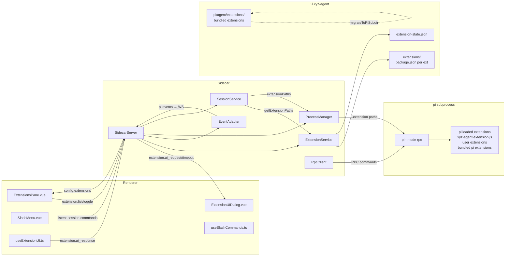

# Extension/Plugin 系统盘点报告

> 日期: 2026-05-27
> 工作目录: `feat-plugin-arch-2`
> 目标: 盘点当前代码中与插件/extension 相关的已有功能，为 Phase 1-4 实施做准备

---

## 1. Runtime (Sidecar) 侧

### 1.1 ExtensionService (`src-electron/runtime/src/extension-service.ts`)

**完成度: 完整**

- 完整实现了 `IExtensionService` 接口
- 功能: `scanExtensions()` / `getEnabledExtensions()` / `toggleExtension()` / `getExtensionPaths()`
- 数据模型: **黑名单模型** — `extension-state.json` 存储 `{ disabled: string[] }`，不在禁用列表中的 extension 视为启用
- 扫描目录: `~/.xyz-agent/extensions/`，每个子目录需包含 `package.json`
- 原子写入: `writeState()` 使用 write temp + rename

**边界情况处理完善:**
- 目录不存在 → 返回空数组（非错误）
- 子目录无 `package.json` → 跳过（非错误）
- `package.json` 无效 JSON → 跳过（非错误）
- `extension-state.json` 不存在 → 全部启用（非错误）

### 1.2 IExtensionService 接口 (`src-electron/runtime/src/interfaces.ts`)

**完成度: 完整**

```typescript
export interface IExtensionService {
  scanExtensions(): Promise<ExtensionInfo[]>
  getEnabledExtensions(): Promise<ExtensionInfo[]>
  toggleExtension(name: string, enabled: boolean): Promise<void>
  getExtensionPaths(): Promise<string[]>
}
```

已集成到 DI 系统，在 `index.ts` 中实例化并注入 `server.setServices()`。

### 1.3 Server — Extension 消息路由 (`src-electron/runtime/src/server.ts`)

**完成度: 完整**

路由表:

| ClientMessage 类型 | 处理方式 | 行号 |
|---|---|---|
| `extension.ui_response` | 提取 `sessionId`/`requestId`/`result`，通过 `sendCommand('extension_ui_response')` 发送给 pi，然后清理 timeout timer | ~L247 |
| `extension.list` | 调用 `extensionService.scanExtensions()`，返回 `config.extensions` | ~L265 |
| `extension.toggle` | 调用 `extensionService.toggleExtension()`，返回刷新后的 `config.extensions` | ~L271 |

**超时机制:**
- `EXTENSION_UI_REQUEST_TIMEOUT_MS = 300_000` (5 分钟) — **行号 ~L37**
- `registerExtensionTimeout()`: EventAdapter 回调触发，`confirm`/`select`/`input` 方法注册，`notify` 跳过
- `clearExtensionTimeout()`: 收到 `ui_response` 时清理
- `clearExtensionTimeoutsForSession()`: `session.delete` 时清理
- 超时时自动发送默认响应: `confirm → false`，`select/input → null`
- 超时时广播 `extension.ui_timeout` 通知前端

**ServerMessage 类型:**
- `extension.ui_request` — 转发给前端
- `extension.ui_timeout` — 超时通知
- `extension.error` — 错误通知
- `config.extensions` — extension 列表

### 1.4 EventAdapter — Extension 事件翻译 (`src-electron/runtime/src/event-adapter.ts`)

**完成度: 完整**

pi RPC 事件 → WS ServerMessage 映射:

| Pi 事件 | WS ServerMessage | 行号 |
|---|---|---|
| `extension_ui_request` (method=confirm/select/input/notify) | `extension.ui_request` | ~L160 |
| `extension_ui_request` (method=setStatus/setWidget) | **丢弃** (return null) | ~L164 |
| `extension_error` | `extension.error` | ~L218 |
| `tool_execution_update` | `message.tool_call_update` | ~L224 |
| `extension_config` | **丢弃** (return null) | ~L214 |
| `extension_ui_response` (pi 内部的 response) | **丢弃** (return null) | ~L215 |

`onExtensionUIRequest` 回调在 `EventAdapterOptions` 中定义，`index.ts` 注入 `server.registerExtensionTimeout()`。

### 1.5 ProcessManager — Extension 路径传递 (`src-electron/runtime/src/process-manager.ts`)

**完成度: 完整**

`createSession()` 的 `RpcClientOptions` 支持 `extensionPaths` 字段。启动 pi 子进程时，通过 `--extension <path>` 参数附加所有 extension 路径。同时 `--no-extensions` 禁用 pi 默认加载。

### 1.6 SessionService — Extension 路径收集 (`src-electron/runtime/src/services/session-service.ts`)

**完成度: 完整 (但有 todo)**

**内置 extension:**
- 开发模式: `xyz-agent-extension.js`（repo root，`../xyz-agent-extension.js` 相对于 `src-electron/`）
- 打包模式: `process.cwd()/xyz-agent-extension.js`（Resources 目录）
- 文件不存在时跳过并 warn
- **当前内置 extension 只有 xyz-navigate 命令**（session tree 导航）

**用户 extension:**
- `extensionService.getExtensionPaths()` 收集全部已启用的 user extensions
- 与内置 extension 合并: `[this.extensionPath, ...userExtPaths]`

**Bundled pi extensions:**
- `getAgentDir()` → `~/.xyz-agent/pi/agent/` 下的 `extensions/` 子目录
- 自动发现每个子目录的 `index.ts` 或 `index.js`
- 打包模式下在 `pi-config-bridge.ts` 的 `migrateToPiSubdir()` 中同步

**问题:** `getExtensionPaths()` 方法（L230-273，SessionService 私有方法）实际上是冗余的——它从 agent dir 扫描 bundled extensions，但 `create()` 和 `restoreSession()` 中直接用了 `extensionService.getExtensionPaths()`。此方法名与 `IExtensionService.getExtensionPaths()` 重名但功能不同（SessionService 的版本多了一步 bundled ext 扫描）。

### 1.7 内置 Extension 文件 (`xyz-agent-extension.js`)

**完成度: 部分**

当前只有一个 `/xyz-navigate` 命令的 extension。没有 `/xyz-reload`、`/xyz-session-info` 或其他 xyz-agent 专用命令。

### 1.8 NavigateInterceptor (`src-electron/runtime/src/navigate-interceptor.ts`)

**完成度: 完整**

拦截 extension 的 `sendMessage({ customType: "xyz-navigate-result" })`，将其路由到 navigate Promise 而非 UI。

### 1.9 Worker Thread / MessagePort

**完成度: 缺失**

未发现任何 `Worker Thread` 或 `MessagePort` 相关代码。所有 extension 通信通过 pi 的 `sendCommand('extension_ui_response')` 和 RPC 事件进行。没有独立的 extension 进程模型。

### 1.10 RpcClient — Pi 命令接口 (`src-electron/runtime/src/rpc-client.ts`)

**完成度: 完整 (支持的 extension 相关命令)**

pi RPC 命令中与 extension 相关的:
- `sendCommand('extension_ui_response', { id, response })` — 服务器端 timeout/response 时使用
- `getCommands()` — 获取 pi 注册的所有 slash commands（包括 extension 注册的）
- `switch_session` — 恢复 session 时使用

---

## 2. 共享类型 (`src-electron/shared/src/`)

### 2.1 Protocol 类型 (`src-electron/shared/src/protocol.ts`)

**完成度: 完整**

**ClientMessage 扩展类型 (3 个):**
- `extension.ui_response` — `{ sessionId, requestId, result: boolean | string | null }`
- `extension.toggle` — `{ name, enabled }`
- `extension.list` — `{}`

**ServerMessage 扩展类型 (4 个):**
- `extension.ui_request`
- `extension.ui_timeout`
- `extension.error`
- `config.extensions`

**Payload 接口 (5 个):**
- `ExtensionUIRequestPayload` — method/confirm/select/input/notify + title/message/options/default
- `ExtensionUIResponsePayload` — requestId + result
- `ExtensionErrorPayload` — extensionName + error
- `ToolCallUpdatePayload` — toolCallId + progress/detail
- `ExtensionInfo` — name/version/description/path/enabled

### 2.2 ExtensionInfo 定义 (`src-electron/shared/src/protocol.ts`)

```typescript
export interface ExtensionInfo {
  name: string
  version: string
  description: string
  path: string
  enabled: boolean
}
```

**缺 `plugin` 术语** — 整个代码库中未使用 `plugin` 作为类型名称或消息类型前缀。所有扩展都称为 `extension`。

### 2.3 索引导出 (`src-electron/shared/src/index.ts`)

**完成度: 完整**

所有 extension 类型已导出: `ExtensionUIRequestPayload`, `ExtensionUIResponsePayload`, `ExtensionErrorPayload`, `ToolCallUpdatePayload`, `ExtensionInfo`

---

## 3. 前端 (Renderer) 侧

### 3.1 ExtensionUIDialog (`src-electron/renderer/src/components/extension/ExtensionUIDialog.vue`)

**完成度: 完整**

- 在 `App.vue` 中以全局组件形式挂载 (`<ExtensionUIDialog />`)
- 支持三种交互模式:
  - `confirm` — 确认/取消按钮
  - `select` — 选项列表（可选高亮）
  - `input` — 文本输入框
- `notify` 不打开 Dialog
- 使用 `useExtensionUI` composable

### 3.2 useExtensionUI composable (`src-electron/renderer/src/composables/useExtensionUI.ts`)

**完成度: 完整**

- 模块级单例，模块加载时自动注册 `extension.ui_request` 和 `extension.ui_timeout` 事件监听
- 提供 `activeRequest` ref 供 Dialog 消费
- `sendResponse()` → 发送 `extension.ui_response` WS 消息
- `dismiss()` — 清空当前请求

### 3.3 ExtensionsPane (`src-electron/renderer/src/components/settings/ExtensionsPane.vue`)

**完成度: 完整**

- 在 Settings 中作为独立 tab 存在（"Extensions" tab）
- 加载时发送 `extension.list`，监听 `config.extensions`
- toggle 时发送 `extension.toggle`
- 立即更新 UI（乐观更新，不等 server 回传）
- **空状态**和**列表状态**均已实现

### 3.4 ExtensionSection (`src-electron/renderer/src/components/settings/ExtensionSection.vue`)

**完成度: 完整**

- 每个 extension 行: ToggleSwitch + 名称 + 版本标识 + 描述
- 展开后显示 MetaGrid（名称/版本/路径）
- 禁用状态的 extension 半透明显示

### 3.5 Settings 集成 (`src-electron/renderer/src/components/layout/SettingsView.vue`)

**完成度: 完整**

SettingsView 的 tab 列表包含 `extensions` tab，与 providers/skills/agents/system 并列。

Tabs 顺序: providers → skills → agents → system → **extensions**

### 3.6 ChatStore — Extension 错误处理 (`src-electron/renderer/src/stores/chat.ts`)

**完成度: 完整**

- `useChat.ts` 中全局处理器监听 `extension.error` → 调用 `store.addMessage()` 插入系统通知
- `extension.ui_timeout` → 通过 event-bus 触发 toast 通知 (`App.vue` L295-303)

### 3.7 SlashMenu — Extension 命令 (`src-electron/renderer/src/components/chat/SlashMenu.vue`)

**完成度: 完整**

SlashMenu 支持 5 种命令源: `builtin`, `skill`, `agent`, `extension`, `native`
- Extension 命令标签显示为 `ext`
- `useSlashCommands.ts` 中复合 `mergeSkillCommands()` 将所有源合并、去重后排序
- 全局 `session.commands` 事件监听: pi 返回的 `getCommands` 结果自动转为 extension commands

### 3.8 useSlashCommands composable (`src-electron/renderer/src/composables/useSlashCommands.ts`)

**完成度: 完整**

- `extensionCommands` — 存储来自 pi 的 extension commands
- `setExtensionCommands()` — 将 pi 的 `{ name, description, source }` 转为 `SlashCommand`
- 模块级注册 `session.commands` 事件监听器（`registerCommandsListener()`）
- 去重逻辑: `mergeSkillCommands()` 中按 name 去重

### 3.9 状态栏扩展点

**完成度: 缺失**

`AppStatusbar.vue` 中未发现任何 extension 扩展点。没有状态栏 extension 注册机制。

### 3.10 i18n (`src-electron/renderer/src/i18n/locales/en-US.ts`)

**完成度: 完整**

已包含 6 个 extension 相关 key:
```
extensionConfig: 'Extension Configuration'
extensionConfigDesc: 'Manage installed extension modules'
noExtensions: 'No extensions installed'
extensionMetaName/Version/Path
```

---

## 4. 数据目录 (`~/.xyz-agent/`)

### 4.1 目录结构 (`src-electron/runtime/src/pi-config-bridge.ts`)

```
~/.xyz-agent/
├── config.json                ← xyz-agent 自身配置
├── pi/
│   ├── agent/
│   │   ├── models.json         ← Provider & Model 定义
│   │   ├── settings.json        ← 默认模型、skill 路径等
│   │   ├── extensions/          ← pi bundled extensions（subagent, goal, todo 等）
│   │   └── skills/              ← pi bundled skills
│   └── sessions/               ← Session jsonl 文件
├── extensions/                 ← 用户 extension（各供应商的 package.json 子目录）
│   └── extension-state.json    ← 黑名单: { disabled: string[] }
└── runtime.port                ← 端口文件（冷启动发现）
```

**要点:**
- `~/.xyz-agent/extensions/` 是用户 extension 目录（当前**不存在**，目录不存在时 `ExtensionService` 返回空数组）
- `~/.xyz-agent/pi/agent/extensions/` 是 pi bundled extensions 目录（由 pi 自身管理）
- 两套 extension 体系并行，且都通过 `--extension` 参数注入 pi
- 数据目录与 `~/.pi/agent/` **完全隔离**

### 4.2 Extension 扫描机制 (`src-electron/runtime/src/extension-service.ts`)

- 扫描 `~/.xyz-agent/extensions/` 下所有子目录
- 读取每个子目录的 `package.json`
- 使用黑名单模型: `extension-state.json` 存储 disabled extension name 列表
- **只扫描 name/version/description**，不解析 extension 的入口点或依赖

### 4.3 Extension 状态文件 (`~/.xyz-agent/extensions/extension-state.json`)

- 路径: `~/.xyz-agent/extensions/extension-state.json`
- 格式: `{ "disabled": ["ext-name-1"] }`
- 不存在时: 所有 extension 默认启用
- 原子写入: temp → rename

### 4.4 Bundled pi extension 同步 (`src-electron/runtime/src/pi-config-bridge.ts`)

- `migrateToPiSubdir()` 中，打包模式下从 `process.cwd()/pi/agent/` 同步 extensions 和 skills 到 `~/.xyz-agent/pi/agent/`
- 仅在目标目录不存在时执行（首次启动）

---

## 5. Pi 集成

### 5.1 `--extension` 参数传递

**完成度: 完整**

Pi 子进程启动参数构建 (`session-service.ts`):
```typescript
const userExtPaths = await this.extensionService.getExtensionPaths()
const allExtPaths = [this.extensionPath, ...userExtPaths]

// process-manager → rpc-client:
for (const extPath of this.options.extensionPaths) {
  args.push('--extension', extPath)
}
```

同时通过 `--no-extensions` 禁用 pi 默认扩展加载。

### 5.2 Extension UI 桥接 (`extension_ui_request` / `extension_ui_response`)

**完成度: 完整**

完整的数据流:
```
Pi extension → pi RPC extension_ui_request event
  → EventAdapter.translate() → extension.ui_request ServerMessage
    → server.ts registerExtensionTimeout() → 5min 超时
      → WebSocket → ws-client → event-bus → useExtensionUI → ExtensionUIDialog
        → 用户交互 → send('extension.ui_response', { requestId, result })
          → server.ts handleMessage('extension.ui_response')
            → rpcClient.sendCommand('extension_ui_response', { id, response })
```

**超时兜底:** confirm → false, select/input → null

### 5.3 Vendor Extensions

**完成度: 部分**

sesion-service.ts 中的 `getExtensionPaths()`（私有方法）扫描 `~/.xyz-agent/pi/agent/extensions/` 下的 bundled pi extensions。这些是 pi 自带的 extension（subagent, goal, todo 等），与用户 extension 分开管理。

**潜在问题:** SessionService 同时有 `this.extensionService.getExtensionPaths()`（用户 extension）和 `this.getExtensionPaths()`（私有方法，bundled pi extensions + 内置 repo extension）。两个方法名称相同但功能不同，容易混淆。

---

## 6. 测试覆盖

| 测试文件 | 覆盖内容 | 行数 |
|---|---|---|
| `src-electron/runtime/test/protocol-extension.test.ts` | 协议类型（ClientMessage/ServerMessage/Payload 接口） | ~150 |
| `src-electron/runtime/test/event-adapter-extension.test.ts` | EventAdapter extension 事件翻译 | ~260 |
| `src-electron/runtime/test/server-extension.test.ts` | Server extension 消息路由（ui_response/list/toggle/timeout） | ~380 |
| `src-electron/runtime/test/extension-service.test.ts` | ExtensionService（scan/toggle/getEnabled/getExtensionPaths） | ~380 |

**测试覆盖完整性: 高**

所有核心 extension 功能都有对应的测试用例，包括边界情况（目录不存在、文件缺失、超时等）。

---

## 7. 缺失/待完善功能汇总

| 序号 | 功能 | 状态 | 说明 |
|---|---|---|---|
| 1 | **Extension 安装/卸载 API** | 缺失 | 目前只有 enable/disable（toggle），没有安装（upload/copy）和卸载（delete）接口 |
| 2 | **Extension 入口点解析** | 缺失 | `ExtensionService` 只读取 `package.json` 的 `name/version/description`，不解析 `main` 或入口点 |
| 3 | **Extension 配置持久化** | 缺失 | 没有 API 让 extension 存储/读取自定义配置 |
| 4 | **状态栏扩展点** | 缺失 | `AppStatusbar.vue` 无 extension 注册插槽 |
| 5 | **前置/后置 Hook** | 缺失 | 没有 tool 执行前后的 hook 扩展点 |
| 6 | **UI 组件贡献点** | 缺失 | extension 无法向 Settings/Inspector 等面板贡献 UI 组件 |
| 7 | **Worker Thread 隔离** | 缺失 | 所有 extension 在 pi 进程中运行，没有独立进程隔离 |
| 8 | **`plugin` 术语** | 零使用 | 代码库中未使用 `plugin` 作为类型/API 名称。`tailwind.config.ts` 的 `plugins: []` 和 `vite.config.ts` 的 `plugins: [vue()]` 是框架概念，与 extension 系统无关 |
| 9 | **Extension 市场/仓库** | 缺失 | 没有 extension 发现、下载、版本管理机制 |
| 10 | **多内置 extension** | 部分 | 当前只有 `xyz-agent-extension.js`（xyz-navigate 一个命令），没有 `/xyz-reload` 等其他 xyz-agent 内置命令 |

---

## 8. 架构图



---

## 9. 关键发现

1. **Extension 系统已基本成型**：从数据目录、服务层、协议类型到前端 UI，已有完整的端到端实现
2. **只有 "extension" 没有 "plugin"**：整个代码库完全使用 `extension` 术语，无需处理 `plugin` 的兼容性问题
3. **session-service.ts 中存在方法名冲突**：`getExtensionPaths()` 既是 `IExtensionService` 接口的方法，也是 `SessionService` 的私有方法（功能不同），存在混淆风险
4. **xzy-agent-extension.js 内容极少**：当前只有一个 `xyz-navigate` 命令，需要扩展
5. **Extension 目录尚未创建**：`~/.xyz-agent/extensions/` 目录不存在，扩展生态尚未起步
6. **测试覆盖度高**：4 个测试文件共计 ~1170 行，覆盖协议类型、事件翻译、消息路由、服务层逻辑
