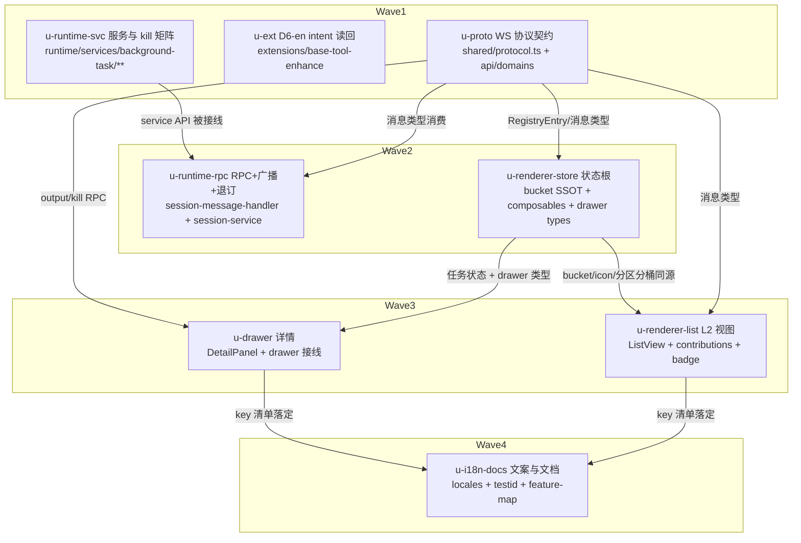

# background-task sidebar view 实施计划

基线: <commit 后回填> | 来源设计: docs/design/background-task-sidebar-view.md | 日期: 2026-09-06

## 0 章节映射

| 内容 | 设计文档实际位置 |
|------|------------------|
| 背景/目标 | §1 背景目标（SCQA + G1-G4 + in/out-of-scope + 术语裁决） |
| 终态/机制 | §3 解决方案（§3.1 终态与失败路径 / §3.2 多方案对比 / §3.3 D1-D10 关键决策 / §3.4 探针 P1-P7） |
| 验收场景表 | §4 验收（S1-S7 真实场景表） |
| 下一层拆分 | §5 下一层拆分（U1-U7 + 文件改动地图） |
| 待验证检查点 | §5「待验证检查点」（dev-0.9.15 合入时序 / Windows Get-Process 延迟） |

对抗审查证据：`docs/design/background-task-sidebar-view.review.md`（R1-R4 四轮收敛，终态 0 must-fix；R4 = 0MF+2S 全修，含 icon 色档 SSOT 化 + 验收措辞 icon 化）。

## 1 目标快照（逐字摘录设计 §1）

**设计目标**（从使用者体验倒推）：
1. **G1 可见**：用户切到某 session 的 plugin 区「后台命令」tab，默认只看运行中的任务（运行中/已结束/全部三桶筛选 + 计数预告，对齐 Agents tab 范式），状态实时翻转（running→killing→exited）无需手动刷新；tab 角标与「运行中」桶计数同源（亮 = 有命令在跑 = 默认桶非空）。
2. **G2 可查**：点击任一任务，drawer 展示完整命令、元信息（pid/时间/时长/exitCode/reason）、输出尾部；running 任务输出可跟随刷新。
3. **G3 可控**：running 任务可**行内两段式终止**（第二行右侧 ✕ → ✓ 确认，无需开 drawer），drawer 内亦有一键终止——**且终止不惊扰 AI**（不触发 AI 新 turn、不产生误导性「失败」通知；主路径保证，残余窗口与收窄口径见 D6-en 边界注）。
4. **G4 隔离**：session A 的列表永不含 session B 的任务；切 session 即切数据分区（含筛选桶分区）；无焦点 session 时空态。

**in-scope**：runtime 读 registry 的新 service、WS 消息域（拉取 RPC + 变更广播）、renderer 原生视图（L2 tab + 三桶筛选 + drawer + 行内终止）、kill 回路、plugin 区 tab 贡献声明与 L2 角标、**base-tool-enhance 的 killing-intent 读回（唯一 extension 改动，见 D6-en）**。
**out-of-scope**：不修改 pi；base-tool-enhance 除 D6-en 外的任务执行语义不动（spawn/poller tick 节奏/reaper 触发面均不变）；不做 stdout/stderr 分流展示；不做跨 session 聚合视图；不做完整输出查看器（仅尾部预览 + 跟随）。

## 2 单元列表

| Unit | 职责 | 领地（精确文件路径） | 依赖 | 隔离 | 验收条款 |
|------|------|----------------------|------|------|----------|
| u-proto | WS 协议域契约根：`protocol.ts` 登记 3 RPC + 2 回执 + 广播 + output/kill 结果类型（D3 形状，数据契约复用 `BackgroundTaskRegistryEntry`，D9）；renderer api domain（仿 session.ts） | `packages/shared/src/protocol.ts`；`packages/renderer/src/api/domains/background-task.ts`（新） | 无（DAG 根） | plain | shared 包 tsc/测试绿；类型形状与设计 D3 逐字段一致（消息名/sessionId 必带/冒号 camelCase 广播） |
| u-ext | D6-en：poller exit 边沿 finalize 读回 registry `state==='killing'` → reason=killed（内存 intent 优先、读失败按无 intent）；`armBackgroundTimeout` pid 已死跳过 markKillingIntent（R2-S1 加固）；task-store 不变量注释登记；补单测 | `extensions/universal/base-tool-enhance/src/background/poller.ts`；`.../spawn-background.ts`；`.../task-store.ts`；`extensions/universal/base-tool-enhance/src/background/*.test.ts`（新增用例落既有测试文件或新文件） | 无（可与 W1 并行） | plain | `pnpm extensions:typecheck && pnpm extensions:lint && pnpm -r --filter @zhushanwen/pi-base-tool-enhance test` 全绿；新单测覆盖：内存 intent 缺省+registry killing→killed / 内存 intent 优先不读回 / 读失败降级 / pid 已死跳过 timeout mark |
| u-runtime-svc | BackgroundTaskService：registry 读（损坏→corrupt 语义）+ 2s mtime 轮询 + 2 事件钩子即时检查（共享 last-seen 判定，D2）+ service 自写自检 + kill 五分支矩阵与身份验证两档（D6）+ output tail 字节窗口（D7）+ watched 集合生命周期（D8）；reaper 终态写提炼导出（`writeOrphanedTerminal` 等） | `packages/runtime/src/services/background-task/`（新目录）；`packages/runtime/src/services/session/background-task-reaper.ts`（仅提炼导出，行为不变）；`packages/runtime/src/infra/pi/event-adapter.ts`（+2 钩子旁路转发） | 无（不消费 WS 类型；service API 与传输解耦） | plain | `cd packages/runtime && pnpm test` 绿；新增单测：并发读写 1000 次 parse 成功（P1）/ mtime 轮询单广播源 / kill 矩阵①-⑤分支覆盖 + 锁内判活重查顺序 / tail 字节窗口与截断标记 / watched ENOENT 静默 |
| u-runtime-rpc | 3 RPC handler 注册（仿 getCommands 范式）+ message-bus session 级 publish 广播 + session-service `removeSessionEntry` watched 退订挂点 | `packages/runtime/src/transport/session-message-handler.ts`；`packages/runtime/src/services/session/session-service.ts` | u-proto（消息类型）、u-runtime-svc（service API） | plain | `cd packages/runtime && pnpm test` 绿；单测：3 RPC 请求→回执形状、list 拉取加入 watched、session 销毁退订、P6 双 session 广播不串分区 |
| u-renderer-store | renderer 共享契约与状态根：`background-task-bucket.ts` 分桶 SSOT（含 `backgroundTaskStatusIcon` 色档判定顺序：state 分流→killed 优先 dim→`exitCode===0?success:danger`，D10①⑤）+ `useBackgroundTasks`（useSessionScopedState + 模块级单 listener refCount + updateFor）+ `useBackgroundTaskBucketFilter`（reactive 容器分区，D10②）+ drawer 共享类型扩展（SideDrawerTab 加 `'bashTask'` + DrawerControlState.selectedBackgroundTaskId，D5①） | `packages/renderer/src/lib/background-task-bucket.ts`（新）；`packages/renderer/src/composables/features/sidebar/useBackgroundTasks.ts`（新）；`packages/renderer/src/composables/features/sidebar/useBackgroundTaskBucketFilter.ts`（新）；`packages/core/src/domain/drawer/types.ts`（+成员/字段）；各自 `__tests__` | u-proto | plain | `cd packages/renderer && pnpm test` + `cd packages/core && pnpm test` 绿；单测：分桶判据（谓词复用 isActive/isTerminal）、statusIcon 判定顺序（killed null 优先 dim；exitCode!==0 吸 null→danger；orphaned→info）、筛选 reactive 容器（plain object 不更新回归）、双 session updateFor 竞态、P6 分区 |
| u-renderer-list | 「后台命令」L2 视图：builtin-contributions 声明 + PluginViewContainer NATIVE_VIEWS 路由 + L2TabBar/l2-tab-item badge（亮=运行中桶>0，与分桶 SSOT 同源，D4④）+ BackgroundTaskListView（两行式 SessionItem 同构 item + 筛选槽三桶 + 空态三分 + 行内两段式终止，D10③④⑤；点击 openDrawerTab('bashTask')） | `packages/core/src/extension-host/builtin-contributions.ts`；`packages/ui/src/extension-host/PluginViewContainer.vue`；`packages/ui/src/extension-host/L2TabBar.vue`；`packages/ui/src/extension-host/l2-tab-item.ts`；`packages/renderer/src/components/extension/BackgroundTaskListView.vue`（新，含内联 FilterBar）；相关组件测试 | u-proto、u-renderer-store | plain | `cd packages/renderer && pnpm test` + `cd packages/ui && pnpm test` + `cd packages/core && pnpm test` 绿；组件测试（三视角，含用户可见 DOM 断言）：三桶计数与切换、全量空态不渲染筛选条、运行中空桶[查看全部 (N)]跳转、两行式 item 结构（7px icon/命令/耗时/pid·exit 第二行）、行内两段式 ✕→✓ 仅 running 行、badge 点亮条件、i18n key 引用（文案由 u-i18n-docs 落地） |
| u-drawer | drawer 详情：DrawerPanel tabs 加 TabMeta + PanelContainer v-if chain + `BackgroundTaskDetailPanel`（命令全文/元信息/输出 2s 跟随 + 停止条件/终止按钮两段式 + 分支④⑤ toast 文案 + already-exited/终态无按钮，D5/D7/§3.1 失败路径）+ useSideDrawer 兼容层核对 | `packages/ui/src/features/drawer/DrawerPanel.vue`；`packages/renderer/src/components/workspace/PanelContainer.vue`；`packages/renderer/src/components/extension/BackgroundTaskDetailPanel.vue`（新）；`packages/renderer/src/composables/features/drawer/useSideDrawer.ts`（如兼容层需小改）；相关组件测试 | u-proto、u-renderer-store | plain | `cd packages/renderer && pnpm test` + `cd packages/ui && pnpm test` 绿；组件测试：元信息渲染（pid/时间/时长/exitCode/reason）、running 输出跟随 2s interval 且终态/关闭/卸载停止、kill 按钮两段式、终态任务无 kill 按钮、output 不可用文案、i18n key 引用 |
| u-i18n-docs | zh-CN/en-US 文案落地（「后台命令」术语裁决；UI 单元只引用 key 不写文案）+ data-testid 清单登记（docs/testing）+ feature-map 更新 | `packages/renderer/src/i18n/locales/**`（zh-CN/en-US 相关条目）；`docs/testing/`（testid 清单文档）；`docs/feature-map/2026-09-06.md`（新，或最新日期文件） | u-renderer-list、u-drawer（key 清单落定后） | plain | `pnpm lint` 绿 + en/zh key 对齐校验通过 + i18n 单测绿（如有）；feature-map/testid 文档含新视图条目 |

领地交集自检：任意两单元领地交集为空 ✓（共享契约集中在 u-proto / u-renderer-store 两个根节点；runtime 两个单元分属 service 目录与 transport/session-service 文件）。

## 3 DAG 图

worktree 决策：全部 plain——领地互斥无热点共改，共享契约已集中根节点；无实验性大改。

## 4 测试策略

**增量（单元开发期内，从子包目录运行，红线：禁触真实数据目录，写删目标 mkdtempSync 自建自删）**：
- shared：`cd packages/shared && pnpm test`
- runtime：`cd packages/runtime && pnpm test`（global-setup + fs-guard 生效）
- renderer / core / ui：各自 `cd packages/<pkg> && pnpm test`
- extensions：`pnpm extensions:typecheck && pnpm extensions:lint`（root）+ `cd extensions/universal/base-tool-enhance && pnpm test`
- 三视角缺一不可（构建者白盒 + 使用者黑盒 + 观察者形态；每条用例至少一个用户可见 DOM 断言；spec 结构条目 = 渲染断言清单）；timer 用 fake timers

**全量（收尾阶段）**：`pnpm test` + `pnpm lint` + `pnpm extensions:typecheck && pnpm extensions:lint && pnpm extensions:test`

**dev 手测（阶段 5，P2/P3/P4/P5/P7 + S1-S7）**：`pnpm dev` 真实环境 + browser-automation（CDP 9222）驱动；AI 会话场景用 pi RPC 起 session 注入 prompt。

## 5 合理偏差登记表

| # | 偏差 | 固化位置 | 理由 |
|---|------|----------|------|
| （空） | | | |

## 6 状态表

| Unit | 状态 | 轮次 | 证据指针 |
|------|------|------|----------|
| u-proto | pending | 0 | — |
| u-ext | pending | 0 | — |
| u-runtime-svc | pending | 0 | — |
| u-runtime-rpc | pending | 0 | — |
| u-renderer-store | pending | 0 | — |
| u-renderer-list | pending | 0 | — |
| u-drawer | pending | 0 | — |
| u-i18n-docs | pending | 0 | — |

## 7 残留风险与变更历史

- dev-0.9.15 合入时序（设计 §5 检查点）：u-renderer-list 按设计参数独立实现 FilterBar（凹陷槽参数与 dev-0.9.15 一致）；不等待合入。
- Windows Get-Process 身份探测延迟：实施期以 ≤1s 超时实现（D6 两档规格），实测延迟记录到单元证据。
- P2/P3/P4/P5/P7 为实施期门：单测能覆盖的进单元验收，真实进程/时序类（P4/P7）留阶段 5 dev 手测。
- 变更历史：
  - 2026-09-06 计划创建（设计 R4 收敛版），用户豁免计划评审确认。
