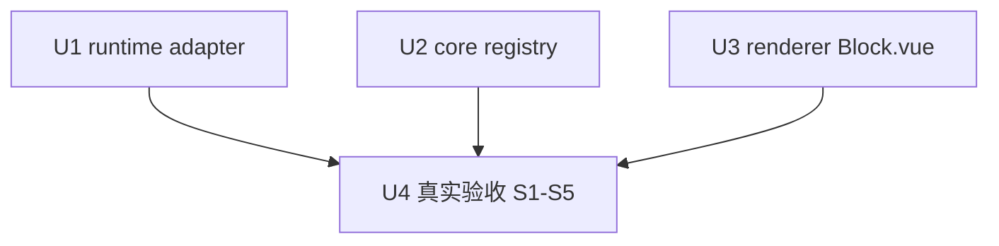

# bash-running-stream-output 实施计划

基线: 0f1bc31e6 | 来源设计: docs/design/bash-running-stream-output.md | 日期: 2026-09-08

## 0 章节映射

| 内容 | 设计文档实际位置 |
|------|------------------|
| 背景/目标 | §1 背景：被设计的系统是什么 · §2 设计目标 |
| 终态/机制 | §4 根因+物理数据流 · §5 终态 · §6 关键决策与权衡（D1-D4） · §7 实现机制（U1/U2/U3 改造点） |
| 验收场景表 | §8.2 验收场景（S1-S5） |
| 下一层拆分 | §9.2 下一层拆分（单元表 + 文件改动地图） |
| 待验证检查点 | §9.3（AnsiText 高频成本 / subagent onUpdate 复活复查 / 其他工具流式盘点） |

对抗式审查证据：`docs/design/bash-running-stream-output.review-r4.md`（0 must-fix）+ `docs/design/bash-running-stream-output.impact-review-r4.md`（0 must-fix）；收敛轨迹 r1(2MF)→r2(3MF)→r3(1MF)→r4(0MF)。

## 1 目标快照（逐字摘录设计 §2）

> **改造后使用者能做到什么：**
> 1. **running 态可观察**：bash 长命令执行中，点击展开块能看到命令 + 实时增长的输出（对齐 pi CLI TUI 行为）；收起态 header 尾行视口滚动显示最新输出行。
> 2. **无空白假展开**：任何状态下（running 无输出命令、completed 空输出命令）点击展开都不会出现「header 摘要消失 + 内容区空白」的组合。
> 3. **既有语义零回归**：extension GUI 流式组件（`__gui__`）、subagent 进度、mock 流、live ≡ reload 等价性、WS ring 重连恢复全部不受影响，新增内存代价有界且显式判定。

**Out-of-scope**（逐字摘录）：pi 源码、composer bash（`BashOutputBlock.vue`）、`ToolCall` 持久化格式、message-bus ring 策略重构、其他工具的流式 UI 增强收益。

## 2 单元列表

| Unit | 职责 | 领地（精确文件路径） | 依赖 | 隔离 | 验收条款 |
|------|------|---------------------|------|------|----------|
| U1 | event-adapter `handleToolExecutionUpdate`：content 数组形态判别式 + `normalizeWithTailCap`（两分支截断：换行锚 / 硬切三步管线〔ANSI 残片推进 + 码点边界〕）+ payload 增补 `output/outputRaw`（设计 §7 U1、§6.4 D4） | `packages/runtime/src/infra/pi/event-adapter.ts`；新增 `packages/runtime/src/infra/pi/__tests__/event-adapter-tool-update.test.ts` | 无（WS payload 契约以设计 §4 为准） | plain | 三形态分发断言 + 两分支截断不变式（§8 单测职责行） |
| U2 | core registry `message.tool_call_update`：`output/outputRaw` readString 读写 + 条件写入；detail 保持现状无条件 spread（设计 §7 U2） | `packages/core/src/domain/chat/effects/registry.ts`；`packages/core/src/domain/chat/__tests__/effects.test.ts` | 无（mock payload 直接构造） | plain | 条件写入 + detail 现状语义 + end 覆盖不受影响断言 |
| U3 | Block.vue：展开区 v-if 加 `isBashTool` + 输出区内容守卫 + `toolTailLines` bash 取 `outputRaw ?? displayContent`（设计 §7 U3、§6.2 D2、§6.3 D3） | `packages/ui/src/features/chat/Block.vue`；`packages/ui/src/features/chat/__tests__/Block.test.ts` | 无（ToolCall fixture 驱动） | plain | running 展开渲染命令块+流式输出、空输出无假展开、尾行取数断言 |
| U4 | 真实验收（非 dev 单元，阶段 5 Gate B 剧本）：设计 §8.2 S1-S5 手动场景 | 无代码领地（dev app 手动操作 + 记录表） | U1+U2+U3 committed | — | S1-S5 逐行签收 |

## 3 DAG 图

三单元领地互斥、以设计文档 §4 WS payload 契约为唯一接口，并行派发（并发 3 ≤ 5）。

## 4 测试策略

| 层 | 增量命令（从子包目录运行，vitest 配置在子包） | 全量（收尾阶段） |
|----|---------------------------------------------|------------------|
| runtime (U1) | `cd packages/runtime && pnpm test -- event-adapter-tool-update` | `cd packages/runtime && pnpm test` |
| core (U2) | `cd packages/core && pnpm test -- effects` | `cd packages/core && pnpm test` |
| ui (U3) | `cd packages/ui && pnpm test -- Block` | `cd packages/ui && pnpm test` |
| 收尾 | — | 三包全量 + `pnpm extensions:typecheck`（如触发 extensions 面）+ lint |

红线（AGENTS.md）：vitest（禁 node:test/tsx --test）；timer 测试用 fake timers；测试禁止触碰真实数据目录（写删目标 mkdtempSync 自建自删）；三视角缺一不可（每条用例至少一个用户可见 DOM 断言——U3 适用）。

## 5 合理偏差登记表

| Unit | 偏差 | 原因 | 登记时间 |
|------|------|------|----------|
| （空） | | | |

## 6 状态表

| Unit | 状态 | 轮次 | 证据指针 |
|------|------|------|----------|
| U1 | pending | 0 | — |
| U2 | pending | 0 | — |
| U3 | committed | 1 | ea93e5214；58 files / 590 tests passed（Block.test.ts +6 用例） |
| U4 | pending | 0 | — |

## 7 残留风险与变更历史

- 残留风险：AnsiText 高频重渲染成本（设计 §9.3，S5 实测；降级路径 = U3 局部节流）。
- 变更历史：
  - v1：初版（U1-U4 拆分 + 并行 DAG + 测试策略）。
  - v2：U3 committed（ea93e5214，轮次 1 一次通过；基线 hash 同步修正为 amend 后的 21f269b0d）。
