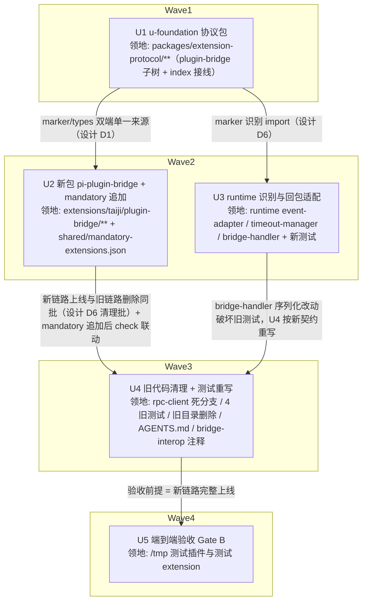

# bridge extension 重写适配 pi 0.84.4 实施计划

基线: d42f24efc | 来源设计: docs/design/bridge-rewrite-pi-0.84.md（v3，审查循环 1MF/7SG→0MF/4SG→0MF/0SG/1info 终态通过，报告 docs/design/bridge-rewrite-pi-0.84.review.md）| 日期: 2026-09-04

## 0 章节映射

设计文档为精简版五段制：

| 内容 | 本文实际位置 |
|------|--------------|
| 背景/目标 | §1 背景目标（SCQA + G1-G5 目标表 + in/out scope） |
| 终态/机制 | §3.1 终态场景 A-E；§3.3 关键决策 D1-D7（通道契约/同步/超时/装配/识别与清理）；§3.4 错误规格表 E1-E7；§2.3 物理数据流（含 abort 链） |
| 验收场景表 | §4 验收 V1-V9（真实场景，非单测）+ 回补说明（超时文档 V1/V2/P-8/P-9） |
| 下一层拆分 | §5 单元表 U1-U5 + 文件改动地图 + 待验证检查点 |
| 待验证检查点 | §4.1 探针清单 P-1~P-10（⛔ 实施期门：P-4/7/8/9/10，各带降级路径） |

## 1 目标快照（逐字摘录）

**目标（从使用者体验倒推）**：

| # | 目标 | 使用者体验表述 |
|---|------|--------------|
| G1 | 插件工具经 pi 链路产品级可达 | 用户在聊天里让 agent 用插件工具（如测试插件 `sleep-tool`），agent 调用并拿到真实结果（含超时错误），不再「工具不存在」 |
| G2 | 用户中断可终止挂起的插件工具等待 | 用户在插件工具执行中点「停止」，pi 内挂起的 bridge 等待在秒级被打断，agent 收到 cancelled 结果（闭合超时文档 §11 登记缺口） |
| G3 | 工具清单同步不再依赖旧私有通道 | 启动后 ≤ 数秒内插件工具对 LLM 可见；插件装卸后新 session 拿到正确清单 |
| G4 | bridge 装配进入现行 SSOT，dev / packaged 同一加载集合 | dev 与打包版行为一致；不再存在「只在某个模式加载」的特例路径 |
| G5 | 通道行为有界可恢复 | 任何一侧进程存活期间请求恒有终态（结果 / 错误 / 取消），无静默挂死；错误消息含恢复指引 |

**Out-of-scope**：plugin-service 的超时语义（六类超时已由 timeout-plugin-service-granularity.md v2.3 收官，本设计只消费其 D1 取值链结论）；插件 hook 体系本身的语义（PI_HOOK_EVENT_MAP 不变）；runtime→pi 的主动推送通道（pi RPC 协议无此能力，见 §3.3-D4）；前端弹窗 UI；pi 版本升级流程。

## 2 单元列表

| Unit | 职责 | 领地（精确文件路径） | 依赖 | 隔离 | 验收条款 |
|------|------|---------------------|------|------|---------|
| U1 (u-foundation) | 协议包：plugin-bridge marker + 协议 v2 types + 导出接线 | `packages/extension-protocol/src/extensions/plugin-bridge/`（新：marker.ts + types.ts）+ `packages/extension-protocol/src/index.ts`（export 接线）+ `packages/extension-protocol/src/extensions/index.ts`（若存在目录索引） | — | plain | `cd packages/extension-protocol && pnpm typecheck` 零错误；marker 值 = `'\x00XYZ_BRIDGE'`（NUL 前缀，对齐 SESSION_MANAGER_MARKER 先例）；类型含 BridgeRequest 四 method 联合（设计 §3.3-D1） |
| U2 | 新包 `@zhushanwen/pi-plugin-bridge`：factory 形态源码（后台 sync 重试 / registerTool + execute 转发 / observe 事件 void 转发 / intercept 注入映射 / cancelled 折叠）+ package.json（role=taiji）+ 构建配置 + **mandatory-extensions.json 追加**（装配原子性，见偏差登记 #1） | `extensions/taiji/plugin-bridge/`（新目录全量：package.json / tsconfig.json / src/index.ts / 构建配置）+ `packages/shared/src/mandatory-extensions.json`（追加一行） | U1 | plain | `pnpm extensions:typecheck && pnpm extensions:lint && pnpm extensions:test` 全绿；`node scripts/check-extension-dependencies.mjs` 过（taiji↔mandatory 联动）；本地 pi CLI 加载实测（AGENTS.md MANDATORY）：`pi --mode rpc --extension <包路径>` + stdin JSONL 发 prompt，pi 日志确认 extension 加载成功、无 factory 报错、registerTool 生效（sync 无 runtime 响应时进重试循环是预期——被调方在 runtime，全链留 U5） |
| U3 | runtime 识别与回包适配：event-adapter marker 分支 + malformed 哨兵 + bridgeRequestIds 登记点迁移 + bridge-handler 6 处存量 + 第 7 处新回包点 stringify+'select' 序列化 | `packages/runtime/src/infra/pi/event-adapter.ts` + `packages/runtime/src/services/extension-timeout-manager.ts` + `packages/runtime/src/transport/bridge-handler.ts` + 新增测试 `packages/runtime/test/bridge-marker-channel.test.ts` | U1 | plain | `cd packages/runtime && pnpm typecheck` 零错误 + `pnpm vitest run test/bridge-marker-channel.test.ts` 绿（覆盖：marker 命中/未命中/ask-user 不误伤（P-10）/malformed 哨兵产出与回包/6 处存量 + 第 7 处序列化形状——含 default 与 not-available 分支）；存量测试不要求本轮全绿（4 个旧通道测试文件按设计属 U4 重写，本轮失败可预期） |
| U4 | 旧代码清理：删 event-adapter 旧 `bridge:*` 分支、rpc-client `{id, response}` 死分支、旧 bridge 目录、4 个旧测试重写（bridge-sync 5 失败 / bridge-reconnect 12 失败按新序列化契约重写；event-adapter-bridge 与 plugin-hook-bridge 实测仍绿、按计划核对后保留或微调）、AGENTS.md taiji 列举、bridge-interop.ts:81 悬空注释清扫、electron-builder.yml 资源清理（若需）、**server.ts:208 BridgeHandler 构造器补传 extensionTimeoutMgr**（U3 deviation——marker 通道登记在生产生效的装配行） | `packages/runtime/src/infra/pi/rpc-client.ts` + `packages/runtime/src/infra/pi/event-adapter.ts`（旧分支删）+ `packages/runtime/src/transport/server.ts`（装配行）+ `packages/runtime/test/bridge-sync.test.ts` + `packages/runtime/test/bridge-reconnect.test.ts` + `packages/runtime/test/event-adapter-bridge.test.ts` + `packages/runtime/test/plugin-hook-bridge.test.ts` + `resources/pi/agent/extensions/`（删）+ `AGENTS.md` + `packages/runtime/src/services/plugin-service/bridge-interop.ts`（注释）+ `apps/electron/electron-builder.yml`（若需） | U2, U3 | plain | `cd packages/runtime && pnpm vitest run` 全量绿 + `pnpm typecheck` 零错误；根 `pnpm run lint` exit 0；`node scripts/check-doc-symbol-drift.mjs` 过；旧目录从 git 消失；AGENTS.md taiji 组列举含新包 |
| U5 | 端到端验收（Gate B）：设计 §4 V1-V9 逐项 + 探针 P-4/7/8/9 实测 | 测试插件与测试 extension 的临时目录（/tmp 或 fixtures，不进领地白名单的生产文件） | U4 | plain | V1-V9 逐行签收（见状态表证据指针）；⛔ 探针结果回写设计文档 §4.1（⛔→✅ 或触发降级路径）；超时文档 impl-plan §7 跟进项① 回写登记 |

## 3 DAG 图

波次：W1(U1) → W2(U2 ∥ U3) → W3(U4) → W4(U5)。U2/U3 领地互斥（extensions/taiji + shared JSON vs packages/runtime），可并行。

## 4 测试策略

测试框架：vitest（禁 node:test；配置在子包，从子包目录运行）。命令均真实读自各包 package.json：

**增量（单元开发期）**：
- U1：`cd packages/extension-protocol && pnpm typecheck && pnpm test`
- U2：`pnpm extensions:typecheck && pnpm extensions:lint && pnpm extensions:test` + `node scripts/check-extension-dependencies.mjs` + 本地 pi CLI 加载实测（AGENTS.md：`pi --mode rpc --session-dir <dir> --model xiaomi-token-plan-cn/mimo-v2.5-pro --approve --extension <path>` + stdin JSONL；`XYZ_AGENT_DEBUG=1` 看 `~/.pi/agent/logs/`）
- U3：`cd packages/runtime && pnpm typecheck && pnpm vitest run test/bridge-marker-channel.test.ts`
- U4：`cd packages/runtime && pnpm vitest run`（全量，4 旧测试重写后必须绿）+ 根 `pnpm run lint`

**全量（收尾 Gate A，超时流水线同口径）**：4 包（runtime/shared/core/renderer 或实际有测试的包）全量 vitest + 各包 `pnpm typecheck` + 根 `pnpm run lint` + `pnpm extensions:typecheck && pnpm extensions:lint && pnpm extensions:test` + `node scripts/check-doc-symbol-drift.mjs`。

**Gate B（U5）**：dev app 全链（`pnpm dev`，连 9222）或 standalone runtime（tsx :3311 + 隔离 `XYZ_AGENT_DATA_DIR` + WS 直连，超时流水线备选环境先例）；V1-V9 见设计 §4。

## 5 合理偏差登记表

| # | 偏差 | 理由 | 登记时间 |
|---|------|------|---------|
| 1 | mandatory-extensions.json 追加从设计 §5 的 U4 前移到 U2 | check-extension-dependencies.mjs:119-124 强制 taiji↔mandatory 联动：包存在不在清单 = 违规。U2/U4 分属两波会造成中间态检查红；装配原子性优先（设计 D3 本意即「新包进 SSOT」，归属调整不改变内容） | 计划期 |
| 2 | U1 增补 BRIDGE_METHODS 运行时常量集合（marker.ts）+ BridgeMethod 派生类型（types.ts） | 设计 §3.3-D6 要求 event-adapter 运行时校验「缺合法 method」——需要运行时集合，否则 U3 须在 runtime 硬编码重复清单，破坏 D1 单一来源。照抄 SESSION_MANAGER_ACTIONS 值类型同源先例 | U1 交付 |
| 3 | U1 增补 BridgeErrorResponse 类型 + marker 测试多两条断言（marker 互斥 + BRIDGE_METHODS 四值守护） | 设计 §3.3-D1 明文错误闭环形状 `{error, hint?}`（E5 malformed 回包即此形状），属协议 v2 契约一部分；测试断言对齐 session-manager.test.ts 先例（marker 互斥守护） | U1 交付 |
| 4 | U1 回包三形状本地定义（非 re-export runtime）+ 注释注明对应关系 | extension-protocol 包零运行时依赖（包头注释明文），无法 import runtime 包；逐字段与 plugin-types.ts 同名接口对应（runtime 是实现侧权威） | U1 交付 |
| 5 | U3 bridgeRequestIds 登记点从「event-adapter 识别时」改为「BridgeHandler 入口」（构造器注入 timeoutManager 可选依赖 + ExtensionTimeoutManager.addBridgeRequest 导出） | event-adapter 是纯翻译层（文件头注释明文无路由副作用），无法持有 timeout-manager 实例；到达即登记同时覆盖旧 bridge:* 通道 / 新 marker 通道 / malformed 哨兵三种到达形态，登记语义与原设计等价。**连带**：server.ts:208 构造器需补传第二参（并入 U4 领地） | U3 交付 |
| 6 | U3 bridge:event 回包（bridge-handler :63）保持恒 null 不 stringify | 设计 §3.3-D1 明文 event 恒 null → cancelled 帧（bridge 侧 void 丢弃），不属 6 处序列化清单；测试已锁定该例外 | U3 交付 |
| 7 | U3 实测 4 旧测试中 event-adapter-bridge.test.ts 与 plugin-hook-bridge.test.ts 仍绿（不涉序列化断言） | U4 对这两文件核对后保留或微调（原计划「按新契约重写」收窄为「按需」）；bridge-sync（5 失败）/bridge-reconnect（12 失败）确需重写 | U3 交付 |
| 8 | U2 领地扩至根 extension-dependencies.json（协调者授权补登） | check-extension-dependencies.mjs check #2（:90-97）要求磁盘每个 @zhushanwen/pi-* 包必须登记——计划缺口（偏差 #1 只前移 mandatory，漏了同脚本反向校验）；登记条目含 extension-protocol + pi-extension-logger 两条 package 依赖 | U2 交付（授权补登） |
| 9 | U2 启动 sync 的 ctx 获取：session_start 事件 handler 双职责（触发 sync + 转发自身事件） | ExtensionAPI 无 ui（UI 方法在 ExtensionContext，仅事件 handler / 工具 execute 的 ctx 携带）——设计 v1「factory 内后台任务」不可实现；session_start 是 bindExtensions 末尾 emit 的最早带 ctx 钩子，先于任何 prompt，时序符合 D4。设计文档已在 v3.2 修正 D4 表述 | U2 交付 |
| 10 | U2 Tool not found 识别双形态：`{error:'Tool not found…'}` + `{content:'Tool not found…', isError:true}` | 设计 §3.4-E2 只写错误闭环一种形态；runtime bridge-interop.ts:167 实装回工具结果形态——双覆盖防 miss 重同步漏判 | U2 交付 |
| 11 | U2 AgentToolResult 返回体保留 isError 字段（pi 0.84.4 接口无此字段） | 与 session-manager 先例同款（extension 侧约定字段）；LLM 判错依据 content 文本，E2-E4 文案均在 content 中。设计 v3.2 已补实施注记 | U2 交付 |
| 12 | U2 8 个 observe 事件用显式 `pi.on` 字面量调用而非数组循环 | pi.on 的字面量重载对 union 字符串变量失效——显式注册保住 handler 类型推断，零 as 断言 | U2 交付 |
| 13 | U2 pi CLI 实测命令补 `--no-extensions` | 用户全局安装的第三方 pi extension 损坏会先拒载干扰实测；与 xyz-agent runtime spawn 形态一致（rpc-client.ts:216 同款组合） | U2 交付 |
| 14 | U2 日志 sync 成功用 debug 级（非 info） | @zhushanwen/pi-extension-logger 实例 API 仅 debug/warn/error 三级（LogLevel 类型含 info 但实例无 info()） | U2 交付 |
| 15 | U4 rpc-client.test.ts 领地微扩：删 U5d 死分支用例 | 删 sendExtensionUiResponse `{id,response}` 死分支使其必失败，全量绿是硬验收——按「测已删除旧机制的用例删除并注释」原则处理，留 [HISTORICAL] 注释指向 bridge-marker-channel.test.ts | U4 交付 |
| 16 | U4 event-adapter-bridge.test.ts 与 plugin-hook-bridge.test.ts 零改动 | 逐用例核对确认不含旧 bridge:* method 帧用例（前者测 setWidget/setStatus 翻译，后者测 hook 机制），与被删分支无关 | U4 交付 |
| 17 | U4 electron-builder.yml 零改动 | apps/electron/resources/pi（pi Bun binary，prepare-pi-resources.sh 产物，untracked）与被删的仓库根 resources/pi 是两个不同目录，yml 的 from 指向前者 | U4 交付 |
| 18 | U4 收尾（协调者授权）：registerTimeout 的 bridge: 前缀分支删除 + extension-timeout-manager.test / server-destroyed-converged-cleanup / bridge-marker-channel / bridge-sync / bridge-reconnect 连带测试改造 | 「新链路上线即旧链路删除，无并存窗口」纪律——旧 event-adapter bridge:* 分支删后该分支生产不可达（registerExtensionTimeout 只由 extension-ui kind 触发）；登记单源化到 addBridgeRequest + 2 条防回归锁（registerTimeout 误传 bridge: 不得登记） | U4 收尾（授权） |

## 6 状态表

| Unit | 状态(pending/in-progress/committed/blocked) | 轮次 | 证据指针 |
|------|-------------------------------------------|------|---------|
| U1 | committed | 1 | e084a9ab7；typecheck exit 0 + vitest 91 passed（含 marker.test.ts 4 tests）；偏差 #2-#4 登记 |
| U2 | committed | 1 | e71627b62；extensions 三连绿（26/26）+ check-extension-dependencies exit 0（含授权补登 extension-dependencies.json，偏差 #8）+ pi CLI 实测加载成功（marker/sync/event 帧形状吻合设计）；偏差 #9-#14 见 subagent 报告（session_start 双职责方案/Tool not found 双形态/AgentToolResult isError 兼容字段/显式 pi.on 注册/--no-extensions 实测形态/extension-logger 无 info 级） |
| U3 | committed | 1 | 437988df4；typecheck exit 0 + 26/26 新测试 + 72/72 增量回归；偏差 #5-#7 登记（登记点改 BridgeHandler 入口 + server.ts 装配行并入 U4 + event 恒 null 例外 + 4 旧测试失败清单：bridge-sync 5 / bridge-reconnect 12） |
| U4 | committed | 2 | 809d11129；全量 4280/4280 绿（17 failed→0 + 2 防回归锁）+ typecheck/lint/doc-symbol-drift 过；server.ts 装配行落地（偏差 #5 收口）+ registerTimeout 死分支删除（「无并存窗口」纪律）+ AGENTS.md 21 包；偏差 #15-#18 见报告 | 
| U5 | pending | 0 | — |

## 7 残留风险与变更历史

- 残留风险：①U2 的 pi CLI 实测只能验加载层（factory 合法/registerTool 生效/sync 发出），全链响应依赖 runtime——U5 兜底；②探针 P-9（intercept 挂死）失败时按设计降级路径加通道级 30s timeout，会引入与 D5「零 timer」的例外——降级触发时须同步回写设计 §3.3-D5 论证；③dev app 全链环境可能被并行会话占用（handoff 坑④），U5 备选 standalone 环境；④定向复审 NF-2（info，可选补强）：intercept 畸形 {type:'text'} 缺 text 字段走 stringify 兜底的行为无测试用例——非阻塞，后续随手补；⑤NF-3（out-of-scope）：bridge-handler.ts bridge:event 分支 console.log 为既有代码（超时流水线期已存在），不属本次范围。
- 阶段 3/4 记录（2026-09-05）：一致性审查 2 reviewer 并行（A=pi 侧与装配 9R/2U/2D，B=runtime 侧 8R/1U/2D）；3 条 unreasonable（B-U1 event 登记累积 / A-U1 intercept 类型退化 / A-U2 syncLoop 兜底缺口）+ 4 条 doc_errors 全部在 16b013cdb 修复闭合（偏差表 #8-#18 同批补齐）；定向复审全 pass + NF-1 文档回写（设计 v3.3）。合理偏差累计 18 项全登记于 §5。
- 变更历史：
  - v1（2026-09-04）：初版。按设计 §5 U1-U5 展开，波次优化 U2∥U3 并行；偏差 #1 登记（mandatory 前移 U2）。
  - v2（2026-09-05）：U1-U4 执行期状态表更新；偏差 #2-#18 陆续登记。
