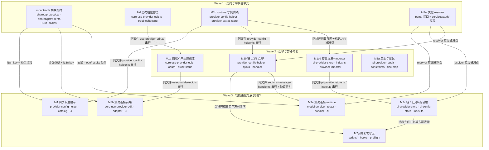

# Provider 字段权威收口 实施计划

基线: 0d8b6cbbc（本计划文档基线 commit） | 来源设计: `docs/design/catalog-provider-field-authority.md`（v3.3） | 日期: 2026-09-10

> 本计划把设计 §5 的 M1–M6 六个语义单元细化为 13 个可派发单元。细化不是语义变更，而是**领地互斥**要求：
> 设计里 M1/M2/M3/M4 共改同一批热点文件（`provider-config-helper.ts` 被 M1/M2/M4 共改、`use-provider-edit.ts` 被 M1/M3/M6 共改、`pi-provider-store.ts` 被 M1/M2/M5 共改），
> 同一 wave 内并行派发会写冲突，故按「同文件共改 → 串行边」拆开，并用契约前置（u-contracts）把 M3/M4 的共享接线点一次交付。
> 单元 ID 保留设计映射（M1a = M1 的前端部分，依此类推），追溯不受影响。

## 0 章节映射

| 内容 | 本文实际位置 |
|------|--------------|
| 背景/目标 | 设计 §1 背景目标（SCQA + 设计目标 G1–G5 + In/Out of Scope） |
| 终态/机制 | 设计 §3 解决方案（§3.1 终态场景 A/A'/B/C/D + 终态物理数据流 · §3.2 架构级方案对比 · §3.3 关键决策 D1–D9 · §3.4 外部共享状态写入面 · §3.5 接口与错误规格） |
| 验收场景表 | 设计 §4 验收（11 个真实场景 + 依赖说明） |
| 下一层拆分 | 设计 §5 下一层拆分（实施路径 + 拆分清单 + 文件改动地图 + 待验证检查点 1–6） |
| 探针清单 | 设计 §3.6 探针清单（P-poison ✅ / P-gate ✅ / P-schema ✅ / P-scope ✅ / P-gateway ✅ / P-cred ⛔M2 / P-test-req ⛔M3 / P-sanitize ⛔M1 / P-oauth-shell ⛔M1 / P-presets ⛔M6） |
| 对抗式审查证据 | `.review/design-review-catalog-provider-field-authority.md`（主审 R4：must_fix 0 / suggestion 0）· `.review/design-review-catalog-provider-field-authority-impact-round4.md`（影响面 R4：must_fix 0 / suggestion 1 已修） |

## 1 目标快照

**（逐字摘录设计 §1，禁止改写）**

### 设计目标（从使用者体验倒推）

- **G1（展示真实）**：用户在 settings 页看到的 catalog provider 信息永远等于 pi 真实生效语义——不再有「类型：anthropic-messages」式误导；混合协议 provider 的协议分布对用户可见；用户设置的网关覆盖值如实展示。
- **G2（操作无害）**：用户在 settings 页做任何保存操作都不可能弄丢其他 provider——P0 雷拆除；已踩雷用户的 models.json 自动修复、消失的 custom provider 回来。
- **G3（测试可信）**：「测试连接」测的是真实聊天要走的协议与端点——成功 = 真的能聊；失败 = 告诉用户哪个协议哪个模型为什么失败、去哪修。
- **G4（收口防复发）**：凭据读取有唯一入口，新场景不需要也不会再发明第 6 条解析链（lint 机器拦截）；约束登记进 constraints.json 进 CR 视野。
- **G5（档位如实）**：用户为自定义模型设置的思考档位在 composer 真实可选——落盘的模型能力字段语义与 pi 门控语义一致，不再「设置了高档、弹层只有关」。

### In / Out of Scope

- **In scope**：settings-provider 页对 catalog provider 的展示 / 保存 / 测试连接 / 模型发现；自定义模型思考档位链路（reasoning 出厂显式化 + 预设过滤语义对齐）；models.json 写侧防线与存量清洗；provider 凭据读路径收口与防复发约束；本设计文档引用的 pi 语义锚点卫生。
- **Out of scope**：① 模型双名称（id/name）编辑表单与 composer 显示 `provider/model` 两个独立 UI 改进（走 dev-flow 小改动，不进入本设计）；② pi 侧行为修改；③ quota fetcher 本身的协议逻辑；④ overlay 刷新链对 pi 侧 `models-store.json` 的无锁写竞态；⑤ ProviderInfo 判别联合类型重构（远期演进，方案 C）。

### 实施期不可动摇的既有裁定

- 不做 baseUrl 兜底（对 artifact 字段打补丁是错误分层）
- 不做全局单点探活（测试连接 = per-协议代表模型发真实最小请求）
- [MANDATORY] 不修改 pi 源码、不提 PR、不 fork；pi 语义断言以 node_modules 实装 `0.84.4` dist 为准

## 2 单元列表

| Unit | 职责（对应设计决策） | 领地（精确文件路径） | 依赖 | 隔离 | 验收条款 |
|------|---------------------|---------------------|------|------|----------|
| **u-contracts** | 共享接线点一次交付：`config.discoverModels` 加 optional `mode`、`config.discoveredModels` 加 optional `results`、`SetProviderData` 语义注释（§3.5）；`BuiltinModelSummary.api` 改 optional（D7 连带）+ `ProviderInfo.api/baseUrl` 网关/派生语义注释 + `BuiltinProviderTemplate.api/baseUrl` artifact 标记（D5）；M3/M4 全部新增 i18n key（zh + en） | `packages/shared/src/protocol.ts`<br>`packages/shared/src/provider.ts`<br>`packages/renderer/src/i18n/locales/zh-CN/settings.ts`<br>`packages/renderer/src/i18n/locales/en-US/settings.ts` | — | plain | `pnpm --filter @xyz-agent/shared typecheck` + `pnpm --filter @xyz-agent/runtime typecheck` 全绿；`cd packages/renderer && npx vitest run src/__tests__/i18n/` 绿（含 locale-sync-check：zh/en key 集合一致） |
| **M6** | D9 全部：discover 合并补 `reasoning: true`；`pickStrategy` 行级联动（`reasoning === undefined` 才置 true，永不覆盖显式 false，all-levels 同规则）；`THINKING_PRESETS` 两预设补显式 null 剔除项（on-off 两档 / high-max 三档）；头注释改 pi 黑名单过滤语义；troubleshooting 存量恢复指引 | `packages/core/src/domain/settings/use-provider-edit.ts`<br>`packages/core/src/domain/settings/__tests__/use-provider-edit.test.ts`<br>`docs/troubleshooting.md` | — | plain | `cd packages/core && npx vitest run src/domain/settings/__tests__/use-provider-edit.test.ts` 绿，含新增用例：discover 合并产出的模型 `reasoning === true`；`pickStrategy` 对 undefined 置 true / 对显式 false 不覆盖（high-max 与 all-levels 两分支）；两预设经 pi 同源 `getSupportedThinkingLevels` 输出档位名为 `[off, high]` / `[off, high, max]`（P-presets 探针结论写进用例注释） |
| **M1b** | D1②③ runtime 写侧防线：`applyProviderLevelFields`/`applyModelRoutingFields` 空串转译（trim 后空串同视；`apiKey` 空串 = 删键，其余 = 不写键 + warn）；catalog 分体系（`type` 键忽略 + warn；`baseUrl` 非空 = 网关写入、显式空串带键 = 清除；不物化空壳）；**防线载体共享纯函数** `applyProviderWritePolicy(merged, data, kind, source, providerId)`（纯函数无副作用，返回 `{ merged, gatewayToSet?, gatewayToClear?, skipUpsert? }`，`source: 'settings' \| 'import'`）；`ProviderExtras` 加 `gatewayBaseUrl` + `getExtrasSync` sync 原语；**setProvider 末尾接载体并消费信号**（skipUpsert 跳过 upsert / gatewayToSet 先写 extras 标记后 upsert / gatewayToClear 先 upsert 后清标记且标记缺失短路）；**模型级空 id 收口**（空/纯空白 id 模型整条丢弃 + warn，对齐 pi 模型级 `id` 的 `minLength:1`）；`eslint.config.mjs` 该文件 max-lines override 600 → 900 | `packages/runtime/src/services/provider-config-helper.ts`<br>`packages/runtime/src/services/provider-extras-store.ts`<br>`packages/runtime/src/services/__tests__/provider-config-helper.test.ts`<br>`packages/runtime/src/services/__tests__/provider-write-fields.test.ts`<br>`eslint.config.mjs` | — | plain | `cd packages/runtime && npx vitest run src/services/__tests__/provider-config-helper.test.ts` 全绿，含：空串矩阵（provider 级 name/baseUrl/apiKey/api + 模型级 name/api/baseUrl）落盘无空串键；`apiKey:''` → 键被删除；纯空白串同视；catalog `type` 键不写 + warn；catalog baseUrl 非空 → `merged.baseUrl` + `gatewayToSet`；显式 `''` → `gatewayToClear` 且 merged 无 baseUrl 键；未带键 → 不变；八字段全缺 → `skipUpsert`（且 `upsertProvider` 不被调用）；`source='import'` + catalog → baseUrl/api 剥除；**P0 毒化链端到端**（catalog 空串 baseUrl 保存 + 同文件 custom 带 apiKey → 无空串键且 custom 原样）；网关写序（extras 先于 upsert）与清除短路（无标记不调 `modify`）；模型级空 id 模型被丢弃；`npx eslint packages/runtime/src/services/provider-config-helper.ts --max-warnings 0` 退出 0 |
| **M2-r** | D3 resolver 本体：接口落地 `IProviderCredentialResolver`（设计 §3.5 逐字定义，归本单元以免同波次依赖 u-contracts）+ 实现双形态（async 明文 / sync 布尔 + 批量）+ 源优先级单点声明（auth.json → models.json）+ P-cred 探针（`$ENV_VAR` / command 配置值解析行为） | `packages/runtime/src/services/ports/provider-credential-resolver.ts`（新）<br>`packages/runtime/src/services/auth/provider-credential-resolver.ts`（新）<br>`packages/runtime/src/services/auth/__tests__/provider-credential-resolver.test.ts`（新） | — | plain | `cd packages/runtime && npx vitest run src/services/auth/__tests__/provider-credential-resolver.test.ts` 绿，含：auth.json 命中优先于 models.json；两源皆无 → `undefined` / `false`；`listCredentialBackedProviderIds` 返回并集（单次读，非 N 次）；P-cred 探针实测结论（`$ENV_VAR` 是否已展开）写入用例注释与提交信息，降级路径按 §3.6 落地 |
| **M1a** | D1①⑤⑥ 前端不产生违规值 + 两条旁路调用方：`save()` 对 catalog 不带 `type` 键、`baseUrl` **恒显式带键**（trim 结果：非空 = 设网关、`''` = 清除网关）、对 custom 空串 name/baseUrl 不带键；OAuth 收尾 payload 改 `{authMethod:'oauth'}`-only；QuickSetup payload 去 `baseUrl`（模板默认值不落盘）与 `api` 死键 | `packages/core/src/domain/settings/use-provider-edit.ts`<br>`packages/renderer/src/composables/features/settings/useProviderPageOauth.ts`<br>`packages/ui/src/features/settings/provider/use-quick-setup-form.ts`<br>测试：`packages/core/src/domain/settings/__tests__/use-provider-edit.test.ts`、`packages/renderer/src/__tests__/composables/use-provider-page-oauth.test.ts`、`packages/ui/src/features/settings/__tests__/ProviderQuickSetup.test.ts` | M6（同文件 `use-provider-edit.ts` 串行） | plain | 三个包对应测试文件 vitest 绿，含：save() payload 对 catalog 无 `type` 键且恒含 `baseUrl` 键（含 `''`）；custom 空串 name/baseUrl 不带键；OAuth 收尾 setProvider payload 仅 `{authMethod:'oauth'}`；QuickSetup payload 无 `baseUrl`、无 `api` |
| **M1cd** | D2 存量清洗 + D1④ importer 旁路：`sanitizeInvalidProviders` 扩展（①空串全集剥键 → ②catalog provider 级键处置：`api` 一律剥、`baseUrl` 按 extras `gatewayBaseUrl` **仅存在性**判定，有标记保留 / 无标记剥除 + 日志；写读错位 → 待清标记清单；顺序契约：剥键先于既有空壳判定）；`index.ts` 启动 async 阶段编排待清清单的 `extrasStore.modify`；importer 主路径（`:251/:322`）接防线载体纯函数 + fallback catalog 返回 `failed` 不写 `tpl.api`/`tpl.baseUrl`/`config.apiKey` | `packages/runtime/src/infra/pi/pi-provider-store.ts`<br>`packages/runtime/src/index.ts`<br>`packages/runtime/src/services/migration/provider-importer.ts`<br>测试：`packages/runtime/src/infra/pi/__tests__/pi-provider-store.test.ts`、`packages/runtime/src/services/migration/__tests__/provider-importer.test.ts` | M1b（纯函数与标记 API） | plain | vitest 绿，含：空串全集剥键矩阵（P-sanitize 探针：剥键后同一文件经 pi `ModelConfig.load` `providers.size` 恢复）；catalog 无标记 `baseUrl` 剥除 / `api` 一律剥 / 有标记保留三对照；写读错位产待清清单且不塞进同步清洗段；剥键先于空壳判定；importer 主路径 catalog 源端 provider 级字段不落盘、空串转译；fallback catalog 返回 `failed`（P-oauth-shell 同族：不新增 models.json 条目） |
| **M2b** | D3 链 1/2/5 迁移：`QuotaService.getCredential` 的 auth.json / models.json 两段改 resolver（保留 secrets 首段）；`handleDiscoverModels` 凭据回查改 resolver async 版；`listProviders` 内联 apiKeySet 判定改 resolver 批量 sync 版（维持 B3「消除 N+1 读盘」） | `packages/runtime/src/services/provider-config-helper.ts`<br>`packages/runtime/src/services/quota-service.ts`<br>`packages/runtime/src/transport/settings-message-handler.ts`<br>测试：`packages/runtime/src/services/__tests__/quota-service-workspace.test.ts`、`packages/runtime/test/services/quota-service.test.ts`、`packages/runtime/test/settings-message-handler*.test.ts`、`packages/runtime/src/services/__tests__/provider-config-helper.test.ts` | M2-r（resolver 实现）· M1b（同文件 `provider-config-helper.ts` 串行） | plain | vitest 绿，含：`listProviders` 走批量 sync 版（断言单次 `listCredentialIds` 型调用，无 N+1）；quota 保留 secrets 首段 + 后两段走 resolver；discover 凭据回查对「凭据只在 auth.json」的 catalog provider 命中（失败模式 C 凭据断链修复） |
| **M5a** | D8 锚点卫生 + D6② 约束登记 + D6③ 文档映射登记 + 两处依赖/锚点补正：`pi-provider-repair.ts:34/:45` 注释锚点改 0.84.4 实装（TypeBox 非 zod、provider 级 baseUrl 在 `:171`、校验器装配 `:184`）；`docs/troubleshooting.md` 既有行 `pi-ai dist/models.js:546-557` 锚点补正为实装核实值（`getSupportedThinkingLevels` 在 548-558，`EXTENDED_THINKING_LEVELS` 在 547）；`packages/core/package.json` 补声明 `@earendil-works/pi-ai` devDependency（M6 测试同源断言 import 它，与 `packages/runtime` 既有声明一致，并同步 `pnpm-lock.yaml`）；`constraints.json` 登记新约束（凭据读路径 + `upsertProvider` 直调清单，id 取 C-proc 域下一个空号）+ `render-constraints.mjs` 重生成 md；`check-doc-symbol-drift.mjs` 的 `DOC_MODULE_MAP` 登记本文档与映射源码模块 | `packages/runtime/src/infra/pi/pi-provider-repair.ts`<br>`docs/troubleshooting.md`<br>`packages/core/package.json` + `pnpm-lock.yaml`<br>`docs/constraints.json`<br>`docs/constraints.md`<br>`scripts/check-doc-symbol-drift.mjs` | — | plain | `node scripts/check-doc-symbol-drift.mjs` 退出 0；`node scripts/render-constraints.mjs --check` 退出 0；`pi-provider-repair.ts` 与 `docs/troubleshooting.md` 的 pi 锚点行号经实装 `node_modules` 核实一致；`pnpm --filter @xyz-agent/core typecheck` 与 core vitest 全绿（依赖显式声明后无解析回退）；`pnpm install` 后 lock 无异常 diff |
| **M2c** | D3 链 3 迁移 + 组合根：`pi-provider-store.readAuthCredentials` 两处消费（`:353/:384`）改经注入的 resolver sync 版（消除私有裸读）；`pi-config-store.ts` 落地链 3 注入通道（检查点 5：**模块级 init setter 首选 / 调用链传参备选，禁构造参数形态**）；`index.ts` 装配 resolver + init 注入 + `clearApiKey` 闭包改 sync 版（仍为纯删键）；`pi-provider-store.ts:495-498`「为什么修复路径不用合并视图」注释前提随 D7 更新 | `packages/runtime/src/infra/pi/pi-provider-store.ts`<br>`packages/runtime/src/infra/pi/pi-config-store.ts`<br>`packages/runtime/src/index.ts`<br>测试：`packages/runtime/src/infra/pi/__tests__/pi-provider-store-finddefault.test.ts` | M2-r（resolver）· M1cd（同文件 `pi-provider-store.ts` / `index.ts` 串行） | plain | vitest 绿，含：`readAuthCredentials` 私有裸读消失且链 3 消费点经注入 resolver；装配序满足「init 先于任何 `findValidDefaultModel` 调用」；`clearApiKey` 走 sync 版且落盘仍为删键（无空串写入）；检查点 5 的实际注入形态记录在提交信息 |
| **M2g** | D6① 防复发机器守卫：新建 `scripts/check-provider-credential-reads.mjs`（白名单 + fail 收集 + 退出码 0/1）——禁 `packages/runtime/src/**` 白名单外出现 `getApiKeyForProvider` / `readAuthCredentials` / `getProvider(*).apiKey`；**姊妹守卫**：`upsertProvider` 直调清单（白名单 = setProvider / importer 主路径两处 / clearApiKey 闭包 / 启动清洗）；接线 `install-hooks.sh`（按 `packages/runtime/src/**` 路径触发）+ `preflight-check.sh` | `scripts/check-provider-credential-reads.mjs`（新）<br>`.githooks/install-hooks.sh`<br>`scripts/preflight-check.sh` | M2b · M2c（迁移完成后白名单才能清零） | plain | `node scripts/check-provider-credential-reads.mjs` 对当前 HEAD 退出 0（白名单已清零）；反证：在白名单外临时加一行 `getApiKeyForProvider(id)` → 脚本退出 1 且报文件行号与 resolver 模块路径；撤销后回绿（验收场景 8） |
| **M3a** | D4 runtime 侧：per-协议代表模型双过滤选择（`enabled !== false` 且 `baseUrl` 非空）+ baseUrl 四级回落链（模型级 → custom provider 级 → catalog 网关 override → 报「未配置 baseUrl」）+ 3 协议最小真实请求（`max_tokens: 1` / `max_output_tokens: 1`，精确 body 以 P-test-req 实测为准）；`handleDiscoverModels` 加 `mode` 分支（test 走 per-model 编排，缺省 discover）；CLI 冒烟 + 可选 `--mode test` | `packages/runtime/src/services/model-service.ts`<br>`packages/runtime/src/infra/model-connection-tester.ts`（新）<br>`packages/runtime/src/transport/settings-message-handler.ts`<br>`packages/runtime/src/cli/commands.ts`<br>测试：`packages/runtime/src/cli/__tests__/commands.test.ts`、`packages/runtime/test/settings-message-handler*.test.ts` | u-contracts（协议 `mode`/`results`）· M2-r（凭据）· M2b（同文件 `settings-message-handler.ts` 串行） | plain | vitest 绿，含：代表模型双过滤（禁用模型不代表、空 baseUrl 模型不冒充网络错误）；baseUrl 回落链四级逐级断言；3 协议请求体断言含 `max_tokens`/`max_output_tokens: 1`；无可用模型 / 协议不支持 / 全部模型被禁用分别返回 §3.5 错误规格对应文案；`mode` 缺省走 discover（CLI 向后兼容，P-test-req 结论写进用例注释） |
| **M3b** | D4 前端侧：`runDiscover` 传 `mode`；测试连接调用传 `mode:'test'` 并消费 `results`；`ProviderTestDiscoverSection.vue` 按协议分组渲染结果与恢复指引；catalog provider 隐藏「模型发现」按钮（custom 保留） | `packages/core/src/domain/settings/use-provider-edit.ts`<br>`packages/renderer/src/composables/shell/settings-transport-adapter.ts`<br>`packages/ui/src/features/settings/provider/ProviderTestDiscoverSection.vue`<br>测试：`packages/ui/src/features/settings/__tests__/provider-test-discover-section.test.ts`、`packages/core/src/domain/settings/__tests__/use-provider-edit.test.ts` | u-contracts（协议类型 + i18n）· M1a（同文件 `use-provider-edit.ts` 串行） | plain | vitest 绿，含：payload 带 `mode`（discover / test 两分支）；适配层透传 `mode`；组件按协议分组渲染每行 `{api, modelId, ok, error}` 与恢复指引文案；catalog provider 不渲染「模型发现」按钮、custom 渲染（用户可见 DOM 断言） |
| **M4** | D5 网关优先派生两级语义（`resolveCatalogDisplayFields`：override 非空 baseUrl 优先原值 + 网关标注；无网关则对合并模型集派生「全同值 → 该值 / >1 非空值 → undefined / 全空 → undefined」，api 同规则）+ D7 `overlayToCatalogModel` 去空串归一 + `ProviderEditBody.vue` catalog 化（类型只读派生文案、端点改「自定义网关」可选框 + placeholder/清除语义 + form.api 取值定义）+ `ProviderQuickSetup.vue` 卡片混合检测展示 | `packages/runtime/src/services/provider-config-helper.ts`<br>`packages/runtime/src/services/provider-catalog.ts`<br>`packages/ui/src/features/settings/provider/ProviderEditBody.vue`<br>`packages/ui/src/features/settings/provider/ProviderQuickSetup.vue`<br>测试：`packages/runtime/src/services/__tests__/provider-config-helper.test.ts`、`packages/runtime/src/services/__tests__/provider-catalog.test.ts`、`packages/ui/src/features/settings/__tests__/provider-edit-body.test.ts`、`packages/ui/src/features/settings/__tests__/ProviderQuickSetup.test.ts` | u-contracts（i18n + 类型注释）· M1b（同文件 `provider-config-helper.ts` 串行）· M2b（同文件串行） | plain | vitest 绿，含：网关优先（override 非空 → 原值 + 标注）；派生三态（同值 / 混合 / 全空 → undefined）；`overlayToCatalogModel` 缺省不再产 `''`（为 undefined）；`ProviderEditBody` catalog 不渲染类型输入框、渲染派生文案与端点可选框，custom 照旧可编辑（用户可见 DOM 断言）；QuickSetup 卡片混合 → 「按模型分发」、空 → 「—」 |

## 3 DAG 图



分层：Wave1 4 单元 · Wave2 4 单元 · Wave3 5 单元（均 ≤5 并发上限）；关键路径深度 3，最大宽度 5。

## 4 测试策略

框架：vitest（项目红线，禁 `node:test` / `tsx --test`）；命令从各包 `package.json` 与 `TEST-STRATEGY.md` 真实读取。

### 增量（单元开发期，只跑受影响文件）

```bash
# core（M6 / M1a / M3b）
cd packages/core && npx vitest run src/domain/settings/__tests__/use-provider-edit.test.ts
# runtime（M1b / M2-r / M1cd / M2b / M2c / M3a / M4）
cd packages/runtime && npx vitest run src/services/__tests__/provider-config-helper.test.ts
# ui（M1a / M3b / M4）
cd packages/ui && npx vitest run src/features/settings/__tests__/
# renderer（u-contracts i18n / M1a / M3b）
cd packages/renderer && npx vitest run src/__tests__/i18n/ src/__tests__/composables/use-provider-page-oauth.test.ts
# 类型检查（u-contracts 及各单元收尾）
pnpm --filter @xyz-agent/shared typecheck
pnpm --filter @xyz-agent/runtime typecheck
pnpm --filter @xyz-agent/core typecheck
pnpm --filter @xyz-agent/ui typecheck
pnpm --filter @xyz-agent/frontend typecheck
```

### 阶段 5 全量（收尾场景才跑）

```bash
pnpm test          # 根：全部 packages/apps/extensions
pnpm lint          # eslint --max-warnings 0
pnpm --filter @xyz-agent/core test && pnpm --filter @xyz-agent/runtime test && pnpm --filter @xyz-agent/ui test && pnpm --filter @xyz-agent/frontend test
```

### 测试红线与既有守卫（每个 commit 都会跑）

- **禁止触碰真实数据目录**：runtime vitest 有 `test/global-setup.ts` fail-fast + `test/fs-guard.ts` 白名单（`os.tmpdir()` / `$XYZ_AGENT_DATA_DIR` / `~/.xyz-agent-dev`）；新测试的写删目标必须 `mkdtempSync(join(tmpdir(), ...))` 自建自删
- 改 `use-provider-edit.ts` → pre-commit 触发 `scripts/diff-probe-thinking.mjs`（能力注册表 vs pi-ai 同源差分，必须绿）
- 改 `packages/renderer/src/i18n/locales/*.ts` → `check_i18n_locale_sync.py`（zh/en key 集合一致）
- 改 `packages/renderer/src/**/*.vue` → `check_i18n_cjk.py`（模板无 CJK 硬编码）
- 改 `docs/constraints.json` → `render-constraints.mjs --check`；改 `docs/design/` → `check-doc-symbol-drift.mjs`
- 新增测试文件 → `check_test_flake_hygiene.py`（F3 flake 模式）
- 三视角缺一不可：每条 UI 用例至少一个用户可见 DOM 断言

### 实施期探针门（设计 §3.6，未跑不得宣称对应单元完成）

| 探针 | 归属单元 | 要求 |
|------|---------|------|
| P-cred | M2-r | 构造 `$ENV_VAR` 引用凭据实测 resolver 输出；结论写用例注释 + 提交信息，失败走降级路径 |
| P-sanitize | M1cd | 复用 P-poison 脚本：剥键后同一文件经 pi `ModelConfig.load` `providers.size` 恢复；有/无标记对照 |
| P-oauth-shell | M1cd | 模拟 OAuth 收尾调用 setProvider 后读 models.json：无新增条目/无空壳 |
| P-test-req | M3a | 对真实端点发 3 协议最小请求；调不通的协议从支持集剔除并落「暂不支持」文案 |
| P-presets | M6 | 修正后预设逐个调 pi `getSupportedThinkingLevels` 断言档位数；discover 合并 + 行级联动后 reasoning 落盘显式 boolean |

## 5 合理偏差登记表

| # | 单元 | 偏差描述 | 判定 | 登记时间 |
|---|------|---------|------|---------|
| D-1 | M1b | **模型级空 `id` 的处置形态 = 整条丢弃模型，而非设计原文的「不写键」**。设计 D1 防线② 把模型级 `id/name/api/baseUrl` 与其余字段统一表述为「空串 = 未指定（不写键）+ warn」，但 `id` 在 pi schema 里是**必填**字段（`model-config.js:137-140` 的 `minLength:1`）——「不写键」会留下一个无 id 的模型条目，同样过不了校验。实现取「空/纯空白 id 的模型整条丢弃 + warn」，与载体侧设计意图（防线承诺 = 任何保存都不产生 schema 违规值）一致 | 合理不一致 → 固化；**需同步设计文档措辞**（把模型级 `id` 从「不写键」组拆出，单列为「丢弃该模型」），由主 agent 在阶段 4 doc_errors 批次回写 | 2026-09-10 |
| D-2 | M1b | **防线载体签名比设计暂名多一个 `providerId` 参数**（第 5 参）。设计暂名 `applyProviderWritePolicy(merged, data, kind, source)`，但 §3.5 错误规格要求 warn 文案带 `<id>` 才能诊断（`dropped empty-string <field> for <id>`），无 id 无法定位 | 合理不一致 → 固化（签名以本节为准） | 2026-09-10 |
| D-3 | M1b | **`eslint.config.mjs` 该文件 max-lines override 600 → 900**。设计 D1 指定防线载体驻 `provider-config-helper.ts`，落地后该文件 eslint 计数 586 → 715 超限（`pnpm lint` = `eslint . --max-warnings 0` 会红）。仓库既有先例即「聚合中心短期 override、长期拆分」（同文件原注释 + `download-asset.ts` 抬到 1000），且 M2b/M4 还会继续向该文件追加 | 合理不一致 → 固化（沿用仓库既有模式，非新机制） | 2026-09-10 |
| D-4 | M1b | **既有断言 `provider-write-fields.test.ts` 「id 缺省 → `String(m.id ?? '')` 空串锚定」被改写**。该断言编码的正是要消灭的空串落盘行为（空 id 落盘即毒化整文件），与 G2「任何保存操作都不可能弄丢其他 provider」直接冲突，属本设计的必然改动而非顺手清理 | 合理不一致 → 固化（同批改断言 + 留注释说明理由） | 2026-09-10 |
| D-5 | M2-r | **resolver 接口文件归本单元而非 u-contracts**（派发前调整，理由见 §7 变更历史） | 合理不一致 → 固化 | 2026-09-10 |
| D-6 | u-contracts | **i18n「模型发现」正名采用「改值不改 key」**（既有 key `settings.providerEdit.autoDiscover` 被领地外 3 个文件引用，改 key 会波及领地外） | 合理不一致 → 固化 | 2026-09-10 |
| D-7 | M1a | **3 处既有 renderer 断言随 payload 契约变更同批更新**：`provider-builtin-ui.test.ts` t10/t14（断言 setProvider payload 含 `api`/`baseUrl`）、`ProviderPage.test.ts:480-483`（OAuth 收尾断言含 `name`）。实测已红（3 failed / 50 passed），是 payload 契约变更的直接后果而非顺手清理；M1a 领地扩展至这两个测试文件，断言强度不削弱（仍断言确切键集合，只对齐新契约） | 合理不一致 → 固化 | 2026-09-10 |
| D-8 | M1a | **custom 空 `name` 的 payload 层 truthy 守卫在正常路径不可达**：`save()` 入口已有校验（`if (!form.name.trim())` → 返回 `ok:false` 且不调 setProvider）先行拦截，故验收条款「custom 空串 name → payload 不含该键」无法构造输入。用例改为断言可观测事实（校验拦截 + `setProvider` 未被调用），payload 层守卫按设计保留为纵深防御 | 合理不一致 → 固化（用例断言口径调整，守卫本身保留） | 2026-09-10 |
| D-9 | M1b | **`skipUpsert` 语义收窄为「仅新建场景跳过」**（`skipUpsert && existingConfig === undefined`；既有条目一律 upsert）。第 2 轮实现把设计 D1③ 的「对既有条目是 no-op 而非删除」读成了「既有条目跳过写盘」→ 用户清空网关时 upsert 被跳过、盘上 baseUrl 键残留，**清除静默失效**（展示回内置端点但 pi 仍走旧网关），与验收场景 A'/5 与 G1 直接冲突。设计那句的本意是「不删除既有条目」（全清空后旧条目交 D2 启动清洗接管），不是「不写既有条目」 | 不合理偏差 → 打回 dev 修（第 3 轮）；**需同步设计文档措辞**（D1③ 把「不物化空壳」的适用面显式限定为**新建**，并写明既有条目的剥除/清除必须落盘），主 agent 在阶段 4 doc_errors 批次回写 | 2026-09-10 |
| D-10 | M1b | **白名单守卫 `ensureProviderInWhitelist` 恢复为不受 `skipUpsert` 影响**（`existingConfig === undefined` 即调用）。第 2 轮以「无条目却加 `<id>/*` pattern 是死引用」为由跳过——该理由不成立：catalog provider 定义在 pi 内置 catalog，无 models.json 条目时依然可用，pattern 指的是 provider/model id 而非条目。且跳过属设计未授权的行为变更（对 enabledModels 非空的用户，首次配置凭据后 provider 不再默认启用） | 不合理偏差 → 打回 dev 修（第 3 轮），恢复既有行为 | 2026-09-10 |
| D-11 | M1b | **3 处既有 runtime 断言随「不落空壳」语义同批更新**：`config-service-catalog.test.ts:57/:96`（改为断言 `upsertProvider` 未被调用）、`auth-credential-gateway.test.ts:127-128`（改为断言 `models.anthropic` 为 undefined）。实测已红（3 failed / 1246 passed），是 D1③ 语义的直接后果；断言强度不削弱（仍是精确断言，只对齐新契约） | 合理不一致 → 固化 | 2026-09-10 |

## 6 状态表

| Unit | 状态 | 轮次 | 证据指针 |
|------|------|------|---------|
| u-contracts | committed | 1 | commit `77e0f79cc`；shared/runtime typecheck 0；renderer i18n 196 passed；doc-symbol-drift 0 |
| M6 | committed | 1 | commit `0e3c42847`；core vitest 50 passed；core typecheck 0；P-presets 实测 on-off 2 档 / high-max 3 档 / all-levels 5 档 |
| M1b | in-progress | 3 | 第 1 轮（载体纯函数 + 空串转译 + catalog 分体系 + extras 字段）与第 2 轮（setProvider 信号接线 + 模型级空 id + eslint 上限 900）产物未提交在工作区；第 3 轮修 D-9（skipUpsert 收窄）/D-10（白名单守卫恢复）/D-11（3 处领地外断言） |
| M2-r | committed | 1 | commit `cfb839308`；runtime vitest 12 passed；runtime typecheck 0；P-cred 实测（xyz 不展开 / pi 展开，已对照 `resolve-config-value.js:71-73` 逐字核对） |
| M1a | in-progress | 2 | 第 1 轮已改 6 个领地文件（三包目标绿：core 54 / renderer oauth 8 / ui 17，core typecheck 0）；第 2 轮修 3 处领地外既有断言（见 D-7）+ 影响面扫尾 |
| M1cd | pending | 0 | — |
| M2b | pending | 0 | — |
| M5a | pending | 0 | — |
| M2c | pending | 0 | — |
| M2g | pending | 0 | — |
| M3a | pending | 0 | — |
| M3b | pending | 0 | — |
| M4 | pending | 0 | — |

## 7 残留风险与变更历史

### 残留风险（执行期需持续观察）

1. **i18n key 前瞻性**：M3a/M3b/M4 的文案 key 由 u-contracts 一次预置。若某单元发现缺 key，禁止越界改 locales（同 wave 写冲突），须停下上报，由主 agent 决定补派小单元或复用既有 key。
2. **M2c 注释时序**：`pi-provider-store.ts:495-498` 注释前提随 D7（M4）变化，M2c 与 M4 同在 Wave3。若 M2c 先提交，存在一个 commit 的窗口内注释描述领先于代码；同 PR 内收敛，不构成缺陷。
3. **M5a 登记的 hook 名**：constraints.json 里 enforcement 指向 `check-provider-credential-reads.mjs`（M2g 产出）。文件名是计划级固定契约；若 M2g 落地时改名，主 agent 在阶段 4 同步 M5a 登记文本。
4. **存量无标记网关误剥**：设计 D2 已接受代价（手编 models.json 网关且从未经新 UI 保存的条目会被剥除）；恢复路径 = M4 的网关输入框重设 + troubleshooting 登记。
5. **设计文档「待验证检查点」回写**：6 个检查点的实测结论由主 agent 在阶段 4（doc_errors 归口）回写设计文档 §5 + 附录变更历史——不由任何开发单元承担（避免各单元改同一设计文档）。
6. **隔离方式全 plain**：热点文件共改已在 DAG 中用串行边消除，同 wave 领地互斥；按 dag-authoring 决策表「领地互斥已足够安全」不启 worktree。
7. **`packages/core` 的 pi-ai 隐式解析（已派回 M5a）**：M6 的新测试 import `@earendil-works/pi-ai`，`packages/core/package.json` 未声明该依赖，当前靠根 `devDependencies` 上溯解析（vitest 与 tsc 均通过）。属真实依赖声明缺口，已归入 M5a 一并补声明；在 M5a 提交前的中间 commit 依赖根 hoisting 生效，功能无影响。
8. **`packages/ui` typecheck 既有基线失败（非本次引入、非 CI 门禁）**：`pnpm --filter @xyz-agent/ui typecheck` 报 3 处错误（`provider-edit-body.test.ts:198` 的 `'ipc' does not exist in type 'PlatformPort'`、`search-modal.test.ts:386/391/396` 的 `'searchMock' is possibly 'undefined'`），均在本次未触碰的文件里、与 provider 字段类型无关。已核实 `.github/workflows/ci.yml` 的 typecheck job 只跑 frontend / runtime / shared / extensions，**不含 ui**——属既有本地基线问题，本次不修、只登记（不擅自处理认知外问题）。
9. **同一分支存在并发会话提交**：执行期间 `5887787fd docs(design): add 4 interactive UX demos for coding-plan quota config` 由并发工作流提交（6 个 quota UX demo 文件，与本计划领地零交集）。主 agent 全程按精确路径 `git add`，本次各单元提交均只含本单元领地文件；并发会话的改动一律不触碰、不裹挟。
10. **pre-commit hook 运行中被并发重写（环境性竞态，已复现一次）**：M2-r 首次提交时 hook 在 `line 910: 全部调用点（任意接收者——防: command not found` 处中断。**非 hook 缺陷**——`bash -n` 通过与文件尾部完整（1312 行），根因是 hook 文件在提交过程中被改写（`ls -la` 显示 mtime 恰为提交时刻），bash 按字节偏移续读旧文件时落进新内容中间，把中文注释片段当命令执行。触发源 = 并发会话执行 `pnpm install` → 根 `prepare` → `bash .githooks/install-hooks.sh` 重装 `.bare/hooks/pre-commit`。处置：重试提交即恢复（第二次成功）。若后续单元再遇同类中断，同样重试，不要动 hook 本体。
11. **既有测试 fixture 使用非 pi 合法语法的 env 形态（M2-r 探针旁证发现，不在本次范围）**：`packages/runtime/src/services/auth/__tests__/auth-storage.test.ts:156/158` 用 `'$ENV:ZAI_API_KEY'`，而 pi 的模板语法是 `$ENV_VAR` / `${ENV_VAR}`——pi 会把 `$ENV:ZAI_API_KEY` 解析成变量 `ENV` + 字面 `:ZAI_API_KEY`（即该字符串不是有效的环境变量引用）。该用例断言的是 AuthStorage「原样存储不展开」，字符串取值本身不影响断言有效性，故**本次不改**（认知外、非生产路径，全仓仅此 2 处命中）；仅登记供后续清理。

### 变更历史

- 2026-09-10 初版。来源：设计 v3.3（四轮双审、13 must-fix + 12 suggestion 全闭环、双报告 0 must-fix）。把设计 §5 的 M1–M6 细化为 13 个领地互斥单元（u-contracts + M1a/b/cd + M2-r/b/c/g + M3a/b + M4 + M5a + M6）；3 波调度、关键路径深度 3、最大并发 5。细化依据：设计 M1/M2/M3/M4 共改 `provider-config-helper.ts`（M1/M2/M4）、`use-provider-edit.ts`（M1/M3/M6）、`pi-provider-store.ts`（M1/M2/M5）、`index.ts`（M1/M2）、`settings-message-handler.ts`（M2/M3）、i18n `settings.ts`（M3/M4）六个热点文件，同 wave 并行会写冲突。
- 2026-09-10 派发前调整（同一版本内）：`IProviderCredentialResolver` 接口文件从 u-contracts 移入 M2-r 领地——接口是 M2-r 自身编译的前置，留在 Wave 1 会造成同波次跨单元编译依赖（u-contracts 未完成则 M2-r 无法 typecheck）。接口定义在设计 §3.5 为逐字原文，M2-r 自行落地无歧义；对 M2b/M2c/M3a 而言 M2-r 仍是唯一前置，依赖关系不变。
