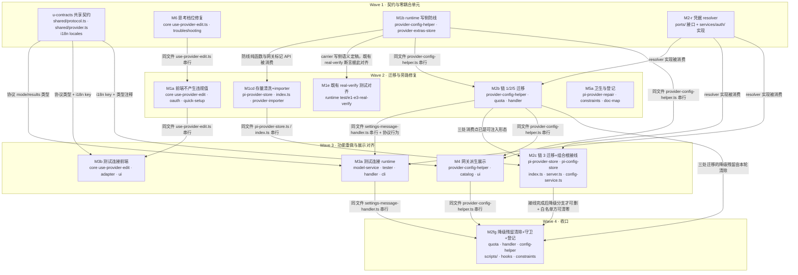

# Provider 字段权威收口 实施计划

基线: 0d8b6cbbc（本计划文档基线 commit） | 来源设计: `docs/design/catalog-provider-field-authority.md`（v3.3，已随 58f3a5eee 升 v3.4、复经 f15838cea 修补为 v3.4.1） | 日期: 2026-09-10

> 本计划把设计 §5 的 M1–M6 六个语义单元细化为可派发单元——初版 13 单元，执行期调整为 14（净 +1：M1e 新立、M5a 拆出 M5b、M2g+M5b 合并为 M2fg）。细化不是语义变更，而是**领地互斥**要求：
> 设计里 M1/M2/M3/M4 共改同一批热点文件（`provider-config-helper.ts` 被 M1/M2/M4 共改、`use-provider-edit.ts` 被 M1/M3/M6 共改、`pi-provider-store.ts` 被 M1/M2/M5 共改），
> 同一 wave 内并行派发会写冲突，故按「同文件共改 → 串行边」拆开，并用契约前置（u-contracts）把 M3/M4 的共享接线点一次交付。
> 单元 ID 保留设计映射（M1a = M1 的前端部分，依此类推），追溯不受影响。

## 0 章节映射

| 内容 | 本文实际位置 |
|------|--------------|
| 背景/目标 | 设计 §1 背景目标（SCQA + 设计目标 G1–G5 + In/Out of Scope） |
| 终态/机制 | 设计 §3 解决方案（§3.1 终态场景 A/A'/B/C/D + 终态物理数据流 · §3.2 架构级方案对比 · §3.3 关键决策 D1–D9 · §3.4 外部共享状态写入面 · §3.5 接口与错误规格） |
| 验收场景表 | 设计 §4 验收（11 个真实场景 + 依赖说明） |
| 下一层拆分 | 设计 §5 下一层拆分（实施路径 + 拆分清单 + 文件改动地图 + 待验证检查点 1–6） |
| 探针清单 | 设计 §3.6 探针清单（P-poison ✅ / P-gate ✅ / P-schema ✅ / P-scope ✅ / P-gateway ✅ / P-cred ⛔M2 / P-test-req ⛔M3 / P-sanitize ⛔M1 / P-oauth-shell ⛔M1 / P-presets ⛔M6） |
| 对抗式审查证据 | `.review/design-review-catalog-provider-field-authority.md`（主审 R4：must_fix 0 / suggestion 0）· `.review/design-review-catalog-provider-field-authority-impact-round4.md`（影响面 R4：must_fix 0 / suggestion 1 已修） |

## 1 目标快照

**（逐字摘录设计 §1，禁止改写）**

### 设计目标（从使用者体验倒推）

- **G1（展示真实）**：用户在 settings 页看到的 catalog provider 信息永远等于 pi 真实生效语义——不再有「类型：anthropic-messages」式误导；混合协议 provider 的协议分布对用户可见；用户设置的网关覆盖值如实展示。
- **G2（操作无害）**：用户在 settings 页做任何保存操作都不可能弄丢其他 provider——P0 雷拆除；已踩雷用户的 models.json 自动修复、消失的 custom provider 回来。
- **G3（测试可信）**：「测试连接」测的是真实聊天要走的协议与端点——成功 = 真的能聊；失败 = 告诉用户哪个协议哪个模型为什么失败、去哪修。
- **G4（收口防复发）**：凭据读取有唯一入口，新场景不需要也不会再发明第 6 条解析链（lint 机器拦截）；约束登记进 constraints.json 进 CR 视野。
- **G5（档位如实）**：用户为自定义模型设置的思考档位在 composer 真实可选——落盘的模型能力字段语义与 pi 门控语义一致，不再「设置了高档、弹层只有关」。

### In / Out of Scope

- **In scope**：settings-provider 页对 catalog provider 的展示 / 保存 / 测试连接 / 模型发现；自定义模型思考档位链路（reasoning 出厂显式化 + 预设过滤语义对齐）；models.json 写侧防线与存量清洗；provider 凭据读路径收口与防复发约束；本设计文档引用的 pi 语义锚点卫生。
- **Out of scope**：① 模型双名称（id/name）编辑表单与 composer 显示 `provider/model` 两个独立 UI 改进（走 dev-flow 小改动，不进入本设计）；② pi 侧行为修改；③ quota fetcher 本身的协议逻辑；④ overlay 刷新链对 pi 侧 `models-store.json` 的无锁写竞态；⑤ ProviderInfo 判别联合类型重构（远期演进，方案 C）。

### 实施期不可动摇的既有裁定

- 不做 baseUrl 兜底（对 artifact 字段打补丁是错误分层）
- 不做全局单点探活（测试连接 = per-协议代表模型发真实最小请求）
- [MANDATORY] 不修改 pi 源码、不提 PR、不 fork；pi 语义断言以 node_modules 实装 `0.84.4` dist 为准

## 2 单元列表

| Unit | 职责（对应设计决策） | 领地（精确文件路径） | 依赖 | 隔离 | 验收条款 |
|------|---------------------|---------------------|------|------|----------|
| **u-contracts** | 共享接线点一次交付：`config.discoverModels` 加 optional `mode`、`config.discoveredModels` 加 optional `results`、`SetProviderData` 语义注释（§3.5）；`BuiltinModelSummary.api` 改 optional（D7 连带）+ `ProviderInfo.api/baseUrl` 网关/派生语义注释 + `BuiltinProviderTemplate.api/baseUrl` artifact 标记（D5）；M3/M4 全部新增 i18n key（zh + en） | `packages/shared/src/protocol.ts`<br>`packages/shared/src/provider.ts`<br>`packages/renderer/src/i18n/locales/zh-CN/settings.ts`<br>`packages/renderer/src/i18n/locales/en-US/settings.ts` | — | plain | `pnpm --filter @xyz-agent/shared typecheck` + `pnpm --filter @xyz-agent/runtime typecheck` 全绿；`cd packages/renderer && npx vitest run src/__tests__/i18n/` 绿（含 locale-sync-check：zh/en key 集合一致） |
| **M6** | D9 全部：discover 合并补 `reasoning: true`；`pickStrategy` 行级联动（`reasoning === undefined` 才置 true，永不覆盖显式 false，all-levels 同规则）；`THINKING_PRESETS` 两预设补显式 null 剔除项（on-off 两档 / high-max 三档）；头注释改 pi 黑名单过滤语义；troubleshooting 存量恢复指引 | `packages/core/src/domain/settings/use-provider-edit.ts`<br>`packages/core/src/domain/settings/__tests__/use-provider-edit.test.ts`<br>`docs/troubleshooting.md` | — | plain | `cd packages/core && npx vitest run src/domain/settings/__tests__/use-provider-edit.test.ts` 绿，含新增用例：discover 合并产出的模型 `reasoning === true`；`pickStrategy` 对 undefined 置 true / 对显式 false 不覆盖（high-max 与 all-levels 两分支）；两预设经 pi 同源 `getSupportedThinkingLevels` 输出档位名为 `[off, high]` / `[off, high, max]`（P-presets 探针结论写进用例注释） |
| **M1b** | D1②③ runtime 写侧防线：`applyProviderLevelFields`/`applyModelRoutingFields` 空串转译（trim 后空串同视；`apiKey` 空串 = 删键，其余 = 不写键 + warn）；catalog 分体系（`type` 键忽略 + warn；`baseUrl` 非空 = 网关写入、显式空串带键 = 清除；不物化空壳）；**防线载体共享纯函数** `applyProviderWritePolicy(merged, data, kind, source, providerId)`（纯函数无副作用，返回 `{ merged, gatewayToSet?, gatewayToClear?, skipUpsert? }`，`source: 'settings' \| 'import'`）；`ProviderExtras` 加 `gatewayBaseUrl` + `getExtrasSync` sync 原语；**setProvider 末尾接载体并消费信号**（skipUpsert 跳过 upsert / gatewayToSet 先写 extras 标记后 upsert / gatewayToClear 先 upsert 后清标记且标记缺失短路）；**模型级空 id 收口**（空/纯空白 id 模型整条丢弃 + warn，对齐 pi 模型级 `id` 的 `minLength:1`）；`eslint.config.mjs` 该文件 max-lines override 600 → 900 | `packages/runtime/src/services/provider-config-helper.ts`<br>`packages/runtime/src/services/provider-extras-store.ts`<br>`packages/runtime/src/services/__tests__/provider-config-helper.test.ts`<br>`packages/runtime/src/services/__tests__/provider-write-fields.test.ts`<br>`eslint.config.mjs` | — | plain | `cd packages/runtime && npx vitest run src/services/__tests__/provider-config-helper.test.ts` 全绿，含：空串矩阵（provider 级 name/baseUrl/apiKey/api + 模型级 name/api/baseUrl）落盘无空串键；`apiKey:''` → 键被删除；纯空白串同视；catalog `type` 键不写 + warn；catalog baseUrl 非空 → `merged.baseUrl` + `gatewayToSet`；显式 `''` → `gatewayToClear` 且 merged 无 baseUrl 键；未带键 → 不变；八字段全缺 → `skipUpsert`（且 `upsertProvider` 不被调用）；`source='import'` + catalog → baseUrl/api 剥除；**P0 毒化链端到端**（catalog 空串 baseUrl 保存 + 同文件 custom 带 apiKey → 无空串键且 custom 原样）；网关写序（extras 先于 upsert）与清除短路（无标记不调 `modify`）；模型级空 id 模型被丢弃；`npx eslint packages/runtime/src/services/provider-config-helper.ts --max-warnings 0` 退出 0 |
| **M2-r** | D3 resolver 本体：接口落地 `IProviderCredentialResolver`（设计 §3.5 逐字定义，归本单元以免同波次依赖 u-contracts）+ 实现双形态（async 明文 / sync 布尔 + 批量）+ 源优先级单点声明（auth.json → models.json）+ P-cred 探针（$ENV_VAR / command 配置值解析行为） | `packages/runtime/src/services/ports/provider-credential-resolver.ts`（新）<br>`packages/runtime/src/services/auth/provider-credential-resolver.ts`（新）<br>`packages/runtime/src/services/auth/__tests__/provider-credential-resolver.test.ts`（新） | — | plain | `cd packages/runtime && npx vitest run src/services/auth/__tests__/provider-credential-resolver.test.ts` 绿，含：auth.json 命中优先于 models.json；两源皆无 → `undefined` / `false`；`listCredentialBackedProviderIds` 返回并集（单次读，非 N 次）；P-cred 探针实测结论（$ENV_VAR 是否已展开）写入用例注释与提交信息，降级路径按 §3.6 落地 |
| **M1a** | D1①⑤⑥ 前端不产生违规值 + 两条旁路调用方：`save()` 对 catalog 不带 `type` 键、`baseUrl` **恒显式带键**（trim 结果：非空 = 设网关、`''` = 清除网关）、对 custom 空串 name/baseUrl 不带键；OAuth 收尾 payload 改 `{authMethod:'oauth'}`-only；QuickSetup payload 去 `baseUrl`（模板默认值不落盘）与 `api` 死键 | `packages/core/src/domain/settings/use-provider-edit.ts`<br>`packages/renderer/src/composables/features/settings/useProviderPageOauth.ts`<br>`packages/ui/src/features/settings/provider/use-quick-setup-form.ts`<br>测试：`packages/core/src/domain/settings/__tests__/use-provider-edit.test.ts`、`packages/renderer/src/__tests__/composables/use-provider-page-oauth.test.ts`、`packages/ui/src/features/settings/__tests__/ProviderQuickSetup.test.ts` | M6（同文件 `use-provider-edit.ts` 串行） | plain | 三个包对应测试文件 vitest 绿，含：save() payload 对 catalog 无 `type` 键且恒含 `baseUrl` 键（含 `''`）；custom 空串 name/baseUrl 不带键；OAuth 收尾 setProvider payload 仅 `{authMethod:'oauth'}`；QuickSetup payload 无 `baseUrl`、无 `api` |
| **M1cd** | D2 存量清洗 + D1④ importer 旁路：`sanitizeInvalidProviders` 扩展（①空串全集剥键 → ②catalog provider 级键处置：`api` 一律剥、`baseUrl` 按 extras `gatewayBaseUrl` **仅存在性**判定，有标记保留 / 无标记剥除 + 日志；写读错位 → 待清标记清单；顺序契约：剥键先于既有空壳判定）；`index.ts` 启动 async 阶段编排待清清单的 `extrasStore.modify`；importer 主路径（`:251/:322`）接防线载体纯函数 + fallback catalog 返回 `failed` 不写 `tpl.api`/`tpl.baseUrl`/`config.apiKey` | `packages/runtime/src/infra/pi/pi-provider-store.ts`<br>`packages/runtime/src/index.ts`<br>`packages/runtime/src/services/migration/provider-importer.ts`<br>测试：`packages/runtime/src/infra/pi/__tests__/pi-provider-store.test.ts`、`packages/runtime/src/services/migration/__tests__/provider-importer.test.ts` | M1b（纯函数与标记 API） | plain | vitest 绿，含：空串全集剥键矩阵（P-sanitize 探针：剥键后同一文件经 pi `ModelConfig.load` `providers.size` 恢复）；catalog 无标记 `baseUrl` 剥除 / `api` 一律剥 / 有标记保留三对照；写读错位产待清清单且不塞进同步清洗段；剥键先于空壳判定；importer 主路径 catalog 源端 provider 级字段不落盘、空串转译；fallback catalog 返回 `failed`（P-oauth-shell 同族：不新增 models.json 条目） |
| **M2b** | D3 链 1/2/5 迁移：`QuotaService.getCredential` 的 auth.json / models.json 两段改 resolver（保留 secrets 首段）；`handleDiscoverModels` 凭据回查改 resolver async 版；`listProviders` 内联 apiKeySet 判定改 resolver 批量 sync 版（维持 B3「消除 N+1 读盘」） | `packages/runtime/src/services/provider-config-helper.ts`<br>`packages/runtime/src/services/quota-service.ts`<br>`packages/runtime/src/transport/settings-message-handler.ts`<br>测试：`packages/runtime/src/services/__tests__/quota-service-workspace.test.ts`、`packages/runtime/test/services/quota-service.test.ts`、`packages/runtime/test/settings-message-handler*.test.ts`、`packages/runtime/src/services/__tests__/provider-config-helper.test.ts` | M2-r（resolver 实现）· M1b（同文件 `provider-config-helper.ts` 串行） | plain | vitest 绿，含：`listProviders` 走批量 sync 版（断言单次 `listCredentialIds` 型调用，无 N+1）；quota 保留 secrets 首段 + 后两段走 resolver；discover 凭据回查对「凭据只在 auth.json」的 catalog provider 命中（失败模式 C 凭据断链修复） |
| **M5a** | D8 锚点卫生 + D6② 约束登记 + D6③ 文档映射登记 + 两处依赖/锚点补正：`pi-provider-repair.ts:34/:45` 注释锚点改 0.84.4 实装（TypeBox 非 zod、provider 级 baseUrl 在 `:171`、校验器装配 `:184`）；`docs/troubleshooting.md` 既有行 `pi-ai dist/models.js:546-557` 锚点补正为实装核实值（`getSupportedThinkingLevels` 在 548-558，`EXTENDED_THINKING_LEVELS` 在 547）；`packages/core/package.json` 补声明 `@earendil-works/pi-ai` devDependency（M6 测试同源断言 import 它，与 `packages/runtime` 既有声明一致，并同步 `pnpm-lock.yaml`）；`constraints.json` 登记新约束（凭据读路径 + `upsertProvider` 直调清单，id 取 C-proc 域下一个空号）+ `render-constraints.mjs` 重生成 md；`check-doc-symbol-drift.mjs` 的 `DOC_MODULE_MAP` 登记本文档与映射源码模块 | `packages/runtime/src/infra/pi/pi-provider-repair.ts`<br>`docs/troubleshooting.md`<br>`packages/core/package.json` + `pnpm-lock.yaml`<br>`docs/constraints.json`<br>`docs/constraints.md`<br>`scripts/check-doc-symbol-drift.mjs` | — | plain | `node scripts/check-doc-symbol-drift.mjs` 退出 0；`node scripts/render-constraints.mjs --check` 退出 0；`pi-provider-repair.ts` 与 `docs/troubleshooting.md` 的 pi 锚点行号经实装 `node_modules` 核实一致；`pnpm --filter @xyz-agent/core typecheck` 与 core vitest 全绿（依赖显式声明后无解析回退）；`pnpm install` 后 lock 无异常 diff |
| **M2c** | D3 链 3 迁移 + 组合根装配：`pi-provider-store.readAuthCredentials` 两处消费（`:353/:384`）改经注入的 resolver sync 版（消除私有裸读）；`pi-config-store.ts` 落地链 3 注入通道（检查点 5：**模块级 init setter 首选 / 调用链传参备选，禁构造参数形态**）；`index.ts` 装配 resolver 实例（`new ProviderCredentialResolver({authService, authStorage, configStore})`）+ init 注入 + `clearApiKey` 闭包改 sync 版（仍为纯删键）+ `new QuotaService({providerCredentialResolver})`；**`server.ts` 的 `SettingsMessageHandler` ctx 透传 resolver**；**`config-service.ts` 的 `listProvidersImpl` 调用点透传 resolver**；`pi-provider-store.ts:495-498`「为什么修复路径不用合并视图」注释前提随 D7 更新 | `packages/runtime/src/infra/pi/pi-provider-store.ts`<br>`packages/runtime/src/infra/pi/pi-config-store.ts`<br>`packages/runtime/src/index.ts`<br>`packages/runtime/src/transport/server.ts`<br>`packages/runtime/src/services/config-service.ts`<br>测试：`packages/runtime/src/infra/pi/__tests__/pi-provider-store-finddefault.test.ts` | M2-r（resolver）· M2b（三处消费点已是可注入形态）· M1cd（同文件 `pi-provider-store.ts` / `index.ts` 串行） | plain | vitest 绿，含：`readAuthCredentials` 私有裸读消失且链 3 消费点经注入 resolver；装配序满足「init 先于任何 `findValidDefaultModel` 调用」；`clearApiKey` 走 sync 版且落盘仍为删键（无空串写入）；**三处消费点在生产装配下确实拿到 resolver 实例**（listProviders / discover / quota 各一条端到端断言，不能只测「注入了就生效」）；检查点 5 的实际注入形态记录在提交信息。注：本单元只做「接线」，三处降级分支的删除归 M2fg（删早了会失去未注入时的兜底，删晚了白名单清不了零） |
| **M2fg** | 收口尾件（M2f 删降级残留 + M2g 守卫脚本 + M5b 契约登记三合一）：① 移除 M2b 三处迁移遗留的降级分支（`quota-service` 的内联 auth.json/models.json 回退、`settings-message-handler.resolveProviderApiKey` 的 models.json 回退、`provider-config-helper.listProviders` 的 `new Set(authIds)` 回退）——接线完成后这些分支不可达且保留的就是要收口的直查模式；② 新建 `scripts/check-provider-credential-reads.mjs`（白名单 + fail 收集 + 退出码 0/1）：禁 `packages/runtime/src/**` 白名单外出现 getApiKeyForProvider / `readAuthCredentials` / `getProvider(*).apiKey`；**姊妹守卫**：`upsertProvider` 直调清单（白名单 = setProvider / importer 主路径两处 / clearApiKey 闭包 / 启动清洗）；接线 `install-hooks.sh`（按 `packages/runtime/src/**` 路径触发）+ `preflight-check.sh`；③ `docs/constraints.json` 的 C-proc-14/15 已落条目 → 跑 `render-constraints.mjs` 生成 `docs/constraints.md` | `packages/runtime/src/services/quota-service.ts`<br>`packages/runtime/src/transport/settings-message-handler.ts`<br>`packages/runtime/src/services/provider-config-helper.ts`<br>`scripts/check-provider-credential-reads.mjs`（新）<br>`.githooks/install-hooks.sh`<br>`scripts/preflight-check.sh`<br>`docs/constraints.json`<br>`docs/constraints.md`<br>测试：上述三个模块的既有测试文件 | M2c（接线完成后降级分支才可删）· M2b（三处迁移）· M3a / M4（同文件串行，须在二者提交后） | plain | ① 三处降级分支移除后对应测试改为「resolver 恒注入」形态；② `node scripts/check-provider-credential-reads.mjs` 对当前 HEAD 退出 0（**白名单仅 resolver 模块自身，即清零**）；反证：在白名单外临时加一行 getApiKeyForProvider(id)（该符号已随本单元删除，反证时临时重写） → 退出 1 且报文件行号与 resolver 路径，撤销后回绿（验收场景 8）；`upsertProvider` 直调清单断言同上；③ `node scripts/render-constraints.mjs --check` 退出 0，`docs/constraints.md` 含 C-proc-14/15 生成段 |
| ~~M2g~~ | **已并入 M2fg**（守卫脚本 + 接线部分）——原定义见 §7 变更历史 | — | — | — | — |
| **M3a** | D4 runtime 侧：per-协议代表模型双过滤选择（`enabled !== false` 且 `baseUrl` 非空）+ baseUrl 四级回落链（模型级 → custom provider 级 → catalog 网关 override → 报「未配置 baseUrl」）+ 3 协议最小真实请求（`max_tokens: 1` / `max_output_tokens: 1`，精确 body 以 P-test-req 实测为准）；`handleDiscoverModels` 加 `mode` 分支（test 走 per-model 编排，缺省 discover）；CLI 冒烟 + 可选 `--mode test` | `packages/runtime/src/services/model-service.ts`<br>`packages/runtime/src/infra/model-connection-tester.ts`（新）<br>`packages/runtime/src/transport/settings-message-handler.ts`<br>`packages/runtime/src/cli/commands.ts`<br>测试：`packages/runtime/src/cli/__tests__/commands.test.ts`、`packages/runtime/test/settings-message-handler*.test.ts` | u-contracts（协议 `mode`/`results`）· M2-r（凭据）· M2b（同文件 `settings-message-handler.ts` 串行） | plain | vitest 绿，含：代表模型双过滤（禁用模型不代表、空 baseUrl 模型不冒充网络错误）；baseUrl 回落链四级逐级断言；3 协议请求体断言含 `max_tokens`/`max_output_tokens: 1`；无可用模型 / 协议不支持 / 全部模型被禁用分别返回 §3.5 错误规格对应文案；`mode` 缺省走 discover（CLI 向后兼容，P-test-req 结论写进用例注释） |
| **M3b** | D4 前端侧：`runDiscover` 传 `mode`；测试连接调用传 `mode:'test'` 并消费 `results`；`ProviderTestDiscoverSection.vue` 按协议分组渲染结果与恢复指引；catalog provider 隐藏「模型发现」按钮（custom 保留） | `packages/core/src/domain/settings/use-provider-edit.ts`<br>`packages/renderer/src/composables/shell/settings-transport-adapter.ts`<br>`packages/ui/src/features/settings/provider/ProviderTestDiscoverSection.vue`<br>测试：`packages/ui/src/features/settings/__tests__/provider-test-discover-section.test.ts`、`packages/core/src/domain/settings/__tests__/use-provider-edit.test.ts` | u-contracts（协议类型 + i18n）· M1a（同文件 `use-provider-edit.ts` 串行） | plain | vitest 绿，含：payload 带 `mode`（discover / test 两分支）；适配层透传 `mode`；组件按协议分组渲染每行 `{api, modelId, ok, error}` 与恢复指引文案；catalog provider 不渲染「模型发现」按钮、custom 渲染（用户可见 DOM 断言） |
| **M1e** | 既有 real-verify 测试对齐 D1③ 写侧语义：`test/e1-e3-real-verify.test.ts` 的 E1 取 dev 数据首个 provider 断言 `setProvider({type})` 落盘 provider 级 api——catalog provider 在新语义下 `type` 被忽略（D1③），断言失效。改为按 kind 显式选取（custom provider 断言 api 落盘；catalog 分支断言 provider 级 api 不落盘 + 派生值不变），无 custom provider 时按既有 `skipIf` 模式跳过并注明理由 | `packages/runtime/test/e1-e3-real-verify.test.ts` | M1b（carrier 语义已定稿） | plain | `cd packages/runtime && npx vitest run test/e1-e3-real-verify.test.ts` 全绿（本地有 dev 数据时真跑，无则按既有 skip 模式跳过并给出 skip 记录）；断言强度不削弱（仍做真实落盘读取断言，只是按 kind 分支） |
| ~~M5b~~ | **已并入 M2fg**（constraints C-proc-14/15 登记 + render）——原定义见 §7 变更历史 | — | — | — | — |
| **M4** | D5 网关优先派生两级语义（`resolveCatalogDisplayFields`：override 非空 baseUrl 优先原值 + 网关标注；无网关则对合并模型集派生「全同值 → 该值 / >1 非空值 → undefined / 全空 → undefined」，api 同规则）+ D7 `overlayToCatalogModel` 去空串归一 + `ProviderEditBody.vue` catalog 化（类型只读派生文案、端点改「自定义网关」可选框 + placeholder/清除语义 + form.api 取值定义）+ `ProviderQuickSetup.vue` 卡片混合检测展示 | `packages/runtime/src/services/provider-config-helper.ts`<br>`packages/runtime/src/services/provider-catalog.ts`<br>`packages/ui/src/features/settings/provider/ProviderEditBody.vue`<br>`packages/ui/src/features/settings/provider/ProviderQuickSetup.vue`<br>测试：`packages/runtime/src/services/__tests__/provider-config-helper.test.ts`、`packages/runtime/src/services/__tests__/provider-catalog.test.ts`、`packages/ui/src/features/settings/__tests__/provider-edit-body.test.ts`、`packages/ui/src/features/settings/__tests__/ProviderQuickSetup.test.ts` | u-contracts（i18n + 类型注释）· M1b（同文件 `provider-config-helper.ts` 串行）· M2b（同文件串行） | plain | vitest 绿，含：网关优先（override 非空 → 原值 + 标注）；派生三态（同值 / 混合 / 全空 → undefined）；`overlayToCatalogModel` 缺省不再产 `''`（为 undefined）；`ProviderEditBody` catalog 不渲染类型输入框、渲染派生文案与端点可选框，custom 照旧可编辑（用户可见 DOM 断言）；QuickSetup 卡片混合 → 「按模型分发」、空 → 「—」 |

## 3 DAG 图



分层：Wave1 4 单元（u-contracts · M6 · M1b · M2-r）· Wave2 5 单元（M1a · M1cd · M1e · M2b · M5a）· Wave3 4 单元（M2c · M3a · M3b · M4）· Wave4 1 单元（M2fg）（均 ≤5 并发上限）；关键路径深度 4，最大宽度 5。执行期两处单元调整：M1e 为新立单元（M1b 第 3 轮发现的领地外旧语义测试，M1b 已达修复轮上限故另立承接）；M2g + M5b 合并为 M2fg——M2b 的三处迁移是「可注入 + 缺省降级旧行为」，降级分支不删则白名单清不了零、守卫脚本无处落地，故「删降级 + 落守卫 + 登记」必须同批（且必须在 M3a/M4 提交后，避免同文件冲突）。

## 4 测试策略

框架：vitest（项目红线，禁 `node:test` / `tsx --test`）；命令从各包 `package.json` 与 `TEST-STRATEGY.md` 真实读取。

### 增量（单元开发期，只跑受影响文件）

```bash
# core（M6 / M1a / M3b）
cd packages/core && npx vitest run src/domain/settings/__tests__/use-provider-edit.test.ts
# runtime（M1b / M2-r / M1cd / M2b / M2c / M3a / M4）
cd packages/runtime && npx vitest run src/services/__tests__/provider-config-helper.test.ts
# ui（M1a / M3b / M4）
cd packages/ui && npx vitest run src/features/settings/__tests__/
# renderer（u-contracts i18n / M1a / M3b）
cd packages/renderer && npx vitest run src/__tests__/i18n/ src/__tests__/composables/use-provider-page-oauth.test.ts
# 类型检查（u-contracts 及各单元收尾）
pnpm --filter @xyz-agent/shared typecheck
pnpm --filter @xyz-agent/runtime typecheck
pnpm --filter @xyz-agent/core typecheck
pnpm --filter @xyz-agent/ui typecheck
pnpm --filter @xyz-agent/frontend typecheck
```

### 阶段 5 全量（收尾场景才跑）

```bash
pnpm test          # 根：全部 packages/apps/extensions
pnpm lint          # eslint --max-warnings 0
pnpm --filter @xyz-agent/core test && pnpm --filter @xyz-agent/runtime test && pnpm --filter @xyz-agent/ui test && pnpm --filter @xyz-agent/frontend test
```

### 测试红线与既有守卫（每个 commit 都会跑）

- **禁止触碰真实数据目录**：runtime vitest 有 `test/global-setup.ts` fail-fast + `test/fs-guard.ts` 白名单（`os.tmpdir()` / `$XYZ_AGENT_DATA_DIR` / `~/.xyz-agent-dev`）；新测试的写删目标必须 `mkdtempSync(join(tmpdir(), ...))` 自建自删
- 改 `use-provider-edit.ts` → pre-commit 触发 `scripts/diff-probe-thinking.mjs`（能力注册表 vs pi-ai 同源差分，必须绿）
- 改 `packages/renderer/src/i18n/locales/*.ts` → `check_i18n_locale_sync.py`（zh/en key 集合一致）
- 改 `packages/renderer/src/**/*.vue` → `check_i18n_cjk.py`（模板无 CJK 硬编码）
- 改 `docs/constraints.json` → `render-constraints.mjs --check`；改 `docs/design/` → `check-doc-symbol-drift.mjs`
- 新增测试文件 → `check_test_flake_hygiene.py`（F3 flake 模式）
- 三视角缺一不可：每条 UI 用例至少一个用户可见 DOM 断言

### 实施期探针门（设计 §3.6，未跑不得宣称对应单元完成）

| 探针 | 归属单元 | 要求 |
|------|---------|------|
| P-cred | M2-r | 构造 $ENV_VAR 引用凭据实测 resolver 输出；结论写用例注释 + 提交信息，失败走降级路径 |
| P-sanitize | M1cd | 复用 P-poison 脚本：剥键后同一文件经 pi `ModelConfig.load` `providers.size` 恢复；有/无标记对照 |
| P-oauth-shell | M1cd | 模拟 OAuth 收尾调用 setProvider 后读 models.json：无新增条目/无空壳 |
| P-test-req | M3a | 对真实端点发 3 协议最小请求；调不通的协议从支持集剔除并落「暂不支持」文案 |
| P-presets | M6 | 修正后预设逐个调 pi `getSupportedThinkingLevels` 断言档位数；discover 合并 + 行级联动后 reasoning 落盘显式 boolean |

## 5 合理偏差登记表

| # | 单元 | 偏差描述 | 判定 | 登记时间 |
|---|------|---------|------|---------|
| D-1 | M1b | **模型级空 `id` 的处置形态 = 整条丢弃模型，而非设计原文的「不写键」**。设计 D1 防线② 把模型级 `id/name/api/baseUrl` 与其余字段统一表述为「空串 = 未指定（不写键）+ warn」，但 `id` 在 pi schema 里是**必填**字段（`model-config.js:137-140` 的 `minLength:1`）——「不写键」会留下一个无 id 的模型条目，同样过不了校验。实现取「空/纯空白 id 的模型整条丢弃 + warn」，与载体侧设计意图（防线承诺 = 任何保存都不产生 schema 违规值）一致 | 合理不一致 → 固化；**需同步设计文档措辞**（把模型级 `id` 从「不写键」组拆出，单列为「丢弃该模型」），由主 agent 在阶段 4 doc_errors 批次回写——**已回写（本批）** | 2026-09-10 |
| D-2 | M1b | **防线载体签名比设计暂名多一个 `providerId` 参数**（第 5 参）。设计暂名 `applyProviderWritePolicy(merged, data, kind, source)`，但 §3.5 错误规格要求 warn 文案带 `<id>` 才能诊断（`dropped empty-string <field> for <id>`），无 id 无法定位 | 合理不一致 → 固化（签名以本节为准） | 2026-09-10 |
| D-3 | M1b | **`eslint.config.mjs` 该文件 max-lines override 600 → 900**。设计 D1 指定防线载体驻 `provider-config-helper.ts`，落地后该文件 eslint 计数 586 → 715 超限（`pnpm lint` = `eslint . --max-warnings 0` 会红）。仓库既有先例即「聚合中心短期 override、长期拆分」（同文件原注释 + `download-asset.ts` 抬到 1000），且 M2b/M4 还会继续向该文件追加 | 合理不一致 → 固化（沿用仓库既有模式，非新机制） | 2026-09-10 |
| D-4 | M1b | **既有断言 `provider-write-fields.test.ts` 「id 缺省 → `String(m.id ?? '')` 空串锚定」被改写**。该断言编码的正是要消灭的空串落盘行为（空 id 落盘即毒化整文件），与 G2「任何保存操作都不可能弄丢其他 provider」直接冲突，属本设计的必然改动而非顺手清理 | 合理不一致 → 固化（同批改断言 + 留注释说明理由） | 2026-09-10 |
| D-5 | M2-r | **resolver 接口文件归本单元而非 u-contracts**（派发前调整，理由见 §7 变更历史） | 合理不一致 → 固化 | 2026-09-10 |
| D-6 | u-contracts | **i18n「模型发现」正名采用「改值不改 key」**（既有 key `settings.providerEdit.autoDiscover` 被领地外 3 个文件引用，改 key 会波及领地外） | 合理不一致 → 固化 | 2026-09-10 |
| D-7 | M1a | **3 处既有 renderer 断言随 payload 契约变更同批更新**：`provider-builtin-ui.test.ts` t10/t14（断言 setProvider payload 含 `api`/`baseUrl`）、`ProviderPage.test.ts:480-483`（OAuth 收尾断言含 `name`）。实测已红（3 failed / 50 passed），是 payload 契约变更的直接后果而非顺手清理；M1a 领地扩展至这两个测试文件，断言强度不削弱（仍断言确切键集合，只对齐新契约） | 合理不一致 → 固化 | 2026-09-10 |
| D-8 | M1a | **custom 空 `name` 的 payload 层 truthy 守卫在正常路径不可达**：`save()` 入口已有校验（`if (!form.name.trim())` → 返回 `ok:false` 且不调 setProvider）先行拦截，故验收条款「custom 空串 name → payload 不含该键」无法构造输入。用例改为断言可观测事实（校验拦截 + `setProvider` 未被调用），payload 层守卫按设计保留为纵深防御 | 合理不一致 → 固化（用例断言口径调整，守卫本身保留） | 2026-09-10 |
| D-9 | M1b | **`skipUpsert` 语义收窄为「仅新建场景跳过」**（`skipUpsert && existingConfig === undefined`；既有条目一律 upsert）。第 2 轮实现把设计 D1③ 的「对既有条目是 no-op 而非删除」读成了「既有条目跳过写盘」→ 用户清空网关时 upsert 被跳过、盘上 baseUrl 键残留，**清除静默失效**（展示回内置端点但 pi 仍走旧网关），与验收场景 A'/5 与 G1 直接冲突。设计那句的本意是「不删除既有条目」（全清空后旧条目交 D2 启动清洗接管），不是「不写既有条目」 | 不合理偏差 → 打回 dev 修（第 3 轮）；**需同步设计文档措辞**（D1③ 把「不物化空壳」的适用面显式限定为**新建**，并写明既有条目的剥除/清除必须落盘），主 agent 在阶段 4 doc_errors 批次回写 | 2026-09-10 |
| D-10 | M1b | **白名单守卫 `ensureProviderInWhitelist` 恢复为不受 `skipUpsert` 影响**（`existingConfig === undefined` 即调用）。第 2 轮以「无条目却加 `<id>/*` pattern 是死引用」为由跳过——该理由不成立：catalog provider 定义在 pi 内置 catalog，无 models.json 条目时依然可用，pattern 指的是 provider/model id 而非条目。且跳过属设计未授权的行为变更（对 enabledModels 非空的用户，首次配置凭据后 provider 不再默认启用） | 不合理偏差 → 打回 dev 修（第 3 轮），恢复既有行为 | 2026-09-10 |
| D-11 | M1b | **3 处既有 runtime 断言随「不落空壳」语义同批更新**：`config-service-catalog.test.ts:57/:96`（改为断言 `upsertProvider` 未被调用）、`auth-credential-gateway.test.ts:127-128`（改为断言 `models.anthropic` 为 undefined）。实测已红（3 failed / 1246 passed），是 D1③ 语义的直接后果；断言强度不削弱（仍是精确断言，只对齐新契约） | 合理不一致 → 固化 | 2026-09-10 |
| D-12 | M1cd | **设计文档把 `deepseek` / `fireworks` 当 custom 对照是事实错误（doc_error）**：实测快照 `builtin-providers.json` 39 个 provider **包含 deepseek / fireworks / openai / anthropic / minimax**；不在快照内可用作 custom 对照的是 zhipu / kimi / mimo。故 §4 验收场景 1（「已有一个 custom provider（如 deepseek，models.json 有 apiKey）」）与场景 2 的构造方式在真实快照下不成立——deepseek 的 models.json 条目实为 **catalog override**，其 provider 级 `api`/`baseUrl` 会被 D2② 剥除，凭据也归 auth.json 而非 models.json。**代码行为正确**（D2② 按 `isCatalogProvider(id)` 判定，与文档举例无关；未发现任何按 id 名硬编码），仅文档措辞与场景构造需改 | doc_error → 主 agent 阶段 4 回写设计文档（场景 1/2 的 custom 对照改用真正 custom 的 id，如 `test-custom`/zhipu 类）+ 阶段 5 场景执行时按此构造 | 2026-09-10 |
| D-13 | M5a | **M5a 拆为两次提交**：part 1（锚点校正 / troubleshooting 锚点 / core 依赖声明 + lock）已提交 `0011e964c`；part 2（`docs/constraints.json` C-proc-14/15 + `check-doc-symbol-drift.mjs` 的 DOC_MODULE_MAP 登记）**因两项前置未就绪而暂缓**，拆出为 M5b：① `render-constraints.mjs` 结构校验要求 machine hook 文件存在，而 `scripts/check-provider-credential-reads.mjs` 属 M2g 尚未创建——此刻提交 constraints.json 会让 `render-constraints --check` 恒红并拦截 pre-commit；② DOC_MODULE_MAP 登记后，两份文档里对外部 API（ModelRuntime.getError）、占位 token（$ENV_VAR）、shell 变量（GIT_HOOKS_DIR / HOOK_EOF）、外部 env 名（ZAI_API_KEY）的反引号引用会被判为 drift——需先按脚本书写约定（非现行符号不带反引号）清理文档，再登记 | 合理不一致 → 固化（拆分不改变语义，只调整提交时序避免中间态恒红） | 2026-09-10 |
| D-14 | M5a | **DOC_MODULE_MAP 的模块清单由设计 D6③ 的 4 个扩为 6 个**（+ `packages/core/src/domain/settings/use-provider-edit.ts` 解 `API_KEY_CLEAR_SENTINEL` / `THINKING_PRESETS`，+ `scripts/check-doc-symbol-drift.mjs` 自身解 `DOC_MODULE_MAP`）——映射不到位的符号属真实存在于映射外模块，扩清单是正确解而非放水 | 合理不一致 → 固化；主 agent 阶段 4 回写设计文档时同步该差异 | 2026-09-10 |
| D-15 | M3a | **测试连接错误契约由设计 §3.5 的「文案」形态收敛为结构化 code**：M3a 实装为行级 `http_error\|<status>\|<响应截断>` / `network_error\|<message>` / `unsupported` / `no_base_url` / `no_enabled_model`，顶层 `success=false` 承载 provider 级 code（`no_api_key` / `no_models` / `provider_not_found` / `test_unavailable`）；且**行级失败不改变顶层 `success`**（`success:true` + 行内 `ok:false` 是常态）。M3b 消费方按实装收敛（i18n 映射表见其报告）。理由：文案归前端 i18n 单一来源、runtime 只出可判定 code，比设计原文的「文案」形态更可测。主 agent 阶段 4 回写设计 §3.5 时同步 | 合理不一致 → 固化 | 2026-09-10 |
| D-16 | M3b | **core 传输层类型缺 `mode`/`results`**：`packages/shared/src/protocol.ts` 已由 u-contracts 加好，但 core 侧另有自己的一套传输类型（`packages/core/src/domain/settings/transport.ts` 与 `packages/core/src/transport/api/domains/config.ts`）未同步——M3b 首轮用局部交叉类型绕过。属真实契约缺口（同一契约两处定义），M3b 第 2 轮领地扩展补齐并删除垫片 | 不合理偏差 → 打回修（第 2 轮） | 2026-09-10 |
| D-17 | M3b | **`ProviderEditBody.vue` 未接线新 props → catalog 的「模型发现」按钮在生产路径仍渲染**：M3b 的验收（catalog 不渲染该按钮）在组件级成立、应用级不成立，因宿主组件未传 `providerKind` / `testResults` / `testError` / `providerBaseUrl`。该文件属 M4 领地（M4 正在改它），故归 **M4 第 2 轮**接线——M3b 不得越过 | 集成缺口 → 排入 M4 第 2 轮 | 2026-09-10 |
| D-18 | M3a | **openai-responses 的最小请求取 `max_output_tokens: 16` 而非设计写的 1**：OpenAI 拒绝低于 16，pi-ai 自身也在发请求前 clamp 到 16（实装 `dist/api/openai-responses.js:16-17` 常量 OPENAI_RESPONSES_MIN_OUTPUT_TOKENS，注释指向 pi issue #6265）。用 1 会对全部 responses provider **稳定误报 400**。属设计 §3.3 D4 的事实错误（P-test-req 探针实测驱动），主 agent 阶段 4 回写 | 不合理偏差（设计侧）→ 打回改设计文档 + 实现按实测 | 2026-09-10 |
| D-19 | M3a | **baseUrl 回落顺序对 catalog 是「网关优先」而非「模型级优先」**：设计 §3.3 D4 写的四级顺序（模型级 → custom provider 级 → catalog 网关 override）对 catalog 反了——pi 对 catalog 是 `config.baseUrl ?? model.baseUrl`（`provider-composer.js:98` applyModelsJson，网关**覆盖全部模型端点**，优先级高于模型级）；custom 才是 `definition.baseUrl ?? providerConfig.baseUrl`（`:53`）。照设计字面实现会让设了网关的 provider 去测模型级端点、而真实聊天打网关，违反 G3「成功 = 真的能聊」。实现按 pi 真实语义分两类（`resolveModelBaseUrl`），四级逐级断言齐备。**这是本设计最实质的一处事实纠错**，主 agent 阶段 4 回写 | 不合理偏差（设计侧）→ 打回改设计文档 + 实现按 pi 实装 | 2026-09-10 |
| D-20 | M3a | **代表模型的「baseUrl 非空」过滤取生效 baseUrl（含回落链）而非模型级字面值**：否则「模型发现」拉回的模型（只有 id/name/contextWindow）永远无法测试，与 D4 明文「模型级 baseUrl 缺省时回落 provider 级」自相矛盾 | 合理不一致 → 固化（设计措辞在同批回写时补一句） | 2026-09-10 |
| D-21 | M3a | **tester 由 handler 自建 infra 实例（transport → infra value import），未走 model-api-discoverer 的 port + 组合根注入先例**：M3a 受领地限制未改 index.ts/server.ts，自述「三层文档的软约束由此产生一处让步」。属一致性缺陷（同仓已有 `IModelSource` + 组合根注入的正解），非功能性 bug；收口需 4 文件（新增 ports 接口 + handler 改注入消费 + server.ts 透传 + index.ts 装配）且与 M2fg 同抢 handler 文件，故排入**阶段 4 修复循环**单独成单元，不与 M2fg 同轮 | 不合理偏差 → 阶段 4 打回修（排期受同文件串行约束） | 2026-09-10 |
| D-22 | M4 | **UI 的网关/派生归类用启发式（派生值恒等于模型集唯一非空 baseUrl，否则判为用户网关）**：shared 的 `ProviderInfo` 没有「来源」判别字段，完全零推导做不到。属**受控例外**——只归展示类别、不重算下发值；边界：用户网关值恰等于派生值时被判为「内置端点」，但两种状态下 pi 生效端点相同，无行为差异。彻底解 = 给 ProviderInfo 加 `baseUrlSource: 'gateway' \| 'derived'` 字段（长期方案，已登记 §7 残留风险） | 合理不一致 → 固化 + 登记长期方案 | 2026-09-10 |
| D-23 | M4 | **QuickSetup 卡片空端点用 `endpointNotProvided`（「内置目录未提供」）而非验收条款写的「—」**：协议为空才用 `emptyValue`（「—」），端点为空给更具体的信息量。属展示措辞的合理细化，阶段 5 验收按此判据 | 合理不一致 → 固化（验收判据按此更新） | 2026-09-10 |
| D-24 | M4 | **M4 新建领地外文件 `packages/ui/src/features/settings/provider/provider-catalog-display.ts`（主 agent 追认）**：`ProviderEditBody.vue` 改动前 eslint 计数已 490/500、`<script setup>` 191/300，展示逻辑内联会同时越 `max-lines` 与 vue_rules_checker 上限。M4 选择抽 composable 而非改 `eslint.config.mjs`（后者会与 M1b 的 D-3 争用同一文件，且 override 解决不了 script setup 上限）。与仓库既有先例一致（同组件此前抽出 ProviderTestDiscoverSection） | 合理不一致 → 追认（领地扩展） | 2026-09-10 |
| D-25 | M2c | **检查点 5 注入形态落地为「模块级 init setter」，落点 pi-provider-store.ts 而非单元清单原文的 pi-config-store.ts 转发**：唯一消费点 findValidDefaultModel 是 pi-provider-store 的模块级函数，构造参数不可达；pi-config-store 已 import pi-provider-store，状态放前者只能做纯转发再 export——反向 import 即循环依赖，多一跳零收益。公开 API = initProviderCredentialResolver + 模块级变量；未注入降级 = 视为无凭据（不抛错、不误选），原私有裸读已删。C-comm-03 满足（infra 只 import type 接口） | 合理不一致 → 固化 | 2026-09-10 |
| D-26 | M2c | **clearApiKey 未按设计 D3 清单字面「改走 resolver sync 版」**：resolver 的 sync 形态只有「任一源有凭据」的并集判定（hasProviderCredential / listCredentialBackedProviderIds），而 clearApiKey 是 models.json 单文件删键 RMW——用并集判定当 guard 会改变语义（auth.json-only provider 触发无谓 upsertProvider 写盘；apiKey 空串毒化条目被并集放行，留下 schema 违规键）。落地 = 保留纯删键 RMW（不写空串契约满足）并从 index.ts 闭包提取为 pi-provider-store.ts 具名函数 clearProviderApiKey（index.ts import 即执行 main() 不可单测；提取后删键语义可落盘断言，已断言）。**已转达 M2fg**：upsertProvider 直调白名单的 clearApiKey 条目由 index.ts 变为 pi-provider-store.ts | 合理不一致 → 固化（阶段 4 回写设计 D3 措辞） | 2026-09-10 |
| D-27 | M2c | **链 3 批量判定用 listCredentialBackedProviderIds 批量形态而非逐 provider hasProviderCredential**：39 个 builtin 逐个判定 = 每次同步读 auth.json + JSON.parse（最多 39 次），无凭据的常见启动路径恰是满循环（真 N+1 回归）。批量形态两文件各单次读（B3 先例）；单 provider 裁定仍用 hasProviderCredential 单次。单元清单未写明批量形态，此处显式化 | 合理不一致 → 固化 | 2026-09-10 |
| D-28 | M4 | **「测试连接」指引的 providerBaseUrl 取 ProviderInfo.baseUrl（已持久化的网关 override 或模型集派生端点）而非 form.baseUrl 草稿**：form.baseUrl 是 runtime 派生值回填的表单初值（artifact）；用户改输入框未保存时 runtime 实测的正是持久化端点——指引显示与被测对象一致（G1「展示 = 生效」同构）。若产品后续要求显示草稿值，改 effectiveBaseUrl 一行即可 | 合理不一致 → 固化 | 2026-09-10 |
| D-29 | M2fg | **守卫 B 白名单落地 = 7 文件，较设计 D6③ 列举（setProvider / importer 主路径两处 / clearApiKey / 启动清洗）扩为经验枚举**：+ legacy-provider-migration / provider-extras-migration（两个启动迁移写入点，设计漏列，主 agent 派发前逐文件核实）+ pi-config-store.ts（IConfigStore 实现类自身）+ ports/config.ts（接口方法签名声明命中「标识符+(」模式但非调用）。每条带一行理由注释入脚本；constraints C-proc-15 summary 同步实际清单 | 合理不一致 → 固化；设计侧白名单措辞阶段 4 回写 | 2026-09-10 |
| D-30 | M2fg | **领地外 4 处组合根透传以「非空断言 + 注释」形态闭合（config-service ×3 + server.ts ctx ×1）**：「ConfigService 第 6 参必需化」实测连锁 46 处与 provider 无关的测试构造点（terminal-config / streaming-idle / config-worktree 等）被否定——参数保持可选只为不强迫无关测试注入替身，消费点断言锁定恒注入前提（server.ts 沿用同文件 skillRegistry 先例）；两处已撒谎的降级表述 JSDoc（config-service 构造参数 + server optional services 字段）同步修正 | 合理不一致 → 固化 | 2026-09-10 |
| D-31 | M2fg | **quota-service.test 净删 4 个降级链用例**（「auth.json 优先于 models.json」等——实现已删；QuotaService 层等价断言存于 M2b describe，源优先级单测存于 M2-r 的 resolver 单测）；连带删除 string 兼容构造签名（全仓零调用方核实） | 合理不一致 → 固化 | 2026-09-10 |
| D-32 | D-21 | **ports 文件搬迁三个类型而非任务字面的接口本身**（IModelConnectionTester + ConnectionTestRequest/ConnectionTestResult）——接口签名依赖两个数据类型，只搬接口会造成 ports(services)→infra 反向 type 依赖；infra 一行 re-export 三类型兼容领地外 model-service.ts 的既有 import（后续清理候选：model-service 直连 ports 后删 re-export）。连带一处 doc 注释悬空指向修正（error 语法见文件头 → 指向 infra 实现文件头）；4 个 transport 测试用 vi.fn 替身满足 grep 零命中（与文件内全 stub 风格一致） | 合理不一致 → 固化 | 2026-09-10 |
## 6 状态表

| Unit | 状态 | 轮次 | 证据指针 |
|------|------|------|---------|
| u-contracts | committed | 1 | commit `77e0f79cc`；shared/runtime typecheck 0；renderer i18n 196 passed；doc-symbol-drift 0 |
| M6 | committed | 1 | commit `0e3c42847`；core vitest 50 passed；core typecheck 0；P-presets 实测 on-off 2 档 / high-max 3 档 / all-levels 5 档 |
| M1b | committed | 3 | commit `6986b8171`；runtime typecheck 0；4 个领地测试文件 54 passed；`eslint packages/runtime/src --max-warnings 0` 0 |
| M1e | committed | 1 | commit `39ec5f445`；`test/e1-e3-real-verify.test.ts` 5 passed；runtime `test/` 230 files / 2897 passed 0 failed；typecheck 0；含负向对照（改坏期望 → catalog 红 2 / custom 红 1，证明断言非空转）+ 不依赖 dev 数据的自建 fixture（覆盖 dev 数据缺失的 custom 分支） |
| M2-r | committed | 1 | commit `cfb839308`；runtime vitest 12 passed；runtime typecheck 0；P-cred 实测（xyz 不展开 / pi 展开，已对照 `resolve-config-value.js:71-73` 逐字核对） |
| M1a | committed | 2 | commit `f40f27fbc`；core 54 / renderer 61 / ui 17 passed；frontend typecheck 0；renderer `src/__tests__` 全量 3620 passed \| 3 skipped（影响面扫尾无新红点） |
| M1cd | committed | 2 | commit `f6a73542f`；pi-provider-store 13 + migration 143 + credential-writer 6 + config-provider-import 11 passed；`src/services/__tests__` 376 passed 0 failed；runtime typecheck 0；P-sanitize 实测（毒化 `providers.size` 0 → 清洗后 5 / error=undefined；有标记保留 / 无标记剥除 / 错位标记进待清清单 / 合法条目零触碰）+ P-oauth-shell 实测（零条目） |
| M2b | committed | 1 | commit `c13351c26`；runtime typecheck 0；三个目标测试文件 119 passed；`test/` 230 files / 2905 passed；全量 450 files / 5144 passed。**注意：三处迁移均为「可注入 + 缺省降级旧行为」，生产未接线前不生效**——接线归 M2c、降级分支删除归 M2fg |
| M5a | committed | 1 | commit `0011e964c`（锚点校正 + core 补 pi-ai 声明 + lock）；core typecheck 0、use-provider-edit 54 passed；锚点逐条经实装核实（TypeBox :3-4/:184、provider 级 :170-173、模型级 :137-140、modelOverrides :152、oauth :174；pi-ai models.js :548-558）。**登记部分拆出为 M5b**（见 D-13） |
| ~~M5b~~ | 已并入 M2fg | — | — |
| M2c | committed | 1 | commit `5b0c493e1`；runtime typecheck 0（主 agent 独立复跑）；6 个触及测试文件 156 passed（主 agent 独立复跑）+ 单元自证全量 253 files / 3083 passed；readAuthCredentials 直查在 src/ 零命中（主 agent grep 复核）；装配序静态断言 + clearApiKey 落盘删键断言。偏差 D-25（init setter 形态与落点）/ D-26（clearApiKey 提取而非 resolver sync 版）/ D-27（批量形态消 N+1） |
| ~~M2g~~ | 已并入 M2fg | — | — |
| M3a | committed | 1 | commit `7eb790d06`；runtime typecheck 0；新增/更新测试 61 passed；eslint 0；服务分层与守卫全绿。**P-test-req 实测**：anthropic-messages / openai-completions 用 max_tokens=1 真实调通、401 与网络错可区分；openai-responses 无凭据用 stub 验形状。两处设计纠错见 D-18/D-19 |
| M3b | committed | 2 | commit `78d4ecede`；core typecheck 0 / frontend typecheck 0；core use-provider-edit 58 passed、ui provider-test-discover-section 20 passed；回归 core 全量 1784 / ui settings 137 / renderer settings 191 passed。第 2 轮补 core 传输层类型（transport.ts + config.ts 补 mode/results 并对齐 shared 协议），删除首轮临时交叉类型垫片。**遗留 D-17（ProviderEditBody 未接线）归 M4 第 2 轮** |
| M4 | committed | 2 | 第 1 轮 `f28ecbb20`（runtime 42 / ui 50 passed，typecheck 0）；第 2 轮 `eec21c324`（D-17 接线：ProviderTestDiscoverSection 改 v-bind=testDiscoverProps，四 props 全通；model-mapper D5 注释——主 agent diff 复核确认零逻辑改动；行数 493/500、script setup 202/300）；ui 35/35 passed（主 agent 独立复跑）+ frontend typecheck 0（主 agent 复跑）+ 变异验证 4/5 例红证明断言有效。偏差 D-28（providerBaseUrl 取持久化值） |
| M2fg | committed | 1 | commit `92d761db6`（27 文件 +585/-205）；tsc 0；受影响域 6662 passed 0 failed（主 agent 复跑）；守卫脚本对树 exit 0（271 生产文件双守卫零违规）+ 反证 0/1/0（单元执行、主 agent 复跑守卫本体）；render-constraints --check 0（93 条含 C-proc-14/15 生成段）；eslint 0；共享 pre-commit 已重装同步。偏差 D-29/D-30/D-31 |
| D-21（阶段 4 修复） | committed | 1 | commit `a6adcb5b0`（15 文件）；transport→infra 值导入 grep 零命中（主 agent 复核）；tsc 0；凭据守卫 272 文件绿（主 agent 复跑）；关键 4 测试文件 208 用例 0 失败（主 agent 复跑）；C-comm-03 守卫绿（单元自证）。偏差 D-32 |

## 7 残留风险与变更历史

### 残留风险（执行期需持续观察）

1. **i18n key 前瞻性**：M3a/M3b/M4 的文案 key 由 u-contracts 一次预置。若某单元发现缺 key，禁止越界改 locales（同 wave 写冲突），须停下上报，由主 agent 决定补派小单元或复用既有 key。——已闭合（M3a/M3b/M4 全 committed，无缺 key 上报）
2. **M2c 注释时序**：`pi-provider-store.ts:495-498` 注释前提随 D7（M4）变化，M2c 与 M4 同在 Wave3。若 M2c 先提交，存在一个 commit 的窗口内注释描述领先于代码；同 PR 内收敛，不构成缺陷。——已闭合（M2c/M4 提交；其引用的 pi-provider-store 注释块已被 M2c 重写，锚点作废）
3. **M5a 登记的 hook 名**：constraints.json 里 enforcement 指向 `check-provider-credential-reads.mjs`（M2g 产出）。文件名是计划级固定契约；若 M2g 落地时改名，主 agent 在阶段 4 同步 M5a 登记文本。——已闭合（hook 名一致，constraints :1950/:1969 enforcement 同名）
4. **存量无标记网关误剥**：设计 D2 已接受代价（手编 models.json 网关且从未经新 UI 保存的条目会被剥除）；恢复路径 = M4 的网关输入框重设 + troubleshooting 登记。
5. **设计文档「待验证检查点」回写**：6 个检查点的实测结论由主 agent 在阶段 4（doc_errors 归口）回写设计文档 §5 + 附录变更历史——不由任何开发单元承担（避免各单元改同一设计文档）。——已闭合（58f3a5eee，设计 v3.4 §5/§3.6）
6. **隔离方式全 plain**：热点文件共改已在 DAG 中用串行边消除，同 wave 领地互斥；按 dag-authoring 决策表「领地互斥已足够安全」不启 worktree。
7. **`packages/core` 的 pi-ai 隐式解析（已派回 M5a）**：M6 的新测试 import `@earendil-works/pi-ai`，`packages/core/package.json` 未声明该依赖，当前靠根 `devDependencies` 上溯解析（vitest 与 tsc 均通过）。属真实依赖声明缺口，已归入 M5a 一并补声明；在 M5a 提交前的中间 commit 依赖根 hoisting 生效，功能无影响。——已闭合（M5a 0011e964c：core package.json +pi-ai + lock）
8. **`packages/ui` typecheck 既有基线失败（非本次引入、非 CI 门禁）**：主 agent 2026-09-10 复跑 `pnpm --filter @xyz-agent/ui typecheck`——现仅剩 `search-modal.test.ts` 3 处 TS18048（`'searchMock' is possibly 'undefined'`）；原 3 处错误中 `provider-edit-body.test.ts:198` 的 `'ipc' does not exist in type 'PlatformPort'` 已随 M4 第 2 轮（`eec21c324`）重写自然消除（该文件本次已触碰，非认知外）。已核实 `.github/workflows/ci.yml` 的 typecheck job 只跑 frontend / runtime / shared / extensions，**不含 ui**——属既有本地基线问题，本次不修、只登记（不擅自处理认知外问题）。
9. **同一分支存在并发会话提交**：执行期间 `5887787fd docs(design): add 4 interactive UX demos for coding-plan quota config` 由并发工作流提交（6 个 quota UX demo 文件），随后又出现未跟踪的 `docs/design/coding-plan-quota-config-ux.md`（同一 quota UX 工作流）。二者与本计划领地零交集。主 agent 全程按精确路径 `git add`，本次各单元提交均只含本单元领地文件；并发会话的改动（已提交的与未跟踪的）一律不触碰、不裹挟、不清理。
10. **pre-commit hook 运行中被重写（根因已定位，环境性，非本次改动可修）**：M1b 与 M2-r 的提交各中断一次，报 `line 910: 全部调用点（任意接收者——防: command not found` 这类「中文注释片段被当命令执行」。根因：`.githooks/install-hooks.sh:46` 用 cat 重定向加 heredoc（shell 变量 GIT_HOOKS_DIR 指向的共享 hook 路径，定界符 HOOK_EOF）**原地截断写入**该文件；而 `.bare/hooks/` 是多 worktree 共用的 hooks 目录（`:925` 注释自述「worktree 的 pnpm install（prepare → 本脚本）都会用…源覆盖」）。任何兄弟 worktree 执行 `pnpm install` → `prepare` → `install-hooks.sh` 重写该文件时，正在执行的 bash 按**字节偏移**续读，落进新内容中间 → 把注释片段当命令。实测两次失败时刻的 hook mtime 都恰好等于提交时刻。修复方向（**不在本流水线内擅自动手**，属跨会话共享基建）：写临时文件后 `mv` 原子替换（rename 后运行中的 bash 仍读旧 inode，竞态消失），3 行改动。处置：重试提交（已两次验证重试成功）。
11. **既有测试 fixture 使用非 pi 合法语法的 env 形态（M2-r 探针旁证发现，不在本次范围）**：`packages/runtime/src/services/auth/__tests__/auth-storage.test.ts:156/158` 用 '$ENV:ZAI_API_KEY'，而 pi 的模板语法是 $ENV_VAR / ${ENV_VAR}——pi 会把 '$ENV:ZAI_API_KEY' 解析成变量 ENV + 字面 :ZAI_API_KEY（即该字符串不是有效的环境变量引用）。该用例断言的是 AuthStorage「原样存储不展开」，字符串取值本身不影响断言有效性，故**本次不改**（认知外、非生产路径，全仓仅此 2 处命中）；仅登记供后续清理。
12. **fetcher 凭据形态与 oauth 凭据的理论错配（M2c 事实核查后裁定不动）**：用户手动把只声明 api-key 的 quota fetcher 绑到 oauth-capable provider 时，旧链返回 null 不发请求、新链会用 oauth access 拼裸 authorization 发一次失败请求（错误更真实）。消除需 resolver 暴露凭据类型（services/ports + services/auth 领地外改动）。核查依据：全部 fetcher 的 fetchQuota 均不消费 kind；kimi-coding 双形态同域同 Bearer 逐字节同请求；快照内带 oauthConfig 的 provider 与 zhipu/minimax fetcher 无交集。
13. **catalog 的 form.api 回填 artifact（M4 第 2 轮上报，登记不清理）**：use-provider-edit.ts 约 :362 与 :685 两处回填 form.api = p.api ?? 'anthropic-messages'——对 catalog 是快照 artifact / 三值 Select 历史兜底，当前零消费方（save payload 与 modelListDeps.providerApi 均已绕开）。风险仅在未来代码让 catalog 读 form.api（如 compat 判定）会误判协议；清理候选，不在本设计范围。
14. **quota-service 保留 services → infra 的 getProviderConfig 值导入回退（arch-boundary S2 port 化未完成面）**：options.getProviderConfig 已是可注入 port，但未注入时仍回退直 import（M2fg 任务范围仅授权删 getApiKeyForProvider，未及此）。读的是 provider 配置而非凭据（守卫 A 的 .apiKey 成员读模式不命中、脚本绿为证）。后续架构收口单元处理，不在本设计范围。

### 变更历史

- 2026-09-10 初版。来源：设计 v3.3（四轮双审、13 must-fix + 12 suggestion 全闭环、双报告 0 must-fix）。把设计 §5 的 M1–M6 细化为 13 个领地互斥单元（u-contracts + M1a/b/cd + M2-r/b/c/g + M3a/b + M4 + M5a + M6）；3 波调度、关键路径深度 3、最大并发 5。细化依据：设计 M1/M2/M3/M4 共改 `provider-config-helper.ts`（M1/M2/M4）、`use-provider-edit.ts`（M1/M3/M6）、`pi-provider-store.ts`（M1/M2/M5）、`index.ts`（M1/M2）、`settings-message-handler.ts`（M2/M3）、i18n `settings.ts`（M3/M4）六个热点文件，同 wave 并行会写冲突。
- 2026-09-10 派发前调整（同一版本内）：`IProviderCredentialResolver` 接口文件从 u-contracts 移入 M2-r 领地——接口是 M2-r 自身编译的前置，留在 Wave 1 会造成同波次跨单元编译依赖（u-contracts 未完成则 M2-r 无法 typecheck）。接口定义在设计 §3.5 为逐字原文，M2-r 自行落地无歧义；对 M2b/M2c/M3a 而言 M2-r 仍是唯一前置，依赖关系不变。

- 2026-09-10 Wave2 完成后编排调整（M2b/M5a 报告驱动）：① **M2g + M5b 合并为 M2fg**——M2b 的三处链迁移落地为「可注入 + 缺省降级旧行为」，其降级分支（quota 内联 auth.json/models.json 回退、handler 的 models.json 回退、listProviders 的 `new Set(authIds)` 回退）保留的正是要收口的直查模式：不删则守卫脚本白名单无法清零、D3「唯一通道」名存实亡。故「删降级 + 落守卫 + constraints 登记」三件必须同批，且必须排在 M3a/M4 之后（同文件 settings-message-handler.ts / provider-config-helper.ts 串行）。② **M2c 领地扩展**：新增 `transport/server.ts`（SettingsMessageHandler ctx 透传 resolver）与 `services/config-service.ts`（listProvidersImpl 调用点透传）——M2b 报告的领地外装配点，原计划漏列。③ **M5a 拆为两次提交**：part 1 已提交，part 2（constraints 登记）并入 M2fg（`render-constraints` 结构校验要求 hook 文件存在，而 hook 由 M2fg 自己创建，同批才自洽）。Wave3 由 5 单元降为 4 单元，新增 Wave4 单单元 M2fg 收口；关键路径深度 3 → 4，最大宽度仍为 5。
- 2026-09-10 Wave3 完成 + Wave4 解锁：M2c 1 轮（`5b0c493e1`，偏差 D-25/D-26/D-27）、M3a 1 轮（`7eb790d06`，两处设计纠错 D-18/D-19）、M3b 2 轮（`78d4ecede`，偏差 D-16/D-17——D-17 归 M4 第 2 轮闭合）、M4 2 轮（`f28ecbb20` + `eec21c324`，D-17 闭合，偏差 D-28）。共享测试文件 test/settings-message-handler.test.ts 按「M3a describe 随 M2c 提交落盘（其源先行于 `7eb790d06`）」处理，提交树自洽。pre-commit hook 竞态（残留风险 10）第 3 次复现、重试成功。M2fg 已派发（后台运行中）。主 agent 预核实的 upsertProvider 直调全景比设计白名单列举宽（+ legacy-provider-migration / provider-extras-migration / pi-config-store 实现类三处），已写入 M2fg 派发提示，设计侧措辞阶段 4 一并回写。
- 2026-09-10 Wave4 完成（M2fg，1 轮，`92d761db6`，偏差 D-29/D-30/D-31）：三处降级分支删除 + getApiKeyForProvider 死代码清除 + 守卫脚本（A 凭据直查 / B upsertProvider 直调清单，反证 0/1/0）+ pre-commit/preflight 接线 + constraints C-proc-14/15 登记收口（93 条）。领地外 4 处组合根透传由主 agent 以断言形态闭合（D-30，「必需化」46 处连锁实测否定）。提交采用 pathspec 形式避开并发会话 staged 的认知外文件（提交后 git show 复核零裹挟、对方暂存状态原样）。D-21（tester 端口化）解锁，排入阶段 4 修复循环。
- 2026-09-10 阶段 4 修复项 D-21 闭合（1 轮，`a6adcb5b0`，偏差 D-32）：IModelConnectionTester + 两数据类型逐字迁 services/ports，handler 改 ctx 恒注入，server/index 装配；transport→infra 值导入让步清零。全部开发单元与修复项落地，进入阶段 3-4 一致性审查（design-code-sync）。
- 2026-09-10 阶段 5 双级验收完成。机器门禁：四包全量绿（runtime 5205 / core 1790 ∥6 skip / ui 617 / renderer 4067 ∥3 skip）、scoped lint 0 问题——全仓 lint 的 2 个 error 落在并发会话认知外文件 `docs/design/coding-plan-quota-ux.demo.js`（规则 0 不擅动，上报用户）；renderer 涟漪修复 `6ce1bf34a`（QuickSetup fixture 补模型级 baseUrl，M4 派生展示改动的漏扫面）。验收场景：真执行 8 项——场景 1 文件本质（headers-only setProvider 落盘后无 baseUrl/api 键、custom 不受扰）、场景 2/6（隔离目录真实 runtime 启动清洗，三条日志行与设计验收文本逐字一致 + 四断言全过）、场景 3（mock 端点四分类真实命中 + CLI mode test 全链路 `network_error|fetch failed`）、场景 7（CLI discover 冒烟 + mode 缺省兼容）、场景 8（守卫反证 0/1/0 复验）、场景 9（两轮重启三文件零 diff + 零 repair 行）。**验收实测抓出存量 CLI 信封 bug**（`748550480`：rpc resolve 整信封致全部读命令对真实 runtime 静默空返回，单测 mock 未覆盖信封层）——正是验收存在的意义。UI 走查类（场景 4/5 展示态 / 10 composer 档位 / 11 ①②③ live 流程）受打包版太极实例占用 3210 阻塞（终止它需用户授权），以对应自动化套件证据代签（M3b 应用级 DOM 5 例 + M4 变异验证 + renderer/ui 全量）并在验收记录注明缺口。验收全程在 `~/.xyz-agent-accept` 隔离目录，未触碰真实数据目录。
- 2026-09-10 阶段 4 doc_errors 回写批闭合（`58f3a5eee`，设计 v3.4：11 项偏差 + 检查点 1-6 回写 + provider-config-helper checkpoint-6 注释）。- 2026-09-11 **约束 id 撞号重排（dev-0.9.17 合并冲突解决）**：本设计的两条约束原登记为 C-proc-12（凭据读路径）/ C-proc-13（models.json 写入收口），与 dev 集成分支上先合并的其他 feature 约束撞号（dev 侧 C-proc-12 = 引擎协议边界、C-proc-13 = 引擎 chat 域语义）→ 重排为 **C-proc-14 / C-proc-15**（constraints.json 合并时改 id，两侧条目全保留共 100 条）。连带同步活指针：守卫脚本头注释、preflight-check.sh、install-hooks.sh、本 impl-plan 各节引用；constraints.md 由 render-constraints.mjs 重新生成。
