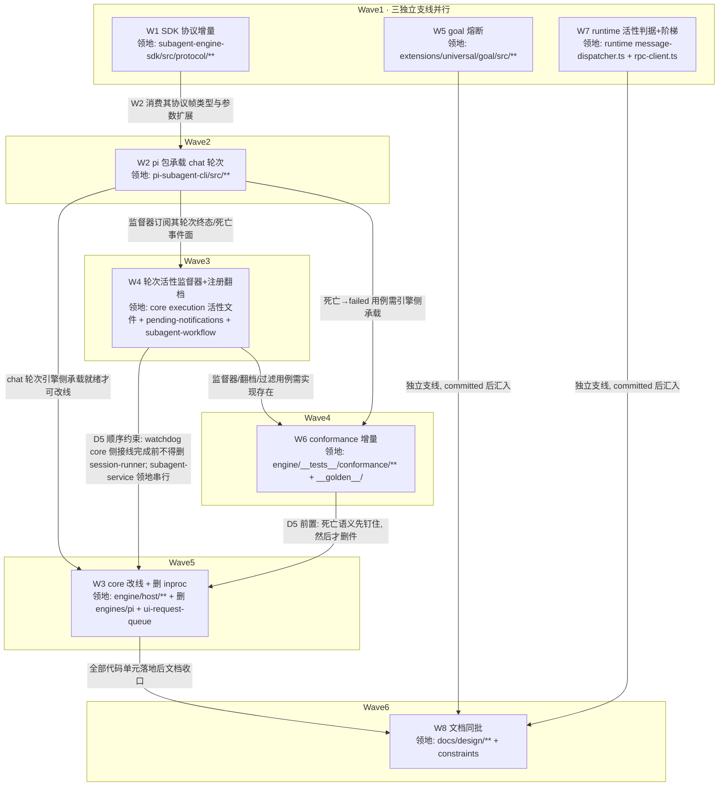

# chat 域协议 v1.x 与轮次活性治理 实施计划

基线: c753c7774 | 来源设计: [chat-domain-v1x-liveness-governance.md](chat-domain-v1x-liveness-governance.md) | 日期: 2026-09-09

## 0 章节映射

| 内容 | 设计文档实际位置 |
|------|--------------|
| 背景/目标 | §1 背景目标（SCQA + G1-G6 + in/out scope） |
| 终态/机制 | §3 解决方案（§3.1 四个终态场景 / §3.2 D1-D5 决策与机制 / §3.3 决策汇总 + 实施期门 + 物理数据流） |
| 验收场景表 | §4 验收（A1-A10 真实场景表 + DoR 前置） |
| 下一层拆分 | §5 下一层拆分（W1-W8 单元表 + 拆分理由） |
| 待验证检查点 | §3.3 实施期门 P1/P2/P3 + §5 末「待验证项（实施期确认，不预编造）」 |

所有 subagent task 的坐标从本表取，禁止自猜编号。

## 1 目标快照

> 逐字摘录自设计 §1，禁止改写。

| # | 目标 | 视角 |
|---|------|------|
| G1 | chat 续聊域迁入引擎进程，`engines/pi` inproc 分支与残余 11 文件删除 | 接入者：pi 引擎单一形态（CLI 包），core 壳侧零内建引擎 |
| G2 | abort 落地语义显式化：「停止成功」由引擎上报的轮次终态事件定义；宿主升级阶梯有终点，不存在停不掉的会话 | 使用者：ESC 按下后一个 turn 内停止；极端情况下 GUI 给出显式「强制关闭」出口 |
| G3 | 异常死亡如实上报：引擎进程/轮次异常终止 → failed + 原因，禁止用最后一条文本冒充结果 | 使用者：主 agent 收到的子代理结局可信，「等待」或「重派」基于事实 |
| G4 | 无进展有界且等待有主：goal continuation 有熔断（空转轮数与连发总次数双维度封顶）；后台任务死亡后有监督器负责把决策指引送达人 | 使用者：不再出现 64 分钟空转烧 token；卡住的等待会升级为人可见的告警 |
| G5 | 宿主误判有防：abort 超时强杀前做多信号活性判据（ADR-0047「静默 ≠ 卡死」反向通道版），判据窗口值有实测依据 | 使用者：正常运行中的会话不被运维机制误杀 |
| G6 | 现有能力零回归：run 域协议行为、record/journal 数据、GUI 展示完全不变 | 使用者：迁移无感 |

**in scope**（设计 §1 原文七项）：①协议 v1.x 增量；②`pi-subagent-cli` 承载 chat 轮次；③core 删 inproc 分支与 `engines/pi` 残余；④keep-alive 编排归属重裁决 + H9 三测试承接回写；⑤goal 扩展熔断 + 守卫注册语义修正；⑥runtime abort 活性判据 + 阶梯；⑦conformance 增量。

**out of scope**（设计 §1 原文）：pi 上游任何修改；通知账本投递超时升级；给 agent 增加 `wait` 合法出口工具；zcode 引擎（仅 conformance 回归覆盖）；协议网络/远程形态。

## 2 单元列表

| Unit | 职责 | 领地（精确文件路径） | 依赖 | 隔离 | 验收条款 |
|------|------|--------------------|------|------|---------|
| W1 SDK 协议增量 | 反向通道轮次生命周期载荷帧（关联键 = recordId，续聊轮无 runId 的映射按 D1-A 裁定）+ `interact`/`run` 会话形态参数扩展（resume 锚点对照 `EngineHandleData` 现有形态；priority 不进协议）+ `conversation` gate 位路由 chat 核对 + 版本兼容语义（major 不 bump；负向 = 新 core 对无 gate 位引擎同步拒，A6 方向） | `packages/subagent-engine-sdk/src/protocol/**`；`packages/subagent-engine-sdk/src/__tests__/**`（新增用例）；`packages/subagent-engine-sdk/package.json`（仅当需 bump/exports 变更） | — | plain | ① `pnpm --filter @zhushanwen/subagent-engine-sdk typecheck && pnpm --filter @zhushanwen/subagent-engine-sdk test` 全绿；② 轮次生命周期载荷类型可从 protocol 入口 import（typecheck 证明）；③ 负向单测：manifest 无 `conversation` gate 位 → chat 请求同步拒且错误码含恢复指引文案契约；④ SDK 保持零依赖 core（package.json 无新增 `@zhushanwen/subagent-core` 依赖） |
| W2 pi 包承载 chat 轮次 | run 会话形态 / interact 承载 chat 轮次（首轮/续聊/冷续 resume/关断）；HostChatRoundTicket 五字段过协议的载荷映射（record→run/interact 参数、opts/signal→参数与 cancel/close、stream→host/streamDelta）；轮次终态事件上报（D3 引擎侧）；settled-watchdog 引擎侧事件面（refresh 源 = 协议事件，W3 重接的引擎半边） | `packages/pi-subagent-cli/src/**`（含 `__tests__/`、`__golden__/`）；`packages/pi-subagent-cli/package.json` | W1 | plain | ① `pnpm --filter @zhushanwen/pi-subagent-cli typecheck && pnpm --filter @zhushanwen/pi-subagent-cli test` 全绿；② chat 轮次四路径（首轮/续聊/冷续 resume/关断）包内测试用例存在且绿；③ 轮次终态事件帧按 W1 载荷类型发出（类型对齐 typecheck 证明）；④ goal 扩展加载形态核对结论落 task 证据（预期无新增打包面，SSOT `packages/shared/src/mandatory-extensions.json`） |
| W3 core 改线 + 删 inproc | chat 路由切协议客户端（`pi-host-binding` deep import `engines/pi/pi-engine.ts:19-20` 改协议驱动）；`HostBridge.cancel` 同步布尔 → 终态事件等待（对齐 run 域 CANCEL_SETTLE_GRACE_MS 分级，D3 协议层）；`ui-request-queue` 消亡裁决落地（`host/askUser` 通道承接，消费点 `ui-request-handler-factory` 改线）；**删 `engines/pi` 整目录**（11 生产 + 3 测试，旧 143 误分类器随之消亡）；`listActivePendingFromSessionFile` 后代补杀口径随删件消亡（止损语义由 W4 监督器该放弃承接） | `packages/subagent-core/src/execution/engine/host/**`（host-bridge.ts / pi-host-binding.ts / host-ui-endpoint.ts / spawned-children.ts + `host/__tests__/**`）；删除 `packages/subagent-core/src/execution/engine/engines/pi/**`；删除 `packages/subagent-core/src/execution/ui-request-queue.ts`；`packages/subagent-core/src/execution/ui-request-handler-factory.ts`；`packages/subagent-core/src/execution/engine/client/reverse-router.ts`（recordId delta 消费接线，见 §5 偏差 #1）；`packages/subagent-core/src/execution/engine/__tests__/`（仅既有引用被删符号的测试文件改写） | W2、W4、W6 | plain | ① `ls packages/subagent-core/src/execution/engine/engines/pi` 报不存在；② `grep -rn "engines/pi" packages/subagent-core/src --include="*.ts"` 零命中；③ `pnpm --filter @zhushanwen/subagent-core typecheck && pnpm --filter @zhushanwen/subagent-core test` 全绿；④ 删件前 W4/W6 已 committed（D5 顺序约束） |
| W4 轮次活性监督器 + 注册语义翻档 | D2 域分类 + record 去向裁决表 + 三态判定（record 级状态源 + 纳管模型=死亡事件纳管重建不解管 + 通知对账两级启发式）+ 注册对账 sweep（appendEntry 权威 + 尽力 emit，判据 = 终态集 ∪ 已归档/不存在）+ cold-resurrect 重认领谓词补非 conversation；settled-watchdog core 侧接线半边（arm/refresh/kill 重接协议事件流）；注销发射点按枚举收敛（5 处）；**翻档三连带**：读侧过滤三口（countActiveFromEntries / subagent-workflow 后代判定 / pending-notifications registry rebuild+工具读侧，按 sessionId 过滤）+ `PENDING_LIFECYCLE` subagent/workflow 翻 process 档 + idle-gc 扩展（startedAt 锚 + 只归档不补注销 + WorkflowRun store 纳入）**同批原子生效**；session 档死代码注释处置 | 新建 `packages/subagent-core/src/execution/round-supervisor/**`（+ 对应 `__tests__/`）；`packages/subagent-core/src/execution/subagent-service.ts`（watchdog arm 点重接 + 注销发射点 :761 收敛）；`packages/subagent-core/src/execution/settled-watchdog.ts`；`packages/subagent-core/src/execution/finalize-record.ts`（发射点枚举收敛）；`packages/subagent-core/src/execution/idle-gc.ts`；`packages/subagent-core/src/execution/session-pending.ts`；`packages/subagent-core/src/execution/cold-resurrect.ts`；`packages/subagent-core/src/execution/record-store.ts`（sweep 终态判据读侧）；`packages/subagent-core/src/execution/__tests__/**`（仅上述文件对应测试）；`extensions/universal/pending-notifications/src/**`；`extensions/universal/subagent-workflow/src/host/pi-host.ts` | W2（事件面） | plain | ① `pnpm --filter @zhushanwen/subagent-core typecheck && test` 全绿；② `pnpm --filter @zhushanwen/pi-pending-notifications test && pnpm --filter @zhushanwen/pi-subagent-workflow test` 全绿 + `pnpm extensions:typecheck && pnpm extensions:lint` 过；③ 监督器三态（该等/该唤醒/该放弃）、boot 分区（in-flight 直断 vs already-resumable-idle 重认领）、通知对账（高置信撤销/低置信豁免声明）、sweep 差集补发、翻档后无 TTL 清理、过滤三口各有单测；④ 翻档 + idle-gc 扩展 + 对账 sweep 在同一 commit（同批原子，不可拆分先行） |
| W5 goal 熔断 | 双维度熔断：主判据 continuation 连发总次数封顶（默认 50，可配置，与工具调用正交不可绕过）+ 辅判据无进展退避（连续 5 轮无工具调用且 tokenDelta 低 → 间隔 ×2；恢复清零退避不重置总数）；封顶必停发 + notify 用户 + goal 保持 active；defer 通知去重（pending 集合不变不重发） | `extensions/universal/goal/src/**`（`adapters/event-handlers/agent-end.ts`、`constants.ts`、`ports.ts`、`service.ts` 按需 + `__tests__/`） | —（独立可先行） | plain | ① `pnpm --filter @zhushanwen/pi-goal typecheck && pnpm --filter @zhushanwen/pi-goal test` 全绿；② 单测四断言：50 次封顶必停发（含「每轮调一次工具」序列同样封顶）、第 5 轮起间隔翻倍、恢复条件清零退避但不重置总数、defer 通知集合不变不增长；③ 停发通知与恢复通道（`/goal resume`）有测试或证据 |
| W6 conformance 增量 | 引擎中途 SIGTERM → run 终态 failed + 原因含信号用例（D5 前置钉语义）；chat 轮次 golden/live 用例；监督器三态用例；跨重启/对账/fork 过滤用例（含 bash 跨 session 可见性断言——读侧过滤使子 session goal 不再为父 session bash 任务 defer，钉成显式选择）；熔断用例；H9 三测试回写处置表（含 settled-watchdog 生产接线归属行） | `packages/subagent-core/src/execution/engine/__tests__/conformance/**`（新增用例 + `H9-test-disposition.md` 回写 + `fake-engine-capabilities.ts` 扩展如需）；`packages/pi-subagent-cli/src/__golden__/**`（chat golden 如录）；`packages/subagent-core/package.json`（仅当需新 script） | W2、W4 | plain | ① conformance 套件全绿（`pnpm --filter @zhushanwen/subagent-core test` 含 conformance）；② SIGTERM→failed 用例存在且断言原因含信号信息；③ H9-test-disposition.md 三行（keep-alive-no-progress / settled-watchdog / timeout-integration）回写承接落点，settled-watchdog 行含生产接线归属；④ bash 跨 session 可见性断言用例存在 |
| W7 runtime 活性判据 + 阶梯 | abort RPC 超时路径（`message-dispatcher.ts:411`）改造：三信号判据（FAST_TIMEOUT_MS 快超时探测复用 get_state × bridge 事件窗 × abort-pending）+ 三级阶梯（①探测有响应→有界重试 2 次+上报迟滞，耗尽→②；②探测无响应+事件窗有产出→GUI 用户显式强制关闭→确认后 force-kill+record failed；③探测无响应+事件窗静默超窗→真冻结直达强杀）；P3 探针（三类会话事件间隔分布实测定窗）；P1 探针（ESC 落地计测，失败→停工上报不实施） | `packages/runtime/src/services/session/message-dispatcher.ts`；`packages/runtime/src/infra/pi/rpc-client.ts`（快超时探测方法）；`packages/runtime/src/services/session/__tests__/**`（新增/改写） | —（独立可先行；窗值默认保守，P3 实测后定稿） | plain | ① `pnpm --filter @xyz-agent/runtime typecheck && pnpm --filter @xyz-agent/runtime test` 全绿；② 三信号判据与三级阶梯单测覆盖，含「每级有终点」断言（无无界重试分支）；③ 阶梯 3（直杀）在窗值未实测前以保守大窗默认 + 常量可配置，P3 探针步骤与结果落 task 证据；④ P1 探针先行：失败（ESC 仍 >1 turn 落地）→ 停止阶梯实施、上报探针证据等设计变更 |
| W8 文档同批 | 协议化设计 :121 裁决注记状态更新（豁免已收）；协议化 impl-plan §5 chat 域例外行闭环；约束登记回写（协议版本 / C-proc 系列，跑 render-constraints）；H9 处置终态核对；`XYZ_AGENT_ENGINE_ROOTS` 自装旧引擎发现优先级与 chat 错误路径说明 | `docs/design/subagent-engine-protocolization.md`；`docs/design/subagent-engine-protocolization.impl-plan.md`；`docs/design/chat-domain-v1x-liveness-governance.md`（变更历史）；`docs/design/chat-domain-v1x-liveness-governance.impl-plan.md`（本文件状态表/偏差收口）；`docs/constraints.json`；`docs/constraints.md`（生成物） | W1-W7 全部 | plain | ① `node scripts/check-doc-symbol-drift.mjs` 通过；② `node scripts/render-constraints.mjs` 后 json→md 一致（无未提交 diff 残留）；③ 协议化设计 :121 注记改为「豁免已收口」且无悬空引用 |

领地互斥说明：W3/W4/W6 同在 `packages/subagent-core/src/`，按文件级拆分——W3 = `engine/host/**` + `engines/pi/**`（删）+ `execution/ui-request-queue.ts` + `ui-request-handler-factory.ts` + `engine/__tests__/`（改写件）；W4 = `execution/` 顶层活性文件 + 新建 `round-supervisor/` + `execution/__tests__/`（对应件）+ 两个 extension 包；W6 = `engine/__tests__/conformance/**` + `__golden__/`。三单元领地交集为空，由 W4→W6→W3 串行链保证删除时序（D5：接线重接完成 + 语义先钉，然后才删件）。`subagent-service.ts` 归 W4（watchdog arm 点 + 注销发射点两项主改面在此），W3 的 chat 改线不触碰该文件（改线面 = `pi-host-binding.ts` 内部实现，Port 接口对 `subagent-service` 稳定）。

## 3 DAG 图

关键路径（串行主干）：W1 → W2 → W4 → W6 → W3 → W8。W5/W7 全程独立，与主干并行；执行流式调度——单元 committed 即解锁后继补派，无整层 barrier。

## 4 测试策略

框架约束（TEST-STRATEGY.md）：vitest（禁 `node:test` / `tsx --test`，从子包目录运行）；timer 测试用 fake timers；测试写删目标必须 `mkdtempSync` 自建自删，禁触真实数据目录（runtime vitest 有 fs-guard setupFiles，勿绕过）。

增量（开发循环内按单元领地执行）：

| 单元 | 命令 |
|------|------|
| W1 | `pnpm --filter @zhushanwen/subagent-engine-sdk typecheck && pnpm --filter @zhushanwen/subagent-engine-sdk test` |
| W2 | `pnpm --filter @zhushanwen/pi-subagent-cli typecheck && pnpm --filter @zhushanwen/pi-subagent-cli test` |
| W3 / W6 | `pnpm --filter @zhushanwen/subagent-core typecheck && pnpm --filter @zhushanwen/subagent-core test`（core 大包，循环内允许先跑受影响测试文件，**committed 前必全量**） |
| W4 | 同 W3 + `pnpm --filter @zhushanwen/pi-pending-notifications test && pnpm --filter @zhushanwen/pi-subagent-workflow test` |
| W5 | `pnpm --filter @zhushanwen/pi-goal typecheck && pnpm --filter @zhushanwen/pi-goal test` |
| W7 | `pnpm --filter @xyz-agent/runtime typecheck && pnpm --filter @xyz-agent/runtime test` |
| extensions 收口 | `pnpm extensions:typecheck && pnpm extensions:lint && pnpm extensions:test` |

全量（收尾 Gate A）：root 全量测试 + `bash scripts/validate-runtime-bundle.sh`（Gate 0 含 pnpm store 布局检查）。

live conformance（W6 交付 + Gate B）：`ENGINE_CONFORMANCE_LIVE=1 PI_LIVE_MODEL=<模型>` 全量 + 不变量 3a（真机模型与窗口由 Gate B 执行时定）。

真机验收（Gate B 剧本）：设计 §4 A1-A10；杀进程/挂起/重启操作的脚本化手段在 A2/A4/A5/A8 执行前确认（测试辅助钩子或调试命令），不以「手工难操作」降级为 mock。

## 5 合理偏差登记表

初始为空。执行期偏差（领地外文件、设计条款调整、验收降级）逐条登记，注明原因与回写动作。

| # | 单元 | 偏差 | 原因 | 处置/回写 |
|---|------|------|------|----------|
| 1 | W1 | `packages/subagent-engine-sdk` 领地外补一行守卫：`packages/subagent-core/src/execution/engine/client/reverse-router.ts` host/streamDelta case 加 recordId 分支（接线前 break 不可达，仅收窄 v1.x 联合类型） | W1 的 `HostStreamDeltaParams` 改 `{runId}\|{recordId}` 互斥联合，core 消费侧 `runRoutes.get(p.runId)` 触发 TS2345；goal 共享 tsconfig 连带编译 core 链，不修则 W5 的 typecheck 验收门也红 | 守卫随 W1 commit；**W3 领地同步补 `client/reverse-router.ts`**（recordId delta 真实消费接线归 W3 chat 改线，接线时替换 no-op 分支） |

## 6 状态表

| Unit | 状态(pending/in-progress/committed/blocked) | 轮次 | 证据指针 |
|------|-------------------------------------------|------|---------|
| W1 | committed | 1 | SDK typecheck+test 112 例绿（新增 18）；boundary 守卫 3 包 OK；第 9 反向通道 `host/roundLifecycle`（settled/idle/failed 三相位，关联键 runId\|recordId）+ `RunParams.chat{recordId,resume}` + conversation gate 负向；P2 结论 = failed 相位承载，无需 crashed 相位 |
| W2 | pending | 0 | — |
| W3 | pending | 0 | — |
| W4 | pending | 0 | — |
| W5 | committed | 1 | goal typecheck+test 393 例绿（新增 23：circuit-breaker 6 + liveness 17）；双维度熔断（PI_GOAL_CONTINUATION_CAP=50 正交封顶 + 无进展退避 ×2 至 10min 封顶）+ defer 去重 + /goal resume；计数随 goal state 快照持久化（防重启绕过） |
| W6 | pending | 0 | — |
| W7 | in-progress | 1 | task 派发 2026-09-09（u-dev 后台，含 P1 探针） |
| W8 | pending | 0 | — |

## 7 残留风险与变更历史

### 7.1 残留风险（初始登记，来自设计待验证项与实施期门）

1. **P1 探针（ESC 落地，实施首日）**：当前源码 ESC 守卫（`agent-end.ts:56`）在 goal 循环中是否一个 turn 内落地——事故取证针对已安装 dist，源码完备性未实测。归 W7 task 首步执行；探针失败 → abort 迟滞根因升级为设计变更（回设计 §3.2 D3 重做方案对比），W7 阶梯实施停工。
2. **P2 探针（engine_crashed chat 面成立）**：chat 轮进行中杀引擎 → record failed + stderr 尾——由 W6 conformance 用例承载。
3. **P3 探针（abort 观察窗三类会话实测）**：窗值未实测前，D3 阶梯 3（真冻结直达强杀）不得启用裸事件新鲜度判据——W7 以保守大窗默认 + 常量可配置落地，P3 数据后定稿。
4. 反向载荷帧边界（轮次终态/record 回写/resume 锚点最小字段集）——W1 设计时定，对照 `pi-engine` ChatRoundTicket 现有字段。
5. 熔断参数（50 / N=5）实机校准——重审条件见设计 D4 误伤量化（合法任务被截停反馈 ≥2 例）。
6. goal 扩展在引擎进程内加载形态是否引入新打包面——W2 实施时核（预期无新增）。
7. idle-gc 扩展锚窗值（startedAt 距今阈值）与 WorkflowRun store 判定字段——W4 实施时对照现存 store 形态定。

### 7.2 用户评审裁决登记

dev-flow plan.md 要求「用户评审 [MANDATORY]（切分粒度 / worktree 标记 / 验收条款三件事确认）」。本计划在夜间托管会话产出：用户 2026-09-09 指令「[$dev-flow] 开始开发，完成后走 [$design-code-sync]」构成对全管线的端到端授权，且全局 AGENTS.md 规则 22（确认后进入执行态不再中途停问）。裁决：**按计划直接开工**，三件事自评如下，交付汇报中展示 DAG 与单元表供事后审阅；用户复核若有异议，偏差走 §5 登记表回改。
- 切分粒度：8 单元对齐设计 §5 W1-W8，仅做领地精确化（W4 领地跨 pending-notifications/subagent-workflow 两 extension 包——设计逻辑单元「注册语义修正」的代码落点即在此；`subagent-service.ts` 归 W4 消除与 W3 共改）。
- worktree 标记：全部 plain——无热点公共文件 ≥1 被并行单元触碰（core 内三单元靠文件级领地互斥 + 串行链保证），无实验性大改整体废弃风险（设计已经 5 轮对抗审查收敛）。
- 验收条款：每单元条款独立可判（命令可跑/grep 可比/用例存在性可查），Gate B 剧本 = 设计 §4 A1-A10 原文。

### 7.3 变更历史

- 2026-09-09：初始基线（基线 commit c753c7774 = 设计文档 v5 终版）。
