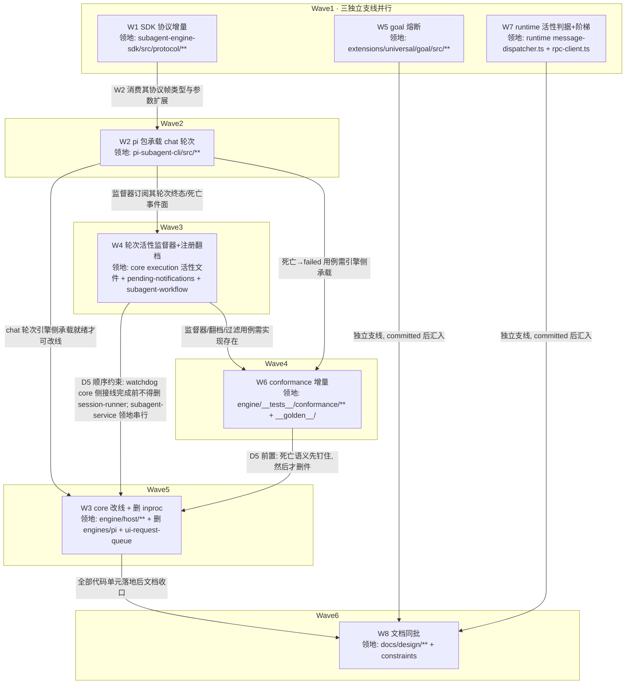

# chat 域协议 v1.x 与轮次活性治理 实施计划

基线: c753c7774 | 来源设计: [chat-domain-v1x-liveness-governance.md](chat-domain-v1x-liveness-governance.md) | 日期: 2026-09-09

## 0 章节映射

| 内容 | 设计文档实际位置 |
|------|--------------|
| 背景/目标 | §1 背景目标（SCQA + G1-G6 + in/out scope） |
| 终态/机制 | §3 解决方案（§3.1 四个终态场景 / §3.2 D1-D5 决策与机制 / §3.3 决策汇总 + 实施期门 + 物理数据流） |
| 验收场景表 | §4 验收（A1-A10 真实场景表 + DoR 前置） |
| 下一层拆分 | §5 下一层拆分（W1-W8 单元表 + 拆分理由） |
| 待验证检查点 | §3.3 实施期门 P1/P2/P3 + §5 末「待验证项（实施期确认，不预编造）」 |

所有 subagent task 的坐标从本表取，禁止自猜编号。

## 1 目标快照

> 逐字摘录自设计 §1，禁止改写。

| # | 目标 | 视角 |
|---|------|------|
| G1 | chat 续聊域迁入引擎进程，`engines/pi` inproc 分支与残余 11 文件删除 | 接入者：pi 引擎单一形态（CLI 包），core 壳侧零内建引擎 |
| G2 | abort 落地语义显式化：「停止成功」由引擎上报的轮次终态事件定义；宿主升级阶梯有终点，不存在停不掉的会话 | 使用者：ESC 按下后一个 turn 内停止；极端情况下 GUI 给出显式「强制关闭」出口 |
| G3 | 异常死亡如实上报：引擎进程/轮次异常终止 → failed + 原因，禁止用最后一条文本冒充结果 | 使用者：主 agent 收到的子代理结局可信，「等待」或「重派」基于事实 |
| G4 | 无进展有界且等待有主：goal continuation 有熔断（空转轮数与连发总次数双维度封顶）；后台任务死亡后有监督器负责把决策指引送达人 | 使用者：不再出现 64 分钟空转烧 token；卡住的等待会升级为人可见的告警 |
| G5 | 宿主误判有防：abort 超时强杀前做多信号活性判据（ADR-0047「静默 ≠ 卡死」反向通道版），判据窗口值有实测依据 | 使用者：正常运行中的会话不被运维机制误杀 |
| G6 | 现有能力零回归：run 域协议行为、record/journal 数据、GUI 展示完全不变 | 使用者：迁移无感 |

**in scope**（设计 §1 原文七项）：①协议 v1.x 增量；②`pi-subagent-cli` 承载 chat 轮次；③core 删 inproc 分支与 `engines/pi` 残余；④keep-alive 编排归属重裁决 + H9 三测试承接回写；⑤goal 扩展熔断 + 守卫注册语义修正；⑥runtime abort 活性判据 + 阶梯；⑦conformance 增量。

**out of scope**（设计 §1 原文）：pi 上游任何修改；通知账本投递超时升级；给 agent 增加 `wait` 合法出口工具；zcode 引擎（仅 conformance 回归覆盖）；协议网络/远程形态。

## 2 单元列表

| Unit | 职责 | 领地（精确文件路径） | 依赖 | 隔离 | 验收条款 |
|------|------|--------------------|------|------|---------|
| W1 SDK 协议增量 | 反向通道轮次生命周期载荷帧（关联键 = recordId，续聊轮无 runId 的映射按 D1-A 裁定）+ `interact`/`run` 会话形态参数扩展（resume 锚点对照 `EngineHandleData` 现有形态；priority 不进协议）+ `conversation` gate 位路由 chat 核对 + 版本兼容语义（major 不 bump；负向 = 新 core 对无 gate 位引擎同步拒，A6 方向） | `packages/subagent-engine-sdk/src/protocol/**`；`packages/subagent-engine-sdk/src/__tests__/**`（新增用例）；`packages/subagent-engine-sdk/package.json`（仅当需 bump/exports 变更） | — | plain | ① `pnpm --filter @zhushanwen/subagent-engine-sdk typecheck && pnpm --filter @zhushanwen/subagent-engine-sdk test` 全绿；② 轮次生命周期载荷类型可从 protocol 入口 import（typecheck 证明）；③ 负向单测：manifest 无 `conversation` gate 位 → chat 请求同步拒且错误码含恢复指引文案契约；④ SDK 保持零依赖 core（package.json 无新增 `@zhushanwen/subagent-core` 依赖） |
| W2 pi 包承载 chat 轮次 | run 会话形态 / interact 承载 chat 轮次（首轮/续聊/冷续 resume/关断）；HostChatRoundTicket 五字段过协议的载荷映射（record→run/interact 参数、opts/signal→参数与 cancel/close、stream→host/streamDelta）；轮次终态事件上报（D3 引擎侧）；settled-watchdog 引擎侧事件面（refresh 源 = 协议事件，W3 重接的引擎半边） | `packages/pi-subagent-cli/src/**`（含 `__tests__/`、`__golden__/`）；`packages/pi-subagent-cli/package.json` | W1 | plain | ① `pnpm --filter @zhushanwen/pi-subagent-cli typecheck && pnpm --filter @zhushanwen/pi-subagent-cli test` 全绿；② chat 轮次四路径（首轮/续聊/冷续 resume/关断）包内测试用例存在且绿；③ 轮次终态事件帧按 W1 载荷类型发出（类型对齐 typecheck 证明）；④ goal 扩展加载形态核对结论落 task 证据（预期无新增打包面，SSOT `packages/shared/src/mandatory-extensions.json`） |
| W3 core 改线 + 删 inproc | chat 路由切协议客户端（`pi-host-binding` deep import `engines/pi/pi-engine.ts:19-20` 改协议驱动）；`HostBridge.cancel` 同步布尔 → 终态事件等待（对齐 run 域 CANCEL_SETTLE_GRACE_MS 分级，D3 协议层）；`ui-request-queue` 消亡裁决落地（`host/askUser` 通道承接，消费点 `ui-request-handler-factory` 改线）；**删 `engines/pi` 整目录**（11 生产 + 3 测试，旧 143 误分类器随之消亡）；`listActivePendingFromSessionFile` 后代补杀口径随删件消亡（止损语义由 W4 监督器该放弃承接） | `packages/subagent-core/src/execution/engine/host/**`（host-bridge.ts / pi-host-binding.ts / host-ui-endpoint.ts / spawned-children.ts + `host/__tests__/**`）；删除 `packages/subagent-core/src/execution/engine/engines/pi/**`；删除 `packages/subagent-core/src/execution/ui-request-queue.ts`；`packages/subagent-core/src/execution/ui-request-handler-factory.ts`；`packages/subagent-core/src/execution/engine/client/reverse-router.ts`（recordId delta 消费接线，见 §5 偏差 #1）；`packages/subagent-core/src/execution/engine/__tests__/`（仅既有引用被删符号的测试文件改写） | W2、W4、W6 | plain | ① `ls packages/subagent-core/src/execution/engine/engines/pi` 报不存在；② `grep -rn "engines/pi" packages/subagent-core/src --include="*.ts"` 零代码命中（`engines/pi` 字样仅允许存在于史实注释，如 lifecycle-manager.ts 删除史记录）；③ `pnpm --filter @zhushanwen/subagent-core typecheck && pnpm --filter @zhushanwen/subagent-core test` 全绿；④ 删件前 W4/W6 已 committed（D5 顺序约束） |
| W4 轮次活性监督器 + 注册语义翻档 | D2 域分类 + record 去向裁决表 + 三态判定（record 级状态源 + 纳管模型=死亡事件纳管重建不解管 + 通知对账两级启发式）+ 注册对账 sweep（appendEntry 权威 + 尽力 emit，判据 = 终态集 ∪ 已归档/不存在）+ cold-resurrect 重认领谓词补非 conversation；settled-watchdog core 侧接线半边（arm/refresh/kill 重接协议事件流）；注销发射点按枚举收敛（5 处）；**翻档三连带**：读侧过滤三口（countActiveFromEntries / subagent-workflow 后代判定 / pending-notifications registry rebuild+工具读侧，按 sessionId 过滤）+ 分档常量 subagent/workflow 翻 process 档（该常量已随 ext-simplify-12 删除）+ idle-gc 扩展（startedAt 锚 + 只归档不补注销 + WorkflowRun store 纳入）**同批原子生效**；session 档死代码注释处置（该处置已被 ext-simplify-12 D2 推翻为整体删除） | 新建 `packages/subagent-core/src/execution/round-supervisor/**`（+ 对应 `__tests__/`）；`packages/subagent-core/src/execution/subagent-service.ts`（watchdog arm 点重接 + 注销发射点 :761 收敛）；`packages/subagent-core/src/execution/settled-watchdog.ts`；`packages/subagent-core/src/execution/finalize-record.ts`（发射点枚举收敛）；`packages/subagent-core/src/execution/idle-gc.ts`；`packages/subagent-core/src/execution/session-pending.ts`；`packages/subagent-core/src/execution/cold-resurrect.ts`；`packages/subagent-core/src/execution/record-store.ts`（sweep 终态判据读侧）；`packages/subagent-core/src/execution/__tests__/**`（仅上述文件对应测试）；`extensions/universal/pending-notifications/src/**`；`extensions/universal/subagent-workflow/src/host/pi-host.ts` | W2（事件面） | plain | ① `pnpm --filter @zhushanwen/subagent-core typecheck && test` 全绿；② `pnpm --filter @zhushanwen/pi-pending-notifications test && pnpm --filter @zhushanwen/pi-subagent-workflow test` 全绿 + `pnpm extensions:typecheck && pnpm extensions:lint` 过；③ 监督器三态（该等/该唤醒/该放弃）、boot 分区（in-flight 直断 vs already-resumable-idle 重认领）、通知对账（高置信撤销/低置信豁免声明）、sweep 差集补发、翻档后无 TTL 清理、过滤三口各有单测；④ 翻档 + idle-gc 扩展 + 对账 sweep 在同一 commit（同批原子，不可拆分先行） |
| W5 goal 熔断 | 双维度熔断：主判据 continuation 连发总次数封顶（默认 50，可配置，与工具调用正交不可绕过）+ 辅判据无进展退避（连续 5 轮无工具调用且 tokenDelta 低 → 间隔 ×2；恢复清零退避不重置总数）；封顶必停发 + notify 用户 + goal 保持 active；defer 通知去重（pending 集合不变不重发） | `extensions/universal/goal/src/**`（`adapters/event-handlers/agent-end.ts`、`constants.ts`、`ports.ts`、`service.ts` 按需 + `__tests__/`） | —（独立可先行） | plain | ① `pnpm --filter @zhushanwen/pi-goal typecheck && pnpm --filter @zhushanwen/pi-goal test` 全绿；② 单测四断言：50 次封顶必停发（含「每轮调一次工具」序列同样封顶）、第 5 轮起间隔翻倍、恢复条件清零退避但不重置总数、defer 通知集合不变不增长；③ 停发通知与恢复通道（`/goal resume`）有测试或证据 |
| W6 conformance 增量 | 引擎中途 SIGTERM → run 终态 failed + 原因含信号用例（D5 前置钉语义）；chat 轮次 golden/live 用例；监督器三态用例；跨重启/对账/fork 过滤用例（含 bash 跨 session 可见性断言——读侧过滤使子 session goal 不再为父 session bash 任务 defer，钉成显式选择）；熔断用例；H9 三测试回写处置表（含 settled-watchdog 生产接线归属行） | `packages/subagent-core/src/execution/engine/__tests__/conformance/**`（新增用例 + `H9-test-disposition.md` 回写 + `fake-engine-capabilities.ts` 扩展如需）；`packages/pi-subagent-cli/src/__golden__/**`（chat golden 如录）；`packages/subagent-core/package.json`（仅当需新 script） | W2、W4 | plain | ① conformance 套件全绿（`pnpm --filter @zhushanwen/subagent-core test` 含 conformance）；② SIGTERM→failed 用例存在且断言原因含信号信息；③ H9-test-disposition.md 三行（keep-alive-no-progress / settled-watchdog / timeout-integration）回写承接落点，settled-watchdog 行含生产接线归属；④ bash 跨 session 可见性断言用例存在 |
| W7 runtime 活性判据 + 阶梯 | abort RPC 超时路径（`message-dispatcher.ts:411`）改造：三信号判据（FAST_TIMEOUT_MS 快超时探测复用 get_state × bridge 事件窗 × abort-pending）+ 三级阶梯（①探测有响应→有界重试 2 次+上报迟滞，耗尽→②；②探测无响应+事件窗有产出→GUI 用户显式强制关闭→确认后 force-kill+record failed；③探测无响应+事件窗静默超窗→真冻结直达强杀）；P3 探针（三类会话事件间隔分布实测定窗）；P1 探针（ESC 落地计测，失败→停工上报不实施） | `packages/runtime/src/services/session/message-dispatcher.ts`；`packages/runtime/src/infra/pi/rpc-client.ts`（快超时探测方法）；`packages/runtime/src/services/session/__tests__/**`（新增/改写） | —（独立可先行；窗值默认保守，P3 实测后定稿） | plain | ① `pnpm --filter @xyz-agent/runtime typecheck && pnpm --filter @xyz-agent/runtime test` 全绿；② 三信号判据与三级阶梯单测覆盖，含「每级有终点」断言（无无界重试分支）；③ 阶梯 3（直杀）在窗值未实测前以保守大窗默认 + 常量可配置，P3 探针步骤与结果落 task 证据；④ P1 探针先行：失败（ESC 仍 >1 turn 落地）→ 停止阶梯实施、上报探针证据等设计变更 |
| W8 文档同批 | 协议化设计 :121 裁决注记状态更新（豁免已收）；协议化 impl-plan §5 chat 域例外行闭环；约束登记回写（协议版本 / C-proc 系列，跑 render-constraints）；H9 处置终态核对；`XYZ_AGENT_ENGINE_ROOTS` 自装旧引擎发现优先级与 chat 错误路径说明 | `docs/design/subagent-engine-protocolization.md`；`docs/design/subagent-engine-protocolization.impl-plan.md`；`docs/design/chat-domain-v1x-liveness-governance.md`（变更历史）；`docs/design/chat-domain-v1x-liveness-governance.impl-plan.md`（本文件状态表/偏差收口）；`docs/constraints.json`；`docs/constraints.md`（生成物） | W1-W7 全部 | plain | ① `node scripts/check-doc-symbol-drift.mjs` 通过；② `node scripts/render-constraints.mjs` 后 json→md 一致（无未提交 diff 残留）；③ 协议化设计 :121 注记改为「豁免已收口」且无悬空引用 |

领地互斥说明：W3/W4/W6 同在 `packages/subagent-core/src/`，按文件级拆分——W3 = `engine/host/**` + `engines/pi/**`（删）+ `execution/ui-request-queue.ts` + `ui-request-handler-factory.ts` + `engine/__tests__/`（改写件）；W4 = `execution/` 顶层活性文件 + 新建 `round-supervisor/` + `execution/__tests__/`（对应件）+ 两个 extension 包；W6 = `engine/__tests__/conformance/**` + `__golden__/`。三单元领地交集为空，由 W4→W6→W3 串行链保证删除时序（D5：接线重接完成 + 语义先钉，然后才删件）。`subagent-service.ts` 归 W4（watchdog arm 点 + 注销发射点两项主改面在此），W3 的 chat 改线不触碰该文件（改线面 = `pi-host-binding.ts` 内部实现，Port 接口对 `subagent-service` 稳定）。

## 3 DAG 图

关键路径（串行主干）：W1 → W2 → W4 → W6 → W3 → W8。W5/W7 全程独立，与主干并行；执行流式调度——单元 committed 即解锁后继补派，无整层 barrier。

## 4 测试策略

框架约束（TEST-STRATEGY.md）：vitest（禁 `node:test` / `tsx --test`，从子包目录运行）；timer 测试用 fake timers；测试写删目标必须 `mkdtempSync` 自建自删，禁触真实数据目录（runtime vitest 有 fs-guard setupFiles，勿绕过）。

增量（开发循环内按单元领地执行）：

| 单元 | 命令 |
|------|------|
| W1 | `pnpm --filter @zhushanwen/subagent-engine-sdk typecheck && pnpm --filter @zhushanwen/subagent-engine-sdk test` |
| W2 | `pnpm --filter @zhushanwen/pi-subagent-cli typecheck && pnpm --filter @zhushanwen/pi-subagent-cli test` |
| W3 / W6 | `pnpm --filter @zhushanwen/subagent-core typecheck && pnpm --filter @zhushanwen/subagent-core test`（core 大包，循环内允许先跑受影响测试文件，**committed 前必全量**） |
| W4 | 同 W3 + `pnpm --filter @zhushanwen/pi-pending-notifications test && pnpm --filter @zhushanwen/pi-subagent-workflow test` |
| W5 | `pnpm --filter @zhushanwen/pi-goal typecheck && pnpm --filter @zhushanwen/pi-goal test` |
| W7 | `pnpm --filter @xyz-agent/runtime typecheck && pnpm --filter @xyz-agent/runtime test` |
| extensions 收口 | `pnpm extensions:typecheck && pnpm extensions:lint && pnpm extensions:test` |

全量（收尾 Gate A）：root 全量测试 + `bash scripts/validate-runtime-bundle.sh`（Gate 0 含 pnpm store 布局检查）。

live conformance（W6 交付 + Gate B）：`ENGINE_CONFORMANCE_LIVE=1 PI_LIVE_MODEL=<模型>` 全量 + 不变量 3a（真机模型与窗口由 Gate B 执行时定）。

真机验收（Gate B 剧本）：设计 §4 A1-A10；杀进程/挂起/重启操作的脚本化手段在 A2/A4/A5/A8 执行前确认（测试辅助钩子或调试命令），不以「手工难操作」降级为 mock。

## 5 合理偏差登记表

初始为空。执行期偏差（领地外文件、设计条款调整、验收降级）逐条登记，注明原因与回写动作。

| # | 单元 | 偏差 | 原因 | 处置/回写 |
|---|------|------|------|----------|
| 1 | W1 | `packages/subagent-engine-sdk` 领地外补一行守卫：`packages/subagent-core/src/execution/engine/client/reverse-router.ts` host/streamDelta case 加 recordId 分支（接线前 break 不可达，仅收窄 v1.x 联合类型） | W1 的 `HostStreamDeltaParams` 改 `{runId}\|{recordId}` 互斥联合，core 消费侧 `runRoutes.get(p.runId)` 触发 TS2345；goal 共享 tsconfig 连带编译 core 链，不修则 W5 的 typecheck 验收门也红 | 守卫随 W1 commit；**W3 领地同步补 `client/reverse-router.ts`**（recordId delta 真实消费接线归 W3 chat 改线，接线时替换 no-op 分支） |
| 2 | W7 | 领地外两处测试改写（`packages/runtime/src/__tests__/message-dispatcher-force-quit.test.ts`、`packages/runtime/test/message-dispatcher-silent-abort-destroy.test.ts`）+ `eslint.config.mjs` max-lines override（message-dispatcher.ts 561 行） | 旧测试断言锁定「abort 超时即杀」旧行为，阶梯化后必然同步（mock 显式化真冻结判据 + reason 对齐）；dispatcher 净行数越 500 触 lint 硬门，按仓内惯例（rpc-client.ts 同列表先例）登记 [HISTORICAL] override，拆分归属已注释 | 随 W7 commit；impl-plan W7 领地行视为含「既有 abort 行为测试的同步改写」隐式面 |
| 3 | W4 | `eslint.config.mjs` subagent-service.ts 既有 max-lines 块 1500→1550 | W4 监督器接线（死亡分诊+在途记账+boot 分区/sweep 挂点）+30 行；装配面已抽 round-supervisor/service-binding.ts 减负，剩余为编排聚合点固有体量；既有块更新带变更历史注释，非新豁免 | 随 W4 commit |
| 4 | W4 | 遗留交接：读侧过滤①的 `currentSessionId` 为可选参数，goal 守卫消费点（agent-end.ts 两处）未传基准——fork 残留在 goal 守卫口径未完全收口 | goal 已 committed 且设计红线「goal 扩展零改动」；sweep + rebuild 过滤已覆盖其余面，该口向后兼容缺省不过滤 | **已收口**：W6 探针实测结论 (b) 有虚增（父任务仍活跃窗口无机制覆盖）；裁决 = 补两行传参（设计 D4 读侧过滤①的落地要求 + A9② 验收口径，不属「机制搬进 goal」红线范畴）——commit `d0b9a6faf`，goal 393 例复绿 |
| 5 | R1 修复（一致性审查批 1b） | 读侧过滤②（后代判定口）生产装配缺基准：`createPiNotifyDomainPorts` 已支持 `currentSessionId` 但唯一生产装配点不传参，core 端口契约 `countActiveFromEntries` 无基准参数——`pi-host.ts` 注释声称的防御实际不生效（与偏差 #4 同构、未被 #4 覆盖：#4 是 goal 消费口，本条是 core 后代判定口） | factory 一次定型表达不了 per-call 基准（扩展启动装配时 session id 逐 session 变化） | **已收口**：core 端口契约加可选第二参 `opts?: { currentSessionId }`（对齐 pending-notifications 实装签名）；`session-pending.ts` 读侧以「被读文件所属 session id」（pi session 文件首行 SessionHeader.id，实装锚定 session-manager.js newSession/`_persist` 首行落盘）为基准传入；pi-host 删 factory 参数改 per-call 透传（生产装配从未传参，factory 定型 = 假差异）。测试：后代判定差集跨 session 残留过滤 4 用例（session-pending.test.ts [F1] describe）+ pi-host 适配 2 文件改写 |
| 6 | R1 修复（一致性审查批 1b） | sweep 判据与设计 D2 字面（「终态集 ∪ 已归档/不存在（含畸形）」）不符：`type !== "subagent"` 一律跳过——workflow/畸形条目无收口通道（`state.ts` 注释承诺失效）；bash 类型设计上即无 record/store 可查，收口通道不可达 | workflow runId 不在 RecordStore，W4 原实现按「查不到 ≠ 终态」保守跳过（宁挂账不失明）——保守方向正确但通道缺失未登记 | **已收口（两层）**：①workflow/畸形（normalizePendingType 归 workflow 偏好）放开收口——sweep deps 加 `lookupWorkflowRunState`，生产装配查 `FileRunStore.findStateByIdSync`（新增同步只读判定：终态 ∪ state 文件不存在 → 补注销；running ∪ 全行损坏 → 保守跳过，宁挂账不误注销活跃 run）；②bash 显式偏差登记（无补发通道属真实边界：注册随进程退出注销，死亡窗口丢失无补发；挂账代价 = 每孤儿 bash 注册 1 条静态虚报，无空转驱动源，goal 读侧过滤 + 熔断限损）——`state.ts`/`index.ts` 矛盾注释同步改为如实口径。测试：reconcile-sweep.test.ts 用例改写（workflow 终态补注销 / running 跳过 / 畸形闭合 / bash 显式跳过 / 未注入判据向后兼容）。**批 2 补记**：该装配随后证实读错 store 根（活跃 run 被误注销），修复与测试见 #12 |
| 7 | R1 修复（一致性审查批 1b） | W4 commit 声称修正：`supervisor.ts` bootPartition 头注与 `GiveUpKind "boot-abort"` 描述的「boot 直断」路径不存在（全链无调用点，死代码 + 误导头注）；真实直断落点 = record-store 孤儿恢复，但其投影违反设计表 3 行 2（in-flight 重启中断投 completed，违反 G3「异常死亡不得谎报完成」） | W4 实施时直断已在孤儿恢复层完成（防双收尾），监督器侧描述未同步回写；孤儿恢复直断未按表 3 行 2 写 failed 语义（error 缺失 → deriveOutcome("gc", undefined) = completed） | **已收口**：①孤儿恢复直断对 in-flight（非 chatMode 非 resumable）record 写重启中断 error 载体（`deriveOutcome` 投影 failed，文案「task aborted by host restart」；SP-5 完成态 resumable+result 保持 completed 不回归）；②删除 `GiveUpKind "boot-abort"` 死分支（supervisor.ts / service-binding.ts）+ bootPartition 头注改如实描述两段分工（孤儿恢复直断 → 监督器只重认领）；③测试：in-flight 重启投影 failed（含 300KB 长行/截断组合）、SP-5 保持 completed、resumable 无产出重认领保留不回归（record-store.test.ts + record-store-last-line.test.ts 改写 + 新增）。A5 断言「GUI/主 agent 明确报任务因重启中断」的 record 证据位落位（通知面归监督器/既有通知链不变） |
| 8 | W2/W3（审查 1a-S7 登记） | chat 轮 cancel 的「受理」= 直接 SIGTERM（kill-only 能力位），非 inproc abort 的「轮中断进程存活」形态——cancel 后续聊必须走 run chat+resume 冷续 | pi rpc-mode 对 rpc abort 命令与 SIGTERM 的语义差异；启用 rpc abort 会单方面改写 manifest `interrupt: "kill-only"` 位（与 core 只读参照逐位一致是既有不变量），登记为可选演进未启用 | 设计 D3「record 如实标 failed」在 SIGTERM 形态下仍成立（failed 相位 `engine_round_aborted`）；**A3 真机剧本补一条**：ESC 强制关闭后经冷续 resume 继续会话应走通；rpc abort 演进重审触发 = 用户反馈 cancel 后会话上下文丢失体验问题 |
| 9 | W2（审查 1a-S8 登记） | `host/childSpawned` 对 chat 形态改用 recordId 键（committed 版 `recordId: chatRecordId ?? runId`），D1 关联键裁定段原文只覆盖 streamDelta 与 roundLifecycle | record 锚定回写需要（镜像记账按 record 归属）；属设计未声明但合理的实施细节 | 设计文档 D1 五字段映射段补一行声明（v6 变更历史同批）；core 消费侧 spawned-children 镜像按 recordId 记账不受影响 |
| 10 | W6（审查 1a-S10 台账） | 章程项「熔断用例」实际交付 = 由 goal 扩展侧 393 例承载（circuit-breaker 6 + liveness 17），conformance 不重复造 | 避免重复覆盖（conformance 黑盒架构不适合直测 extension 内部状态机） | 处置已写入 `H9-test-disposition.md` W6 节；A10 熔断真机验收归 Gate B 剧本 |
| 11 | W3 | 删件连带三项：①`round-settlement.ts` 的 `createRoundSettler` 因 turn 派生失效成为无生产消费方；②ask_user RPC 提示的 mode 门控注入矩阵随 inproc 组装消亡（W2 引擎侧组装无此注入）；③T2⑧（非 EPIPE 写失败 re-arm idle timer）两测试不可等价改写已删除注明；`asEngineService` 为 SAR 签名兼容临时保留 | inproc 组装面消亡的必然连带；①③语义已由引擎包/协议面承接 | ①round-settlement.ts 已删除（design-code-sync R1：全仓 import 零引用复核后删，subagent-service 悬空指引同批清扫、结算闭包语义自持于 settleChatRoundFromResponse）；②ask_user 门控矩阵消亡登记为行为等价性由 e2e askUser ack 用例承载，如 Gate B A1 实测发现提示缺失再补引擎侧组装；③`asEngineService` 在 SAR 下一轮重构时移除，登记已知兼容垫片 |
| 12 | 批 1b #6 补记（一致性审查批 2 F-1） | #6 的 sweep workflow 判据生产装配**读错 store 根**：`service-binding.ts` 与 idle-gc 装配（`startGcTimer`）用 `new FileRunStore()` 缺省根 `<dataRoot>/workflow-state`（zcode 宿主布局），而 pi 宿主 run state 真实落盘 = JsonlRunStore 的 `<sessionDir>/workflow-state/`（`session-lifecycle.resolveSessionDir` 推导）——两目录生产不相交 → `findStateByIdSync` 恒 ENOENT → `{kind:"missing"}` → sweep 按终态**补注销活跃 run**（误注销事故方向）；WorkflowRun GC 恒空转 | FileRunStore 是 D2 宿主无关实现（dataRoot 锚），装配点误当作 pi 宿主读侧判据；W4 引入，#6 收口时未核对根布局 | **已收口**：新建 `execution/workflow-state-root.ts` 的 `resolvePiWorkflowStateDir()`（resolveSessionDir 同规则在 core 侧重写，agentDir 锚定 pi 0.84.4 dist getAgentDir 语义，两处注释互指）；`FileRunStoreOptions` 加 `stateDir` 覆盖项；sweep 与 idle-gc 两装配点传同源布局。测试：`workflow-state-root.test.ts` mkdtemp 真实布局（解析两分支 / findStateByIdSync 命中 running/terminal/missing / sweep 端到端 running 不补注销 + done 补注销 / idle-gc 同布局终态化写回） |
| 13 | 批 2（一致性审查 F-3） | D3 core 侧收敛语义 = 引擎面承接裁决：删除 `HostBridgeDeps.waitForRoundTerminal` / `escalateKill` 死面（createHostBridge 全仓无生产调用点） | `cancelBackground` 同步 `unregisterChatRoundRoute` 后，HostBridge.cancel 再 race `waitForRoundTerminal` 恒 3s 超时——结构冲突 + 无装配注入 = 死面；生产 cancel 链（`cancelBackground → service.cancel → terminateChatSession → interact cancel`）收敛由引擎面 `chat-session.cancel` 等价承载（waiter 先于 kill 注册 + killChain 有界升级，W2 交付已证），D3 分级语义由引擎侧承接 | **已收口**：host-bridge.ts 两字段 + cancel 等待/升级逻辑删除（cancel 收窄为受理即返回），头注职责同步收窄并锚定本登记；host-bridge.test.ts 用例本就是「不注入 = 受理即返回」形态零改动 |
| 14 | 批 2（一致性审查 F-2） | W3 的「settled-watchdog core 侧接线半边（arm/refresh/kill 重接协议事件流）」当时**只接了热路径续聊轮**：`kickOffChatRound`（首轮 + 冷续 resume 轮）无 arm——:1382 注释声称「首轮调用点在 kickOffChatRound 的 run 派发后」不存在；被删 inproc stdout-pump 是首轮唯一中段守护，引擎侧 spawn-runner 仅 turn 计数无墙钟 → 首轮 wedged 无熔断（LC-1 场景①重新敞开）；H9 台账「已承接」随之失实 | W3 删件与重接不同批的交界漏项（D5 约束「接线未重接完成前 W3 不得删件」的 arm 半边漏核） | **已收口**：`kickOffChatRound` 在 run 派发前（acquire 成功后）补 `armMidRoundNoProgress`（同一 `onHotPathSettledWatchdogTimeout` 处置闭包）；refresh 源核实齐备（runId 键 `ctx.onEvent` 事件行含 text_delta + `ctx.onRoundLifecycle` settled 交棒）。测试：`chat-round-first-round-watchdog.test.ts` 6 用例（首轮 armed / 冷续轮静默熔断 / 事件行刷新 / 交棒不继承中段计时 / F-5 路由注销两路径）；H9 台账追加批 2 修复回写节 |
| 15 | 批 2（一致性审查 F-4/F-5/F-6） | 三项同批小修：①S6 引擎半边——旧轮 idle 相位帧在 settled→idle 间隙投递后仍同键发射，core `handleChatRoundPhase(idle)` 无轮次身份判别 → 拆新轮中段守护 + 误挂 5min idle timer（轮 2 进行中超 5min 误杀）；②chat 轮路由终态化不注销（仅 cancelBackground 注销，finalize 链泄漏路由闭包）+ :399 注释失实；③closed 会话 cancel 升级等待体注册前未复查消亡 → 白等满 33s grace 总窗 | S6 当批只修了引擎侧 armedSeq 守卫的 settled 相位半边（idle 帧未盖）；②为 W3 注册面收敛遗漏；③为 cancel 收敛链的竞态防御缺口 | **已收口**：①`chat-session.ts` emitPhase 对 idle 相位加 `armedSeq !== settledSeq` 判别（与 S5/S6 同模式的引擎侧咽喉点，debug 留痕），S6 既有用例补「旧 idle 帧不发射」断言；②`FinalizeDeps.onFinalized` 钩子单一汇聚点（doFinalizeRecord 末段）+ `disposeAllRecords` 直连路径补注销，`chat-round-first-round-watchdog.test.ts` 两路径用例钉住；③cancel 链升级等待体注册前查 `session.closed` 快速收口，chat-session.test.ts 新增用例（fake timers 同 tick 消亡时序） |
| 16 | W1/W3（R1 补登记） | fork-from 协议载体缺口（G6 回归）：W3 chat 改线把 `ExecuteOptions.forkFromSessionFile` 在协议过桥处落地丢失——core 侧声明与 gate 判据（`TaskShapeForGate`）仍在，但 run/interact 载荷无承载字段，跨协议即断，fork-from 全链不可达 | W3 迁移映射按「chat 轮次四路径（首轮/续聊/冷续 resume/关断）」核对，fork-from 属 run 域形态参数、不在四路径清单内——迁移遗漏事后由端到端回归暴露 | **已收口**：commit `39c79cb6b`——①SDK wire 面 `RunParams.task.forkSource?: string`（v1.x 可选增量，major 不 bump 合规）；②host 侧四文件：`orchestration/models/types.ts`（中立任务形状加 `forkSource`，与 SDK 协议字段/引擎侧 SpawnRunParams 三层同名）、`engine/host-task-spec.ts`（`forkFromSessionFile → forkSource` 唯一改名映射）、`engine/client/remote-engine.ts`（同名透传）、引擎侧 `pi-subagent-cli/src/pi-engine.ts` 消费；③测试：host-task-spec 映射 + chat-protocol 帧 + ended-message-and-fork-from 端到端钉住 |
| 17 | W3（R1 补登记） | W3 删件（engines/pi inproc）的领地外测试连带：`extensions/universal/subagent-workflow` 8 个测试文件借用 core inproc 内部件（inproc-borrowing），删件后 14 例失败 | W3 批未核对 workflow 测试面对 inproc 内部件的借用（W4 验收时 workflow 全绿在先、W3 删件在后——串行链尾部的外包测试面漏核） | **已收口**：commit `8ee33e1d7`——8 文件测试载体改写到协议 fake（不再 import inproc 内部件），14 例失败清零；workflow 906 例绿（R1 复核实测） |

## 6 状态表

| Unit | 状态(pending/in-progress/committed/blocked) | 轮次 | 证据指针 |
|------|-------------------------------------------|------|---------|
| W1 | committed | 1 | SDK typecheck+test 112 例绿（新增 18）；boundary 守卫 3 包 OK；第 9 反向通道 `host/roundLifecycle`（settled/idle/failed 三相位，关联键 runId\|recordId）+ `RunParams.chat{recordId,resume}` + conversation gate 负向；P2 结论 = failed 相位承载，无需 crashed 相位 |
| W2 | committed | 1 | pi 包 typecheck+test 237 例绿（新增 18：chat-session 12 + chat-protocol 5 + e2e 1）；SDK 回归 112 绿零缺口；四路径（run chat/interact/冷续/close）+ roundLifecycle 三相位 + cancel SIGTERM→等相位→killChain；manifest conversation 位已是 native；goal 加载形态核对 = 无新增打包面；W3 接线注意 9 条见交付报告（关键：关联键分路 / interact 轮无 AgentEvent 通道 / askUser 带 spawn 轮 runId / idle 帧=armIdleTimer 锚点） |
| W3 | committed | 1 | commit `0df9ef8b3`（与 review-1b 修复同笔——两股在 remote-engine/session-pending/record-store 测试物理交织，按文件级颗粒度整体提交）；engines/pi 整目录 14 文件 + ui-request-queue + session-pending 死代码删除（grep 注 1 处已知史实注释命中：lifecycle-manager.ts:303 删除史记录，口径见 §2 W3 验收②）；reverse-router recordId 真实分发 + roundLifecycle case（偏差 #1 收口）；HostBridge.cancel 终态等待 + 杀链升级（该等待/升级面后经 §5 #13 删除，收敛归引擎侧 chat-session.cancel）；capability-gate 换 SDK 构造器；core 2804 绿 + pi 240 + SDK 112；连带处置见 §5 #11 |
| W4 | committed | 1 | commit `bcf3f0ff9`（一次原子：翻档+兜底+对账同批）；core typecheck 干净 + 2844 例绿（新增 35）+ pending 49 绿 + workflow 915 绿 + extensions typecheck/lint 0；round-supervisor 6 文件（判据不读引擎镜像=结构性保证重建不解管）；**顺带修正真 bug**：孤儿恢复 merge 丢 resumable 字段（重启误判 closed/gc）；发射点盘点 6 处→枚举 5 语义；watchdog 默认 2h（env `XYZ_SUBAGENT_ROUND_SUPERVISOR_WATCHDOG_MS` 可覆盖）；WorkflowRun 锚 = startedAt；cold-resurrect.ts 未改（重认领落点 = bootPartition 谓词，与设计意图同源） |
| W5 | committed | 1 | goal typecheck+test 393 例绿（新增 23：circuit-breaker 6 + liveness 17）；双维度熔断（PI_GOAL_CONTINUATION_CAP=50 正交封顶 + 无进展退避 ×2 至 10min 封顶）+ defer 去重 + /goal resume；计数随 goal state 快照持久化（防重启绕过） |
| W6 | committed | 1 | core typecheck 干净 + 2866 例绿（新增 22，conformance 57 绿零回归）；**SIGTERM→failed 前置闸绿 = W3 可开删**；偏差 #4 探针结论 (b) 有虚增 → **已收口**（`d0b9a6faf` goal 两处消费口传 currentSessionId + mock 补齐，393 例复绿）；bash 跨 session 可见性双向钉死；H9 三行回写含 settled-watchdog 生产接线归属（W4 三入口）；chat golden 未录（协议断言由 conformance 黑盒承载，真机语料归 A7 live 门） |
| W7 | committed | 1 | runtime typecheck 干净 + test 5121 例全绿（新增 12 + 改写 6）；三级阶梯 + 三信号判据（ABORT_STALL_RETRY_LIMIT=2 / FROZEN_EVENT_SILENCE_MS_DEFAULT=600s 带 P3 登记与 env 逃生门）；**P1 探针真机 PASS**（本地 pi CLI + goal 源码，abort 4ms 落地、后续 0 轮、3 次复跑全过——ESC 守卫在当前源码成立，D3 按防御纵深定位实施） |
| W8 | committed | 1 | commit `620c8be45`（W8a：约束登记 C-proc-13——协议 v1.x chat 语义 + 轮次活性权威源，constraints.json/md 生成物同笔）+ `84c47e57b`（W8b：协议化设计 :121 注记「豁免已收」收口 + 协议化 impl-plan W11 例外行闭环 + 审查 1a S7-S10 台账登记 + 本表偏差 #8-#11 + troubleshooting §12）；W8 交付物「`XYZ_AGENT_ENGINE_ROOTS` 自装旧引擎发现优先级与 chat 错误路径说明」补齐 = docs/troubleshooting.md §13（design-code-sync R1） |

## 7 残留风险与变更历史

### 7.1 残留风险（初始登记，来自设计待验证项与实施期门）

1. **P1 探针（ESC 落地，实施首日）**：当前源码 ESC 守卫（`agent-end.ts:56`）在 goal 循环中是否一个 turn 内落地——事故取证针对已安装 dist，源码完备性未实测。归 W7 task 首步执行；探针失败 → abort 迟滞根因升级为设计变更（回设计 §3.2 D3 重做方案对比），W7 阶梯实施停工。
2. **P2 探针（engine_crashed chat 面成立）**：chat 轮进行中杀引擎 → record failed + stderr 尾——由 W6 conformance 用例承载。
3. **P3 探针（abort 观察窗三类会话实测）**：窗值未实测前，D3 阶梯 3（真冻结直达强杀）不得启用裸事件新鲜度判据——W7 以保守大窗默认 + 常量可配置落地，P3 数据后定稿。
4. 反向载荷帧边界（轮次终态/record 回写/resume 锚点最小字段集）——W1 设计时定，对照 `pi-engine` ChatRoundTicket 现有字段。
5. 熔断参数（50 / N=5）实机校准——重审条件见设计 D4 误伤量化（合法任务被截停反馈 ≥2 例）。
6. goal 扩展在引擎进程内加载形态是否引入新打包面——W2 实施时核（预期无新增）。
7. idle-gc 扩展锚窗值（startedAt 距今阈值）与 WorkflowRun store 判定字段——W4 实施时对照现存 store 形态定。

### 7.2 用户评审裁决登记

dev-flow plan.md 要求「用户评审 [MANDATORY]（切分粒度 / worktree 标记 / 验收条款三件事确认）」。本计划在夜间托管会话产出：用户 2026-09-09 指令「[$dev-flow] 开始开发，完成后走 [$design-code-sync]」构成对全管线的端到端授权，且全局 AGENTS.md 规则 22（确认后进入执行态不再中途停问）。裁决：**按计划直接开工**，三件事自评如下，交付汇报中展示 DAG 与单元表供事后审阅；用户复核若有异议，偏差走 §5 登记表回改。
- 切分粒度：8 单元对齐设计 §5 W1-W8，仅做领地精确化（W4 领地跨 pending-notifications/subagent-workflow 两 extension 包——设计逻辑单元「注册语义修正」的代码落点即在此；`subagent-service.ts` 归 W4 消除与 W3 共改）。
- worktree 标记：全部 plain——无热点公共文件 ≥1 被并行单元触碰（core 内三单元靠文件级领地互斥 + 串行链保证），无实验性大改整体废弃风险（设计已经 5 轮对抗审查收敛）。
- 验收条款：每单元条款独立可判（命令可跑/grep 可比/用例存在性可查），Gate B 剧本 = 设计 §4 A1-A10 原文。

### 7.3 变更历史

- 2026-09-09：初始基线（基线 commit c753c7774 = 设计文档 v5 终版）。
- 2026-09-09：一致性审查批 2 修复轮（W3 面复核 + 批 1b 修复复核，2 must-fix + 2 major + 3 minor）——F-1 sweep/idle-gc 装配读错 WorkflowRun store 根（#12，活跃 run 误注销事故方向）、F-2 首轮/冷续轮 settled-watchdog arm 缺失（#14，H9「已承接」失实回写）、F-3 HostBridge.cancel 终态等待死面删除（#13）、F-4 间隙 idle 帧抑制 + F-5 路由终态化注销 + F-6 closed cancel 快速收口（#15）、F-7 disposeEngines 注释如实化（core index.ts / d8-compat / lifecycle-manager；workflow 包 reapSpawnedChildrenOnShutdown no-op 现状在 core 侧注释登记，workflow 生产码未动）。双包 typecheck + 全量测试绿。
- 2026-09-09：W8 文档收口两笔——W8a `620c8be45`（约束登记 C-proc-13：协议 v1.x chat 语义 + 轮次活性权威源，render-constraints 生成物同笔）；W8b `84c47e57b`（协议化设计 :121 注记「豁免已收」收口 + 协议化 impl-plan W11 例外行闭环 + 审查 1a S7-S10 台账登记 + 本表偏差 #8-#11 + troubleshooting §12「cancel 后 exit code 143 形态」）。
- 2026-09-09：`8ee33e1d7` workflow inproc-borrowing 测试改写（W3 follow-up）——subagent-workflow 8 个借用 core inproc 内部件的测试文件改写到协议 fake（W3 删件的领地外测试连带，W3 批漏同步），14 例失败清零、workflow 906 例绿；偏差登记见 §5 #17。
- 2026-09-09：`39c79cb6b` fork-from 协议载体端到端修复（G6 回归事后修正）——W3 迁移把 `ExecuteOptions.forkFromSessionFile` 在协议过桥处落地丢失 → 补 `RunParams.task.forkSource` 全链（SDK wire → orchestration/models/types.ts → host-task-spec.ts 改名映射 → remote-engine.ts 透传 → pi-engine.ts 消费）；偏差登记见 §5 #16。
