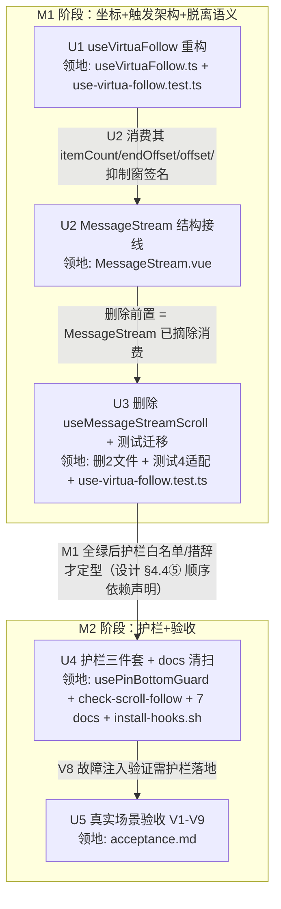

# chat-pin-bottom-fix 实施计划

基线: (见 git log `docs(impl-plan): baseline for chat-pin-bottom-fix`) | 来源设计: [docs/design/chat-pin-bottom-fix.md](./chat-pin-bottom-fix.md)（v7，主审 r6 0 must-fix + 影响面 r6 0 must-fix/0 suggestion 双审收敛） | 日期: 2026-09-08

## 0 章节映射

| 内容 | 本文实际位置 |
|------|--------------|
| 背景/目标 | §1 背景（SCQA + 被设计的系统）+ §2 设计目标（G1/G2/G3 + In/Out-of-scope） |
| 终态/机制 | §4 解决方案：§4.1 终态（T1-T5 成功路径 + 失败路径表）；§4.3 D1-D7 关键决策（D1 索引直取 / D2 offset+tailHeight / D3 RO 兜底网+触发矩阵 / D4 三层护栏 / D5 删除 useMessageStreamScroll / D6 vlistBottom 同款修正 / D7 复合判据+收敛抑制窗）；§4.4 护栏三件套（①-⑧）；§4.5 探针清单（4✅ + 3⛔ M1 门） |
| 验收场景表 | §5.2 验收场景 V1-V9（含真实流程/通过标准列）；§5.1 判据定义 gap ≤ 2px（dpr=1）/ ≤4px（dpr=2） |
| 下一层拆分 | §6.1 阶段与拆分（M1: U1-U3 / M2: U4-U5）+ §6.2 文件改动地图 + §6.3 待验证检查点 |
| 待验证检查点 | §4.5 探针（P-wrap/P-timing/P-no-loop ⛔）+ §6.3（happy-dom RO 支持度 / isPrepend 复位时机） |

审查证据：`chat-pin-bottom-fix.review-r6.md`（0 must-fix，1 suggestion 已在 v7 落实——正文 D7② 含 token 节奏条件限定）+ `chat-pin-bottom-fix.impact-review-r6.md`（0 must-fix / 0 suggestion，双审收敛终止，"可进入实施（§6 单元拆分）"）。

## 1 目标快照（逐字摘录）

> **G1** 贴底状态下，任何时刻窗口都真正位于内容底部：发送消息、流式输出、流结束定格、压缩完成、活动条显隐、pending 气泡出现、窗口 resize 之后，最新消息（含尾部块）完整可见，无需手动滚。度量：真实场景下 `scrollEl.scrollHeight - scrollTop - clientHeight ≤ 2px`（dpr=1；dpr=2 的 retina 环境按 ≤4px 判）
>
> **G2** 用户用**任何**输入方式上滑（滚轮 / 滚动条拖拽 / 键盘 PageUp·Home）脱离锚定后，任何自动跟随不得把视口扯回；有新内容时浮出「回到底部」按钮。度量：INVAR-M4-2′ 保持；§5 场景 V5 反向验证（含滚动条拖拽路径）
>
> **G3** 「滚动后又发生高度/内容变化」这一类回归，未来在 dev 环境即时报警 + 单测/pre-commit 拦截，不再依赖用户报障。度量：§4.4 三层护栏全部落地并登记

**In-scope**：MessageStream 滚动跟随链路（useVirtuaFollow / MessageStream.vue 模板结构与接线）、同款误用的同模式清扫（`vlistBottom`）、脱离锚定信号扩展、防复发护栏（dev 断言 + 单测 + 约束登记）。

**Out-of-scope**：virtua 库本身（0.50.0，不改依赖源码、不升级）；TurnRail 跳转逻辑本身（仅其滚动副作用经 D7 获得更合理的脱离语义）；mobile-renderer（App.vue:15 使用 MessageStreamStub，不复用该链路）；fork notice 既有 absolute 定位残留链的整体删除（仅修坐标误用 + 登记待清理，彻底删除属另一项重构）。

## 2 单元列表

| Unit | 职责 | 领地（精确文件路径） | 依赖 | 隔离(plain/worktree) | 验收条款 |
|------|------|----------------------|------|----------------------|----------|
| U1 | useVirtuaFollow 重构：新增 `itemCount`/`endOffset` 入参；末项索引直取（D1）；follow 原语 `offset` = tailHeight（D2 原语面）；「静默跟随（不标 unread）」变体；onScroll 复合判据 + lastOffset 快照（NaN 重置）+ force 后收敛抑制窗（D7）；删 findItemIndex 派生；头部注释改述 INVAR-M4-2′ | `packages/renderer/src/composables/panel/useVirtuaFollow.ts` `packages/renderer/src/__tests__/effects/use-virtua-follow.test.ts`（新增 U1 行为用例，既有用例保持绿） | 无（DAG 根） | plain | ① `pnpm --filter renderer test -- use-virtua-follow` 绿；② 新用例齐备：R3 回归（startMargin=44 + 末项 24px → 断言 scrollToIndex 收到 `length-1`）、复合判据四回声（程序性写入回声 offset 递增+distance>40 不脱离 / clamp 回声 递减+distance≤0 不脱离 / 拖拽 递减+distance>40 脱离且 RO 触发不滚屏 / force 后首个 scroll 只建快照不判定）、收敛抑制窗（窗内负补偿回声不脱离 / wheel 恒即时脱离 / RO 静默 120ms 关窗 / 1500ms 硬上限）；③ `pnpm --filter renderer typecheck` 绿 |
| U2 | MessageStream 结构与接线：模板加 `contentWrapEl` 静态 wrapper（含禁止定位样式注释；空态欢迎语与 load-more 浮层留 wrapper 外）+ `tailEl` 收编三尾部块（D3）；`<Virtualizer :scroll-ref="scrollEl">`（P-wrap 门）；挂 RO（contentWrapEl + scrollEl，tailEl 快照区分两类变化；isPrepend 抑制窗）；messages.length + 末条文本长度 watch 迁入（保留 isStreaming 守卫）；`vlistBottom` 索引直取修正（D6）；删 useMessageStreamScroll 调用、force 入口内联（3 处）；头部注释同步 INVAR-M4-2′（grep「单向翻真」定位） | `packages/renderer/src/components/panel/MessageStream.vue` | U1（消费其新签名） | plain | ① 模板/接线六项全落地（对照 D3 触发矩阵）；② dev app（`pnpm dev` + Playwright 连 9222）跑 P-wrap（V1/V2 场景行为等价）、P-timing（streaming 中 gap 帧序列单调收敛不振荡）、P-no-loop（1s 内 follow ≤60 次无 warn）三探针；③ 任一探针败 → 触发 §4.5 降级路径（方案 C 完整形态）并升级用户决策 |
| U3 | 删除 useMessageStreamScroll + 测试迁移 + 挂载级适配：删 composable 与其测试；guard 语义用例（stickToBottom guard）并入 use-virtua-follow 测试；适配直接挂载 MessageStream 的既有测试（RO stub + mock Virtualizer handle 字段集随 U1 签名调整） | 删除：`packages/renderer/src/composables/panel/useMessageStreamScroll.ts`、`packages/renderer/src/__tests__/effects/use-message-stream-scroll.test.ts` 改写：`packages/renderer/src/__tests__/effects/use-virtua-follow.test.ts`（迁移用例） 适配：`packages/renderer/src/components/panel/message-stream/__tests__/MessageStream.wire.test.ts`、`packages/renderer/src/__tests__/components/MessageStream-kind.test.ts`、`packages/renderer/src/__tests__/components/MessageStream-bash.test.ts`、`packages/renderer/src/__tests__/components/MessageStream-subagent-force-working.test.ts` | U2（删除前置 = 消费已摘除） | plain | ① `pnpm --filter renderer test` 全绿（无 skip）；② `pnpm --filter renderer typecheck && pnpm --filter renderer typecheck:test` 绿；③ grep 全仓无 `useMessageStreamScroll` 残留引用 |
| U4 | 护栏三件套 + docs 同步清扫：`usePinBottomGuard` dev 断言（前置收敛窗口 500ms + 双采样 200ms 间隔 + dpr 阈值 max(2, 2×dpr) + 流式判读指引）；`scripts/check-scroll-follow.mjs` pre-commit 守卫（扫描收窄 + 白名单 + 禁用模式 grep 排除测试）；constraints.json 登记 C-state-11 + 重生成 md；docs/testing/03-chat-flow.md 教训登记；C-proc-10 清扫 4 处 docs 悬空引用 | 新增：`packages/renderer/src/composables/panel/usePinBottomGuard.ts`、`scripts/check-scroll-follow.mjs` 改：`docs/constraints.json` + `docs/constraints.md`（render-constraints 重生成）、`docs/testing/03-chat-flow.md`、`docs/design/composer-multi-skill-injection.md`、`docs/design/composer-multi-skill-injection.impact-review.md`、`docs/architecture/conversation-stream-block-rendering.md`、`packages/ui/src/features/chat/index.ts`、`.githooks/install-hooks.sh`（pre-commit 挂接） | U3（依赖 M1 最终形态：白名单与不变量措辞） | plain | ① `node scripts/check-scroll-follow.mjs` 退出码 0；② `node scripts/check-doc-symbol-drift.mjs` 退出码 0；③ `node scripts/render-constraints.mjs` 重生成后 md diff 仅含 C-state-11；④ V8 故障注入（follow 原语临时 -24px）dev 断言 warn + 移除后全绿；⑤ `pnpm --filter renderer test` 仍全绿 |
| U5 | 真实场景验收执行：§5.2 V1-V9 全跑（dev app + Playwright，gap 采样 + dpr 记录），采样记录归档验收文档 | `docs/design/chat-pin-bottom-fix.acceptance.md`（新增，验收证据归档） | U4（V8 需护栏已落地） | plain | ① V1-V9 逐场景通过标准达成并逐行签收（gap 判据 dpr 记录在案）；② 验收文档 committed；③ 前置数据齐备（长会话 startMargin=44 生效 + subagent 会话） |

> 领地交集说明：`use-virtua-follow.test.ts` 同时出现在 U1（新增用例）与 U3（迁移用例）——两单元间有 U1→U2→U3 串行链，无并发写窗口，属 dag-authoring「同文件共改 → 串行边」合法情形。

## 3 DAG 图

## 4 测试策略

测试命令实读自 `packages/renderer/package.json` 与根 `package.json`：

| 用途 | 命令 |
|------|------|
| 增量单测（单元内单文件） | `cd packages/renderer && npx vitest run src/__tests__/effects/use-virtua-follow.test.ts`（包名 @xyz-agent/frontend；[偏差登记 #1] `pnpm --filter <pkg> test -- <path>` 的 `--` 会致路径被忽略跑全量，vitest 必须经 `npx vitest run <path>` 直传；junit reporter 落盘 test-results/） |
| 增量单测（挂载级） | `pnpm --filter renderer test -- <对应 test 路径>` |
| 类型检查 | `pnpm --filter @xyz-agent/frontend typecheck && pnpm --filter @xyz-agent/frontend typecheck:test` |
| 全量收尾（阶段 5 前 + U3/U4 各一次） | `pnpm --filter @xyz-agent/frontend test` 全绿 + `pnpm run lint`（根，含 taste-lint） |
| docs 守卫 | `node scripts/check-doc-symbol-drift.mjs`（U4 后必须 0） |
| 新增守卫 | `node scripts/check-scroll-follow.mjs`（U4 落地后 0；M1 期间尚不存在） |
| constraints | `node scripts/render-constraints.mjs`（U4，重生成后核对 diff） |
| dev app 探针/验收 | 本 worktree `pnpm dev` → browser-automation 连 `http://localhost:9222`（确认 URL `localhost:1420` 防多实例坑）；gap = `scrollEl.scrollHeight - scrollEl.scrollTop - scrollEl.clientHeight` 页面上下文 JS 读取 |

测试纪律（TEST-STRATEGY）：vitest（禁 node:test）；timer 测试用 fake timers；happy-dom 无 RO 时测试 setup 注入可控 stub（§6.3 检查点，U3 定稿）；三视角缺一不可（U1/U3 新用例每条至少一个用户可见行为断言——scrollToIndex/scrollTop/unread 状态）。

## 5 合理偏差登记表

| # | 偏差 | 来源 | 处置 |
|---|------|------|------|
| 1 | 测试命令：包实名 @xyz-agent/frontend；`pnpm --filter pkg test -- <path>` 的 `--` 致 vitest 忽略路径跑全量 | U1 执行期实跑发现（4070 用例全量 54.7s） | 已修正计划 §4 测试命令表；后续单元用 `cd packages/renderer && npx vitest run <path>` |
| 2 | U1 过渡缺省设计：itemCount 未注入时 = Number.MAX_SAFE_INTEGER（virtua scrollToIndex 首行 clamp 到 [0, len-1]，实装已核），endOffset 缺省 0——MessageStream 消费面 U1 内不改仍可编译可跑（挂载级测试实证全绿） | r2 实现决策（领地限制下保持 U2 前兼容） | 合理：设计 D1 语义在 U2 接线后完整成立；U3 验收全量绿时一并复核 |

## 6 状态表

| Unit | 状态(pending/in-progress/committed/blocked) | 轮次 | 证据指针 |
|------|---------------------------------------------|------|----------|
| U1 | in-progress | 3 | r1/r2 进程中断；r2 实现已落盘（typecheck 绿、旧断言 3 红）；r3 接替收尾测试 |
| U2 | pending | 0 | — |
| U3 | pending | 0 | — |
| U4 | pending | 0 | — |
| U5 | pending | 0 | — |

## 7 残留风险与变更历史

### 残留风险（承接设计已登记项，实施期盯防）

- P-wrap ⛔（U2 门）：失败 → 方案 C 完整形态降级（§4.5），R1 收尾子集失去 RO 触发，护栏⑦ dev 断言兑底——**降级决策必须升级用户**。
- §6.3-1：happy-dom RO 支持度未知 → U3 注入 stub 定稿。
- §6.3-2：isPrepend 复位与 RO 回调先后 → U2 实测一次 load-more，误标则抑制窗放宽一帧（V9 兜底）。
- 设计 D7 残余风险 ⑤a-⑤d 与抑制窗副作用⑥（已四要素登记可接受）——V5/V9 实测观察。

### 变更历史

- 2026-09-08 v1：初版计划（预检门三查过：结构四节齐全 / 章节映射建立 / 审查证据 chat-pin-bottom-fix.review-r6.md 0 must-fix + impact-review-r6.md 0/0 双审收敛）。单元切分直接采用设计 §6.1（U1-U5），领地自 §6.2 文件改动地图精确化，补充：MessageStream-bash.test.ts（设计「等」字的实际展开）、.githooks/install-hooks.sh（pre-commit 挂接的项目机制载体）、acceptance.md（U5 验收归档产物）。
