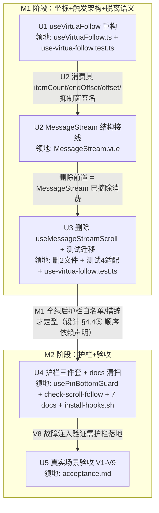

# chat-pin-bottom-fix 实施计划

基线: (见 git log `docs(impl-plan): baseline for chat-pin-bottom-fix`) | 来源设计: [docs/design/chat-pin-bottom-fix.md](./chat-pin-bottom-fix.md)（v7，主审 r6 0 must-fix + 影响面 r6 0 must-fix/0 suggestion 双审收敛） | 日期: 2026-09-08

## 0 章节映射

| 内容 | 本文实际位置 |
|------|--------------|
| 背景/目标 | §1 背景（SCQA + 被设计的系统）+ §2 设计目标（G1/G2/G3 + In/Out-of-scope） |
| 终态/机制 | §4 解决方案：§4.1 终态（T1-T5 成功路径 + 失败路径表）；§4.3 D1-D7 关键决策（D1 索引直取 / D2 offset+tailHeight / D3 RO 兜底网+触发矩阵 / D4 三层护栏 / D5 删除 useMessageStreamScroll / D6 vlistBottom 同款修正 / D7 复合判据+收敛抑制窗）；§4.4 护栏三件套（①-⑧）；§4.5 探针清单（4✅ + 3⛔ M1 门） |
| 验收场景表 | §5.2 验收场景 V1-V9（含真实流程/通过标准列）；§5.1 判据定义 gap ≤ 2px（dpr=1）/ ≤4px（dpr=2） |
| 下一层拆分 | §6.1 阶段与拆分（M1: U1-U3 / M2: U4-U5）+ §6.2 文件改动地图 + §6.3 待验证检查点 |
| 待验证检查点 | §4.5 探针（P-wrap/P-timing/P-no-loop ⛔）+ §6.3（happy-dom RO 支持度 / isPrepend 复位时机） |

审查证据：`chat-pin-bottom-fix.review-r6.md`（0 must-fix，1 suggestion 已在 v7 落实——正文 D7② 含 token 节奏条件限定）+ `chat-pin-bottom-fix.impact-review-r6.md`（0 must-fix / 0 suggestion，双审收敛终止，"可进入实施（§6 单元拆分）"）。

## 1 目标快照（逐字摘录）

> **G1** 贴底状态下，任何时刻窗口都真正位于内容底部：发送消息、流式输出、流结束定格、压缩完成、活动条显隐、pending 气泡出现、窗口 resize 之后，最新消息（含尾部块）完整可见，无需手动滚。度量：真实场景下 `scrollEl.scrollHeight - scrollTop - clientHeight ≤ 2px`（dpr=1；dpr=2 的 retina 环境按 ≤4px 判）
>
> **G2** 用户用**任何**输入方式上滑（滚轮 / 滚动条拖拽 / 键盘 PageUp·Home）脱离锚定后，任何自动跟随不得把视口扯回；有新内容时浮出「回到底部」按钮。度量：INVAR-M4-2′ 保持；§5 场景 V5 反向验证（含滚动条拖拽路径）
>
> **G3** 「滚动后又发生高度/内容变化」这一类回归，未来在 dev 环境即时报警 + 单测/pre-commit 拦截，不再依赖用户报障。度量：§4.4 三层护栏全部落地并登记

**In-scope**：MessageStream 滚动跟随链路（useVirtuaFollow / MessageStream.vue 模板结构与接线）、同款误用的同模式清扫（`vlistBottom`）、脱离锚定信号扩展、防复发护栏（dev 断言 + 单测 + 约束登记）。

**Out-of-scope**：virtua 库本身（0.50.0，不改依赖源码、不升级）；TurnRail 跳转逻辑本身（仅其滚动副作用经 D7 获得更合理的脱离语义）；mobile-renderer（App.vue:15 使用 MessageStreamStub，不复用该链路）；fork notice 既有 absolute 定位残留链的整体删除（仅修坐标误用 + 登记待清理，彻底删除属另一项重构）。

## 2 单元列表

| Unit | 职责 | 领地（精确文件路径） | 依赖 | 隔离(plain/worktree) | 验收条款 |
|------|------|----------------------|------|----------------------|----------|
| U1 | useVirtuaFollow 重构：新增 `itemCount`/`endOffset` 入参；末项索引直取（D1）；follow 原语 `offset` = tailHeight（D2 原语面）；「静默跟随（不标 unread）」变体；onScroll 复合判据 + lastOffset 快照（NaN 重置）+ force 后收敛抑制窗（D7）；删 findItemIndex 派生；头部注释改述 INVAR-M4-2′ | `packages/renderer/src/composables/panel/useVirtuaFollow.ts` `packages/renderer/src/__tests__/effects/use-virtua-follow.test.ts`（新增 U1 行为用例，既有用例保持绿） | 无（DAG 根） | plain | ① `pnpm --filter renderer test -- use-virtua-follow` 绿；② 新用例齐备：R3 回归（startMargin=44 + 末项 24px → 断言 scrollToIndex 收到 `length-1`）、复合判据四回声（程序性写入回声 offset 递增+distance>40 不脱离 / clamp 回声 递减+distance≤0 不脱离 / 拖拽 递减+distance>40 脱离且 RO 触发不滚屏 / force 后首个 scroll 只建快照不判定）、收敛抑制窗（窗内负补偿回声不脱离 / wheel 恒即时脱离 / RO 静默 120ms 关窗 / 1500ms 硬上限）；③ `pnpm --filter renderer typecheck` 绿 |
| U2 | MessageStream 结构与接线（r2 领地扩授权：+ 新增 `packages/renderer/src/composables/panel/useMessageStreamFollowTriggers.ts`——useMessageStreamScroll 删除后的继任编排，同构先例见其头注释自证的 300 行拆分惯例；r1 直改模拟 343 行超限 blocked 后主 agent 决策）：模板加 `contentWrapEl` 静态 wrapper（含禁止定位样式注释；空态欢迎语与 load-more 浮层留 wrapper 外）+ `tailEl` 收编三尾部块（D3）；`<Virtualizer :scroll-ref="scrollEl">`（P-wrap 门）；挂 RO（contentWrapEl + scrollEl，tailEl 快照区分两类变化；isPrepend 抑制窗）；messages.length + 末条文本长度 watch 迁入（保留 isStreaming 守卫）；`vlistBottom` 索引直取修正（D6）；删 useMessageStreamScroll 调用、force 入口内联（3 处）；头部注释同步 INVAR-M4-2′（grep「单向翻真」定位） | `packages/renderer/src/components/panel/MessageStream.vue` | U1（消费其新签名） | plain | ① 模板/接线六项全落地（对照 D3 触发矩阵）；② dev app（`pnpm dev` + Playwright 连 9222）跑 P-wrap（V1/V2 场景行为等价）、P-timing（streaming 中 gap 帧序列单调收敛不振荡）、P-no-loop（1s 内 follow ≤60 次无 warn）三探针；③ 任一探针败 → 触发 §4.5 降级路径（方案 C 完整形态）并升级用户决策 |
| U3 | 删除 useMessageStreamScroll + 测试迁移 + 挂载级适配：删 composable 与其测试；guard 语义用例（stickToBottom guard）并入 use-virtua-follow 测试；适配直接挂载 MessageStream 的既有测试（RO stub + mock Virtualizer handle 字段集随 U1 签名调整） | 删除：`packages/renderer/src/composables/panel/useMessageStreamScroll.ts`、`packages/renderer/src/__tests__/effects/use-message-stream-scroll.test.ts` 改写：`packages/renderer/src/__tests__/effects/use-virtua-follow.test.ts`（迁移用例） 适配：`packages/renderer/src/components/panel/message-stream/__tests__/MessageStream.wire.test.ts`、`packages/renderer/src/__tests__/components/MessageStream-kind.test.ts`、`packages/renderer/src/__tests__/components/MessageStream-bash.test.ts`、`packages/renderer/src/__tests__/components/MessageStream-subagent-force-working.test.ts` | U2（删除前置 = 消费已摘除） | plain | ① `pnpm --filter renderer test` 全绿（无 skip）；② `pnpm --filter renderer typecheck && pnpm --filter renderer typecheck:test` 绿；③ grep 全仓无 `useMessageStreamScroll` 残留引用 |
| U4 | 护栏三件套 + docs 同步清扫：`usePinBottomGuard` dev 断言（前置收敛窗口 500ms + 双采样 200ms 间隔 + dpr 阈值 max(2, 2×dpr) + 流式判读指引）；`scripts/check-scroll-follow.mjs` pre-commit 守卫（扫描收窄 + 白名单 + 禁用模式 grep 排除测试）；constraints.json 登记 C-state-11 + 重生成 md；docs/testing/03-chat-flow.md 教训登记；C-proc-10 清扫 4 处 docs 悬空引用 | 新增：`packages/renderer/src/composables/panel/usePinBottomGuard.ts`、`scripts/check-scroll-follow.mjs` 改：`docs/constraints.json` + `docs/constraints.md`（render-constraints 重生成）、`docs/testing/03-chat-flow.md`、`docs/design/composer-multi-skill-injection.md`、`docs/design/composer-multi-skill-injection.impact-review.md`、`docs/architecture/conversation-stream-block-rendering.md`、`packages/ui/src/features/chat/index.ts`、`.githooks/install-hooks.sh`（pre-commit 挂接） | U3（依赖 M1 最终形态：白名单与不变量措辞） | plain | ① `node scripts/check-scroll-follow.mjs` 退出码 0；② `node scripts/check-doc-symbol-drift.mjs` 退出码 0；③ `node scripts/render-constraints.mjs` 重生成后 md diff 仅含 C-state-11；④ V8 故障注入（follow 原语临时 -24px）dev 断言 warn + 移除后全绿；⑤ `pnpm --filter renderer test` 仍全绿 |
| U5 | 真实场景验收执行：§5.2 V1-V9 全跑（dev app + Playwright，gap 采样 + dpr 记录），采样记录归档验收文档 | `docs/design/chat-pin-bottom-fix.acceptance.md`（新增，验收证据归档） | U4（V8 需护栏已落地） | plain | ① V1-V9 逐场景通过标准达成并逐行签收（gap 判据 dpr 记录在案）；② 验收文档 committed；③ 前置数据齐备（长会话 startMargin=44 生效 + subagent 会话） |

> 领地交集说明：`use-virtua-follow.test.ts` 同时出现在 U1（新增用例）与 U3（迁移用例）——两单元间有 U1→U2→U3 串行链，无并发写窗口，属 dag-authoring「同文件共改 → 串行边」合法情形。

## 3 DAG 图

## 4 测试策略

测试命令实读自 `packages/renderer/package.json` 与根 `package.json`：

| 用途 | 命令 |
|------|------|
| 增量单测（单元内单文件） | `cd packages/renderer && npx vitest run src/__tests__/effects/use-virtua-follow.test.ts`（包名 @xyz-agent/frontend；[偏差登记 #1] `pnpm --filter <pkg> test -- <path>` 的 `--` 会致路径被忽略跑全量，vitest 必须经 `npx vitest run <path>` 直传；junit reporter 落盘 test-results/） |
| 增量单测（挂载级） | `pnpm --filter renderer test -- <对应 test 路径>` |
| 类型检查 | `pnpm --filter @xyz-agent/frontend typecheck && pnpm --filter @xyz-agent/frontend typecheck:test` |
| 全量收尾（阶段 5 前 + U3/U4 各一次） | `pnpm --filter @xyz-agent/frontend test` 全绿 + `pnpm run lint`（根，含 taste-lint） |
| docs 守卫 | `node scripts/check-doc-symbol-drift.mjs`（U4 后必须 0） |
| 新增守卫 | `node scripts/check-scroll-follow.mjs`（U4 落地后 0；M1 期间尚不存在） |
| constraints | `node scripts/render-constraints.mjs`（U4，重生成后核对 diff） |
| dev app 探针/验收 | 本 worktree `pnpm dev` → browser-automation 连 `http://localhost:9222`（确认 URL `localhost:1420` 防多实例坑）；gap = `scrollEl.scrollHeight - scrollEl.scrollTop - scrollEl.clientHeight` 页面上下文 JS 读取 |

测试纪律（TEST-STRATEGY）：vitest（禁 node:test）；timer 测试用 fake timers；happy-dom 无 RO 时测试 setup 注入可控 stub（§6.3 检查点，U3 定稿）；三视角缺一不可（U1/U3 新用例每条至少一个用户可见行为断言——scrollToIndex/scrollTop/unread 状态）。

## 5 合理偏差登记表

| # | 偏差 | 来源 | 处置 |
|---|------|------|------|
| 1 | 测试命令：包实名 @xyz-agent/frontend；`pnpm --filter pkg test -- <path>` 的 `--` 致 vitest 忽略路径跑全量 | U1 执行期实跑发现（4070 用例全量 54.7s） | 已修正计划 §4 测试命令表；后续单元用 `cd packages/renderer && npx vitest run <path>` |
| 2 | U1 过渡缺省设计：itemCount 未注入时 = Number.MAX_SAFE_INTEGER（virtua scrollToIndex 首行 clamp 到 [0, len-1]，实装已核），endOffset 缺省 0——MessageStream 消费面 U1 内不改仍可编译可跑（挂载级测试实证全绿） | r2 实现决策（领地限制下保持 U2 前兼容） | 合理：设计 D1 语义在 U2 接线后完整成立；U3 验收全量绿时一并复核 |
| 3 | U2 领地扩授权：新增 useMessageStreamFollowTriggers.ts（script 299/300 贴红线，直改超限 43 行） | r1 blocked 上报 → 主 agent 决策（useMessageStreamScroll 头注释自证的 300 行拆分惯例同构） | 已登记单元列表 |
| 4 | U2 实现偏差：① triggers 入参用 scrollEl（RO 网实际需要）；② messages.length watch 补 isPrepend 门控（D3 前插抑制 + V9 已声明差异，原任务文本遗漏）；③ scrollRef 传 `?? undefined`（virtua rAF 延迟解析 + 微任务时序已核）；④ 挂载级 1 红为 mock 未声明 scrollRef prop 的适配面，归 U3 | r2 实施报告 | ①②③均与设计意图一致，采纳；④入 U3 验收条款 |
| 5 | U3 实测修正 U2 预测：仅给 mock 声明 scrollRef prop 红不消失——真实机制是挂载期 `:scroll-ref` 绑定 undefined→el 变更驱动父重渲染（与 attrs 无关）；采用 scrollRef 声明 + key 断言改「已收敛渲染窗口」等价方案 | U3 实验（对照实验隔离机制） | 采纳（实测优先）；U2 偏差④归因修正 |
| 6 | 被删符号 lineage 注释保留：useMessageStreamFollowTriggers.ts:4/39/125/142 + MessageStream.vue:417 + useMessageStreamNotices.ts 注释清扫——注释性历史提及非活引用，U4 守卫扫描排除注释行 | U3 上报主 agent 裁决 | 裁决：按 C-proc-10 历史性提及惯例接受，不做禁改文件 comment-only touch |
| 7 | U4 预扩授权：领地增加 MessageStream.vue（仅 usePinBottomGuard dev-only 接线行）——guard 需读 stickToBottom/scrollEl/isStreaming，接线必然触碰该文件 | 主 agent 预判（usePinBottomGuard 挂载点） | 已登记 U4 领地 |
| 8 | kind 测试 key 断言改「已收敛渲染窗口」语义：保留 key 稳定性本质不变量（窗口间集合一致+无新 key），放弃「渲染次数=1」偶然计数 | 阶段 3 区 B 审查（主 agent 执行） | 合理：非断言弱化，原 bug 面（key 漂移）仍被抓；设计未规定挂载级断言形态 |
| 9 | triggers 以独立 composable 形态落地（设计 D5 原文「迁入 MessageStream 触发编排」） | U2 r1 行数红线 blocked → 偏差 #3 授权 | 已登记；「触发编排」语义不绑定文件，设计无需改 |
| 10 | guard 包装式接线覆盖全部 follow 入口（设计预期最小接线） | U4 交付 | 优于预期；script 298/300 反而减行 |
| 11 | 阶段 3 审查由主 agent 亲自执行（3 个 reviewer 会话全部卡死，累计第 7-9 次平台进程异常） | 流程偏离声明 | 自审盲区风险以「三分类格式+行级证据+重点自审 V6 判定如实性」缓解；结论：unreasonable 1 条（V6）打回修，doc_errors 0 |
| 12 | P-no-loop 完整计数器判据（§4.5：dev 断言 1s 内 follow >60 即 warn）U4 漏交付且无登记——U2 状态表声明「完整计数器判据按设计载体推迟 U4/V8」，但 U4 领地与交付清单均未含该项，静默丢失 | design-code-sync r1 审查 F2 | 校准修复轮补齐：usePinBottomGuard 沿触发频率计数器（滑动 1s 窗口 >60 warn）+ 单测 2 例（沿触发不重复 / 低频独立性与收敛窗互不干扰）；判据归位设计原文 |

## 6 状态表

| Unit | 状态(pending/in-progress/committed/blocked) | 轮次 | 证据指针 |
|------|---------------------------------------------|------|----------|
| U1 | committed | 3 | a647dada2：实现（r2）+ 测试收尾（r3 sa-f4f160bb）；39/39 绿、vue-tsc 0、pre-commit 全套绿 |
| U2 | committed | 2 | r2 sa-a7fe7ca5 交付；script 299/300·template 175/400；探针门：P-wrap ✓（gap≤0.5px）· P-timing ✓（流式 120 帧恒 0.5px / 静止 90 帧恒 0px 零振荡）· P-no-loop ✓ 降级形态（gap 序列无循环锯齿；完整计数器判据按设计载体推迟 U4/V8——计数器已在校准 r1 补齐（ce74c8365），见偏差 #12） |
| U3 | committed | 1 | sa-9388587e：删2文件+迁移2用例（29→31）+挂载级修红；全量 4081/3 skip、双 typecheck、lint 绿；主 agent 重跑全量一致 |
| U4 | committed | 1 | sa-226a3b2e：guard+9 单测+守卫双向自验+C-state-11+C-proc-10×4+V8 双侧（单测 6 红→还原绿；dev 断言注入 gap=24 双采样报警→还原 0 报警）；scroll-follow 0 / doc-drift 0 / 全量 4090 绿 |
| U5 | committed | 6 | 主 agent 验收（见偏差 #11）+ V6 定向修（sa-0bdddf6e，双 rAF）后 3/3 轮复验贴底；7bf62e49c + 2451a2036；Gate B 证据链 = acceptance.md 逐场景 |

## 7 残留风险与变更历史

### 残留风险（终态口径，校准 r1 更新）

已关闭（证据指针）：

- P-wrap 探针：✅ 已过（状态表 U2：P-wrap ✓ gap≤0.5px）——方案 C 完整形态降级未触发。
- §6.3-1 happy-dom RO 支持度：✅ 已定稿（U3 测试 setup 注入可控 RO stub，全量绿）。
- §6.3-2 isPrepend 复位时机：✅ U2 isPrepend 门控接线 + 触发矩阵单测覆盖（真实环境端到端抽验见下方跟踪项）。

持续观察（设计 D7 已四要素登记可接受，随实机观测重审）：

- 设计 D7 残余风险 ⑤a-⑤d 与抑制窗副作用⑥——V5 实测零误脱离；重审条件见设计 D7⑤/⑥。

后续抽验跟踪（acceptance.md V7/V9 blocked 承接登记）：

- V7 subagent 虚拟 session 端到端：触发条件 = 真实使用中出现运行中的 subagent 标签页；判定方法 = 设计 §5.2 V7（与 V2 同标准）。
- V9 load-more 前插抑制（真实长历史）：触发条件 = 环境具备 hydrate `historyTruncated` 触发的真实长历史会话（DEFAULT_MAX_TURNS=20 尾读截断，造数会话不触发）；判定方法 = 设计 §5.2 V9。

### 变更历史

- 2026-09-09 v2（终态）：阶段 3 一致性审查（主 agent 执行，偏离声明见偏差 #11）→ unreasonable 1 条（V6 shrink 间歇 113px）打回定向修（2451a2036，双 rAF 预案）+ dev app 3/3 轮复验贴底 → 清零；reasonable 4 条入登记表（#8-#11）；doc_errors 0。阶段 5 双绿：Gate A（全量 4097/4097、双 typecheck、根 lint 0、双守卫 0、零容忍扫描全零、覆盖矩阵无死角）+ Gate B（acceptance.md 逐场景 verdict+evidence，V1-V6/V8 实测、V7/V9 blocked 有缓解）。转 design-code-sync 校准（用户指示）。
- 2026-09-09 v3（交付后校准）：design-code-sync 重跑（reviewer 后台审查 + 修复轮）——代码本体 0 must-fix（D1-D7 机制面全部落地一致、双守卫实跑绿、注释口径无漂移）；4 条文档回写（F1 双 rAF 终态机制回写设计 D3/P-timing + 变更历史 v8；F3 acceptance 总评与 V6 节矛盾消除 + commit hash 回填；F4 本表残留风险终态化 + V7/V9 抽验承接登记；F5 D5 force 枚举勘误）+ F2 护栏判据补齐（P-no-loop 计数器，偏差 #12）。流程偏离声明：修复轮由主 agent 亲自执行（reviewer 派发链路 lost 后 final-frame 完整返回，前会话 9 次进程异常先例下的接管预案生效）；修复验证：use-pin-bottom-guard 11/11 绿 + 全量 frontend test + 双守卫 + 双 typecheck（见校准 commit）。
- 2026-09-08 v1：初版计划（预检门三查过：结构四节齐全 / 章节映射建立 / 审查证据 chat-pin-bottom-fix.review-r6.md 0 must-fix + impact-review-r6.md 0/0 双审收敛）。单元切分直接采用设计 §6.1（U1-U5），领地自 §6.2 文件改动地图精确化，补充：MessageStream-bash.test.ts（设计「等」字的实际展开）、.githooks/install-hooks.sh（pre-commit 挂接的项目机制载体）、acceptance.md（U5 验收归档产物）。
