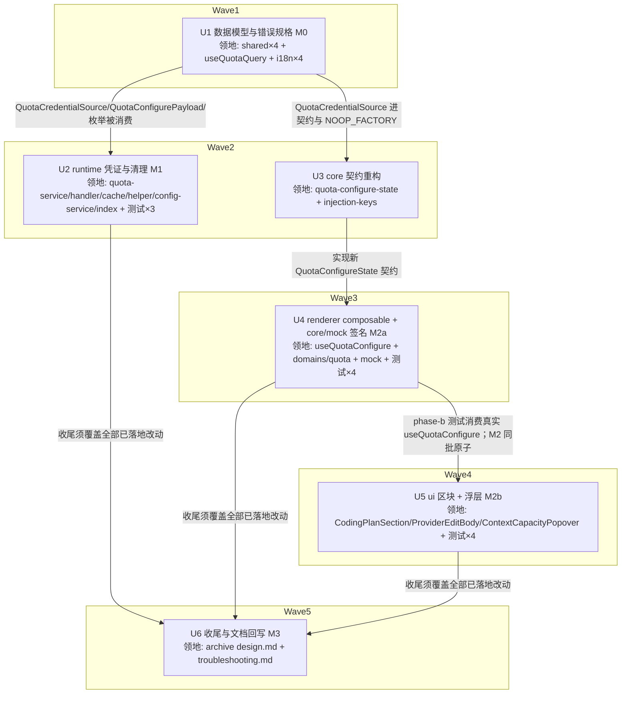

# Coding Plan 额度查询配置交互重构（方案 B）实施计划

基线: 4b42f85a2（设计 v8 终版） | 来源设计: [coding-plan-quota-config-ux.md](coding-plan-quota-config-ux.md) | 日期: 2026-09-10

> 审查证据：主审 [coding-plan-quota-config-ux.review.md](coding-plan-quota-config-ux.review.md)（r4 复审 0 must-fix）+ 影响面审 [coding-plan-quota-config-ux.impact-review.md](coding-plan-quota-config-ux.impact-review.md)（r7 复审 0 must-fix），均随 4b42f85a2 提交。

## 0 章节映射

| 内容 | 本文实际位置 |
|------|--------------|
| 背景/目标 | §1 背景：被设计的系统是什么；§2 设计目标（含 In-scope / Out-of-scope） |
| 终态/机制 | §5 终态：使用者眼里将是什么样的；§6 关键决策与权衡（D1-D13）；§7 实现机制（§7.1 契约 / §7.2 齐备性 / §7.3 runtime 改动 1-6 / §7.4 UI 改动 / §7.5 文件改动地图） |
| 验收场景表 | §8.2 验收场景（S1-S16，含 8 个反向场景；S5 探针为实施期门） |
| 下一层拆分 | §10 下一层拆分（U1-U6 + justification）；§9.1 迁移路径（M0-M3 分期） |
| 待验证检查点 | §11 待验证检查点（5 项，含 ⛔ 实施期门探针） |

## 1 目标快照（逐字摘录自设计 §2）

**改造后使用者在配置这个能力时，全程不需要猜测 —— 缺什么看得见、能不能测看得见、测的结果说得清、系统用的凭证就是界面上说的那份。**

1. **填参数时立刻知道还差什么**，不必先点一下按钮才知道错。
2. **一次点击完成「落盘 + 验证」**，不需要理解保存和测试的先后顺序。
3. **「启用」开关只表达「要不要在浮层里展示」**，不给它附加任何网络副作用。
4. **界面上说的凭证就是实际用的凭证**，任何时候都不出现「显示用 A、实际用 B」。
5. **不制造坏状态**：不产生「配置写进去了但永远查不到」，不把凭证写坏或静默删掉。

Out-of-scope：新增平台类型 / 修改任何 fetcher 的解析逻辑与端点；`ContextCapacityPopover` 的展示形态（成功态与无数据态不动）；额度缓存的 TTL / 10s throttle / pending 并发去重策略；provider 表单其余字段的「草稿 + 底部保存条」提交模型（D10）；`quota-cache.json` 的存储格式与磁盘清理。

## 2 单元列表

设计 §10 给出 U1-U6；本表把 §7.5 文件地图落到精确路径。单元与设计一一对应，不改拆分；派发批次见「批注」列（>5 文件的单元拆多批串行派发，单元仍一次 commit）。

| Unit | 职责 | 领地（精确文件路径） | 依赖 | 隔离 | 验收条款 | 批注 |
|---|---|---|---|---|---|---|
| U1 数据模型与错误规格（M0） | shared 枚举 `'no-credential'` + `QuotaCredentialSource` + `resolveQuotaCredentialSource` + `QuotaConfigurePayload`（protocol 引用）+ `ProviderInfo.quota.credentialSource` + renderer 穷举映射 + 双语 i18n key | `packages/shared/src/quota-types.ts` `packages/shared/src/provider.ts` `packages/shared/src/index.ts` `packages/shared/src/protocol.ts` `packages/renderer/src/composables/features/model/useQuotaQuery.ts` `packages/renderer/src/i18n/locales/zh-CN/settings.ts` `packages/renderer/src/i18n/locales/en-US/settings.ts` `packages/renderer/src/i18n/locales/zh-CN/panel.ts` `packages/renderer/src/i18n/locales/en-US/panel.ts` `packages/renderer/src/__tests__/i18n/quota-reason-i18n.test.ts` `packages/shared/src/__tests__/quota-credential-source.test.ts`（**2026-09-11 追溯授权**：按 shared `src/__tests__` 惯例新增，一致性审查 D-4 指出计划初版既未列领地也未登记偏差） | — | plain | ① `cd packages/shared && npx tsc --noEmit` 绿；② `cd packages/renderer && npx vue-tsc --noEmit` 绿（穷举映射漏 key = 编译错，即验证）；③ i18n 存在性测试 `npx vitest run src/__tests__/i18n/quota-reason-i18n.test.ts` 绿；④ protocol 的 `quota.configure` payload 类型改为引用 `QuotaConfigurePayload`（grep 可证）；⑤ 零行为变更：shared/renderer diff 仅类型、导出、文案 key | 2 批：t1 shared 4 文件 → t2 renderer 5 文件 |
| U2 runtime 凭证与清理（M1） | 设计 §7.3 改动 1-6：no-credential 返回；cookie 空串=清除；删除顺序重排与失败语义；按 `credentialSource` 解析（扩 `ProviderInfoLike.quota`）；`lastFailure`/`QuotaCache` 清理（`removeEntry`）；provider 删除清理钩子（三落点）；`credentialSource` 落盘继承链；`QuotaService.configure` 签名切 payload + handler 整对象透传（保留 providerId 防御校验） | `packages/runtime/src/services/quota-service.ts` `packages/runtime/src/transport/quota-message-handler.ts` `packages/runtime/src/services/provider-extras-store.ts` `packages/runtime/src/services/quota-cache.ts` `packages/runtime/src/services/provider-config-helper.ts` `packages/runtime/src/services/config-service.ts` `packages/runtime/src/index.ts` `packages/runtime/test/services/quota-service.test.ts`（扩既有 36 用例 + configure 签名机械更新） `packages/runtime/test/services/quota-cache.test.ts`（新建） `packages/runtime/src/services/__tests__/provider-config-helper.test.ts`（扩） `packages/runtime/src/services/__tests__/quota-service-workspace.test.ts`（configure 直调消费方，**2026-09-10 追溯授权**：计划初版漏列，签名切换不更新则 tsc 不可能绿） `packages/runtime/src/services/__tests__/provider-write-side-switch.test.ts`（**同上追溯授权**，8 处直调） | U1 | plain | ① `cd packages/runtime && npx tsc --noEmit` 绿；② `npx vitest run test/services/quota-service.test.ts` 绿，新增用例覆盖设计 §7.5 清单全项（no-credential / cookie 空串清除 / 按 source 解析 / lastFailure 清理 / 删除顺序 / credentialSource 继承链——setEnabled 式缺省 payload 不覆盖既存显式值 / 在途 fetch 守卫含「新类型首个 fetch 不被 throttle 压制」/ 失败路径节流不断）+ §7.5 分段验收 M1 形式（带 credentialSource 的 payload 直调 configure 断言 providers.json 落盘）；③ `npx vitest run test/services/quota-cache.test.ts` 绿（removeEntry 三语义：writeChain 串行化 / memoryCache 同步删 / 幂等）；④ `npx vitest run src/services/__tests__/provider-config-helper.test.ts` 绿（新增三排序用例：cleanProviderExtras 失败→主流程仍成功+secrets 保留；extras 成功+cleaner 失败→warn-only 惰性孤儿；三落点各一条）；⑤ handler configure 分支单 payload 整对象透传 + 保留 `!data.providerId` 防御（diff 可证） | 3 批：t1 核心（quota-service + extras-store + handler + quota-cache + cache 测试，5 文件）→ t2 删除链（helper + config-service + runtime index + helper 测试，4 文件）→ t3 quota-service 测试扩用例并全量跑绿收口 |
| U3 core 契约重构 | `QuotaConfigureState` 按设计 §7.1 重写（readiness / credentialSource / saveAndTest / setEnabled / 类型草稿 / 去掩码 / loadCached reason）；`NOOP_FACTORY` 完整字面量同步 | `packages/core/src/domain/settings/quota-configure-state.ts` `packages/ui/src/features/settings/injection-keys.ts` | U1 | plain | ① `cd packages/core && npx tsc --noEmit` 绿；② `cd packages/ui && npx vue-tsc --noEmit` 绿（NOOP_FACTORY 是契约完整字面量，漏成员即编译错，即验证）；③ 契约成员与设计 §7.1 列出的成员一一对应（审查面） | 1 批 |
| U4 renderer composable 重构（M2-a） | `useQuotaConfigure` 实现新契约（齐备性判定 + 凭证归属、saveAndTest 参数构造、setEnabled 无请求、类型进草稿且同值短路、去掩码、D9 十处硬编码中文 i18n 化、loadCached 修 reason）+ core `domains/quota.ts` / mock 的 `configure` 签名切 payload（M2 原子） | `packages/renderer/src/composables/features/model/useQuotaConfigure.ts` `packages/core/src/transport/api/domains/quota.ts` `packages/core/src/transport/mock/index.ts` `packages/renderer/src/__tests__/composables/use-quota-configure.test.ts`（重写） `packages/renderer/src/__tests__/api/quota-domain.test.ts`（更新） `packages/core/src/transport/api/__tests__/domains.test.ts`（更新） `packages/core/src/transport/mock/__tests__/mock-domains.test.ts`（更新，`:452` 位置参数断言改 payload 形） | U3 | plain | ① renderer `vue-tsc --noEmit` 绿 + core `tsc --noEmit` 绿；② `cd packages/renderer && npx vitest run src/__tests__/composables/use-quota-configure.test.ts` 绿（readiness 矩阵含 D13 判定/保存规则与 D5 同值短路、凭证归属、saveAndTest payload 构造、setEnabled 不发请求（mock client 断言零调用）、无掩码、configureError 走 i18n）；③ `npx vitest run src/__tests__/api/quota-domain.test.ts` + `cd packages/core && npx vitest run src/transport/api/__tests__/domains.test.ts src/transport/mock/__tests__/mock-domains.test.ts` 绿（payload 形状断言，mock-domains 改 `quota.configure({ providerId: 'p', enabled: true })`） | 2 批：t1 实现 3 文件 → t2 测试 4 文件 |
| U5 ui 区块重写 + 浮层入口（M2-b） | `CodingPlanSection` 按设计 §7.4 重写（未选类型态 D8 / 单按钮置灰 D1 / 分段控件 D3 / 字段级提示）；`ProviderEditBody` prop 拆分 + `providerCredentialPendingSave`；`ContextCapacityPopover` 失败态补「配置」（D11） | `packages/ui/src/features/settings/coding-plan/CodingPlanSection.vue` `packages/ui/src/features/settings/provider/ProviderEditBody.vue` `packages/renderer/src/components/panel/ContextCapacityPopover.vue` `packages/ui/src/features/settings/__tests__/coding-plan-section.test.ts`（重写） `packages/ui/src/features/settings/__tests__/provider-edit-body.test.ts`（更新） `packages/renderer/src/__tests__/settings/provider-edit-body-phase-b.test.ts`（更新，真实 composable 接线） `packages/renderer/src/__tests__/panel/context-capacity-quota.test.ts`（更新，失败态「配置」入口） | U4 | plain | ① ui `vue-tsc --noEmit` 绿 + renderer `vue-tsc --noEmit` 绿；② `cd packages/ui && npx vitest run src/features/settings/__tests__/coding-plan-section.test.ts` 绿（字段级提示 / 单按钮置灰矩阵 / 分段控件 / 未选类型只渲染下拉+说明）；③ `npx vitest run src/features/settings/__tests__/provider-edit-body.test.ts` 绿（prop 拆分）；④ `cd packages/renderer && npx vitest run src/__tests__/settings/provider-edit-body-phase-b.test.ts src/__tests__/panel/context-capacity-quota.test.ts` 绿（真实接线 / 失败态刷新+配置双按钮） | 2 批：t1 组件 3 文件 → t2 测试 4 文件 |
| U6 收尾与文档回写（M3） | 清残留硬编码中文（D9 终扫）、移除 U5 接线后无消费方的旧 prop（**验收条款 ①-⑤ 不含本项，实际 deferred 至 §7 风险 7**）、回写 `archive/v3/coding-plan-quota/design.md:322/339` [HISTORICAL] 标注与 `docs/troubleshooting.md`、设计附录 A 处置全部落地 | `docs/page-design/archive/v3/coding-plan-quota/design.md` `docs/troubleshooting.md` （若终扫发现残留：U1/U4/U5 领地内的 quota 相关源文件，属串行尾批无并行冲突） | U2,U4,U5 | plain | ① `grep -rn` 前端 quota 相关文件无硬编码中文错误消息残留；② design.md 322/339 行带 `[HISTORICAL]` 与指向本设计的引用；③ troubleshooting.md 有对应回写；④ `node scripts/check-doc-symbol-drift.mjs` 绿；⑤ `pnpm lint` 绿 | 1 批 |

**U3/U4/U5 合并为单个 M2 原子 commit**（设计 §9.1：`QuotaConfigureState` 三方共享 + `NOOP_FACTORY` 完整字面量，契约增删成员后消费方必须同批切换）。计划初版「串行落地于同一分支即满足同一 PR」**有误**——分开 commit 会留下 ui/renderer 编译红的中间态且被 pre-commit vue-tsc 拦截；修正为三个单元工作批次分离、**一次 commit 收口**（U5 额外依赖 U4 的真实 composable，phase-b 测试）。

## 3 DAG 图

关键路径 U1→U3→U4→U5→U6 深度 5：UI 栈（类型→契约→逻辑→视图→收尾）是**真串行链**——U5 的 phase-b 测试消费 U4 的真实实现、U6 终扫须在全部代码落地后——非纯平移场景，契约先行压扁不适用（设计是行为变更，无上游行为锚点）。宽度补偿：U2（本计划最大单元）与 U3/U4 前半并行。

## 4 测试策略

命令从各包 package.json scripts 实读；vitest 一律**从子包目录运行**（项目约定）。

**增量（单元开发期，每单元收口）**：

| 包 | typecheck | 单测 |
|---|---|---|
| shared | `cd packages/shared && npx tsc --noEmit` | `npx vitest run src/__tests__/quota-credential-source.test.ts`（**订正**：shared 有独立 vitest 基建——`vitest.config.ts` include `__tests__/**/*.test.ts` + `src/__tests__/**/*.test.ts`，`package.json` 的 `test: vitest run`，`src/__tests__` 下已有 22 个测试文件（基线）/ 23（HEAD），且被根 `pnpm test` 的 `--filter './packages/**'` 覆盖；一致性审查 D-4 订正） |
| core | `cd packages/core && npx tsc --noEmit` | `npx vitest run src/transport/api/__tests__/domains.test.ts src/transport/mock/__tests__/mock-domains.test.ts` |
| runtime | `cd packages/runtime && npx tsc --noEmit` | `npx vitest run test/services/quota-service.test.ts test/services/quota-cache.test.ts src/services/__tests__/provider-config-helper.test.ts src/services/__tests__/quota-service-workspace.test.ts src/services/__tests__/provider-write-side-switch.test.ts`（**订正**：后两个是 configure 直调消费方，签名切换同批机械更新，漏跑则断言方向变更无门可查） |
| renderer | `cd packages/renderer && npx vue-tsc --noEmit` | `npx vitest run src/__tests__/composables/use-quota-configure.test.ts src/__tests__/api/quota-domain.test.ts src/__tests__/settings/provider-edit-body-phase-b.test.ts src/__tests__/panel/context-capacity-quota.test.ts src/__tests__/i18n/quota-reason-i18n.test.ts` |
| ui | `cd packages/ui && npx vue-tsc --noEmit` | `npx vitest run src/features/settings/__tests__/coding-plan-section.test.ts src/features/settings/__tests__/provider-edit-body.test.ts` |

**全量（阶段 5 Gate A）**：根目录 `pnpm test`（--no-bail 全包）+ 各触包包 typecheck + `pnpm lint`。

**测试红线**（项目 AGENTS.md）：vitest（禁 node:test）；timer 测试用 fake timers；三视角缺一不可（每条用例至少一个用户可见 DOM 断言，ui/renderer 层）；runtime 测试禁触真实数据目录（写删目标必须 `mkdtempSync(join(tmpdir(), ...))`，既有 quota-service.test.ts 已是范本）。

**Gate B（阶段 5 真实场景）**：设计 §8.2 S1-S16，`pnpm run dev` + Playwright 连 9222 执行。机器可独立执行：S4/S5/S6/S8/S10/S13/S15（反向行为 + 状态机，不依赖有效凭证）与 S16（类型往返）。需真实凭证：S1/S2/S3/S11/S12/S14 的成功路径断言——dev 数据目录若无可用的智谱/小米/opencode 凭证，列为 blocked 上报用户，不伪造通过。

## 5 合理偏差登记表

| 编号 | 偏差 | 设计出处 | 判定为合理的理由 | 落地形态 |
|---|---|---|---|---|
| R1 | 改动 4 的 `lastFailure.delete` / `cache.removeEntry` 锚定 **persist 成功**，而非设计字面「configure 成功后」 | §7.3 改动 4 | secrets 段失败返回 error 但**不回滚 persist**（设计 §7.3「同窗口的半提交连带」段与设计附录 C 的 v5 条目「半提交连带登记（改动 2）」）；若清理延后到 secrets 之后，该路径会漏清理——persist 已提交新 fetcher 而旧类型缓存行仍在，旧行会以新类型标签展示（正是改动 4 要消除的现象） | `quota-service.ts:316-319`（清理块在 `ensureSecretsDir`(:323) 之前），注释写明判定依据。**注：初版实现把清理块排在 secrets 段三个早退之后，与 R1 声明不符（一致性审查 U-runtime-1 报出），已在阶段 4 修复并补半提交断言用例（mutation 验证：把清理块移回 secrets 之后 → 新用例变红），commit `ec6ea70ce`** |
| R2 | 存在性检查移进 `extrasStore.modify` 回调后，file-lock 的 `ensureFileExists` 在加锁前无条件物化空的 providers.json；两个「provider 不存在」用例的 extras 文件断言由 `false` 翻转为 `true`（并新增 `providers[pid] undefined` 断言） | §7.3 改动 2「provider 存在性检查移进 `extrasStore.modify` 回调内」段（标题与正确做法两处） | 物化机制是 file-lock 既有行为（`provider-extras-store.ts:86-103` 锁前 ensure），**但经本次改动在「拒绝保存」这条路径上变为可达**（旧检查在 `modify` 之前直接 return、从不触文件；订正自一致性审查 D-runtime-4——初版 R2 理由「非新增副作用」不准确）：新增副作用面 = 一次被拒绝的保存会创建一个空 providers.json；僵尸 quota 条目**未产生**（回调抛 ProviderGoneError → 写入跳过），正是该检查的目标 | quota-service.test.ts:266 区域 / provider-write-side-switch.test.ts:101 断言方向更新 |
| R10 | cookie 空串清除 / apiKey 清除 / `clearProviderState` 三处删除语义收敛为单一 helper `removeSecretFile` | §7.3 改动 2「两处必须一致」+ 改动 5「幂等：ENOENT 视为成功，不做 existsSync 预检」 | 三处一致性由「清单纪律」升级为「结构保证」（ENOENT/非 ENOENT 分支只有一处实现），未改变任何设计声明语义 | `quota-service.ts` 的 `removeSecretFile`（定义）与三处调用点（cookie 空串清除 / apiKey 清除 / `clearProviderState` 两连调）；**以符号名锚定**——本表行号随改动漂移，勿按号复核（第 2 轮聚焦复审订正：曾写的第三个调用点行号已再次漂移） |
| R11 | 收尾 helper 取「守卫 + `lastFetchTime` 单点、`cache.update`/`lastFailure` 以 commit 闭包由出口自带」形态（(而非把三件套全部内联进 helper） | §7.3 改动 4「五出口的守卫与三件套写收口为单一收尾 helper」 | 达成同一目标（新出口不经 helper 即不写时间戳，遗漏在结构里可见），且避免 helper 退化为按出口分支；守卫与时间戳对所有出口同构，故只这两项上提 | `quota-service.ts:626-640`（helper）、出口 ②-⑤ 各自传 commit 闭包 |
| R12 | fetcher 变更锚点 `prevFetcher` 显式在 **persist 之前**读，并注释说明读点不可后移 | §7.3 改动 4「若本次 fetcher 与既存值不同 → 清该 provider 的条目」 | 设计未规定读取时点；persist 后再读即新值、比较恒相等、清除永不触发（改动 4 完全失效）——是对设计意图的必要精确化 | `quota-service.ts:299`（读点，persist 之前）/ `:317-319`（比较 + `cache.removeEntry`）；行号已按 `ec6ea70ce` 位移后复核 |
| R3 | 既有用例断言方向随设计行为变更翻转（`no-credential` reason 断言、「专属 Key 优先」用例补 `quota.apiKeySet: true` mock、`persist 失败 → secrets 不触碰`、4 个用例补 `providerExists: () => true` 注入） | §7.3 改动 1/2（行为变更本身） | 每条都是设计行为变更的必然后果；mock 注入对齐生产形态（生产 index.ts:723 恒注入聚合层判定）；用例覆盖范围与断言目标未变 | U2-t1 deviations 逐条登记（quota-service.test.ts 等 3 文件） |
| R4 | `providerCredentialPendingSave` 实现为 **carry-in 可写 ref**（composable 不自算） | §7.4（证据来源 = provider 表单草稿 `form.apiKey`） | composable 工厂签名（U3 冻结）为 `(preset, providerRef)` 两参，看不到 provider 表单草稿；U3 契约文件不在 U4 领地，本批不可扩参。语义由 U5 接线达成 | 初始 false 的 ref；**U5-t1 已接线**：`ProviderEditBody.vue:365` import `API_KEY_CLEAR_SENTINEL`、`:477` `watch(form.apiKey, immediate)` 计算（排除哨兵）；U5-t2 补哨兵排除用例 |
| R5 | `workspaceConfigured` / `providerCredentialAvailable` / `quotaApiKeyConfigured` 实现为**基于 `providerRef` 快照的 computed** | §7.1 契约只要求 `Ref<T>` | `Readonly ComputedRef` 兼容 `Ref<T>`；派生消除「同一事实两份可变状态」的失真面（广播后自动跟随磁盘真相），语义与 §7.4/§11 的证据来源一致 | `useQuotaConfigure.ts` computed 派生 |
| R6 | `cleanProviderExtras` 在 **`extrasStore` 未注入**时返回 `false`（设计只定义了「删除成功/条目不存在 = true；IO 异常 = false」两态） | §7.3 改动 5（boolean 失败信号） | 无法确认 extras 标记已清时取保守方向（宁留一致残留，不造幽灵标记）；生产恒注入（`index.ts:285`），该分支仅测试可达；对既有直调删除链测试零行为影响 | `provider-config-helper.ts:1284`；三处落点共享 `cleanDeleteTail`（`:1307-1321`，设计 §7.3 明确许可抽共享尾函数） |
| R7 | 凭证来源分段控件用**两个既有 `Button` 组合**（ghost + `aria-pressed` + 选中态），未新增 ui 原语 | §7.4（分段控件） | `packages/ui/src/primitives` 无 Tabs/ToggleGroup，方案 B 的分段控件是新元件；用现有原语组合、视觉对齐 demo-b 的 `.seg`，避免为单点需求新增设计系统原语 | `CodingPlanSection.vue:89-115`（`role="group"` + 两个 `aria-pressed`，无原生表单元素） |
| R8 | 「已配置 / 必填」badge 用新 key `quotaConfiguredBadge` / `quotaRequiredBadge`，**未复用** cookie 专用的 `quotaCookieSet` / `quotaCookieNotSet` | §7.4（字段级提示） | 该 badge 同时用于 cookie / 专属 Key / workspace 三类字段，cookie 命名会误导；术语一致性优先 | 24 个新 locale key 的一部分（U5-t2 补齐；权威清单见 `provider-edit-key-existence.test.ts` 的 `NEW_UI_KEYS_REQUIRED`） |
| R9 | 类型下拉 update 事件加**运行时 guard**（`typeof value !== 'string'` 直接 return），替代 `String($event)` 强转 | 项目规范（禁 any / 断言须有运行时 guard） | `String(undefined)` 会产出 `"undefined"` 这一看似合法的类型值，让 readiness 误判为已选类型 | `CodingPlanSection.vue` 的 `onSelectFetcher` |

## 6 状态表

| Unit | 状态(pending/in-progress/committed/blocked) | 轮次 | 证据指针 |
|---|---|---|---|
| U1 | committed | 1 | t1: shared/core/runtime `tsc --noEmit` 三绿 + `quota-credential-source.test.ts` 5/5（新文件，按 shared `__tests__` 惯例条件授权）；t2: renderer `vue-tsc --noEmit` 绿（穷举映射完备即编译过）+ `quota-reason-i18n.test.ts` 8/8 + locale-sync 163/163；deviations 4+3 条全为注释级/边界声明，无机制偏离。commit `858fe45c5` |
| U2 | committed | 3 | t1（核心改动 1/2/3/4/6 + 签名切换 + 顺序重排）：runtime tsc 绿、5 文件 73/73；t2（删除链三落点 + `cleanDeleteTail` + 组合根回填 `index.ts:734`）：helper 39/39（+6）、回归 60/60 + 49/49；t3（13 条新用例）：quota-service 49/49、8 文件 167/167。五出口覆盖逐行登记（`finishFetch` 收口，`!fetcher`/失配不写）。commit `7304a152e` |
| U3 | committed | 1 | 契约移除 7 / 新增 7+1 逐条对 §7.1 两表；core tsc 绿；injection-keys 零错误（NOOP_FACTORY 完整字面量编译器级对齐）；消费方红仅 ProviderEditBody.vue（U5 领地，设计用编译错强制切换）。随 M2 原子提交 `66d415f41` |
| U4 | committed | 2 | t1（composable 重构 + core/mock 签名切 payload）：ProviderEditBody 外零编译错、readiness 逐条对 §7.2、payload 快照在 await 前（`:360-372`→`:376`）、setEnabled 双键（`:305`）**（行号已按 `0bd7b0487` 后的 HEAD 复核）**；t2（测试重写 + 修 2 条签名断言 + 补 2 个 i18n key）：core 整包转绿、core 96/96、renderer 44/44、locale-sync 163/163、165 个 key 引用 0 缺失。随 M2 原子提交 `66d415f41` |
| U5 | committed | 2 | t1（组件重写 3 文件，ProviderEditBody 7 条契约红清零、renderer vue-tsc 全绿、单按钮 `quota-save-test-btn` 就位、哨兵排除接线、D11 双按钮）：eslint 零输出、行数合规；t2（24 key 双语 + 4 测试文件收敛 + search-modal 存量红微修）：ui 77/77、renderer 198/198、**ui 与 renderer vue-tsc 双绿**。随 M2 原子提交 `66d415f41`（存量红微修独立提交 `82b31b736`） |
| U6 | committed | 1 | D9 终扫 13 个 quota 源文件零残留（未改源码）；prop/emit 逐条核消费：**计数属实**（CodingPlanSection 26 props/7 emits、ProviderEditBody 3 props/5 emits），但**有 3 个 prop 已无消费方**（`cookieSet` / `workspaceConfigured` / `quotaApiKeyConfigured`，见 §7 残留风险 7——该债务在 U6 之后由徽标/占位同源化引入，非 U6 未尽责）；附录 A 四处 `[HISTORICAL]` 标注逐条对上（design.md:322/339/340/382）+ troubleshooting.md 新增 §13；i18n 断言缺口补 2 条（171/171）；doc-symbol-drift 绿；ui+renderer vue-tsc 绿。commit `7f676e961` |

## 7 残留风险与变更历史

**残留风险**：

1. ~~设计 §11 检查点 5（存量幽灵文件差集探针）是 ⛔ 实施期门——U2 落地后跑一次性只读脚本对 dev 数据目录求差集，结果记入本节。~~ **已执行（U1 期，2026-09-10，只读探针）**：严格差集（quota 行存在 ∧ `apiKeySet` 未设 ∧ `*-apikey.txt` 文件在 = 升级后静默切 provider 凭据的集合）在 `~/.xyz-agent-dev` 与 `~/.xyz-agent` **均为空**；幽灵标记两向（`apiKeySet=true` 无文件 / `cookieSet=true` 无文件）均空。唯一残留：dev 目录存在 `zhipu-router-apikey.txt` 孤儿文件（provider 条目已不存在，属已删 provider 的 secrets 残留 = D12 修复的历史实例），新逻辑下无人读取（`'provider'` 来源不读该文件），惰性无害。**判定：无需编辑体提示，检查点关闭。**
2. ~~设计 §11 检查点 1（`provider.apiKeySet` 聚合不区分凭证类型）依赖 S11② 真实验证——若凭证不可得，登记为待验并上报。~~ **已关闭（2026-09-11 Gate B，隔离实例实测）**：S11② 用**等价构造**（幽灵态：`cookieSet=true` 但 secrets 文件缺失）实跑通过——查询报「未找到可用凭证。请在下方重新粘贴该平台的 Cookie 后重试」，与 S11①（凭证失效）「凭证可能已失效。请从浏览器重新复制该平台的 Cookie 粘贴后重试」**文案确实不同**，两者各指向真实控件。**未构造**：真正的「只有 OAuth 凭证的 provider + 只支持 api-key 的类型」——本数据目录 `auth.json` 仅有 api_key 条目，oauth 凭证不可自助获得（详见风险 3 的 Gate B 记录）。
3. ~~**Gate B 未执行（阻塞，需用户决策）**：`pnpm run dev` 所需端口 **1420 / 3310 / 9222 全部被另一个工作区的 dev 实例占用**……~~ **已执行（2026-09-11，隔离 dev 实例实测；S1-S16 逐条结果见下）**。
   **解阻塞方式（不打断用户其它工作区，无需新增产品代码）**：端口冲突的根因只有两处硬编码常量（`apps/electron/main/window/window-factory.ts` 的 `VITE_DEV_URL` 与 `packages/renderer/vite.config.ts` 的 `port: 1420`），而 runtime 端口本就有 `XYZ_AGENT_PORT_OFFSET`、数据目录本就有 `XYZ_AGENT_DATA_DIR`、dev 的 Electron userData 原为硬编码（会与另一个 dev 实例争单实例锁）。故**临时**改这两处（`VITE_DEV_URL` → 1421；userData 允许 env 覆盖）→ `pnpm run build:main` → **立即 `git checkout` 还原两文件**（补丁值固化在构建产物里，源码零残留，已用 `git status` 核对）→ `npx vite --port 1421` + `node scripts/dev-electron.mjs . --remote-debugging-port=9230`，配 `XYZ_AGENT_DATA_DIR=~/.xyz-agent-gateb-tmp`（真实 dev 数据目录的**副本**，含 `zai-coding-cn` / `xiaomi-token-plan-cn` / `OpenCode Go` 的真实凭证）、`XYZ_AGENT_PORT_OFFSET=101`（runtime 3311）。用 CDP 驱动真实 UI，逐场景**同时**观察 UI 与磁盘；跑完即停实例、删临时目录。
   **结果：S1 / S3 / S4 / S5 / S6 / S7 / S8 / S9 / S10 / S12 / S13 / S14 / S15 / S16 全部通过；S2 与 S11 部分通过（各有一条凭证依赖断言不可达）**：
   - **S1 PASS**：设置页类型自动匹配「智谱 GLM Coding Plan」、按钮**直接可点**（Provider 凭据继承生效）、点击后真实查询成功（`5h 4%`）；对话页 hover 容量 chip 显示同一数据（`3 窗口`）。磁盘 `pi/agent/config/providers.json` 的 `credentialSource` 落为 `provider`。
   - **S2 ◐ 状态机与落盘全通过，成功断言不可达**：未选 cookie 时按钮置灰 +「这里必须填 —— 该平台的额度接口只认 Cookie，没有继承路径」；粘贴 502 字节 cookie 后变亮、落 `secrets/xiaomi-token-plan-cn-cookie.txt`。该 cookie 为 2026-08-22 存留，平台返回凭证失效 → UI 显示「凭证可能已失效…」+「更新 Cookie」。**凭证不可自助获取**，故「显示本月用量」这一成功断言无法复现。
   - **S3 PASS**（真实接口）：opencode.go 只填 Cookie 时按钮仍置灰且 Workspace 提示存在；两项齐备后查询成功（`5h 3% · 本周 60% · 本月 30%`）。
   - **S4 PASS**：按钮 `disabled` 为真，Playwright 可操作性检查持续重试至超时（无法点击）——期间 `providers.json` / `quota-cache.json` mtime 与内容零变化。
   - **S5 PASS**：开关 OFF→ON 两次，`enabled` 即时落盘 `false`→`true`；`quota-cache.json` 的 mtime 与全部 `lastFetchAt` **逐字节不变**（mtimeMs 完全相同，无新增 fetch）。额外验证：`fetcher` / `credentialSource` 未被偷偷写入 → §7.2「`setEnabled` 不走参数构造表」成立。
   - **S6 PASS**：重进编辑体后 Cookie 输入框为空 + 徽标「已配置」、按钮可点；**不做修改**直接点保存后，cookie 文件 SHA256 **逐字节不变** = 真 cookie 未被空草稿覆盖。
   - **S7 PASS**：先留未提交草稿再切类型 → 草稿被清空、按钮置灰、Cookie 与 Workspace 双提示；补 opencode 真实 cookie + workspace 保存后，`secrets/xiaomi-token-plan-cn-cookie.txt` 内容 = 新 cookie（哈希与源文件一致）= 归属确实切换。
   - **S8 PASS**：点选「当前已选类型」，草稿保留、两个 json 与 secrets 零变化（同值短路守卫成立）。
   - **S9 PASS**：①专属 Key（真实 key）保存并测试**成功**；②把专属 Key 改成明显错误串后切「用 Provider 凭据」→ 查询**仍成功**、`secrets/zai-coding-cn-apikey.txt` **仍然存在**（未被删）、`credentialSource` 落为 `provider` = runtime 确实没用专属 Key；③切回「用专属 Key」**无需重新粘贴**即可点，placeholder 变「已配置，输入新值可覆盖」。
   - **S10 PASS**：未选类型时只渲染下拉 + 一句「先选一个查询类型，下面的参数会按类型自动变化。」；开关 / 凭证区 / 分段控件 / 按钮 / readyHint **均不渲染**。
   - **S11 ◐**：①通过（失效 cookie →「凭证可能已失效…」+「更新 Cookie」按钮）；②用等价构造通过（见风险 2）。**附带观察**：zhipu 的 api-key 填错时被 fetcher 归类为 `no-subscription`（文案「未检测到有效订阅…」）而非 unauthorized——属 fetcher 层既有的平台映射，**非本次引入**，不在本设计范围。
   - **S12 PASS**：失败态浮层显示「查询失败：未找到可用凭证，请到设置页检查额度查询配置」，footer 内「刷新」与「配置」**同容器成组**（`quota-footer-actions`）；点「配置」打开设置页供应商视图。
   - **S13 PASS**：S1-S3、S7 各跑一轮后再做 **5 轮类型切换 + 保存**——前后 `providers.json` `version: 1` 完好、**无 `.tmp` / `.corrupt-*`**、secrets 无空文件且数量不增长；重启应用后对话页浮层正常且数据刷新。
   - **S14 PASS**：自定义 provider 配好 cookie 后删除 → `secrets/GateB Mimo Probe-cookie.txt` **不存在**（对照现状会残留）；同名重建后编辑体显示「Cookie · 必填」、按钮置灰 = 不继承旧 cookie。
   - **S15 PASS**：手动清空 Workspace → 按钮置灰 +「这里必须填 —— 额度挂在具体 workspace 下…」，**不产生**任何 `quota.configure` 写入，已保存的 Workspace 未被删除（对照 v1 设计的空串=清除）。
   - **S16 PASS**：mimo → opencode.go → mimo：按钮**恢复可点**、cookie 文件哈希不变（作废只在判定层、不是销毁层）；opencode 变体：往返后 Workspace 输入框**仍显示已保存 URL**。
   **凭证依赖项已按用户裁定关闭（2026-09-11，免真实凭据测试，改代码等价性核对）**：S2 的成功断言与 S11② 的原构造需要「当前有效」的 MiMo cookie / oauth 凭证，用户裁定不再补测。等价性证据三层：① runtime `resolveCredential`（`quota-service.ts:704`）的收窄条件 `source === 'exclusive' && supportsExclusiveCredential(auth)` 对不含 api-key 的形态（mimo `['cookie']` / oauth-only `['oauth']`）**不命中**，落回 `:708` 按 auth 数组序解析的 for 循环——该循环本批零改动，与基线逐字一致；② renderer readiness 常态（credentialSource 未设置 → 推断 `apiKeySet ? 'exclusive' : 'provider'`）走 provider 分支，该分支与 cookie 分支本批零改动；③ 唯一行为差异在 **ghost exclusive 显式值**场景（老数据物化的 `credentialSource: 'exclusive'`）：基线会误要求专属 Key（cookie 类永远没有 → 误阻断保存）、oauth-only 会显示 runtime 不采纳的「用专属 Key」选项；新行为不渲染选项 + readiness 落回 provider 凭据判定——这正是残留 11 / D3 要消灭的「UI 说用 A、runtime 实际用 B」，属设计内修复非回归。测试撑腰：runtime oauth-only mock fetcher 用例、design-code-sync 第 2 轮 a-2 反例探针（5 内置 fetcher 形态行为等价、cookie/provider 来源未误伤）、ui `authKinds: ['oauth']` 反向用例。**全程零 mock**。
4. ~~**U1-t2 发现的前批遗留缺口**：`quota-reason-i18n.test.ts` 的两个断言数组历史上就不含 `not_configured` 的 key（`quotaFetchFailNotConfigured` / `quotaFailNotConfigured`——locale 双侧存在但断言数组缺）→ 归 U6 终扫批补齐。~~ **已关闭（U6，commit `7f676e961`）**：两个 key 补入断言数组，`quota-reason-i18n.test.ts` 8/8 + locale-sync 163/163 绿。
5. ~~**ui 包存量编译红（疑似与本设计无关，U3 期发现）**：`packages/ui/src/overlays/__tests__/search-modal.test.ts:386/391/396` 三处 TS18048。~~ **已关闭（独立微修 commit `82b31b736`）**：逐字节确认与 HEAD 相同 = 存量红，用运行时 guard 修复，ui vue-tsc 整包转绿。
6. ~~**设计阶段 demo 资产的存量 lint 红**（U6 期发现，Gate A 阻塞项）：`docs/design/coding-plan-quota-ux.demo.js:120`（`onChange` 未使用）+ `:155`（短路表达式语句）两个 error，由设计批 `8766d71d3` 引入、非本次实现代码。~~ **已关闭（commit `bdfbca78a`）**：`scenarioBar` 的无用形参删除（调用点本就单参，活跃回调通道是 `bindScenario` 的 `onChange`）、短路表达式改 `if`、并发现在 `demo-a.html` 的同类 `isDirty` 零引用一并清理；行为等价性用 vm 载入新旧两版逐字节对比证明；demo 全部资产 eslint 零 error（一致性审查 C 区 D-2 订正本条为已关闭）。
7. ~~**三个 prop 已无消费方但仍声明**（阶段 4 徽标/占位同源化后的 deferred 项）：`cookieSet` / `workspaceConfigured` / `quotaApiKeyConfigured` 在 `CodingPlanSection.vue:295` 等仍有声明并带 `[保留]` 注释……~~ **已关闭（2026-09-11 残留清理批次）**：`CodingPlanSection.vue` 的 3 个 prop 声明 + 2 个默认值 + 各自 `[保留]` JSDoc 全部删除，`ProviderEditBody.vue` 的 3 处调用点（`:quota-api-key-configured` / `:workspace-configured` / `:cookie-set`）与 2 处 composable 解构一并删除；注释里指向已删 prop 的悬空描述改写为真实数据源 `provider.quota.{cookieSet,apiKeySet,workspace}`。composable 契约（`QuotaConfigureState`）与 `injection-keys.ts` 的对应成员**未动**（仍属契约面）。验证：ui 整包 vue-tsc 绿、`coding-plan-section.test.ts` + `provider-edit-body.test.ts` 绿、`node scripts/check-doc-symbol-drift.mjs` 零悬空符号。
8. ~~**`typecheck:test` 不被任何 gate 执行**（阶段 4 发现，影响契约门的持久性）…… **接线位置（需协调者决定，本次未改 CI/钩子）**：① `.githooks/install-hooks.sh:156`；② `.github/workflows/ci.yml` typecheck job；③ `scripts/pr-pre-merge.sh:187`。~~ **已关闭（2026-09-11 残留清理批次，三处全接）**：① `.githooks/install-hooks.sh` 在 renderer `vue-tsc --noEmit` 之后、同一「有 renderer .vue/.ts 变更」条件块内追加 `-p tsconfig.typecheck-test.json`（失败输出「测试桩与生产契约漂移」+ 既有原则句 + `exit 1`）；② `.github/workflows/ci.yml` typecheck job 追加 `TypeCheck - renderer tests`；③ `scripts/pr-pre-merge.sh` 追加 `run_step typecheck:renderer-tests`。**已重跑 `bash .githooks/install-hooks.sh`** —— 共享 pre-commit（`.bare/hooks/pre-commit`）现含该段（实测增量约 5.6s：默认 vue-tsc 7.1s → 合计约 12.7s）。
9. ~~**零引用 i18n key 的清理面**（阶段 4 扫描所见，未删、未逐个人工复核）……~~ **已关闭（2026-09-11 残留清理批次）**：逐 key 核实（字面全路径引用 + 5 类动态构造形式穷举：模板插值 / 字符串拼接 / `te`·`tm` / locale 对象遍历 / 间接 key 字段）后删除 **97 个确认死键**（`panel.*` 91 个 + `settings.providerEdit.*` 6 个，zh-CN 与 en-US **同号对称删除**，各文件 0 新增）。**订正**：plan 记的命名空间 `settings.panel.*` 不存在，真实命名空间是**顶层 `panel.*`**（`locales/*/panel.ts`）；数量 98 → 实测 91（净化后扫描面更宽），providerEdit 6 → 删 6 留 1。**保留 1 个（后已删）**：`settings.providerEdit.addTitle` 仅被 `settings-i18n.test.ts` 的断言引用、无 UI 消费方 → 当时保守保留并登记进守卫 allowlist（删它需同批改该测试断言，超出本批最小面）；**已按用户裁定删除（2026-09-11 优化批次）**——locale zh/en + 两行断言 + guard ALLOWLIST 清空（现为恒空数组）。**动态可达 0 个**（逐条排除记录见变更历史）。**新增反向守卫** `locale-key-usage-guard.test.ts`：断言两命名空间叶子全部被生产源码引用（或登记在带 reason 的显式 allowlist），含防空集合恒绿下界、allowlist 必须与实际零引用集合精确相等（防橡皮图章）、错误信息给两种处置；**mutation 已证**（临时加 `panel.__tmpGuardProbe` 即红，删回即绿）。验证：`src/__tests__/i18n/` 9 文件 204 用例绿（含 locale-sync 163）、renderer 全量 383/4110 绿、ui 58/652 绿、core 116/1784 绿、renderer vue-tsc 绿、全仓 `eslint . --max-warnings 0` 零输出。**同批清扫**：`zh-CN/settings.ts` 的「Provider 编辑弹窗（ProviderEditModal）」注释与现状不符 → 改为「手风琴就地编辑（R4 · 取代 ProviderEditModal）」（与 en-US 同段口径对齐）。
10. ~~**三个 renderer 测试文件仍不能纳入 typecheck include**（阶段 4 发现）~~ **已关闭（2026-09-11 残留清理批次）**：三个文件（`settings-modal-smoke.test.ts` / `settings-modal-skill-dirs.test.ts` / `PluginContributionsPage.test.ts`）的基线类型漂移逐条正面修复并**纳入 `tsconfig.typecheck-test.json` include**。实际报错 9 条（登记症状与文件对应关系已漂移）：三文件**共同**缺 `setScopedModels`（依据 `core/src/domain/settings/transport.ts`）、四处多余 `ipc: null`（依据 `core/src/platform/port.ts` 的 `PlatformPort` 只有 `kind/storage/webSocket`；`ipc` 属另一契约 `ConnectionPorts`）、`SkillDirConfig` 缺必填 `scope`（依据 `shared/src/provider.ts` v2 字段）、smoke 的未使用 `wrapper`（`noUnusedLocals`）。修复方向一律「测试桩对齐当前真实契约」，**零** `as any` / `@ts-ignore` / `eslint-disable`，未改生产类型定义。验证：`vue-tsc --noEmit -p tsconfig.typecheck-test.json` 绿（约 4.3-5.7s）、默认 `vue-tsc --noEmit` 仍绿、三文件 vitest 6/6 绿。**残余**：`typecheck:test` 仍是窄契约门——只编译 include 显式列出的 7 项，其余 renderer 测试文件不在编译期覆盖内。
11. ~~**UI 与 runtime 对「专属 Key 是否适用」的判据不同（潜在耦合，当前触发面 0）**……~~ **已关闭（2026-09-11 残留清理批次，改为共用判据函数）**：shared 新增并导出 `supportsExclusiveCredential(auth)`（判据 = `auth?.includes('api-key') ?? false`，带 JSDoc 说明「两端必须共用，否则 UI 显示用专属 Key 而 runtime 忽略」），三处消费同一函数——runtime `resolveCredential` 的 exclusive 收窄、renderer `useQuotaConfigure.readiness` 的专属 Key 分支（条件改为 `credentialSource === 'exclusive' && supportsExclusiveCredential(authKinds)`，不适用时落回 provider 凭据判定）、UI `CodingPlanSection.vue` 的 `exclusiveApplicable` computed（分段控件与专属 Key 块的门控）。测试：shared 谓词 6 条用例（`['api-key']`/`['api-key','oauth']` → true；`['cookie']`/`['oauth']`/`undefined`/`[]` → false）、runtime 新增纯 oauth mock fetcher 用例（exclusive 不被采纳、按 auth 数组序解析）、ui 新增 `authKinds: ['oauth']` 不渲染分段控件与专属 Key 块的反向用例。**未覆盖**：renderer 侧无法用真实 preset 构造「非 cookie 且不含 api-key」场景（`QUOTA_PRESETS` 是跨包 SSOT，硬造即失真），该行为由 shared 谓词单测 + ui 反向用例覆盖。
12. ~~**根 `pnpm test` 对 `apps/electron` 静默零执行**（Gate A 系统性发现，长期盲区，非本设计引入）~~ **已关闭（2026-09-11 残留清理批次）**：根脚本 `--filter './apps/**'` 选中了该包，但它只有 `test:main` / `test:all`、没有 `test`，于是 51 文件 / 913 用例长期不被根命令覆盖。补齐 `"test": "pnpm run test:main"`（**不**挂 `test:all`，否则 frontend/runtime 会被递归重跑）。验证：`pnpm --filter @xyz-agent/electron run test` → 51 文件 / 913 用例绿（约 116s，其中 `updater-script-integration` 单文件占 115.7s，mac 专属）；本批全量 `pnpm test` 已实际跑到该包（见变更历史）。
13. **`.xyz-harness/i18n-audit/panel.md` 的 7 条悬空建议**（2026-09-11 残留清理批次发现，**登记不修改**）：该 2026-07-14 审计报告「建议补 key」列出的 `panel.bgNotify.patchHint` / `panel.message.subagent` / `panel.overlay.subagent` / `panel.overlay.agentCall` / `panel.queue.itemCount` / `panel.subagent.toolCount` / `panel.subagent.multiSummary` 已随本批死键清理删除 → 成为指向不存在 key 的历史建议。**不改写理由**：`.xyz-harness/` 是决策追溯归档，改写它等于改写当时的分析结论，与本计划对 `.xyz-harness/coding-plan-quota/HANDOFF.md` 的处理口径一致。**恢复路径**：无需恢复——需要当前 key 面时以 `locale-key-usage-guard.test.ts` 的 allowlist 与 locale 文件为准。

**变更历史**：

- 2026-09-10 计划创建（基线 4b42f85a2）。与设计 §10 的两处计划级澄清（非偏差，是精确化）：① 测试清单中 `quota-service.test.ts` / `provider-config-helper.test.ts` 实为**扩既有文件**（36 用例 / 既有文件），`quota-cache.test.ts` 为新建；② D9 十处硬编码中文的**执行点归 U4**（文件即 U4 重写对象），U6 保留终扫职责（设计 §10 把「清硬编码中文」写在 U6，§7.5 文件地图与 D9 行号证明其实际落点在 U4 领地）。
- 2026-09-10 **M2 原子性修正（U3 期发现）**：U3/U4/U5 由「串行三次 commit」改为**单次原子 commit**——契约与消费方分开提交会留下编译红中间态并被 pre-commit 拦截，与设计 §9.1「M2 必须原子」一致。单元工作批次不变，状态表三者同轮收口。
- 2026-09-10 U3 验收条款②「ui vue-tsc 绿」按原子性修正重述为「injection-keys/quota-configure-state 自身零错误 + ui 红仅剩 U5 领地的 ProviderEditBody.vue」（消费方红是设计用编译错强制切换的机制，非缺陷）。
- 2026-09-10 **U2 领地追溯授权 + 落批裁决（U2-t1 上报 blockers）**：① `quota-service-workspace.test.ts` / `provider-write-side-switch.test.ts` 两个 configure 直调消费方补入 U2 领地（机械签名更新，不补则 tsc 不可能绿）；② 设计 §7.3 改动 2 的「删除顺序重排（先校验计算 → persist → 成功后写/删 secrets）+ provider 存在性检查移进 `extrasStore.modify` 回调」归 U2（计划 U2 职责行「删除顺序重排与失败语义」本已声明），指派原 dev 会话续聊定向实施，随附既有「persist 失败 → secrets 不回滚」用例断言方向翻转。
- 2026-09-11 **阶段 3 一致性审查（4 分区并行）**：runtime / shared+core / renderer / ui 各一名审查者，区间 `62a9651e5..HEAD`。共报出 11 条不合理项（去重后 8 项：runtime 清理锚点、runtime 删除×在途回写、v1 契约测试桩、徽标归属、死 key 与守卫反向、cookie 变体无守卫、时序断言缺口、preset 未命中分支、D11 footer 分组）+ 15 条文档类错误；另确认 30 余条实现与设计一致项。
- 2026-09-11 **阶段 4 修复循环**（按领地分组并行，落地 commit 逐个可查）：
  - `ec6ea70ce` runtime 清理锚点移到 persist 成功之后（+ 半提交断言，mutation 验证）
  - `664969ed7` 写侧推断理由纠正（shared JSDoc + runtime 注释 + 可证伪场景 C）
  - `04d433361` 徽标与 readiness 同源（+ 三条反向用例）、preset 未命中按类型缺失、时序约定回归用例（mutation 验证）
  - `4114b1b27` 删 19 个死 key（双语 190→171 对齐）+ 新增 key 存在性守卫（双向证伪）
  - `bb110e010` 四处 v1 契约测试桩收敛到带类型标注的 `makeQuotaStateStub`
  - `f51474d83` D11 footer 按钮成组（+ 结构断言）
  - `33482f636` stub 纳入 `tsconfig.typecheck-test.json`（证伪 TS2741）
  - 文档面 `a306cbffc` / `655be0434`：设计 §4.2 表 A 两行、§5.2 路径 3 文案动作、§7.2 preset 分支、§7.3 改动 6 反例与残余窗口、§7.4 徽标规则与 oauth 行移除、§7.5 编译门与守门描述、§9.1 术语；计划 §4 shared 测试基建、§5 R1/R2 订正与 R10-R12 新增、残留风险 7-10。
  - 未修复转登记：`panel.*` 约 98 个疑似零引用 key（需独立核实）、`typecheck:test` 未接入任何 gate（三处接线位置）、两个无消费方 prop（跨领地）、三个测试文件的基线类型漂移。
- 2026-09-11 **阶段 4 第 3 轮定向复审 + 后续修复**（收敛判定：第 3 轮 **0 unreasonable**，6 条残留逐条经 mutation 验证修复）：
  - `4779133da`（**行为变更**）：preset 未命中 → `readiness.missing=['type']` 不再判 ready；D8 判据收敛为 `typeUndetermined = !fetcherId || missing.includes('type')`（参数区在该态不渲染）；「已配置/必填」徽标与专属 Key placeholder 全部改由 `readiness.missing` 派生 —— 消除「类型切换后徽标已配置 + 提示必填」同屏矛盾与其在 placeholder 的残留
  - `08036093f` / `0bd7b0487`：runtime persist 处与 renderer composable 的 JSDoc 按「物化未设置字段」口径改写（此前四处副本已由 `664969ed7` 改其三）
  - `26a2d1be3` / `60f912cc1` / `3552dfe2e` / `bfe29ce82`：locale D8 注释用词、设计 §7.2/§6.9/§7.4 收敛表述、设计 v4 变更历史订正、计划 R10/R12 行号与风险 9 命令措辞
  - 状态表回写：`d158aa86a`（U1-U5 committed）、`c3dab3b13`（U6 + 风险 4/5 关闭）、`0ce4bdcaf`（阶段 3/4 记录）
- 2026-09-11 **阶段 5 Gate A（全量测试验收，报告结论冻结于 `26a2d1be3`）**：**全绿** —— 1604 测试文件 / 20706 用例通过、0 失败；`pnpm lint` 零 warning；12 个包 typecheck（含 `packages/renderer` 的 `typecheck:test`）全绿；`pnpm extensions:typecheck` / `extensions:lint` 绿；`scripts/validate-runtime-bundle.sh` 绿（含 7 项 Plugin E2E）；另**手工补跑** `apps/electron/main` 51 文件 / 913 用例绿。发现并已回流修复：`b551c6c0a`（移除 1 处新增 eslint-disable —— 改为规则认可的 catch 体内注释；补 `clearProviderState` 三个直调用例含 mutation 验证；补 handler 整对象透传形状断言）。**系统性发现（长期盲区，非本次引入）**：根 `pnpm test` 的 `--filter './apps/**'` 因 `apps/electron` 无 `test` 脚本而静默零执行；`typecheck:test` 不被任何 gate 执行（风险 8）。
- 2026-09-11 **design-code-sync 第 1 轮**（审查基线 = HEAD 终态全量，四条审查关系分两区并行）：共 22 条 finding —— **must-fix 5**（a-1 设置页失败文案指向不存在的按钮、a-2 `exclusive` 在 kimi-coding 上静默回退 OAuth、b-1 风险 7 少记一个 prop、b-2 §6 U6 证据与风险 7 互斥、b-3 变更历史缺 15 个 commit）、suggestion 10、info 7。**方向分布**：改代码 2 条（a-1 文案 / a-2 行为，commit `c57e86fca`，均带 mutation 验证）、改注释 4 条（`639f48d85`）、改文档 16 条（`59f8e511e` 等）。全部当轮修完，**无 contested 项**（a-2 的相反论点「auth 数组代表平台能力」与 D3 的公开承诺冲突，审查者已给裁决理由，未升级用户）。
  - a-2 要点：收窄点上移到 `resolveCredential`（形态选择层），条件 `source==='exclusive' && auth.includes('api-key')`，cookie 类与 `provider` 来源不受影响；设计侧同步在 v9 变更历史与 §7.3 改动 3 登记。
  - 新增的「行号锚定约定」（设计 v9）：正文 `file:line` 是写作时快照，本 PR 自身改动使其漂移，**符号名才是权威锚**；v9 起新内容优先「符号名 + 章节」锚定。
- 2026-09-11 **design-code-sync 第 2 轮（聚焦复审，两区并行；结论：终止）**：**代码侧 0 unreasonable / 0 doc_errors**（6 条修复全部成立；a-2 经独立 mutation + 6 个反例探针验证：cookie 类与 `provider` 来源未被误伤、try/catch 降级完整、5 个内置 fetcher 形态下行为等价）；**文档侧 11 条确认修复 + 5 条 suggestion/info + 5 条 doc_errors**，已在 `16d59ad29` / `d8a3a2483` 当轮全部修完（a-3 补修 §7.5 三处残留的失实归因、a-7 core typecheck 真实执行点、a-8 §3 章加基线声明、de-1 补全 19 key 清单、de-5 桩收敛口径 3+1、c-1/c-2/de-4 行号与锚点）。**依 SKILL 终止条件：本轮 must-fix == 0 → 收敛交付**，不为 suggestion/info 单独循环。
  - 第 2 轮新登记（不构成缺陷）：UI 与 runtime 对「专属 Key 是否适用」的判据不同（见残留风险 11）。
- 2026-09-11 **历史归档残留（登记不修改）**：`.xyz-harness/coding-plan-quota/HANDOFF.md` 的 `:200`/`:232` 仍写「3 个 RPC（quota.fetch/getCached/configure）」（实为 4 个，含 `quota.refresh`）。该文件是**点位交接快照**（属决策追溯归档），改写它等于改写历史记录；且不在本次任何单元领地内。**恢复路径**：无需恢复——新读者以 `quota-message-handler.ts` 的模块头为准（已在 d-1 修正）。
- 2026-09-11 **凭证依赖缺口收口（用户裁定免测）+ 残留 9 补漏**：风险 3 的 S2 成功断言与 S11② 原构造按用户裁定不再追有效凭证，以代码等价性核对关闭（正常路径与基线逐字一致；唯一差异 = ghost exclusive 态收敛，属残留 11 设计目的，见风险 3 登记处）。同批发现并正面修复：残留 9 的注释清扫只落了 zh-CN——`en-US/settings.ts:307` 外层段注释仍写「Provider edit dialog (ProviderEditModal)」→ 补改为 Accordion 口径（zh/en 对称，与 `:151` 内层注释同款）。
- 2026-09-11 **两项保守保留项按用户裁定优化**：① 删除 `settings.providerEdit.addTitle`（残留 9 唯一的 allowlist 豁免随之清空：locale zh/en + `settings-i18n.test.ts` 两行断言 + guard ALLOWLIST 恒空；renderer i18n 10 文件 208 用例绿，allowlist 与实际零引用集合的精确相等检查在空集下通过）；② `CodingPlanSection.authKinds` 改**必传**（prop 为 `fae315b33` 引入的旧可选契约，`[]` 默认会让漏传调用方的凭证来源分段控件 / 专属 Key 块 / oauth·cookie 分支静默塌缩；唯一调用方 `ProviderEditBody.vue:229` 与 `coding-plan-section.test.ts` mountSection、`provider-edit-body.test.ts` stub 均已在传 `authKinds`，零调用方改动；ui vue-tsc 整包 + renderer vue-tsc 绿，ui 2 文件 85 用例绿）。
- 2026-09-11 **残留清理批次（本轮：残留 2 / 3 / 7 / 8 / 9 / 10 / 11 全部关闭，新增登记 12 已关闭、13 保留）**：
  - `7deec87e1`（残留 7 + 11，10 文件 +178/−65）：shared 新增 `supportsExclusiveCredential` 并三处共用；UI 移除 3 个零消费 prop 及其调用点与悬空注释。测试：shared 11 用例、runtime quota-service 55 用例（含纯 oauth fetcher 反例）、renderer composable 42 用例、ui 10 文件 177 用例；`node scripts/check-doc-symbol-drift.mjs` 零悬空符号。
  - `fdc677e7d`（残留 9，5 文件 +173/−221）：删 97 个零引用 key（`panel.*` 91 + `settings.providerEdit.*` 6，双侧同号）+ 新增 `locale-key-usage-guard.test.ts`（含 allowlist 精确相等与防空集合下界断言），mutation 红→绿已证；同批订正 zh-CN 区块注释口径。
  - `72faa6fe6`（残留 8 + 10 + 新增 12，8 文件 +56/−12）：`typecheck:test` 接入 pre-commit / ci.yml / pr-pre-merge 三处；3 个测试文件的基线类型漂移按真实契约修好并纳入 include；`apps/electron` 补 `test` 脚本（913 用例回到根命令覆盖面）。
  - **派发方式**：三个互不重叠的领地并行派 subagent（各带三段式 task + 禁 git 写操作 + 必须跑增量测试），主 agent 只做协调、裁决、文档回写与提交。
  - **Gate B 解阻塞**（详见残留 3）：不改产品代码——临时补丁两处硬编码常量（`VITE_DEV_URL` / dev userData）→ build main → 立即 `git checkout` 还原 → 用 `XYZ_AGENT_DATA_DIR`（真实 dev 数据的副本）+ `XYZ_AGENT_PORT_OFFSET=101` + `vite --port 1421` + `--remote-debugging-port=9230` 起隔离实例，CDP 驱动实跑 16 个场景。
  - **本轮发现并已修复的基建缺陷（非本设计引入）**：pre-commit hook 在 bare repo + worktree 布局下是**共享单槽**资源，任何 worktree 的 `pnpm install`（prepare → `install-hooks.sh`）都会按**该分支模板**重写它；若重写发生在另一个正在执行的 hook 中间，bash 按字节偏移懒读会读到错位内容，报出与真实代码无关的随机错误（实测两次：`line 871: syntax error near unexpected token 'then'`、`line 140: cho: command not found`；三个不同字节数 65100 / 66987 / 67901 对应三个 worktree 的模板，且每份单独 `bash -n` 均通过 → 证明是运行中被替换而非静态语法错）。修法（长期方案，随本批提交）：生成物开头加自保护段——把自己复制成私有副本再 `exec`，运行中的字节流不再受后续重写影响，副本退出自删（`72faa6fe6`）。**残余**：安装态仍会被其它 worktree 的 install 覆盖（这是共享单槽的固有属性），只是不再破坏正在执行的 hook；若要让各 worktree 用各自的 hook 模板，需改成「稳定分发器 + 仓库内 per-worktree 模板」的两段式，属独立架构议题，本次不展开。
  - **验证面**：`pnpm lint` 零 warning；`check-doc-symbol-drift` 绿；全量 `pnpm test`：除 runtime `logger.test.ts > size 轮转` 一条在**并行全量**下失败（单跑该文件 8/8 绿、runtime 单包 5237 用例 0 失败 → 判为并行 I/O 下的 flake，非本批引入）外全部通过；renderer 383/4110、ui 58/652、core 116/1784、apps/electron 51/913 均绿。
